# 《PLC技术与应用》教学设计（16次课）

> **Canonical source / 内容权威源**：本 Markdown 与 `images/`、`manifest.json` 共同构成教案语义主源。Word 仅由本源包编译，负责学校格式呈现。

## 课程基本信息
- **课程名称**：PLC技术与应用
- **课程英文名称**：PLC Technology and Applications
- **课程代码**：25JD32411
- **课程类别**：专业类
- **课程性质**：选修课
- **授课学期**：第6学期
- **学分**：2
- **总学时**：32（理论16，上机16）
- **适用专业**：智能制造工程
- **授课学院**：机械与动力工程学院
- **先修课程**：电工电子技术（A）、电工电子技术实验、微机原理及接口技术
- **后续课程**：先进装备系统设计与开发（ROS）、智能制造装备、毕业设计（论文）
- **选用教材**：廖常初.《S7-1200 PLC编程及应用（第5版）》[M]. 北京：机械工业出版社，2026. ISBN 9787111797647
- **课程评价**：总评成绩=平时成绩20%＋课程作业20%＋期末综合考查60%
- **内容依据**：2025版目录现行大纲（大纲更新时间：2026年9月）

## 课程总体设计
课程建立“电气与I/O—扫描运行—逻辑编程—顺序控制—监控通信—调试验收”的知识主线，以S7-1200为教学载体，LAD为主要编程语言，FBD用于对照，SCL只承担简单条件分支和数据处理。16次课×2课时=32学时，理论8次课共16学时，上机8次课共16学时。四个上机项目均严格按现行大纲各4学时拆为两次课：工程组态与基本逻辑控制、模块化顺序控制、模拟量/HMI与接口数据、输送分拣单元联调与诊断。所有实训默认在TIA Portal、S7-PLCSIM及HMI仿真环境中完成；涉及真实设备时，未经教师确认不得上电、强制输出或修改保护逻辑，普通PLC程序互锁不替代独立急停和硬件安全保护。

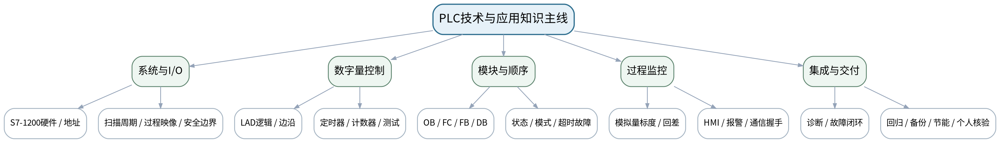

### 课次总览
| 次数 | 课型 | 理论/上机分配 | 单元/项目 | 授课题目 | 主要评价 |
|---:|---|---|---|---|---|
| 1 | 理论 | 理论2课时 | 第一单元 PLC系统、扫描原理与安全边界 | PLC系统组成、I/O、扫描周期与安全边界 | 平时成绩＋课程作业（上机一25%模块前置）＋期末综合考查 |
| 2 | 上机 | 上机2课时（上机一前半） | 上机一 工程组态与基本逻辑控制 | TIA Portal工程组态、I/O与输送启停控制 | 课程作业上机一（25%）前半＋期末综合考查 |
| 3 | 理论 | 理论2课时 | 第二单元 基本指令与数字量控制 | LAD位逻辑、置复位、边沿与扫描级行为 | 平时成绩＋课程作业上机一理论支撑 |
| 4 | 理论 | 理论2课时 | 第二单元 基本指令与数字量控制 | IEC定时器、计数器、比较运算与控制时序 | 平时成绩＋课程作业上机一理论支撑 |
| 5 | 上机 | 上机2课时（上机一后半） | 上机一 工程组态与基本逻辑控制 | 延时、批量计数与上机一边界验收 | 课程作业上机一（25%）完成＋期末综合考查 |
| 6 | 理论 | 理论2课时 | 第三单元 程序结构与顺序控制 | OB、FC、FB、DB与模块化PLC程序设计 | 平时成绩＋课程作业上机二前置 |
| 7 | 理论 | 理论2课时 | 第三单元 程序结构与顺序控制 | 状态转换、手自动模式、超时故障与SCL入门 | 平时成绩＋课程作业上机二前置 |
| 8 | 上机 | 上机2课时（上机二前半） | 上机二 模块化顺序控制 | 状态表驱动的FC/FB/DB模块化实现 | 课程作业上机二（25%）前半＋期末综合考查 |
| 9 | 上机 | 上机2课时（上机二后半） | 上机二 模块化顺序控制 | 超时、故障复位、模式切换与回归测试 | 课程作业上机二（25%）完成＋期末综合考查 |
| 10 | 理论 | 理论2课时 | 第四单元 模拟量与过程监控基础 | 模拟量标度、限幅、回差与PID概念 | 平时成绩＋课程作业上机三前置 |
| 11 | 理论 | 理论2课时 | 第五单元 HMI与设备通信入门 | HMI变量、报警、PROFINET/Modbus TCP与握手语义 | 平时成绩＋课程作业上机三前置 |
| 12 | 上机 | 上机2课时（上机三前半） | 上机三 模拟量、HMI与接口数据 | 模拟量标度、回差报警与趋势验证 | 课程作业上机三（25%）前半＋期末综合考查 |
| 13 | 上机 | 上机2课时（上机三后半） | 上机三 模拟量、HMI与接口数据 | HMI组态、报警、握手与接口失联测试 | 课程作业上机三（25%）完成＋期末综合考查 |
| 14 | 理论 | 理论2课时 | 第六单元 系统集成、诊断与交付 | 需求追踪、监控诊断、故障定位与工程交付 | 平时成绩＋课程作业上机四前置＋期末综合考查 |
| 15 | 上机 | 上机2课时（上机四前半） | 上机四 输送分拣单元联调与诊断 | 输送分拣系统集成、正常流程与故障注入 | 课程作业上机四（25%）前半＋期末综合考查60% |
| 16 | 上机 | 上机2课时（上机四后半） | 上机四 输送分拣单元联调与诊断 | 故障修复、回归测试、节能比较与最终工程交付 | 课程作业上机四（25%）完成＋期末综合考查60%核心验收 |

## 第1次课 PLC系统组成、I/O、扫描周期与安全边界

### 课次信息
- **章节/单元**：第一单元 PLC系统、扫描原理与安全边界
- **周次**：按实际课表填写
- **课时安排**：2课时（100 min）
- **课型**：理论
- **理论/上机分配**：理论2课时

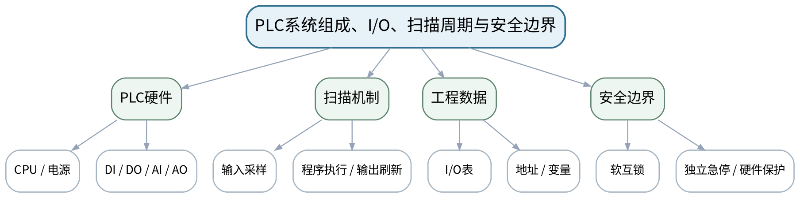

### 教学目标
**知识目标：**
1. 理解PLC组成、CPU/电源/信号模块、数字量与模拟量I/O的基本关系。
2. 理解扫描周期、过程映像、程序执行顺序与保持性概念，并区分普通控制与独立安全保护。

**能力目标：**
1. 能够根据物料输送分拣任务列出输入/输出对象并形成初步I/O表。
2. 能够用时序图解释输入变化为何可能在不同扫描周期产生不同程序结果。

**价值目标：**
1. 形成接线有据、地址可核、安全优先以及普通PLC逻辑不替代急停/安全回路的工程意识。

### 课程思政
以误接线、意外再启动和“软件逻辑不能替代独立安全保护”为案例，强化规范识图、隔离检查和工程安全责任。

### 专创融合
把I/O表视为控制系统的最小接口合同，训练从设备需求到可编程接口的工程产品化思维。

### 教学重难点
**教学重点：**PLC系统组成、扫描运行机制与I/O映射。

**教学难点：**把电气对象、地址、变量、扫描时序和安全边界关联起来，避免把软件停机逻辑误当成功能安全。

### 教学方法与用具
**教学方法：**问题驱动法、时序推演法、状态建模法、教师演示法、任务驱动法、预测—运行—验证法、测试验收与故障复盘

**教学用具：**电脑、投影仪、PLC硬件结构图、S7-1200手册节选、白板。

### 教学设计
课前任务 → 互动导入（10 min）→ 传授新知与课堂训练（75 min）→ 过关检测（10 min）→ 课堂小结（3 min）→ 作业布置（1 min）→ 考勤（1 min）

### 课前任务
【教师】发布“PLC系统组成、I/O、扫描周期与安全边界”对应大纲/教材范围和一个最小控制问题，不提前给出完整程序答案。

1. 阅读对应大纲与教材内容；
2. 圈出3个关键术语并记录至少1个疑问；
3. 预读一段LAD/状态表/时序或设备接口说明，写出预期结果与至少一个疑问。

【学生】完成准备并带着“预期状态/疑问/已有证据”进入课堂。

### 互动导入
【教师】给出“按钮按下后电机为何可能不是立即动作”的问题，让学生先画输入—扫描—输出时序，再讨论PLC与普通继电器控制的差异。

【学生】先独立预测/画时序/状态，再与同伴交换判断依据；教师收集典型分歧后进入本课。

### 传授新知与课堂训练
**一、核心原理与工程案例（约30 min）—系统与I/O**

【教师】分析S7-1200典型硬件组成、数字量/模拟量I/O、电源与信号方向；以输送线电机、传感器、按钮和报警灯建立I/O清单。

【学生】先完成时序、状态、I/O或接口推演并写出判断依据，再对照教师演示/程序结果修正。

**二、学生时序/状态/接口推演（约25 min）—扫描与过程映像**

【教师】用一轮扫描图解释输入采样、OB执行、输出刷新和保持变量；比较短脉冲、持续信号对程序观察结果的差异。

【学生】先完成时序、状态、I/O或接口推演并写出判断依据，再对照教师演示/程序结果修正。

**三、对比、验证与错误复盘（约20 min）—安全边界**

【教师】通过急停、接触器、热保护和软件互锁案例区分控制逻辑、设备保护和独立安全回路，明确仿真与实机的操作边界。

【学生】先完成时序、状态、I/O或接口推演并写出判断依据，再对照教师演示/程序结果修正。

**独立学习产物**：一张物料输送分拣单元I/O初表＋一张PLC扫描时序图。

**学习证据**：I/O对象/类型/地址草表、扫描周期推演、普通控制与安全保护边界说明。

**评价映射**：平时成绩＋课程作业（上机一25%模块前置）＋期末综合考查；目标1.1、2.1、3.1。

### 过关检测
【教师】组织当堂检测：

1. PLC一个扫描周期通常包含哪三个核心阶段？
2. 过程映像与物理输入/输出之间是什么关系？
3. 为什么PLC程序中的STOP/互锁不能替代独立急停？

【学生】独立作答/推演/运行验证；【教师】按错误类型讲解，要求说明时序、状态、I/O或测试依据。

### 课堂小结
【教师】回到本课知识脉络图，用“需求/I/O—扫描/状态—程序—监控/测试—故障/边界—交付”总结“PLC系统组成、I/O、扫描周期与安全边界”，再次强调教学重点：PLC系统组成、扫描运行机制与I/O映射。

【学生】写下“本课一条最重要的控制规则 + 一个最容易忽略的边界”。

### 作业布置
【教师】布置课后任务：完善输送分拣单元I/O表，标明信号类型、常态和安全相关说明；预习TIA Portal工程建立流程。

【学生】按课程文件命名与证据要求整理提交；仿真、接口模拟和真实设备验证必须明确区分。

### 考勤
【教师】利用学校/课程实际使用的平台进行签到。

【学生】按课程要求完成签到。

### 课后教学反思
【课后填写，不预填事实】

1. 教学流程：记录100 min各环节实际用时、理论/上机切换及调整点；
2. 教学内容：重点记录“把电气对象、地址、变量、扫描时序和安全边界关联起来，避免把软件停机逻辑误当成功能安全。”的真实掌握证据和常见错误；
3. 学生参与：仅依据实际课堂记录填写时序推演、LAD编程、状态/接口设计、仿真调试和讨论情况，不补写推测；
4. 评价证据：检查本课工程、I/O/状态/变量表、监控数据、故障记录、测试与版本说明是否完整，记录缺项原因；
5. 后续改进：依据真实课堂证据决定下一次课的补救、复现或拓展。

### 本章节参考文献
[1] 廖常初.《S7-1200 PLC编程及应用（第5版）》[M]. 机械工业出版社，2026。
[2] 方贵盛, 王红梅.《电气控制与S7-1200 PLC应用教程》[M]. 机械工业出版社，2025。

## 第2次课 TIA Portal工程组态、I/O与输送启停控制

### 课次信息
- **章节/单元**：上机一 工程组态与基本逻辑控制
- **周次**：按实际课表填写
- **课时安排**：2课时（100 min）
- **课型**：上机
- **理论/上机分配**：上机2课时（上机一前半）

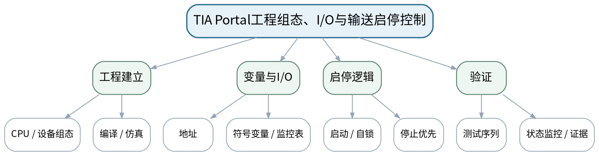

### 教学目标
**知识目标：**
1. 理解S7-1200仿真工程、设备组态、符号变量和监控表之间的关系。
2. 掌握LAD常开/常闭触点、线圈、自锁与停止优先的基本逻辑。

**能力目标：**
1. 能够建立可编译的S7-1200工程，录入I/O变量并实现输送电机启停/自锁。
2. 能够使用PLCSIM和监控表按测试序列验证启动、停止、重复启动和再启动条件。

**价值目标：**
1. 形成先核对地址与测试条件再运行、仿真结果如实标注、禁止未经确认接入真实负载的习惯。

### 课程思政
严格区分仿真与实机；未经教师确认不得上电、强制输出或修改真实保护逻辑，任何失败必须真实记录。

### 专创融合
把PLC工程、变量表和测试序列作为可复现控制软件最小交付包，训练配置—代码—证据一体化。

### 教学重难点
**教学重点：**TIA工程建立、符号变量、LAD启停自锁和监控验证。

**教学难点：**保证变量—地址—I/O表一致，并用测试序列验证逻辑而不是只看一次“能跑”。

### 教学方法与用具
**教学方法：**问题驱动法、时序推演法、状态建模法、教师演示法、任务驱动法、预测—运行—验证法、测试验收与故障复盘

**教学用具：**机房、TIA Portal V18或课程兼容版本、S7-PLCSIM、课程I/O任务书。

### 教学设计
课前任务 → 互动导入（10 min）→ 传授新知与课堂训练（75 min）→ 过关检测（10 min）→ 课堂小结（3 min）→ 作业布置（1 min）→ 考勤（1 min）

### 课前任务
【教师】发布“TIA Portal工程组态、I/O与输送启停控制”对应大纲/教材范围和一个最小控制问题，不提前给出完整程序答案。

1. 阅读对应大纲与教材内容；
2. 圈出3个关键术语并记录至少1个疑问；
3. 检查TIA Portal/S7-PLCSIM/HMI仿真环境、上一阶段工程和任务文件是否可用；未经教师确认不得连接真实负载、强制输出或修改保护逻辑。

【学生】完成准备并带着“预期状态/疑问/已有证据”进入课堂。

### 互动导入
【教师】展示一个把启动按钮和停止按钮地址写反的工程，要求学生先从I/O表找问题，再观察程序逻辑是否“看起来正确”。

【学生】先独立预测/画时序/状态，再与同伴交换判断依据；教师收集典型分歧后进入本课。

### 传授新知与课堂训练
**一、任务说明与工程/逻辑骨架（约20 min）—工程组态**

【教师】建立S7-1200仿真工程、CPU与项目结构，创建符号变量和I/O表，执行编译并消除地址/类型错误。

【学生】按任务约束独立/小组实现，先写预期状态/时序再运行；用监控表或仿真验证，保留工程、参数、故障信息和测试证据。

**二、学生独立/小组实现（约35 min）—启停实现**

【教师】学生独立完成输送电机启动、自锁、停止优先逻辑；教师只给验收条件，不直接给完整网络。

【学生】按任务约束独立/小组实现，先写预期状态/时序再运行；用监控表或仿真验证，保留工程、参数、故障信息和测试证据。

**三、测试、调试与证据固化（约20 min）—监控与测试**

【教师】用PLCSIM/监控表执行启动—保持—停止—重复启动—断电/恢复模拟测试，保存状态截图或监控记录。

【学生】按任务约束独立/小组实现，先写预期状态/时序再运行；用监控表或仿真验证，保留工程、参数、故障信息和测试证据。

**独立学习产物**：S7-1200仿真工程v1＋I/O表＋启停LAD网络＋测试记录。

**学习证据**：工程归档、变量表、编译结果、至少5步输入序列、预期/实际输出和一条修正记录。

**评价映射**：课程作业上机一（25%）前半＋期末综合考查；目标1.1、2.1、3.1、1.2、2.2、3.2。

### 过关检测
【教师】组织当堂检测：

1. 为什么推荐用符号变量而不是到处直接写绝对地址？
2. 停止优先在LAD网络中如何体现？
3. 仿真通过能否证明真实安全回路满足要求？

【学生】独立作答/推演/运行验证；【教师】按错误类型讲解，要求说明时序、状态、I/O或测试依据。

### 课堂小结
【教师】回到本课知识脉络图，用“需求/I/O—扫描/状态—程序—监控/测试—故障/边界—交付”总结“TIA Portal工程组态、I/O与输送启停控制”，再次强调教学重点：TIA工程建立、符号变量、LAD启停自锁和监控验证。

【学生】写下“本课一条最重要的控制规则 + 一个最容易忽略的边界”。

### 作业布置
【教师】布置课后任务：整理工程v1并写README：CPU/环境、I/O、运行步骤、仿真边界；预习置复位、边沿、定时/计数。

【学生】按课程文件命名与证据要求整理提交；仿真、接口模拟和真实设备验证必须明确区分。

### 考勤
【教师】利用学校/课程实际使用的平台进行签到。

【学生】按课程要求完成签到。

### 课后教学反思
【课后填写，不预填事实】

1. 教学流程：记录100 min各环节实际用时、理论/上机切换及调整点；
2. 教学内容：重点记录“保证变量—地址—I/O表一致，并用测试序列验证逻辑而不是只看一次“能跑”。”的真实掌握证据和常见错误；
3. 学生参与：仅依据实际课堂记录填写时序推演、LAD编程、状态/接口设计、仿真调试和讨论情况，不补写推测；
4. 评价证据：检查本课工程、I/O/状态/变量表、监控数据、故障记录、测试与版本说明是否完整，记录缺项原因；
5. 后续改进：依据真实课堂证据决定下一次课的补救、复现或拓展。

### 本章节参考文献
[1] 廖常初.《S7-1200 PLC编程及应用（第5版）》[M]. 机械工业出版社，2026。
[2] 方贵盛, 王红梅.《电气控制与S7-1200 PLC应用教程》[M]. 机械工业出版社，2025。

## 第3次课 LAD位逻辑、置复位、边沿与扫描级行为

### 课次信息
- **章节/单元**：第二单元 基本指令与数字量控制
- **周次**：按实际课表填写
- **课时安排**：2课时（100 min）
- **课型**：理论
- **理论/上机分配**：理论2课时

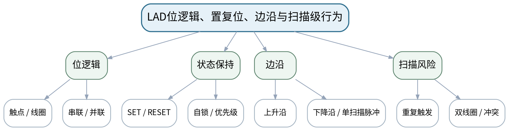

### 教学目标
**知识目标：**
1. 掌握LAD触点/线圈、串并联逻辑、置位/复位和上升/下降沿检测。
2. 理解扫描顺序、重复触发和复位优先对输出状态的影响。

**能力目标：**
1. 能够把继电器控制关系转换为LAD逻辑并用时序表推演扫描级行为。
2. 能够识别双线圈、置复位冲突、短脉冲漏检等典型逻辑风险。

**价值目标：**
1. 形成先分析时序和优先级再编程、以边界测试替代偶然运行成功的质量意识。

### 课程思政
通过重复触发和冲突逻辑案例强调程序质量需要可解释时序和可复现测试，不以“当前看起来能用”代替验证。

### 专创融合
把LAD网络视作设备行为规则，通过明确状态和触发语义提高控制逻辑可维护性。

### 教学重难点
**教学重点：**位逻辑、置复位、边沿及扫描顺序。

**教学难点：**解释“看似同一逻辑”在不同网络顺序/保持方式下为何产生不同扫描结果。

### 教学方法与用具
**教学方法：**问题驱动法、时序推演法、状态建模法、教师演示法、任务驱动法、预测—运行—验证法、测试验收与故障复盘

**教学用具：**电脑、投影仪、TIA Portal示例、时序图模板。

### 教学设计
课前任务 → 互动导入（10 min）→ 传授新知与课堂训练（75 min）→ 过关检测（10 min）→ 课堂小结（3 min）→ 作业布置（1 min）→ 考勤（1 min）

### 课前任务
【教师】发布“LAD位逻辑、置复位、边沿与扫描级行为”对应大纲/教材范围和一个最小控制问题，不提前给出完整程序答案。

1. 阅读对应大纲与教材内容；
2. 圈出3个关键术语并记录至少1个疑问；
3. 预读一段LAD/状态表/时序或设备接口说明，写出预期结果与至少一个疑问。

【学生】完成准备并带着“预期状态/疑问/已有证据”进入课堂。

### 互动导入
【教师】给出一个计数按钮长按时连续计数的现象，要求学生判断问题在按钮还是“边沿语义”缺失。

【学生】先独立预测/画时序/状态，再与同伴交换判断依据；教师收集典型分歧后进入本课。

### 传授新知与课堂训练
**一、核心原理与工程案例（约30 min）—逻辑与保持**

【教师】用启动/停止、报警确认、故障锁存讲触点、线圈、SET/RESET和复位优先，比较自锁与保持位。

【学生】先完成时序、状态、I/O或接口推演并写出判断依据，再对照教师演示/程序结果修正。

**二、学生时序/状态/接口推演（约25 min）—边沿与时序**

【教师】从机械按钮长按/传感器持续遮挡出发讲上升沿、下降沿和单扫描脉冲，学生手工推演时序。

【学生】先完成时序、状态、I/O或接口推演并写出判断依据，再对照教师演示/程序结果修正。

**三、对比、验证与错误复盘（约20 min）—反例分析**

【教师】分析双线圈、置复位同扫描冲突、网络顺序和短脉冲问题，要求给出可执行测试序列。

【学生】先完成时序、状态、I/O或接口推演并写出判断依据，再对照教师演示/程序结果修正。

**独立学习产物**：三组LAD逻辑推演卡＋边沿/置复位测试序列。

**学习证据**：LAD草图、扫描时序、输入序列、预期状态和风险说明。

**评价映射**：平时成绩＋课程作业上机一理论支撑；目标1.2、2.2、3.2。

### 过关检测
【教师】组织当堂检测：

1. 长按按钮时为什么需要边沿检测来实现“只计一次”？
2. SET/RESET与普通线圈最大的状态差别是什么？
3. 同一变量在多个网络写入为什么危险？

【学生】独立作答/推演/运行验证；【教师】按错误类型讲解，要求说明时序、状态、I/O或测试依据。

### 课堂小结
【教师】回到本课知识脉络图，用“需求/I/O—扫描/状态—程序—监控/测试—故障/边界—交付”总结“LAD位逻辑、置复位、边沿与扫描级行为”，再次强调教学重点：位逻辑、置复位、边沿及扫描顺序。

【学生】写下“本课一条最重要的控制规则 + 一个最容易忽略的边界”。

### 作业布置
【教师】布置课后任务：完成3个时序推演题：停止优先、报警锁存、边沿计数；每题给出至少一个边界测试。

【学生】按课程文件命名与证据要求整理提交；仿真、接口模拟和真实设备验证必须明确区分。

### 考勤
【教师】利用学校/课程实际使用的平台进行签到。

【学生】按课程要求完成签到。

### 课后教学反思
【课后填写，不预填事实】

1. 教学流程：记录100 min各环节实际用时、理论/上机切换及调整点；
2. 教学内容：重点记录“解释“看似同一逻辑”在不同网络顺序/保持方式下为何产生不同扫描结果。”的真实掌握证据和常见错误；
3. 学生参与：仅依据实际课堂记录填写时序推演、LAD编程、状态/接口设计、仿真调试和讨论情况，不补写推测；
4. 评价证据：检查本课工程、I/O/状态/变量表、监控数据、故障记录、测试与版本说明是否完整，记录缺项原因；
5. 后续改进：依据真实课堂证据决定下一次课的补救、复现或拓展。

### 本章节参考文献
[1] 廖常初.《S7-1200 PLC编程及应用（第5版）》[M]. 机械工业出版社，2026。
[2] 方贵盛, 王红梅.《电气控制与S7-1200 PLC应用教程》[M]. 机械工业出版社，2025。

## 第4次课 IEC定时器、计数器、比较运算与控制时序

### 课次信息
- **章节/单元**：第二单元 基本指令与数字量控制
- **周次**：按实际课表填写
- **课时安排**：2课时（100 min）
- **课型**：理论
- **理论/上机分配**：理论2课时

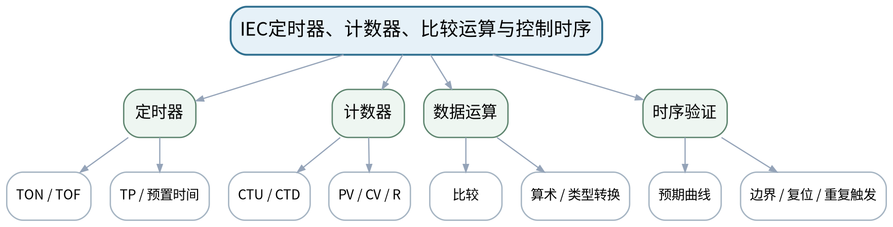

### 教学目标
**知识目标：**
1. 掌握TON/TOF/TP等常用IEC定时器、CTU/CTD计数器及比较/基本运算。
2. 理解预置值、当前值、复位、数据类型和扫描调用对定时计数结果的影响。

**能力目标：**
1. 能够为延时启动、脉冲输出、批量计数等任务选择定时/计数结构并画出时序。
2. 能够设计正常、边界、重复触发和复位测试。

**价值目标：**
1. 形成时间/容量边界有据、复位逻辑明确、参数变更需复测的工程习惯。

### 课程思政
通过时间边界、容量边界和复位优先训练严谨的时序责任意识，参数调整必须留下复测证据。

### 专创融合
把定时/计数参数视为可配置控制产品参数，明确参数、状态和测试接口。

### 教学重难点
**教学重点：**IEC定时器/计数器与时序验证。

**教学难点：**理解不同定时器触发/复位语义和计数边沿，防止把参数或扫描行为想当然。

### 教学方法与用具
**教学方法：**问题驱动法、时序推演法、状态建模法、教师演示法、任务驱动法、预测—运行—验证法、测试验收与故障复盘

**教学用具：**电脑、投影仪、TIA Portal示例、时序图。

### 教学设计
课前任务 → 互动导入（10 min）→ 传授新知与课堂训练（75 min）→ 过关检测（10 min）→ 课堂小结（3 min）→ 作业布置（1 min）→ 考勤（1 min）

### 课前任务
【教师】发布“IEC定时器、计数器、比较运算与控制时序”对应大纲/教材范围和一个最小控制问题，不提前给出完整程序答案。

1. 阅读对应大纲与教材内容；
2. 圈出3个关键术语并记录至少1个疑问；
3. 预读一段LAD/状态表/时序或设备接口说明，写出预期结果与至少一个疑问。

【学生】完成准备并带着“预期状态/疑问/已有证据”进入课堂。

### 互动导入
【教师】给出“传感器连续保持3秒才报警”和“每经过一个工件计数一次”两个任务，要求学生先判断一个需要持续条件、一个需要边沿事件。

【学生】先独立预测/画时序/状态，再与同伴交换判断依据；教师收集典型分歧后进入本课。

### 传授新知与课堂训练
**一、核心原理与工程案例（约30 min）—定时器语义**

【教师】用延时启动、保持延时和单脉冲案例讲TON/TOF/TP，画输入、Q、ET时序。

【学生】先完成时序、状态、I/O或接口推演并写出判断依据，再对照教师演示/程序结果修正。

**二、学生时序/状态/接口推演（约25 min）—计数与运算**

【教师】讲CTU/CTD、PV/CV/R、比较与批量判断，结合边沿计数避免长信号重复累加。

【学生】先完成时序、状态、I/O或接口推演并写出判断依据，再对照教师演示/程序结果修正。

**三、对比、验证与错误复盘（约20 min）—测试设计**

【教师】针对T=0、临界时间、重复启动、计数上限、复位与参数修改，学生写测试序列和预期。

【学生】先完成时序、状态、I/O或接口推演并写出判断依据，再对照教师演示/程序结果修正。

**独立学习产物**：定时/计数时序图＋批量控制逻辑设计表。

**学习证据**：输入时序、预期Q/ET/CV、边界测试、参数/数据类型说明。

**评价映射**：平时成绩＋课程作业上机一理论支撑；目标1.2、2.2、3.2。

### 过关检测
【教师】组织当堂检测：

1. TON与TP的Q输出行为有什么关键差异？
2. 计数器为什么通常需要边沿事件？
3. 修改预置时间/计数值后为什么需要回归测试？

【学生】独立作答/推演/运行验证；【教师】按错误类型讲解，要求说明时序、状态、I/O或测试依据。

### 课堂小结
【教师】回到本课知识脉络图，用“需求/I/O—扫描/状态—程序—监控/测试—故障/边界—交付”总结“IEC定时器、计数器、比较运算与控制时序”，再次强调教学重点：IEC定时器/计数器与时序验证。

【学生】写下“本课一条最重要的控制规则 + 一个最容易忽略的边界”。

### 作业布置
【教师】布置课后任务：完成一个“延时启动+批量5件后停止”逻辑设计，写出至少6步测试序列。

【学生】按课程文件命名与证据要求整理提交；仿真、接口模拟和真实设备验证必须明确区分。

### 考勤
【教师】利用学校/课程实际使用的平台进行签到。

【学生】按课程要求完成签到。

### 课后教学反思
【课后填写，不预填事实】

1. 教学流程：记录100 min各环节实际用时、理论/上机切换及调整点；
2. 教学内容：重点记录“理解不同定时器触发/复位语义和计数边沿，防止把参数或扫描行为想当然。”的真实掌握证据和常见错误；
3. 学生参与：仅依据实际课堂记录填写时序推演、LAD编程、状态/接口设计、仿真调试和讨论情况，不补写推测；
4. 评价证据：检查本课工程、I/O/状态/变量表、监控数据、故障记录、测试与版本说明是否完整，记录缺项原因；
5. 后续改进：依据真实课堂证据决定下一次课的补救、复现或拓展。

### 本章节参考文献
[1] 廖常初.《S7-1200 PLC编程及应用（第5版）》[M]. 机械工业出版社，2026。
[2] 方贵盛, 王红梅.《电气控制与S7-1200 PLC应用教程》[M]. 机械工业出版社，2025。

## 第5次课 延时、批量计数与上机一边界验收

### 课次信息
- **章节/单元**：上机一 工程组态与基本逻辑控制
- **周次**：按实际课表填写
- **课时安排**：2课时（100 min）
- **课型**：上机
- **理论/上机分配**：上机2课时（上机一后半）

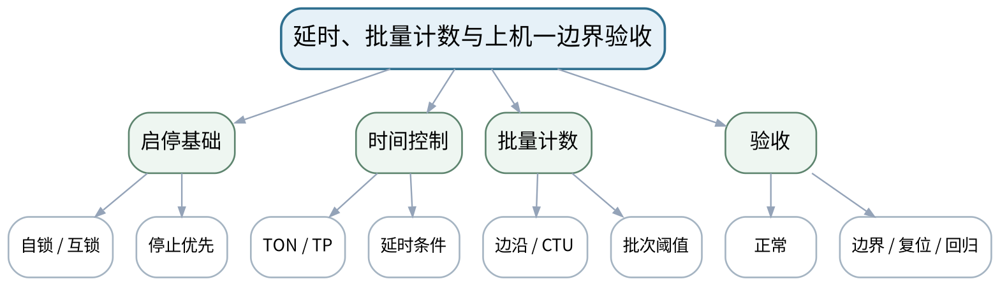

### 教学目标
**知识目标：**
1. 巩固自锁互锁、边沿、定时器、计数器与比较指令在同一工程中的组合。
2. 理解正常、边界、重复命令和复位测试如何组成基本验收。

**能力目标：**
1. 能够在工程v1基础上完成输送延时、传感器计数与批量停止。
2. 能够用监控表验证停止优先、短脉冲/持续信号、计数复位和再次启动条件。

**价值目标：**
1. 形成以测试记录证明逻辑、修改后必须回归、失败记录不删改的工程质量意识。

### 课程思政
把失败与复测作为工程证据，禁止只保留“最后成功截图”；仿真测试必须标明仿真环境。

### 专创融合
将上机一功能封装为后续输送分拣综合系统的基础控制模块，训练可迭代工程资产。

### 教学重难点
**教学重点：**启停、定时、计数逻辑集成及边界验收。

**教学难点：**把多个指令组合为可预测流程，并通过输入序列排查优先级和重复触发问题。

### 教学方法与用具
**教学方法：**问题驱动法、时序推演法、状态建模法、教师演示法、任务驱动法、预测—运行—验证法、测试验收与故障复盘

**教学用具：**机房、TIA Portal、S7-PLCSIM、监控表、任务书。

### 教学设计
课前任务 → 互动导入（10 min）→ 传授新知与课堂训练（75 min）→ 过关检测（10 min）→ 课堂小结（3 min）→ 作业布置（1 min）→ 考勤（1 min）

### 课前任务
【教师】发布“延时、批量计数与上机一边界验收”对应大纲/教材范围和一个最小控制问题，不提前给出完整程序答案。

1. 阅读对应大纲与教材内容；
2. 圈出3个关键术语并记录至少1个疑问；
3. 检查TIA Portal/S7-PLCSIM/HMI仿真环境、上一阶段工程和任务文件是否可用；未经教师确认不得连接真实负载、强制输出或修改保护逻辑。

【学生】完成准备并带着“预期状态/疑问/已有证据”进入课堂。

### 互动导入
【教师】先让学生运行“长时间保持传感器ON”的测试，观察是否出现连续计数，再决定是否需要边沿修正。

【学生】先独立预测/画时序/状态，再与同伴交换判断依据；教师收集典型分歧后进入本课。

### 传授新知与课堂训练
**一、任务说明与工程/逻辑骨架（约20 min）—功能补全**

【教师】在工程v1加入延时启动/停止、工件传感器边沿计数、达到批量后停止或报警。

【学生】按任务约束独立/小组实现，先写预期状态/时序再运行；用监控表或仿真验证，保留工程、参数、故障信息和测试证据。

**二、学生独立/小组实现（约35 min）—故障注入**

【教师】主动测试持续传感器、快速重复启动、停止与计数同时发生、复位后再次启动等边界场景。

【学生】按任务约束独立/小组实现，先写预期状态/时序再运行；用监控表或仿真验证，保留工程、参数、故障信息和测试证据。

**三、测试、调试与证据固化（约20 min）—验收与回归**

【教师】按任务书逐项记录预期/实际，修复后重复关键测试；归档上机一工程和测试报告。

【学生】按任务约束独立/小组实现，先写预期状态/时序再运行；用监控表或仿真验证，保留工程、参数、故障信息和测试证据。

**独立学习产物**：上机一完整工程＋I/O表＋测试矩阵＋调试记录。

**学习证据**：工程归档、LAD网络、监控状态、正常/边界测试、至少1个问题—修复—复测闭环。

**评价映射**：课程作业上机一（25%）完成＋期末综合考查；目标1.1、1.2、2.1、2.2、3.1、3.2。

### 过关检测
【教师】组织当堂检测：

1. 持续高电平传感器为何可能导致重复计数？
2. 停止优先测试应该怎样设计？
3. 什么证据能够证明修复没有破坏原有启停功能？

【学生】独立作答/推演/运行验证；【教师】按错误类型讲解，要求说明时序、状态、I/O或测试依据。

### 课堂小结
【教师】回到本课知识脉络图，用“需求/I/O—扫描/状态—程序—监控/测试—故障/边界—交付”总结“延时、批量计数与上机一边界验收”，再次强调教学重点：启停、定时、计数逻辑集成及边界验收。

【学生】写下“本课一条最重要的控制规则 + 一个最容易忽略的边界”。

### 作业布置
【教师】布置课后任务：提交上机一源码与测试报告；整理可复用“启停+批量计数”功能，为后续模块化改造做准备。

【学生】按课程文件命名与证据要求整理提交；仿真、接口模拟和真实设备验证必须明确区分。

### 考勤
【教师】利用学校/课程实际使用的平台进行签到。

【学生】按课程要求完成签到。

### 课后教学反思
【课后填写，不预填事实】

1. 教学流程：记录100 min各环节实际用时、理论/上机切换及调整点；
2. 教学内容：重点记录“把多个指令组合为可预测流程，并通过输入序列排查优先级和重复触发问题。”的真实掌握证据和常见错误；
3. 学生参与：仅依据实际课堂记录填写时序推演、LAD编程、状态/接口设计、仿真调试和讨论情况，不补写推测；
4. 评价证据：检查本课工程、I/O/状态/变量表、监控数据、故障记录、测试与版本说明是否完整，记录缺项原因；
5. 后续改进：依据真实课堂证据决定下一次课的补救、复现或拓展。

### 本章节参考文献
[1] 廖常初.《S7-1200 PLC编程及应用（第5版）》[M]. 机械工业出版社，2026。
[2] 方贵盛, 王红梅.《电气控制与S7-1200 PLC应用教程》[M]. 机械工业出版社，2025。

## 第6次课 OB、FC、FB、DB与模块化PLC程序设计

### 课次信息
- **章节/单元**：第三单元 程序结构与顺序控制
- **周次**：按实际课表填写
- **课时安排**：2课时（100 min）
- **课型**：理论
- **理论/上机分配**：理论2课时

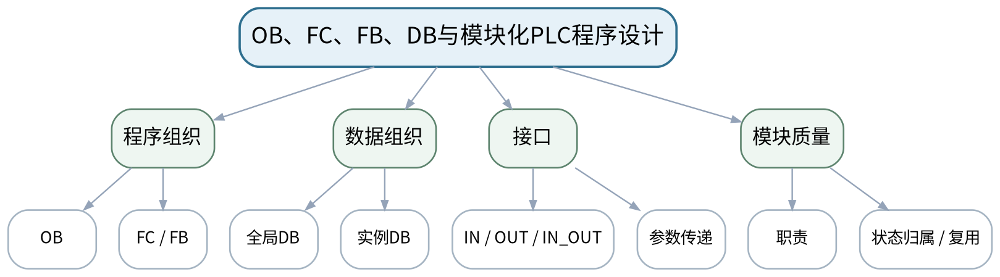

### 教学目标
**知识目标：**
1. 掌握OB、FC、FB、实例DB的基本职责与调用关系，理解参数传递和实例状态。
2. 理解全局变量、接口变量、状态数据在模块化程序中的边界。

**能力目标：**
1. 能够把输送、检测、分拣等职责划分为模块并设计输入/输出/状态接口。
2. 能够识别“共享变量过多、职责重叠、状态散落”等不利于调试和复用的结构。

**价值目标：**
1. 形成接口清楚、职责单一、模块复用和修改影响可追踪的工程设计意识。

### 课程思政
以多人协作和设备模块复用说明接口约定与责任分工的重要性，修改必须可追踪、可回归。

### 专创融合
把功能块视作可复用控制组件，训练模块接口和状态封装，为制造单元软件资产化打基础。

### 教学重难点
**教学重点：**OB/FC/FB/DB职责和接口设计。

**教学难点：**决定状态应该属于FB实例还是全局数据，并在模块复用与可读性之间做基本权衡。

### 教学方法与用具
**教学方法：**问题驱动法、时序推演法、状态建模法、教师演示法、任务驱动法、预测—运行—验证法、测试验收与故障复盘

**教学用具：**电脑、投影仪、TIA Portal模块示例、接口表模板。

### 教学设计
课前任务 → 互动导入（10 min）→ 传授新知与课堂训练（75 min）→ 过关检测（10 min）→ 课堂小结（3 min）→ 作业布置（1 min）→ 考勤（1 min）

### 课前任务
【教师】发布“OB、FC、FB、DB与模块化PLC程序设计”对应大纲/教材范围和一个最小控制问题，不提前给出完整程序答案。

1. 阅读对应大纲与教材内容；
2. 圈出3个关键术语并记录至少1个疑问；
3. 预读一段LAD/状态表/时序或设备接口说明，写出预期结果与至少一个疑问。

【学生】完成准备并带着“预期状态/疑问/已有证据”进入课堂。

### 互动导入
【教师】展示一个所有逻辑都堆在OB1中的输送分拣程序，要求学生指出调试、复用和多人协作上的问题。

【学生】先独立预测/画时序/状态，再与同伴交换判断依据；教师收集典型分歧后进入本课。

### 传授新知与课堂训练
**一、核心原理与工程案例（约30 min）—结构与调用**

【教师】讲OB周期组织、FC无持久实例状态、FB+实例DB的状态特点；用功能划分图表示调用关系。

【学生】先完成时序、状态、I/O或接口推演并写出判断依据，再对照教师演示/程序结果修正。

**二、学生时序/状态/接口推演（约25 min）—接口设计**

【教师】围绕Conveyor、SensorCheck、Sorter等模块设计输入、输出、状态、故障参数，比较全局变量和接口变量。

【学生】先完成时序、状态、I/O或接口推演并写出判断依据，再对照教师演示/程序结果修正。

**三、对比、验证与错误复盘（约20 min）—重构讨论**

【教师】将上机一逻辑拆分为模块草图，分析职责重叠、变量归属和版本变更影响。

【学生】先完成时序、状态、I/O或接口推演并写出判断依据，再对照教师演示/程序结果修正。

**独立学习产物**：输送分拣模块结构图＋FC/FB接口表。

**学习证据**：模块职责、IN/OUT/状态表、调用关系、一个结构反例及改进理由。

**评价映射**：平时成绩＋课程作业上机二前置；目标1.3、2.3、3.3。

### 过关检测
【教师】组织当堂检测：

1. FC与FB最核心的区别是什么？
2. 实例DB为什么与FB状态有关？
3. 一个变量什么时候适合通过模块接口而不是直接访问全局变量？

【学生】独立作答/推演/运行验证；【教师】按错误类型讲解，要求说明时序、状态、I/O或测试依据。

### 课堂小结
【教师】回到本课知识脉络图，用“需求/I/O—扫描/状态—程序—监控/测试—故障/边界—交付”总结“OB、FC、FB、DB与模块化PLC程序设计”，再次强调教学重点：OB/FC/FB/DB职责和接口设计。

【学生】写下“本课一条最重要的控制规则 + 一个最容易忽略的边界”。

### 作业布置
【教师】布置课后任务：把上机一工程画成模块结构图，并给至少2个拟建FB/FC写接口表。

【学生】按课程文件命名与证据要求整理提交；仿真、接口模拟和真实设备验证必须明确区分。

### 考勤
【教师】利用学校/课程实际使用的平台进行签到。

【学生】按课程要求完成签到。

### 课后教学反思
【课后填写，不预填事实】

1. 教学流程：记录100 min各环节实际用时、理论/上机切换及调整点；
2. 教学内容：重点记录“决定状态应该属于FB实例还是全局数据，并在模块复用与可读性之间做基本权衡。”的真实掌握证据和常见错误；
3. 学生参与：仅依据实际课堂记录填写时序推演、LAD编程、状态/接口设计、仿真调试和讨论情况，不补写推测；
4. 评价证据：检查本课工程、I/O/状态/变量表、监控数据、故障记录、测试与版本说明是否完整，记录缺项原因；
5. 后续改进：依据真实课堂证据决定下一次课的补救、复现或拓展。

### 本章节参考文献
[1] 廖常初.《S7-1200 PLC编程及应用（第5版）》[M]. 机械工业出版社，2026。
[4] 张跟华.《西门子S7-1200 PLC编程与应用实例》[M]. 清华大学出版社，2023。

## 第7次课 状态转换、手自动模式、超时故障与SCL入门

### 课次信息
- **章节/单元**：第三单元 程序结构与顺序控制
- **周次**：按实际课表填写
- **课时安排**：2课时（100 min）
- **课型**：理论
- **理论/上机分配**：理论2课时

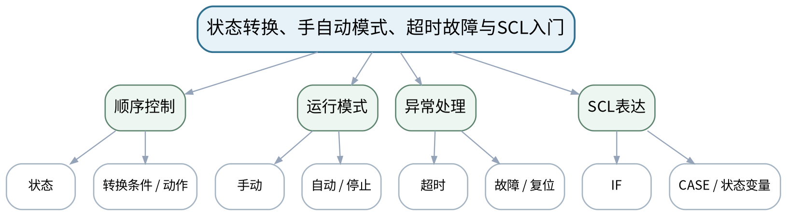

### 教学目标
**知识目标：**
1. 理解状态、转换条件、动作、初始/停止/故障状态和手动/自动模式。
2. 了解SCL赋值、IF、CASE结构及其与顺序状态表达的对应关系。

**能力目标：**
1. 能够把输送—到位—分拣—复位过程转换为状态表并设计超时/故障出口。
2. 能够阅读简单SCL状态分支，比较LAD和SCL的表达特点。

**价值目标：**
1. 形成状态互斥、异常有出口、复位不引发不受控动作和模式切换可验证的设计意识。

### 课程思政
通过异常有出口和复位边界强调“系统必须可控地失败”，避免用无条件重启掩盖问题。

### 专创融合
将状态表作为控制逻辑的可审核设计文档，连接需求、代码和测试，提升工程交付可解释性。

### 教学重难点
**教学重点：**状态转换表、模式切换、超时/故障状态和SCL CASE。

**教学难点：**防止状态重叠、无终止循环和无条件复位；定义模式切换时的安全状态保持。

### 教学方法与用具
**教学方法：**问题驱动法、时序推演法、状态建模法、教师演示法、任务驱动法、预测—运行—验证法、测试验收与故障复盘

**教学用具：**电脑、投影仪、状态表模板、TIA Portal LAD/SCL示例。

### 教学设计
课前任务 → 互动导入（10 min）→ 传授新知与课堂训练（75 min）→ 过关检测（10 min）→ 课堂小结（3 min）→ 作业布置（1 min）→ 考勤（1 min）

### 课前任务
【教师】发布“状态转换、手自动模式、超时故障与SCL入门”对应大纲/教材范围和一个最小控制问题，不提前给出完整程序答案。

1. 阅读对应大纲与教材内容；
2. 圈出3个关键术语并记录至少1个疑问；
3. 预读一段LAD/状态表/时序或设备接口说明，写出预期结果与至少一个疑问。

【学生】完成准备并带着“预期状态/疑问/已有证据”进入课堂。

### 互动导入
【教师】给出“传感器永远不到位”的分拣流程，要求学生判断程序若只有等待状态会发生什么，并设计超时出口。

【学生】先独立预测/画时序/状态，再与同伴交换判断依据；教师收集典型分歧后进入本课。

### 传授新知与课堂训练
**一、核心原理与工程案例（约30 min）—状态建模**

【教师】从输送、检测、分拣、复位提取状态、进入条件、动作和退出条件，增加STOP/FAULT。

【学生】先完成时序、状态、I/O或接口推演并写出判断依据，再对照教师演示/程序结果修正。

**二、学生时序/状态/接口推演（约25 min）—模式与复位**

【教师】分析手动/自动切换、停止、故障复位和再次启动条件，强调复位不等于立即动作。

【学生】先完成时序、状态、I/O或接口推演并写出判断依据，再对照教师演示/程序结果修正。

**三、对比、验证与错误复盘（约20 min）—LAD/SCL对照**

【教师】用CASE状态结构阅读简单SCL，与LAD状态位/网络表达对照，明确本课程SCL只用于简单分支与数据处理。

【学生】先完成时序、状态、I/O或接口推演并写出判断依据，再对照教师演示/程序结果修正。

**独立学习产物**：状态转换表＋模式/故障测试清单＋SCL阅读练习。

**学习证据**：状态编号/动作/转换条件、超时阈值、模式切换场景、复位条件和SCL注释。

**评价映射**：平时成绩＋课程作业上机二前置；目标1.3、2.3、3.3。

### 过关检测
【教师】组织当堂检测：

1. 一个完整状态需要哪些信息？
2. 为什么故障复位后通常不应直接恢复设备动作？
3. CASE结构为什么适合表达互斥状态？

【学生】独立作答/推演/运行验证；【教师】按错误类型讲解，要求说明时序、状态、I/O或测试依据。

### 课堂小结
【教师】回到本课知识脉络图，用“需求/I/O—扫描/状态—程序—监控/测试—故障/边界—交付”总结“状态转换、手自动模式、超时故障与SCL入门”，再次强调教学重点：状态转换表、模式切换、超时/故障状态和SCL CASE。

【学生】写下“本课一条最重要的控制规则 + 一个最容易忽略的边界”。

### 作业布置
【教师】布置课后任务：完成输送分拣状态表：至少包含初始化、输送、检测、分拣、复位、停止、故障；为每个异常写出口。

【学生】按课程文件命名与证据要求整理提交；仿真、接口模拟和真实设备验证必须明确区分。

### 考勤
【教师】利用学校/课程实际使用的平台进行签到。

【学生】按课程要求完成签到。

### 课后教学反思
【课后填写，不预填事实】

1. 教学流程：记录100 min各环节实际用时、理论/上机切换及调整点；
2. 教学内容：重点记录“防止状态重叠、无终止循环和无条件复位；定义模式切换时的安全状态保持。”的真实掌握证据和常见错误；
3. 学生参与：仅依据实际课堂记录填写时序推演、LAD编程、状态/接口设计、仿真调试和讨论情况，不补写推测；
4. 评价证据：检查本课工程、I/O/状态/变量表、监控数据、故障记录、测试与版本说明是否完整，记录缺项原因；
5. 后续改进：依据真实课堂证据决定下一次课的补救、复现或拓展。

### 本章节参考文献
[1] 廖常初.《S7-1200 PLC编程及应用（第5版）》[M]. 机械工业出版社，2026。
[4] 张跟华.《西门子S7-1200 PLC编程与应用实例》[M]. 清华大学出版社，2023。

## 第8次课 状态表驱动的FC/FB/DB模块化实现

### 课次信息
- **章节/单元**：上机二 模块化顺序控制
- **周次**：按实际课表填写
- **课时安排**：2课时（100 min）
- **课型**：上机
- **理论/上机分配**：上机2课时（上机二前半）

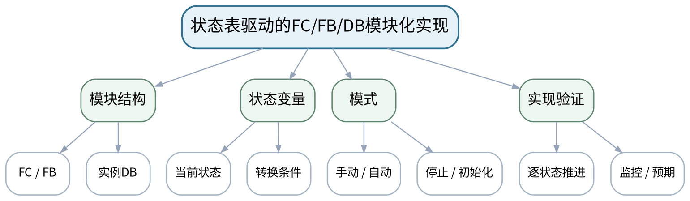

### 教学目标
**知识目标：**
1. 巩固FC/FB/DB划分、参数接口和状态表转程序的方法。
2. 理解状态变量、转换条件、超时计时与模式信号的组合。

**能力目标：**
1. 能够把状态表实现为模块化LAD程序，并建立手动/自动/停止框架。
2. 能够用监控表逐步推进状态并核对每个状态动作。

**价值目标：**
1. 形成先状态表后程序、接口先行、每个状态都能解释和复现的工程习惯。

### 课程思政
接口和状态先行，失败转换必须记录；手动模式不等于绕过安全与故障边界。

### 专创融合
把顺序控制框架做成可扩展输送分拣控制核心，后续可接HMI和模拟量而不重写整体结构。

### 教学重难点
**教学重点：**状态表到模块化LAD的映射。

**教学难点：**确保状态转换和模块职责一致，避免状态散落在多个网络产生不可控组合。

### 教学方法与用具
**教学方法：**问题驱动法、时序推演法、状态建模法、教师演示法、任务驱动法、预测—运行—验证法、测试验收与故障复盘

**教学用具：**机房、TIA Portal、S7-PLCSIM、状态表、监控表。

### 教学设计
课前任务 → 互动导入（10 min）→ 传授新知与课堂训练（75 min）→ 过关检测（10 min）→ 课堂小结（3 min）→ 作业布置（1 min）→ 考勤（1 min）

### 课前任务
【教师】发布“状态表驱动的FC/FB/DB模块化实现”对应大纲/教材范围和一个最小控制问题，不提前给出完整程序答案。

1. 阅读对应大纲与教材内容；
2. 圈出3个关键术语并记录至少1个疑问；
3. 检查TIA Portal/S7-PLCSIM/HMI仿真环境、上一阶段工程和任务文件是否可用；未经教师确认不得连接真实负载、强制输出或修改保护逻辑。

【学生】完成准备并带着“预期状态/疑问/已有证据”进入课堂。

### 互动导入
【教师】要求学生在不运行设备动作的前提下，仅通过状态变量和模拟输入依次推进INIT→RUN→DETECT→SORT，观察动作输出是否符合状态表。

【学生】先独立预测/画时序/状态，再与同伴交换判断依据；教师收集典型分歧后进入本课。

### 传授新知与课堂训练
**一、任务说明与工程/逻辑骨架（约20 min）—接口落地**

【教师】依据上一课接口表建立FC/FB/DB，先完成状态枚举/常量、模式和基础输入输出。

【学生】按任务约束独立/小组实现，先写预期状态/时序再运行；用监控表或仿真验证，保留工程、参数、故障信息和测试证据。

**二、学生独立/小组实现（约35 min）—状态实现**

【教师】学生逐状态写转换条件和动作，优先实现INIT、RUN、DETECT、SORT、RESET、STOP、FAULT框架。

【学生】按任务约束独立/小组实现，先写预期状态/时序再运行；用监控表或仿真验证，保留工程、参数、故障信息和测试证据。

**三、测试、调试与证据固化（约20 min）—逐步验证**

【教师】监控当前状态和关键变量，用手工输入序列推进状态；记录每次转换预期、实际和异常。

【学生】按任务约束独立/小组实现，先写预期状态/时序再运行；用监控表或仿真验证，保留工程、参数、故障信息和测试证据。

**独立学习产物**：模块化顺序控制工程v2＋状态表＋状态推进测试。

**学习证据**：FC/FB/DB结构、状态变量、监控记录、状态转移序列、编译结果。

**评价映射**：课程作业上机二（25%）前半＋期末综合考查；目标1.3、2.3、3.3。

### 过关检测
【教师】组织当堂检测：

1. 为什么建议先让状态框架可观察再补复杂动作？
2. 状态变量与各FB内部状态如何避免职责混乱？
3. 手动模式是否应该绕过所有故障条件？

【学生】独立作答/推演/运行验证；【教师】按错误类型讲解，要求说明时序、状态、I/O或测试依据。

### 课堂小结
【教师】回到本课知识脉络图，用“需求/I/O—扫描/状态—程序—监控/测试—故障/边界—交付”总结“状态表驱动的FC/FB/DB模块化实现”，再次强调教学重点：状态表到模块化LAD的映射。

【学生】写下“本课一条最重要的控制规则 + 一个最容易忽略的边界”。

### 作业布置
【教师】布置课后任务：补全所有状态的进入/退出条件，准备下节课加入超时、故障复位和模式切换回归测试。

【学生】按课程文件命名与证据要求整理提交；仿真、接口模拟和真实设备验证必须明确区分。

### 考勤
【教师】利用学校/课程实际使用的平台进行签到。

【学生】按课程要求完成签到。

### 课后教学反思
【课后填写，不预填事实】

1. 教学流程：记录100 min各环节实际用时、理论/上机切换及调整点；
2. 教学内容：重点记录“确保状态转换和模块职责一致，避免状态散落在多个网络产生不可控组合。”的真实掌握证据和常见错误；
3. 学生参与：仅依据实际课堂记录填写时序推演、LAD编程、状态/接口设计、仿真调试和讨论情况，不补写推测；
4. 评价证据：检查本课工程、I/O/状态/变量表、监控数据、故障记录、测试与版本说明是否完整，记录缺项原因；
5. 后续改进：依据真实课堂证据决定下一次课的补救、复现或拓展。

### 本章节参考文献
[1] 廖常初.《S7-1200 PLC编程及应用（第5版）》[M]. 机械工业出版社，2026。
[4] 张跟华.《西门子S7-1200 PLC编程与应用实例》[M]. 清华大学出版社，2023。

## 第9次课 超时、故障复位、模式切换与回归测试

### 课次信息
- **章节/单元**：上机二 模块化顺序控制
- **周次**：按实际课表填写
- **课时安排**：2课时（100 min）
- **课型**：上机
- **理论/上机分配**：上机2课时（上机二后半）

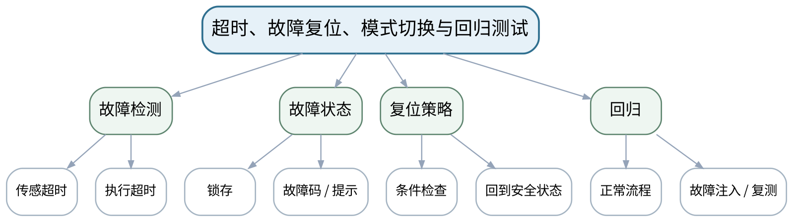

### 教学目标
**知识目标：**
1. 理解超时监控、故障锁存、复位许可和手/自动切换中的状态一致性。
2. 理解故障注入与回归测试对顺序程序验收的作用。

**能力目标：**
1. 能够加入传感器超时/执行超时与故障状态，并实现受条件约束的复位。
2. 能够针对漏信号、卡滞、模式切换和重复启动执行问题—修复—复测闭环。

**价值目标：**
1. 形成异常可复现、复位不自动重启、修改后必须回归的工程质量意识。

### 课程思政
强调故障与复位必须真实可控，不能通过屏蔽故障或强制变量制造“验收通过”。

### 专创融合
将故障状态和复测记录作为控制产品可维护性的核心资产，为现场诊断与HMI报警奠定接口。

### 教学重难点
**教学重点：**超时与故障状态设计；受控复位与回归测试。

**教学难点：**设计“故障后怎么安全回来”，而不是只会检测故障；防止复位导致设备自动动作。

### 教学方法与用具
**教学方法：**问题驱动法、时序推演法、状态建模法、教师演示法、任务驱动法、预测—运行—验证法、测试验收与故障复盘

**教学用具：**机房、TIA Portal、S7-PLCSIM、故障注入清单。

### 教学设计
课前任务 → 互动导入（10 min）→ 传授新知与课堂训练（75 min）→ 过关检测（10 min）→ 课堂小结（3 min）→ 作业布置（1 min）→ 考勤（1 min）

### 课前任务
【教师】发布“超时、故障复位、模式切换与回归测试”对应大纲/教材范围和一个最小控制问题，不提前给出完整程序答案。

1. 阅读对应大纲与教材内容；
2. 圈出3个关键术语并记录至少1个疑问；
3. 检查TIA Portal/S7-PLCSIM/HMI仿真环境、上一阶段工程和任务文件是否可用；未经教师确认不得连接真实负载、强制输出或修改保护逻辑。

【学生】完成准备并带着“预期状态/疑问/已有证据”进入课堂。

### 互动导入
【教师】教师模拟“到位传感器永远FALSE”，要求程序必须在限定时间进入FAULT且输出停止；复位后只能回INIT/STOP而不是直接RUN。

【学生】先独立预测/画时序/状态，再与同伴交换判断依据；教师收集典型分歧后进入本课。

### 传授新知与课堂训练
**一、任务说明与工程/逻辑骨架（约20 min）—故障注入**

【教师】加入到位/执行超时，设置故障锁存和故障码，测试卡滞、漏信号、超时边界。

【学生】按任务约束独立/小组实现，先写预期状态/时序再运行；用监控表或仿真验证，保留工程、参数、故障信息和测试证据。

**二、学生独立/小组实现（约35 min）—复位与模式**

【教师】实现复位许可条件、回到初始化/停止状态；测试故障中切手动、手动回自动、停止后再次启动。

【学生】按任务约束独立/小组实现，先写预期状态/时序再运行；用监控表或仿真验证，保留工程、参数、故障信息和测试证据。

**三、测试、调试与证据固化（约20 min）—回归验收**

【教师】修复后重跑正常流程和关键边界测试，记录故障复现、原因、修改、复测和版本。

【学生】按任务约束独立/小组实现，先写预期状态/时序再运行；用监控表或仿真验证，保留工程、参数、故障信息和测试证据。

**独立学习产物**：上机二完整工程＋故障注入/复位/回归测试报告。

**学习证据**：故障码/状态、超时参数、监控记录、问题—修复—复测闭环、工程版本。

**评价映射**：课程作业上机二（25%）完成＋期末综合考查；目标1.3、2.3、3.3。

### 过关检测
【教师】组织当堂检测：

1. 为什么故障复位后不应直接恢复RUN？
2. 超时阈值过短或过长分别有什么问题？
3. 回归测试至少应覆盖哪些原有正常功能？

【学生】独立作答/推演/运行验证；【教师】按错误类型讲解，要求说明时序、状态、I/O或测试依据。

### 课堂小结
【教师】回到本课知识脉络图，用“需求/I/O—扫描/状态—程序—监控/测试—故障/边界—交付”总结“超时、故障复位、模式切换与回归测试”，再次强调教学重点：超时与故障状态设计；受控复位与回归测试。

【学生】写下“本课一条最重要的控制规则 + 一个最容易忽略的边界”。

### 作业布置
【教师】布置课后任务：提交上机二完整包；整理状态、故障、模式变量清单，为HMI状态/报警映射做准备。

【学生】按课程文件命名与证据要求整理提交；仿真、接口模拟和真实设备验证必须明确区分。

### 考勤
【教师】利用学校/课程实际使用的平台进行签到。

【学生】按课程要求完成签到。

### 课后教学反思
【课后填写，不预填事实】

1. 教学流程：记录100 min各环节实际用时、理论/上机切换及调整点；
2. 教学内容：重点记录“设计“故障后怎么安全回来”，而不是只会检测故障；防止复位导致设备自动动作。”的真实掌握证据和常见错误；
3. 学生参与：仅依据实际课堂记录填写时序推演、LAD编程、状态/接口设计、仿真调试和讨论情况，不补写推测；
4. 评价证据：检查本课工程、I/O/状态/变量表、监控数据、故障记录、测试与版本说明是否完整，记录缺项原因；
5. 后续改进：依据真实课堂证据决定下一次课的补救、复现或拓展。

### 本章节参考文献
[1] 廖常初.《S7-1200 PLC编程及应用（第5版）》[M]. 机械工业出版社，2026。
[4] 张跟华.《西门子S7-1200 PLC编程与应用实例》[M]. 清华大学出版社，2023。

## 第10次课 模拟量标度、限幅、回差与PID概念

### 课次信息
- **章节/单元**：第四单元 模拟量与过程监控基础
- **周次**：按实际课表填写
- **课时安排**：2课时（100 min）
- **课型**：理论
- **理论/上机分配**：理论2课时

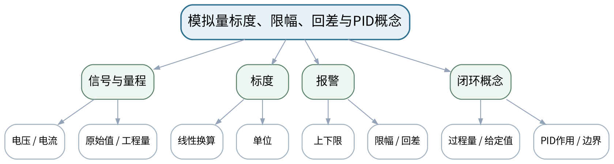

### 教学目标
**知识目标：**
1. 理解电压/电流信号、原始值、工程量、量程和单位之间的线性标度关系。
2. 掌握限幅、上下限报警、回差和异常值处理，了解PID闭环基本作用及使用边界。

**能力目标：**
1. 能够依据给定原始范围与工程量范围写出标度公式并计算多组输入。
2. 能够设计上下限、越界、噪声附近与回差测试。

**价值目标：**
1. 形成单位一致、参数有依据、异常数据不隐瞒以及节能/质量判断基于记录的习惯。

### 课程思政
通过单位、量程和报警阈值强调数据真实与参数责任，错误单位可能直接导致误动作和质量风险。

### 专创融合
将标度与报警封装为可配置过程监控模块，形成面向HMI参数化和趋势记录的接口。

### 教学重难点
**教学重点：**模拟量标度、单位、限幅和回差报警。

**教学难点：**理解回差如何避免阈值附近抖动，以及量程/单位错误如何造成严重判断偏差。

### 教学方法与用具
**教学方法：**问题驱动法、时序推演法、状态建模法、教师演示法、任务驱动法、预测—运行—验证法、测试验收与故障复盘

**教学用具：**电脑、投影仪、TIA Portal模拟量示例、趋势图。

### 教学设计
课前任务 → 互动导入（10 min）→ 传授新知与课堂训练（75 min）→ 过关检测（10 min）→ 课堂小结（3 min）→ 作业布置（1 min）→ 考勤（1 min）

### 课前任务
【教师】发布“模拟量标度、限幅、回差与PID概念”对应大纲/教材范围和一个最小控制问题，不提前给出完整程序答案。

1. 阅读对应大纲与教材内容；
2. 圈出3个关键术语并记录至少1个疑问；
3. 预读一段LAD/状态表/时序或设备接口说明，写出预期结果与至少一个疑问。

【学生】完成准备并带着“预期状态/疑问/已有证据”进入课堂。

### 互动导入
【教师】给出温度原始值在报警阈值附近轻微波动导致报警反复开关的曲线，让学生提出“为什么需要回差”。

【学生】先独立预测/画时序/状态，再与同伴交换判断依据；教师收集典型分歧后进入本课。

### 传授新知与课堂训练
**一、核心原理与工程案例（约30 min）—量程与标度**

【教师】从4–20mA/0–10V或课程给定原始范围出发推导线性标度，明确单位和越界策略。

【学生】先完成时序、状态、I/O或接口推演并写出判断依据，再对照教师演示/程序结果修正。

**二、学生时序/状态/接口推演（约25 min）—报警与回差**

【教师】比较无回差/有回差的上下限报警，讨论噪声、异常输入、限幅与报警状态。

【学生】先完成时序、状态、I/O或接口推演并写出判断依据，再对照教师演示/程序结果修正。

**三、对比、验证与错误复盘（约20 min）—PID概念**

【教师】用教师提供的温度/液位模型说明设定值、过程量、误差和P/I/D作用，不展开完整整定训练。

【学生】先完成时序、状态、I/O或接口推演并写出判断依据，再对照教师演示/程序结果修正。

**独立学习产物**：模拟量标度计算表＋阈值/回差测试设计。

**学习证据**：标度公式、单位、下限/中值/上限/越界样例、报警进入/退出条件。

**评价映射**：平时成绩＋课程作业上机三前置；目标1.4、2.4、3.4。

### 过关检测
【教师】组织当堂检测：

1. 工程量标度至少需要知道哪两个范围？
2. 回差如何减少阈值附近报警抖动？
3. PID概念演示为什么不能代替完整实机整定？

【学生】独立作答/推演/运行验证；【教师】按错误类型讲解，要求说明时序、状态、I/O或测试依据。

### 课堂小结
【教师】回到本课知识脉络图，用“需求/I/O—扫描/状态—程序—监控/测试—故障/边界—交付”总结“模拟量标度、限幅、回差与PID概念”，再次强调教学重点：模拟量标度、单位、限幅和回差报警。

【学生】写下“本课一条最重要的控制规则 + 一个最容易忽略的边界”。

### 作业布置
【教师】布置课后任务：完成一组温度或液位量程标度与回差报警设计，列出5个边界输入和预期输出。

【学生】按课程文件命名与证据要求整理提交；仿真、接口模拟和真实设备验证必须明确区分。

### 考勤
【教师】利用学校/课程实际使用的平台进行签到。

【学生】按课程要求完成签到。

### 课后教学反思
【课后填写，不预填事实】

1. 教学流程：记录100 min各环节实际用时、理论/上机切换及调整点；
2. 教学内容：重点记录“理解回差如何避免阈值附近抖动，以及量程/单位错误如何造成严重判断偏差。”的真实掌握证据和常见错误；
3. 学生参与：仅依据实际课堂记录填写时序推演、LAD编程、状态/接口设计、仿真调试和讨论情况，不补写推测；
4. 评价证据：检查本课工程、I/O/状态/变量表、监控数据、故障记录、测试与版本说明是否完整，记录缺项原因；
5. 后续改进：依据真实课堂证据决定下一次课的补救、复现或拓展。

### 本章节参考文献
[1] 廖常初.《S7-1200 PLC编程及应用（第5版）》[M]. 机械工业出版社，2026。
[2] 方贵盛, 王红梅.《电气控制与S7-1200 PLC应用教程》[M]. 机械工业出版社，2025。

## 第11次课 HMI变量、报警、PROFINET/Modbus TCP与握手语义

### 课次信息
- **章节/单元**：第五单元 HMI与设备通信入门
- **周次**：按实际课表填写
- **课时安排**：2课时（100 min）
- **课型**：理论
- **理论/上机分配**：理论2课时

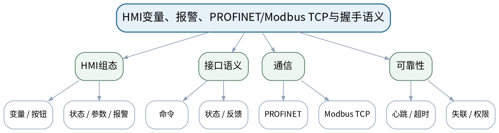

### 教学目标
**知识目标：**
1. 理解HMI连接、变量、按钮、数值输入、状态、报警和趋势的基本对应关系。
2. 了解PROFINET与Modbus TCP基本用途，理解命令/状态握手、心跳、超时和失联概念。

**能力目标：**
1. 能够设计HMI变量/权限/上下限表与命令—状态握手时序。
2. 能够说明仿真接口、真实网络通信和功能安全验证之间的证据边界。

**价值目标：**
1. 形成最小权限、接口语义明确、超时可恢复、仿真证据不冒充实机验证的工程意识。

### 课程思政
通过错误写入、越权参数和通信中断案例强化权限边界与可恢复性，真实设备操作必须按学校规范。

### 专创融合
把HMI与PLC之间的变量/握手表视为设备软件接口文档，训练人机界面产品的可维护性。

### 教学重难点
**教学重点：**HMI变量映射、命令/状态握手与通信失联概念。

**教学难点：**避免HMI直接写内部状态或越权参数；理解“写命令—设备确认—状态反馈”的接口语义。

### 教学方法与用具
**教学方法：**问题驱动法、时序推演法、状态建模法、教师演示法、任务驱动法、预测—运行—验证法、测试验收与故障复盘

**教学用具：**电脑、投影仪、TIA Portal/WinCC示例、握手时序图。

### 教学设计
课前任务 → 互动导入（10 min）→ 传授新知与课堂训练（75 min）→ 过关检测（10 min）→ 课堂小结（3 min）→ 作业布置（1 min）→ 考勤（1 min）

### 课前任务
【教师】发布“HMI变量、报警、PROFINET/Modbus TCP与握手语义”对应大纲/教材范围和一个最小控制问题，不提前给出完整程序答案。

1. 阅读对应大纲与教材内容；
2. 圈出3个关键术语并记录至少1个疑问；
3. 预读一段LAD/状态表/时序或设备接口说明，写出预期结果与至少一个疑问。

【学生】完成准备并带着“预期状态/疑问/已有证据”进入课堂。

### 互动导入
【教师】展示一个HMI按钮直接把“MotorRunning状态位”写成TRUE的错误设计，要求学生说明为什么命令和真实状态不能混为一谈。

【学生】先独立预测/画时序/状态，再与同伴交换判断依据；教师收集典型分歧后进入本课。

### 传授新知与课堂训练
**一、核心原理与工程案例（约30 min）—HMI对象**

【教师】讲变量连接、按钮、参数输入、状态显示、报警与趋势，明确操作变量和状态变量。

【学生】先完成时序、状态、I/O或接口推演并写出判断依据，再对照教师演示/程序结果修正。

**二、学生时序/状态/接口推演（约25 min）—握手与权限**

【教师】设计StartCmd/StartAck/Running/Fault等命令—状态表，加入参数上下限和权限层级。

【学生】先完成时序、状态、I/O或接口推演并写出判断依据，再对照教师演示/程序结果修正。

**三、对比、验证与错误复盘（约20 min）—通信边界**

【教师】说明PROFINET/Modbus TCP用途、心跳/超时/失联；区分仿真接口数据与真实网络性能测试。

【学生】先完成时序、状态、I/O或接口推演并写出判断依据，再对照教师演示/程序结果修正。

**独立学习产物**：HMI变量/权限表＋命令—状态握手时序图。

**学习证据**：变量来源、读写方向、上下限、权限、握手/心跳时序和失联策略。

**评价映射**：平时成绩＋课程作业上机三前置；目标1.5、2.5、3.5。

### 过关检测
【教师】组织当堂检测：

1. 为什么“命令变量”和“运行状态变量”应分开？
2. 通信失联时HMI/PLC至少应该怎样表现？
3. 仿真通信成功为什么不能证明真实网络性能？

【学生】独立作答/推演/运行验证；【教师】按错误类型讲解，要求说明时序、状态、I/O或测试依据。

### 课堂小结
【教师】回到本课知识脉络图，用“需求/I/O—扫描/状态—程序—监控/测试—故障/边界—交付”总结“HMI变量、报警、PROFINET/Modbus TCP与握手语义”，再次强调教学重点：HMI变量映射、命令/状态握手与通信失联概念。

【学生】写下“本课一条最重要的控制规则 + 一个最容易忽略的边界”。

### 作业布置
【教师】布置课后任务：完成输送分拣系统HMI变量表：操作、状态、参数、报警四类，每项标明读写方向与权限。

【学生】按课程文件命名与证据要求整理提交；仿真、接口模拟和真实设备验证必须明确区分。

### 考勤
【教师】利用学校/课程实际使用的平台进行签到。

【学生】按课程要求完成签到。

### 课后教学反思
【课后填写，不预填事实】

1. 教学流程：记录100 min各环节实际用时、理论/上机切换及调整点；
2. 教学内容：重点记录“避免HMI直接写内部状态或越权参数；理解“写命令—设备确认—状态反馈”的接口语义。”的真实掌握证据和常见错误；
3. 学生参与：仅依据实际课堂记录填写时序推演、LAD编程、状态/接口设计、仿真调试和讨论情况，不补写推测；
4. 评价证据：检查本课工程、I/O/状态/变量表、监控数据、故障记录、测试与版本说明是否完整，记录缺项原因；
5. 后续改进：依据真实课堂证据决定下一次课的补救、复现或拓展。

### 本章节参考文献
[3] 廖常初.《西门子人机界面（触摸屏）组态与应用技术（第4版）》[M]. 机械工业出版社，2025。
[1] 廖常初.《S7-1200 PLC编程及应用（第5版）》[M]. 机械工业出版社，2026。

## 第12次课 模拟量标度、回差报警与趋势验证

### 课次信息
- **章节/单元**：上机三 模拟量、HMI与接口数据
- **周次**：按实际课表填写
- **课时安排**：2课时（100 min）
- **课型**：上机
- **理论/上机分配**：上机2课时（上机三前半）

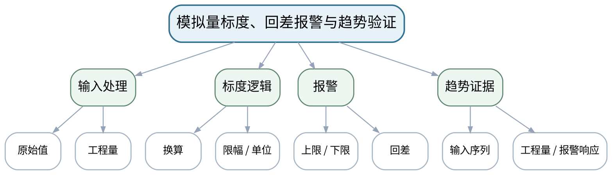

### 教学目标
**知识目标：**
1. 巩固模拟量标度、限幅、上下限、回差和趋势记录。
2. 理解参数上下限和异常值如何在PLC/HMI链路中保持一致语义。

**能力目标：**
1. 能够使用给定范围实现标度和回差报警，并记录下限/中值/上限/越界/噪声附近响应。
2. 能够将工程量、报警状态和趋势变量准备为HMI接口。

**价值目标：**
1. 形成原始值与工程量均可追踪、单位清楚、参数调整有证据的过程控制习惯。

### 课程思政
数据记录必须保留单位、量程和来源；不能为得到“平滑趋势”随意删改不利数据。

### 专创融合
将模拟量与报警模块作为过程监控可复用组件，为制造设备状态可视化提供标准化数据接口。

### 教学重难点
**教学重点：**标度、回差报警、趋势数据及接口变量。

**教学难点：**同时验证数值换算与状态逻辑，尤其检查阈值附近噪声和越界输入。

### 教学方法与用具
**教学方法：**问题驱动法、时序推演法、状态建模法、教师演示法、任务驱动法、预测—运行—验证法、测试验收与故障复盘

**教学用具：**机房、TIA Portal、S7-PLCSIM、模拟量输入数据、趋势记录表。

### 教学设计
课前任务 → 互动导入（10 min）→ 传授新知与课堂训练（75 min）→ 过关检测（10 min）→ 课堂小结（3 min）→ 作业布置（1 min）→ 考勤（1 min）

### 课前任务
【教师】发布“模拟量标度、回差报警与趋势验证”对应大纲/教材范围和一个最小控制问题，不提前给出完整程序答案。

1. 阅读对应大纲与教材内容；
2. 圈出3个关键术语并记录至少1个疑问；
3. 检查TIA Portal/S7-PLCSIM/HMI仿真环境、上一阶段工程和任务文件是否可用；未经教师确认不得连接真实负载、强制输出或修改保护逻辑。

【学生】完成准备并带着“预期状态/疑问/已有证据”进入课堂。

### 互动导入
【教师】提供一组围绕上限阈值上下波动的数据，要求学生先写出有回差时报警应在何处进入/退出，再运行验证。

【学生】先独立预测/画时序/状态，再与同伴交换判断依据；教师收集典型分歧后进入本课。

### 传授新知与课堂训练
**一、任务说明与工程/逻辑骨架（约20 min）—标度实现**

【教师】按照课程给定原始范围和工程量范围实现线性换算、限幅和单位输出。

【学生】按任务约束独立/小组实现，先写预期状态/时序再运行；用监控表或仿真验证，保留工程、参数、故障信息和测试证据。

**二、学生独立/小组实现（约35 min）—报警实现**

【教师】加入上/下限和回差；用监控表输入下限、中值、上限、越界和阈值附近序列。

【学生】按任务约束独立/小组实现，先写预期状态/时序再运行；用监控表或仿真验证，保留工程、参数、故障信息和测试证据。

**三、测试、调试与证据固化（约20 min）—趋势记录**

【教师】准备HMI趋势所需工程量/报警变量，保存输入—工程量—报警状态表，分析回差效果。

【学生】按任务约束独立/小组实现，先写预期状态/时序再运行；用监控表或仿真验证，保留工程、参数、故障信息和测试证据。

**独立学习产物**：上机三工程v1＋标度/报警程序＋趋势测试数据。

**学习证据**：标度参数、5类以上输入、工程量/报警输出、回差进入/退出点、问题修正记录。

**评价映射**：课程作业上机三（25%）前半＋期末综合考查；目标1.4、2.4、3.4。

### 过关检测
【教师】组织当堂检测：

1. 如何证明标度公式在两端点都正确？
2. 回差报警至少要验证哪两个阈值？
3. 越界输入应该如何记录与处理？

【学生】独立作答/推演/运行验证；【教师】按错误类型讲解，要求说明时序、状态、I/O或测试依据。

### 课堂小结
【教师】回到本课知识脉络图，用“需求/I/O—扫描/状态—程序—监控/测试—故障/边界—交付”总结“模拟量标度、回差报警与趋势验证”，再次强调教学重点：标度、回差报警、趋势数据及接口变量。

【学生】写下“本课一条最重要的控制规则 + 一个最容易忽略的边界”。

### 作业布置
【教师】布置课后任务：整理标度/报警变量，为下一课HMI画面准备操作、状态、参数和报警标签。

【学生】按课程文件命名与证据要求整理提交；仿真、接口模拟和真实设备验证必须明确区分。

### 考勤
【教师】利用学校/课程实际使用的平台进行签到。

【学生】按课程要求完成签到。

### 课后教学反思
【课后填写，不预填事实】

1. 教学流程：记录100 min各环节实际用时、理论/上机切换及调整点；
2. 教学内容：重点记录“同时验证数值换算与状态逻辑，尤其检查阈值附近噪声和越界输入。”的真实掌握证据和常见错误；
3. 学生参与：仅依据实际课堂记录填写时序推演、LAD编程、状态/接口设计、仿真调试和讨论情况，不补写推测；
4. 评价证据：检查本课工程、I/O/状态/变量表、监控数据、故障记录、测试与版本说明是否完整，记录缺项原因；
5. 后续改进：依据真实课堂证据决定下一次课的补救、复现或拓展。

### 本章节参考文献
[1] 廖常初.《S7-1200 PLC编程及应用（第5版）》[M]. 机械工业出版社，2026。
[3] 廖常初.《西门子人机界面（触摸屏）组态与应用技术（第4版）》[M]. 机械工业出版社，2025。

## 第13次课 HMI组态、报警、握手与接口失联测试

### 课次信息
- **章节/单元**：上机三 模拟量、HMI与接口数据
- **周次**：按实际课表填写
- **课时安排**：2课时（100 min）
- **课型**：上机
- **理论/上机分配**：上机2课时（上机三后半）

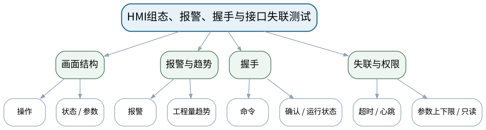

### 教学目标
**知识目标：**
1. 巩固HMI变量映射、操作/状态/参数/报警画面和命令—状态握手。
2. 理解超时、心跳/失联模拟与权限/参数限制。

**能力目标：**
1. 能够组态基本HMI画面并完成PLC—HMI变量一致性检查。
2. 能够用教师验证配置或接口模拟完成命令反馈、报警和超时失联测试。

**价值目标：**
1. 形成接口模拟如实标注、权限最小化、操作有反馈和异常可恢复的工程意识。

### 课程思政
接口模拟必须如实标注，不据此宣称实机网络性能；涉及真实设备时严格遵循最小权限与安全操作。

### 专创融合
将HMI与过程变量打造成可复用监控模块，为综合输送分拣单元形成“控制+监控”产品形态。

### 教学重难点
**教学重点：**HMI画面、变量映射、握手与失联测试。

**教学难点：**防止命令/状态混用、内部变量越权写入和接口模拟冒充实机联调。

### 教学方法与用具
**教学方法：**问题驱动法、时序推演法、状态建模法、教师演示法、任务驱动法、预测—运行—验证法、测试验收与故障复盘

**教学用具：**机房、TIA Portal/WinCC兼容环境、S7-PLCSIM/HMI仿真、接口数据。

### 教学设计
课前任务 → 互动导入（10 min）→ 传授新知与课堂训练（75 min）→ 过关检测（10 min）→ 课堂小结（3 min）→ 作业布置（1 min）→ 考勤（1 min）

### 课前任务
【教师】发布“HMI组态、报警、握手与接口失联测试”对应大纲/教材范围和一个最小控制问题，不提前给出完整程序答案。

1. 阅读对应大纲与教材内容；
2. 圈出3个关键术语并记录至少1个疑问；
3. 检查TIA Portal/S7-PLCSIM/HMI仿真环境、上一阶段工程和任务文件是否可用；未经教师确认不得连接真实负载、强制输出或修改保护逻辑。

【学生】完成准备并带着“预期状态/疑问/已有证据”进入课堂。

### 互动导入
【教师】故意断开/冻结模拟心跳，让学生观察HMI是否仍显示“正常运行”，并要求增加失联状态和操作限制。

【学生】先独立预测/画时序/状态，再与同伴交换判断依据；教师收集典型分歧后进入本课。

### 传授新知与课堂训练
**一、任务说明与工程/逻辑骨架（约20 min）—画面组态**

【教师】建立操作、状态、参数、报警/趋势画面，按变量表绑定读写方向和上下限。

【学生】按任务约束独立/小组实现，先写预期状态/时序再运行；用监控表或仿真验证，保留工程、参数、故障信息和测试证据。

**二、学生独立/小组实现（约35 min）—握手验证**

【教师】测试启动命令、PLC确认、运行状态、停止/故障反馈；检查按钮不能直接篡改状态变量。

【学生】按任务约束独立/小组实现，先写预期状态/时序再运行；用监控表或仿真验证，保留工程、参数、故障信息和测试证据。

**三、测试、调试与证据固化（约20 min）—失联测试**

【教师】使用课程提供可运行配置或接口模拟注入超时/心跳停止，观察报警与控制限制并记录。

【学生】按任务约束独立/小组实现，先写预期状态/时序再运行；用监控表或仿真验证，保留工程、参数、故障信息和测试证据。

**独立学习产物**：上机三完整工程＋HMI画面＋变量/权限表＋失联测试记录。

**学习证据**：画面截图/工程、变量映射、命令状态时序、超时记录、权限/上下限验证。

**评价映射**：课程作业上机三（25%）完成＋期末综合考查；目标1.4、2.4、3.4、1.5、2.5、3.5。

### 过关检测
【教师】组织当堂检测：

1. 怎样验证HMI上的Running状态来自PLC反馈而不是按钮写入？
2. 参数上下限为什么属于接口安全的一部分？
3. 接口模拟测试应该怎样在报告中标注？

【学生】独立作答/推演/运行验证；【教师】按错误类型讲解，要求说明时序、状态、I/O或测试依据。

### 课堂小结
【教师】回到本课知识脉络图，用“需求/I/O—扫描/状态—程序—监控/测试—故障/边界—交付”总结“HMI组态、报警、握手与接口失联测试”，再次强调教学重点：HMI画面、变量映射、握手与失联测试。

【学生】写下“本课一条最重要的控制规则 + 一个最容易忽略的边界”。

### 作业布置
【教师】布置课后任务：提交上机三完整包；把HMI/模拟量模块与上机二顺序控制工程的接口整理为综合联调清单。

【学生】按课程文件命名与证据要求整理提交；仿真、接口模拟和真实设备验证必须明确区分。

### 考勤
【教师】利用学校/课程实际使用的平台进行签到。

【学生】按课程要求完成签到。

### 课后教学反思
【课后填写，不预填事实】

1. 教学流程：记录100 min各环节实际用时、理论/上机切换及调整点；
2. 教学内容：重点记录“防止命令/状态混用、内部变量越权写入和接口模拟冒充实机联调。”的真实掌握证据和常见错误；
3. 学生参与：仅依据实际课堂记录填写时序推演、LAD编程、状态/接口设计、仿真调试和讨论情况，不补写推测；
4. 评价证据：检查本课工程、I/O/状态/变量表、监控数据、故障记录、测试与版本说明是否完整，记录缺项原因；
5. 后续改进：依据真实课堂证据决定下一次课的补救、复现或拓展。

### 本章节参考文献
[3] 廖常初.《西门子人机界面（触摸屏）组态与应用技术（第4版）》[M]. 机械工业出版社，2025。
[1] 廖常初.《S7-1200 PLC编程及应用（第5版）》[M]. 机械工业出版社，2026。

## 第14次课 需求追踪、监控诊断、故障定位与工程交付

### 课次信息
- **章节/单元**：第六单元 系统集成、诊断与交付
- **周次**：按实际课表填写
- **课时安排**：2课时（100 min）
- **课型**：理论
- **理论/上机分配**：理论2课时

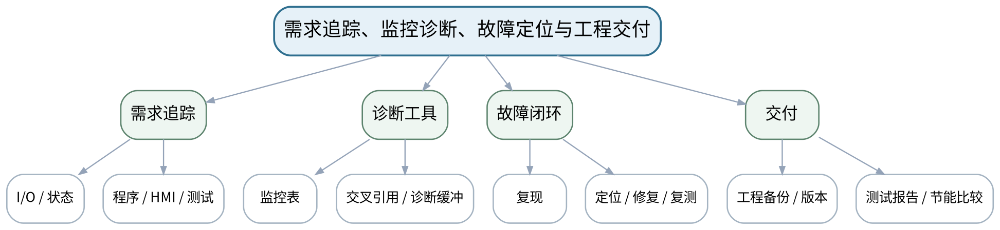

### 教学目标
**知识目标：**
1. 掌握需求—I/O—状态—程序—HMI—测试的追踪思路，理解监控表、诊断缓冲、交叉引用和工程备份作用。
2. 理解传感器卡滞、执行超时、故障后再启动和版本回退等典型调试场景。

**能力目标：**
1. 能够根据故障现象选择监控/交叉引用/状态/诊断证据定位问题。
2. 能够设计综合验收测试清单和工程备份/版本说明。

**价值目标：**
1. 形成问题可复现、修复有复测、版本可回退、节能改进以数据为依据的工程交付意识。

### 课程思政
以真实故障记录、版本和复测证据强化工程诚信；禁止旁路保护、虚构测试或删除不利记录。

### 专创融合
将调试和交付流程视为控制系统全生命周期的一部分，训练面向维护、升级和客户验收的工程意识。

### 教学重难点
**教学重点：**系统级诊断闭环与可追溯交付。

**教学难点：**从“现象”追到“状态/变量/网络/接口”，并验证修复没有引入回归；区分软件诊断和真实安全验收。

### 教学方法与用具
**教学方法：**问题驱动法、时序推演法、状态建模法、教师演示法、任务驱动法、预测—运行—验证法、测试验收与故障复盘

**教学用具：**电脑、投影仪、TIA Portal诊断示例、验收/故障记录模板。

### 教学设计
课前任务 → 互动导入（10 min）→ 传授新知与课堂训练（75 min）→ 过关检测（10 min）→ 课堂小结（3 min）→ 作业布置（1 min）→ 考勤（1 min）

### 课前任务
【教师】发布“需求追踪、监控诊断、故障定位与工程交付”对应大纲/教材范围和一个最小控制问题，不提前给出完整程序答案。

1. 阅读对应大纲与教材内容；
2. 圈出3个关键术语并记录至少1个疑问；
3. 预读一段LAD/状态表/时序或设备接口说明，写出预期结果与至少一个疑问。

【学生】完成准备并带着“预期状态/疑问/已有证据”进入课堂。

### 互动导入
【教师】给出“输送线偶发不停”的现象描述，不提供直接原因，要求学生列出先查哪些状态、变量、网络和输入记录。

【学生】先独立预测/画时序/状态，再与同伴交换判断依据；教师收集典型分歧后进入本课。

### 传授新知与课堂训练
**一、核心原理与工程案例（约30 min）—追踪与工具**

【教师】从需求编号连接I/O、状态、LAD网络、HMI变量和测试用例；介绍监控、交叉引用、诊断缓冲/编译信息。

【学生】先完成时序、状态、I/O或接口推演并写出判断依据，再对照教师演示/程序结果修正。

**二、学生时序/状态/接口推演（约25 min）—故障闭环**

【教师】用传感器卡滞/执行超时案例讲复现—证据—假设—定位—修复—回归，强调不要边猜边改无记录。

【学生】先完成时序、状态、I/O或接口推演并写出判断依据，再对照教师演示/程序结果修正。

**三、对比、验证与错误复盘（约20 min）—交付与节能**

【教师】讲工程归档、版本/备份、测试报告、空转时间/动作次数比较和资料来源，准备期末综合考查与个人核验。

【学生】先完成时序、状态、I/O或接口推演并写出判断依据，再对照教师演示/程序结果修正。

**独立学习产物**：综合联调验收清单＋故障定位流程图＋版本/备份检查表。

**学习证据**：需求追踪表、诊断证据清单、回归测试表、备份与版本说明。

**评价映射**：平时成绩＋课程作业上机四前置＋期末综合考查；目标1.6、2.6、3.6。

### 过关检测
【教师】组织当堂检测：

1. 故障定位为什么要先复现和固化现象？
2. 交叉引用在PLC调试中解决什么问题？
3. 为什么修复后必须做回归测试？

【学生】独立作答/推演/运行验证；【教师】按错误类型讲解，要求说明时序、状态、I/O或测试依据。

### 课堂小结
【教师】回到本课知识脉络图，用“需求/I/O—扫描/状态—程序—监控/测试—故障/边界—交付”总结“需求追踪、监控诊断、故障定位与工程交付”，再次强调教学重点：系统级诊断闭环与可追溯交付。

【学生】写下“本课一条最重要的控制规则 + 一个最容易忽略的边界”。

### 作业布置
【教师】布置课后任务：准备上机四综合联调：列出正常批次、传感器卡滞、执行超时、停止/复位、再启动、接口失联等测试。

【学生】按课程文件命名与证据要求整理提交；仿真、接口模拟和真实设备验证必须明确区分。

### 考勤
【教师】利用学校/课程实际使用的平台进行签到。

【学生】按课程要求完成签到。

### 课后教学反思
【课后填写，不预填事实】

1. 教学流程：记录100 min各环节实际用时、理论/上机切换及调整点；
2. 教学内容：重点记录“从“现象”追到“状态/变量/网络/接口”，并验证修复没有引入回归；区分软件诊断和真实安全验收。”的真实掌握证据和常见错误；
3. 学生参与：仅依据实际课堂记录填写时序推演、LAD编程、状态/接口设计、仿真调试和讨论情况，不补写推测；
4. 评价证据：检查本课工程、I/O/状态/变量表、监控数据、故障记录、测试与版本说明是否完整，记录缺项原因；
5. 后续改进：依据真实课堂证据决定下一次课的补救、复现或拓展。

### 本章节参考文献
[1] 廖常初.《S7-1200 PLC编程及应用（第5版）》[M]. 机械工业出版社，2026。
[4] 张跟华.《西门子S7-1200 PLC编程与应用实例》[M]. 清华大学出版社，2023。

## 第15次课 输送分拣系统集成、正常流程与故障注入

### 课次信息
- **章节/单元**：上机四 输送分拣单元联调与诊断
- **周次**：按实际课表填写
- **课时安排**：2课时（100 min）
- **课型**：上机
- **理论/上机分配**：上机2课时（上机四前半）

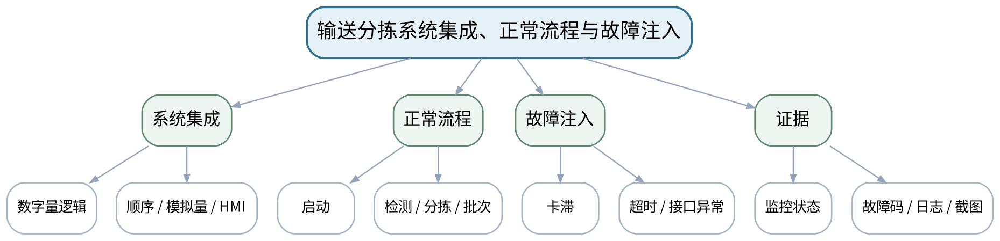

### 教学目标
**知识目标：**
1. 综合理解数字量逻辑、顺序控制、模拟量、HMI和故障状态的接口关系。
2. 理解系统级测试必须覆盖正常、边界与故障路径。

**能力目标：**
1. 能够集成前三次上机成果，完成输送分拣单元主要正常流程。
2. 能够注入传感器卡滞、执行超时、接口异常并固化故障现象。

**价值目标：**
1. 形成联调先检查接口、故障先复现、真实设备不旁路安全保护的工程责任意识。

### 课程思政
严格区分急停反馈逻辑演示与真实安全功能验证；不得旁路安全保护、强制危险输出或虚构运行记录。

### 专创融合
将综合工程RC1作为接近交付的控制系统候选版本，采用接口审查、测试清单和缺陷列表管理质量。

### 教学重难点
**教学重点：**模块集成、正常流程验收与故障注入。

**教学难点：**区分模块自身正确和系统接口正确；故障注入必须可恢复、可记录且不越过安全边界。

### 教学方法与用具
**教学方法：**问题驱动法、时序推演法、状态建模法、教师演示法、任务驱动法、预测—运行—验证法、测试验收与故障复盘

**教学用具：**机房、TIA Portal、S7-PLCSIM/HMI仿真、综合任务书、测试清单。

### 教学设计
课前任务 → 互动导入（10 min）→ 传授新知与课堂训练（75 min）→ 过关检测（10 min）→ 课堂小结（3 min）→ 作业布置（1 min）→ 考勤（1 min）

### 课前任务
【教师】发布“输送分拣系统集成、正常流程与故障注入”对应大纲/教材范围和一个最小控制问题，不提前给出完整程序答案。

1. 阅读对应大纲与教材内容；
2. 圈出3个关键术语并记录至少1个疑问；
3. 检查TIA Portal/S7-PLCSIM/HMI仿真环境、上一阶段工程和任务文件是否可用；未经教师确认不得连接真实负载、强制输出或修改保护逻辑。

【学生】完成准备并带着“预期状态/疑问/已有证据”进入课堂。

### 互动导入
【教师】先让各组只按接口表核对变量、数据类型、状态和HMI映射，不立即运行完整流程；随后再做正常批次测试。

【学生】先独立预测/画时序/状态，再与同伴交换判断依据；教师收集典型分歧后进入本课。

### 传授新知与课堂训练
**一、任务说明与工程/逻辑骨架（约20 min）—集成检查**

【教师】复用上机一至三工程，核对I/O、模块接口、状态变量、模拟量/HMI标签和参数，消除编译/映射问题。

【学生】按任务约束独立/小组实现，先写预期状态/时序再运行；用监控表或仿真验证，保留工程、参数、故障信息和测试证据。

**二、学生独立/小组实现（约35 min）—正常验收**

【教师】执行至少一个完整输送—检测—分拣—批次流程，记录状态、动作、HMI和关键计数/报警。

【学生】按任务约束独立/小组实现，先写预期状态/时序再运行；用监控表或仿真验证，保留工程、参数、故障信息和测试证据。

**三、测试、调试与证据固化（约20 min）—故障注入**

【教师】模拟传感器卡滞、执行超时、接口心跳异常等，要求系统进入预期故障状态并保留完整现象证据。

【学生】按任务约束独立/小组实现，先写预期状态/时序再运行；用监控表或仿真验证，保留工程、参数、故障信息和测试证据。

**独立学习产物**：综合工程RC1＋正常流程记录＋故障注入记录。

**学习证据**：工程版本、接口核对表、正常状态轨迹、故障码/监控证据、未解决问题清单。

**评价映射**：课程作业上机四（25%）前半＋期末综合考查60%；全部课程目标。

### 过关检测
【教师】组织当堂检测：

1. 模块单独测试通过为什么仍可能集成失败？
2. 故障注入前需要先确认哪些恢复条件？
3. 什么证据能证明系统是在预期故障状态而不是“程序卡死”？

【学生】独立作答/推演/运行验证；【教师】按错误类型讲解，要求说明时序、状态、I/O或测试依据。

### 课堂小结
【教师】回到本课知识脉络图，用“需求/I/O—扫描/状态—程序—监控/测试—故障/边界—交付”总结“输送分拣系统集成、正常流程与故障注入”，再次强调教学重点：模块集成、正常流程验收与故障注入。

【学生】写下“本课一条最重要的控制规则 + 一个最容易忽略的边界”。

### 作业布置
【教师】布置课后任务：根据故障注入记录定位至少1个问题，准备下一课修复、回归、节能比较和最终备份。

【学生】按课程文件命名与证据要求整理提交；仿真、接口模拟和真实设备验证必须明确区分。

### 考勤
【教师】利用学校/课程实际使用的平台进行签到。

【学生】按课程要求完成签到。

### 课后教学反思
【课后填写，不预填事实】

1. 教学流程：记录100 min各环节实际用时、理论/上机切换及调整点；
2. 教学内容：重点记录“区分模块自身正确和系统接口正确；故障注入必须可恢复、可记录且不越过安全边界。”的真实掌握证据和常见错误；
3. 学生参与：仅依据实际课堂记录填写时序推演、LAD编程、状态/接口设计、仿真调试和讨论情况，不补写推测；
4. 评价证据：检查本课工程、I/O/状态/变量表、监控数据、故障记录、测试与版本说明是否完整，记录缺项原因；
5. 后续改进：依据真实课堂证据决定下一次课的补救、复现或拓展。

### 本章节参考文献
[1] 廖常初.《S7-1200 PLC编程及应用（第5版）》[M]. 机械工业出版社，2026。
[3] 廖常初.《西门子人机界面（触摸屏）组态与应用技术（第4版）》[M]. 机械工业出版社，2025。
[4] 张跟华.《西门子S7-1200 PLC编程与应用实例》[M]. 清华大学出版社，2023。

## 第16次课 故障修复、回归测试、节能比较与最终工程交付

### 课次信息
- **章节/单元**：上机四 输送分拣单元联调与诊断
- **周次**：按实际课表填写
- **课时安排**：2课时（100 min）
- **课型**：上机
- **理论/上机分配**：上机2课时（上机四后半）

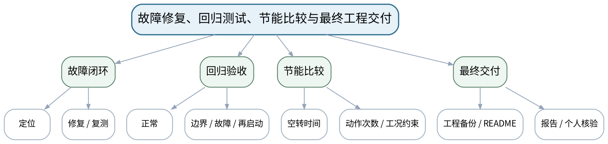

### 教学目标
**知识目标：**
1. 理解问题—修复—复测、回归测试、工程备份和个人核验构成最终交付证据。
2. 理解空转时间/动作次数等节能指标只能在明确工况下比较。

**能力目标：**
1. 能够定位并修复至少一个综合故障，完成正常、边界、故障后的回归测试。
2. 能够提交可复现工程、HMI、I/O/状态/变量表、测试报告和备份，并独立解释关键原理或现场修改。

**价值目标：**
1. 形成诚实记录、责任分工、版本可追溯、对控制结果承担个人解释责任的职业素养。

### 课程思政
强调真实记录、团队责任与个人核验；对真实设备、急停、安全回路和网络性能的结论必须在相应合规条件下验证。

### 专创融合
将完整输送分拣单元作为个人/团队自动化作品原型，形成从需求、控制、HMI、诊断到交付的工程闭环。

### 教学重难点
**教学重点：**故障闭环、回归测试、节能证据和最终可复现交付。

**教学难点：**确保故障后不得自动重启、回归覆盖原功能，并让个人能够独立解释本人提交内容而不是只靠小组成果。

### 教学方法与用具
**教学方法：**问题驱动法、时序推演法、状态建模法、教师演示法、任务驱动法、预测—运行—验证法、测试验收与故障复盘

**教学用具：**机房、TIA Portal、S7-PLCSIM/HMI仿真、测试清单、版本/备份工具。

### 教学设计
课前任务 → 互动导入（10 min）→ 传授新知与课堂训练（75 min）→ 过关检测（10 min）→ 课堂小结（3 min）→ 作业布置（1 min）→ 考勤（1 min）

### 课前任务
【教师】发布“故障修复、回归测试、节能比较与最终工程交付”对应大纲/教材范围和一个最小控制问题，不提前给出完整程序答案。

1. 阅读对应大纲与教材内容；
2. 圈出3个关键术语并记录至少1个疑问；
3. 检查TIA Portal/S7-PLCSIM/HMI仿真环境、上一阶段工程和任务文件是否可用；未经教师确认不得连接真实负载、强制输出或修改保护逻辑。

【学生】完成准备并带着“预期状态/疑问/已有证据”进入课堂。

### 互动导入
【教师】教师随机指定一个参数/状态/故障让学生现场解释或修改，要求先说预期影响，再修改并用复测证明结果。

【学生】先独立预测/画时序/状态，再与同伴交换判断依据；教师收集典型分歧后进入本课。

### 传授新知与课堂训练
**一、任务说明与工程/逻辑骨架（约20 min）—故障修复**

【教师】根据RC1缺陷和监控/交叉引用证据定位问题，最小化修改并记录版本差异。

【学生】按任务约束独立/小组实现，先写预期状态/时序再运行；用监控表或仿真验证，保留工程、参数、故障信息和测试证据。

**二、学生独立/小组实现（约35 min）—回归与节能**

【教师】执行正常、边界、故障/复位/再启动回归；在相同任务条件下比较空转时间或动作次数并解释约束。

【学生】按任务约束独立/小组实现，先写预期状态/时序再运行；用监控表或仿真验证，保留工程、参数、故障信息和测试证据。

**三、测试、调试与证据固化（约20 min）—最终交付与个人核验**

【教师】归档工程、I/O/状态/变量表、HMI、测试、故障闭环、README和备份；完成个人原理解释、现场修改或排错。

【学生】按任务约束独立/小组实现，先写预期状态/时序再运行；用监控表或仿真验证，保留工程、参数、故障信息和测试证据。

**独立学习产物**：上机四/期末综合考查最终交付：PLC工程、HMI、表单、测试报告、故障闭环、备份、README和个人核验记录。

**学习证据**：最终工程哈希/版本、完整测试矩阵、问题—修复—复测、节能比较、备份、个人解释/现场修改结果。

**评价映射**：课程作业上机四（25%）完成＋期末综合考查60%核心验收；全部课程目标。

### 过关检测
【教师】组织当堂检测：

1. 为什么故障修复后的正常流程必须重新测试？
2. 节能比较为什么要保持工况与任务量一致？
3. 怎样证明最终工程是可复现而不是只在当前电脑“碰巧能开”？

【学生】独立作答/推演/运行验证；【教师】按错误类型讲解，要求说明时序、状态、I/O或测试依据。

### 课堂小结
【教师】回到本课知识脉络图，用“需求/I/O—扫描/状态—程序—监控/测试—故障/边界—交付”总结“故障修复、回归测试、节能比较与最终工程交付”，再次强调教学重点：故障闭环、回归测试、节能证据和最终可复现交付。

【学生】写下“本课一条最重要的控制规则 + 一个最容易忽略的边界”。

### 作业布置
【教师】布置课后任务：按实际课程要求提交最终工程与报告；课后反思只依据真实联调/答辩记录填写，不预先补写学生表现。

【学生】按课程文件命名与证据要求整理提交；仿真、接口模拟和真实设备验证必须明确区分。

### 考勤
【教师】利用学校/课程实际使用的平台进行签到。

【学生】按课程要求完成签到。

### 课后教学反思
【课后填写，不预填事实】

1. 教学流程：记录100 min各环节实际用时、理论/上机切换及调整点；
2. 教学内容：重点记录“确保故障后不得自动重启、回归覆盖原功能，并让个人能够独立解释本人提交内容而不是只靠小组成果。”的真实掌握证据和常见错误；
3. 学生参与：仅依据实际课堂记录填写时序推演、LAD编程、状态/接口设计、仿真调试和讨论情况，不补写推测；
4. 评价证据：检查本课工程、I/O/状态/变量表、监控数据、故障记录、测试与版本说明是否完整，记录缺项原因；
5. 后续改进：依据真实课堂证据决定下一次课的补救、复现或拓展。

### 本章节参考文献
[1] 廖常初.《S7-1200 PLC编程及应用（第5版）》[M]. 机械工业出版社，2026。
[3] 廖常初.《西门子人机界面（触摸屏）组态与应用技术（第4版）》[M]. 机械工业出版社，2025。
[4] 张跟华.《西门子S7-1200 PLC编程与应用实例》[M]. 清华大学出版社，2023。
