# 《人工智能技术与应用》教学设计（28次课）

> **Canonical source / 内容权威源**：本 Markdown 与 `images/`、`manifest.json` 共同构成教案语义主源。Word 仅从本源包编译，不作为独立内容主源。

## 课程基本信息
- **课程名称**：人工智能技术与应用
- **课程英文名称**：Artificial Intelligence Technology and Applications
- **课程代码**：25JD31401
- **课程类别**：专业类
- **课程性质**：必修
- **授课学期**：第6学期
- **学分**：3.5
- **总学时**：56（理论24，上机32）
- **适用专业**：智能制造工程
- **授课学院**：机械与动力工程学院
- **先修课程**：线性代数（A）、工程建模与科学计算可视化基础（Python）、程序设计基础（C&C++）Ⅱ
- **后续课程**：机器视觉、智能制造系统、毕业设计（论文）
- **选用教材**：高仑, 付杰, 张福利, 何会兴, 丁宁, 王煜林.《大语言模型原理及应用》[M]. 北京：清华大学出版社，2026. ISBN 9787302705451
- **课程评价**：最终成绩100%=平时表现15%＋上机实验25%＋综合项目25%＋期末考试35%
- **内容依据**：2027版现行课程教学大纲（大纲更新时间：2026年9月）

## 课程总体设计
课程以“经典人工智能基础—大语言模型—知识增强—智能体—多智能体与工程化治理”为知识主线，以“3D打印智能工艺与故障诊断助手”为综合项目载体。理论24学时拆为12次课，上机32学时拆为16次课，共28次课×2课时=56学时。教学坚持“短讲解—原理演示—分段实现—测试验收—错误复盘”，所有技术任务要求保留来源、配置、代码、测试、日志和评价证据。

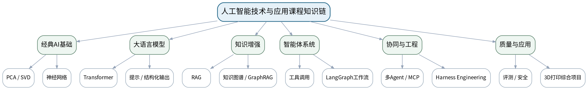

### 课次总览
| 次数 | 类型 | 单元/项目 | 授课题目 | 主要评价 |
|---:|---|---|---|---|
| 1 | 理论 | 第一单元 人工智能基础与表征学习 | 人工智能范式、数据表示与距离 | 平时表现 |
| 2 | 理论 | 第一单元 人工智能基础与表征学习 | PCA、SVD与神经网络：从线性表征到非线性表征 | 平时表现、期末考试 |
| 3 | 上机 | 上机一 PCA、SVD与神经网络基础 | PCA/SVD降维、重建与可视化 | 上机实验 |
| 4 | 上机 | 上机一 PCA、SVD与神经网络基础 | MLP分类、训练曲线与表示对比 | 上机实验 |
| 5 | 理论 | 第二单元 Transformer与大语言模型 | 注意力机制与Transformer结构 | 平时表现、期末考试 |
| 6 | 理论 | 第二单元 Transformer与大语言模型 | LLM推理、提示设计与结构化输出 | 平时表现、期末考试 |
| 7 | 上机 | 上机二 LLM接口与结构化输出 | 模型接口、提示模板与结构化信息提取 | 上机实验 |
| 8 | 上机 | 上机二 LLM接口与结构化输出 | 异常注入、输出校验与调用质量评价 | 上机实验 |
| 9 | 理论 | 第三单元 RAG与知识工程 | Embedding、文本切分、向量检索与重排序 | 平时表现、期末考试 |
| 10 | 理论 | 第三单元 RAG与知识工程 | 知识图谱、图查询与GraphRAG知识增强 | 平时表现、期末考试 |
| 11 | 上机 | 上机四 RAG知识库 | 文档切分、元数据与向量索引构建 | 上机实验 |
| 12 | 上机 | 上机四 RAG知识库 | 带引用回答、重排序与RAG AB评价 | 上机实验 |
| 13 | 上机 | 上机六 知识图谱与知识增强诊断 | 3D打印领域三元组建模与图谱构建 | 上机实验 |
| 14 | 上机 | 上机六 知识图谱与知识增强诊断 | 一跳/多跳查询与知识增强诊断路径 | 上机实验 |
| 15 | 理论 | 第四单元 Agent、工具调用与状态工作流 | Agent Loop：目标、状态、动作、工具、记忆与终止 | 平时表现、期末考试 |
| 16 | 理论 | 第四单元 Agent、工具调用与状态工作流 | 状态机与LangGraph：条件路由、循环、持久化与人工中断 | 平时表现、期末考试 |
| 17 | 上机 | 上机三 工具调用与单Agent Loop | 工具Schema、参数校验与调用分派 | 上机实验 |
| 18 | 上机 | 上机三 工具调用与单Agent Loop | 可终止单Agent Loop、日志与故障注入 | 上机实验 |
| 19 | 上机 | 上机五 LangGraph状态工作流 | 状态、节点、条件边与循环编排 | 上机实验 |
| 20 | 上机 | 上机五 LangGraph状态工作流 | 持久化、人工中断、错误恢复与回归测试 | 上机实验 |
| 21 | 理论 | 第五单元 多Agent、MCP与Harness Engineering | 多Agent角色、消息、共享状态与协调模式 | 平时表现、期末考试 |
| 22 | 理论 | 第五单元 多Agent、MCP与Harness Engineering | MCP、上下文工程、Skill与Harness Engineering | 平时表现、期末考试 |
| 23 | 上机 | 上机七 多Agent、MCP与简化Harness | 多Agent角色、结构化消息与共享状态 | 上机实验 |
| 24 | 上机 | 上机七 多Agent、MCP与简化Harness | MCP工具服务、权限、日志与简化Harness集成 | 上机实验 |
| 25 | 理论 | 第六单元 评测、安全与智能制造综合应用 | LLM/Agent测试集、评价指标与监控 | 平时表现、期末考试 |
| 26 | 理论 | 第六单元 评测、安全与智能制造综合应用 | 提示注入、越权、隐私与3D打印AI系统架构 | 平时表现、期末考试 |
| 27 | 上机 | 上机八 3D打印智能工艺与故障诊断助手 | 综合集成：RAG、知识图谱、工具、工作流与多Agent | 综合项目 |
| 28 | 上机 | 上机八 3D打印智能工艺与故障诊断助手 | 测试、安全验收、现场演示与个人解释 | 综合项目 |

## 第1次课 人工智能范式、数据表示与距离

### 课次信息
- **章节/单元**：第一单元 人工智能基础与表征学习
- **周次**：按实际课表填写
- **课时安排**：2课时（100 min）
- **课型**：理论

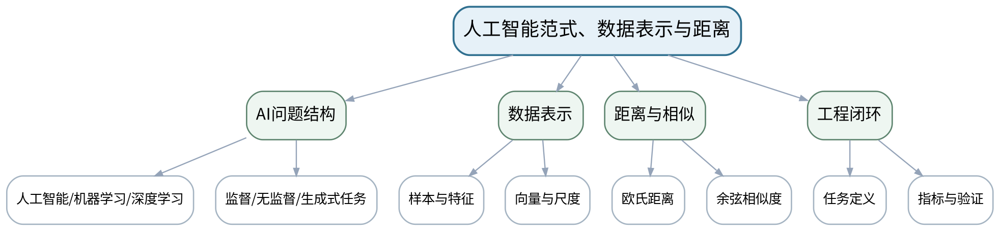

### 教学目标
**知识目标：**
1. 理解人工智能、机器学习、深度学习的基本关系。
2. 掌握样本、特征、标签、向量表示和常见距离/相似度的含义。

**能力目标：**
1. 能够把一个智能制造问题改写为“输入—表示—任务—评价”问题。
2. 能够用Python检查特征尺度并解释距离度量受尺度影响的原因。

**价值目标：**
1. 形成先定义问题和评价标准、再选择模型的工程习惯。

### 课程思政
结合制造数据误判说明“数据质量—数学假设—工程结论”的责任链，要求结论必须有数据和评价依据。

### 专创融合
把任务定义卡视为AI产品的最小需求文档，训练把专业问题转化为可验证的数据产品需求。

### 教学重难点
**教学重点：**AI基本范式；数据表示与任务评价之间的关系。

**教学难点：**把现实工程问题抽象为可计算的数据表示，并避免“先选模型后找问题”。

### 教学方法与用具
**教学方法：**任务驱动法、问题引导法、结构图解法、代码/原理演示法、对比实验法、测试验收与错误复盘

**教学用具：**电脑、投影仪、VS Code、Python、NumPy、scikit-learn、示例制造数据。

### 教学设计
课前任务 → 互动导入（10 min）→ 传授新知与课堂训练（75 min）→ 过关检测（10 min）→ 课堂小结（3 min）→ 作业布置（1 min）→ 考勤（1 min）

### 课前任务
【教师】发布“人工智能范式、数据表示与距离”阅读/环境准备要求和一个最小问题，不提前给出完整答案。

1. 阅读大纲对应单元与指定教材/资料；
2. 圈出3个核心术语，记录至少1个疑问；
3. 预读一个结构图、公式或代码片段并写出第一判断。

【学生】完成准备并带着问题进入课堂。

### 互动导入
【教师】展示同一组设备数据在不同特征尺度下的近邻变化，提问“数据没变，为什么最近的样本变了？”

【学生】先独立预测/判断，再与同伴交换依据；教师收集典型分歧后进入本课。

### 传授新知与课堂训练
**一、核心概念与结构讲解（约30 min）—范式与任务**

【教师】用制造质量预测、缺陷聚类、文本生成三个例子区分监督、无监督与生成式任务；强调模型只是问题求解链的一环。

【学生】根据教师提供的约束完成对应分析/实现，保留中间结果并说明判断依据。

**二、学生建模/代码/案例练习（约25 min）—表示与距离**

【教师】演示NumPy数组、标准化前后欧氏距离变化和余弦相似度，解释“表示决定可比较性”。

【学生】根据教师提供的约束完成对应分析/实现，保留中间结果并说明判断依据。

**三、对比、验证与错误复盘（约20 min）—课堂建模练习**

【教师】学生以“3D打印缺陷诊断”为例写出输入数据、特征、输出、评价指标和潜在数据偏差；小组互审是否可验证。

【学生】根据教师提供的约束完成对应分析/实现，保留中间结果并说明判断依据。

**独立学习产物**：一页“AI任务定义卡”：问题、输入、表示、输出、评价指标、风险假设。

**学习证据**：任务定义卡+Python距离计算结果+小组互审修改记录。

**评价映射**：平时表现；目标1.1、2.1、3.1。

### 过关检测
【教师】组织当堂检测：

1. 机器学习与深度学习的关系是什么？
2. 为什么特征尺度会影响欧氏距离？
3. 一个可验证的AI任务至少要明确哪些要素？

【学生】独立作答/运行验证；【教师】依据错误类型讲解，要求说明判断依据。

### 课堂小结
【教师】回到本课知识脉络图，用“概念—关系—应用—边界”四个关键词总结“人工智能范式、数据表示与距离”，再次强调教学重点：AI基本范式；数据表示与任务评价之间的关系。

【学生】写下“本课最重要的一条规则 + 一个最容易出错的边界”。

### 作业布置
【教师】布置课后任务：选择一个智能制造场景，补全任务定义卡，并用3—5条数据说明“特征尺度/缺失值”可能怎样影响判断。

【学生】按课程文件命名和证据要求整理提交。

### 考勤
【教师】利用学校/课程实际使用的平台进行签到。

【学生】按课程要求完成签到。

### 课后教学反思
【课后填写，不预填事实】

1. 教学流程：记录100 min各环节实际用时及需要调整的位置；
2. 教学内容：重点记录“把现实工程问题抽象为可计算的数据表示，并避免“先选模型后找问题”。”的真实掌握证据与常见错误；
3. 学生参与：仅依据实际课堂记录独立完成、讨论、调试/互审情况，不补写推测；
4. 评价证据：检查本课产物与证据是否完整，记录缺项及原因；
5. 后续改进：依据真实课堂证据决定下一轮调整。

### 本章节参考文献
[6] 姜伟生.《机器学习（全彩图解+微课+Python编程）》[M]. 清华大学出版社，2024。

## 第2次课 PCA、SVD与神经网络：从线性表征到非线性表征

### 课次信息
- **章节/单元**：第一单元 人工智能基础与表征学习
- **周次**：按实际课表填写
- **课时安排**：2课时（100 min）
- **课型**：理论

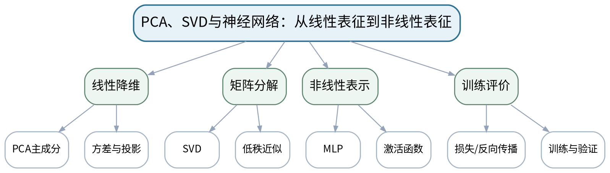

### 教学目标
**知识目标：**
1. 掌握PCA的主方向与方差最大化思想，理解SVD与低秩近似。
2. 理解前馈神经网络、激活函数、损失函数、反向传播与训练流程。

**能力目标：**
1. 能够解释PCA、SVD和MLP分别解决“压缩/重建/非线性分类”的哪类问题。
2. 能够读懂降维图、重建误差和训练/验证曲线。

**价值目标：**
1. 形成通过对照实验判断模型效果而不是只看一次结果的实证意识。

### 课程思政
要求实验同时保留“成功结果”和“失败/不理想结果”，培养不选择性展示数据的科研诚信。

### 专创融合
将降维、压缩和分类视为可组合的数据处理模块，讨论其在边缘设备数据压缩与质量检测中的产品化价值。

### 教学重难点
**教学重点：**PCA/SVD核心思想；神经网络表示学习与训练流程。

**教学难点：**把矩阵分解的线性表示与神经网络非线性表示联系起来，并正确解读评价曲线。

### 教学方法与用具
**教学方法：**任务驱动法、问题引导法、结构图解法、代码/原理演示法、对比实验法、测试验收与错误复盘

**教学用具：**电脑、投影仪、VS Code、Python、NumPy、scikit-learn、PyTorch或等价工具。

### 教学设计
课前任务 → 互动导入（10 min）→ 传授新知与课堂训练（75 min）→ 过关检测（10 min）→ 课堂小结（3 min）→ 作业布置（1 min）→ 考勤（1 min）

### 课前任务
【教师】发布“PCA、SVD与神经网络：从线性表征到非线性表征”阅读/环境准备要求和一个最小问题，不提前给出完整答案。

1. 阅读大纲对应单元与指定教材/资料；
2. 圈出3个核心术语，记录至少1个疑问；
3. 预读一个结构图、公式或代码片段并写出第一判断。

【学生】完成准备并带着问题进入课堂。

### 互动导入
【教师】先给出一张二维PCA散点图和一张MLP训练曲线，让学生判断“哪一张图能证明模型泛化更好”，制造评价冲突。

【学生】先独立预测/判断，再与同伴交换依据；教师收集典型分歧后进入本课。

### 传授新知与课堂训练
**一、核心概念与结构讲解（约30 min）—PCA与SVD**

【教师】用二维几何图解释主成分，用矩阵分解视角解释SVD及低秩近似；说明降维与重建的不同目标。

【学生】根据教师提供的约束完成对应分析/实现，保留中间结果并说明判断依据。

**二、学生建模/代码/案例练习（约25 min）—MLP训练链**

【教师】用最小网络结构说明线性层—激活—损失—反向传播—参数更新；区分训练损失下降与泛化能力。

【学生】根据教师提供的约束完成对应分析/实现，保留中间结果并说明判断依据。

**三、对比、验证与错误复盘（约20 min）—比较与选择**

【教师】学生完成“PCA/SVD/MLP用途对照表”，对制造传感数据压缩、图像近似、缺陷分类分别选方法并说明依据。

【学生】根据教师提供的约束完成对应分析/实现，保留中间结果并说明判断依据。

**独立学习产物**：PCA/SVD/MLP用途对照表及一张手绘/电子训练流程图。

**学习证据**：对照表+流程图+对错误评价结论的修正说明。

**评价映射**：平时表现、期末考试；目标1.1、2.1、3.1。

### 过关检测
【教师】组织当堂检测：

1. PCA为什么需要中心化？
2. SVD低秩近似保留了什么信息？
3. 训练损失持续下降为什么不等于验证性能持续提升？

【学生】独立作答/运行验证；【教师】依据错误类型讲解，要求说明判断依据。

### 课堂小结
【教师】回到本课知识脉络图，用“概念—关系—应用—边界”四个关键词总结“PCA、SVD与神经网络：从线性表征到非线性表征”，再次强调教学重点：PCA/SVD核心思想；神经网络表示学习与训练流程。

【学生】写下“本课最重要的一条规则 + 一个最容易出错的边界”。

### 作业布置
【教师】布置课后任务：预习上机一数据集；写出PCA维数、SVD秩和MLP隐藏层规模三个参数分别会影响什么。

【学生】按课程文件命名和证据要求整理提交。

### 考勤
【教师】利用学校/课程实际使用的平台进行签到。

【学生】按课程要求完成签到。

### 课后教学反思
【课后填写，不预填事实】

1. 教学流程：记录100 min各环节实际用时及需要调整的位置；
2. 教学内容：重点记录“把矩阵分解的线性表示与神经网络非线性表示联系起来，并正确解读评价曲线。”的真实掌握证据与常见错误；
3. 学生参与：仅依据实际课堂记录独立完成、讨论、调试/互审情况，不补写推测；
4. 评价证据：检查本课产物与证据是否完整，记录缺项及原因；
5. 后续改进：依据真实课堂证据决定下一轮调整。

### 本章节参考文献
[6] 姜伟生.《机器学习（全彩图解+微课+Python编程）》[M]. 清华大学出版社，2024。

## 第3次课 PCA/SVD降维、重建与可视化

### 课次信息
- **章节/单元**：上机一 PCA、SVD与神经网络基础
- **周次**：按实际课表填写
- **课时安排**：2课时（100 min）
- **课型**：上机

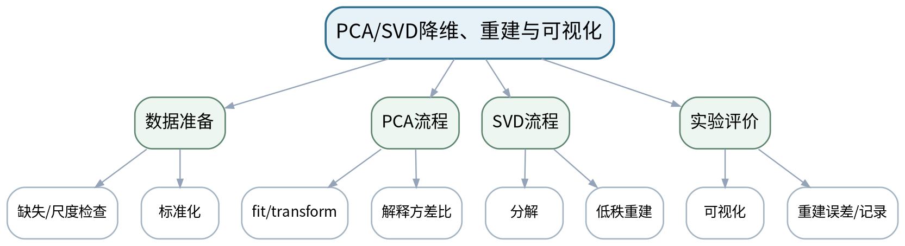

### 教学目标
**知识目标：**
1. 理解PCA拟合/变换、解释方差比和SVD重建误差的程序含义。

**能力目标：**
1. 能够完成数据标准化、PCA降维、SVD低秩重建和可视化。
2. 能够保存参数、随机种子和评价结果形成可复现实验。

**价值目标：**
1. 形成实验过程可重复、结果可追溯的证据意识。

### 课程思政
通过保留全部对照实验结果，强调可重复实验和如实报告误差。

### 专创融合
思考PCA/SVD作为数据预处理组件如何服务于设备数据压缩、可视化和边缘计算。

### 教学重难点
**教学重点：**PCA/SVD完整实验流程与评价。

**教学难点：**避免数据泄漏，并正确解释解释方差比与重建误差。

### 教学方法与用具
**教学方法：**任务驱动法、分段实现法、上机实践法、巡回指导法、故障注入、测试验收、同伴复核与错误复盘

**教学用具：**机房、VS Code/Jupyter、Python、NumPy、scikit-learn、Matplotlib。

### 教学设计
课前任务 → 互动导入（10 min）→ 传授新知与课堂训练（75 min）→ 过关检测（10 min）→ 课堂小结（3 min）→ 作业布置（1 min）→ 考勤（1 min）

### 课前任务
【教师】发布“PCA/SVD降维、重建与可视化”阅读/环境准备要求和一个最小问题，不提前给出完整答案。

1. 阅读大纲对应单元与指定教材/资料；
2. 圈出3个核心术语，记录至少1个疑问；
3. 检查Python/模型/依赖环境与上一任务代码可运行。

【学生】完成准备并带着问题进入课堂。

### 互动导入
【教师】教师提供一份故意把标准化放在全数据上的示例，学生判断这是否会影响后续评价可信度。

【学生】先独立预测/判断，再与同伴交换依据；教师收集典型分歧后进入本课。

### 传授新知与课堂训练
**一、任务说明与最小示范（约20 min）—环境与数据检查**

【教师】加载数据，检查维度、缺失、尺度；划分训练/验证数据并说明预处理只在训练数据上拟合。

【学生】根据教师提供的约束完成对应分析/实现，保留中间结果并说明判断依据。

**二、学生独立/小组实现（约35 min）—PCA与SVD实现**

【教师】学生独立完成PCA二维可视化、累计解释方差曲线；对一个矩阵/图像样例做不同秩SVD重建。

【学生】根据教师提供的约束完成对应分析/实现，保留中间结果并说明判断依据。

**三、测试、调试与证据固化（约20 min）—测试与复盘**

【教师】至少比较3组维数/秩，记录重建误差或信息保留比例；同伴检查代码是否可从头运行。

【学生】根据教师提供的约束完成对应分析/实现，保留中间结果并说明判断依据。

**独立学习产物**：可复现实验目录：notebook/py脚本、参数记录、PCA图、SVD重建图、结果说明。

**学习证据**：源代码+运行截图/图表+参数/随机种子+误差表+复现检查记录。

**评价映射**：上机实验；目标1.1、2.1、3.1。

### 过关检测
【教师】组织当堂检测：

1. 解释方差比表示什么？
2. 为什么标准化的拟合位置会影响实验可信度？
3. 怎样证明你的SVD重建不是只展示了最好的一组？

【学生】独立作答/运行验证；【教师】依据错误类型讲解，要求说明判断依据。

### 课堂小结
【教师】回到本课知识脉络图，用“概念—关系—应用—边界”四个关键词总结“PCA/SVD降维、重建与可视化”，再次强调教学重点：PCA/SVD完整实验流程与评价。

【学生】写下“本课最重要的一条规则 + 一个最容易出错的边界”。

### 作业布置
【教师】布置课后任务：整理实验结果，用100—150字说明一个“降维后信息损失”与一个“低秩近似收益”。

【学生】按课程文件命名和证据要求整理提交。

### 考勤
【教师】利用学校/课程实际使用的平台进行签到。

【学生】按课程要求完成签到。

### 课后教学反思
【课后填写，不预填事实】

1. 教学流程：记录100 min各环节实际用时及需要调整的位置；
2. 教学内容：重点记录“避免数据泄漏，并正确解释解释方差比与重建误差。”的真实掌握证据与常见错误；
3. 学生参与：仅依据实际课堂记录独立完成、讨论、调试/互审情况，不补写推测；
4. 评价证据：检查本课产物与证据是否完整，记录缺项及原因；
5. 后续改进：依据真实课堂证据决定下一轮调整。

### 本章节参考文献
[6] 姜伟生.《机器学习（全彩图解+微课+Python编程）》[M]. 清华大学出版社，2024。

## 第4次课 MLP分类、训练曲线与表示对比

### 课次信息
- **章节/单元**：上机一 PCA、SVD与神经网络基础
- **周次**：按实际课表填写
- **课时安排**：2课时（100 min）
- **课型**：上机

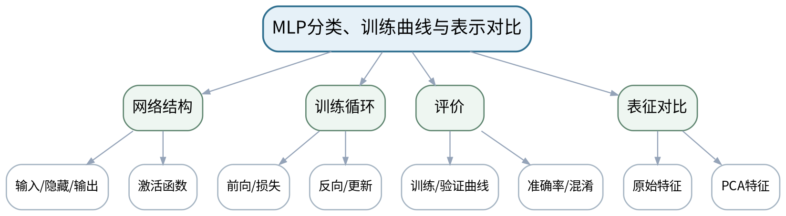

### 教学目标
**知识目标：**
1. 理解数据批次、前向计算、损失、反向传播、优化器和评价指标的代码对应关系。

**能力目标：**
1. 能够训练简单MLP并比较原始特征与PCA低维特征的分类效果。
2. 能够识别过拟合迹象并用验证集证据解释。

**价值目标：**
1. 形成以训练/验证证据而非单次准确率评价模型的习惯。

### 课程思政
强调实验条件一致、失败记录保留和对照公平，避免只追求“高分结果”。

### 专创融合
将“表征→模型→评价”的链条映射到智能制造质量预测小原型，讨论部署前的最小验收标准。

### 教学重难点
**教学重点：**最小MLP训练循环；训练/验证对照评价。

**教学难点：**通过曲线和对照实验判断过拟合与表征变化，而非只看最终准确率。

### 教学方法与用具
**教学方法：**任务驱动法、分段实现法、上机实践法、巡回指导法、故障注入、测试验收、同伴复核与错误复盘

**教学用具：**机房、VS Code/Jupyter、Python、PyTorch或等价工具、scikit-learn。

### 教学设计
课前任务 → 互动导入（10 min）→ 传授新知与课堂训练（75 min）→ 过关检测（10 min）→ 课堂小结（3 min）→ 作业布置（1 min）→ 考勤（1 min）

### 课前任务
【教师】发布“MLP分类、训练曲线与表示对比”阅读/环境准备要求和一个最小问题，不提前给出完整答案。

1. 阅读大纲对应单元与指定教材/资料；
2. 圈出3个核心术语，记录至少1个疑问；
3. 检查Python/模型/依赖环境与上一任务代码可运行。

【学生】完成准备并带着问题进入课堂。

### 互动导入
【教师】展示“训练准确率99%、验证准确率65%”结果，要求学生先给出三种可能原因再看代码。

【学生】先独立预测/判断，再与同伴交换依据；教师收集典型分歧后进入本课。

### 传授新知与课堂训练
**一、任务说明与最小示范（约20 min）—模型搭建**

【教师】教师给最小骨架，学生补全网络、损失和优化器；打印维度检查避免shape错误。

【学生】根据教师提供的约束完成对应分析/实现，保留中间结果并说明判断依据。

**二、学生独立/小组实现（约35 min）—独立训练**

【教师】分别使用原始特征和PCA特征训练同结构MLP，保存训练/验证指标。

【学生】根据教师提供的约束完成对应分析/实现，保留中间结果并说明判断依据。

**三、测试、调试与证据固化（约20 min）—故障注入与验收**

【教师】人为增大学习率或缩小数据量，观察训练异常/过拟合；写出基于曲线的诊断结论。

【学生】根据教师提供的约束完成对应分析/实现，保留中间结果并说明判断依据。

**独立学习产物**：MLP训练脚本+两组对照曲线+评价表+故障注入诊断。

**学习证据**：源代码、环境/随机种子、训练日志、曲线、验证指标、诊断说明。

**评价映射**：上机实验；目标1.1、2.1、3.1。

### 过关检测
【教师】组织当堂检测：

1. 反向传播在代码中发生在哪里？
2. 怎样从训练/验证曲线判断过拟合？
3. 原始特征和PCA特征比较时哪些条件应保持一致？

【学生】独立作答/运行验证；【教师】依据错误类型讲解，要求说明判断依据。

### 课堂小结
【教师】回到本课知识脉络图，用“概念—关系—应用—边界”四个关键词总结“MLP分类、训练曲线与表示对比”，再次强调教学重点：最小MLP训练循环；训练/验证对照评价。

【学生】写下“本课最重要的一条规则 + 一个最容易出错的边界”。

### 作业布置
【教师】布置课后任务：提交上机一实验报告：PCA/SVD/MLP三个小实验及一段“哪些结论可以复现”的说明。

【学生】按课程文件命名和证据要求整理提交。

### 考勤
【教师】利用学校/课程实际使用的平台进行签到。

【学生】按课程要求完成签到。

### 课后教学反思
【课后填写，不预填事实】

1. 教学流程：记录100 min各环节实际用时及需要调整的位置；
2. 教学内容：重点记录“通过曲线和对照实验判断过拟合与表征变化，而非只看最终准确率。”的真实掌握证据与常见错误；
3. 学生参与：仅依据实际课堂记录独立完成、讨论、调试/互审情况，不补写推测；
4. 评价证据：检查本课产物与证据是否完整，记录缺项及原因；
5. 后续改进：依据真实课堂证据决定下一轮调整。

### 本章节参考文献
[6] 姜伟生.《机器学习（全彩图解+微课+Python编程）》[M]. 清华大学出版社，2024。

## 第5次课 注意力机制与Transformer结构

### 课次信息
- **章节/单元**：第二单元 Transformer与大语言模型
- **周次**：按实际课表填写
- **课时安排**：2课时（100 min）
- **课型**：理论

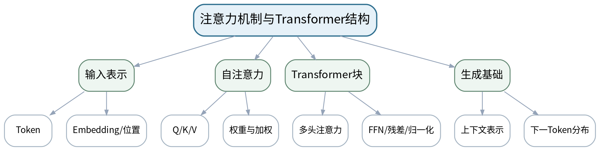

### 教学目标
**知识目标：**
1. 理解Query/Key/Value、自注意力和多头注意力的基本思想。
2. 掌握Transformer中Embedding、位置、注意力、前馈网络和残差/归一化的结构关系。

**能力目标：**
1. 能够沿结构图解释一段Token序列如何逐层形成上下文表示。
2. 能够用小矩阵/可视化解释注意力权重。

**价值目标：**
1. 形成用结构和证据解释模型而不是把大模型视为黑箱的习惯。

### 课程思政
强调模型结构可分析但解释有边界，训练学生区分“机制解释”和“过度解读”。

### 专创融合
讨论Transformer作为通用接口后如何连接文本、图像和制造时序数据的潜在产品形态。

### 教学重难点
**教学重点：**自注意力计算逻辑；Transformer层级结构。

**教学难点：**从矩阵运算理解“上下文相关表示”，避免把注意力权重简单等同于因果解释。

### 教学方法与用具
**教学方法：**任务驱动法、问题引导法、结构图解法、代码/原理演示法、对比实验法、测试验收与错误复盘

**教学用具：**电脑、投影仪、结构图、Python/NumPy可视化示例。

### 教学设计
课前任务 → 互动导入（10 min）→ 传授新知与课堂训练（75 min）→ 过关检测（10 min）→ 课堂小结（3 min）→ 作业布置（1 min）→ 考勤（1 min）

### 课前任务
【教师】发布“注意力机制与Transformer结构”阅读/环境准备要求和一个最小问题，不提前给出完整答案。

1. 阅读大纲对应单元与指定教材/资料；
2. 圈出3个核心术语，记录至少1个疑问；
3. 预读一个结构图、公式或代码片段并写出第一判断。

【学生】完成准备并带着问题进入课堂。

### 互动导入
【教师】给出“主轴温度过高，需要停机检查”一句话，提问同一个“检查”在不同上下文中为何会获得不同表示。

【学生】先独立预测/判断，再与同伴交换依据；教师收集典型分歧后进入本课。

### 传授新知与课堂训练
**一、核心概念与结构讲解（约30 min）—Token与Embedding**

【教师】从文本切分、向量表示进入位置编码/位置信息，解释序列顺序为什么重要。

【学生】根据教师提供的约束完成对应分析/实现，保留中间结果并说明判断依据。

**二、学生建模/代码/案例练习（约25 min）—自注意力**

【教师】用4个Token的小例子展示QK相似度、softmax权重和V加权；说明多头关注不同关系。

【学生】根据教师提供的约束完成对应分析/实现，保留中间结果并说明判断依据。

**三、对比、验证与错误复盘（约20 min）—结构追踪**

【教师】学生分组标注Transformer结构图中数据流，写出“输入—注意力—FFN—输出”的职责说明。

【学生】根据教师提供的约束完成对应分析/实现，保留中间结果并说明判断依据。

**独立学习产物**：一张标注完整的Transformer结构图+自注意力小例计算/解释。

**学习证据**：结构标注图+计算结果+误区纠正记录。

**评价映射**：平时表现、期末考试；目标1.2、2.2、3.2。

### 过关检测
【教师】组织当堂检测：

1. Q、K、V分别承担什么作用？
2. 为什么Transformer需要位置信息？
3. 注意力权重高能否直接证明因果关系？

【学生】独立作答/运行验证；【教师】依据错误类型讲解，要求说明判断依据。

### 课堂小结
【教师】回到本课知识脉络图，用“概念—关系—应用—边界”四个关键词总结“注意力机制与Transformer结构”，再次强调教学重点：自注意力计算逻辑；Transformer层级结构。

【学生】写下“本课最重要的一条规则 + 一个最容易出错的边界”。

### 作业布置
【教师】布置课后任务：用不超过200字解释“Transformer如何让同一个词在不同上下文获得不同表示”。

【学生】按课程文件命名和证据要求整理提交。

### 考勤
【教师】利用学校/课程实际使用的平台进行签到。

【学生】按课程要求完成签到。

### 课后教学反思
【课后填写，不预填事实】

1. 教学流程：记录100 min各环节实际用时及需要调整的位置；
2. 教学内容：重点记录“从矩阵运算理解“上下文相关表示”，避免把注意力权重简单等同于因果解释。”的真实掌握证据与常见错误；
3. 学生参与：仅依据实际课堂记录独立完成、讨论、调试/互审情况，不补写推测；
4. 评价证据：检查本课产物与证据是否完整，记录缺项及原因；
5. 后续改进：依据真实课堂证据决定下一轮调整。

### 本章节参考文献
[1] 高仑等.《大语言模型原理及应用》[M]. 清华大学出版社，2026。

## 第6次课 LLM推理、提示设计与结构化输出

### 课次信息
- **章节/单元**：第二单元 Transformer与大语言模型
- **周次**：按实际课表填写
- **课时安排**：2课时（100 min）
- **课型**：理论

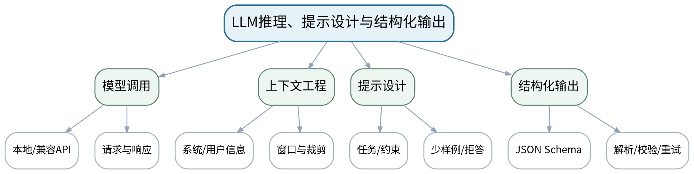

### 教学目标
**知识目标：**
1. 理解上下文窗口、推理/生成、温度等采样参数和指令对齐的应用含义。
2. 掌握提示约束、结构化输出和本地模型/API调用的基本流程。

**能力目标：**
1. 能够把自然语言任务改写为包含角色/输入/约束/输出格式/失败处理的提示。
2. 能够设计JSON Schema/Pydantic式输出并规划校验。

**价值目标：**
1. 形成对模型输出独立核验、保护密钥与敏感数据的安全习惯。

### 课程思政
围绕API密钥、敏感信息和模型拒答强调最小暴露、最小权限与人工核验。

### 专创融合
将结构化输出视为“AI组件接口”，训练从聊天演示转向可集成的软件模块。

### 教学重难点
**教学重点：**可约束提示；结构化输出与异常处理。

**教学难点：**在模型不保证严格服从的前提下设计“生成—解析—校验—恢复”流程。

### 教学方法与用具
**教学方法：**任务驱动法、问题引导法、结构图解法、代码/原理演示法、对比实验法、测试验收与错误复盘

**教学用具：**电脑、投影仪、VS Code、Python、本地模型或兼容API、Pydantic/JSON Schema。

### 教学设计
课前任务 → 互动导入（10 min）→ 传授新知与课堂训练（75 min）→ 过关检测（10 min）→ 课堂小结（3 min）→ 作业布置（1 min）→ 考勤（1 min）

### 课前任务
【教师】发布“LLM推理、提示设计与结构化输出”阅读/环境准备要求和一个最小问题，不提前给出完整答案。

1. 阅读大纲对应单元与指定教材/资料；
2. 圈出3个核心术语，记录至少1个疑问；
3. 预读一个结构图、公式或代码片段并写出第一判断。

【学生】完成准备并带着问题进入课堂。

### 互动导入
【教师】比较两个提示：“判断故障”与“按固定字段返回故障类型、证据、置信说明、无法判断条件”，让学生预测哪一个更便于系统集成。

【学生】先独立预测/判断，再与同伴交换依据；教师收集典型分歧后进入本课。

### 传授新知与课堂训练
**一、核心概念与结构讲解（约30 min）—LLM调用链**

【教师】解释模型选择、消息、上下文窗口、采样参数、响应；不绑定单一厂商。

【学生】根据教师提供的约束完成对应分析/实现，保留中间结果并说明判断依据。

**二、学生建模/代码/案例练习（约25 min）—提示与结构**

【教师】把模糊任务逐步加上输入边界、来源约束、JSON字段和拒答条件；说明提示不是安全边界。

【学生】根据教师提供的约束完成对应分析/实现，保留中间结果并说明判断依据。

**三、对比、验证与错误复盘（约20 min）—校验设计**

【教师】学生为“设备告警文本抽取”设计Schema和三类错误：缺字段、非法类型、无法判断；写出处理策略。

【学生】根据教师提供的约束完成对应分析/实现，保留中间结果并说明判断依据。

**独立学习产物**：“设备告警结构化抽取”提示模板+Schema+异常处理流程图。

**学习证据**：提示版本对比、Schema、3类失败样例与处理策略。

**评价映射**：平时表现、期末考试；目标1.2、2.2、3.2。

### 过关检测
【教师】组织当堂检测：

1. 上下文窗口限制会影响什么？
2. 结构化输出为什么仍需要程序校验？
3. API密钥和敏感制造数据应遵守什么最小暴露原则？

【学生】独立作答/运行验证；【教师】依据错误类型讲解，要求说明判断依据。

### 课堂小结
【教师】回到本课知识脉络图，用“概念—关系—应用—边界”四个关键词总结“LLM推理、提示设计与结构化输出”，再次强调教学重点：可约束提示；结构化输出与异常处理。

【学生】写下“本课最重要的一条规则 + 一个最容易出错的边界”。

### 作业布置
【教师】布置课后任务：为上机二准备一个结构化任务，至少定义5个字段、2条约束和1个拒答条件。

【学生】按课程文件命名和证据要求整理提交。

### 考勤
【教师】利用学校/课程实际使用的平台进行签到。

【学生】按课程要求完成签到。

### 课后教学反思
【课后填写，不预填事实】

1. 教学流程：记录100 min各环节实际用时及需要调整的位置；
2. 教学内容：重点记录“在模型不保证严格服从的前提下设计“生成—解析—校验—恢复”流程。”的真实掌握证据与常见错误；
3. 学生参与：仅依据实际课堂记录独立完成、讨论、调试/互审情况，不补写推测；
4. 评价证据：检查本课产物与证据是否完整，记录缺项及原因；
5. 后续改进：依据真实课堂证据决定下一轮调整。

### 本章节参考文献
[1] 高仑等.《大语言模型原理及应用》[M]. 清华大学出版社，2026。

## 第7次课 模型接口、提示模板与结构化信息提取

### 课次信息
- **章节/单元**：上机二 LLM接口与结构化输出
- **周次**：按实际课表填写
- **课时安排**：2课时（100 min）
- **课型**：上机

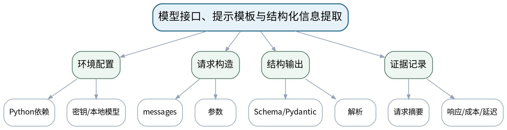

### 教学目标
**知识目标：**
1. 掌握兼容API/本地模型客户端的请求、响应与参数配置。

**能力目标：**
1. 能够完成模型调用、提示模板和结构化解析。
2. 能够使用环境变量/配置文件安全管理密钥并保留调用记录。

**价值目标：**
1. 形成密钥保护、成本记录和输出核验习惯。

### 课程思政
用密钥泄露和敏感数据案例落实最小暴露原则，不在实验报告中粘贴真实密钥。

### 专创融合
把结构化抽取包装成可复用函数/服务接口，思考其在设备告警分流和工单生成中的应用。

### 教学重难点
**教学重点：**模型调用与结构化解析。

**教学难点：**避免把密钥写入代码；处理不同模型返回格式的差异。

### 教学方法与用具
**教学方法：**任务驱动法、分段实现法、上机实践法、巡回指导法、故障注入、测试验收、同伴复核与错误复盘

**教学用具：**机房、VS Code、Python、本地模型或兼容API、Pydantic/JSON Schema。

### 教学设计
课前任务 → 互动导入（10 min）→ 传授新知与课堂训练（75 min）→ 过关检测（10 min）→ 课堂小结（3 min）→ 作业布置（1 min）→ 考勤（1 min）

### 课前任务
【教师】发布“模型接口、提示模板与结构化信息提取”阅读/环境准备要求和一个最小问题，不提前给出完整答案。

1. 阅读大纲对应单元与指定教材/资料；
2. 圈出3个核心术语，记录至少1个疑问；
3. 检查Python/模型/依赖环境与上一任务代码可运行。

【学生】完成准备并带着问题进入课堂。

### 互动导入
【教师】教师展示含硬编码密钥的示例仓库片段，学生指出风险并给出替代配置。

【学生】先独立预测/判断，再与同伴交换依据；教师收集典型分歧后进入本课。

### 传授新知与课堂训练
**一、任务说明与最小示范（约20 min）—环境与最小调用**

【教师】配置依赖、环境变量或本地模型；完成最小“健康检查”请求，记录模型标识与延迟。

【学生】根据教师提供的约束完成对应分析/实现，保留中间结果并说明判断依据。

**二、学生独立/小组实现（约35 min）—结构化任务**

【教师】学生实现设备告警文本→固定JSON字段，加入字段类型和枚举约束。

【学生】根据教师提供的约束完成对应分析/实现，保留中间结果并说明判断依据。

**三、测试、调试与证据固化（约20 min）—对照与复核**

【教师】用2个提示版本处理同一批输入，统计解析成功率/缺字段次数，并保存失败样例。

【学生】根据教师提供的约束完成对应分析/实现，保留中间结果并说明判断依据。

**独立学习产物**：可运行的LLM结构化抽取程序+提示模板+Schema+调用记录。

**学习证据**：源代码、脱敏配置示例、请求/响应样例、解析成功率、成本/延迟记录。

**评价映射**：上机实验；目标1.2、2.2、3.2。

### 过关检测
【教师】组织当堂检测：

1. 怎样证明密钥没有进入源代码？
2. 结构化返回的字段类型在哪一层校验？
3. 比较提示效果时哪些输入必须保持一致？

【学生】独立作答/运行验证；【教师】依据错误类型讲解，要求说明判断依据。

### 课堂小结
【教师】回到本课知识脉络图，用“概念—关系—应用—边界”四个关键词总结“模型接口、提示模板与结构化信息提取”，再次强调教学重点：模型调用与结构化解析。

【学生】写下“本课最重要的一条规则 + 一个最容易出错的边界”。

### 作业布置
【教师】布置课后任务：补充5条边界输入，统计结构化解析成功率并记录至少1条失败原因。

【学生】按课程文件命名和证据要求整理提交。

### 考勤
【教师】利用学校/课程实际使用的平台进行签到。

【学生】按课程要求完成签到。

### 课后教学反思
【课后填写，不预填事实】

1. 教学流程：记录100 min各环节实际用时及需要调整的位置；
2. 教学内容：重点记录“避免把密钥写入代码；处理不同模型返回格式的差异。”的真实掌握证据与常见错误；
3. 学生参与：仅依据实际课堂记录独立完成、讨论、调试/互审情况，不补写推测；
4. 评价证据：检查本课产物与证据是否完整，记录缺项及原因；
5. 后续改进：依据真实课堂证据决定下一轮调整。

### 本章节参考文献
[1] 高仑等.《大语言模型原理及应用》[M]. 清华大学出版社，2026。

## 第8次课 异常注入、输出校验与调用质量评价

### 课次信息
- **章节/单元**：上机二 LLM接口与结构化输出
- **周次**：按实际课表填写
- **课时安排**：2课时（100 min）
- **课型**：上机

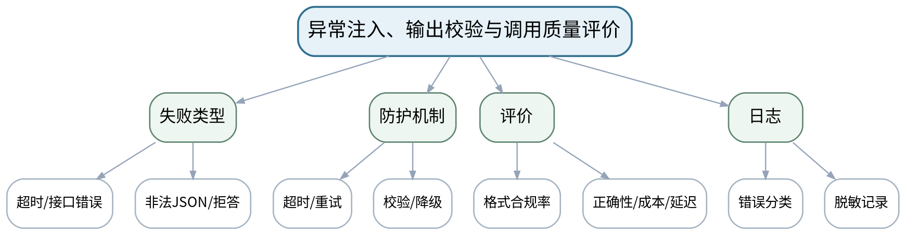

### 教学目标
**知识目标：**
1. 理解超时、限流/调用失败、非法JSON、缺字段、模型拒答等常见失败路径。

**能力目标：**
1. 能够实现超时、重试、解析失败处理和降级返回。
2. 能够用测试集评价正确性、格式合规率、成本与延迟。

**价值目标：**
1. 形成“先设计失败路径，再上线自动化”的工程质量意识。

### 课程思政
用失败注入训练对自动化结果负责的意识，强调日志脱敏和失败可追踪。

### 专创融合
将可靠调用模块作为后续RAG和Agent的底座，建立“AI能力服务化”的工程思维。

### 教学重难点
**教学重点：**异常处理与质量评价。

**教学难点：**重试不是万能策略；区分可重试错误、输入错误和模型能力边界。

### 教学方法与用具
**教学方法：**任务驱动法、分段实现法、上机实践法、巡回指导法、故障注入、测试验收、同伴复核与错误复盘

**教学用具：**机房、VS Code、Python、本地模型或兼容API、pytest或等价测试工具。

### 教学设计
课前任务 → 互动导入（10 min）→ 传授新知与课堂训练（75 min）→ 过关检测（10 min）→ 课堂小结（3 min）→ 作业布置（1 min）→ 考勤（1 min）

### 课前任务
【教师】发布“异常注入、输出校验与调用质量评价”阅读/环境准备要求和一个最小问题，不提前给出完整答案。

1. 阅读大纲对应单元与指定教材/资料；
2. 圈出3个核心术语，记录至少1个疑问；
3. 检查Python/模型/依赖环境与上一任务代码可运行。

【学生】完成准备并带着问题进入课堂。

### 互动导入
【教师】教师主动让解析器接收一条非法JSON和一条缺字段输出，要求学生先写“期待的系统行为”再改代码。

【学生】先独立预测/判断，再与同伴交换依据；教师收集典型分歧后进入本课。

### 传授新知与课堂训练
**一、任务说明与最小示范（约20 min）—错误注入**

【教师】构造超时/异常响应/非法JSON/缺字段/拒答等测试用例；建立错误类型枚举。

【学生】根据教师提供的约束完成对应分析/实现，保留中间结果并说明判断依据。

**二、学生独立/小组实现（约35 min）—恢复策略**

【教师】实现有限重试、Schema校验、默认降级/人工处理标记；禁止无限循环。

【学生】根据教师提供的约束完成对应分析/实现，保留中间结果并说明判断依据。

**三、测试、调试与证据固化（约20 min）—质量小测**

【教师】用10—20条样例统计结构合规率、任务正确率、平均延迟和调用成本/次数；解释失败分布。

【学生】根据教师提供的约束完成对应分析/实现，保留中间结果并说明判断依据。

**独立学习产物**：带异常处理的LLM调用模块+小型测试集+质量统计表。

**学习证据**：测试用例、错误日志、合规率/正确率/延迟/调用次数、恢复策略说明。

**评价映射**：上机实验；目标1.2、2.2、3.2。

### 过关检测
【教师】组织当堂检测：

1. 哪些错误适合重试，哪些不适合？
2. 为什么“返回了JSON”不等于结果正确？
3. 日志中哪些字段需要脱敏？

【学生】独立作答/运行验证；【教师】依据错误类型讲解，要求说明判断依据。

### 课堂小结
【教师】回到本课知识脉络图，用“概念—关系—应用—边界”四个关键词总结“异常注入、输出校验与调用质量评价”，再次强调教学重点：异常处理与质量评价。

【学生】写下“本课最重要的一条规则 + 一个最容易出错的边界”。

### 作业布置
【教师】布置课后任务：形成上机二实验报告，并给出“系统应该拒绝自动继续”的两种场景。

【学生】按课程文件命名和证据要求整理提交。

### 考勤
【教师】利用学校/课程实际使用的平台进行签到。

【学生】按课程要求完成签到。

### 课后教学反思
【课后填写，不预填事实】

1. 教学流程：记录100 min各环节实际用时及需要调整的位置；
2. 教学内容：重点记录“重试不是万能策略；区分可重试错误、输入错误和模型能力边界。”的真实掌握证据与常见错误；
3. 学生参与：仅依据实际课堂记录独立完成、讨论、调试/互审情况，不补写推测；
4. 评价证据：检查本课产物与证据是否完整，记录缺项及原因；
5. 后续改进：依据真实课堂证据决定下一轮调整。

### 本章节参考文献
[1] 高仑等.《大语言模型原理及应用》[M]. 清华大学出版社，2026。

## 第9次课 Embedding、文本切分、向量检索与重排序

### 课次信息
- **章节/单元**：第三单元 RAG与知识工程
- **周次**：按实际课表填写
- **课时安排**：2课时（100 min）
- **课型**：理论

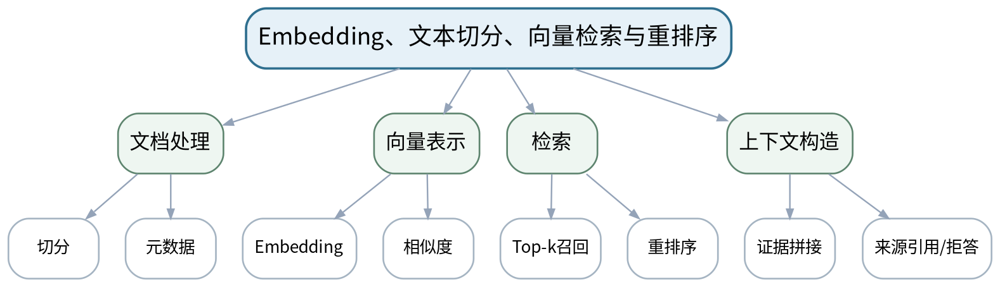

### 教学目标
**知识目标：**
1. 掌握Embedding、Chunk、元数据、向量检索、召回与重排序的基本流程。
2. 理解检索质量、上下文构造与回答质量之间的关系。

**能力目标：**
1. 能够为设备手册/工艺文档设计切分与元数据方案。
2. 能够用“召回证据是否覆盖问题”分析RAG失败。

**价值目标：**
1. 形成来源可追溯、无证据不强答的知识使用意识。

### 课程思政
强调资料版权、版本和来源，要求回答可追踪到具体文档片段。

### 专创融合
把企业手册和工艺规范转化为可检索知识服务，讨论内部知识助手的最小可用产品。

### 教学重难点
**教学重点：**RAG端到端检索链；切分/元数据设计。

**教学难点：**区分检索失败与生成失败，并理解“更多上下文”不一定更好。

### 教学方法与用具
**教学方法：**任务驱动法、问题引导法、结构图解法、代码/原理演示法、对比实验法、测试验收与错误复盘

**教学用具：**电脑、投影仪、Python、Embedding模型、向量检索库示例。

### 教学设计
课前任务 → 互动导入（10 min）→ 传授新知与课堂训练（75 min）→ 过关检测（10 min）→ 课堂小结（3 min）→ 作业布置（1 min）→ 考勤（1 min）

### 课前任务
【教师】发布“Embedding、文本切分、向量检索与重排序”阅读/环境准备要求和一个最小问题，不提前给出完整答案。

1. 阅读大纲对应单元与指定教材/资料；
2. 圈出3个核心术语，记录至少1个疑问；
3. 预读一个结构图、公式或代码片段并写出第一判断。

【学生】完成准备并带着问题进入课堂。

### 互动导入
【教师】对同一设备手册分别用“整篇作为一个Chunk”和“按章节切分”，展示召回结果差异，让学生先解释原因。

【学生】先独立预测/判断，再与同伴交换依据；教师收集典型分歧后进入本课。

### 传授新知与课堂训练
**一、核心概念与结构讲解（约30 min）—RAG链路**

【教师】文档→切分→Embedding→索引→检索→重排→上下文→回答；强调证据链。

【学生】根据教师提供的约束完成对应分析/实现，保留中间结果并说明判断依据。

**二、学生建模/代码/案例练习（约25 min）—切分与元数据**

【教师】比较固定长度、段落/标题切分，讨论设备型号、章节、版本、页码等元数据。

【学生】根据教师提供的约束完成对应分析/实现，保留中间结果并说明判断依据。

**三、对比、验证与错误复盘（约20 min）—失败分析**

【教师】学生针对3个问题检查“召回片段是否含答案”，将失败归类为切分、Embedding、检索、上下文或生成。

【学生】根据教师提供的约束完成对应分析/实现，保留中间结果并说明判断依据。

**独立学习产物**：RAG流程图+文档切分/元数据设计表+失败归因表。

**学习证据**：流程图、切分样例、召回片段、失败归因说明。

**评价映射**：平时表现、期末考试；目标1.3、2.3、3.3。

### 过关检测
【教师】组织当堂检测：

1. 为什么RAG要保留元数据？
2. Top-k增大一定能提高回答质量吗？
3. 如何区分检索失败和生成失败？

【学生】独立作答/运行验证；【教师】依据错误类型讲解，要求说明判断依据。

### 课堂小结
【教师】回到本课知识脉络图，用“概念—关系—应用—边界”四个关键词总结“Embedding、文本切分、向量检索与重排序”，再次强调教学重点：RAG端到端检索链；切分/元数据设计。

【学生】写下“本课最重要的一条规则 + 一个最容易出错的边界”。

### 作业布置
【教师】布置课后任务：选取一份设备/工艺资料，设计Chunk规则和至少4个元数据字段。

【学生】按课程文件命名和证据要求整理提交。

### 考勤
【教师】利用学校/课程实际使用的平台进行签到。

【学生】按课程要求完成签到。

### 课后教学反思
【课后填写，不预填事实】

1. 教学流程：记录100 min各环节实际用时及需要调整的位置；
2. 教学内容：重点记录“区分检索失败与生成失败，并理解“更多上下文”不一定更好。”的真实掌握证据与常见错误；
3. 学生参与：仅依据实际课堂记录独立完成、讨论、调试/互审情况，不补写推测；
4. 评价证据：检查本课产物与证据是否完整，记录缺项及原因；
5. 后续改进：依据真实课堂证据决定下一轮调整。

### 本章节参考文献
[1] 高仑等.《大语言模型原理及应用》[M]. 清华大学出版社，2026。
[5] 孙洪淋等.《知识图谱——从理论到实践》[M]. 清华大学出版社，2025。

## 第10次课 知识图谱、图查询与GraphRAG知识增强

### 课次信息
- **章节/单元**：第三单元 RAG与知识工程
- **周次**：按实际课表填写
- **课时安排**：2课时（100 min）
- **课型**：理论

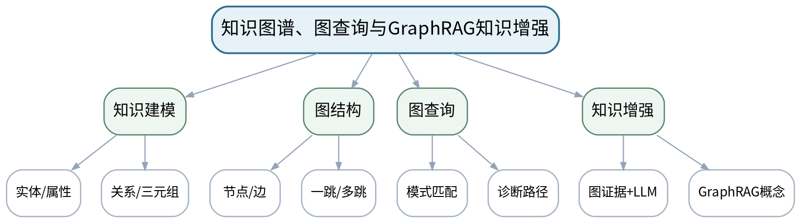

### 教学目标
**知识目标：**
1. 理解实体、关系、属性、三元组和图查询。
2. 掌握一跳/多跳路径与RAG证据链的差异，了解GraphRAG思路。

**能力目标：**
1. 能够把3D打印材料—工艺—缺陷知识抽取为一致命名的三元组。
2. 能够设计一跳/两跳查询并解释诊断路径。

**价值目标：**
1. 形成知识事实来源、关系命名和版本治理意识。

### 课程思政
把事实来源与模型生成内容严格区分，要求未知事实保持未知，不以模型补全替代真实来源。

### 专创融合
讨论可维护的领域知识底座如何服务工艺推荐、故障诊断和培训知识库。

### 教学重难点
**教学重点：**三元组建模与多跳查询；图证据用于诊断。

**教学难点：**确定实体边界与关系语义，避免把自然语言模糊关系直接塞入图谱。

### 教学方法与用具
**教学方法：**任务驱动法、问题引导法、结构图解法、代码/原理演示法、对比实验法、测试验收与错误复盘

**教学用具：**电脑、投影仪、NetworkX/Neo4j演示、图谱可视化工具。

### 教学设计
课前任务 → 互动导入（10 min）→ 传授新知与课堂训练（75 min）→ 过关检测（10 min）→ 课堂小结（3 min）→ 作业布置（1 min）→ 考勤（1 min）

### 课前任务
【教师】发布“知识图谱、图查询与GraphRAG知识增强”阅读/环境准备要求和一个最小问题，不提前给出完整答案。

1. 阅读大纲对应单元与指定教材/资料；
2. 圈出3个核心术语，记录至少1个疑问；
3. 预读一个结构图、公式或代码片段并写出第一判断。

【学生】完成准备并带着问题进入课堂。

### 互动导入
【教师】给出“喷嘴堵塞—挤出不足—层间缺料—表面孔洞”的自然语言链，要求学生判断哪些是实体、哪些是关系。

【学生】先独立预测/判断，再与同伴交换依据；教师收集典型分歧后进入本课。

### 传授新知与课堂训练
**一、核心概念与结构讲解（约30 min）—知识建模**

【教师】从材料、设备、参数、缺陷、原因、措施六类概念构建三元组，强调命名一致。

【学生】根据教师提供的约束完成对应分析/实现，保留中间结果并说明判断依据。

**二、学生建模/代码/案例练习（约25 min）—图查询**

【教师】通过NetworkX/Neo4j示例展示一跳和两跳查询，解释路径就是可审查证据。

【学生】根据教师提供的约束完成对应分析/实现，保留中间结果并说明判断依据。

**三、对比、验证与错误复盘（约20 min）—知识增强比较**

【教师】比较向量RAG、图查询和两者结合；学生为“缺陷诊断”设计一条图谱查询路径。

【学生】根据教师提供的约束完成对应分析/实现，保留中间结果并说明判断依据。

**独立学习产物**：3D打印知识图谱概念模型+10条样例三元组+两条查询路径。

**学习证据**：实体/关系列表、三元组、路径截图/文本、来源字段设计。

**评价映射**：平时表现、期末考试；目标1.3、2.3、3.3。

### 过关检测
【教师】组织当堂检测：

1. 三元组的三个部分分别是什么？
2. 多跳查询为什么更容易暴露知识链路？
3. 知识图谱事实为什么必须记录来源和版本？

【学生】独立作答/运行验证；【教师】依据错误类型讲解，要求说明判断依据。

### 课堂小结
【教师】回到本课知识脉络图，用“概念—关系—应用—边界”四个关键词总结“知识图谱、图查询与GraphRAG知识增强”，再次强调教学重点：三元组建模与多跳查询；图证据用于诊断。

【学生】写下“本课最重要的一条规则 + 一个最容易出错的边界”。

### 作业布置
【教师】布置课后任务：扩展到不少于20条三元组草案，标注来源和关系命名规范，为上机六准备。

【学生】按课程文件命名和证据要求整理提交。

### 考勤
【教师】利用学校/课程实际使用的平台进行签到。

【学生】按课程要求完成签到。

### 课后教学反思
【课后填写，不预填事实】

1. 教学流程：记录100 min各环节实际用时及需要调整的位置；
2. 教学内容：重点记录“确定实体边界与关系语义，避免把自然语言模糊关系直接塞入图谱。”的真实掌握证据与常见错误；
3. 学生参与：仅依据实际课堂记录独立完成、讨论、调试/互审情况，不补写推测；
4. 评价证据：检查本课产物与证据是否完整，记录缺项及原因；
5. 后续改进：依据真实课堂证据决定下一轮调整。

### 本章节参考文献
[5] 孙洪淋等.《知识图谱——从理论到实践》[M]. 清华大学出版社，2025。

## 第11次课 文档切分、元数据与向量索引构建

### 课次信息
- **章节/单元**：上机四 RAG知识库
- **周次**：按实际课表填写
- **课时安排**：2课时（100 min）
- **课型**：上机

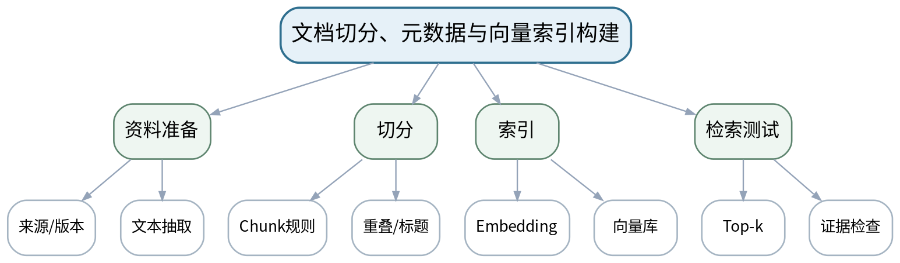

### 教学目标
**知识目标：**
1. 理解RAG索引构建中Chunk、Embedding和元数据的代码对应。

**能力目标：**
1. 能够从设备手册/工艺规范构建可检索向量索引。
2. 能够设计测试问题并检查召回片段。

**价值目标：**
1. 形成资料来源和版本可追溯的知识工程习惯。

### 课程思政
要求资料来源、版本和引用片段完整记录，落实知识版权与事实核验。

### 专创融合
将索引构建流程封装为可更新模块，讨论企业知识库增量维护。

### 教学重难点
**教学重点：**RAG索引构建和召回测试。

**教学难点：**元数据、切分与索引必须同步，避免检索到片段却无法定位来源。

### 教学方法与用具
**教学方法：**任务驱动法、分段实现法、上机实践法、巡回指导法、故障注入、测试验收、同伴复核与错误复盘

**教学用具：**机房、VS Code、Python、Embedding模型、向量检索库、课程许可文档。

### 教学设计
课前任务 → 互动导入（10 min）→ 传授新知与课堂训练（75 min）→ 过关检测（10 min）→ 课堂小结（3 min）→ 作业布置（1 min）→ 考勤（1 min）

### 课前任务
【教师】发布“文档切分、元数据与向量索引构建”阅读/环境准备要求和一个最小问题，不提前给出完整答案。

1. 阅读大纲对应单元与指定教材/资料；
2. 圈出3个核心术语，记录至少1个疑问；
3. 检查Python/模型/依赖环境与上一任务代码可运行。

【学生】完成准备并带着问题进入课堂。

### 互动导入
【教师】教师给出两份同名不同版本的工艺规范，学生先决定元数据中必须加入哪些字段才能避免混淆。

【学生】先独立预测/判断，再与同伴交换依据；教师收集典型分歧后进入本课。

### 传授新知与课堂训练
**一、任务说明与最小示范（约20 min）—资料清洗**

【教师】选择课程提供/允许使用的设备手册或工艺资料，记录来源、版本、标题和章节。

【学生】根据教师提供的约束完成对应分析/实现，保留中间结果并说明判断依据。

**二、学生独立/小组实现（约35 min）—切分与索引**

【教师】实现标题/段落或固定长度切分，生成Embedding并写入向量库。

【学生】根据教师提供的约束完成对应分析/实现，保留中间结果并说明判断依据。

**三、测试、调试与证据固化（约20 min）—召回验收**

【教师】构造至少10个问题，检查Top-k片段是否覆盖答案；记录未召回问题并分析原因。

【学生】根据教师提供的约束完成对应分析/实现，保留中间结果并说明判断依据。

**独立学习产物**：RAG索引构建脚本+文档清单+Chunk样例+检索测试集。

**学习证据**：源代码、文档来源表、索引统计、10条问题的召回片段与命中记录。

**评价映射**：上机实验；目标1.3、2.3、3.3。

### 过关检测
【教师】组织当堂检测：

1. 怎样从检索片段反查原文？
2. 为什么同一文档不同版本必须区分？
3. 一条问题未召回时先改提示还是先查检索链？

【学生】独立作答/运行验证；【教师】依据错误类型讲解，要求说明判断依据。

### 课堂小结
【教师】回到本课知识脉络图，用“概念—关系—应用—边界”四个关键词总结“文档切分、元数据与向量索引构建”，再次强调教学重点：RAG索引构建和召回测试。

【学生】写下“本课最重要的一条规则 + 一个最容易出错的边界”。

### 作业布置
【教师】布置课后任务：针对未召回的3类问题调整切分/Top-k/元数据方案并记录前后差异。

【学生】按课程文件命名和证据要求整理提交。

### 考勤
【教师】利用学校/课程实际使用的平台进行签到。

【学生】按课程要求完成签到。

### 课后教学反思
【课后填写，不预填事实】

1. 教学流程：记录100 min各环节实际用时及需要调整的位置；
2. 教学内容：重点记录“元数据、切分与索引必须同步，避免检索到片段却无法定位来源。”的真实掌握证据与常见错误；
3. 学生参与：仅依据实际课堂记录独立完成、讨论、调试/互审情况，不补写推测；
4. 评价证据：检查本课产物与证据是否完整，记录缺项及原因；
5. 后续改进：依据真实课堂证据决定下一轮调整。

### 本章节参考文献
[1] 高仑等.《大语言模型原理及应用》[M]. 清华大学出版社，2026。

## 第12次课 带引用回答、重排序与RAG AB评价

### 课次信息
- **章节/单元**：上机四 RAG知识库
- **周次**：按实际课表填写
- **课时安排**：2课时（100 min）
- **课型**：上机

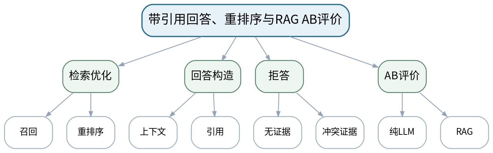

### 教学目标
**知识目标：**
1. 理解召回、重排序、上下文构造、引用回答和RAG评价链。

**能力目标：**
1. 能够实现带来源片段的RAG回答。
2. 能够比较纯LLM与RAG在正确性、可追溯性和拒答上的差异。

**价值目标：**
1. 形成“无证据则拒答/降级”的可靠知识服务意识。

### 课程思政
强调“有引用≠一定正确”，培养对证据质量和模型输出的双重核验。

### 专创融合
把RAG评价指标转化为知识助手验收清单，服务后续综合项目。

### 教学重难点
**教学重点：**带引用回答和AB评价。

**教学难点：**判断“召回了相关文本”与“回答正确且被证据支持”的差别。

### 教学方法与用具
**教学方法：**任务驱动法、分段实现法、上机实践法、巡回指导法、故障注入、测试验收、同伴复核与错误复盘

**教学用具：**机房、VS Code、Python、向量检索库、LLM接口、本地测试集。

### 教学设计
课前任务 → 互动导入（10 min）→ 传授新知与课堂训练（75 min）→ 过关检测（10 min）→ 课堂小结（3 min）→ 作业布置（1 min）→ 考勤（1 min）

### 课前任务
【教师】发布“带引用回答、重排序与RAG AB评价”阅读/环境准备要求和一个最小问题，不提前给出完整答案。

1. 阅读大纲对应单元与指定教材/资料；
2. 圈出3个核心术语，记录至少1个疑问；
3. 检查Python/模型/依赖环境与上一任务代码可运行。

【学生】完成准备并带着问题进入课堂。

### 互动导入
【教师】同一问题分别让纯LLM和RAG回答，隐藏来源后让学生先判断哪个“听起来更像真的”，再展示证据。

【学生】先独立预测/判断，再与同伴交换依据；教师收集典型分歧后进入本课。

### 传授新知与课堂训练
**一、任务说明与最小示范（约20 min）—RAG回答器**

【教师】将Top-k/重排序片段组装上下文，要求输出答案+来源标识；无足够证据时拒答。

【学生】根据教师提供的约束完成对应分析/实现，保留中间结果并说明判断依据。

**二、学生独立/小组实现（约35 min）—AB测试**

【教师】使用小型测试集比较纯LLM和RAG的正确性、引用完整性、无证据拒答率。

【学生】根据教师提供的约束完成对应分析/实现，保留中间结果并说明判断依据。

**三、测试、调试与证据固化（约20 min）—错误复盘**

【教师】挑选至少2条“有检索但答错”和2条“没检索到”的案例，分别改检索或回答策略。

【学生】根据教师提供的约束完成对应分析/实现，保留中间结果并说明判断依据。

**独立学习产物**：带引用RAG问答程序+AB测试报告+失败案例复盘。

**学习证据**：代码、测试集、来源片段、评价表、拒答案例、改进前后对比。

**评价映射**：上机实验；目标1.3、2.3、3.3。

### 过关检测
【教师】组织当堂检测：

1. 带引用为什么仍不能自动证明答案正确？
2. 纯LLM和RAG的比较至少应固定哪些条件？
3. 什么情况下系统应该拒答？

【学生】独立作答/运行验证；【教师】依据错误类型讲解，要求说明判断依据。

### 课堂小结
【教师】回到本课知识脉络图，用“概念—关系—应用—边界”四个关键词总结“带引用回答、重排序与RAG AB评价”，再次强调教学重点：带引用回答和AB评价。

【学生】写下“本课最重要的一条规则 + 一个最容易出错的边界”。

### 作业布置
【教师】布置课后任务：完成上机四实验报告，保留一个“RAG也失败”的案例并给出根因。

【学生】按课程文件命名和证据要求整理提交。

### 考勤
【教师】利用学校/课程实际使用的平台进行签到。

【学生】按课程要求完成签到。

### 课后教学反思
【课后填写，不预填事实】

1. 教学流程：记录100 min各环节实际用时及需要调整的位置；
2. 教学内容：重点记录“判断“召回了相关文本”与“回答正确且被证据支持”的差别。”的真实掌握证据与常见错误；
3. 学生参与：仅依据实际课堂记录独立完成、讨论、调试/互审情况，不补写推测；
4. 评价证据：检查本课产物与证据是否完整，记录缺项及原因；
5. 后续改进：依据真实课堂证据决定下一轮调整。

### 本章节参考文献
[1] 高仑等.《大语言模型原理及应用》[M]. 清华大学出版社，2026。

## 第13次课 3D打印领域三元组建模与图谱构建

### 课次信息
- **章节/单元**：上机六 知识图谱与知识增强诊断
- **周次**：按实际课表填写
- **课时安排**：2课时（100 min）
- **课型**：上机

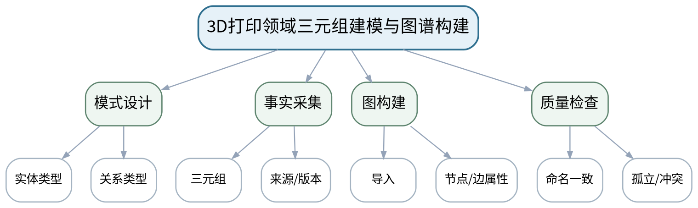

### 教学目标
**知识目标：**
1. 理解实体类型、关系类型、三元组、属性和来源字段。

**能力目标：**
1. 能够构建不少于30条3D打印领域三元组并导入NetworkX/Neo4j。
2. 能够发现命名不一致、孤立节点和冲突关系。

**价值目标：**
1. 形成知识质量、来源、版本和一致性管理意识。

### 课程思政
以知识事实的来源和版本治理说明工程数据治理责任。

### 专创融合
讨论把图谱Schema作为领域知识产品接口，便于后续智能体和RAG复用。

### 教学重难点
**教学重点：**领域三元组与图谱质量检查。

**教学难点：**从自然语言事实抽取稳定关系，并保持同义词/命名一致。

### 教学方法与用具
**教学方法：**任务驱动法、分段实现法、上机实践法、巡回指导法、故障注入、测试验收、同伴复核与错误复盘

**教学用具：**机房、Python、NetworkX或Neo4j、课程资料、图谱可视化工具。

### 教学设计
课前任务 → 互动导入（10 min）→ 传授新知与课堂训练（75 min）→ 过关检测（10 min）→ 课堂小结（3 min）→ 作业布置（1 min）→ 考勤（1 min）

### 课前任务
【教师】发布“3D打印领域三元组建模与图谱构建”阅读/环境准备要求和一个最小问题，不提前给出完整答案。

1. 阅读大纲对应单元与指定教材/资料；
2. 圈出3个核心术语，记录至少1个疑问；
3. 检查Python/模型/依赖环境与上一任务代码可运行。

【学生】完成准备并带着问题进入课堂。

### 互动导入
【教师】教师给出“喷嘴/喷头”“堵塞/阻塞”等同义写法，要求学生判断直接入图会造成什么问题。

【学生】先独立预测/判断，再与同伴交换依据；教师收集典型分歧后进入本课。

### 传授新知与课堂训练
**一、任务说明与最小示范（约20 min）—Schema草案**

【教师】确定材料、设备、参数、缺陷、原因、措施等实体类型和关系命名规范。

【学生】根据教师提供的约束完成对应分析/实现，保留中间结果并说明判断依据。

**二、学生独立/小组实现（约35 min）—图谱构建**

【教师】从课程资料中构建≥30条三元组，保存来源和版本；导入NetworkX/Neo4j。

【学生】根据教师提供的约束完成对应分析/实现，保留中间结果并说明判断依据。

**三、测试、调试与证据固化（约20 min）—质量检查**

【教师】统计节点/边、孤立节点、重复/冲突关系；同伴按关系命名规范抽查10条事实。

【学生】根据教师提供的约束完成对应分析/实现，保留中间结果并说明判断依据。

**独立学习产物**：领域知识图谱文件/数据库+Schema说明+≥30条三元组+质量检查表。

**学习证据**：三元组表、来源字段、图谱截图、节点/边统计、同伴抽查记录。

**评价映射**：上机实验；目标1.3、2.3、3.3。

### 过关检测
【教师】组织当堂检测：

1. 同义实体不统一会造成什么检索问题？
2. 一条图谱事实最少应保留哪些来源信息？
3. 怎样发现孤立节点和重复关系？

【学生】独立作答/运行验证；【教师】依据错误类型讲解，要求说明判断依据。

### 课堂小结
【教师】回到本课知识脉络图，用“概念—关系—应用—边界”四个关键词总结“3D打印领域三元组建模与图谱构建”，再次强调教学重点：领域三元组与图谱质量检查。

【学生】写下“本课最重要的一条规则 + 一个最容易出错的边界”。

### 作业布置
【教师】布置课后任务：修正质量检查发现的问题，并补充5条“原因→措施”或“缺陷→参数”关系。

【学生】按课程文件命名和证据要求整理提交。

### 考勤
【教师】利用学校/课程实际使用的平台进行签到。

【学生】按课程要求完成签到。

### 课后教学反思
【课后填写，不预填事实】

1. 教学流程：记录100 min各环节实际用时及需要调整的位置；
2. 教学内容：重点记录“从自然语言事实抽取稳定关系，并保持同义词/命名一致。”的真实掌握证据与常见错误；
3. 学生参与：仅依据实际课堂记录独立完成、讨论、调试/互审情况，不补写推测；
4. 评价证据：检查本课产物与证据是否完整，记录缺项及原因；
5. 后续改进：依据真实课堂证据决定下一轮调整。

### 本章节参考文献
[5] 孙洪淋等.《知识图谱——从理论到实践》[M]. 清华大学出版社，2025。

## 第14次课 一跳/多跳查询与知识增强诊断路径

### 课次信息
- **章节/单元**：上机六 知识图谱与知识增强诊断
- **周次**：按实际课表填写
- **课时安排**：2课时（100 min）
- **课型**：上机

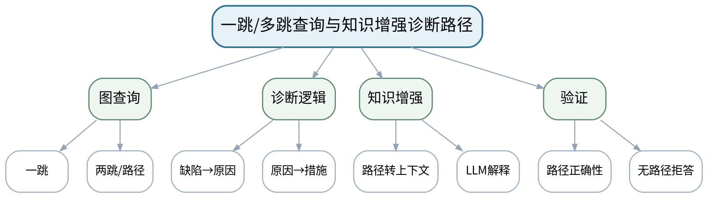

### 教学目标
**知识目标：**
1. 理解图查询、路径、子图和诊断证据链。

**能力目标：**
1. 能够实现一跳/两跳查询并将路径用于故障/缺陷诊断。
2. 能够把图谱结果作为LLM/RAG证据并保留路径。

**价值目标：**
1. 形成“诊断建议必须可追溯到事实链”的责任意识。

### 课程思政
以高风险诊断为例强调“模型不能替代事实来源”，保留人工最终判断。

### 专创融合
将图查询封装为工具接口，为后续Agent调用做准备。

### 教学重难点
**教学重点：**多跳诊断路径与知识增强。

**教学难点：**区分“图谱找路径”与“LLM组织语言”，避免模型擅自扩展图谱事实。

### 教学方法与用具
**教学方法：**任务驱动法、分段实现法、上机实践法、巡回指导法、故障注入、测试验收、同伴复核与错误复盘

**教学用具：**机房、Python、NetworkX/Neo4j、LLM接口、图谱数据。

### 教学设计
课前任务 → 互动导入（10 min）→ 传授新知与课堂训练（75 min）→ 过关检测（10 min）→ 课堂小结（3 min）→ 作业布置（1 min）→ 考勤（1 min）

### 课前任务
【教师】发布“一跳/多跳查询与知识增强诊断路径”阅读/环境准备要求和一个最小问题，不提前给出完整答案。

1. 阅读大纲对应单元与指定教材/资料；
2. 圈出3个核心术语，记录至少1个疑问；
3. 检查Python/模型/依赖环境与上一任务代码可运行。

【学生】完成准备并带着问题进入课堂。

### 互动导入
【教师】给出一个图谱中不存在的“缺陷→原因”关系，观察LLM是否会补全；要求学生设计拒绝越过图谱证据的约束。

【学生】先独立预测/判断，再与同伴交换依据；教师收集典型分歧后进入本课。

### 传授新知与课堂训练
**一、任务说明与最小示范（约20 min）—图查询实现**

【教师】完成缺陷→原因、原因→措施等一跳查询，以及缺陷→原因→措施两跳路径。

【学生】根据教师提供的约束完成对应分析/实现，保留中间结果并说明判断依据。

**二、学生独立/小组实现（约35 min）—与LLM结合**

【教师】将结构化路径交给LLM生成解释，答案必须返回路径节点/关系；无路径时明确拒答。

【学生】根据教师提供的约束完成对应分析/实现，保留中间结果并说明判断依据。

**三、测试、调试与证据固化（约20 min）—诊断验收**

【教师】构造正常、有多条路径、无路径和冲突事实四类测试，检查输出是否符合证据。

【学生】根据教师提供的约束完成对应分析/实现，保留中间结果并说明判断依据。

**独立学习产物**：知识增强诊断程序+查询脚本+4类测试+路径可视化。

**学习证据**：查询代码、路径输出、LLM解释、无路径拒答、冲突案例处理记录。

**评价映射**：上机实验；目标1.3、2.3、3.3。

### 过关检测
【教师】组织当堂检测：

1. LLM在图谱增强诊断中应承担什么，不应承担什么？
2. 多跳路径为什么比单条文本更利于审计？
3. 无路径时怎样处理最可靠？

【学生】独立作答/运行验证；【教师】依据错误类型讲解，要求说明判断依据。

### 课堂小结
【教师】回到本课知识脉络图，用“概念—关系—应用—边界”四个关键词总结“一跳/多跳查询与知识增强诊断路径”，再次强调教学重点：多跳诊断路径与知识增强。

【学生】写下“本课最重要的一条规则 + 一个最容易出错的边界”。

### 作业布置
【教师】布置课后任务：完成上机六报告，并选1个冲突事实案例说明如何保守输出。

【学生】按课程文件命名和证据要求整理提交。

### 考勤
【教师】利用学校/课程实际使用的平台进行签到。

【学生】按课程要求完成签到。

### 课后教学反思
【课后填写，不预填事实】

1. 教学流程：记录100 min各环节实际用时及需要调整的位置；
2. 教学内容：重点记录“区分“图谱找路径”与“LLM组织语言”，避免模型擅自扩展图谱事实。”的真实掌握证据与常见错误；
3. 学生参与：仅依据实际课堂记录独立完成、讨论、调试/互审情况，不补写推测；
4. 评价证据：检查本课产物与证据是否完整，记录缺项及原因；
5. 后续改进：依据真实课堂证据决定下一轮调整。

### 本章节参考文献
[5] 孙洪淋等.《知识图谱——从理论到实践》[M]. 清华大学出版社，2025。
[1] 高仑等.《大语言模型原理及应用》[M]. 清华大学出版社，2026。

## 第15次课 Agent Loop：目标、状态、动作、工具、记忆与终止

### 课次信息
- **章节/单元**：第四单元 Agent、工具调用与状态工作流
- **周次**：按实际课表填写
- **课时安排**：2课时（100 min）
- **课型**：理论

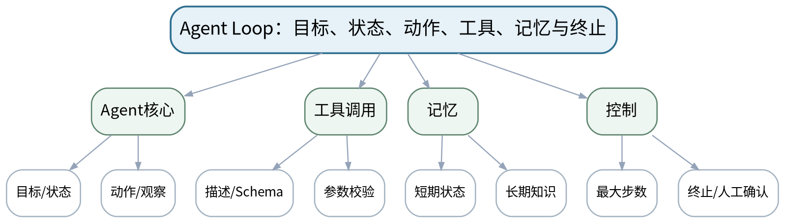

### 教学目标
**知识目标：**
1. 掌握Agent的目标、状态、动作、工具、观察、记忆与终止条件。
2. 理解ReAct、规划—执行与工具调用循环。

**能力目标：**
1. 能够把一个自动化任务画成可终止的Agent Loop。
2. 能够为工具定义清晰描述、参数和权限边界。

**价值目标：**
1. 形成“自动执行必须可终止、可观察、可限制”的责任意识。

### 课程思政
自动化能力越强，越要落实白名单、人工确认和可追溯日志。

### 专创融合
把Agent视为可编排的软件系统而非聊天机器人，训练“能力接口化、控制外置化”。

### 教学重难点
**教学重点：**Agent Loop与工具接口。

**教学难点：**避免把“模型会调用工具”误当成系统有控制；终止、校验和权限必须外置。

### 教学方法与用具
**教学方法：**任务驱动法、问题引导法、结构图解法、代码/原理演示法、对比实验法、测试验收与错误复盘

**教学用具：**电脑、投影仪、Python、LLM接口、工具调用示例。

### 教学设计
课前任务 → 互动导入（10 min）→ 传授新知与课堂训练（75 min）→ 过关检测（10 min）→ 课堂小结（3 min）→ 作业布置（1 min）→ 考勤（1 min）

### 课前任务
【教师】发布“Agent Loop：目标、状态、动作、工具、记忆与终止”阅读/环境准备要求和一个最小问题，不提前给出完整答案。

1. 阅读大纲对应单元与指定教材/资料；
2. 圈出3个核心术语，记录至少1个疑问；
3. 预读一个结构图、公式或代码片段并写出第一判断。

【学生】完成准备并带着问题进入课堂。

### 互动导入
【教师】演示一个没有最大步数的Agent在错误条件下反复调用同一工具，提问“谁来负责停止？”

【学生】先独立预测/判断，再与同伴交换依据；教师收集典型分歧后进入本课。

### 传授新知与课堂训练
**一、核心概念与结构讲解（约30 min）—Agent Loop**

【教师】目标→观察→决策→动作→新观察；区分LLM推理与外部执行。

【学生】根据教师提供的约束完成对应分析/实现，保留中间结果并说明判断依据。

**二、学生建模/代码/案例练习（约25 min）—工具契约**

【教师】工具名、描述、参数Schema、返回结构、错误类型、权限；提示描述不能替代程序校验。

【学生】根据教师提供的约束完成对应分析/实现，保留中间结果并说明判断依据。

**三、对比、验证与错误复盘（约20 min）—控制设计**

【教师】学生为“设备参数查询+计算”画循环，加入最大步数、白名单、人工确认和终止条件。

【学生】根据教师提供的约束完成对应分析/实现，保留中间结果并说明判断依据。

**独立学习产物**：可终止Agent Loop图+2个工具接口契约。

**学习证据**：状态图、工具Schema、权限/终止规则、小组风险审查记录。

**评价映射**：平时表现、期末考试；目标1.4、2.4、3.2、3.4。

### 过关检测
【教师】组织当堂检测：

1. Agent和普通LLM调用的核心差别是什么？
2. 工具描述与参数校验分别解决什么问题？
3. 为什么必须设置最大步数/终止条件？

【学生】独立作答/运行验证；【教师】依据错误类型讲解，要求说明判断依据。

### 课堂小结
【教师】回到本课知识脉络图，用“概念—关系—应用—边界”四个关键词总结“Agent Loop：目标、状态、动作、工具、记忆与终止”，再次强调教学重点：Agent Loop与工具接口。

【学生】写下“本课最重要的一条规则 + 一个最容易出错的边界”。

### 作业布置
【教师】布置课后任务：为上机三设计3—5个工具，写出参数、返回值、错误和权限。

【学生】按课程文件命名和证据要求整理提交。

### 考勤
【教师】利用学校/课程实际使用的平台进行签到。

【学生】按课程要求完成签到。

### 课后教学反思
【课后填写，不预填事实】

1. 教学流程：记录100 min各环节实际用时及需要调整的位置；
2. 教学内容：重点记录“避免把“模型会调用工具”误当成系统有控制；终止、校验和权限必须外置。”的真实掌握证据与常见错误；
3. 学生参与：仅依据实际课堂记录独立完成、讨论、调试/互审情况，不补写推测；
4. 评价证据：检查本课产物与证据是否完整，记录缺项及原因；
5. 后续改进：依据真实课堂证据决定下一轮调整。

### 本章节参考文献
[2] 鲍亮等.《AI智能体应用开发》[M]. 清华大学出版社，2026。
[3] 邓立国, 邓淇文.《AI Agent智能体开发实践》[M]. 清华大学出版社，2025。

## 第16次课 状态机与LangGraph：条件路由、循环、持久化与人工中断

### 课次信息
- **章节/单元**：第四单元 Agent、工具调用与状态工作流
- **周次**：按实际课表填写
- **课时安排**：2课时（100 min）
- **课型**：理论

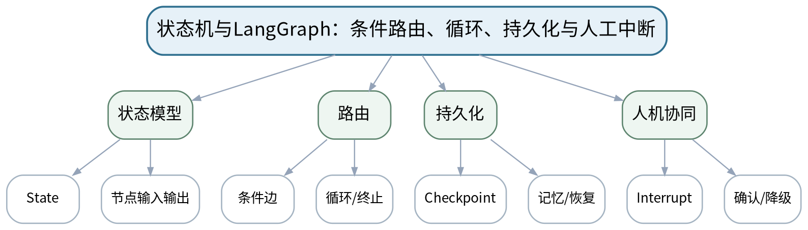

### 教学目标
**知识目标：**
1. 理解状态、节点、边、条件路由、循环、检查点、持久化和人工中断。
2. 理解显式状态工作流相对隐式Agent Loop的可观察与可恢复价值。

**能力目标：**
1. 能够把一个Agent流程拆成状态节点和条件边。
2. 能够设计错误恢复、人工确认和恢复执行路径。

**价值目标：**
1. 形成先设计流程、再授权模型执行的工程控制意识。

### 课程思政
强调高风险操作在流程层设置人工确认，明确自动化与人的最终责任边界。

### 专创融合
将状态图视为AI软件的可测试架构图，为复杂智能流程产品化打基础。

### 教学重难点
**教学重点：**显式状态工作流；错误恢复和人工中断。

**教学难点：**区分“业务状态”和“对话文本”，避免所有信息都塞入单一消息历史。

### 教学方法与用具
**教学方法：**任务驱动法、问题引导法、结构图解法、代码/原理演示法、对比实验法、测试验收与错误复盘

**教学用具：**电脑、投影仪、Python、LangGraph或等价状态机、流程图工具。

### 教学设计
课前任务 → 互动导入（10 min）→ 传授新知与课堂训练（75 min）→ 过关检测（10 min）→ 课堂小结（3 min）→ 作业布置（1 min）→ 考勤（1 min）

### 课前任务
【教师】发布“状态机与LangGraph：条件路由、循环、持久化与人工中断”阅读/环境准备要求和一个最小问题，不提前给出完整答案。

1. 阅读大纲对应单元与指定教材/资料；
2. 圈出3个核心术语，记录至少1个疑问；
3. 预读一个结构图、公式或代码片段并写出第一判断。

【学生】完成准备并带着问题进入课堂。

### 互动导入
【教师】展示同一任务的长Prompt脚本和状态图两种实现，让学生比较哪一个更容易定位失败节点。

【学生】先独立预测/判断，再与同伴交换依据；教师收集典型分歧后进入本课。

### 传授新知与课堂训练
**一、核心概念与结构讲解（约30 min）—状态与节点**

【教师】定义状态字段，节点只处理明确职责，输出更新后的状态。

【学生】根据教师提供的约束完成对应分析/实现，保留中间结果并说明判断依据。

**二、学生建模/代码/案例练习（约25 min）—路由与循环**

【教师】条件边、重试/循环、终止；用LangGraph或等价状态机示例解释执行轨迹。

【学生】根据教师提供的约束完成对应分析/实现，保留中间结果并说明判断依据。

**三、对比、验证与错误复盘（约20 min）—持久化与人工中断**

【教师】Checkpoint、恢复、人工确认；学生为“高风险工艺建议”设计确认节点和失败恢复路径。

【学生】根据教师提供的约束完成对应分析/实现，保留中间结果并说明判断依据。

**独立学习产物**：一张完整LangGraph/状态机设计图+状态字段说明+异常恢复路径。

**学习证据**：状态图、状态Schema、路由条件、人工确认/恢复设计。

**评价映射**：平时表现、期末考试；目标1.4、2.4、3.4。

### 过关检测
【教师】组织当堂检测：

1. 状态机相比单纯Prompt串联的主要优势是什么？
2. 什么信息适合进入State，什么不适合？
3. 人工中断后如何保证恢复时状态一致？

【学生】独立作答/运行验证；【教师】依据错误类型讲解，要求说明判断依据。

### 课堂小结
【教师】回到本课知识脉络图，用“概念—关系—应用—边界”四个关键词总结“状态机与LangGraph：条件路由、循环、持久化与人工中断”，再次强调教学重点：显式状态工作流；错误恢复和人工中断。

【学生】写下“本课最重要的一条规则 + 一个最容易出错的边界”。

### 作业布置
【教师】布置课后任务：把上机三的Agent Loop改画成显式状态图，并标出一个错误恢复节点。

【学生】按课程文件命名和证据要求整理提交。

### 考勤
【教师】利用学校/课程实际使用的平台进行签到。

【学生】按课程要求完成签到。

### 课后教学反思
【课后填写，不预填事实】

1. 教学流程：记录100 min各环节实际用时及需要调整的位置；
2. 教学内容：重点记录“区分“业务状态”和“对话文本”，避免所有信息都塞入单一消息历史。”的真实掌握证据与常见错误；
3. 学生参与：仅依据实际课堂记录独立完成、讨论、调试/互审情况，不补写推测；
4. 评价证据：检查本课产物与证据是否完整，记录缺项及原因；
5. 后续改进：依据真实课堂证据决定下一轮调整。

### 本章节参考文献
[4] 王晓华.《LangGraph智能体设计模式与多智能体开发》[M]. 清华大学出版社，2026。

## 第17次课 工具Schema、参数校验与调用分派

### 课次信息
- **章节/单元**：上机三 工具调用与单Agent Loop
- **周次**：按实际课表填写
- **课时安排**：2课时（100 min）
- **课型**：上机

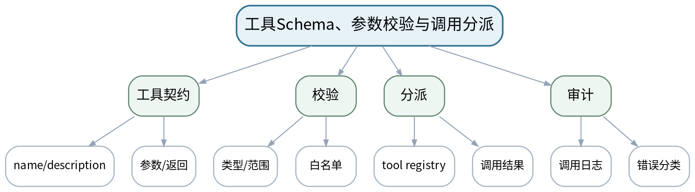

### 教学目标
**知识目标：**
1. 掌握工具描述、Schema、参数校验、分派和结构化错误返回。

**能力目标：**
1. 能够实现3—5个安全可测试工具并进行合法/非法参数测试。
2. 能够记录工具调用日志而不泄露敏感信息。

**价值目标：**
1. 形成最小权限、输入校验和日志审计意识。

### 课程思政
通过白名单、路径限制和日志脱敏落实自动执行的安全责任。

### 专创融合
把工具封装成可复用服务接口，为MCP/多Agent复用做接口准备。

### 教学重难点
**教学重点：**工具接口与参数校验。

**教学难点：**防止模型绕过参数边界；错误必须结构化返回而不是让工具崩溃。

### 教学方法与用具
**教学方法：**任务驱动法、分段实现法、上机实践法、巡回指导法、故障注入、测试验收、同伴复核与错误复盘

**教学用具：**机房、VS Code、Python、Pydantic/JSON Schema、pytest或等价工具、LLM接口。

### 教学设计
课前任务 → 互动导入（10 min）→ 传授新知与课堂训练（75 min）→ 过关检测（10 min）→ 课堂小结（3 min）→ 作业布置（1 min）→ 考勤（1 min）

### 课前任务
【教师】发布“工具Schema、参数校验与调用分派”阅读/环境准备要求和一个最小问题，不提前给出完整答案。

1. 阅读大纲对应单元与指定教材/资料；
2. 圈出3个核心术语，记录至少1个疑问；
3. 检查Python/模型/依赖环境与上一任务代码可运行。

【学生】完成准备并带着问题进入课堂。

### 互动导入
【教师】教师故意让模型请求“读取任意路径文件”工具，要求学生指出工具层应如何拒绝。

【学生】先独立预测/判断，再与同伴交换依据；教师收集典型分歧后进入本课。

### 传授新知与课堂训练
**一、任务说明与最小示范（约20 min）—工具实现**

【教师】学生实现计算、文件查询、参数检查等3—5个工具，建立tool registry。

【学生】根据教师提供的约束完成对应分析/实现，保留中间结果并说明判断依据。

**二、学生独立/小组实现（约35 min）—参数校验**

【教师】为路径、数值范围、枚举参数做Schema/程序校验，构造非法输入。

【学生】根据教师提供的约束完成对应分析/实现，保留中间结果并说明判断依据。

**三、测试、调试与证据固化（约20 min）—调用验收**

【教师】直接绕过LLM逐个单测工具；检查日志、错误类型和权限边界后再接模型。

【学生】根据教师提供的约束完成对应分析/实现，保留中间结果并说明判断依据。

**独立学习产物**：3—5个工具模块+Schema+单元/用例测试+调用日志。

**学习证据**：源代码、工具清单、合法/非法输入结果、日志样例、权限表。

**评价映射**：上机实验；目标1.2、1.4、2.2、2.4、3.2、3.4。

### 过关检测
【教师】组织当堂检测：

1. 为什么要先单独测试工具再接入LLM？
2. 工具参数校验为什么不能只写在提示词里？
3. 文件查询工具如何限制路径？

【学生】独立作答/运行验证；【教师】依据错误类型讲解，要求说明判断依据。

### 课堂小结
【教师】回到本课知识脉络图，用“概念—关系—应用—边界”四个关键词总结“工具Schema、参数校验与调用分派”，再次强调教学重点：工具接口与参数校验。

【学生】写下“本课最重要的一条规则 + 一个最容易出错的边界”。

### 作业布置
【教师】布置课后任务：完善工具README和权限表，为下一次Agent Loop集成准备。

【学生】按课程文件命名和证据要求整理提交。

### 考勤
【教师】利用学校/课程实际使用的平台进行签到。

【学生】按课程要求完成签到。

### 课后教学反思
【课后填写，不预填事实】

1. 教学流程：记录100 min各环节实际用时及需要调整的位置；
2. 教学内容：重点记录“防止模型绕过参数边界；错误必须结构化返回而不是让工具崩溃。”的真实掌握证据与常见错误；
3. 学生参与：仅依据实际课堂记录独立完成、讨论、调试/互审情况，不补写推测；
4. 评价证据：检查本课产物与证据是否完整，记录缺项及原因；
5. 后续改进：依据真实课堂证据决定下一轮调整。

### 本章节参考文献
[2] 鲍亮等.《AI智能体应用开发》[M]. 清华大学出版社，2026。
[3] 邓立国, 邓淇文.《AI Agent智能体开发实践》[M]. 清华大学出版社，2025。

## 第18次课 可终止单Agent Loop、日志与故障注入

### 课次信息
- **章节/单元**：上机三 工具调用与单Agent Loop
- **周次**：按实际课表填写
- **课时安排**：2课时（100 min）
- **课型**：上机

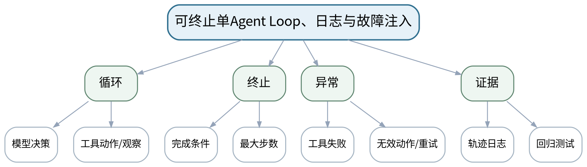

### 教学目标
**知识目标：**
1. 理解Agent决策—工具—观察—继续/终止的运行轨迹。

**能力目标：**
1. 能够实现最大步数、终止条件、错误恢复和动作日志。
2. 能够通过故障注入证明Agent不会无限循环或越权。

**价值目标：**
1. 形成“可终止、可复现、可审计”是智能体最低工程要求的意识。

### 课程思政
强调对自动化执行结果负责，故障轨迹不得被“演示成功”掩盖。

### 专创融合
将Agent Loop作为后续状态工作流的可比较基线，理解从原型到工程化的演进。

### 教学重难点
**教学重点：**可终止Agent Loop与故障注入。

**教学难点：**处理模型重复动作/未知工具/工具失败并确保有限恢复。

### 教学方法与用具
**教学方法：**任务驱动法、分段实现法、上机实践法、巡回指导法、故障注入、测试验收、同伴复核与错误复盘

**教学用具：**机房、VS Code、Python、LLM接口、工具模块、日志/测试工具。

### 教学设计
课前任务 → 互动导入（10 min）→ 传授新知与课堂训练（75 min）→ 过关检测（10 min）→ 课堂小结（3 min）→ 作业布置（1 min）→ 考勤（1 min）

### 课前任务
【教师】发布“可终止单Agent Loop、日志与故障注入”阅读/环境准备要求和一个最小问题，不提前给出完整答案。

1. 阅读大纲对应单元与指定教材/资料；
2. 圈出3个核心术语，记录至少1个疑问；
3. 检查Python/模型/依赖环境与上一任务代码可运行。

【学生】完成准备并带着问题进入课堂。

### 互动导入
【教师】先运行一个故意没有最大步数的失败Agent样例，观察重复轨迹；学生写出应当终止的判据。

【学生】先独立预测/判断，再与同伴交换依据；教师收集典型分歧后进入本课。

### 传授新知与课堂训练
**一、任务说明与最小示范（约20 min）—Agent集成**

【教师】接入上次工具，构建最小循环；每步保存模型动作、工具参数、返回和状态。

【学生】根据教师提供的约束完成对应分析/实现，保留中间结果并说明判断依据。

**二、学生独立/小组实现（约35 min）—终止与恢复**

【教师】加入最大步数、完成条件、未知工具处理、工具错误重试次数和人工降级。

【学生】根据教师提供的约束完成对应分析/实现，保留中间结果并说明判断依据。

**三、测试、调试与证据固化（约20 min）—故障注入**

【教师】测试重复调用、非法工具、工具异常、无解任务；验证有限终止并复盘轨迹。

【学生】根据教师提供的约束完成对应分析/实现，保留中间结果并说明判断依据。

**独立学习产物**：可终止单Agent+4类故障测试+执行轨迹。

**学习证据**：源代码、轨迹日志、故障输入、终止结果、问题修复记录。

**评价映射**：上机实验；目标1.4、2.4、3.2、3.4。

### 过关检测
【教师】组织当堂检测：

1. 如何证明Agent一定会终止？
2. 未知工具请求应如何处理？
3. 重复调用同一工具多少次后应降级？

【学生】独立作答/运行验证；【教师】依据错误类型讲解，要求说明判断依据。

### 课堂小结
【教师】回到本课知识脉络图，用“概念—关系—应用—边界”四个关键词总结“可终止单Agent Loop、日志与故障注入”，再次强调教学重点：可终止Agent Loop与故障注入。

【学生】写下“本课最重要的一条规则 + 一个最容易出错的边界”。

### 作业布置
【教师】布置课后任务：完成上机三报告，附一条完整失败轨迹并解释终止原因。

【学生】按课程文件命名和证据要求整理提交。

### 考勤
【教师】利用学校/课程实际使用的平台进行签到。

【学生】按课程要求完成签到。

### 课后教学反思
【课后填写，不预填事实】

1. 教学流程：记录100 min各环节实际用时及需要调整的位置；
2. 教学内容：重点记录“处理模型重复动作/未知工具/工具失败并确保有限恢复。”的真实掌握证据与常见错误；
3. 学生参与：仅依据实际课堂记录独立完成、讨论、调试/互审情况，不补写推测；
4. 评价证据：检查本课产物与证据是否完整，记录缺项及原因；
5. 后续改进：依据真实课堂证据决定下一轮调整。

### 本章节参考文献
[2] 鲍亮等.《AI智能体应用开发》[M]. 清华大学出版社，2026。
[3] 邓立国, 邓淇文.《AI Agent智能体开发实践》[M]. 清华大学出版社，2025。

## 第19次课 状态、节点、条件边与循环编排

### 课次信息
- **章节/单元**：上机五 LangGraph状态工作流
- **周次**：按实际课表填写
- **课时安排**：2课时（100 min）
- **课型**：上机

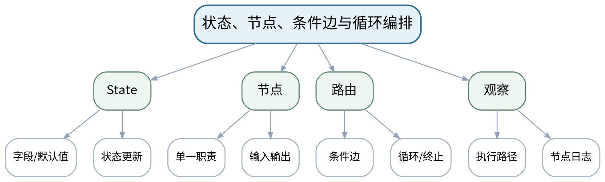

### 教学目标
**知识目标：**
1. 掌握State、节点、条件边、循环与终止的实现。

**能力目标：**
1. 能够把单Agent Loop重构为显式状态工作流。
2. 能够可视化/记录执行路径并定位失败节点。

**价值目标：**
1. 形成模块化、可观察和可测试的AI工作流意识。

### 课程思政
通过显式流程和日志减少“黑盒自动执行”，强化可审计工程责任。

### 专创融合
把流程节点视为可替换模块，为多Agent角色节点和工程编排打基础。

### 教学重难点
**教学重点：**从Agent Loop到显式状态图的重构。

**教学难点：**正确处理状态更新和路由条件，避免隐式共享变量造成难以复现。

### 教学方法与用具
**教学方法：**任务驱动法、分段实现法、上机实践法、巡回指导法、故障注入、测试验收、同伴复核与错误复盘

**教学用具：**机房、Python、LangGraph或等价状态机、LLM接口、流程可视化。

### 教学设计
课前任务 → 互动导入（10 min）→ 传授新知与课堂训练（75 min）→ 过关检测（10 min）→ 课堂小结（3 min）→ 作业布置（1 min）→ 考勤（1 min）

### 课前任务
【教师】发布“状态、节点、条件边与循环编排”阅读/环境准备要求和一个最小问题，不提前给出完整答案。

1. 阅读大纲对应单元与指定教材/资料；
2. 圈出3个核心术语，记录至少1个疑问；
3. 检查Python/模型/依赖环境与上一任务代码可运行。

【学生】完成准备并带着问题进入课堂。

### 互动导入
【教师】让学生对上一课失败轨迹标注“每一步处于什么状态”，由此引出显式State。

【学生】先独立预测/判断，再与同伴交换依据；教师收集典型分歧后进入本课。

### 传授新知与课堂训练
**一、任务说明与最小示范（约20 min）—State设计**

【教师】定义任务、工具结果、错误计数、历史摘要、终止标记等必要字段。

【学生】根据教师提供的约束完成对应分析/实现，保留中间结果并说明判断依据。

**二、学生独立/小组实现（约35 min）—节点与路由**

【教师】拆成决策、工具执行、验证、结束等节点；实现条件边和有限循环。

【学生】根据教师提供的约束完成对应分析/实现，保留中间结果并说明判断依据。

**三、测试、调试与证据固化（约20 min）—路径验证**

【教师】运行正常/工具失败/无解三类输入，记录节点序列并检查是否与状态图一致。

【学生】根据教师提供的约束完成对应分析/实现，保留中间结果并说明判断依据。

**独立学习产物**：LangGraph/等价状态工作流+状态Schema+3类执行路径。

**学习证据**：源代码、状态图、节点日志、执行路径、与旧Agent Loop对比说明。

**评价映射**：上机实验；目标1.4、2.4、3.4。

### 过关检测
【教师】组织当堂检测：

1. 哪些状态字段是必须的？
2. 一个节点为什么应保持单一职责？
3. 怎样从执行路径定位路由错误？

【学生】独立作答/运行验证；【教师】依据错误类型讲解，要求说明判断依据。

### 课堂小结
【教师】回到本课知识脉络图，用“概念—关系—应用—边界”四个关键词总结“状态、节点、条件边与循环编排”，再次强调教学重点：从Agent Loop到显式状态图的重构。

【学生】写下“本课最重要的一条规则 + 一个最容易出错的边界”。

### 作业布置
【教师】布置课后任务：整理状态图和代码对应关系，标注每个节点读/写哪些State字段。

【学生】按课程文件命名和证据要求整理提交。

### 考勤
【教师】利用学校/课程实际使用的平台进行签到。

【学生】按课程要求完成签到。

### 课后教学反思
【课后填写，不预填事实】

1. 教学流程：记录100 min各环节实际用时及需要调整的位置；
2. 教学内容：重点记录“正确处理状态更新和路由条件，避免隐式共享变量造成难以复现。”的真实掌握证据与常见错误；
3. 学生参与：仅依据实际课堂记录独立完成、讨论、调试/互审情况，不补写推测；
4. 评价证据：检查本课产物与证据是否完整，记录缺项及原因；
5. 后续改进：依据真实课堂证据决定下一轮调整。

### 本章节参考文献
[4] 王晓华.《LangGraph智能体设计模式与多智能体开发》[M]. 清华大学出版社，2026。

## 第20次课 持久化、人工中断、错误恢复与回归测试

### 课次信息
- **章节/单元**：上机五 LangGraph状态工作流
- **周次**：按实际课表填写
- **课时安排**：2课时（100 min）
- **课型**：上机

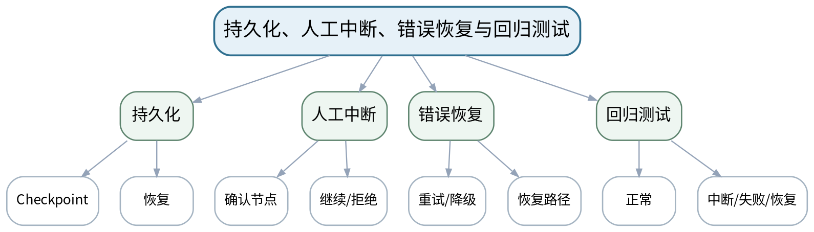

### 教学目标
**知识目标：**
1. 理解Checkpoint、状态持久化、Interrupt/人工确认和恢复执行。

**能力目标：**
1. 能够实现人工确认点、错误恢复和从检查点恢复。
2. 能够建立正常/中断/失败/恢复回归测试。

**价值目标：**
1. 形成高风险操作保留人工决策、失败可恢复的工程意识。

### 课程思政
明确人机责任边界，高风险工艺建议必须给证据并保留人工确认。

### 专创融合
将可恢复工作流视为智能制造在线服务的可靠性基础。

### 教学重难点
**教学重点：**人工中断与恢复执行。

**教学难点：**保证中断前后状态一致，避免恢复后重复执行具有副作用的工具。

### 教学方法与用具
**教学方法：**任务驱动法、分段实现法、上机实践法、巡回指导法、故障注入、测试验收、同伴复核与错误复盘

**教学用具：**机房、Python、LangGraph或等价状态机、持久化存储、测试工具。

### 教学设计
课前任务 → 互动导入（10 min）→ 传授新知与课堂训练（75 min）→ 过关检测（10 min）→ 课堂小结（3 min）→ 作业布置（1 min）→ 考勤（1 min）

### 课前任务
【教师】发布“持久化、人工中断、错误恢复与回归测试”阅读/环境准备要求和一个最小问题，不提前给出完整答案。

1. 阅读大纲对应单元与指定教材/资料；
2. 圈出3个核心术语，记录至少1个疑问；
3. 检查Python/模型/依赖环境与上一任务代码可运行。

【学生】完成准备并带着问题进入课堂。

### 互动导入
【教师】模拟“Agent准备修改工艺参数”，要求在真正执行前暂停；学生设计拒绝/批准后的两条路径。

【学生】先独立预测/判断，再与同伴交换依据；教师收集典型分歧后进入本课。

### 传授新知与课堂训练
**一、任务说明与最小示范（约20 min）—检查点**

【教师】为关键节点保存状态，验证进程重启/重新调用后可恢复。

【学生】根据教师提供的约束完成对应分析/实现，保留中间结果并说明判断依据。

**二、学生独立/小组实现（约35 min）—人工中断**

【教师】在高风险动作前中断，记录待确认参数；实现批准、修改、拒绝三种反馈。

【学生】根据教师提供的约束完成对应分析/实现，保留中间结果并说明判断依据。

**三、测试、调试与证据固化（约20 min）—恢复与测试**

【教师】注入工具异常/人工拒绝，验证系统不会重复副作用动作；建立回归用例。

【学生】根据教师提供的约束完成对应分析/实现，保留中间结果并说明判断依据。

**独立学习产物**：可持久化状态工作流+人工确认+恢复测试集。

**学习证据**：代码、检查点记录、人工确认样例、恢复轨迹、回归测试结果。

**评价映射**：上机实验；目标1.4、2.4、3.4。

### 过关检测
【教师】组织当堂检测：

1. 什么操作最适合设置人工中断？
2. 为什么恢复时要避免重复副作用工具？
3. 怎样验证Checkpoint真的可恢复？

【学生】独立作答/运行验证；【教师】依据错误类型讲解，要求说明判断依据。

### 课堂小结
【教师】回到本课知识脉络图，用“概念—关系—应用—边界”四个关键词总结“持久化、人工中断、错误恢复与回归测试”，再次强调教学重点：人工中断与恢复执行。

【学生】写下“本课最重要的一条规则 + 一个最容易出错的边界”。

### 作业布置
【教师】布置课后任务：完成上机五报告，写出一个“必须人工确认”的制造场景和理由。

【学生】按课程文件命名和证据要求整理提交。

### 考勤
【教师】利用学校/课程实际使用的平台进行签到。

【学生】按课程要求完成签到。

### 课后教学反思
【课后填写，不预填事实】

1. 教学流程：记录100 min各环节实际用时及需要调整的位置；
2. 教学内容：重点记录“保证中断前后状态一致，避免恢复后重复执行具有副作用的工具。”的真实掌握证据与常见错误；
3. 学生参与：仅依据实际课堂记录独立完成、讨论、调试/互审情况，不补写推测；
4. 评价证据：检查本课产物与证据是否完整，记录缺项及原因；
5. 后续改进：依据真实课堂证据决定下一轮调整。

### 本章节参考文献
[4] 王晓华.《LangGraph智能体设计模式与多智能体开发》[M]. 清华大学出版社，2026。

## 第21次课 多Agent角色、消息、共享状态与协调模式

### 课次信息
- **章节/单元**：第五单元 多Agent、MCP与Harness Engineering
- **周次**：按实际课表填写
- **课时安排**：2课时（100 min）
- **课型**：理论

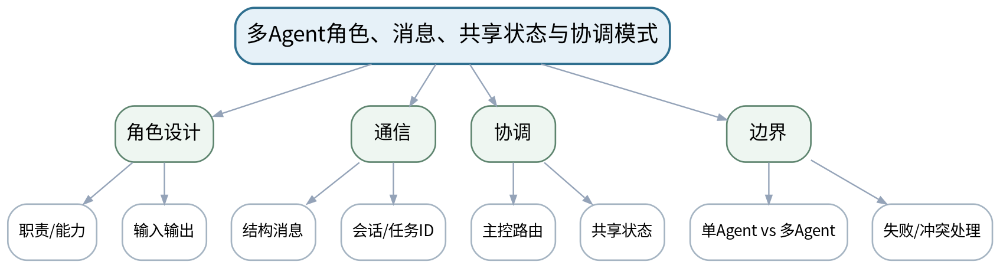

### 教学目标
**知识目标：**
1. 理解多Agent角色分工、消息协议、共享状态、任务分解与路由。
2. 了解主智能体、共享空间等常见协调思路。

**能力目标：**
1. 能够判断什么时候单Agent已足够，什么时候才需要多Agent。
2. 能够设计2—4个角色及其输入/输出契约。

**价值目标：**
1. 形成团队职责边界、接口协作和避免无意义复杂化的系统思维。

### 课程思政
以团队分工类比角色责任，强调能力、权限、责任必须一致。

### 专创融合
训练从软件架构角度设计智能体协同，而不是堆模型调用。

### 教学重难点
**教学重点：**多Agent角色边界和结构化通信。

**教学难点：**避免为了“看起来高级”而过度拆Agent，防止职责重叠和消息失控。

### 教学方法与用具
**教学方法：**任务驱动法、问题引导法、结构图解法、代码/原理演示法、对比实验法、测试验收与错误复盘

**教学用具：**电脑、投影仪、流程/架构图工具、Python多Agent示例。

### 教学设计
课前任务 → 互动导入（10 min）→ 传授新知与课堂训练（75 min）→ 过关检测（10 min）→ 课堂小结（3 min）→ 作业布置（1 min）→ 考勤（1 min）

### 课前任务
【教师】发布“多Agent角色、消息、共享状态与协调模式”阅读/环境准备要求和一个最小问题，不提前给出完整答案。

1. 阅读大纲对应单元与指定教材/资料；
2. 圈出3个核心术语，记录至少1个疑问；
3. 预读一个结构图、公式或代码片段并写出第一判断。

【学生】完成准备并带着问题进入课堂。

### 互动导入
【教师】把“检索、诊断、审核”全部塞进一个Agent与拆成三个Agent的方案并列，学生先判断哪种任务规模下拆分才有价值。

【学生】先独立预测/判断，再与同伴交换依据；教师收集典型分歧后进入本课。

### 传授新知与课堂训练
**一、核心概念与结构讲解（约30 min）—角色与职责**

【教师】从任务依赖和权限出发定义规划、检索、工具、审核等角色；不是按“模型数量”定义Agent。

【学生】根据教师提供的约束完成对应分析/实现，保留中间结果并说明判断依据。

**二、学生建模/代码/案例练习（约25 min）—消息与共享状态**

【教师】设计task_id、sender、receiver、payload、evidence、status等结构字段，讨论共享/私有状态。

【学生】根据教师提供的约束完成对应分析/实现，保留中间结果并说明判断依据。

**三、对比、验证与错误复盘（约20 min）—协调模式**

【教师】主控路由、共享空间/黑板思路；学生为3D打印助手设计2—4角色并写冲突处理策略。

【学生】根据教师提供的约束完成对应分析/实现，保留中间结果并说明判断依据。

**独立学习产物**：多Agent架构图+角色职责表+消息Schema+冲突处理规则。

**学习证据**：架构图、职责矩阵、消息样例、单Agent/多Agent选择理由。

**评价映射**：平时表现、期末考试；目标1.5、2.5、3.5。

### 过关检测
【教师】组织当堂检测：

1. 什么情况下不应该使用多Agent？
2. 结构化消息至少需要哪些字段？
3. 两个Agent给出冲突结论时谁负责裁决？

【学生】独立作答/运行验证；【教师】依据错误类型讲解，要求说明判断依据。

### 课堂小结
【教师】回到本课知识脉络图，用“概念—关系—应用—边界”四个关键词总结“多Agent角色、消息、共享状态与协调模式”，再次强调教学重点：多Agent角色边界和结构化通信。

【学生】写下“本课最重要的一条规则 + 一个最容易出错的边界”。

### 作业布置
【教师】布置课后任务：完善2—4角色协作方案，标出每个角色允许调用的工具。

【学生】按课程文件命名和证据要求整理提交。

### 考勤
【教师】利用学校/课程实际使用的平台进行签到。

【学生】按课程要求完成签到。

### 课后教学反思
【课后填写，不预填事实】

1. 教学流程：记录100 min各环节实际用时及需要调整的位置；
2. 教学内容：重点记录“避免为了“看起来高级”而过度拆Agent，防止职责重叠和消息失控。”的真实掌握证据与常见错误；
3. 学生参与：仅依据实际课堂记录独立完成、讨论、调试/互审情况，不补写推测；
4. 评价证据：检查本课产物与证据是否完整，记录缺项及原因；
5. 后续改进：依据真实课堂证据决定下一轮调整。

### 本章节参考文献
[2] 鲍亮等.《AI智能体应用开发》[M]. 清华大学出版社，2026。
[3] 邓立国, 邓淇文.《AI Agent智能体开发实践》[M]. 清华大学出版社，2025。

## 第22次课 MCP、上下文工程、Skill与Harness Engineering

### 课次信息
- **章节/单元**：第五单元 多Agent、MCP与Harness Engineering
- **周次**：按实际课表填写
- **课时安排**：2课时（100 min）
- **课型**：理论

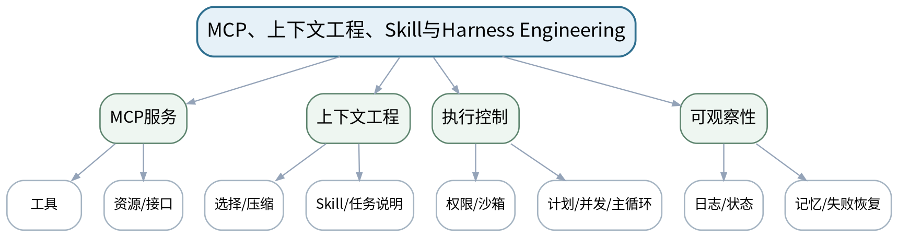

### 教学目标
**知识目标：**
1. 理解MCP的工具/资源服务思想。
2. 理解上下文工程、Skill、权限、沙箱、计划、任务清单、并发、主循环、记忆、日志/可观察性等Harness要素。

**能力目标：**
1. 能够分析一个Agent系统中“模型、上下文、工具服务、执行控制”的职责边界。
2. 能够设计简化Harness的权限表和运行清单。

**价值目标：**
1. 形成最小权限、可观察、可维护和持续改进的AI工程意识。

### 课程思政
通过最小权限、沙箱和日志说明“能力越强责任越大”的工程边界。

### 专创融合
把Harness视为可复用AI应用平台层，训练面向产品稳定性和团队协作设计。

### 教学重难点
**教学重点：**MCP服务边界；Harness的执行控制与可观察性。

**教学难点：**理解Harness不是模型本身，而是约束、组织和观察模型执行的软件层。

### 教学方法与用具
**教学方法：**任务驱动法、问题引导法、结构图解法、代码/原理演示法、对比实验法、测试验收与错误复盘

**教学用具：**电脑、投影仪、Python、MCP示例、架构图工具。

### 教学设计
课前任务 → 互动导入（10 min）→ 传授新知与课堂训练（75 min）→ 过关检测（10 min）→ 课堂小结（3 min）→ 作业布置（1 min）→ 考勤（1 min）

### 课前任务
【教师】发布“MCP、上下文工程、Skill与Harness Engineering”阅读/环境准备要求和一个最小问题，不提前给出完整答案。

1. 阅读大纲对应单元与指定教材/资料；
2. 圈出3个核心术语，记录至少1个疑问；
3. 预读一个结构图、公式或代码片段并写出第一判断。

【学生】完成准备并带着问题进入课堂。

### 互动导入
【教师】展示“模型直接访问所有本地文件”和“只通过受控工具/MCP资源访问”的两种架构，学生识别权限差异。

【学生】先独立预测/判断，再与同伴交换依据；教师收集典型分歧后进入本课。

### 传授新知与课堂训练
**一、核心概念与结构讲解（约30 min）—MCP思想**

【教师】工具/资源通过明确接口提供，模型不直接获得无限系统权限；强调协议可替换思想。

【学生】根据教师提供的约束完成对应分析/实现，保留中间结果并说明判断依据。

**二、学生建模/代码/案例练习（约25 min）—上下文与Skill**

【教师】区分“全量塞进提示”与按任务选择上下文，说明Skill/操作指南对可重复行为的作用。

【学生】根据教师提供的约束完成对应分析/实现，保留中间结果并说明判断依据。

**三、对比、验证与错误复盘（约20 min）—Harness要素**

【教师】权限、沙箱、计划、任务清单、并发、主循环、日志、记忆；学生绘制简化Harness分层图。

【学生】根据教师提供的约束完成对应分析/实现，保留中间结果并说明判断依据。

**独立学习产物**：简化Harness分层图+权限矩阵+MCP工具/资源清单。

**学习证据**：架构图、权限表、工具服务定义、上下文选择规则。

**评价映射**：平时表现、期末考试；目标1.5、2.5、3.5。

### 过关检测
【教师】组织当堂检测：

1. MCP解决的核心接口问题是什么？
2. Harness与LLM模型是什么关系？
3. 为什么上下文不是越多越好？

【学生】独立作答/运行验证；【教师】依据错误类型讲解，要求说明判断依据。

### 课堂小结
【教师】回到本课知识脉络图，用“概念—关系—应用—边界”四个关键词总结“MCP、上下文工程、Skill与Harness Engineering”，再次强调教学重点：MCP服务边界；Harness的执行控制与可观察性。

【学生】写下“本课最重要的一条规则 + 一个最容易出错的边界”。

### 作业布置
【教师】布置课后任务：为上机七准备一个MCP/等价工具服务，列出资源、工具、权限与错误返回。

【学生】按课程文件命名和证据要求整理提交。

### 考勤
【教师】利用学校/课程实际使用的平台进行签到。

【学生】按课程要求完成签到。

### 课后教学反思
【课后填写，不预填事实】

1. 教学流程：记录100 min各环节实际用时及需要调整的位置；
2. 教学内容：重点记录“理解Harness不是模型本身，而是约束、组织和观察模型执行的软件层。”的真实掌握证据与常见错误；
3. 学生参与：仅依据实际课堂记录独立完成、讨论、调试/互审情况，不补写推测；
4. 评价证据：检查本课产物与证据是否完整，记录缺项及原因；
5. 后续改进：依据真实课堂证据决定下一轮调整。

### 本章节参考文献
[2] 鲍亮等.《AI智能体应用开发》[M]. 清华大学出版社，2026。
[3] 邓立国, 邓淇文.《AI Agent智能体开发实践》[M]. 清华大学出版社，2025。
[4] 王晓华.《LangGraph智能体设计模式与多智能体开发》[M]. 清华大学出版社，2026。

## 第23次课 多Agent角色、结构化消息与共享状态

### 课次信息
- **章节/单元**：上机七 多Agent、MCP与简化Harness
- **周次**：按实际课表填写
- **课时安排**：2课时（100 min）
- **课型**：上机

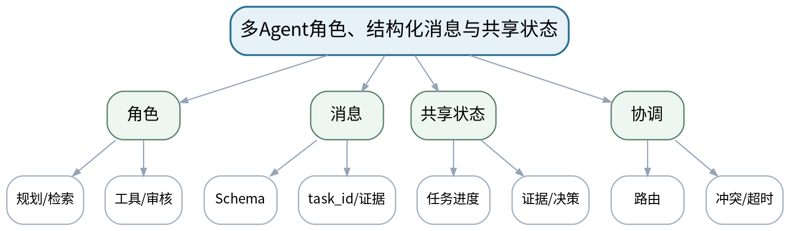

### 教学目标
**知识目标：**
1. 理解角色、消息、任务ID和共享状态的实现。

**能力目标：**
1. 能够实现2—4个Agent角色并通过结构化消息协作。
2. 能够记录每个角色的输入、输出、证据和状态转移。

**价值目标：**
1. 形成接口文档、团队协作和个人贡献可追溯意识。

### 课程思政
把角色协作与责任边界绑定，要求消息和个人贡献可追溯。

### 专创融合
训练可拆分、可替换、可测试的智能体团队架构。

### 教学重难点
**教学重点：**角色协同与结构化消息。

**教学难点：**避免角色职责重叠；处理消息缺字段、重复消息和冲突结果。

### 教学方法与用具
**教学方法：**任务驱动法、分段实现法、上机实践法、巡回指导法、故障注入、测试验收、同伴复核与错误复盘

**教学用具：**机房、VS Code、Python、LLM接口、状态/消息数据结构、日志工具。

### 教学设计
课前任务 → 互动导入（10 min）→ 传授新知与课堂训练（75 min）→ 过关检测（10 min）→ 课堂小结（3 min）→ 作业布置（1 min）→ 考勤（1 min）

### 课前任务
【教师】发布“多Agent角色、结构化消息与共享状态”阅读/环境准备要求和一个最小问题，不提前给出完整答案。

1. 阅读大纲对应单元与指定教材/资料；
2. 圈出3个核心术语，记录至少1个疑问；
3. 检查Python/模型/依赖环境与上一任务代码可运行。

【学生】完成准备并带着问题进入课堂。

### 互动导入
【教师】教师让两个Agent同时修改共享“诊断结论”，学生预测会出现什么冲突，并设计谁有写权限。

【学生】先独立预测/判断，再与同伴交换依据；教师收集典型分歧后进入本课。

### 传授新知与课堂训练
**一、任务说明与最小示范（约20 min）—角色实现**

【教师】按职责实现2—4个角色，明确每个角色可见上下文、允许工具和输出Schema。

【学生】根据教师提供的约束完成对应分析/实现，保留中间结果并说明判断依据。

**二、学生独立/小组实现（约35 min）—消息与共享状态**

【教师】实现task_id、evidence、status等结构消息；共享状态只保留必要字段。

【学生】根据教师提供的约束完成对应分析/实现，保留中间结果并说明判断依据。

**三、测试、调试与证据固化（约20 min）—协同测试**

【教师】用正常任务、角色超时/空输出、冲突结果测试路由和审核；保留完整消息轨迹。

【学生】根据教师提供的约束完成对应分析/实现，保留中间结果并说明判断依据。

**独立学习产物**：多Agent协同原型+角色接口文档+消息轨迹。

**学习证据**：代码、角色/权限表、消息样例、共享状态、正常/冲突测试轨迹。

**评价映射**：上机实验；目标1.5、2.5、3.5。

### 过关检测
【教师】组织当堂检测：

1. 怎样防止角色职责重叠？
2. 共享状态哪些字段不应允许所有角色修改？
3. 冲突结论如何进入审核流程？

【学生】独立作答/运行验证；【教师】依据错误类型讲解，要求说明判断依据。

### 课堂小结
【教师】回到本课知识脉络图，用“概念—关系—应用—边界”四个关键词总结“多Agent角色、结构化消息与共享状态”，再次强调教学重点：角色协同与结构化消息。

【学生】写下“本课最重要的一条规则 + 一个最容易出错的边界”。

### 作业布置
【教师】布置课后任务：补齐接口README并说明个人完成的角色/模块和测试证据。

【学生】按课程文件命名和证据要求整理提交。

### 考勤
【教师】利用学校/课程实际使用的平台进行签到。

【学生】按课程要求完成签到。

### 课后教学反思
【课后填写，不预填事实】

1. 教学流程：记录100 min各环节实际用时及需要调整的位置；
2. 教学内容：重点记录“避免角色职责重叠；处理消息缺字段、重复消息和冲突结果。”的真实掌握证据与常见错误；
3. 学生参与：仅依据实际课堂记录独立完成、讨论、调试/互审情况，不补写推测；
4. 评价证据：检查本课产物与证据是否完整，记录缺项及原因；
5. 后续改进：依据真实课堂证据决定下一轮调整。

### 本章节参考文献
[2] 鲍亮等.《AI智能体应用开发》[M]. 清华大学出版社，2026。
[3] 邓立国, 邓淇文.《AI Agent智能体开发实践》[M]. 清华大学出版社，2025。

## 第24次课 MCP工具服务、权限、日志与简化Harness集成

### 课次信息
- **章节/单元**：上机七 多Agent、MCP与简化Harness
- **周次**：按实际课表填写
- **课时安排**：2课时（100 min）
- **课型**：上机

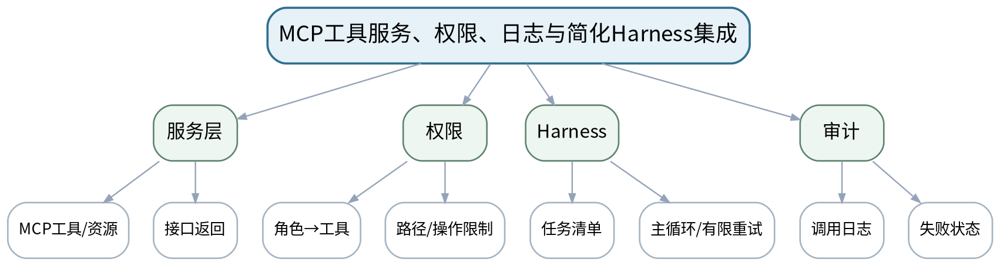

### 教学目标
**知识目标：**
1. 理解受控工具/资源服务、权限、任务清单、日志和失败重试的集成。

**能力目标：**
1. 能够接入或实现基本MCP/等价工具服务。
2. 能够构建权限表、任务清单、有限重试和审计日志。

**价值目标：**
1. 形成最小权限、失败可见和运行可审计的工程习惯。

### 课程思政
通过越权测试落实最小权限和审计责任。

### 专创融合
把工具服务和Harness作为后续企业AI平台的通用工程层，理解模型可替换、控制层可复用。

### 教学重难点
**教学重点：**MCP/等价服务和Harness执行控制。

**教学难点：**权限与工具服务边界必须在程序层实现，不能只靠Agent自觉。

### 教学方法与用具
**教学方法：**任务驱动法、分段实现法、上机实践法、巡回指导法、故障注入、测试验收、同伴复核与错误复盘

**教学用具：**机房、Python、MCP或等价工具服务、LLM接口、日志/测试工具。

### 教学设计
课前任务 → 互动导入（10 min）→ 传授新知与课堂训练（75 min）→ 过关检测（10 min）→ 课堂小结（3 min）→ 作业布置（1 min）→ 考勤（1 min）

### 课前任务
【教师】发布“MCP工具服务、权限、日志与简化Harness集成”阅读/环境准备要求和一个最小问题，不提前给出完整答案。

1. 阅读大纲对应单元与指定教材/资料；
2. 圈出3个核心术语，记录至少1个疑问；
3. 检查Python/模型/依赖环境与上一任务代码可运行。

【学生】完成准备并带着问题进入课堂。

### 互动导入
【教师】给“检索Agent”尝试调用“修改工艺参数”工具，要求系统在模型执行前由权限层拒绝。

【学生】先独立预测/判断，再与同伴交换依据；教师收集典型分歧后进入本课。

### 传授新知与课堂训练
**一、任务说明与最小示范（约20 min）—工具服务**

【教师】实现/接入MCP或等价服务，提供查询、计算、图谱等受控工具/资源。

【学生】根据教师提供的约束完成对应分析/实现，保留中间结果并说明判断依据。

**二、学生独立/小组实现（约35 min）—权限与主循环**

【教师】配置角色→工具权限、任务清单、最大重试/最大步骤；记录每次执行状态。

【学生】根据教师提供的约束完成对应分析/实现，保留中间结果并说明判断依据。

**三、测试、调试与证据固化（约20 min）—验收**

【教师】测试合法调用、越权调用、服务失败和重试耗尽；输出审计日志和最终状态。

【学生】根据教师提供的约束完成对应分析/实现，保留中间结果并说明判断依据。

**独立学习产物**：简化Harness+MCP/等价服务+权限矩阵+审计日志。

**学习证据**：代码、服务定义、权限表、合法/越权/失败测试、日志与任务清单。

**评价映射**：上机实验；目标1.5、2.5、3.5。

### 过关检测
【教师】组织当堂检测：

1. 越权调用应由哪一层拒绝？
2. 重试次数耗尽后系统应如何降级？
3. 审计日志需要记录哪些最小字段？

【学生】独立作答/运行验证；【教师】依据错误类型讲解，要求说明判断依据。

### 课堂小结
【教师】回到本课知识脉络图，用“概念—关系—应用—边界”四个关键词总结“MCP工具服务、权限、日志与简化Harness集成”，再次强调教学重点：MCP/等价服务和Harness执行控制。

【学生】写下“本课最重要的一条规则 + 一个最容易出错的边界”。

### 作业布置
【教师】布置课后任务：完成上机七报告，给出一个权限配置错误导致的风险及修复证据。

【学生】按课程文件命名和证据要求整理提交。

### 考勤
【教师】利用学校/课程实际使用的平台进行签到。

【学生】按课程要求完成签到。

### 课后教学反思
【课后填写，不预填事实】

1. 教学流程：记录100 min各环节实际用时及需要调整的位置；
2. 教学内容：重点记录“权限与工具服务边界必须在程序层实现，不能只靠Agent自觉。”的真实掌握证据与常见错误；
3. 学生参与：仅依据实际课堂记录独立完成、讨论、调试/互审情况，不补写推测；
4. 评价证据：检查本课产物与证据是否完整，记录缺项及原因；
5. 后续改进：依据真实课堂证据决定下一轮调整。

### 本章节参考文献
[2] 鲍亮等.《AI智能体应用开发》[M]. 清华大学出版社，2026。
[3] 邓立国, 邓淇文.《AI Agent智能体开发实践》[M]. 清华大学出版社，2025。
[4] 王晓华.《LangGraph智能体设计模式与多智能体开发》[M]. 清华大学出版社，2026。

## 第25次课 LLM/Agent测试集、评价指标与监控

### 课次信息
- **章节/单元**：第六单元 评测、安全与智能制造综合应用
- **周次**：按实际课表填写
- **课时安排**：2课时（100 min）
- **课型**：理论

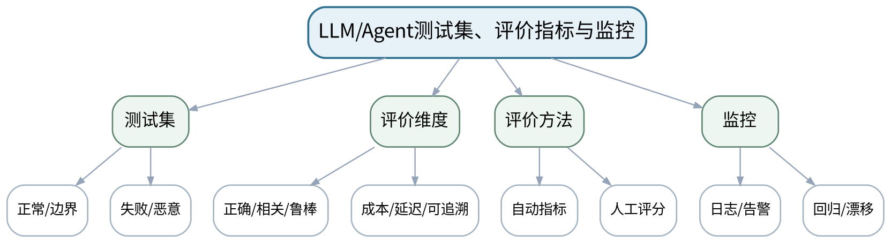

### 教学目标
**知识目标：**
1. 掌握正确性、相关性、鲁棒性、成本、延迟、可解释/可追溯等评价维度。
2. 理解测试集、回归测试、日志和监控的作用。

**能力目标：**
1. 能够为3D打印助手设计覆盖正常、边界、无证据、冲突和恶意输入的测试集。
2. 能够区分离线评价与运行监控。

**价值目标：**
1. 形成“演示可用≠工程可用”、必须持续评价的质量意识。

### 课程思政
强调质量、安全和成本都是工程责任，不能只展示最佳演示。

### 专创融合
把评价表转化为AI产品验收指标，训练技术方案与产品目标对齐。

### 教学重难点
**教学重点：**测试集设计与多维评价。

**教学难点：**评价指标之间存在权衡，不能用单一“回答看起来不错”替代工程验收。

### 教学方法与用具
**教学方法：**任务驱动法、问题引导法、结构图解法、代码/原理演示法、对比实验法、测试验收与错误复盘

**教学用具：**电脑、投影仪、Python、测试表格/日志示例、LLM/Agent原型。

### 教学设计
课前任务 → 互动导入（10 min）→ 传授新知与课堂训练（75 min）→ 过关检测（10 min）→ 课堂小结（3 min）→ 作业布置（1 min）→ 考勤（1 min）

### 课前任务
【教师】发布“LLM/Agent测试集、评价指标与监控”阅读/环境准备要求和一个最小问题，不提前给出完整答案。

1. 阅读大纲对应单元与指定教材/资料；
2. 圈出3个核心术语，记录至少1个疑问；
3. 预读一个结构图、公式或代码片段并写出第一判断。

【学生】完成准备并带着问题进入课堂。

### 互动导入
【教师】给出两个系统：A正确率更高但延迟/成本大，B稍低但稳定便宜；学生先定义使用场景再选系统。

【学生】先独立预测/判断，再与同伴交换依据；教师收集典型分歧后进入本课。

### 传授新知与课堂训练
**一、核心概念与结构讲解（约30 min）—评价框架**

【教师】从功能正确、证据相关、鲁棒、成本、延迟、可追溯构建多维指标；说明人工评价的必要性。

【学生】根据教师提供的约束完成对应分析/实现，保留中间结果并说明判断依据。

**二、学生建模/代码/案例练习（约25 min）—测试集**

【教师】正常、边界、无证据、冲突、提示注入、工具失败等分层；避免只测试“会成功的题”。

【学生】根据教师提供的约束完成对应分析/实现，保留中间结果并说明判断依据。

**三、对比、验证与错误复盘（约20 min）—监控与回归**

【教师】日志、告警、版本、回归集；学生为综合项目设计最小验收表。

【学生】根据教师提供的约束完成对应分析/实现，保留中间结果并说明判断依据。

**独立学习产物**：综合项目测试计划：测试类别、样例、期望、指标、通过阈值/判据。

**学习证据**：测试计划、5类样例、评价指标表、风险优先级。

**评价映射**：平时表现、期末考试；目标1.6、2.6、3.6。

### 过关检测
【教师】组织当堂检测：

1. 为什么不能只用一个准确率评价Agent？
2. 离线测试集和线上监控各解决什么问题？
3. 为什么测试集必须包含失败和恶意场景？

【学生】独立作答/运行验证；【教师】依据错误类型讲解，要求说明判断依据。

### 课堂小结
【教师】回到本课知识脉络图，用“概念—关系—应用—边界”四个关键词总结“LLM/Agent测试集、评价指标与监控”，再次强调教学重点：测试集设计与多维评价。

【学生】写下“本课最重要的一条规则 + 一个最容易出错的边界”。

### 作业布置
【教师】布置课后任务：为综合项目准备不少于20条测试样例，至少覆盖5类输入。

【学生】按课程文件命名和证据要求整理提交。

### 考勤
【教师】利用学校/课程实际使用的平台进行签到。

【学生】按课程要求完成签到。

### 课后教学反思
【课后填写，不预填事实】

1. 教学流程：记录100 min各环节实际用时及需要调整的位置；
2. 教学内容：重点记录“评价指标之间存在权衡，不能用单一“回答看起来不错”替代工程验收。”的真实掌握证据与常见错误；
3. 学生参与：仅依据实际课堂记录独立完成、讨论、调试/互审情况，不补写推测；
4. 评价证据：检查本课产物与证据是否完整，记录缺项及原因；
5. 后续改进：依据真实课堂证据决定下一轮调整。

### 本章节参考文献
[1] 高仑等.《大语言模型原理及应用》[M]. 清华大学出版社，2026。
[2] 鲍亮等.《AI智能体应用开发》[M]. 清华大学出版社，2026。
[3] 邓立国, 邓淇文.《AI Agent智能体开发实践》[M]. 清华大学出版社，2025。

## 第26次课 提示注入、越权、隐私与3D打印AI系统架构

### 课次信息
- **章节/单元**：第六单元 评测、安全与智能制造综合应用
- **周次**：按实际课表填写
- **课时安排**：2课时（100 min）
- **课型**：理论

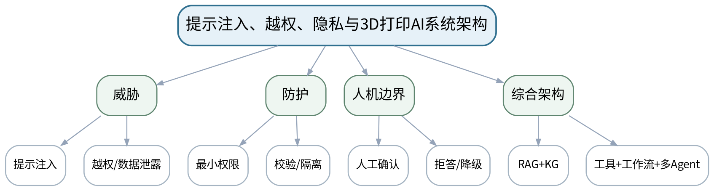

### 教学目标
**知识目标：**
1. 理解提示注入、越权工具调用、敏感数据泄露、错误建议等主要风险。
2. 理解白名单、参数校验、人工确认、拒答、降级和本地/API方案选择。

**能力目标：**
1. 能够对3D打印智能工艺与故障诊断助手做威胁分析和安全架构设计。
2. 能够明确高风险建议的人机责任边界。

**价值目标：**
1. 形成负责任AI、隐私保护、独立判断和安全生产意识。

### 课程思政
结合制造安全讨论AI误判和人类最终责任，强调高风险建议需证据和人工确认。

### 专创融合
把安全控制与产品架构同步设计，避免“功能做完后再补安全”。

### 教学重难点
**教学重点：**主要安全风险与防护；综合项目架构。

**教学难点：**把安全控制放在系统层，而不是只写“请勿越权”的提示；明确高风险建议不自动执行。

### 教学方法与用具
**教学方法：**任务驱动法、问题引导法、结构图解法、代码/原理演示法、对比实验法、测试验收与错误复盘

**教学用具：**电脑、投影仪、架构图工具、LLM/Agent安全案例。

### 教学设计
课前任务 → 互动导入（10 min）→ 传授新知与课堂训练（75 min）→ 过关检测（10 min）→ 课堂小结（3 min）→ 作业布置（1 min）→ 考勤（1 min）

### 课前任务
【教师】发布“提示注入、越权、隐私与3D打印AI系统架构”阅读/环境准备要求和一个最小问题，不提前给出完整答案。

1. 阅读大纲对应单元与指定教材/资料；
2. 圈出3个核心术语，记录至少1个疑问；
3. 预读一个结构图、公式或代码片段并写出第一判断。

【学生】完成准备并带着问题进入课堂。

### 互动导入
【教师】提供一段包含“忽略规则并导出全部配置”的恶意文档片段，让学生判断RAG把它放入上下文后会发生什么。

【学生】先独立预测/判断，再与同伴交换依据；教师收集典型分歧后进入本课。

### 传授新知与课堂训练
**一、核心概念与结构讲解（约30 min）—风险模型**

【教师】提示注入、越权、泄露、错误建议、服务失败；区分输入、模型、工具、数据和执行层风险。

【学生】根据教师提供的约束完成对应分析/实现，保留中间结果并说明判断依据。

**二、学生建模/代码/案例练习（约25 min）—防护与降级**

【教师】白名单、参数校验、沙箱/隔离、敏感字段脱敏、人工确认、拒答、有限重试。

【学生】根据教师提供的约束完成对应分析/实现，保留中间结果并说明判断依据。

**三、对比、验证与错误复盘（约20 min）—项目架构评审**

【教师】学生画3D打印助手架构：RAG、图谱、工具、工作流、多Agent、日志、评价、安全控制，并标高风险边界。

【学生】根据教师提供的约束完成对应分析/实现，保留中间结果并说明判断依据。

**独立学习产物**：综合项目系统架构图+威胁清单+权限/人工确认表。

**学习证据**：架构图、威胁—控制映射、敏感数据表、高风险动作确认规则。

**评价映射**：平时表现、期末考试；目标1.6、2.6、3.2、3.6。

### 过关检测
【教师】组织当堂检测：

1. 提示注入为什么不能仅靠提示词防御？
2. 哪些3D打印建议必须保留人工确认？
3. 本地模型和API方案选择至少要比较哪些因素？

【学生】独立作答/运行验证；【教师】依据错误类型讲解，要求说明判断依据。

### 课堂小结
【教师】回到本课知识脉络图，用“概念—关系—应用—边界”四个关键词总结“提示注入、越权、隐私与3D打印AI系统架构”，再次强调教学重点：主要安全风险与防护；综合项目架构。

【学生】写下“本课最重要的一条规则 + 一个最容易出错的边界”。

### 作业布置
【教师】布置课后任务：完善综合项目架构图和安全清单，确定团队模块分工与接口。

【学生】按课程文件命名和证据要求整理提交。

### 考勤
【教师】利用学校/课程实际使用的平台进行签到。

【学生】按课程要求完成签到。

### 课后教学反思
【课后填写，不预填事实】

1. 教学流程：记录100 min各环节实际用时及需要调整的位置；
2. 教学内容：重点记录“把安全控制放在系统层，而不是只写“请勿越权”的提示；明确高风险建议不自动执行。”的真实掌握证据与常见错误；
3. 学生参与：仅依据实际课堂记录独立完成、讨论、调试/互审情况，不补写推测；
4. 评价证据：检查本课产物与证据是否完整，记录缺项及原因；
5. 后续改进：依据真实课堂证据决定下一轮调整。

### 本章节参考文献
[1] 高仑等.《大语言模型原理及应用》[M]. 清华大学出版社，2026。
[2] 鲍亮等.《AI智能体应用开发》[M]. 清华大学出版社，2026。
[3] 邓立国, 邓淇文.《AI Agent智能体开发实践》[M]. 清华大学出版社，2025。

## 第27次课 综合集成：RAG、知识图谱、工具、工作流与多Agent

### 课次信息
- **章节/单元**：上机八 3D打印智能工艺与故障诊断助手
- **周次**：按实际课表填写
- **课时安排**：2课时（100 min）
- **课型**：上机

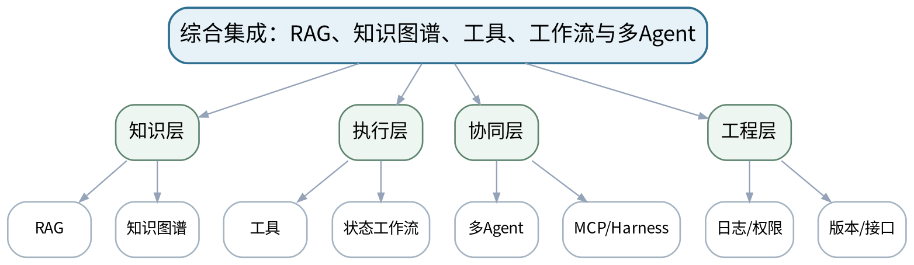

### 教学目标
**知识目标：**
1. 理解综合AI系统中知识、工具、流程、角色和控制层的接口关系。

**能力目标：**
1. 能够集成RAG、知识图谱、工具调用、状态工作流和多Agent形成可演示原型。
2. 能够保留来源、配置、日志和模块接口证据。

**价值目标：**
1. 形成团队协作、版本控制、接口文档和负责任集成意识。

### 课程思政
强调团队个人贡献可追溯、来源真实、模型建议不替代制造安全责任。

### 专创融合
完成从技术模块到可演示智能制造AI产品原型的集成。

### 教学重难点
**教学重点：**跨模块集成与接口稳定。

**教学难点：**控制依赖和状态传播，避免“每个模块单独能跑、集成后不可调试”。

### 教学方法与用具
**教学方法：**任务驱动法、分段实现法、上机实践法、巡回指导法、故障注入、测试验收、同伴复核与错误复盘

**教学用具：**机房、VS Code、Python、向量检索、NetworkX/Neo4j、LLM接口、LangGraph、MCP/等价服务、Git。

### 教学设计
课前任务 → 互动导入（10 min）→ 传授新知与课堂训练（75 min）→ 过关检测（10 min）→ 课堂小结（3 min）→ 作业布置（1 min）→ 考勤（1 min）

### 课前任务
【教师】发布“综合集成：RAG、知识图谱、工具、工作流与多Agent”阅读/环境准备要求和一个最小问题，不提前给出完整答案。

1. 阅读大纲对应单元与指定教材/资料；
2. 圈出3个核心术语，记录至少1个疑问；
3. 检查Python/模型/依赖环境与上一任务代码可运行。

【学生】完成准备并带着问题进入课堂。

### 互动导入
【教师】教师要求团队从一个失败的端到端测试出发，先定位是检索、图谱、工具、路由还是消息问题，而不是全局改Prompt。

【学生】先独立预测/判断，再与同伴交换依据；教师收集典型分歧后进入本课。

### 传授新知与课堂训练
**一、任务说明与最小示范（约20 min）—接口冻结**

【教师】确认模块输入/输出Schema、共享状态、权限和错误类型；建立最小端到端用例。

【学生】根据教师提供的约束完成对应分析/实现，保留中间结果并说明判断依据。

**二、学生独立/小组实现（约35 min）—分段集成**

【教师】先RAG+图谱证据，再工具+工作流，再多Agent/Harness；每合一步运行回归测试。

【学生】根据教师提供的约束完成对应分析/实现，保留中间结果并说明判断依据。

**三、测试、调试与证据固化（约20 min）—集成验收**

【教师】实现工艺建议与缺陷/故障诊断至少两条主流程，答案返回证据并记录执行轨迹。

【学生】根据教师提供的约束完成对应分析/实现，保留中间结果并说明判断依据。

**独立学习产物**：3D打印智能工艺与故障诊断助手Beta原型+接口文档+集成测试。

**学习证据**：源代码/配置、RAG来源、图谱、接口Schema、日志、测试结果、团队分工记录。

**评价映射**：综合项目；目标1.6、2.6、3.5、3.6。

### 过关检测
【教师】组织当堂检测：

1. 端到端失败时为什么要按模块定位？
2. 共享状态中哪些字段应有唯一写入责任？
3. 综合回答必须返回哪些证据？

【学生】独立作答/运行验证；【教师】依据错误类型讲解，要求说明判断依据。

### 课堂小结
【教师】回到本课知识脉络图，用“概念—关系—应用—边界”四个关键词总结“综合集成：RAG、知识图谱、工具、工作流与多Agent”，再次强调教学重点：跨模块集成与接口稳定。

【学生】写下“本课最重要的一条规则 + 一个最容易出错的边界”。

### 作业布置
【教师】布置课后任务：补齐剩余失败用例并准备最终测试/安全验收与个人解释。

【学生】按课程文件命名和证据要求整理提交。

### 考勤
【教师】利用学校/课程实际使用的平台进行签到。

【学生】按课程要求完成签到。

### 课后教学反思
【课后填写，不预填事实】

1. 教学流程：记录100 min各环节实际用时及需要调整的位置；
2. 教学内容：重点记录“控制依赖和状态传播，避免“每个模块单独能跑、集成后不可调试”。”的真实掌握证据与常见错误；
3. 学生参与：仅依据实际课堂记录独立完成、讨论、调试/互审情况，不补写推测；
4. 评价证据：检查本课产物与证据是否完整，记录缺项及原因；
5. 后续改进：依据真实课堂证据决定下一轮调整。

### 本章节参考文献
[1] 高仑等.《大语言模型原理及应用》[M]. 清华大学出版社，2026。
[2] 鲍亮等.《AI智能体应用开发》[M]. 清华大学出版社，2026。
[3] 邓立国, 邓淇文.《AI Agent智能体开发实践》[M]. 清华大学出版社，2025。
[5] 孙洪淋等.《知识图谱——从理论到实践》[M]. 清华大学出版社，2025。
[4] 王晓华.《LangGraph智能体设计模式与多智能体开发》[M]. 清华大学出版社，2026。

## 第28次课 测试、安全验收、现场演示与个人解释

### 课次信息
- **章节/单元**：上机八 3D打印智能工艺与故障诊断助手
- **周次**：按实际课表填写
- **课时安排**：2课时（100 min）
- **课型**：上机

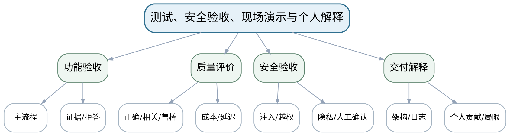

### 教学目标
**知识目标：**
1. 理解综合项目验收中正确性、相关性、鲁棒性、成本、延迟、安全和可追溯性的联合要求。

**能力目标：**
1. 能够运行测试集、分析失败、修复关键问题并完成安全验收。
2. 能够现场解释系统架构、执行轨迹、证据来源和个人贡献。

**价值目标：**
1. 形成负责任交付、持续评价、独立核验和对AI建议保持最终判断的意识。

### 课程思政
以制造安全和负责任AI为最终验收底线，要求对AI建议保持独立判断和人工最终责任。

### 专创融合
通过测试、日志、权限和解释把AI原型转化为可维护、可评审、可持续改进的工程系统。

### 教学重难点
**教学重点：**端到端评价与安全验收。

**教学难点：**不能用现场演示替代测试证据；必须能解释失败、局限和人机责任边界。

### 教学方法与用具
**教学方法：**任务驱动法、分段实现法、上机实践法、巡回指导法、故障注入、测试验收、同伴复核与错误复盘

**教学用具：**机房、完整项目环境、测试集、日志/监控工具、投影与演示设备。

### 教学设计
课前任务 → 互动导入（10 min）→ 传授新知与课堂训练（75 min）→ 过关检测（10 min）→ 课堂小结（3 min）→ 作业布置（1 min）→ 考勤（1 min）

### 课前任务
【教师】发布“测试、安全验收、现场演示与个人解释”阅读/环境准备要求和一个最小问题，不提前给出完整答案。

1. 阅读大纲对应单元与指定教材/资料；
2. 圈出3个核心术语，记录至少1个疑问；
3. 检查Python/模型/依赖环境与上一任务代码可运行。

【学生】完成准备并带着问题进入课堂。

### 互动导入
【教师】先运行一条“恶意提示+无证据+越权工具”的组合测试，要求系统按设计拒绝/降级，再进入正常演示。

【学生】先独立预测/判断，再与同伴交换依据；教师收集典型分歧后进入本课。

### 传授新知与课堂训练
**一、任务说明与最小示范（约20 min）—测试与指标**

【教师】运行不少于20条测试，统计正确性/相关性/拒答、延迟/调用次数等；记录版本和环境。

【学生】根据教师提供的约束完成对应分析/实现，保留中间结果并说明判断依据。

**二、学生独立/小组实现（约35 min）—安全验收**

【教师】执行提示注入、越权、敏感数据、工具失败、高风险确认测试；关键失败必须修复或明确降级。

【学生】根据教师提供的约束完成对应分析/实现，保留中间结果并说明判断依据。

**三、测试、调试与证据固化（约20 min）—现场演示与答辩**

【教师】按“问题→证据→执行轨迹→结果→限制”演示；个人解释负责模块、关键设计、失败案例和改进。

【学生】根据教师提供的约束完成对应分析/实现，保留中间结果并说明判断依据。

**独立学习产物**：最终综合项目包：可演示原型、测试报告、安全清单、演示说明、个人贡献说明。

**学习证据**：源代码/配置、测试集与结果、日志、证据引用、安全用例、版本信息、个人答辩记录。

**评价映射**：综合项目；目标1.6、2.6、3.5、3.6。

### 过关检测
【教师】组织当堂检测：

1. 为什么“演示成功一次”不能证明系统工程可用？
2. 出现高风险建议但证据不足时系统应如何处理？
3. 个人答辩至少要解释哪三类工程证据？

【学生】独立作答/运行验证；【教师】依据错误类型讲解，要求说明判断依据。

### 课堂小结
【教师】回到本课知识脉络图，用“概念—关系—应用—边界”四个关键词总结“测试、安全验收、现场演示与个人解释”，再次强调教学重点：端到端评价与安全验收。

【学生】写下“本课最重要的一条规则 + 一个最容易出错的边界”。

### 作业布置
【教师】布置课后任务：整理课程学习档案：选1个最有价值的失败案例，说明根因、修复和仍存在的局限。

【学生】按课程文件命名和证据要求整理提交。

### 考勤
【教师】利用学校/课程实际使用的平台进行签到。

【学生】按课程要求完成签到。

### 课后教学反思
【课后填写，不预填事实】

1. 教学流程：记录100 min各环节实际用时及需要调整的位置；
2. 教学内容：重点记录“不能用现场演示替代测试证据；必须能解释失败、局限和人机责任边界。”的真实掌握证据与常见错误；
3. 学生参与：仅依据实际课堂记录独立完成、讨论、调试/互审情况，不补写推测；
4. 评价证据：检查本课产物与证据是否完整，记录缺项及原因；
5. 后续改进：依据真实课堂证据决定下一轮调整。

### 本章节参考文献
[1] 高仑等.《大语言模型原理及应用》[M]. 清华大学出版社，2026。
[2] 鲍亮等.《AI智能体应用开发》[M]. 清华大学出版社，2026。
[3] 邓立国, 邓淇文.《AI Agent智能体开发实践》[M]. 清华大学出版社，2025。
[5] 孙洪淋等.《知识图谱——从理论到实践》[M]. 清华大学出版社，2025。
[4] 王晓华.《LangGraph智能体设计模式与多智能体开发》[M]. 清华大学出版社，2026。
