# 信息物理系统（CPS）教案（16次课）

> **Canonical Markdown / 内容权威源**：本文件与 `images/`、`manifest.json` 共同构成课程教案内容主源；Word 仅由此编译。

## 教案封面信息
- **学院**：机械与动力工程学院
- **专业（教研室）**：智能制造工程
- **课程名称**：信息物理系统（CPS）
- **主讲教师**：（按实际填写）
- **职称**：（按实际填写）
- **授课学期**：第7学期
- **授课专业**：智能制造工程
- **编制日期**：（按实际填写）

## 课程基本信息
- **课程代码**：25JD32417
- **课程名称（中文）**：信息物理系统（CPS）
- **课程名称（英文）**：Cyber-Physical Systems (CPS)
- **课程类别**：专业类；课程性质：选修；授课语言：中文
- **授课学期**：第7学期；学分：2
- **课程学时及分配**：总学时32；理论32；实验0；上机0；项目式0
- **适用专业**：智能制造工程
- **教材**：张利国, 詹璟原, 邓恒, 石睿. 信息物理系统原理与设计[M]. 北京：机械工业出版社，2025. ISBN 9787111776550
- **授课学院**：机械与动力工程学院
- **先修课程**：工程建模与科学计算可视化基础（Python）、微机原理及接口技术、机械控制工程基础
- **后续课程**：智能制造综合实践、毕业设计（论文）
- **考核类型**：考查课
- **考核形式**：期末考核采用综合CPS课程设计（综合报告/设计成果 + 答辩与个人核验），不增加闭卷笔试或机考。
- **考核方式**：平时成绩、课程作业、期末综合CPS课程设计
- **总评成绩比例**：总评成绩 = 平时成绩×20% + 课程作业×20% + 期末考核×60%

### 课程简介

课程基本定位：本课程面向智能装备、智能产线和数字化工厂中的计算过程与物理过程深度融合问题，建立“CPS架构—离散状态模型—连续物理模型—混杂与组合模型—需求/安全/模型验证—智能制造CPS与数字孪生设计”的知识主线。

核心学习结果：学生能够解释计算、通信、控制与物理过程的耦合关系；建立状态机、常微分方程、简化混杂自动机和组合模型；把工程需求转化为安全性、活性或时序约束，使用可达性、不变量、轨迹和反例开展基本验证；完成智能装备或产线CPS概念设计。

学情分析：学生已学习Python科学计算、微机原理和机械控制工程基础，具备基本计算、嵌入式和控制建模基础。课程32学时全部为理论教学，Python或仿真结果仅用于教师演示辅助理解，不设置独立上机学时。

主要教学方法：采用“概念框架—数学/状态模型—执行轨迹—需求约束—案例验证—系统设计”的理论课闭环，以架构图、状态图、时序图、方程、可达状态、反例和设计评审作为主要课堂产物。

## 16次课教学设计

## 第01次课 CPS概念、特征、边界与相关技术辨析

- **章节/单元**：第一单元 CPS概念、架构与智能制造场景
- **周次**：按实际课表填写
- **课时安排**：2课时（100 min）

### 知识脉络图

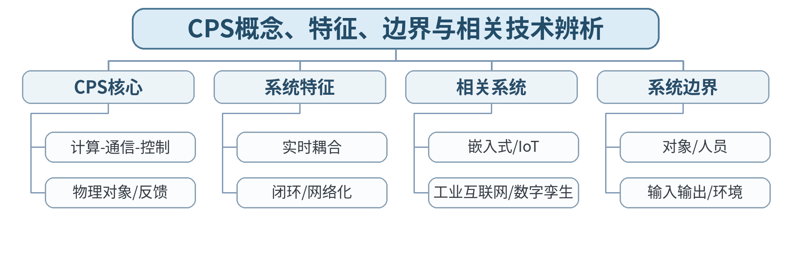

### 教学目标

**知识目标：**
- （1）理解CPS概念、发展背景、基本特征和跨域闭环。
- （2）理解CPS与嵌入式、IoT、工业互联网、数字孪生的关系。
**能力目标：**
- （1）能够识别CPS主要组成并划定基本系统边界。
**价值目标：**
- （1）形成跨机械、电气、控制、计算机和网络的系统思维。

### 课程思政

结合智能装备自主化和工业软件与实体装备融合，强调系统工程责任与自主创新意识。

### 专创融合 / 双创融合

把CPS边界图作为后续数字孪生、智能产线和装备系统概念设计的第一张需求图。

### 教学重难点

教学重点：CPS定义、核心组成及与相邻概念的联系和区别。
教学难点：从“有传感器和网络”进一步识别真正的计算—物理闭环，并明确系统边界。

### 教学方法

讲授法、问题引导法、架构/状态建模法、方程分析法、案例研讨法、教师演示法、同伴互评、反例与证据复盘

### 教学用具

电脑、投影仪、多媒体课件、教材、状态图/时序图模板、需求与验证表、教师提供Python/仿真曲线或案例数据

### 教学设计

课前任务 → 互动导入（15 min）→ 传授新知与课堂训练（70 min）→ 过关检测（10 min）→ 课堂小结（3 min）→ 作业布置（1 min）→ 考勤（1 min）

### 教学过程

#### 课前任务

【教师】发布“CPS概念、特征、边界与相关技术辨析”预习材料和一个最小建模/判断问题，不提前给出完整答案。
【学生】阅读对应教材内容，记录3个核心术语、至少1个疑问，并准备课堂建模表。

**设计意图：** 通过课前阅读和一个最小建模问题建立先备认知，让学生带着可验证的问题进入课堂。

#### 互动导入与传授新知 / 课堂训练

【互动导入 15 min】
【教师】给出“联网温度传感器”“自动温控设备”“数字孪生监控平台”三个案例，要求学生判断哪个构成完整CPS、依据是什么。
【学生】先独立判断/建模，再交换依据。

【传授新知与课堂训练 70 min】
【教师】从计算、通信、控制、物理对象和反馈五个要素建立CPS基本概念。
【学生】完成对应建模/分析并记录判断依据。
【教师】比较CPS与嵌入式系统、物联网、工业互联网、数字孪生的侧重点与交叉关系。
【学生】完成对应建模/分析并记录判断依据。
【教师】学生用“对象—信号—状态—动作—反馈”模板分析一个3D打印设备或机器人工作站，并明确系统内外边界。
【学生】完成对应建模/分析并记录判断依据。

【课堂产物】一张CPS概念辨析表 + 一个智能装备CPS边界草图。
【学习证据】概念表、边界图、1条错误判断修正记录。
【评价关联】平时成绩；目标1.1、2.1、3.1、3.4。

**设计意图：** 采用“先判断/建模 → 最小讲解 → 模型/轨迹推演 → 独立产出 → 反例/证据复核”的理论课闭环，把抽象CPS原理落实到可检查的图、式、表和验证证据。

### 过关检测

【教师】组织当堂检测：
- 1. CPS与普通联网设备的关键差别是什么？
- 2. 数字孪生是否天然等同于CPS？
- 3. 确定系统边界时至少要考虑哪些对象？
【学生】独立作答；【教师】要求说明模型、轨迹或证据依据。

### 课堂小结

【教师】回到知识脉络图，用“概念—模型—关系—边界—证据”总结“CPS概念、特征、边界与相关技术辨析”。
【学生】写下本课最重要的一条规则和一个最容易误判的模型边界。

### 作业布置

【教师】布置课后任务：选择一个智能制造装备，列出物理对象、计算节点、通信链路、控制动作和反馈，并说明两项不属于系统内部的对象。
【学生】按课程文件命名规范整理架构图、状态图、方程、轨迹或验证说明。

### 考勤

【教师】利用学校/课程实际使用的平台进行签到。
【学生】按课程要求完成签到。

### 课后教学反思

【课后填写，不预填事实】
- 1. 教学流程：记录100 min各环节实际用时及需调整位置；
- 2. 教学内容：重点记录“从“有传感器和网络”进一步识别真正的计算—物理闭环，并明确系统边界。”的真实掌握证据与常见错误；
- 3. 学生参与：仅依据实际课堂记录填写独立建模、讨论、互审情况，不补写推测；
- 4. 评价证据：检查本课架构图/状态图/方程/轨迹/验证表是否完整，记录缺项；
- 5. 后续改进：依据真实课堂证据确定下一轮调整。

### 本章节参考文献

[1] 张利国, 詹璟原, 邓恒, 石睿. 信息物理系统原理与设计[M]. 北京：机械工业出版社，2025. ISBN 9787111776550
[2] 任志贵, 张明德. 数字孪生技术[M]. 北京：机械工业出版社，2025. ISBN 9787111770077
[3] 李双寿, 高君. 数字孪生在智能制造中的工程实践[M]. 北京：机械工业出版社，2024. ISBN 9787111758341
[4] 黄源, 张婧慧, 唐京瑞. 工业互联网导论[M]. 北京：机械工业出版社，2024. ISBN 9787111748069

## 第02次课 计算—通信—控制—物理闭环与CPS架构分析

- **章节/单元**：第一单元 CPS概念、架构与智能制造场景
- **周次**：按实际课表填写
- **课时安排**：2课时（100 min）

### 知识脉络图

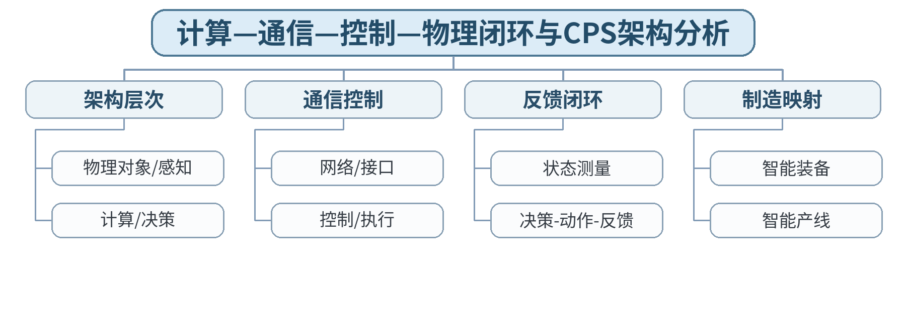

### 教学目标

**知识目标：**
- （1）掌握CPS计算、通信、控制和物理过程闭环的基本架构。
**能力目标：**
- （1）能够绘制CPS系统架构图并说明信号、接口和反馈关系。
**价值目标：**
- （1）形成跨域协同、接口规范和系统边界意识。

### 课程思政

通过跨域接口协作说明局部模块正确并不等于系统整体可靠，培养系统责任意识。

### 专创融合 / 双创融合

将架构图、接口表视为智能制造CPS概念方案的核心交付物，连接后续综合设计。

### 教学重难点

教学重点：CPS闭环架构、信号/接口和制造场景映射。
教学难点：区分“结构连接图”和“因果反馈闭环”，说明每条信息/控制流的方向和意义。

### 教学方法

讲授法、问题引导法、架构/状态建模法、方程分析法、案例研讨法、教师演示法、同伴互评、反例与证据复盘

### 教学用具

电脑、投影仪、多媒体课件、教材、状态图/时序图模板、需求与验证表、教师提供Python/仿真曲线或案例数据

### 教学设计

课前任务 → 互动导入（15 min）→ 传授新知与课堂训练（70 min）→ 过关检测（10 min）→ 课堂小结（3 min）→ 作业布置（1 min）→ 考勤（1 min）

### 教学过程

#### 课前任务

【教师】发布“计算—通信—控制—物理闭环与CPS架构分析”预习材料和一个最小建模/判断问题，不提前给出完整答案。
【学生】阅读对应教材内容，记录3个核心术语、至少1个疑问，并准备课堂建模表。

**设计意图：** 通过课前阅读和一个最小建模问题建立先备认知，让学生带着可验证的问题进入课堂。

#### 互动导入与传授新知 / 课堂训练

【互动导入 15 min】
【教师】展示一张只有模块方框、没有信号方向的“智能产线架构图”，要求学生判断它为什么还不足以说明CPS闭环。
【学生】先独立判断/建模，再交换依据。

【传授新知与课堂训练 70 min】
【教师】从感知、计算、通信、控制、执行和反馈角度拆解CPS架构。
【学生】完成对应建模/分析并记录判断依据。
【教师】用信号方向和反馈关系说明闭环中的状态测量、控制决策和物理响应。
【学生】完成对应建模/分析并记录判断依据。
【教师】学生以AGV物流或机器人工作站为例绘制CPS架构图，至少标注3类信号和2条反馈关系。
【学生】完成对应建模/分析并记录判断依据。

【课堂产物】智能制造场景CPS架构图 + 信号/接口表。
【学习证据】架构图、接口表、闭环路径口头/文字解释。
【评价关联】平时成绩；课程作业过程证据；目标1.1、2.1、3.1、3.4。

**设计意图：** 采用“先判断/建模 → 最小讲解 → 模型/轨迹推演 → 独立产出 → 反例/证据复核”的理论课闭环，把抽象CPS原理落实到可检查的图、式、表和验证证据。

### 过关检测

【教师】组织当堂检测：
- 1. CPS反馈闭环至少包括哪几个环节？
- 2. 传感信号与控制命令的方向是否相同？
- 3. 架构图为什么要标明系统边界和接口？
【学生】独立作答；【教师】要求说明模型、轨迹或证据依据。

### 课堂小结

【教师】回到知识脉络图，用“概念—模型—关系—边界—证据”总结“计算—通信—控制—物理闭环与CPS架构分析”。
【学生】写下本课最重要的一条规则和一个最容易误判的模型边界。

### 作业布置

【教师】布置课后任务：完善课堂架构图，增加网络时延、传感误差或执行故障中的任意两项风险点。
【学生】按课程文件命名规范整理架构图、状态图、方程、轨迹或验证说明。

### 考勤

【教师】利用学校/课程实际使用的平台进行签到。
【学生】按课程要求完成签到。

### 课后教学反思

【课后填写，不预填事实】
- 1. 教学流程：记录100 min各环节实际用时及需调整位置；
- 2. 教学内容：重点记录“区分“结构连接图”和“因果反馈闭环”，说明每条信息/控制流的方向和意义。”的真实掌握证据与常见错误；
- 3. 学生参与：仅依据实际课堂记录填写独立建模、讨论、互审情况，不补写推测；
- 4. 评价证据：检查本课架构图/状态图/方程/轨迹/验证表是否完整，记录缺项；
- 5. 后续改进：依据真实课堂证据确定下一轮调整。

### 本章节参考文献

[1] 张利国, 詹璟原, 邓恒, 石睿. 信息物理系统原理与设计[M]. 北京：机械工业出版社，2025. ISBN 9787111776550
[2] 任志贵, 张明德. 数字孪生技术[M]. 北京：机械工业出版社，2025. ISBN 9787111770077
[3] 李双寿, 高君. 数字孪生在智能制造中的工程实践[M]. 北京：机械工业出版社，2024. ISBN 9787111758341
[4] 黄源, 张婧慧, 唐京瑞. 工业互联网导论[M]. 北京：机械工业出版社，2024. ISBN 9787111748069

## 第03次课 状态、事件、迁移与有限状态机基础

- **章节/单元**：第二单元 离散计算模型与状态机
- **周次**：按实际课表填写
- **课时安排**：2课时（100 min）

### 知识脉络图

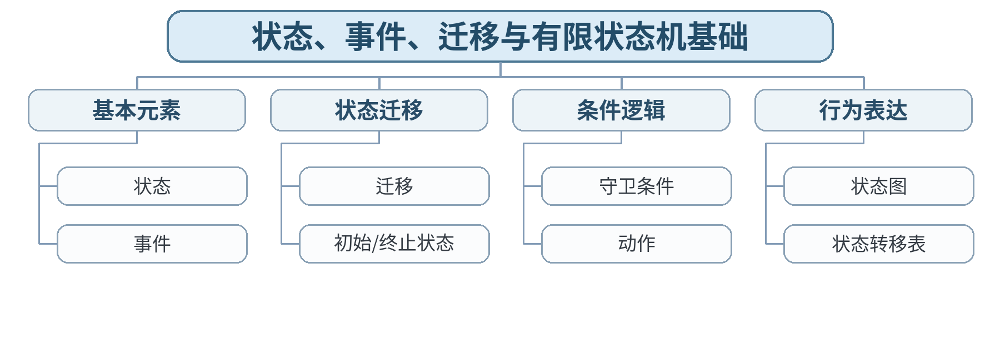

### 教学目标

**知识目标：**
- （1）掌握状态、事件、迁移、有限状态机和自动机基本概念。
**能力目标：**
- （1）能够建立设备有限状态机并定义异常状态。
**价值目标：**
- （1）形成严谨逻辑和异常意识。

### 课程思政

通过设备互锁和状态遗漏案例强化规则、异常和可追溯设计意识。

### 专创融合 / 双创融合

将状态机作为设备软件、PLC逻辑、机器人任务管理的统一行为描述工具。

### 教学重难点

教学重点：状态、事件、迁移、守卫与有限状态机。
教学难点：从自然语言操作流程提取有限、互斥且可验证的状态，而不是把动作名直接当状态。

### 教学方法

讲授法、问题引导法、架构/状态建模法、方程分析法、案例研讨法、教师演示法、同伴互评、反例与证据复盘

### 教学用具

电脑、投影仪、多媒体课件、教材、状态图/时序图模板、需求与验证表、教师提供Python/仿真曲线或案例数据

### 教学设计

课前任务 → 互动导入（15 min）→ 传授新知与课堂训练（70 min）→ 过关检测（10 min）→ 课堂小结（3 min）→ 作业布置（1 min）→ 考勤（1 min）

### 教学过程

#### 课前任务

【教师】发布“状态、事件、迁移与有限状态机基础”预习材料和一个最小建模/判断问题，不提前给出完整答案。
【学生】阅读对应教材内容，记录3个核心术语、至少1个疑问，并准备课堂建模表。

**设计意图：** 通过课前阅读和一个最小建模问题建立先备认知，让学生带着可验证的问题进入课堂。

#### 互动导入与传授新知 / 课堂训练

【互动导入 15 min】
【教师】给出“设备启动、运行、暂停、故障、复位”自然语言流程，让学生先判断“启动”是状态还是事件。
【学生】先独立判断/建模，再交换依据。

【传授新知与课堂训练 70 min】
【教师】定义状态、事件、迁移、初始/终止状态和守卫条件。
【学生】完成对应建模/分析并记录判断依据。
【教师】比较状态图与状态转移表的表达优缺点。
【学生】完成对应建模/分析并记录判断依据。
【教师】学生为“自动门/输送机/打印机”建立5—7个状态的有限状态机，并加入一个异常状态。
【学生】完成对应建模/分析并记录判断依据。

【课堂产物】设备有限状态机 + 状态转移表。
【学习证据】状态图、转移表、至少1条修正前后差异。
【评价关联】平时成绩；课程作业过程证据；目标1.2、2.2、3.2、3.3。

**设计意图：** 采用“先判断/建模 → 最小讲解 → 模型/轨迹推演 → 独立产出 → 反例/证据复核”的理论课闭环，把抽象CPS原理落实到可检查的图、式、表和验证证据。

### 过关检测

【教师】组织当堂检测：
- 1. 状态和事件的区别是什么？
- 2. 守卫条件解决什么问题？
- 3. 一个状态机为什么必须考虑异常状态？
【学生】独立作答；【教师】要求说明模型、轨迹或证据依据。

### 课堂小结

【教师】回到知识脉络图，用“概念—模型—关系—边界—证据”总结“状态、事件、迁移与有限状态机基础”。
【学生】写下本课最重要的一条规则和一个最容易误判的模型边界。

### 作业布置

【教师】布置课后任务：把“设备启停与故障复位”状态机补全为不少于8条迁移，并标注每条迁移触发条件。
【学生】按课程文件命名规范整理架构图、状态图、方程、轨迹或验证说明。

### 考勤

【教师】利用学校/课程实际使用的平台进行签到。
【学生】按课程要求完成签到。

### 课后教学反思

【课后填写，不预填事实】
- 1. 教学流程：记录100 min各环节实际用时及需调整位置；
- 2. 教学内容：重点记录“从自然语言操作流程提取有限、互斥且可验证的状态，而不是把动作名直接当状态。”的真实掌握证据与常见错误；
- 3. 学生参与：仅依据实际课堂记录填写独立建模、讨论、互审情况，不补写推测；
- 4. 评价证据：检查本课架构图/状态图/方程/轨迹/验证表是否完整，记录缺项；
- 5. 后续改进：依据真实课堂证据确定下一轮调整。

### 本章节参考文献

[1] 张利国, 詹璟原, 邓恒, 石睿. 信息物理系统原理与设计[M]. 北京：机械工业出版社，2025. ISBN 9787111776550
[2] 任志贵, 张明德. 数字孪生技术[M]. 北京：机械工业出版社，2025. ISBN 9787111770077
[3] 李双寿, 高君. 数字孪生在智能制造中的工程实践[M]. 北京：机械工业出版社，2024. ISBN 9787111758341
[4] 黄源, 张婧慧, 唐京瑞. 工业互联网导论[M]. 北京：机械工业出版社，2024. ISBN 9787111748069

## 第04次课 输入输出、同步交互与执行轨迹

- **章节/单元**：第二单元 离散计算模型与状态机
- **周次**：按实际课表填写
- **课时安排**：2课时（100 min）

### 知识脉络图

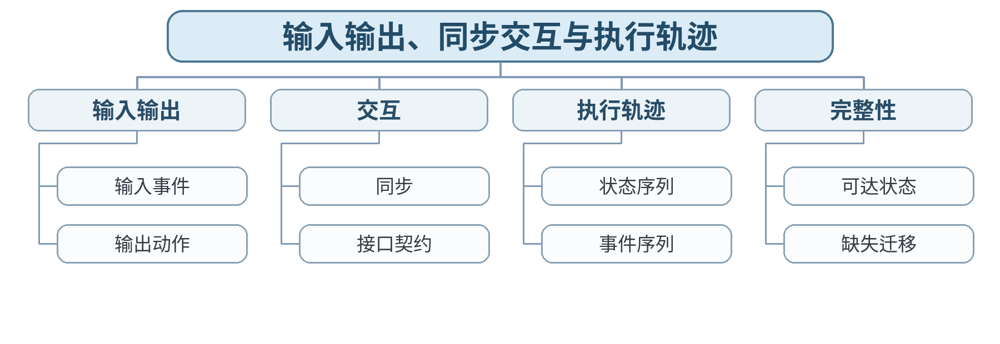

### 教学目标

**知识目标：**
- （1）理解输入输出、同步交互和执行轨迹。
**能力目标：**
- （1）能够根据状态模型生成并检查执行轨迹。
**价值目标：**
- （1）形成接口一致性和证据追踪意识。

### 课程思政

强调系统交互必须遵循接口契约，状态判断必须基于可追踪事件证据。

### 专创融合 / 双创融合

把执行轨迹用于测试用例设计和后续模型验证，实现从模型到测试的连接。

### 教学重难点

教学重点：输入输出自动机、同步交互与执行轨迹。
教学难点：由状态图生成执行轨迹，并据轨迹反查缺失迁移和接口不一致。

### 教学方法

讲授法、问题引导法、架构/状态建模法、方程分析法、案例研讨法、教师演示法、同伴互评、反例与证据复盘

### 教学用具

电脑、投影仪、多媒体课件、教材、状态图/时序图模板、需求与验证表、教师提供Python/仿真曲线或案例数据

### 教学设计

课前任务 → 互动导入（15 min）→ 传授新知与课堂训练（70 min）→ 过关检测（10 min）→ 课堂小结（3 min）→ 作业布置（1 min）→ 考勤（1 min）

### 教学过程

#### 课前任务

【教师】发布“输入输出、同步交互与执行轨迹”预习材料和一个最小建模/判断问题，不提前给出完整答案。
【学生】阅读对应教材内容，记录3个核心术语、至少1个疑问，并准备课堂建模表。

**设计意图：** 通过课前阅读和一个最小建模问题建立先备认知，让学生带着可验证的问题进入课堂。

#### 互动导入与传授新知 / 课堂训练

【互动导入 15 min】
【教师】给出“传感器→控制器→执行器”三个离散模块的事件序列，要求学生判断哪些事件必须同步匹配。
【学生】先独立判断/建模，再交换依据。

【传授新知与课堂训练 70 min】
【教师】解释输入事件、输出动作和接口契约。
【学生】完成对应建模/分析并记录判断依据。
【教师】从状态机生成执行轨迹，区分合法轨迹与不可能轨迹。
【学生】完成对应建模/分析并记录判断依据。
【教师】学生分析一组正常/异常执行轨迹，定位缺失迁移、错误事件或不同步接口。
【学生】完成对应建模/分析并记录判断依据。

【课堂产物】输入/输出接口表 + 3条执行轨迹判定表。
【学习证据】接口表、轨迹判定、错误定位说明。
【评价关联】平时成绩；课程作业过程证据；目标1.2、2.2、3.2、3.3。

**设计意图：** 采用“先判断/建模 → 最小讲解 → 模型/轨迹推演 → 独立产出 → 反例/证据复核”的理论课闭环，把抽象CPS原理落实到可检查的图、式、表和验证证据。

### 过关检测

【教师】组织当堂检测：
- 1. 执行轨迹由哪些信息组成？
- 2. 两个模块同步交互需要哪些接口条件一致？
- 3. 不可达状态一定是错误吗？为什么？
【学生】独立作答；【教师】要求说明模型、轨迹或证据依据。

### 课堂小结

【教师】回到知识脉络图，用“概念—模型—关系—边界—证据”总结“输入输出、同步交互与执行轨迹”。
【学生】写下本课最重要的一条规则和一个最容易误判的模型边界。

### 作业布置

【教师】布置课后任务：根据给定设备状态机写出2条正常轨迹和2条异常/非法轨迹，并说明原因。
【学生】按课程文件命名规范整理架构图、状态图、方程、轨迹或验证说明。

### 考勤

【教师】利用学校/课程实际使用的平台进行签到。
【学生】按课程要求完成签到。

### 课后教学反思

【课后填写，不预填事实】
- 1. 教学流程：记录100 min各环节实际用时及需调整位置；
- 2. 教学内容：重点记录“由状态图生成执行轨迹，并据轨迹反查缺失迁移和接口不一致。”的真实掌握证据与常见错误；
- 3. 学生参与：仅依据实际课堂记录填写独立建模、讨论、互审情况，不补写推测；
- 4. 评价证据：检查本课架构图/状态图/方程/轨迹/验证表是否完整，记录缺项；
- 5. 后续改进：依据真实课堂证据确定下一轮调整。

### 本章节参考文献

[1] 张利国, 詹璟原, 邓恒, 石睿. 信息物理系统原理与设计[M]. 北京：机械工业出版社，2025. ISBN 9787111776550
[2] 任志贵, 张明德. 数字孪生技术[M]. 北京：机械工业出版社，2025. ISBN 9787111770077
[3] 李双寿, 高君. 数字孪生在智能制造中的工程实践[M]. 北京：机械工业出版社，2024. ISBN 9787111758341
[4] 黄源, 张婧慧, 唐京瑞. 工业互联网导论[M]. 北京：机械工业出版社，2024. ISBN 9787111748069

## 第05次课 设备互锁、任务调度与故障恢复状态模型

- **章节/单元**：第二单元 离散计算模型与状态机
- **周次**：按实际课表填写
- **课时安排**：2课时（100 min）

### 知识脉络图

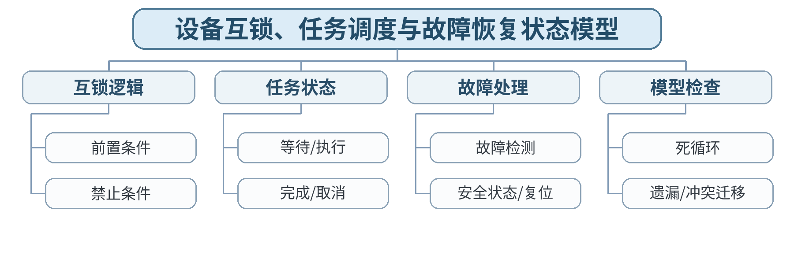

### 教学目标

**知识目标：**
- （1）掌握设备互锁、任务调度和故障恢复状态模型。
**能力目标：**
- （1）能够检查状态机迁移完整性并通过故障轨迹修正模型。
**价值目标：**
- （1）形成安全优先、主动找错和可恢复设计意识。

### 课程思政

以设备安全互锁说明软件逻辑直接影响人员与设备安全，培养对异常路径负责的意识。

### 专创融合 / 双创融合

将故障恢复状态模型作为智能装备可靠运行与维护服务的核心软件资产。

### 教学重难点

教学重点：互锁、任务状态、故障恢复和状态机完整性检查。
教学难点：在正常流程之外设计“失效后如何进入安全状态、何时允许恢复”。

### 教学方法

讲授法、问题引导法、架构/状态建模法、方程分析法、案例研讨法、教师演示法、同伴互评、反例与证据复盘

### 教学用具

电脑、投影仪、多媒体课件、教材、状态图/时序图模板、需求与验证表、教师提供Python/仿真曲线或案例数据

### 教学设计

课前任务 → 互动导入（15 min）→ 传授新知与课堂训练（70 min）→ 过关检测（10 min）→ 课堂小结（3 min）→ 作业布置（1 min）→ 考勤（1 min）

### 教学过程

#### 课前任务

【教师】发布“设备互锁、任务调度与故障恢复状态模型”预习材料和一个最小建模/判断问题，不提前给出完整答案。
【学生】阅读对应教材内容，记录3个核心术语、至少1个疑问，并准备课堂建模表。

**设计意图：** 通过课前阅读和一个最小建模问题建立先备认知，让学生带着可验证的问题进入课堂。

#### 互动导入与传授新知 / 课堂训练

【互动导入 15 min】
【教师】给出机械臂“门未关闭却允许自动运行”的状态逻辑错误，让学生先指出缺失的互锁条件。
【学生】先独立判断/建模，再交换依据。

【传授新知与课堂训练 70 min】
【教师】从前置条件、禁止条件和安全状态设计设备互锁。
【学生】完成对应建模/分析并记录判断依据。
【教师】将任务调度中的等待、执行、完成、取消、超时和故障纳入状态模型。
【学生】完成对应建模/分析并记录判断依据。
【教师】学生对课堂状态机实施“故障注入”，检查能否进入安全状态并可控复位。
【学生】完成对应建模/分析并记录判断依据。

【课堂产物】带互锁和故障恢复的状态机 + 故障注入检查表。
【学习证据】状态机、故障用例、恢复轨迹、修改记录。
【评价关联】平时成绩；课程作业重点证据；目标1.2、2.2、3.2、3.3。

**设计意图：** 采用“先判断/建模 → 最小讲解 → 模型/轨迹推演 → 独立产出 → 反例/证据复核”的理论课闭环，把抽象CPS原理落实到可检查的图、式、表和验证证据。

### 过关检测

【教师】组织当堂检测：
- 1. 互锁条件应放在状态还是迁移条件中？
- 2. 故障发生后为什么不应直接回到运行状态？
- 3. 如何判断一个状态机是否存在迁移遗漏？
【学生】独立作答；【教师】要求说明模型、轨迹或证据依据。

### 课堂小结

【教师】回到知识脉络图，用“概念—模型—关系—边界—证据”总结“设备互锁、任务调度与故障恢复状态模型”。
【学生】写下本课最重要的一条规则和一个最容易误判的模型边界。

### 作业布置

【教师】布置课后任务：完成课程作业中的离散状态模型部分：至少包含正常、边界、故障与恢复轨迹。
【学生】按课程文件命名规范整理架构图、状态图、方程、轨迹或验证说明。

### 考勤

【教师】利用学校/课程实际使用的平台进行签到。
【学生】按课程要求完成签到。

### 课后教学反思

【课后填写，不预填事实】
- 1. 教学流程：记录100 min各环节实际用时及需调整位置；
- 2. 教学内容：重点记录“在正常流程之外设计“失效后如何进入安全状态、何时允许恢复”。”的真实掌握证据与常见错误；
- 3. 学生参与：仅依据实际课堂记录填写独立建模、讨论、互审情况，不补写推测；
- 4. 评价证据：检查本课架构图/状态图/方程/轨迹/验证表是否完整，记录缺项；
- 5. 后续改进：依据真实课堂证据确定下一轮调整。

### 本章节参考文献

[1] 张利国, 詹璟原, 邓恒, 石睿. 信息物理系统原理与设计[M]. 北京：机械工业出版社，2025. ISBN 9787111776550
[2] 任志贵, 张明德. 数字孪生技术[M]. 北京：机械工业出版社，2025. ISBN 9787111770077
[3] 李双寿, 高君. 数字孪生在智能制造中的工程实践[M]. 北京：机械工业出版社，2024. ISBN 9787111758341
[4] 黄源, 张婧慧, 唐京瑞. 工业互联网导论[M]. 北京：机械工业出版社，2024. ISBN 9787111748069

## 第06次课 状态变量、输入输出与常微分方程建模

- **章节/单元**：第三单元 连续物理过程建模
- **周次**：按实际课表填写
- **课时安排**：2课时（100 min）

### 知识脉络图

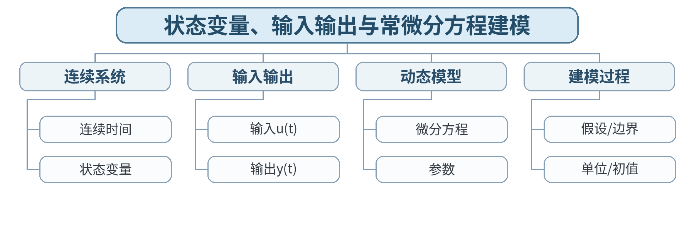

### 教学目标

**知识目标：**
- （1）理解连续时间系统、状态变量、输入输出和常微分方程。
**能力目标：**
- （1）能够建立简化连续模型并说明变量、参数和假设。
**价值目标：**
- （1）形成基于假设、单位和证据建模的习惯。

### 课程思政

通过参数、单位和简化假设对结论的影响，培养尊重客观规律和模型边界的工程作风。

### 专创融合 / 双创融合

把连续模型作为数字孪生预测、控制器设计和状态估计的基础模型资产。

### 教学重难点

教学重点：连续时间系统、状态变量、输入输出和常微分方程。
教学难点：从物理规律选取状态变量和参数，并显式写出假设、单位和初始条件。

### 教学方法

讲授法、问题引导法、架构/状态建模法、方程分析法、案例研讨法、教师演示法、同伴互评、反例与证据复盘

### 教学用具

电脑、投影仪、多媒体课件、教材、状态图/时序图模板、需求与验证表、教师提供Python/仿真曲线或案例数据

### 教学设计

课前任务 → 互动导入（15 min）→ 传授新知与课堂训练（70 min）→ 过关检测（10 min）→ 课堂小结（3 min）→ 作业布置（1 min）→ 考勤（1 min）

### 教学过程

#### 课前任务

【教师】发布“状态变量、输入输出与常微分方程建模”预习材料和一个最小建模/判断问题，不提前给出完整答案。
【学生】阅读对应教材内容，记录3个核心术语、至少1个疑问，并准备课堂建模表。

**设计意图：** 通过课前阅读和一个最小建模问题建立先备认知，让学生带着可验证的问题进入课堂。

#### 互动导入与传授新知 / 课堂训练

【互动导入 15 min】
【教师】给出“加热器—温度传感器—环境散热”案例，要求学生先指出哪些量是状态、输入、输出和参数。
【学生】先独立判断/建模，再交换依据。

【传授新知与课堂训练 70 min】
【教师】解释连续时间状态变量、输入输出和参数的工程含义。
【学生】完成对应建模/分析并记录判断依据。
【教师】以一阶温度过程或直流电机简化模型说明由物理规律形成常微分方程。
【学生】完成对应建模/分析并记录判断依据。
【教师】学生完成一个一阶过程建模模板：对象、假设、变量、参数、方程、初值、输出。
【学生】完成对应建模/分析并记录判断依据。

【课堂产物】一阶连续过程建模卡 + 方程和单位表。
【学习证据】变量/参数表、方程、假设、单位与初值检查。
【评价关联】平时成绩；课程作业过程证据；目标1.3、2.3、3.2。

**设计意图：** 采用“先判断/建模 → 最小讲解 → 模型/轨迹推演 → 独立产出 → 反例/证据复核”的理论课闭环，把抽象CPS原理落实到可检查的图、式、表和验证证据。

### 过关检测

【教师】组织当堂检测：
- 1. 状态变量与输出变量一定相同吗？
- 2. 为什么模型必须明确参数单位？
- 3. 建模假设改变时方程是否可能改变？
【学生】独立作答；【教师】要求说明模型、轨迹或证据依据。

### 课堂小结

【教师】回到知识脉络图，用“概念—模型—关系—边界—证据”总结“状态变量、输入输出与常微分方程建模”。
【学生】写下本课最重要的一条规则和一个最容易误判的模型边界。

### 作业布置

【教师】布置课后任务：选择电机、移动平台或温度过程之一，完成简化ODE模型并说明至少2项假设。
【学生】按课程文件命名规范整理架构图、状态图、方程、轨迹或验证说明。

### 考勤

【教师】利用学校/课程实际使用的平台进行签到。
【学生】按课程要求完成签到。

### 课后教学反思

【课后填写，不预填事实】
- 1. 教学流程：记录100 min各环节实际用时及需调整位置；
- 2. 教学内容：重点记录“从物理规律选取状态变量和参数，并显式写出假设、单位和初始条件。”的真实掌握证据与常见错误；
- 3. 学生参与：仅依据实际课堂记录填写独立建模、讨论、互审情况，不补写推测；
- 4. 评价证据：检查本课架构图/状态图/方程/轨迹/验证表是否完整，记录缺项；
- 5. 后续改进：依据真实课堂证据确定下一轮调整。

### 本章节参考文献

[1] 张利国, 詹璟原, 邓恒, 石睿. 信息物理系统原理与设计[M]. 北京：机械工业出版社，2025. ISBN 9787111776550
[2] 任志贵, 张明德. 数字孪生技术[M]. 北京：机械工业出版社，2025. ISBN 9787111770077
[3] 李双寿, 高君. 数字孪生在智能制造中的工程实践[M]. 北京：机械工业出版社，2024. ISBN 9787111758341
[4] 黄源, 张婧慧, 唐京瑞. 工业互联网导论[M]. 北京：机械工业出版社，2024. ISBN 9787111748069

## 第07次课 平衡点、动态响应、参数敏感性与模型边界

- **章节/单元**：第三单元 连续物理过程建模
- **周次**：按实际课表填写
- **课时安排**：2课时（100 min）

### 知识脉络图

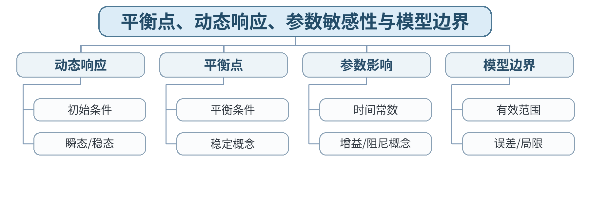

### 教学目标

**知识目标：**
- （1）理解平衡点、动态响应和参数影响。
**能力目标：**
- （1）能够解释连续模型的工程边界和参数敏感性。
**价值目标：**
- （1）形成模型结果不等同于物理事实的证据意识。

### 课程思政

强调模型结果必须与假设和证据绑定，不把数学模型当作真实系统本身。

### 专创融合 / 双创融合

为后续混杂模型中的每个离散模式准备可解释的连续动力学。

### 教学重难点

教学重点：动态响应、平衡点、参数影响和模型适用边界。
教学难点：避免把演示曲线等同于真实设备，能够说明参数变化和未建模因素。

### 教学方法

讲授法、问题引导法、架构/状态建模法、方程分析法、案例研讨法、教师演示法、同伴互评、反例与证据复盘

### 教学用具

电脑、投影仪、多媒体课件、教材、状态图/时序图模板、需求与验证表、教师提供Python/仿真曲线或案例数据

### 教学设计

课前任务 → 互动导入（15 min）→ 传授新知与课堂训练（70 min）→ 过关检测（10 min）→ 课堂小结（3 min）→ 作业布置（1 min）→ 考勤（1 min）

### 教学过程

#### 课前任务

【教师】发布“平衡点、动态响应、参数敏感性与模型边界”预习材料和一个最小建模/判断问题，不提前给出完整答案。
【学生】阅读对应教材内容，记录3个核心术语、至少1个疑问，并准备课堂建模表。

**设计意图：** 通过课前阅读和一个最小建模问题建立先备认知，让学生带着可验证的问题进入课堂。

#### 互动导入与传授新知 / 课堂训练

【互动导入 15 min】
【教师】展示同一一阶温度模型在两个时间常数下的响应曲线，要求学生先判断哪一个系统“反应更快”并说明依据。
【学生】先独立判断/建模，再交换依据。

【传授新知与课堂训练 70 min】
【教师】从初始条件、输入和参数解释瞬态/稳态响应。
【学生】完成对应建模/分析并记录判断依据。
【教师】说明平衡点与基本稳定性概念，不展开控制理论重复推导。
【学生】完成对应建模/分析并记录判断依据。
【教师】通过教师提供Python/仿真曲线比较参数变化，学生完成“参数—响应—工程含义—模型局限”表。
【学生】完成对应建模/分析并记录判断依据。

【课堂产物】连续模型参数敏感性与边界分析表。
【学习证据】响应曲线/教师数据、参数对比表、模型局限说明。
【评价关联】平时成绩；课程作业重点证据；目标1.3、2.3、3.2。

**设计意图：** 采用“先判断/建模 → 最小讲解 → 模型/轨迹推演 → 独立产出 → 反例/证据复核”的理论课闭环，把抽象CPS原理落实到可检查的图、式、表和验证证据。

### 过关检测

【教师】组织当堂检测：
- 1. 平衡点的基本含义是什么？
- 2. 时间常数变大通常意味着响应更快还是更慢？
- 3. 为什么仿真曲线不能直接证明真实设备一定如此？
【学生】独立作答；【教师】要求说明模型、轨迹或证据依据。

### 课堂小结

【教师】回到知识脉络图，用“概念—模型—关系—边界—证据”总结“平衡点、动态响应、参数敏感性与模型边界”。
【学生】写下本课最重要的一条规则和一个最容易误判的模型边界。

### 作业布置

【教师】布置课后任务：完善连续模型，给出一个模型有效范围和一个可能导致模型失效的现实因素。
【学生】按课程文件命名规范整理架构图、状态图、方程、轨迹或验证说明。

### 考勤

【教师】利用学校/课程实际使用的平台进行签到。
【学生】按课程要求完成签到。

### 课后教学反思

【课后填写，不预填事实】
- 1. 教学流程：记录100 min各环节实际用时及需调整位置；
- 2. 教学内容：重点记录“避免把演示曲线等同于真实设备，能够说明参数变化和未建模因素。”的真实掌握证据与常见错误；
- 3. 学生参与：仅依据实际课堂记录填写独立建模、讨论、互审情况，不补写推测；
- 4. 评价证据：检查本课架构图/状态图/方程/轨迹/验证表是否完整，记录缺项；
- 5. 后续改进：依据真实课堂证据确定下一轮调整。

### 本章节参考文献

[1] 张利国, 詹璟原, 邓恒, 石睿. 信息物理系统原理与设计[M]. 北京：机械工业出版社，2025. ISBN 9787111776550
[2] 任志贵, 张明德. 数字孪生技术[M]. 北京：机械工业出版社，2025. ISBN 9787111770077
[3] 李双寿, 高君. 数字孪生在智能制造中的工程实践[M]. 北京：机械工业出版社，2024. ISBN 9787111758341
[4] 黄源, 张婧慧, 唐京瑞. 工业互联网导论[M]. 北京：机械工业出版社，2024. ISBN 9787111748069

## 第08次课 混杂系统、离散模式与连续状态

- **章节/单元**：第四单元 混杂系统与组合建模
- **周次**：按实际课表填写
- **课时安排**：2课时（100 min）

### 知识脉络图

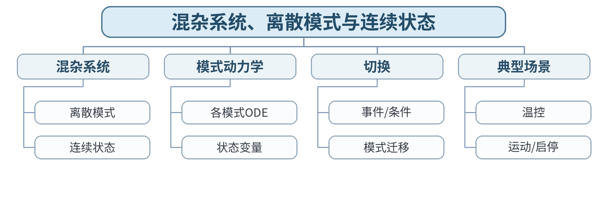

### 教学目标

**知识目标：**
- （1）掌握混杂系统、离散模式和连续状态基本概念。
**能力目标：**
- （1）能够把状态机与连续模型组合为简化混杂系统。
**价值目标：**
- （1）形成软硬件协同和全局分析意识。

### 课程思政

通过软件模式切换影响真实物理状态的案例，强化软件—物理双向责任。

### 专创融合 / 双创融合

混杂模型为智能装备逻辑+动力学联合仿真与数字孪生提供统一表达。

### 教学重难点

教学重点：混杂系统基本思想：离散模式 + 连续动态 + 模式切换。
教学难点：同时跟踪离散模式和连续状态，理解“切换后动力学规则可能改变”。

### 教学方法

讲授法、问题引导法、架构/状态建模法、方程分析法、案例研讨法、教师演示法、同伴互评、反例与证据复盘

### 教学用具

电脑、投影仪、多媒体课件、教材、状态图/时序图模板、需求与验证表、教师提供Python/仿真曲线或案例数据

### 教学设计

课前任务 → 互动导入（15 min）→ 传授新知与课堂训练（70 min）→ 过关检测（10 min）→ 课堂小结（3 min）→ 作业布置（1 min）→ 考勤（1 min）

### 教学过程

#### 课前任务

【教师】发布“混杂系统、离散模式与连续状态”预习材料和一个最小建模/判断问题，不提前给出完整答案。
【学生】阅读对应教材内容，记录3个核心术语、至少1个疑问，并准备课堂建模表。

**设计意图：** 通过课前阅读和一个最小建模问题建立先备认知，让学生带着可验证的问题进入课堂。

#### 互动导入与传授新知 / 课堂训练

【互动导入 15 min】
【教师】以“加热器OFF/ON但温度连续变化”为例，要求学生判断系统中哪些变量离散、哪些连续。
【学生】先独立判断/建模，再交换依据。

【传授新知与课堂训练 70 min】
【教师】定义混杂系统和混杂状态。
【学生】完成对应建模/分析并记录判断依据。
【教师】用温控、运动控制或设备启停案例说明不同离散模式下采用不同连续动力学。
【学生】完成对应建模/分析并记录判断依据。
【教师】学生把上一单元连续模型嵌入两个离散模式，画出初步混杂状态图。
【学生】完成对应建模/分析并记录判断依据。

【课堂产物】两模式混杂系统草图 + 离散/连续变量表。
【学习证据】模式表、每模式连续方程/规则、切换条件草案。
【评价关联】平时成绩；课程作业过程证据；目标1.4、2.3、3.1、3.3。

**设计意图：** 采用“先判断/建模 → 最小讲解 → 模型/轨迹推演 → 独立产出 → 反例/证据复核”的理论课闭环，把抽象CPS原理落实到可检查的图、式、表和验证证据。

### 过关检测

【教师】组织当堂检测：
- 1. 混杂状态由哪些部分组成？
- 2. 模式切换后连续状态是否必须清零？
- 3. 为什么纯状态机无法完整描述温控动态？
【学生】独立作答；【教师】要求说明模型、轨迹或证据依据。

### 课堂小结

【教师】回到知识脉络图，用“概念—模型—关系—边界—证据”总结“混杂系统、离散模式与连续状态”。
【学生】写下本课最重要的一条规则和一个最容易误判的模型边界。

### 作业布置

【教师】布置课后任务：将课堂两模式模型扩展为至少3个模式，并说明每个模式的连续动态。
【学生】按课程文件命名规范整理架构图、状态图、方程、轨迹或验证说明。

### 考勤

【教师】利用学校/课程实际使用的平台进行签到。
【学生】按课程要求完成签到。

### 课后教学反思

【课后填写，不预填事实】
- 1. 教学流程：记录100 min各环节实际用时及需调整位置；
- 2. 教学内容：重点记录“同时跟踪离散模式和连续状态，理解“切换后动力学规则可能改变”。”的真实掌握证据与常见错误；
- 3. 学生参与：仅依据实际课堂记录填写独立建模、讨论、互审情况，不补写推测；
- 4. 评价证据：检查本课架构图/状态图/方程/轨迹/验证表是否完整，记录缺项；
- 5. 后续改进：依据真实课堂证据确定下一轮调整。

### 本章节参考文献

[1] 张利国, 詹璟原, 邓恒, 石睿. 信息物理系统原理与设计[M]. 北京：机械工业出版社，2025. ISBN 9787111776550
[2] 任志贵, 张明德. 数字孪生技术[M]. 北京：机械工业出版社，2025. ISBN 9787111770077
[3] 李双寿, 高君. 数字孪生在智能制造中的工程实践[M]. 北京：机械工业出版社，2024. ISBN 9787111758341
[4] 黄源, 张婧慧, 唐京瑞. 工业互联网导论[M]. 北京：机械工业出版社，2024. ISBN 9787111748069

## 第09次课 混杂自动机：守卫、重置、不变量与模式切换

- **章节/单元**：第四单元 混杂系统与组合建模
- **周次**：按实际课表填写
- **课时安排**：2课时（100 min）

### 知识脉络图

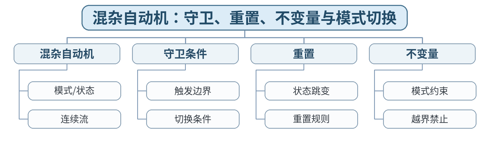

### 教学目标

**知识目标：**
- （1）掌握混杂自动机、守卫、重置和不变量。
**能力目标：**
- （1）能够建立带安全边界的简化混杂自动机。
**价值目标：**
- （1）形成边界前置和安全约束显式化意识。

### 课程思政

以越界和模式切换风险说明形式化约束对物理安全的重要价值。

### 专创融合 / 双创融合

把安全阈值和模式切换显式化，为后续可达性与反例验证提供模型基础。

### 教学重难点

教学重点：混杂自动机中的守卫、重置和不变量。
教学难点：区分守卫条件与模式不变量，并正确处理切换时连续状态的重置/保持。

### 教学方法

讲授法、问题引导法、架构/状态建模法、方程分析法、案例研讨法、教师演示法、同伴互评、反例与证据复盘

### 教学用具

电脑、投影仪、多媒体课件、教材、状态图/时序图模板、需求与验证表、教师提供Python/仿真曲线或案例数据

### 教学设计

课前任务 → 互动导入（15 min）→ 传授新知与课堂训练（70 min）→ 过关检测（10 min）→ 课堂小结（3 min）→ 作业布置（1 min）→ 考勤（1 min）

### 教学过程

#### 课前任务

【教师】发布“混杂自动机：守卫、重置、不变量与模式切换”预习材料和一个最小建模/判断问题，不提前给出完整答案。
【学生】阅读对应教材内容，记录3个核心术语、至少1个疑问，并准备课堂建模表。

**设计意图：** 通过课前阅读和一个最小建模问题建立先备认知，让学生带着可验证的问题进入课堂。

#### 互动导入与传授新知 / 课堂训练

【互动导入 15 min】
【教师】给出“温度达到80℃切换到降温模式；在加热模式温度不得超过85℃”两条规则，要求学生判断哪条是守卫、哪条是不变量。
【学生】先独立判断/建模，再交换依据。

【传授新知与课堂训练 70 min】
【教师】从模式、连续流、守卫、重置和不变量五部分定义混杂自动机。
【学生】完成对应建模/分析并记录判断依据。
【教师】比较守卫与不变量在“允许切换”和“允许停留”上的不同职责。
【学生】完成对应建模/分析并记录判断依据。
【教师】学生完善温控/移动平台混杂自动机，加入1个重置和2个不变量并检查边界。
【学生】完成对应建模/分析并记录判断依据。

【课堂产物】完整混杂自动机图 + 守卫/重置/不变量表。
【学习证据】自动机图、条件表、边界轨迹检查。
【评价关联】平时成绩；课程作业重点证据；目标1.4、2.3、3.3。

**设计意图：** 采用“先判断/建模 → 最小讲解 → 模型/轨迹推演 → 独立产出 → 反例/证据复核”的理论课闭环，把抽象CPS原理落实到可检查的图、式、表和验证证据。

### 过关检测

【教师】组织当堂检测：
- 1. 守卫和不变量的主要差别是什么？
- 2. 什么情况下需要重置连续状态？
- 3. 不变量被违反意味着什么？
【学生】独立作答；【教师】要求说明模型、轨迹或证据依据。

### 课堂小结

【教师】回到知识脉络图，用“概念—模型—关系—边界—证据”总结“混杂自动机：守卫、重置、不变量与模式切换”。
【学生】写下本课最重要的一条规则和一个最容易误判的模型边界。

### 作业布置

【教师】布置课后任务：完成一个含3模式、至少4守卫、1重置、2不变量的混杂自动机。
【学生】按课程文件命名规范整理架构图、状态图、方程、轨迹或验证说明。

### 考勤

【教师】利用学校/课程实际使用的平台进行签到。
【学生】按课程要求完成签到。

### 课后教学反思

【课后填写，不预填事实】
- 1. 教学流程：记录100 min各环节实际用时及需调整位置；
- 2. 教学内容：重点记录“区分守卫条件与模式不变量，并正确处理切换时连续状态的重置/保持。”的真实掌握证据与常见错误；
- 3. 学生参与：仅依据实际课堂记录填写独立建模、讨论、互审情况，不补写推测；
- 4. 评价证据：检查本课架构图/状态图/方程/轨迹/验证表是否完整，记录缺项；
- 5. 后续改进：依据真实课堂证据确定下一轮调整。

### 本章节参考文献

[1] 张利国, 詹璟原, 邓恒, 石睿. 信息物理系统原理与设计[M]. 北京：机械工业出版社，2025. ISBN 9787111776550
[2] 任志贵, 张明德. 数字孪生技术[M]. 北京：机械工业出版社，2025. ISBN 9787111770077
[3] 李双寿, 高君. 数字孪生在智能制造中的工程实践[M]. 北京：机械工业出版社，2024. ISBN 9787111758341
[4] 黄源, 张婧慧, 唐京瑞. 工业互联网导论[M]. 北京：机械工业出版社，2024. ISBN 9787111748069

## 第10次课 接口、并行/层次组合与组合冲突分析

- **章节/单元**：第四单元 混杂系统与组合建模
- **周次**：按实际课表填写
- **课时安排**：2课时（100 min）

### 知识脉络图

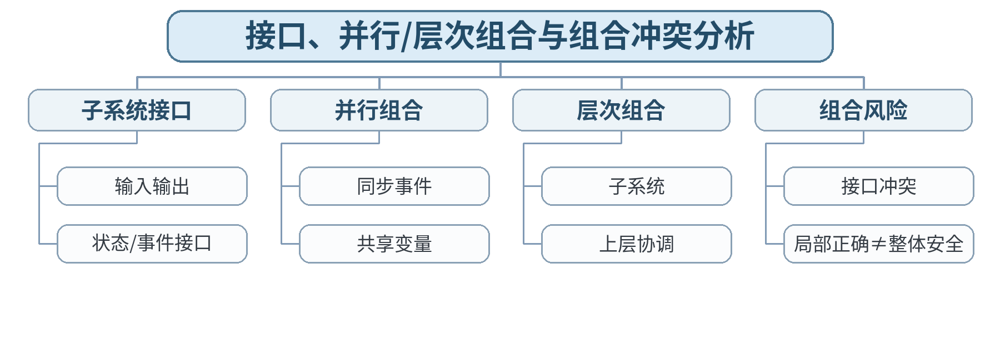

### 教学目标

**知识目标：**
- （1）理解子系统接口、并行组合和层次化组合。
**能力目标：**
- （1）能够组合简化模型并识别接口/状态冲突。
**价值目标：**
- （1）形成全局安全、接口契约和跨域协同意识。

### 课程思政

通过“局部正确不等于整体安全”强化跨专业协同、接口责任和系统风险意识。

### 专创融合 / 双创融合

组合建模直接对应智能产线中机器人、输送、视觉、门禁等多子系统集成。

### 教学重难点

教学重点：子系统接口、并行/层次组合和组合冲突。
教学难点：在多个局部模型都“正确”时识别接口语义、时序或共享资源造成的系统冲突。

### 教学方法

讲授法、问题引导法、架构/状态建模法、方程分析法、案例研讨法、教师演示法、同伴互评、反例与证据复盘

### 教学用具

电脑、投影仪、多媒体课件、教材、状态图/时序图模板、需求与验证表、教师提供Python/仿真曲线或案例数据

### 教学设计

课前任务 → 互动导入（15 min）→ 传授新知与课堂训练（70 min）→ 过关检测（10 min）→ 课堂小结（3 min）→ 作业布置（1 min）→ 考勤（1 min）

### 教学过程

#### 课前任务

【教师】发布“接口、并行/层次组合与组合冲突分析”预习材料和一个最小建模/判断问题，不提前给出完整答案。
【学生】阅读对应教材内容，记录3个核心术语、至少1个疑问，并准备课堂建模表。

**设计意图：** 通过课前阅读和一个最小建模问题建立先备认知，让学生带着可验证的问题进入课堂。

#### 互动导入与传授新知 / 课堂训练

【互动导入 15 min】
【教师】给出“机器人允许进入工位”和“安全门允许打开”两个各自合理的状态机，组合后出现同一时刻冲突，要求学生找系统层原因。
【学生】先独立判断/建模，再交换依据。

【传授新知与课堂训练 70 min】
【教师】解释CPS子系统的输入输出、事件和共享状态接口。
【学生】完成对应建模/分析并记录判断依据。
【教师】用并行组合与层次化组合描述多设备/多控制器协同。
【学生】完成对应建模/分析并记录判断依据。
【教师】学生组合两个课堂状态机，建立接口表并制造一个冲突，随后通过约束或协调状态修正。
【学生】完成对应建模/分析并记录判断依据。

【课堂产物】双子系统组合模型 + 接口合同 + 冲突/修正记录。
【学习证据】接口表、组合状态图、冲突轨迹、修正后复验。
【评价关联】平时成绩；课程作业重点证据；目标1.4、2.3、3.1、3.3。

**设计意图：** 采用“先判断/建模 → 最小讲解 → 模型/轨迹推演 → 独立产出 → 反例/证据复核”的理论课闭环，把抽象CPS原理落实到可检查的图、式、表和验证证据。

### 过关检测

【教师】组织当堂检测：
- 1. 并行组合为什么可能产生状态空间增长？
- 2. 局部安全为什么不一定推出整体安全？
- 3. 接口合同至少应明确哪些信息？
【学生】独立作答；【教师】要求说明模型、轨迹或证据依据。

### 课堂小结

【教师】回到知识脉络图，用“概念—模型—关系—边界—证据”总结“接口、并行/层次组合与组合冲突分析”。
【学生】写下本课最重要的一条规则和一个最容易误判的模型边界。

### 作业布置

【教师】布置课后任务：完成课程作业中的混杂/组合模型部分，必须包含一个组合冲突及其修正。
【学生】按课程文件命名规范整理架构图、状态图、方程、轨迹或验证说明。

### 考勤

【教师】利用学校/课程实际使用的平台进行签到。
【学生】按课程要求完成签到。

### 课后教学反思

【课后填写，不预填事实】
- 1. 教学流程：记录100 min各环节实际用时及需调整位置；
- 2. 教学内容：重点记录“在多个局部模型都“正确”时识别接口语义、时序或共享资源造成的系统冲突。”的真实掌握证据与常见错误；
- 3. 学生参与：仅依据实际课堂记录填写独立建模、讨论、互审情况，不补写推测；
- 4. 评价证据：检查本课架构图/状态图/方程/轨迹/验证表是否完整，记录缺项；
- 5. 后续改进：依据真实课堂证据确定下一轮调整。

### 本章节参考文献

[1] 张利国, 詹璟原, 邓恒, 石睿. 信息物理系统原理与设计[M]. 北京：机械工业出版社，2025. ISBN 9787111776550
[2] 任志贵, 张明德. 数字孪生技术[M]. 北京：机械工业出版社，2025. ISBN 9787111770077
[3] 李双寿, 高君. 数字孪生在智能制造中的工程实践[M]. 北京：机械工业出版社，2024. ISBN 9787111758341
[4] 黄源, 张婧慧, 唐京瑞. 工业互联网导论[M]. 北京：机械工业出版社，2024. ISBN 9787111748069

## 第11次课 从工程需求到安全性、活性与时序约束

- **章节/单元**：第五单元 CPS需求、模型验证与安全
- **周次**：按实际课表填写
- **课时安排**：2课时（100 min）

### 知识脉络图

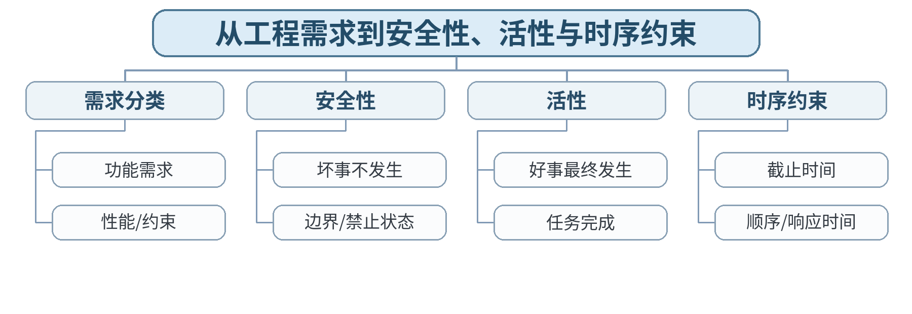

### 教学目标

**知识目标：**
- （1）理解需求与模型关系、安全性、活性和时序约束。
**能力目标：**
- （1）能够把工程需求改写为基本可验证约束。
**价值目标：**
- （1）形成需求可验证、边界清晰和安全前置意识。

### 课程思政

强调安全需求必须前置并可检查，而不是事故后补救，培养质量责任。

### 专创融合 / 双创融合

把需求表作为期末综合CPS设计的验收合同，连接模型与测试。

### 教学重难点

教学重点：安全性、活性和时序需求的形式化表达思想。
教学难点：把“系统要安全/要快/要完成任务”等模糊语言改写为可检查的状态/轨迹约束。

### 教学方法

讲授法、问题引导法、架构/状态建模法、方程分析法、案例研讨法、教师演示法、同伴互评、反例与证据复盘

### 教学用具

电脑、投影仪、多媒体课件、教材、状态图/时序图模板、需求与验证表、教师提供Python/仿真曲线或案例数据

### 教学设计

课前任务 → 互动导入（15 min）→ 传授新知与课堂训练（70 min）→ 过关检测（10 min）→ 课堂小结（3 min）→ 作业布置（1 min）→ 考勤（1 min）

### 教学过程

#### 课前任务

【教师】发布“从工程需求到安全性、活性与时序约束”预习材料和一个最小建模/判断问题，不提前给出完整答案。
【学生】阅读对应教材内容，记录3个核心术语、至少1个疑问，并准备课堂建模表。

**设计意图：** 通过课前阅读和一个最小建模问题建立先备认知，让学生带着可验证的问题进入课堂。

#### 互动导入与传授新知 / 课堂训练

【互动导入 15 min】
【教师】给出“机械臂必须安全”“AGV要及时到达”两句需求，让学生指出为什么无法直接验证，并改写为可检查条件。
【学生】先独立判断/建模，再交换依据。

【传授新知与课堂训练 70 min】
【教师】区分功能、性能和安全等工程需求。
【学生】完成对应建模/分析并记录判断依据。
【教师】用“坏事不发生”解释安全性，用“好事最终发生”解释活性。
【学生】完成对应建模/分析并记录判断依据。
【教师】学生将5条自然语言需求改写为状态禁止、最终到达或时间约束，并互审可检查性。
【学生】完成对应建模/分析并记录判断依据。

【课堂产物】CPS需求表：原始需求、类型、可检查约束、验证证据。
【学习证据】需求表、修改前后表述、互审意见。
【评价关联】平时成绩；课程作业过程证据；目标1.4、2.4、3.3、3.4。

**设计意图：** 采用“先判断/建模 → 最小讲解 → 模型/轨迹推演 → 独立产出 → 反例/证据复核”的理论课闭环，把抽象CPS原理落实到可检查的图、式、表和验证证据。

### 过关检测

【教师】组织当堂检测：
- 1. 安全性与活性的核心区别是什么？
- 2. “系统可靠”为什么不是一个足够具体的验证需求？
- 3. 时序约束至少应明确哪两个时间点？
【学生】独立作答；【教师】要求说明模型、轨迹或证据依据。

### 课堂小结

【教师】回到知识脉络图，用“概念—模型—关系—边界—证据”总结“从工程需求到安全性、活性与时序约束”。
【学生】写下本课最重要的一条规则和一个最容易误判的模型边界。

### 作业布置

【教师】布置课后任务：为自己的智能制造场景编写至少2条安全性、2条活性和1条时序约束。
【学生】按课程文件命名规范整理架构图、状态图、方程、轨迹或验证说明。

### 考勤

【教师】利用学校/课程实际使用的平台进行签到。
【学生】按课程要求完成签到。

### 课后教学反思

【课后填写，不预填事实】
- 1. 教学流程：记录100 min各环节实际用时及需调整位置；
- 2. 教学内容：重点记录“把“系统要安全/要快/要完成任务”等模糊语言改写为可检查的状态/轨迹约束。”的真实掌握证据与常见错误；
- 3. 学生参与：仅依据实际课堂记录填写独立建模、讨论、互审情况，不补写推测；
- 4. 评价证据：检查本课架构图/状态图/方程/轨迹/验证表是否完整，记录缺项；
- 5. 后续改进：依据真实课堂证据确定下一轮调整。

### 本章节参考文献

[1] 张利国, 詹璟原, 邓恒, 石睿. 信息物理系统原理与设计[M]. 北京：机械工业出版社，2025. ISBN 9787111776550
[2] 任志贵, 张明德. 数字孪生技术[M]. 北京：机械工业出版社，2025. ISBN 9787111770077
[3] 李双寿, 高君. 数字孪生在智能制造中的工程实践[M]. 北京：机械工业出版社，2024. ISBN 9787111758341
[4] 黄源, 张婧慧, 唐京瑞. 工业互联网导论[M]. 北京：机械工业出版社，2024. ISBN 9787111748069

## 第12次课 可达性、不变量、执行轨迹与反例

- **章节/单元**：第五单元 CPS需求、模型验证与安全
- **周次**：按实际课表填写
- **课时安排**：2课时（100 min）

### 知识脉络图

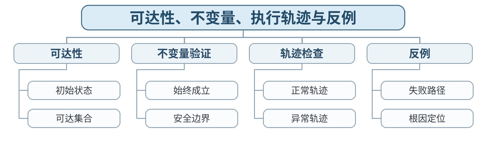

### 教学目标

**知识目标：**
- （1）掌握可达性、不变量、轨迹和反例基本思想。
**能力目标：**
- （1）能够对简化模型开展基本可达/轨迹检查并识别反例。
**价值目标：**
- （1）形成主动找错和证据验证意识。

### 课程思政

通过主动寻找失败条件培养“不回避错误、用证据改进系统”的工程质量文化。

### 专创融合 / 双创融合

将反例转化为测试用例和设计修正输入，建立模型驱动验证闭环。

### 教学重难点

教学重点：可达性、不变量、轨迹检查和反例。
教学难点：理解验证不是“多跑几个正常案例”，而是主动寻找违反需求的可达状态或轨迹。

### 教学方法

讲授法、问题引导法、架构/状态建模法、方程分析法、案例研讨法、教师演示法、同伴互评、反例与证据复盘

### 教学用具

电脑、投影仪、多媒体课件、教材、状态图/时序图模板、需求与验证表、教师提供Python/仿真曲线或案例数据

### 教学设计

课前任务 → 互动导入（15 min）→ 传授新知与课堂训练（70 min）→ 过关检测（10 min）→ 课堂小结（3 min）→ 作业布置（1 min）→ 考勤（1 min）

### 教学过程

#### 课前任务

【教师】发布“可达性、不变量、执行轨迹与反例”预习材料和一个最小建模/判断问题，不提前给出完整答案。
【学生】阅读对应教材内容，记录3个核心术语、至少1个疑问，并准备课堂建模表。

**设计意图：** 通过课前阅读和一个最小建模问题建立先备认知，让学生带着可验证的问题进入课堂。

#### 互动导入与传授新知 / 课堂训练

【互动导入 15 min】
【教师】给出一个模型经过3步后到达“门开且机器人运动”状态，要求学生判断这是一条普通测试失败还是安全性反例。
【学生】先独立判断/建模，再交换依据。

【传授新知与课堂训练 70 min】
【教师】用初始状态和迁移关系说明可达状态集合。
【学生】完成对应建模/分析并记录判断依据。
【教师】用不变量检查安全边界，用执行轨迹检查需求是否被违反。
【学生】完成对应建模/分析并记录判断依据。
【教师】学生对简化状态/混杂模型进行手工可达分析，找到或证明未找到一条反例。
【学生】完成对应建模/分析并记录判断依据。

【课堂产物】可达状态表 + 不变量检查 + 反例轨迹。
【学习证据】状态集合、反例路径、违反需求说明。
【评价关联】平时成绩；课程作业重点证据；目标1.4、2.4、3.3、3.4。

**设计意图：** 采用“先判断/建模 → 最小讲解 → 模型/轨迹推演 → 独立产出 → 反例/证据复核”的理论课闭环，把抽象CPS原理落实到可检查的图、式、表和验证证据。

### 过关检测

【教师】组织当堂检测：
- 1. 什么是可达状态？
- 2. 不变量被一个可达状态违反意味着什么？
- 3. 反例的价值是什么？
【学生】独立作答；【教师】要求说明模型、轨迹或证据依据。

### 课堂小结

【教师】回到知识脉络图，用“概念—模型—关系—边界—证据”总结“可达性、不变量、执行轨迹与反例”。
【学生】写下本课最重要的一条规则和一个最容易误判的模型边界。

### 作业布置

【教师】布置课后任务：为上一课5条需求至少选择2条做轨迹/可达性检查，并记录反例或验证证据。
【学生】按课程文件命名规范整理架构图、状态图、方程、轨迹或验证说明。

### 考勤

【教师】利用学校/课程实际使用的平台进行签到。
【学生】按课程要求完成签到。

### 课后教学反思

【课后填写，不预填事实】
- 1. 教学流程：记录100 min各环节实际用时及需调整位置；
- 2. 教学内容：重点记录“理解验证不是“多跑几个正常案例”，而是主动寻找违反需求的可达状态或轨迹。”的真实掌握证据与常见错误；
- 3. 学生参与：仅依据实际课堂记录填写独立建模、讨论、互审情况，不补写推测；
- 4. 评价证据：检查本课架构图/状态图/方程/轨迹/验证表是否完整，记录缺项；
- 5. 后续改进：依据真实课堂证据确定下一轮调整。

### 本章节参考文献

[1] 张利国, 詹璟原, 邓恒, 石睿. 信息物理系统原理与设计[M]. 北京：机械工业出版社，2025. ISBN 9787111776550
[2] 任志贵, 张明德. 数字孪生技术[M]. 北京：机械工业出版社，2025. ISBN 9787111770077
[3] 李双寿, 高君. 数字孪生在智能制造中的工程实践[M]. 北京：机械工业出版社，2024. ISBN 9787111758341
[4] 黄源, 张婧慧, 唐京瑞. 工业互联网导论[M]. 北京：机械工业出版社，2024. ISBN 9787111748069

## 第13次课 死锁、不可达、越界、故障注入与修正复验

- **章节/单元**：第五单元 CPS需求、模型验证与安全
- **周次**：按实际课表填写
- **课时安排**：2课时（100 min）

### 知识脉络图

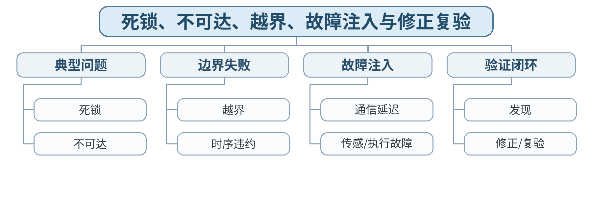

### 教学目标

**知识目标：**
- （1）理解死锁、不可达、越界和故障注入。
**能力目标：**
- （1）能够开展基本故障注入、修正和复验。
**价值目标：**
- （1）形成持续改进、可恢复和质量闭环意识。

### 课程思政

通过故障传播和修正复验强化对人员、设备安全和设计质量负责的意识。

### 专创融合 / 双创融合

将故障注入和回归复验迁移到智能装备软件测试和数字孪生验证流程。

### 教学重难点

教学重点：死锁、不可达、越界、故障注入及修正复验。
教学难点：区分“模型中永远到不了的状态”和“系统卡死无后继”的不同问题，并设计修正后复验。

### 教学方法

讲授法、问题引导法、架构/状态建模法、方程分析法、案例研讨法、教师演示法、同伴互评、反例与证据复盘

### 教学用具

电脑、投影仪、多媒体课件、教材、状态图/时序图模板、需求与验证表、教师提供Python/仿真曲线或案例数据

### 教学设计

课前任务 → 互动导入（15 min）→ 传授新知与课堂训练（70 min）→ 过关检测（10 min）→ 课堂小结（3 min）→ 作业布置（1 min）→ 考勤（1 min）

### 教学过程

#### 课前任务

【教师】发布“死锁、不可达、越界、故障注入与修正复验”预习材料和一个最小建模/判断问题，不提前给出完整答案。
【学生】阅读对应教材内容，记录3个核心术语、至少1个疑问，并准备课堂建模表。

**设计意图：** 通过课前阅读和一个最小建模问题建立先备认知，让学生带着可验证的问题进入课堂。

#### 互动导入与传授新知 / 课堂训练

【互动导入 15 min】
【教师】给出一个既包含不可达“完成”状态又包含某状态无出边的模型，让学生分别标出不可达与死锁。
【学生】先独立判断/建模，再交换依据。

【传授新知与课堂训练 70 min】
【教师】解释死锁、不可达、越界和时序违约的表现。
【学生】完成对应建模/分析并记录判断依据。
【教师】用通信延迟、传感器错误、执行器失效等故障注入检查CPS鲁棒性。
【学生】完成对应建模/分析并记录判断依据。
【教师】学生对本单元模型执行“发现—修正—复验”，保留修改前后模型和反例。
【学生】完成对应建模/分析并记录判断依据。

【课堂产物】CPS故障注入与修正复验报告页。
【学习证据】故障条件、原反例、修正内容、复验结果。
【评价关联】课程作业重点证据；目标1.4、2.4、3.3、3.4。

**设计意图：** 采用“先判断/建模 → 最小讲解 → 模型/轨迹推演 → 独立产出 → 反例/证据复核”的理论课闭环，把抽象CPS原理落实到可检查的图、式、表和验证证据。

### 过关检测

【教师】组织当堂检测：
- 1. 死锁和不可达状态有什么不同？
- 2. 故障注入为什么不能只测试最容易成功的情况？
- 3. 修正后为什么必须复验原反例？
【学生】独立作答；【教师】要求说明模型、轨迹或证据依据。

### 课堂小结

【教师】回到知识脉络图，用“概念—模型—关系—边界—证据”总结“死锁、不可达、越界、故障注入与修正复验”。
【学生】写下本课最重要的一条规则和一个最容易误判的模型边界。

### 作业布置

【教师】布置课后任务：提交课程作业：CPS模型分析、需求与验证证据，必须包含至少1个故障注入与修正复验。
【学生】按课程文件命名规范整理架构图、状态图、方程、轨迹或验证说明。

### 考勤

【教师】利用学校/课程实际使用的平台进行签到。
【学生】按课程要求完成签到。

### 课后教学反思

【课后填写，不预填事实】
- 1. 教学流程：记录100 min各环节实际用时及需调整位置；
- 2. 教学内容：重点记录“区分“模型中永远到不了的状态”和“系统卡死无后继”的不同问题，并设计修正后复验。”的真实掌握证据与常见错误；
- 3. 学生参与：仅依据实际课堂记录填写独立建模、讨论、互审情况，不补写推测；
- 4. 评价证据：检查本课架构图/状态图/方程/轨迹/验证表是否完整，记录缺项；
- 5. 后续改进：依据真实课堂证据确定下一轮调整。

### 本章节参考文献

[1] 张利国, 詹璟原, 邓恒, 石睿. 信息物理系统原理与设计[M]. 北京：机械工业出版社，2025. ISBN 9787111776550
[2] 任志贵, 张明德. 数字孪生技术[M]. 北京：机械工业出版社，2025. ISBN 9787111770077
[3] 李双寿, 高君. 数字孪生在智能制造中的工程实践[M]. 北京：机械工业出版社，2024. ISBN 9787111758341
[4] 黄源, 张婧慧, 唐京瑞. 工业互联网导论[M]. 北京：机械工业出版社，2024. ISBN 9787111748069

## 第14次课 智能制造CPS设计流程：感知、边缘、通信、控制与执行

- **章节/单元**：第六单元 智能制造CPS设计与数字孪生
- **周次**：按实际课表填写
- **课时安排**：2课时（100 min）

### 知识脉络图

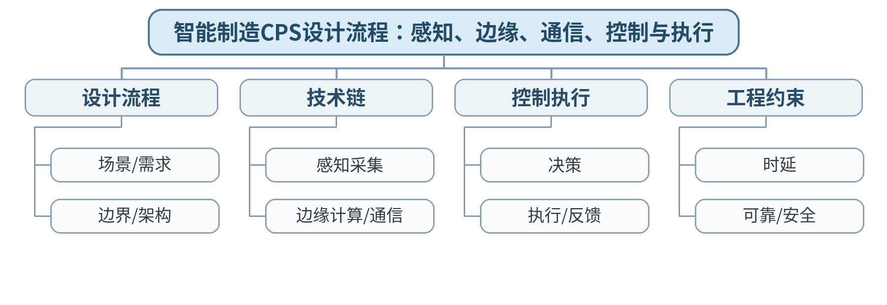

### 教学目标

**知识目标：**
- （1）理解智能制造CPS设计流程和各技术环节角色。
**能力目标：**
- （1）能够形成智能装备/产线CPS概念设计骨架。
**价值目标：**
- （1）形成需求驱动、跨域沟通和工程边界意识。

### 课程思政

结合智能工厂自主决策与人员安全，强调技术方案必须明确人工责任与安全边界。

### 专创融合 / 双创融合

形成期末综合CPS课程设计的最小可评审架构，并训练系统方案表达能力。

### 教学重难点

教学重点：智能制造CPS设计流程与感知—计算—通信—控制—执行闭环。
教学难点：从场景需求推导技术链，而不是先堆砌传感器、平台和算法名词。

### 教学方法

讲授法、问题引导法、架构/状态建模法、方程分析法、案例研讨法、教师演示法、同伴互评、反例与证据复盘

### 教学用具

电脑、投影仪、多媒体课件、教材、状态图/时序图模板、需求与验证表、教师提供Python/仿真曲线或案例数据

### 教学设计

课前任务 → 互动导入（15 min）→ 传授新知与课堂训练（70 min）→ 过关检测（10 min）→ 课堂小结（3 min）→ 作业布置（1 min）→ 考勤（1 min）

### 教学过程

#### 课前任务

【教师】发布“智能制造CPS设计流程：感知、边缘、通信、控制与执行”预习材料和一个最小建模/判断问题，不提前给出完整答案。
【学生】阅读对应教材内容，记录3个核心术语、至少1个疑问，并准备课堂建模表。

**设计意图：** 通过课前阅读和一个最小建模问题建立先备认知，让学生带着可验证的问题进入课堂。

#### 互动导入与传授新知 / 课堂训练

【互动导入 15 min】
【教师】给出一张堆满“AI、云、5G、数字孪生”的方案图，要求学生找出缺失的物理对象、控制动作和验收指标。
【学生】先独立判断/建模，再交换依据。

【传授新知与课堂训练 70 min】
【教师】按场景→需求→边界→架构→模型→接口→验证组织CPS概念设计流程。
【学生】完成对应建模/分析并记录判断依据。
【教师】梳理感知、边缘计算、网络通信、控制执行和反馈的职责与时延/可靠性约束。
【学生】完成对应建模/分析并记录判断依据。
【教师】学生选择智能产线、机器人工作站、AGV、数控或增材制造设备，完成综合方案骨架图。
【学生】完成对应建模/分析并记录判断依据。

【课堂产物】期末综合CPS设计骨架：场景、边界、架构、接口和约束。
【学习证据】方案图、接口表、关键时延/安全约束列表。
【评价关联】期末考核过程准备；目标1.1、2.1、2.4、3.1、3.4。

**设计意图：** 采用“先判断/建模 → 最小讲解 → 模型/轨迹推演 → 独立产出 → 反例/证据复核”的理论课闭环，把抽象CPS原理落实到可检查的图、式、表和验证证据。

### 过关检测

【教师】组织当堂检测：
- 1. CPS设计为什么应从场景和需求开始？
- 2. 边缘计算在CPS中主要解决哪类问题？
- 3. 控制闭环中网络时延为什么是工程约束？
【学生】独立作答；【教师】要求说明模型、轨迹或证据依据。

### 课堂小结

【教师】回到知识脉络图，用“概念—模型—关系—边界—证据”总结“智能制造CPS设计流程：感知、边缘、通信、控制与执行”。
【学生】写下本课最重要的一条规则和一个最容易误判的模型边界。

### 作业布置

【教师】布置课后任务：确定期末综合设计场景，完成需求与系统边界初稿。
【学生】按课程文件命名规范整理架构图、状态图、方程、轨迹或验证说明。

### 考勤

【教师】利用学校/课程实际使用的平台进行签到。
【学生】按课程要求完成签到。

### 课后教学反思

【课后填写，不预填事实】
- 1. 教学流程：记录100 min各环节实际用时及需调整位置；
- 2. 教学内容：重点记录“从场景需求推导技术链，而不是先堆砌传感器、平台和算法名词。”的真实掌握证据与常见错误；
- 3. 学生参与：仅依据实际课堂记录填写独立建模、讨论、互审情况，不补写推测；
- 4. 评价证据：检查本课架构图/状态图/方程/轨迹/验证表是否完整，记录缺项；
- 5. 后续改进：依据真实课堂证据确定下一轮调整。

### 本章节参考文献

[1] 张利国, 詹璟原, 邓恒, 石睿. 信息物理系统原理与设计[M]. 北京：机械工业出版社，2025. ISBN 9787111776550
[2] 任志贵, 张明德. 数字孪生技术[M]. 北京：机械工业出版社，2025. ISBN 9787111770077
[3] 李双寿, 高君. 数字孪生在智能制造中的工程实践[M]. 北京：机械工业出版社，2024. ISBN 9787111758341
[4] 黄源, 张婧慧, 唐京瑞. 工业互联网导论[M]. 北京：机械工业出版社，2024. ISBN 9787111748069

## 第15次课 数字孪生、工业互联网、边缘计算与数据/时序约束

- **章节/单元**：第六单元 智能制造CPS设计与数字孪生
- **周次**：按实际课表填写
- **课时安排**：2课时（100 min）

### 知识脉络图

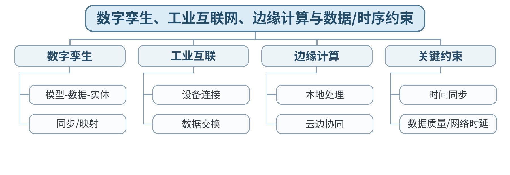

### 教学目标

**知识目标：**
- （1）理解数字孪生、工业互联网和边缘计算在CPS中的角色。
**能力目标：**
- （1）能够分析时延、同步和数据质量等工程约束。
**价值目标：**
- （1）形成技术边界、数据可信和持续学习意识。

### 课程思政

强调数据可信、来源可追溯和模型边界，避免技术名词替代工程事实。

### 专创融合 / 双创融合

训练技术选型和系统集成判断，为智能制造方案咨询、数字孪生应用和工业互联网项目打基础。

### 教学重难点

教学重点：数字孪生、工业互联网、边缘计算在CPS中的角色与约束。
教学难点：明确这些技术是CPS的支撑手段而非CPS本身，并说明数据质量、时延、同步对闭环的影响。

### 教学方法

讲授法、问题引导法、架构/状态建模法、方程分析法、案例研讨法、教师演示法、同伴互评、反例与证据复盘

### 教学用具

电脑、投影仪、多媒体课件、教材、状态图/时序图模板、需求与验证表、教师提供Python/仿真曲线或案例数据

### 教学设计

课前任务 → 互动导入（15 min）→ 传授新知与课堂训练（70 min）→ 过关检测（10 min）→ 课堂小结（3 min）→ 作业布置（1 min）→ 考勤（1 min）

### 教学过程

#### 课前任务

【教师】发布“数字孪生、工业互联网、边缘计算与数据/时序约束”预习材料和一个最小建模/判断问题，不提前给出完整答案。
【学生】阅读对应教材内容，记录3个核心术语、至少1个疑问，并准备课堂建模表。

**设计意图：** 通过课前阅读和一个最小建模问题建立先备认知，让学生带着可验证的问题进入课堂。

#### 互动导入与传授新知 / 课堂训练

【互动导入 15 min】
【教师】比较“实时控制数字孪生”和“每小时更新一次的离线可视化模型”，要求学生判断两者在CPS闭环中的作用是否相同。
【学生】先独立判断/建模，再交换依据。

【传授新知与课堂训练 70 min】
【教师】解释数字孪生中的模型—数据—实体映射与同步。
【学生】完成对应建模/分析并记录判断依据。
【教师】说明工业互联网负责连接/数据交换、边缘计算负责近源计算等角色。
【学生】完成对应建模/分析并记录判断依据。
【教师】学生为自己的综合设计写出“技术组件—作用—输入输出—时延/数据质量约束—不适用边界”表。
【学生】完成对应建模/分析并记录判断依据。

【课堂产物】数字孪生/工业互联网/边缘技术角色与约束表。
【学习证据】角色表、约束表、一个不当技术堆砌案例修正。
【评价关联】期末考核过程准备；目标1.1、2.4、3.4。

**设计意图：** 采用“先判断/建模 → 最小讲解 → 模型/轨迹推演 → 独立产出 → 反例/证据复核”的理论课闭环，把抽象CPS原理落实到可检查的图、式、表和验证证据。

### 过关检测

【教师】组织当堂检测：
- 1. 数字孪生为什么不等于CPS？
- 2. 边缘计算相对云计算的典型优势是什么？
- 3. 时间同步误差可能怎样影响物理控制判断？
【学生】独立作答；【教师】要求说明模型、轨迹或证据依据。

### 课堂小结

【教师】回到知识脉络图，用“概念—模型—关系—边界—证据”总结“数字孪生、工业互联网、边缘计算与数据/时序约束”。
【学生】写下本课最重要的一条规则和一个最容易误判的模型边界。

### 作业布置

【教师】布置课后任务：把数字孪生、工业互联网或边缘计算中至少两项合理融入期末设计，并说明不采用其他技术的理由。
【学生】按课程文件命名规范整理架构图、状态图、方程、轨迹或验证说明。

### 考勤

【教师】利用学校/课程实际使用的平台进行签到。
【学生】按课程要求完成签到。

### 课后教学反思

【课后填写，不预填事实】
- 1. 教学流程：记录100 min各环节实际用时及需调整位置；
- 2. 教学内容：重点记录“明确这些技术是CPS的支撑手段而非CPS本身，并说明数据质量、时延、同步对闭环的影响。”的真实掌握证据与常见错误；
- 3. 学生参与：仅依据实际课堂记录填写独立建模、讨论、互审情况，不补写推测；
- 4. 评价证据：检查本课架构图/状态图/方程/轨迹/验证表是否完整，记录缺项；
- 5. 后续改进：依据真实课堂证据确定下一轮调整。

### 本章节参考文献

[1] 张利国, 詹璟原, 邓恒, 石睿. 信息物理系统原理与设计[M]. 北京：机械工业出版社，2025. ISBN 9787111776550
[2] 任志贵, 张明德. 数字孪生技术[M]. 北京：机械工业出版社，2025. ISBN 9787111770077
[3] 李双寿, 高君. 数字孪生在智能制造中的工程实践[M]. 北京：机械工业出版社，2024. ISBN 9787111758341
[4] 黄源, 张婧慧, 唐京瑞. 工业互联网导论[M]. 北京：机械工业出版社，2024. ISBN 9787111748069

## 第16次课 综合CPS课程设计评审：模型、需求、验证与工程取舍

- **章节/单元**：第六单元 智能制造CPS设计与数字孪生
- **周次**：按实际课表填写
- **课时安排**：2课时（100 min）

### 知识脉络图

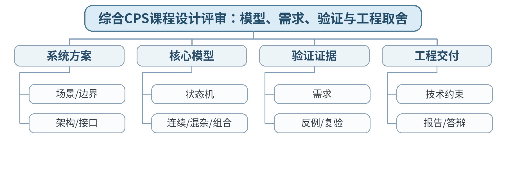

### 教学目标

**知识目标：**
- （1）综合理解CPS架构、离散/连续/混杂模型、需求验证与数字孪生等技术关系。
**能力目标：**
- （1）能够完成智能装备/产线CPS概念设计并通过评审修正。
**价值目标：**
- （1）形成可验证设计、工程表达、持续改进和自主学习意识。

### 课程思政

以综合方案评审强化工程诚信、独立解释、人工复核和对安全结果负责。

### 专创融合 / 双创融合

形成可展示、可评审的智能制造CPS概念设计成果，连接综合实践与毕业设计。

### 教学重难点

教学重点：综合CPS方案的架构、模型、验证和工程取舍。
教学难点：把前五单元产物整合成相互一致、可解释、可验证的系统设计，而不是把图表简单拼接。

### 教学方法

讲授法、问题引导法、架构/状态建模法、方程分析法、案例研讨法、教师演示法、同伴互评、反例与证据复盘

### 教学用具

电脑、投影仪、多媒体课件、教材、状态图/时序图模板、需求与验证表、教师提供Python/仿真曲线或案例数据

### 教学设计

课前任务 → 互动导入（15 min）→ 传授新知与课堂训练（70 min）→ 过关检测（10 min）→ 课堂小结（3 min）→ 作业布置（1 min）→ 考勤（1 min）

### 教学过程

#### 课前任务

【教师】发布“综合CPS课程设计评审：模型、需求、验证与工程取舍”预习材料和一个最小建模/判断问题，不提前给出完整答案。
【学生】阅读对应教材内容，记录3个核心术语、至少1个疑问，并准备课堂建模表。

**设计意图：** 通过课前阅读和一个最小建模问题建立先备认知，让学生带着可验证的问题进入课堂。

#### 互动导入与传授新知 / 课堂训练

【互动导入 15 min】
【教师】给出一份“架构图很好看但状态模型与接口表使用不同信号名”的综合方案，要求学生找出一致性问题。
【学生】先独立判断/建模，再交换依据。

【传授新知与课堂训练 70 min】
【教师】以期末考核评分项检查场景、系统边界、架构与接口是否完整。
【学生】完成对应建模/分析并记录判断依据。
【教师】检查状态模型、连续/混杂模型是否能支撑主要行为，需求是否可验证。
【学生】完成对应建模/分析并记录判断依据。
【教师】学生进行同伴方案评审：找1个一致性问题、1个安全/验证缺口、1个技术边界问题并提出修正。
【学生】完成对应建模/分析并记录判断依据。

【课堂产物】综合CPS课程设计评审包：架构、接口、核心模型、需求/验证表和修正清单。
【学习证据】评审清单、修改前后证据、个人解释记录。
【评价关联】期末考核核心准备；目标1.1—1.4、2.1—2.4、3.1—3.4。

**设计意图：** 采用“先判断/建模 → 最小讲解 → 模型/轨迹推演 → 独立产出 → 反例/证据复核”的理论课闭环，把抽象CPS原理落实到可检查的图、式、表和验证证据。

### 过关检测

【教师】组织当堂检测：
- 1. 综合设计至少应包含哪些核心模型/证据？
- 2. 为什么接口表与状态模型必须使用一致命名？
- 3. 答辩中如何证明设计结论来自模型与验证而非主观描述？
【学生】独立作答；【教师】要求说明模型、轨迹或证据依据。

### 课堂小结

【教师】回到知识脉络图，用“概念—模型—关系—边界—证据”总结“综合CPS课程设计评审：模型、需求、验证与工程取舍”。
【学生】写下本课最重要的一条规则和一个最容易误判的模型边界。

### 作业布置

【教师】布置课后任务：完成期末综合CPS课程设计：综合报告/设计成果 + 答辩与个人核验准备。
【学生】按课程文件命名规范整理架构图、状态图、方程、轨迹或验证说明。

### 考勤

【教师】利用学校/课程实际使用的平台进行签到。
【学生】按课程要求完成签到。

### 课后教学反思

【课后填写，不预填事实】
- 1. 教学流程：记录100 min各环节实际用时及需调整位置；
- 2. 教学内容：重点记录“把前五单元产物整合成相互一致、可解释、可验证的系统设计，而不是把图表简单拼接。”的真实掌握证据与常见错误；
- 3. 学生参与：仅依据实际课堂记录填写独立建模、讨论、互审情况，不补写推测；
- 4. 评价证据：检查本课架构图/状态图/方程/轨迹/验证表是否完整，记录缺项；
- 5. 后续改进：依据真实课堂证据确定下一轮调整。

### 本章节参考文献

[1] 张利国, 詹璟原, 邓恒, 石睿. 信息物理系统原理与设计[M]. 北京：机械工业出版社，2025. ISBN 9787111776550
[2] 任志贵, 张明德. 数字孪生技术[M]. 北京：机械工业出版社，2025. ISBN 9787111770077
[3] 李双寿, 高君. 数字孪生在智能制造中的工程实践[M]. 北京：机械工业出版社，2024. ISBN 9787111758341
[4] 黄源, 张婧慧, 唐京瑞. 工业互联网导论[M]. 北京：机械工业出版社，2024. ISBN 9787111748069
