# 先进装备系统设计与开发（ROS） 教案（24次课）

## 教案封面信息
- **学 院**：机械与动力工程学院
- **专业（教研室）**：智能制造工程
- **课程名称**：先进装备系统设计与开发（ROS）
- **主讲教师**：（按实际填写）
- **职称**：（按实际填写）
- **授课学期**：第7学期
- **授课专业**：智能制造工程

## 课程基本信息
- **课程代码**：25JD31404
- **课程名称（英文）**：Advanced Equipment System Design and Development (ROS)
- **课程类别/性质**：专业类 · 必修
- **学分/学时**：3学分；总学时48；理论0；实验8；上机32；项目式8
- **先修课程**：机器人技术与应用（A）、工程建模与科学计算可视化基础（Python）、程序设计基础（C&C++）Ⅱ、微机原理及接口技术
- **后续课程**：毕业实习、毕业设计（论文）
- **教材**：侯伟，靳紫轩. ROS 2机器人操作系统与Gazebo机器人仿真（微课视频版）[M]. 北京：清华大学出版社，2025. ISBN 9787302702535
- **考核**：考查；总评成绩 = 平时表现×15% + 实验与上机×45% + 综合项目×30% + 个人核验与答辩×10%

### 课程简介
课程基本定位：本课程是智能制造工程专业的专业必修课，是《机器人技术与应用（A）》之后的机器人系统工程开发课程。课程不重复空间数学、机械臂运动学和动力学推导，而以ROS 2为分布式机器人软件中间件，把机器人模型、传感器、控制器、规划算法和上层任务组织为可运行、可观察、可测试、可维护的先进装备系统。
核心学习结果：学生能够在Ubuntu 24.04 LTS与ROS 2 Jazzy Jalisco环境中创建、编译和管理工作空间及功能包；使用rclpy开发节点并合理选择话题、服务、动作、参数和自定义接口；配置QoS、Launch和生命周期；建立TF2坐标树与URDF/Xacro模型并用RViz验证；在Gazebo Harmonic中通过ros_gz_bridge和ros2_control形成感知—控制闭环；使用SLAM Toolbox/Nav2完成建图与导航，使用MoveIt 2完成机械臂规划与操作；通过rosbag2、日志、诊断、测试和故障注入完成系统验证与工程交付。
学情分析：学生已修读机器人技术、Python、C/C++和微机接口相关课程，具备算法、编程和机器人基础。本课程按“系统集成与工程交付”组织，重点补足分布式接口、坐标/时间一致性、仿真控制、系统诊断、故障恢复和可复现工程能力。
主要教学方法：任务定义—接口设计—分包开发—联合仿真—故障注入—系统验收。课堂以Ubuntu 24.04 LTS、ROS 2 Jazzy、Gazebo Harmonic、VS Code、Git和课程锁定工作空间为基线；真实装备部署必须先通过仿真、安全限制、急停和人工确认。
考核说明：总评成绩 = 平时表现15% + 实验与上机45% + 综合项目30% + 个人核验与答辩10%。

## 24次课安排

## 第01次课 课程导入、Ubuntu 24.04 / ROS 2 Jazzy环境与工作空间
- **教学类别**：上机；**周次**：第1周；**课时**：2课时（100 min）
- **知识脉络**：课程导入、Ubuntu 24.04 / ROS 2 Jazzy环境与工作空间 → 课程定位与工程边界 / ROS 2分布式计算图 / 工作空间与功能包 / colcon / rosdep / 环境覆盖 / 版本记录与可复现

### 知识脉络图

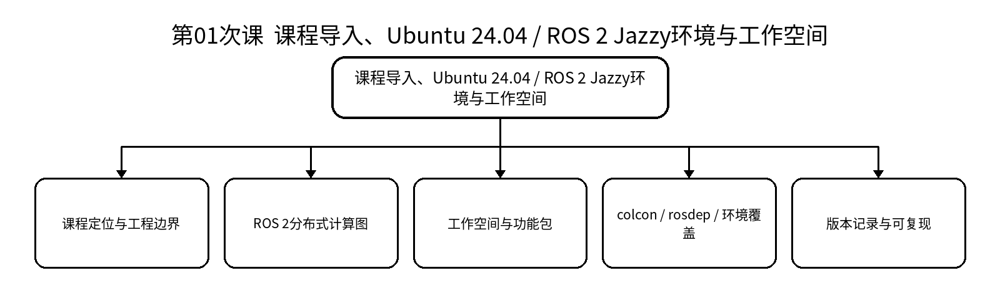

### 教学目标
**知识目标：**
- 理解ROS 2在先进装备系统中的作用以及ROS 1与ROS 2的主要工程差异。
- 理解工作空间、功能包、节点发现、DDS/RMW、Domain ID等基本概念。
**能力目标：**
- 能够检查课程锁定环境并创建、编译、运行一个最小ROS 2工作空间与功能包。
- 能够使用基本CLI观察节点和话题，并保留环境、构建和运行证据。
**价值目标：**
- 形成版本、依赖、运行证据和“先复现后开发”的工程习惯。

### 课程思政
- 结合机器人开源生态与自主可控软件栈，强调尊重许可证、明确依赖来源和持续维护责任。
- 通过“能跑不等于可交付”的案例，强化真实记录、可复现和工程诚信。

### 专创融合
将课程工作空间视为可复用的机器人软件产品雏形，思考环境自动化、依赖锁定和部署脚本的技术服务价值。

### 教学重难点
- **重点**：ROS 2整体架构；工作空间/功能包；colcon构建与环境覆盖。
- **难点**：区分操作系统环境、ROS发行版、工作空间overlay和运行时发现关系。

### 教学过程
**课前任务：**预读本课相关教材/课程资料，检查上一课工程可运行状态，记录1个疑问。

**互动导入（15 min）：**给出一套“在同学电脑能运行、换电脑即失败”的机器人项目，要求学生判断问题可能出在环境、依赖、工作空间还是运行时。

**核心训练（70 min）：**教师进行最小讲解和演示；学生独立完成：创建课程工作空间和最小功能包，完成构建、source、节点运行与节点图观察，并记录环境版本与构建日志。；随后同伴互审/故障注入/证据固化。

**过关检测（10 min）：**ROS 2为什么适合作为先进装备分布式软件中间件？；工作空间overlay与普通文件夹有什么差别？；怎样证明自己的环境可以被他人重建？。

**课堂小结（3 min）：**回到知识脉络图，总结概念—接口—状态—验证—边界。

**作业（1 min）：**整理个人环境清单、工作空间目录树和一次成功构建日志；提交“可复现环境最小说明”。

**考勤（1 min）：**按学校实际平台签到，不在教案中预填出勤事实。

**学习证据：**环境清单 + 工作空间目录树 + 构建日志 + 节点运行截图/终端记录

### 课后教学反思
【课后填写，不预填事实】记录实际时间分配、学生真实错误、证据完整性、思政/专创融入效果及下一轮改进。

### 本章节参考文献
[1] 侯伟，靳紫轩. ROS 2机器人操作系统与Gazebo机器人仿真（微课视频版）[M]. 北京：清华大学出版社，2025. ISBN 9787302702535
[2] 胡春旭，李乔龙. ROS 2智能机器人开发实践[M]. 北京：电子工业出版社，2025. ISBN 9787121491733
[3] 刘相权，张万杰. 机器人操作系统（ROS2）入门与实践[M]. 北京：机械工业出版社，2024. ISBN 9787111758433

## 第02次课 节点、话题与rclpy发布/订阅开发
- **教学类别**：上机；**周次**：第1周；**课时**：2课时（100 min）
- **知识脉络**：节点、话题与rclpy发布/订阅开发 → 节点职责 / 发布—订阅 / 消息类型 / 命名与命名空间 / CLI / rqt_graph观察

### 知识脉络图

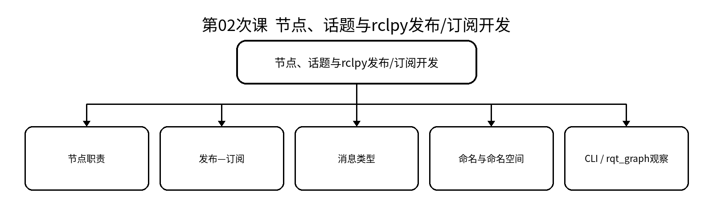

### 教学目标
**知识目标：**
- 掌握节点、话题、消息、发布订阅的通信语义。
- 理解节点职责划分、命名和计算图观察之间的关系。
**能力目标：**
- 能够使用rclpy实现状态发布节点与订阅节点。
- 能够用ros2 CLI与rqt_graph验证消息链、频率和节点关系。
**价值目标：**
- 形成节点职责单一、接口清晰、先定义通信契约再编码的习惯。

### 课程思政
- 以接口命名混乱导致系统误操作为例，强调标准、契约和团队协同。
- 要求数据来源和状态含义可解释，避免“界面有数值就认为系统正常”。

### 专创融合
思考如何把设备状态发布器抽象为可复用组件，服务于巡检机器人、机械臂工作站等不同装备。

### 教学重难点
- **重点**：rclpy节点；Publisher/Subscriber；消息与命名。
- **难点**：从“函数调用思维”转换到“异步分布式消息流思维”。

### 教学过程
**课前任务：**预读本课相关教材/课程资料，检查上一课工程可运行状态，记录1个疑问。

**互动导入（15 min）：**移动巡检装备需要底盘状态节点周期发布速度/电量，上层监控节点订阅显示；若二者互相依赖内部变量，系统将难以维护。

**核心训练（70 min）：**教师进行最小讲解和演示；学生独立完成：实现一个设备状态发布节点和监控订阅节点，要求使用规范命名并用CLI查看topic list/info/echo与rqt_graph。；随后同伴互审/故障注入/证据固化。

**过关检测（10 min）：**发布订阅为什么是松耦合？；节点名、话题名和命名空间分别解决什么问题？；怎样用CLI证明消息确实在流动？。

**课堂小结（3 min）：**回到知识脉络图，总结概念—接口—状态—验证—边界。

**作业（1 min）：**将双节点示例整理为可重复启动的包，补充节点职责表和话题接口表。

**考勤（1 min）：**按学校实际平台签到，不在教案中预填出勤事实。

**学习证据：**源代码 + 节点图 + topic info/echo记录 + 接口表

### 课后教学反思
【课后填写，不预填事实】记录实际时间分配、学生真实错误、证据完整性、思政/专创融入效果及下一轮改进。

### 本章节参考文献
[1] 侯伟，靳紫轩. ROS 2机器人操作系统与Gazebo机器人仿真（微课视频版）[M]. 北京：清华大学出版社，2025. ISBN 9787302702535
[2] 胡春旭，李乔龙. ROS 2智能机器人开发实践[M]. 北京：电子工业出版社，2025. ISBN 9787121491733
[3] 刘相权，张万杰. 机器人操作系统（ROS2）入门与实践[M]. 北京：机械工业出版社，2024. ISBN 9787111758433

## 第03次课 计算图、QoS兼容性与rosbag2通信故障复现
- **教学类别**：实验；**周次**：第2周；**课时**：2课时（100 min）
- **知识脉络**：计算图、QoS兼容性与rosbag2通信故障复现 → 计算图观测 / QoS策略 / 频率/带宽/时延 / rosbag2记录回放 / 故障复现与证据

### 知识脉络图

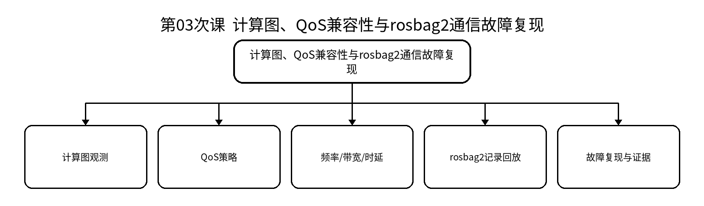

### 教学目标
**知识目标：**
- 理解可靠性、历史深度、持久性等QoS策略及兼容性。
- 理解rosbag2在通信证据留存和故障复现中的作用。
**能力目标：**
- 能够使用CLI、rqt_graph、日志记录话题频率、带宽与运行关系。
- 能够切换QoS策略并复现“不兼容导致收不到消息”的故障。
**价值目标：**
- 形成用日志、录包和测量数据判断通信状态的证据意识。

### 课程思政
- 通过通信丢失与状态误判案例，强调对自动化系统行为负责，避免无证据判断。
- 强调实验数据不得伪造或只保留成功结果，应完整记录失败与修复过程。

### 专创融合
将通信诊断过程抽象为自动巡检脚本或健康检查模块，为机器人运维与远程技术服务奠定基础。

### 教学重难点
- **重点**：QoS兼容性；通信观测；rosbag2记录/回放。
- **难点**：从“没有消息”表象定位到发现、接口、QoS、发布频率等不同原因。

### 教学过程
**课前任务：**预读本课相关教材/课程资料，检查上一课工程可运行状态，记录1个疑问。

**互动导入（15 min）：**传感器节点在运行、话题名也正确，但订阅端没有数据。学生不能直接“重启解决”，必须用计算图和QoS证据定位。

**核心训练（70 min）：**教师进行最小讲解和演示；学生独立完成：完成一组QoS对比实验：改变可靠性/历史深度/持久性，记录正常与异常现象；用rosbag2记录并回放一段数据，形成实验报告。；随后同伴互审/故障注入/证据固化。

**过关检测（10 min）：**QoS不兼容时节点是否一定“报错”？；rosbag2能解决什么问题，不能替代什么？；怎样把一次通信异常复现给他人？。

**课堂小结（3 min）：**回到知识脉络图，总结概念—接口—状态—验证—边界。

**作业（1 min）：**完成实验一报告：配置—现象—证据—原因—修复—复测六项齐全。

**考勤（1 min）：**按学校实际平台签到，不在教案中预填出勤事实。

**学习证据：**实验报告 + QoS配置表 + rosbag2文件清单 + 日志/截图

### 课后教学反思
【课后填写，不预填事实】记录实际时间分配、学生真实错误、证据完整性、思政/专创融入效果及下一轮改进。

### 本章节参考文献
[1] 侯伟，靳紫轩. ROS 2机器人操作系统与Gazebo机器人仿真（微课视频版）[M]. 北京：清华大学出版社，2025. ISBN 9787302702535
[2] 胡春旭，李乔龙. ROS 2智能机器人开发实践[M]. 北京：电子工业出版社，2025. ISBN 9787121491733
[3] 刘相权，张万杰. 机器人操作系统（ROS2）入门与实践[M]. 北京：机械工业出版社，2024. ISBN 9787111758433

## 第04次课 服务、动作、参数与自定义接口设计
- **教学类别**：上机；**周次**：第2周；**课时**：2课时（100 min）
- **知识脉络**：服务、动作、参数与自定义接口设计 → 服务 Request/Response / 动作 Goal/Feedback/Result / 参数配置 / 自定义msg/srv/action / 超时/取消/异常

### 知识脉络图

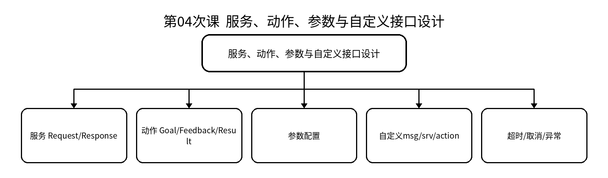

### 教学目标
**知识目标：**
- 掌握服务、动作、参数、自定义接口的通信语义及适用场景。
- 理解短时请求、长时任务反馈和运行配置之间的差别。
**能力目标：**
- 能够用rclpy实现配置服务与长时任务动作。
- 能够设计自定义接口并处理超时、取消、非法请求与节点退出。
**价值目标：**
- 形成按任务语义选择接口而非“所有数据都用topic”的设计意识。

### 课程思政
- 通过接口单位、边界不清引发设备误动作案例，强调工程责任和规范表达。
- 要求学生对取消、超时和异常路径同样负责，不只验证“正常路径”。

### 专创融合
把动作接口看作可组合任务能力，为后续导航、机械臂操作和多装备协同建立统一任务接口。

### 教学重难点
- **重点**：Service/Action/Parameter；自定义接口；异常处理。
- **难点**：接口选择边界以及动作取消、反馈、结果状态的一致性。

### 教学过程
**课前任务：**预读本课相关教材/课程资料，检查上一课工程可运行状态，记录1个疑问。

**互动导入（15 min）：**“设置巡检速度”与“执行5分钟巡检任务”如果都用服务实现，会出现阻塞、无反馈、无法取消等问题。

**核心训练（70 min）：**教师进行最小讲解和演示；学生独立完成：设计一组设备配置服务和长时任务动作；定义输入/反馈/结果字段，加入非法参数与取消测试。；随后同伴互审/故障注入/证据固化。

**过关检测（10 min）：**什么时候用服务而不是话题？；为什么长任务适合Action？；参数与服务的边界在哪里？。

**课堂小结（3 min）：**回到知识脉络图，总结概念—接口—状态—验证—边界。

**作业（1 min）：**提交接口定义表，说明每个字段、单位、取值边界和异常处理。

**考勤（1 min）：**按学校实际平台签到，不在教案中预填出勤事实。

**学习证据：**自定义接口文件 + 服务/动作源代码 + 调用记录 + 异常测试表

### 课后教学反思
【课后填写，不预填事实】记录实际时间分配、学生真实错误、证据完整性、思政/专创融入效果及下一轮改进。

### 本章节参考文献
[1] 侯伟，靳紫轩. ROS 2机器人操作系统与Gazebo机器人仿真（微课视频版）[M]. 北京：清华大学出版社，2025. ISBN 9787302702535
[2] 胡春旭，李乔龙. ROS 2智能机器人开发实践[M]. 北京：电子工业出版社，2025. ISBN 9787121491733
[3] 刘相权，张万杰. 机器人操作系统（ROS2）入门与实践[M]. 北京：机械工业出版社，2024. ISBN 9787111758433

## 第05次课 Launch、命名空间、生命周期、日志与自动测试
- **教学类别**：上机；**周次**：第3周；**课时**：2课时（100 min）
- **知识脉络**：Launch、命名空间、生命周期、日志与自动测试 → Launch编排 / 参数/重映射/命名空间 / 生命周期状态 / 日志与rosbag2 / 测试与回归

### 知识脉络图

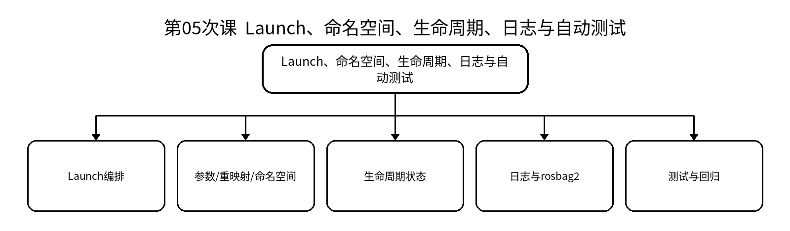

### 教学目标
**知识目标：**
- 掌握Launch、参数文件、命名空间、重映射和生命周期节点的工程作用。
- 理解日志、rosbag2、诊断与自动化测试构成“可交付系统”的证据链。
**能力目标：**
- 能够把多节点系统组织为一键启动、可配置流程。
- 能够完成激活/停用、日志观察、录包和最小回归测试。
**价值目标：**
- 形成“能运行—可配置—可观察—可测试—可恢复”的工程交付意识。

### 课程思政
- 通过启动顺序失控和无人确认自动激活案例，强调自动化系统的权限边界和人工确认。
- 要求配置变更留痕，形成版本管理和可追溯意识。

### 专创融合
将多节点启动与健康检查封装为部署模板，为不同机器人应用快速复制和维护。

### 教学重难点
- **重点**：Launch编排；生命周期；日志与测试。
- **难点**：理解启动顺序、依赖等待、节点状态与故障恢复之间的关系。

### 教学过程
**课前任务：**预读本课相关教材/课程资料，检查上一课工程可运行状态，记录1个疑问。

**互动导入（15 min）：**多节点系统需要手工开五个终端、顺序错误就失败。要求学生把临时演示改造成可复现启动流程。

**核心训练（70 min）：**教师进行最小讲解和演示；学生独立完成：将前四次课功能包整合为Launch启动；加入参数文件、命名空间、重映射、生命周期切换和最小测试。；随后同伴互审/故障注入/证据固化。

**过关检测（10 min）：**为什么Launch不仅是“少开几个终端”？；生命周期节点对系统安全有什么价值？；什么样的测试才算回归证据？。

**课堂小结（3 min）：**回到知识脉络图，总结概念—接口—状态—验证—边界。

**作业（1 min）：**提交一键启动说明、参数表、生命周期状态图和一次测试结果。

**考勤（1 min）：**按学校实际平台签到，不在教案中预填出勤事实。

**学习证据：**Launch文件 + 参数yaml + 状态图 + 日志/测试记录

### 课后教学反思
【课后填写，不预填事实】记录实际时间分配、学生真实错误、证据完整性、思政/专创融入效果及下一轮改进。

### 本章节参考文献
[1] 侯伟，靳紫轩. ROS 2机器人操作系统与Gazebo机器人仿真（微课视频版）[M]. 北京：清华大学出版社，2025. ISBN 9787302702535
[2] 胡春旭，李乔龙. ROS 2智能机器人开发实践[M]. 北京：电子工业出版社，2025. ISBN 9787121491733
[3] 刘相权，张万杰. 机器人操作系统（ROS2）入门与实践[M]. 北京：机械工业出版社，2024. ISBN 9787111758433

## 第06次课 TF2坐标树、时间戳与坐标变换
- **教学类别**：上机；**周次**：第3周；**课时**：2课时（100 min）
- **知识脉络**：TF2坐标树、时间戳与坐标变换 → 坐标系语义 / 静态/动态TF / 父子树结构 / 时间戳与缓存 / tf2查询与诊断

### 知识脉络图

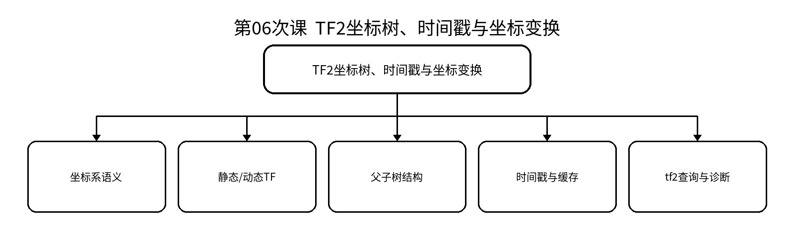

### 教学目标
**知识目标：**
- 掌握TF2坐标树、父子关系、静态/动态变换和时间戳基本原理。
- 理解前序机器人学坐标关系在ROS 2系统中的工程表达方式。
**能力目标：**
- 能够发布/查询基本TF并绘制坐标树。
- 能够识别断链、方向反转、时间不同步等典型问题。
**价值目标：**
- 形成坐标、单位、时间戳必须可追溯的机器人系统数据完整性意识。

### 课程思政
- 通过坐标与单位错误导致机器人误动作案例，强调严谨建模与复测责任。
- 要求所有外部模型参数标注来源，禁止“凭感觉改到能动”。

### 专创融合
思考如何用坐标约定和自动检查脚本降低跨团队集成成本。

### 教学重难点
- **重点**：TF树；时间戳；坐标变换。
- **难点**：区分“几何关系错误”和“时间同步错误”，并理解树结构约束。

### 教学过程
**课前任务：**预读本课相关教材/课程资料，检查上一课工程可运行状态，记录1个疑问。

**互动导入（15 min）：**激光雷达数据在RViz中“漂移”，可能不是SLAM算法错误，而是传感器坐标或时间戳问题。

**核心训练（70 min）：**教师进行最小讲解和演示；学生独立完成：构建base_link—sensor_link—tool_link等坐标关系，发布静态/动态TF，使用tf2工具查询并故意制造断链/反向错误。；随后同伴互审/故障注入/证据固化。

**过关检测（10 min）：**TF为什么组织成树？；静态TF和动态TF如何选择？；坐标数值正确但时间错误会造成什么现象？。

**课堂小结（3 min）：**回到知识脉络图，总结概念—接口—状态—验证—边界。

**作业（1 min）：**提交TF树图、三个变换查询记录和一个故障修复说明。

**考勤（1 min）：**按学校实际平台签到，不在教案中预填出勤事实。

**学习证据：**TF树 + 查询记录 + 错误注入/修复截图 + 坐标约定表

### 课后教学反思
【课后填写，不预填事实】记录实际时间分配、学生真实错误、证据完整性、思政/专创融入效果及下一轮改进。

### 本章节参考文献
[1] 侯伟，靳紫轩. ROS 2机器人操作系统与Gazebo机器人仿真（微课视频版）[M]. 北京：清华大学出版社，2025. ISBN 9787302702535
[2] 胡春旭，李乔龙. ROS 2智能机器人开发实践[M]. 北京：电子工业出版社，2025. ISBN 9787121491733
[3] 刘相权，张万杰. 机器人操作系统（ROS2）入门与实践[M]. 北京：机械工业出版社，2024. ISBN 9787111758433

## 第07次课 机器人模型、关节状态与坐标一致性验证
- **教学类别**：实验；**周次**：第4周；**课时**：2课时（100 min）
- **知识脉络**：机器人模型、关节状态与坐标一致性验证 → URDF/Xacro / joint_states / robot_state_publisher / RViz可视化 / TF/尺度/轴向检查

### 知识脉络图

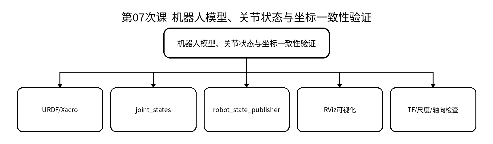

### 教学目标
**知识目标：**
- 理解URDF/Xacro、joint_states、robot_state_publisher与TF之间的关系。
- 理解机器人模型、关节、传感器坐标和可视化一致性要求。
**能力目标：**
- 能够建立简化机器人模型并在RViz中显示。
- 能够检查轴向、尺度、坐标断链和关节状态错误。
**价值目标：**
- 形成模型参数、单位和来源记录完整的工程习惯。

### 课程思政
- 通过模型参数不实导致设备风险的案例，强调数据真实性和安全底线。
- 要求模型修改有版本记录，形成可追溯、可复核的工程作风。

### 专创融合
将Xacro参数化用于不同底盘/机械臂型号快速派生，理解“模型模板化”的工程复用价值。

### 教学重难点
- **重点**：URDF/Xacro；robot_state_publisher；RViz模型验证。
- **难点**：把“模型显示异常”分解为几何、关节、TF、尺度和时间问题。

### 教学过程
**课前任务：**预读本课相关教材/课程资料，检查上一课工程可运行状态，记录1个疑问。

**互动导入（15 min）：**同一机器人模型在仿真中轮子悬空、雷达方向反了。学生需要建立系统化模型验收清单。

**核心训练（70 min）：**教师进行最小讲解和演示；学生独立完成：完成基座—关节—传感器的URDF/Xacro，发布joint_states并在RViz验证；注入一个轴向/尺度/断链错误后定位修复。；随后同伴互审/故障注入/证据固化。

**过关检测（10 min）：**URDF和Xacro分别解决什么问题？；robot_state_publisher依赖哪些信息？；RViz“看起来正常”为什么仍需数值检查？。

**课堂小结（3 min）：**回到知识脉络图，总结概念—接口—状态—验证—边界。

**作业（1 min）：**完成实验二报告，附模型树、TF树、关键参数和故障修复证据。

**考勤（1 min）：**按学校实际平台签到，不在教案中预填出勤事实。

**学习证据：**URDF/Xacro文件 + RViz截图 + TF树 + 实验报告

### 课后教学反思
【课后填写，不预填事实】记录实际时间分配、学生真实错误、证据完整性、思政/专创融入效果及下一轮改进。

### 本章节参考文献
[1] 侯伟，靳紫轩. ROS 2机器人操作系统与Gazebo机器人仿真（微课视频版）[M]. 北京：清华大学出版社，2025. ISBN 9787302702535
[2] 胡春旭，李乔龙. ROS 2智能机器人开发实践[M]. 北京：电子工业出版社，2025. ISBN 9787121491733
[3] 刘相权，张万杰. 机器人操作系统（ROS2）入门与实践[M]. 北京：机械工业出版社，2024. ISBN 9787111758433

## 第08次课 URDF/Xacro工程化建模与RViz状态可视化
- **教学类别**：上机；**周次**：第4周；**课时**：2课时（100 min）
- **知识脉络**：URDF/Xacro工程化建模与RViz状态可视化 → 参数化Xacro / link/joint组织 / 传感器挂载 / 状态发布 / 模型自检

### 知识脉络图

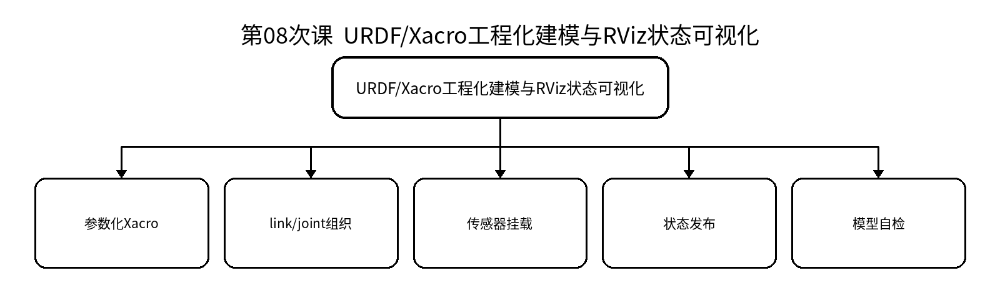

### 教学目标
**知识目标：**
- 掌握参数化Xacro组织机器人模型的方法。
- 理解模型结构、传感器挂载和关节状态对后续仿真/规划的影响。
**能力目标：**
- 能够把单文件模型拆分为可维护的Xacro结构。
- 能够建立模型自检清单并在RViz验证。
**价值目标：**
- 形成模块化、可维护、可复用的机器人数字模型意识。

### 课程思政
- 强调开源模型和mesh资源需注明来源与许可，培养知识产权意识。
- 通过模型版本不一致导致联调失败案例强化团队配置管理。

### 专创融合
探索“基础模型 + 可选工具/传感器”的产品化模型库设计，为先进装备快速配置提供支撑。

### 教学重难点
- **重点**：Xacro参数化与模型模块化。
- **难点**：模型文件拆分后依赖、命名与坐标约定的一致性。

### 教学过程
**课前任务：**预读本课相关教材/课程资料，检查上一课工程可运行状态，记录1个疑问。

**互动导入（15 min）：**项目开始时“一个巨大URDF文件能用”，后续加传感器和夹具后难以维护。

**核心训练（70 min）：**教师进行最小讲解和演示；学生独立完成：将实验二模型重构为参数化Xacro，加入可选传感器/工具模块并建立模型启动文件。；随后同伴互审/故障注入/证据固化。

**过关检测（10 min）：**为什么要参数化而不是复制多个URDF？；新增传感器最先应该确定什么坐标约定？；模型变更后应回归检查哪些内容？。

**课堂小结（3 min）：**回到知识脉络图，总结概念—接口—状态—验证—边界。

**作业（1 min）：**提交模型目录规范、Xacro参数表及一次可选模块切换验证。

**考勤（1 min）：**按学校实际平台签到，不在教案中预填出勤事实。

**学习证据：**Xacro模块 + 参数表 + RViz验证记录 + Git变更说明

### 课后教学反思
【课后填写，不预填事实】记录实际时间分配、学生真实错误、证据完整性、思政/专创融入效果及下一轮改进。

### 本章节参考文献
[1] 侯伟，靳紫轩. ROS 2机器人操作系统与Gazebo机器人仿真（微课视频版）[M]. 北京：清华大学出版社，2025. ISBN 9787302702535
[2] 胡春旭，李乔龙. ROS 2智能机器人开发实践[M]. 北京：电子工业出版社，2025. ISBN 9787121491733
[3] 刘相权，张万杰. 机器人操作系统（ROS2）入门与实践[M]. 北京：机械工业出版社，2024. ISBN 9787111758433

## 第09次课 Gazebo Harmonic、SDF传感器与ros_gz_bridge
- **教学类别**：上机；**周次**：第5周；**课时**：2课时（100 min）
- **知识脉络**：Gazebo Harmonic、SDF传感器与ros_gz_bridge → Gazebo世界/模型 / SDF/URDF关系 / 激光/IMU/相机 / ros_gz_bridge / 仿真数据验证

### 知识脉络图

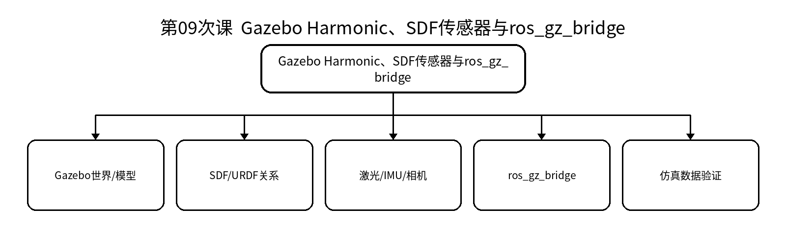

### 教学目标
**知识目标：**
- 掌握Gazebo Harmonic基本组成以及SDF/URDF在仿真中的作用。
- 理解模拟传感器和ros_gz_bridge连接Gazebo与ROS 2的机制。
**能力目标：**
- 能够加载机器人和至少一种传感器仿真。
- 能够验证桥接后的ROS 2话题、TF与传感数据。
**价值目标：**
- 形成仿真数据与真实传感器事实边界意识，不把仿真结果直接等同真实设备。

### 课程思政
- 强调仿真结果必须说明模型假设和参数边界，避免夸大验证结论。
- 真实设备部署前必须先完成仿真和安全检查。

### 专创融合
把仿真环境作为数字样机和远程验证平台，思考其在装备方案评审、售前演示和教学服务中的价值。

### 教学重难点
- **重点**：Gazebo Harmonic；传感器；ros_gz_bridge。
- **难点**：区分仿真内部topic与ROS 2 topic，理解模型、桥接、TF和数据时间的一致性。

### 教学过程
**课前任务：**预读本课相关教材/课程资料，检查上一课工程可运行状态，记录1个疑问。

**互动导入（15 min）：**Gazebo里雷达有数据，但ROS 2端看不到；需要判断是插件、桥接、消息类型还是命名问题。

**核心训练（70 min）：**教师进行最小讲解和演示；学生独立完成：在Gazebo中加载模型和激光/IMU/相机之一，配置桥接并在ROS 2端检查消息、频率和坐标。；随后同伴互审/故障注入/证据固化。

**过关检测（10 min）：**SDF与URDF各自优势是什么？；桥接为什么可能“有topic但无有效数据”？；仿真传感器参数如何留下依据？。

**课堂小结（3 min）：**回到知识脉络图，总结概念—接口—状态—验证—边界。

**作业（1 min）：**提交仿真结构图、bridge配置和一份传感数据检查记录。

**考勤（1 min）：**按学校实际平台签到，不在教案中预填出勤事实。

**学习证据：**Gazebo截图 + bridge配置 + ROS 2话题记录 + 参数说明

### 课后教学反思
【课后填写，不预填事实】记录实际时间分配、学生真实错误、证据完整性、思政/专创融入效果及下一轮改进。

### 本章节参考文献
[1] 侯伟，靳紫轩. ROS 2机器人操作系统与Gazebo机器人仿真（微课视频版）[M]. 北京：清华大学出版社，2025. ISBN 9787302702535
[2] 胡春旭，李乔龙. ROS 2智能机器人开发实践[M]. 北京：电子工业出版社，2025. ISBN 9787121491733
[3] 刘相权，张万杰. 机器人操作系统（ROS2）入门与实践[M]. 北京：机械工业出版社，2024. ISBN 9787111758433

## 第10次课 硬件抽象、控制器管理与闭环异常停止验证
- **教学类别**：实验；**周次**：第5周；**课时**：2课时（100 min）
- **知识脉络**：硬件抽象、控制器管理与闭环异常停止验证 → ros2_control硬件抽象 / controller_manager / 速度/轨迹接口 / 状态反馈 / 异常停止与切换

### 知识脉络图

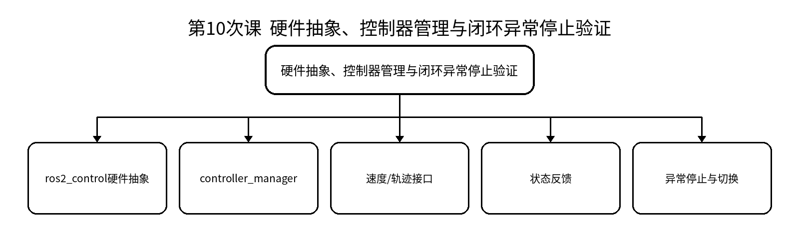

### 教学目标
**知识目标：**
- 理解ros2_control硬件抽象、控制器管理和命令/状态接口。
- 理解仿真控制闭环与真实硬件接口之间的共性和差异。
**能力目标：**
- 能够配置并启动底盘速度或机械臂关节轨迹控制器。
- 能够验证控制器切换、反馈、限制和异常停止。
**价值目标：**
- 树立仿真先行、限速限位、碰撞/急停检查和控制结果负责意识。

### 课程思政
- 以机器人碰撞和控制失效为背景强调“安全优先于任务完成”。
- 不得绕过限位、急停或人工确认去追求演示效果。

### 专创融合
将控制器健康状态与安全停机逻辑抽象为装备运行监测模块，服务于后续真实部署。

### 教学重难点
- **重点**：ros2_control；控制器状态；反馈闭环。
- **难点**：区分“topic有命令”与“控制器已激活并产生正确反馈”。

### 教学过程
**课前任务：**预读本课相关教材/课程资料，检查上一课工程可运行状态，记录1个疑问。

**互动导入（15 min）：**控制指令已发布，但机器人不动或异常持续运动。要求用控制器状态、接口和反馈链定位。

**核心训练（70 min）：**教师进行最小讲解和演示；学生独立完成：完成控制器配置、激活、速度/轨迹执行；注入控制器未激活/接口错配/超限等故障并验证安全停止。；随后同伴互审/故障注入/证据固化。

**过关检测（10 min）：**控制器未激活时为什么不能只看命令topic？；反馈链对安全有什么作用？；真实部署还需补充哪些检查？。

**课堂小结（3 min）：**回到知识脉络图，总结概念—接口—状态—验证—边界。

**作业（1 min）：**完成实验三报告，给出控制链、状态证据、异常场景和安全停止结果。

**考勤（1 min）：**按学校实际平台签到，不在教案中预填出勤事实。

**学习证据：**控制器配置 + 状态/反馈日志 + 故障注入记录 + 实验报告

### 课后教学反思
【课后填写，不预填事实】记录实际时间分配、学生真实错误、证据完整性、思政/专创融入效果及下一轮改进。

### 本章节参考文献
[1] 侯伟，靳紫轩. ROS 2机器人操作系统与Gazebo机器人仿真（微课视频版）[M]. 北京：清华大学出版社，2025. ISBN 9787302702535
[2] 胡春旭，李乔龙. ROS 2智能机器人开发实践[M]. 北京：电子工业出版社，2025. ISBN 9787121491733
[3] 刘相权，张万杰. 机器人操作系统（ROS2）入门与实践[M]. 北京：机械工业出版社，2024. ISBN 9787111758433

## 第11次课 SLAM / Nav2系统架构与传感、TF前置条件
- **教学类别**：上机；**周次**：第6周；**课时**：2课时（100 min）
- **知识脉络**：SLAM / Nav2系统架构与传感、TF前置条件 → 地图与定位 / laser/odom/IMU / map-odom-base_link / Nav2节点与生命周期 / 前置条件检查

### 知识脉络图

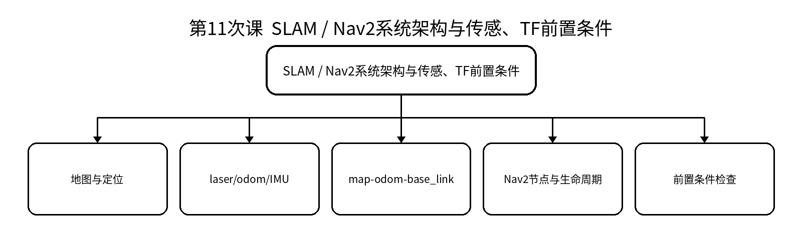

### 教学目标
**知识目标：**
- 理解SLAM Toolbox与Nav2在移动巡检系统中的角色。
- 理解地图、里程计、激光/IMU、TF和生命周期之间的依赖。
**能力目标：**
- 能够检查导航前置数据与TF链。
- 能够绘制SLAM/Nav2系统节点—接口—坐标关系图。
**价值目标：**
- 形成“先检查输入事实和坐标，再调算法参数”的诊断习惯。

### 课程思政
- 通过公共空间巡检场景强调人员安全、地图边界与数据隐私。
- 强调算法输出必须接受传感器事实和场景约束的复核。

### 专创融合
思考把导航前置条件验收表固化成自动诊断工具，降低机器人部署和售后成本。

### 教学重难点
- **重点**：SLAM/Nav2架构；TF与传感前置条件。
- **难点**：分清地图、定位、里程计、传感器和控制器故障边界。

### 教学过程
**课前任务：**预读本课相关教材/课程资料，检查上一课工程可运行状态，记录1个疑问。

**互动导入（15 min）：**Nav2启动失败或机器人原地转圈，不能立即调规划参数，先验证map/odom/base_link与传感数据。

**核心训练（70 min）：**教师进行最小讲解和演示；学生独立完成：准备移动机器人仿真，检查laser、odom、IMU与TF链；绘制系统图并完成Nav2前置条件验收表。；随后同伴互审/故障注入/证据固化。

**过关检测（10 min）：**map、odom、base_link分别代表什么？；为什么导航故障经常源于TF/传感器而非规划器？；生命周期状态如何影响Nav2启动？。

**课堂小结（3 min）：**回到知识脉络图，总结概念—接口—状态—验证—边界。

**作业（1 min）：**提交Nav2前置条件检查表与一份系统架构图。

**考勤（1 min）：**按学校实际平台签到，不在教案中预填出勤事实。

**学习证据：**系统节点图 + TF树 + 传感数据检查表 + 启动日志

### 课后教学反思
【课后填写，不预填事实】记录实际时间分配、学生真实错误、证据完整性、思政/专创融入效果及下一轮改进。

### 本章节参考文献
[1] 侯伟，靳紫轩. ROS 2机器人操作系统与Gazebo机器人仿真（微课视频版）[M]. 北京：清华大学出版社，2025. ISBN 9787302702535
[2] 胡春旭，李乔龙. ROS 2智能机器人开发实践[M]. 北京：电子工业出版社，2025. ISBN 9787121491733
[3] 刘相权，张万杰. 机器人操作系统（ROS2）入门与实践[M]. 北京：机械工业出版社，2024. ISBN 9787111758433

## 第12次课 SLAM Toolbox建图、地图保存与质量检查
- **教学类别**：上机；**周次**：第6周；**课时**：2课时（100 min）
- **知识脉络**：SLAM Toolbox建图、地图保存与质量检查 → 激光/里程计输入 / SLAM Toolbox / 地图构建 / 地图保存 / 闭环/重影质量检查

### 知识脉络图

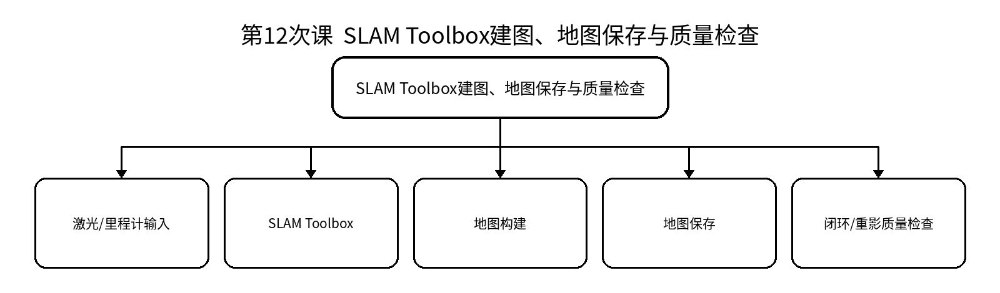

### 教学目标
**知识目标：**
- 掌握SLAM Toolbox建图流程和地图保存基本方法。
- 理解地图质量受TF、里程计、传感器与运动方式影响。
**能力目标：**
- 能够完成一段场景建图并保存地图。
- 能够识别明显重影、漂移、缺失等地图质量问题并说明证据。
**价值目标：**
- 形成地图数据真实性、场景边界和隐私保护意识。

### 课程思政
- 强调地图可能包含敏感环境信息，需按授权范围采集、保存和共享。
- 地图评价必须基于证据，不以“看起来还行”代替质量说明。

### 专创融合
探索地图构建服务在园区巡检、仓储和数字孪生中的工程复用。

### 教学重难点
- **重点**：SLAM Toolbox建图；地图质量检查。
- **难点**：区分地图质量问题与可视化显示问题，并从输入数据链寻找原因。

### 教学过程
**课前任务：**预读本课相关教材/课程资料，检查上一课工程可运行状态，记录1个疑问。

**互动导入（15 min）：**同一走廊地图出现双墙和漂移，要求学生用rosbag2/TF/里程计证据说明原因。

**核心训练（70 min）：**教师进行最小讲解和演示；学生独立完成：在仿真巡检场景完成建图—保存—重载，记录关键参数并对地图质量进行分级评价。；随后同伴互审/故障注入/证据固化。

**过关检测（10 min）：**地图双墙可能有哪些数据链原因？；为什么建图速度和运动方式会影响质量？；地图文件应怎样版本化？。

**课堂小结（3 min）：**回到知识脉络图，总结概念—接口—状态—验证—边界。

**作业（1 min）：**提交地图、参数、路线说明和地图质量评价表。

**考勤（1 min）：**按学校实际平台签到，不在教案中预填出勤事实。

**学习证据：**地图文件 + 参数yaml + rosbag2/截图 + 质量评价记录

### 课后教学反思
【课后填写，不预填事实】记录实际时间分配、学生真实错误、证据完整性、思政/专创融入效果及下一轮改进。

### 本章节参考文献
[1] 侯伟，靳紫轩. ROS 2机器人操作系统与Gazebo机器人仿真（微课视频版）[M]. 北京：清华大学出版社，2025. ISBN 9787302702535
[2] 胡春旭，李乔龙. ROS 2智能机器人开发实践[M]. 北京：电子工业出版社，2025. ISBN 9787121491733
[3] 刘相权，张万杰. 机器人操作系统（ROS2）入门与实践[M]. 北京：机械工业出版社，2024. ISBN 9787111758433

## 第13次课 定位、代价地图、规划器与控制器配置
- **教学类别**：上机；**周次**：第7周；**课时**：2课时（100 min）
- **知识脉络**：定位、代价地图、规划器与控制器配置 → 定位 / 全局/局部代价地图 / 规划器 / 控制器 / 参数影响与验证

### 知识脉络图

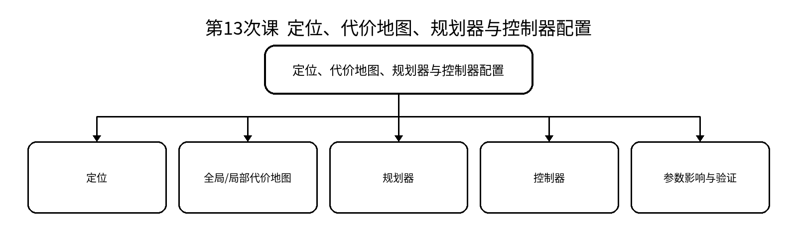

### 教学目标
**知识目标：**
- 掌握定位、代价地图、规划器和控制器在Nav2中的职责。
- 理解障碍膨胀、速度/加速度等参数对可达性与安全性的影响。
**能力目标：**
- 能够完成地图定位和目标点导航。
- 能够比较一组参数调整前后的路径与控制行为并给出依据。
**价值目标：**
- 形成性能、安全与可达性之间权衡意识。

### 课程思政
- 以人员共融场景强调速度、距离和人工接管优先于效率指标。
- 工程参数修改必须记录理由和验证结果。

### 专创融合
将安全参数模板化为不同场景配置档，支持同一机器人快速适配实验室、车间、公共区域。

### 教学重难点
- **重点**：定位；costmap；planner/controller。
- **难点**：参数之间存在耦合，不能通过无边界“调参”掩盖传感/TF问题。

### 教学过程
**课前任务：**预读本课相关教材/课程资料，检查上一课工程可运行状态，记录1个疑问。

**互动导入（15 min）：**机器人路径可规划但贴障碍过近；或局部控制振荡。学生需要判断是costmap、控制器还是TF/定位质量。

**核心训练（70 min）：**教师进行最小讲解和演示；学生独立完成：完成定位与单目标导航，调整一项关键代价地图/控制参数，比较路径、速度和安全距离变化。；随后同伴互审/故障注入/证据固化。

**过关检测（10 min）：**全局和局部代价地图分别解决什么问题？；规划器与控制器如何分工？；参数优化时怎样避免只追求“更快”？。

**课堂小结（3 min）：**回到知识脉络图，总结概念—接口—状态—验证—边界。

**作业（1 min）：**提交参数对比表和一次导航验收记录。

**考勤（1 min）：**按学校实际平台签到，不在教案中预填出勤事实。

**学习证据：**参数yaml + 路径/日志截图 + 导航验收表 + 对比结论

### 课后教学反思
【课后填写，不预填事实】记录实际时间分配、学生真实错误、证据完整性、思政/专创融入效果及下一轮改进。

### 本章节参考文献
[1] 侯伟，靳紫轩. ROS 2机器人操作系统与Gazebo机器人仿真（微课视频版）[M]. 北京：清华大学出版社，2025. ISBN 9787302702535
[2] 胡春旭，李乔龙. ROS 2智能机器人开发实践[M]. 北京：电子工业出版社，2025. ISBN 9787121491733
[3] 刘相权，张万杰. 机器人操作系统（ROS2）入门与实践[M]. 北京：机械工业出版社，2024. ISBN 9787111758433

## 第14次课 行为树、生命周期、航点任务与故障恢复
- **教学类别**：上机；**周次**：第7周；**课时**：2课时（100 min）
- **知识脉络**：行为树、生命周期、航点任务与故障恢复 → 行为树任务逻辑 / 生命周期管理 / 航点巡检 / 失败/取消 / 恢复与人工接管

### 知识脉络图

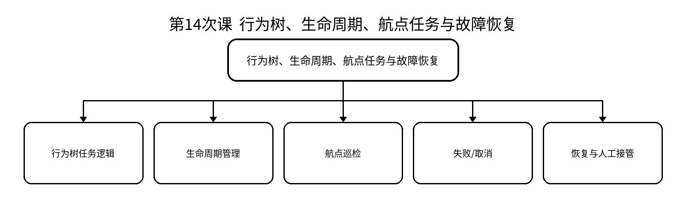

### 教学目标
**知识目标：**
- 理解Nav2行为树、生命周期、动作反馈和恢复行为。
- 理解航点任务、取消和人工接管边界。
**能力目标：**
- 能够执行多航点巡检并观察状态/反馈。
- 能够注入目标不可达或传感中断并验证恢复/取消。
**价值目标：**
- 形成自主系统异常必须可停止、可解释、可人工接管的责任意识。

### 课程思政
- 通过自主装备异常强调人员、设备安全责任和人工最终复核。
- 不把“自动化程度高”作为越权运行的理由。

### 专创融合
把巡检流程封装为可配置任务模板，思考在不同装备/场景中的快速复制。

### 教学重难点
- **重点**：行为树；航点；恢复/取消。
- **难点**：自动恢复的触发条件与人工确认边界。

### 教学过程
**课前任务：**预读本课相关教材/课程资料，检查上一课工程可运行状态，记录1个疑问。

**互动导入（15 min）：**巡检机器人在一处目标不可达时，是无限重试、跳过、回充还是请求人工确认？

**核心训练（70 min）：**教师进行最小讲解和演示；学生独立完成：实现多航点巡检；注入一个目标不可达或局部阻塞场景，记录行为树状态、恢复动作和人工处理策略。；随后同伴互审/故障注入/证据固化。

**过关检测（10 min）：**行为树相比固定顺序脚本的优势是什么？；恢复行为为什么不能无限执行？；如何证明一次取消真正停止了任务？。

**课堂小结（3 min）：**回到知识脉络图，总结概念—接口—状态—验证—边界。

**作业（1 min）：**提交巡检任务状态图、故障场景和恢复/人工接管说明。

**考勤（1 min）：**按学校实际平台签到，不在教案中预填出勤事实。

**学习证据：**航点任务记录 + 行为树/日志 + 故障恢复证据 + 状态图

### 课后教学反思
【课后填写，不预填事实】记录实际时间分配、学生真实错误、证据完整性、思政/专创融入效果及下一轮改进。

### 本章节参考文献
[1] 侯伟，靳紫轩. ROS 2机器人操作系统与Gazebo机器人仿真（微课视频版）[M]. 北京：清华大学出版社，2025. ISBN 9787302702535
[2] 胡春旭，李乔龙. ROS 2智能机器人开发实践[M]. 北京：电子工业出版社，2025. ISBN 9787121491733
[3] 刘相权，张万杰. 机器人操作系统（ROS2）入门与实践[M]. 北京：机械工业出版社，2024. ISBN 9787111758433

## 第15次课 MoveIt 2系统架构、规划组与运动学配置
- **教学类别**：上机；**周次**：第8周；**课时**：2课时（100 min）
- **知识脉络**：MoveIt 2系统架构、规划组与运动学配置 → MoveIt 2架构 / Planning Group / 运动学插件/参数 / 控制器接口 / RViz验证

### 知识脉络图

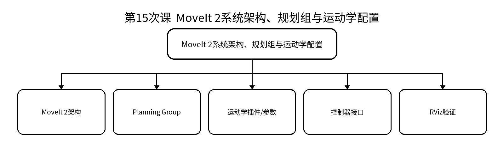

### 教学目标
**知识目标：**
- 理解MoveIt 2规划组、运动学、控制器和规划场景的基本组成。
- 理解MoveIt 2与前序机械臂运动学课程的分工：本课聚焦系统配置与集成。
**能力目标：**
- 能够加载机械臂MoveIt 2配置并在RViz检查规划组与关节状态。
- 能够解释从目标到规划再到控制器执行的基本链路。
**价值目标：**
- 形成“底层算法可复用、系统配置必须可验证”的工程意识。

### 课程思政
- 强调机械臂配置错误可能直接转化为碰撞风险，必须先仿真、后部署。
- 外部MoveIt配置和插件应记录版本与来源。

### 专创融合
理解MoveIt配置包作为机器人型号“软件适配层”的复用价值。

### 教学重难点
- **重点**：MoveIt 2架构；规划组；控制器链。
- **难点**：把运动学理论理解转化为配置、接口和状态一致性检查。

### 教学过程
**课前任务：**预读本课相关教材/课程资料，检查上一课工程可运行状态，记录1个疑问。

**互动导入（15 min）：**机械臂RViz中能动，但真实/仿真控制器不执行；要求学生从规划组、joint state和controller链解释。

**核心训练（70 min）：**教师进行最小讲解和演示；学生独立完成：完成一个机械臂MoveIt 2配置加载，检查规划组、关节、末端执行器和控制器关系。；随后同伴互审/故障注入/证据固化。

**过关检测（10 min）：**MoveIt 2为什么不是“机械臂运动学课再讲一遍”？；规划组定义错误会影响哪些功能？；规划成功但不执行应查哪些链路？。

**课堂小结（3 min）：**回到知识脉络图，总结概念—接口—状态—验证—边界。

**作业（1 min）：**提交MoveIt 2系统结构图与规划组/控制器验收表。

**考勤（1 min）：**按学校实际平台签到，不在教案中预填出勤事实。

**学习证据：**配置文件 + RViz截图 + 系统结构图 + 验收表

### 课后教学反思
【课后填写，不预填事实】记录实际时间分配、学生真实错误、证据完整性、思政/专创融入效果及下一轮改进。

### 本章节参考文献
[1] 侯伟，靳紫轩. ROS 2机器人操作系统与Gazebo机器人仿真（微课视频版）[M]. 北京：清华大学出版社，2025. ISBN 9787302702535
[2] 胡春旭，李乔龙. ROS 2智能机器人开发实践[M]. 北京：电子工业出版社，2025. ISBN 9787121491733
[3] 刘相权，张万杰. 机器人操作系统（ROS2）入门与实践[M]. 北京：机械工业出版社，2024. ISBN 9787111758433

## 第16次课 关节/位姿目标、规划与动作执行
- **教学类别**：上机；**周次**：第8周；**课时**：2课时（100 min）
- **知识脉络**：关节/位姿目标、规划与动作执行 → 关节目标 / 位姿目标 / 运动规划 / 轨迹执行 / 反馈/取消

### 知识脉络图

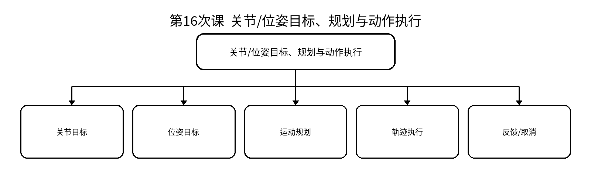

### 教学目标
**知识目标：**
- 掌握关节目标与位姿目标的基本任务表达。
- 理解规划结果、控制器动作执行和反馈状态之间的关系。
**能力目标：**
- 能够在RViz及moveit_py/C++接口中执行关节/位姿目标。
- 能够处理目标不可达、规划失败和任务取消。
**价值目标：**
- 形成目标可达性、速度/空间限制和运行状态复核意识。

### 课程思政
- 强调失败状态不是“必须消灭的报错”，而是安全系统的重要反馈。
- 要求所有自动执行前设置速度、空间和人工确认边界。

### 专创融合
把关节/位姿动作封装成上层任务服务，为柔性工作站快速重构提供接口。

### 教学重难点
- **重点**：目标表达；运动规划；动作执行。
- **难点**：区分“规划失败、执行失败、状态反馈异常”三类问题。

### 教学过程
**课前任务：**预读本课相关教材/课程资料，检查上一课工程可运行状态，记录1个疑问。

**互动导入（15 min）：**目标位姿在几何上不可达，学生必须识别并解释，不允许通过放宽安全边界强行执行。

**核心训练（70 min）：**教师进行最小讲解和演示；学生独立完成：完成关节目标和位姿目标各一次规划/执行，设计一个不可达目标并验证失败状态和安全退出。；随后同伴互审/故障注入/证据固化。

**过关检测（10 min）：**关节目标和位姿目标分别适合什么场景？；规划成功后为什么仍需检查控制器状态？；不可达目标应该如何处理？。

**课堂小结（3 min）：**回到知识脉络图，总结概念—接口—状态—验证—边界。

**作业（1 min）：**提交目标—规划—执行—反馈四阶段记录及一例失败分析。

**考勤（1 min）：**按学校实际平台签到，不在教案中预填出勤事实。

**学习证据：**接口代码/脚本 + 规划轨迹截图 + 动作反馈日志 + 失败分析

### 课后教学反思
【课后填写，不预填事实】记录实际时间分配、学生真实错误、证据完整性、思政/专创融入效果及下一轮改进。

### 本章节参考文献
[1] 侯伟，靳紫轩. ROS 2机器人操作系统与Gazebo机器人仿真（微课视频版）[M]. 北京：清华大学出版社，2025. ISBN 9787302702535
[2] 胡春旭，李乔龙. ROS 2智能机器人开发实践[M]. 北京：电子工业出版社，2025. ISBN 9787121491733
[3] 刘相权，张万杰. 机器人操作系统（ROS2）入门与实践[M]. 北京：机械工业出版社，2024. ISBN 9787111758433

## 第17次课 规划场景、碰撞对象与安全边界
- **教学类别**：上机；**周次**：第9周；**课时**：2课时（100 min）
- **知识脉络**：规划场景、碰撞对象与安全边界 → Planning Scene / 碰撞对象 / 自碰撞检查 / 附着对象 / 安全边界/互锁

### 知识脉络图

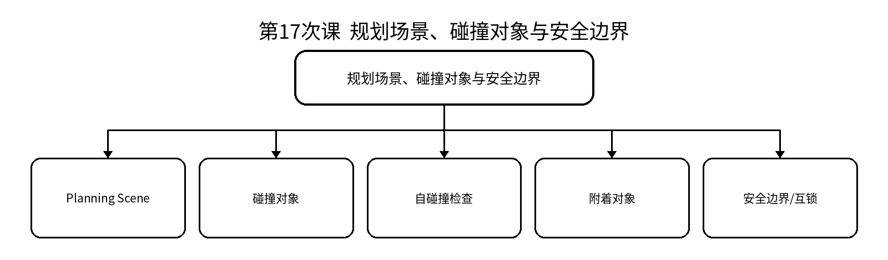

### 教学目标
**知识目标：**
- 掌握规划场景、碰撞对象和碰撞检查的基本概念。
- 理解工作站安全边界与外围设备互锁关系。
**能力目标：**
- 能够添加/更新碰撞对象并验证路径变化。
- 能够设计一个碰撞/越界场景并让系统安全拒绝执行。
**价值目标：**
- 树立碰撞验证、工作空间限制和设备互锁优先的安全生产意识。

### 课程思政
- 以夹具、机床、人员协作场景强调安全生产和最小权限。
- 仿真碰撞检查不能替代真实设备急停、限位和人工确认。

### 专创融合
探索工作站场景模板与数字孪生模型的复用，为柔性制造单元快速换型服务。

### 教学重难点
- **重点**：Planning Scene；碰撞检查；互锁。
- **难点**：场景模型必须与实际环境状态一致，避免“虚假安全”。

### 教学过程
**课前任务：**预读本课相关教材/课程资料，检查上一课工程可运行状态，记录1个疑问。

**互动导入（15 min）：**机床门已关闭/工件位置变化，但规划场景未更新，机械臂仍按旧环境规划。

**核心训练（70 min）：**教师进行最小讲解和演示；学生独立完成：建立工作台/机床/障碍物碰撞对象，比较无障碍和有障碍路径；设置一个互锁条件阻止不安全动作。；随后同伴互审/故障注入/证据固化。

**过关检测（10 min）：**规划场景为什么必须动态更新？；附着对象与普通障碍物有何区别？；碰撞检查通过是否等于真实设备一定安全？。

**课堂小结（3 min）：**回到知识脉络图，总结概念—接口—状态—验证—边界。

**作业（1 min）：**提交规划场景图、碰撞对象表和一项互锁规则说明。

**考勤（1 min）：**按学校实际平台签到，不在教案中预填出勤事实。

**学习证据：**场景配置 + 路径对比 + 碰撞/互锁测试记录 + 安全说明

### 课后教学反思
【课后填写，不预填事实】记录实际时间分配、学生真实错误、证据完整性、思政/专创融入效果及下一轮改进。

### 本章节参考文献
[1] 侯伟，靳紫轩. ROS 2机器人操作系统与Gazebo机器人仿真（微课视频版）[M]. 北京：清华大学出版社，2025. ISBN 9787302702535
[2] 胡春旭，李乔龙. ROS 2智能机器人开发实践[M]. 北京：电子工业出版社，2025. ISBN 9787121491733
[3] 刘相权，张万杰. 机器人操作系统（ROS2）入门与实践[M]. 北京：机械工业出版社，2024. ISBN 9787111758433

## 第18次课 moveit_py/C++接口、简化抓放与外围装备集成
- **教学类别**：上机；**周次**：第9周；**课时**：2课时（100 min）
- **知识脉络**：moveit_py/C++接口、简化抓放与外围装备集成 → API任务编排 / 抓取/放置 / 夹具/机床接口 / 动作取消 / 状态一致与恢复

### 知识脉络图

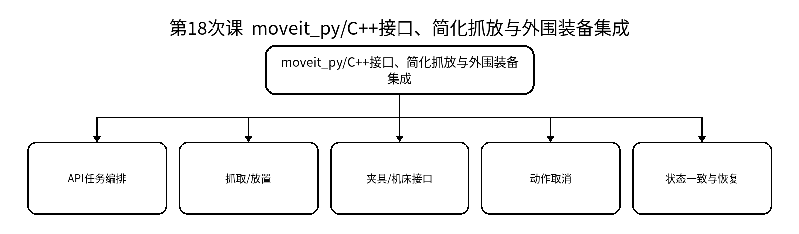

### 教学目标
**知识目标：**
- 理解MoveIt 2 Python/C++接口在上层任务编排中的作用。
- 理解机械臂、夹具/机床、传感器之间的状态与互锁关系。
**能力目标：**
- 能够实现简化抓放或等价操作序列。
- 能够加入任务取消、外围状态检查和异常恢复逻辑。
**价值目标：**
- 形成跨机械、控制、软件和感知的接口协作意识。

### 课程思政
- 通过设备互锁和异常恢复强调安全生产、团队接口责任和人工确认。
- 个人代码、外部库与AI辅助内容必须可解释、可修改、来源可披露。

### 专创融合
将抓放流程拆成可组合技能，为柔性制造、机器人技能库和低代码任务编排提供基础。

### 教学重难点
- **重点**：上层任务API；抓放；外围装备接口。
- **难点**：多设备状态一致、任务原子性和异常恢复。

### 教学过程
**课前任务：**预读本课相关教材/课程资料，检查上一课工程可运行状态，记录1个疑问。

**互动导入（15 min）：**机械臂准备取件，但夹具未释放或机床状态未满足；任务必须拒绝继续而不是“先动再说”。

**核心训练（70 min）：**教师进行最小讲解和演示；学生独立完成：实现简化抓放/上下料序列，加入一个外围状态条件和取消路径；记录状态转换。；随后同伴互审/故障注入/证据固化。

**过关检测（10 min）：**上层任务为何要检查外围设备状态？；任务中途取消后系统应处于什么可恢复状态？；怎样说明个人负责接口的边界？。

**课堂小结（3 min）：**回到知识脉络图，总结概念—接口—状态—验证—边界。

**作业（1 min）：**提交任务状态图、接口表和异常恢复说明。

**考勤（1 min）：**按学校实际平台签到，不在教案中预填出勤事实。

**学习证据：**任务脚本 + 状态图 + 接口表 + 正常/异常运行日志

### 课后教学反思
【课后填写，不预填事实】记录实际时间分配、学生真实错误、证据完整性、思政/专创融入效果及下一轮改进。

### 本章节参考文献
[1] 侯伟，靳紫轩. ROS 2机器人操作系统与Gazebo机器人仿真（微课视频版）[M]. 北京：清华大学出版社，2025. ISBN 9787302702535
[2] 胡春旭，李乔龙. ROS 2智能机器人开发实践[M]. 北京：电子工业出版社，2025. ISBN 9787121491733
[3] 刘相权，张万杰. 机器人操作系统（ROS2）入门与实践[M]. 北京：机械工业出版社，2024. ISBN 9787111758433

## 第19次课 长时动作、故障注入、取消、恢复与人工接管
- **教学类别**：实验；**周次**：第10周；**课时**：2课时（100 min）
- **知识脉络**：长时动作、故障注入、取消、恢复与人工接管 → 长时Action / 反馈/取消 / 故障注入 / 恢复/降级 / 安全停止与人工接管

### 知识脉络图

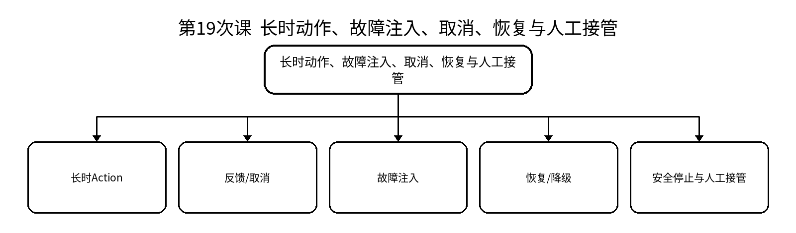

### 教学目标
**知识目标：**
- 理解Nav2/MoveIt 2长时任务的动作反馈、取消与系统级运行关系。
- 理解自动恢复、安全停止和人工接管的边界。
**能力目标：**
- 能够选择导航或机械臂场景注入障碍、目标不可达、TF断链、传感中断或碰撞对象。
- 能够用日志/状态/动作反馈验证取消、恢复或安全停止。
**价值目标：**
- 形成风险前置、故障可复现和人工最终责任意识。

### 课程思政
- 自动化系统不能把风险转移给现场人员，恢复策略必须有权限和安全边界。
- 要求完整保留失败证据，避免只展示成功视频。

### 专创融合
把故障用例沉淀为回归测试集，形成装备软件持续验证资产。

### 教学重难点
- **重点**：故障注入；动作取消；恢复与安全停止。
- **难点**：设计可验证的故障用例，并区分“自动恢复”和“必须人工接管”的边界。

### 教学过程
**课前任务：**预读本课相关教材/课程资料，检查上一课工程可运行状态，记录1个疑问。

**互动导入（15 min）：**系统在长时任务中遭遇TF断链或目标不可达，要求学生证明“停止/恢复”真的发生而非只看界面。

**核心训练（70 min）：**教师进行最小讲解和演示；学生独立完成：从Nav2或MoveIt 2中选择一个场景，执行正常基线；注入两类故障，记录动作反馈、日志、恢复/取消和最终安全状态。；随后同伴互审/故障注入/证据固化。

**过关检测（10 min）：**怎样证明动作取消已经生效？；哪些故障允许自动恢复，哪些应人工确认？；故障注入为什么要先建立正常基线？。

**课堂小结（3 min）：**回到知识脉络图，总结概念—接口—状态—验证—边界。

**作业（1 min）：**完成实验四报告：基线—故障—证据—处置—恢复—安全边界。

**考勤（1 min）：**按学校实际平台签到，不在教案中预填出勤事实。

**学习证据：**实验报告 + 故障用例表 + 动作反馈/日志 + 最终状态证据

### 课后教学反思
【课后填写，不预填事实】记录实际时间分配、学生真实错误、证据完整性、思政/专创融入效果及下一轮改进。

### 本章节参考文献
[1] 侯伟，靳紫轩. ROS 2机器人操作系统与Gazebo机器人仿真（微课视频版）[M]. 北京：清华大学出版社，2025. ISBN 9787302702535
[2] 胡春旭，李乔龙. ROS 2智能机器人开发实践[M]. 北京：电子工业出版社，2025. ISBN 9787121491733
[3] 刘相权，张万杰. 机器人操作系统（ROS2）入门与实践[M]. 北京：机械工业出版社，2024. ISBN 9787111758433

## 第20次课 移动操作/多子系统任务编排、诊断与可复现交付
- **教学类别**：上机；**周次**：第10周；**课时**：2课时（100 min）
- **知识脉络**：移动操作/多子系统任务编排、诊断与可复现交付 → 多包系统集成 / 导航/操作任务编排 / 日志/rosbag2诊断 / 版本锁定 / 启动/测试/维护说明

### 知识脉络图

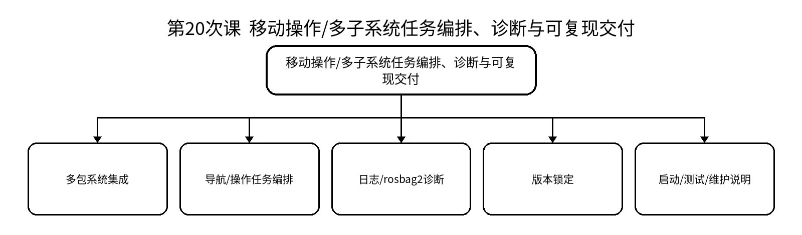

### 教学目标
**知识目标：**
- 综合理解ROS 2通信、TF、模型、仿真、Nav2/MoveIt 2在系统集成中的依赖。
- 理解可观察性、测试、版本和维护说明是工程交付的一部分。
**能力目标：**
- 能够将导航或机械臂子系统与上层任务节点集成为一键启动系统。
- 能够使用日志、rosbag2和测试定位一个跨包故障，并形成修复证据。
**价值目标：**
- 形成跨专业沟通、工程文档、版本管理和持续学习意识。

### 课程思政
- 强调团队接口变更应通知并回归，不把集成失败归咎于他人。
- 技术升级需评估兼容性、许可和安全影响。

### 专创融合
把课程形成的通信、模型、导航/操作模块沉淀为可复用先进装备软件积木。

### 教学重难点
- **重点**：系统集成；诊断；可复现交付。
- **难点**：跨包故障定位与版本/配置一致性。

### 教学过程
**课前任务：**预读本课相关教材/课程资料，检查上一课工程可运行状态，记录1个疑问。

**互动导入（15 min）：**单个功能包都能运行，但联合启动后出现TF、命名、参数或生命周期冲突。

**核心训练（70 min）：**教师进行最小讲解和演示；学生独立完成：完成一次小型多包集成：上层任务节点 + Nav2或MoveIt 2 + 数据记录/诊断；建立启动、参数、测试和维护说明。；随后同伴互审/故障注入/证据固化。

**过关检测（10 min）：**为什么“每个包单测通过”仍可能集成失败？；跨包故障应如何逐层缩小范围？；工程交付至少应包含哪些可复现材料？。

**课堂小结（3 min）：**回到知识脉络图，总结概念—接口—状态—验证—边界。

**作业（1 min）：**整理综合项目前的个人工程基线：环境、包清单、接口、TF、测试和已知问题。

**考勤（1 min）：**按学校实际平台签到，不在教案中预填出勤事实。

**学习证据：**一键启动包 + 集成日志 + 故障修复记录 + 交付清单

### 课后教学反思
【课后填写，不预填事实】记录实际时间分配、学生真实错误、证据完整性、思政/专创融入效果及下一轮改进。

### 本章节参考文献
[1] 侯伟，靳紫轩. ROS 2机器人操作系统与Gazebo机器人仿真（微课视频版）[M]. 北京：清华大学出版社，2025. ISBN 9787302702535
[2] 胡春旭，李乔龙. ROS 2智能机器人开发实践[M]. 北京：电子工业出版社，2025. ISBN 9787121491733
[3] 刘相权，张万杰. 机器人操作系统（ROS2）入门与实践[M]. 北京：机械工业出版社，2024. ISBN 9787111758433

## 第21次课 综合项目选题、需求、场景与系统架构设计
- **教学类别**：项目式；**周次**：第11周；**课时**：2课时（100 min）
- **知识脉络**：综合项目选题、需求、场景与系统架构设计 → 场景/需求 / 节点与功能包边界 / 消息/服务/动作 / TF/模型/硬件接口 / 安全/测试/部署

### 知识脉络图

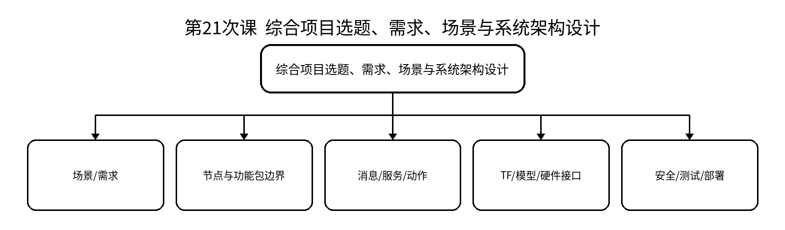

### 教学目标
**知识目标：**
- 综合掌握ROS 2系统架构、接口和工程约束的设计方法。
- 理解移动巡检、机械臂工作站或移动操作系统的系统边界。
**能力目标：**
- 能够完成项目需求、节点图、接口表、TF树和验收指标初稿。
- 能够识别人员/设备安全、网络/权限、数据和开源许可风险。
**价值目标：**
- 形成需求驱动、风险前置、团队分工可追溯的项目意识。

### 课程思政
- 项目必须明确人员/设备安全、权限、开源许可、数据来源和人工确认边界。
- 团队分工与个人贡献必须可追溯。

### 专创融合
把项目视为可交付装备软件原型，要求从用户价值、复用性、维护成本和部署条件审视方案。

### 教学重难点
- **重点**：需求—架构—接口—验收闭环。
- **难点**：把“想做的功能”转化为可验收、可测试、可分工的系统合同。

### 教学过程
**课前任务：**预读本课相关教材/课程资料，检查上一课工程可运行状态，记录1个疑问。

**互动导入（15 min）：**项目团队不能从“做一个很酷的机器人”开始，而要先说明用户/装备对象、任务、边界、接口和验收。

**核心训练（70 min）：**教师进行最小讲解和演示；学生独立完成：从三类方向中选题，完成需求、节点/包边界、通信接口、TF、模型、数据记录、安全互锁和测试计划。；随后同伴互审/故障注入/证据固化。

**过关检测（10 min）：**什么需求才能被验收？；节点边界和团队分工如何对应？；安全边界为什么要在编码前定义？。

**课堂小结（3 min）：**回到知识脉络图，总结概念—接口—状态—验证—边界。

**作业（1 min）：**完善项目方案V1，准备架构评审。

**考勤（1 min）：**按学校实际平台签到，不在教案中预填出勤事实。

**学习证据：**需求说明 + 节点图 + 接口表 + TF树 + 风险/验收清单

### 课后教学反思
【课后填写，不预填事实】记录实际时间分配、学生真实错误、证据完整性、思政/专创融入效果及下一轮改进。

### 本章节参考文献
[1] 侯伟，靳紫轩. ROS 2机器人操作系统与Gazebo机器人仿真（微课视频版）[M]. 北京：清华大学出版社，2025. ISBN 9787302702535
[2] 胡春旭，李乔龙. ROS 2智能机器人开发实践[M]. 北京：电子工业出版社，2025. ISBN 9787121491733
[3] 刘相权，张万杰. 机器人操作系统（ROS2）入门与实践[M]. 北京：机械工业出版社，2024. ISBN 9787111758433

## 第22次课 接口合同、模型/仿真方案、仓库与最小可运行原型评审
- **教学类别**：项目式；**周次**：第11周；**课时**：2课时（100 min）
- **知识脉络**：接口合同、模型/仿真方案、仓库与最小可运行原型评审 → 接口合同冻结 / 模型/TF一致 / Gazebo/硬件抽象 / 仓库/版本/依赖 / 最小可运行原型

### 知识脉络图

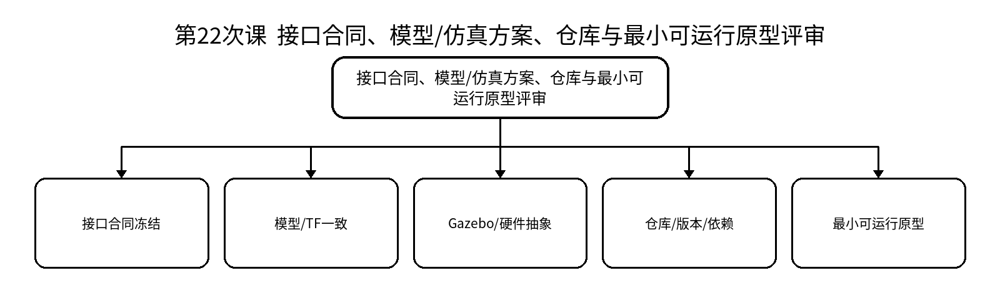

### 教学目标
**知识目标：**
- 理解接口先行、模型一致、版本锁定和最小原型在项目风险控制中的作用。
- 理解原型验收不是功能完成，而是验证核心架构可行。
**能力目标：**
- 能够冻结第一版接口合同并建立仓库结构。
- 能够完成最小可运行原型，验证至少一条端到端数据/任务链。
**价值目标：**
- 形成增量开发、评审、变更留痕和工程诚信意识。

### 课程思政
- 强调真实暴露风险比“为了评审好看”更重要，禁止伪造运行证据。
- 外部代码和AI辅助必须记录来源与个人理解边界。

### 专创融合
训练用最小原型快速验证技术路线，减少装备软件开发的试错成本。

### 教学重难点
- **重点**：接口评审；最小原型；版本与依赖。
- **难点**：控制项目范围，避免接口未定就并行堆代码。

### 教学过程
**课前任务：**预读本课相关教材/课程资料，检查上一课工程可运行状态，记录1个疑问。

**互动导入（15 min）：**团队成员各自开发一周后才发现消息字段、TF命名和包依赖完全不一致。

**核心训练（70 min）：**教师进行最小讲解和演示；学生独立完成：完成接口/TF/模型评审，建立仓库目录、依赖清单和启动骨架；实现一条最小端到端链路并现场验收。；随后同伴互审/故障注入/证据固化。

**过关检测（10 min）：**什么叫“接口冻结”，是否永远不能改？；最小原型要证明什么？；接口变更后如何保证团队一致？。

**课堂小结（3 min）：**回到知识脉络图，总结概念—接口—状态—验证—边界。

**作业（1 min）：**根据评审意见形成项目V2并记录变更。

**考勤（1 min）：**按学校实际平台签到，不在教案中预填出勤事实。

**学习证据：**仓库结构 + 接口合同V1/V2 + 原型运行证据 + 评审问题单

### 课后教学反思
【课后填写，不预填事实】记录实际时间分配、学生真实错误、证据完整性、思政/专创融入效果及下一轮改进。

### 本章节参考文献
[1] 侯伟，靳紫轩. ROS 2机器人操作系统与Gazebo机器人仿真（微课视频版）[M]. 北京：清华大学出版社，2025. ISBN 9787302702535
[2] 胡春旭，李乔龙. ROS 2智能机器人开发实践[M]. 北京：电子工业出版社，2025. ISBN 9787121491733
[3] 刘相权，张万杰. 机器人操作系统（ROS2）入门与实践[M]. 北京：机械工业出版社，2024. ISBN 9787111758433

## 第23次课 系统集成、故障注入、性能/安全测试与修复
- **教学类别**：项目式；**周次**：第12周；**课时**：2课时（100 min）
- **知识脉络**：系统集成、故障注入、性能/安全测试与修复 → 多包集成 / 正常基线 / 故障注入 / 诊断与恢复 / 性能/安全回归

### 知识脉络图

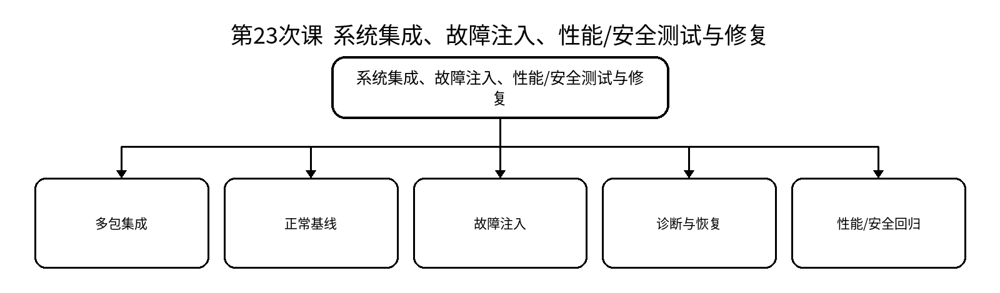

### 教学目标
**知识目标：**
- 理解综合项目从正常功能到故障、安全和可恢复性的验收逻辑。
- 理解通信、TF、传感、控制器、规划和目标异常的跨层影响。
**能力目标：**
- 能够完成多包系统集成并设计至少三类故障用例。
- 能够用日志、rosbag2、测试和状态证据定位修复，并完成回归。
**价值目标：**
- 形成系统级质量、证据和安全责任意识。

### 课程思政
- 强调可交付系统必须对失败负责，不以演示视频替代可复现运行。
- 安全缺陷不得以“来不及修”为由隐瞒，应明确边界和处置。

### 专创融合
把故障用例、测试脚本和维护说明沉淀为团队工程资产，形成持续验证能力。

### 教学重难点
- **重点**：集成测试；故障注入；回归验证。
- **难点**：跨层故障可能相互伪装，需要基线、证据链和分层诊断。

### 教学过程
**课前任务：**预读本课相关教材/课程资料，检查上一课工程可运行状态，记录1个疑问。

**互动导入（15 min）：**项目演示正常并不等于可交付；教师随机注入通信、TF或控制器异常，系统必须能解释和恢复。

**核心训练（70 min）：**教师进行最小讲解和演示；学生独立完成：完成集成与正常基线，执行故障测试；修复后重复基线和关键回归，形成测试报告。；随后同伴互审/故障注入/证据固化。

**过关检测（10 min）：**为什么故障测试必须有正常基线？；修复一个故障后为什么要回归其他功能？；怎样判断恢复策略没有引入新的安全风险？。

**课堂小结（3 min）：**回到知识脉络图，总结概念—接口—状态—验证—边界。

**作业（1 min）：**完善测试报告、已知问题和维护说明，准备最终验收。

**考勤（1 min）：**按学校实际平台签到，不在教案中预填出勤事实。

**学习证据：**集成版本 + 测试用例/报告 + rosbag2/日志 + 修复提交 + 回归结果

### 课后教学反思
【课后填写，不预填事实】记录实际时间分配、学生真实错误、证据完整性、思政/专创融入效果及下一轮改进。

### 本章节参考文献
[1] 侯伟，靳紫轩. ROS 2机器人操作系统与Gazebo机器人仿真（微课视频版）[M]. 北京：清华大学出版社，2025. ISBN 9787302702535
[2] 胡春旭，李乔龙. ROS 2智能机器人开发实践[M]. 北京：电子工业出版社，2025. ISBN 9787121491733
[3] 刘相权，张万杰. 机器人操作系统（ROS2）入门与实践[M]. 北京：机械工业出版社，2024. ISBN 9787111758433

## 第24次课 工程交付、现场修改、个人核验与答辩
- **教学类别**：项目式；**周次**：第12周；**课时**：2课时（100 min）
- **知识脉络**：工程交付、现场修改、个人核验与答辩 → 一键启动/环境锁定 / 接口与测试文档 / 现场修改 / 个人贡献核验 / 局限/升级/维护

### 知识脉络图

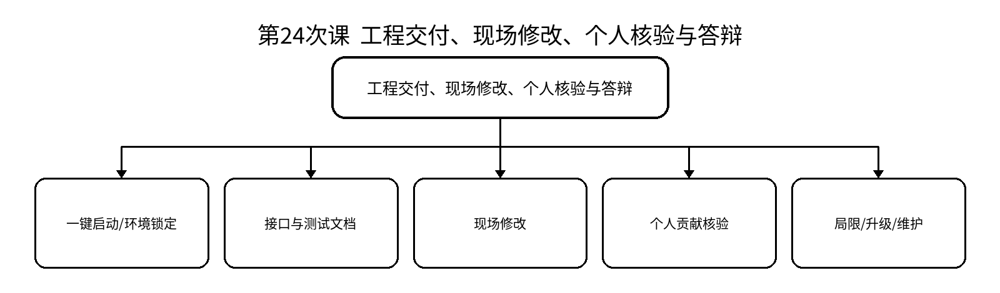

### 教学目标
**知识目标：**
- 理解工程交付需要代码、模型、配置、测试、文档、版本和维护边界共同组成。
- 理解个人核验用于确认学生能够独立解释、修改和验证本人负责模块。
**能力目标：**
- 能够在限定时间完成指定节点/参数/接口/TF/Launch修改并验证。
- 能够用提交、代码、模型、日志和文档说明个人贡献与系统局限。
**价值目标：**
- 形成负责任创新、持续学习、开源合规和对自动化结果保持人工复核的职业意识。

### 课程思政
- 坚持真实可复现、个人贡献清楚、外部代码与AI辅助披露一致。
- 明确自动化装备运行结果仍需人工复核，技术能力必须与安全、法治和职业责任相匹配。

### 专创融合
从课程原型总结可复用模块、潜在应用场景和后续迭代路线，形成面向毕业设计或创新项目的技术基座。

### 教学重难点
- **重点**：工程验收；现场修改；个人答辩。
- **难点**：在不依赖预演脚本的情况下独立定位、修改和验证。

### 教学过程
**课前任务：**预读本课相关教材/课程资料，检查上一课工程可运行状态，记录1个疑问。

**互动导入（15 min）：**最终验收不只播放录屏。教师现场改变一个参数/需求或注入故障，学生必须解释系统、完成修改并给出验证证据。

**核心训练（70 min）：**教师进行最小讲解和演示；学生独立完成：完成项目演示与文档验收；个人进行接口/TF/参数/Launch或故障修改；说明安全边界、版本依赖、外部代码来源和个人贡献。；随后同伴互审/故障注入/证据固化。

**过关检测（10 min）：**交付包怎样证明可复现？；现场修改后必须提供什么验证？；如何说明系统局限而不把它包装成“特色”？。

**课堂小结（3 min）：**回到知识脉络图，总结概念—接口—状态—验证—边界。

**作业（1 min）：**课程结束后仅整理归档材料；不在教案中预填任何最终成绩、签字、项目结果或学生表现事实。

**考勤（1 min）：**按学校实际平台签到，不在教案中预填出勤事实。

**学习证据：**最终交付包 + 现场修改记录 + 个人答辩记录框架 + 版本/依赖/维护说明

### 课后教学反思
【课后填写，不预填事实】记录实际时间分配、学生真实错误、证据完整性、思政/专创融入效果及下一轮改进。

### 本章节参考文献
[1] 侯伟，靳紫轩. ROS 2机器人操作系统与Gazebo机器人仿真（微课视频版）[M]. 北京：清华大学出版社，2025. ISBN 9787302702535
[2] 胡春旭，李乔龙. ROS 2智能机器人开发实践[M]. 北京：电子工业出版社，2025. ISBN 9787121491733
[3] 刘相权，张万杰. 机器人操作系统（ROS2）入门与实践[M]. 北京：机械工业出版社，2024. ISBN 9787111758433