# 编制信息

## 当前任务与边界

- 用户需要的成果：依据 GitHub 现行课程大纲与 lesson-plan-compiler Skill 编写《工业机器人技术》完整课程教案，并形成 canonical Markdown、知识脉络图、学校格式 Word 与完整交付包。
- 当前输入：GitHub 现行《工业机器人技术》课程教学大纲、lesson-plan-compiler Skill 及其数据/语言/Markdown审查规则。
- 本次停止点：已完成 canonical Markdown 内容校验并编译学校格式 Word；主讲教师、职称和具体校历周次未由用户提供，Word中不虚构，按学校惯例保留“按实际填写/按实际课表填写”。

## 来源清单

| source_id | 材料或 Skill | 证据角色 | 版本或日期 | 定位 |
|---|---|---|---|---|
| S1 | 25JD32409-工业机器人技术-课程教学大纲.md（SHA `afece6c8ea150effb4f1a6fc09c2646d557d02f6`） | official_syllabus | 2026年9月 | 课程事实、目标、教学单元、上机项目、考核与教材 |
| S2 | lesson-plan-compiler/SKILL.md（SHA `23bc5a10e7881e8863ad993c74dabdc9faf24a4d`） | reference_only | 当前 main | 教案工作流与产物路由 |
| S3 | references/data-template.md | reference_only | 当前 main | 字段与来源转化契约 |
| S4 | references/language-style-rules.md | reference_only | 当前 main | 教案语言与七步教学过程规则 |
| S5 | references/markdown-review-rules.md | reference_only | 当前 main | 工作 Markdown 结构与审查规则 |

## 缺项与冲突

| issue_id | 字段或主题 | 当前情况 | 影响 | 下一步 |
|---|---|---|---|---|
| I001 | 主讲教师 | official_syllabus 未提供 | 正式 Word 封面必填 | 用户确认后写入 |
| I002 | 职称 | official_syllabus 未提供 | 正式 Word 封面必填 | 用户确认后写入 |
| I003 | 制定日期、学年 | 未提供本次教案的正式制定年月与学年 | 正式 Word 封面/YAML需确认 | 用户确认后写入 |
| I004 | 具体周次 | 未提供校历和每周排课节次 | Word 中“周次”不能据实落位 | 当前仅保留“第X次课”，待校历映射 |

# 正式教案内容

## 课程基本信息

| 字段 | 内容 | 状态 | source_id |
|---|---|---|---|
| 学院 | 机械与动力工程学院 | official | S1 |
| 专业（教研室） | 智能制造工程 | official | S1 |
| 课程名称 | 工业机器人技术 | official | S1 |
| 课程名称（英文） | Industrial Robot Technology | official | S1 |
| 主讲教师 | — | to_confirm |  |
| 职称 | — | to_confirm |  |
| 授课专业 | 智能制造工程 | official | S1 |
| 授课学期 | 第6学期 | official | S1 |
| 制定日期 | — | to_confirm |  |
| 课程类别 | 专业类 | official | S1 |
| 课程性质 | 选修 | official | S1 |
| 授课语言 | 中文 | official | S1 |
| 学分 | 2 | official | S1 |
| 总学时 | 32 | official | S1 |
| 理论学时 | 16 | official | S1 |
| 实验/上机学时 | 16 | official | S1 |
| 实习学时 | 0 | official | S1 |
| 其他学时 | 0 | official | S1 |
| 教材 | 张小刚、方遒.《工业机器人系统综合设计》[M]. 北京：机械工业出版社，2025. ISBN 9787111776192 | official | S1 |
| 授课学院 | 机械与动力工程学院 | official | S1 |
| 先修课程 | 机器人技术与应用（A）、智能测试技术、PLC技术基础或同等基础 | official | S1 |
| 后续课程 | 先进装备系统设计与开发（ROS）、智能工厂集成技术、毕业设计（论文） | official | S1 |
| 考核类型 | 考查课（√） | official | S1 |
| 考核形式 | 其它（√）：工业机器人工作站综合项目成果＋个人答辩/核验 | derived | S1 |
| 考核方式 | 设计（√）；作品/工程成果（√）；其它（√，个人答辩/核验） | derived | S1 |
| 总评成绩比例 | 最终成绩100%=平时成绩20%＋课程作业20%＋期末考核60%；期末考核为工业机器人工作站综合项目成果＋个人答辩/核验，不设置闭卷笔试或机考。 | official | S1 |

#### 课程简介

**课程基本定位**：本课程是智能制造工程专业的专业选修课。在《机器人技术与应用（A）》已建立机器人运动学、动力学与轨迹基础的前提下，本课程不重复系统推导机器人学公式，而以工业机器人工作站为对象，围绕“安全与规范—坐标与示教—程序与工艺—外围接口—工作站集成—离线仿真—调试维护”组织教学，强调机器人本体、末端执行器、传感器、PLC/CNC/视觉及安全装置之间的工程协同。

**学时组织**：总学时32学时，其中理论16学时、上机16学时。工作稿按16次课×2学时组织：每个大纲单元先安排2次理论课，再安排对应4学时上机项目（拆为2次上机课），形成“四个单元×理论4学时＋上机4学时”的闭环。具体周次待校历确认。

**核心学习结果**：学生能够识别工业机器人系统组成、技术参数、工作空间和主要安全风险；完成工具/工件坐标设置、点位示教、轨迹与速度规划和基础程序编写；根据搬运、上下料、码垛和装配任务设计末端工具、I/O握手、安全互锁和异常恢复逻辑；在离线仿真环境中完成建站、路径规划、碰撞/可达性与节拍分析；依据报警、程序状态和点检结果完成基本调试、备份恢复和维护分析，并形成可复核工程文档。

**主要教学方法**：采用“短讲解—案例拆解—离线建站—程序与接口实现—故障注入—验收复盘”的理实融合方式。上机可使用RobotStudio、RoboDK、Visual Components、PQArt或等价平台，不绑定单一厂商；所有任务通过程序、接口表、时序图、日志、截图和个人解释形成工程证据。

#### 课程知识脉络图

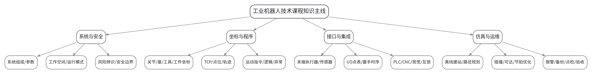

## 教学单元

### lesson-01

| 字段 | 内容 | 状态 | source_id |
|---|---|---|---|
| 章节 | 第一单元 工业机器人系统、安全与工程应用 | derived | S1 |
| 授课题目 | 工业机器人定义、分类、系统组成与典型应用 | derived | S1 |
| 周次 | 第1次课（Word中按实际课表填写） | to_confirm |  |
| 课时安排 | 2课时（100 min）；类型：理论2 | derived | S1 |
| 知识脉络图 | images/lesson-01-knowledge-map.png | derived | S1 |
| 教学方法 | 讲授法、问答法、案例分析法、程序阅读法、分组研讨法 | derived | S1 |
| 教学用具 | 电脑、投影仪、多媒体课件、教材、工业机器人工作站图片/模型、参数样本。 | derived | S1 |
| 教学设计 | 课前任务→互动导入（10 min）→传授新知（70 min）→过关检测（10 min）→课堂小结（5 min）→作业布置（3 min）→考勤（2 min） | derived | S1 |
| 参考文献 | [1] 张小刚、方遒.《工业机器人系统综合设计》[M]. 北京：机械工业出版社，2025.；[2] 陈乾、刘静文、李志卿.《工业机器人技术及应用》[M]. 北京：机械工业出版社，2024. | provided | S1 |

#### 知识脉络图

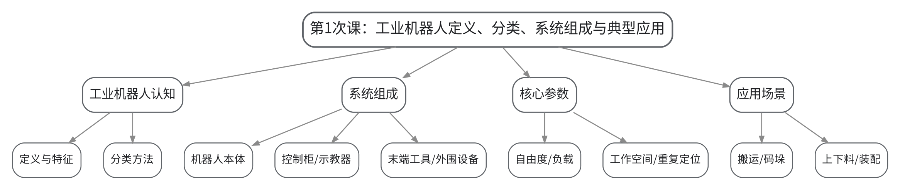

#### 教学目标

**知识目标：**
（1）理解工业机器人的定义、基本特征和常见分类方法。
（2）掌握工业机器人系统中本体、控制柜、示教器、末端工具和外围设备的基本作用。
（3）理解自由度、额定负载、工作空间、重复定位精度等技术参数与应用任务之间的关系。

**能力目标：**
（1）能够从一个工业机器人工作站案例中识别主要组成模块及其功能边界。
（2）能够根据任务负载、空间和工艺要求初步判断机器人选型需要关注的参数。

**价值目标：**
（1）树立系统工程意识，认识工业机器人不是孤立设备，而是由本体、工具、控制与外围系统协同形成的工作站。

#### 课程思政

（1）结合高端制造和柔性生产中的机器人应用，引导学生理解系统集成质量对产线安全与稳定的重要作用；通过“只看本体、不看外围”的失效案例强调工程责任。
（2）结合本次课中的错误配置、状态异常或安全边界讨论，引导学生把规范、证据和责任落实到具体操作与文档中。

#### 专创融合

围绕柔性制造需求，比较固定自动化与机器人工作站的适用边界，鼓励学生从换型时间、占地、节拍和维护性提出改进设想。

#### 教学重难点

**教学重点**：工业机器人系统组成、技术参数及典型应用；从任务需求到系统模块的对应关系。

**教学难点**：学生容易把“机器人本体”当作完整工作站，难点在于将参数、工具和外围设备放入统一系统边界中理解。

#### 教学过程

| 教学步骤 | 主要教学内容 | 设计意图 |
|---|---|---|
| 课前任务 | 【教师】1. 发布本次课预习/上机准备要求，明确对应大纲单元、关键概念或操作边界； 2. 提醒学生检查上一课形成的程序、坐标、接口表或模型，记录不理解的问题。 【学生】1. 完成对应教材/资料预习并整理疑问； 2. 准备本次课需要的文件、图表或操作条件，带着问题进入课堂。 | 通过课前准备建立前后课次衔接，让学生提前识别概念、文件和安全条件，减少课堂中无目标操作。 |
| 互动导入（10 min） | 【教师】1. 复习与本次课直接相关的上一环节关键结论； 2. 展示搬运、机床上下料和装配三个工作站截图/模型，比较“机器人相同但工作站功能不同”的原因，引出系统组成和参数匹配问题。 3. 追问学生本次课需要解决的工程问题。 【学生】参与问答、观察案例/现象，明确本次课任务目标和验收依据。 | 从具体工作站现象或故障切入，把抽象知识转化为待解决的工程问题，形成学习动机。 |
| 传授新知（共70 min） | 1、工业机器人定义与分类（20 min） 【教师】结合制造现场说明工业机器人的定义、通用特征与按机械结构、用途、驱动方式的分类；强调课程关注的是工作站工程应用而非重复机器人学公式推导。 【学生】根据案例判断机器人类型，并说明分类依据。 2、系统组成与功能边界（25 min） 【教师】拆解机器人本体、控制柜、示教器、末端执行器、工装夹具、传感器、安全装置和外围设备，说明各模块输入输出和职责。 【学生】在工作站结构图上标注模块，并完成“模块—功能—故障影响”对应表。 3、技术参数与选型思路（15 min） 【教师】讲解自由度、负载、工作空间、速度、重复定位精度和安装方式，结合任务需求说明参数不能孤立比较。 【学生】对两个候选机器人进行参数比对，给出适配结论。 4、典型应用与课程主线（10 min） 【教师】用搬运、码垛、上下料、装配案例串联“安全—坐标—程序—接口—仿真—维护”课程主线。 【学生】用一张流程图梳理后续学习任务。 【课堂强化】围绕本次课重点对错误配置、边界条件或替代方案进行一次对照分析，要求学生说明“为什么这样做、错了会出现什么现象、如何验证”。 | 按“概念/任务→结构或程序→验证→工程应用”的逻辑推进，并用状态、轨迹、日志或仿真结果支撑理解，避免只记操作步骤。 |
| 过关检测（10 min） | 【教师】布置课堂检测/操作核验： 1. 【选择题】工业机器人工作站中负责与人员直接进行程序编辑和点位示教的设备通常是（ ）。A. 本体 B. 示教器 C. 夹具 D. 安全光栅 2. 【判断题】额定负载越大、工作空间越大，就一定越适合所有工业机器人任务。（ ） 3. 【简答题】选择工业机器人完成机床上下料任务时，至少应关注哪些系统模块和技术参数？ 【学生】独立作答或完成操作，同伴互查关键依据。 【教师】根据作答/运行结果集中点评重难点与安全边界。 | 及时检验学生能否把本次课知识转化为判断、操作和解释，针对易错点形成当堂纠偏。 |
| 课堂小结（5 min） | 【教师】简要总结： 1. 本次课解决的关键问题是：工业机器人系统组成、技术参数及典型应用；从任务需求到系统模块的对应关系。 2. 需要重点掌握的主线是：工业机器人定义、分类、系统组成与典型应用。 3. 最值得带走的方法是：先明确边界/状态，再执行操作，并用可复核证据验证。 4. 需要警惕的易错点是：学生容易把“机器人本体”当作完整工作站，难点在于将参数、工具和外围设备放入统一系统边界中理解。 【学生】按主线回顾并补齐个人笔记。 | 用“关键问题—主线—方法—易错点”收束本课，帮助学生形成可迁移的工作站工程思维。 |
| 作业布置（3 min） | 【教师】布置课后任务： 1. 选择一个搬运、码垛或上下料应用，画出工作站组成框图并标注各模块功能。 2. 查阅一款工业机器人的公开参数表，说明其中5个参数分别会影响哪类工程决策。 【要求】不只提交结果，还要写出关键思路、参数/版本变化和验证依据；上机成果须保留真实日志或截图。 | 通过延伸任务巩固本次课知识，并为下一次课的坐标、程序、接口或综合仿真准备可直接复用的材料。 |
| 考勤（2 min） | 【教师】利用学习通/课堂点名完成签到；上机课同步核对分组与设备/软件使用情况。 | 掌握出勤与上机组织情况，保障教学秩序和安全管理。 |

#### 教学反思

【教师】课后重点从以下方面进行教学反思：
1. 教学流程：检查本次课由“工业机器人定义、分类、系统组成与典型应用”问题情境进入任务后，学生是否能按安全/工程逻辑逐层推进，而不是直接模仿操作。
2. 教学内容：复核“工业机器人系统组成、技术参数及典型应用；从任务需求到系统模块的对应关系。”是否讲清，尤其关注学生是否能解释“为什么这样做、错了会出现什么现象、如何验证”。
3. 学生参与：观察是否存在“会看不会做”“会做不会说”或个别学生只依赖小组成果的情况；上机课重点核查个人对坐标、程序、I/O和验证证据的解释能力。
4. 教学改进：根据过关检测和运行证据决定是否增加错例、轨迹回放、接口时序、故障注入或低速验证演示；不预填真实课堂表现。

### lesson-02

| 字段 | 内容 | 状态 | source_id |
|---|---|---|---|
| 章节 | 第一单元 工业机器人系统、安全与工程应用 | derived | S1 |
| 授课题目 | 工作空间、运行模式、安全区域与风险预控 | derived | S1 |
| 周次 | 第2次课（Word中按实际课表填写） | to_confirm |  |
| 课时安排 | 2课时（100 min）；类型：理论2 | derived | S1 |
| 知识脉络图 | images/lesson-02-knowledge-map.png | derived | S1 |
| 教学方法 | 讲授法、问答法、案例分析法、程序阅读法、分组研讨法 | derived | S1 |
| 教学用具 | 电脑、投影仪、多媒体课件、教材、工作站布局图、安全装置示意图、风险检查表模板。 | derived | S1 |
| 教学设计 | 课前任务→互动导入（10 min）→传授新知（70 min）→过关检测（10 min）→课堂小结（5 min）→作业布置（3 min）→考勤（2 min） | derived | S1 |
| 参考文献 | [1] 张小刚、方遒.《工业机器人系统综合设计》[M]. 北京：机械工业出版社，2025.；[6] 谭志彬.《工业机器人操作与运维实训（初级）》[M]. 北京：电子工业出版社，2024. | provided | S1 |

#### 知识脉络图

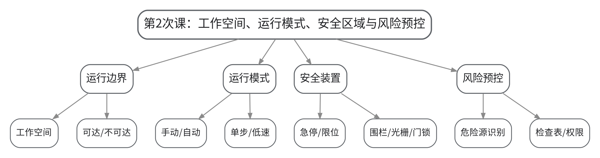

#### 教学目标

**知识目标：**
（1）理解工作空间、奇异/不可达位置与机器人运动边界的基本概念。
（2）掌握手动、自动、单步、低速等运行模式及其适用条件。
（3）熟悉急停、限位、防护围栏、安全门、光栅等安全装置的作用。

**能力目标：**
（1）能够针对工作站布局识别夹伤、碰撞、飞出、误启动等主要风险源。
（2）能够形成自动运行前检查表，并说明不同人员的操作权限边界。

**价值目标：**
（1）形成“安全第一、先验证后自动”的操作习惯，理解任何效率目标都不能替代安全前置条件。

#### 课程思政

（1）通过自动运行、高速运动和误启动案例强调安全标准、操作权限与风险预控；要求学生明确“不越权处置、不屏蔽保护”的职业边界。
（2）结合本次课中的错误配置、状态异常或安全边界讨论，引导学生把规范、证据和责任落实到具体操作与文档中。

#### 专创融合

把风险清单、安全条件和布局图视为工作站设计交付的一部分，训练学生在方案初期同步考虑安全而非事后补救。

#### 教学重难点

**教学重点**：工作空间、运行模式、安全区域、安全装置与自动运行前检查。

**教学难点**：难点在于把安全要求转化为可执行的空间边界、互锁条件和操作步骤，而不是停留在口号。

#### 教学过程

| 教学步骤 | 主要教学内容 | 设计意图 |
|---|---|---|
| 课前任务 | 【教师】1. 发布本次课预习/上机准备要求，明确对应大纲单元、关键概念或操作边界； 2. 提醒学生检查上一课形成的程序、坐标、接口表或模型，记录不理解的问题。 【学生】1. 完成对应教材/资料预习并整理疑问； 2. 准备本次课需要的文件、图表或操作条件，带着问题进入课堂。 | 通过课前准备建立前后课次衔接，让学生提前识别概念、文件和安全条件，减少课堂中无目标操作。 |
| 互动导入（10 min） | 【教师】1. 复习与本次课直接相关的上一环节关键结论； 2. 给出一个“程序仿真可运行但安全门未互锁”的反例，提问：仿真通过是否意味着现场可以自动运行？由此引出运行模式和风险预控。 3. 追问学生本次课需要解决的工程问题。 【学生】参与问答、观察案例/现象，明确本次课任务目标和验收依据。 | 从具体工作站现象或故障切入，把抽象知识转化为待解决的工程问题，形成学习动机。 |
| 传授新知（共70 min） | 1、工作空间与运动风险（20 min） 【教师】结合机器人包络图说明最大工作空间、实际可达区域、干涉区域和危险区域；说明接近奇异位形、极限位时的运动风险。 【学生】在平面布局图上标出人员区、设备区、机器人运动区和潜在干涉区。 2、运行模式与验证层级（20 min） 【教师】区分手动、自动、单步、连续和低速验证；建立“编辑/单步→低速→自动”三级验证逻辑。 【学生】针对新程序首次运行编写验证步骤，并解释每一步的目的。 3、安全装置与互锁（20 min） 【教师】讲解急停、安全门、围栏、光栅、限位与安全回路的功能边界，强调急停不是常规停机按钮。 【学生】完成“风险—安全装置—触发后行为”表。 4、安全检查表与权限（10 min） 【教师】组织学生生成自动运行前检查表，明确何种故障必须停机并由专业人员处理。 【学生】互审检查表，补充遗漏项。 【课堂强化】围绕本次课重点对错误配置、边界条件或替代方案进行一次对照分析，要求学生说明“为什么这样做、错了会出现什么现象、如何验证”。 | 按“概念/任务→结构或程序→验证→工程应用”的逻辑推进，并用状态、轨迹、日志或仿真结果支撑理解，避免只记操作步骤。 |
| 过关检测（10 min） | 【教师】布置课堂检测/操作核验： 1. 【选择题】首次验证新轨迹时，优先采用的运行方式是（ ）。A. 高速自动 B. 低速/单步 C. 关闭安全门锁 D. 屏蔽急停 2. 【判断题】急停按钮适合作为机器人日常正常停机的首选方式。（ ） 3. 【简答题】说明“仿真通过但现场仍不允许直接自动运行”的至少三个原因。 【学生】独立作答或完成操作，同伴互查关键依据。 【教师】根据作答/运行结果集中点评重难点与安全边界。 | 及时检验学生能否把本次课知识转化为判断、操作和解释，针对易错点形成当堂纠偏。 |
| 课堂小结（5 min） | 【教师】简要总结： 1. 本次课解决的关键问题是：工作空间、运行模式、安全区域、安全装置与自动运行前检查。 2. 需要重点掌握的主线是：工作空间、运行模式、安全区域与风险预控。 3. 最值得带走的方法是：先明确边界/状态，再执行操作，并用可复核证据验证。 4. 需要警惕的易错点是：难点在于把安全要求转化为可执行的空间边界、互锁条件和操作步骤，而不是停留在口号。 【学生】按主线回顾并补齐个人笔记。 | 用“关键问题—主线—方法—易错点”收束本课，帮助学生形成可迁移的工作站工程思维。 |
| 作业布置（3 min） | 【教师】布置课后任务： 1. 完成一份“工业机器人工作站自动运行前安全检查表”，至少包含10项。 2. 针对一个机器人上下料布局，标注危险区域并说明两种工程防护措施。 【要求】不只提交结果，还要写出关键思路、参数/版本变化和验证依据；上机成果须保留真实日志或截图。 | 通过延伸任务巩固本次课知识，并为下一次课的坐标、程序、接口或综合仿真准备可直接复用的材料。 |
| 考勤（2 min） | 【教师】利用学习通/课堂点名完成签到；上机课同步核对分组与设备/软件使用情况。 | 掌握出勤与上机组织情况，保障教学秩序和安全管理。 |

#### 教学反思

【教师】课后重点从以下方面进行教学反思：
1. 教学流程：检查本次课由“工作空间、运行模式、安全区域与风险预控”问题情境进入任务后，学生是否能按安全/工程逻辑逐层推进，而不是直接模仿操作。
2. 教学内容：复核“工作空间、运行模式、安全区域、安全装置与自动运行前检查。”是否讲清，尤其关注学生是否能解释“为什么这样做、错了会出现什么现象、如何验证”。
3. 学生参与：观察是否存在“会看不会做”“会做不会说”或个别学生只依赖小组成果的情况；上机课重点核查个人对坐标、程序、I/O和验证证据的解释能力。
4. 教学改进：根据过关检测和运行证据决定是否增加错例、轨迹回放、接口时序、故障注入或低速验证演示；不预填真实课堂表现。

### lesson-03

| 字段 | 内容 | 状态 | source_id |
|---|---|---|---|
| 章节 | 上机一 工作站建模、风险辨识与坐标标定 | derived | S1 |
| 授课题目 | 上机一A：离线工作站建模与风险区域设置 | derived | S1 |
| 周次 | 第3次课（Word中按实际课表填写） | to_confirm |  |
| 课时安排 | 2课时（100 min）；类型：上机2 | derived | S1 |
| 知识脉络图 | images/lesson-03-knowledge-map.png | derived | S1 |
| 教学方法 | 任务驱动法、示范教学法、实操演练法、故障注入法、同伴评审法 | derived | S1 |
| 教学用具 | 机房、工业机器人离线仿真平台（RobotStudio/RoboDK/Visual Components/PQArt或等价平台）、工作站模型库、检查表模板。 | derived | S1 |
| 教学设计 | 课前任务→互动导入（10 min）→传授新知（70 min）→过关检测（10 min）→课堂小结（5 min）→作业布置（3 min）→考勤（2 min） | derived | S1 |
| 参考文献 | [1] 张小刚、方遒.《工业机器人系统综合设计》[M]. 北京：机械工业出版社，2025.；[3] 朱洪雷、代慧.《工业机器人离线编程（ABB）（第2版）》[M]. 北京：高等教育出版社，2024.；[4] 倪寿勇.《工业机器人离线编程与仿真》[M]. 北京：高等教育出版社，2024. | provided | S1 |

#### 知识脉络图

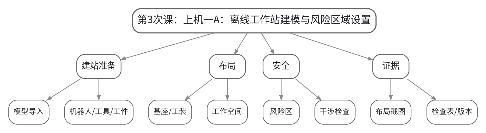

#### 教学目标

**知识目标：**
（1）理解离线工作站中机器人、工具、工件与外围模型的层级关系。
（2）理解模型布局与机器人工作空间、安全区域之间的关系。

**能力目标：**
（1）能够在RobotStudio、RoboDK、Visual Components、PQArt或等价平台建立基本工作站。
（2）能够识别明显的不可达、干涉和人员进入风险，并形成风险清单。

**价值目标：**
（1）形成先建立安全边界、再开展轨迹和程序工作的工程习惯。

#### 课程思政

（1）通过“布局可视上合理但缺少安全边界”的反例强化风险预控，要求所有修改保留版本记录，不以删除证据掩盖问题。
（2）结合本次课中的错误配置、状态异常或安全边界讨论，引导学生把规范、证据和责任落实到具体操作与文档中。

#### 专创融合

围绕工作站占地与可维护性比较两种布局，鼓励学生从节拍、空间利用和换型便利性提出改进方案。

#### 教学重难点

**教学重点**：离线建站、模型布局、工作空间/风险区辨识、基础可达性检查。

**教学难点**：难点是将三维模型的“摆得下”转化为工程上的“可达、无干涉、可维护、可安全进入”。

#### 教学过程

| 教学步骤 | 主要教学内容 | 设计意图 |
|---|---|---|
| 课前任务 | 【教师】1. 发布本次课预习/上机准备要求，明确对应大纲单元、关键概念或操作边界； 2. 提醒学生检查上一课形成的程序、坐标、接口表或模型，记录不理解的问题。 【学生】1. 完成对应教材/资料预习并整理疑问； 2. 准备本次课需要的文件、图表或操作条件，带着问题进入课堂。 | 通过课前准备建立前后课次衔接，让学生提前识别概念、文件和安全条件，减少课堂中无目标操作。 |
| 互动导入（10 min） | 【教师】1. 复习与本次课直接相关的上一环节关键结论； 2. 教师给出一个故意把料台放在机器人极限工作区边缘的初始模型，要求学生不移动机器人程序，仅从布局角度判断潜在问题。 3. 追问学生本次课需要解决的工程问题。 【学生】参与问答、观察案例/现象，明确本次课任务目标和验收依据。 | 从具体工作站现象或故障切入，把抽象知识转化为待解决的工程问题，形成学习动机。 |
| 传授新知（共70 min） | 1、任务说明与安全约束（10 min） 【教师】说明上机任务、文件命名、版本保存和禁止绕过安全检查的要求；发布目标布局和风险检查表。 【学生】确认软件环境、任务边界和提交物。 2、工作站模型建立（25 min） 【教师】示范导入机器人、本体基座、工具、工件/料台和围栏等基础模型；强调坐标原点和单位一致。 【学生】独立完成基本模型导入与层级组织。 3、布局与可达性检查（20 min） 【教师】巡回指导机器人位置、料台距离、工具空间和维护通道设置。 【学生】调整布局并记录至少2次修改原因。 4、风险区域与证据整理（15 min） 【教师】指导设置/标注危险区域，检查是否存在明显干涉和人员侵入风险。 【学生】提交布局截图、风险清单、自动运行前检查表初稿。 【课堂强化】围绕本次课重点对错误配置、边界条件或替代方案进行一次对照分析，要求学生说明“为什么这样做、错了会出现什么现象、如何验证”。 | 按“概念/任务→结构或程序→验证→工程应用”的逻辑推进，并用状态、轨迹、日志或仿真结果支撑理解，避免只记操作步骤。 |
| 过关检测（10 min） | 【教师】布置课堂检测/操作核验： 1. 【选择题】离线工作站建模时，首先需要统一确认的基础参数是（ ）。A. 模型颜色 B. 单位/坐标基准 C. 截图分辨率 D. 报警音量 2. 【判断题】只要模型之间没有静态重叠，就可以认为工作站布局一定安全可行。（ ） 3. 【操作核验】指出自己布局中两个主要风险区，并解释相应控制措施。 【学生】独立作答或完成操作，同伴互查关键依据。 【教师】根据作答/运行结果集中点评重难点与安全边界。 | 及时检验学生能否把本次课知识转化为判断、操作和解释，针对易错点形成当堂纠偏。 |
| 课堂小结（5 min） | 【教师】简要总结： 1. 本次课解决的关键问题是：离线建站、模型布局、工作空间/风险区辨识、基础可达性检查。 2. 需要重点掌握的主线是：上机一A：离线工作站建模与风险区域设置。 3. 最值得带走的方法是：先明确边界/状态，再执行操作，并用可复核证据验证。 4. 需要警惕的易错点是：难点是将三维模型的“摆得下”转化为工程上的“可达、无干涉、可维护、可安全进入”。 【学生】按主线回顾并补齐个人笔记。 | 用“关键问题—主线—方法—易错点”收束本课，帮助学生形成可迁移的工作站工程思维。 |
| 作业布置（3 min） | 【教师】布置课后任务： 1. 整理上机一A工作文件：模型、布局截图、风险清单和版本说明。 2. 为下一次课预先选择3个关键示教点，说明每个点位的任务意义。 【要求】不只提交结果，还要写出关键思路、参数/版本变化和验证依据；上机成果须保留真实日志或截图。 | 通过延伸任务巩固本次课知识，并为下一次课的坐标、程序、接口或综合仿真准备可直接复用的材料。 |
| 考勤（2 min） | 【教师】利用学习通/课堂点名完成签到；上机课同步核对分组与设备/软件使用情况。 | 掌握出勤与上机组织情况，保障教学秩序和安全管理。 |

#### 教学反思

【教师】课后重点从以下方面进行教学反思：
1. 教学流程：检查本次课由“上机一A：离线工作站建模与风险区域设置”问题情境进入任务后，学生是否能按安全/工程逻辑逐层推进，而不是直接模仿操作。
2. 教学内容：复核“离线建站、模型布局、工作空间/风险区辨识、基础可达性检查。”是否讲清，尤其关注学生是否能解释“为什么这样做、错了会出现什么现象、如何验证”。
3. 学生参与：观察是否存在“会看不会做”“会做不会说”或个别学生只依赖小组成果的情况；上机课重点核查个人对坐标、程序、I/O和验证证据的解释能力。
4. 教学改进：根据过关检测和运行证据决定是否增加错例、轨迹回放、接口时序、故障注入或低速验证演示；不预填真实课堂表现。

### lesson-04

| 字段 | 内容 | 状态 | source_id |
|---|---|---|---|
| 章节 | 上机一 工作站建模、风险辨识与坐标标定 | derived | S1 |
| 授课题目 | 上机一B：工具/工件坐标标定与关键点位验证 | derived | S1 |
| 周次 | 第4次课（Word中按实际课表填写） | to_confirm |  |
| 课时安排 | 2课时（100 min）；类型：上机2 | derived | S1 |
| 知识脉络图 | images/lesson-04-knowledge-map.png | derived | S1 |
| 教学方法 | 任务驱动法、示范教学法、实操演练法、故障注入法、同伴评审法 | derived | S1 |
| 教学用具 | 机房、离线仿真平台、工作站模型、坐标记录表、点位表。 | derived | S1 |
| 教学设计 | 课前任务→互动导入（10 min）→传授新知（70 min）→过关检测（10 min）→课堂小结（5 min）→作业布置（3 min）→考勤（2 min） | derived | S1 |
| 参考文献 | [1] 张小刚、方遒.《工业机器人系统综合设计》[M]. 北京：机械工业出版社，2025.；[3] 朱洪雷、代慧.《工业机器人离线编程（ABB）（第2版）》[M]. 北京：高等教育出版社，2024.；[4] 倪寿勇.《工业机器人离线编程与仿真》[M]. 北京：高等教育出版社，2024. | provided | S1 |

#### 知识脉络图

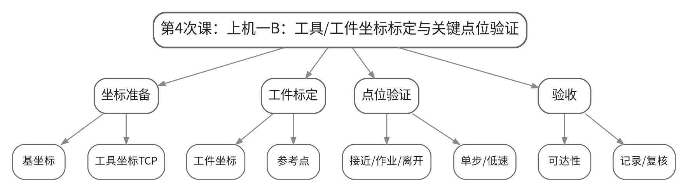

#### 教学目标

**知识目标：**
（1）理解工具坐标、TCP、工件坐标及关键点位之间的关系。
（2）理解坐标标定错误对轨迹、姿态和安全的影响。

**能力目标：**
（1）能够完成工具/工件坐标设置并验证关键点位。
（2）能够采用单步、低速和轨迹回放检查可达性与安全间隙。

**价值目标：**
（1）形成参数留痕、修改后复核和低速验证的工程作风。

#### 课程思政

（1）通过坐标错误接近工装或人员区域的案例强调参数修改的安全后果；要求每次修改都能追溯“谁改、改什么、为什么、如何复核”。
（2）结合本次课中的错误配置、状态异常或安全边界讨论，引导学生把规范、证据和责任落实到具体操作与文档中。

#### 专创融合

将标准化坐标和点位模板作为工作站复用资产，思考换型时如何减少重复示教与调试成本。

#### 教学重难点

**教学重点**：TCP/工件坐标设置、关键点位设计、单步低速验证与记录。

**教学难点**：难点是让坐标系定义、工具姿态和实际任务几何关系一致，并能识别“数值看起来合理但方向错”的标定问题。

#### 教学过程

| 教学步骤 | 主要教学内容 | 设计意图 |
|---|---|---|
| 课前任务 | 【教师】1. 发布本次课预习/上机准备要求，明确对应大纲单元、关键概念或操作边界； 2. 提醒学生检查上一课形成的程序、坐标、接口表或模型，记录不理解的问题。 【学生】1. 完成对应教材/资料预习并整理疑问； 2. 准备本次课需要的文件、图表或操作条件，带着问题进入课堂。 | 通过课前准备建立前后课次衔接，让学生提前识别概念、文件和安全条件，减少课堂中无目标操作。 |
| 互动导入（10 min） | 【教师】1. 复习与本次课直接相关的上一环节关键结论； 2. 给出一个TCP Z轴方向反向的错误配置，展示同一目标点产生异常姿态，引导学生从坐标而不是目标点数值定位根因。 3. 追问学生本次课需要解决的工程问题。 【学生】参与问答、观察案例/现象，明确本次课任务目标和验收依据。 | 从具体工作站现象或故障切入，把抽象知识转化为待解决的工程问题，形成学习动机。 |
| 传授新知（共70 min） | 1、坐标标定准备（10 min） 【教师】说明坐标标定原则、软件中工具/工件坐标对象的层级与验证方法。 【学生】检查上一课工作站模型和单位/基准。 2、工具坐标/TCP设置（20 min） 【教师】示范工具坐标定义及TCP检查方法，强调工具方向和接近方向一致。 【学生】完成工具坐标并记录参数/截图。 3、工件坐标与关键点位（25 min） 【教师】指导根据工件基准建立工件坐标并设置接近、作业、离开点。 【学生】完成至少3个关键点并说明每个点位的安全意图。 4、单步/低速验证与验收（15 min） 【教师】组织轨迹回放、可达性和最小安全间隙检查。 【学生】根据发现的问题修正坐标/点位并保留修改记录。 【课堂强化】围绕本次课重点对错误配置、边界条件或替代方案进行一次对照分析，要求学生说明“为什么这样做、错了会出现什么现象、如何验证”。 | 按“概念/任务→结构或程序→验证→工程应用”的逻辑推进，并用状态、轨迹、日志或仿真结果支撑理解，避免只记操作步骤。 |
| 过关检测（10 min） | 【教师】布置课堂检测/操作核验： 1. 【选择题】工具坐标系中最能直接表征末端实际作业位置的参考是（ ）。A. TCP B. 基座中心 C. 控制柜原点 D. 围栏角点 2. 【判断题】修改工具长度后，如果目标点数值未变化，就不需要重新验证轨迹。（ ） 3. 【操作核验】现场说明一个关键点位的坐标归属、姿态方向和安全作用。 【学生】独立作答或完成操作，同伴互查关键依据。 【教师】根据作答/运行结果集中点评重难点与安全边界。 | 及时检验学生能否把本次课知识转化为判断、操作和解释，针对易错点形成当堂纠偏。 |
| 课堂小结（5 min） | 【教师】简要总结： 1. 本次课解决的关键问题是：TCP/工件坐标设置、关键点位设计、单步低速验证与记录。 2. 需要重点掌握的主线是：上机一B：工具/工件坐标标定与关键点位验证。 3. 最值得带走的方法是：先明确边界/状态，再执行操作，并用可复核证据验证。 4. 需要警惕的易错点是：难点是让坐标系定义、工具姿态和实际任务几何关系一致，并能识别“数值看起来合理但方向错”的标定问题。 【学生】按主线回顾并补齐个人笔记。 | 用“关键问题—主线—方法—易错点”收束本课，帮助学生形成可迁移的工作站工程思维。 |
| 作业布置（3 min） | 【教师】布置课后任务： 1. 完成上机一最终提交：工作站模型、风险清单、工具/工件坐标记录、关键点位表、验证截图。 2. 用100—200字复盘一次坐标或点位修正：现象、根因、修改和复测证据。 【要求】不只提交结果，还要写出关键思路、参数/版本变化和验证依据；上机成果须保留真实日志或截图。 | 通过延伸任务巩固本次课知识，并为下一次课的坐标、程序、接口或综合仿真准备可直接复用的材料。 |
| 考勤（2 min） | 【教师】利用学习通/课堂点名完成签到；上机课同步核对分组与设备/软件使用情况。 | 掌握出勤与上机组织情况，保障教学秩序和安全管理。 |

#### 教学反思

【教师】课后重点从以下方面进行教学反思：
1. 教学流程：检查本次课由“上机一B：工具/工件坐标标定与关键点位验证”问题情境进入任务后，学生是否能按安全/工程逻辑逐层推进，而不是直接模仿操作。
2. 教学内容：复核“TCP/工件坐标设置、关键点位设计、单步低速验证与记录。”是否讲清，尤其关注学生是否能解释“为什么这样做、错了会出现什么现象、如何验证”。
3. 学生参与：观察是否存在“会看不会做”“会做不会说”或个别学生只依赖小组成果的情况；上机课重点核查个人对坐标、程序、I/O和验证证据的解释能力。
4. 教学改进：根据过关检测和运行证据决定是否增加错例、轨迹回放、接口时序、故障注入或低速验证演示；不预填真实课堂表现。

### lesson-05

| 字段 | 内容 | 状态 | source_id |
|---|---|---|---|
| 章节 | 第二单元 坐标标定、示教编程与轨迹工艺 | derived | S1 |
| 授课题目 | 关节/基/工具/工件坐标、TCP与示教基础 | derived | S1 |
| 周次 | 第5次课（Word中按实际课表填写） | to_confirm |  |
| 课时安排 | 2课时（100 min）；类型：理论2 | derived | S1 |
| 知识脉络图 | images/lesson-05-knowledge-map.png | derived | S1 |
| 教学方法 | 讲授法、问答法、案例分析法、程序阅读法、分组研讨法 | derived | S1 |
| 教学用具 | 电脑、投影仪、多媒体课件、教材、坐标系模型/仿真演示、示教器界面截图。 | derived | S1 |
| 教学设计 | 课前任务→互动导入（10 min）→传授新知（70 min）→过关检测（10 min）→课堂小结（5 min）→作业布置（3 min）→考勤（2 min） | derived | S1 |
| 参考文献 | [1] 张小刚、方遒.《工业机器人系统综合设计》[M]. 北京：机械工业出版社，2025.；[2] 陈乾、刘静文、李志卿.《工业机器人技术及应用》[M]. 北京：机械工业出版社，2024.；[3] 朱洪雷、代慧.《工业机器人离线编程（ABB）（第2版）》[M]. 北京：高等教育出版社，2024. | provided | S1 |

#### 知识脉络图

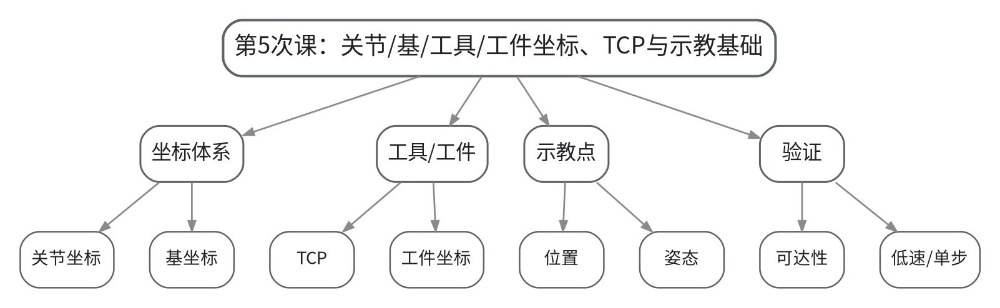

#### 教学目标

**知识目标：**
（1）掌握关节、基、工具和工件坐标的工程含义。
（2）理解TCP、位置、姿态和示教点之间的关系。
（3）熟悉坐标设置后进行可达性与姿态验证的基本方法。

**能力目标：**
（1）能够判断一个目标点应基于哪一坐标系描述。
（2）能够解释坐标系变化为何会改变程序复用性与调试效率。

**价值目标：**
（1）形成“坐标先定义、点位再示教、修改必验证”的参数管理意识。

#### 课程思政

（1）通过坐标参数错误导致异常运动的案例强调参数修改必须留痕并经过低速验证，培养严谨示教和复核意识。
（2）结合本次课中的错误配置、状态异常或安全边界讨论，引导学生把规范、证据和责任落实到具体操作与文档中。

#### 专创融合

比较“固定坐标硬编码”和“工具/工件坐标解耦”两种方案，思考如何提高工作站换型和复用效率。

#### 教学重难点

**教学重点**：四类坐标系、TCP、位置姿态与点位示教。

**教学难点**：难点在于从几何意义理解同一空间位置在不同坐标系中的数值差异，并把坐标选择与程序复用联系起来。

#### 教学过程

| 教学步骤 | 主要教学内容 | 设计意图 |
|---|---|---|
| 课前任务 | 【教师】1. 发布本次课预习/上机准备要求，明确对应大纲单元、关键概念或操作边界； 2. 提醒学生检查上一课形成的程序、坐标、接口表或模型，记录不理解的问题。 【学生】1. 完成对应教材/资料预习并整理疑问； 2. 准备本次课需要的文件、图表或操作条件，带着问题进入课堂。 | 通过课前准备建立前后课次衔接，让学生提前识别概念、文件和安全条件，减少课堂中无目标操作。 |
| 互动导入（10 min） | 【教师】1. 复习与本次课直接相关的上一环节关键结论； 2. 展示同一个抓取点分别以基坐标和工件坐标表示的程序片段，移动工件模型后比较两种写法的修改量，引出坐标抽象价值。 3. 追问学生本次课需要解决的工程问题。 【学生】参与问答、观察案例/现象，明确本次课任务目标和验收依据。 | 从具体工作站现象或故障切入，把抽象知识转化为待解决的工程问题，形成学习动机。 |
| 传授新知（共70 min） | 1、关节坐标与基坐标（15 min） 【教师】讲解关节空间与笛卡尔空间的区别，说明基坐标与机器人安装位置的关系。 【学生】根据示意图判断两种运动/描述方式的适用场景。 2、工具坐标与TCP（20 min） 【教师】说明TCP位置和方向、工具坐标轴定义及其对接近姿态的影响。 【学生】画出夹爪TCP与工具Z轴，并判断错误方向可能导致的后果。 3、工件坐标与程序复用（20 min） 【教师】通过工件整体平移/旋转案例说明工件坐标对程序迁移的价值。 【学生】比较基坐标硬编码与工件坐标编程的维护成本。 4、示教点与验证（15 min） 【教师】讲解接近点、作业点、离开点及单步/低速验证流程。 【学生】为抓取动作设计三个点位并说明坐标归属。 【课堂强化】围绕本次课重点对错误配置、边界条件或替代方案进行一次对照分析，要求学生说明“为什么这样做、错了会出现什么现象、如何验证”。 | 按“概念/任务→结构或程序→验证→工程应用”的逻辑推进，并用状态、轨迹、日志或仿真结果支撑理解，避免只记操作步骤。 |
| 过关检测（10 min） | 【教师】布置课堂检测/操作核验： 1. 【选择题】当工件整体移动而希望程序目标随工件一起迁移时，更合适的参照是（ ）。A. 工件坐标 B. 控制柜坐标 C. 屏幕坐标 D. 围栏坐标 2. 【判断题】TCP只影响显示方式，不会影响末端实际到达姿态。（ ） 3. 【简答题】为什么工业机器人示教通常需要区分接近点、作业点和离开点？ 【学生】独立作答或完成操作，同伴互查关键依据。 【教师】根据作答/运行结果集中点评重难点与安全边界。 | 及时检验学生能否把本次课知识转化为判断、操作和解释，针对易错点形成当堂纠偏。 |
| 课堂小结（5 min） | 【教师】简要总结： 1. 本次课解决的关键问题是：四类坐标系、TCP、位置姿态与点位示教。 2. 需要重点掌握的主线是：关节/基/工具/工件坐标、TCP与示教基础。 3. 最值得带走的方法是：先明确边界/状态，再执行操作，并用可复核证据验证。 4. 需要警惕的易错点是：难点在于从几何意义理解同一空间位置在不同坐标系中的数值差异，并把坐标选择与程序复用联系起来。 【学生】按主线回顾并补齐个人笔记。 | 用“关键问题—主线—方法—易错点”收束本课，帮助学生形成可迁移的工作站工程思维。 |
| 作业布置（3 min） | 【教师】布置课后任务： 1. 为一个抓取—放置任务设计工具坐标、两个工件坐标和6个关键点位，说明每个点的坐标归属。 2. 整理“坐标错误的三类典型现象—可能根因—验证方法”表。 【要求】不只提交结果，还要写出关键思路、参数/版本变化和验证依据；上机成果须保留真实日志或截图。 | 通过延伸任务巩固本次课知识，并为下一次课的坐标、程序、接口或综合仿真准备可直接复用的材料。 |
| 考勤（2 min） | 【教师】利用学习通/课堂点名完成签到；上机课同步核对分组与设备/软件使用情况。 | 掌握出勤与上机组织情况，保障教学秩序和安全管理。 |

#### 教学反思

【教师】课后重点从以下方面进行教学反思：
1. 教学流程：检查本次课由“关节/基/工具/工件坐标、TCP与示教基础”问题情境进入任务后，学生是否能按安全/工程逻辑逐层推进，而不是直接模仿操作。
2. 教学内容：复核“四类坐标系、TCP、位置姿态与点位示教。”是否讲清，尤其关注学生是否能解释“为什么这样做、错了会出现什么现象、如何验证”。
3. 学生参与：观察是否存在“会看不会做”“会做不会说”或个别学生只依赖小组成果的情况；上机课重点核查个人对坐标、程序、I/O和验证证据的解释能力。
4. 教学改进：根据过关检测和运行证据决定是否增加错例、轨迹回放、接口时序、故障注入或低速验证演示；不预填真实课堂表现。

### lesson-06

| 字段 | 内容 | 状态 | source_id |
|---|---|---|---|
| 章节 | 第二单元 坐标标定、示教编程与轨迹工艺 | derived | S1 |
| 授课题目 | 运动指令、轨迹参数、程序结构与异常分支 | derived | S1 |
| 周次 | 第6次课（Word中按实际课表填写） | to_confirm |  |
| 课时安排 | 2课时（100 min）；类型：理论2 | derived | S1 |
| 知识脉络图 | images/lesson-06-knowledge-map.png | derived | S1 |
| 教学方法 | 讲授法、问答法、案例分析法、程序阅读法、分组研讨法 | derived | S1 |
| 教学用具 | 电脑、投影仪、多媒体课件、教材、示教程序片段、轨迹回放动画、时序草图。 | derived | S1 |
| 教学设计 | 课前任务→互动导入（10 min）→传授新知（70 min）→过关检测（10 min）→课堂小结（5 min）→作业布置（3 min）→考勤（2 min） | derived | S1 |
| 参考文献 | [1] 张小刚、方遒.《工业机器人系统综合设计》[M]. 北京：机械工业出版社，2025.；[2] 陈乾、刘静文、李志卿.《工业机器人技术及应用》[M]. 北京：机械工业出版社，2024.；[5] 北京华航唯实机器人科技股份有限公司、李金亮、张明奎.《工业机器人系统集成》[M]. 北京：机械工业出版社，2025. | provided | S1 |

#### 知识脉络图

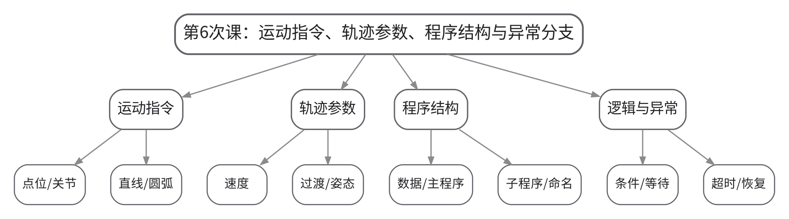

#### 教学目标

**知识目标：**
（1）掌握点位（关节）、直线和圆弧运动的基本适用场景。
（2）理解速度、姿态、过渡参数对轨迹、节拍与安全的影响。
（3）掌握程序数据、逻辑控制、子程序和异常分支的基本结构。

**能力目标：**
（1）能够根据抓取、搬运和放置任务选择合适的运动类型。
（2）能够阅读并重构一段基础示教程序，使其具有明确命名、模块化结构和异常出口。

**价值目标：**
（1）形成程序可维护性、参数可追溯和异常可恢复意识。

#### 课程思政

（1）通过速度过高、逻辑缺失和无异常出口的案例强调程序修改必须经过单步/低速验证，程序可维护性也是工程质量的一部分。
（2）结合本次课中的错误配置、状态异常或安全边界讨论，引导学生把规范、证据和责任落实到具体操作与文档中。

#### 专创融合

围绕可复用搬运程序模板，比较不同命名、模块化和参数化方案，训练低代码换型和工艺复用思维。

#### 教学重难点

**教学重点**：运动指令、速度/过渡参数、模块化程序、等待/超时/异常分支。

**教学难点**：难点是把工艺要求、安全条件和程序结构统一起来，避免“轨迹能跑但不可维护、无异常出口”。

#### 教学过程

| 教学步骤 | 主要教学内容 | 设计意图 |
|---|---|---|
| 课前任务 | 【教师】1. 发布本次课预习/上机准备要求，明确对应大纲单元、关键概念或操作边界； 2. 提醒学生检查上一课形成的程序、坐标、接口表或模型，记录不理解的问题。 【学生】1. 完成对应教材/资料预习并整理疑问； 2. 准备本次课需要的文件、图表或操作条件，带着问题进入课堂。 | 通过课前准备建立前后课次衔接，让学生提前识别概念、文件和安全条件，减少课堂中无目标操作。 |
| 互动导入（10 min） | 【教师】1. 复习与本次课直接相关的上一环节关键结论； 2. 展示一段20行连续运动指令、无注释无子程序的“能跑程序”，让学生判断其维护风险；随后注入夹具未到位信号，观察程序无法安全恢复。 3. 追问学生本次课需要解决的工程问题。 【学生】参与问答、观察案例/现象，明确本次课任务目标和验收依据。 | 从具体工作站现象或故障切入，把抽象知识转化为待解决的工程问题，形成学习动机。 |
| 传授新知（共70 min） | 1、运动指令选择（20 min） 【教师】比较关节/点位、直线、圆弧运动的路径约束和典型工艺，说明搬运空程与作业段的选择差异。 【学生】为四段动作选择运动类型并说明理由。 2、速度、姿态与过渡（15 min） 【教师】说明速度、过渡区、姿态对节拍、平滑性和碰撞风险的影响。 【学生】比较“高速大过渡”和“低速精确到位”两种设置。 3、程序数据与模块化结构（20 min） 【教师】讲解程序数据、主程序、子程序、命名与复用，示范把长程序重构为Pick/Place/SafeMove等模块。 【学生】完成程序结构重构草图。 4、逻辑、等待与异常分支（15 min） 【教师】讲解条件、等待、超时、报警、复位与恢复入口。 【学生】为“夹具未到位”设计安全等待/超时处理。 【课堂强化】围绕本次课重点对错误配置、边界条件或替代方案进行一次对照分析，要求学生说明“为什么这样做、错了会出现什么现象、如何验证”。 | 按“概念/任务→结构或程序→验证→工程应用”的逻辑推进，并用状态、轨迹、日志或仿真结果支撑理解，避免只记操作步骤。 |
| 过关检测（10 min） | 【教师】布置课堂检测/操作核验： 1. 【选择题】要求末端沿空间直线接近工件时，优先选择的运动类型是（ ）。A. 直线运动 B. 任意关节运动 C. 只改速度 D. 无需轨迹规划 2. 【判断题】为了提高节拍，所有运动段都应设置为最高速度和最大过渡。（ ） 3. 【简答题】一段可维护的机器人程序为什么需要子程序和异常分支？ 【学生】独立作答或完成操作，同伴互查关键依据。 【教师】根据作答/运行结果集中点评重难点与安全边界。 | 及时检验学生能否把本次课知识转化为判断、操作和解释，针对易错点形成当堂纠偏。 |
| 课堂小结（5 min） | 【教师】简要总结： 1. 本次课解决的关键问题是：运动指令、速度/过渡参数、模块化程序、等待/超时/异常分支。 2. 需要重点掌握的主线是：运动指令、轨迹参数、程序结构与异常分支。 3. 最值得带走的方法是：先明确边界/状态，再执行操作，并用可复核证据验证。 4. 需要警惕的易错点是：难点是把工艺要求、安全条件和程序结构统一起来，避免“轨迹能跑但不可维护、无异常出口”。 【学生】按主线回顾并补齐个人笔记。 | 用“关键问题—主线—方法—易错点”收束本课，帮助学生形成可迁移的工作站工程思维。 |
| 作业布置（3 min） | 【教师】布置课后任务： 1. 把给定搬运流程改写为“初始化—取料—搬运—放料—异常恢复”五个模块，列出模块输入/输出。 2. 设计3个故障条件及对应等待、超时、报警或恢复策略。 【要求】不只提交结果，还要写出关键思路、参数/版本变化和验证依据；上机成果须保留真实日志或截图。 | 通过延伸任务巩固本次课知识，并为下一次课的坐标、程序、接口或综合仿真准备可直接复用的材料。 |
| 考勤（2 min） | 【教师】利用学习通/课堂点名完成签到；上机课同步核对分组与设备/软件使用情况。 | 掌握出勤与上机组织情况，保障教学秩序和安全管理。 |

#### 教学反思

【教师】课后重点从以下方面进行教学反思：
1. 教学流程：检查本次课由“运动指令、轨迹参数、程序结构与异常分支”问题情境进入任务后，学生是否能按安全/工程逻辑逐层推进，而不是直接模仿操作。
2. 教学内容：复核“运动指令、速度/过渡参数、模块化程序、等待/超时/异常分支。”是否讲清，尤其关注学生是否能解释“为什么这样做、错了会出现什么现象、如何验证”。
3. 学生参与：观察是否存在“会看不会做”“会做不会说”或个别学生只依赖小组成果的情况；上机课重点核查个人对坐标、程序、I/O和验证证据的解释能力。
4. 教学改进：根据过关检测和运行证据决定是否增加错例、轨迹回放、接口时序、故障注入或低速验证演示；不预填真实课堂表现。

### lesson-07

| 字段 | 内容 | 状态 | source_id |
|---|---|---|---|
| 章节 | 上机二 搬运/上下料示教程序与轨迹优化 | derived | S1 |
| 授课题目 | 上机二A：抓取—搬运—放置程序实现与分段调试 | derived | S1 |
| 周次 | 第7次课（Word中按实际课表填写） | to_confirm |  |
| 课时安排 | 2课时（100 min）；类型：上机2 | derived | S1 |
| 知识脉络图 | images/lesson-07-knowledge-map.png | derived | S1 |
| 教学方法 | 任务驱动法、示范教学法、实操演练法、故障注入法、同伴评审法 | derived | S1 |
| 教学用具 | 机房、离线仿真平台、工作站模型、程序骨架、夹爪/I/O模拟模块。 | derived | S1 |
| 教学设计 | 课前任务→互动导入（10 min）→传授新知（70 min）→过关检测（10 min）→课堂小结（5 min）→作业布置（3 min）→考勤（2 min） | derived | S1 |
| 参考文献 | [1] 张小刚、方遒.《工业机器人系统综合设计》[M]. 北京：机械工业出版社，2025.；[3] 朱洪雷、代慧.《工业机器人离线编程（ABB）（第2版）》[M]. 北京：高等教育出版社，2024.；[5] 北京华航唯实机器人科技股份有限公司、李金亮、张明奎.《工业机器人系统集成》[M]. 北京：机械工业出版社，2025. | provided | S1 |

#### 知识脉络图

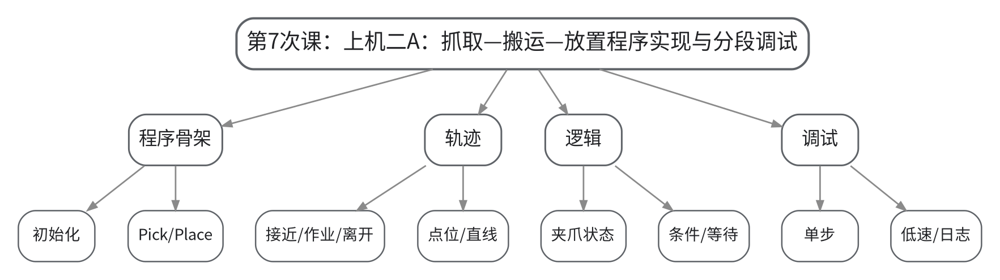

#### 教学目标

**知识目标：**
（1）理解搬运/上下料程序中初始化、取料、搬运、放料和结束的结构。
（2）理解点位/直线运动与夹爪控制之间的时序关系。

**能力目标：**
（1）能够在离线平台完成基础搬运/上下料程序。
（2）能够按“单步—低速—连续”层级分段调试并记录问题。

**价值目标：**
（1）形成程序分层、验证分级和运行证据可复核意识。

#### 课程思政

（1）通过“抓取未确认即高速离开”的反例强化程序状态确认和低速验证责任，要求真实保留失败记录。
（2）结合本次课中的错误配置、状态异常或安全边界讨论，引导学生把规范、证据和责任落实到具体操作与文档中。

#### 专创融合

把Pick/Place子程序设计为参数化模板，探索不同工件换型时的最小修改量。

#### 教学重难点

**教学重点**：程序骨架、运动与夹爪逻辑、分段调试、安全初始位。

**教学难点**：难点在于处理轨迹、夹爪信号和安全点位的时序关系，避免在错误状态下进入下一动作。

#### 教学过程

| 教学步骤 | 主要教学内容 | 设计意图 |
|---|---|---|
| 课前任务 | 【教师】1. 发布本次课预习/上机准备要求，明确对应大纲单元、关键概念或操作边界； 2. 提醒学生检查上一课形成的程序、坐标、接口表或模型，记录不理解的问题。 【学生】1. 完成对应教材/资料预习并整理疑问； 2. 准备本次课需要的文件、图表或操作条件，带着问题进入课堂。 | 通过课前准备建立前后课次衔接，让学生提前识别概念、文件和安全条件，减少课堂中无目标操作。 |
| 互动导入（10 min） | 【教师】1. 复习与本次课直接相关的上一环节关键结论； 2. 提供一个故意缺少“夹爪闭合确认”的抓取程序，让学生预测运行到搬运阶段后可能发生的异常。 3. 追问学生本次课需要解决的工程问题。 【学生】参与问答、观察案例/现象，明确本次课任务目标和验收依据。 | 从具体工作站现象或故障切入，把抽象知识转化为待解决的工程问题，形成学习动机。 |
| 传授新知（共70 min） | 1、程序骨架与安全初始位（10 min） 【教师】发布任务骨架和提交规则，说明程序必须包含安全初始位与异常出口。 【学生】检查坐标、点位、工具状态并建立程序文件。 2、抓取流程实现（20 min） 【教师】巡回指导接近点—抓取点—夹爪动作—确认—离开点的顺序。 【学生】完成Pick模块并用单步检查。 3、搬运与放置流程（25 min） 【教师】指导选择运动类型和安全过渡点，避免穿越设备模型。 【学生】完成Move/Place模块并低速回放。 4、分段调试与证据（15 min） 【教师】组织故障注入和程序讲评，检查是否存在硬编码、无等待、无异常分支。 【学生】记录一次故障复现—修复—复测过程。 【课堂强化】围绕本次课重点对错误配置、边界条件或替代方案进行一次对照分析，要求学生说明“为什么这样做、错了会出现什么现象、如何验证”。 | 按“概念/任务→结构或程序→验证→工程应用”的逻辑推进，并用状态、轨迹、日志或仿真结果支撑理解，避免只记操作步骤。 |
| 过关检测（10 min） | 【教师】布置课堂检测/操作核验： 1. 【选择题】抓取程序中，在执行搬运动作前最关键的状态确认之一是（ ）。A. 夹爪已可靠夹持 B. 屏幕亮度 C. 文件名长度 D. 模型颜色 2. 【判断题】只要离线轨迹没有碰撞，就可以省略安全初始位和夹爪状态检查。（ ） 3. 【操作核验】现场单步演示Pick模块并说明每一步的安全条件。 【学生】独立作答或完成操作，同伴互查关键依据。 【教师】根据作答/运行结果集中点评重难点与安全边界。 | 及时检验学生能否把本次课知识转化为判断、操作和解释，针对易错点形成当堂纠偏。 |
| 课堂小结（5 min） | 【教师】简要总结： 1. 本次课解决的关键问题是：程序骨架、运动与夹爪逻辑、分段调试、安全初始位。 2. 需要重点掌握的主线是：上机二A：抓取—搬运—放置程序实现与分段调试。 3. 最值得带走的方法是：先明确边界/状态，再执行操作，并用可复核证据验证。 4. 需要警惕的易错点是：难点在于处理轨迹、夹爪信号和安全点位的时序关系，避免在错误状态下进入下一动作。 【学生】按主线回顾并补齐个人笔记。 | 用“关键问题—主线—方法—易错点”收束本课，帮助学生形成可迁移的工作站工程思维。 |
| 作业布置（3 min） | 【教师】布置课后任务： 1. 提交上机二A：程序、关键点表、单步/低速验证截图、一次故障修复记录。 2. 记录当前节拍基线，为下一次轨迹优化保留对比数据。 【要求】不只提交结果，还要写出关键思路、参数/版本变化和验证依据；上机成果须保留真实日志或截图。 | 通过延伸任务巩固本次课知识，并为下一次课的坐标、程序、接口或综合仿真准备可直接复用的材料。 |
| 考勤（2 min） | 【教师】利用学习通/课堂点名完成签到；上机课同步核对分组与设备/软件使用情况。 | 掌握出勤与上机组织情况，保障教学秩序和安全管理。 |

#### 教学反思

【教师】课后重点从以下方面进行教学反思：
1. 教学流程：检查本次课由“上机二A：抓取—搬运—放置程序实现与分段调试”问题情境进入任务后，学生是否能按安全/工程逻辑逐层推进，而不是直接模仿操作。
2. 教学内容：复核“程序骨架、运动与夹爪逻辑、分段调试、安全初始位。”是否讲清，尤其关注学生是否能解释“为什么这样做、错了会出现什么现象、如何验证”。
3. 学生参与：观察是否存在“会看不会做”“会做不会说”或个别学生只依赖小组成果的情况；上机课重点核查个人对坐标、程序、I/O和验证证据的解释能力。
4. 教学改进：根据过关检测和运行证据决定是否增加错例、轨迹回放、接口时序、故障注入或低速验证演示；不预填真实课堂表现。

### lesson-08

| 字段 | 内容 | 状态 | source_id |
|---|---|---|---|
| 章节 | 上机二 搬运/上下料示教程序与轨迹优化 | derived | S1 |
| 授课题目 | 上机二B：轨迹、速度、过渡与节拍优化 | derived | S1 |
| 周次 | 第8次课（Word中按实际课表填写） | to_confirm |  |
| 课时安排 | 2课时（100 min）；类型：上机2 | derived | S1 |
| 知识脉络图 | images/lesson-08-knowledge-map.png | derived | S1 |
| 教学方法 | 任务驱动法、示范教学法、实操演练法、故障注入法、同伴评审法 | derived | S1 |
| 教学用具 | 机房、离线仿真平台、节拍分析工具、碰撞检查工具、参数记录表。 | derived | S1 |
| 教学设计 | 课前任务→互动导入（10 min）→传授新知（70 min）→过关检测（10 min）→课堂小结（5 min）→作业布置（3 min）→考勤（2 min） | derived | S1 |
| 参考文献 | [1] 张小刚、方遒.《工业机器人系统综合设计》[M]. 北京：机械工业出版社，2025.；[3] 朱洪雷、代慧.《工业机器人离线编程（ABB）（第2版）》[M]. 北京：高等教育出版社，2024.；[4] 倪寿勇.《工业机器人离线编程与仿真》[M]. 北京：高等教育出版社，2024. | provided | S1 |

#### 知识脉络图

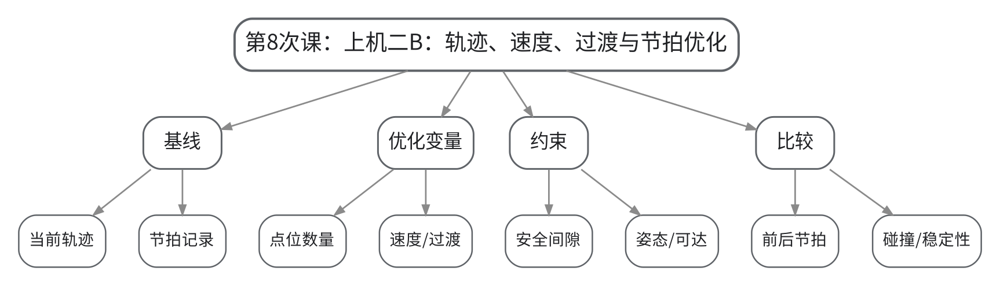

#### 教学目标

**知识目标：**
（1）理解轨迹长度、点位数量、速度和过渡参数对节拍的影响。
（2）理解节拍优化必须受到安全、碰撞、工艺精度和设备能力约束。

**能力目标：**
（1）能够建立节拍基线并设计至少两种优化方案。
（2）能够用碰撞检查、轨迹回放和前后数据比较验证优化有效性。

**价值目标：**
（1）形成“效率优化必须有约束、有数据、有复核”的工程意识。

#### 课程思政

（1）通过“追求最快导致安全间隙不足”的案例强调效率服从安全和工艺约束，性能结论须保留统一计时口径。
（2）结合本次课中的错误配置、状态异常或安全边界讨论，引导学生把规范、证据和责任落实到具体操作与文档中。

#### 专创融合

以节拍优化为小型工艺改善项目，训练学生用数据而不是经验评价改进方案。

#### 教学重难点

**教学重点**：轨迹简化、速度/过渡优化、节拍对比与安全约束。

**教学难点**：难点是避免把“更快”当作唯一目标，需要在节拍、精度、稳定性和安全之间做有证据的折中。

#### 教学过程

| 教学步骤 | 主要教学内容 | 设计意图 |
|---|---|---|
| 课前任务 | 【教师】1. 发布本次课预习/上机准备要求，明确对应大纲单元、关键概念或操作边界； 2. 提醒学生检查上一课形成的程序、坐标、接口表或模型，记录不理解的问题。 【学生】1. 完成对应教材/资料预习并整理疑问； 2. 准备本次课需要的文件、图表或操作条件，带着问题进入课堂。 | 通过课前准备建立前后课次衔接，让学生提前识别概念、文件和安全条件，减少课堂中无目标操作。 |
| 互动导入（10 min） | 【教师】1. 复习与本次课直接相关的上一环节关键结论； 2. 把一段安全但绕行严重的轨迹和一段很短但贴近设备的轨迹同时展示，要求学生分别指出“慢在哪里”和“危险在哪里”。 3. 追问学生本次课需要解决的工程问题。 【学生】参与问答、观察案例/现象，明确本次课任务目标和验收依据。 | 从具体工作站现象或故障切入，把抽象知识转化为待解决的工程问题，形成学习动机。 |
| 传授新知（共70 min） | 1、节拍基线与瓶颈识别（15 min） 【教师】指导统一计时口径，分解取料、搬运、放料阶段节拍。 【学生】记录当前方案节拍并识别最长阶段。 2、轨迹与点位优化（20 min） 【教师】指导删除冗余点、调整安全过渡点和姿态，强调最小安全间隙。 【学生】完成方案A并保存版本。 3、速度/过渡参数优化（20 min） 【教师】指导区分空程与作业段，比较速度、过渡区和精确到位设置。 【学生】完成方案B并保留参数表。 4、前后验证与复盘（15 min） 【教师】组织碰撞、可达性、节拍和程序可读性综合验收。 【学生】用表格说明基线、方案A、方案B的优缺点并选择最终方案。 【课堂强化】围绕本次课重点对错误配置、边界条件或替代方案进行一次对照分析，要求学生说明“为什么这样做、错了会出现什么现象、如何验证”。 | 按“概念/任务→结构或程序→验证→工程应用”的逻辑推进，并用状态、轨迹、日志或仿真结果支撑理解，避免只记操作步骤。 |
| 过关检测（10 min） | 【教师】布置课堂检测/操作核验： 1. 【选择题】节拍优化中最合理的评价方式是（ ）。A. 只看单次最快时间 B. 同时比较节拍与安全/碰撞/精度 C. 只删点位 D. 只提升最高速度 2. 【判断题】只要节拍缩短，就说明优化方案一定更好。（ ） 3. 【操作核验】展示优化前后两个版本，说明修改点、节拍变化和安全验证证据。 【学生】独立作答或完成操作，同伴互查关键依据。 【教师】根据作答/运行结果集中点评重难点与安全边界。 | 及时检验学生能否把本次课知识转化为判断、操作和解释，针对易错点形成当堂纠偏。 |
| 课堂小结（5 min） | 【教师】简要总结： 1. 本次课解决的关键问题是：轨迹简化、速度/过渡优化、节拍对比与安全约束。 2. 需要重点掌握的主线是：上机二B：轨迹、速度、过渡与节拍优化。 3. 最值得带走的方法是：先明确边界/状态，再执行操作，并用可复核证据验证。 4. 需要警惕的易错点是：难点是避免把“更快”当作唯一目标，需要在节拍、精度、稳定性和安全之间做有证据的折中。 【学生】按主线回顾并补齐个人笔记。 | 用“关键问题—主线—方法—易错点”收束本课，帮助学生形成可迁移的工作站工程思维。 |
| 作业布置（3 min） | 【教师】布置课后任务： 1. 提交上机二最终成果：程序双版本、参数/点位变化表、节拍前后对比、碰撞/可达性证据。 2. 写150字说明“为什么没有继续追求更快”。 【要求】不只提交结果，还要写出关键思路、参数/版本变化和验证依据；上机成果须保留真实日志或截图。 | 通过延伸任务巩固本次课知识，并为下一次课的坐标、程序、接口或综合仿真准备可直接复用的材料。 |
| 考勤（2 min） | 【教师】利用学习通/课堂点名完成签到；上机课同步核对分组与设备/软件使用情况。 | 掌握出勤与上机组织情况，保障教学秩序和安全管理。 |

#### 教学反思

【教师】课后重点从以下方面进行教学反思：
1. 教学流程：检查本次课由“上机二B：轨迹、速度、过渡与节拍优化”问题情境进入任务后，学生是否能按安全/工程逻辑逐层推进，而不是直接模仿操作。
2. 教学内容：复核“轨迹简化、速度/过渡优化、节拍对比与安全约束。”是否讲清，尤其关注学生是否能解释“为什么这样做、错了会出现什么现象、如何验证”。
3. 学生参与：观察是否存在“会看不会做”“会做不会说”或个别学生只依赖小组成果的情况；上机课重点核查个人对坐标、程序、I/O和验证证据的解释能力。
4. 教学改进：根据过关检测和运行证据决定是否增加错例、轨迹回放、接口时序、故障注入或低速验证演示；不预填真实课堂表现。

### lesson-09

| 字段 | 内容 | 状态 | source_id |
|---|---|---|---|
| 章节 | 第三单元 末端执行器、I/O与工作站接口集成 | derived | S1 |
| 授课题目 | 末端执行器、工装夹具、传感器与I/O基础 | derived | S1 |
| 周次 | 第9次课（Word中按实际课表填写） | to_confirm |  |
| 课时安排 | 2课时（100 min）；类型：理论2 | derived | S1 |
| 知识脉络图 | images/lesson-09-knowledge-map.png | derived | S1 |
| 教学方法 | 讲授法、问答法、案例分析法、程序阅读法、分组研讨法 | derived | S1 |
| 教学用具 | 电脑、投影仪、多媒体课件、教材、夹爪/吸盘示例、传感器图片、I/O点表模板。 | derived | S1 |
| 教学设计 | 课前任务→互动导入（10 min）→传授新知（70 min）→过关检测（10 min）→课堂小结（5 min）→作业布置（3 min）→考勤（2 min） | derived | S1 |
| 参考文献 | [1] 张小刚、方遒.《工业机器人系统综合设计》[M]. 北京：机械工业出版社，2025.；[2] 陈乾、刘静文、李志卿.《工业机器人技术及应用》[M]. 北京：机械工业出版社，2024.；[5] 北京华航唯实机器人科技股份有限公司、李金亮、张明奎.《工业机器人系统集成》[M]. 北京：机械工业出版社，2025. | provided | S1 |

#### 知识脉络图

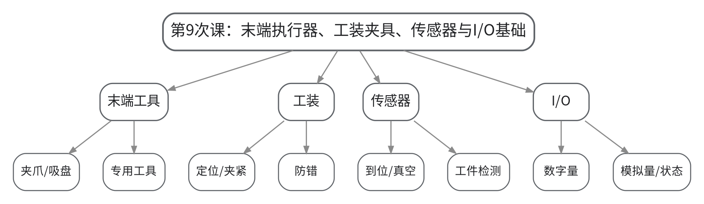

#### 教学目标

**知识目标：**
（1）掌握夹爪、吸盘和专用末端执行器的基本特点与适用场景。
（2）理解工装夹具、到位传感器、真空检测等与机器人动作的协同关系。
（3）掌握数字I/O、模拟I/O和状态信号的基本含义。

**能力目标：**
（1）能够根据工件形状、质量、表面和工艺要求初步选择末端执行器。
（2）能够把一个抓取任务分解为输出命令、输入确认和失败状态。

**价值目标：**
（1）形成“动作必须有状态证据、接口必须定义清楚”的工程意识。

#### 课程思政

（1）通过“命令发出但动作未完成”的失效案例强调状态反馈和失效安全，培养接口契约与验证责任。
（2）结合本次课中的错误配置、状态异常或安全边界讨论，引导学生把规范、证据和责任落实到具体操作与文档中。

#### 专创融合

围绕可快速换型的末端工具，思考模块化快换、通用I/O和防错传感器如何降低换线成本。

#### 教学重难点

**教学重点**：末端执行器选型、工装与传感器协同、I/O输入输出及状态确认。

**教学难点**：难点在于把机械抓取过程转换成离散信号和状态条件，避免“发出命令=动作已完成”的错误认知。

#### 教学过程

| 教学步骤 | 主要教学内容 | 设计意图 |
|---|---|---|
| 课前任务 | 【教师】1. 发布本次课预习/上机准备要求，明确对应大纲单元、关键概念或操作边界； 2. 提醒学生检查上一课形成的程序、坐标、接口表或模型，记录不理解的问题。 【学生】1. 完成对应教材/资料预习并整理疑问； 2. 准备本次课需要的文件、图表或操作条件，带着问题进入课堂。 | 通过课前准备建立前后课次衔接，让学生提前识别概念、文件和安全条件，减少课堂中无目标操作。 |
| 互动导入（10 min） | 【教师】1. 复习与本次课直接相关的上一环节关键结论； 2. 演示“夹爪闭合输出已置1，但工件未夹到”的场景，追问：机器人如何知道抓取是否成功？由此引出传感器反馈和I/O状态。 3. 追问学生本次课需要解决的工程问题。 【学生】参与问答、观察案例/现象，明确本次课任务目标和验收依据。 | 从具体工作站现象或故障切入，把抽象知识转化为待解决的工程问题，形成学习动机。 |
| 传授新知（共70 min） | 1、末端执行器与工装（20 min） 【教师】比较平行夹爪、三指夹爪、真空吸盘和专用工具，讲解负载、重心、表面和容错要求。 【学生】为四类工件选择末端方案并说明依据。 2、传感器与状态确认（15 min） 【教师】讲解夹爪开闭到位、真空压力、工件存在等反馈。 【学生】把抓取流程改写为“命令—等待—确认—异常”状态链。 3、数字/模拟I/O（20 min） 【教师】区分DI/DO、AI/AO，说明地址、名称、含义和有效电平的基本管理。 【学生】完成最小I/O点表。 4、接口文档基础（15 min） 【教师】说明I/O点表需包含信号名、方向、设备、含义、正常状态和异常处理。 【学生】互审点表，检查歧义和重复命名。 【课堂强化】围绕本次课重点对错误配置、边界条件或替代方案进行一次对照分析，要求学生说明“为什么这样做、错了会出现什么现象、如何验证”。 | 按“概念/任务→结构或程序→验证→工程应用”的逻辑推进，并用状态、轨迹、日志或仿真结果支撑理解，避免只记操作步骤。 |
| 过关检测（10 min） | 【教师】布置课堂检测/操作核验： 1. 【选择题】“夹爪闭合到位”通常属于机器人读取的（ ）。A. 输入信号 B. 输出信号 C. 轨迹点 D. 坐标系 2. 【判断题】机器人发出夹爪闭合输出后，可以立即认为工件已经可靠夹持。（ ） 3. 【简答题】一个完整I/O点表至少应说明哪些信息？ 【学生】独立作答或完成操作，同伴互查关键依据。 【教师】根据作答/运行结果集中点评重难点与安全边界。 | 及时检验学生能否把本次课知识转化为判断、操作和解释，针对易错点形成当堂纠偏。 |
| 课堂小结（5 min） | 【教师】简要总结： 1. 本次课解决的关键问题是：末端执行器选型、工装与传感器协同、I/O输入输出及状态确认。 2. 需要重点掌握的主线是：末端执行器、工装夹具、传感器与I/O基础。 3. 最值得带走的方法是：先明确边界/状态，再执行操作，并用可复核证据验证。 4. 需要警惕的易错点是：难点在于把机械抓取过程转换成离散信号和状态条件，避免“发出命令=动作已完成”的错误认知。 【学生】按主线回顾并补齐个人笔记。 | 用“关键问题—主线—方法—易错点”收束本课，帮助学生形成可迁移的工作站工程思维。 |
| 作业布置（3 min） | 【教师】布置课后任务： 1. 为“气动夹爪抓取工件”设计6—10个I/O点并填写方向、设备、含义和正常状态。 2. 比较夹爪与真空吸盘在两个工件场景中的适用性。 【要求】不只提交结果，还要写出关键思路、参数/版本变化和验证依据；上机成果须保留真实日志或截图。 | 通过延伸任务巩固本次课知识，并为下一次课的坐标、程序、接口或综合仿真准备可直接复用的材料。 |
| 考勤（2 min） | 【教师】利用学习通/课堂点名完成签到；上机课同步核对分组与设备/软件使用情况。 | 掌握出勤与上机组织情况，保障教学秩序和安全管理。 |

#### 教学反思

【教师】课后重点从以下方面进行教学反思：
1. 教学流程：检查本次课由“末端执行器、工装夹具、传感器与I/O基础”问题情境进入任务后，学生是否能按安全/工程逻辑逐层推进，而不是直接模仿操作。
2. 教学内容：复核“末端执行器选型、工装与传感器协同、I/O输入输出及状态确认。”是否讲清，尤其关注学生是否能解释“为什么这样做、错了会出现什么现象、如何验证”。
3. 学生参与：观察是否存在“会看不会做”“会做不会说”或个别学生只依赖小组成果的情况；上机课重点核查个人对坐标、程序、I/O和验证证据的解释能力。
4. 教学改进：根据过关检测和运行证据决定是否增加错例、轨迹回放、接口时序、故障注入或低速验证演示；不预填真实课堂表现。

### lesson-10

| 字段 | 内容 | 状态 | source_id |
|---|---|---|---|
| 章节 | 第三单元 末端执行器、I/O与工作站接口集成 | derived | S1 |
| 授课题目 | PLC/CNC/视觉接口、握手时序、安全互锁与异常恢复 | derived | S1 |
| 周次 | 第10次课（Word中按实际课表填写） | to_confirm |  |
| 课时安排 | 2课时（100 min）；类型：理论2 | derived | S1 |
| 知识脉络图 | images/lesson-10-knowledge-map.png | derived | S1 |
| 教学方法 | 讲授法、问答法、案例分析法、程序阅读法、分组研讨法 | derived | S1 |
| 教学用具 | 电脑、投影仪、多媒体课件、教材、I/O点表、时序图、PLC/CNC接口案例。 | derived | S1 |
| 教学设计 | 课前任务→互动导入（10 min）→传授新知（70 min）→过关检测（10 min）→课堂小结（5 min）→作业布置（3 min）→考勤（2 min） | derived | S1 |
| 参考文献 | [1] 张小刚、方遒.《工业机器人系统综合设计》[M]. 北京：机械工业出版社，2025.；[5] 北京华航唯实机器人科技股份有限公司、李金亮、张明奎.《工业机器人系统集成》[M]. 北京：机械工业出版社，2025. | provided | S1 |

#### 知识脉络图

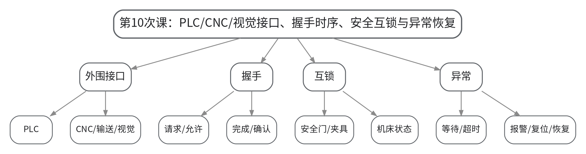

#### 教学目标

**知识目标：**
（1）掌握机器人与PLC、CNC、夹具、输送和视觉等外围设备的基本接口关系。
（2）理解握手时序、等待、超时和安全互锁的逻辑。
（3）理解异常恢复必须区分可自动恢复、需人工确认和必须停机维护的边界。

**能力目标：**
（1）能够绘制机器人与外围设备的I/O握手时序图。
（2）能够设计至少一组等待/超时/报警/复位/恢复逻辑。

**价值目标：**
（1）形成“接口就是契约”的跨专业协同意识和失效安全责任。

#### 课程思政

（1）通过跨专业接口失效案例强调“接口就是契约”，信号定义、时序和异常恢复必须共同评审，不能靠口头约定。
（2）结合本次课中的错误配置、状态异常或安全边界讨论，引导学生把规范、证据和责任落实到具体操作与文档中。

#### 专创融合

把I/O点表与时序图视为可复用接口规范，思考通过标准接口降低不同机器人/机床集成成本。

#### 教学重难点

**教学重点**：I/O握手、时序、互锁、超时、报警与恢复。

**教学难点**：难点在于处理多设备异步状态，确保任一条件未满足时系统进入可预测的安全状态。

#### 教学过程

| 教学步骤 | 主要教学内容 | 设计意图 |
|---|---|---|
| 课前任务 | 【教师】1. 发布本次课预习/上机准备要求，明确对应大纲单元、关键概念或操作边界； 2. 提醒学生检查上一课形成的程序、坐标、接口表或模型，记录不理解的问题。 【学生】1. 完成对应教材/资料预习并整理疑问； 2. 准备本次课需要的文件、图表或操作条件，带着问题进入课堂。 | 通过课前准备建立前后课次衔接，让学生提前识别概念、文件和安全条件，减少课堂中无目标操作。 |
| 互动导入（10 min） | 【教师】1. 复习与本次课直接相关的上一环节关键结论； 2. 给出“机器人已进入机床、机床门关闭信号却提前到来”的时序冲突案例，要求学生分析是程序问题还是接口契约问题。 3. 追问学生本次课需要解决的工程问题。 【学生】参与问答、观察案例/现象，明确本次课任务目标和验收依据。 | 从具体工作站现象或故障切入，把抽象知识转化为待解决的工程问题，形成学习动机。 |
| 传授新知（共70 min） | 1、机器人—PLC/CNC接口角色（15 min） 【教师】说明机器人、PLC、机床、夹具、视觉在工作站中的控制边界和典型信号。 【学生】画出设备间信号方向图。 2、握手时序（20 min） 【教师】用请求—允许—执行—完成—确认的时序讲解同步逻辑，强调每个状态的进入/退出条件。 【学生】补全一个上下料握手时序图。 3、安全互锁与超时（20 min） 【教师】讲解安全门、主轴停止、夹具到位、机器人安全位等互锁，以及等待超时与报警。 【学生】为三个互锁条件设计失败处理。 4、异常恢复与权限边界（15 min） 【教师】讲解复位、重新握手、回安全位、人工确认及专业维护边界。 【学生】绘制一个异常恢复状态图。 【课堂强化】围绕本次课重点对错误配置、边界条件或替代方案进行一次对照分析，要求学生说明“为什么这样做、错了会出现什么现象、如何验证”。 | 按“概念/任务→结构或程序→验证→工程应用”的逻辑推进，并用状态、轨迹、日志或仿真结果支撑理解，避免只记操作步骤。 |
| 过关检测（10 min） | 【教师】布置课堂检测/操作核验： 1. 【选择题】握手逻辑中设置“超时”最主要的作用是（ ）。A. 提高屏幕亮度 B. 避免无限等待并触发可诊断异常 C. 改变坐标系 D. 增大负载 2. 【判断题】任何报警都可以由机器人程序自动复位并继续运行。（ ） 3. 【简答题】为什么机器人与PLC/CNC联调时需要I/O点表和握手时序图同时存在？ 【学生】独立作答或完成操作，同伴互查关键依据。 【教师】根据作答/运行结果集中点评重难点与安全边界。 | 及时检验学生能否把本次课知识转化为判断、操作和解释，针对易错点形成当堂纠偏。 |
| 课堂小结（5 min） | 【教师】简要总结： 1. 本次课解决的关键问题是：I/O握手、时序、互锁、超时、报警与恢复。 2. 需要重点掌握的主线是：PLC/CNC/视觉接口、握手时序、安全互锁与异常恢复。 3. 最值得带走的方法是：先明确边界/状态，再执行操作，并用可复核证据验证。 4. 需要警惕的易错点是：难点在于处理多设备异步状态，确保任一条件未满足时系统进入可预测的安全状态。 【学生】按主线回顾并补齐个人笔记。 | 用“关键问题—主线—方法—易错点”收束本课，帮助学生形成可迁移的工作站工程思维。 |
| 作业布置（3 min） | 【教师】布置课后任务： 1. 绘制一个机器人机床上下料的8—12步握手时序图，并列出至少4个安全互锁条件。 2. 设计两个故障注入场景：信号丢失、信号顺序错误，写出预期报警与恢复步骤。 【要求】不只提交结果，还要写出关键思路、参数/版本变化和验证依据；上机成果须保留真实日志或截图。 | 通过延伸任务巩固本次课知识，并为下一次课的坐标、程序、接口或综合仿真准备可直接复用的材料。 |
| 考勤（2 min） | 【教师】利用学习通/课堂点名完成签到；上机课同步核对分组与设备/软件使用情况。 | 掌握出勤与上机组织情况，保障教学秩序和安全管理。 |

#### 教学反思

【教师】课后重点从以下方面进行教学反思：
1. 教学流程：检查本次课由“PLC/CNC/视觉接口、握手时序、安全互锁与异常恢复”问题情境进入任务后，学生是否能按安全/工程逻辑逐层推进，而不是直接模仿操作。
2. 教学内容：复核“I/O握手、时序、互锁、超时、报警与恢复。”是否讲清，尤其关注学生是否能解释“为什么这样做、错了会出现什么现象、如何验证”。
3. 学生参与：观察是否存在“会看不会做”“会做不会说”或个别学生只依赖小组成果的情况；上机课重点核查个人对坐标、程序、I/O和验证证据的解释能力。
4. 教学改进：根据过关检测和运行证据决定是否增加错例、轨迹回放、接口时序、故障注入或低速验证演示；不预填真实课堂表现。

### lesson-11

| 字段 | 内容 | 状态 | source_id |
|---|---|---|---|
| 章节 | 上机三 I/O握手、安全互锁与异常恢复 | derived | S1 |
| 授课题目 | 上机三A：I/O点表配置与握手时序实现 | derived | S1 |
| 周次 | 第11次课（Word中按实际课表填写） | to_confirm |  |
| 课时安排 | 2课时（100 min）；类型：上机2 | derived | S1 |
| 知识脉络图 | images/lesson-11-knowledge-map.png | derived | S1 |
| 教学方法 | 任务驱动法、示范教学法、实操演练法、故障注入法、同伴评审法 | derived | S1 |
| 教学用具 | 机房、离线仿真平台、I/O模拟模块、PLC/CNC状态模拟、时序图工具。 | derived | S1 |
| 教学设计 | 课前任务→互动导入（10 min）→传授新知（70 min）→过关检测（10 min）→课堂小结（5 min）→作业布置（3 min）→考勤（2 min） | derived | S1 |
| 参考文献 | [1] 张小刚、方遒.《工业机器人系统综合设计》[M]. 北京：机械工业出版社，2025.；[5] 北京华航唯实机器人科技股份有限公司、李金亮、张明奎.《工业机器人系统集成》[M]. 北京：机械工业出版社，2025. | provided | S1 |

#### 知识脉络图

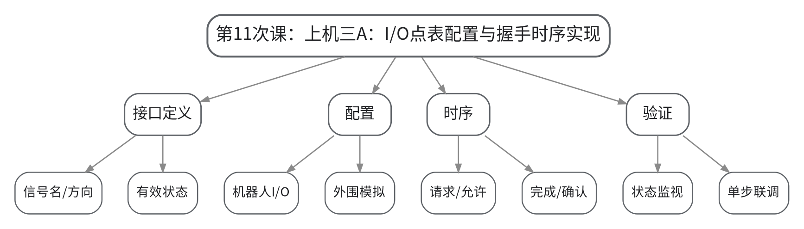

#### 教学目标

**知识目标：**
（1）理解I/O点表、程序变量和外围设备状态之间的一致性要求。
（2）理解握手时序的每个边沿/状态转换条件。

**能力目标：**
（1）能够完成机器人与PLC/CNC/夹具的I/O点表配置。
（2）能够实现基本请求—允许—执行—完成—确认握手。

**价值目标：**
（1）形成接口命名规范、状态可追踪和联调有记录的工程习惯。

#### 课程思政

（1）通过接口命名混乱和方向定义错误案例强调跨专业接口必须文档化，联调记录必须真实。
（2）结合本次课中的错误配置、状态异常或安全边界讨论，引导学生把规范、证据和责任落实到具体操作与文档中。

#### 专创融合

把I/O点表模板标准化，探索如何在不同工作站中复用接口模块。

#### 教学重难点

**教学重点**：I/O点表、信号配置、握手程序、状态监视与单步联调。

**教学难点**：难点是保证点表、程序、时序图和模拟外围设备的信号语义完全一致。

#### 教学过程

| 教学步骤 | 主要教学内容 | 设计意图 |
|---|---|---|
| 课前任务 | 【教师】1. 发布本次课预习/上机准备要求，明确对应大纲单元、关键概念或操作边界； 2. 提醒学生检查上一课形成的程序、坐标、接口表或模型，记录不理解的问题。 【学生】1. 完成对应教材/资料预习并整理疑问； 2. 准备本次课需要的文件、图表或操作条件，带着问题进入课堂。 | 通过课前准备建立前后课次衔接，让学生提前识别概念、文件和安全条件，减少课堂中无目标操作。 |
| 互动导入（10 min） | 【教师】1. 复习与本次课直接相关的上一环节关键结论； 2. 教师给出一个“点表中DO_ClampClose与程序中DI_ClampClose混淆”的错误，要求学生仅用状态监视定位。 3. 追问学生本次课需要解决的工程问题。 【学生】参与问答、观察案例/现象，明确本次课任务目标和验收依据。 | 从具体工作站现象或故障切入，把抽象知识转化为待解决的工程问题，形成学习动机。 |
| 传授新知（共70 min） | 1、点表冻结与检查（10 min） 【教师】说明本次接口范围，要求先冻结信号名、方向、设备和有效状态。 【学生】完成点表互审，消除重复/歧义。 2、I/O配置（20 min） 【教师】示范平台中的I/O映射和状态监视。 【学生】完成机器人端与外围模拟端信号配置。 3、握手程序实现（25 min） 【教师】巡回指导请求—允许—执行—完成—确认逻辑。 【学生】分段实现并用单步切换信号验证每个状态。 4、联调与记录（15 min） 【教师】检查时序图与实际状态是否一致。 【学生】提交状态截图/日志和一次接口错误修正记录。 【课堂强化】围绕本次课重点对错误配置、边界条件或替代方案进行一次对照分析，要求学生说明“为什么这样做、错了会出现什么现象、如何验证”。 | 按“概念/任务→结构或程序→验证→工程应用”的逻辑推进，并用状态、轨迹、日志或仿真结果支撑理解，避免只记操作步骤。 |
| 过关检测（10 min） | 【教师】布置课堂检测/操作核验： 1. 【选择题】I/O点表中“方向”应以（ ）为参照统一定义。A. 机器人或约定控制边界 B. 随意 C. 信号颜色 D. 截图顺序 2. 【判断题】只要程序变量名称相似，I/O点表与程序不完全一致也不影响联调。（ ） 3. 【操作核验】现场逐步切换握手信号并解释状态转换条件。 【学生】独立作答或完成操作，同伴互查关键依据。 【教师】根据作答/运行结果集中点评重难点与安全边界。 | 及时检验学生能否把本次课知识转化为判断、操作和解释，针对易错点形成当堂纠偏。 |
| 课堂小结（5 min） | 【教师】简要总结： 1. 本次课解决的关键问题是：I/O点表、信号配置、握手程序、状态监视与单步联调。 2. 需要重点掌握的主线是：上机三A：I/O点表配置与握手时序实现。 3. 最值得带走的方法是：先明确边界/状态，再执行操作，并用可复核证据验证。 4. 需要警惕的易错点是：难点是保证点表、程序、时序图和模拟外围设备的信号语义完全一致。 【学生】按主线回顾并补齐个人笔记。 | 用“关键问题—主线—方法—易错点”收束本课，帮助学生形成可迁移的工作站工程思维。 |
| 作业布置（3 min） | 【教师】布置课后任务： 1. 提交上机三A：I/O点表、握手时序图、程序/配置、状态监视截图。 2. 准备下一次故障注入脚本或故障表。 【要求】不只提交结果，还要写出关键思路、参数/版本变化和验证依据；上机成果须保留真实日志或截图。 | 通过延伸任务巩固本次课知识，并为下一次课的坐标、程序、接口或综合仿真准备可直接复用的材料。 |
| 考勤（2 min） | 【教师】利用学习通/课堂点名完成签到；上机课同步核对分组与设备/软件使用情况。 | 掌握出勤与上机组织情况，保障教学秩序和安全管理。 |

#### 教学反思

【教师】课后重点从以下方面进行教学反思：
1. 教学流程：检查本次课由“上机三A：I/O点表配置与握手时序实现”问题情境进入任务后，学生是否能按安全/工程逻辑逐层推进，而不是直接模仿操作。
2. 教学内容：复核“I/O点表、信号配置、握手程序、状态监视与单步联调。”是否讲清，尤其关注学生是否能解释“为什么这样做、错了会出现什么现象、如何验证”。
3. 学生参与：观察是否存在“会看不会做”“会做不会说”或个别学生只依赖小组成果的情况；上机课重点核查个人对坐标、程序、I/O和验证证据的解释能力。
4. 教学改进：根据过关检测和运行证据决定是否增加错例、轨迹回放、接口时序、故障注入或低速验证演示；不预填真实课堂表现。

### lesson-12

| 字段 | 内容 | 状态 | source_id |
|---|---|---|---|
| 章节 | 上机三 I/O握手、安全互锁与异常恢复 | derived | S1 |
| 授课题目 | 上机三B：故障注入、超时/报警/复位与恢复联调 | derived | S1 |
| 周次 | 第12次课（Word中按实际课表填写） | to_confirm |  |
| 课时安排 | 2课时（100 min）；类型：上机2 | derived | S1 |
| 知识脉络图 | images/lesson-12-knowledge-map.png | derived | S1 |
| 教学方法 | 任务驱动法、示范教学法、实操演练法、故障注入法、同伴评审法 | derived | S1 |
| 教学用具 | 机房、离线仿真平台、I/O模拟模块、日志/截图工具、故障注入表。 | derived | S1 |
| 教学设计 | 课前任务→互动导入（10 min）→传授新知（70 min）→过关检测（10 min）→课堂小结（5 min）→作业布置（3 min）→考勤（2 min） | derived | S1 |
| 参考文献 | [1] 张小刚、方遒.《工业机器人系统综合设计》[M]. 北京：机械工业出版社，2025.；[5] 北京华航唯实机器人科技股份有限公司、李金亮、张明奎.《工业机器人系统集成》[M]. 北京：机械工业出版社，2025.；[6] 谭志彬.《工业机器人操作与运维实训（初级）》[M]. 北京：电子工业出版社，2024. | provided | S1 |

#### 知识脉络图

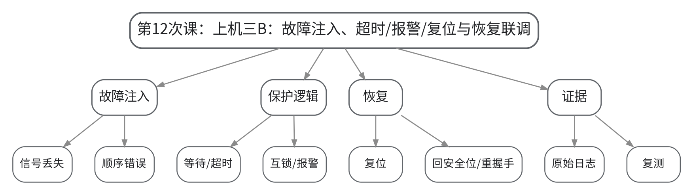

#### 教学目标

**知识目标：**
（1）理解信号丢失、顺序错误和互锁不满足时程序应进入的安全状态。
（2）理解超时、报警、复位和异常恢复的功能边界。

**能力目标：**
（1）能够设计并执行至少两种I/O故障注入。
（2）能够按“现象—证据—定位—处置—复测”完成联调记录。

**价值目标：**
（1）形成不掩盖故障、不越权处置、恢复后必须复测的工程责任意识。

#### 课程思政

（1）要求保留原始报警和失败过程，禁止强制伪造信号掩盖问题；明确学生练习范围与现场专业维护权限。
（2）结合本次课中的错误配置、状态异常或安全边界讨论，引导学生把规范、证据和责任落实到具体操作与文档中。

#### 专创融合

把故障注入当作工作站验收测试设计，训练面向异常的可靠性工程思维。

#### 教学重难点

**教学重点**：故障注入、超时/报警、互锁验证、恢复流程与证据闭环。

**教学难点**：难点是区分“恢复信号”与“恢复安全条件”，避免为了继续运行直接强制置位信号。

#### 教学过程

| 教学步骤 | 主要教学内容 | 设计意图 |
|---|---|---|
| 课前任务 | 【教师】1. 发布本次课预习/上机准备要求，明确对应大纲单元、关键概念或操作边界； 2. 提醒学生检查上一课形成的程序、坐标、接口表或模型，记录不理解的问题。 【学生】1. 完成对应教材/资料预习并整理疑问； 2. 准备本次课需要的文件、图表或操作条件，带着问题进入课堂。 | 通过课前准备建立前后课次衔接，让学生提前识别概念、文件和安全条件，减少课堂中无目标操作。 |
| 互动导入（10 min） | 【教师】1. 复习与本次课直接相关的上一环节关键结论； 2. 故意让夹具到位信号永久不返回，观察程序无限等待；再加入超时报警，让学生比较可诊断性。 3. 追问学生本次课需要解决的工程问题。 【学生】参与问答、观察案例/现象，明确本次课任务目标和验收依据。 | 从具体工作站现象或故障切入，把抽象知识转化为待解决的工程问题，形成学习动机。 |
| 传授新知（共70 min） | 1、故障计划（10 min） 【教师】分配信号丢失、顺序错误、互锁不满足等故障，要求预先写出预期行为。 【学生】建立故障注入表和安全前提。 2、超时/报警实现（20 min） 【教师】指导等待条件、计时/超时和报警信息设计。 【学生】完成至少一个可复现超时报警。 3、复位与异常恢复（25 min） 【教师】强调复位不等于自动继续，指导安全位、重新握手和人工确认。 【学生】实现并验证恢复流程。 4、复测与证据闭环（15 min） 【教师】按“现象—证据—定位—处置—复测”检查记录。 【学生】提交原始日志/截图与修复后复测证据。 【课堂强化】围绕本次课重点对错误配置、边界条件或替代方案进行一次对照分析，要求学生说明“为什么这样做、错了会出现什么现象、如何验证”。 | 按“概念/任务→结构或程序→验证→工程应用”的逻辑推进，并用状态、轨迹、日志或仿真结果支撑理解，避免只记操作步骤。 |
| 过关检测（10 min） | 【教师】布置课堂检测/操作核验： 1. 【选择题】故障恢复时最不允许的做法是（ ）。A. 确认安全条件 B. 强制伪造到位信号以继续运行 C. 回安全位 D. 复测 2. 【判断题】报警复位成功即可证明故障根因已经消失。（ ） 3. 【操作核验】现场复现一个故障，说明证据、根因、处置和复测。 【学生】独立作答或完成操作，同伴互查关键依据。 【教师】根据作答/运行结果集中点评重难点与安全边界。 | 及时检验学生能否把本次课知识转化为判断、操作和解释，针对易错点形成当堂纠偏。 |
| 课堂小结（5 min） | 【教师】简要总结： 1. 本次课解决的关键问题是：故障注入、超时/报警、互锁验证、恢复流程与证据闭环。 2. 需要重点掌握的主线是：上机三B：故障注入、超时/报警/复位与恢复联调。 3. 最值得带走的方法是：先明确边界/状态，再执行操作，并用可复核证据验证。 4. 需要警惕的易错点是：难点是区分“恢复信号”与“恢复安全条件”，避免为了继续运行直接强制置位信号。 【学生】按主线回顾并补齐个人笔记。 | 用“关键问题—主线—方法—易错点”收束本课，帮助学生形成可迁移的工作站工程思维。 |
| 作业布置（3 min） | 【教师】布置课后任务： 1. 提交上机三最终成果：点表、时序图、故障注入记录、报警/恢复逻辑、复测证据。 2. 整理“哪些故障允许程序恢复、哪些必须停机/人工确认”的边界表。 【要求】不只提交结果，还要写出关键思路、参数/版本变化和验证依据；上机成果须保留真实日志或截图。 | 通过延伸任务巩固本次课知识，并为下一次课的坐标、程序、接口或综合仿真准备可直接复用的材料。 |
| 考勤（2 min） | 【教师】利用学习通/课堂点名完成签到；上机课同步核对分组与设备/软件使用情况。 | 掌握出勤与上机组织情况，保障教学秩序和安全管理。 |

#### 教学反思

【教师】课后重点从以下方面进行教学反思：
1. 教学流程：检查本次课由“上机三B：故障注入、超时/报警/复位与恢复联调”问题情境进入任务后，学生是否能按安全/工程逻辑逐层推进，而不是直接模仿操作。
2. 教学内容：复核“故障注入、超时/报警、互锁验证、恢复流程与证据闭环。”是否讲清，尤其关注学生是否能解释“为什么这样做、错了会出现什么现象、如何验证”。
3. 学生参与：观察是否存在“会看不会做”“会做不会说”或个别学生只依赖小组成果的情况；上机课重点核查个人对坐标、程序、I/O和验证证据的解释能力。
4. 教学改进：根据过关检测和运行证据决定是否增加错例、轨迹回放、接口时序、故障注入或低速验证演示；不预填真实课堂表现。

### lesson-13

| 字段 | 内容 | 状态 | source_id |
|---|---|---|---|
| 章节 | 第四单元 离线编程、典型工作站与运行维护 | derived | S1 |
| 授课题目 | 离线编程流程、模型布局、路径规划与碰撞/奇异检查 | derived | S1 |
| 周次 | 第13次课（Word中按实际课表填写） | to_confirm |  |
| 课时安排 | 2课时（100 min）；类型：理论2 | derived | S1 |
| 知识脉络图 | images/lesson-13-knowledge-map.png | derived | S1 |
| 教学方法 | 讲授法、问答法、案例分析法、程序阅读法、分组研讨法 | derived | S1 |
| 教学用具 | 电脑、投影仪、多媒体课件、教材、离线仿真平台演示、碰撞/轴限位案例。 | derived | S1 |
| 教学设计 | 课前任务→互动导入（10 min）→传授新知（70 min）→过关检测（10 min）→课堂小结（5 min）→作业布置（3 min）→考勤（2 min） | derived | S1 |
| 参考文献 | [1] 张小刚、方遒.《工业机器人系统综合设计》[M]. 北京：机械工业出版社，2025.；[3] 朱洪雷、代慧.《工业机器人离线编程（ABB）（第2版）》[M]. 北京：高等教育出版社，2024.；[4] 倪寿勇.《工业机器人离线编程与仿真》[M]. 北京：高等教育出版社，2024. | provided | S1 |

#### 知识脉络图

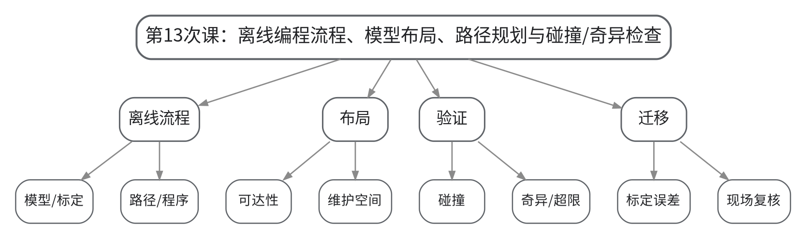

#### 教学目标

**知识目标：**
（1）理解离线编程从模型准备、坐标/工具配置、路径生成到程序输出的基本流程。
（2）掌握碰撞、不可达、奇异和轴限位等常见仿真问题的含义。
（3）理解离线仿真与真实工作站之间存在模型、标定和控制差异。

**能力目标：**
（1）能够阅读离线工作站并识别布局/路径的典型问题。
（2）能够提出碰撞、不可达或奇异问题的基本修正思路。

**价值目标：**
（1）形成“仿真是验证工具，不是现场安全替代品”的工具边界意识。

#### 课程思政

（1）通过“仿真可行但现场不安全”的反例明确工具边界和现场复核责任，避免对软件结果产生不当依赖。
（2）结合本次课中的错误配置、状态异常或安全边界讨论，引导学生把规范、证据和责任落实到具体操作与文档中。

#### 专创融合

探索离线编程在柔性产线换型、方案评审和虚拟调试中的价值，比较其与现场示教的时间成本。

#### 教学重难点

**教学重点**：离线编程流程、布局、路径、碰撞/奇异/超限检查、虚实迁移边界。

**教学难点**：难点是理解“仿真可行”仅证明模型条件下可行，真实设备仍需标定、安全和低速复核。

#### 教学过程

| 教学步骤 | 主要教学内容 | 设计意图 |
|---|---|---|
| 课前任务 | 【教师】1. 发布本次课预习/上机准备要求，明确对应大纲单元、关键概念或操作边界； 2. 提醒学生检查上一课形成的程序、坐标、接口表或模型，记录不理解的问题。 【学生】1. 完成对应教材/资料预习并整理疑问； 2. 准备本次课需要的文件、图表或操作条件，带着问题进入课堂。 | 通过课前准备建立前后课次衔接，让学生提前识别概念、文件和安全条件，减少课堂中无目标操作。 |
| 互动导入（10 min） | 【教师】1. 复习与本次课直接相关的上一环节关键结论； 2. 展示一段仿真中完全无碰撞的路径，再把工具实际长度增加50 mm，说明现场可能出现的差异，引出虚实迁移误差。 3. 追问学生本次课需要解决的工程问题。 【学生】参与问答、观察案例/现象，明确本次课任务目标和验收依据。 | 从具体工作站现象或故障切入，把抽象知识转化为待解决的工程问题，形成学习动机。 |
| 传授新知（共70 min） | 1、离线编程基本流程（15 min） 【教师】梳理模型导入、工具/工件配置、路径生成、程序生成/导出、现场校准和验证。 【学生】绘制离线编程流程图。 2、布局与可达性（15 min） 【教师】说明机器人基座、工装、维护空间和工作空间之间的关系。 【学生】判断三个布局方案的可达性与维护问题。 3、碰撞/奇异/超限（25 min） 【教师】演示碰撞检测、轴限位、奇异姿态和不可达报警，比较根因。 【学生】为每类问题提出至少一种修正路径。 4、虚实迁移边界（15 min） 【教师】讲解模型误差、TCP/工件标定误差、真实电缆/防护和安全装置差异。 【学生】完成现场迁移前复核清单。 【课堂强化】围绕本次课重点对错误配置、边界条件或替代方案进行一次对照分析，要求学生说明“为什么这样做、错了会出现什么现象、如何验证”。 | 按“概念/任务→结构或程序→验证→工程应用”的逻辑推进，并用状态、轨迹、日志或仿真结果支撑理解，避免只记操作步骤。 |
| 过关检测（10 min） | 【教师】布置课堂检测/操作核验： 1. 【选择题】离线仿真路径无碰撞后，现场首次验证仍应采用（ ）。A. 直接高速自动 B. 单步/低速并确认实际安全 C. 关闭互锁 D. 不需复核 2. 【判断题】数字模型与真实工作站完全一致，因此离线仿真结果可以直接视为现场安全结论。（ ） 3. 【简答题】说明离线程序迁移到真实机器人前必须复核的至少5项内容。 【学生】独立作答或完成操作，同伴互查关键依据。 【教师】根据作答/运行结果集中点评重难点与安全边界。 | 及时检验学生能否把本次课知识转化为判断、操作和解释，针对易错点形成当堂纠偏。 |
| 课堂小结（5 min） | 【教师】简要总结： 1. 本次课解决的关键问题是：离线编程流程、布局、路径、碰撞/奇异/超限检查、虚实迁移边界。 2. 需要重点掌握的主线是：离线编程流程、模型布局、路径规划与碰撞/奇异检查。 3. 最值得带走的方法是：先明确边界/状态，再执行操作，并用可复核证据验证。 4. 需要警惕的易错点是：难点是理解“仿真可行”仅证明模型条件下可行，真实设备仍需标定、安全和低速复核。 【学生】按主线回顾并补齐个人笔记。 | 用“关键问题—主线—方法—易错点”收束本课，帮助学生形成可迁移的工作站工程思维。 |
| 作业布置（3 min） | 【教师】布置课后任务： 1. 针对一个离线工作站，列出可能导致“仿真正常、现场异常”的6类误差来源。 2. 预习节拍分析、程序备份和报警维护流程。 【要求】不只提交结果，还要写出关键思路、参数/版本变化和验证依据；上机成果须保留真实日志或截图。 | 通过延伸任务巩固本次课知识，并为下一次课的坐标、程序、接口或综合仿真准备可直接复用的材料。 |
| 考勤（2 min） | 【教师】利用学习通/课堂点名完成签到；上机课同步核对分组与设备/软件使用情况。 | 掌握出勤与上机组织情况，保障教学秩序和安全管理。 |

#### 教学反思

【教师】课后重点从以下方面进行教学反思：
1. 教学流程：检查本次课由“离线编程流程、模型布局、路径规划与碰撞/奇异检查”问题情境进入任务后，学生是否能按安全/工程逻辑逐层推进，而不是直接模仿操作。
2. 教学内容：复核“离线编程流程、布局、路径、碰撞/奇异/超限检查、虚实迁移边界。”是否讲清，尤其关注学生是否能解释“为什么这样做、错了会出现什么现象、如何验证”。
3. 学生参与：观察是否存在“会看不会做”“会做不会说”或个别学生只依赖小组成果的情况；上机课重点核查个人对坐标、程序、I/O和验证证据的解释能力。
4. 教学改进：根据过关检测和运行证据决定是否增加错例、轨迹回放、接口时序、故障注入或低速验证演示；不预填真实课堂表现。

### lesson-14

| 字段 | 内容 | 状态 | source_id |
|---|---|---|---|
| 章节 | 第四单元 离线编程、典型工作站与运行维护 | derived | S1 |
| 授课题目 | 节拍分析、虚实迁移、典型工作站与调试维护 | derived | S1 |
| 周次 | 第14次课（Word中按实际课表填写） | to_confirm |  |
| 课时安排 | 2课时（100 min）；类型：理论2 | derived | S1 |
| 知识脉络图 | images/lesson-14-knowledge-map.png | derived | S1 |
| 教学方法 | 讲授法、问答法、案例分析法、程序阅读法、分组研讨法 | derived | S1 |
| 教学用具 | 电脑、投影仪、多媒体课件、教材、报警日志样例、I/O状态截图、点检表、备份清单。 | derived | S1 |
| 教学设计 | 课前任务→互动导入（10 min）→传授新知（70 min）→过关检测（10 min）→课堂小结（5 min）→作业布置（3 min）→考勤（2 min） | derived | S1 |
| 参考文献 | [1] 张小刚、方遒.《工业机器人系统综合设计》[M]. 北京：机械工业出版社，2025.；[5] 北京华航唯实机器人科技股份有限公司、李金亮、张明奎.《工业机器人系统集成》[M]. 北京：机械工业出版社，2025.；[6] 谭志彬.《工业机器人操作与运维实训（初级）》[M]. 北京：电子工业出版社，2024. | provided | S1 |

#### 知识脉络图

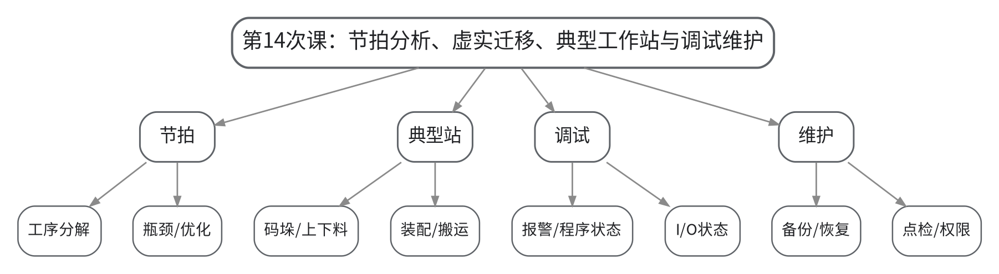

#### 教学目标

**知识目标：**
（1）理解节拍分析、路径/速度优化和工序瓶颈的基本方法。
（2）熟悉搬运、码垛、上下料、装配等典型工作站的基本工艺链。
（3）理解程序备份、报警日志、点检维护和基本恢复流程。

**能力目标：**
（1）能够从报警、程序状态、I/O状态和点检结果形成基本故障分析路径。
（2）能够设计工作站备份/恢复和日常点检清单。

**价值目标：**
（1）形成规范运维、诚实记录和不越权处置的职业责任意识。

#### 课程思政

（1）通过报警误处置和越权维护案例强调安全标准、运维权限和原始证据保留，培养诚实记录与持续改进意识。
（2）结合本次课中的错误配置、状态异常或安全边界讨论，引导学生把规范、证据和责任落实到具体操作与文档中。

#### 专创融合

围绕远程运维、日志分析和预测性维护，思考如何把机器人运行数据转化为维护决策信息。

#### 教学重难点

**教学重点**：节拍与瓶颈、典型工作站、报警诊断、备份恢复、点检维护。

**教学难点**：难点是把故障现象与程序、I/O、设备状态证据关联起来，并在权限边界内选择处置策略。

#### 教学过程

| 教学步骤 | 主要教学内容 | 设计意图 |
|---|---|---|
| 课前任务 | 【教师】1. 发布本次课预习/上机准备要求，明确对应大纲单元、关键概念或操作边界； 2. 提醒学生检查上一课形成的程序、坐标、接口表或模型，记录不理解的问题。 【学生】1. 完成对应教材/资料预习并整理疑问； 2. 准备本次课需要的文件、图表或操作条件，带着问题进入课堂。 | 通过课前准备建立前后课次衔接，让学生提前识别概念、文件和安全条件，减少课堂中无目标操作。 |
| 互动导入（10 min） | 【教师】1. 复习与本次课直接相关的上一环节关键结论； 2. 给出“机器人停在等待点、无碰撞报警”的案例，仅提供程序行号和I/O状态，要求学生判断应先查程序、信号还是机械故障。 3. 追问学生本次课需要解决的工程问题。 【学生】参与问答、观察案例/现象，明确本次课任务目标和验收依据。 | 从具体工作站现象或故障切入，把抽象知识转化为待解决的工程问题，形成学习动机。 |
| 传授新知（共70 min） | 1、节拍分析与瓶颈（15 min） 【教师】讲解节拍分解、等待时间、空程时间和瓶颈识别。 【学生】从时序数据中找到主要等待阶段。 2、典型工作站工艺链（15 min） 【教师】比较搬运、码垛、上下料和装配的关键动作/接口差异。 【学生】为一种工作站画工艺流程。 3、报警与基本调试（20 min） 【教师】用“现象—证据—定位—处置—复测”讲解报警、程序状态和I/O状态联合判断。 【学生】分析两组报警/状态样例。 4、备份恢复与点检维护（20 min） 【教师】说明程序/配置备份、版本管理、恢复、日常点检与专业维护边界。 【学生】完成备份清单和点检表。 【课堂强化】围绕本次课重点对错误配置、边界条件或替代方案进行一次对照分析，要求学生说明“为什么这样做、错了会出现什么现象、如何验证”。 | 按“概念/任务→结构或程序→验证→工程应用”的逻辑推进，并用状态、轨迹、日志或仿真结果支撑理解，避免只记操作步骤。 |
| 过关检测（10 min） | 【教师】布置课堂检测/操作核验： 1. 【选择题】机器人停在等待指令且对应输入一直未满足时，首先应检查（ ）。A. 对应I/O状态与外围设备 B. 随意改坐标 C. 强制自动 D. 删除等待指令 2. 【判断题】为了尽快恢复生产，学生/操作人员可以对任何机器人控制柜内部故障自行拆机维修。（ ） 3. 【简答题】说明“现象—证据—定位—处置—复测”故障分析流程各环节的作用。 【学生】独立作答或完成操作，同伴互查关键依据。 【教师】根据作答/运行结果集中点评重难点与安全边界。 | 及时检验学生能否把本次课知识转化为判断、操作和解释，针对易错点形成当堂纠偏。 |
| 课堂小结（5 min） | 【教师】简要总结： 1. 本次课解决的关键问题是：节拍与瓶颈、典型工作站、报警诊断、备份恢复、点检维护。 2. 需要重点掌握的主线是：节拍分析、虚实迁移、典型工作站与调试维护。 3. 最值得带走的方法是：先明确边界/状态，再执行操作，并用可复核证据验证。 4. 需要警惕的易错点是：难点是把故障现象与程序、I/O、设备状态证据关联起来，并在权限边界内选择处置策略。 【学生】按主线回顾并补齐个人笔记。 | 用“关键问题—主线—方法—易错点”收束本课，帮助学生形成可迁移的工作站工程思维。 |
| 作业布置（3 min） | 【教师】布置课后任务： 1. 完成一个典型工作站的“工艺流程—关键I/O—主要风险—日常点检”一页表。 2. 设计程序/配置备份策略：文件范围、命名、版本、恢复前检查与恢复后复测。 【要求】不只提交结果，还要写出关键思路、参数/版本变化和验证依据；上机成果须保留真实日志或截图。 | 通过延伸任务巩固本次课知识，并为下一次课的坐标、程序、接口或综合仿真准备可直接复用的材料。 |
| 考勤（2 min） | 【教师】利用学习通/课堂点名完成签到；上机课同步核对分组与设备/软件使用情况。 | 掌握出勤与上机组织情况，保障教学秩序和安全管理。 |

#### 教学反思

【教师】课后重点从以下方面进行教学反思：
1. 教学流程：检查本次课由“节拍分析、虚实迁移、典型工作站与调试维护”问题情境进入任务后，学生是否能按安全/工程逻辑逐层推进，而不是直接模仿操作。
2. 教学内容：复核“节拍与瓶颈、典型工作站、报警诊断、备份恢复、点检维护。”是否讲清，尤其关注学生是否能解释“为什么这样做、错了会出现什么现象、如何验证”。
3. 学生参与：观察是否存在“会看不会做”“会做不会说”或个别学生只依赖小组成果的情况；上机课重点核查个人对坐标、程序、I/O和验证证据的解释能力。
4. 教学改进：根据过关检测和运行证据决定是否增加错例、轨迹回放、接口时序、故障注入或低速验证演示；不预填真实课堂表现。

### lesson-15

| 字段 | 内容 | 状态 | source_id |
|---|---|---|---|
| 章节 | 上机四 离线工作站综合仿真与运维验收 | derived | S1 |
| 授课题目 | 上机四A：综合工作站搭建、路径规划、碰撞与节拍优化 | derived | S1 |
| 周次 | 第15次课（Word中按实际课表填写） | to_confirm |  |
| 课时安排 | 2课时（100 min）；类型：上机2 | derived | S1 |
| 知识脉络图 | images/lesson-15-knowledge-map.png | derived | S1 |
| 教学方法 | 任务驱动法、示范教学法、实操演练法、故障注入法、同伴评审法 | derived | S1 |
| 教学用具 | 机房、离线仿真平台、综合工作站模型库、碰撞/节拍工具、版本记录模板。 | derived | S1 |
| 教学设计 | 课前任务→互动导入（10 min）→传授新知（70 min）→过关检测（10 min）→课堂小结（5 min）→作业布置（3 min）→考勤（2 min） | derived | S1 |
| 参考文献 | [1] 张小刚、方遒.《工业机器人系统综合设计》[M]. 北京：机械工业出版社，2025.；[3] 朱洪雷、代慧.《工业机器人离线编程（ABB）（第2版）》[M]. 北京：高等教育出版社，2024.；[4] 倪寿勇.《工业机器人离线编程与仿真》[M]. 北京：高等教育出版社，2024.；[5] 北京华航唯实机器人科技股份有限公司、李金亮、张明奎.《工业机器人系统集成》[M]. 北京：机械工业出版社，2025. | provided | S1 |

#### 知识脉络图

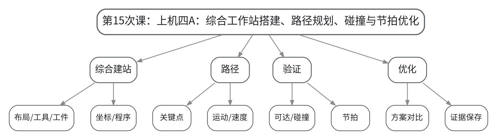

#### 教学目标

**知识目标：**
（1）理解综合工作站中布局、坐标、程序、接口与路径验证之间的依赖关系。
（2）理解碰撞/可达性和节拍是综合方案验收的核心证据。

**能力目标：**
（1）能够完成搬运、码垛、上下料或装配工作站的综合离线仿真。
（2）能够提出并验证至少一次节拍或路径优化。

**价值目标：**
（1）形成多目标工程优化和全过程证据留存意识。

#### 课程思政

（1）强调仿真优化必须在安全约束内进行，版本和运行证据不得事后补造或覆盖，保持工程交付可追溯。
（2）结合本次课中的错误配置、状态异常或安全边界讨论，引导学生把规范、证据和责任落实到具体操作与文档中。

#### 专创融合

把综合工作站作为可展示的小型系统集成原型，训练方案比较、虚拟调试和工程文档化能力。

#### 教学重难点

**教学重点**：综合工作站、路径规划、碰撞/可达性检查、节拍优化与版本对比。

**教学难点**：难点是整合前序坐标、程序、I/O和仿真知识，同时保持安全条件与版本可追踪。

#### 教学过程

| 教学步骤 | 主要教学内容 | 设计意图 |
|---|---|---|
| 课前任务 | 【教师】1. 发布本次课预习/上机准备要求，明确对应大纲单元、关键概念或操作边界； 2. 提醒学生检查上一课形成的程序、坐标、接口表或模型，记录不理解的问题。 【学生】1. 完成对应教材/资料预习并整理疑问； 2. 准备本次课需要的文件、图表或操作条件，带着问题进入课堂。 | 通过课前准备建立前后课次衔接，让学生提前识别概念、文件和安全条件，减少课堂中无目标操作。 |
| 互动导入（10 min） | 【教师】1. 复习与本次课直接相关的上一环节关键结论； 2. 发布期末综合项目情境：在指定设备/工件约束下完成一种工业机器人工作站，要求学生先冻结需求和安全边界，再开始建模。 3. 追问学生本次课需要解决的工程问题。 【学生】参与问答、观察案例/现象，明确本次课任务目标和验收依据。 | 从具体工作站现象或故障切入，把抽象知识转化为待解决的工程问题，形成学习动机。 |
| 传授新知（共70 min） | 1、需求/布局冻结（10 min） 【教师】明确综合任务、交付清单和期末考核核验方式。 【学生】确认任务、设备、布局、风险和接口范围。 2、综合建站与程序（25 min） 【教师】巡回检查工具/工件、坐标、点位、程序结构和必要I/O。 【学生】完成基本可运行工作站版本V1。 3、碰撞/可达性/节拍检查（20 min） 【教师】要求学生按统一口径形成碰撞、可达性和节拍证据。 【学生】记录V1问题和基线数据。 4、优化与版本对比（15 min） 【教师】指导从布局、路径、速度或等待逻辑中选择一个优化点。 【学生】形成V2并输出前后对比证据。 【课堂强化】围绕本次课重点对错误配置、边界条件或替代方案进行一次对照分析，要求学生说明“为什么这样做、错了会出现什么现象、如何验证”。 | 按“概念/任务→结构或程序→验证→工程应用”的逻辑推进，并用状态、轨迹、日志或仿真结果支撑理解，避免只记操作步骤。 |
| 过关检测（10 min） | 【教师】布置课堂检测/操作核验： 1. 【选择题】综合工作站优化前首先应建立（ ）。A. 可复核基线与约束 B. 最高速度 C. 最少文件 D. 最多截图 2. 【判断题】为了节省时间，可以在修改V2后覆盖V1，不保留基线版本。（ ） 3. 【操作核验】展示V1与V2的关键差异，并说明碰撞/节拍验证证据。 【学生】独立作答或完成操作，同伴互查关键依据。 【教师】根据作答/运行结果集中点评重难点与安全边界。 | 及时检验学生能否把本次课知识转化为判断、操作和解释，针对易错点形成当堂纠偏。 |
| 课堂小结（5 min） | 【教师】简要总结： 1. 本次课解决的关键问题是：综合工作站、路径规划、碰撞/可达性检查、节拍优化与版本对比。 2. 需要重点掌握的主线是：上机四A：综合工作站搭建、路径规划、碰撞与节拍优化。 3. 最值得带走的方法是：先明确边界/状态，再执行操作，并用可复核证据验证。 4. 需要警惕的易错点是：难点是整合前序坐标、程序、I/O和仿真知识，同时保持安全条件与版本可追踪。 【学生】按主线回顾并补齐个人笔记。 | 用“关键问题—主线—方法—易错点”收束本课，帮助学生形成可迁移的工作站工程思维。 |
| 作业布置（3 min） | 【教师】布置课后任务： 1. 整理V1/V2模型、程序、参数、碰撞/可达性和节拍证据。 2. 准备下一次运维验收所需报警、备份、点检和工程交付材料。 【要求】不只提交结果，还要写出关键思路、参数/版本变化和验证依据；上机成果须保留真实日志或截图。 | 通过延伸任务巩固本次课知识，并为下一次课的坐标、程序、接口或综合仿真准备可直接复用的材料。 |
| 考勤（2 min） | 【教师】利用学习通/课堂点名完成签到；上机课同步核对分组与设备/软件使用情况。 | 掌握出勤与上机组织情况，保障教学秩序和安全管理。 |

#### 教学反思

【教师】课后重点从以下方面进行教学反思：
1. 教学流程：检查本次课由“上机四A：综合工作站搭建、路径规划、碰撞与节拍优化”问题情境进入任务后，学生是否能按安全/工程逻辑逐层推进，而不是直接模仿操作。
2. 教学内容：复核“综合工作站、路径规划、碰撞/可达性检查、节拍优化与版本对比。”是否讲清，尤其关注学生是否能解释“为什么这样做、错了会出现什么现象、如何验证”。
3. 学生参与：观察是否存在“会看不会做”“会做不会说”或个别学生只依赖小组成果的情况；上机课重点核查个人对坐标、程序、I/O和验证证据的解释能力。
4. 教学改进：根据过关检测和运行证据决定是否增加错例、轨迹回放、接口时序、故障注入或低速验证演示；不预填真实课堂表现。

### lesson-16

| 字段 | 内容 | 状态 | source_id |
|---|---|---|---|
| 章节 | 上机四 离线工作站综合仿真与运维验收 | derived | S1 |
| 授课题目 | 上机四B：报警诊断、备份恢复、运维验收与工程交付 | derived | S1 |
| 周次 | 第16次课（Word中按实际课表填写） | to_confirm |  |
| 课时安排 | 2课时（100 min）；类型：上机2 | derived | S1 |
| 知识脉络图 | images/lesson-16-knowledge-map.png | derived | S1 |
| 教学方法 | 任务驱动法、示范教学法、实操演练法、故障注入法、同伴评审法 | derived | S1 |
| 教学用具 | 机房、离线仿真平台、日志/备份工具、验收检查表、工程交付模板。 | derived | S1 |
| 教学设计 | 课前任务→互动导入（10 min）→传授新知（70 min）→过关检测（10 min）→课堂小结（5 min）→作业布置（3 min）→考勤（2 min） | derived | S1 |
| 参考文献 | [1] 张小刚、方遒.《工业机器人系统综合设计》[M]. 北京：机械工业出版社，2025.；[5] 北京华航唯实机器人科技股份有限公司、李金亮、张明奎.《工业机器人系统集成》[M]. 北京：机械工业出版社，2025.；[6] 谭志彬.《工业机器人操作与运维实训（初级）》[M]. 北京：电子工业出版社，2024. | provided | S1 |

#### 知识脉络图

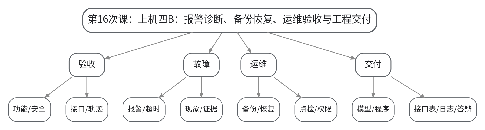

#### 教学目标

**知识目标：**
（1）理解综合工作站验收、报警诊断、备份恢复和点检维护的基本流程。
（2）理解期末综合项目需要同时提交工作站成果和个人解释/核验。

**能力目标：**
（1）能够执行一项故障注入并按证据闭环完成诊断与复测。
（2）能够整理模型、程序、参数、I/O点表、时序图、日志、截图和版本记录形成工程交付。

**价值目标：**
（1）形成规范运维、诚实记录、个人能够独立解释本人工作和不越权处置的职业素养。

#### 课程思政

（1）严格保留原始报警、故障注入和修复证据，不补造运行记录；明确学生能处理的调试范围与专业维护权限，强调个人核验的诚信责任。
（2）结合本次课中的错误配置、状态异常或安全边界讨论，引导学生把规范、证据和责任落实到具体操作与文档中。

#### 专创融合

把最终交付视为小型系统集成项目，训练工程验收、技术答辩、配置管理和可维护性设计。

#### 教学重难点

**教学重点**：综合验收、故障诊断、备份恢复、点检维护、工程交付与个人核验。

**教学难点**：难点是把“项目能运行”提升为“证据完整、异常可诊断、可恢复、可维护、个人可解释”的工程交付。

#### 教学过程

| 教学步骤 | 主要教学内容 | 设计意图 |
|---|---|---|
| 课前任务 | 【教师】1. 发布本次课预习/上机准备要求，明确对应大纲单元、关键概念或操作边界； 2. 提醒学生检查上一课形成的程序、坐标、接口表或模型，记录不理解的问题。 【学生】1. 完成对应教材/资料预习并整理疑问； 2. 准备本次课需要的文件、图表或操作条件，带着问题进入课堂。 | 通过课前准备建立前后课次衔接，让学生提前识别概念、文件和安全条件，减少课堂中无目标操作。 |
| 互动导入（10 min） | 【教师】1. 复习与本次课直接相关的上一环节关键结论； 2. 教师设置一个随机故障（I/O未满足、超时、坐标偏移或程序状态异常），要求学生不得先改程序，而是先按证据链定位。 3. 追问学生本次课需要解决的工程问题。 【学生】参与问答、观察案例/现象，明确本次课任务目标和验收依据。 | 从具体工作站现象或故障切入，把抽象知识转化为待解决的工程问题，形成学习动机。 |
| 传授新知（共70 min） | 1、综合功能与安全验收（15 min） 【教师】按安全边界、坐标、轨迹、程序、I/O和碰撞/节拍检查表逐项验收。 【学生】修正未通过项并保留复测证据。 2、故障注入与诊断（20 min） 【教师】随机注入一项故障，要求使用报警、程序状态和I/O证据定位。 【学生】按“现象—证据—定位—处置—复测”完成记录。 3、备份恢复与点检（15 min） 【教师】检查程序/配置备份、恢复前后检查和点检维护清单。 【学生】完成备份包与恢复验证。 4、工程交付与个人核验（20 min） 【教师】按期末考核要求检查模型、程序、参数、点表、时序、日志、截图、测试与版本记录，并进行随机口头/现场修改核验。 【学生】独立解释本人方案，完成指定小修改或故障判断。 【课堂强化】围绕本次课重点对错误配置、边界条件或替代方案进行一次对照分析，要求学生说明“为什么这样做、错了会出现什么现象、如何验证”。 | 按“概念/任务→结构或程序→验证→工程应用”的逻辑推进，并用状态、轨迹、日志或仿真结果支撑理解，避免只记操作步骤。 |
| 过关检测（10 min） | 【教师】布置课堂检测/操作核验： 1. 【选择题】工程验收时最能证明“修复有效”的证据是（ ）。A. 只说已经修好 B. 修复后按同一条件复测通过 C. 删除报警记录 D. 改截图名称 2. 【判断题】只要小组项目运行成功，个人无需解释坐标、程序、I/O或安全逻辑。（ ） 3. 【操作核验】现场完成一个参数/程序/接口小修改，并说明修改前置安全条件和复测方法。 【学生】独立作答或完成操作，同伴互查关键依据。 【教师】根据作答/运行结果集中点评重难点与安全边界。 | 及时检验学生能否把本次课知识转化为判断、操作和解释，针对易错点形成当堂纠偏。 |
| 课堂小结（5 min） | 【教师】简要总结： 1. 本次课解决的关键问题是：综合验收、故障诊断、备份恢复、点检维护、工程交付与个人核验。 2. 需要重点掌握的主线是：上机四B：报警诊断、备份恢复、运维验收与工程交付。 3. 最值得带走的方法是：先明确边界/状态，再执行操作，并用可复核证据验证。 4. 需要警惕的易错点是：难点是把“项目能运行”提升为“证据完整、异常可诊断、可恢复、可维护、个人可解释”的工程交付。 【学生】按主线回顾并补齐个人笔记。 | 用“关键问题—主线—方法—易错点”收束本课，帮助学生形成可迁移的工作站工程思维。 |
| 作业布置（3 min） | 【教师】布置课后任务： 1. 完成上机四与期末综合项目交付包自检：模型、程序、参数、I/O点表、时序图、碰撞/节拍证据、故障/运维记录、版本说明。 2. 整理个人答辩提纲：任务、关键设计、一个失败案例、一次优化、一个安全边界。 【要求】不只提交结果，还要写出关键思路、参数/版本变化和验证依据；上机成果须保留真实日志或截图。 | 通过延伸任务巩固本次课知识，并为下一次课的坐标、程序、接口或综合仿真准备可直接复用的材料。 |
| 考勤（2 min） | 【教师】利用学习通/课堂点名完成签到；上机课同步核对分组与设备/软件使用情况。 | 掌握出勤与上机组织情况，保障教学秩序和安全管理。 |

#### 教学反思

【教师】课后重点从以下方面进行教学反思：
1. 教学流程：检查本次课由“上机四B：报警诊断、备份恢复、运维验收与工程交付”问题情境进入任务后，学生是否能按安全/工程逻辑逐层推进，而不是直接模仿操作。
2. 教学内容：复核“综合验收、故障诊断、备份恢复、点检维护、工程交付与个人核验。”是否讲清，尤其关注学生是否能解释“为什么这样做、错了会出现什么现象、如何验证”。
3. 学生参与：观察是否存在“会看不会做”“会做不会说”或个别学生只依赖小组成果的情况；上机课重点核查个人对坐标、程序、I/O和验证证据的解释能力。
4. 教学改进：根据过关检测和运行证据决定是否增加错例、轨迹回放、接口时序、故障注入或低速验证演示；不预填真实课堂表现。

# 内部追踪区

## 版本与哈希

- `lesson_plan_version`：1
- official_syllabus_sha：`afece6c8ea150effb4f1a6fc09c2646d557d02f6`
- skill_sha：`23bc5a10e7881e8863ad993c74dabdc9faf24a4d`
- 最后物化时间：2026-09-07 09:48:16（容器时间）

## 变更建议

| proposal_id | 来源 | 建议 | 影响范围 | 状态 |
|---|---|---|---|---|
| P001 | 最终编译 | 用户本轮已要求生成Word；主讲教师、职称未提供，不虚构，Word封面保留“按实际填写”；具体周次保留“按实际课表填写”。 | 封面、各课次周次 | resolved_for_compilation |
