# 《工业网络技术及应用》教学设计（24次课）

## 课程基本信息

| 字段 | 内容 |
|---|---|
| 学院 | 计算机与信息技术学院 |
| 专业（教研室） | 智能制造工程 |
| 课程名称 | 工业网络技术及应用 |
| 课程名称（英文） | Industrial Network Technology and Applications |
| 课程代码 | 25JD32410 |
| 授课专业 | 智能制造工程 |
| 授课学期 | 第6学期 |
| 制定日期 | 2026年9月 |
| 课程类别 | 专业类 |
| 课程性质 | 选修 |
| 授课语言 | 中文 |
| 学分 | 3 |
| 总学时 | 48 |
| 理论学时 | 48 |
| 实验/上机学时 | 0 |
| 实习学时 | 0 |
| 其他学时 | 0 |
| 教材 | 邬贺铨, 于海斌, 杨善林.《工业互联网技术》[M]. 北京：机械工业出版社，2025. ISBN 9787111776352 |
| 授课学院 | 计算机与信息技术学院 |
| 先修课程 | 计算机网络（B）、PLC技术与应用、微机原理及接口技术 |
| 后续课程 | 先进装备系统设计与开发（ROS）、智能生产计划管理（MES/ERP）、毕业设计（论文） |
| 考核类型 | 考试课（ ）；考查课（√） |
| 考核形式 | 闭卷（ ）；开卷（ ）；笔试（ ）；机试（ ）；口试（ ）；其它（√，综合方案报告＋个人核验与答辩） |
| 考核方式 | 作业（√）；报告（√）；随堂测验（ ）；阶段测验（ ）；论文（ ）；设计（√）；作品（ ）；线上考试（ ）；线下考试（ ）；其它（√，过程记录＋个人核验） |
| 总评成绩比例 | 总评成绩=平时成绩×20%＋课程作业×20%＋期末考核×60% |

#### 课程简介

**课程基本定位**：本课程是智能制造工程专业的专业选修课，面向数字化车间和智能装备的网络互联与数据集成，建立“工业通信基础—现场总线—工业以太网—实时工业网络—信息互操作—网络诊断与安全”的知识主线。课程不重复普通计算机网络的通用原理，也不把某一厂商组态步骤作为唯一目标。

**学时组织**：总学时48，全部为理论学时。按6个单元各8学时组织为24次课×2课时（100 min）。抓包、仿真、组态、诊断工具均作为课堂演示、课内分析或课后学习证据，不增加实验、上机或项目式学时；涉及真实工业控制网络时只允许在授权环境或教师提供数据上进行。

**核心学习结果**：能够解释工业网络与办公网络在实时性、可靠性和运行环境方面的差异；识读工业网络拓扑、地址、端口、报文和数据点；比较Modbus、PROFINET、EtherCAT等协议机制与适用边界；说明OPC UA、MQTT和边缘网关在OT/IT融合中的作用；使用合规诊断证据分析通信故障并形成包含拓扑、协议、冗余、安全和验证的工业网络方案。

**主要教学方法**：原理讲授、协议报文解析、拓扑推演、教师提供抓包/诊断数据演示、案例研讨和方案评审相结合。每次课要求形成可检查的拓扑、接口表、报文标注、时序图、故障树或方案片段，推动“听懂协议”转化为“能解释、能验证、能设计”。

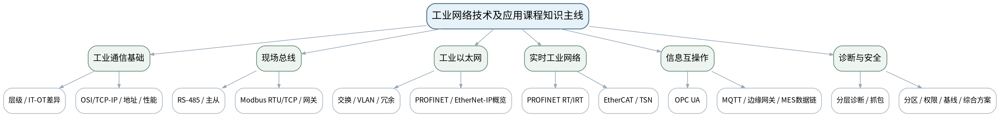

## 教学单元

### lesson-01

| 字段 | 内容 |
|---|---|
| 章节 | 第一单元 工业网络体系与通信基础 |
| 授课题目 | 工业网络层级、IT/OT差异与工程需求 |
| 周次 | 第1周（第1次课） |
| 课时安排 | 2课时（100 min）；类型：理论2 |
| 知识脉络图 | 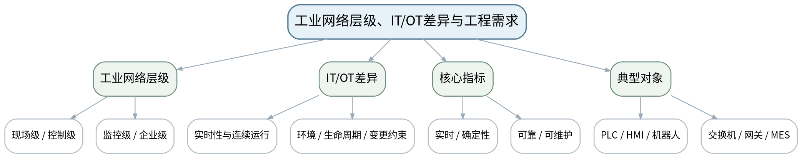 |
| 教学方法 | 讲授法、问答法、案例分析法、拓扑推演法、报文/时序分析法、方案评审法、课堂检测法 |
| 教学用具 | 电脑、投影仪、多媒体课件、教材、数字化车间拓扑图、典型设备图卡。 |
| 教学设计 | 课前任务→互动导入（10 min）→传授新知（70 min）→过关检测（10 min）→课堂小结（5 min）→作业布置（3 min）→考勤（2 min） |
| 参考文献 | [1] 邬贺铨, 于海斌, 杨善林.《工业互联网技术》[M]. 北京：机械工业出版社，2025。；[5] 刘科, 王峰.《工业网络及应用技术》[M]. 北京：高等教育出版社，2022。 |

#### 教学目标

**知识目标：**
（1）理解工业网络的现场级、控制级、监控级和企业级层次及主要对象。 （2）理解IT网络与OT网络在实时性、可靠性、运行环境、生命周期和变更方式方面的差异。

**能力目标：**
（1）能够识读一张数字化车间网络拓扑并标注设备所属层级。 （2）能够把“停线损失、同步要求、维护窗口”等业务条件转化为网络需求。

**价值目标：**
（1）形成以生产连续性和可验证指标定义网络方案的工程习惯。

#### 课程思政

（1）结合关键基础设施和生产停线案例，强调网络设计对人员、设备、质量和生产连续性的影响，形成“设计即责任”的意识。 （2）本课所有网络诊断、抓包、配置或仿真均强调合法授权、最小影响、真实记录与可恢复，不把未经授权的真实工业网络操作作为学习证据。

#### 专创融合

把需求卡作为工业网络方案最小需求文档，训练从设备互联需求到可验证网络指标的产品化思维。

#### 教学重难点

**教学重点**：工业网络层级与IT/OT差异；实时性、可靠性、可维护性等需求。

**教学难点**：把抽象“网络快/稳”转化为可讨论的业务指标和拓扑层级，而不是套用办公网络经验。

#### 教学过程

| 教学步骤 | 主要教学内容 | 设计意图 |
|---|---|---|
| 课前任务 | 【教师】1. 发布本课预习范围与一份最小拓扑/报文/接口材料； 2. 要求学生标出3个核心术语和1个疑问； 3. 提醒涉及抓包、诊断、配置的内容只使用教师提供数据或明确授权环境。 【学生】1. 阅读教材与教师材料； 2. 完成一个“先预测”问题； 3. 带着问题进入课堂。 | 通过课前预习与授权边界提醒，让学生建立先备认知并形成合规使用网络工具的意识。 |
| 互动导入（10 min） | 【教师】1. 复习与本课直接相关的上一课主线； 2. 展示两张拓扑：办公区互联网接入与机器人产线控制网络，提问“同样是以太网，为什么断网1秒的后果完全不同？” 3. 追问“现象能够证明什么、还不能证明什么？”。 【学生】先独立判断，再与同伴交换依据，明确本次课任务目标。 | 从真实工业网络现象切入，引发认知冲突，让学生先判断再学习机制。 |
| 传授新知（共70 min） | 一、工业网络层级 【教师】围绕传感器、远程I/O、PLC、HMI/SCADA、边缘网关、MES等对象讲清现场级—控制级—监控级—企业级的职责与数据流。 【学生】围绕本环节完成拓扑、报文、参数、时序或方案判断，先写预期结果，再对照教师演示/案例修正。 【课堂强化】要求每个结论附至少一条可观察证据或接口依据。  二、IT/OT差异 【教师】从实时性、确定性、可靠性、环境、生命周期、变更审批和生产连续性对比办公网络与工业网络。 【学生】围绕本环节完成拓扑、报文、参数、时序或方案判断，先写预期结果，再对照教师演示/案例修正。 【课堂强化】要求每个结论附至少一条可观察证据或接口依据。  三、需求推演 【教师】给出包装线、机器人工作站和设备远程维护三个场景，让学生写出网络对象、数据方向、关键指标和不能接受的失效后果。 【学生】围绕本环节完成拓扑、报文、参数、时序或方案判断，先写预期结果，再对照教师演示/案例修正。 【课堂强化】要求每个结论附至少一条可观察证据或接口依据。  【形成产物】一张“数字化车间网络层级与需求卡”。 【学习证据】拓扑标注图＋需求指标表＋课堂修订记录。 【评价映射】平时成绩；目标1.1、2.1、3.1。 | 按“概念/机制→数据流/时序→案例/方案→证据验证”展开，避免只记协议名，训练工程解释能力。 |
| 过关检测（10 min） | 【教师】布置课堂检测： 1. 工业网络为什么不能只用带宽评价？ 2. 现场级与企业级的数据对象有何不同？ 3. IT网络的常规变更为什么在OT网络中需要更严格审批？ 【学生】独立作答、同伴互查并标出依据； 【教师】根据错误类型集中点评并要求修正。 | 及时检验重难点，要求结论附依据，暴露地址、协议、性能和边界混淆。 |
| 课堂小结（5 min） | 【教师】1. 本次课解决的关键问题是：工业网络层级、IT/OT差异与工程需求； 2. 需要重点掌握的主线是：工业网络层级与IT/OT差异；实时性、可靠性、可维护性等需求。； 3. 最值得带走的方法是“分层/分角色/分数据流并以证据验证”； 4. 需要警惕的易错点是：把抽象“网络快/稳”转化为可讨论的业务指标和拓扑层级，而不是套用办公网络经验。 【学生】用1分钟写下“一条规则＋一条证据边界”。 | 回到知识脉络图压缩主线，形成可迁移的分层分析方法。 |
| 作业布置（3 min） | 【教师】1. 选一个智能制造设备/产线场景，画出至少四层的数据流，并列出3项最关键网络指标及理由。 【要求】不只写结论，还要写拓扑/接口/报文/参数依据和验证方法；涉及网络工具只在授权环境或教师提供数据上完成。 【学生】按课程命名规范整理提交。 | 固化拓扑、接口、报文或方案证据，衔接下一课并为课程作业/期末综合方案积累素材。 |
| 考勤（2 min） | 【教师】利用学习通/课堂点名完成签到；不在教案中预填出勤事实。 【学生】按课堂要求完成签到。 | 保留学校课堂管理环节，不预填实际出勤事实。 |

#### 教学反思

【教师】课后重点从以下方面进行教学反思： 1. 教学流程：导入是否把学生带入“工业网络层级、IT/OT差异与工程需求”的问题情境，70分钟主线是否由浅入深； 2. 教学内容：重点检查“把抽象“网络快/稳”转化为可讨论的业务指标和拓扑层级，而不是套用办公网络经验。”是否讲清，学生是否停留在术语记忆； 3. 学生参与：记录拓扑/报文/方案判断是否均衡，是否存在“会听不会解释证据”的情况； 4. 教学改进：依据真实课堂表现决定是否增加抓包演示、时序对比、错例或方案评审。

### lesson-02

| 字段 | 内容 |
|---|---|
| 章节 | 第一单元 工业网络体系与通信基础 |
| 授课题目 | OSI/TCP-IP映射、传输介质与工业拓扑 |
| 周次 | 第1周（第2次课） |
| 课时安排 | 2课时（100 min）；类型：理论2 |
| 知识脉络图 | 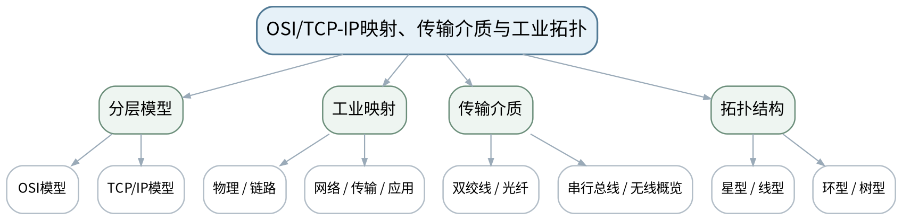 |
| 教学方法 | 讲授法、问答法、案例分析法、拓扑推演法、报文/时序分析法、方案评审法、课堂检测法 |
| 教学用具 | 电脑、投影仪、多媒体课件、教材、OSI/TCP-IP分层图、铜缆/光纤样例或图片、拓扑卡片。 |
| 教学设计 | 课前任务→互动导入（10 min）→传授新知（70 min）→过关检测（10 min）→课堂小结（5 min）→作业布置（3 min）→考勤（2 min） |
| 参考文献 | [1] 邬贺铨, 于海斌, 杨善林.《工业互联网技术》[M]. 北京：机械工业出版社，2025。；[2] 王春峰, 朱铝芬.《工业控制网络技术应用》[M]. 北京：机械工业出版社，2025。 |

#### 教学目标

**知识目标：**
（1）理解OSI与TCP/IP分层模型及其在工业通信中的映射。 （2）了解双绞线、光纤、串行总线等常用传输介质与星型、线型、环型等拓扑特点。

**能力目标：**
（1）能够沿“应用数据—传输—网络—链路—物理”路径解释一次工业通信。 （2）能够根据距离、抗干扰、维护和冗余需求初步选择介质与拓扑。

**价值目标：**
（1）形成分层分析和接口边界意识。

#### 课程思政

（1）通过工业现场抗干扰和布线维护案例强调按规范施工、按层定位，避免凭经验随意改线。 （2）本课所有网络诊断、抓包、配置或仿真均强调合法授权、最小影响、真实记录与可恢复，不把未经授权的真实工业网络操作作为学习证据。

#### 专创融合

引导学生把“设备连接清单”转化为网络BOM和施工/运维接口，为后续方案设计打基础。

#### 教学重难点

**教学重点**：分层通信模型；介质与拓扑选择。

**教学难点**：把协议名称放到正确层级，并理解“拓扑形状、物理介质、协议机制”是不同维度。

#### 教学过程

| 教学步骤 | 主要教学内容 | 设计意图 |
|---|---|---|
| 课前任务 | 【教师】1. 发布本课预习范围与一份最小拓扑/报文/接口材料； 2. 要求学生标出3个核心术语和1个疑问； 3. 提醒涉及抓包、诊断、配置的内容只使用教师提供数据或明确授权环境。 【学生】1. 阅读教材与教师材料； 2. 完成一个“先预测”问题； 3. 带着问题进入课堂。 | 通过课前预习与授权边界提醒，让学生建立先备认知并形成合规使用网络工具的意识。 |
| 互动导入（10 min） | 【教师】1. 复习与本课直接相关的上一课主线； 2. 给出“PLC通过交换机向SCADA上传数据”的流程，让学生按OSI/TCP-IP思路标出每层关注对象。 3. 追问“现象能够证明什么、还不能证明什么？”。 【学生】先独立判断，再与同伴交换依据，明确本次课任务目标。 | 从真实工业网络现象切入，引发认知冲突，让学生先判断再学习机制。 |
| 传授新知（共70 min） | 一、分层模型 【教师】复习OSI七层与TCP/IP模型，重点讲工业场景如何用分层思想定位“线缆、MAC、IP、端口、应用协议”问题。 【学生】围绕本环节完成拓扑、报文、参数、时序或方案判断，先写预期结果，再对照教师演示/案例修正。 【课堂强化】要求每个结论附至少一条可观察证据或接口依据。  二、介质选择 【教师】比较铜缆、光纤和串行总线在距离、抗干扰、成本、维护方面的边界；强调实际参数以设备手册为准。 【学生】围绕本环节完成拓扑、报文、参数、时序或方案判断，先写预期结果，再对照教师演示/案例修正。 【课堂强化】要求每个结论附至少一条可观察证据或接口依据。  三、拓扑推演 【教师】用星型、线型、环型、树型拓扑比较单点故障、扩展、维护和冗余特性；学生给产线设备选择拓扑并说明理由。 【学生】围绕本环节完成拓扑、报文、参数、时序或方案判断，先写预期结果，再对照教师演示/案例修正。 【课堂强化】要求每个结论附至少一条可观察证据或接口依据。  【形成产物】“工业通信分层路径图＋介质/拓扑选择表”。 【学习证据】分层路径图、介质选择依据、拓扑故障点标注。 【评价映射】平时成绩；目标1.1、2.1、3.1。 | 按“概念/机制→数据流/时序→案例/方案→证据验证”展开，避免只记协议名，训练工程解释能力。 |
| 过关检测（10 min） | 【教师】布置课堂检测： 1. MAC地址、IP地址、端口分别主要属于哪个分析层面？ 2. 光纤与双绞线选择不能只看速度，还要看哪些因素？ 3. 环型拓扑是否天然等于“有冗余”？为什么？ 【学生】独立作答、同伴互查并标出依据； 【教师】根据错误类型集中点评并要求修正。 | 及时检验重难点，要求结论附依据，暴露地址、协议、性能和边界混淆。 |
| 课堂小结（5 min） | 【教师】1. 本次课解决的关键问题是：OSI/TCP-IP映射、传输介质与工业拓扑； 2. 需要重点掌握的主线是：分层通信模型；介质与拓扑选择。； 3. 最值得带走的方法是“分层/分角色/分数据流并以证据验证”； 4. 需要警惕的易错点是：把协议名称放到正确层级，并理解“拓扑形状、物理介质、协议机制”是不同维度。 【学生】用1分钟写下“一条规则＋一条证据边界”。 | 回到知识脉络图压缩主线，形成可迁移的分层分析方法。 |
| 作业布置（3 min） | 【教师】1. 完成一份“设备连接清单”，为6类工业设备指定介质/拓扑并写出维护与故障考虑。 【要求】不只写结论，还要写拓扑/接口/报文/参数依据和验证方法；涉及网络工具只在授权环境或教师提供数据上完成。 【学生】按课程命名规范整理提交。 | 固化拓扑、接口、报文或方案证据，衔接下一课并为课程作业/期末综合方案积累素材。 |
| 考勤（2 min） | 【教师】利用学习通/课堂点名完成签到；不在教案中预填出勤事实。 【学生】按课堂要求完成签到。 | 保留学校课堂管理环节，不预填实际出勤事实。 |

#### 教学反思

【教师】课后重点从以下方面进行教学反思： 1. 教学流程：导入是否把学生带入“OSI/TCP-IP映射、传输介质与工业拓扑”的问题情境，70分钟主线是否由浅入深； 2. 教学内容：重点检查“把协议名称放到正确层级，并理解“拓扑形状、物理介质、协议机制”是不同维度。”是否讲清，学生是否停留在术语记忆； 3. 学生参与：记录拓扑/报文/方案判断是否均衡，是否存在“会听不会解释证据”的情况； 4. 教学改进：依据真实课堂表现决定是否增加抓包演示、时序对比、错例或方案评审。

### lesson-03

| 字段 | 内容 |
|---|---|
| 章节 | 第一单元 工业网络体系与通信基础 |
| 授课题目 | MAC、ARP、IP、子网与端口：工业地址体系 |
| 周次 | 第2周（第3次课） |
| 课时安排 | 2课时（100 min）；类型：理论2 |
| 知识脉络图 | 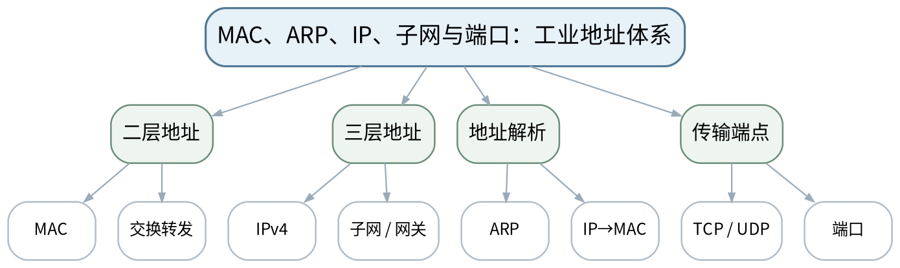 |
| 教学方法 | 讲授法、问答法、案例分析法、拓扑推演法、报文/时序分析法、方案评审法、课堂检测法 |
| 教学用具 | 电脑、投影仪、多媒体课件、教材、IP地址规划表、ARP/交换表样例。 |
| 教学设计 | 课前任务→互动导入（10 min）→传授新知（70 min）→过关检测（10 min）→课堂小结（5 min）→作业布置（3 min）→考勤（2 min） |
| 参考文献 | [1] 邬贺铨, 于海斌, 杨善林.《工业互联网技术》[M]. 北京：机械工业出版社，2025。；[2] 王春峰, 朱铝芬.《工业控制网络技术应用》[M]. 北京：机械工业出版社，2025。 |

#### 教学目标

**知识目标：**
（1）理解MAC、ARP、IPv4地址、子网、默认网关、TCP/UDP和端口的作用。 （2）理解工业设备中“设备名称/站号/协议地址/IP/MAC”等多种标识可能并存。

**能力目标：**
（1）能够判断两台设备是否处于同一子网并识别常见地址冲突。 （2）能够根据通信路径画出“IP—MAC—端口—应用协议”关系。

**价值目标：**
（1）形成地址规划、参数记录和变更可追溯意识。

#### 课程思政

（1）以配置错误导致停线的案例强调地址表、版本和变更记录必须真实完整。 （2）本课所有网络诊断、抓包、配置或仿真均强调合法授权、最小影响、真实记录与可恢复，不把未经授权的真实工业网络操作作为学习证据。

#### 专创融合

把设备地址表设计为后续调试、资产管理和自动化配置的机器可读基础。

#### 教学重难点

**教学重点**：工业以太网地址体系；子网与端口。

**教学难点**：区分MAC、IP、端口和应用层设备标识，避免将任一地址错误地当作“唯一地址”。

#### 教学过程

| 教学步骤 | 主要教学内容 | 设计意图 |
|---|---|---|
| 课前任务 | 【教师】1. 发布本课预习范围与一份最小拓扑/报文/接口材料； 2. 要求学生标出3个核心术语和1个疑问； 3. 提醒涉及抓包、诊断、配置的内容只使用教师提供数据或明确授权环境。 【学生】1. 阅读教材与教师材料； 2. 完成一个“先预测”问题； 3. 带着问题进入课堂。 | 通过课前预习与授权边界提醒，让学生建立先备认知并形成合规使用网络工具的意识。 |
| 互动导入（10 min） | 【教师】1. 复习与本课直接相关的上一课主线； 2. 给出两台PLC：IP看似相邻但子网掩码不同，提问“为什么Ping不通不能只看IP最后一段？” 3. 追问“现象能够证明什么、还不能证明什么？”。 【学生】先独立判断，再与同伴交换依据，明确本次课任务目标。 | 从真实工业网络现象切入，引发认知冲突，让学生先判断再学习机制。 |
| 传授新知（共70 min） | 一、MAC与ARP 【教师】说明MAC用于链路转发、ARP用于IPv4地址到MAC的解析；通过简单ARP表/交换表截图理解“谁在同一广播域”。 【学生】围绕本环节完成拓扑、报文、参数、时序或方案判断，先写预期结果，再对照教师演示/案例修正。 【课堂强化】要求每个结论附至少一条可观察证据或接口依据。  二、IP与子网 【教师】讲IPv4、子网掩码、默认网关和同网段判断；只做工业常用规划层级，不重复普通计算机网络的完整理论。 【学生】围绕本环节完成拓扑、报文、参数、时序或方案判断，先写预期结果，再对照教师演示/案例修正。 【课堂强化】要求每个结论附至少一条可观察证据或接口依据。  三、端口与数据流 【教师】用Modbus TCP、OPC UA等后续协议场景说明端口是传输层端点的一部分，学生完成设备地址表并检查重复/越界。 【学生】围绕本环节完成拓扑、报文、参数、时序或方案判断，先写预期结果，再对照教师演示/案例修正。 【课堂强化】要求每个结论附至少一条可观察证据或接口依据。  【形成产物】“设备地址与接口表”：设备名、MAC/IP、掩码、网关、端口/协议、用途。 【学习证据】地址表＋同网段判断题＋地址冲突故障分析。 【评价映射】平时成绩；目标1.1、2.1、3.1。 | 按“概念/机制→数据流/时序→案例/方案→证据验证”展开，避免只记协议名，训练工程解释能力。 |
| 过关检测（10 min） | 【教师】布置课堂检测： 1. IP相同但MAC不同会产生什么风险？ 2. 同网段判断为什么必须同时看地址和掩码？ 3. 端口号和设备站号是否是一回事？ 【学生】独立作答、同伴互查并标出依据； 【教师】根据错误类型集中点评并要求修正。 | 及时检验重难点，要求结论附依据，暴露地址、协议、性能和边界混淆。 |
| 课堂小结（5 min） | 【教师】1. 本次课解决的关键问题是：MAC、ARP、IP、子网与端口：工业地址体系； 2. 需要重点掌握的主线是：工业以太网地址体系；子网与端口。； 3. 最值得带走的方法是“分层/分角色/分数据流并以证据验证”； 4. 需要警惕的易错点是：区分MAC、IP、端口和应用层设备标识，避免将任一地址错误地当作“唯一地址”。 【学生】用1分钟写下“一条规则＋一条证据边界”。 | 回到知识脉络图压缩主线，形成可迁移的分层分析方法。 |
| 作业布置（3 min） | 【教师】1. 为一条包含PLC、HMI、机器人、工程师站、边缘网关的网络规划地址表，写出防冲突规则。 【要求】不只写结论，还要写拓扑/接口/报文/参数依据和验证方法；涉及网络工具只在授权环境或教师提供数据上完成。 【学生】按课程命名规范整理提交。 | 固化拓扑、接口、报文或方案证据，衔接下一课并为课程作业/期末综合方案积累素材。 |
| 考勤（2 min） | 【教师】利用学习通/课堂点名完成签到；不在教案中预填出勤事实。 【学生】按课堂要求完成签到。 | 保留学校课堂管理环节，不预填实际出勤事实。 |

#### 教学反思

【教师】课后重点从以下方面进行教学反思： 1. 教学流程：导入是否把学生带入“MAC、ARP、IP、子网与端口：工业地址体系”的问题情境，70分钟主线是否由浅入深； 2. 教学内容：重点检查“区分MAC、IP、端口和应用层设备标识，避免将任一地址错误地当作“唯一地址”。”是否讲清，学生是否停留在术语记忆； 3. 学生参与：记录拓扑/报文/方案判断是否均衡，是否存在“会听不会解释证据”的情况； 4. 教学改进：依据真实课堂表现决定是否增加抓包演示、时序对比、错例或方案评审。

### lesson-04

| 字段 | 内容 |
|---|---|
| 章节 | 第一单元 工业网络体系与通信基础 |
| 授课题目 | 时延、抖动、丢包、带宽与工业网络性能需求 |
| 周次 | 第2周（第4次课） |
| 课时安排 | 2课时（100 min）；类型：理论2 |
| 知识脉络图 | 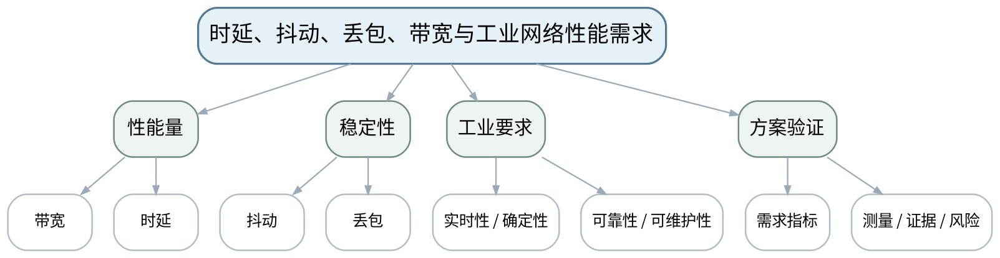 |
| 教学方法 | 讲授法、问答法、案例分析法、拓扑推演法、报文/时序分析法、方案评审法、课堂检测法 |
| 教学用具 | 电脑、投影仪、多媒体课件、教材、性能案例数据、拓扑与指标评审表。 |
| 教学设计 | 课前任务→互动导入（10 min）→传授新知（70 min）→过关检测（10 min）→课堂小结（5 min）→作业布置（3 min）→考勤（2 min） |
| 参考文献 | [1] 邬贺铨, 于海斌, 杨善林.《工业互联网技术》[M]. 北京：机械工业出版社，2025。；[5] 刘科, 王峰.《工业网络及应用技术》[M]. 北京：高等教育出版社，2022。 |

#### 教学目标

**知识目标：**
（1）理解带宽、时延、抖动、丢包及实时性、确定性、可靠性、可维护性的工程含义。 （2）理解网络性能指标需要与控制周期、数据量和业务后果关联。

**能力目标：**
（1）能够根据控制、监控、视频/历史数据等不同业务给出性能优先级。 （2）能够评审一份网络方案是否提出可测量、可验证的指标。

**价值目标：**
（1）形成“指标必须可测量、结论必须有证据”的工程习惯。

#### 课程思政

（1）通过关键生产业务的时限与停线后果，强调性能论证不能夸大、不能只给“经验值”。 （2）本课所有网络诊断、抓包、配置或仿真均强调合法授权、最小影响、真实记录与可恢复，不把未经授权的真实工业网络操作作为学习证据。

#### 专创融合

将性能指标表转化为采购、调试、验收三方共同使用的网络SLA草案。

#### 教学重难点

**教学重点**：工业网络性能指标及需求到验证的闭环。

**教学难点**：理解“高带宽≠低时延≠确定性”，并把模糊需求转为可验证指标。

#### 教学过程

| 教学步骤 | 主要教学内容 | 设计意图 |
|---|---|---|
| 课前任务 | 【教师】1. 发布本课预习范围与一份最小拓扑/报文/接口材料； 2. 要求学生标出3个核心术语和1个疑问； 3. 提醒涉及抓包、诊断、配置的内容只使用教师提供数据或明确授权环境。 【学生】1. 阅读教材与教师材料； 2. 完成一个“先预测”问题； 3. 带着问题进入课堂。 | 通过课前预习与授权边界提醒，让学生建立先备认知并形成合规使用网络工具的意识。 |
| 互动导入（10 min） | 【教师】1. 复习与本课直接相关的上一课主线； 2. 给出“千兆链路但控制仍抖动”的案例，要求学生解释为什么仅升级带宽不一定解决实时问题。 3. 追问“现象能够证明什么、还不能证明什么？”。 【学生】先独立判断，再与同伴交换依据，明确本次课任务目标。 | 从真实工业网络现象切入，引发认知冲突，让学生先判断再学习机制。 |
| 传授新知（共70 min） | 一、指标辨析 【教师】用控制指令、SCADA监视、视频监控三个场景区分带宽、时延、抖动、丢包的影响。 【学生】围绕本环节完成拓扑、报文、参数、时序或方案判断，先写预期结果，再对照教师演示/案例修正。 【课堂强化】要求每个结论附至少一条可观察证据或接口依据。  二、确定性与可靠性 【教师】说明工业实时通信关注时限可预测性，可靠性关注持续可用与故障影响；可维护性关注诊断、替换和恢复。 【学生】围绕本环节完成拓扑、报文、参数、时序或方案判断，先写预期结果，再对照教师演示/案例修正。 【课堂强化】要求每个结论附至少一条可观察证据或接口依据。  三、方案评审 【教师】学生把“网络要快、要稳”改写成指标表，附测量方式和验收条件；形成第一单元阶段作业证据。 【学生】围绕本环节完成拓扑、报文、参数、时序或方案判断，先写预期结果，再对照教师演示/案例修正。 【课堂强化】要求每个结论附至少一条可观察证据或接口依据。  【形成产物】课程作业阶段1：工业网络拓扑与性能需求分析（课程作业内部15%）。 【学习证据】需求指标表、拓扑图、验证方法和风险说明。 【评价映射】课程作业阶段1；目标1.1、2.1、3.1。 | 按“概念/机制→数据流/时序→案例/方案→证据验证”展开，避免只记协议名，训练工程解释能力。 |
| 过关检测（10 min） | 【教师】布置课堂检测： 1. 高带宽能否保证低抖动？ 2. 实时性与确定性有什么联系与区别？ 3. 一个网络性能指标为什么必须同时给出验证方法？ 【学生】独立作答、同伴互查并标出依据； 【教师】根据错误类型集中点评并要求修正。 | 及时检验重难点，要求结论附依据，暴露地址、协议、性能和边界混淆。 |
| 课堂小结（5 min） | 【教师】1. 本次课解决的关键问题是：时延、抖动、丢包、带宽与工业网络性能需求； 2. 需要重点掌握的主线是：工业网络性能指标及需求到验证的闭环。； 3. 最值得带走的方法是“分层/分角色/分数据流并以证据验证”； 4. 需要警惕的易错点是：理解“高带宽≠低时延≠确定性”，并把模糊需求转为可验证指标。 【学生】用1分钟写下“一条规则＋一条证据边界”。 | 回到知识脉络图压缩主线，形成可迁移的分层分析方法。 |
| 作业布置（3 min） | 【教师】1. 提交阶段作业1：拓扑、设备地址/链路、关键性能指标、验证方法及一个失效场景。 【要求】不只写结论，还要写拓扑/接口/报文/参数依据和验证方法；涉及网络工具只在授权环境或教师提供数据上完成。 【学生】按课程命名规范整理提交。 | 固化拓扑、接口、报文或方案证据，衔接下一课并为课程作业/期末综合方案积累素材。 |
| 考勤（2 min） | 【教师】利用学习通/课堂点名完成签到；不在教案中预填出勤事实。 【学生】按课堂要求完成签到。 | 保留学校课堂管理环节，不预填实际出勤事实。 |

#### 教学反思

【教师】课后重点从以下方面进行教学反思： 1. 教学流程：导入是否把学生带入“时延、抖动、丢包、带宽与工业网络性能需求”的问题情境，70分钟主线是否由浅入深； 2. 教学内容：重点检查“理解“高带宽≠低时延≠确定性”，并把模糊需求转为可验证指标。”是否讲清，学生是否停留在术语记忆； 3. 学生参与：记录拓扑/报文/方案判断是否均衡，是否存在“会听不会解释证据”的情况； 4. 教学改进：依据真实课堂表现决定是否增加抓包演示、时序对比、错例或方案评审。

### lesson-05

| 字段 | 内容 |
|---|---|
| 章节 | 第二单元 现场总线与Modbus通信 |
| 授课题目 | 现场总线、主从模型与RS-485基础 |
| 周次 | 第3周（第5次课） |
| 课时安排 | 2课时（100 min）；类型：理论2 |
| 知识脉络图 | 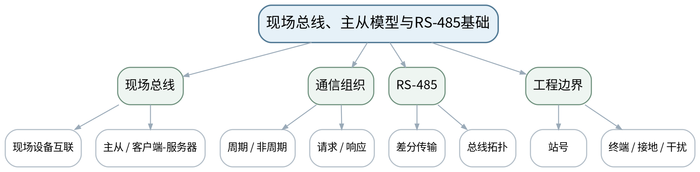 |
| 教学方法 | 讲授法、问答法、案例分析法、拓扑推演法、报文/时序分析法、方案评审法、课堂检测法 |
| 教学用具 | 电脑、投影仪、多媒体课件、教材、RS-485拓扑图、接线端子/串口参数示例。 |
| 教学设计 | 课前任务→互动导入（10 min）→传授新知（70 min）→过关检测（10 min）→课堂小结（5 min）→作业布置（3 min）→考勤（2 min） |
| 参考文献 | [1] 邬贺铨, 于海斌, 杨善林.《工业互联网技术》[M]. 北京：机械工业出版社，2025。；[2] 王春峰, 朱铝芬.《工业控制网络技术应用》[M]. 北京：机械工业出版社，2025。 |

#### 教学目标

**知识目标：**
（1）理解现场总线基本思想及主从、客户端/服务器、周期与非周期通信概念。 （2）理解RS-485差分传输、总线拓扑和站号等工程要素。

**能力目标：**
（1）能够识读简单RS-485总线图并指出站号、干线/支线和潜在故障点。 （2）能够区分协议逻辑问题与物理层布线问题。

**价值目标：**
（1）形成按手册和接口表施工、先物理后协议诊断的习惯。

#### 课程思政

（1）通过错误接线和接口表不一致案例强调“不猜参数、不省记录、先确认授权与设备状态”。 （2）本课所有网络诊断、抓包、配置或仿真均强调合法授权、最小影响、真实记录与可恢复，不把未经授权的真实工业网络操作作为学习证据。

#### 专创融合

把总线检查表沉淀为现场调试SOP，可用于PLC/变频器/仪表的快速交付。

#### 教学重难点

**教学重点**：现场总线通信模型与RS-485物理基础。

**教学难点**：不把RS-485等同于Modbus；理解“物理接口”和“应用协议”是不同层次。

#### 教学过程

| 教学步骤 | 主要教学内容 | 设计意图 |
|---|---|---|
| 课前任务 | 【教师】1. 发布本课预习范围与一份最小拓扑/报文/接口材料； 2. 要求学生标出3个核心术语和1个疑问； 3. 提醒涉及抓包、诊断、配置的内容只使用教师提供数据或明确授权环境。 【学生】1. 阅读教材与教师材料； 2. 完成一个“先预测”问题； 3. 带着问题进入课堂。 | 通过课前预习与授权边界提醒，让学生建立先备认知并形成合规使用网络工具的意识。 |
| 互动导入（10 min） | 【教师】1. 复习与本课直接相关的上一课主线； 2. 展示同一根RS-485线上既可能跑Modbus，也可能跑其他协议的事实，追问“为什么说RS-485不是Modbus？” 3. 追问“现象能够证明什么、还不能证明什么？”。 【学生】先独立判断，再与同伴交换依据，明确本次课任务目标。 | 从真实工业网络现象切入，引发认知冲突，让学生先判断再学习机制。 |
| 传授新知（共70 min） | 一、现场总线思想 【教师】从分散设备接线向共享通信总线演进，解释主从/客户端服务器及周期、非周期数据组织。 【学生】围绕本环节完成拓扑、报文、参数、时序或方案判断，先写预期结果，再对照教师演示/案例修正。 【课堂强化】要求每个结论附至少一条可观察证据或接口依据。  二、RS-485基础 【教师】讲差分传输、总线型连接、站点和基础终端概念；所有具体终端、电气参数以设备手册为准。 【学生】围绕本环节完成拓扑、报文、参数、时序或方案判断，先写预期结果，再对照教师演示/案例修正。 【课堂强化】要求每个结论附至少一条可观察证据或接口依据。  三、故障分类 【教师】给出“站号重复、A/B线接反、终端不当、协议参数不一致”等症状，让学生按物理层/协议层归类。 【学生】围绕本环节完成拓扑、报文、参数、时序或方案判断，先写预期结果，再对照教师演示/案例修正。 【课堂强化】要求每个结论附至少一条可观察证据或接口依据。  【形成产物】RS-485/现场总线结构图＋故障分层表。 【学习证据】总线图、故障归类、诊断顺序。 【评价映射】平时成绩；目标1.2、2.2、3.2。 | 按“概念/机制→数据流/时序→案例/方案→证据验证”展开，避免只记协议名，训练工程解释能力。 |
| 过关检测（10 min） | 【教师】布置课堂检测： 1. RS-485与Modbus的关系是什么？ 2. 为什么总线物理层正常仍可能无法通信？ 3. 站号重复属于哪类配置问题？ 【学生】独立作答、同伴互查并标出依据； 【教师】根据错误类型集中点评并要求修正。 | 及时检验重难点，要求结论附依据，暴露地址、协议、性能和边界混淆。 |
| 课堂小结（5 min） | 【教师】1. 本次课解决的关键问题是：现场总线、主从模型与RS-485基础； 2. 需要重点掌握的主线是：现场总线通信模型与RS-485物理基础。； 3. 最值得带走的方法是“分层/分角色/分数据流并以证据验证”； 4. 需要警惕的易错点是：不把RS-485等同于Modbus；理解“物理接口”和“应用协议”是不同层次。 【学生】用1分钟写下“一条规则＋一条证据边界”。 | 回到知识脉络图压缩主线，形成可迁移的分层分析方法。 |
| 作业布置（3 min） | 【教师】1. 根据教师提供的设备手册摘要，整理一张RS-485接口与通信参数检查表。 【要求】不只写结论，还要写拓扑/接口/报文/参数依据和验证方法；涉及网络工具只在授权环境或教师提供数据上完成。 【学生】按课程命名规范整理提交。 | 固化拓扑、接口、报文或方案证据，衔接下一课并为课程作业/期末综合方案积累素材。 |
| 考勤（2 min） | 【教师】利用学习通/课堂点名完成签到；不在教案中预填出勤事实。 【学生】按课堂要求完成签到。 | 保留学校课堂管理环节，不预填实际出勤事实。 |

#### 教学反思

【教师】课后重点从以下方面进行教学反思： 1. 教学流程：导入是否把学生带入“现场总线、主从模型与RS-485基础”的问题情境，70分钟主线是否由浅入深； 2. 教学内容：重点检查“不把RS-485等同于Modbus；理解“物理接口”和“应用协议”是不同层次。”是否讲清，学生是否停留在术语记忆； 3. 学生参与：记录拓扑/报文/方案判断是否均衡，是否存在“会听不会解释证据”的情况； 4. 教学改进：依据真实课堂表现决定是否增加抓包演示、时序对比、错例或方案评审。

### lesson-06

| 字段 | 内容 |
|---|---|
| 章节 | 第二单元 现场总线与Modbus通信 |
| 授课题目 | Modbus RTU数据模型、功能码与帧结构 |
| 周次 | 第3周（第6次课） |
| 课时安排 | 2课时（100 min）；类型：理论2 |
| 知识脉络图 | 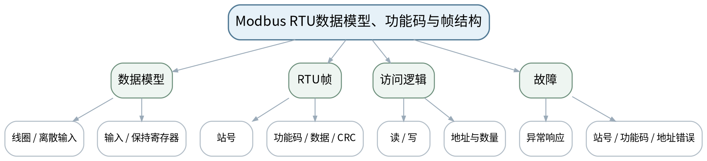 |
| 教学方法 | 讲授法、问答法、案例分析法、拓扑推演法、报文/时序分析法、方案评审法、课堂检测法 |
| 教学用具 | 电脑、投影仪、多媒体课件、教材、Modbus寄存器表样例、教师提供RTU报文。 |
| 教学设计 | 课前任务→互动导入（10 min）→传授新知（70 min）→过关检测（10 min）→课堂小结（5 min）→作业布置（3 min）→考勤（2 min） |
| 参考文献 | [1] 邬贺铨, 于海斌, 杨善林.《工业互联网技术》[M]. 北京：机械工业出版社，2025。；[2] 王春峰, 朱铝芬.《工业控制网络技术应用》[M]. 北京：机械工业出版社，2025。；[3] 鲁子卉, 唐敏.《工业网络与组态技术》[M]. 北京：机械工业出版社，2024。 |

#### 教学目标

**知识目标：**
（1）掌握Modbus线圈、离散输入、输入寄存器、保持寄存器的数据模型。 （2）理解Modbus RTU帧中的站号、功能码、数据和CRC概念。

**能力目标：**
（1）能够依据寄存器表把业务量映射为功能码和地址范围。 （2）能够阅读教师提供的RTU报文并判断站号、功能码或地址问题。

**价值目标：**
（1）形成接口表、地址口径和报文证据可追溯意识。

#### 课程思政

（1）通过寄存器误映射导致控制/监测错误案例强调接口契约、复核和诚实记录。 （2）本课所有网络诊断、抓包、配置或仿真均强调合法授权、最小影响、真实记录与可恢复，不把未经授权的真实工业网络操作作为学习证据。

#### 专创融合

把寄存器表设计成设备接入模板，为协议网关和边缘数据采集复用。

#### 教学重难点

**教学重点**：Modbus数据模型、RTU帧和寄存器访问。

**教学难点**：寄存器“显示编号”和协议地址可能存在口径差异，必须以设备手册/接口表为准。

#### 教学过程

| 教学步骤 | 主要教学内容 | 设计意图 |
|---|---|---|
| 课前任务 | 【教师】1. 发布本课预习范围与一份最小拓扑/报文/接口材料； 2. 要求学生标出3个核心术语和1个疑问； 3. 提醒涉及抓包、诊断、配置的内容只使用教师提供数据或明确授权环境。 【学生】1. 阅读教材与教师材料； 2. 完成一个“先预测”问题； 3. 带着问题进入课堂。 | 通过课前预习与授权边界提醒，让学生建立先备认知并形成合规使用网络工具的意识。 |
| 互动导入（10 min） | 【教师】1. 复习与本课直接相关的上一课主线； 2. 给出“手册写40001、软件填0/1/40001三种地址形式”的冲突案例，让学生先判断为什么不能凭经验直接填。 3. 追问“现象能够证明什么、还不能证明什么？”。 【学生】先独立判断，再与同伴交换依据，明确本次课任务目标。 | 从真实工业网络现象切入，引发认知冲突，让学生先判断再学习机制。 |
| 传授新知（共70 min） | 一、数据模型 【教师】解释四类数据区、读写属性和寄存器表；强调具体设备可对数据区和地址做厂商定义。 【学生】围绕本环节完成拓扑、报文、参数、时序或方案判断，先写预期结果，再对照教师演示/案例修正。 【课堂强化】要求每个结论附至少一条可观察证据或接口依据。  二、RTU帧解析 【教师】按站号—功能码—数据—CRC概念解析教师提供帧，突出报文是“接口契约的线索”而不是死记十六进制。 【学生】围绕本环节完成拓扑、报文、参数、时序或方案判断，先写预期结果，再对照教师演示/案例修正。 【课堂强化】要求每个结论附至少一条可观察证据或接口依据。  三、错误推演 【教师】用站号错、功能码不支持、寄存器越界、字节顺序/数据类型口径不一致案例分析症状与验证步骤。 【学生】围绕本环节完成拓扑、报文、参数、时序或方案判断，先写预期结果，再对照教师演示/案例修正。 【课堂强化】要求每个结论附至少一条可观察证据或接口依据。  【形成产物】Modbus寄存器映射表＋RTU帧注释练习。 【学习证据】寄存器表、帧字段标注、3类错误定位记录。 【评价映射】平时成绩；目标1.2、2.2、3.2。 | 按“概念/机制→数据流/时序→案例/方案→证据验证”展开，避免只记协议名，训练工程解释能力。 |
| 过关检测（10 min） | 【教师】布置课堂检测： 1. Modbus的四类数据模型分别表达什么？ 2. RTU帧中CRC解决的是哪类问题？ 3. 为什么寄存器地址必须同时记录设备手册口径和软件口径？ 【学生】独立作答、同伴互查并标出依据； 【教师】根据错误类型集中点评并要求修正。 | 及时检验重难点，要求结论附依据，暴露地址、协议、性能和边界混淆。 |
| 课堂小结（5 min） | 【教师】1. 本次课解决的关键问题是：Modbus RTU数据模型、功能码与帧结构； 2. 需要重点掌握的主线是：Modbus数据模型、RTU帧和寄存器访问。； 3. 最值得带走的方法是“分层/分角色/分数据流并以证据验证”； 4. 需要警惕的易错点是：寄存器“显示编号”和协议地址可能存在口径差异，必须以设备手册/接口表为准。 【学生】用1分钟写下“一条规则＋一条证据边界”。 | 回到知识脉络图压缩主线，形成可迁移的分层分析方法。 |
| 作业布置（3 min） | 【教师】1. 完成一份10点位寄存器表，并为2条读操作写出“站号—功能码—地址—数量—预期数据”。 【要求】不只写结论，还要写拓扑/接口/报文/参数依据和验证方法；涉及网络工具只在授权环境或教师提供数据上完成。 【学生】按课程命名规范整理提交。 | 固化拓扑、接口、报文或方案证据，衔接下一课并为课程作业/期末综合方案积累素材。 |
| 考勤（2 min） | 【教师】利用学习通/课堂点名完成签到；不在教案中预填出勤事实。 【学生】按课堂要求完成签到。 | 保留学校课堂管理环节，不预填实际出勤事实。 |

#### 教学反思

【教师】课后重点从以下方面进行教学反思： 1. 教学流程：导入是否把学生带入“Modbus RTU数据模型、功能码与帧结构”的问题情境，70分钟主线是否由浅入深； 2. 教学内容：重点检查“寄存器“显示编号”和协议地址可能存在口径差异，必须以设备手册/接口表为准。”是否讲清，学生是否停留在术语记忆； 3. 学生参与：记录拓扑/报文/方案判断是否均衡，是否存在“会听不会解释证据”的情况； 4. 教学改进：依据真实课堂表现决定是否增加抓包演示、时序对比、错例或方案评审。

### lesson-07

| 字段 | 内容 |
|---|---|
| 章节 | 第二单元 现场总线与Modbus通信 |
| 授课题目 | Modbus TCP、MBAP与RTU/TCP映射 |
| 周次 | 第4周（第7次课） |
| 课时安排 | 2课时（100 min）；类型：理论2 |
| 知识脉络图 | 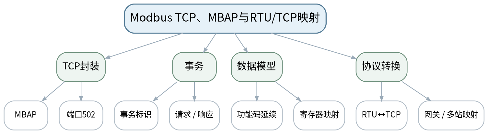 |
| 教学方法 | 讲授法、问答法、案例分析法、拓扑推演法、报文/时序分析法、方案评审法、课堂检测法 |
| 教学用具 | 电脑、投影仪、多媒体课件、教材、教师提供Modbus TCP抓包/报文、网关示意。 |
| 教学设计 | 课前任务→互动导入（10 min）→传授新知（70 min）→过关检测（10 min）→课堂小结（5 min）→作业布置（3 min）→考勤（2 min） |
| 参考文献 | [1] 邬贺铨, 于海斌, 杨善林.《工业互联网技术》[M]. 北京：机械工业出版社，2025。；[2] 王春峰, 朱铝芬.《工业控制网络技术应用》[M]. 北京：机械工业出版社，2025。；[3] 鲁子卉, 唐敏.《工业网络与组态技术》[M]. 北京：机械工业出版社，2024。 |

#### 教学目标

**知识目标：**
（1）理解Modbus TCP使用MBAP头、TCP端口502和事务标识组织请求响应。 （2）理解Modbus TCP与RTU共享基本数据模型和功能码，但传输封装不同。

**能力目标：**
（1）能够阅读教师提供的Modbus TCP报文/抓包摘要并定位事务、功能码、地址。 （2）能够画出PLC—网关—串口仪表的RTU/TCP数据链。

**价值目标：**
（1）形成跨协议转换时保持地址、数据类型和设备身份一致的接口意识。

#### 课程思政

（1）强调协议转换不能掩盖配置错误，任何地址/参数转换都要留下可审计映射记录。 （2）本课所有网络诊断、抓包、配置或仿真均强调合法授权、最小影响、真实记录与可恢复，不把未经授权的真实工业网络操作作为学习证据。

#### 专创融合

将网关数据链抽象为“协议适配器”产品接口，为后续边缘网关与OT/IT融合打基础。

#### 教学重难点

**教学重点**：Modbus TCP封装、事务与RTU/TCP网关。

**教学难点**：理解网关不自动解决寄存器口径和串口参数问题；跨协议时需同时核对两侧。

#### 教学过程

| 教学步骤 | 主要教学内容 | 设计意图 |
|---|---|---|
| 课前任务 | 【教师】1. 发布本课预习范围与一份最小拓扑/报文/接口材料； 2. 要求学生标出3个核心术语和1个疑问； 3. 提醒涉及抓包、诊断、配置的内容只使用教师提供数据或明确授权环境。 【学生】1. 阅读教材与教师材料； 2. 完成一个“先预测”问题； 3. 带着问题进入课堂。 | 通过课前预习与授权边界提醒，让学生建立先备认知并形成合规使用网络工具的意识。 |
| 互动导入（10 min） | 【教师】1. 复习与本课直接相关的上一课主线； 2. 展示一条Modbus TCP请求和一条RTU请求，隐藏标签，让学生找“相同的数据模型”和“不同的传输封装”。 3. 追问“现象能够证明什么、还不能证明什么？”。 【学生】先独立判断，再与同伴交换依据，明确本次课任务目标。 | 从真实工业网络现象切入，引发认知冲突，让学生先判断再学习机制。 |
| 传授新知（共70 min） | 一、Modbus TCP 【教师】解释MBAP、事务标识、端口502和PDU延续关系；用教师提供PCAP/报文截图解析，不要求学生连接真实控制网。 【学生】围绕本环节完成拓扑、报文、参数、时序或方案判断，先写预期结果，再对照教师演示/案例修正。 【课堂强化】要求每个结论附至少一条可观察证据或接口依据。  二、RTU/TCP比较 【教师】从站号/单元标识、CRC、TCP可靠传输、事务跟踪等维度做对照，强调共同核心是寄存器/功能码语义。 【学生】围绕本环节完成拓扑、报文、参数、时序或方案判断，先写预期结果，再对照教师演示/案例修正。 【课堂强化】要求每个结论附至少一条可观察证据或接口依据。  三、网关数据链 【教师】推演串口—以太网网关参数、站号、IP、端口和寄存器映射；学生画出故障点和验证顺序。 【学生】围绕本环节完成拓扑、报文、参数、时序或方案判断，先写预期结果，再对照教师演示/案例修正。 【课堂强化】要求每个结论附至少一条可观察证据或接口依据。  【形成产物】Modbus RTU/TCP对照表＋串口网关数据链图。 【学习证据】报文标注、对照表、网关两侧参数检查表。 【评价映射】平时成绩；目标1.2、2.2、3.2。 | 按“概念/机制→数据流/时序→案例/方案→证据验证”展开，避免只记协议名，训练工程解释能力。 |
| 过关检测（10 min） | 【教师】布置课堂检测： 1. Modbus TCP为什么不使用RTU的CRC字段？ 2. 端口502能否代替寄存器地址？ 3. 网关上线后串口侧站号错误会表现为什么？ 【学生】独立作答、同伴互查并标出依据； 【教师】根据错误类型集中点评并要求修正。 | 及时检验重难点，要求结论附依据，暴露地址、协议、性能和边界混淆。 |
| 课堂小结（5 min） | 【教师】1. 本次课解决的关键问题是：Modbus TCP、MBAP与RTU/TCP映射； 2. 需要重点掌握的主线是：Modbus TCP封装、事务与RTU/TCP网关。； 3. 最值得带走的方法是“分层/分角色/分数据流并以证据验证”； 4. 需要警惕的易错点是：理解网关不自动解决寄存器口径和串口参数问题；跨协议时需同时核对两侧。 【学生】用1分钟写下“一条规则＋一条证据边界”。 | 回到知识脉络图压缩主线，形成可迁移的分层分析方法。 |
| 作业布置（3 min） | 【教师】1. 将上一课寄存器表扩展为RTU/TCP双侧接口表，明确IP、端口、串口参数和站号。 【要求】不只写结论，还要写拓扑/接口/报文/参数依据和验证方法；涉及网络工具只在授权环境或教师提供数据上完成。 【学生】按课程命名规范整理提交。 | 固化拓扑、接口、报文或方案证据，衔接下一课并为课程作业/期末综合方案积累素材。 |
| 考勤（2 min） | 【教师】利用学习通/课堂点名完成签到；不在教案中预填出勤事实。 【学生】按课堂要求完成签到。 | 保留学校课堂管理环节，不预填实际出勤事实。 |

#### 教学反思

【教师】课后重点从以下方面进行教学反思： 1. 教学流程：导入是否把学生带入“Modbus TCP、MBAP与RTU/TCP映射”的问题情境，70分钟主线是否由浅入深； 2. 教学内容：重点检查“理解网关不自动解决寄存器口径和串口参数问题；跨协议时需同时核对两侧。”是否讲清，学生是否停留在术语记忆； 3. 学生参与：记录拓扑/报文/方案判断是否均衡，是否存在“会听不会解释证据”的情况； 4. 教学改进：依据真实课堂表现决定是否增加抓包演示、时序对比、错例或方案评审。

### lesson-08

| 字段 | 内容 |
|---|---|
| 章节 | 第二单元 现场总线与Modbus通信 |
| 授课题目 | 协议转换、PROFIBUS/CAN概览与Modbus故障分析 |
| 周次 | 第4周（第8次课） |
| 课时安排 | 2课时（100 min）；类型：理论2 |
| 知识脉络图 | 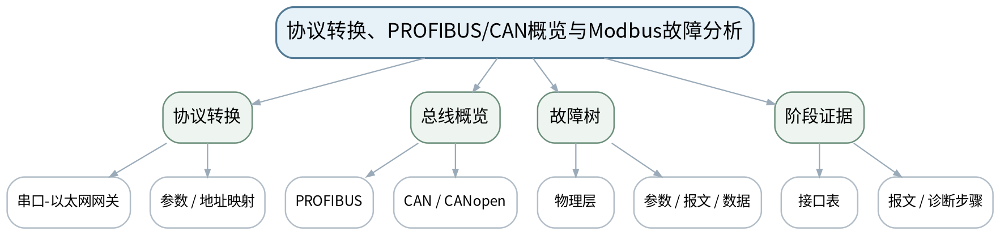 |
| 教学方法 | 讲授法、问答法、案例分析法、拓扑推演法、报文/时序分析法、方案评审法、课堂检测法 |
| 教学用具 | 电脑、投影仪、多媒体课件、教材、教师提供故障包、离线报文/日志、拓扑图。 |
| 教学设计 | 课前任务→互动导入（10 min）→传授新知（70 min）→过关检测（10 min）→课堂小结（5 min）→作业布置（3 min）→考勤（2 min） |
| 参考文献 | [1] 邬贺铨, 于海斌, 杨善林.《工业互联网技术》[M]. 北京：机械工业出版社，2025。；[2] 王春峰, 朱铝芬.《工业控制网络技术应用》[M]. 北京：机械工业出版社，2025。；[5] 刘科, 王峰.《工业网络及应用技术》[M]. 北京：高等教育出版社，2022。 |

#### 教学目标

**知识目标：**
（1）理解协议网关的适配职责，了解PROFIBUS、CAN/CANopen的定位。 （2）掌握Modbus常见故障的分层思路。

**能力目标：**
（1）能够根据症状构建“链路—参数—站号—功能码—寄存器—数据解释”的故障树。 （2）能够用寄存器表与报文证据说明故障结论。

**价值目标：**
（1）形成先验证后结论、配置可追溯和不在未授权网络试探的习惯。

#### 课程思政

（1）以错误站号、寄存器映射和终端/接线故障强调按手册、按接口表实施与如实记录。 （2）本课所有网络诊断、抓包、配置或仿真均强调合法授权、最小影响、真实记录与可恢复，不把未经授权的真实工业网络操作作为学习证据。

#### 专创融合

将故障树与接口表做成可复用诊断模板，提高设备接入与售后维护效率。

#### 教学重难点

**教学重点**：协议转换边界；Modbus故障分层；其他现场总线定位。

**教学难点**：故障分析要区分“无通信、报文异常、数据错误、语义错误”，不能只靠Ping或只改参数试错。

#### 教学过程

| 教学步骤 | 主要教学内容 | 设计意图 |
|---|---|---|
| 课前任务 | 【教师】1. 发布本课预习范围与一份最小拓扑/报文/接口材料； 2. 要求学生标出3个核心术语和1个疑问； 3. 提醒涉及抓包、诊断、配置的内容只使用教师提供数据或明确授权环境。 【学生】1. 阅读教材与教师材料； 2. 完成一个“先预测”问题； 3. 带着问题进入课堂。 | 通过课前预习与授权边界提醒，让学生建立先备认知并形成合规使用网络工具的意识。 |
| 互动导入（10 min） | 【教师】1. 复习与本课直接相关的上一课主线； 2. 给出三个症状：完全无响应、异常响应、通信正常但数值明显错误，要求学生分别从哪一层开始查。 3. 追问“现象能够证明什么、还不能证明什么？”。 【学生】先独立判断，再与同伴交换依据，明确本次课任务目标。 | 从真实工业网络现象切入，引发认知冲突，让学生先判断再学习机制。 |
| 传授新知（共70 min） | 一、协议转换与总线概览 【教师】回顾网关两侧接口；用功能定位方式了解PROFIBUS和CAN/CANopen，不展开厂商组态细节。 【学生】围绕本环节完成拓扑、报文、参数、时序或方案判断，先写预期结果，再对照教师演示/案例修正。 【课堂强化】要求每个结论附至少一条可观察证据或接口依据。  二、Modbus故障树 【教师】建立物理链路→串口/网络参数→站号/端口→功能码/地址→数据类型/字节序→业务语义的诊断顺序。 【学生】围绕本环节完成拓扑、报文、参数、时序或方案判断，先写预期结果，再对照教师演示/案例修正。 【课堂强化】要求每个结论附至少一条可观察证据或接口依据。  三、阶段作业评审 【教师】学生对一个教师提供故障包（拓扑、寄存器表、报文/日志）完成根因、证据、修复和复测清单。 【学生】围绕本环节完成拓扑、报文、参数、时序或方案判断，先写预期结果，再对照教师演示/案例修正。 【课堂强化】要求每个结论附至少一条可观察证据或接口依据。  【形成产物】课程作业阶段2：Modbus协议与故障分析报告（课程作业内部20%）。 【学习证据】故障树、接口表、报文证据、根因与复测步骤。 【评价映射】课程作业阶段2；目标1.2、2.2、3.2。 | 按“概念/机制→数据流/时序→案例/方案→证据验证”展开，避免只记协议名，训练工程解释能力。 |
| 过关检测（10 min） | 【教师】布置课堂检测： 1. “能Ping通”能否证明Modbus寄存器一定正确？ 2. 通信正常但数值错误，应优先检查哪些语义层问题？ 3. 协议网关的职责边界是什么？ 【学生】独立作答、同伴互查并标出依据； 【教师】根据错误类型集中点评并要求修正。 | 及时检验重难点，要求结论附依据，暴露地址、协议、性能和边界混淆。 |
| 课堂小结（5 min） | 【教师】1. 本次课解决的关键问题是：协议转换、PROFIBUS/CAN概览与Modbus故障分析； 2. 需要重点掌握的主线是：协议转换边界；Modbus故障分层；其他现场总线定位。； 3. 最值得带走的方法是“分层/分角色/分数据流并以证据验证”； 4. 需要警惕的易错点是：故障分析要区分“无通信、报文异常、数据错误、语义错误”，不能只靠Ping或只改参数试错。 【学生】用1分钟写下“一条规则＋一条证据边界”。 | 回到知识脉络图压缩主线，形成可迁移的分层分析方法。 |
| 作业布置（3 min） | 【教师】1. 提交阶段作业2：基于教师提供的授权/离线数据完成Modbus故障分析，不对真实工业网做未经授权扫描或写入。 【要求】不只写结论，还要写拓扑/接口/报文/参数依据和验证方法；涉及网络工具只在授权环境或教师提供数据上完成。 【学生】按课程命名规范整理提交。 | 固化拓扑、接口、报文或方案证据，衔接下一课并为课程作业/期末综合方案积累素材。 |
| 考勤（2 min） | 【教师】利用学习通/课堂点名完成签到；不在教案中预填出勤事实。 【学生】按课堂要求完成签到。 | 保留学校课堂管理环节，不预填实际出勤事实。 |

#### 教学反思

【教师】课后重点从以下方面进行教学反思： 1. 教学流程：导入是否把学生带入“协议转换、PROFIBUS/CAN概览与Modbus故障分析”的问题情境，70分钟主线是否由浅入深； 2. 教学内容：重点检查“故障分析要区分“无通信、报文异常、数据错误、语义错误”，不能只靠Ping或只改参数试错。”是否讲清，学生是否停留在术语记忆； 3. 学生参与：记录拓扑/报文/方案判断是否均衡，是否存在“会听不会解释证据”的情况； 4. 教学改进：依据真实课堂表现决定是否增加抓包演示、时序对比、错例或方案评审。

### lesson-09

| 字段 | 内容 |
|---|---|
| 章节 | 第三单元 工业以太网与交换网络设计 |
| 授课题目 | 以太网帧、交换转发、ARP与TCP/UDP数据路径 |
| 周次 | 第5周（第9次课） |
| 课时安排 | 2课时（100 min）；类型：理论2 |
| 知识脉络图 | 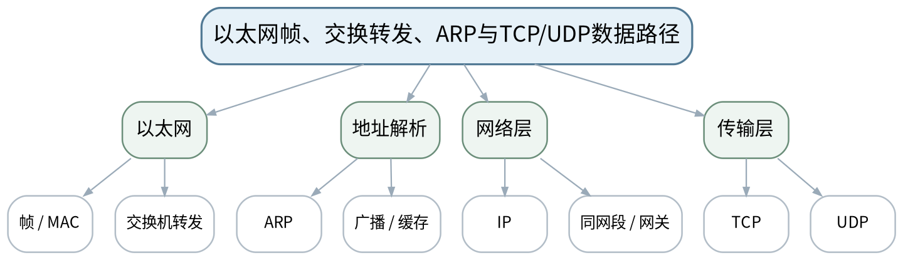 |
| 教学方法 | 讲授法、问答法、案例分析法、拓扑推演法、报文/时序分析法、方案评审法、课堂检测法 |
| 教学用具 | 电脑、投影仪、多媒体课件、教材、交换机转发表/ARP表样例、教师提供离线抓包截图。 |
| 教学设计 | 课前任务→互动导入（10 min）→传授新知（70 min）→过关检测（10 min）→课堂小结（5 min）→作业布置（3 min）→考勤（2 min） |
| 参考文献 | [1] 邬贺铨, 于海斌, 杨善林.《工业互联网技术》[M]. 北京：机械工业出版社，2025。；[2] 王春峰, 朱铝芬.《工业控制网络技术应用》[M]. 北京：机械工业出版社，2025。 |

#### 教学目标

**知识目标：**
（1）理解以太网帧、MAC地址和交换机学习/转发的基本机制。 （2）理解ARP、IP、TCP/UDP在工业以太网通信路径中的作用。

**能力目标：**
（1）能够沿设备A→交换机→设备B分析帧和地址变化。 （2）能够依据ARP表、MAC表和IP信息定位基础二/三层问题。

**价值目标：**
（1）形成分层证据定位而非“重启试试”的诊断意识。

#### 课程思政

（1）通过网络环路和误判案例强调诊断结论必须匹配证据层级，避免未经验证的大范围变更。 （2）本课所有网络诊断、抓包、配置或仿真均强调合法授权、最小影响、真实记录与可恢复，不把未经授权的真实工业网络操作作为学习证据。

#### 专创融合

将“数据路径图”作为后续VLAN、PROFINET和诊断方案的共同底图。

#### 教学重难点

**教学重点**：以太网交换与工业数据路径。

**教学难点**：区分二层转发、三层寻址和传输层会话，理解广播域与交换表的关系。

#### 教学过程

| 教学步骤 | 主要教学内容 | 设计意图 |
|---|---|---|
| 课前任务 | 【教师】1. 发布本课预习范围与一份最小拓扑/报文/接口材料； 2. 要求学生标出3个核心术语和1个疑问； 3. 提醒涉及抓包、诊断、配置的内容只使用教师提供数据或明确授权环境。 【学生】1. 阅读教材与教师材料； 2. 完成一个“先预测”问题； 3. 带着问题进入课堂。 | 通过课前预习与授权边界提醒，让学生建立先备认知并形成合规使用网络工具的意识。 |
| 互动导入（10 min） | 【教师】1. 复习与本课直接相关的上一课主线； 2. 教师提供一张“PLC能访问HMI但工程师站访问失败”的拓扑和ARP/MAC摘要，学生先判断应查哪一层。 3. 追问“现象能够证明什么、还不能证明什么？”。 【学生】先独立判断，再与同伴交换依据，明确本次课任务目标。 | 从真实工业网络现象切入，引发认知冲突，让学生先判断再学习机制。 |
| 传授新知（共70 min） | 一、以太网帧与交换 【教师】讲MAC源/目的和交换机学习/转发，解释未知单播/广播的基本现象，不重复完整以太网标准细节。 【学生】围绕本环节完成拓扑、报文、参数、时序或方案判断，先写预期结果，再对照教师演示/案例修正。 【课堂强化】要求每个结论附至少一条可观察证据或接口依据。  二、ARP与IP路径 【教师】用同网段通信和跨网段通信图解释ARP对象与默认网关角色。 【学生】围绕本环节完成拓扑、报文、参数、时序或方案判断，先写预期结果，再对照教师演示/案例修正。 【课堂强化】要求每个结论附至少一条可观察证据或接口依据。  三、TCP/UDP定位 【教师】比较面向连接/无连接的应用场景，学生根据工业协议的通信方式画“应用—端口—IP—MAC”路径。 【学生】围绕本环节完成拓扑、报文、参数、时序或方案判断，先写预期结果，再对照教师演示/案例修正。 【课堂强化】要求每个结论附至少一条可观察证据或接口依据。  【形成产物】工业以太网数据路径图＋分层故障定位表。 【学习证据】帧/地址路径标注、ARP/MAC表判断、层级定位结论。 【评价映射】平时成绩；目标1.3、2.3、3.3。 | 按“概念/机制→数据流/时序→案例/方案→证据验证”展开，避免只记协议名，训练工程解释能力。 |
| 过关检测（10 min） | 【教师】布置课堂检测： 1. 交换机主要依据什么转发以太网帧？ 2. 跨网段时ARP首先解析谁的MAC？ 3. 一个应用故障为什么可能同时涉及二层、三层和传输层证据？ 【学生】独立作答、同伴互查并标出依据； 【教师】根据错误类型集中点评并要求修正。 | 及时检验重难点，要求结论附依据，暴露地址、协议、性能和边界混淆。 |
| 课堂小结（5 min） | 【教师】1. 本次课解决的关键问题是：以太网帧、交换转发、ARP与TCP/UDP数据路径； 2. 需要重点掌握的主线是：以太网交换与工业数据路径。； 3. 最值得带走的方法是“分层/分角色/分数据流并以证据验证”； 4. 需要警惕的易错点是：区分二层转发、三层寻址和传输层会话，理解广播域与交换表的关系。 【学生】用1分钟写下“一条规则＋一条证据边界”。 | 回到知识脉络图压缩主线，形成可迁移的分层分析方法。 |
| 作业布置（3 min） | 【教师】1. 分析一组教师提供的ARP表和交换机MAC表，写出三条合理结论和一条不能由这些证据推出的结论。 【要求】不只写结论，还要写拓扑/接口/报文/参数依据和验证方法；涉及网络工具只在授权环境或教师提供数据上完成。 【学生】按课程命名规范整理提交。 | 固化拓扑、接口、报文或方案证据，衔接下一课并为课程作业/期末综合方案积累素材。 |
| 考勤（2 min） | 【教师】利用学习通/课堂点名完成签到；不在教案中预填出勤事实。 【学生】按课堂要求完成签到。 | 保留学校课堂管理环节，不预填实际出勤事实。 |

#### 教学反思

【教师】课后重点从以下方面进行教学反思： 1. 教学流程：导入是否把学生带入“以太网帧、交换转发、ARP与TCP/UDP数据路径”的问题情境，70分钟主线是否由浅入深； 2. 教学内容：重点检查“区分二层转发、三层寻址和传输层会话，理解广播域与交换表的关系。”是否讲清，学生是否停留在术语记忆； 3. 学生参与：记录拓扑/报文/方案判断是否均衡，是否存在“会听不会解释证据”的情况； 4. 教学改进：依据真实课堂表现决定是否增加抓包演示、时序对比、错例或方案评审。

### lesson-10

| 字段 | 内容 |
|---|---|
| 章节 | 第三单元 工业以太网与交换网络设计 |
| 授课题目 | VLAN、网络分段、环网冗余、QoS与时间同步 |
| 周次 | 第5周（第10次课） |
| 课时安排 | 2课时（100 min）；类型：理论2 |
| 知识脉络图 | 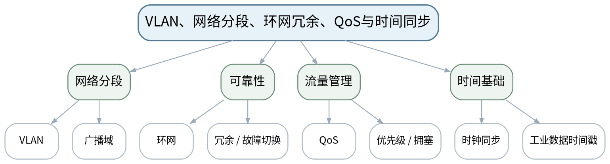 |
| 教学方法 | 讲授法、问答法、案例分析法、拓扑推演法、报文/时序分析法、方案评审法、课堂检测法 |
| 教学用具 | 电脑、投影仪、多媒体课件、教材、工业交换机拓扑图、VLAN/环网案例。 |
| 教学设计 | 课前任务→互动导入（10 min）→传授新知（70 min）→过关检测（10 min）→课堂小结（5 min）→作业布置（3 min）→考勤（2 min） |
| 参考文献 | [1] 邬贺铨, 于海斌, 杨善林.《工业互联网技术》[M]. 北京：机械工业出版社，2025。；[2] 王春峰, 朱铝芬.《工业控制网络技术应用》[M]. 北京：机械工业出版社，2025。；[3] 鲁子卉, 唐敏.《工业网络与组态技术》[M]. 北京：机械工业出版社，2024。 |

#### 教学目标

**知识目标：**
（1）理解VLAN、广播域、网络分段和基本QoS思想。 （2）理解工业环网/冗余和时间同步的工程目的。

**能力目标：**
（1）能够为PLC、HMI、工程师站、摄像/上层数据划分基础网络区域并说明边界。 （2）能够分析环路、广播风暴或错误VLAN对生产通信的影响。

**价值目标：**
（1）形成变更受控、故障隔离和生产连续性意识。

#### 课程思政

（1）通过广播风暴和错误VLAN导致停线案例强化变更审批、分区设计与可恢复意识。 （2）本课所有网络诊断、抓包、配置或仿真均强调合法授权、最小影响、真实记录与可恢复，不把未经授权的真实工业网络操作作为学习证据。

#### 专创融合

把VLAN与流量表转化为标准化车间网络模板，提高复制部署能力。

#### 教学重难点

**教学重点**：VLAN分段、冗余与流量/时间管理。

**教学难点**：理解VLAN不是安全防护的全部，冗余也需要明确故障检测和恢复机制。

#### 教学过程

| 教学步骤 | 主要教学内容 | 设计意图 |
|---|---|---|
| 课前任务 | 【教师】1. 发布本课预习范围与一份最小拓扑/报文/接口材料； 2. 要求学生标出3个核心术语和1个疑问； 3. 提醒涉及抓包、诊断、配置的内容只使用教师提供数据或明确授权环境。 【学生】1. 阅读教材与教师材料； 2. 完成一个“先预测”问题； 3. 带着问题进入课堂。 | 通过课前预习与授权边界提醒，让学生建立先备认知并形成合规使用网络工具的意识。 |
| 互动导入（10 min） | 【教师】1. 复习与本课直接相关的上一课主线； 2. 给出“所有设备都在一个广播域”的拓扑和“误接环路导致广播风暴”事件，要求学生指出结构性风险。 3. 追问“现象能够证明什么、还不能证明什么？”。 【学生】先独立判断，再与同伴交换依据，明确本次课任务目标。 | 从真实工业网络现象切入，引发认知冲突，让学生先判断再学习机制。 |
| 传授新知（共70 min） | 一、VLAN与广播域 【教师】解释网络分段、逻辑隔离和端口/链路配置的基本思路；不绑定具体厂商命令。 【学生】围绕本环节完成拓扑、报文、参数、时序或方案判断，先写预期结果，再对照教师演示/案例修正。 【课堂强化】要求每个结论附至少一条可观察证据或接口依据。  二、环网与冗余 【教师】从单点故障、链路冗余、故障恢复时间和运维可视化讨论工业环网；强调冗余机制需成套设计。 【学生】围绕本环节完成拓扑、报文、参数、时序或方案判断，先写预期结果，再对照教师演示/案例修正。 【课堂强化】要求每个结论附至少一条可观察证据或接口依据。  三、QoS与同步 【教师】介绍按业务重要性管理拥塞和时间同步对事件排序/实时控制的作用，学生完成拓扑分区与流量优先级表。 【学生】围绕本环节完成拓扑、报文、参数、时序或方案判断，先写预期结果，再对照教师演示/案例修正。 【课堂强化】要求每个结论附至少一条可观察证据或接口依据。  【形成产物】VLAN/冗余拓扑草案＋业务流量优先级表。 【学习证据】分区理由、广播域说明、冗余故障点、关键流量列表。 【评价映射】平时成绩；目标1.3、2.3、3.3。 | 按“概念/机制→数据流/时序→案例/方案→证据验证”展开，避免只记协议名，训练工程解释能力。 |
| 过关检测（10 min） | 【教师】布置课堂检测： 1. VLAN主要改变什么逻辑边界？ 2. 物理环形接线为什么必须配合正确的环网机制？ 3. QoS能否解决所有实时性问题？ 【学生】独立作答、同伴互查并标出依据； 【教师】根据错误类型集中点评并要求修正。 | 及时检验重难点，要求结论附依据，暴露地址、协议、性能和边界混淆。 |
| 课堂小结（5 min） | 【教师】1. 本次课解决的关键问题是：VLAN、网络分段、环网冗余、QoS与时间同步； 2. 需要重点掌握的主线是：VLAN分段、冗余与流量/时间管理。； 3. 最值得带走的方法是“分层/分角色/分数据流并以证据验证”； 4. 需要警惕的易错点是：理解VLAN不是安全防护的全部，冗余也需要明确故障检测和恢复机制。 【学生】用1分钟写下“一条规则＋一条证据边界”。 | 回到知识脉络图压缩主线，形成可迁移的分层分析方法。 |
| 作业布置（3 min） | 【教师】1. 为一条含控制、监控、视频和MES数据的产线设计基础VLAN/分区方案，写出变更前检查与回退项。 【要求】不只写结论，还要写拓扑/接口/报文/参数依据和验证方法；涉及网络工具只在授权环境或教师提供数据上完成。 【学生】按课程命名规范整理提交。 | 固化拓扑、接口、报文或方案证据，衔接下一课并为课程作业/期末综合方案积累素材。 |
| 考勤（2 min） | 【教师】利用学习通/课堂点名完成签到；不在教案中预填出勤事实。 【学生】按课堂要求完成签到。 | 保留学校课堂管理环节，不预填实际出勤事实。 |

#### 教学反思

【教师】课后重点从以下方面进行教学反思： 1. 教学流程：导入是否把学生带入“VLAN、网络分段、环网冗余、QoS与时间同步”的问题情境，70分钟主线是否由浅入深； 2. 教学内容：重点检查“理解VLAN不是安全防护的全部，冗余也需要明确故障检测和恢复机制。”是否讲清，学生是否停留在术语记忆； 3. 学生参与：记录拓扑/报文/方案判断是否均衡，是否存在“会听不会解释证据”的情况； 4. 教学改进：依据真实课堂表现决定是否增加抓包演示、时序对比、错例或方案评审。

### lesson-11

| 字段 | 内容 |
|---|---|
| 章节 | 第三单元 工业以太网与交换网络设计 |
| 授课题目 | PROFINET体系、IO Controller/Device与周期数据 |
| 周次 | 第6周（第11次课） |
| 课时安排 | 2课时（100 min）；类型：理论2 |
| 知识脉络图 | 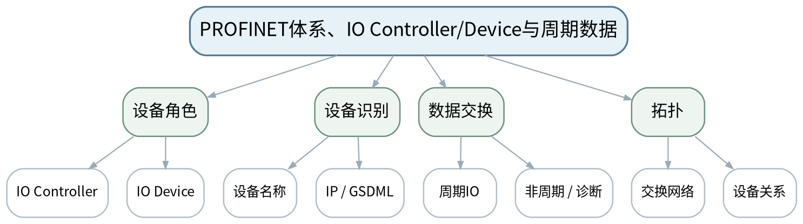 |
| 教学方法 | 讲授法、问答法、案例分析法、拓扑推演法、报文/时序分析法、方案评审法、课堂检测法 |
| 教学用具 | 电脑、投影仪、多媒体课件、教材、PROFINET拓扑/设备描述示意、数据点表。 |
| 教学设计 | 课前任务→互动导入（10 min）→传授新知（70 min）→过关检测（10 min）→课堂小结（5 min）→作业布置（3 min）→考勤（2 min） |
| 参考文献 | [1] 邬贺铨, 于海斌, 杨善林.《工业互联网技术》[M]. 北京：机械工业出版社，2025。；[2] 王春峰, 朱铝芬.《工业控制网络技术应用》[M]. 北京：机械工业出版社，2025。；[3] 鲁子卉, 唐敏.《工业网络与组态技术》[M]. 北京：机械工业出版社，2024。 |

#### 教学目标

**知识目标：**
（1）理解PROFINET的IO Controller、IO Device、设备名称和GSDML等关键概念。 （2）理解周期IO数据与非周期参数/诊断信息的基本区别。

**能力目标：**
（1）能够识读PROFINET拓扑并说明控制器与设备关系。 （2）能够依据设备名称、IP和模块/数据点表分析常见配置不一致。

**价值目标：**
（1）形成设备描述、命名和配置版本一致的工程意识。

#### 课程思政

（1）通过配置版本和设备名称错误案例强调按配置基线实施、变更可追溯。 （2）本课所有网络诊断、抓包、配置或仿真均强调合法授权、最小影响、真实记录与可恢复，不把未经授权的真实工业网络操作作为学习证据。

#### 专创融合

把设备核对表做成产线标准接入模板，降低多厂商设备接入成本。

#### 教学重难点

**教学重点**：PROFINET设备关系、设备识别与周期数据。

**教学难点**：设备名称、IP和设备描述文件共同参与工程配置，不能只看某一个地址。

#### 教学过程

| 教学步骤 | 主要教学内容 | 设计意图 |
|---|---|---|
| 课前任务 | 【教师】1. 发布本课预习范围与一份最小拓扑/报文/接口材料； 2. 要求学生标出3个核心术语和1个疑问； 3. 提醒涉及抓包、诊断、配置的内容只使用教师提供数据或明确授权环境。 【学生】1. 阅读教材与教师材料； 2. 完成一个“先预测”问题； 3. 带着问题进入课堂。 | 通过课前预习与授权边界提醒，让学生建立先备认知并形成合规使用网络工具的意识。 |
| 互动导入（10 min） | 【教师】1. 复习与本课直接相关的上一课主线； 2. 展示“IP正确但设备名称错误”的PROFINET故障情景，提问为什么基础IP通了仍可能无法建立正确IO关系。 3. 追问“现象能够证明什么、还不能证明什么？”。 【学生】先独立判断，再与同伴交换依据，明确本次课任务目标。 | 从真实工业网络现象切入，引发认知冲突，让学生先判断再学习机制。 |
| 传授新知（共70 min） | 一、体系与角色 【教师】讲IO Controller/Device关系、工程组态和设备描述信息，说明PROFINET运行在工业以太网基础之上。 【学生】围绕本环节完成拓扑、报文、参数、时序或方案判断，先写预期结果，再对照教师演示/案例修正。 【课堂强化】要求每个结论附至少一条可观察证据或接口依据。  二、设备识别与GSDML 【教师】解释设备名称、IP与GSDML的角色，强调版本/模块匹配和配置记录。 【学生】围绕本环节完成拓扑、报文、参数、时序或方案判断，先写预期结果，再对照教师演示/案例修正。 【课堂强化】要求每个结论附至少一条可观察证据或接口依据。  三、周期数据与诊断 【教师】区分周期过程数据、非周期参数/诊断；学生用教师提供拓扑和数据点表画“控制器—设备—模块—IO”链。 【学生】围绕本环节完成拓扑、报文、参数、时序或方案判断，先写预期结果，再对照教师演示/案例修正。 【课堂强化】要求每个结论附至少一条可观察证据或接口依据。  【形成产物】PROFINET设备关系图＋设备名称/IP/GSDML核对表。 【学习证据】角色图、核对表、周期/非周期数据分类。 【评价映射】平时成绩；目标1.3、2.3、3.3。 | 按“概念/机制→数据流/时序→案例/方案→证据验证”展开，避免只记协议名，训练工程解释能力。 |
| 过关检测（10 min） | 【教师】布置课堂检测： 1. IO Controller与IO Device各是什么角色？ 2. 设备名称与IP地址能否互相完全替代？ 3. 周期IO与诊断数据的目的有何不同？ 【学生】独立作答、同伴互查并标出依据； 【教师】根据错误类型集中点评并要求修正。 | 及时检验重难点，要求结论附依据，暴露地址、协议、性能和边界混淆。 |
| 课堂小结（5 min） | 【教师】1. 本次课解决的关键问题是：PROFINET体系、IO Controller/Device与周期数据； 2. 需要重点掌握的主线是：PROFINET设备关系、设备识别与周期数据。； 3. 最值得带走的方法是“分层/分角色/分数据流并以证据验证”； 4. 需要警惕的易错点是：设备名称、IP和设备描述文件共同参与工程配置，不能只看某一个地址。 【学生】用1分钟写下“一条规则＋一条证据边界”。 | 回到知识脉络图压缩主线，形成可迁移的分层分析方法。 |
| 作业布置（3 min） | 【教师】1. 根据教师提供的PROFINET设备清单，完成名称、IP、描述文件、模块和关键IO数据核对表。 【要求】不只写结论，还要写拓扑/接口/报文/参数依据和验证方法；涉及网络工具只在授权环境或教师提供数据上完成。 【学生】按课程命名规范整理提交。 | 固化拓扑、接口、报文或方案证据，衔接下一课并为课程作业/期末综合方案积累素材。 |
| 考勤（2 min） | 【教师】利用学习通/课堂点名完成签到；不在教案中预填出勤事实。 【学生】按课堂要求完成签到。 | 保留学校课堂管理环节，不预填实际出勤事实。 |

#### 教学反思

【教师】课后重点从以下方面进行教学反思： 1. 教学流程：导入是否把学生带入“PROFINET体系、IO Controller/Device与周期数据”的问题情境，70分钟主线是否由浅入深； 2. 教学内容：重点检查“设备名称、IP和设备描述文件共同参与工程配置，不能只看某一个地址。”是否讲清，学生是否停留在术语记忆； 3. 学生参与：记录拓扑/报文/方案判断是否均衡，是否存在“会听不会解释证据”的情况； 4. 教学改进：依据真实课堂表现决定是否增加抓包演示、时序对比、错例或方案评审。

### lesson-12

| 字段 | 内容 |
|---|---|
| 章节 | 第三单元 工业以太网与交换网络设计 |
| 授课题目 | PROFINET诊断、交换网络方案与EtherNet/IP概览 |
| 周次 | 第6周（第12次课） |
| 课时安排 | 2课时（100 min）；类型：理论2 |
| 知识脉络图 | 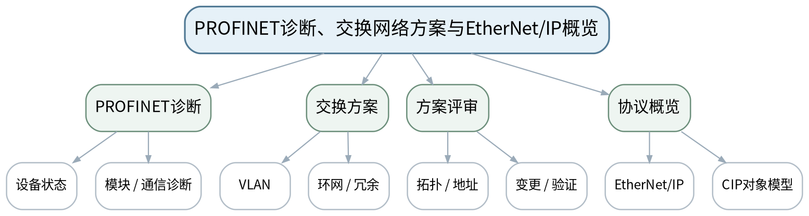 |
| 教学方法 | 讲授法、问答法、案例分析法、拓扑推演法、报文/时序分析法、方案评审法、课堂检测法 |
| 教学用具 | 电脑、投影仪、多媒体课件、教材、PROFINET故障案例、交换机端口统计样例。 |
| 教学设计 | 课前任务→互动导入（10 min）→传授新知（70 min）→过关检测（10 min）→课堂小结（5 min）→作业布置（3 min）→考勤（2 min） |
| 参考文献 | [1] 邬贺铨, 于海斌, 杨善林.《工业互联网技术》[M]. 北京：机械工业出版社，2025。；[2] 王春峰, 朱铝芬.《工业控制网络技术应用》[M]. 北京：机械工业出版社，2025。；[5] 刘科, 王峰.《工业网络及应用技术》[M]. 北京：高等教育出版社，2022。 |

#### 教学目标

**知识目标：**
（1）理解PROFINET诊断信息的层级和交换网络对PROFINET可用性的影响。 （2）了解EtherNet/IP与CIP对象模型的基本定位。

**能力目标：**
（1）能够对PROFINET掉站/配置不一致案例提出分层诊断顺序。 （2）能够设计包含VLAN、冗余和设备关系的基础工业以太网拓扑。

**价值目标：**
（1）形成网络变更受控、故障隔离和方案可回退意识。

#### 课程思政

（1）通过网络环路、广播风暴和错误VLAN案例强化变更审批、分区设计和生产连续性责任。 （2）本课所有网络诊断、抓包、配置或仿真均强调合法授权、最小影响、真实记录与可恢复，不把未经授权的真实工业网络操作作为学习证据。

#### 专创融合

把拓扑、资产表和诊断树整合为“可交付网络文档包”。

#### 教学重难点

**教学重点**：PROFINET诊断与交换网络方案；EtherNet/IP/CIP定位。

**教学难点**：不要把所有“设备掉站”都归因于协议，需同时查物理、交换、地址、配置和设备状态。

#### 教学过程

| 教学步骤 | 主要教学内容 | 设计意图 |
|---|---|---|
| 课前任务 | 【教师】1. 发布本课预习范围与一份最小拓扑/报文/接口材料； 2. 要求学生标出3个核心术语和1个疑问； 3. 提醒涉及抓包、诊断、配置的内容只使用教师提供数据或明确授权环境。 【学生】1. 阅读教材与教师材料； 2. 完成一个“先预测”问题； 3. 带着问题进入课堂。 | 通过课前预习与授权边界提醒，让学生建立先备认知并形成合规使用网络工具的意识。 |
| 互动导入（10 min） | 【教师】1. 复习与本课直接相关的上一课主线； 2. 给出“某IO Device间歇掉站”案例，仅提供交换机端口统计、设备诊断和拓扑，让学生按证据排查。 3. 追问“现象能够证明什么、还不能证明什么？”。 【学生】先独立判断，再与同伴交换依据，明确本次课任务目标。 | 从真实工业网络现象切入，引发认知冲突，让学生先判断再学习机制。 |
| 传授新知（共70 min） | 一、PROFINET分层诊断 【教师】从链路、交换、名称/IP、设备描述、模块/IO、设备状态构建诊断树。 【学生】围绕本环节完成拓扑、报文、参数、时序或方案判断，先写预期结果，再对照教师演示/案例修正。 【课堂强化】要求每个结论附至少一条可观察证据或接口依据。  二、网络方案评审 【教师】学生把VLAN、环网、设备角色与地址表合成一张PROFINET车间拓扑，标注故障域和回退方案。 【学生】围绕本环节完成拓扑、报文、参数、时序或方案判断，先写预期结果，再对照教师演示/案例修正。 【课堂强化】要求每个结论附至少一条可观察证据或接口依据。  三、EtherNet/IP概览 【教师】以“另一类工业以太网”说明EtherNet/IP和CIP对象模型的定位，重点比较抽象思路而非厂商配置。 【学生】围绕本环节完成拓扑、报文、参数、时序或方案判断，先写预期结果，再对照教师演示/案例修正。 【课堂强化】要求每个结论附至少一条可观察证据或接口依据。  【形成产物】课程作业阶段3：工业以太网/PROFINET拓扑与故障分析（课程作业内部20%）。 【学习证据】网络方案图、诊断树、变更/回退清单、协议比较表。 【评价映射】课程作业阶段3；目标1.3、2.3、3.3。 | 按“概念/机制→数据流/时序→案例/方案→证据验证”展开，避免只记协议名，训练工程解释能力。 |
| 过关检测（10 min） | 【教师】布置课堂检测： 1. PROFINET掉站时为什么要先查链路和交换层？ 2. 一份可维护网络方案为何必须同时有拓扑和地址/设备清单？ 3. EtherNet/IP中的CIP概念与“仅看IP端口”有何不同？ 【学生】独立作答、同伴互查并标出依据； 【教师】根据错误类型集中点评并要求修正。 | 及时检验重难点，要求结论附依据，暴露地址、协议、性能和边界混淆。 |
| 课堂小结（5 min） | 【教师】1. 本次课解决的关键问题是：PROFINET诊断、交换网络方案与EtherNet/IP概览； 2. 需要重点掌握的主线是：PROFINET诊断与交换网络方案；EtherNet/IP/CIP定位。； 3. 最值得带走的方法是“分层/分角色/分数据流并以证据验证”； 4. 需要警惕的易错点是：不要把所有“设备掉站”都归因于协议，需同时查物理、交换、地址、配置和设备状态。 【学生】用1分钟写下“一条规则＋一条证据边界”。 | 回到知识脉络图压缩主线，形成可迁移的分层分析方法。 |
| 作业布置（3 min） | 【教师】1. 提交阶段作业3：工业以太网拓扑、VLAN/冗余、PROFINET设备关系、一个故障诊断树和回退说明。 【要求】不只写结论，还要写拓扑/接口/报文/参数依据和验证方法；涉及网络工具只在授权环境或教师提供数据上完成。 【学生】按课程命名规范整理提交。 | 固化拓扑、接口、报文或方案证据，衔接下一课并为课程作业/期末综合方案积累素材。 |
| 考勤（2 min） | 【教师】利用学习通/课堂点名完成签到；不在教案中预填出勤事实。 【学生】按课堂要求完成签到。 | 保留学校课堂管理环节，不预填实际出勤事实。 |

#### 教学反思

【教师】课后重点从以下方面进行教学反思： 1. 教学流程：导入是否把学生带入“PROFINET诊断、交换网络方案与EtherNet/IP概览”的问题情境，70分钟主线是否由浅入深； 2. 教学内容：重点检查“不要把所有“设备掉站”都归因于协议，需同时查物理、交换、地址、配置和设备状态。”是否讲清，学生是否停留在术语记忆； 3. 学生参与：记录拓扑/报文/方案判断是否均衡，是否存在“会听不会解释证据”的情况； 4. 教学改进：依据真实课堂表现决定是否增加抓包演示、时序对比、错例或方案评审。

### lesson-13

| 字段 | 内容 |
|---|---|
| 章节 | 第四单元 实时工业以太网、EtherCAT与TSN |
| 授课题目 | 工业实时通信需求与PROFINET RT/IRT概念 |
| 周次 | 第7周（第13次课） |
| 课时安排 | 2课时（100 min）；类型：理论2 |
| 知识脉络图 | 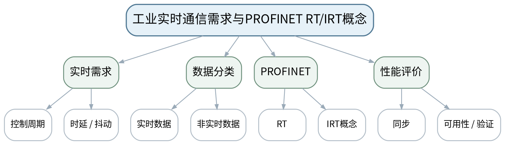 |
| 教学方法 | 讲授法、问答法、案例分析法、拓扑推演法、报文/时序分析法、方案评审法、课堂检测法 |
| 教学用具 | 电脑、投影仪、多媒体课件、教材、实时通信时序图、性能案例数据。 |
| 教学设计 | 课前任务→互动导入（10 min）→传授新知（70 min）→过关检测（10 min）→课堂小结（5 min）→作业布置（3 min）→考勤（2 min） |
| 参考文献 | [1] 邬贺铨, 于海斌, 杨善林.《工业互联网技术》[M]. 北京：机械工业出版社，2025。；[2] 王春峰, 朱铝芬.《工业控制网络技术应用》[M]. 北京：机械工业出版社，2025。 |

#### 教学目标

**知识目标：**
（1）理解工业实时通信中的时延、抖动、同步、周期和确定性需求。 （2）理解PROFINET RT/IRT的概念定位及实时/非实时数据区分。

**能力目标：**
（1）能够根据机器人、运动控制、一般IO与监控数据判断实时性优先级。 （2）能够用时延、抖动、同步和可用性描述实时网络需求。

**价值目标：**
（1）形成“性能指标必须可测量、可验证”的意识。

#### 课程思政

（1）以高速装备/机器人对同步和时限的要求强调性能指标必须可测量，不夸大协议能力。 （2）本课所有网络诊断、抓包、配置或仿真均强调合法授权、最小影响、真实记录与可恢复，不把未经授权的真实工业网络操作作为学习证据。

#### 专创融合

将实时性需求矩阵转化为设备/网络选型评审表。

#### 教学重难点

**教学重点**：工业实时通信指标与PROFINET RT/IRT定位。

**教学难点**：理解“平均很快”不等于“确定性好”，并能从业务周期推导评价指标。

#### 教学过程

| 教学步骤 | 主要教学内容 | 设计意图 |
|---|---|---|
| 课前任务 | 【教师】1. 发布本课预习范围与一份最小拓扑/报文/接口材料； 2. 要求学生标出3个核心术语和1个疑问； 3. 提醒涉及抓包、诊断、配置的内容只使用教师提供数据或明确授权环境。 【学生】1. 阅读教材与教师材料； 2. 完成一个“先预测”问题； 3. 带着问题进入课堂。 | 通过课前预习与授权边界提醒，让学生建立先备认知并形成合规使用网络工具的意识。 |
| 互动导入（10 min） | 【教师】1. 复习与本课直接相关的上一课主线； 2. 给出两条网络：平均时延相同，但一条抖动很大，问运动控制更可能选择哪条以及为什么。 3. 追问“现象能够证明什么、还不能证明什么？”。 【学生】先独立判断，再与同伴交换依据，明确本次课任务目标。 | 从真实工业网络现象切入，引发认知冲突，让学生先判断再学习机制。 |
| 传授新知（共70 min） | 一、实时通信问题 【教师】从机器人协调、运动控制、一般IO、HMI/MES数据的时限差异说明“实时不是一个固定数值”。 【学生】围绕本环节完成拓扑、报文、参数、时序或方案判断，先写预期结果，再对照教师演示/案例修正。 【课堂强化】要求每个结论附至少一条可观察证据或接口依据。  二、PROFINET RT/IRT概念 【教师】介绍实时数据与非实时数据、RT/IRT定位和同步要求，强调课程只讲机制/边界，不做厂商组态。 【学生】围绕本环节完成拓扑、报文、参数、时序或方案判断，先写预期结果，再对照教师演示/案例修正。 【课堂强化】要求每个结论附至少一条可观察证据或接口依据。  三、指标练习 【教师】学生为4类业务建立时延、抖动、同步、带宽、可用性优先级矩阵，并写验证方法。 【学生】围绕本环节完成拓扑、报文、参数、时序或方案判断，先写预期结果，再对照教师演示/案例修正。 【课堂强化】要求每个结论附至少一条可观察证据或接口依据。  【形成产物】实时通信需求矩阵＋PROFINET RT/IRT概念对照。 【学习证据】需求矩阵、性能指标解释、验证方法。 【评价映射】平时成绩；目标1.4、2.4、3.4。 | 按“概念/机制→数据流/时序→案例/方案→证据验证”展开，避免只记协议名，训练工程解释能力。 |
| 过关检测（10 min） | 【教师】布置课堂检测： 1. 平均时延与抖动分别反映什么？ 2. 为什么运动控制更关注可预测性？ 3. RT/IRT选择应由协议名称还是业务需求决定？ 【学生】独立作答、同伴互查并标出依据； 【教师】根据错误类型集中点评并要求修正。 | 及时检验重难点，要求结论附依据，暴露地址、协议、性能和边界混淆。 |
| 课堂小结（5 min） | 【教师】1. 本次课解决的关键问题是：工业实时通信需求与PROFINET RT/IRT概念； 2. 需要重点掌握的主线是：工业实时通信指标与PROFINET RT/IRT定位。； 3. 最值得带走的方法是“分层/分角色/分数据流并以证据验证”； 4. 需要警惕的易错点是：理解“平均很快”不等于“确定性好”，并能从业务周期推导评价指标。 【学生】用1分钟写下“一条规则＋一条证据边界”。 | 回到知识脉络图压缩主线，形成可迁移的分层分析方法。 |
| 作业布置（3 min） | 【教师】1. 为“机器人工作站＋远程IO＋SCADA”分别定义实时性需求和可验证证据。 【要求】不只写结论，还要写拓扑/接口/报文/参数依据和验证方法；涉及网络工具只在授权环境或教师提供数据上完成。 【学生】按课程命名规范整理提交。 | 固化拓扑、接口、报文或方案证据，衔接下一课并为课程作业/期末综合方案积累素材。 |
| 考勤（2 min） | 【教师】利用学习通/课堂点名完成签到；不在教案中预填出勤事实。 【学生】按课堂要求完成签到。 | 保留学校课堂管理环节，不预填实际出勤事实。 |

#### 教学反思

【教师】课后重点从以下方面进行教学反思： 1. 教学流程：导入是否把学生带入“工业实时通信需求与PROFINET RT/IRT概念”的问题情境，70分钟主线是否由浅入深； 2. 教学内容：重点检查“理解“平均很快”不等于“确定性好”，并能从业务周期推导评价指标。”是否讲清，学生是否停留在术语记忆； 3. 学生参与：记录拓扑/报文/方案判断是否均衡，是否存在“会听不会解释证据”的情况； 4. 教学改进：依据真实课堂表现决定是否增加抓包演示、时序对比、错例或方案评审。

### lesson-14

| 字段 | 内容 |
|---|---|
| 章节 | 第四单元 实时工业以太网、EtherCAT与TSN |
| 授课题目 | EtherCAT主从结构、帧处理与过程数据映射 |
| 周次 | 第7周（第14次课） |
| 课时安排 | 2课时（100 min）；类型：理论2 |
| 知识脉络图 | 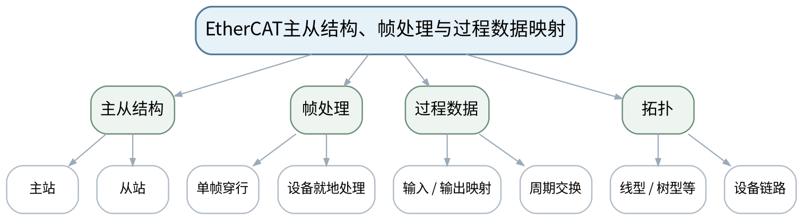 |
| 教学方法 | 讲授法、问答法、案例分析法、拓扑推演法、报文/时序分析法、方案评审法、课堂检测法 |
| 教学用具 | 电脑、投影仪、多媒体课件、教材、EtherCAT时序与拓扑示意、过程数据表。 |
| 教学设计 | 课前任务→互动导入（10 min）→传授新知（70 min）→过关检测（10 min）→课堂小结（5 min）→作业布置（3 min）→考勤（2 min） |
| 参考文献 | [1] 邬贺铨, 于海斌, 杨善林.《工业互联网技术》[M]. 北京：机械工业出版社，2025。；[2] 王春峰, 朱铝芬.《工业控制网络技术应用》[M]. 北京：机械工业出版社，2025。 |

#### 教学目标

**知识目标：**
（1）理解EtherCAT主从结构、帧穿行处理和过程数据映射的基本机制。 （2）理解其拓扑灵活性和实时通信的设计思路。

**能力目标：**
（1）能够沿EtherCAT帧经过多个从站的路径解释数据如何被读写。 （2）能够根据简单过程数据表画出主站与从站的数据映射关系。

**价值目标：**
（1）形成从“协议机制—时序—数据映射”解释性能的习惯。

#### 课程思政

（1）通过过程数据错映射可能导致动作错误的案例强化接口复核与试运行安全。 （2）本课所有网络诊断、抓包、配置或仿真均强调合法授权、最小影响、真实记录与可恢复，不把未经授权的真实工业网络操作作为学习证据。

#### 专创融合

把过程数据映射表作为运动控制/装备集成的标准接口资产。

#### 教学重难点

**教学重点**：EtherCAT帧处理与过程数据映射。

**教学难点**：理解“经过每个从站处理同一帧”的机制，不把EtherCAT简单理解为普通逐站TCP通信。

#### 教学过程

| 教学步骤 | 主要教学内容 | 设计意图 |
|---|---|---|
| 课前任务 | 【教师】1. 发布本课预习范围与一份最小拓扑/报文/接口材料； 2. 要求学生标出3个核心术语和1个疑问； 3. 提醒涉及抓包、诊断、配置的内容只使用教师提供数据或明确授权环境。 【学生】1. 阅读教材与教师材料； 2. 完成一个“先预测”问题； 3. 带着问题进入课堂。 | 通过课前预习与授权边界提醒，让学生建立先备认知并形成合规使用网络工具的意识。 |
| 互动导入（10 min） | 【教师】1. 复习与本课直接相关的上一课主线； 2. 对比“主站分别向10个设备发10次请求”和“帧沿从站链处理”的示意图，要求学生描述两种组织方式差异。 3. 追问“现象能够证明什么、还不能证明什么？”。 【学生】先独立判断，再与同伴交换依据，明确本次课任务目标。 | 从真实工业网络现象切入，引发认知冲突，让学生先判断再学习机制。 |
| 传授新知（共70 min） | 一、主从与拓扑 【教师】说明主站调度、从站过程数据和典型线型/分支拓扑，避免绑定具体主站软件。 【学生】围绕本环节完成拓扑、报文、参数、时序或方案判断，先写预期结果，再对照教师演示/案例修正。 【课堂强化】要求每个结论附至少一条可观察证据或接口依据。  二、帧处理机制 【教师】用时序示意解释EtherCAT帧经过从站时就地读取/写入过程数据的概念。 【学生】围绕本环节完成拓扑、报文、参数、时序或方案判断，先写预期结果，再对照教师演示/案例修正。 【课堂强化】要求每个结论附至少一条可观察证据或接口依据。  三、数据映射 【教师】学生依据教师提供I/O表完成逻辑过程数据映射并标注输入/输出方向和周期。 【学生】围绕本环节完成拓扑、报文、参数、时序或方案判断，先写预期结果，再对照教师演示/案例修正。 【课堂强化】要求每个结论附至少一条可观察证据或接口依据。  【形成产物】EtherCAT帧路径图＋过程数据映射表。 【学习证据】路径图、I/O映射、时序解释。 【评价映射】平时成绩；目标1.4、2.4、3.4。 | 按“概念/机制→数据流/时序→案例/方案→证据验证”展开，避免只记协议名，训练工程解释能力。 |
| 过关检测（10 min） | 【教师】布置课堂检测： 1. EtherCAT中的主站负责什么？ 2. “帧穿行处理”与逐设备独立请求有何组织差别？ 3. 过程数据映射为什么要记录方向和周期？ 【学生】独立作答、同伴互查并标出依据； 【教师】根据错误类型集中点评并要求修正。 | 及时检验重难点，要求结论附依据，暴露地址、协议、性能和边界混淆。 |
| 课堂小结（5 min） | 【教师】1. 本次课解决的关键问题是：EtherCAT主从结构、帧处理与过程数据映射； 2. 需要重点掌握的主线是：EtherCAT帧处理与过程数据映射。； 3. 最值得带走的方法是“分层/分角色/分数据流并以证据验证”； 4. 需要警惕的易错点是：理解“经过每个从站处理同一帧”的机制，不把EtherCAT简单理解为普通逐站TCP通信。 【学生】用1分钟写下“一条规则＋一条证据边界”。 | 回到知识脉络图压缩主线，形成可迁移的分层分析方法。 |
| 作业布置（3 min） | 【教师】1. 根据教师提供的6个从站I/O清单完成过程数据映射，并写出一个配置错位可能造成的现象。 【要求】不只写结论，还要写拓扑/接口/报文/参数依据和验证方法；涉及网络工具只在授权环境或教师提供数据上完成。 【学生】按课程命名规范整理提交。 | 固化拓扑、接口、报文或方案证据，衔接下一课并为课程作业/期末综合方案积累素材。 |
| 考勤（2 min） | 【教师】利用学习通/课堂点名完成签到；不在教案中预填出勤事实。 【学生】按课堂要求完成签到。 | 保留学校课堂管理环节，不预填实际出勤事实。 |

#### 教学反思

【教师】课后重点从以下方面进行教学反思： 1. 教学流程：导入是否把学生带入“EtherCAT主从结构、帧处理与过程数据映射”的问题情境，70分钟主线是否由浅入深； 2. 教学内容：重点检查“理解“经过每个从站处理同一帧”的机制，不把EtherCAT简单理解为普通逐站TCP通信。”是否讲清，学生是否停留在术语记忆； 3. 学生参与：记录拓扑/报文/方案判断是否均衡，是否存在“会听不会解释证据”的情况； 4. 教学改进：依据真实课堂表现决定是否增加抓包演示、时序对比、错例或方案评审。

### lesson-15

| 字段 | 内容 |
|---|---|
| 章节 | 第四单元 实时工业以太网、EtherCAT与TSN |
| 授课题目 | EtherCAT分布式时钟、同步与PROFINET/EtherCAT比较 |
| 周次 | 第8周（第15次课） |
| 课时安排 | 2课时（100 min）；类型：理论2 |
| 知识脉络图 | 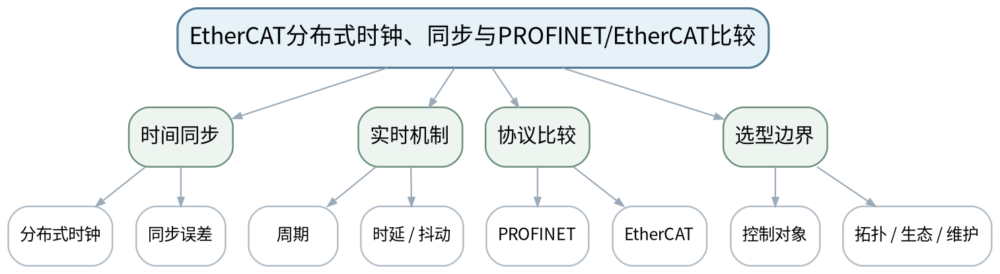 |
| 教学方法 | 讲授法、问答法、案例分析法、拓扑推演法、报文/时序分析法、方案评审法、课堂检测法 |
| 教学用具 | 电脑、投影仪、多媒体课件、教材、同步时序图、协议对比表。 |
| 教学设计 | 课前任务→互动导入（10 min）→传授新知（70 min）→过关检测（10 min）→课堂小结（5 min）→作业布置（3 min）→考勤（2 min） |
| 参考文献 | [1] 邬贺铨, 于海斌, 杨善林.《工业互联网技术》[M]. 北京：机械工业出版社，2025。；[2] 王春峰, 朱铝芬.《工业控制网络技术应用》[M]. 北京：机械工业出版社，2025。；[5] 刘科, 王峰.《工业网络及应用技术》[M]. 北京：高等教育出版社，2022。 |

#### 教学目标

**知识目标：**
（1）理解EtherCAT分布式时钟的同步目的和过程数据同步要求。 （2）能够从实时性、同步、拓扑和工程生态角度比较PROFINET与EtherCAT。

**能力目标：**
（1）能够为一般IO、机器人和多轴运动控制场景提出协议选型理由。 （2）能够识别“单纯比峰值速度”式选型的不足。

**价值目标：**
（1）形成按场景、指标、生态和维护综合选型的工程意识。

#### 课程思政

（1）强调技术论证要说明边界和依据，不把厂商宣传或单一指标当成绝对结论。 （2）本课所有网络诊断、抓包、配置或仿真均强调合法授权、最小影响、真实记录与可恢复，不把未经授权的真实工业网络操作作为学习证据。

#### 专创融合

把协议选型矩阵作为技术方案评审模板，训练工程咨询与技术服务能力。

#### 教学重难点

**教学重点**：EtherCAT同步；PROFINET/EtherCAT适用边界。

**教学难点**：技术比较不能绝对化，需要区分机制、目标场景和工程约束。

#### 教学过程

| 教学步骤 | 主要教学内容 | 设计意图 |
|---|---|---|
| 课前任务 | 【教师】1. 发布本课预习范围与一份最小拓扑/报文/接口材料； 2. 要求学生标出3个核心术语和1个疑问； 3. 提醒涉及抓包、诊断、配置的内容只使用教师提供数据或明确授权环境。 【学生】1. 阅读教材与教师材料； 2. 完成一个“先预测”问题； 3. 带着问题进入课堂。 | 通过课前预习与授权边界提醒，让学生建立先备认知并形成合规使用网络工具的意识。 |
| 互动导入（10 min） | 【教师】1. 复习与本课直接相关的上一课主线； 2. 展示“某厂要求统一使用现有PROFINET设备生态”与“新建多轴高速运动控制”两个需求，让学生判断为什么协议选择可能不同。 3. 追问“现象能够证明什么、还不能证明什么？”。 【学生】先独立判断，再与同伴交换依据，明确本次课任务目标。 | 从真实工业网络现象切入，引发认知冲突，让学生先判断再学习机制。 |
| 传授新知（共70 min） | 一、分布式时钟 【教师】解释多从站时间一致性的目的、同步误差与协同动作的关系，不展开标准寄存器细节。 【学生】围绕本环节完成拓扑、报文、参数、时序或方案判断，先写预期结果，再对照教师演示/案例修正。 【课堂强化】要求每个结论附至少一条可观察证据或接口依据。  二、PROFINET/EtherCAT比较 【教师】从实时机制、数据组织、拓扑、设备生态、诊断/维护等维度进行证据化比较。 【学生】围绕本环节完成拓扑、报文、参数、时序或方案判断，先写预期结果，再对照教师演示/案例修正。 【课堂强化】要求每个结论附至少一条可观察证据或接口依据。  三、选型评审 【教师】学生为3个场景完成“需求—指标—协议—理由—风险”的选型表，同伴指出过度绝对化表述。 【学生】围绕本环节完成拓扑、报文、参数、时序或方案判断，先写预期结果，再对照教师演示/案例修正。 【课堂强化】要求每个结论附至少一条可观察证据或接口依据。  【形成产物】PROFINET/EtherCAT场景选型矩阵。 【学习证据】协议比较矩阵、需求指标、选型理由与风险。 【评价映射】平时成绩；目标1.4、2.4、3.4。 | 按“概念/机制→数据流/时序→案例/方案→证据验证”展开，避免只记协议名，训练工程解释能力。 |
| 过关检测（10 min） | 【教师】布置课堂检测： 1. 分布式时钟主要解决什么问题？ 2. 为什么不能只用“谁更快”比较工业实时协议？ 3. 设备生态与维护能力为什么属于选型条件？ 【学生】独立作答、同伴互查并标出依据； 【教师】根据错误类型集中点评并要求修正。 | 及时检验重难点，要求结论附依据，暴露地址、协议、性能和边界混淆。 |
| 课堂小结（5 min） | 【教师】1. 本次课解决的关键问题是：EtherCAT分布式时钟、同步与PROFINET/EtherCAT比较； 2. 需要重点掌握的主线是：EtherCAT同步；PROFINET/EtherCAT适用边界。； 3. 最值得带走的方法是“分层/分角色/分数据流并以证据验证”； 4. 需要警惕的易错点是：技术比较不能绝对化，需要区分机制、目标场景和工程约束。 【学生】用1分钟写下“一条规则＋一条证据边界”。 | 回到知识脉络图压缩主线，形成可迁移的分层分析方法。 |
| 作业布置（3 min） | 【教师】1. 写一页协议选型论证：选择一个智能装备场景，说明为什么选择/不选择PROFINET或EtherCAT。 【要求】不只写结论，还要写拓扑/接口/报文/参数依据和验证方法；涉及网络工具只在授权环境或教师提供数据上完成。 【学生】按课程命名规范整理提交。 | 固化拓扑、接口、报文或方案证据，衔接下一课并为课程作业/期末综合方案积累素材。 |
| 考勤（2 min） | 【教师】利用学习通/课堂点名完成签到；不在教案中预填出勤事实。 【学生】按课堂要求完成签到。 | 保留学校课堂管理环节，不预填实际出勤事实。 |

#### 教学反思

【教师】课后重点从以下方面进行教学反思： 1. 教学流程：导入是否把学生带入“EtherCAT分布式时钟、同步与PROFINET/EtherCAT比较”的问题情境，70分钟主线是否由浅入深； 2. 教学内容：重点检查“技术比较不能绝对化，需要区分机制、目标场景和工程约束。”是否讲清，学生是否停留在术语记忆； 3. 学生参与：记录拓扑/报文/方案判断是否均衡，是否存在“会听不会解释证据”的情况； 4. 教学改进：依据真实课堂表现决定是否增加抓包演示、时序对比、错例或方案评审。

### lesson-16

| 字段 | 内容 |
|---|---|
| 章节 | 第四单元 实时工业以太网、EtherCAT与TSN |
| 授课题目 | TSN基本机制与确定性网络性能评价 |
| 周次 | 第8周（第16次课） |
| 课时安排 | 2课时（100 min）；类型：理论2 |
| 知识脉络图 | 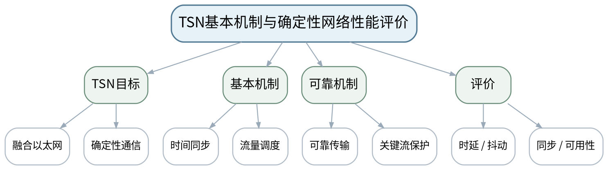 |
| 教学方法 | 讲授法、问答法、案例分析法、拓扑推演法、报文/时序分析法、方案评审法、课堂检测法 |
| 教学用具 | 电脑、投影仪、多媒体课件、教材、TSN机制示意、实时协议比较案例。 |
| 教学设计 | 课前任务→互动导入（10 min）→传授新知（70 min）→过关检测（10 min）→课堂小结（5 min）→作业布置（3 min）→考勤（2 min） |
| 参考文献 | [1] 邬贺铨, 于海斌, 杨善林.《工业互联网技术》[M]. 北京：机械工业出版社，2025。；[5] 刘科, 王峰.《工业网络及应用技术》[M]. 北京：高等教育出版社，2022。 |

#### 教学目标

**知识目标：**
（1）理解TSN面向确定性以太网的基本目标以及时间同步、流量调度、可靠传输等基本机制。 （2）理解确定性网络性能需要多维度评价。

**能力目标：**
（1）能够比较传统尽力而为以太网与确定性流量管理的思路差异。 （2）能够为TSN/实时网络方案制定时延、抖动、同步和可用性验证清单。

**价值目标：**
（1）形成以测量和边界条件评价新技术、避免概念炒作的习惯。

#### 课程思政

（1）以性能指标必须可测量、可验证为主线，训练技术说明的诚实性与工程责任。 （2）本课所有网络诊断、抓包、配置或仿真均强调合法授权、最小影响、真实记录与可恢复，不把未经授权的真实工业网络操作作为学习证据。

#### 专创融合

将性能验证清单做成网络验收模板，服务装备交付和产线扩展。

#### 教学重难点

**教学重点**：TSN时间同步、调度、可靠传输与性能验证。

**教学难点**：理解TSN是一组机制/能力方向，不把“支持TSN”简单等同于所有业务都自动确定性。

#### 教学过程

| 教学步骤 | 主要教学内容 | 设计意图 |
|---|---|---|
| 课前任务 | 【教师】1. 发布本课预习范围与一份最小拓扑/报文/接口材料； 2. 要求学生标出3个核心术语和1个疑问； 3. 提醒涉及抓包、诊断、配置的内容只使用教师提供数据或明确授权环境。 【学生】1. 阅读教材与教师材料； 2. 完成一个“先预测”问题； 3. 带着问题进入课堂。 | 通过课前预习与授权边界提醒，让学生建立先备认知并形成合规使用网络工具的意识。 |
| 互动导入（10 min） | 【教师】1. 复习与本课直接相关的上一课主线； 2. 给出“设备宣传支持TSN”但未说明同步、调度、端到端配置的方案，要求学生列出还缺哪些验证证据。 3. 追问“现象能够证明什么、还不能证明什么？”。 【学生】先独立判断，再与同伴交换依据，明确本次课任务目标。 | 从真实工业网络现象切入，引发认知冲突，让学生先判断再学习机制。 |
| 传授新知（共70 min） | 一、TSN定位 【教师】从OT/IT融合和确定性需求引出TSN，说明时间同步、流量调度和可靠传输等机制的目标。 【学生】围绕本环节完成拓扑、报文、参数、时序或方案判断，先写预期结果，再对照教师演示/案例修正。 【课堂强化】要求每个结论附至少一条可观察证据或接口依据。  二、协议场景比较 【教师】将PROFINET、EtherCAT、TSN放到“专用实时机制—通用以太网演进—融合需求”的框架中比较边界。 【学生】围绕本环节完成拓扑、报文、参数、时序或方案判断，先写预期结果，再对照教师演示/案例修正。 【课堂强化】要求每个结论附至少一条可观察证据或接口依据。  三、阶段作业评审 【教师】学生提交实时协议选型和性能验证清单，必须有需求、指标、验证方法和风险。 【学生】围绕本环节完成拓扑、报文、参数、时序或方案判断，先写预期结果，再对照教师演示/案例修正。 【课堂强化】要求每个结论附至少一条可观察证据或接口依据。  【形成产物】课程作业阶段4：实时网络协议选型与性能分析（课程作业内部20%）。 【学习证据】选型表、时序/数据流图、性能指标与验证清单。 【评价映射】课程作业阶段4；目标1.4、2.4、3.4。 | 按“概念/机制→数据流/时序→案例/方案→证据验证”展开，避免只记协议名，训练工程解释能力。 |
| 过关检测（10 min） | 【教师】布置课堂检测： 1. TSN为什么需要时间同步和流量调度？ 2. “支持TSN”为什么仍需端到端验证？ 3. 确定性网络方案至少应验证哪些指标？ 【学生】独立作答、同伴互查并标出依据； 【教师】根据错误类型集中点评并要求修正。 | 及时检验重难点，要求结论附依据，暴露地址、协议、性能和边界混淆。 |
| 课堂小结（5 min） | 【教师】1. 本次课解决的关键问题是：TSN基本机制与确定性网络性能评价； 2. 需要重点掌握的主线是：TSN时间同步、调度、可靠传输与性能验证。； 3. 最值得带走的方法是“分层/分角色/分数据流并以证据验证”； 4. 需要警惕的易错点是：理解TSN是一组机制/能力方向，不把“支持TSN”简单等同于所有业务都自动确定性。 【学生】用1分钟写下“一条规则＋一条证据边界”。 | 回到知识脉络图压缩主线，形成可迁移的分层分析方法。 |
| 作业布置（3 min） | 【教师】1. 提交阶段作业4：针对机器人/运动控制/柔性产线之一完成实时网络方案比较和验证清单。 【要求】不只写结论，还要写拓扑/接口/报文/参数依据和验证方法；涉及网络工具只在授权环境或教师提供数据上完成。 【学生】按课程命名规范整理提交。 | 固化拓扑、接口、报文或方案证据，衔接下一课并为课程作业/期末综合方案积累素材。 |
| 考勤（2 min） | 【教师】利用学习通/课堂点名完成签到；不在教案中预填出勤事实。 【学生】按课堂要求完成签到。 | 保留学校课堂管理环节，不预填实际出勤事实。 |

#### 教学反思

【教师】课后重点从以下方面进行教学反思： 1. 教学流程：导入是否把学生带入“TSN基本机制与确定性网络性能评价”的问题情境，70分钟主线是否由浅入深； 2. 教学内容：重点检查“理解TSN是一组机制/能力方向，不把“支持TSN”简单等同于所有业务都自动确定性。”是否讲清，学生是否停留在术语记忆； 3. 学生参与：记录拓扑/报文/方案判断是否均衡，是否存在“会听不会解释证据”的情况； 4. 教学改进：依据真实课堂表现决定是否增加抓包演示、时序对比、错例或方案评审。

### lesson-17

| 字段 | 内容 |
|---|---|
| 章节 | 第五单元 OPC UA、MQTT与OT/IT数据集成 |
| 授课题目 | OPC UA客户端/服务器、地址空间与节点 |
| 周次 | 第9周（第17次课） |
| 课时安排 | 2课时（100 min）；类型：理论2 |
| 知识脉络图 | 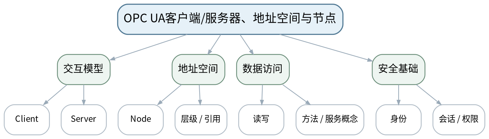 |
| 教学方法 | 讲授法、问答法、案例分析法、拓扑推演法、报文/时序分析法、方案评审法、课堂检测法 |
| 教学用具 | 电脑、投影仪、多媒体课件、教材、OPC UA地址空间示意、数据点表模板。 |
| 教学设计 | 课前任务→互动导入（10 min）→传授新知（70 min）→过关检测（10 min）→课堂小结（5 min）→作业布置（3 min）→考勤（2 min） |
| 参考文献 | [1] 邬贺铨, 于海斌, 杨善林.《工业互联网技术》[M]. 北京：机械工业出版社，2025。；[4] 孔宪光.《工业边缘计算》[M]. 北京：机械工业出版社，2025。；[5] 刘科, 王峰.《工业网络及应用技术》[M]. 北京：高等教育出版社，2022。 |

#### 教学目标

**知识目标：**
（1）理解OPC UA客户端/服务器模型、地址空间、节点和数据访问的基本概念。 （2）理解OPC UA不仅传数值，还能表达数据的结构与语义。

**能力目标：**
（1）能够把PLC/设备变量组织成基础OPC UA地址空间。 （2）能够设计数据点的名称、单位、类型、时间戳和权限字段。

**价值目标：**
（1）形成数据语义一致、接口契约和最小权限意识。

#### 课程思政

（1）通过工业数据越权和语义不一致案例强调数据所有权、最小权限与真实记录。 （2）本课所有网络诊断、抓包、配置或仿真均强调合法授权、最小影响、真实记录与可恢复，不把未经授权的真实工业网络操作作为学习证据。

#### 专创融合

把地址空间和数据点表作为跨厂商设备数据产品的语义接口。

#### 教学重难点

**教学重点**：OPC UA客户端/服务器与地址空间。

**教学难点**：从“寄存器地址”提升到“有语义的数据节点”，同时区分信息模型与实际实时控制职责。

#### 教学过程

| 教学步骤 | 主要教学内容 | 设计意图 |
|---|---|---|
| 课前任务 | 【教师】1. 发布本课预习范围与一份最小拓扑/报文/接口材料； 2. 要求学生标出3个核心术语和1个疑问； 3. 提醒涉及抓包、诊断、配置的内容只使用教师提供数据或明确授权环境。 【学生】1. 阅读教材与教师材料； 2. 完成一个“先预测”问题； 3. 带着问题进入课堂。 | 通过课前预习与授权边界提醒，让学生建立先备认知并形成合规使用网络工具的意识。 |
| 互动导入（10 min） | 【教师】1. 复习与本课直接相关的上一课主线； 2. 比较“保持寄存器40001=1234”和“Motor1.Speed=1234 rpm、带时间戳/质量”的两种接口表达，问哪一个更利于跨系统理解。 3. 追问“现象能够证明什么、还不能证明什么？”。 【学生】先独立判断，再与同伴交换依据，明确本次课任务目标。 | 从真实工业网络现象切入，引发认知冲突，让学生先判断再学习机制。 |
| 传授新知（共70 min） | 一、客户端/服务器 【教师】解释客户端发起服务、服务器暴露地址空间和数据的基本关系，避免绑定具体产品。 【学生】围绕本环节完成拓扑、报文、参数、时序或方案判断，先写预期结果，再对照教师演示/案例修正。 【课堂强化】要求每个结论附至少一条可观察证据或接口依据。  二、地址空间与节点 【教师】用设备—部件—变量层级组织节点，讲Node、属性/引用、数据类型等概念，突出语义。 【学生】围绕本环节完成拓扑、报文、参数、时序或方案判断，先写预期结果，再对照教师演示/案例修正。 【课堂强化】要求每个结论附至少一条可观察证据或接口依据。  三、数据点设计 【教师】学生把电机、变频器和温度采集点整理成OPC UA数据点表，加入名称、类型、单位、时间戳、质量和权限。 【学生】围绕本环节完成拓扑、报文、参数、时序或方案判断，先写预期结果，再对照教师演示/案例修正。 【课堂强化】要求每个结论附至少一条可观察证据或接口依据。  【形成产物】OPC UA地址空间草图＋数据点表。 【学习证据】节点层级图、数据点字段、访问权限说明。 【评价映射】平时成绩；目标1.5、2.5、3.5。 | 按“概念/机制→数据流/时序→案例/方案→证据验证”展开，避免只记协议名，训练工程解释能力。 |
| 过关检测（10 min） | 【教师】布置课堂检测： 1. OPC UA地址空间与简单寄存器表的主要差异是什么？ 2. 时间戳和数据质量为什么属于工业数据语义？ 3. 为什么客户端能连接不代表应拥有写权限？ 【学生】独立作答、同伴互查并标出依据； 【教师】根据错误类型集中点评并要求修正。 | 及时检验重难点，要求结论附依据，暴露地址、协议、性能和边界混淆。 |
| 课堂小结（5 min） | 【教师】1. 本次课解决的关键问题是：OPC UA客户端/服务器、地址空间与节点； 2. 需要重点掌握的主线是：OPC UA客户端/服务器与地址空间。； 3. 最值得带走的方法是“分层/分角色/分数据流并以证据验证”； 4. 需要警惕的易错点是：从“寄存器地址”提升到“有语义的数据节点”，同时区分信息模型与实际实时控制职责。 【学生】用1分钟写下“一条规则＋一条证据边界”。 | 回到知识脉络图压缩主线，形成可迁移的分层分析方法。 |
| 作业布置（3 min） | 【教师】1. 设计一个“设备→部件→变量”地址空间，至少12个节点，并说明3个只读/可写权限选择。 【要求】不只写结论，还要写拓扑/接口/报文/参数依据和验证方法；涉及网络工具只在授权环境或教师提供数据上完成。 【学生】按课程命名规范整理提交。 | 固化拓扑、接口、报文或方案证据，衔接下一课并为课程作业/期末综合方案积累素材。 |
| 考勤（2 min） | 【教师】利用学习通/课堂点名完成签到；不在教案中预填出勤事实。 【学生】按课堂要求完成签到。 | 保留学校课堂管理环节，不预填实际出勤事实。 |

#### 教学反思

【教师】课后重点从以下方面进行教学反思： 1. 教学流程：导入是否把学生带入“OPC UA客户端/服务器、地址空间与节点”的问题情境，70分钟主线是否由浅入深； 2. 教学内容：重点检查“从“寄存器地址”提升到“有语义的数据节点”，同时区分信息模型与实际实时控制职责。”是否讲清，学生是否停留在术语记忆； 3. 学生参与：记录拓扑/报文/方案判断是否均衡，是否存在“会听不会解释证据”的情况； 4. 教学改进：依据真实课堂表现决定是否增加抓包演示、时序对比、错例或方案评审。

### lesson-18

| 字段 | 内容 |
|---|---|
| 章节 | 第五单元 OPC UA、MQTT与OT/IT数据集成 |
| 授课题目 | OPC UA订阅、信息模型、安全与PubSub定位 |
| 周次 | 第9周（第18次课） |
| 课时安排 | 2课时（100 min）；类型：理论2 |
| 知识脉络图 | 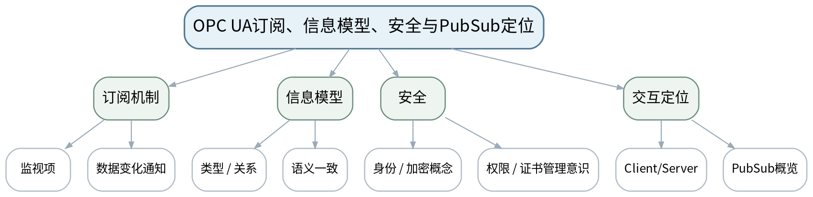 |
| 教学方法 | 讲授法、问答法、案例分析法、拓扑推演法、报文/时序分析法、方案评审法、课堂检测法 |
| 教学用具 | 电脑、投影仪、多媒体课件、教材、OPC UA订阅/信息模型示意。 |
| 教学设计 | 课前任务→互动导入（10 min）→传授新知（70 min）→过关检测（10 min）→课堂小结（5 min）→作业布置（3 min）→考勤（2 min） |
| 参考文献 | [1] 邬贺铨, 于海斌, 杨善林.《工业互联网技术》[M]. 北京：机械工业出版社，2025。；[4] 孔宪光.《工业边缘计算》[M]. 北京：机械工业出版社，2025。 |

#### 教学目标

**知识目标：**
（1）理解OPC UA订阅、监视项、信息模型和安全机制的基本作用。 （2）了解OPC UA PubSub的定位，并能与Client/Server交互方式区分。

**能力目标：**
（1）能够为监控数据设计“采样/发布频率、变化触发、质量/时间戳”需求。 （2）能够分析错误时间戳、语义命名和权限配置对上层系统的影响。

**价值目标：**
（1）形成数据质量、最小权限和跨部门语义协作意识。

#### 课程思政

（1）通过错误时间戳和越权写入案例强调“数据正确、语义正确、权限正确”缺一不可。 （2）本课所有网络诊断、抓包、配置或仿真均强调合法授权、最小影响、真实记录与可恢复，不把未经授权的真实工业网络操作作为学习证据。

#### 专创融合

将信息模型与权限矩阵作为OT/IT跨团队协作的接口合同。

#### 教学重难点

**教学重点**：OPC UA订阅、信息模型、安全与PubSub定位。

**教学难点**：不要把订阅频率、设备采样频率和控制周期混为一谈；安全不是“开/关一个选项”。

#### 教学过程

| 教学步骤 | 主要教学内容 | 设计意图 |
|---|---|---|
| 课前任务 | 【教师】1. 发布本课预习范围与一份最小拓扑/报文/接口材料； 2. 要求学生标出3个核心术语和1个疑问； 3. 提醒涉及抓包、诊断、配置的内容只使用教师提供数据或明确授权环境。 【学生】1. 阅读教材与教师材料； 2. 完成一个“先预测”问题； 3. 带着问题进入课堂。 | 通过课前预习与授权边界提醒，让学生建立先备认知并形成合规使用网络工具的意识。 |
| 互动导入（10 min） | 【教师】1. 复习与本课直接相关的上一课主线； 2. 同一温度变量在PLC、SCADA、MES中被命名为T1、Temp、FurnaceTemp，时间戳还不一致，让学生判断会带来哪些集成风险。 3. 追问“现象能够证明什么、还不能证明什么？”。 【学生】先独立判断，再与同伴交换依据，明确本次课任务目标。 | 从真实工业网络现象切入，引发认知冲突，让学生先判断再学习机制。 |
| 传授新知（共70 min） | 一、订阅与数据变化 【教师】说明订阅/监视项用于变化通知和监控交互，讨论采样、发布、队列和上层刷新需求的区别。 【学生】围绕本环节完成拓扑、报文、参数、时序或方案判断，先写预期结果，再对照教师演示/案例修正。 【课堂强化】要求每个结论附至少一条可观察证据或接口依据。  二、信息模型与质量 【教师】用统一命名、单位、类型、时间戳和质量字段说明语义一致的重要性。 【学生】围绕本环节完成拓扑、报文、参数、时序或方案判断，先写预期结果，再对照教师演示/案例修正。 【课堂强化】要求每个结论附至少一条可观察证据或接口依据。  三、安全与PubSub 【教师】概述身份、加密/会话与权限边界，以及PubSub与Client/Server定位差异；学生完善数据点契约。 【学生】围绕本环节完成拓扑、报文、参数、时序或方案判断，先写预期结果，再对照教师演示/案例修正。 【课堂强化】要求每个结论附至少一条可观察证据或接口依据。  【形成产物】OPC UA数据契约v2：语义、时间、质量、订阅和权限字段。 【学习证据】数据点表、错误语义案例修正、权限矩阵。 【评价映射】平时成绩；目标1.5、2.5、3.5。 | 按“概念/机制→数据流/时序→案例/方案→证据验证”展开，避免只记协议名，训练工程解释能力。 |
| 过关检测（10 min） | 【教师】布置课堂检测： 1. 设备采样频率和OPC UA订阅发布周期是否相同概念？ 2. 数据质量和时间戳错误为什么会影响MES分析？ 3. 信息模型的价值是什么？ 【学生】独立作答、同伴互查并标出依据； 【教师】根据错误类型集中点评并要求修正。 | 及时检验重难点，要求结论附依据，暴露地址、协议、性能和边界混淆。 |
| 课堂小结（5 min） | 【教师】1. 本次课解决的关键问题是：OPC UA订阅、信息模型、安全与PubSub定位； 2. 需要重点掌握的主线是：OPC UA订阅、信息模型、安全与PubSub定位。； 3. 最值得带走的方法是“分层/分角色/分数据流并以证据验证”； 4. 需要警惕的易错点是：不要把订阅频率、设备采样频率和控制周期混为一谈；安全不是“开/关一个选项”。 【学生】用1分钟写下“一条规则＋一条证据边界”。 | 回到知识脉络图压缩主线，形成可迁移的分层分析方法。 |
| 作业布置（3 min） | 【教师】1. 针对上一课地址空间，补充订阅/质量/时间戳/权限字段并形成接口版本记录。 【要求】不只写结论，还要写拓扑/接口/报文/参数依据和验证方法；涉及网络工具只在授权环境或教师提供数据上完成。 【学生】按课程命名规范整理提交。 | 固化拓扑、接口、报文或方案证据，衔接下一课并为课程作业/期末综合方案积累素材。 |
| 考勤（2 min） | 【教师】利用学习通/课堂点名完成签到；不在教案中预填出勤事实。 【学生】按课堂要求完成签到。 | 保留学校课堂管理环节，不预填实际出勤事实。 |

#### 教学反思

【教师】课后重点从以下方面进行教学反思： 1. 教学流程：导入是否把学生带入“OPC UA订阅、信息模型、安全与PubSub定位”的问题情境，70分钟主线是否由浅入深； 2. 教学内容：重点检查“不要把订阅频率、设备采样频率和控制周期混为一谈；安全不是“开/关一个选项”。”是否讲清，学生是否停留在术语记忆； 3. 学生参与：记录拓扑/报文/方案判断是否均衡，是否存在“会听不会解释证据”的情况； 4. 教学改进：依据真实课堂表现决定是否增加抓包演示、时序对比、错例或方案评审。

### lesson-19

| 字段 | 内容 |
|---|---|
| 章节 | 第五单元 OPC UA、MQTT与OT/IT数据集成 |
| 授课题目 | MQTT发布/订阅、主题、QoS与Broker |
| 周次 | 第10周（第19次课） |
| 课时安排 | 2课时（100 min）；类型：理论2 |
| 知识脉络图 | 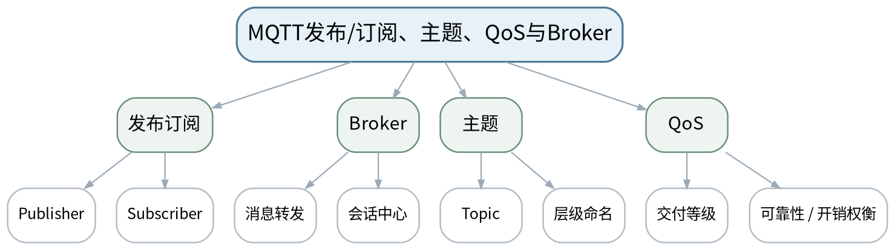 |
| 教学方法 | 讲授法、问答法、案例分析法、拓扑推演法、报文/时序分析法、方案评审法、课堂检测法 |
| 教学用具 | 电脑、投影仪、多媒体课件、教材、MQTT消息流示意、主题设计案例。 |
| 教学设计 | 课前任务→互动导入（10 min）→传授新知（70 min）→过关检测（10 min）→课堂小结（5 min）→作业布置（3 min）→考勤（2 min） |
| 参考文献 | [1] 邬贺铨, 于海斌, 杨善林.《工业互联网技术》[M]. 北京：机械工业出版社，2025。；[4] 孔宪光.《工业边缘计算》[M]. 北京：机械工业出版社，2025。 |

#### 教学目标

**知识目标：**
（1）理解MQTT发布/订阅、Broker、Topic和QoS的基本模型。 （2）理解MQTT适合轻量消息分发但不天然提供完整工业语义。

**能力目标：**
（1）能够为边缘网关到平台的数据设计主题层级和消息字段。 （2）能够根据数据重要性解释QoS选择的权衡。

**价值目标：**
（1）形成主题命名、数据最小暴露和消息可靠性权衡意识。

#### 课程思政

（1）通过工业数据越权和敏感主题暴露案例强调最小权限与数据所有权。 （2）本课所有网络诊断、抓包、配置或仿真均强调合法授权、最小影响、真实记录与可恢复，不把未经授权的真实工业网络操作作为学习证据。

#### 专创融合

把主题/消息契约做成边缘数据平台接入规范，降低应用开发耦合。

#### 教学重难点

**教学重点**：MQTT发布订阅模型、主题与QoS。

**教学难点**：不要把QoS简单理解为“越高越好”，也不能用主题名替代业务数据模型。

#### 教学过程

| 教学步骤 | 主要教学内容 | 设计意图 |
|---|---|---|
| 课前任务 | 【教师】1. 发布本课预习范围与一份最小拓扑/报文/接口材料； 2. 要求学生标出3个核心术语和1个疑问； 3. 提醒涉及抓包、诊断、配置的内容只使用教师提供数据或明确授权环境。 【学生】1. 阅读教材与教师材料； 2. 完成一个“先预测”问题； 3. 带着问题进入课堂。 | 通过课前预习与授权边界提醒，让学生建立先备认知并形成合规使用网络工具的意识。 |
| 互动导入（10 min） | 【教师】1. 复习与本课直接相关的上一课主线； 2. 给出“factory/line1/motor1/temp”与“a/b/c/1”两套主题，让学生比较哪个更利于维护以及可能暴露哪些信息。 3. 追问“现象能够证明什么、还不能证明什么？”。 【学生】先独立判断，再与同伴交换依据，明确本次课任务目标。 | 从真实工业网络现象切入，引发认知冲突，让学生先判断再学习机制。 |
| 传授新知（共70 min） | 一、发布订阅与Broker 【教师】说明发布者、订阅者不直接耦合，由Broker按主题分发消息；区分连接/会话与业务主题。 【学生】围绕本环节完成拓扑、报文、参数、时序或方案判断，先写预期结果，再对照教师演示/案例修正。 【课堂强化】要求每个结论附至少一条可观察证据或接口依据。  二、主题设计 【教师】从工厂—产线—设备—变量构建主题层级，讨论命名稳定性和权限边界。 【学生】围绕本环节完成拓扑、报文、参数、时序或方案判断，先写预期结果，再对照教师演示/案例修正。 【课堂强化】要求每个结论附至少一条可观察证据或接口依据。  三、QoS与数据负载 【教师】比较不同交付可靠性与开销的权衡；学生为状态、报警、历史采样等消息设计主题/QoS/字段。 【学生】围绕本环节完成拓扑、报文、参数、时序或方案判断，先写预期结果，再对照教师演示/案例修正。 【课堂强化】要求每个结论附至少一条可观察证据或接口依据。  【形成产物】MQTT主题与消息契约表。 【学习证据】主题树、消息字段、QoS理由、权限范围。 【评价映射】平时成绩；目标1.5、2.5、3.5。 | 按“概念/机制→数据流/时序→案例/方案→证据验证”展开，避免只记协议名，训练工程解释能力。 |
| 过关检测（10 min） | 【教师】布置课堂检测： 1. 发布者和订阅者为什么可以解耦？ 2. QoS选择为什么要考虑数据重要性和系统开销？ 3. 主题层级中哪些信息不宜无边界暴露？ 【学生】独立作答、同伴互查并标出依据； 【教师】根据错误类型集中点评并要求修正。 | 及时检验重难点，要求结论附依据，暴露地址、协议、性能和边界混淆。 |
| 课堂小结（5 min） | 【教师】1. 本次课解决的关键问题是：MQTT发布/订阅、主题、QoS与Broker； 2. 需要重点掌握的主线是：MQTT发布订阅模型、主题与QoS。； 3. 最值得带走的方法是“分层/分角色/分数据流并以证据验证”； 4. 需要警惕的易错点是：不要把QoS简单理解为“越高越好”，也不能用主题名替代业务数据模型。 【学生】用1分钟写下“一条规则＋一条证据边界”。 | 回到知识脉络图压缩主线，形成可迁移的分层分析方法。 |
| 作业布置（3 min） | 【教师】1. 为设备状态、报警、产量、质量四类数据设计MQTT主题与消息字段，并写出订阅权限。 【要求】不只写结论，还要写拓扑/接口/报文/参数依据和验证方法；涉及网络工具只在授权环境或教师提供数据上完成。 【学生】按课程命名规范整理提交。 | 固化拓扑、接口、报文或方案证据，衔接下一课并为课程作业/期末综合方案积累素材。 |
| 考勤（2 min） | 【教师】利用学习通/课堂点名完成签到；不在教案中预填出勤事实。 【学生】按课堂要求完成签到。 | 保留学校课堂管理环节，不预填实际出勤事实。 |

#### 教学反思

【教师】课后重点从以下方面进行教学反思： 1. 教学流程：导入是否把学生带入“MQTT发布/订阅、主题、QoS与Broker”的问题情境，70分钟主线是否由浅入深； 2. 教学内容：重点检查“不要把QoS简单理解为“越高越好”，也不能用主题名替代业务数据模型。”是否讲清，学生是否停留在术语记忆； 3. 学生参与：记录拓扑/报文/方案判断是否均衡，是否存在“会听不会解释证据”的情况； 4. 教学改进：依据真实课堂表现决定是否增加抓包演示、时序对比、错例或方案评审。

### lesson-20

| 字段 | 内容 |
|---|---|
| 章节 | 第五单元 OPC UA、MQTT与OT/IT数据集成 |
| 授课题目 | 边缘网关、协议适配与PLC—SCADA—MES数据链 |
| 周次 | 第10周（第20次课） |
| 课时安排 | 2课时（100 min）；类型：理论2 |
| 知识脉络图 | 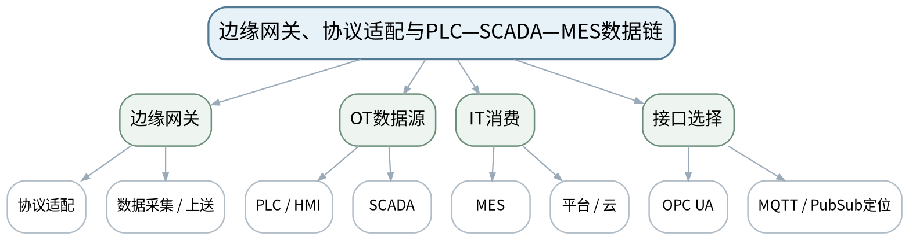 |
| 教学方法 | 讲授法、问答法、案例分析法、拓扑推演法、报文/时序分析法、方案评审法、课堂检测法 |
| 教学用具 | 电脑、投影仪、多媒体课件、教材、边缘网关/SCADA/MES数据链示意、数据点表。 |
| 教学设计 | 课前任务→互动导入（10 min）→传授新知（70 min）→过关检测（10 min）→课堂小结（5 min）→作业布置（3 min）→考勤（2 min） |
| 参考文献 | [1] 邬贺铨, 于海斌, 杨善林.《工业互联网技术》[M]. 北京：机械工业出版社，2025。；[4] 孔宪光.《工业边缘计算》[M]. 北京：机械工业出版社，2025。；[5] 刘科, 王峰.《工业网络及应用技术》[M]. 北京：高等教育出版社，2022。 |

#### 教学目标

**知识目标：**
（1）理解边缘网关在协议适配、数据采集、缓存/转发和安全边界中的作用。 （2）理解PLC/HMI/SCADA/MES/平台的数据链及OPC UA、MQTT的不同定位。

**能力目标：**
（1）能够设计从设备到MES或边缘平台的数据点与接口链。 （2）能够说明每一跳的数据语义、时间戳、质量、协议和权限。

**价值目标：**
（1）形成跨部门接口契约、数据质量和最小权限意识。

#### 课程思政

（1）以语义不一致、错误时间戳和越权访问案例强调真实记录、数据所有权和跨部门协作。 （2）本课所有网络诊断、抓包、配置或仿真均强调合法授权、最小影响、真实记录与可恢复，不把未经授权的真实工业网络操作作为学习证据。

#### 专创融合

将端到端数据链设计成可复用的工业数据集成方案模板。

#### 教学重难点

**教学重点**：边缘网关与OT/IT数据链；OPC UA/MQTT定位比较。

**教学难点**：避免“协议越多越好”，应明确每一跳的职责、数据所有者和语义转换边界。

#### 教学过程

| 教学步骤 | 主要教学内容 | 设计意图 |
|---|---|---|
| 课前任务 | 【教师】1. 发布本课预习范围与一份最小拓扑/报文/接口材料； 2. 要求学生标出3个核心术语和1个疑问； 3. 提醒涉及抓包、诊断、配置的内容只使用教师提供数据或明确授权环境。 【学生】1. 阅读教材与教师材料； 2. 完成一个“先预测”问题； 3. 带着问题进入课堂。 | 通过课前预习与授权边界提醒，让学生建立先备认知并形成合规使用网络工具的意识。 |
| 互动导入（10 min） | 【教师】1. 复习与本课直接相关的上一课主线； 2. 给出“PLC→OPC UA→网关→MQTT→MES”的链路，要求学生指出每一层是否必须、在哪一处发生语义/权限转换。 3. 追问“现象能够证明什么、还不能证明什么？”。 【学生】先独立判断，再与同伴交换依据，明确本次课任务目标。 | 从真实工业网络现象切入，引发认知冲突，让学生先判断再学习机制。 |
| 传授新知（共70 min） | 一、边缘网关职责 【教师】讲协议适配、数据采集、过滤/缓存、上送与安全边界，强调网关不是万能数据修复器。 【学生】围绕本环节完成拓扑、报文、参数、时序或方案判断，先写预期结果，再对照教师演示/案例修正。 【课堂强化】要求每个结论附至少一条可观察证据或接口依据。  二、OT/IT数据链 【教师】从PLC/HMI/SCADA到MES/平台画数据流，标出数据源、时间戳、质量、接口和消费方。 【学生】围绕本环节完成拓扑、报文、参数、时序或方案判断，先写预期结果，再对照教师演示/案例修正。 【课堂强化】要求每个结论附至少一条可观察证据或接口依据。  三、阶段方案评审 【教师】学生形成OT/IT接口链和数据点表，比较OPC UA Client/Server、PubSub和MQTT在不同链路上的定位。 【学生】围绕本环节完成拓扑、报文、参数、时序或方案判断，先写预期结果，再对照教师演示/案例修正。 【课堂强化】要求每个结论附至少一条可观察证据或接口依据。  【形成产物】课程作业阶段5：OT/IT数据链与接口分析（课程作业内部15%）。 【学习证据】端到端数据流图、数据点表、协议/权限说明、数据质量检查。 【评价映射】课程作业阶段5；目标1.5、2.5、3.5。 | 按“概念/机制→数据流/时序→案例/方案→证据验证”展开，避免只记协议名，训练工程解释能力。 |
| 过关检测（10 min） | 【教师】布置课堂检测： 1. 边缘网关为什么不应成为“所有逻辑都塞进去”的黑盒？ 2. OPC UA与MQTT在OT/IT链路上各擅长解决什么问题？ 3. 跨部门数据接口为什么必须明确时间戳和质量？ 【学生】独立作答、同伴互查并标出依据； 【教师】根据错误类型集中点评并要求修正。 | 及时检验重难点，要求结论附依据，暴露地址、协议、性能和边界混淆。 |
| 课堂小结（5 min） | 【教师】1. 本次课解决的关键问题是：边缘网关、协议适配与PLC—SCADA—MES数据链； 2. 需要重点掌握的主线是：边缘网关与OT/IT数据链；OPC UA/MQTT定位比较。； 3. 最值得带走的方法是“分层/分角色/分数据流并以证据验证”； 4. 需要警惕的易错点是：避免“协议越多越好”，应明确每一跳的职责、数据所有者和语义转换边界。 【学生】用1分钟写下“一条规则＋一条证据边界”。 | 回到知识脉络图压缩主线，形成可迁移的分层分析方法。 |
| 作业布置（3 min） | 【教师】1. 提交阶段作业5：设备到MES/边缘平台的数据链、接口表、权限和数据质量规则。 【要求】不只写结论，还要写拓扑/接口/报文/参数依据和验证方法；涉及网络工具只在授权环境或教师提供数据上完成。 【学生】按课程命名规范整理提交。 | 固化拓扑、接口、报文或方案证据，衔接下一课并为课程作业/期末综合方案积累素材。 |
| 考勤（2 min） | 【教师】利用学习通/课堂点名完成签到；不在教案中预填出勤事实。 【学生】按课堂要求完成签到。 | 保留学校课堂管理环节，不预填实际出勤事实。 |

#### 教学反思

【教师】课后重点从以下方面进行教学反思： 1. 教学流程：导入是否把学生带入“边缘网关、协议适配与PLC—SCADA—MES数据链”的问题情境，70分钟主线是否由浅入深； 2. 教学内容：重点检查“避免“协议越多越好”，应明确每一跳的职责、数据所有者和语义转换边界。”是否讲清，学生是否停留在术语记忆； 3. 学生参与：记录拓扑/报文/方案判断是否均衡，是否存在“会听不会解释证据”的情况； 4. 教学改进：依据真实课堂表现决定是否增加抓包演示、时序对比、错例或方案评审。

### lesson-21

| 字段 | 内容 |
|---|---|
| 章节 | 第六单元 网络诊断、可靠性、安全与方案设计 |
| 授课题目 | 工业网络分层诊断：从物理链路到应用数据 |
| 周次 | 第11周（第21次课） |
| 课时安排 | 2课时（100 min）；类型：理论2 |
| 知识脉络图 | 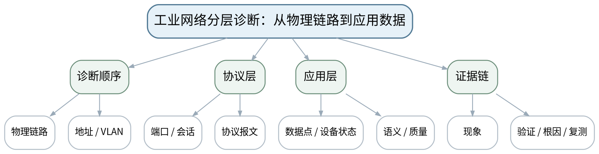 |
| 教学方法 | 讲授法、问答法、案例分析法、拓扑推演法、报文/时序分析法、方案评审法、课堂检测法 |
| 教学用具 | 电脑、投影仪、多媒体课件、教材、教师提供拓扑/日志/诊断数据。 |
| 教学设计 | 课前任务→互动导入（10 min）→传授新知（70 min）→过关检测（10 min）→课堂小结（5 min）→作业布置（3 min）→考勤（2 min） |
| 参考文献 | [1] 邬贺铨, 于海斌, 杨善林.《工业互联网技术》[M]. 北京：机械工业出版社，2025。；[2] 王春峰, 朱铝芬.《工业控制网络技术应用》[M]. 北京：机械工业出版社，2025。；[5] 刘科, 王峰.《工业网络及应用技术》[M]. 北京：高等教育出版社，2022。 |

#### 教学目标

**知识目标：**
（1）掌握工业网络从物理链路、地址/VLAN、端口、协议、应用数据到设备状态的分层诊断顺序。 （2）理解诊断需要现象、证据、根因、修复和复测闭环。

**能力目标：**
（1）能够根据“完全不通、间歇通信、报文异常、数据错误”等症状选择诊断起点。 （2）能够构建不依赖盲目试错的故障树。

**价值目标：**
（1）形成合法授权、最小影响和先读后改的诊断习惯。

#### 课程思政

（1）强调工业网络诊断首先保护生产连续性，未经授权不得扫描、修改或扩大影响范围。 （2）本课所有网络诊断、抓包、配置或仿真均强调合法授权、最小影响、真实记录与可恢复，不把未经授权的真实工业网络操作作为学习证据。

#### 专创融合

将故障树和诊断清单做成现场运维知识库条目。

#### 教学重难点

**教学重点**：工业网络分层诊断流程与证据闭环。

**教学难点**：症状可能跨层表现，诊断应从低风险、可观察证据逐层缩小，而不是同时修改多项配置。

#### 教学过程

| 教学步骤 | 主要教学内容 | 设计意图 |
|---|---|---|
| 课前任务 | 【教师】1. 发布本课预习范围与一份最小拓扑/报文/接口材料； 2. 要求学生标出3个核心术语和1个疑问； 3. 提醒涉及抓包、诊断、配置的内容只使用教师提供数据或明确授权环境。 【学生】1. 阅读教材与教师材料； 2. 完成一个“先预测”问题； 3. 带着问题进入课堂。 | 通过课前预习与授权边界提醒，让学生建立先备认知并形成合规使用网络工具的意识。 |
| 互动导入（10 min） | 【教师】1. 复习与本课直接相关的上一课主线； 2. 给出“设备离线、Ping正常、应用数据错误”三种不同工单，让学生先写第一步“只读检查”是什么。 3. 追问“现象能够证明什么、还不能证明什么？”。 【学生】先独立判断，再与同伴交换依据，明确本次课任务目标。 | 从真实工业网络现象切入，引发认知冲突，让学生先判断再学习机制。 |
| 传授新知（共70 min） | 一、诊断层级 【教师】建立链路→地址/VLAN→端口/会话→协议→应用数据→设备状态顺序，说明何时可跳层、何时不能。 【学生】围绕本环节完成拓扑、报文、参数、时序或方案判断，先写预期结果，再对照教师演示/案例修正。 【课堂强化】要求每个结论附至少一条可观察证据或接口依据。  二、症状到证据 【教师】为无链路、地址冲突、VLAN错、端口/服务异常、寄存器/节点错等案例匹配证据来源。 【学生】围绕本环节完成拓扑、报文、参数、时序或方案判断，先写预期结果，再对照教师演示/案例修正。 【课堂强化】要求每个结论附至少一条可观察证据或接口依据。  三、故障树练习 【教师】学生用教师提供日志/拓扑构建故障树，要求每个结论附“验证动作”和“预期证据”。 【学生】围绕本环节完成拓扑、报文、参数、时序或方案判断，先写预期结果，再对照教师演示/案例修正。 【课堂强化】要求每个结论附至少一条可观察证据或接口依据。  【形成产物】工业网络故障树＋分层诊断清单。 【学习证据】故障树、诊断顺序、只读验证动作、复测条件。 【评价映射】平时成绩；目标1.6、2.6、3.6。 | 按“概念/机制→数据流/时序→案例/方案→证据验证”展开，避免只记协议名，训练工程解释能力。 |
| 过关检测（10 min） | 【教师】布置课堂检测： 1. 为什么“先改配置再看效果”不是良好诊断方法？ 2. Ping正常后仍需检查哪些层？ 3. 根因结论为什么必须附复测条件？ 【学生】独立作答、同伴互查并标出依据； 【教师】根据错误类型集中点评并要求修正。 | 及时检验重难点，要求结论附依据，暴露地址、协议、性能和边界混淆。 |
| 课堂小结（5 min） | 【教师】1. 本次课解决的关键问题是：工业网络分层诊断：从物理链路到应用数据； 2. 需要重点掌握的主线是：工业网络分层诊断流程与证据闭环。； 3. 最值得带走的方法是“分层/分角色/分数据流并以证据验证”； 4. 需要警惕的易错点是：症状可能跨层表现，诊断应从低风险、可观察证据逐层缩小，而不是同时修改多项配置。 【学生】用1分钟写下“一条规则＋一条证据边界”。 | 回到知识脉络图压缩主线，形成可迁移的分层分析方法。 |
| 作业布置（3 min） | 【教师】1. 完成一份“间歇掉线”故障树，至少包含物理、二/三层、协议和设备状态分支。 【要求】不只写结论，还要写拓扑/接口/报文/参数依据和验证方法；涉及网络工具只在授权环境或教师提供数据上完成。 【学生】按课程命名规范整理提交。 | 固化拓扑、接口、报文或方案证据，衔接下一课并为课程作业/期末综合方案积累素材。 |
| 考勤（2 min） | 【教师】利用学习通/课堂点名完成签到；不在教案中预填出勤事实。 【学生】按课堂要求完成签到。 | 保留学校课堂管理环节，不预填实际出勤事实。 |

#### 教学反思

【教师】课后重点从以下方面进行教学反思： 1. 教学流程：导入是否把学生带入“工业网络分层诊断：从物理链路到应用数据”的问题情境，70分钟主线是否由浅入深； 2. 教学内容：重点检查“症状可能跨层表现，诊断应从低风险、可观察证据逐层缩小，而不是同时修改多项配置。”是否讲清，学生是否停留在术语记忆； 3. 学生参与：记录拓扑/报文/方案判断是否均衡，是否存在“会听不会解释证据”的情况； 4. 教学改进：依据真实课堂表现决定是否增加抓包演示、时序对比、错例或方案评审。

### lesson-22

| 字段 | 内容 |
|---|---|
| 章节 | 第六单元 网络诊断、可靠性、安全与方案设计 |
| 授课题目 | Ping、ARP、抓包、端口统计与设备诊断的合规使用 |
| 周次 | 第11周（第22次课） |
| 课时安排 | 2课时（100 min）；类型：理论2 |
| 知识脉络图 | 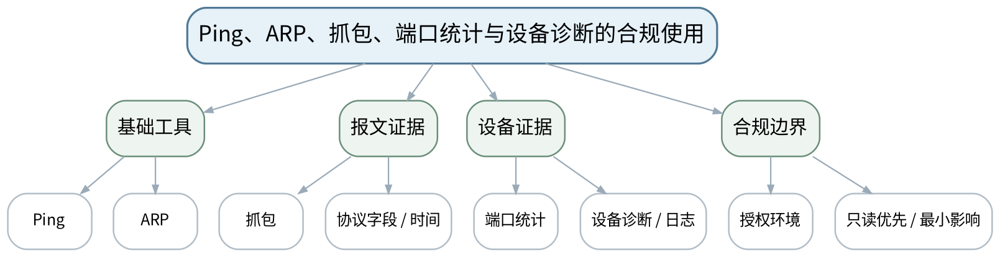 |
| 教学方法 | 讲授法、问答法、案例分析法、拓扑推演法、报文/时序分析法、方案评审法、课堂检测法 |
| 教学用具 | 电脑、投影仪、多媒体课件、教材、教师提供离线PCAP/Wireshark截图、交换机端口统计、设备日志。 |
| 教学设计 | 课前任务→互动导入（10 min）→传授新知（70 min）→过关检测（10 min）→课堂小结（5 min）→作业布置（3 min）→考勤（2 min） |
| 参考文献 | [1] 邬贺铨, 于海斌, 杨善林.《工业互联网技术》[M]. 北京：机械工业出版社，2025。；[2] 王春峰, 朱铝芬.《工业控制网络技术应用》[M]. 北京：机械工业出版社，2025。 |

#### 教学目标

**知识目标：**
（1）理解Ping、ARP、抓包、端口统计和设备诊断各能证明与不能证明的内容。 （2）理解工业网络工具必须在授权环境或教师提供数据上使用。

**能力目标：**
（1）能够对教师提供的离线PCAP/诊断截图提取时间、地址、端口和协议证据。 （2）能够区分“工具输出事实”和“基于事实的推断”。

**价值目标：**
（1）形成合法授权、证据边界和最小影响的工程伦理意识。

#### 课程思政

（1）以工业控制系统安全事件和未经授权扫描风险强调法律法规、最小影响与工程伦理。 （2）本课所有网络诊断、抓包、配置或仿真均强调合法授权、最小影响、真实记录与可恢复，不把未经授权的真实工业网络操作作为学习证据。

#### 专创融合

把诊断证据表转化为远程支持工单模板，提高跨团队沟通效率。

#### 教学重难点

**教学重点**：网络诊断工具的证据边界与合规使用。

**教学难点**：避免把Ping、端口开放或单个抓包片段过度解释为系统整体健康；工业控制网诊断必须有授权。

#### 教学过程

| 教学步骤 | 主要教学内容 | 设计意图 |
|---|---|---|
| 课前任务 | 【教师】1. 发布本课预习范围与一份最小拓扑/报文/接口材料； 2. 要求学生标出3个核心术语和1个疑问； 3. 提醒涉及抓包、诊断、配置的内容只使用教师提供数据或明确授权环境。 【学生】1. 阅读教材与教师材料； 2. 完成一个“先预测”问题； 3. 带着问题进入课堂。 | 通过课前预习与授权边界提醒，让学生建立先备认知并形成合规使用网络工具的意识。 |
| 互动导入（10 min） | 【教师】1. 复习与本课直接相关的上一课主线； 2. 展示“Ping通但应用失败”和“Ping不通但设备周期IO仍有状态”的两个案例，要求学生说明Ping能/不能证明什么。 3. 追问“现象能够证明什么、还不能证明什么？”。 【学生】先独立判断，再与同伴交换依据，明确本次课任务目标。 | 从真实工业网络现象切入，引发认知冲突，让学生先判断再学习机制。 |
| 传授新知（共70 min） | 一、工具证据边界 【教师】讲Ping、ARP、交换机端口统计、设备诊断各自观察层级；不把任何单一工具当万能结论。 【学生】围绕本环节完成拓扑、报文、参数、时序或方案判断，先写预期结果，再对照教师演示/案例修正。 【课堂强化】要求每个结论附至少一条可观察证据或接口依据。  二、离线抓包解析 【教师】教师使用授权实验数据/离线PCAP演示过滤与时间序列观察；学生只分析提供数据，不发起未经授权扫描。 【学生】围绕本环节完成拓扑、报文、参数、时序或方案判断，先写预期结果，再对照教师演示/案例修正。 【课堂强化】要求每个结论附至少一条可观察证据或接口依据。  三、故障复盘 【教师】学生把离线报文、端口统计和设备日志汇总为“事实—推断—待验证”三列表，形成可审计诊断记录。 【学生】围绕本环节完成拓扑、报文、参数、时序或方案判断，先写预期结果，再对照教师演示/案例修正。 【课堂强化】要求每个结论附至少一条可观察证据或接口依据。  【形成产物】诊断证据表：事实、推断、待验证动作。 【学习证据】离线PCAP字段摘录、端口统计、设备日志、证据边界说明。 【评价映射】平时成绩；目标1.6、2.6、3.6。 | 按“概念/机制→数据流/时序→案例/方案→证据验证”展开，避免只记协议名，训练工程解释能力。 |
| 过关检测（10 min） | 【教师】布置课堂检测： 1. Ping能证明什么、不能证明什么？ 2. 抓包中看到请求无响应时还需要哪些证据才能判定根因？ 3. 为什么真实工业控制网络上的扫描/配置修改必须先获得授权？ 【学生】独立作答、同伴互查并标出依据； 【教师】根据错误类型集中点评并要求修正。 | 及时检验重难点，要求结论附依据，暴露地址、协议、性能和边界混淆。 |
| 课堂小结（5 min） | 【教师】1. 本次课解决的关键问题是：Ping、ARP、抓包、端口统计与设备诊断的合规使用； 2. 需要重点掌握的主线是：网络诊断工具的证据边界与合规使用。； 3. 最值得带走的方法是“分层/分角色/分数据流并以证据验证”； 4. 需要警惕的易错点是：避免把Ping、端口开放或单个抓包片段过度解释为系统整体健康；工业控制网诊断必须有授权。 【学生】用1分钟写下“一条规则＋一条证据边界”。 | 回到知识脉络图压缩主线，形成可迁移的分层分析方法。 |
| 作业布置（3 min） | 【教师】1. 使用教师提供的离线诊断包完成“事实—推断—验证”报告，不连接或扫描未知工业网络。 【要求】不只写结论，还要写拓扑/接口/报文/参数依据和验证方法；涉及网络工具只在授权环境或教师提供数据上完成。 【学生】按课程命名规范整理提交。 | 固化拓扑、接口、报文或方案证据，衔接下一课并为课程作业/期末综合方案积累素材。 |
| 考勤（2 min） | 【教师】利用学习通/课堂点名完成签到；不在教案中预填出勤事实。 【学生】按课堂要求完成签到。 | 保留学校课堂管理环节，不预填实际出勤事实。 |

#### 教学反思

【教师】课后重点从以下方面进行教学反思： 1. 教学流程：导入是否把学生带入“Ping、ARP、抓包、端口统计与设备诊断的合规使用”的问题情境，70分钟主线是否由浅入深； 2. 教学内容：重点检查“避免把Ping、端口开放或单个抓包片段过度解释为系统整体健康；工业控制网诊断必须有授权。”是否讲清，学生是否停留在术语记忆； 3. 学生参与：记录拓扑/报文/方案判断是否均衡，是否存在“会听不会解释证据”的情况； 4. 教学改进：依据真实课堂表现决定是否增加抓包演示、时序对比、错例或方案评审。

### lesson-23

| 字段 | 内容 |
|---|---|
| 章节 | 第六单元 网络诊断、可靠性、安全与方案设计 |
| 授课题目 | 冗余、分区分域、防火墙、白名单与配置基线 |
| 周次 | 第12周（第23次课） |
| 课时安排 | 2课时（100 min）；类型：理论2 |
| 知识脉络图 | 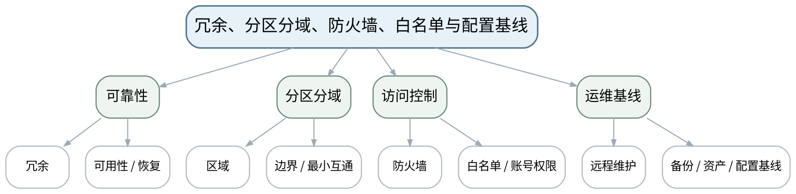 |
| 教学方法 | 讲授法、问答法、案例分析法、拓扑推演法、报文/时序分析法、方案评审法、课堂检测法 |
| 教学用具 | 电脑、投影仪、多媒体课件、教材、分区分域案例、资产/配置基线模板。 |
| 教学设计 | 课前任务→互动导入（10 min）→传授新知（70 min）→过关检测（10 min）→课堂小结（5 min）→作业布置（3 min）→考勤（2 min） |
| 参考文献 | [1] 邬贺铨, 于海斌, 杨善林.《工业互联网技术》[M]. 北京：机械工业出版社，2025。；[4] 孔宪光.《工业边缘计算》[M]. 北京：机械工业出版社，2025。；[5] 刘科, 王峰.《工业网络及应用技术》[M]. 北京：高等教育出版社，2022。 |

#### 教学目标

**知识目标：**
（1）理解冗余/可用性、工业网络分区分域、防火墙、白名单、账号权限、远程维护和备份的基础思路。 （2）理解网络资产与配置基线对恢复和审计的作用。

**能力目标：**
（1）能够为车间网络划分控制区、监控/运维区和上层数据访问边界并说明最小互通原则。 （2）能够设计配置备份、账号权限和远程维护的基本控制清单。

**价值目标：**
（1）形成最小权限、可恢复、可审计和持续维护意识。

#### 课程思政

（1）围绕最小权限、生产连续性和可恢复性讨论工程伦理与安全责任。 （2）本课所有网络诊断、抓包、配置或仿真均强调合法授权、最小影响、真实记录与可恢复，不把未经授权的真实工业网络操作作为学习证据。

#### 专创融合

将配置基线和权限矩阵做成持续运维资产，支持交付、变更和审计。

#### 教学重难点

**教学重点**：工业网络可靠性、安全边界与配置基线。

**教学难点**：安全措施要和生产连续性、远程维护、故障恢复共同设计，不能“只封不管”或“为方便全开放”。

#### 教学过程

| 教学步骤 | 主要教学内容 | 设计意图 |
|---|---|---|
| 课前任务 | 【教师】1. 发布本课预习范围与一份最小拓扑/报文/接口材料； 2. 要求学生标出3个核心术语和1个疑问； 3. 提醒涉及抓包、诊断、配置的内容只使用教师提供数据或明确授权环境。 【学生】1. 阅读教材与教师材料； 2. 完成一个“先预测”问题； 3. 带着问题进入课堂。 | 通过课前预习与授权边界提醒，让学生建立先备认知并形成合规使用网络工具的意识。 |
| 互动导入（10 min） | 【教师】1. 复习与本课直接相关的上一课主线； 2. 给出“远程维护账号长期共享、所有网段互通、无配置备份”的便利型方案，学生找出其在故障和安全方面的共同风险。 3. 追问“现象能够证明什么、还不能证明什么？”。 【学生】先独立判断，再与同伴交换依据，明确本次课任务目标。 | 从真实工业网络现象切入，引发认知冲突，让学生先判断再学习机制。 |
| 传授新知（共70 min） | 一、可靠性与冗余 【教师】从链路/设备冗余、单点故障和恢复流程说明可靠性，强调冗余仍需监测和验证。 【学生】围绕本环节完成拓扑、报文、参数、时序或方案判断，先写预期结果，再对照教师演示/案例修正。 【课堂强化】要求每个结论附至少一条可观察证据或接口依据。  二、分区与访问控制 【教师】以业务/风险边界讲分区分域、防火墙、白名单和账号最小权限，不涉及攻击操作。 【学生】围绕本环节完成拓扑、报文、参数、时序或方案判断，先写预期结果，再对照教师演示/案例修正。 【课堂强化】要求每个结论附至少一条可观察证据或接口依据。  三、资产与配置基线 【教师】设计资产清单、端口/协议白名单、账号角色、远程维护审批、配置备份与恢复测试清单。 【学生】围绕本环节完成拓扑、报文、参数、时序或方案判断，先写预期结果，再对照教师演示/案例修正。 【课堂强化】要求每个结论附至少一条可观察证据或接口依据。  【形成产物】工业网络分区安全图＋资产/配置基线清单。 【学习证据】分区边界、允许数据流、权限矩阵、备份与恢复检查项。 【评价映射】平时成绩；目标1.6、2.6、3.6。 | 按“概念/机制→数据流/时序→案例/方案→证据验证”展开，避免只记协议名，训练工程解释能力。 |
| 过关检测（10 min） | 【教师】布置课堂检测： 1. 网络冗余为什么仍需要定期验证？ 2. 最小权限和白名单的共同目标是什么？ 3. 为什么配置备份必须能恢复验证？ 【学生】独立作答、同伴互查并标出依据； 【教师】根据错误类型集中点评并要求修正。 | 及时检验重难点，要求结论附依据，暴露地址、协议、性能和边界混淆。 |
| 课堂小结（5 min） | 【教师】1. 本次课解决的关键问题是：冗余、分区分域、防火墙、白名单与配置基线； 2. 需要重点掌握的主线是：工业网络可靠性、安全边界与配置基线。； 3. 最值得带走的方法是“分层/分角色/分数据流并以证据验证”； 4. 需要警惕的易错点是：安全措施要和生产连续性、远程维护、故障恢复共同设计，不能“只封不管”或“为方便全开放”。 【学生】用1分钟写下“一条规则＋一条证据边界”。 | 回到知识脉络图压缩主线，形成可迁移的分层分析方法。 |
| 作业布置（3 min） | 【教师】1. 为课程综合方案补充分区、允许数据流、远程维护与备份/恢复策略。 【要求】不只写结论，还要写拓扑/接口/报文/参数依据和验证方法；涉及网络工具只在授权环境或教师提供数据上完成。 【学生】按课程命名规范整理提交。 | 固化拓扑、接口、报文或方案证据，衔接下一课并为课程作业/期末综合方案积累素材。 |
| 考勤（2 min） | 【教师】利用学习通/课堂点名完成签到；不在教案中预填出勤事实。 【学生】按课堂要求完成签到。 | 保留学校课堂管理环节，不预填实际出勤事实。 |

#### 教学反思

【教师】课后重点从以下方面进行教学反思： 1. 教学流程：导入是否把学生带入“冗余、分区分域、防火墙、白名单与配置基线”的问题情境，70分钟主线是否由浅入深； 2. 教学内容：重点检查“安全措施要和生产连续性、远程维护、故障恢复共同设计，不能“只封不管”或“为方便全开放”。”是否讲清，学生是否停留在术语记忆； 3. 学生参与：记录拓扑/报文/方案判断是否均衡，是否存在“会听不会解释证据”的情况； 4. 教学改进：依据真实课堂表现决定是否增加抓包演示、时序对比、错例或方案评审。

### lesson-24

| 字段 | 内容 |
|---|---|
| 章节 | 第六单元 网络诊断、可靠性、安全与方案设计 |
| 授课题目 | 工业网络综合方案：需求、拓扑、协议、数据、安全与验证 |
| 周次 | 第12周（第24次课） |
| 课时安排 | 2课时（100 min）；类型：理论2 |
| 知识脉络图 | 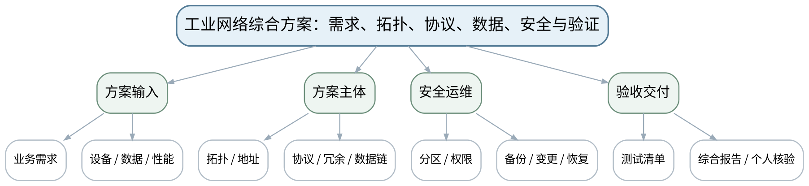 |
| 教学方法 | 讲授法、问答法、案例分析法、拓扑推演法、报文/时序分析法、方案评审法、课堂检测法 |
| 教学用具 | 电脑、投影仪、多媒体课件、教材、方案评审表、拓扑/接口/测试模板、教师提供故障/需求变更题。 |
| 教学设计 | 课前任务→互动导入（10 min）→传授新知（70 min）→过关检测（10 min）→课堂小结（5 min）→作业布置（3 min）→考勤（2 min） |
| 参考文献 | [1] 邬贺铨, 于海斌, 杨善林.《工业互联网技术》[M]. 北京：机械工业出版社，2025。；[2] 王春峰, 朱铝芬.《工业控制网络技术应用》[M]. 北京：机械工业出版社，2025。；[4] 孔宪光.《工业边缘计算》[M]. 北京：机械工业出版社，2025。；[5] 刘科, 王峰.《工业网络及应用技术》[M]. 北京：高等教育出版社，2022。 |

#### 教学目标

**知识目标：**
（1）综合掌握工业网络方案中层级、拓扑、地址、协议、实时性、数据链、可靠性、安全和诊断验证的关系。 （2）理解期末综合方案报告和个人核验/答辩的证据要求。

**能力目标：**
（1）能够形成一份从需求到验证闭环的工业网络综合方案。 （2）能够独立解释本人方案中的协议选择、地址、实时性、故障定位、修改验证和资料依据。

**价值目标：**
（1）形成合法授权、最小影响、可恢复、持续学习和对本人提交内容独立负责的职业素养。

#### 课程思政

（1）以工业控制系统安全和生产连续性为底线，强调合法授权、真实证据、个人独立解释和对方案后果负责。 （2）本课所有网络诊断、抓包、配置或仿真均强调合法授权、最小影响、真实记录与可恢复，不把未经授权的真实工业网络操作作为学习证据。

#### 专创融合

将课程输出组织成可直接用于方案评审、设备接入和运维交接的工业网络文档包。

#### 教学重难点

**教学重点**：工业网络综合方案与验证闭环。

**教学难点**：综合方案不能只画拓扑；需要把需求、协议、数据、性能、安全、诊断和测试证据连成闭环。

#### 教学过程

| 教学步骤 | 主要教学内容 | 设计意图 |
|---|---|---|
| 课前任务 | 【教师】1. 发布本课预习范围与一份最小拓扑/报文/接口材料； 2. 要求学生标出3个核心术语和1个疑问； 3. 提醒涉及抓包、诊断、配置的内容只使用教师提供数据或明确授权环境。 【学生】1. 阅读教材与教师材料； 2. 完成一个“先预测”问题； 3. 带着问题进入课堂。 | 通过课前预习与授权边界提醒，让学生建立先备认知并形成合规使用网络工具的意识。 |
| 互动导入（10 min） | 【教师】1. 复习与本课直接相关的上一课主线； 2. 给出一个“拓扑很漂亮但没有地址表、性能指标、安全边界和验收方法”的方案，让学生判断为什么它不能直接交付。 3. 追问“现象能够证明什么、还不能证明什么？”。 【学生】先独立判断，再与同伴交换依据，明确本次课任务目标。 | 从真实工业网络现象切入，引发认知冲突，让学生先判断再学习机制。 |
| 传授新知（共70 min） | 一、方案骨架 【教师】按需求→设备/数据→拓扑/地址→协议→实时/可靠→OT/IT数据→安全/运维→诊断/测试组织最终方案。 【学生】围绕本环节完成拓扑、报文、参数、时序或方案判断，先写预期结果，再对照教师演示/案例修正。 【课堂强化】要求每个结论附至少一条可观察证据或接口依据。  二、方案评审 【教师】小组互审重点检查接口一致、单点故障、协议选型边界、数据语义、权限和验证方法；只评证据，不替同伴补写。 【学生】围绕本环节完成拓扑、报文、参数、时序或方案判断，先写预期结果，再对照教师演示/案例修正。 【课堂强化】要求每个结论附至少一条可观察证据或接口依据。  三、期末核验准备 【教师】说明期末综合方案报告与个人核验/答辩要求：独立解释本人方案、给定故障/需求变更时说明修改与验证步骤、风险和资料依据。 【学生】围绕本环节完成拓扑、报文、参数、时序或方案判断，先写预期结果，再对照教师演示/案例修正。 【课堂强化】要求每个结论附至少一条可观察证据或接口依据。  【形成产物】课程作业阶段6＋期末综合方案包：需求表、拓扑、地址/接口、协议选型、数据链、安全、诊断/验收清单。 【学习证据】综合网络方案、阶段证据索引、个人完成内容说明、变更/验证记录。 【评价映射】课程作业阶段6（课程作业内部10%）＋期末考核（总评60%）；目标1.6、2.6、3.6及全部课程目标。 | 按“概念/机制→数据流/时序→案例/方案→证据验证”展开，避免只记协议名，训练工程解释能力。 |
| 过关检测（10 min） | 【教师】布置课堂检测： 1. 一份可交付工业网络方案至少包含哪些内容？ 2. 方案中的协议选择为什么必须写适用边界和验证方法？ 3. 个人核验时应如何证明自己理解并完成了本人部分？ 【学生】独立作答、同伴互查并标出依据； 【教师】根据错误类型集中点评并要求修正。 | 及时检验重难点，要求结论附依据，暴露地址、协议、性能和边界混淆。 |
| 课堂小结（5 min） | 【教师】1. 本次课解决的关键问题是：工业网络综合方案：需求、拓扑、协议、数据、安全与验证； 2. 需要重点掌握的主线是：工业网络综合方案与验证闭环。； 3. 最值得带走的方法是“分层/分角色/分数据流并以证据验证”； 4. 需要警惕的易错点是：综合方案不能只画拓扑；需要把需求、协议、数据、性能、安全、诊断和测试证据连成闭环。 【学生】用1分钟写下“一条规则＋一条证据边界”。 | 回到知识脉络图压缩主线，形成可迁移的分层分析方法。 |
| 作业布置（3 min） | 【教师】1. 完成期末工业网络综合方案报告；整理个人核验提纲：网络层级、协议/地址、实时性、数据流、故障修改验证、风险和资料依据。 【要求】不只写结论，还要写拓扑/接口/报文/参数依据和验证方法；涉及网络工具只在授权环境或教师提供数据上完成。 【学生】按课程命名规范整理提交。 | 固化拓扑、接口、报文或方案证据，衔接下一课并为课程作业/期末综合方案积累素材。 |
| 考勤（2 min） | 【教师】利用学习通/课堂点名完成签到；不在教案中预填出勤事实。 【学生】按课堂要求完成签到。 | 保留学校课堂管理环节，不预填实际出勤事实。 |

#### 教学反思

【教师】课后重点从以下方面进行教学反思： 1. 教学流程：导入是否把学生带入“工业网络综合方案：需求、拓扑、协议、数据、安全与验证”的问题情境，70分钟主线是否由浅入深； 2. 教学内容：重点检查“综合方案不能只画拓扑；需要把需求、协议、数据、性能、安全、诊断和测试证据连成闭环。”是否讲清，学生是否停留在术语记忆； 3. 学生参与：记录拓扑/报文/方案判断是否均衡，是否存在“会听不会解释证据”的情况； 4. 教学改进：依据真实课堂表现决定是否增加抓包演示、时序对比、错例或方案评审。
