# 《工程建模与科学计算可视化基础（Python）》教学设计（16次课）

> **Canonical source / 内容权威源**：本 Markdown 与 `images/`、`manifest.json` 共同构成教案语义主源。Word 仅由本源包编译，负责学校格式呈现。

## 课程基本信息
- **课程名称**：工程建模与科学计算可视化基础（Python）
- **课程英文名称**：Fundamentals of Engineering Modeling and Scientific Computing Visualization (Python)
- **课程代码**：25JD21402
- **课程类别**：学科基础类
- **课程性质**：必修课
- **授课学期**：第2学期
- **学分**：2
- **总学时**：32（理论16，上机16）
- **适用专业**：智能制造工程、机械工程、能源与动力工程、车辆工程
- **授课学院**：机械与动力工程学院
- **先修课程**：无
- **后续课程**：人工智能技术与应用、数据结构（C）、机器人技术及应用（A）
- **选用教材**：王小银 等.《Python数据分析与科学计算》[M]. 北京：机械工业出版社，2024. ISBN 9787111742586
- **课程评价**：总评成绩=平时表现20%＋课程作业20%＋期末综合项目60%
- **内容依据**：2025版目录 v2 定稿现行课程教学大纲（大纲更新时间：2026年9月）

## 课程总体设计
课程以“问题定义—假设与模型—程序求解—数据验证—图形表达”为主线，五个理论单元分别覆盖工程建模、Python基础、NumPy/SciPy/Pandas科学计算、Matplotlib工程可视化以及综合项目/版本/AI工具边界；四个上机项目分别为蒙特卡罗圆周率、NumPy矩阵与Pandas数据处理、两连杆机械臂运动学与工作空间、双轮小车轨迹仿真。由于现行大纲上机项目学时为3/4/5/4，本教案使用4次理实一体课准确闭合理论16＋上机16，共16次课×2课时=32学时，不人为改写大纲学时。教学采用“短讲解—示例推导—分段编码—上机验证—结果复盘”，所有任务要求保留原始数据、代码、参数、版本、测试结果、图表和人工核验记录。

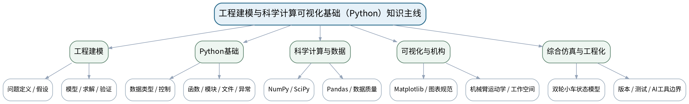

### 课次总览
| 次数 | 课型 | 理论/上机分配 | 单元/项目 | 授课题目 | 主要评价 |
|---:|---|---|---|---|---|
| 1 | 理论 | 理论2课时 | 第一单元 课程导论与工程建模思维 | 工程建模范式：从问题定义到模型验证 | 平时表现＋课程作业（第一单元10%模块）＋期末综合项目 |
| 2 | 理论 | 理论2课时 | 第二单元 Python编程基础与计算逻辑 | Python环境、数据类型与控制结构 | 平时表现＋课程作业（第二单元20%模块） |
| 3 | 理论 | 理论2课时 | 第二单元 Python编程基础与计算逻辑 | 函数、模块、文件与异常处理 | 平时表现＋课程作业（第二单元20%模块） |
| 4 | 上机 | 上机2课时（上机一前2/3） | 上机一 Python基础与蒙特卡罗圆周率计算 | 蒙特卡罗圆周率：环境、随机采样与基础实现 | 课程作业（第二单元20%模块，上机一前段）＋期末综合项目方法基础 |
| 5 | 理实一体 | 上机1课时＋理论1课时 | 上机一后1课时＋第三单元理论起始 | 蒙特卡罗误差复盘与NumPy数组入门 | 课程作业（第二单元20%模块完成）＋第三单元30%模块起始 |
| 6 | 理论 | 理论2课时 | 第三单元 科学计算与工程数据处理 | NumPy向量化、广播、矩阵运算与SciPy数值方法 | 平时表现＋课程作业（第三单元30%模块） |
| 7 | 理实一体 | 理论1课时＋上机1课时 | 第三单元理论后1课时＋上机二前1课时 | Pandas数据流程与NumPy向量化性能实验 | 课程作业（第三单元30%模块，上机二前段） |
| 8 | 上机 | 上机2课时（上机二中段） | 上机二 NumPy矩阵运算与Pandas工程数据处理 | 工程数据清洗、分组统计、表连接与结果导出 | 课程作业（第三单元30%模块，上机二中段） |
| 9 | 理实一体 | 上机1课时＋理论1课时 | 上机二后1课时＋第四单元理论起始 | 数据处理验收与Matplotlib工程可视化入门 | 课程作业（第三单元30%模块完成）＋第四单元20%模块起始 |
| 10 | 理论 | 理论2课时 | 第四单元 数据可视化设计与工程表达 | Matplotlib规范绘图、子图、等值图与基础三维表达 | 平时表现＋课程作业（第四单元20%模块） |
| 11 | 理实一体 | 理论1课时＋上机1课时 | 第四单元理论后1课时＋上机三前1课时 | 坐标变换与两连杆机械臂正运动学建模 | 课程作业（第四单元20%模块，上机三起始）＋期末综合项目 |
| 12 | 上机 | 上机2课时（上机三中段） | 上机三 平面连杆机械臂运动学与工作空间可视化 | 机械臂构型、末端轨迹与参数化仿真 | 课程作业（第四单元20%模块，上机三中段）＋期末综合项目 |
| 13 | 上机 | 上机2课时（上机三后段） | 上机三 平面连杆机械臂运动学与工作空间可视化 | 机械臂工作空间采样、边界与模型验收 | 课程作业（第四单元20%模块完成）＋期末综合项目 |
| 14 | 理论 | 理论2课时 | 第五单元 综合建模流程与前沿工具边界 | 综合工程计算项目、版本控制与AI辅助编程边界 | 平时表现＋课程作业（第五单元20%模块）＋期末综合项目60% |
| 15 | 上机 | 上机2课时（上机四前半） | 上机四 双轮小车轨迹仿真与综合工程表达 | 双轮小车离散运动学、状态更新与数据记录 | 课程作业（第五单元20%模块，上机四前半）＋期末综合项目60% |
| 16 | 上机 | 上机2课时（上机四后半） | 上机四 双轮小车轨迹仿真与综合工程表达 | 轨迹跟踪、误差可视化与综合项目验收 | 课程作业（第五单元20%模块完成）＋期末综合项目60%核心验收 |

## 第1次课 工程建模范式：从问题定义到模型验证

### 课次信息
- **章节/单元**：第一单元 课程导论与工程建模思维
- **周次**：按实际课表填写
- **课时安排**：2课时（100 min）
- **课型**：理论
- **理论/上机分配**：理论2课时

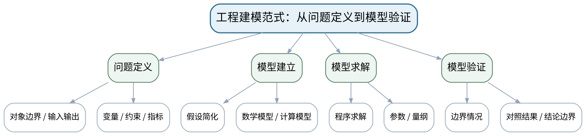

### 教学目标
**知识目标：**
1. 理解工程问题定义、对象边界、输入输出、变量、约束和评价指标。
2. 理解假设简化、数学模型/计算模型、量纲、边界情况和对照验证的关系。

**能力目标：**
1. 能够把一个简单工程问题拆解为对象、变量、约束、模型、求解与验证清单。
2. 能够识别“不合理假设、无验证结论、数据伦理风险”等典型问题。

**价值目标：**
1. 形成尊重原始数据、明确假设、用证据验证模型并诚实说明结论边界的工程意识。

### 课程思政
结合工程计算中的模型失效与数据责任，强调结论必须建立在真实数据、合理模型和充分验证上。

### 专创融合
把“问题拆解卡＋验收指标”视为技术产品需求说明的最小原型，训练从工程问题到可验证计算任务的转化。

### 教学重难点
**教学重点：**工程建模完整链路；假设、求解与验证之间的关系。

**教学难点：**把开放工程描述转化为可计算问题，并避免用“程序能运行”替代模型正确性验证。

### 教学方法与用具
**教学方法：**问题驱动法、建模推演法、代码阅读/演示法、预测—执行—验证法、任务驱动法、测试验收与错误复盘

**教学用具：**电脑、投影仪、白板/关系图工具、课程示例数据。

### 教学设计
课前任务 → 互动导入（10 min）→ 传授新知与课堂训练（75 min）→ 过关检测（10 min）→ 课堂小结（3 min）→ 作业布置（1 min）→ 考勤（1 min）

### 课前任务
【教师】发布“工程建模范式：从问题定义到模型验证”对应大纲/教材范围和一个最小工程问题，不提前给出完整代码答案。

1. 阅读对应大纲与教材内容；
2. 圈出3个关键术语并记录至少1个疑问；
3. 预读一个公式、代码或工程图表片段，写出预期结果与至少一个疑问。

【学生】完成准备并带着“预期结果/疑问/已有证据”进入课堂。

### 互动导入
【教师】给出“预测一辆小车10 s后的位姿”问题：信息只给初始位置与速度，不给采样周期、转向模型和单位，要求学生指出为什么不能立即写代码。

【学生】先独立预测/判断，再与同伴交换依据；教师收集典型分歧后进入本课。

### 传授新知与课堂训练
**一、核心概念与工程案例（约30 min）—建模链路**

【教师】用“工程问题—假设—方程/规则—程序—验证—解释”链路拆解机械臂、小车和温度数据案例，明确模型不是现实本身。

【学生】完成公式/代码/图表推演或场景判断，先写预期与依据，再用课堂示例验证并修正。

**二、学生推演/建模/代码阅读（约25 min）—建模卡片**

【教师】学生完成一个简化工程问题的对象、输入、输出、变量、约束、假设和验收指标卡片。

【学生】完成公式/代码/图表推演或场景判断，先写预期与依据，再用课堂示例验证并修正。

**三、对比、验证与错误复盘（约20 min）—验证与伦理**

【教师】比较量纲检查、边界情况、已知解/对照实验；辨析选择性展示、删改原始数据和未经核验AI建议等风险。

【学生】完成公式/代码/图表推演或场景判断，先写预期与依据，再用课堂示例验证并修正。

**独立学习产物**：一页“工程建模问题拆解卡”＋验证清单。

**学习证据**：问题定义、假设清单、变量/单位表、至少3条验证方法、修订记录。

**评价映射**：平时表现＋课程作业（第一单元10%模块）＋期末综合项目；目标1.1、2.1、3.1、3.3。

### 过关检测
【教师】组织当堂检测：

1. “模型假设”与“计算参数”有什么区别？
2. 为什么量纲正确仍不能证明模型一定正确？
3. 程序运行成功为什么不是工程结论成立的充分条件？

【学生】独立作答/运行/推演验证；【教师】按错误类型讲解，要求说明模型、数值或图表依据。

### 课堂小结
【教师】回到本课知识脉络图，用“问题—模型—计算/数据—验证—表达—边界”总结“工程建模范式：从问题定义到模型验证”，再次强调教学重点：工程建模完整链路；假设、求解与验证之间的关系。

【学生】写下“本课一条最重要的模型/计算规则 + 一个最容易出错的边界”。

### 作业布置
【教师】布置课后任务：选择一个日常工程对象（温度、机构、运动平台等），补全问题定义—假设—模型—验证四栏表。

【学生】按课程文件命名与证据要求整理提交；任何AI/开源工具建议均需保留人工核验记录。

### 考勤
【教师】利用学校/课程实际使用的平台进行签到。

【学生】按课程要求完成签到。

### 课后教学反思
【课后填写，不预填事实】

1. 教学流程：记录100 min各环节实际用时、理论/上机切换及调整点；
2. 教学内容：重点记录“把开放工程描述转化为可计算问题，并避免用“程序能运行”替代模型正确性验证。”的真实掌握证据和常见错误；
3. 学生参与：仅依据实际课堂记录填写推演、独立编码、调试、图表互审和讨论情况，不补写推测；
4. 评价证据：检查本课代码、数据、参数、测试、图表与说明是否完整，记录缺项原因；
5. 后续改进：依据真实课堂证据决定下一次课的补救、复现或拓展。

### 本章节参考文献
[1] 王小银 等.《Python数据分析与科学计算》[M]. 机械工业出版社，2024。
[2] 李志远, 黄化人, 姚明菊, 等.《Python编程与科学计算（微课视频版）》[M]. 清华大学出版社，2023。

## 第2次课 Python环境、数据类型与控制结构

### 课次信息
- **章节/单元**：第二单元 Python编程基础与计算逻辑
- **周次**：按实际课表填写
- **课时安排**：2课时（100 min）
- **课型**：理论
- **理论/上机分配**：理论2课时

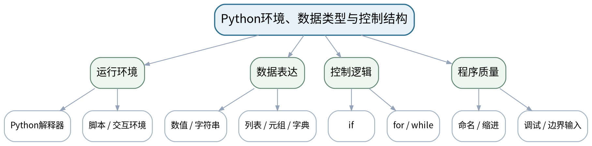

### 教学目标
**知识目标：**
1. 掌握Python程序运行、基本数据类型、列表/元组/字典等组合数据、表达式、分支与循环。
2. 理解变量命名、缩进、可读性和基础调试的意义。

**能力目标：**
1. 能够阅读并手工推演基础Python程序，预测输出和循环次数。
2. 能够把简单计算规则实现为可运行脚本并定位常见语法/逻辑错误。

**价值目标：**
1. 形成规范命名、主动验证和对开源工具使用负责的编程习惯。

### 课程思政
通过开源生态、许可证与代码责任案例说明“可以复用”不等于“可以不理解”，最终采用的代码需要人工核验。

### 专创融合
把脚本视为工程计算原型，要求输入、输出、异常和运行说明清晰，为后续模块化和自动化计算打底。

### 教学重难点
**教学重点：**Python基础语法与控制结构；程序阅读和预测。

**教学难点：**区分语法正确与逻辑正确；处理边界输入、循环终止和数据类型变化。

### 教学方法与用具
**教学方法：**问题驱动法、建模推演法、代码阅读/演示法、预测—执行—验证法、任务驱动法、测试验收与错误复盘

**教学用具：**电脑、Python 3.x、VS Code/Jupyter或学校统一环境、投影仪。

### 教学设计
课前任务 → 互动导入（10 min）→ 传授新知与课堂训练（75 min）→ 过关检测（10 min）→ 课堂小结（3 min）→ 作业布置（1 min）→ 考勤（1 min）

### 课前任务
【教师】发布“Python环境、数据类型与控制结构”对应大纲/教材范围和一个最小工程问题，不提前给出完整代码答案。

1. 阅读对应大纲与教材内容；
2. 圈出3个关键术语并记录至少1个疑问；
3. 预读一个公式、代码或工程图表片段，写出预期结果与至少一个疑问。

【学生】完成准备并带着“预期结果/疑问/已有证据”进入课堂。

### 互动导入
【教师】展示一个“计算0~n总和”的脚本，分别给n=10、0、-1，让学生预测输出和可能的问题。

【学生】先独立预测/判断，再与同伴交换依据；教师收集典型分歧后进入本课。

### 传授新知与课堂训练
**一、核心概念与工程案例（约30 min）—环境与表达**

【教师】演示解释器、脚本执行、变量、数值/字符串/列表/字典；强调单位和数据含义不能只藏在变量名里。

【学生】完成公式/代码/图表推演或场景判断，先写预期与依据，再用课堂示例验证并修正。

**二、学生推演/建模/代码阅读（约25 min）—控制结构**

【教师】用分段函数、阈值报警和累加计算讲if/for/while；学生先手工推演再运行。

【学生】完成公式/代码/图表推演或场景判断，先写预期与依据，再用课堂示例验证并修正。

**三、对比、验证与错误复盘（约20 min）—错误复盘**

【教师】分析缩进、类型不匹配、循环不终止、边界条件遗漏等错误，并用最小输入验证修正。

【学生】完成公式/代码/图表推演或场景判断，先写预期与依据，再用课堂示例验证并修正。

**独立学习产物**：三个可运行Python小程序＋一张输入—预期—实际结果表。

**学习证据**：源代码、运行结果、错误信息、边界测试和修订记录。

**评价映射**：平时表现＋课程作业（第二单元20%模块）；目标1.2、2.2、3.4、3.5。

### 过关检测
【教师】组织当堂检测：

1. 列表与元组在本课程常见用途上有何区别？
2. for与while分别适合哪类重复过程？
3. 怎样判断一个循环不是“碰巧对一个输入有效”？

【学生】独立作答/运行/推演验证；【教师】按错误类型讲解，要求说明模型、数值或图表依据。

### 课堂小结
【教师】回到本课知识脉络图，用“问题—模型—计算/数据—验证—表达—边界”总结“Python环境、数据类型与控制结构”，再次强调教学重点：Python基础语法与控制结构；程序阅读和预测。

【学生】写下“本课一条最重要的模型/计算规则 + 一个最容易出错的边界”。

### 作业布置
【教师】布置课后任务：完成3个基础计算题，并为每个程序增加正常、边界和异常输入测试。

【学生】按课程文件命名与证据要求整理提交；任何AI/开源工具建议均需保留人工核验记录。

### 考勤
【教师】利用学校/课程实际使用的平台进行签到。

【学生】按课程要求完成签到。

### 课后教学反思
【课后填写，不预填事实】

1. 教学流程：记录100 min各环节实际用时、理论/上机切换及调整点；
2. 教学内容：重点记录“区分语法正确与逻辑正确；处理边界输入、循环终止和数据类型变化。”的真实掌握证据和常见错误；
3. 学生参与：仅依据实际课堂记录填写推演、独立编码、调试、图表互审和讨论情况，不补写推测；
4. 评价证据：检查本课代码、数据、参数、测试、图表与说明是否完整，记录缺项原因；
5. 后续改进：依据真实课堂证据决定下一次课的补救、复现或拓展。

### 本章节参考文献
[1] 王小银 等.《Python数据分析与科学计算》[M]. 机械工业出版社，2024。
[3] 董付国.《Python程序设计（第4版·微课版·在线学习软件版）》[M]. 清华大学出版社，2024。

## 第3次课 函数、模块、文件与异常处理

### 课次信息
- **章节/单元**：第二单元 Python编程基础与计算逻辑
- **周次**：按实际课表填写
- **课时安排**：2课时（100 min）
- **课型**：理论
- **理论/上机分配**：理论2课时

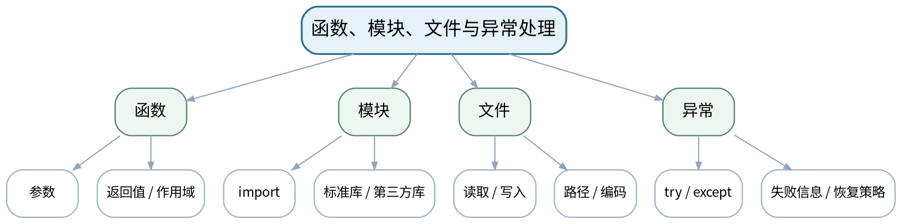

### 教学目标
**知识目标：**
1. 掌握函数参数/返回值、模块导入、文本/CSV基础读写和try/except异常处理。
2. 理解程序分解、接口与复用的基本思想。

**能力目标：**
1. 能够把重复计算重构为函数，并用最小测试验证参数和返回值。
2. 能够读取简单数据文件、处理文件/数据异常，并组织为多函数脚本。

**价值目标：**
1. 形成接口清晰、错误显式、代码可读和可复现的工程习惯。

### 课程思政
强调错误必须被看见、被记录、被解释；不能通过隐藏异常制造“程序正常”的假象。

### 专创融合
将函数/模块组织作为小型计算工具产品化第一步，训练接口、复用和运行说明。

### 教学重难点
**教学重点：**函数化与模块化；文件I/O；异常处理。

**教学难点：**为函数划清输入输出和失败条件，避免用宽泛except掩盖真正错误。

### 教学方法与用具
**教学方法：**问题驱动法、建模推演法、代码阅读/演示法、预测—执行—验证法、任务驱动法、测试验收与错误复盘

**教学用具：**电脑、Python、VS Code/Jupyter、示例CSV/文本文件。

### 教学设计
课前任务 → 互动导入（10 min）→ 传授新知与课堂训练（75 min）→ 过关检测（10 min）→ 课堂小结（3 min）→ 作业布置（1 min）→ 考勤（1 min）

### 课前任务
【教师】发布“函数、模块、文件与异常处理”对应大纲/教材范围和一个最小工程问题，不提前给出完整代码答案。

1. 阅读对应大纲与教材内容；
2. 圈出3个关键术语并记录至少1个疑问；
3. 预读一个公式、代码或工程图表片段，写出预期结果与至少一个疑问。

【学生】完成准备并带着“预期结果/疑问/已有证据”进入课堂。

### 互动导入
【教师】展示一段把读取文件、计算平均值、绘图全部写在main中的脚本，要求学生指出复用、测试和错误定位上的问题。

【学生】先独立预测/判断，再与同伴交换依据；教师收集典型分歧后进入本课。

### 传授新知与课堂训练
**一、核心概念与工程案例（约30 min）—函数与接口**

【教师】以“计算均方根/单位换算”为例讲函数参数、返回值、默认值和最小测试。

【学生】完成公式/代码/图表推演或场景判断，先写预期与依据，再用课堂示例验证并修正。

**二、学生推演/建模/代码阅读（约25 min）—文件与模块**

【教师】读取简化CSV/文本，讲路径、编码和上下文管理；演示random/math等模块与第三方库导入。

【学生】完成公式/代码/图表推演或场景判断，先写预期与依据，再用课堂示例验证并修正。

**三、对比、验证与错误复盘（约20 min）—异常与重构**

【教师】处理文件不存在、非法数值和空数据；把程序拆为load_data、compute、report等职责函数。

【学生】完成公式/代码/图表推演或场景判断，先写预期与依据，再用课堂示例验证并修正。

**独立学习产物**：一个模块化计算脚本＋文件读写样例＋异常测试。

**学习证据**：函数接口说明、测试输入输出、文件样例、异常信息与处理理由。

**评价映射**：平时表现＋课程作业（第二单元20%模块）；目标1.2、2.2、3.4、3.5。

### 过关检测
【教师】组织当堂检测：

1. 函数的输入/输出为什么是接口契约？
2. 为什么不建议使用except:直接吞掉所有错误？
3. 如何让数据文件路径和程序运行方式更可复现？

【学生】独立作答/运行/推演验证；【教师】按错误类型讲解，要求说明模型、数值或图表依据。

### 课堂小结
【教师】回到本课知识脉络图，用“问题—模型—计算/数据—验证—表达—边界”总结“函数、模块、文件与异常处理”，再次强调教学重点：函数化与模块化；文件I/O；异常处理。

【学生】写下“本课一条最重要的模型/计算规则 + 一个最容易出错的边界”。

### 作业布置
【教师】布置课后任务：把上一课一个脚本重构为不少于3个函数，并添加一条文件异常测试和README运行说明。

【学生】按课程文件命名与证据要求整理提交；任何AI/开源工具建议均需保留人工核验记录。

### 考勤
【教师】利用学校/课程实际使用的平台进行签到。

【学生】按课程要求完成签到。

### 课后教学反思
【课后填写，不预填事实】

1. 教学流程：记录100 min各环节实际用时、理论/上机切换及调整点；
2. 教学内容：重点记录“为函数划清输入输出和失败条件，避免用宽泛except掩盖真正错误。”的真实掌握证据和常见错误；
3. 学生参与：仅依据实际课堂记录填写推演、独立编码、调试、图表互审和讨论情况，不补写推测；
4. 评价证据：检查本课代码、数据、参数、测试、图表与说明是否完整，记录缺项原因；
5. 后续改进：依据真实课堂证据决定下一次课的补救、复现或拓展。

### 本章节参考文献
[1] 王小银 等.《Python数据分析与科学计算》[M]. 机械工业出版社，2024。
[3] 董付国.《Python程序设计（第4版·微课版·在线学习软件版）》[M]. 清华大学出版社，2024。

## 第4次课 蒙特卡罗圆周率：环境、随机采样与基础实现

### 课次信息
- **章节/单元**：上机一 Python基础与蒙特卡罗圆周率计算
- **周次**：按实际课表填写
- **课时安排**：2课时（100 min）
- **课型**：上机
- **理论/上机分配**：上机2课时（上机一前2/3）

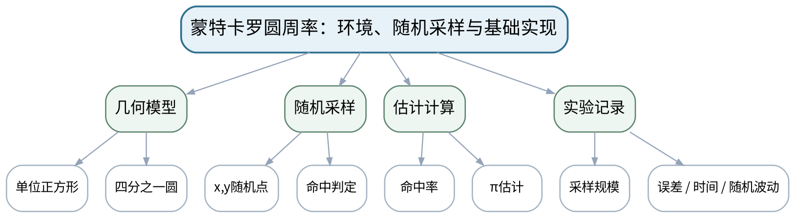

### 教学目标
**知识目标：**
1. 理解蒙特卡罗随机采样估计圆周率的几何思想及采样点判定条件。
2. 掌握random/NumPy随机数的基本生成方式和循环/计数实现。

**能力目标：**
1. 能够完成可运行的圆周率估计程序，并记录采样数、估计值、误差与运行时间。
2. 能够构造不同采样规模进行对照并解释随机波动。

**价值目标：**
1. 形成不选择性只报告“最好一次”结果、完整保留实验参数与结果的实证意识。

### 课程思政
以随机实验的波动说明工程结论要依赖重复验证和完整记录，不能选择性展示最有利结果。

### 专创融合
把蒙特卡罗脚本视为可配置计算工具，开始引入参数、结果表和可复现实验记录。

### 教学重难点
**教学重点：**蒙特卡罗模型与随机采样程序；实验记录。

**教学难点：**理解随机结果波动与采样规模关系；避免把单次偶然结果解释成稳定规律。

### 教学方法与用具
**教学方法：**问题驱动法、建模推演法、代码阅读/演示法、预测—执行—验证法、任务驱动法、测试验收与错误复盘

**教学用具：**机房、Python、VS Code/Jupyter、计时工具。

### 教学设计
课前任务 → 互动导入（10 min）→ 传授新知与课堂训练（75 min）→ 过关检测（10 min）→ 课堂小结（3 min）→ 作业布置（1 min）→ 考勤（1 min）

### 课前任务
【教师】发布“蒙特卡罗圆周率：环境、随机采样与基础实现”对应大纲/教材范围和一个最小工程问题，不提前给出完整代码答案。

1. 阅读对应大纲与教材内容；
2. 圈出3个关键术语并记录至少1个疑问；
3. 检查Python环境、上一任务源文件/数据与依赖是否可运行；不得使用未经授权的真实敏感工程数据。

【学生】完成准备并带着“预期结果/疑问/已有证据”进入课堂。

### 互动导入
【教师】先给出n=100的一次“非常接近π”的结果，再给出n=10000的稍差结果，要求学生判断能否据此说“小样本更准”。

【学生】先独立预测/判断，再与同伴交换依据；教师收集典型分歧后进入本课。

### 传授新知与课堂训练
**一、任务说明与模型/代码骨架（约20 min）—任务建模**

【教师】写出几何概率模型、输入输出、命中条件和误差定义；确认环境可运行。

【学生】按任务约束独立/小组实现，先写模型预期再运行，保留代码、参数、错误信息、测试与图表证据。

**二、学生独立/小组实现（约35 min）—独立实现**

【教师】学生用循环实现随机点生成、命中计数和π估计；记录n=100、1000、10000的结果。

【学生】按任务约束独立/小组实现，先写模型预期再运行，保留代码、参数、错误信息、测试与图表证据。

**三、测试、调试与证据固化（约20 min）—对照与排错**

【教师】重复运行同一n，观察随机波动；检查坐标范围、平方和条件、计数和除法边界。

【学生】按任务约束独立/小组实现，先写模型预期再运行，保留代码、参数、错误信息、测试与图表证据。

**独立学习产物**：monte_carlo_pi_v1.py＋采样结果记录表。

**学习证据**：源代码、至少3种n×多次运行结果、绝对误差、运行时间、1个失败/修正案例。

**评价映射**：课程作业（第二单元20%模块，上机一前段）＋期末综合项目方法基础；目标1.2、1.3、2.2、3.1、3.5。

### 过关检测
【教师】组织当堂检测：

1. 为什么随机采样结果每次不同？
2. 怎样定义本实验的误差？
3. 一次很准的结果是否代表算法在该n下稳定？

【学生】独立作答/运行/推演验证；【教师】按错误类型讲解，要求说明模型、数值或图表依据。

### 课堂小结
【教师】回到本课知识脉络图，用“问题—模型—计算/数据—验证—表达—边界”总结“蒙特卡罗圆周率：环境、随机采样与基础实现”，再次强调教学重点：蒙特卡罗模型与随机采样程序；实验记录。

【学生】写下“本课一条最重要的模型/计算规则 + 一个最容易出错的边界”。

### 作业布置
【教师】布置课后任务：补做同一n至少5次重复实验，计算平均误差并准备下一课比较实现方案。

【学生】按课程文件命名与证据要求整理提交；任何AI/开源工具建议均需保留人工核验记录。

### 考勤
【教师】利用学校/课程实际使用的平台进行签到。

【学生】按课程要求完成签到。

### 课后教学反思
【课后填写，不预填事实】

1. 教学流程：记录100 min各环节实际用时、理论/上机切换及调整点；
2. 教学内容：重点记录“理解随机结果波动与采样规模关系；避免把单次偶然结果解释成稳定规律。”的真实掌握证据和常见错误；
3. 学生参与：仅依据实际课堂记录填写推演、独立编码、调试、图表互审和讨论情况，不补写推测；
4. 评价证据：检查本课代码、数据、参数、测试、图表与说明是否完整，记录缺项原因；
5. 后续改进：依据真实课堂证据决定下一次课的补救、复现或拓展。

### 本章节参考文献
[1] 王小银 等.《Python数据分析与科学计算》[M]. 机械工业出版社，2024。
[2] 李志远, 黄化人, 姚明菊, 等.《Python编程与科学计算（微课视频版）》[M]. 清华大学出版社，2023。

## 第5次课 蒙特卡罗误差复盘与NumPy数组入门

### 课次信息
- **章节/单元**：上机一后1课时＋第三单元理论起始
- **周次**：按实际课表填写
- **课时安排**：2课时（100 min）
- **课型**：理实一体
- **理论/上机分配**：上机1课时＋理论1课时

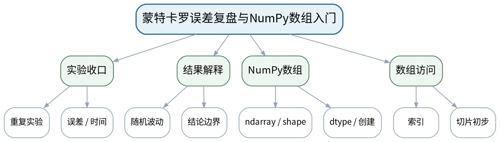

### 教学目标
**知识目标：**
1. 理解采样规模、误差和运行时间之间的基本关系。
2. 掌握NumPy ndarray、shape、dtype、数组创建和基础索引概念。

**能力目标：**
1. 能够整理蒙特卡罗多次实验并用数据而非单次结果下结论。
2. 能够把Python列表数据转换为NumPy数组并检查形状/类型。

**价值目标：**
1. 形成从实验复盘过渡到工具升级时仍保留验证证据和边界说明的习惯。

### 课程思政
强调实验报告不得删去不利结果；结论必须和记录一致，工具升级不能替代证据意识。

### 专创融合
把实验结果数组化，为后续参数扫描、性能比较和自动化报告建立可扩展数据结构。

### 教学重难点
**教学重点：**蒙特卡罗实验结论的证据链；NumPy数组的结构。

**教学难点：**在一节混合课中完成上机项目收口并建立从Python容器到数值数组的认知迁移。

### 教学方法与用具
**教学方法：**问题驱动法、建模推演法、代码阅读/演示法、预测—执行—验证法、任务驱动法、测试验收与错误复盘

**教学用具：**机房、Python、NumPy、VS Code/Jupyter。

### 教学设计
课前任务 → 互动导入（10 min）→ 传授新知与课堂训练（75 min）→ 过关检测（10 min）→ 课堂小结（3 min）→ 作业布置（1 min）→ 考勤（1 min）

### 课前任务
【教师】发布“蒙特卡罗误差复盘与NumPy数组入门”对应大纲/教材范围和一个最小工程问题，不提前给出完整代码答案。

1. 阅读对应大纲与教材内容；
2. 圈出3个关键术语并记录至少1个疑问；
3. 准备上一任务验收证据，并预读本次新概念/公式/数据文件；写出一个预期结果。

【学生】完成准备并带着“预期结果/疑问/已有证据”进入课堂。

### 互动导入
【教师】把学生上机一结果汇总成表，提问：若平均误差下降但运行时间上升，应如何描述“更好”？随后展示同一批数据转成ndarray后的shape/dtype。

【学生】先独立预测/判断，再与同伴交换依据；教师收集典型分歧后进入本课。

### 传授新知与课堂训练
**一、前段收口/新知引入（约25 min）—上机一验收**

【教师】学生整理多次实验，计算平均/最大误差和运行时间，补全README；教师检查是否选择性删结果。

【学生】完成前一任务验收并进入新知识练习；所有结论用数值、图表或测试证据支持，记录理论/上机转换点。

**二、核心推导与实现（约30 min）—NumPy概念迁移**

【教师】从list到ndarray，讲shape、dtype、zeros/arange/linspace及索引切片，解释数值数组为何适合科学计算。

【学生】完成前一任务验收并进入新知识练习；所有结论用数值、图表或测试证据支持，记录理论/上机转换点。

**三、验证、练习与证据固化（约20 min）—最小练习**

【教师】把实验结果表转为数组，完成列选取、误差向量和基础统计，为向量化做准备。

【学生】完成前一任务验收并进入新知识练习；所有结论用数值、图表或测试证据支持，记录理论/上机转换点。

**独立学习产物**：上机一完整小报告＋NumPy数组练习脚本。

**学习证据**：多次实验结果表、结论文字、README、数组shape/dtype/索引输出。

**评价映射**：课程作业（第二单元20%模块完成）＋第三单元30%模块起始；目标1.2、1.3、2.2、3.1、3.5。

### 过关检测
【教师】组织当堂检测：

1. 如何用重复实验避免“只看最好一次”？
2. ndarray的shape和dtype分别描述什么？
3. 为什么科学计算中通常要关注数组形状？

【学生】独立作答/运行/推演验证；【教师】按错误类型讲解，要求说明模型、数值或图表依据。

### 课堂小结
【教师】回到本课知识脉络图，用“问题—模型—计算/数据—验证—表达—边界”总结“蒙特卡罗误差复盘与NumPy数组入门”，再次强调教学重点：蒙特卡罗实验结论的证据链；NumPy数组的结构。

【学生】写下“本课一条最重要的模型/计算规则 + 一个最容易出错的边界”。

### 作业布置
【教师】布置课后任务：提交上机一完整包；完成NumPy数组创建/索引练习并记录3个常见shape错误。

【学生】按课程文件命名与证据要求整理提交；任何AI/开源工具建议均需保留人工核验记录。

### 考勤
【教师】利用学校/课程实际使用的平台进行签到。

【学生】按课程要求完成签到。

### 课后教学反思
【课后填写，不预填事实】

1. 教学流程：记录100 min各环节实际用时、理论/上机切换及调整点；
2. 教学内容：重点记录“在一节混合课中完成上机项目收口并建立从Python容器到数值数组的认知迁移。”的真实掌握证据和常见错误；
3. 学生参与：仅依据实际课堂记录填写推演、独立编码、调试、图表互审和讨论情况，不补写推测；
4. 评价证据：检查本课代码、数据、参数、测试、图表与说明是否完整，记录缺项原因；
5. 后续改进：依据真实课堂证据决定下一次课的补救、复现或拓展。

### 本章节参考文献
[1] 王小银 等.《Python数据分析与科学计算》[M]. 机械工业出版社，2024。
[2] 李志远, 黄化人, 姚明菊, 等.《Python编程与科学计算（微课视频版）》[M]. 清华大学出版社，2023。

## 第6次课 NumPy向量化、广播、矩阵运算与SciPy数值方法

### 课次信息
- **章节/单元**：第三单元 科学计算与工程数据处理
- **周次**：按实际课表填写
- **课时安排**：2课时（100 min）
- **课型**：理论
- **理论/上机分配**：理论2课时

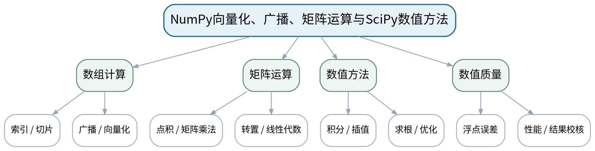

### 教学目标
**知识目标：**
1. 掌握数组索引切片、广播、向量化、矩阵乘法与常见线性代数操作。
2. 了解SciPy数值积分、插值、方程求解和优化的基本用途及“工具有适用条件”的原则。

**能力目标：**
1. 能够比较循环与向量化计算结构并判断数组shape是否兼容。
2. 能够为一个简单数值问题选择合适的SciPy工具并设计结果校核。

**价值目标：**
1. 形成关注浮点误差、计算效率和工具适用边界的科学计算意识。

### 课程思政
通过数值误差和性能证据强调“快”和“对”都需要测量，不能凭经验或工具输出做结论。

### 专创融合
把向量化、矩阵计算和SciPy视为工程计算服务的核心计算层，训练选择工具而非堆叠工具。

### 教学重难点
**教学重点：**广播与向量化；矩阵运算；SciPy方法选择。

**教学难点：**理解广播shape规则和数值函数输入条件；避免“库函数返回数值就认为正确”。

### 教学方法与用具
**教学方法：**问题驱动法、建模推演法、代码阅读/演示法、预测—执行—验证法、任务驱动法、测试验收与错误复盘

**教学用具：**电脑、Python、NumPy、SciPy、计时工具。

### 教学设计
课前任务 → 互动导入（10 min）→ 传授新知与课堂训练（75 min）→ 过关检测（10 min）→ 课堂小结（3 min）→ 作业布置（1 min）→ 考勤（1 min）

### 课前任务
【教师】发布“NumPy向量化、广播、矩阵运算与SciPy数值方法”对应大纲/教材范围和一个最小工程问题，不提前给出完整代码答案。

1. 阅读对应大纲与教材内容；
2. 圈出3个关键术语并记录至少1个疑问；
3. 预读一个公式、代码或工程图表片段，写出预期结果与至少一个疑问。

【学生】完成准备并带着“预期结果/疑问/已有证据”进入课堂。

### 互动导入
【教师】比较同一个100万点运算的for循环与向量化版本，让学生先预测哪个更快、结果是否应完全相同。

【学生】先独立预测/判断，再与同伴交换依据；教师收集典型分歧后进入本课。

### 传授新知与课堂训练
**一、核心概念与工程案例（约30 min）—向量化与广播**

【教师】用批量单位换算、距离计算展示广播；学生画shape变化图并判断可否广播。

【学生】完成公式/代码/图表推演或场景判断，先写预期与依据，再用课堂示例验证并修正。

**二、学生推演/建模/代码阅读（约25 min）—矩阵与误差**

【教师】讲矩阵乘法、转置、线性代数基本接口；用浮点比较和条件数/误差现象强调数值结果需要校核。

【学生】完成公式/代码/图表推演或场景判断，先写预期与依据，再用课堂示例验证并修正。

**三、对比、验证与错误复盘（约20 min）—SciPy用途地图**

【教师】用积分、插值、求根、优化四个最小案例说明函数接口、初值/区间/边界等条件，要求学生写验证方案。

【学生】完成公式/代码/图表推演或场景判断，先写预期与依据，再用课堂示例验证并修正。

**独立学习产物**：“循环 vs 向量化”对比卡＋SciPy方法选择表。

**学习证据**：shape推演、运行时间对照、结果差值、SciPy输入条件和验证思路。

**评价映射**：平时表现＋课程作业（第三单元30%模块）；目标1.3、2.2、3.1。

### 过关检测
【教师】组织当堂检测：

1. 广播的核心判断是什么？
2. 为什么浮点数不宜总用==判断理论相等？
3. 数值求根为什么要关心初值/区间？

【学生】独立作答/运行/推演验证；【教师】按错误类型讲解，要求说明模型、数值或图表依据。

### 课堂小结
【教师】回到本课知识脉络图，用“问题—模型—计算/数据—验证—表达—边界”总结“NumPy向量化、广播、矩阵运算与SciPy数值方法”，再次强调教学重点：广播与向量化；矩阵运算；SciPy方法选择。

【学生】写下“本课一条最重要的模型/计算规则 + 一个最容易出错的边界”。

### 作业布置
【教师】布置课后任务：完成3组循环—向量化改写；为积分/求根各写一条独立校核方式。

【学生】按课程文件命名与证据要求整理提交；任何AI/开源工具建议均需保留人工核验记录。

### 考勤
【教师】利用学校/课程实际使用的平台进行签到。

【学生】按课程要求完成签到。

### 课后教学反思
【课后填写，不预填事实】

1. 教学流程：记录100 min各环节实际用时、理论/上机切换及调整点；
2. 教学内容：重点记录“理解广播shape规则和数值函数输入条件；避免“库函数返回数值就认为正确”。”的真实掌握证据和常见错误；
3. 学生参与：仅依据实际课堂记录填写推演、独立编码、调试、图表互审和讨论情况，不补写推测；
4. 评价证据：检查本课代码、数据、参数、测试、图表与说明是否完整，记录缺项原因；
5. 后续改进：依据真实课堂证据决定下一次课的补救、复现或拓展。

### 本章节参考文献
[1] 王小银 等.《Python数据分析与科学计算》[M]. 机械工业出版社，2024。
[2] 李志远, 黄化人, 姚明菊, 等.《Python编程与科学计算（微课视频版）》[M]. 清华大学出版社，2023。

## 第7次课 Pandas数据流程与NumPy向量化性能实验

### 课次信息
- **章节/单元**：第三单元理论后1课时＋上机二前1课时
- **周次**：按实际课表填写
- **课时安排**：2课时（100 min）
- **课型**：理实一体
- **理论/上机分配**：理论1课时＋上机1课时

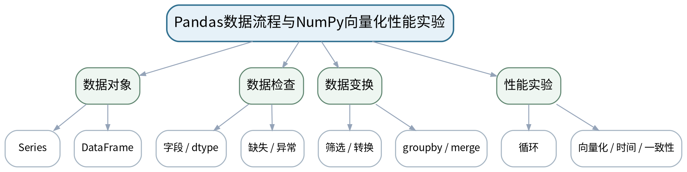

### 教学目标
**知识目标：**
1. 掌握Pandas DataFrame/Series、读取、类型检查、缺失值/异常值、筛选、分组和连接的基本流程。
2. 理解循环与向量化性能对比实验的测量方法。

**能力目标：**
1. 能够检查工程数据的字段、类型、缺失和异常，提出清洗策略。
2. 能够完成一个循环/向量化对照实验并记录时间与结果一致性。

**价值目标：**
1. 形成原始数据留存、清洗可追溯和性能比较需控制变量的意识。

### 课程思政
强调数据处理过程透明，禁止为了得到预期结论随意删除异常数据。

### 专创融合
将数据质量报告视为分析产品的“数据验收层”，将性能对照作为计算模块选型证据。

### 教学重难点
**教学重点：**Pandas工程数据流程；性能实验设计。

**教学难点：**同时处理“数据质量”和“计算性能”两个维度，避免为了效率牺牲语义或为了清洗破坏原始数据。

### 教学方法与用具
**教学方法：**问题驱动法、建模推演法、代码阅读/演示法、预测—执行—验证法、任务驱动法、测试验收与错误复盘

**教学用具：**机房、Python、NumPy、Pandas、CSV工程数据。

### 教学设计
课前任务 → 互动导入（10 min）→ 传授新知与课堂训练（75 min）→ 过关检测（10 min）→ 课堂小结（3 min）→ 作业布置（1 min）→ 考勤（1 min）

### 课前任务
【教师】发布“Pandas数据流程与NumPy向量化性能实验”对应大纲/教材范围和一个最小工程问题，不提前给出完整代码答案。

1. 阅读对应大纲与教材内容；
2. 圈出3个关键术语并记录至少1个疑问；
3. 准备上一任务验收证据，并预读本次新概念/公式/数据文件；写出一个预期结果。

【学生】完成准备并带着“预期结果/疑问/已有证据”进入课堂。

### 互动导入
【教师】给出一份包含空值、异常温度和重复设备编号的CSV，以及一段慢循环代码，要求学生分别指出“数据问题”和“实现问题”。

【学生】先独立预测/判断，再与同伴交换依据；教师收集典型分歧后进入本课。

### 传授新知与课堂训练
**一、前段收口/新知引入（约25 min）—Pandas流程**

【教师】演示read_csv、info、isna、筛选、groupby、merge；强调原始数据只读保存和清洗日志。

【学生】完成前一任务验收并进入新知识练习；所有结论用数值、图表或测试证据支持，记录理论/上机转换点。

**二、核心推导与实现（约30 min）—性能实验启动**

【教师】学生完成一个数组计算的循环与向量化两版，统一输入、重复测时，并比较结果误差。

【学生】完成前一任务验收并进入新知识练习；所有结论用数值、图表或测试证据支持，记录理论/上机转换点。

**三、验证、练习与证据固化（约20 min）—数据质量练习**

【教师】学生对示例工程数据生成质量报告：缺失、异常、重复、单位/类型问题及处理理由。

【学生】完成前一任务验收并进入新知识练习；所有结论用数值、图表或测试证据支持，记录理论/上机转换点。

**独立学习产物**：性能对照脚本＋数据质量检查表。

**学习证据**：原始数据副本、清洗日志、循环/向量化运行时间、结果一致性检查。

**评价映射**：课程作业（第三单元30%模块，上机二前段）；目标1.3、1.4、2.2、2.3、3.1、3.3。

### 过关检测
【教师】组织当堂检测：

1. 为什么清洗前要保留原始数据？
2. 循环和向量化比较怎样做到“同一问题同一输入”？
3. 异常值应删除、修正还是保留由什么决定？

【学生】独立作答/运行/推演验证；【教师】按错误类型讲解，要求说明模型、数值或图表依据。

### 课堂小结
【教师】回到本课知识脉络图，用“问题—模型—计算/数据—验证—表达—边界”总结“Pandas数据流程与NumPy向量化性能实验”，再次强调教学重点：Pandas工程数据流程；性能实验设计。

【学生】写下“本课一条最重要的模型/计算规则 + 一个最容易出错的边界”。

### 作业布置
【教师】布置课后任务：完善工程数据质量报告；为下节课准备分组统计、表连接和结果导出任务。

【学生】按课程文件命名与证据要求整理提交；任何AI/开源工具建议均需保留人工核验记录。

### 考勤
【教师】利用学校/课程实际使用的平台进行签到。

【学生】按课程要求完成签到。

### 课后教学反思
【课后填写，不预填事实】

1. 教学流程：记录100 min各环节实际用时、理论/上机切换及调整点；
2. 教学内容：重点记录“同时处理“数据质量”和“计算性能”两个维度，避免为了效率牺牲语义或为了清洗破坏原始数据。”的真实掌握证据和常见错误；
3. 学生参与：仅依据实际课堂记录填写推演、独立编码、调试、图表互审和讨论情况，不补写推测；
4. 评价证据：检查本课代码、数据、参数、测试、图表与说明是否完整，记录缺项原因；
5. 后续改进：依据真实课堂证据决定下一次课的补救、复现或拓展。

### 本章节参考文献
[1] 王小银 等.《Python数据分析与科学计算》[M]. 机械工业出版社，2024。
[2] 李志远, 黄化人, 姚明菊, 等.《Python编程与科学计算（微课视频版）》[M]. 清华大学出版社，2023。

## 第8次课 工程数据清洗、分组统计、表连接与结果导出

### 课次信息
- **章节/单元**：上机二 NumPy矩阵运算与Pandas工程数据处理
- **周次**：按实际课表填写
- **课时安排**：2课时（100 min）
- **课型**：上机
- **理论/上机分配**：上机2课时（上机二中段）

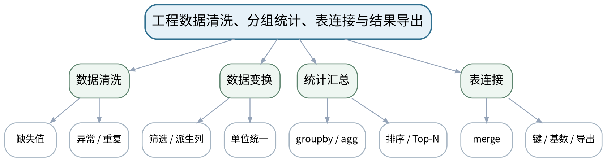

### 教学目标
**知识目标：**
1. 掌握Pandas缺失/异常处理、筛选、派生列、groupby聚合、merge连接和结果导出。
2. 巩固NumPy数组与矩阵运算在批量计算中的应用。

**能力目标：**
1. 能够完成“读取—检查—清洗—转换—汇总—连接—导出”工程数据流程。
2. 能够用小样本或独立查询核对关键统计结果。

**价值目标：**
1. 形成数据来源、处理步骤、单位和结果可复核的工程数据治理习惯。

### 课程思政
通过字段口径和清洗日志强化数据真实性与可追溯性，无法确认的数据不强行“修正”。

### 专创融合
将清洗后的数据与统计结果作为后续可视化/模型输入的数据产品，训练可复用数据管道。

### 教学重难点
**教学重点：**Pandas清洗、聚合与连接；结果核验。

**教学难点：**merge键/基数导致的重复扩展；清洗策略对结论的影响。

### 教学方法与用具
**教学方法：**问题驱动法、建模推演法、代码阅读/演示法、预测—执行—验证法、任务驱动法、测试验收与错误复盘

**教学用具：**机房、Python、NumPy、Pandas、工程CSV数据。

### 教学设计
课前任务 → 互动导入（10 min）→ 传授新知与课堂训练（75 min）→ 过关检测（10 min）→ 课堂小结（3 min）→ 作业布置（1 min）→ 考勤（1 min）

### 课前任务
【教师】发布“工程数据清洗、分组统计、表连接与结果导出”对应大纲/教材范围和一个最小工程问题，不提前给出完整代码答案。

1. 阅读对应大纲与教材内容；
2. 圈出3个关键术语并记录至少1个疑问；
3. 检查Python环境、上一任务源文件/数据与依赖是否可运行；不得使用未经授权的真实敏感工程数据。

【学生】完成准备并带着“预期结果/疑问/已有证据”进入课堂。

### 互动导入
【教师】提供“设备运行表＋设备台账表”，其中一张表设备ID重复，要求学生先预测merge后行数，再运行验证。

【学生】先独立预测/判断，再与同伴交换依据；教师收集典型分歧后进入本课。

### 传授新知与课堂训练
**一、任务说明与模型/代码骨架（约20 min）—任务拆解**

【教师】明确原始数据只读、清洗副本、字段单位和输出要求；先写处理流程图。

【学生】按任务约束独立/小组实现，先写模型预期再运行，保留代码、参数、错误信息、测试与图表证据。

**二、学生独立/小组实现（约35 min）—独立实现**

【教师】完成缺失/异常处理、派生指标、groupby统计、两表merge和CSV结果导出。

【学生】按任务约束独立/小组实现，先写模型预期再运行，保留代码、参数、错误信息、测试与图表证据。

**三、测试、调试与证据固化（约20 min）—结果验收**

【教师】核对行数、连接基数、单位和3个关键统计；保留处理前后对照和不能确认的数据。

【学生】按任务约束独立/小组实现，先写模型预期再运行，保留代码、参数、错误信息、测试与图表证据。

**独立学习产物**：data_process.py＋clean_data.csv＋summary.csv＋清洗日志。

**学习证据**：原始/清洗数据、代码、行数/字段检查、groupby结果、merge前后基数、独立复核记录。

**评价映射**：课程作业（第三单元30%模块，上机二中段）；目标1.3、1.4、2.2、2.3、3.1、3.3。

### 过关检测
【教师】组织当堂检测：

1. merge后行数突然增加可能有哪些原因？
2. 为什么“填充缺失值”必须说明依据？
3. 怎样证明一个groupby结果没有分错组？

【学生】独立作答/运行/推演验证；【教师】按错误类型讲解，要求说明模型、数值或图表依据。

### 课堂小结
【教师】回到本课知识脉络图，用“问题—模型—计算/数据—验证—表达—边界”总结“工程数据清洗、分组统计、表连接与结果导出”，再次强调教学重点：Pandas清洗、聚合与连接；结果核验。

【学生】写下“本课一条最重要的模型/计算规则 + 一个最容易出错的边界”。

### 作业布置
【教师】布置课后任务：补充一份数据字典，说明字段单位、缺失处理、异常规则和连接键。

【学生】按课程文件命名与证据要求整理提交；任何AI/开源工具建议均需保留人工核验记录。

### 考勤
【教师】利用学校/课程实际使用的平台进行签到。

【学生】按课程要求完成签到。

### 课后教学反思
【课后填写，不预填事实】

1. 教学流程：记录100 min各环节实际用时、理论/上机切换及调整点；
2. 教学内容：重点记录“merge键/基数导致的重复扩展；清洗策略对结论的影响。”的真实掌握证据和常见错误；
3. 学生参与：仅依据实际课堂记录填写推演、独立编码、调试、图表互审和讨论情况，不补写推测；
4. 评价证据：检查本课代码、数据、参数、测试、图表与说明是否完整，记录缺项原因；
5. 后续改进：依据真实课堂证据决定下一次课的补救、复现或拓展。

### 本章节参考文献
[1] 王小银 等.《Python数据分析与科学计算》[M]. 机械工业出版社，2024。
[2] 李志远, 黄化人, 姚明菊, 等.《Python编程与科学计算（微课视频版）》[M]. 清华大学出版社，2023。

## 第9次课 数据处理验收与Matplotlib工程可视化入门

### 课次信息
- **章节/单元**：上机二后1课时＋第四单元理论起始
- **周次**：按实际课表填写
- **课时安排**：2课时（100 min）
- **课型**：理实一体
- **理论/上机分配**：上机1课时＋理论1课时

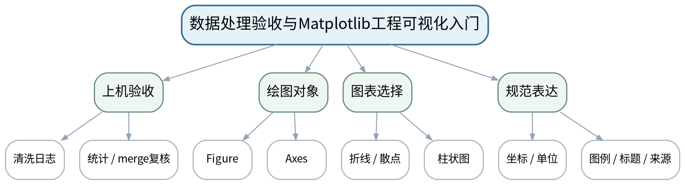

### 教学目标
**知识目标：**
1. 理解数据处理验收需要检查字段、单位、缺失、连接行数和统计口径。
2. 掌握Matplotlib figure/axes、折线/散点/柱状图和坐标轴/单位/图例的基本结构。

**能力目标：**
1. 能够收口上机二并给出可复核的数据处理结论。
2. 能够根据时间序列、关系比较、类别比较选择基础图表并规范标注。

**价值目标：**
1. 形成图表服务于工程问题、不得用视觉技巧歪曲数据的表达责任。

### 课程思政
通过误导性图表反例强调客观表达与受众责任，不用视觉设计隐藏不利数据。

### 专创融合
将数据处理结果转为可读“工程信息产品”，训练图表作为决策沟通界面。

### 教学重难点
**教学重点：**数据处理闭环；Matplotlib对象模型与图表选择。

**教学难点：**把“好看”与“表达正确”分开，理解图表选择必须服从数据类型和分析问题。

### 教学方法与用具
**教学方法：**问题驱动法、建模推演法、代码阅读/演示法、预测—执行—验证法、任务驱动法、测试验收与错误复盘

**教学用具：**机房、Python、Pandas、Matplotlib、课程工程数据。

### 教学设计
课前任务 → 互动导入（10 min）→ 传授新知与课堂训练（75 min）→ 过关检测（10 min）→ 课堂小结（3 min）→ 作业布置（1 min）→ 考勤（1 min）

### 课前任务
【教师】发布“数据处理验收与Matplotlib工程可视化入门”对应大纲/教材范围和一个最小工程问题，不提前给出完整代码答案。

1. 阅读对应大纲与教材内容；
2. 圈出3个关键术语并记录至少1个疑问；
3. 准备上一任务验收证据，并预读本次新概念/公式/数据文件；写出一个预期结果。

【学生】完成准备并带着“预期结果/疑问/已有证据”进入课堂。

### 互动导入
【教师】展示同一组运行数据的折线图、柱状图、散点图，提问哪个更适合“随时间变化”和“两个变量关系”，并指出缺单位图表的问题。

【学生】先独立预测/判断，再与同伴交换依据；教师收集典型分歧后进入本课。

### 传授新知与课堂训练
**一、前段收口/新知引入（约25 min）—上机二验收**

【教师】学生按数据字典复查清洗、统计和merge结果，形成上机二README与结论边界。

【学生】完成前一任务验收并进入新知识练习；所有结论用数值、图表或测试证据支持，记录理论/上机转换点。

**二、核心推导与实现（约30 min）—Matplotlib入门**

【教师】讲Figure/Axes、plot/scatter/bar、xlabel/ylabel/legend/title和保存图像。

【学生】完成前一任务验收并进入新知识练习；所有结论用数值、图表或测试证据支持，记录理论/上机转换点。

**三、验证、练习与证据固化（约20 min）—图表选择练习**

【教师】给出3类工程问题，让学生选择图表并说明理由；辨析截断坐标、面积错觉和过度装饰。

【学生】完成前一任务验收并进入新知识练习；所有结论用数值、图表或测试证据支持，记录理论/上机转换点。

**独立学习产物**：上机二完整交付＋3张规范基础图及图表选择说明。

**学习证据**：README、数据字典、统计复核、绘图脚本、PNG图、单位/图例检查表。

**评价映射**：课程作业（第三单元30%模块完成）＋第四单元20%模块起始；目标1.4、1.5、2.3、3.1、3.3、3.5。

### 过关检测
【教师】组织当堂检测：

1. 折线图与散点图分别强调什么关系？
2. 工程图为什么必须标单位？
3. 坐标轴截断何时可能误导？

【学生】独立作答/运行/推演验证；【教师】按错误类型讲解，要求说明模型、数值或图表依据。

### 课堂小结
【教师】回到本课知识脉络图，用“问题—模型—计算/数据—验证—表达—边界”总结“数据处理验收与Matplotlib工程可视化入门”，再次强调教学重点：数据处理闭环；Matplotlib对象模型与图表选择。

【学生】写下“本课一条最重要的模型/计算规则 + 一个最容易出错的边界”。

### 作业布置
【教师】布置课后任务：选择上一课summary.csv中的3个指标，分别制作适当图表并写一句“图表支持的结论/不支持的结论”。

【学生】按课程文件命名与证据要求整理提交；任何AI/开源工具建议均需保留人工核验记录。

### 考勤
【教师】利用学校/课程实际使用的平台进行签到。

【学生】按课程要求完成签到。

### 课后教学反思
【课后填写，不预填事实】

1. 教学流程：记录100 min各环节实际用时、理论/上机切换及调整点；
2. 教学内容：重点记录“把“好看”与“表达正确”分开，理解图表选择必须服从数据类型和分析问题。”的真实掌握证据和常见错误；
3. 学生参与：仅依据实际课堂记录填写推演、独立编码、调试、图表互审和讨论情况，不补写推测；
4. 评价证据：检查本课代码、数据、参数、测试、图表与说明是否完整，记录缺项原因；
5. 后续改进：依据真实课堂证据决定下一次课的补救、复现或拓展。

### 本章节参考文献
[1] 王小银 等.《Python数据分析与科学计算》[M]. 机械工业出版社，2024。
[2] 李志远, 黄化人, 姚明菊, 等.《Python编程与科学计算（微课视频版）》[M]. 清华大学出版社，2023。

## 第10次课 Matplotlib规范绘图、子图、等值图与基础三维表达

### 课次信息
- **章节/单元**：第四单元 数据可视化设计与工程表达
- **周次**：按实际课表填写
- **课时安排**：2课时（100 min）
- **课型**：理论
- **理论/上机分配**：理论2课时

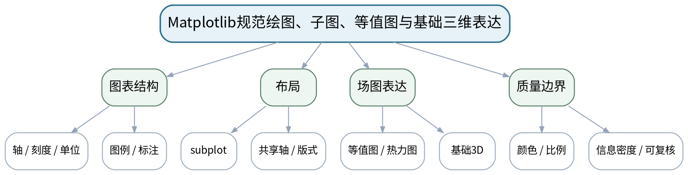

### 教学目标
**知识目标：**
1. 掌握坐标轴范围、刻度、单位、图例、标注、颜色、子图布局和图像保存。
2. 了解等值图、热力表达和基础三维线/散点/曲面图的适用场景。

**能力目标：**
1. 能够把同一数据按工程目的设计成信息层次清晰的图表组。
2. 能够识别比例失真、颜色误导、信息过载和3D滥用。

**价值目标：**
1. 形成准确、简洁、可复核的工程可视化规范。

### 课程思政
强调图表既是技术表达，也是责任文件；坐标、单位和视觉编码不能误导受众。

### 专创融合
把可视化规范转化为报告/看板设计标准，为后续机构运动学和轨迹仿真提供统一输出规范。

### 教学重难点
**教学重点：**规范标注与布局；等值/三维图适用性。

**教学难点：**在信息完整和图面简洁之间权衡；避免为了“高级感”使用不必要3D。

### 教学方法与用具
**教学方法：**问题驱动法、建模推演法、代码阅读/演示法、预测—执行—验证法、任务驱动法、测试验收与错误复盘

**教学用具：**电脑、Python、Matplotlib、示例二维/三维图。

### 教学设计
课前任务 → 互动导入（10 min）→ 传授新知与课堂训练（75 min）→ 过关检测（10 min）→ 课堂小结（3 min）→ 作业布置（1 min）→ 考勤（1 min）

### 课前任务
【教师】发布“Matplotlib规范绘图、子图、等值图与基础三维表达”对应大纲/教材范围和一个最小工程问题，不提前给出完整代码答案。

1. 阅读对应大纲与教材内容；
2. 圈出3个关键术语并记录至少1个疑问；
3. 预读一个公式、代码或工程图表片段，写出预期结果与至少一个疑问。

【学生】完成准备并带着“预期结果/疑问/已有证据”进入课堂。

### 互动导入
【教师】给出一个3D柱状图和一个2D条形图展示相同类别数据，让学生比较哪一个更容易精确判断差异。

【学生】先独立预测/判断，再与同伴交换依据；教师收集典型分歧后进入本课。

### 传授新知与课堂训练
**一、核心概念与工程案例（约30 min）—规范元素**

【教师】系统讲轴、单位、图例、标注、网格、保存分辨率和中文/符号显示。

【学生】完成公式/代码/图表推演或场景判断，先写预期与依据，再用课堂示例验证并修正。

**二、学生推演/建模/代码阅读（约25 min）—多图布局**

【教师】用位置—速度—误差三子图展示共享时间轴；讨论布局、对齐与比较任务。

【学生】完成公式/代码/图表推演或场景判断，先写预期与依据，再用课堂示例验证并修正。

**三、对比、验证与错误复盘（约20 min）—场与三维**

【教师】介绍contour/contourf和mplot3d基础；比较何时3D提供空间结构、何时只是视觉负担。

【学生】完成公式/代码/图表推演或场景判断，先写预期与依据，再用课堂示例验证并修正。

**独立学习产物**：一张“工程图表规范检查表”＋一组图表重构草案。

**学习证据**：错误图找错记录、重构前后对比、图表用途/单位/比例说明。

**评价映射**：平时表现＋课程作业（第四单元20%模块）；目标1.5、2.3、3.3、3.5。

### 过关检测
【教师】组织当堂检测：

1. 什么时候子图比叠加多条曲线更清晰？
2. 为什么3D图不一定比2D图信息更多？
3. 图例、单位、数据来源中哪些属于可复核性信息？

【学生】独立作答/运行/推演验证；【教师】按错误类型讲解，要求说明模型、数值或图表依据。

### 课堂小结
【教师】回到本课知识脉络图，用“问题—模型—计算/数据—验证—表达—边界”总结“Matplotlib规范绘图、子图、等值图与基础三维表达”，再次强调教学重点：规范标注与布局；等值/三维图适用性。

【学生】写下“本课一条最重要的模型/计算规则 + 一个最容易出错的边界”。

### 作业布置
【教师】布置课后任务：找一张公开工程图（不涉及个人/敏感数据），按规范检查表分析3个优点和3个可改进点。

【学生】按课程文件命名与证据要求整理提交；任何AI/开源工具建议均需保留人工核验记录。

### 考勤
【教师】利用学校/课程实际使用的平台进行签到。

【学生】按课程要求完成签到。

### 课后教学反思
【课后填写，不预填事实】

1. 教学流程：记录100 min各环节实际用时、理论/上机切换及调整点；
2. 教学内容：重点记录“在信息完整和图面简洁之间权衡；避免为了“高级感”使用不必要3D。”的真实掌握证据和常见错误；
3. 学生参与：仅依据实际课堂记录填写推演、独立编码、调试、图表互审和讨论情况，不补写推测；
4. 评价证据：检查本课代码、数据、参数、测试、图表与说明是否完整，记录缺项原因；
5. 后续改进：依据真实课堂证据决定下一次课的补救、复现或拓展。

### 本章节参考文献
[1] 王小银 等.《Python数据分析与科学计算》[M]. 机械工业出版社，2024。
[2] 李志远, 黄化人, 姚明菊, 等.《Python编程与科学计算（微课视频版）》[M]. 清华大学出版社，2023。

## 第11次课 坐标变换与两连杆机械臂正运动学建模

### 课次信息
- **章节/单元**：第四单元理论后1课时＋上机三前1课时
- **周次**：按实际课表填写
- **课时安排**：2课时（100 min）
- **课型**：理实一体
- **理论/上机分配**：理论1课时＋上机1课时

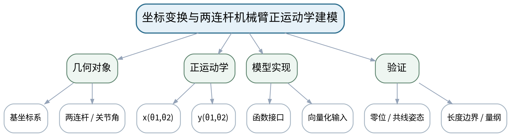

### 教学目标
**知识目标：**
1. 理解平面坐标系、关节角、连杆长度和两连杆正运动学关系。
2. 理解末端位置、构型、轨迹和工作空间的区别。

**能力目标：**
1. 能够从机械臂几何关系推导并实现末端坐标计算函数。
2. 能够用特殊姿态和长度边界测试正运动学模型。

**价值目标：**
1. 形成尊重物理约束、先推导/验算再扩大数值采样的建模习惯。

### 课程思政
通过机械臂物理边界和安全姿态强调模型必须尊重真实约束，不得用图形“遮住”错误数值。

### 专创融合
把正运动学函数设计成可复用计算模块，作为机器人仿真/数字样机的最小计算服务。

### 教学重难点
**教学重点：**两连杆正运动学模型；特殊姿态验证。

**教学难点：**坐标系和角度定义必须一致；公式、程序和图形三者要互相校验。

### 教学方法与用具
**教学方法：**问题驱动法、建模推演法、代码阅读/演示法、预测—执行—验证法、任务驱动法、测试验收与错误复盘

**教学用具：**机房、Python、NumPy、Matplotlib、白板/公式推导。

### 教学设计
课前任务 → 互动导入（10 min）→ 传授新知与课堂训练（75 min）→ 过关检测（10 min）→ 课堂小结（3 min）→ 作业布置（1 min）→ 考勤（1 min）

### 课前任务
【教师】发布“坐标变换与两连杆机械臂正运动学建模”对应大纲/教材范围和一个最小工程问题，不提前给出完整代码答案。

1. 阅读对应大纲与教材内容；
2. 圈出3个关键术语并记录至少1个疑问；
3. 准备上一任务验收证据，并预读本次新概念/公式/数据文件；写出一个预期结果。

【学生】完成准备并带着“预期结果/疑问/已有证据”进入课堂。

### 互动导入
【教师】画出两连杆机械臂并给出θ1=θ2=0，先让学生不用代码判断末端应在哪里，再运行程序检验。

【学生】先独立预测/判断，再与同伴交换依据；教师收集典型分歧后进入本课。

### 传授新知与课堂训练
**一、前段收口/新知引入（约25 min）—理论推导**

【教师】建立基坐标系，推导x=l1 cosθ1+l2 cos(θ1+θ2)、y=l1 sinθ1+l2 sin(θ1+θ2)等关系，明确角度与单位。

【学生】完成前一任务验收并进入新知识练习；所有结论用数值、图表或测试证据支持，记录理论/上机转换点。

**二、核心推导与实现（约30 min）—函数实现**

【教师】学生实现forward_kinematics(theta1,theta2,l1,l2)，支持标量输入，输出末端位置。

【学生】完成前一任务验收并进入新知识练习；所有结论用数值、图表或测试证据支持，记录理论/上机转换点。

**三、验证、练习与证据固化（约20 min）—特殊姿态测试**

【教师】测试0°、90°、折叠/伸直等姿态，比较手工几何判断和程序结果。

【学生】完成前一任务验收并进入新知识练习；所有结论用数值、图表或测试证据支持，记录理论/上机转换点。

**独立学习产物**：两连杆正运动学推导页＋forward_kinematics.py＋特殊姿态测试表。

**学习证据**：公式、变量/单位定义、代码、手算/程序对照、失败修正记录。

**评价映射**：课程作业（第四单元20%模块，上机三起始）＋期末综合项目；目标1.1、1.3、1.5、2.1、2.4、3.1、3.5。

### 过关检测
【教师】组织当堂检测：

1. θ2是相对第一杆还是绝对角度会造成什么差别？
2. 什么特殊姿态最适合做模型单元测试？
3. 如果图画对了但数值不对，应先检查哪些定义？

【学生】独立作答/运行/推演验证；【教师】按错误类型讲解，要求说明模型、数值或图表依据。

### 课堂小结
【教师】回到本课知识脉络图，用“问题—模型—计算/数据—验证—表达—边界”总结“坐标变换与两连杆机械臂正运动学建模”，再次强调教学重点：两连杆正运动学模型；特殊姿态验证。

【学生】写下“本课一条最重要的模型/计算规则 + 一个最容易出错的边界”。

### 作业布置
【教师】布置课后任务：补全至少5组特殊姿态测试；准备下一课绘制机械臂构型和末端轨迹。

【学生】按课程文件命名与证据要求整理提交；任何AI/开源工具建议均需保留人工核验记录。

### 考勤
【教师】利用学校/课程实际使用的平台进行签到。

【学生】按课程要求完成签到。

### 课后教学反思
【课后填写，不预填事实】

1. 教学流程：记录100 min各环节实际用时、理论/上机切换及调整点；
2. 教学内容：重点记录“坐标系和角度定义必须一致；公式、程序和图形三者要互相校验。”的真实掌握证据和常见错误；
3. 学生参与：仅依据实际课堂记录填写推演、独立编码、调试、图表互审和讨论情况，不补写推测；
4. 评价证据：检查本课代码、数据、参数、测试、图表与说明是否完整，记录缺项原因；
5. 后续改进：依据真实课堂证据决定下一次课的补救、复现或拓展。

### 本章节参考文献
[1] 王小银 等.《Python数据分析与科学计算》[M]. 机械工业出版社，2024。
[2] 李志远, 黄化人, 姚明菊, 等.《Python编程与科学计算（微课视频版）》[M]. 清华大学出版社，2023。

## 第12次课 机械臂构型、末端轨迹与参数化仿真

### 课次信息
- **章节/单元**：上机三 平面连杆机械臂运动学与工作空间可视化
- **周次**：按实际课表填写
- **课时安排**：2课时（100 min）
- **课型**：上机
- **理论/上机分配**：上机2课时（上机三中段）

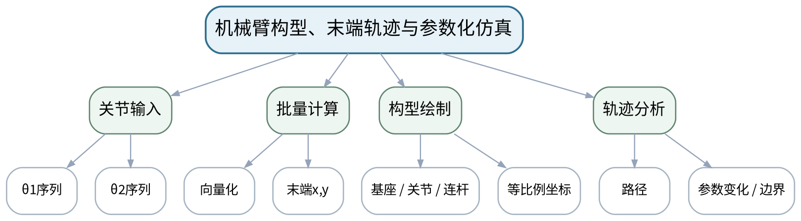

### 教学目标
**知识目标：**
1. 巩固正运动学、角度序列、末端轨迹与机械臂构型绘制。
2. 掌握用NumPy生成关节角序列和用Matplotlib同步表达构型/轨迹。

**能力目标：**
1. 能够完成关节轨迹→末端轨迹计算与可视化。
2. 能够比较不同连杆长度/角度范围对轨迹的影响并说明模型边界。

**价值目标：**
1. 形成参数变化必须保留配置、图表和解释依据的仿真实验习惯。

### 课程思政
通过图形比例失真案例强调工程图不能制造错误直觉，数值与图形必须交叉验证。

### 专创融合
把参数化机械臂仿真视为数字样机雏形，训练“配置—计算—图形—验收”可复用流程。

### 教学重难点
**教学重点：**批量正运动学与轨迹可视化。

**教学难点：**保证坐标等比例、单位一致和角度弧度转换正确；区分机械臂瞬时构型与末端轨迹。

### 教学方法与用具
**教学方法：**问题驱动法、建模推演法、代码阅读/演示法、预测—执行—验证法、任务驱动法、测试验收与错误复盘

**教学用具：**机房、Python、NumPy、Matplotlib。

### 教学设计
课前任务 → 互动导入（10 min）→ 传授新知与课堂训练（75 min）→ 过关检测（10 min）→ 课堂小结（3 min）→ 作业布置（1 min）→ 考勤（1 min）

### 课前任务
【教师】发布“机械臂构型、末端轨迹与参数化仿真”对应大纲/教材范围和一个最小工程问题，不提前给出完整代码答案。

1. 阅读对应大纲与教材内容；
2. 圈出3个关键术语并记录至少1个疑问；
3. 检查Python环境、上一任务源文件/数据与依赖是否可运行；不得使用未经授权的真实敏感工程数据。

【学生】完成准备并带着“预期结果/疑问/已有证据”进入课堂。

### 互动导入
【教师】展示一张因坐标轴比例不一致而“看起来连杆长度变化”的机械臂图，让学生判断是模型错还是画图错。

【学生】先独立预测/判断，再与同伴交换依据；教师收集典型分歧后进入本课。

### 传授新知与课堂训练
**一、任务说明与模型/代码骨架（约20 min）—任务设置**

【教师】定义l1/l2和θ1(t)、θ2(t)序列，明确参数单位、采样数量和验收姿态。

【学生】按任务约束独立/小组实现，先写模型预期再运行，保留代码、参数、错误信息、测试与图表证据。

**二、学生独立/小组实现（约35 min）—独立仿真**

【教师】学生用NumPy批量计算末端位置，绘制若干构型、末端轨迹和关键点标注。

【学生】按任务约束独立/小组实现，先写模型预期再运行，保留代码、参数、错误信息、测试与图表证据。

**三、测试、调试与证据固化（约20 min）—参数对照**

【教师】改变连杆长度或角度范围，比较轨迹；使用axis equal和特殊姿态验证图形/数值一致。

【学生】按任务约束独立/小组实现，先写模型预期再运行，保留代码、参数、错误信息、测试与图表证据。

**独立学习产物**：robot_arm_trajectory.py＋构型图＋末端轨迹图＋参数对照表。

**学习证据**：代码、参数配置、关键姿态数值、等比例图、参数变化前后图和解释。

**评价映射**：课程作业（第四单元20%模块，上机三中段）＋期末综合项目；目标1.3、1.5、2.4、3.1、3.5。

### 过关检测
【教师】组织当堂检测：

1. 为什么机械臂图通常要使用等比例坐标？
2. 末端轨迹和工作空间有什么本质差别？
3. 怎样证明轨迹图中的关键点与数值一致？

【学生】独立作答/运行/推演验证；【教师】按错误类型讲解，要求说明模型、数值或图表依据。

### 课堂小结
【教师】回到本课知识脉络图，用“问题—模型—计算/数据—验证—表达—边界”总结“机械臂构型、末端轨迹与参数化仿真”，再次强调教学重点：批量正运动学与轨迹可视化。

【学生】写下“本课一条最重要的模型/计算规则 + 一个最容易出错的边界”。

### 作业布置
【教师】布置课后任务：增加一组边界关节角参数并记录末端轨迹变化；准备工作空间采样。

【学生】按课程文件命名与证据要求整理提交；任何AI/开源工具建议均需保留人工核验记录。

### 考勤
【教师】利用学校/课程实际使用的平台进行签到。

【学生】按课程要求完成签到。

### 课后教学反思
【课后填写，不预填事实】

1. 教学流程：记录100 min各环节实际用时、理论/上机切换及调整点；
2. 教学内容：重点记录“保证坐标等比例、单位一致和角度弧度转换正确；区分机械臂瞬时构型与末端轨迹。”的真实掌握证据和常见错误；
3. 学生参与：仅依据实际课堂记录填写推演、独立编码、调试、图表互审和讨论情况，不补写推测；
4. 评价证据：检查本课代码、数据、参数、测试、图表与说明是否完整，记录缺项原因；
5. 后续改进：依据真实课堂证据决定下一次课的补救、复现或拓展。

### 本章节参考文献
[1] 王小银 等.《Python数据分析与科学计算》[M]. 机械工业出版社，2024。
[2] 李志远, 黄化人, 姚明菊, 等.《Python编程与科学计算（微课视频版）》[M]. 清华大学出版社，2023。

## 第13次课 机械臂工作空间采样、边界与模型验收

### 课次信息
- **章节/单元**：上机三 平面连杆机械臂运动学与工作空间可视化
- **周次**：按实际课表填写
- **课时安排**：2课时（100 min）
- **课型**：上机
- **理论/上机分配**：上机2课时（上机三后段）

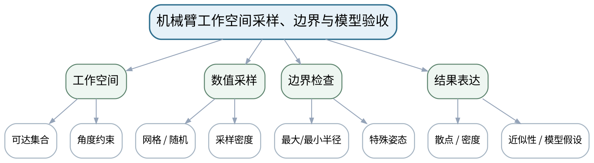

### 教学目标
**知识目标：**
1. 理解工作空间的数值采样表示、可达边界和姿态/采样密度对结果的影响。
2. 理解“数值点云近似工作空间”与理论连续集合之间的区别。

**能力目标：**
1. 能够在给定关节范围内进行二维网格/随机采样并绘制工作空间。
2. 能够用理论半径边界、特殊姿态和采样密度对结果进行合理性验证。

**价值目标：**
1. 形成说明采样近似、模型假设和结论边界的工程表达意识。

### 课程思政
强调计算模型的边界说明与安全约束，不能把数值采样近似表述为绝对真实。

### 专创融合
将工作空间图作为机器人选型/布置的早期分析产品，训练从数值模型到工程决策支持的表达。

### 教学重难点
**教学重点：**工作空间数值采样与边界验证。

**教学难点：**避免把采样点云当作精确连续边界；识别关节限位、连杆长度和采样密度的影响。

### 教学方法与用具
**教学方法：**问题驱动法、建模推演法、代码阅读/演示法、预测—执行—验证法、任务驱动法、测试验收与错误复盘

**教学用具：**机房、Python、NumPy、Matplotlib。

### 教学设计
课前任务 → 互动导入（10 min）→ 传授新知与课堂训练（75 min）→ 过关检测（10 min）→ 课堂小结（3 min）→ 作业布置（1 min）→ 考勤（1 min）

### 课前任务
【教师】发布“机械臂工作空间采样、边界与模型验收”对应大纲/教材范围和一个最小工程问题，不提前给出完整代码答案。

1. 阅读对应大纲与教材内容；
2. 圈出3个关键术语并记录至少1个疑问；
3. 检查Python环境、上一任务源文件/数据与依赖是否可运行；不得使用未经授权的真实敏感工程数据。

【学生】完成准备并带着“预期结果/疑问/已有证据”进入课堂。

### 互动导入
【教师】先展示低密度采样得到“有很多洞”的工作空间，让学生判断洞是机构不可达还是采样不足。

【学生】先独立预测/判断，再与同伴交换依据；教师收集典型分歧后进入本课。

### 传授新知与课堂训练
**一、任务说明与模型/代码骨架（约20 min）—采样设计**

【教师】确定θ1/θ2范围与采样策略；先估计理论最大/最小可达半径。

【学生】按任务约束独立/小组实现，先写模型预期再运行，保留代码、参数、错误信息、测试与图表证据。

**二、学生独立/小组实现（约35 min）—独立实现**

【教师】批量计算工作空间点，绘制散点/密度图，标出基座和理论参考圆。

【学生】按任务约束独立/小组实现，先写模型预期再运行，保留代码、参数、错误信息、测试与图表证据。

**三、测试、调试与证据固化（约20 min）—模型验收**

【教师】比较不同采样密度和角度限位；检查最大半径、折叠半径、边界姿态并总结模型假设。

【学生】按任务约束独立/小组实现，先写模型预期再运行，保留代码、参数、错误信息、测试与图表证据。

**独立学习产物**：workspace.py＋工作空间图＋采样/边界验收报告。

**学习证据**：采样参数、工作空间点数、理论/数值边界对照、密度对比图、假设与局限说明。

**评价映射**：课程作业（第四单元20%模块完成）＋期末综合项目；目标1.1、1.3、1.5、2.1、2.4、3.1、3.3、3.5。

### 过关检测
【教师】组织当堂检测：

1. 采样密度增加会改变真实工作空间吗？
2. 理论最大可达半径如何用于校验？
3. 关节限位应放在模型的哪一部分表达？

【学生】独立作答/运行/推演验证；【教师】按错误类型讲解，要求说明模型、数值或图表依据。

### 课堂小结
【教师】回到本课知识脉络图，用“问题—模型—计算/数据—验证—表达—边界”总结“机械臂工作空间采样、边界与模型验收”，再次强调教学重点：工作空间数值采样与边界验证。

【学生】写下“本课一条最重要的模型/计算规则 + 一个最容易出错的边界”。

### 作业布置
【教师】布置课后任务：整理上机三完整包：公式、代码、轨迹、工作空间、验证和模型边界；写出两条“模型未覆盖的真实因素”。

【学生】按课程文件命名与证据要求整理提交；任何AI/开源工具建议均需保留人工核验记录。

### 考勤
【教师】利用学校/课程实际使用的平台进行签到。

【学生】按课程要求完成签到。

### 课后教学反思
【课后填写，不预填事实】

1. 教学流程：记录100 min各环节实际用时、理论/上机切换及调整点；
2. 教学内容：重点记录“避免把采样点云当作精确连续边界；识别关节限位、连杆长度和采样密度的影响。”的真实掌握证据和常见错误；
3. 学生参与：仅依据实际课堂记录填写推演、独立编码、调试、图表互审和讨论情况，不补写推测；
4. 评价证据：检查本课代码、数据、参数、测试、图表与说明是否完整，记录缺项原因；
5. 后续改进：依据真实课堂证据决定下一次课的补救、复现或拓展。

### 本章节参考文献
[1] 王小银 等.《Python数据分析与科学计算》[M]. 机械工业出版社，2024。
[2] 李志远, 黄化人, 姚明菊, 等.《Python编程与科学计算（微课视频版）》[M]. 清华大学出版社，2023。

## 第14次课 综合工程计算项目、版本控制与AI辅助编程边界

### 课次信息
- **章节/单元**：第五单元 综合建模流程与前沿工具边界
- **周次**：按实际课表填写
- **课时安排**：2课时（100 min）
- **课型**：理论
- **理论/上机分配**：理论2课时

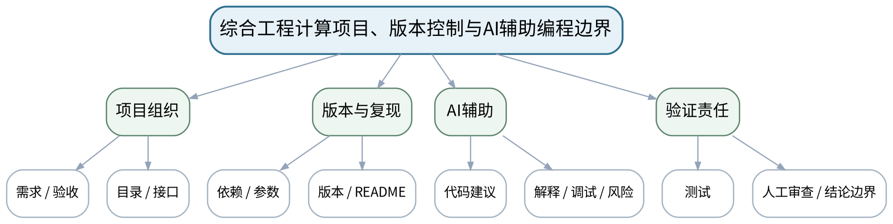

### 教学目标
**知识目标：**
1. 理解需求分解、模型/数据/代码/参数组织、测试、版本记录和可复现交付的项目流程。
2. 理解开源库文档、AI辅助编程的作用、常见错误类型和人工验证责任。

**能力目标：**
1. 能够为双轮小车综合任务设计目录、接口、测试用例、数据记录和验收清单。
2. 能够区分“AI建议可参考”与“工程结论必须由人验证”。

**价值目标：**
1. 形成团队协作、版本可追溯、负责任使用AI和高质量工程交付意识。

### 课程思政
强调能力越强的自动化工具越需要清晰责任边界，最终工程判断和交付责任不能外包给AI。

### 专创融合
将项目目录、README、测试和版本记录作为可交付软件产品的组成部分，训练从“代码作业”向“工程项目”升级。

### 教学重难点
**教学重点：**综合项目组织与可复现性；AI辅助工具边界。

**教学难点：**把工具产出转化为可验证工程成果，而不是把AI/开源库当作正确性来源。

### 教学方法与用具
**教学方法：**问题驱动法、建模推演法、代码阅读/演示法、预测—执行—验证法、任务驱动法、测试验收与错误复盘

**教学用具：**电脑、Python、Git/等价版本工具、课程示例项目。

### 教学设计
课前任务 → 互动导入（10 min）→ 传授新知与课堂训练（75 min）→ 过关检测（10 min）→ 课堂小结（3 min）→ 作业布置（1 min）→ 考勤（1 min）

### 课前任务
【教师】发布“综合工程计算项目、版本控制与AI辅助编程边界”对应大纲/教材范围和一个最小工程问题，不提前给出完整代码答案。

1. 阅读对应大纲与教材内容；
2. 圈出3个关键术语并记录至少1个疑问；
3. 预读一个公式、代码或工程图表片段，写出预期结果与至少一个疑问。

【学生】完成准备并带着“预期结果/疑问/已有证据”进入课堂。

### 互动导入
【教师】给出一段AI生成的双轮小车更新公式，其中左右轮速度符号被写反，但代码可运行，要求学生设计最少测试发现问题。

【学生】先独立预测/判断，再与同伴交换依据；教师收集典型分歧后进入本课。

### 传授新知与课堂训练
**一、核心概念与工程案例（约30 min）—项目结构**

【教师】用双轮小车任务拆解requirements、model、simulation、data、plot、tests、README，明确接口和验收。

【学生】完成公式/代码/图表推演或场景判断，先写预期与依据，再用课堂示例验证并修正。

**二、学生推演/建模/代码阅读（约25 min）—版本与复现**

【教师】说明依赖、随机种子/参数、文件路径和版本记录；示范“别人从空目录能否运行”的验收思路。

【学生】完成公式/代码/图表推演或场景判断，先写预期与依据，再用课堂示例验证并修正。

**三、对比、验证与错误复盘（约20 min）—AI与开源工具边界**

【教师】总结幻觉API、单位错误、符号错误、边界遗漏、过拟合解释等风险，要求AI建议必须经过阅读、测试和人工修改记录。

【学生】完成公式/代码/图表推演或场景判断，先写预期与依据，再用课堂示例验证并修正。

**独立学习产物**：双轮小车综合项目设计书＋测试/验收清单＋AI使用记录模板。

**学习证据**：项目目录图、接口表、依赖/参数清单、测试用例、AI建议采纳/拒绝理由。

**评价映射**：平时表现＋课程作业（第五单元20%模块）＋期末综合项目60%；目标1.6、2.1、2.5、3.2、3.4、3.5。

### 过关检测
【教师】组织当堂检测：

1. 怎样定义“别人可以复现我的程序”？
2. AI生成代码最少需要哪些人工核验？
3. 为什么版本记录是工程证据而不只是管理习惯？

【学生】独立作答/运行/推演验证；【教师】按错误类型讲解，要求说明模型、数值或图表依据。

### 课堂小结
【教师】回到本课知识脉络图，用“问题—模型—计算/数据—验证—表达—边界”总结“综合工程计算项目、版本控制与AI辅助编程边界”，再次强调教学重点：综合项目组织与可复现性；AI辅助工具边界。

【学生】写下“本课一条最重要的模型/计算规则 + 一个最容易出错的边界”。

### 作业布置
【教师】布置课后任务：搭建双轮小车项目目录和README骨架；写出直行、原地转动、零速度等基础验收用例。

【学生】按课程文件命名与证据要求整理提交；任何AI/开源工具建议均需保留人工核验记录。

### 考勤
【教师】利用学校/课程实际使用的平台进行签到。

【学生】按课程要求完成签到。

### 课后教学反思
【课后填写，不预填事实】

1. 教学流程：记录100 min各环节实际用时、理论/上机切换及调整点；
2. 教学内容：重点记录“把工具产出转化为可验证工程成果，而不是把AI/开源库当作正确性来源。”的真实掌握证据和常见错误；
3. 学生参与：仅依据实际课堂记录填写推演、独立编码、调试、图表互审和讨论情况，不补写推测；
4. 评价证据：检查本课代码、数据、参数、测试、图表与说明是否完整，记录缺项原因；
5. 后续改进：依据真实课堂证据决定下一次课的补救、复现或拓展。

### 本章节参考文献
[1] 王小银 等.《Python数据分析与科学计算》[M]. 机械工业出版社，2024。
[2] 李志远, 黄化人, 姚明菊, 等.《Python编程与科学计算（微课视频版）》[M]. 清华大学出版社，2023。
[3] 董付国.《Python程序设计（第4版·微课版·在线学习软件版）》[M]. 清华大学出版社，2024。

## 第15次课 双轮小车离散运动学、状态更新与数据记录

### 课次信息
- **章节/单元**：上机四 双轮小车轨迹仿真与综合工程表达
- **周次**：按实际课表填写
- **课时安排**：2课时（100 min）
- **课型**：上机
- **理论/上机分配**：上机2课时（上机四前半）

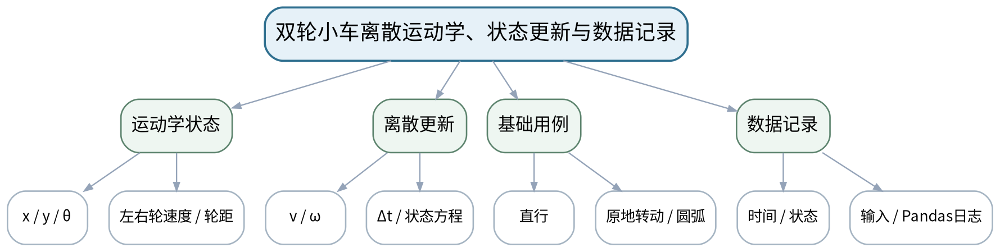

### 教学目标
**知识目标：**
1. 理解双轮小车状态(x,y,θ)、左右轮速度、轮距、离散时间步长与运动学更新。
2. 掌握状态日志、控制量和误差数据的Pandas记录结构。

**能力目标：**
1. 能够实现直行、原地转动、圆弧运动等基本状态更新并通过解析/几何预期验证。
2. 能够记录每步状态、输入和时间并输出可复核数据表。

**价值目标：**
1. 形成状态模型、单位、时间步长和测试用例必须显式记录的仿真质量意识。

### 课程思政
通过基础运动验收强调自动化仿真必须先通过可解释测试，不能直接相信动画效果。

### 专创融合
把状态更新函数和日志设计为可替换模块，为移动机器人轨迹服务/数字孪生原型提供基础。

### 教学重难点
**教学重点：**双轮小车离散运动学与基础测试；状态记录。

**教学难点：**符号约定、角度单位和Δt会直接影响轨迹；必须用可预期基础运动验证。

### 教学方法与用具
**教学方法：**问题驱动法、建模推演法、代码阅读/演示法、预测—执行—验证法、任务驱动法、测试验收与错误复盘

**教学用具：**机房、Python、NumPy、Pandas、Matplotlib、版本管理工具。

### 教学设计
课前任务 → 互动导入（10 min）→ 传授新知与课堂训练（75 min）→ 过关检测（10 min）→ 课堂小结（3 min）→ 作业布置（1 min）→ 考勤（1 min）

### 课前任务
【教师】发布“双轮小车离散运动学、状态更新与数据记录”对应大纲/教材范围和一个最小工程问题，不提前给出完整代码答案。

1. 阅读对应大纲与教材内容；
2. 圈出3个关键术语并记录至少1个疑问；
3. 检查Python环境、上一任务源文件/数据与依赖是否可运行；不得使用未经授权的真实敏感工程数据。

【学生】完成准备并带着“预期结果/疑问/已有证据”进入课堂。

### 互动导入
【教师】给出vL=vR、vL=-vR、vL=0/vR>0三组输入，让学生不运行代码先画预期运动趋势。

【学生】先独立预测/判断，再与同伴交换依据；教师收集典型分歧后进入本课。

### 传授新知与课堂训练
**一、任务说明与模型/代码骨架（约20 min）—模型确认**

【教师】定义坐标系、θ正方向、轮距L、速度单位和Δt；写出v=(vR+vL)/2、ω=(vR-vL)/L及离散更新。

【学生】按任务约束独立/小组实现，先写模型预期再运行，保留代码、参数、错误信息、测试与图表证据。

**二、学生独立/小组实现（约35 min）—独立实现**

【教师】实现step(state,control,dt)和simulate函数，完成直行/原地转动/圆弧用例。

【学生】按任务约束独立/小组实现，先写模型预期再运行，保留代码、参数、错误信息、测试与图表证据。

**三、测试、调试与证据固化（约20 min）—数据记录**

【教师】用Pandas记录time,x,y,theta,vL,vR等列，检查步数、时间和最终状态；保留失败修正。

【学生】按任务约束独立/小组实现，先写模型预期再运行，保留代码、参数、错误信息、测试与图表证据。

**独立学习产物**：differential_drive.py＋test_basic_motion.py＋trajectory_log.csv。

**学习证据**：公式/坐标约定、代码、3类基础用例预期与实际、状态日志、错误修订记录。

**评价映射**：课程作业（第五单元20%模块，上机四前半）＋期末综合项目60%；目标1.4、1.6、2.3、2.5、3.1、3.5。

### 过关检测
【教师】组织当堂检测：

1. vL=vR时角速度应为什么？
2. Δt减半且总时间不变，仿真点数会怎样变化？
3. 如何用原地转动用例发现左右轮符号错误？

【学生】独立作答/运行/推演验证；【教师】按错误类型讲解，要求说明模型、数值或图表依据。

### 课堂小结
【教师】回到本课知识脉络图，用“问题—模型—计算/数据—验证—表达—边界”总结“双轮小车离散运动学、状态更新与数据记录”，再次强调教学重点：双轮小车离散运动学与基础测试；状态记录。

【学生】写下“本课一条最重要的模型/计算规则 + 一个最容易出错的边界”。

### 作业布置
【教师】布置课后任务：补充一个时间步长敏感性对照；为下一课准备目标轨迹或给定速度序列。

【学生】按课程文件命名与证据要求整理提交；任何AI/开源工具建议均需保留人工核验记录。

### 考勤
【教师】利用学校/课程实际使用的平台进行签到。

【学生】按课程要求完成签到。

### 课后教学反思
【课后填写，不预填事实】

1. 教学流程：记录100 min各环节实际用时、理论/上机切换及调整点；
2. 教学内容：重点记录“符号约定、角度单位和Δt会直接影响轨迹；必须用可预期基础运动验证。”的真实掌握证据和常见错误；
3. 学生参与：仅依据实际课堂记录填写推演、独立编码、调试、图表互审和讨论情况，不补写推测；
4. 评价证据：检查本课代码、数据、参数、测试、图表与说明是否完整，记录缺项原因；
5. 后续改进：依据真实课堂证据决定下一次课的补救、复现或拓展。

### 本章节参考文献
[1] 王小银 等.《Python数据分析与科学计算》[M]. 机械工业出版社，2024。
[2] 李志远, 黄化人, 姚明菊, 等.《Python编程与科学计算（微课视频版）》[M]. 清华大学出版社，2023。

## 第16次课 轨迹跟踪、误差可视化与综合项目验收

### 课次信息
- **章节/单元**：上机四 双轮小车轨迹仿真与综合工程表达
- **周次**：按实际课表填写
- **课时安排**：2课时（100 min）
- **课型**：上机
- **理论/上机分配**：上机2课时（上机四后半）

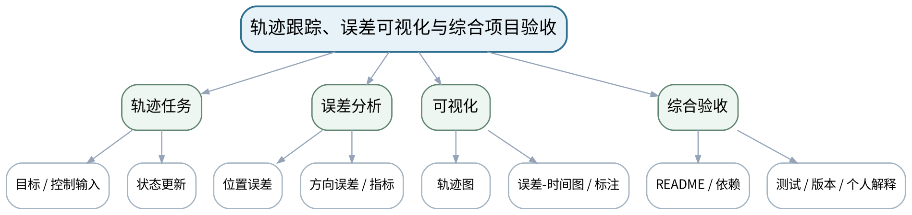

### 教学目标
**知识目标：**
1. 理解目标轨迹/给定速度、状态误差、轨迹与误差可视化和综合项目验收逻辑。
2. 理解期末综合项目对模型、代码、数据、图表、版本和个人解释的整体要求。

**能力目标：**
1. 能够完成简单轨迹跟踪或给定速度仿真，记录误差并制作规范轨迹/误差图。
2. 能够按README从项目源文件复现结果，并现场解释一个模型决策、一个测试和一个AI/工具核验记录。

**价值目标：**
1. 形成可复现、可解释、客观表达、团队贡献可追溯的最终工程交付习惯。

### 课程思政
结合移动平台安全与AI辅助工具使用，强调工程人员对模型、软件和结果承担最终验证责任。

### 专创融合
将最终项目作为机器人/AI/数据类后续课程的可复用计算与可视化基座，形成个人工程作品雏形。

### 教学重难点
**教学重点：**轨迹与误差表达；综合项目复现与验收。

**教学难点：**避免只展示“漂亮轨迹”而不展示误差、失败和参数；个人必须能解释本人负责内容。

### 教学方法与用具
**教学方法：**问题驱动法、建模推演法、代码阅读/演示法、预测—执行—验证法、任务驱动法、测试验收与错误复盘

**教学用具：**机房、Python、NumPy、Pandas、Matplotlib、Git/等价工具。

### 教学设计
课前任务 → 互动导入（10 min）→ 传授新知与课堂训练（75 min）→ 过关检测（10 min）→ 课堂小结（3 min）→ 作业布置（1 min）→ 考勤（1 min）

### 课前任务
【教师】发布“轨迹跟踪、误差可视化与综合项目验收”对应大纲/教材范围和一个最小工程问题，不提前给出完整代码答案。

1. 阅读对应大纲与教材内容；
2. 圈出3个关键术语并记录至少1个疑问；
3. 检查Python环境、上一任务源文件/数据与依赖是否可运行；不得使用未经授权的真实敏感工程数据。

【学生】完成准备并带着“预期结果/疑问/已有证据”进入课堂。

### 互动导入
【教师】教师展示两份结果：A轨迹图很漂亮但无单位/误差/参数；B图较朴素但有目标/实际轨迹、误差曲线、参数和测试。让学生按工程验收判断哪份证据更完整。

【学生】先独立预测/判断，再与同伴交换依据；教师收集典型分歧后进入本课。

### 传授新知与课堂训练
**一、任务说明与模型/代码骨架（约20 min）—轨迹/误差实现**

【教师】完成给定速度或简单跟踪逻辑，记录目标与实际状态，计算位置/方向误差。

【学生】按任务约束独立/小组实现，先写模型预期再运行，保留代码、参数、错误信息、测试与图表证据。

**二、学生独立/小组实现（约35 min）—工程可视化**

【教师】制作目标/实际轨迹、误差—时间图和关键参数标注；核对坐标比例、单位、图例和结论。

【学生】按任务约束独立/小组实现，先写模型预期再运行，保留代码、参数、错误信息、测试与图表证据。

**三、测试、调试与证据固化（约20 min）—最终验收**

【教师】按README从干净环境/新目录运行；检查代码、数据、参数、依赖、测试、图表和版本记录；个人说明模型假设、一个失败案例及AI/开源工具核验。

【学生】按任务约束独立/小组实现，先写模型预期再运行，保留代码、参数、错误信息、测试与图表证据。

**独立学习产物**：上机四完整项目＋期末综合项目可验收版本：代码、数据、图表、README、测试与个人说明。

**学习证据**：运行日志、轨迹/误差图、参数配置、测试结果、版本记录、AI工具核验记录、个人现场解释。

**评价映射**：课程作业（第五单元20%模块完成）＋期末综合项目60%核心验收；目标1.4、1.5、1.6、2.3、2.5、3.2、3.3、3.4、3.5。

### 过关检测
【教师】组织当堂检测：

1. 轨迹图之外为什么还需要误差曲线？
2. 怎样证明项目在另一环境/新目录中可复现？
3. 如果AI建议的控制公式能运行但基础测试失败，应如何处理？

【学生】独立作答/运行/推演验证；【教师】按错误类型讲解，要求说明模型、数值或图表依据。

### 课堂小结
【教师】回到本课知识脉络图，用“问题—模型—计算/数据—验证—表达—边界”总结“轨迹跟踪、误差可视化与综合项目验收”，再次强调教学重点：轨迹与误差表达；综合项目复现与验收。

【学生】写下“本课一条最重要的模型/计算规则 + 一个最容易出错的边界”。

### 作业布置
【教师】布置课后任务：整理课程最终作品与学习反思；在不预填课堂事实的前提下，根据实际项目记录总结模型边界、失败经验和后续可改进点。

【学生】按课程文件命名与证据要求整理提交；任何AI/开源工具建议均需保留人工核验记录。

### 考勤
【教师】利用学校/课程实际使用的平台进行签到。

【学生】按课程要求完成签到。

### 课后教学反思
【课后填写，不预填事实】

1. 教学流程：记录100 min各环节实际用时、理论/上机切换及调整点；
2. 教学内容：重点记录“避免只展示“漂亮轨迹”而不展示误差、失败和参数；个人必须能解释本人负责内容。”的真实掌握证据和常见错误；
3. 学生参与：仅依据实际课堂记录填写推演、独立编码、调试、图表互审和讨论情况，不补写推测；
4. 评价证据：检查本课代码、数据、参数、测试、图表与说明是否完整，记录缺项原因；
5. 后续改进：依据真实课堂证据决定下一次课的补救、复现或拓展。

### 本章节参考文献
[1] 王小银 等.《Python数据分析与科学计算》[M]. 机械工业出版社，2024。
[2] 李志远, 黄化人, 姚明菊, 等.《Python编程与科学计算（微课视频版）》[M]. 清华大学出版社，2023。
[3] 董付国.《Python程序设计（第4版·微课版·在线学习软件版）》[M]. 清华大学出版社，2024。
