# 《数据库基础》教学设计（16次课）

> **Canonical source / 内容权威源**：本 Markdown 与 `images/`、`manifest.json` 共同构成教案语义主源。Word 仅由本源包编译，负责学校格式呈现。

## 课程基本信息
- **课程名称**：数据库基础
- **课程英文名称**：Database Fundamentals
- **课程代码**：25JX21804
- **课程类别**：专业类
- **课程性质**：选修课
- **授课学期**：第5学期
- **学分**：2
- **总学时**：32（理论8，上机24）
- **适用专业**：智能制造工程
- **授课学院**：计算机与信息技术学院
- **先修课程**：工程建模与科学计算可视化基础（Python）、数据结构（C）、程序设计基础（C&C++）Ⅱ
- **后续课程**：人工智能技术与应用、先进装备系统设计与开发（ROS）、智能生产计划管理（MES/ERP）、毕业设计（论文）
- **选用教材**：黑马程序员.《MySQL数据库入门（第3版）》[M]. 北京：清华大学出版社，2025. ISBN 9787302698555
- **课程评价**：总评成绩=平时成绩20%＋课程作业20%＋期末闭卷笔试60%
- **内容依据**：2025课程目录中的现行课程教学大纲（大纲更新时间：2026年9月）

## 课程总体设计
课程以“数据库与关系模型—数据库/表与数据操作—单表查询—多表与子查询—索引/视图/事务—数据库编程、管理与综合应用”为知识主线。理论8学时整合为4次理论课，上机24学时按大纲六个上机项目各4学时拆为12次上机课，共16次课×2课时=32学时。教学采用“概念短讲—SQL演示—任务分解—上机实现—测试验收—错误复盘”，所有数据库任务要求保留E-R图、DDL/DML/DQL脚本、测试数据、运行结果及必要的EXPLAIN/事务/权限/恢复证据。

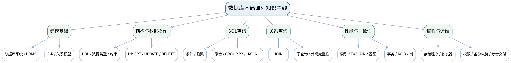

### 课次总览
| 次数 | 类型 | 单元/项目 | 授课题目 | 主要评价 |
|---:|---|---|---|---|
| 1 | 理论 | 第1—2单元 数据库基础、E-R模型与数据库/表操作 | 数据库系统、E-R建模与MySQL表结构基础 | 平时成绩、期末闭卷笔试 |
| 2 | 上机 | 上机一 MySQL环境、E-R建模与数据库表设计 | MySQL环境验证与智能制造E-R建模 | 课程作业：上机一（前半） |
| 3 | 上机 | 上机一 MySQL环境、E-R建模与数据库表设计 | 数据库、数据表、约束与初始化数据 | 课程作业：上机一（15%模块） |
| 4 | 理论 | 第3单元 单表查询、函数、聚合与分组 | SELECT查询、函数、聚合与统计口径 | 平时成绩、期末闭卷笔试 |
| 5 | 上机 | 上机二 数据增删改与单表查询 | DML安全操作与条件查询 | 课程作业：上机二（前半） |
| 6 | 上机 | 上机二 数据增删改与单表查询 | 函数、聚合、GROUP BY/HAVING与结果核验 | 课程作业：上机二（15%模块） |
| 7 | 理论 | 第4—5单元 多表查询、索引/视图/事务与优化 | 多表连接、子查询、索引、视图与事务 | 平时成绩、期末闭卷笔试 |
| 8 | 上机 | 上机三 多表连接、子查询与完整性 | 多表JOIN、关系图与查询结果验收 | 课程作业：上机三（前半） |
| 9 | 上机 | 上机三 多表连接、子查询与完整性 | 子查询、EXISTS与外键完整性测试 | 课程作业：上机三（20%模块） |
| 10 | 上机 | 上机四 索引、视图、事务与性能验证 | 索引、EXPLAIN与统计视图 | 课程作业：上机四（前半） |
| 11 | 上机 | 上机四 索引、视图、事务与性能验证 | 事务、ROLLBACK/SAVEPOINT与一致性验证 | 课程作业：上机四（20%模块） |
| 12 | 理论 | 第6单元 数据库编程、权限维护与综合应用 | 存储程序、触发器、权限、备份恢复与综合交付 | 平时成绩、期末闭卷笔试 |
| 13 | 上机 | 上机五 存储过程、触发器、用户权限与备份恢复 | 存储过程、函数与触发器基础 | 课程作业：上机五（前半） |
| 14 | 上机 | 上机五 存储过程、触发器、用户权限与备份恢复 | 最小权限、备份恢复与故障注入 | 课程作业：上机五（15%模块） |
| 15 | 上机 | 上机六 智能制造数据库综合任务 | 综合数据库设计、初始化、查询与性能组件 | 课程作业：上机六（前半） |
| 16 | 上机 | 上机六 智能制造数据库综合任务 | 事务、权限、备份与数据库完整交付验收 | 课程作业：上机六（15%模块）+课程综合验收 |

## 第1次课 数据库系统、E-R建模与MySQL表结构基础

### 课次信息
- **章节/单元**：第1—2单元 数据库基础、E-R模型与数据库/表操作
- **周次**：按实际课表填写
- **课时安排**：2课时（100 min）
- **课型**：理论

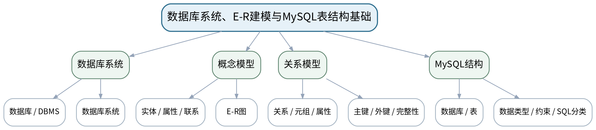

### 教学目标
**知识目标：**
1. 理解数据库、DBMS、数据库系统、关系模型、实体/属性/联系、候选键/主键/外键与完整性约束。
2. 掌握SQL的DDL/DML/DQL分类，理解MySQL数据库、数据类型、表和常见约束的作用。

**能力目标：**
1. 能够从设备、维护工单、报警记录等业务描述中识别实体、联系和键，并画出基础E-R模型。
2. 能够根据业务规则判断字段类型、主键、外键、非空、唯一和默认值等约束是否合理。

**价值目标：**
1. 形成“先建模、后建表；业务语义与约束一致”的数据工程意识。

### 课程思政
结合制造数据资产、数据主权和误删/错误约束案例，强调数据质量、结构变更责任和可追溯性。

### 专创融合
把E-R图和表结构设计视为MES/设备管理小产品的数据底座，训练从业务对象到数据产品结构的转化。

### 教学重难点
**教学重点：**数据库系统与关系模型；E-R到关系表的映射；约束表达业务规则。

**教学难点：**把业务描述转化为实体关系和表结构，并区分“业务规则”与“数据库约束”的职责。

### 教学方法与用具
**教学方法：**任务驱动法、问题引导法、关系图解法、SQL演示法、预测—执行—验证法、测试验收与错误复盘

**教学用具：**电脑、投影仪、MySQL 8.0、MySQL Workbench或学校统一客户端、E-R建模工具。

### 教学设计
课前任务 → 互动导入（10 min）→ 传授新知与课堂训练（75 min）→ 过关检测（10 min）→ 课堂小结（3 min）→ 作业布置（1 min）→ 考勤（1 min）

### 课前任务
【教师】发布“数据库系统、E-R建模与MySQL表结构基础”对应大纲/教材范围和一个最小问题，不提前给出完整SQL答案。

1. 阅读对应大纲与教材内容；
2. 圈出3个数据库术语并记录至少1个疑问；
3. 预读一个关系图或SQL片段，写出预期结果与一个疑问。

【学生】完成准备并带着“预期结果/疑问”进入课堂。

### 互动导入
【教师】展示一张“设备台账Excel”与一张“设备—工单—报警”关系图，提问：为什么把所有字段都放在一个表里会越来越难维护？

【学生】先独立预测/判断，再与同伴交换依据；教师收集典型分歧后进入本课。

### 传授新知与课堂训练
**一、核心概念与结构讲解（约30 min）—概念与关系建模**

【教师】用智能制造设备管理案例讲解数据库系统、数据模型、E-R图、关系模式和键；学生标注设备、工单、报警之间的一对多关系。

【学生】完成对应关系图、SQL推演或场景判断，先写预期结果，再用课堂示例验证并修正。

**二、学生建模/SQL/案例练习（约25 min）—SQL结构基础**

【教师】演示CREATE DATABASE/TABLE的结构，比较INT、DECIMAL、VARCHAR、DATETIME等类型，并用主键、唯一、非空、默认、外键表达业务规则。

【学生】完成对应关系图、SQL推演或场景判断，先写预期结果，再用课堂示例验证并修正。

**三、对比、验证与错误复盘（约20 min）—模型审查练习**

【教师】学生完成“设备—维护工单—报警”三实体E-R草图和字段/约束表；小组互审是否存在重复数据、错误主键或缺失约束。

【学生】完成对应关系图、SQL推演或场景判断，先写预期结果，再用课堂示例验证并修正。

**独立学习产物**：一页E-R图 + 三张表的字段/数据类型/键/约束设计表。

**学习证据**：E-R图、关系模式草案、字段约束说明、同伴审查修改记录。

**评价映射**：平时成绩、期末闭卷笔试；目标1.1、1.2、2.1、2.2、3.1、3.2。

### 过关检测
【教师】组织当堂检测：

1. 数据库、DBMS和数据库系统有何区别？
2. 主键与外键分别约束什么？
3. 为什么“设备型号”通常不宜直接作为设备实例主键？

【学生】独立作答/运行验证；【教师】按错误类型讲解，要求说明SQL或数据关系依据。

### 课堂小结
【教师】回到本课知识脉络图，用“概念—关系—SQL/机制—边界—验证”总结“数据库系统、E-R建模与MySQL表结构基础”，再次强调教学重点：数据库系统与关系模型；E-R到关系表的映射；约束表达业务规则。

【学生】写下“本课一条最重要的数据/SQL规则 + 一个最容易出错的边界”。

### 作业布置
【教师】布置课后任务：完善E-R图并写出CREATE TABLE伪代码；为每个约束补一句业务理由。

【学生】按课程文件命名与证据要求整理提交；SQL和数据操作应只针对课程数据库/测试环境。

### 考勤
【教师】利用学校/课程实际使用的平台进行签到。

【学生】按课程要求完成签到。

### 课后教学反思
【课后填写，不预填事实】

1. 教学流程：记录100 min各环节实际用时及调整点；
2. 教学内容：重点记录“把业务描述转化为实体关系和表结构，并区分“业务规则”与“数据库约束”的职责。”的真实掌握证据和常见错误；
3. 学生参与：仅依据实际课堂记录填写SQL预测、独立实现、调试、互审情况，不补写推测；
4. 评价证据：检查本课脚本/模型/测试证据是否完整，记录缺项原因；
5. 后续改进：依据真实课堂证据决定下一次课的补救或拓展。

### 本章节参考文献
[1] 黑马程序员.《MySQL数据库入门（第3版）》[M]. 清华大学出版社，2025。
[2] 黑马程序员.《MySQL数据库原理、设计与应用（第2版）》[M]. 清华大学出版社，2023。

## 第2次课 MySQL环境验证与智能制造E-R建模

### 课次信息
- **章节/单元**：上机一 MySQL环境、E-R建模与数据库表设计
- **周次**：按实际课表填写
- **课时安排**：2课时（100 min）
- **课型**：上机

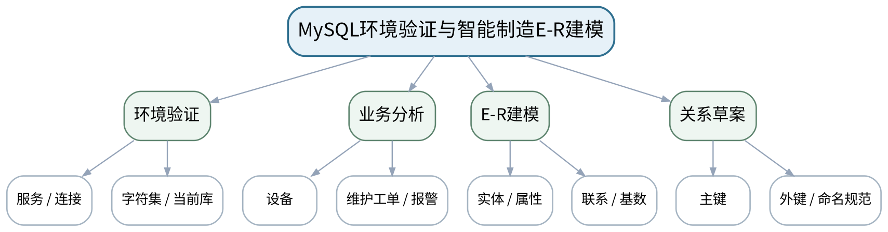

### 教学目标
**知识目标：**
1. 理解MySQL服务、客户端、数据库连接和字符集等基础环境要素。
2. 理解E-R图到关系表设计的基本映射。

**能力目标：**
1. 能够完成MySQL 8.0连接验证、创建课程数据库并执行最小SQL。
2. 能够围绕设备与维护场景绘制可落地的E-R图并定义主外键。

**价值目标：**
1. 形成环境配置可复现、建模先于编码的规范习惯。

### 课程思政
强调账号凭据保护、命名规范和模型审查责任，不使用真实敏感生产数据做课程实验。

### 专创融合
把E-R模型作为数据产品需求的可交流原型，为后续MES/设备管理系统数据服务做准备。

### 教学重难点
**教学重点：**MySQL环境可复现；E-R模型与关系模式一致。

**教学难点：**避免先写CREATE TABLE再倒推业务关系；正确确定联系基数与键。

### 教学方法与用具
**教学方法：**任务驱动法、问题引导法、关系图解法、SQL演示法、预测—执行—验证法、测试验收与错误复盘

**教学用具：**机房、MySQL 8.0、Workbench/命令行、draw.io或等价E-R工具。

### 教学设计
课前任务 → 互动导入（10 min）→ 传授新知与课堂训练（75 min）→ 过关检测（10 min）→ 课堂小结（3 min）→ 作业布置（1 min）→ 考勤（1 min）

### 课前任务
【教师】发布“MySQL环境验证与智能制造E-R建模”对应大纲/教材范围和一个最小问题，不提前给出完整SQL答案。

1. 阅读对应大纲与教材内容；
2. 圈出3个数据库术语并记录至少1个疑问；
3. 检查MySQL服务、客户端、课程数据库与上一任务脚本是否可运行；不得在未知/生产数据库上试验。

【学生】完成准备并带着“预期结果/疑问”进入课堂。

### 互动导入
【教师】教师给出一段无法连接数据库的典型错误和一张缺少主外键的表结构，要求学生分别判断“环境问题”与“建模问题”。

【学生】先独立预测/判断，再与同伴交换依据；教师收集典型分歧后进入本课。

### 传授新知与课堂训练
**一、任务说明与最小示范（约20 min）—任务说明与最小示范**

【教师】演示mysql --version/客户端连接、SELECT VERSION()、SHOW DATABASES，以及课程数据库命名规则；说明提交中不得包含个人密码。

【学生】按任务约束完成SQL/模型/分析，先预测再执行，保留中间结果、错误信息和判断依据。

**二、学生独立/小组实现（约35 min）—学生建模与验证**

【教师】学生连接MySQL，创建个人课程数据库；分析“设备—工单—报警—人员”业务，绘制E-R图并标出主键/外键和联系基数。

【学生】按任务约束完成SQL/模型/分析，先预测再执行，保留中间结果、错误信息和判断依据。

**三、测试、调试与证据固化（约20 min）—测试与互审**

【教师】通过“一个设备可对应多工单”“不存在设备的工单不能孤立存在”等规则互审E-R模型；保留修改前后版本。

【学生】按任务约束完成SQL/模型/分析，先预测再执行，保留中间结果、错误信息和判断依据。

**独立学习产物**：可复现环境检查记录 + 智能制造设备维护E-R图 + 关系模式草案。

**学习证据**：连接验证截图/文本、SQL健康检查、E-R图、主外键表、互审记录。

**评价映射**：课程作业：上机一（前半）；目标1.1、2.1、3.1。

### 过关检测
【教师】组织当堂检测：

1. 怎样证明连接到了预期MySQL实例？
2. 一对多联系的外键通常放在哪一侧？
3. 为什么实验文档不能保存真实数据库密码？

【学生】独立作答/运行验证；【教师】按错误类型讲解，要求说明SQL或数据关系依据。

### 课堂小结
【教师】回到本课知识脉络图，用“概念—关系—SQL/机制—边界—验证”总结“MySQL环境验证与智能制造E-R建模”，再次强调教学重点：MySQL环境可复现；E-R模型与关系模式一致。

【学生】写下“本课一条最重要的数据/SQL规则 + 一个最容易出错的边界”。

### 作业布置
【教师】布置课后任务：根据互审意见修订E-R图，并准备下一次课的字段类型和约束设计。

【学生】按课程文件命名与证据要求整理提交；SQL和数据操作应只针对课程数据库/测试环境。

### 考勤
【教师】利用学校/课程实际使用的平台进行签到。

【学生】按课程要求完成签到。

### 课后教学反思
【课后填写，不预填事实】

1. 教学流程：记录100 min各环节实际用时及调整点；
2. 教学内容：重点记录“避免先写CREATE TABLE再倒推业务关系；正确确定联系基数与键。”的真实掌握证据和常见错误；
3. 学生参与：仅依据实际课堂记录填写SQL预测、独立实现、调试、互审情况，不补写推测；
4. 评价证据：检查本课脚本/模型/测试证据是否完整，记录缺项原因；
5. 后续改进：依据真实课堂证据决定下一次课的补救或拓展。

### 本章节参考文献
[1] 黑马程序员.《MySQL数据库入门（第3版）》[M]. 清华大学出版社，2025。

## 第3次课 数据库、数据表、约束与初始化数据

### 课次信息
- **章节/单元**：上机一 MySQL环境、E-R建模与数据库表设计
- **周次**：按实际课表填写
- **课时安排**：2课时（100 min）
- **课型**：上机

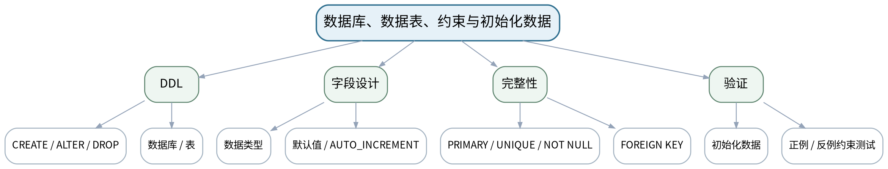

### 教学目标
**知识目标：**
1. 掌握CREATE/ALTER/DROP DATABASE与TABLE、数据类型、主外键及常见完整性约束。

**能力目标：**
1. 能够把E-R模型实现为可重复执行的DDL脚本并插入基础测试数据。
2. 能够主动构造违反NOT NULL、UNIQUE、FOREIGN KEY等规则的失败用例验证约束。

**价值目标：**
1. 形成结构变更审慎、约束必须用失败测试证明有效的质量意识。

### 课程思政
通过误删表、无约束脏数据等反例强化“先确认、可回滚、可重建”的结构变更责任。

### 专创融合
形成“一键初始化”的数据库交付雏形，体现数据底座可部署、可验证的产品化要求。

### 教学重难点
**教学重点：**表结构与约束实现；正反测试验证完整性。

**教学难点：**在不破坏语义的前提下选择数据类型和外键策略；理解约束失败是预期的质量证据。

### 教学方法与用具
**教学方法：**任务驱动法、问题引导法、关系图解法、SQL演示法、预测—执行—验证法、测试验收与错误复盘

**教学用具：**机房、MySQL 8.0、Workbench/命令行、版本管理工具。

### 教学设计
课前任务 → 互动导入（10 min）→ 传授新知与课堂训练（75 min）→ 过关检测（10 min）→ 课堂小结（3 min）→ 作业布置（1 min）→ 考勤（1 min）

### 课前任务
【教师】发布“数据库、数据表、约束与初始化数据”对应大纲/教材范围和一个最小问题，不提前给出完整SQL答案。

1. 阅读对应大纲与教材内容；
2. 圈出3个数据库术语并记录至少1个疑问；
3. 检查MySQL服务、客户端、课程数据库与上一任务脚本是否可运行；不得在未知/生产数据库上试验。

【学生】完成准备并带着“预期结果/疑问”进入课堂。

### 互动导入
【教师】先运行一条“插入不存在设备ID的维护工单”SQL，让学生预测有外键与无外键两种表结构的结果。

【学生】先独立预测/判断，再与同伴交换依据；教师收集典型分歧后进入本课。

### 传授新知与课堂训练
**一、任务说明与最小示范（约20 min）—最小示范**

【教师】演示CREATE TABLE、SHOW CREATE TABLE、DESCRIBE和约束命名；强调DROP/ALTER前先确认目标数据库。

【学生】按任务约束完成SQL/模型/分析，先预测再执行，保留中间结果、错误信息和判断依据。

**二、学生独立/小组实现（约35 min）—独立实现**

【教师】学生完成设备、人员、维护工单、报警表DDL和测试数据INSERT，字段命名与E-R图保持一致。

【学生】按任务约束完成SQL/模型/分析，先预测再执行，保留中间结果、错误信息和判断依据。

**三、测试、调试与证据固化（约20 min）—约束验收**

【教师】设计至少6条约束测试：空值、重复唯一键、非法外键、默认值、删除/更新影响；记录预期与实际结果。

【学生】按任务约束完成SQL/模型/分析，先预测再执行，保留中间结果、错误信息和判断依据。

**独立学习产物**：数据库初始化SQL（schema.sql + seed.sql）+ 约束测试脚本。

**学习证据**：DDL/DML脚本、SHOW CREATE TABLE结果、6条约束测试及错误信息、结构版本说明。

**评价映射**：课程作业：上机一（15%模块）；目标1.1、1.2、2.1、2.2、3.1、3.2。

### 过关检测
【教师】组织当堂检测：

1. NOT NULL与DEFAULT解决的问题是否相同？
2. 外键失败为什么不是“程序出错”，而可能是正确的保护？
3. 怎样让初始化脚本重复执行时更安全？

【学生】独立作答/运行验证；【教师】按错误类型讲解，要求说明SQL或数据关系依据。

### 课堂小结
【教师】回到本课知识脉络图，用“概念—关系—SQL/机制—边界—验证”总结“数据库、数据表、约束与初始化数据”，再次强调教学重点：表结构与约束实现；正反测试验证完整性。

【学生】写下“本课一条最重要的数据/SQL规则 + 一个最容易出错的边界”。

### 作业布置
【教师】布置课后任务：整理上机一提交包：E-R图、schema.sql、seed.sql、constraint_tests.sql和README。

【学生】按课程文件命名与证据要求整理提交；SQL和数据操作应只针对课程数据库/测试环境。

### 考勤
【教师】利用学校/课程实际使用的平台进行签到。

【学生】按课程要求完成签到。

### 课后教学反思
【课后填写，不预填事实】

1. 教学流程：记录100 min各环节实际用时及调整点；
2. 教学内容：重点记录“在不破坏语义的前提下选择数据类型和外键策略；理解约束失败是预期的质量证据。”的真实掌握证据和常见错误；
3. 学生参与：仅依据实际课堂记录填写SQL预测、独立实现、调试、互审情况，不补写推测；
4. 评价证据：检查本课脚本/模型/测试证据是否完整，记录缺项原因；
5. 后续改进：依据真实课堂证据决定下一次课的补救或拓展。

### 本章节参考文献
[1] 黑马程序员.《MySQL数据库入门（第3版）》[M]. 清华大学出版社，2025。
[3] 尹志宇等.《数据库原理及应用教程——MySQL 8.0》[M]. 清华大学出版社，2025。

## 第4次课 SELECT查询、函数、聚合与统计口径

### 课次信息
- **章节/单元**：第3单元 单表查询、函数、聚合与分组
- **周次**：按实际课表填写
- **课时安排**：2课时（100 min）
- **课型**：理论

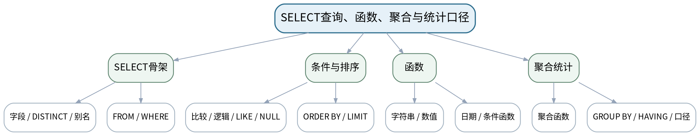

### 教学目标
**知识目标：**
1. 掌握SELECT字段选择、DISTINCT、别名、WHERE、BETWEEN/IN/LIKE/NULL、ORDER BY、LIMIT。
2. 掌握常用字符串/数值/日期函数以及COUNT/SUM/AVG/MAX/MIN、GROUP BY、HAVING。

**能力目标：**
1. 能够把质量统计、产量汇总、设备筛选需求翻译为单表SQL。
2. 能够根据空值、重复、分组口径解释查询结果是否可信。

**价值目标：**
1. 形成数据口径一致、查询结果必须可复核、不以“看起来合理”替代验证的习惯。

### 课程思政
通过质量统计口径差异讨论数据诚信：指标定义必须清晰、结果必须可复核，不能为了“好看”修改口径。

### 专创融合
将SQL统计查询映射到设备看板和质量日报需求，训练从业务指标到可执行查询的转化。

### 教学重难点
**教学重点：**单表查询语句结构；聚合与分组；NULL语义。

**教学难点：**理解WHERE与HAVING、COUNT(*)与COUNT(column)、NULL比较等常见边界，并能解释统计口径。

### 教学方法与用具
**教学方法：**任务驱动法、问题引导法、关系图解法、SQL演示法、预测—执行—验证法、测试验收与错误复盘

**教学用具：**电脑、投影仪、MySQL 8.0、示例设备/报警数据集。

### 教学设计
课前任务 → 互动导入（10 min）→ 传授新知与课堂训练（75 min）→ 过关检测（10 min）→ 课堂小结（3 min）→ 作业布置（1 min）→ 考勤（1 min）

### 课前任务
【教师】发布“SELECT查询、函数、聚合与统计口径”对应大纲/教材范围和一个最小问题，不提前给出完整SQL答案。

1. 阅读对应大纲与教材内容；
2. 圈出3个数据库术语并记录至少1个疑问；
3. 预读一个关系图或SQL片段，写出预期结果与一个疑问。

【学生】完成准备并带着“预期结果/疑问”进入课堂。

### 互动导入
【教师】展示“总报警数”两个结果：COUNT(*)=120、COUNT(resolved_at)=93，提问两个数字为何都可能正确。

【学生】先独立预测/判断，再与同伴交换依据；教师收集典型分歧后进入本课。

### 传授新知与课堂训练
**一、核心概念与结构讲解（约30 min）—SELECT与条件**

【教师】用设备台账筛选演示WHERE、IN、BETWEEN、LIKE、IS NULL、排序和限量；学生预测SQL结果再运行。

【学生】完成对应关系图、SQL推演或场景判断，先写预期结果，再用课堂示例验证并修正。

**二、学生建模/SQL/案例练习（约25 min）—函数与聚合**

【教师】用报警时长、日期、状态转换案例演示函数；比较COUNT(*)、COUNT字段、AVG忽略NULL等行为。

【学生】完成对应关系图、SQL推演或场景判断，先写预期结果，再用课堂示例验证并修正。

**三、对比、验证与错误复盘（约20 min）—统计口径训练**

【教师】学生为“各设备本月报警数、平均持续时间、未关闭报警”写3条SQL草案，并明确分组字段和NULL处理。

【学生】完成对应关系图、SQL推演或场景判断，先写预期结果，再用课堂示例验证并修正。

**独立学习产物**：“制造数据查询卡”：业务问题、SQL、预期行数/字段、NULL与统计口径说明。

**学习证据**：查询卡、SQL草案、预测结果与运行结果差异说明。

**评价映射**：平时成绩、期末闭卷笔试；目标1.3、2.3、3.3。

### 过关检测
【教师】组织当堂检测：

1. WHERE与HAVING分别在什么阶段筛选？
2. COUNT(*)和COUNT(column)何时不同？
3. 为什么NULL不能用= NULL判断？

【学生】独立作答/运行验证；【教师】按错误类型讲解，要求说明SQL或数据关系依据。

### 课堂小结
【教师】回到本课知识脉络图，用“概念—关系—SQL/机制—边界—验证”总结“SELECT查询、函数、聚合与统计口径”，再次强调教学重点：单表查询语句结构；聚合与分组；NULL语义。

【学生】写下“本课一条最重要的数据/SQL规则 + 一个最容易出错的边界”。

### 作业布置
【教师】布置课后任务：为设备表/报警表设计10条单表查询题，其中至少3条包含NULL、聚合或HAVING。

【学生】按课程文件命名与证据要求整理提交；SQL和数据操作应只针对课程数据库/测试环境。

### 考勤
【教师】利用学校/课程实际使用的平台进行签到。

【学生】按课程要求完成签到。

### 课后教学反思
【课后填写，不预填事实】

1. 教学流程：记录100 min各环节实际用时及调整点；
2. 教学内容：重点记录“理解WHERE与HAVING、COUNT(*)与COUNT(column)、NULL比较等常见边界，并能解释统计口径。”的真实掌握证据和常见错误；
3. 学生参与：仅依据实际课堂记录填写SQL预测、独立实现、调试、互审情况，不补写推测；
4. 评价证据：检查本课脚本/模型/测试证据是否完整，记录缺项原因；
5. 后续改进：依据真实课堂证据决定下一次课的补救或拓展。

### 本章节参考文献
[1] 黑马程序员.《MySQL数据库入门（第3版）》[M]. 清华大学出版社，2025。

## 第5次课 DML安全操作与条件查询

### 课次信息
- **章节/单元**：上机二 数据增删改与单表查询
- **周次**：按实际课表填写
- **课时安排**：2课时（100 min）
- **课型**：上机

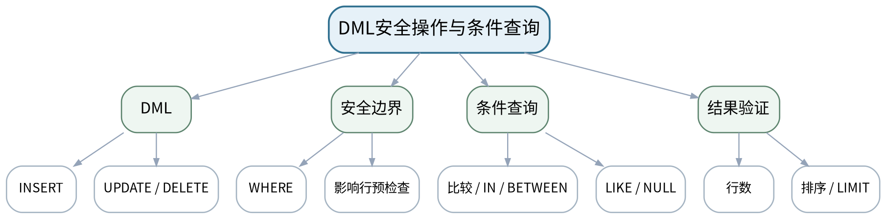

### 教学目标
**知识目标：**
1. 掌握INSERT、UPDATE、DELETE及条件查询的基本执行语义。

**能力目标：**
1. 能够完成设备、工单、报警数据维护，并在UPDATE/DELETE前用SELECT验证影响范围。
2. 能够编写比较、逻辑、IN、BETWEEN、LIKE、IS NULL、排序与LIMIT查询。

**价值目标：**
1. 形成高风险SQL“先预览影响行、再执行、保留记录”的安全习惯。

### 课程思政
通过无WHERE更新案例强化数据修改责任；实验只在课程数据库中操作，不对未知数据库执行高风险SQL。

### 专创融合
将安全DML清单视为数据库运维SOP，训练可复用的工程规范。

### 教学重难点
**教学重点：**DML与WHERE安全边界；条件查询正确性。

**教学难点：**避免无WHERE更新/删除；构造空结果和边界值测试。

### 教学方法与用具
**教学方法：**任务驱动法、问题引导法、关系图解法、SQL演示法、预测—执行—验证法、测试验收与错误复盘

**教学用具：**机房、MySQL 8.0、Workbench/命令行、课程测试数据库。

### 教学设计
课前任务 → 互动导入（10 min）→ 传授新知与课堂训练（75 min）→ 过关检测（10 min）→ 课堂小结（3 min）→ 作业布置（1 min）→ 考勤（1 min）

### 课前任务
【教师】发布“DML安全操作与条件查询”对应大纲/教材范围和一个最小问题，不提前给出完整SQL答案。

1. 阅读对应大纲与教材内容；
2. 圈出3个数据库术语并记录至少1个疑问；
3. 检查MySQL服务、客户端、课程数据库与上一任务脚本是否可运行；不得在未知/生产数据库上试验。

【学生】完成准备并带着“预期结果/疑问”进入课堂。

### 互动导入
【教师】教师展示`UPDATE equipment SET status="停机";`，要求学生在不执行的情况下写出安全审查步骤。

【学生】先独立预测/判断，再与同伴交换依据；教师收集典型分歧后进入本课。

### 传授新知与课堂训练
**一、任务说明与最小示范（约20 min）—任务说明**

【教师】说明备份测试数据、事务/安全更新模式和“先SELECT后UPDATE/DELETE”的操作清单。

【学生】按任务约束完成SQL/模型/分析，先预测再执行，保留中间结果、错误信息和判断依据。

**二、学生独立/小组实现（约35 min）—独立实现**

【教师】完成批量插入、指定设备状态更新、条件删除测试；完成10条条件查询并预测结果范围。

【学生】按任务约束完成SQL/模型/分析，先预测再执行，保留中间结果、错误信息和判断依据。

**三、测试、调试与证据固化（约20 min）—测试复盘**

【教师】构造空结果、LIKE特殊模式、NULL、边界日期和错误条件；记录受影响行数与修正过程。

【学生】按任务约束完成SQL/模型/分析，先预测再执行，保留中间结果、错误信息和判断依据。

**独立学习产物**：dml.sql + query_basic.sql + 安全操作检查表。

**学习证据**：SQL脚本、执行前SELECT、受影响行数、正常/空/边界结果、错误复盘。

**评价映射**：课程作业：上机二（前半）；目标1.2、1.3、2.2、2.3、3.2、3.3。

### 过关检测
【教师】组织当堂检测：

1. UPDATE/DELETE之前为什么要先写等价SELECT？
2. LIKE "%故障%"与等值查询的结果边界有什么不同？
3. 空结果是否必然表示SQL错误？

【学生】独立作答/运行验证；【教师】按错误类型讲解，要求说明SQL或数据关系依据。

### 课堂小结
【教师】回到本课知识脉络图，用“概念—关系—SQL/机制—边界—验证”总结“DML安全操作与条件查询”，再次强调教学重点：DML与WHERE安全边界；条件查询正确性。

【学生】写下“本课一条最重要的数据/SQL规则 + 一个最容易出错的边界”。

### 作业布置
【教师】布置课后任务：补充5条高风险DML反例并写出安全改写方式。

【学生】按课程文件命名与证据要求整理提交；SQL和数据操作应只针对课程数据库/测试环境。

### 考勤
【教师】利用学校/课程实际使用的平台进行签到。

【学生】按课程要求完成签到。

### 课后教学反思
【课后填写，不预填事实】

1. 教学流程：记录100 min各环节实际用时及调整点；
2. 教学内容：重点记录“避免无WHERE更新/删除；构造空结果和边界值测试。”的真实掌握证据和常见错误；
3. 学生参与：仅依据实际课堂记录填写SQL预测、独立实现、调试、互审情况，不补写推测；
4. 评价证据：检查本课脚本/模型/测试证据是否完整，记录缺项原因；
5. 后续改进：依据真实课堂证据决定下一次课的补救或拓展。

### 本章节参考文献
[1] 黑马程序员.《MySQL数据库入门（第3版）》[M]. 清华大学出版社，2025。

## 第6次课 函数、聚合、GROUP BY/HAVING与结果核验

### 课次信息
- **章节/单元**：上机二 数据增删改与单表查询
- **周次**：按实际课表填写
- **课时安排**：2课时（100 min）
- **课型**：上机

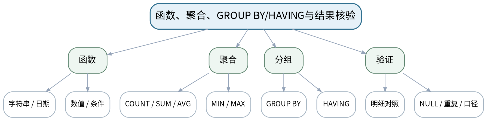

### 教学目标
**知识目标：**
1. 掌握常用函数、聚合函数、GROUP BY和HAVING的组合。

**能力目标：**
1. 能够完成按设备/状态/日期维度的统计查询，并核对统计口径。
2. 能够用独立明细查询或手工小样本验证聚合结果。

**价值目标：**
1. 形成统计结果必须有复核路径和口径说明的数据质量意识。

### 课程思政
强调统计诚信与可复核性，禁止只保留“符合预期”的结果而删除异常数据。

### 专创融合
把统计SQL整理成看板指标查询库，为后续视图和应用接口复用。

### 教学重难点
**教学重点：**聚合分组查询；统计结果交叉验证。

**教学难点：**多字段GROUP BY、HAVING与WHERE组合，以及NULL/重复数据对指标的影响。

### 教学方法与用具
**教学方法：**任务驱动法、问题引导法、关系图解法、SQL演示法、预测—执行—验证法、测试验收与错误复盘

**教学用具：**机房、MySQL 8.0、课程测试数据库、CSV/表格工具（用于复核）。

### 教学设计
课前任务 → 互动导入（10 min）→ 传授新知与课堂训练（75 min）→ 过关检测（10 min）→ 课堂小结（3 min）→ 作业布置（1 min）→ 考勤（1 min）

### 课前任务
【教师】发布“函数、聚合、GROUP BY/HAVING与结果核验”对应大纲/教材范围和一个最小问题，不提前给出完整SQL答案。

1. 阅读对应大纲与教材内容；
2. 圈出3个数据库术语并记录至少1个疑问；
3. 检查MySQL服务、客户端、课程数据库与上一任务脚本是否可运行；不得在未知/生产数据库上试验。

【学生】完成准备并带着“预期结果/疑问”进入课堂。

### 互动导入
【教师】提供一条“设备平均维修时长”SQL，结果明显偏低；学生通过原始明细找出NULL/单位问题。

【学生】先独立预测/判断，再与同伴交换依据；教师收集典型分歧后进入本课。

### 传授新知与课堂训练
**一、任务说明与最小示范（约20 min）—最小示范**

【教师】演示日期截取、CASE/IF、COUNT/AVG、GROUP BY/HAVING，并展示格式正确但业务口径错误的查询。

【学生】按任务约束完成SQL/模型/分析，先预测再执行，保留中间结果、错误信息和判断依据。

**二、学生独立/小组实现（约35 min）—统计任务**

【教师】学生实现各设备报警数、各状态占比、每月维护次数、平均维修时长、Top-N设备等查询。

【学生】按任务约束完成SQL/模型/分析，先预测再执行，保留中间结果、错误信息和判断依据。

**三、测试、调试与证据固化（约20 min）—交叉验收**

【教师】至少选择3条聚合SQL，用明细查询/手工小数据复算；记录口径、NULL处理和差异。

【学生】按任务约束完成SQL/模型/分析，先预测再执行，保留中间结果、错误信息和判断依据。

**独立学习产物**：query_stats.sql + 统计结果表 + 3条独立复核记录。

**学习证据**：SQL、结果截图/导出、复核SQL、小样本计算、统计口径说明。

**评价映射**：课程作业：上机二（15%模块）；目标1.2、1.3、2.2、2.3、3.2、3.3。

### 过关检测
【教师】组织当堂检测：

1. HAVING能否完全替代WHERE？
2. AVG字段遇到NULL如何处理？
3. 如何证明一个GROUP BY统计结果不是“碰巧正确”？

【学生】独立作答/运行验证；【教师】按错误类型讲解，要求说明SQL或数据关系依据。

### 课堂小结
【教师】回到本课知识脉络图，用“概念—关系—SQL/机制—边界—验证”总结“函数、聚合、GROUP BY/HAVING与结果核验”，再次强调教学重点：聚合分组查询；统计结果交叉验证。

【学生】写下“本课一条最重要的数据/SQL规则 + 一个最容易出错的边界”。

### 作业布置
【教师】布置课后任务：整理上机二报告：DML安全、单表条件查询、聚合统计与结果复核。

【学生】按课程文件命名与证据要求整理提交；SQL和数据操作应只针对课程数据库/测试环境。

### 考勤
【教师】利用学校/课程实际使用的平台进行签到。

【学生】按课程要求完成签到。

### 课后教学反思
【课后填写，不预填事实】

1. 教学流程：记录100 min各环节实际用时及调整点；
2. 教学内容：重点记录“多字段GROUP BY、HAVING与WHERE组合，以及NULL/重复数据对指标的影响。”的真实掌握证据和常见错误；
3. 学生参与：仅依据实际课堂记录填写SQL预测、独立实现、调试、互审情况，不补写推测；
4. 评价证据：检查本课脚本/模型/测试证据是否完整，记录缺项原因；
5. 后续改进：依据真实课堂证据决定下一次课的补救或拓展。

### 本章节参考文献
[1] 黑马程序员.《MySQL数据库入门（第3版）》[M]. 清华大学出版社，2025。
[3] 尹志宇等.《数据库原理及应用教程——MySQL 8.0》[M]. 清华大学出版社，2025。

## 第7次课 多表连接、子查询、索引、视图与事务

### 课次信息
- **章节/单元**：第4—5单元 多表查询、索引/视图/事务与优化
- **周次**：按实际课表填写
- **课时安排**：2课时（100 min）
- **课型**：理论

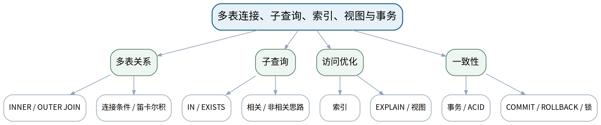

### 教学目标
**知识目标：**
1. 掌握INNER JOIN、LEFT/RIGHT JOIN、连接条件、子查询、IN/EXISTS和外键关联。
2. 理解索引、EXPLAIN、视图、事务、ACID、COMMIT/ROLLBACK/SAVEPOINT及锁的基本作用。

**能力目标：**
1. 能够根据设备—工单—报警关系选择连接方式并识别笛卡尔积风险。
2. 能够为查询/一致性场景判断何时使用索引、视图或事务。

**价值目标：**
1. 形成关系语义完整、性能以执行证据判断、事务保护业务一致性的工程意识。

### 课程思政
通过关联删除、事务中断和索引滥用案例强调数据一致性、变更影响评估和“以证据优化”。

### 专创融合
将多表查询、统计视图和事务视为MES数据服务的核心能力，连接到后续智能生产计划/维护业务。

### 教学重难点
**教学重点：**连接语义与子查询；索引/执行计划；事务一致性。

**教学难点：**区分连接行数异常的根因；理解“有索引不一定更快”和事务边界的业务含义。

### 教学方法与用具
**教学方法：**任务驱动法、问题引导法、关系图解法、SQL演示法、预测—执行—验证法、测试验收与错误复盘

**教学用具：**电脑、投影仪、MySQL 8.0、关系图、EXPLAIN示例。

### 教学设计
课前任务 → 互动导入（10 min）→ 传授新知与课堂训练（75 min）→ 过关检测（10 min）→ 课堂小结（3 min）→ 作业布置（1 min）→ 考勤（1 min）

### 课前任务
【教师】发布“多表连接、子查询、索引、视图与事务”对应大纲/教材范围和一个最小问题，不提前给出完整SQL答案。

1. 阅读对应大纲与教材内容；
2. 圈出3个数据库术语并记录至少1个疑问；
3. 预读一个关系图或SQL片段，写出预期结果与一个疑问。

【学生】完成准备并带着“预期结果/疑问”进入课堂。

### 互动导入
【教师】展示两条SQL：一条漏写JOIN条件返回上万行，一条正确返回12行；让学生先从关系图而不是语法猜错因。

【学生】先独立预测/判断，再与同伴交换依据；教师收集典型分歧后进入本课。

### 传授新知与课堂训练
**一、核心概念与结构讲解（约30 min）—连接与子查询**

【教师】用设备—工单—报警关系图讲INNER/LEFT JOIN、连接条件、子查询和EXISTS；强调关联键与业务语义。

【学生】完成对应关系图、SQL推演或场景判断，先写预期结果，再用课堂示例验证并修正。

**二、学生建模/SQL/案例练习（约25 min）—索引与视图**

【教师】解释B-tree索引的使用目的、选择性与成本；用EXPLAIN比较访问方式；视图用于封装稳定查询接口。

【学生】完成对应关系图、SQL推演或场景判断，先写预期结果，再用课堂示例验证并修正。

**三、对比、验证与错误复盘（约20 min）—事务与一致性**

【教师】用“维修工单关闭+设备状态更新”两步操作解释ACID、提交/回滚/保存点和锁的基本意义。

【学生】完成对应关系图、SQL推演或场景判断，先写预期结果，再用课堂示例验证并修正。

**独立学习产物**：一张“关系查询—性能—一致性”决策表 + 两条多表SQL草案 + 一条事务伪代码。

**学习证据**：关系图标注、SQL预测行数、索引/视图/事务选择理由、错误连接修正记录。

**评价映射**：平时成绩、期末闭卷笔试；目标1.4、1.5、2.4、2.5、3.4、3.5。

### 过关检测
【教师】组织当堂检测：

1. LEFT JOIN与INNER JOIN保留行的差别是什么？
2. 漏写连接条件为什么会产生笛卡尔积？
3. 索引、视图和事务分别主要解决什么问题？

【学生】独立作答/运行验证；【教师】按错误类型讲解，要求说明SQL或数据关系依据。

### 课堂小结
【教师】回到本课知识脉络图，用“概念—关系—SQL/机制—边界—验证”总结“多表连接、子查询、索引、视图与事务”，再次强调教学重点：连接语义与子查询；索引/执行计划；事务一致性。

【学生】写下“本课一条最重要的数据/SQL规则 + 一个最容易出错的边界”。

### 作业布置
【教师】布置课后任务：为上机三/四准备5条多表业务问题和2个需要事务保护的业务操作。

【学生】按课程文件命名与证据要求整理提交；SQL和数据操作应只针对课程数据库/测试环境。

### 考勤
【教师】利用学校/课程实际使用的平台进行签到。

【学生】按课程要求完成签到。

### 课后教学反思
【课后填写，不预填事实】

1. 教学流程：记录100 min各环节实际用时及调整点；
2. 教学内容：重点记录“区分连接行数异常的根因；理解“有索引不一定更快”和事务边界的业务含义。”的真实掌握证据和常见错误；
3. 学生参与：仅依据实际课堂记录填写SQL预测、独立实现、调试、互审情况，不补写推测；
4. 评价证据：检查本课脚本/模型/测试证据是否完整，记录缺项原因；
5. 后续改进：依据真实课堂证据决定下一次课的补救或拓展。

### 本章节参考文献
[1] 黑马程序员.《MySQL数据库入门（第3版）》[M]. 清华大学出版社，2025。
[2] 黑马程序员.《MySQL数据库原理、设计与应用（第2版）》[M]. 清华大学出版社，2023。

## 第8次课 多表JOIN、关系图与查询结果验收

### 课次信息
- **章节/单元**：上机三 多表连接、子查询与完整性
- **周次**：按实际课表填写
- **课时安排**：2课时（100 min）
- **课型**：上机

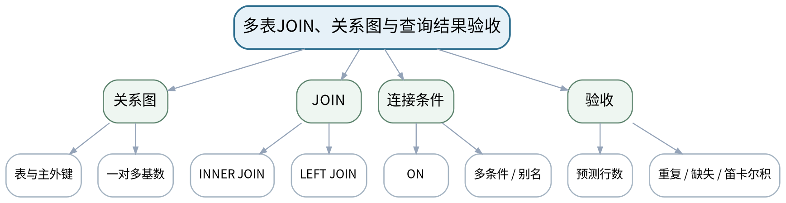

### 教学目标
**知识目标：**
1. 掌握多表INNER/LEFT JOIN、多条件连接和表别名。

**能力目标：**
1. 能够基于设备—工单—报警—人员关系实现典型多表查询。
2. 能够预测连接基数并通过主键/外键和分组核验结果行数。

**价值目标：**
1. 形成“先看关系语义、再写JOIN；结果行数必须解释”的习惯。

### 课程思政
强调跨表数据的业务含义与关联责任，查询结果不允许靠“看起来正常”判断。

### 专创融合
把JOIN查询封装成面向维修人员/管理者的业务数据接口雏形。

### 教学重难点
**教学重点：**JOIN关系语义和结果行数验证。

**教学难点：**识别一对多连接导致的重复扩展，避免用DISTINCT掩盖错误JOIN。

### 教学方法与用具
**教学方法：**任务驱动法、问题引导法、关系图解法、SQL演示法、预测—执行—验证法、测试验收与错误复盘

**教学用具：**机房、MySQL 8.0、设备维护测试数据库、E-R图。

### 教学设计
课前任务 → 互动导入（10 min）→ 传授新知与课堂训练（75 min）→ 过关检测（10 min）→ 课堂小结（3 min）→ 作业布置（1 min）→ 考勤（1 min）

### 课前任务
【教师】发布“多表JOIN、关系图与查询结果验收”对应大纲/教材范围和一个最小问题，不提前给出完整SQL答案。

1. 阅读对应大纲与教材内容；
2. 圈出3个数据库术语并记录至少1个疑问；
3. 检查MySQL服务、客户端、课程数据库与上一任务脚本是否可运行；不得在未知/生产数据库上试验。

【学生】完成准备并带着“预期结果/疑问”进入课堂。

### 互动导入
【教师】给出一条因为一对多关系导致设备重复出现的正确JOIN，询问“重复一定是错吗？”

【学生】先独立预测/判断，再与同伴交换依据；教师收集典型分歧后进入本课。

### 传授新知与课堂训练
**一、任务说明与最小示范（约20 min）—关系确认**

【教师】依据E-R图标出每个JOIN的主外键和基数，先写预期“每行代表什么”。

【学生】按任务约束完成SQL/模型/分析，先预测再执行，保留中间结果、错误信息和判断依据。

**二、学生独立/小组实现（约35 min）—独立查询**

【教师】完成设备+最新工单、设备+报警、工单+人员等多表查询，分别使用INNER和LEFT JOIN。

【学生】按任务约束完成SQL/模型/分析，先预测再执行，保留中间结果、错误信息和判断依据。

**三、测试、调试与证据固化（约20 min）—错误注入**

【教师】删除一个ON条件、错连一个键、盲目DISTINCT；比较行数和业务含义，记录根因。

【学生】按任务约束完成SQL/模型/分析，先预测再执行，保留中间结果、错误信息和判断依据。

**独立学习产物**：join_queries.sql + 关系基数说明 + 3类错JOIN复盘。

**学习证据**：SQL、预测/实际行数、错误连接结果、修正说明、关系图。

**评价映射**：课程作业：上机三（前半）；目标1.4、2.4、3.4。

### 过关检测
【教师】组织当堂检测：

1. 多表结果中重复行何时是业务真实、何时是错误？
2. 为什么不应第一时间用DISTINCT消除重复？
3. LEFT JOIN后WHERE右表字段可能把结果变成什么效果？

【学生】独立作答/运行验证；【教师】按错误类型讲解，要求说明SQL或数据关系依据。

### 课堂小结
【教师】回到本课知识脉络图，用“概念—关系—SQL/机制—边界—验证”总结“多表JOIN、关系图与查询结果验收”，再次强调教学重点：JOIN关系语义和结果行数验证。

【学生】写下“本课一条最重要的数据/SQL规则 + 一个最容易出错的边界”。

### 作业布置
【教师】布置课后任务：扩展两条“未有工单的设备”“未关闭报警的设备”查询并说明为什么选择LEFT JOIN。

【学生】按课程文件命名与证据要求整理提交；SQL和数据操作应只针对课程数据库/测试环境。

### 考勤
【教师】利用学校/课程实际使用的平台进行签到。

【学生】按课程要求完成签到。

### 课后教学反思
【课后填写，不预填事实】

1. 教学流程：记录100 min各环节实际用时及调整点；
2. 教学内容：重点记录“识别一对多连接导致的重复扩展，避免用DISTINCT掩盖错误JOIN。”的真实掌握证据和常见错误；
3. 学生参与：仅依据实际课堂记录填写SQL预测、独立实现、调试、互审情况，不补写推测；
4. 评价证据：检查本课脚本/模型/测试证据是否完整，记录缺项原因；
5. 后续改进：依据真实课堂证据决定下一次课的补救或拓展。

### 本章节参考文献
[1] 黑马程序员.《MySQL数据库入门（第3版）》[M]. 清华大学出版社，2025。

## 第9次课 子查询、EXISTS与外键完整性测试

### 课次信息
- **章节/单元**：上机三 多表连接、子查询与完整性
- **周次**：按实际课表填写
- **课时安排**：2课时（100 min）
- **课型**：上机

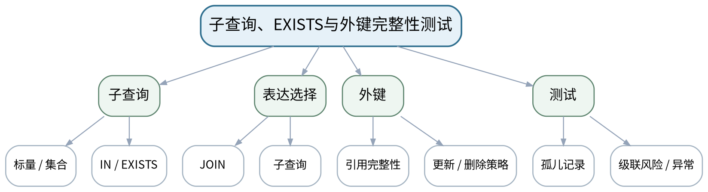

### 教学目标
**知识目标：**
1. 掌握标量/集合子查询、IN、EXISTS以及外键约束的关联影响。

**能力目标：**
1. 能够选择JOIN或子查询表达业务需求并验证等价/差异结果。
2. 能够设计非法外键、级联/限制删除等完整性测试。

**价值目标：**
1. 形成关联修改前评估影响范围和保留完整性证据的习惯。

### 课程思政
用关联删除和孤儿记录风险强化数据完整性与变更影响责任。

### 专创融合
将复杂查询和完整性规则作为后续数据服务API的质量边界。

### 教学重难点
**教学重点：**子查询与EXISTS；外键约束测试。

**教学难点：**理解JOIN与EXISTS的语义差别；安全验证关联删除/更新而非直接在重要数据上试错。

### 教学方法与用具
**教学方法：**任务驱动法、问题引导法、关系图解法、SQL演示法、预测—执行—验证法、测试验收与错误复盘

**教学用具：**机房、MySQL 8.0、设备维护测试数据库。

### 教学设计
课前任务 → 互动导入（10 min）→ 传授新知与课堂训练（75 min）→ 过关检测（10 min）→ 课堂小结（3 min）→ 作业布置（1 min）→ 考勤（1 min）

### 课前任务
【教师】发布“子查询、EXISTS与外键完整性测试”对应大纲/教材范围和一个最小问题，不提前给出完整SQL答案。

1. 阅读对应大纲与教材内容；
2. 圈出3个数据库术语并记录至少1个疑问；
3. 检查MySQL服务、客户端、课程数据库与上一任务脚本是否可运行；不得在未知/生产数据库上试验。

【学生】完成准备并带着“预期结果/疑问”进入课堂。

### 互动导入
【教师】展示“查找有报警的设备”JOIN+DISTINCT和EXISTS两种写法，要求学生解释结果与语义表达差别。

【学生】先独立预测/判断，再与同伴交换依据；教师收集典型分歧后进入本课。

### 传授新知与课堂训练
**一、任务说明与最小示范（约20 min）—子查询实现**

【教师】完成平均值比较、IN集合、EXISTS存在性等业务查询；选择2个案例用JOIN和子查询分别实现。

【学生】按任务约束完成SQL/模型/分析，先预测再执行，保留中间结果、错误信息和判断依据。

**二、学生独立/小组实现（约35 min）—完整性实验**

【教师】构造非法外键插入、删除被引用设备、更新主键等测试；在课程测试库中观察约束行为。

【学生】按任务约束完成SQL/模型/分析，先预测再执行，保留中间结果、错误信息和判断依据。

**三、测试、调试与证据固化（约20 min）—影响评审**

【教师】针对CASCADE/RESTRICT/SET NULL等策略（以实际MySQL支持和课程表设计为准）写业务影响说明。

【学生】按任务约束完成SQL/模型/分析，先预测再执行，保留中间结果、错误信息和判断依据。

**独立学习产物**：subquery_integrity.sql + JOIN/子查询对照表 + 外键测试报告。

**学习证据**：SQL、两种表达对照结果、外键异常信息、删除/更新影响说明。

**评价映射**：课程作业：上机三（20%模块）；目标1.4、2.4、3.4。

### 过关检测
【教师】组织当堂检测：

1. EXISTS关注的核心是什么？
2. 外键限制删除保护了什么？
3. 什么情况下级联删除会放大误操作风险？

【学生】独立作答/运行验证；【教师】按错误类型讲解，要求说明SQL或数据关系依据。

### 课堂小结
【教师】回到本课知识脉络图，用“概念—关系—SQL/机制—边界—验证”总结“子查询、EXISTS与外键完整性测试”，再次强调教学重点：子查询与EXISTS；外键约束测试。

【学生】写下“本课一条最重要的数据/SQL规则 + 一个最容易出错的边界”。

### 作业布置
【教师】布置课后任务：完成上机三报告，保留至少1个“错误SQL能运行但业务语义错误”的案例。

【学生】按课程文件命名与证据要求整理提交；SQL和数据操作应只针对课程数据库/测试环境。

### 考勤
【教师】利用学校/课程实际使用的平台进行签到。

【学生】按课程要求完成签到。

### 课后教学反思
【课后填写，不预填事实】

1. 教学流程：记录100 min各环节实际用时及调整点；
2. 教学内容：重点记录“理解JOIN与EXISTS的语义差别；安全验证关联删除/更新而非直接在重要数据上试错。”的真实掌握证据和常见错误；
3. 学生参与：仅依据实际课堂记录填写SQL预测、独立实现、调试、互审情况，不补写推测；
4. 评价证据：检查本课脚本/模型/测试证据是否完整，记录缺项原因；
5. 后续改进：依据真实课堂证据决定下一次课的补救或拓展。

### 本章节参考文献
[1] 黑马程序员.《MySQL数据库入门（第3版）》[M]. 清华大学出版社，2025。
[2] 黑马程序员.《MySQL数据库原理、设计与应用（第2版）》[M]. 清华大学出版社，2023。

## 第10次课 索引、EXPLAIN与统计视图

### 课次信息
- **章节/单元**：上机四 索引、视图、事务与性能验证
- **周次**：按实际课表填写
- **课时安排**：2课时（100 min）
- **课型**：上机

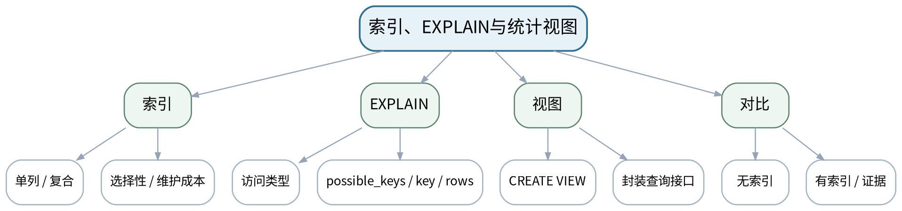

### 教学目标
**知识目标：**
1. 理解索引选择性、复合索引基本思路、EXPLAIN关键访问线索和视图的逻辑封装。

**能力目标：**
1. 能够为高频查询创建/删除索引并用EXPLAIN比较前后执行计划。
2. 能够创建面向设备状态/维护统计的视图并验证查询结果。

**价值目标：**
1. 形成性能优化必须有执行计划或测量证据、避免“凭感觉加索引”的意识。

### 课程思政
以执行计划证据替代“经验拍脑袋”，培养基于数据与测量做性能决策的工程习惯。

### 专创融合
把统计视图作为稳定数据接口，为报表、Python读取和上层应用解耦基础表细节。

### 教学重难点
**教学重点：**索引设计与EXPLAIN证据；视图封装。

**教学难点：**小数据集下性能时间不明显时，仍能用执行计划和查询模式解释索引是否合理。

### 教学方法与用具
**教学方法：**任务驱动法、问题引导法、关系图解法、SQL演示法、预测—执行—验证法、测试验收与错误复盘

**教学用具：**机房、MySQL 8.0、EXPLAIN、课程测试数据库。

### 教学设计
课前任务 → 互动导入（10 min）→ 传授新知与课堂训练（75 min）→ 过关检测（10 min）→ 课堂小结（3 min）→ 作业布置（1 min）→ 考勤（1 min）

### 课前任务
【教师】发布“索引、EXPLAIN与统计视图”对应大纲/教材范围和一个最小问题，不提前给出完整SQL答案。

1. 阅读对应大纲与教材内容；
2. 圈出3个数据库术语并记录至少1个疑问；
3. 检查MySQL服务、客户端、课程数据库与上一任务脚本是否可运行；不得在未知/生产数据库上试验。

【学生】完成准备并带着“预期结果/疑问”进入课堂。

### 互动导入
【教师】对一张小表添加多个索引后查询反而没有明显变快，提问：是否说明索引“没用”？该看什么证据？

【学生】先独立预测/判断，再与同伴交换依据；教师收集典型分歧后进入本课。

### 传授新知与课堂训练
**一、任务说明与最小示范（约20 min）—最小示范**

【教师】演示EXPLAIN、创建/删除索引、复合索引最左前缀的基本现象；说明索引有写入和存储成本。

【学生】按任务约束完成SQL/模型/分析，先预测再执行，保留中间结果、错误信息和判断依据。

**二、学生独立/小组实现（约35 min）—独立优化**

【教师】选择3条高频查询，记录无索引执行计划，再建立合理索引并比较key/rows等信息。

【学生】按任务约束完成SQL/模型/分析，先预测再执行，保留中间结果、错误信息和判断依据。

**三、测试、调试与证据固化（约20 min）—视图设计**

【教师】创建设备状态视图和维护统计视图，验证字段命名、过滤逻辑与基础表变化后的可用性。

【学生】按任务约束完成SQL/模型/分析，先预测再执行，保留中间结果、错误信息和判断依据。

**独立学习产物**：index_explain.sql + view.sql + 前后EXPLAIN对照表。

**学习证据**：索引DDL、EXPLAIN输出、选择依据、视图定义与结果核验。

**评价映射**：课程作业：上机四（前半）；目标1.5、2.5、3.5。

### 过关检测
【教师】组织当堂检测：

1. 为什么不能给每个字段都建立索引？
2. EXPLAIN中的key与possible_keys有什么区别？
3. 视图存储的是数据还是查询定义（本课程语境下）？

【学生】独立作答/运行验证；【教师】按错误类型讲解，要求说明SQL或数据关系依据。

### 课堂小结
【教师】回到本课知识脉络图，用“概念—关系—SQL/机制—边界—验证”总结“索引、EXPLAIN与统计视图”，再次强调教学重点：索引设计与EXPLAIN证据；视图封装。

【学生】写下“本课一条最重要的数据/SQL规则 + 一个最容易出错的边界”。

### 作业布置
【教师】布置课后任务：为2条不同过滤/排序条件的查询分析现有索引是否匹配，并写出理由。

【学生】按课程文件命名与证据要求整理提交；SQL和数据操作应只针对课程数据库/测试环境。

### 考勤
【教师】利用学校/课程实际使用的平台进行签到。

【学生】按课程要求完成签到。

### 课后教学反思
【课后填写，不预填事实】

1. 教学流程：记录100 min各环节实际用时及调整点；
2. 教学内容：重点记录“小数据集下性能时间不明显时，仍能用执行计划和查询模式解释索引是否合理。”的真实掌握证据和常见错误；
3. 学生参与：仅依据实际课堂记录填写SQL预测、独立实现、调试、互审情况，不补写推测；
4. 评价证据：检查本课脚本/模型/测试证据是否完整，记录缺项原因；
5. 后续改进：依据真实课堂证据决定下一次课的补救或拓展。

### 本章节参考文献
[1] 黑马程序员.《MySQL数据库入门（第3版）》[M]. 清华大学出版社，2025。
[2] 黑马程序员.《MySQL数据库原理、设计与应用（第2版）》[M]. 清华大学出版社，2023。

## 第11次课 事务、ROLLBACK/SAVEPOINT与一致性验证

### 课次信息
- **章节/单元**：上机四 索引、视图、事务与性能验证
- **周次**：按实际课表填写
- **课时安排**：2课时（100 min）
- **课型**：上机

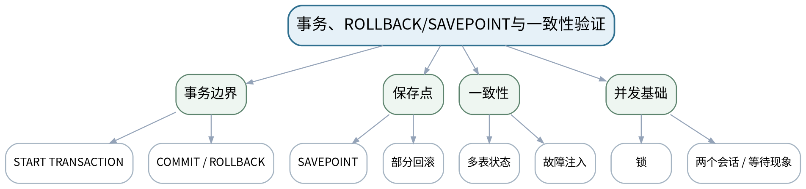

### 教学目标
**知识目标：**
1. 理解事务边界、ACID、COMMIT、ROLLBACK、SAVEPOINT和锁/并发的基础概念。

**能力目标：**
1. 能够把多步业务更新放入事务，并通过故障注入证明回滚保持一致性。
2. 能够观察两个会话的基本并发现象并记录，而不把演示结果过度推广。

**价值目标：**
1. 形成高风险多表修改必须有事务边界和失败恢复设计的意识。

### 课程思政
通过半完成业务状态强调一致性和可靠性责任，性能与安全不能以牺牲数据正确性为代价。

### 专创融合
将事务脚本作为MES工单状态流转的数据层可靠性组件。

### 教学重难点
**教学重点：**事务提交与回滚；故障注入验证一致性。

**教学难点：**正确界定“一个业务事务”的边界，并区分数据库回滚与应用层补偿。

### 教学方法与用具
**教学方法：**任务驱动法、问题引导法、关系图解法、SQL演示法、预测—执行—验证法、测试验收与错误复盘

**教学用具：**机房、MySQL 8.0、两个客户端会话、课程测试数据库。

### 教学设计
课前任务 → 互动导入（10 min）→ 传授新知与课堂训练（75 min）→ 过关检测（10 min）→ 课堂小结（3 min）→ 作业布置（1 min）→ 考勤（1 min）

### 课前任务
【教师】发布“事务、ROLLBACK/SAVEPOINT与一致性验证”对应大纲/教材范围和一个最小问题，不提前给出完整SQL答案。

1. 阅读对应大纲与教材内容；
2. 圈出3个数据库术语并记录至少1个疑问；
3. 检查MySQL服务、客户端、课程数据库与上一任务脚本是否可运行；不得在未知/生产数据库上试验。

【学生】完成准备并带着“预期结果/疑问”进入课堂。

### 互动导入
【教师】给出“关闭维修工单成功，但设备状态更新失败”的半完成状态，让学生判断哪些数据不一致、如何避免。

【学生】先独立预测/判断，再与同伴交换依据；教师收集典型分歧后进入本课。

### 传授新知与课堂训练
**一、任务说明与最小示范（约20 min）—事务脚本**

【教师】设计“关闭工单+更新设备状态+写维修记录”的三步事务；加入SAVEPOINT观察部分回滚。

【学生】按任务约束完成SQL/模型/分析，先预测再执行，保留中间结果、错误信息和判断依据。

**二、学生独立/小组实现（约35 min）—故障注入**

【教师】在第2/3步故意制造约束失败，验证ROLLBACK后所有相关数据恢复到一致状态。

【学生】按任务约束完成SQL/模型/分析，先预测再执行，保留中间结果、错误信息和判断依据。

**三、测试、调试与证据固化（约20 min）—并发观察**

【教师】在两个客户端会话中执行简单更新，观察锁等待/提交后的变化；只记录实际现象和环境，不虚构隔离级别结论。

【学生】按任务约束完成SQL/模型/分析，先预测再执行，保留中间结果、错误信息和判断依据。

**独立学习产物**：transaction.sql + 故障注入用例 + 前后数据一致性检查表。

**学习证据**：事务脚本、失败错误、ROLLBACK前后查询、SAVEPOINT验证、并发观察记录。

**评价映射**：课程作业：上机四（20%模块）；目标1.5、2.5、3.5。

### 过关检测
【教师】组织当堂检测：

1. 一个事务边界应该按SQL条数还是业务原子操作划分？
2. ROLLBACK后如何证明数据真的恢复？
3. 为什么并发实验必须记录会话和环境？

【学生】独立作答/运行验证；【教师】按错误类型讲解，要求说明SQL或数据关系依据。

### 课堂小结
【教师】回到本课知识脉络图，用“概念—关系—SQL/机制—边界—验证”总结“事务、ROLLBACK/SAVEPOINT与一致性验证”，再次强调教学重点：事务提交与回滚；故障注入验证一致性。

【学生】写下“本课一条最重要的数据/SQL规则 + 一个最容易出错的边界”。

### 作业布置
【教师】布置课后任务：完成上机四报告，增加一条“没有事务会造成什么中间状态”的反例。

【学生】按课程文件命名与证据要求整理提交；SQL和数据操作应只针对课程数据库/测试环境。

### 考勤
【教师】利用学校/课程实际使用的平台进行签到。

【学生】按课程要求完成签到。

### 课后教学反思
【课后填写，不预填事实】

1. 教学流程：记录100 min各环节实际用时及调整点；
2. 教学内容：重点记录“正确界定“一个业务事务”的边界，并区分数据库回滚与应用层补偿。”的真实掌握证据和常见错误；
3. 学生参与：仅依据实际课堂记录填写SQL预测、独立实现、调试、互审情况，不补写推测；
4. 评价证据：检查本课脚本/模型/测试证据是否完整，记录缺项原因；
5. 后续改进：依据真实课堂证据决定下一次课的补救或拓展。

### 本章节参考文献
[1] 黑马程序员.《MySQL数据库入门（第3版）》[M]. 清华大学出版社，2025。
[3] 尹志宇等.《数据库原理及应用教程——MySQL 8.0》[M]. 清华大学出版社，2025。

## 第12次课 存储程序、触发器、权限、备份恢复与综合交付

### 课次信息
- **章节/单元**：第6单元 数据库编程、权限维护与综合应用
- **周次**：按实际课表填写
- **课时安排**：2课时（100 min）
- **课型**：理论

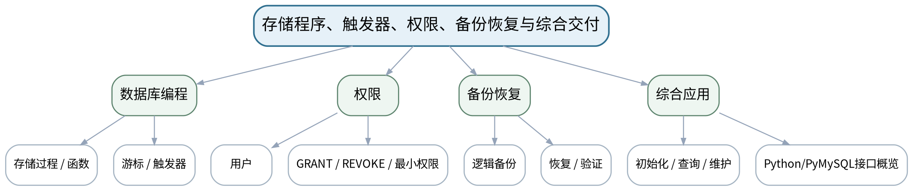

### 教学目标
**知识目标：**
1. 掌握存储过程/函数、变量和流程控制、触发器、游标的基础用途。
2. 掌握用户/权限、GRANT/REVOKE、备份恢复的基本方法，理解日志与维护概念。

**能力目标：**
1. 能够判断某一业务逻辑应由查询、约束、触发器、存储过程还是应用层承担。
2. 能够设计最小权限、备份—恢复—验证闭环，并规划数据库综合交付物。

**价值目标：**
1. 形成最小权限、先备份再高风险变更、恢复必须实测、脚本与版本可追溯的运维意识。

### 课程思政
通过越权访问、无备份变更和恢复失败案例强化数据安全、最小权限和恢复责任。

### 专创融合
把数据库初始化、权限、备份和README视为可部署产品的一部分，而非“开发后再补”的附加项。

### 教学重难点
**教学重点：**存储程序/触发器职责边界；最小权限；备份恢复闭环。

**教学难点：**避免把所有逻辑塞进触发器/存储过程；理解“有备份文件”不等于“具备恢复能力”。

### 教学方法与用具
**教学方法：**任务驱动法、问题引导法、关系图解法、SQL演示法、预测—执行—验证法、测试验收与错误复盘

**教学用具：**电脑、投影仪、MySQL 8.0、mysqldump或学校统一备份工具、Python/PyMySQL示例。

### 教学设计
课前任务 → 互动导入（10 min）→ 传授新知与课堂训练（75 min）→ 过关检测（10 min）→ 课堂小结（3 min）→ 作业布置（1 min）→ 考勤（1 min）

### 课前任务
【教师】发布“存储程序、触发器、权限、备份恢复与综合交付”对应大纲/教材范围和一个最小问题，不提前给出完整SQL答案。

1. 阅读对应大纲与教材内容；
2. 圈出3个数据库术语并记录至少1个疑问；
3. 预读一个关系图或SQL片段，写出预期结果与一个疑问。

【学生】完成准备并带着“预期结果/疑问”进入课堂。

### 互动导入
【教师】展示一个触发器自动修改多个表导致结果难追踪的案例，与一个权限过大的普通查询账号案例，要求学生分别指出可维护性与安全问题。

【学生】先独立预测/判断，再与同伴交换依据；教师收集典型分歧后进入本课。

### 传授新知与课堂训练
**一、核心概念与结构讲解（约30 min）—数据库编程**

【教师】介绍过程/函数、IF/LOOP基础、游标与触发器；以“维修状态变更审计”讨论适用边界和副作用。

【学生】完成对应关系图、SQL推演或场景判断，先写预期结果，再用课堂示例验证并修正。

**二、学生建模/SQL/案例练习（约25 min）—权限与恢复**

【教师】从“管理员/应用只读/维护员”角色设计最小权限；说明mysqldump或等价逻辑备份、恢复和验证。

【学生】完成对应关系图、SQL推演或场景判断，先写预期结果，再用课堂示例验证并修正。

**三、对比、验证与错误复盘（约20 min）—综合交付设计**

【教师】明确综合任务需包含E-R图、schema/seed、查询、视图/索引、事务、权限、备份、README；Python接口只作为可选读取应用。

【学生】完成对应关系图、SQL推演或场景判断，先写预期结果，再用课堂示例验证并修正。

**独立学习产物**：数据库运维与综合交付清单：逻辑职责、权限矩阵、备份恢复步骤、最终包目录。

**学习证据**：权限矩阵、触发器/过程职责判断、恢复检查表、综合项目交付清单。

**评价映射**：平时成绩、期末闭卷笔试；目标1.6、2.6、3.6。

### 过关检测
【教师】组织当堂检测：

1. 触发器适合做什么，为什么不宜承载过多隐式业务逻辑？
2. 最小权限原则如何落实到三个不同角色？
3. 为什么备份必须通过恢复测试才能算有效？

【学生】独立作答/运行验证；【教师】按错误类型讲解，要求说明SQL或数据关系依据。

### 课堂小结
【教师】回到本课知识脉络图，用“概念—关系—SQL/机制—边界—验证”总结“存储程序、触发器、权限、备份恢复与综合交付”，再次强调教学重点：存储程序/触发器职责边界；最小权限；备份恢复闭环。

【学生】写下“本课一条最重要的数据/SQL规则 + 一个最容易出错的边界”。

### 作业布置
【教师】布置课后任务：为上机五准备一个简单过程/触发器需求、三个用户角色权限表和备份恢复验证计划。

【学生】按课程文件命名与证据要求整理提交；SQL和数据操作应只针对课程数据库/测试环境。

### 考勤
【教师】利用学校/课程实际使用的平台进行签到。

【学生】按课程要求完成签到。

### 课后教学反思
【课后填写，不预填事实】

1. 教学流程：记录100 min各环节实际用时及调整点；
2. 教学内容：重点记录“避免把所有逻辑塞进触发器/存储过程；理解“有备份文件”不等于“具备恢复能力”。”的真实掌握证据和常见错误；
3. 学生参与：仅依据实际课堂记录填写SQL预测、独立实现、调试、互审情况，不补写推测；
4. 评价证据：检查本课脚本/模型/测试证据是否完整，记录缺项原因；
5. 后续改进：依据真实课堂证据决定下一次课的补救或拓展。

### 本章节参考文献
[1] 黑马程序员.《MySQL数据库入门（第3版）》[M]. 清华大学出版社，2025。
[2] 黑马程序员.《MySQL数据库原理、设计与应用（第2版）》[M]. 清华大学出版社，2023。

## 第13次课 存储过程、函数与触发器基础

### 课次信息
- **章节/单元**：上机五 存储过程、触发器、用户权限与备份恢复
- **周次**：按实际课表填写
- **课时安排**：2课时（100 min）
- **课型**：上机

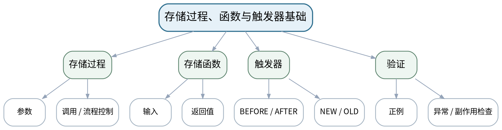

### 教学目标
**知识目标：**
1. 掌握CREATE PROCEDURE/FUNCTION、参数、调用及基础流程控制；理解触发器事件和NEW/OLD语义。

**能力目标：**
1. 能够实现一个基础存储过程/函数和一个审计型触发器，并通过正反测试验证。
2. 能够识别触发器副作用并用查询证明实际变化。

**价值目标：**
1. 形成隐式自动逻辑必须可观察、可测试、可说明的维护意识。

### 课程思政
要求自动化数据库逻辑有清晰责任边界和审计证据，避免“自动做了但没人知道”。

### 专创融合
将过程/函数视为可复用数据服务模块，同时评估是否更适合放在应用层。

### 教学重难点
**教学重点：**存储过程/函数与触发器实现及测试。

**教学难点：**区分过程、函数、触发器的调用方式与副作用；避免递归/隐式修改失控。

### 教学方法与用具
**教学方法：**任务驱动法、问题引导法、关系图解法、SQL演示法、预测—执行—验证法、测试验收与错误复盘

**教学用具：**机房、MySQL 8.0、课程测试数据库。

### 教学设计
课前任务 → 互动导入（10 min）→ 传授新知与课堂训练（75 min）→ 过关检测（10 min）→ 课堂小结（3 min）→ 作业布置（1 min）→ 考勤（1 min）

### 课前任务
【教师】发布“存储过程、函数与触发器基础”对应大纲/教材范围和一个最小问题，不提前给出完整SQL答案。

1. 阅读对应大纲与教材内容；
2. 圈出3个数据库术语并记录至少1个疑问；
3. 检查MySQL服务、客户端、课程数据库与上一任务脚本是否可运行；不得在未知/生产数据库上试验。

【学生】完成准备并带着“预期结果/疑问”进入课堂。

### 互动导入
【教师】教师执行一次UPDATE后出现一条额外审计记录，询问学生：如果不了解触发器，调试时会误判什么？

【学生】先独立预测/判断，再与同伴交换依据；教师收集典型分歧后进入本课。

### 传授新知与课堂训练
**一、任务说明与最小示范（约20 min）—最小示范**

【教师】演示带IN参数的查询过程、简单函数以及AFTER UPDATE审计触发器，强调命名与DROP IF EXISTS。

【学生】按任务约束完成SQL/模型/分析，先预测再执行，保留中间结果、错误信息和判断依据。

**二、学生独立/小组实现（约35 min）—独立实现**

【教师】学生完成“按设备统计报警”的过程/函数和“状态变更审计”触发器，使用独立审计表记录前后状态。

【学生】按任务约束完成SQL/模型/分析，先预测再执行，保留中间结果、错误信息和判断依据。

**三、测试、调试与证据固化（约20 min）—测试验收**

【教师】执行正常、空数据、非法输入/不存在设备等测试；检查触发器只产生预期记录并能通过SQL追踪。

【学生】按任务约束完成SQL/模型/分析，先预测再执行，保留中间结果、错误信息和判断依据。

**独立学习产物**：stored_program.sql + trigger.sql + test_stored_program.sql。

**学习证据**：定义脚本、CALL/SELECT结果、审计记录、边界测试、触发器副作用说明。

**评价映射**：课程作业：上机五（前半）；目标1.6、2.6、3.6。

### 过关检测
【教师】组织当堂检测：

1. 存储过程和函数的调用方式有什么区别？
2. 触发器为什么容易造成“隐式副作用”？
3. 怎样证明触发器只在预期事件上执行？

【学生】独立作答/运行验证；【教师】按错误类型讲解，要求说明SQL或数据关系依据。

### 课堂小结
【教师】回到本课知识脉络图，用“概念—关系—SQL/机制—边界—验证”总结“存储过程、函数与触发器基础”，再次强调教学重点：存储过程/函数与触发器实现及测试。

【学生】写下“本课一条最重要的数据/SQL规则 + 一个最容易出错的边界”。

### 作业布置
【教师】布置课后任务：补充一个删除/停用触发器后的对照测试，说明系统行为差别。

【学生】按课程文件命名与证据要求整理提交；SQL和数据操作应只针对课程数据库/测试环境。

### 考勤
【教师】利用学校/课程实际使用的平台进行签到。

【学生】按课程要求完成签到。

### 课后教学反思
【课后填写，不预填事实】

1. 教学流程：记录100 min各环节实际用时及调整点；
2. 教学内容：重点记录“区分过程、函数、触发器的调用方式与副作用；避免递归/隐式修改失控。”的真实掌握证据和常见错误；
3. 学生参与：仅依据实际课堂记录填写SQL预测、独立实现、调试、互审情况，不补写推测；
4. 评价证据：检查本课脚本/模型/测试证据是否完整，记录缺项原因；
5. 后续改进：依据真实课堂证据决定下一次课的补救或拓展。

### 本章节参考文献
[1] 黑马程序员.《MySQL数据库入门（第3版）》[M]. 清华大学出版社，2025。

## 第14次课 最小权限、备份恢复与故障注入

### 课次信息
- **章节/单元**：上机五 存储过程、触发器、用户权限与备份恢复
- **周次**：按实际课表填写
- **课时安排**：2课时（100 min）
- **课型**：上机

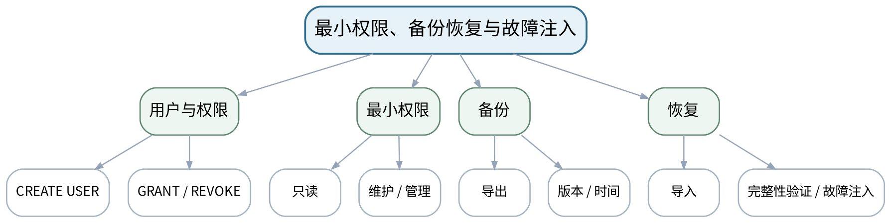

### 教学目标
**知识目标：**
1. 掌握CREATE USER、GRANT/REVOKE和逻辑备份恢复的基本流程。

**能力目标：**
1. 能够为管理员、应用只读、维护操作角色配置最小权限并验证越权失败。
2. 能够完成一次备份、破坏性变更、恢复和数据完整性核验。

**价值目标：**
1. 形成权限必须用拒绝测试验证、备份必须用恢复验证的安全运维意识。

### 课程思政
强调最小权限、备份恢复与审计是数据库责任边界，不为方便而长期使用高权限账号。

### 专创融合
把备份恢复演练和权限矩阵纳入数据库交付验收，形成运维可用的产品能力。

### 教学重难点
**教学重点：**最小权限与恢复闭环。

**教学难点：**正确设计权限粒度；恢复后不仅“成功导入”，还要校验关键表行数/约束/查询。

### 教学方法与用具
**教学方法：**任务驱动法、问题引导法、关系图解法、SQL演示法、预测—执行—验证法、测试验收与错误复盘

**教学用具：**机房、MySQL 8.0、mysqldump或等价工具、课程测试账号。

### 教学设计
课前任务 → 互动导入（10 min）→ 传授新知与课堂训练（75 min）→ 过关检测（10 min）→ 课堂小结（3 min）→ 作业布置（1 min）→ 考勤（1 min）

### 课前任务
【教师】发布“最小权限、备份恢复与故障注入”对应大纲/教材范围和一个最小问题，不提前给出完整SQL答案。

1. 阅读对应大纲与教材内容；
2. 圈出3个数据库术语并记录至少1个疑问；
3. 检查MySQL服务、客户端、课程数据库与上一任务脚本是否可运行；不得在未知/生产数据库上试验。

【学生】完成准备并带着“预期结果/疑问”进入课堂。

### 互动导入
【教师】提供一个“只读用户也能DROP TABLE”的错误权限配置，让学生用安全测试证明问题，而不是只看GRANT语句。

【学生】先独立预测/判断，再与同伴交换依据；教师收集典型分歧后进入本课。

### 传授新知与课堂训练
**一、任务说明与最小示范（约20 min）—权限实现**

【教师】创建课程专用测试用户/角色（按环境可用能力），为只读、维护、管理分别授权；执行允许与禁止操作。

【学生】按任务约束完成SQL/模型/分析，先预测再执行，保留中间结果、错误信息和判断依据。

**二、学生独立/小组实现（约35 min）—备份恢复**

【教师】备份课程数据库；在副本/测试环境删除或修改部分对象；从备份恢复。

【学生】按任务约束完成SQL/模型/分析，先预测再执行，保留中间结果、错误信息和判断依据。

**三、测试、调试与证据固化（约20 min）—恢复验收**

【教师】比较恢复前后关键表行数、约束、视图/过程是否存在和核心查询结果；记录失败和修复。

【学生】按任务约束完成SQL/模型/分析，先预测再执行，保留中间结果、错误信息和判断依据。

**独立学习产物**：permissions.sql + backup_restore.md + 恢复验证脚本。

**学习证据**：授权/回收语句、越权失败证据、备份文件信息、恢复日志、关键对象/数据校验结果。

**评价映射**：课程作业：上机五（15%模块）；目标1.6、2.6、3.6。

### 过关检测
【教师】组织当堂检测：

1. 怎样用“负面测试”证明只读用户确实只读？
2. 备份文件存在为什么不等于可恢复？
3. 恢复后至少检查哪些数据与对象？

【学生】独立作答/运行验证；【教师】按错误类型讲解，要求说明SQL或数据关系依据。

### 课堂小结
【教师】回到本课知识脉络图，用“概念—关系—SQL/机制—边界—验证”总结“最小权限、备份恢复与故障注入”，再次强调教学重点：最小权限与恢复闭环。

【学生】写下“本课一条最重要的数据/SQL规则 + 一个最容易出错的边界”。

### 作业布置
【教师】布置课后任务：完成上机五报告，写出一份面向课程综合数据库的最小权限矩阵。

【学生】按课程文件命名与证据要求整理提交；SQL和数据操作应只针对课程数据库/测试环境。

### 考勤
【教师】利用学校/课程实际使用的平台进行签到。

【学生】按课程要求完成签到。

### 课后教学反思
【课后填写，不预填事实】

1. 教学流程：记录100 min各环节实际用时及调整点；
2. 教学内容：重点记录“正确设计权限粒度；恢复后不仅“成功导入”，还要校验关键表行数/约束/查询。”的真实掌握证据和常见错误；
3. 学生参与：仅依据实际课堂记录填写SQL预测、独立实现、调试、互审情况，不补写推测；
4. 评价证据：检查本课脚本/模型/测试证据是否完整，记录缺项原因；
5. 后续改进：依据真实课堂证据决定下一次课的补救或拓展。

### 本章节参考文献
[1] 黑马程序员.《MySQL数据库入门（第3版）》[M]. 清华大学出版社，2025。
[3] 尹志宇等.《数据库原理及应用教程——MySQL 8.0》[M]. 清华大学出版社，2025。

## 第15次课 综合数据库设计、初始化、查询与性能组件

### 课次信息
- **章节/单元**：上机六 智能制造数据库综合任务
- **周次**：按实际课表填写
- **课时安排**：2课时（100 min）
- **课型**：上机

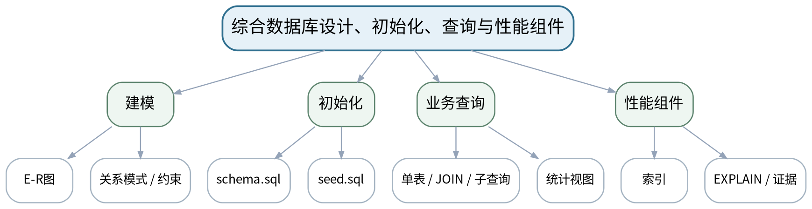

### 教学目标
**知识目标：**
1. 综合理解E-R、表结构、约束、DML/DQL、连接、索引和视图之间的依赖关系。

**能力目标：**
1. 能够围绕“设备运行与维护管理”完成数据库设计并一键初始化。
2. 能够实现核心单表/多表查询、统计视图与索引，并用测试和EXPLAIN验证。

**价值目标：**
1. 形成完整交付以脚本、文档和证据为准，而非“电脑上能跑一次”的工程习惯。

### 课程思政
强调数据来源、字段口径和变更历史可追溯，综合任务不使用未经授权的真实敏感生产数据。

### 专创融合
以MES/设备维护数据服务为产品原型，训练数据库作为可复用基础设施的交付意识。

### 教学重难点
**教学重点：**从模型到可重建数据库；核心查询和性能组件验收。

**教学难点：**控制综合任务范围，保证所有组件可从空库重建；避免手工界面操作成为唯一证据。

### 教学方法与用具
**教学方法：**任务驱动法、问题引导法、关系图解法、SQL演示法、预测—执行—验证法、测试验收与错误复盘

**教学用具：**机房、MySQL 8.0、E-R工具、版本管理、课程测试数据。

### 教学设计
课前任务 → 互动导入（10 min）→ 传授新知与课堂训练（75 min）→ 过关检测（10 min）→ 课堂小结（3 min）→ 作业布置（1 min）→ 考勤（1 min）

### 课前任务
【教师】发布“综合数据库设计、初始化、查询与性能组件”对应大纲/教材范围和一个最小问题，不提前给出完整SQL答案。

1. 阅读对应大纲与教材内容；
2. 圈出3个数据库术语并记录至少1个疑问；
3. 检查MySQL服务、客户端、课程数据库与上一任务脚本是否可运行；不得在未知/生产数据库上试验。

【学生】完成准备并带着“预期结果/疑问”进入课堂。

### 互动导入
【教师】教师删除一个预先建好的综合数据库，要求学生回答：仅有截图能否恢复？真正的“可交付数据库”需要哪些源文件？

【学生】先独立预测/判断，再与同伴交换依据；教师收集典型分歧后进入本课。

### 传授新知与课堂训练
**一、任务说明与最小示范（约20 min）—任务冻结与建模**

【教师】确认业务范围：设备、运行、报警、维护、人员；完善E-R图、字段口径和约束清单。

【学生】按任务约束完成SQL/模型/分析，先预测再执行，保留中间结果、错误信息和判断依据。

**二、学生独立/小组实现（约35 min）—一键初始化与查询**

【教师】从空库执行schema.sql/seed.sql；实现核心单表、多表、子查询和统计视图。

【学生】按任务约束完成SQL/模型/分析，先预测再执行，保留中间结果、错误信息和判断依据。

**三、测试、调试与证据固化（约20 min）—性能/一致性初验**

【教师】为关键查询建立索引并保存EXPLAIN；同伴从空库尝试重建并运行验收查询。

【学生】按任务约束完成SQL/模型/分析，先预测再执行，保留中间结果、错误信息和判断依据。

**独立学习产物**：综合项目v1：E-R图、schema/seed、核心查询、视图、索引及README草案。

**学习证据**：从空库重建日志、核心查询结果、EXPLAIN、同伴重建反馈、文件树。

**评价映射**：课程作业：上机六（前半）；目标1.1—1.6、2.1—2.6、3.1—3.6。

### 过关检测
【教师】组织当堂检测：

1. 怎样证明数据库可以从零重建？
2. 一个核心查询的“正确”应由哪些证据支撑？
3. 综合项目中哪些对象应写入脚本而不能只在GUI手工创建？

【学生】独立作答/运行验证；【教师】按错误类型讲解，要求说明SQL或数据关系依据。

### 课堂小结
【教师】回到本课知识脉络图，用“概念—关系—SQL/机制—边界—验证”总结“综合数据库设计、初始化、查询与性能组件”，再次强调教学重点：从模型到可重建数据库；核心查询和性能组件验收。

【学生】写下“本课一条最重要的数据/SQL规则 + 一个最容易出错的边界”。

### 作业布置
【教师】布置课后任务：修正同伴重建问题；补全README的环境、构建顺序、数据口径和已知限制。

【学生】按课程文件命名与证据要求整理提交；SQL和数据操作应只针对课程数据库/测试环境。

### 考勤
【教师】利用学校/课程实际使用的平台进行签到。

【学生】按课程要求完成签到。

### 课后教学反思
【课后填写，不预填事实】

1. 教学流程：记录100 min各环节实际用时及调整点；
2. 教学内容：重点记录“控制综合任务范围，保证所有组件可从空库重建；避免手工界面操作成为唯一证据。”的真实掌握证据和常见错误；
3. 学生参与：仅依据实际课堂记录填写SQL预测、独立实现、调试、互审情况，不补写推测；
4. 评价证据：检查本课脚本/模型/测试证据是否完整，记录缺项原因；
5. 后续改进：依据真实课堂证据决定下一次课的补救或拓展。

### 本章节参考文献
[1] 黑马程序员.《MySQL数据库入门（第3版）》[M]. 清华大学出版社，2025。
[2] 黑马程序员.《MySQL数据库原理、设计与应用（第2版）》[M]. 清华大学出版社，2023。

## 第16次课 事务、权限、备份与数据库完整交付验收

### 课次信息
- **章节/单元**：上机六 智能制造数据库综合任务
- **周次**：按实际课表填写
- **课时安排**：2课时（100 min）
- **课型**：上机

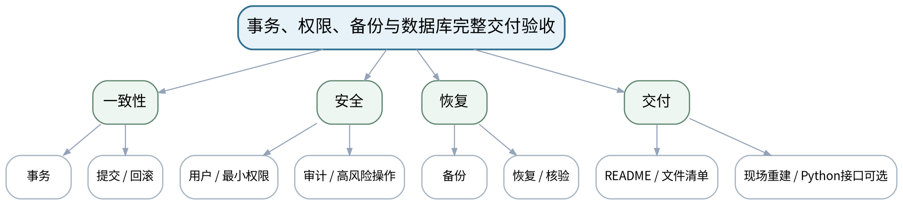

### 教学目标
**知识目标：**
1. 综合理解事务、存储程序/触发器、用户权限、备份恢复和应用接口在数据库交付中的角色。

**能力目标：**
1. 能够补全综合项目的事务、权限和备份恢复方案，并完成现场重建与核心查询验收。
2. 能够可选使用Python/PyMySQL读取统计视图，说明应用接口不替代SQL/数据库设计。

**价值目标：**
1. 形成最小权限、可恢复、可解释、个人贡献可追溯的数据库交付责任意识。

### 课程思政
通过现场重建、恢复和权限负面测试，强化“对数据系统的可用性、安全性和可追溯性负责”。

### 专创融合
把数据库交付包作为后续人工智能、ROS数据服务、MES/ERP课程可复用的数据底座。

### 教学重难点
**教学重点：**综合交付闭环：一致性、安全、恢复、重建和解释。

**教学难点：**将“演示成功”提升为“可重建、可恢复、可权限控制、可现场解释”的验收标准。

### 教学方法与用具
**教学方法：**任务驱动法、问题引导法、关系图解法、SQL演示法、预测—执行—验证法、测试验收与错误复盘

**教学用具：**机房、MySQL 8.0、mysqldump或等价工具、Python/PyMySQL（可选）、版本管理。

### 教学设计
课前任务 → 互动导入（10 min）→ 传授新知与课堂训练（75 min）→ 过关检测（10 min）→ 课堂小结（3 min）→ 作业布置（1 min）→ 考勤（1 min）

### 课前任务
【教师】发布“事务、权限、备份与数据库完整交付验收”对应大纲/教材范围和一个最小问题，不提前给出完整SQL答案。

1. 阅读对应大纲与教材内容；
2. 圈出3个数据库术语并记录至少1个疑问；
3. 检查MySQL服务、客户端、课程数据库与上一任务脚本是否可运行；不得在未知/生产数据库上试验。

【学生】完成准备并带着“预期结果/疑问”进入课堂。

### 互动导入
【教师】教师给出最终验收情境：“换一台电脑、空数据库、普通权限账号，能否按README恢复并运行核心查询？”学生据此检查自己的交付物。

【学生】先独立预测/判断，再与同伴交换依据；教师收集典型分歧后进入本课。

### 传授新知与课堂训练
**一、任务说明与最小示范（约20 min）—可靠性补全**

【教师】为一个多步业务更新实现事务/回滚；检查过程/触发器是否必要并可追踪。

【学生】按任务约束完成SQL/模型/分析，先预测再执行，保留中间结果、错误信息和判断依据。

**二、学生独立/小组实现（约35 min）—权限与恢复**

【教师】建立最小权限用户，执行允许/禁止用例；完成最终备份并在测试库恢复验证。

【学生】按任务约束完成SQL/模型/分析，先预测再执行，保留中间结果、错误信息和判断依据。

**三、测试、调试与证据固化（约20 min）—现场验收与解释**

【教师】按README从空库重建，运行核心查询/视图/事务；可选用PyMySQL读取统计视图；个人现场解释一个设计决策和一个失败案例。

【学生】按任务约束完成SQL/模型/分析，先预测再执行，保留中间结果、错误信息和判断依据。

**独立学习产物**：完整数据库交付包：E-R图、schema/seed、query、view/index、transaction、permission、backup、README（可选Python读取脚本）。

**学习证据**：重建日志、核心查询结果、事务回滚、越权失败、恢复校验、EXPLAIN、README和个人解释记录。

**评价映射**：课程作业：上机六（15%模块）+课程综合验收；目标全部。

### 过关检测
【教师】组织当堂检测：

1. 最终交付为什么必须同时包含源脚本和备份？
2. 怎样证明普通用户不能执行越权操作？
3. Python读取数据库时为什么不能把SQL/数据库设计责任全部转移到程序代码？

【学生】独立作答/运行验证；【教师】按错误类型讲解，要求说明SQL或数据关系依据。

### 课堂小结
【教师】回到本课知识脉络图，用“概念—关系—SQL/机制—边界—验证”总结“事务、权限、备份与数据库完整交付验收”，再次强调教学重点：综合交付闭环：一致性、安全、恢复、重建和解释。

【学生】写下“本课一条最重要的数据/SQL规则 + 一个最容易出错的边界”。

### 作业布置
【教师】布置课后任务：整理课程作品归档；针对期末闭卷复习E-R、SQL、连接/子查询、索引/视图、事务、权限与备份核心概念。

【学生】按课程文件命名与证据要求整理提交；SQL和数据操作应只针对课程数据库/测试环境。

### 考勤
【教师】利用学校/课程实际使用的平台进行签到。

【学生】按课程要求完成签到。

### 课后教学反思
【课后填写，不预填事实】

1. 教学流程：记录100 min各环节实际用时及调整点；
2. 教学内容：重点记录“将“演示成功”提升为“可重建、可恢复、可权限控制、可现场解释”的验收标准。”的真实掌握证据和常见错误；
3. 学生参与：仅依据实际课堂记录填写SQL预测、独立实现、调试、互审情况，不补写推测；
4. 评价证据：检查本课脚本/模型/测试证据是否完整，记录缺项原因；
5. 后续改进：依据真实课堂证据决定下一次课的补救或拓展。

### 本章节参考文献
[1] 黑马程序员.《MySQL数据库入门（第3版）》[M]. 清华大学出版社，2025。
[2] 黑马程序员.《MySQL数据库原理、设计与应用（第2版）》[M]. 清华大学出版社，2023。
[3] 尹志宇等.《数据库原理及应用教程——MySQL 8.0》[M]. 清华大学出版社，2025。
