# 编制信息

## 当前任务与边界

- 用户需要的成果：依据当前《数据结构（C）》课程教学大纲编写整门课教案并生成Word。
- 当前权威输入：25JX21800《数据结构（C）》课程教学大纲（二二六版），40学时=理论24+上机16，Python主线，考核20%+20%+60%。
- 周次安排：按每周4学时形成10周/20次课的建议进度，实际校历可顺延。
- 主讲教师、职称、制定日期：用户未提供，正式Word对应单元格留空，不虚构。

## 来源清单

| source_id | 材料或 Skill | 证据角色 | 版本或日期 | 定位 |
|---|---|---|---|---|
| S1 | 25JX21800《数据结构（C）》课程教学大纲（二二六版） | official_syllabus | 2026年9月 | 课程事实、目标、内容、学时、考核 |
| S2 | lesson-plan-authoring-skill | reference_lesson_plan | 2026-09-07 main | 教案内容合同、知识图、交付合同 |
| S3 | lesson-plan-compiler | reference_lesson_plan | 2026-09-03 main | 学校教案结构、语言与Word版式合同 |
| S4 | 张玉华等《数据结构（Python语言描述）（第2版·微课视频版）》 | provided_course_material | 2025 | 教材主线与课次内容参考 |

# 正式教案内容

## 课程基本信息

| 字段 | 内容 |
|---|---|
| 学院 | 计算机与信息技术学院 |
| 专业（教研室） | 智能制造工程 |
| 课程名称 | 《数据结构（C）》 |
| 课程名称（英文） | Data Structures (Version C) |
| 主讲教师 |  |
| 职称 |  |
| 授课专业 | 智能制造工程 |
| 授课学期 | 第5学期 |
| 制定日期 |  |
| 课程类别 | 学科基础类 |
| 课程性质 | 必修 |
| 授课语言 | 中文 |
| 学分 | 2.5 |
| 总学时 | 40 |
| 理论学时 | 24 |
| 实验/上机学时 | 16 |
| 实习学时 | 0 |
| 其他学时 | 0 |
| 教材 | 张玉华，吕强，朱晓旭，《数据结构（Python语言描述）（第2版·微课视频版）》[M]. 北京：清华大学出版社，2025。 |
| 授课学院 | 计算机与信息技术学院 |
| 先修课程 | 工程建模与科学计算可视化基础（Python）、程序设计基础（C&C++）Ⅰ、程序设计基础（C&C++）Ⅱ |
| 后续课程 | 人工智能技术及应用、先进装备系统设计与开发（ROS）、毕业设计（论文） |
| 考核类型 | 考试课（√）  考查课（ ） |
| 考核形式 | 闭卷（√）  开卷（ ）  笔试（√）  机试（ ）  口试（ ）  其它（ ） |
| 考核方式 | 作业（√）  随堂测验（√）  线下考试（√）  其它（ ） |
| 总评成绩比例 | 总评成绩 = 平时成绩×20% + 课程作业×20% + 期末闭卷考试×60% |

#### 课程简介

**课程基本定位**：本课程是智能制造工程专业的学科基础必修课。课程名称中的“（C）”为培养方案中的课程版本标识，不表示采用C语言。本课程以Python作为主要且统一的算法描述与上机实现语言，系统学习抽象数据类型、线性结构、树结构、图结构、查找、散列与排序，建立“逻辑结构—存储表示—基本运算—复杂度—测试验证—工程应用”的知识链。

**学时组织**：总学时40，其中理论24学时、上机16学时。按20次课组织，每次2课时（100 min）；理论12次，上机8次。周次按每周4学时形成建议进度，实际执行可随校历顺延。

**核心学习结果**：学生能够使用Python类、对象引用、迭代器和函数接口实现顺序表、链表、栈、队列、树、堆、图和散列表；能够实现递归、树遍历、图搜索、最短路径、查找与排序算法；能够分析时间/空间复杂度，使用pytest、timeit、Matplotlib和NetworkX等进行测试、性能比较和可视化，并能围绕智能制造数据组织问题形成可复现的综合性Python数据结构成果。

**主要教学方法**：采用“概念与图示—伪代码—Python实现—单元测试—复杂度实验—工程案例”的理实融合方式。理论课强调原理、结构不变量和复杂度；上机课强调独立编码、边界测试、调试复盘和工程交付。综合性Python任务不单独计分，作为课程作业中的综合学习证据。

## 教学单元

### lesson-01

| 字段 | 内容 |
|---|---|
| 章节 | 第1单元 第1讲 |
| 授课题目 | 数据结构、逻辑关系与抽象数据类型 |
| 周次 | 第1周（第1次课） |
| 课时安排 | 2课时（100 min）；类型：理论2 |
| 知识脉络图 | 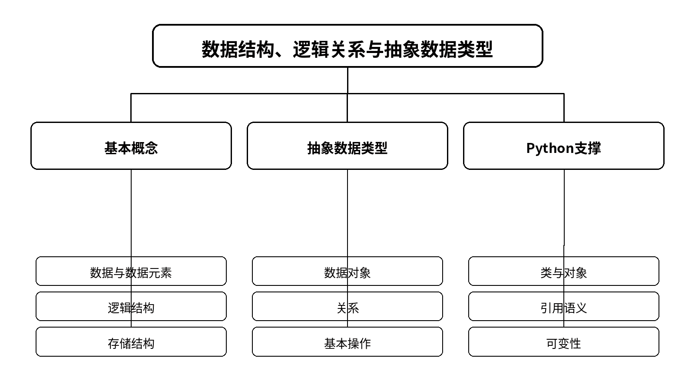 |
| 教学方法 | 讲授法、问答法、案例分析法、结构图示法、课堂检测法 |
| 教学用具 | 电脑、投影仪、多媒体课件、教材、Python解释器、ADT示例卡片 |
| 教学设计 | 课前任务→互动导入（8 min）→传授新知（70 min）→过关检测（10 min）→课堂小结（5 min）→作业布置（5 min）→考勤（2 min）；独立产物：一页“设备状态集合ADT”接口说明（含数据对象、关系、3个基本操作）；保留证据：课堂ADT接口说明、概念辨析小测和修订痕迹；考核关联：平时成绩20%中的课堂分析；期末闭卷考试60%中的ADT与基本概念 |
| 参考文献 | 张玉华，吕强，朱晓旭，《数据结构（Python语言描述）（第2版·微课视频版）》[M]. 北京：清华大学出版社，2025。；李春葆，蒋林，李筱驰，《数据结构教程（Python语言描述）（第2版·微课视频版）》[M]. 北京：清华大学出版社，2025。 |

#### 教学目标

**知识目标：**
（1）理解数据、数据元素、逻辑结构、存储结构与抽象数据类型的区别。
（2）理解Python对象、引用和类在数据结构实现中的作用。
**能力目标：**
（1）能够把设备状态记录等问题抽象为数据元素、关系与基本操作。
（2）能够写出一个简化ADT接口说明，并区分接口与实现。
**价值目标：**
（1）形成“先建模、再编码”的工程习惯。
（2）树立接口契约和数据语义一致意识。

#### 课程思政

（1）结合设备数据字段口径不一致造成的信息失真案例，强调数据建模、标准接口和工程责任。
（2）结合本课测试、错误或工程案例，强调结果可复核、边界可说明、责任可追溯。

#### 专创融合

围绕设备状态集合的不同组织方式，比较“直接用list”与“先定义ADT”的差异，鼓励从可维护性和可复用性提出改进。

#### 教学重难点

**教学重点：数据结构三层含义、ADT的组成、Python引用语义。**

**教学难点：如何把现实对象的“关系”与“操作”抽象成ADT，而不是直接进入代码。**

#### 教学过程

| 教学步骤 | 主要教学内容 | 设计意图 |
|---|---|---|
| 课前任务 | 【教师】1. 发布本课预习任务，明确教材对应主题与关键概念； 2. 提醒学生围绕“数据结构、逻辑关系与抽象数据类型”梳理至少1个疑问。 【学生】1. 阅读教材对应内容并记录关键词； 2. 准备上一次课相关代码/笔记，带着问题进入课堂。 | 通过预习建立必要前置概念，减少课堂机械抄录，把注意力集中到结构关系、算法过程和验证方法。 |
| 互动导入（8 min） | 【教师】1. 回顾上一课关键结论； 2. 用智能制造数据或代码错例引出“数据结构、逻辑关系与抽象数据类型”； 3. 追问学生本课需要解决的核心问题。 【学生】参与问答、观察案例，明确本次课任务与产物。 | 从已知问题进入新任务，建立知识连续性，同时把课程目标转化为可完成的课堂任务。 |
| 传授新知（共70 min） | **一、从“数据”到“数据结构”** 【教师】用设备状态记录示例区分数据、数据元素、数据项和数据对象；讲清逻辑结构与存储结构的不同层次。 【学生】对给定设备数据判断元素、关系和可能的存储方式，并说明理由。  **二、抽象数据类型ADT** 【教师】讲解ADT=数据对象+关系+基本操作，强调接口描述不等同于具体Python实现。 【学生】将“维护工单集合”写成最小ADT接口。  **三、Python对象模型与数据结构实现** 【教师】演示对象、引用、可变对象和类，说明为什么链式结构依赖引用关系。 【学生】观察id与赋值示例，判断“复制对象”与“复制引用”的差别。 【课堂强化】本课独立产物：一页“设备状态集合ADT”接口说明（含数据对象、关系、3个基本操作）。 【测试/复核】课堂ADT接口说明、概念辨析小测和修订痕迹。 | 按“概念/结构→算法或实现→测试/解释”的顺序推进，让学生在课堂中形成独立产物，并通过运行、图示或手工轨迹把教师讲解转化为自己的操作路径。 |
| 过关检测（10 min） | 【教师】布置课堂小测： 【选择题】ADT主要描述的是：A.界面颜色 B.数据对象、关系和操作 C.文件名 D.解释器版本 【判断题】逻辑结构和存储结构是同一个概念。（ ） 【简答题】为什么“使用Python list”不等于完成了ADT设计？ 【学生】独立作答或现场运行，同伴互查； 【教师】根据结果集中点评本课重难点和易错点。 | 即时检查概念、算法过程与实现边界，防止“听懂了但不会判断/不会写/不会测”。 |
| 课堂小结（5 min） | 【教师】简要总结： 1. 本次课解决的关键问题是“数据结构、逻辑关系与抽象数据类型”的结构与方法； 2. 需要重点掌握的主线是：结构关系→操作/算法→复杂度或边界→验证； 3. 最值得带走的方法是用测试或手工轨迹验证算法； 4. 需要警惕的易错点是：如何把现实对象的“关系”与“操作”抽象成ADT，而不是直接进入代码。 | 把零散知识重新组织为可迁移的方法主线，为后续结构和算法学习建立连接。 |
| 作业布置（5 min） | 【教师】布置课后任务： 1. 完成一个“生产任务集合”ADT说明，列出至少4个操作。 2. 预习算法效率与输入规模的关系，记录一个“程序能运行但效率很差”的例子。 【要求】作业不只写结果，还要写关键思路、复杂度/边界或测试依据；代码类作业保留测试结果。 | 用课后任务巩固本课方法并为下一次课准备前置材料，使课程作业持续形成可检验的学习证据。 |
| 考勤（2 min） | 【教师】利用学习通/课堂点名完成签到，记录缺勤情况；不在教案中预填实际出勤结果。 | 掌握出勤情况并保障教学秩序，同时避免在课前编造实际考勤事实。 |

#### 教学反思

【教师】课后重点从以下方面进行教学反思：
1. 教学流程：本课“数据结构、逻辑关系与抽象数据类型”的导入是否把学生带入真实问题，100分钟推进是否由概念/模型逐步走向算法、实现或验证。
2. 教学内容：如何把现实对象的“关系”与“操作”抽象成ADT，而不是直接进入代码。是否讲清，学生是否停留在机械记忆或照抄代码。
3. 学生参与：课堂判断、编码、测试或解释是否参与均衡，是否存在“会听不会做”“会做不会说”，薄弱学生是否获得必要指导。
4. 教学改进：下一轮是否需要增加针对“数据结构、逻辑关系与抽象数据类型”的错例、动态图示、代码断点演示或测试对照。

### lesson-02

| 字段 | 内容 |
|---|---|
| 章节 | 第1单元 第2讲 |
| 授课题目 | 算法复杂度与Python性能实验 |
| 周次 | 第1周（第2次课） |
| 课时安排 | 2课时（100 min）；类型：理论2 |
| 知识脉络图 | 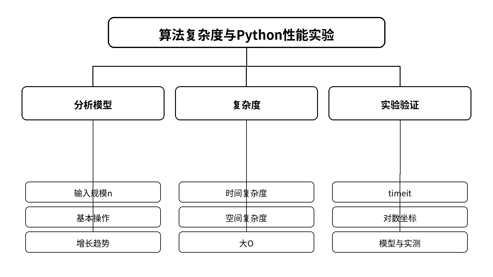 |
| 教学方法 | 讲授法、板书推导法、实验演示法、案例分析法、课堂检测法 |
| 教学用具 | 电脑、投影仪、多媒体课件、教材、Python、timeit、Matplotlib |
| 教学设计 | 课前任务→互动导入（8 min）→传授新知（70 min）→过关检测（10 min）→课堂小结（5 min）→作业布置（5 min）→考勤（2 min）；独立产物：一张复杂度分析表+一幅不同增长阶的对比曲线；保留证据：复杂度推导过程、timeit数据与图形、课堂错题修正；考核关联：平时成绩20%；课程作业20%中的复杂度分析；期末闭卷考试60%中的复杂度 |
| 参考文献 | 张玉华，吕强，朱晓旭，《数据结构（Python语言描述）（第2版·微课视频版）》[M]. 北京：清华大学出版社，2025。；李春葆，蒋林，李筱驰，《数据结构教程（Python语言描述）（第2版·微课视频版）》[M]. 北京：清华大学出版社，2025。 |

#### 教学目标

**知识目标：**
（1）理解输入规模、基本操作、时间复杂度和空间复杂度。
（2）掌握常见O(1)、O(log n)、O(n)、O(n log n)、O(n²)增长趋势。
**能力目标：**
（1）能够分析简单Python代码的基本操作次数并写出大O复杂度。
（2）能够使用timeit获取运行时间并解释实验误差。
**价值目标：**
（1）形成以渐进趋势而非单次运行时间判断算法性能的习惯。
（2）形成公平实验、参数可追溯意识。

#### 课程思政

（1）通过“同一结果、不同算法、数据规模扩大后差异巨大”的案例，强调工程性能必须以可复核证据支撑。
（2）结合本课测试、错误或工程案例，强调结果可复核、边界可说明、责任可追溯。

#### 专创融合

比较线性扫描和二分思想的增长趋势，引导学生从算法选择、数据规模和可维护性角度提出性能改进方案。

#### 教学重难点

**教学重点：复杂度分析步骤、常见增长阶、大O表达。**

**教学难点：从具体代码中识别“基本操作”，并区分理论复杂度与一次timeit实测。**

#### 教学过程

| 教学步骤 | 主要教学内容 | 设计意图 |
|---|---|---|
| 课前任务 | 【教师】1. 发布本课预习任务，明确教材对应主题与关键概念； 2. 提醒学生围绕“算法复杂度与Python性能实验”梳理至少1个疑问。 【学生】1. 阅读教材对应内容并记录关键词； 2. 准备上一次课相关代码/笔记，带着问题进入课堂。 | 通过预习建立必要前置概念，减少课堂机械抄录，把注意力集中到结构关系、算法过程和验证方法。 |
| 互动导入（8 min） | 【教师】1. 回顾上一课关键结论； 2. 用智能制造数据或代码错例引出“算法复杂度与Python性能实验”； 3. 追问学生本课需要解决的核心问题。 【学生】参与问答、观察案例，明确本次课任务与产物。 | 从已知问题进入新任务，建立知识连续性，同时把课程目标转化为可完成的课堂任务。 |
| 传授新知（共70 min） | **一、算法分析的统一口径** 【教师】用同一硬件上“毫秒数”不稳定的问题引出输入规模n和基本操作计数。 【学生】为三段短代码指出输入规模和主要基本操作。  **二、大O与常见增长阶** 【教师】推导常数、线性、对数、n log n和平方阶，强调只保留主导项的原因。 【学生】独立判断六段代码复杂度并同伴互查。  **三、timeit与实验验证** 【教师】演示固定环境、重复测量和多规模数据，解释缓存、解释器和常数项影响。 【学生】运行两种简单算法并画出n—时间曲线，比较理论与实测。 【课堂强化】本课独立产物：一张复杂度分析表+一幅不同增长阶的对比曲线。 【测试/复核】复杂度推导过程、timeit数据与图形、课堂错题修正。 | 按“概念/结构→算法或实现→测试/解释”的顺序推进，让学生在课堂中形成独立产物，并通过运行、图示或手工轨迹把教师讲解转化为自己的操作路径。 |
| 过关检测（10 min） | 【教师】布置课堂小测： 【选择题】n从100变为1000时，O(n²)基本操作数量约放大多少倍？ 【判断题】运行一次更快的程序一定具有更低的大O复杂度。（ ） 【简答题】为什么性能实验要使用多个输入规模？ 【学生】独立作答或现场运行，同伴互查； 【教师】根据结果集中点评本课重难点和易错点。 | 即时检查概念、算法过程与实现边界，防止“听懂了但不会判断/不会写/不会测”。 |
| 课堂小结（5 min） | 【教师】简要总结： 1. 本次课解决的关键问题是“算法复杂度与Python性能实验”的结构与方法； 2. 需要重点掌握的主线是：结构关系→操作/算法→复杂度或边界→验证； 3. 最值得带走的方法是用测试或手工轨迹验证算法； 4. 需要警惕的易错点是：从具体代码中识别“基本操作”，并区分理论复杂度与一次timeit实测。 | 把零散知识重新组织为可迁移的方法主线，为后续结构和算法学习建立连接。 |
| 作业布置（5 min） | 【教师】布置课后任务： 1. 分析给定3段Python代码的时间/空间复杂度。 2. 用timeit测量两个列表查找方案在5种n下的时间，提交表格和一句解释。 【要求】作业不只写结果，还要写关键思路、复杂度/边界或测试依据；代码类作业保留测试结果。 | 用课后任务巩固本课方法并为下一次课准备前置材料，使课程作业持续形成可检验的学习证据。 |
| 考勤（2 min） | 【教师】利用学习通/课堂点名完成签到，记录缺勤情况；不在教案中预填实际出勤结果。 | 掌握出勤情况并保障教学秩序，同时避免在课前编造实际考勤事实。 |

#### 教学反思

【教师】课后重点从以下方面进行教学反思：
1. 教学流程：本课“算法复杂度与Python性能实验”的导入是否把学生带入真实问题，100分钟推进是否由概念/模型逐步走向算法、实现或验证。
2. 教学内容：从具体代码中识别“基本操作”，并区分理论复杂度与一次timeit实测。是否讲清，学生是否停留在机械记忆或照抄代码。
3. 学生参与：课堂判断、编码、测试或解释是否参与均衡，是否存在“会听不会做”“会做不会说”，薄弱学生是否获得必要指导。
4. 教学改进：下一轮是否需要增加针对“算法复杂度与Python性能实验”的错例、动态图示、代码断点演示或测试对照。

### lesson-03

| 字段 | 内容 |
|---|---|
| 章节 | 第2单元 第1讲 |
| 授课题目 | 线性表与顺序存储：从接口到Python列表 |
| 周次 | 第2周（第3次课） |
| 课时安排 | 2课时（100 min）；类型：理论2 |
| 知识脉络图 | 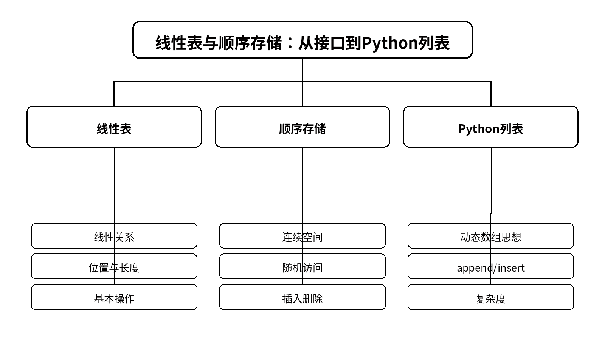 |
| 教学方法 | 讲授法、问答法、结构图示法、代码阅读法、复杂度分析法 |
| 教学用具 | 电脑、投影仪、多媒体课件、教材、Python、列表操作示例 |
| 教学设计 | 课前任务→互动导入（8 min）→传授新知（70 min）→过关检测（10 min）→课堂小结（5 min）→作业布置（5 min）→考勤（2 min）；独立产物：SequenceList接口草图和常用操作复杂度表；保留证据：接口草图、复杂度表、课堂代码跟踪记录；考核关联：课程作业20%中的ADT与线性结构；期末闭卷考试60%中的线性表 |
| 参考文献 | 张玉华，吕强，朱晓旭，《数据结构（Python语言描述）（第2版·微课视频版）》[M]. 北京：清华大学出版社，2025。；李春葆，蒋林，李筱驰，《数据结构教程（Python语言描述）（第2版·微课视频版）》[M]. 北京：清华大学出版社，2025。 |

#### 教学目标

**知识目标：**
（1）掌握线性表逻辑结构和顺序存储特点。
（2）理解Python list的动态数组思想及常用操作复杂度。
**能力目标：**
（1）能够设计SequenceList的基本接口。
（2）能够判断访问、插入、删除的复杂度及适用场景。
**价值目标：**
（1）形成结构选择服从访问模式和数据规模的意识。
（2）形成对内置容器性能边界负责的习惯。

#### 课程思政

（1）通过生产记录频繁插入导致性能退化的案例，强调结构选择应基于实际操作模式而非习惯。
（2）结合本课测试、错误或工程案例，强调结果可复核、边界可说明、责任可追溯。

#### 专创融合

比较设备历史数据“随机查询多”和“中间插入多”两类需求，引导从性能、实现复杂度和维护成本提出结构选择。

#### 教学重难点

**教学重点：线性表ADT、顺序存储特点、Python list操作复杂度。**

**教学难点：理解“逻辑上连续”与“物理上连续”的差别，以及插入删除为什么产生移动成本。**

#### 教学过程

| 教学步骤 | 主要教学内容 | 设计意图 |
|---|---|---|
| 课前任务 | 【教师】1. 发布本课预习任务，明确教材对应主题与关键概念； 2. 提醒学生围绕“线性表与顺序存储：从接口到Python列表”梳理至少1个疑问。 【学生】1. 阅读教材对应内容并记录关键词； 2. 准备上一次课相关代码/笔记，带着问题进入课堂。 | 通过预习建立必要前置概念，减少课堂机械抄录，把注意力集中到结构关系、算法过程和验证方法。 |
| 互动导入（8 min） | 【教师】1. 回顾上一课关键结论； 2. 用智能制造数据或代码错例引出“线性表与顺序存储：从接口到Python列表”； 3. 追问学生本课需要解决的核心问题。 【学生】参与问答、观察案例，明确本次课任务与产物。 | 从已知问题进入新任务，建立知识连续性，同时把课程目标转化为可完成的课堂任务。 |
| 传授新知（共70 min） | **一、线性表的逻辑结构** 【教师】从设备日志序列说明“一对一”前驱后继关系和基本操作。 【学生】判断若干业务数据是否适合线性表表示。  **二、顺序存储** 【教师】讲解连续存储、地址计算、随机访问及中间插入/删除的移动。 【学生】手工模拟长度为6的顺序表在位置2插入元素的移动过程。  **三、Python list与动态数组** 【教师】用append/insert/pop示例连接到动态数组扩容思想和复杂度。 【学生】阅读代码并预测操作后列表状态与大致复杂度。 【课堂强化】本课独立产物：SequenceList接口草图和常用操作复杂度表。 【测试/复核】接口草图、复杂度表、课堂代码跟踪记录。 | 按“概念/结构→算法或实现→测试/解释”的顺序推进，让学生在课堂中形成独立产物，并通过运行、图示或手工轨迹把教师讲解转化为自己的操作路径。 |
| 过关检测（10 min） | 【教师】布置课堂小测： 【选择题】顺序表最突出的优势是：A.任意插入O(1) B.随机访问快 C.无需连续空间 D.无容量管理 【判断题】Python list在任意位置insert都可视为O(1)。（ ） 【简答题】为什么末尾append通常比头部insert更适合高频追加日志？ 【学生】独立作答或现场运行，同伴互查； 【教师】根据结果集中点评本课重难点和易错点。 | 即时检查概念、算法过程与实现边界，防止“听懂了但不会判断/不会写/不会测”。 |
| 课堂小结（5 min） | 【教师】简要总结： 1. 本次课解决的关键问题是“线性表与顺序存储：从接口到Python列表”的结构与方法； 2. 需要重点掌握的主线是：结构关系→操作/算法→复杂度或边界→验证； 3. 最值得带走的方法是用测试或手工轨迹验证算法； 4. 需要警惕的易错点是：理解“逻辑上连续”与“物理上连续”的差别，以及插入删除为什么产生移动成本。 | 把零散知识重新组织为可迁移的方法主线，为后续结构和算法学习建立连接。 |
| 作业布置（5 min） | 【教师】布置课后任务： 1. 完成SequenceList接口定义和至少5个方法的复杂度说明。 2. 预习单链表结点结构，画出3结点链表。 【要求】作业不只写结果，还要写关键思路、复杂度/边界或测试依据；代码类作业保留测试结果。 | 用课后任务巩固本课方法并为下一次课准备前置材料，使课程作业持续形成可检验的学习证据。 |
| 考勤（2 min） | 【教师】利用学习通/课堂点名完成签到，记录缺勤情况；不在教案中预填实际出勤结果。 | 掌握出勤情况并保障教学秩序，同时避免在课前编造实际考勤事实。 |

#### 教学反思

【教师】课后重点从以下方面进行教学反思：
1. 教学流程：本课“线性表与顺序存储：从接口到Python列表”的导入是否把学生带入真实问题，100分钟推进是否由概念/模型逐步走向算法、实现或验证。
2. 教学内容：理解“逻辑上连续”与“物理上连续”的差别，以及插入删除为什么产生移动成本。是否讲清，学生是否停留在机械记忆或照抄代码。
3. 学生参与：课堂判断、编码、测试或解释是否参与均衡，是否存在“会听不会做”“会做不会说”，薄弱学生是否获得必要指导。
4. 教学改进：下一轮是否需要增加针对“线性表与顺序存储：从接口到Python列表”的错例、动态图示、代码断点演示或测试对照。

### lesson-04

| 字段 | 内容 |
|---|---|
| 章节 | 第2单元 第2讲 |
| 授课题目 | 单链表、双链表与结构不变量 |
| 周次 | 第2周（第4次课） |
| 课时安排 | 2课时（100 min）；类型：理论2 |
| 知识脉络图 | 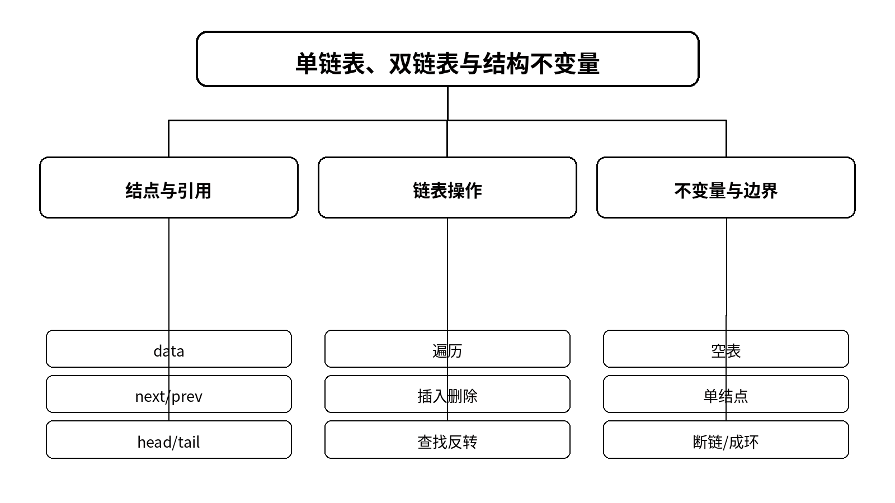 |
| 教学方法 | 讲授法、板书演示法、代码跟踪法、错例分析法、课堂检测法 |
| 教学用具 | 电脑、投影仪、多媒体课件、教材、Python、链表结点卡片 |
| 教学设计 | 课前任务→互动导入（8 min）→传授新知（70 min）→过关检测（10 min）→课堂小结（5 min）→作业布置（5 min）→考勤（2 min）；独立产物：手工链表操作轨迹图+LinkedList方法伪代码；保留证据：引用轨迹图、错例修正、课堂检测结果；考核关联：课程作业20%中的线性结构；期末闭卷考试60%中的链表操作 |
| 参考文献 | 张玉华，吕强，朱晓旭，《数据结构（Python语言描述）（第2版·微课视频版）》[M]. 北京：清华大学出版社，2025。；李春葆，蒋林，李筱驰，《数据结构教程（Python语言描述）（第2版·微课视频版）》[M]. 北京：清华大学出版社，2025。 |

#### 教学目标

**知识目标：**
（1）掌握单链表和双链表结点结构、遍历与基本操作。
（2）理解头结点/哨兵、head/tail和结构不变量。
**能力目标：**
（1）能够手工跟踪插入、删除和反转时引用的变化。
（2）能够识别断链、丢失后继和空表边界错误。
**价值目标：**
（1）形成“先保存引用、再改链接”的规范习惯。
（2）形成边界测试和数据完整性意识。

#### 课程思政

（1）通过维护记录链断裂导致数据不可达的案例，强调每次引用修改都应维护结构完整性。
（2）结合本课测试、错误或工程案例，强调结果可复核、边界可说明、责任可追溯。

#### 专创融合

比较单链、双链和带哨兵链表方案，引导学生从操作频率、代码复杂度和错误风险提出改进。

#### 教学重难点

**教学重点：结点引用、插入删除、反转、单/双链区别。**

**教学难点：在多个引用同时变化时保持结构不变量，特别是删除和反转。**

#### 教学过程

| 教学步骤 | 主要教学内容 | 设计意图 |
|---|---|---|
| 课前任务 | 【教师】1. 发布本课预习任务，明确教材对应主题与关键概念； 2. 提醒学生围绕“单链表、双链表与结构不变量”梳理至少1个疑问。 【学生】1. 阅读教材对应内容并记录关键词； 2. 准备上一次课相关代码/笔记，带着问题进入课堂。 | 通过预习建立必要前置概念，减少课堂机械抄录，把注意力集中到结构关系、算法过程和验证方法。 |
| 互动导入（8 min） | 【教师】1. 回顾上一课关键结论； 2. 用智能制造数据或代码错例引出“单链表、双链表与结构不变量”； 3. 追问学生本课需要解决的核心问题。 【学生】参与问答、观察案例，明确本次课任务与产物。 | 从已知问题进入新任务，建立知识连续性，同时把课程目标转化为可完成的课堂任务。 |
| 传授新知（共70 min） | **一、结点、head与tail** 【教师】用对象引用图讲data/next以及双链prev；说明空表和单结点状态。 【学生】画出3个结点的单链与双链结构并标注head/tail。  **二、插入与删除** 【教师】逐步演示中间插入、头删、尾删，强调“先保存后继再改链接”。 【学生】按步骤更新引用并解释每一步后结构是否仍连通。  **三、反转与不变量** 【教师】讲解prev/current/next三指针反转，展示断链错例。 【学生】手工跟踪4结点反转，列出循环不变量和结束条件。 【课堂强化】本课独立产物：手工链表操作轨迹图+LinkedList方法伪代码。 【测试/复核】引用轨迹图、错例修正、课堂检测结果。 | 按“概念/结构→算法或实现→测试/解释”的顺序推进，让学生在课堂中形成独立产物，并通过运行、图示或手工轨迹把教师讲解转化为自己的操作路径。 |
| 过关检测（10 min） | 【教师】布置课堂小测： 【选择题】单链表删除current后继结点前，最关键的操作是？ 【判断题】链表插入不需要考虑边界情况。（ ） 【简答题】反转链表时为什么要先保存next？ 【学生】独立作答或现场运行，同伴互查； 【教师】根据结果集中点评本课重难点和易错点。 | 即时检查概念、算法过程与实现边界，防止“听懂了但不会判断/不会写/不会测”。 |
| 课堂小结（5 min） | 【教师】简要总结： 1. 本次课解决的关键问题是“单链表、双链表与结构不变量”的结构与方法； 2. 需要重点掌握的主线是：结构关系→操作/算法→复杂度或边界→验证； 3. 最值得带走的方法是用测试或手工轨迹验证算法； 4. 需要警惕的易错点是：在多个引用同时变化时保持结构不变量，特别是删除和反转。 | 把零散知识重新组织为可迁移的方法主线，为后续结构和算法学习建立连接。 |
| 作业布置（5 min） | 【教师】布置课后任务： 1. 写出单链表insert_after、delete_value、reverse伪代码，并列出空表/单结点测试。 2. 准备上机环境，建立ds_course仓库和tests目录。 【要求】作业不只写结果，还要写关键思路、复杂度/边界或测试依据；代码类作业保留测试结果。 | 用课后任务巩固本课方法并为下一次课准备前置材料，使课程作业持续形成可检验的学习证据。 |
| 考勤（2 min） | 【教师】利用学习通/课堂点名完成签到，记录缺勤情况；不在教案中预填实际出勤结果。 | 掌握出勤情况并保障教学秩序，同时避免在课前编造实际考勤事实。 |

#### 教学反思

【教师】课后重点从以下方面进行教学反思：
1. 教学流程：本课“单链表、双链表与结构不变量”的导入是否把学生带入真实问题，100分钟推进是否由概念/模型逐步走向算法、实现或验证。
2. 教学内容：在多个引用同时变化时保持结构不变量，特别是删除和反转。是否讲清，学生是否停留在机械记忆或照抄代码。
3. 学生参与：课堂判断、编码、测试或解释是否参与均衡，是否存在“会听不会做”“会做不会说”，薄弱学生是否获得必要指导。
4. 教学改进：下一轮是否需要增加针对“单链表、双链表与结构不变量”的错例、动态图示、代码断点演示或测试对照。

### lesson-05

| 字段 | 内容 |
|---|---|
| 章节 | 上机一 第1讲 |
| 授课题目 | LinkedList接口实现与边界测试 |
| 周次 | 第3周（第5次课） |
| 课时安排 | 2课时（100 min）；类型：上机2 |
| 知识脉络图 | 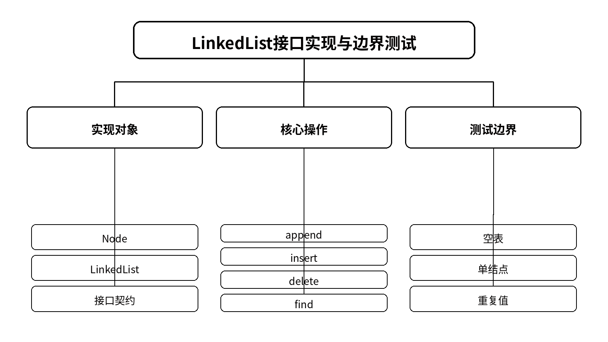 |
| 教学方法 | 任务驱动法、实操演练法、代码评审法、故障注入法 |
| 教学用具 | 电脑、VS Code或Jupyter、Python、pytest、教材、骨架仓库 |
| 教学设计 | 课前任务→互动导入（5 min）→传授新知（80 min）→过关检测（8 min）→课堂小结（3 min）→作业布置（2 min）→考勤（2 min）；独立产物：linked_list.py与test_linked_list.py（个人可运行版本）；保留证据：Git/本地版本记录、pytest通过结果、至少1个失败测试修复记录；考核关联：课程作业20%中的ADT与线性结构；平时成绩20%中的工程记录 |
| 参考文献 | 张玉华，吕强，朱晓旭，《数据结构（Python语言描述）（第2版·微课视频版）》[M]. 北京：清华大学出版社，2025。；李春葆，蒋林，李筱驰，《数据结构教程（Python语言描述）（第2版·微课视频版）》[M]. 北京：清华大学出版社，2025。 |

#### 教学目标

**知识目标：**
（1）理解Node/LinkedList类和链表结构不变量。
（2）理解测试用例与接口契约的对应关系。
**能力目标：**
（1）能够独立实现append、insert、delete和find。
（2）能够使用pytest/断言验证空表、单结点和重复值。
**价值目标：**
（1）形成先写接口与测试清单再编码的习惯。
（2）形成提交代码前自测和记录失败原因的作风。

#### 课程思政

（1）通过“只测正常路径导致现场错误”的案例强调边界测试和对代码结果负责。
（2）结合本课测试、错误或工程案例，强调结果可复核、边界可说明、责任可追溯。

#### 专创融合

围绕哨兵结点和非哨兵方案比较代码复杂度，鼓励学生用测试数量和可读性证明改进。

#### 教学重难点

**教学重点：链表类接口、引用更新、测试覆盖。**

**教学难点：删除/插入时维护head/tail和边界状态，并能通过失败测试定位错误。**

#### 教学过程

| 教学步骤 | 主要教学内容 | 设计意图 |
|---|---|---|
| 课前任务 | 【教师】1. 发布本课预习任务，明确教材对应主题与关键概念； 2. 提醒学生围绕“LinkedList接口实现与边界测试”梳理至少1个疑问。 【学生】1. 阅读教材对应内容并记录关键词； 2. 准备上一次课相关代码/笔记，带着问题进入课堂。 | 通过预习建立必要前置概念，减少课堂机械抄录，把注意力集中到结构关系、算法过程和验证方法。 |
| 互动导入（5 min） | 【教师】1. 回顾上一课关键结论； 2. 用智能制造数据或代码错例引出“LinkedList接口实现与边界测试”； 3. 追问学生本课需要解决的核心问题。 【学生】参与问答、观察案例，明确本次课任务与产物。 | 从已知问题进入新任务，建立知识连续性，同时把课程目标转化为可完成的课堂任务。 |
| 传授新知（共80 min） | **一、接口与测试先行** 【教师】给出Node/LinkedList最小接口和验收用例，不提供完整实现。 【学生】建立文件、方法签名和测试清单，先运行空实现观察失败。  **二、独立编码** 【教师】巡回指导，重点追问head/tail更新顺序，不直接给出完整答案。 【学生】独立实现append、find、insert和delete，每完成一个方法立即运行相关测试。  **三、调试与同伴复核** 【教师】注入“删除头结点后tail错误”等故障，引导使用最小复现。 【学生】定位失败断言，修复后与同伴交换测试用例，确认边界覆盖。 【课堂强化】本课独立产物：linked_list.py与test_linked_list.py（个人可运行版本）。 【测试/复核】Git/本地版本记录、pytest通过结果、至少1个失败测试修复记录。 | 按“概念/结构→算法或实现→测试/解释”的顺序推进，让学生在课堂中形成独立产物，并通过运行、图示或手工轨迹把教师讲解转化为自己的操作路径。 |
| 过关检测（8 min） | 【教师】布置课堂小测： 【代码判断】给出delete片段，指出可能的断链位置。 【测试题】至少补充一个空表删除测试。 【口头检查】解释一次插入操作前后哪些引用改变。 【学生】独立作答或现场运行，同伴互查； 【教师】根据结果集中点评本课重难点和易错点。 | 即时检查概念、算法过程与实现边界，防止“听懂了但不会判断/不会写/不会测”。 |
| 课堂小结（3 min） | 【教师】简要总结： 1. 本次课解决的关键问题是“LinkedList接口实现与边界测试”的结构与方法； 2. 需要重点掌握的主线是：结构关系→操作/算法→复杂度或边界→验证； 3. 最值得带走的方法是用测试或手工轨迹验证算法； 4. 需要警惕的易错点是：删除/插入时维护head/tail和边界状态，并能通过失败测试定位错误。 | 把零散知识重新组织为可迁移的方法主线，为后续结构和算法学习建立连接。 |
| 作业布置（2 min） | 【教师】布置课后任务： 1. 完善LinkedList，实现reverse并补充至少3个边界测试。 2. 将一个失败测试及修复原因写入README。 【要求】作业不只写结果，还要写关键思路、复杂度/边界或测试依据；代码类作业保留测试结果。 | 用课后任务巩固本课方法并为下一次课准备前置材料，使课程作业持续形成可检验的学习证据。 |
| 考勤（2 min） | 【教师】利用学习通/课堂点名完成签到，记录缺勤情况；不在教案中预填实际出勤结果。 | 掌握出勤情况并保障教学秩序，同时避免在课前编造实际考勤事实。 |

#### 教学反思

【教师】课后重点从以下方面进行教学反思：
1. 教学流程：本课“LinkedList接口实现与边界测试”的导入是否把学生带入真实问题，100分钟推进是否由概念/模型逐步走向算法、实现或验证。
2. 教学内容：删除/插入时维护head/tail和边界状态，并能通过失败测试定位错误。是否讲清，学生是否停留在机械记忆或照抄代码。
3. 学生参与：课堂判断、编码、测试或解释是否参与均衡，是否存在“会听不会做”“会做不会说”，薄弱学生是否获得必要指导。
4. 教学改进：下一轮是否需要增加针对“LinkedList接口实现与边界测试”的错例、动态图示、代码断点演示或测试对照。

### lesson-06

| 字段 | 内容 |
|---|---|
| 章节 | 上机一 第2讲 |
| 授课题目 | 线性结构性能基准与实现复核 |
| 周次 | 第3周（第6次课） |
| 课时安排 | 2课时（100 min）；类型：上机2 |
| 知识脉络图 | 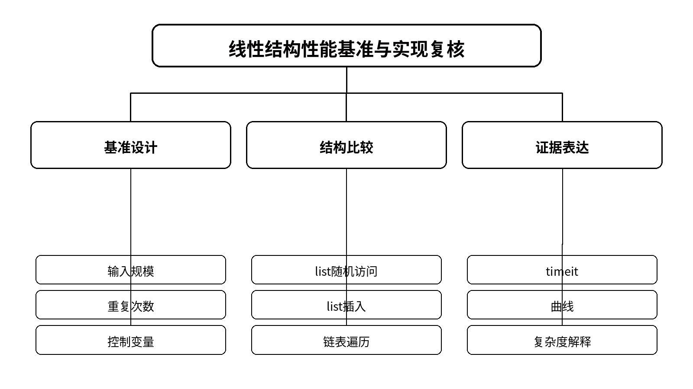 |
| 教学方法 | 任务驱动法、实验对比法、数据可视化法、代码评审法 |
| 教学用具 | 电脑、Python、timeit、Matplotlib、pytest、教材 |
| 教学设计 | 课前任务→互动导入（5 min）→传授新知（80 min）→过关检测（8 min）→课堂小结（3 min）→作业布置（2 min）→考勤（2 min）；独立产物：benchmark_linear.py、CSV/表格和一张性能曲线；保留证据：基准脚本、原始测量数据、图形、结论及实验参数；考核关联：课程作业20%中的综合Python任务与测试；期末考试60%中的复杂度 |
| 参考文献 | 张玉华，吕强，朱晓旭，《数据结构（Python语言描述）（第2版·微课视频版）》[M]. 北京：清华大学出版社，2025。；李春葆，蒋林，李筱驰，《数据结构教程（Python语言描述）（第2版·微课视频版）》[M]. 北京：清华大学出版社，2025。 |

#### 教学目标

**知识目标：**
（1）理解基准测试中输入规模、重复次数和控制变量。
（2）理解理论复杂度与实测时间的联系和差异。
**能力目标：**
（1）能够设计list与链表操作的性能实验并绘图。
（2）能够根据曲线解释复杂度，不把一次运行时间当结论。
**价值目标：**
（1）形成公平测试、数据不挑选和结论可复核意识。
（2）形成用证据评价结构方案的习惯。

#### 课程思政

（1）通过“只展示对自己有利的数据”导致错误技术决策的案例强调公平实验和工程诚信。
（2）结合本课测试、错误或工程案例，强调结果可复核、边界可说明、责任可追溯。

#### 专创融合

鼓励学生比较不同链表实现与Python list的适用范围，用性能和代码复杂度同时评价方案。

#### 教学重难点

**教学重点：基准设计、timeit、曲线解释。**

**教学难点：控制实验变量并把实测曲线与渐进复杂度联系起来。**

#### 教学过程

| 教学步骤 | 主要教学内容 | 设计意图 |
|---|---|---|
| 课前任务 | 【教师】1. 发布本课预习任务，明确教材对应主题与关键概念； 2. 提醒学生围绕“线性结构性能基准与实现复核”梳理至少1个疑问。 【学生】1. 阅读教材对应内容并记录关键词； 2. 准备上一次课相关代码/笔记，带着问题进入课堂。 | 通过预习建立必要前置概念，减少课堂机械抄录，把注意力集中到结构关系、算法过程和验证方法。 |
| 互动导入（5 min） | 【教师】1. 回顾上一课关键结论； 2. 用智能制造数据或代码错例引出“线性结构性能基准与实现复核”； 3. 追问学生本课需要解决的核心问题。 【学生】参与问答、观察案例，明确本次课任务与产物。 | 从已知问题进入新任务，建立知识连续性，同时把课程目标转化为可完成的课堂任务。 |
| 传授新知（共80 min） | **一、设计公平基准** 【教师】给出三个待比较操作，要求统一n和重复次数，讲解预热与多次测量。 【学生】写实验计划，明确自变量、因变量和控制变量。  **二、运行与可视化** 【教师】示范timeit最小用法和对数/线性坐标的选择。 【学生】对5—7个规模运行测试，保存原始数据并绘制曲线。  **三、复核结论** 【教师】展示“噪声点”与“常数项影响”案例。 【学生】对照理论复杂度解释曲线，指出异常点并用重测或误差条验证。 【课堂强化】本课独立产物：benchmark_linear.py、CSV/表格和一张性能曲线。 【测试/复核】基准脚本、原始测量数据、图形、结论及实验参数。 | 按“概念/结构→算法或实现→测试/解释”的顺序推进，让学生在课堂中形成独立产物，并通过运行、图示或手工轨迹把教师讲解转化为自己的操作路径。 |
| 过关检测（8 min） | 【教师】布置课堂小测： 【判断题】一次测量list比链表慢，就能说明其复杂度更高。（ ） 【数据题】指出给定基准脚本中不公平的控制变量。 【简答题】为什么要保留原始测量数据？ 【学生】独立作答或现场运行，同伴互查； 【教师】根据结果集中点评本课重难点和易错点。 | 即时检查概念、算法过程与实现边界，防止“听懂了但不会判断/不会写/不会测”。 |
| 课堂小结（3 min） | 【教师】简要总结： 1. 本次课解决的关键问题是“线性结构性能基准与实现复核”的结构与方法； 2. 需要重点掌握的主线是：结构关系→操作/算法→复杂度或边界→验证； 3. 最值得带走的方法是用测试或手工轨迹验证算法； 4. 需要警惕的易错点是：控制实验变量并把实测曲线与渐进复杂度联系起来。 | 把零散知识重新组织为可迁移的方法主线，为后续结构和算法学习建立连接。 |
| 作业布置（2 min） | 【教师】布置课后任务： 1. 提交线性结构性能实验：脚本、数据、图、150字结论。 2. 预习栈、队列和deque操作。 【要求】作业不只写结果，还要写关键思路、复杂度/边界或测试依据；代码类作业保留测试结果。 | 用课后任务巩固本课方法并为下一次课准备前置材料，使课程作业持续形成可检验的学习证据。 |
| 考勤（2 min） | 【教师】利用学习通/课堂点名完成签到，记录缺勤情况；不在教案中预填实际出勤结果。 | 掌握出勤情况并保障教学秩序，同时避免在课前编造实际考勤事实。 |

#### 教学反思

【教师】课后重点从以下方面进行教学反思：
1. 教学流程：本课“线性结构性能基准与实现复核”的导入是否把学生带入真实问题，100分钟推进是否由概念/模型逐步走向算法、实现或验证。
2. 教学内容：控制实验变量并把实测曲线与渐进复杂度联系起来。是否讲清，学生是否停留在机械记忆或照抄代码。
3. 学生参与：课堂判断、编码、测试或解释是否参与均衡，是否存在“会听不会做”“会做不会说”，薄弱学生是否获得必要指导。
4. 教学改进：下一轮是否需要增加针对“线性结构性能基准与实现复核”的错例、动态图示、代码断点演示或测试对照。

### lesson-07

| 字段 | 内容 |
|---|---|
| 章节 | 第3单元 第1讲 |
| 授课题目 | 栈、队列与优先队列：受限线性结构 |
| 周次 | 第4周（第7次课） |
| 课时安排 | 2课时（100 min）；类型：理论2 |
| 知识脉络图 | 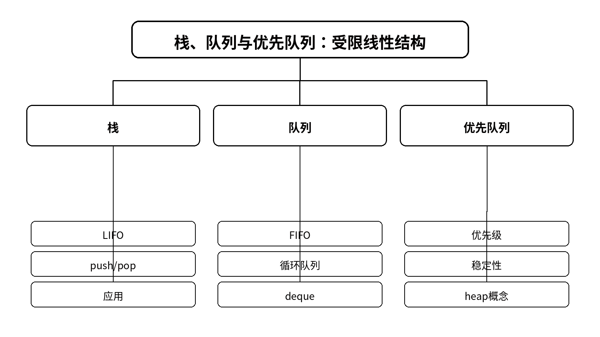 |
| 教学方法 | 讲授法、状态推演法、案例分析法、问答法、课堂检测法 |
| 教学用具 | 电脑、投影仪、多媒体课件、教材、Python、队列状态卡片 |
| 教学设计 | 课前任务→互动导入（8 min）→传授新知（70 min）→过关检测（10 min）→课堂小结（5 min）→作业布置（5 min）→考勤（2 min）；独立产物：一张“制造任务调度结构选择表”+循环队列状态轨迹；保留证据：结构选择表、队列轨迹、课堂小测；考核关联：课程作业20%中的栈队列；期末考试60%的线性结构部分 |
| 参考文献 | 张玉华，吕强，朱晓旭，《数据结构（Python语言描述）（第2版·微课视频版）》[M]. 北京：清华大学出版社，2025。；李春葆，蒋林，李筱驰，《数据结构教程（Python语言描述）（第2版·微课视频版）》[M]. 北京：清华大学出版社，2025。 |

#### 教学目标

**知识目标：**
（1）掌握栈、队列、双端队列和优先队列的操作约束。
（2）理解循环队列front/rear与队满/队空判定思想。
**能力目标：**
（1）能够根据任务特点选择栈、队列或优先队列。
（2）能够手工跟踪循环队列和任务排队状态。
**价值目标：**
（1）形成容量、顺序和公平调度意识。
（2）形成按接口约束使用数据结构的习惯。

#### 课程思政

（1）通过生产任务堵塞、急单插队和普通任务长期等待案例，讨论调度规则中的效率、公平和责任。
（2）结合本课测试、错误或工程案例，强调结果可复核、边界可说明、责任可追溯。

#### 专创融合

围绕“先进先出/按优先级/可从两端处理”三类调度策略比较吞吐、等待和实现复杂度。

#### 教学重难点

**教学重点：LIFO/FIFO、循环队列、优先队列选择。**

**教学难点：用下标和模运算维护循环队列状态，并区分队列与优先队列的语义。**

#### 教学过程

| 教学步骤 | 主要教学内容 | 设计意图 |
|---|---|---|
| 课前任务 | 【教师】1. 发布本课预习任务，明确教材对应主题与关键概念； 2. 提醒学生围绕“栈、队列与优先队列：受限线性结构”梳理至少1个疑问。 【学生】1. 阅读教材对应内容并记录关键词； 2. 准备上一次课相关代码/笔记，带着问题进入课堂。 | 通过预习建立必要前置概念，减少课堂机械抄录，把注意力集中到结构关系、算法过程和验证方法。 |
| 互动导入（8 min） | 【教师】1. 回顾上一课关键结论； 2. 用智能制造数据或代码错例引出“栈、队列与优先队列：受限线性结构”； 3. 追问学生本课需要解决的核心问题。 【学生】参与问答、观察案例，明确本次课任务与产物。 | 从已知问题进入新任务，建立知识连续性，同时把课程目标转化为可完成的课堂任务。 |
| 传授新知（共70 min） | **一、栈与LIFO** 【教师】用撤销操作和函数返回说明push/pop/top。 【学生】手工执行一组栈操作并判断栈顶。  **二、队列与循环队列** 【教师】用任务排队讲FIFO，推导循环下标和队满/队空处理。 【学生】跟踪长度5的循环队列入队出队，记录front/rear。  **三、优先队列与应用选择** 【教师】用急修工单说明优先级语义，并预告堆实现。 【学生】对5个场景选择栈/队列/优先队列并说明理由。 【课堂强化】本课独立产物：一张“制造任务调度结构选择表”+循环队列状态轨迹。 【测试/复核】结构选择表、队列轨迹、课堂小测。 | 按“概念/结构→算法或实现→测试/解释”的顺序推进，让学生在课堂中形成独立产物，并通过运行、图示或手工轨迹把教师讲解转化为自己的操作路径。 |
| 过关检测（10 min） | 【教师】布置课堂小测： 【选择题】函数调用返回最适合用什么结构？ 【判断题】优先队列保证严格先进先出。（ ） 【简答题】为什么循环队列需要区分队满和队空？ 【学生】独立作答或现场运行，同伴互查； 【教师】根据结果集中点评本课重难点和易错点。 | 即时检查概念、算法过程与实现边界，防止“听懂了但不会判断/不会写/不会测”。 |
| 课堂小结（5 min） | 【教师】简要总结： 1. 本次课解决的关键问题是“栈、队列与优先队列：受限线性结构”的结构与方法； 2. 需要重点掌握的主线是：结构关系→操作/算法→复杂度或边界→验证； 3. 最值得带走的方法是用测试或手工轨迹验证算法； 4. 需要警惕的易错点是：用下标和模运算维护循环队列状态，并区分队列与优先队列的语义。 | 把零散知识重新组织为可迁移的方法主线，为后续结构和算法学习建立连接。 |
| 作业布置（5 min） | 【教师】布置课后任务： 1. 实现一个容量固定的CircularQueue接口说明并列出边界情况。 2. 预习递归的终止条件和调用栈。 【要求】作业不只写结果，还要写关键思路、复杂度/边界或测试依据；代码类作业保留测试结果。 | 用课后任务巩固本课方法并为下一次课准备前置材料，使课程作业持续形成可检验的学习证据。 |
| 考勤（2 min） | 【教师】利用学习通/课堂点名完成签到，记录缺勤情况；不在教案中预填实际出勤结果。 | 掌握出勤情况并保障教学秩序，同时避免在课前编造实际考勤事实。 |

#### 教学反思

【教师】课后重点从以下方面进行教学反思：
1. 教学流程：本课“栈、队列与优先队列：受限线性结构”的导入是否把学生带入真实问题，100分钟推进是否由概念/模型逐步走向算法、实现或验证。
2. 教学内容：用下标和模运算维护循环队列状态，并区分队列与优先队列的语义。是否讲清，学生是否停留在机械记忆或照抄代码。
3. 学生参与：课堂判断、编码、测试或解释是否参与均衡，是否存在“会听不会做”“会做不会说”，薄弱学生是否获得必要指导。
4. 教学改进：下一轮是否需要增加针对“栈、队列与优先队列：受限线性结构”的错例、动态图示、代码断点演示或测试对照。

### lesson-08

| 字段 | 内容 |
|---|---|
| 章节 | 第3单元 第2讲 |
| 授课题目 | 递归、调用栈与显式栈转换 |
| 周次 | 第4周（第8次课） |
| 课时安排 | 2课时（100 min）；类型：理论2 |
| 知识脉络图 | 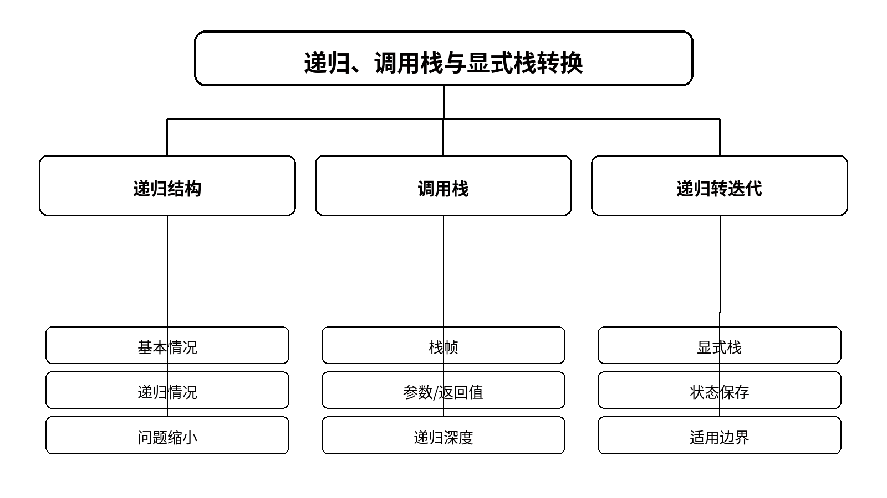 |
| 教学方法 | 讲授法、板书推导法、执行轨迹法、代码阅读法、课堂检测法 |
| 教学用具 | 电脑、投影仪、多媒体课件、教材、Python、调用栈图 |
| 教学设计 | 课前任务→互动导入（8 min）→传授新知（70 min）→过关检测（10 min）→课堂小结（5 min）→作业布置（5 min）→考勤（2 min）；独立产物：factorial/迷宫小例子的调用栈图和显式栈伪代码；保留证据：调用栈图、递归终止性检查、递归/迭代对照表；考核关联：课程作业20%；期末考试60%的递归与栈部分 |
| 参考文献 | 张玉华，吕强，朱晓旭，《数据结构（Python语言描述）（第2版·微课视频版）》[M]. 北京：清华大学出版社，2025。；李春葆，蒋林，李筱驰，《数据结构教程（Python语言描述）（第2版·微课视频版）》[M]. 北京：清华大学出版社，2025。 |

#### 教学目标

**知识目标：**
（1）掌握递归定义、基本情况和递归调用栈。
（2）理解递归深度、空间复杂度和显式栈转换思想。
**能力目标：**
（1）能够画出简单递归的调用栈和递归树。
（2）能够将一个简单递归过程改写为显式栈迭代。
**价值目标：**
（1）形成先证明终止再写递归的习惯。
（2）形成对栈深度和资源边界负责的意识。

#### 课程思政

（1）通过缺少终止条件造成栈溢出的案例，强调控制程序状态、资源消耗和异常边界。
（2）结合本课测试、错误或工程案例，强调结果可复核、边界可说明、责任可追溯。

#### 专创融合

比较递归与迭代实现的可读性、空间占用和可调试性，引导学生选择更适合工程环境的实现。

#### 教学重难点

**教学重点：基本情况、递归调用栈、递归/迭代转换。**

**教学难点：把“自动保存的调用状态”显式化为栈元素，并保证遍历顺序不变。**

#### 教学过程

| 教学步骤 | 主要教学内容 | 设计意图 |
|---|---|---|
| 课前任务 | 【教师】1. 发布本课预习任务，明确教材对应主题与关键概念； 2. 提醒学生围绕“递归、调用栈与显式栈转换”梳理至少1个疑问。 【学生】1. 阅读教材对应内容并记录关键词； 2. 准备上一次课相关代码/笔记，带着问题进入课堂。 | 通过预习建立必要前置概念，减少课堂机械抄录，把注意力集中到结构关系、算法过程和验证方法。 |
| 互动导入（8 min） | 【教师】1. 回顾上一课关键结论； 2. 用智能制造数据或代码错例引出“递归、调用栈与显式栈转换”； 3. 追问学生本课需要解决的核心问题。 【学生】参与问答、观察案例，明确本次课任务与产物。 | 从已知问题进入新任务，建立知识连续性，同时把课程目标转化为可完成的课堂任务。 |
| 传授新知（共70 min） | **一、递归三要素** 【教师】用阶乘和列表求和说明基本情况、递归情况和规模缩小。 【学生】为三个递归函数圈出基本情况并判断是否保证终止。  **二、调用栈** 【教师】逐帧画出f(4)调用和返回，解释参数、局部变量和返回地址。 【学生】完成一段递归的调用栈表格并计算最大深度。  **三、显式栈转换** 【教师】将递归DFS雏形转换为while+stack，说明状态保存。 【学生】将一个简单递归遍历改写为显式栈，并比较空间与调试差异。 【课堂强化】本课独立产物：factorial/迷宫小例子的调用栈图和显式栈伪代码。 【测试/复核】调用栈图、递归终止性检查、递归/迭代对照表。 | 按“概念/结构→算法或实现→测试/解释”的顺序推进，让学生在课堂中形成独立产物，并通过运行、图示或手工轨迹把教师讲解转化为自己的操作路径。 |
| 过关检测（10 min） | 【教师】布置课堂小测： 【判断题】只要函数调用自身就一定是正确递归。（ ） 【跟踪题】写出f(3)的调用/返回顺序。 【简答题】什么时候显式栈更利于调试？ 【学生】独立作答或现场运行，同伴互查； 【教师】根据结果集中点评本课重难点和易错点。 | 即时检查概念、算法过程与实现边界，防止“听懂了但不会判断/不会写/不会测”。 |
| 课堂小结（5 min） | 【教师】简要总结： 1. 本次课解决的关键问题是“递归、调用栈与显式栈转换”的结构与方法； 2. 需要重点掌握的主线是：结构关系→操作/算法→复杂度或边界→验证； 3. 最值得带走的方法是用测试或手工轨迹验证算法； 4. 需要警惕的易错点是：把“自动保存的调用状态”显式化为栈元素，并保证遍历顺序不变。 | 把零散知识重新组织为可迁移的方法主线，为后续结构和算法学习建立连接。 |
| 作业布置（5 min） | 【教师】布置课后任务： 1. 选择一个递归函数，写出递归版与显式栈版，并比较空间复杂度。 2. 准备上机二：建立stack_queue.py和search_demo.py。 【要求】作业不只写结果，还要写关键思路、复杂度/边界或测试依据；代码类作业保留测试结果。 | 用课后任务巩固本课方法并为下一次课准备前置材料，使课程作业持续形成可检验的学习证据。 |
| 考勤（2 min） | 【教师】利用学习通/课堂点名完成签到，记录缺勤情况；不在教案中预填实际出勤结果。 | 掌握出勤情况并保障教学秩序，同时避免在课前编造实际考勤事实。 |

#### 教学反思

【教师】课后重点从以下方面进行教学反思：
1. 教学流程：本课“递归、调用栈与显式栈转换”的导入是否把学生带入真实问题，100分钟推进是否由概念/模型逐步走向算法、实现或验证。
2. 教学内容：把“自动保存的调用状态”显式化为栈元素，并保证遍历顺序不变。是否讲清，学生是否停留在机械记忆或照抄代码。
3. 学生参与：课堂判断、编码、测试或解释是否参与均衡，是否存在“会听不会做”“会做不会说”，薄弱学生是否获得必要指导。
4. 教学改进：下一轮是否需要增加针对“递归、调用栈与显式栈转换”的错例、动态图示、代码断点演示或测试对照。

### lesson-09

| 字段 | 内容 |
|---|---|
| 章节 | 上机二 第1讲 |
| 授课题目 | 栈、循环队列与表达式处理实现 |
| 周次 | 第5周（第9次课） |
| 课时安排 | 2课时（100 min）；类型：上机2 |
| 知识脉络图 | 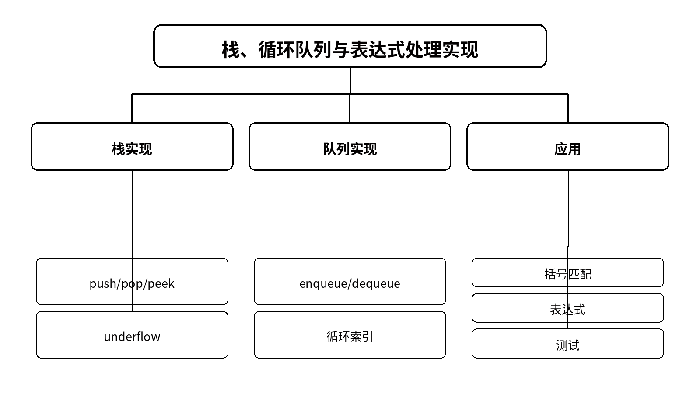 |
| 教学方法 | 实操演练法、任务驱动法、单元测试法、代码评审法 |
| 教学用具 | 电脑、VS Code或Jupyter、Python、pytest、教材 |
| 教学设计 | 课前任务→互动导入（5 min）→传授新知（80 min）→过关检测（8 min）→课堂小结（3 min）→作业布置（2 min）→考勤（2 min）；独立产物：stack_queue.py、test_stack_queue.py和一个括号匹配/表达式小程序；保留证据：pytest结果、边界测试清单、1次异常修复记录；考核关联：课程作业20%的栈队列部分；平时成绩20%的过程规范 |
| 参考文献 | 张玉华，吕强，朱晓旭，《数据结构（Python语言描述）（第2版·微课视频版）》[M]. 北京：清华大学出版社，2025。；李春葆，蒋林，李筱驰，《数据结构教程（Python语言描述）（第2版·微课视频版）》[M]. 北京：清华大学出版社，2025。 |

#### 教学目标

**知识目标：**
（1）理解栈与循环队列接口和异常语义。
（2）理解括号匹配/表达式处理如何映射到栈操作。
**能力目标：**
（1）能够独立实现Stack和CircularQueue并通过边界测试。
（2）能够使用栈完成括号匹配或后缀表达式求值。
**价值目标：**
（1）形成异常必须显式处理、测试必须覆盖空/满状态的习惯。
（2）形成代码结果可解释意识。

#### 课程思政

（1）通过“队空仍读取”“括号错误未报告”案例强调异常必须被识别并反馈，避免静默错误。
（2）结合本课测试、错误或工程案例，强调结果可复核、边界可说明、责任可追溯。

#### 专创融合

比较自实现Stack/Queue与collections.deque的接口和性能，讨论何时应使用标准库、何时应掌握底层实现。

#### 教学重难点

**教学重点：栈队列实现、循环下标、应用映射。**

**教学难点：正确区分队空/队满并让异常测试可复现。**

#### 教学过程

| 教学步骤 | 主要教学内容 | 设计意图 |
|---|---|---|
| 课前任务 | 【教师】1. 发布本课预习任务，明确教材对应主题与关键概念； 2. 提醒学生围绕“栈、循环队列与表达式处理实现”梳理至少1个疑问。 【学生】1. 阅读教材对应内容并记录关键词； 2. 准备上一次课相关代码/笔记，带着问题进入课堂。 | 通过预习建立必要前置概念，减少课堂机械抄录，把注意力集中到结构关系、算法过程和验证方法。 |
| 互动导入（5 min） | 【教师】1. 回顾上一课关键结论； 2. 用智能制造数据或代码错例引出“栈、循环队列与表达式处理实现”； 3. 追问学生本课需要解决的核心问题。 【学生】参与问答、观察案例，明确本次课任务与产物。 | 从已知问题进入新任务，建立知识连续性，同时把课程目标转化为可完成的课堂任务。 |
| 传授新知（共80 min） | **一、接口与异常约定** 【教师】给出Stack/CircularQueue验收条件，强调underflow/overflow处理。 【学生】先写接口和空/满测试，再补实现。  **二、编码与应用** 【教师】示范循环索引表达式和一个括号匹配输入输出，不给完整算法。 【学生】独立实现栈队列，并完成括号匹配或后缀求值。  **三、测试与代码评审** 【教师】提供含空串、错误嵌套、队满等边界样例。 【学生】运行pytest，交换代码检查接口一致性，修复至少一个问题。 【课堂强化】本课独立产物：stack_queue.py、test_stack_queue.py和一个括号匹配/表达式小程序。 【测试/复核】pytest结果、边界测试清单、1次异常修复记录。 | 按“概念/结构→算法或实现→测试/解释”的顺序推进，让学生在课堂中形成独立产物，并通过运行、图示或手工轨迹把教师讲解转化为自己的操作路径。 |
| 过关检测（8 min） | 【教师】布置课堂小测： 【现场检查】空栈pop应产生什么行为？ 【代码补全】补齐循环队列rear更新表达式。 【解释题】括号匹配为什么适合栈？ 【学生】独立作答或现场运行，同伴互查； 【教师】根据结果集中点评本课重难点和易错点。 | 即时检查概念、算法过程与实现边界，防止“听懂了但不会判断/不会写/不会测”。 |
| 课堂小结（3 min） | 【教师】简要总结： 1. 本次课解决的关键问题是“栈、循环队列与表达式处理实现”的结构与方法； 2. 需要重点掌握的主线是：结构关系→操作/算法→复杂度或边界→验证； 3. 最值得带走的方法是用测试或手工轨迹验证算法； 4. 需要警惕的易错点是：正确区分队空/队满并让异常测试可复现。 | 把零散知识重新组织为可迁移的方法主线，为后续结构和算法学习建立连接。 |
| 作业布置（2 min） | 【教师】布置课后任务： 1. 补充至少6个测试，包括空、满、单元素和错误表达式。 2. 预习迷宫搜索或任务调度的状态表示。 【要求】作业不只写结果，还要写关键思路、复杂度/边界或测试依据；代码类作业保留测试结果。 | 用课后任务巩固本课方法并为下一次课准备前置材料，使课程作业持续形成可检验的学习证据。 |
| 考勤（2 min） | 【教师】利用学习通/课堂点名完成签到，记录缺勤情况；不在教案中预填实际出勤结果。 | 掌握出勤情况并保障教学秩序，同时避免在课前编造实际考勤事实。 |

#### 教学反思

【教师】课后重点从以下方面进行教学反思：
1. 教学流程：本课“栈、循环队列与表达式处理实现”的导入是否把学生带入真实问题，100分钟推进是否由概念/模型逐步走向算法、实现或验证。
2. 教学内容：正确区分队空/队满并让异常测试可复现。是否讲清，学生是否停留在机械记忆或照抄代码。
3. 学生参与：课堂判断、编码、测试或解释是否参与均衡，是否存在“会听不会做”“会做不会说”，薄弱学生是否获得必要指导。
4. 教学改进：下一轮是否需要增加针对“栈、循环队列与表达式处理实现”的错例、动态图示、代码断点演示或测试对照。

### lesson-10

| 字段 | 内容 |
|---|---|
| 章节 | 上机二 第2讲 |
| 授课题目 | 递归/迭代搜索与生产任务调度 |
| 周次 | 第5周（第10次课） |
| 课时安排 | 2课时（100 min）；类型：上机2 |
| 知识脉络图 | 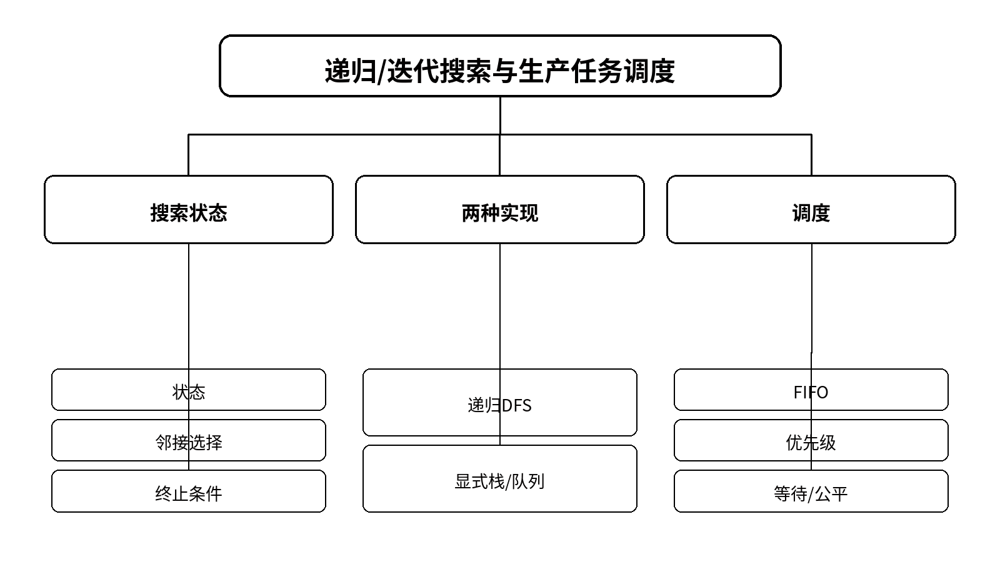 |
| 教学方法 | 任务驱动法、实操演练法、对比实验法、代码评审法 |
| 教学用具 | 电脑、Python、pytest、Matplotlib（可选）、教材 |
| 教学设计 | 课前任务→互动导入（5 min）→传授新知（80 min）→过关检测（8 min）→课堂小结（3 min）→作业布置（2 min）→考勤（2 min）；独立产物：search_demo.py或scheduler.py，以及递归/迭代或FIFO/优先级对比记录；保留证据：访问序列、测试用例、调度结果表和代码提交；考核关联：课程作业20%的栈队列/递归和综合任务证据 |
| 参考文献 | 张玉华，吕强，朱晓旭，《数据结构（Python语言描述）（第2版·微课视频版）》[M]. 北京：清华大学出版社，2025。；李春葆，蒋林，李筱驰，《数据结构教程（Python语言描述）（第2版·微课视频版）》[M]. 北京：清华大学出版社，2025。 |

#### 教学目标

**知识目标：**
（1）理解搜索问题的状态、候选动作和终止条件。
（2）理解任务队列中到达顺序与优先级的不同影响。
**能力目标：**
（1）能够用递归和显式结构实现同一搜索，并比较访问顺序。
（2）能够实现简化生产任务队列并验证排序/调度规则。
**价值目标：**
（1）形成终止性、可重复测试和公平调度意识。
（2）形成算法选择要说明业务规则的习惯。

#### 课程思政

（1）通过任务长期等待和搜索无终止条件案例强调公平、终止和资源占用责任。
（2）结合本课测试、错误或工程案例，强调结果可复核、边界可说明、责任可追溯。

#### 专创融合

鼓励学生改变调度策略并用等待时间/完成顺序解释改进，而不是只看“程序能运行”。

#### 教学重难点

**教学重点：搜索状态建模、递归/显式结构、调度规则。**

**教学难点：保持两种搜索实现的状态语义一致，并用测试证明访问顺序和终止性。**

#### 教学过程

| 教学步骤 | 主要教学内容 | 设计意图 |
|---|---|---|
| 课前任务 | 【教师】1. 发布本课预习任务，明确教材对应主题与关键概念； 2. 提醒学生围绕“递归/迭代搜索与生产任务调度”梳理至少1个疑问。 【学生】1. 阅读教材对应内容并记录关键词； 2. 准备上一次课相关代码/笔记，带着问题进入课堂。 | 通过预习建立必要前置概念，减少课堂机械抄录，把注意力集中到结构关系、算法过程和验证方法。 |
| 互动导入（5 min） | 【教师】1. 回顾上一课关键结论； 2. 用智能制造数据或代码错例引出“递归/迭代搜索与生产任务调度”； 3. 追问学生本课需要解决的核心问题。 【学生】参与问答、观察案例，明确本次课任务与产物。 | 从已知问题进入新任务，建立知识连续性，同时把课程目标转化为可完成的课堂任务。 |
| 传授新知（共80 min） | **一、状态模型** 【教师】给出迷宫或任务列表，要求明确状态、动作和终止条件。 【学生】先画状态/队列变化再编码。  **二、两种实现对比** 【教师】提示递归调用栈与显式stack/queue的对应关系。 【学生】实现两种搜索或两种调度策略，记录访问/完成顺序。  **三、测试与公平性分析** 【教师】加入无解迷宫、同优先级任务、长任务等边界。 【学生】完善测试，计算或观察等待/访问结果，写出策略适用条件。 【课堂强化】本课独立产物：search_demo.py或scheduler.py，以及递归/迭代或FIFO/优先级对比记录。 【测试/复核】访问序列、测试用例、调度结果表和代码提交。 | 按“概念/结构→算法或实现→测试/解释”的顺序推进，让学生在课堂中形成独立产物，并通过运行、图示或手工轨迹把教师讲解转化为自己的操作路径。 |
| 过关检测（8 min） | 【教师】布置课堂小测： 【判断题】递归DFS和显式栈DFS在邻接入栈顺序相同时应可得到对应访问次序。（ ） 【测试题】为“无路可达”补一个断言。 【口头题】优先级调度可能带来什么公平性问题？ 【学生】独立作答或现场运行，同伴互查； 【教师】根据结果集中点评本课重难点和易错点。 | 即时检查概念、算法过程与实现边界，防止“听懂了但不会判断/不会写/不会测”。 |
| 课堂小结（3 min） | 【教师】简要总结： 1. 本次课解决的关键问题是“递归/迭代搜索与生产任务调度”的结构与方法； 2. 需要重点掌握的主线是：结构关系→操作/算法→复杂度或边界→验证； 3. 最值得带走的方法是用测试或手工轨迹验证算法； 4. 需要警惕的易错点是：保持两种搜索实现的状态语义一致，并用测试证明访问顺序和终止性。 | 把零散知识重新组织为可迁移的方法主线，为后续结构和算法学习建立连接。 |
| 作业布置（2 min） | 【教师】布置课后任务： 1. 提交上机二完整代码与测试。 2. 预习树、结点、根/叶/高度与遍历。 【要求】作业不只写结果，还要写关键思路、复杂度/边界或测试依据；代码类作业保留测试结果。 | 用课后任务巩固本课方法并为下一次课准备前置材料，使课程作业持续形成可检验的学习证据。 |
| 考勤（2 min） | 【教师】利用学习通/课堂点名完成签到，记录缺勤情况；不在教案中预填实际出勤结果。 | 掌握出勤情况并保障教学秩序，同时避免在课前编造实际考勤事实。 |

#### 教学反思

【教师】课后重点从以下方面进行教学反思：
1. 教学流程：本课“递归/迭代搜索与生产任务调度”的导入是否把学生带入真实问题，100分钟推进是否由概念/模型逐步走向算法、实现或验证。
2. 教学内容：保持两种搜索实现的状态语义一致，并用测试证明访问顺序和终止性。是否讲清，学生是否停留在机械记忆或照抄代码。
3. 学生参与：课堂判断、编码、测试或解释是否参与均衡，是否存在“会听不会做”“会做不会说”，薄弱学生是否获得必要指导。
4. 教学改进：下一轮是否需要增加针对“递归/迭代搜索与生产任务调度”的错例、动态图示、代码断点演示或测试对照。

### lesson-11

| 字段 | 内容 |
|---|---|
| 章节 | 第4单元 第1讲 |
| 授课题目 | 树、二叉树与遍历：从层次关系到递归结构 |
| 周次 | 第6周（第11次课） |
| 课时安排 | 2课时（100 min）；类型：理论2 |
| 知识脉络图 | 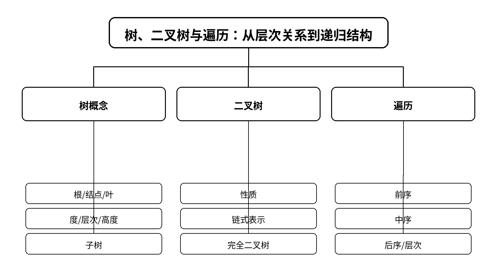 |
| 教学方法 | 讲授法、结构图示法、递归推演法、问答法、课堂检测法 |
| 教学用具 | 电脑、投影仪、多媒体课件、教材、Python、树结点卡片 |
| 教学设计 | 课前任务→互动导入（8 min）→传授新知（70 min）→过关检测（10 min）→课堂小结（5 min）→作业布置（5 min）→考勤（2 min）；独立产物：一棵二叉树的四种遍历序列和递归调用标注图；保留证据：遍历序列、递归跟踪表、课堂小测；考核关联：课程作业20%中的树；期末考试60%的树部分 |
| 参考文献 | 张玉华，吕强，朱晓旭，《数据结构（Python语言描述）（第2版·微课视频版）》[M]. 北京：清华大学出版社，2025。；李春葆，蒋林，李筱驰，《数据结构教程（Python语言描述）（第2版·微课视频版）》[M]. 北京：清华大学出版社，2025。 |

#### 教学目标

**知识目标：**
（1）掌握树和二叉树基本术语、性质和链式表示。
（2）掌握前中后序与层次遍历的访问规则。
**能力目标：**
（1）能够根据二叉树画出遍历序列，或由简单序列还原访问过程。
（2）能够说明递归遍历中“访问根”的位置。
**价值目标：**
（1）形成层次建模和结构化表达意识。
（2）形成用多种遍历视角理解同一结构的习惯。

#### 课程思政

（1）通过BOM层级错误导致装配和物料统计错误的案例，强调层次关系正确性和数据责任。
（2）结合本课测试、错误或工程案例，强调结果可复核、边界可说明、责任可追溯。

#### 专创融合

围绕BOM、组织层级、文件目录比较树模型，鼓励学生从查询需求选择遍历方式。

#### 教学重难点

**教学重点：树术语、二叉树性质、前中后序和层次遍历。**

**教学难点：把递归定义落实到具体访问顺序，并理解不同遍历的应用含义。**

#### 教学过程

| 教学步骤 | 主要教学内容 | 设计意图 |
|---|---|---|
| 课前任务 | 【教师】1. 发布本课预习任务，明确教材对应主题与关键概念； 2. 提醒学生围绕“树、二叉树与遍历：从层次关系到递归结构”梳理至少1个疑问。 【学生】1. 阅读教材对应内容并记录关键词； 2. 准备上一次课相关代码/笔记，带着问题进入课堂。 | 通过预习建立必要前置概念，减少课堂机械抄录，把注意力集中到结构关系、算法过程和验证方法。 |
| 互动导入（8 min） | 【教师】1. 回顾上一课关键结论； 2. 用智能制造数据或代码错例引出“树、二叉树与遍历：从层次关系到递归结构”； 3. 追问学生本课需要解决的核心问题。 【学生】参与问答、观察案例，明确本次课任务与产物。 | 从已知问题进入新任务，建立知识连续性，同时把课程目标转化为可完成的课堂任务。 |
| 传授新知（共70 min） | **一、树与二叉树基本概念** 【教师】以BOM为例讲根、父子、叶、层次、高度和子树。 【学生】为给定BOM树标出度、高度和叶结点。  **二、二叉树表示与性质** 【教师】讲左右孩子链式表示、满/完全二叉树概念和常用性质。 【学生】判断若干树是否为二叉树/完全二叉树并计算结点关系。  **三、四种遍历** 【教师】用“访问根的位置”统一讲前中后序，用队列说明层次遍历。 【学生】对同一二叉树独立写四种遍历序列并相互校验。 【课堂强化】本课独立产物：一棵二叉树的四种遍历序列和递归调用标注图。 【测试/复核】遍历序列、递归跟踪表、课堂小测。 | 按“概念/结构→算法或实现→测试/解释”的顺序推进，让学生在课堂中形成独立产物，并通过运行、图示或手工轨迹把教师讲解转化为自己的操作路径。 |
| 过关检测（10 min） | 【教师】布置课堂小测： 【选择题】中序遍历的根结点在何时访问？ 【判断题】层次遍历通常使用队列。（ ） 【简答题】同一棵树为什么需要多种遍历？ 【学生】独立作答或现场运行，同伴互查； 【教师】根据结果集中点评本课重难点和易错点。 | 即时检查概念、算法过程与实现边界，防止“听懂了但不会判断/不会写/不会测”。 |
| 课堂小结（5 min） | 【教师】简要总结： 1. 本次课解决的关键问题是“树、二叉树与遍历：从层次关系到递归结构”的结构与方法； 2. 需要重点掌握的主线是：结构关系→操作/算法→复杂度或边界→验证； 3. 最值得带走的方法是用测试或手工轨迹验证算法； 4. 需要警惕的易错点是：把递归定义落实到具体访问顺序，并理解不同遍历的应用含义。 | 把零散知识重新组织为可迁移的方法主线，为后续结构和算法学习建立连接。 |
| 作业布置（5 min） | 【教师】布置课后任务： 1. 写出递归前/中/后序伪代码并给同一棵树执行结果。 2. 预习BST和堆的有序性质。 【要求】作业不只写结果，还要写关键思路、复杂度/边界或测试依据；代码类作业保留测试结果。 | 用课后任务巩固本课方法并为下一次课准备前置材料，使课程作业持续形成可检验的学习证据。 |
| 考勤（2 min） | 【教师】利用学习通/课堂点名完成签到，记录缺勤情况；不在教案中预填实际出勤结果。 | 掌握出勤情况并保障教学秩序，同时避免在课前编造实际考勤事实。 |

#### 教学反思

【教师】课后重点从以下方面进行教学反思：
1. 教学流程：本课“树、二叉树与遍历：从层次关系到递归结构”的导入是否把学生带入真实问题，100分钟推进是否由概念/模型逐步走向算法、实现或验证。
2. 教学内容：把递归定义落实到具体访问顺序，并理解不同遍历的应用含义。是否讲清，学生是否停留在机械记忆或照抄代码。
3. 学生参与：课堂判断、编码、测试或解释是否参与均衡，是否存在“会听不会做”“会做不会说”，薄弱学生是否获得必要指导。
4. 教学改进：下一轮是否需要增加针对“树、二叉树与遍历：从层次关系到递归结构”的错例、动态图示、代码断点演示或测试对照。

### lesson-12

| 字段 | 内容 |
|---|---|
| 章节 | 第4单元 第2讲 |
| 授课题目 | 二叉搜索树、堆、哈夫曼与优先调度 |
| 周次 | 第6周（第12次课） |
| 课时安排 | 2课时（100 min）；类型：理论2 |
| 知识脉络图 | 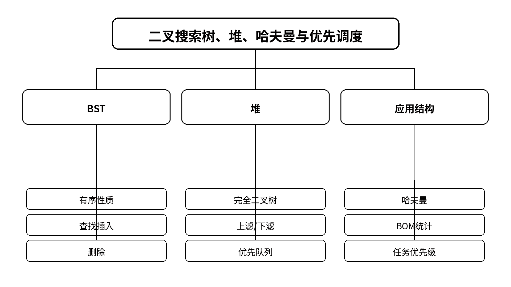 |
| 教学方法 | 讲授法、板书推演法、案例分析法、算法跟踪法、课堂检测法 |
| 教学用具 | 电脑、投影仪、多媒体课件、教材、Python、树/堆状态图 |
| 教学设计 | 课前任务→互动导入（8 min）→传授新知（70 min）→过关检测（10 min）→课堂小结（5 min）→作业布置（5 min）→考勤（2 min）；独立产物：BST操作轨迹+堆调整轨迹+一个结构选择说明；保留证据：操作轨迹、结构选择说明、课堂检测；考核关联：课程作业20%中的树堆；期末考试60%中的树与堆 |
| 参考文献 | 张玉华，吕强，朱晓旭，《数据结构（Python语言描述）（第2版·微课视频版）》[M]. 北京：清华大学出版社，2025。；李春葆，蒋林，李筱驰，《数据结构教程（Python语言描述）（第2版·微课视频版）》[M]. 北京：清华大学出版社，2025。 |

#### 教学目标

**知识目标：**
（1）掌握BST的有序性质及查找/插入/删除思想。
（2）掌握堆的结构性质、上滤/下滤和优先队列关系。
**能力目标：**
（1）能够手工执行BST插入/删除和堆调整。
（2）能够为优先任务调度选择合适堆结构。
**价值目标：**
（1）形成结构性质决定算法效率的意识。
（2）形成调度优先级透明和结果可复核意识。

#### 课程思政

（1）通过优先级配置错误导致关键维护任务延迟的案例，强调规则透明、数据正确和调度责任。
（2）结合本课测试、错误或工程案例，强调结果可复核、边界可说明、责任可追溯。

#### 专创融合

比较BST与堆针对“查找”“取最值”需求的优势，鼓励学生从业务操作频率选择结构。

#### 教学重难点

**教学重点：BST有序性质、堆性质、上滤/下滤。**

**教学难点：BST删除三类情况和堆调整中父子索引/交换逻辑。**

#### 教学过程

| 教学步骤 | 主要教学内容 | 设计意图 |
|---|---|---|
| 课前任务 | 【教师】1. 发布本课预习任务，明确教材对应主题与关键概念； 2. 提醒学生围绕“二叉搜索树、堆、哈夫曼与优先调度”梳理至少1个疑问。 【学生】1. 阅读教材对应内容并记录关键词； 2. 准备上一次课相关代码/笔记，带着问题进入课堂。 | 通过预习建立必要前置概念，减少课堂机械抄录，把注意力集中到结构关系、算法过程和验证方法。 |
| 互动导入（8 min） | 【教师】1. 回顾上一课关键结论； 2. 用智能制造数据或代码错例引出“二叉搜索树、堆、哈夫曼与优先调度”； 3. 追问学生本课需要解决的核心问题。 【学生】参与问答、观察案例，明确本次课任务与产物。 | 从已知问题进入新任务，建立知识连续性，同时把课程目标转化为可完成的课堂任务。 |
| 传授新知（共70 min） | **一、二叉搜索树** 【教师】推导左<根<右的有序性质，分查找、插入和删除三类情况。 【学生】按给定序列构造BST并执行两次删除。  **二、堆与优先队列** 【教师】讲完全二叉树数组表示、父子下标、上滤/下滤。 【学生】手工对数组执行一次push和pop后的堆调整。  **三、应用比较** 【教师】介绍哈夫曼思想和BOM/优先任务应用。 【学生】比较BST、堆和普通列表在三类需求中的适用性。 【课堂强化】本课独立产物：BST操作轨迹+堆调整轨迹+一个结构选择说明。 【测试/复核】操作轨迹、结构选择说明、课堂检测。 | 按“概念/结构→算法或实现→测试/解释”的顺序推进，让学生在课堂中形成独立产物，并通过运行、图示或手工轨迹把教师讲解转化为自己的操作路径。 |
| 过关检测（10 min） | 【教师】布置课堂小测： 【判断题】BST一定是平衡树。（ ） 【跟踪题】给定最小堆插入新值后的数组。 【简答题】为什么“频繁取最小值”更适合堆而不是BST的任意实现？ 【学生】独立作答或现场运行，同伴互查； 【教师】根据结果集中点评本课重难点和易错点。 | 即时检查概念、算法过程与实现边界，防止“听懂了但不会判断/不会写/不会测”。 |
| 课堂小结（5 min） | 【教师】简要总结： 1. 本次课解决的关键问题是“二叉搜索树、堆、哈夫曼与优先调度”的结构与方法； 2. 需要重点掌握的主线是：结构关系→操作/算法→复杂度或边界→验证； 3. 最值得带走的方法是用测试或手工轨迹验证算法； 4. 需要警惕的易错点是：BST删除三类情况和堆调整中父子索引/交换逻辑。 | 把零散知识重新组织为可迁移的方法主线，为后续结构和算法学习建立连接。 |
| 作业布置（5 min） | 【教师】布置课后任务： 1. 完成BST删除三种情况的图示。 2. 准备上机三：实现BinaryTree/BST/Heap基本骨架。 【要求】作业不只写结果，还要写关键思路、复杂度/边界或测试依据；代码类作业保留测试结果。 | 用课后任务巩固本课方法并为下一次课准备前置材料，使课程作业持续形成可检验的学习证据。 |
| 考勤（2 min） | 【教师】利用学习通/课堂点名完成签到，记录缺勤情况；不在教案中预填实际出勤结果。 | 掌握出勤情况并保障教学秩序，同时避免在课前编造实际考勤事实。 |

#### 教学反思

【教师】课后重点从以下方面进行教学反思：
1. 教学流程：本课“二叉搜索树、堆、哈夫曼与优先调度”的导入是否把学生带入真实问题，100分钟推进是否由概念/模型逐步走向算法、实现或验证。
2. 教学内容：BST删除三类情况和堆调整中父子索引/交换逻辑。是否讲清，学生是否停留在机械记忆或照抄代码。
3. 学生参与：课堂判断、编码、测试或解释是否参与均衡，是否存在“会听不会做”“会做不会说”，薄弱学生是否获得必要指导。
4. 教学改进：下一轮是否需要增加针对“二叉搜索树、堆、哈夫曼与优先调度”的错例、动态图示、代码断点演示或测试对照。

### lesson-13

| 字段 | 内容 |
|---|---|
| 章节 | 上机三 第1讲 |
| 授课题目 | 二叉树与BST实现、遍历和可视化 |
| 周次 | 第7周（第13次课） |
| 课时安排 | 2课时（100 min）；类型：上机2 |
| 知识脉络图 | 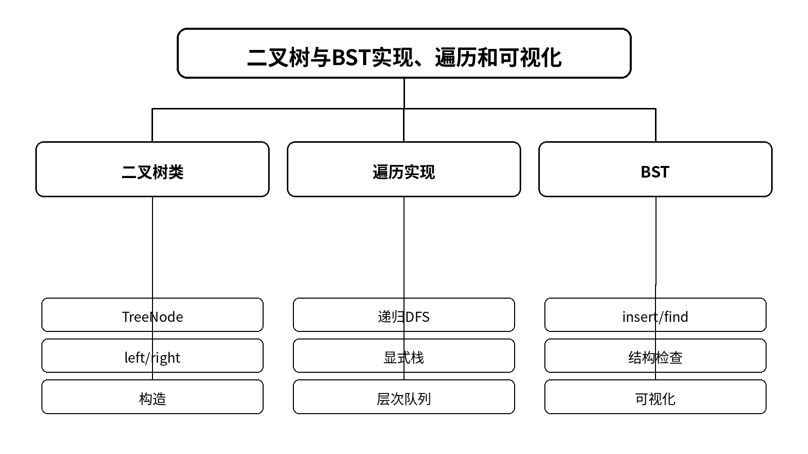 |
| 教学方法 | 实操演练法、任务驱动法、可视化验证法、代码评审法 |
| 教学用具 | 电脑、Python、pytest、Matplotlib/NetworkX（可选）、教材 |
| 教学设计 | 课前任务→互动导入（5 min）→传授新知（80 min）→过关检测（8 min）→课堂小结（3 min）→作业布置（2 min）→考勤（2 min）；独立产物：binary_tree.py、test_tree.py和一幅树结构可视化；保留证据：测试结果、遍历序列、可视化图、结构不变量断言；考核关联：课程作业20%的树部分；平时成绩20%的代码规范 |
| 参考文献 | 张玉华，吕强，朱晓旭，《数据结构（Python语言描述）（第2版·微课视频版）》[M]. 北京：清华大学出版社，2025。；李春葆，蒋林，李筱驰，《数据结构教程（Python语言描述）（第2版·微课视频版）》[M]. 北京：清华大学出版社，2025。 |

#### 教学目标

**知识目标：**
（1）理解TreeNode与BinaryTree/BST类的职责划分。
（2）理解递归/非递归遍历和层次遍历对应的数据结构。
**能力目标：**
（1）能够实现前中后序和层次遍历。
（2）能够实现BST插入/查找并用测试验证有序性。
**价值目标：**
（1）形成结构不变量、递归边界和可视化复核意识。
（2）形成代码与图形一致性检查习惯。

#### 课程思政

（1）通过“遍历结果看似正确但结构已经断链”的案例强调结构测试不能只看单个输出。
（2）结合本课测试、错误或工程案例，强调结果可复核、边界可说明、责任可追溯。

#### 专创融合

比较递归和显式栈遍历实现，鼓励用可读性、栈深度和调试难度评价方案。

#### 教学重难点

**教学重点：树类实现、四种遍历、BST有序性测试。**

**教学难点：递归边界、显式栈状态和BST结构不变量的自动检查。**

#### 教学过程

| 教学步骤 | 主要教学内容 | 设计意图 |
|---|---|---|
| 课前任务 | 【教师】1. 发布本课预习任务，明确教材对应主题与关键概念； 2. 提醒学生围绕“二叉树与BST实现、遍历和可视化”梳理至少1个疑问。 【学生】1. 阅读教材对应内容并记录关键词； 2. 准备上一次课相关代码/笔记，带着问题进入课堂。 | 通过预习建立必要前置概念，减少课堂机械抄录，把注意力集中到结构关系、算法过程和验证方法。 |
| 互动导入（5 min） | 【教师】1. 回顾上一课关键结论； 2. 用智能制造数据或代码错例引出“二叉树与BST实现、遍历和可视化”； 3. 追问学生本课需要解决的核心问题。 【学生】参与问答、观察案例，明确本次课任务与产物。 | 从已知问题进入新任务，建立知识连续性，同时把课程目标转化为可完成的课堂任务。 |
| 传授新知（共80 min） | **一、树类与测试** 【教师】给出TreeNode最小结构和验收树，不提供遍历实现。 【学生】建立类、构造固定树并写预期遍历序列测试。  **二、遍历与BST实现** 【教师】巡回追问“根何时访问”“显式栈保存什么”。 【学生】实现递归/非递归遍历及BST insert/find，逐项运行测试。  **三、可视化复核** 【教师】示范从结点边关系绘图，提醒图形只作验证不替代测试。 【学生】生成树图，对照遍历和BST有序性，修复差异。 【课堂强化】本课独立产物：binary_tree.py、test_tree.py和一幅树结构可视化。 【测试/复核】测试结果、遍历序列、可视化图、结构不变量断言。 | 按“概念/结构→算法或实现→测试/解释”的顺序推进，让学生在课堂中形成独立产物，并通过运行、图示或手工轨迹把教师讲解转化为自己的操作路径。 |
| 过关检测（8 min） | 【教师】布置课堂小测： 【现场题】中序遍历BST应满足什么性质？ 【代码题】为层次遍历补一个空树测试。 【解释题】为什么可视化不能替代pytest？ 【学生】独立作答或现场运行，同伴互查； 【教师】根据结果集中点评本课重难点和易错点。 | 即时检查概念、算法过程与实现边界，防止“听懂了但不会判断/不会写/不会测”。 |
| 课堂小结（3 min） | 【教师】简要总结： 1. 本次课解决的关键问题是“二叉树与BST实现、遍历和可视化”的结构与方法； 2. 需要重点掌握的主线是：结构关系→操作/算法→复杂度或边界→验证； 3. 最值得带走的方法是用测试或手工轨迹验证算法； 4. 需要警惕的易错点是：递归边界、显式栈状态和BST结构不变量的自动检查。 | 把零散知识重新组织为可迁移的方法主线，为后续结构和算法学习建立连接。 |
| 作业布置（2 min） | 【教师】布置课后任务： 1. 完善BST删除或增加contains方法，并补充退化树测试。 2. 预习heapq接口与手工堆实现区别。 【要求】作业不只写结果，还要写关键思路、复杂度/边界或测试依据；代码类作业保留测试结果。 | 用课后任务巩固本课方法并为下一次课准备前置材料，使课程作业持续形成可检验的学习证据。 |
| 考勤（2 min） | 【教师】利用学习通/课堂点名完成签到，记录缺勤情况；不在教案中预填实际出勤结果。 | 掌握出勤情况并保障教学秩序，同时避免在课前编造实际考勤事实。 |

#### 教学反思

【教师】课后重点从以下方面进行教学反思：
1. 教学流程：本课“二叉树与BST实现、遍历和可视化”的导入是否把学生带入真实问题，100分钟推进是否由概念/模型逐步走向算法、实现或验证。
2. 教学内容：递归边界、显式栈状态和BST结构不变量的自动检查。是否讲清，学生是否停留在机械记忆或照抄代码。
3. 学生参与：课堂判断、编码、测试或解释是否参与均衡，是否存在“会听不会做”“会做不会说”，薄弱学生是否获得必要指导。
4. 教学改进：下一轮是否需要增加针对“二叉树与BST实现、遍历和可视化”的错例、动态图示、代码断点演示或测试对照。

### lesson-14

| 字段 | 内容 |
|---|---|
| 章节 | 上机三 第2讲 |
| 授课题目 | 堆、优先任务与BOM层次应用 |
| 周次 | 第7周（第14次课） |
| 课时安排 | 2课时（100 min）；类型：上机2 |
| 知识脉络图 | 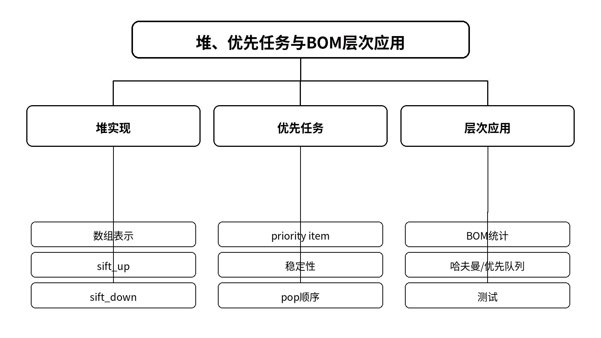 |
| 教学方法 | 实操演练法、对比实验法、测试驱动法、代码评审法 |
| 教学用具 | 电脑、Python、pytest、heapq、教材 |
| 教学设计 | 课前任务→互动导入（5 min）→传授新知（80 min）→过关检测（8 min）→课堂小结（3 min）→作业布置（2 min）→考勤（2 min）；独立产物：heap_task.py或bom_tree.py，含测试和结果说明；保留证据：堆性质断言、任务出队序列/BOM统计、代码提交与评审意见；考核关联：课程作业20%的树堆和综合任务证据 |
| 参考文献 | 张玉华，吕强，朱晓旭，《数据结构（Python语言描述）（第2版·微课视频版）》[M]. 北京：清华大学出版社，2025。；李春葆，蒋林，李筱驰，《数据结构教程（Python语言描述）（第2版·微课视频版）》[M]. 北京：清华大学出版社，2025。 |

#### 教学目标

**知识目标：**
（1）理解手工堆实现与heapq接口的关系。
（2）理解优先任务中优先级、到达顺序和稳定性的影响。
**能力目标：**
（1）能够实现最小堆核心调整或封装优先队列。
（2）能够完成BOM层次统计/优先任务调度并验证结果。
**价值目标：**
（1）形成优先级规则透明、测试可追溯和资源权衡意识。
（2）形成“库可用但原理仍要会”的学习习惯。

#### 课程思政

（1）通过同优先级任务顺序不稳定导致业务争议的案例强调规则定义和验收标准必须明确。
（2）结合本课测试、错误或工程案例，强调结果可复核、边界可说明、责任可追溯。

#### 专创融合

比较自实现Heap和heapq方案，引导从教育目的、工程可靠性和维护成本判断何时自主实现、何时复用库。

#### 教学重难点

**教学重点：sift_up/sift_down、优先队列、BOM/任务应用。**

**教学难点：堆调整下标与循环终止，以及同优先级任务的稳定性处理。**

#### 教学过程

| 教学步骤 | 主要教学内容 | 设计意图 |
|---|---|---|
| 课前任务 | 【教师】1. 发布本课预习任务，明确教材对应主题与关键概念； 2. 提醒学生围绕“堆、优先任务与BOM层次应用”梳理至少1个疑问。 【学生】1. 阅读教材对应内容并记录关键词； 2. 准备上一次课相关代码/笔记，带着问题进入课堂。 | 通过预习建立必要前置概念，减少课堂机械抄录，把注意力集中到结构关系、算法过程和验证方法。 |
| 互动导入（5 min） | 【教师】1. 回顾上一课关键结论； 2. 用智能制造数据或代码错例引出“堆、优先任务与BOM层次应用”； 3. 追问学生本课需要解决的核心问题。 【学生】参与问答、观察案例，明确本次课任务与产物。 | 从已知问题进入新任务，建立知识连续性，同时把课程目标转化为可完成的课堂任务。 |
| 传授新知（共80 min） | **一、手工堆调整** 【教师】给出数组和父子下标关系，要求先写is_heap检查。 【学生】实现sift_up/sift_down并用随机数组测试堆性质。  **二、优先任务/BOM应用** 【教师】给出带优先级、时间戳的任务数据或BOM层次数据。 【学生】选择优先队列或树方案完成任务，并输出可核验结果。  **三、库实现对照** 【教师】演示heapq接口，指出其与手工实现的共同不变量。 【学生】用heapq复核同一输入，解释差异并记录适用边界。 【课堂强化】本课独立产物：heap_task.py或bom_tree.py，含测试和结果说明。 【测试/复核】堆性质断言、任务出队序列/BOM统计、代码提交与评审意见。 | 按“概念/结构→算法或实现→测试/解释”的顺序推进，让学生在课堂中形成独立产物，并通过运行、图示或手工轨迹把教师讲解转化为自己的操作路径。 |
| 过关检测（8 min） | 【教师】布置课堂小测： 【判断题】最小堆的中序遍历一定递增。（ ） 【测试题】随机生成100组数据验证根结点最小。 【口头题】同优先级任务如何保证先到先处理？ 【学生】独立作答或现场运行，同伴互查； 【教师】根据结果集中点评本课重难点和易错点。 | 即时检查概念、算法过程与实现边界，防止“听懂了但不会判断/不会写/不会测”。 |
| 课堂小结（3 min） | 【教师】简要总结： 1. 本次课解决的关键问题是“堆、优先任务与BOM层次应用”的结构与方法； 2. 需要重点掌握的主线是：结构关系→操作/算法→复杂度或边界→验证； 3. 最值得带走的方法是用测试或手工轨迹验证算法； 4. 需要警惕的易错点是：堆调整下标与循环终止，以及同优先级任务的稳定性处理。 | 把零散知识重新组织为可迁移的方法主线，为后续结构和算法学习建立连接。 |
| 作业布置（2 min） | 【教师】布置课后任务： 1. 提交上机三完整代码、测试与说明。 2. 预习图的顶点、边、度、路径、邻接矩阵和邻接表。 【要求】作业不只写结果，还要写关键思路、复杂度/边界或测试依据；代码类作业保留测试结果。 | 用课后任务巩固本课方法并为下一次课准备前置材料，使课程作业持续形成可检验的学习证据。 |
| 考勤（2 min） | 【教师】利用学习通/课堂点名完成签到，记录缺勤情况；不在教案中预填实际出勤结果。 | 掌握出勤情况并保障教学秩序，同时避免在课前编造实际考勤事实。 |

#### 教学反思

【教师】课后重点从以下方面进行教学反思：
1. 教学流程：本课“堆、优先任务与BOM层次应用”的导入是否把学生带入真实问题，100分钟推进是否由概念/模型逐步走向算法、实现或验证。
2. 教学内容：堆调整下标与循环终止，以及同优先级任务的稳定性处理。是否讲清，学生是否停留在机械记忆或照抄代码。
3. 学生参与：课堂判断、编码、测试或解释是否参与均衡，是否存在“会听不会做”“会做不会说”，薄弱学生是否获得必要指导。
4. 教学改进：下一轮是否需要增加针对“堆、优先任务与BOM层次应用”的错例、动态图示、代码断点演示或测试对照。

### lesson-15

| 字段 | 内容 |
|---|---|
| 章节 | 第5单元 第1讲 |
| 授课题目 | 图的表示、DFS与BFS |
| 周次 | 第8周（第15次课） |
| 课时安排 | 2课时（100 min）；类型：理论2 |
| 知识脉络图 | 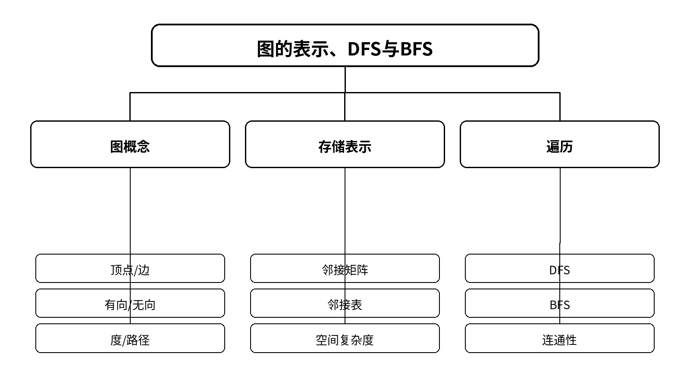 |
| 教学方法 | 讲授法、图示推演法、算法跟踪法、案例分析法、课堂检测法 |
| 教学用具 | 电脑、投影仪、多媒体课件、教材、Python、图模型卡片 |
| 教学设计 | 课前任务→互动导入（8 min）→传授新知（70 min）→过关检测（10 min）→课堂小结（5 min）→作业布置（5 min）→考勤（2 min）；独立产物：一个设备网络的邻接表以及DFS/BFS访问轨迹；保留证据：邻接表、visited变化表、课堂检测结果；考核关联：课程作业20%的图算法；期末考试60%的图部分 |
| 参考文献 | 张玉华，吕强，朱晓旭，《数据结构（Python语言描述）（第2版·微课视频版）》[M]. 北京：清华大学出版社，2025。；李春葆，蒋林，李筱驰，《数据结构教程（Python语言描述）（第2版·微课视频版）》[M]. 北京：清华大学出版社，2025。 |

#### 教学目标

**知识目标：**
（1）掌握图的基本术语、邻接矩阵和邻接表。
（2）掌握DFS/BFS基本思想和访问标记作用。
**能力目标：**
（1）能够根据图规模和稀疏性选择存储结构。
（2）能够手工跟踪DFS/BFS访问顺序和visited变化。
**价值目标：**
（1）形成网络化系统、可达性和遍历边界意识。
（2）形成图算法结果与邻接顺序相关的规范表达习惯。

#### 课程思政

（1）通过设备网络中“不可达节点被忽略”的案例强调连通性检查和故障传播分析的重要性。
（2）结合本课测试、错误或工程案例，强调结果可复核、边界可说明、责任可追溯。

#### 专创融合

比较邻接矩阵与邻接表在设备网络、工艺路线中的空间与操作差异，鼓励从数据稀疏性选择结构。

#### 教学重难点

**教学重点：图表示、DFS/BFS、visited。**

**教学难点：理解遍历顺序依赖邻接顺序，并保证含环图不会重复访问。**

#### 教学过程

| 教学步骤 | 主要教学内容 | 设计意图 |
|---|---|---|
| 课前任务 | 【教师】1. 发布本课预习任务，明确教材对应主题与关键概念； 2. 提醒学生围绕“图的表示、DFS与BFS”梳理至少1个疑问。 【学生】1. 阅读教材对应内容并记录关键词； 2. 准备上一次课相关代码/笔记，带着问题进入课堂。 | 通过预习建立必要前置概念，减少课堂机械抄录，把注意力集中到结构关系、算法过程和验证方法。 |
| 互动导入（8 min） | 【教师】1. 回顾上一课关键结论； 2. 用智能制造数据或代码错例引出“图的表示、DFS与BFS”； 3. 追问学生本课需要解决的核心问题。 【学生】参与问答、观察案例，明确本次课任务与产物。 | 从已知问题进入新任务，建立知识连续性，同时把课程目标转化为可完成的课堂任务。 |
| 传授新知（共70 min） | **一、图与存储结构** 【教师】用设备互联图讲顶点、边、度和路径，比较矩阵/邻接表空间。 【学生】把给定网络分别写成矩阵和邻接表。  **二、深度优先DFS** 【教师】从递归/显式栈角度讲DFS，强调visited防环。 【学生】手工跟踪一个含环图的DFS访问和回溯。  **三、广度优先BFS** 【教师】用队列说明按层扩展。 【学生】跟踪BFS队列变化并比较DFS/BFS适用问题。 【课堂强化】本课独立产物：一个设备网络的邻接表以及DFS/BFS访问轨迹。 【测试/复核】邻接表、visited变化表、课堂检测结果。 | 按“概念/结构→算法或实现→测试/解释”的顺序推进，让学生在课堂中形成独立产物，并通过运行、图示或手工轨迹把教师讲解转化为自己的操作路径。 |
| 过关检测（10 min） | 【教师】布置课堂小测： 【选择题】稀疏图通常更适合哪种表示？ 【判断题】含环图遍历可以不使用visited。（ ） 【简答题】BFS为什么适合无权图最少边数路径？ 【学生】独立作答或现场运行，同伴互查； 【教师】根据结果集中点评本课重难点和易错点。 | 即时检查概念、算法过程与实现边界，防止“听懂了但不会判断/不会写/不会测”。 |
| 课堂小结（5 min） | 【教师】简要总结： 1. 本次课解决的关键问题是“图的表示、DFS与BFS”的结构与方法； 2. 需要重点掌握的主线是：结构关系→操作/算法→复杂度或边界→验证； 3. 最值得带走的方法是用测试或手工轨迹验证算法； 4. 需要警惕的易错点是：理解遍历顺序依赖邻接顺序，并保证含环图不会重复访问。 | 把零散知识重新组织为可迁移的方法主线，为后续结构和算法学习建立连接。 |
| 作业布置（5 min） | 【教师】布置课后任务： 1. 为给定设备图写邻接表、DFS、BFS手工结果。 2. 预习Dijkstra的“已确定/未确定”集合思想。 【要求】作业不只写结果，还要写关键思路、复杂度/边界或测试依据；代码类作业保留测试结果。 | 用课后任务巩固本课方法并为下一次课准备前置材料，使课程作业持续形成可检验的学习证据。 |
| 考勤（2 min） | 【教师】利用学习通/课堂点名完成签到，记录缺勤情况；不在教案中预填实际出勤结果。 | 掌握出勤情况并保障教学秩序，同时避免在课前编造实际考勤事实。 |

#### 教学反思

【教师】课后重点从以下方面进行教学反思：
1. 教学流程：本课“图的表示、DFS与BFS”的导入是否把学生带入真实问题，100分钟推进是否由概念/模型逐步走向算法、实现或验证。
2. 教学内容：理解遍历顺序依赖邻接顺序，并保证含环图不会重复访问。是否讲清，学生是否停留在机械记忆或照抄代码。
3. 学生参与：课堂判断、编码、测试或解释是否参与均衡，是否存在“会听不会做”“会做不会说”，薄弱学生是否获得必要指导。
4. 教学改进：下一轮是否需要增加针对“图的表示、DFS与BFS”的错例、动态图示、代码断点演示或测试对照。

### lesson-16

| 字段 | 内容 |
|---|---|
| 章节 | 第5单元 第2讲 |
| 授课题目 | Dijkstra最短路径与图算法应用 |
| 周次 | 第8周（第16次课） |
| 课时安排 | 2课时（100 min）；类型：理论2 |
| 知识脉络图 | 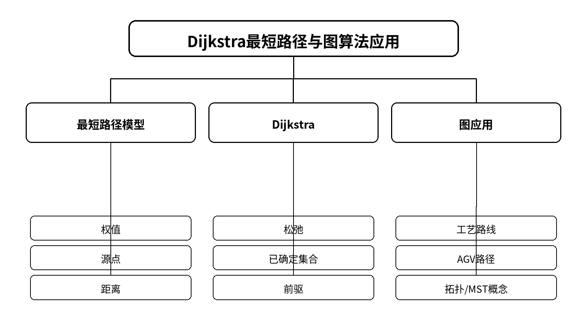 |
| 教学方法 | 讲授法、板书推演法、案例分析法、算法跟踪法、课堂检测法 |
| 教学用具 | 电脑、投影仪、多媒体课件、教材、Python、加权图示例 |
| 教学设计 | 课前任务→互动导入（8 min）→传授新知（70 min）→过关检测（10 min）→课堂小结（5 min）→作业布置（5 min）→考勤（2 min）；独立产物：Dijkstra手工执行表和一份路径适用条件说明；保留证据：dist/predecessor表、路径恢复结果、前提条件判断；考核关联：课程作业20%的图与路径；期末考试60%的图算法 |
| 参考文献 | 张玉华，吕强，朱晓旭，《数据结构（Python语言描述）（第2版·微课视频版）》[M]. 北京：清华大学出版社，2025。；李春葆，蒋林，李筱驰，《数据结构教程（Python语言描述）（第2版·微课视频版）》[M]. 北京：清华大学出版社，2025。 |

#### 教学目标

**知识目标：**
（1）掌握Dijkstra的非负权最短路径思想和松弛过程。
（2）了解拓扑排序和最小生成树的应用边界。
**能力目标：**
（1）能够手工执行Dijkstra并得到dist/predecessor表。
（2）能够判断一个路径问题是否满足Dijkstra使用条件。
**价值目标：**
（1）形成算法前提条件和路径安全验证意识。
（2）形成不把“最短”简单等同于“最安全/最优”的系统观。

#### 课程思政

（1）通过AGV路径虽短但穿越高风险区域的案例，强调数学最优与工程约束需要共同考虑。
（2）结合本课测试、错误或工程案例，强调结果可复核、边界可说明、责任可追溯。

#### 专创融合

让学生尝试给边权加入距离、拥堵或风险成本，比较路径变化，理解模型定义本身就是设计决策。

#### 教学重难点

**教学重点：Dijkstra松弛、dist/predecessor、非负权前提。**

**教学难点：区分“当前最小暂定距离”与“最终确定距离”，并从前驱恢复路径。**

#### 教学过程

| 教学步骤 | 主要教学内容 | 设计意图 |
|---|---|---|
| 课前任务 | 【教师】1. 发布本课预习任务，明确教材对应主题与关键概念； 2. 提醒学生围绕“Dijkstra最短路径与图算法应用”梳理至少1个疑问。 【学生】1. 阅读教材对应内容并记录关键词； 2. 准备上一次课相关代码/笔记，带着问题进入课堂。 | 通过预习建立必要前置概念，减少课堂机械抄录，把注意力集中到结构关系、算法过程和验证方法。 |
| 互动导入（8 min） | 【教师】1. 回顾上一课关键结论； 2. 用智能制造数据或代码错例引出“Dijkstra最短路径与图算法应用”； 3. 追问学生本课需要解决的核心问题。 【学生】参与问答、观察案例，明确本次课任务与产物。 | 从已知问题进入新任务，建立知识连续性，同时把课程目标转化为可完成的课堂任务。 |
| 传授新知（共70 min） | **一、最短路径问题** 【教师】定义带权图、源点和距离，说明BFS与加权路径差异。 【学生】判断三个路径场景是否可以用BFS。  **二、Dijkstra逐步执行** 【教师】按“选最小—确定—松弛”推演。 【学生】完成给定图的dist、predecessor更新表并恢复目标路径。  **三、应用与边界** 【教师】说明负权限制、拓扑和MST概念及智能制造路线应用。 【学生】为AGV路径增加风险权重，讨论最短与最安全的差异。 【课堂强化】本课独立产物：Dijkstra手工执行表和一份路径适用条件说明。 【测试/复核】dist/predecessor表、路径恢复结果、前提条件判断。 | 按“概念/结构→算法或实现→测试/解释”的顺序推进，让学生在课堂中形成独立产物，并通过运行、图示或手工轨迹把教师讲解转化为自己的操作路径。 |
| 过关检测（10 min） | 【教师】布置课堂小测： 【判断题】Dijkstra可直接处理负权边。（ ） 【跟踪题】完成一次松弛后的dist表。 【简答题】为什么最短路径不一定是现场最优路径？ 【学生】独立作答或现场运行，同伴互查； 【教师】根据结果集中点评本课重难点和易错点。 | 即时检查概念、算法过程与实现边界，防止“听懂了但不会判断/不会写/不会测”。 |
| 课堂小结（5 min） | 【教师】简要总结： 1. 本次课解决的关键问题是“Dijkstra最短路径与图算法应用”的结构与方法； 2. 需要重点掌握的主线是：结构关系→操作/算法→复杂度或边界→验证； 3. 最值得带走的方法是用测试或手工轨迹验证算法； 4. 需要警惕的易错点是：区分“当前最小暂定距离”与“最终确定距离”，并从前驱恢复路径。 | 把零散知识重新组织为可迁移的方法主线，为后续结构和算法学习建立连接。 |
| 作业布置（5 min） | 【教师】布置课后任务： 1. 完成一个6顶点加权图的Dijkstra全过程。 2. 预习顺序查找、二分查找和散列函数。 【要求】作业不只写结果，还要写关键思路、复杂度/边界或测试依据；代码类作业保留测试结果。 | 用课后任务巩固本课方法并为下一次课准备前置材料，使课程作业持续形成可检验的学习证据。 |
| 考勤（2 min） | 【教师】利用学习通/课堂点名完成签到，记录缺勤情况；不在教案中预填实际出勤结果。 | 掌握出勤情况并保障教学秩序，同时避免在课前编造实际考勤事实。 |

#### 教学反思

【教师】课后重点从以下方面进行教学反思：
1. 教学流程：本课“Dijkstra最短路径与图算法应用”的导入是否把学生带入真实问题，100分钟推进是否由概念/模型逐步走向算法、实现或验证。
2. 教学内容：区分“当前最小暂定距离”与“最终确定距离”，并从前驱恢复路径。是否讲清，学生是否停留在机械记忆或照抄代码。
3. 学生参与：课堂判断、编码、测试或解释是否参与均衡，是否存在“会听不会做”“会做不会说”，薄弱学生是否获得必要指导。
4. 教学改进：下一轮是否需要增加针对“Dijkstra最短路径与图算法应用”的错例、动态图示、代码断点演示或测试对照。

### lesson-17

| 字段 | 内容 |
|---|---|
| 章节 | 第6单元 第1讲 |
| 授课题目 | 查找、二分与散列：从索引到冲突处理 |
| 周次 | 第9周（第17次课） |
| 课时安排 | 2课时（100 min）；类型：理论2 |
| 知识脉络图 | 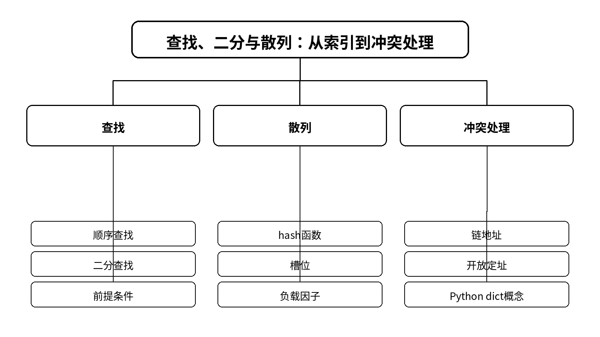 |
| 教学方法 | 讲授法、算法推演法、案例分析法、代码阅读法、课堂检测法 |
| 教学用具 | 电脑、投影仪、多媒体课件、教材、Python、散列表槽位图 |
| 教学设计 | 课前任务→互动导入（8 min）→传授新知（70 min）→过关检测（10 min）→课堂小结（5 min）→作业布置（5 min）→考勤（2 min）；独立产物：二分查找过程表+一个简化散列表冲突示意；保留证据：查找步骤、冲突处理结果、课堂检测；考核关联：课程作业20%的查找散列；期末考试60%的查找散列 |
| 参考文献 | 张玉华，吕强，朱晓旭，《数据结构（Python语言描述）（第2版·微课视频版）》[M]. 北京：清华大学出版社，2025。；李春葆，蒋林，李筱驰，《数据结构教程（Python语言描述）（第2版·微课视频版）》[M]. 北京：清华大学出版社，2025。 |

#### 教学目标

**知识目标：**
（1）掌握顺序查找和二分查找的适用条件与复杂度。
（2）掌握散列函数、冲突和常见处理方法。
**能力目标：**
（1）能够根据数据是否有序选择查找方法。
（2）能够设计简单散列表并分析负载因子和冲突。
**价值目标：**
（1）形成“先检查前提条件再套算法”的习惯。
（2）形成负责任使用Python dict等库的意识。

#### 课程思政

（1）通过备件索引错误导致查找失败的案例强调索引规则、数据唯一性和验证责任。
（2）结合本课测试、错误或工程案例，强调结果可复核、边界可说明、责任可追溯。

#### 专创融合

比较排序后二分、哈希和直接扫描在不同数据规模/更新频率下的总成本，鼓励从全生命周期选择方案。

#### 教学重难点

**教学重点：二分前提、散列映射、冲突处理。**

**教学难点：理解散列的平均复杂度依赖散列质量与负载，不是“永远O(1)”。**

#### 教学过程

| 教学步骤 | 主要教学内容 | 设计意图 |
|---|---|---|
| 课前任务 | 【教师】1. 发布本课预习任务，明确教材对应主题与关键概念； 2. 提醒学生围绕“查找、二分与散列：从索引到冲突处理”梳理至少1个疑问。 【学生】1. 阅读教材对应内容并记录关键词； 2. 准备上一次课相关代码/笔记，带着问题进入课堂。 | 通过预习建立必要前置概念，减少课堂机械抄录，把注意力集中到结构关系、算法过程和验证方法。 |
| 互动导入（8 min） | 【教师】1. 回顾上一课关键结论； 2. 用智能制造数据或代码错例引出“查找、二分与散列：从索引到冲突处理”； 3. 追问学生本课需要解决的核心问题。 【学生】参与问答、观察案例，明确本次课任务与产物。 | 从已知问题进入新任务，建立知识连续性，同时把课程目标转化为可完成的课堂任务。 |
| 传授新知（共70 min） | **一、顺序与二分查找** 【教师】对比无序/有序数据，推导二分区间收缩和O(log n)。 【学生】手工执行二分，记录low/mid/high。  **二、散列函数与槽位** 【教师】用设备编号映射讲hash、槽位和负载因子。 【学生】对一组键计算简单散列并统计冲突。  **三、冲突处理与Python dict** 【教师】讲链地址/开放定址思想，说明dict作为工程库但不能替代原理学习。 【学生】比较两种冲突处理的查找路径和适用性。 【课堂强化】本课独立产物：二分查找过程表+一个简化散列表冲突示意。 【测试/复核】查找步骤、冲突处理结果、课堂检测。 | 按“概念/结构→算法或实现→测试/解释”的顺序推进，让学生在课堂中形成独立产物，并通过运行、图示或手工轨迹把教师讲解转化为自己的操作路径。 |
| 过关检测（10 min） | 【教师】布置课堂小测： 【判断题】二分查找可以直接用于任意无序列表。（ ） 【计算题】按给定hash函数放置5个键。 【简答题】为什么哈希平均O(1)不代表最坏O(1)？ 【学生】独立作答或现场运行，同伴互查； 【教师】根据结果集中点评本课重难点和易错点。 | 即时检查概念、算法过程与实现边界，防止“听懂了但不会判断/不会写/不会测”。 |
| 课堂小结（5 min） | 【教师】简要总结： 1. 本次课解决的关键问题是“查找、二分与散列：从索引到冲突处理”的结构与方法； 2. 需要重点掌握的主线是：结构关系→操作/算法→复杂度或边界→验证； 3. 最值得带走的方法是用测试或手工轨迹验证算法； 4. 需要警惕的易错点是：理解散列的平均复杂度依赖散列质量与负载，不是“永远O(1)”。 | 把零散知识重新组织为可迁移的方法主线，为后续结构和算法学习建立连接。 |
| 作业布置（5 min） | 【教师】布置课后任务： 1. 写出迭代二分查找Python代码并列出边界测试。 2. 预习稳定排序、原地排序和常见排序过程。 【要求】作业不只写结果，还要写关键思路、复杂度/边界或测试依据；代码类作业保留测试结果。 | 用课后任务巩固本课方法并为下一次课准备前置材料，使课程作业持续形成可检验的学习证据。 |
| 考勤（2 min） | 【教师】利用学习通/课堂点名完成签到，记录缺勤情况；不在教案中预填实际出勤结果。 | 掌握出勤情况并保障教学秩序，同时避免在课前编造实际考勤事实。 |

#### 教学反思

【教师】课后重点从以下方面进行教学反思：
1. 教学流程：本课“查找、二分与散列：从索引到冲突处理”的导入是否把学生带入真实问题，100分钟推进是否由概念/模型逐步走向算法、实现或验证。
2. 教学内容：理解散列的平均复杂度依赖散列质量与负载，不是“永远O(1)”。是否讲清，学生是否停留在机械记忆或照抄代码。
3. 学生参与：课堂判断、编码、测试或解释是否参与均衡，是否存在“会听不会做”“会做不会说”，薄弱学生是否获得必要指导。
4. 教学改进：下一轮是否需要增加针对“查找、二分与散列：从索引到冲突处理”的错例、动态图示、代码断点演示或测试对照。

### lesson-18

| 字段 | 内容 |
|---|---|
| 章节 | 第6单元 第2讲 |
| 授课题目 | 排序算法、稳定性与工程选择 |
| 周次 | 第9周（第18次课） |
| 课时安排 | 2课时（100 min）；类型：理论2 |
| 知识脉络图 | 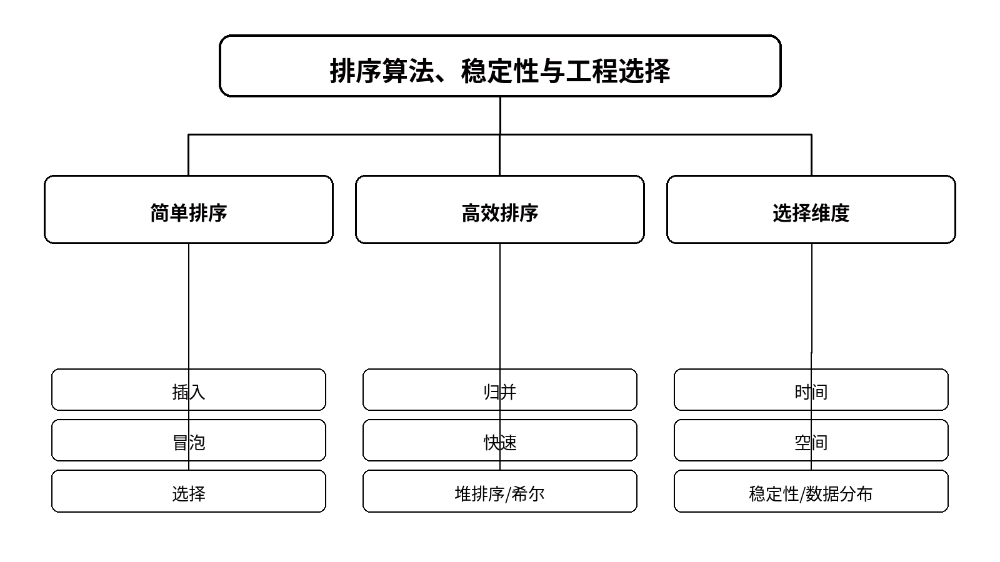 |
| 教学方法 | 讲授法、算法动画法、板书推演法、性能分析法、课堂检测法 |
| 教学用具 | 电脑、投影仪、多媒体课件、教材、Python、排序过程卡片 |
| 教学设计 | 课前任务→互动导入（8 min）→传授新知（70 min）→过关检测（10 min）→课堂小结（5 min）→作业布置（5 min）→考勤（2 min）；独立产物：一张排序算法对比矩阵和一个关键过程手工轨迹；保留证据：对比矩阵、手工排序轨迹、课堂检测；考核关联：课程作业20%的排序；期末考试60%的排序 |
| 参考文献 | 张玉华，吕强，朱晓旭，《数据结构（Python语言描述）（第2版·微课视频版）》[M]. 北京：清华大学出版社，2025。；李春葆，蒋林，李筱驰，《数据结构教程（Python语言描述）（第2版·微课视频版）》[M]. 北京：清华大学出版社，2025。 |

#### 教学目标

**知识目标：**
（1）掌握典型排序算法的基本过程、复杂度和稳定性。
（2）理解Python Timsort概念及工程排序与教学实现的关系。
**能力目标：**
（1）能够手工跟踪插入、快速或归并排序关键步骤。
（2）能够根据数据规模、稳定性和空间限制选择排序方案。
**价值目标：**
（1）形成公平基准、结果可复现和不过度宣传性能的意识。
（2）形成库函数使用前理解语义和边界的习惯。

#### 课程思政

（1）通过“只选对自己有利的数据集”比较算法的案例强调实验诚信和技术结论必须可复核。
（2）结合本课测试、错误或工程案例，强调结果可复核、边界可说明、责任可追溯。

#### 专创融合

比较近乎有序、随机、逆序和大量重复数据，鼓励用数据分布说明算法选择而不是背“最快算法”。

#### 教学重难点

**教学重点：排序过程、复杂度、稳定性、选择维度。**

**教学难点：将递归分治的归并/快速排序过程与稳定性、最坏情况联系起来。**

#### 教学过程

| 教学步骤 | 主要教学内容 | 设计意图 |
|---|---|---|
| 课前任务 | 【教师】1. 发布本课预习任务，明确教材对应主题与关键概念； 2. 提醒学生围绕“排序算法、稳定性与工程选择”梳理至少1个疑问。 【学生】1. 阅读教材对应内容并记录关键词； 2. 准备上一次课相关代码/笔记，带着问题进入课堂。 | 通过预习建立必要前置概念，减少课堂机械抄录，把注意力集中到结构关系、算法过程和验证方法。 |
| 互动导入（8 min） | 【教师】1. 回顾上一课关键结论； 2. 用智能制造数据或代码错例引出“排序算法、稳定性与工程选择”； 3. 追问学生本课需要解决的核心问题。 【学生】参与问答、观察案例，明确本次课任务与产物。 | 从已知问题进入新任务，建立知识连续性，同时把课程目标转化为可完成的课堂任务。 |
| 传授新知（共70 min） | **一、简单排序** 【教师】用相邻交换/选择最小/插入有序区解释冒泡、选择、插入。 【学生】在同一序列上跟踪一趟操作并比较交换次数。  **二、分治与堆排序** 【教师】讲归并“分—合”和快速“划分”，联系堆排序。 【学生】手工完成一次partition或merge。  **三、工程选择与Python sorted** 【教师】比较稳定性、额外空间和数据分布，介绍Timsort概念。 【学生】为四类数据场景选择排序方案并说明证据。 【课堂强化】本课独立产物：一张排序算法对比矩阵和一个关键过程手工轨迹。 【测试/复核】对比矩阵、手工排序轨迹、课堂检测。 | 按“概念/结构→算法或实现→测试/解释”的顺序推进，让学生在课堂中形成独立产物，并通过运行、图示或手工轨迹把教师讲解转化为自己的操作路径。 |
| 过关检测（10 min） | 【教师】布置课堂小测： 【选择题】要求稳定且O(n log n)可优先考虑哪类算法？ 【判断题】快速排序任何情况下都是O(n log n)。（ ） 【简答题】为什么排序算法比较必须说明输入数据分布？ 【学生】独立作答或现场运行，同伴互查； 【教师】根据结果集中点评本课重难点和易错点。 | 即时检查概念、算法过程与实现边界，防止“听懂了但不会判断/不会写/不会测”。 |
| 课堂小结（5 min） | 【教师】简要总结： 1. 本次课解决的关键问题是“排序算法、稳定性与工程选择”的结构与方法； 2. 需要重点掌握的主线是：结构关系→操作/算法→复杂度或边界→验证； 3. 最值得带走的方法是用测试或手工轨迹验证算法； 4. 需要警惕的易错点是：将递归分治的归并/快速排序过程与稳定性、最坏情况联系起来。 | 把零散知识重新组织为可迁移的方法主线，为后续结构和算法学习建立连接。 |
| 作业布置（5 min） | 【教师】布置课后任务： 1. 完成排序算法对比表：复杂度、空间、稳定性、典型场景。 2. 准备上机四：建立graph_lab.py、sort_benchmark.py。 【要求】作业不只写结果，还要写关键思路、复杂度/边界或测试依据；代码类作业保留测试结果。 | 用课后任务巩固本课方法并为下一次课准备前置材料，使课程作业持续形成可检验的学习证据。 |
| 考勤（2 min） | 【教师】利用学习通/课堂点名完成签到，记录缺勤情况；不在教案中预填实际出勤结果。 | 掌握出勤情况并保障教学秩序，同时避免在课前编造实际考勤事实。 |

#### 教学反思

【教师】课后重点从以下方面进行教学反思：
1. 教学流程：本课“排序算法、稳定性与工程选择”的导入是否把学生带入真实问题，100分钟推进是否由概念/模型逐步走向算法、实现或验证。
2. 教学内容：将递归分治的归并/快速排序过程与稳定性、最坏情况联系起来。是否讲清，学生是否停留在机械记忆或照抄代码。
3. 学生参与：课堂判断、编码、测试或解释是否参与均衡，是否存在“会听不会做”“会做不会说”，薄弱学生是否获得必要指导。
4. 教学改进：下一轮是否需要增加针对“排序算法、稳定性与工程选择”的错例、动态图示、代码断点演示或测试对照。

### lesson-19

| 字段 | 内容 |
|---|---|
| 章节 | 上机四 第1讲 |
| 授课题目 | 图建模、DFS/BFS与Dijkstra交叉验证 |
| 周次 | 第10周（第19次课） |
| 课时安排 | 2课时（100 min）；类型：上机2 |
| 知识脉络图 | 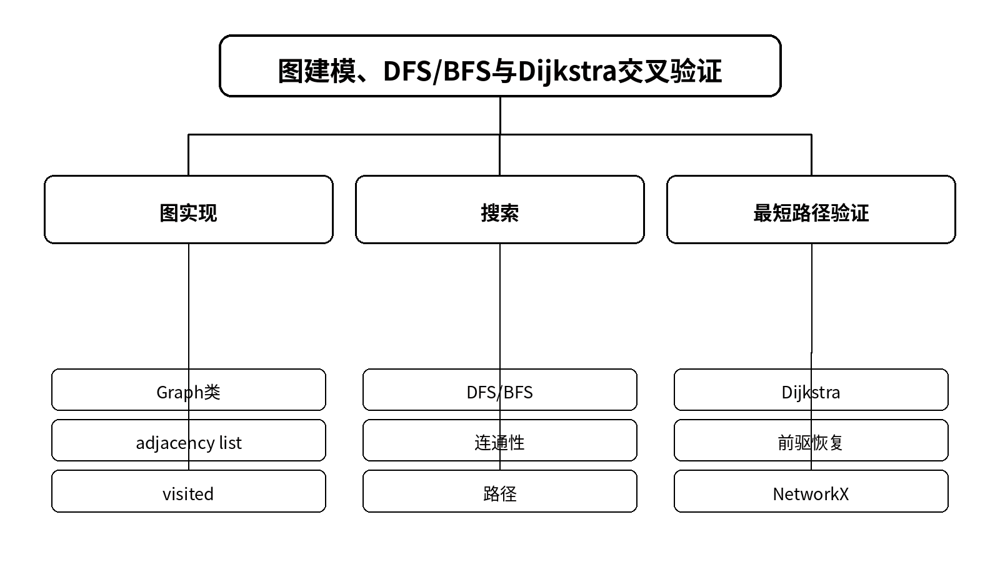 |
| 教学方法 | 任务驱动法、实操演练法、交叉验证法、代码评审法 |
| 教学用具 | 电脑、Python、pytest、NetworkX、Matplotlib、教材 |
| 教学设计 | 课前任务→互动导入（5 min）→传授新知（80 min）→过关检测（8 min）→课堂小结（3 min）→作业布置（2 min）→考勤（2 min）；独立产物：graph_lab.py、test_graph.py、一张路径可视化和库对照结果；保留证据：算法测试、路径/距离表、NetworkX对照、不可达案例；考核关联：课程作业20%的图与综合任务证据 |
| 参考文献 | 张玉华，吕强，朱晓旭，《数据结构（Python语言描述）（第2版·微课视频版）》[M]. 北京：清华大学出版社，2025。；李春葆，蒋林，李筱驰，《数据结构教程（Python语言描述）（第2版·微课视频版）》[M]. 北京：清华大学出版社，2025。 |

#### 教学目标

**知识目标：**
（1）理解Graph邻接表接口和visited管理。
（2）理解Dijkstra输出与库验证之间的对应关系。
**能力目标：**
（1）能够实现DFS、BFS和Dijkstra并恢复路径。
（2）能够用NetworkX交叉验证并解释差异。
**价值目标：**
（1）形成路径结果必须验证、外部库只作对照的意识。
（2）形成图模型与实际约束一致的习惯。

#### 课程思政

（1）通过路径算法结果未验证直接用于现场路线的风险案例强调安全边界和交叉验证。
（2）结合本课测试、错误或工程案例，强调结果可复核、边界可说明、责任可追溯。

#### 专创融合

允许学生改变边权模型比较“距离最短”“风险最低”路径，探索智能制造物流路线优化。

#### 教学重难点

**教学重点：邻接表、DFS/BFS、Dijkstra、NetworkX验证。**

**教学难点：保持Graph接口一致，正确处理不可达顶点和路径恢复。**

#### 教学过程

| 教学步骤 | 主要教学内容 | 设计意图 |
|---|---|---|
| 课前任务 | 【教师】1. 发布本课预习任务，明确教材对应主题与关键概念； 2. 提醒学生围绕“图建模、DFS/BFS与Dijkstra交叉验证”梳理至少1个疑问。 【学生】1. 阅读教材对应内容并记录关键词； 2. 准备上一次课相关代码/笔记，带着问题进入课堂。 | 通过预习建立必要前置概念，减少课堂机械抄录，把注意力集中到结构关系、算法过程和验证方法。 |
| 互动导入（5 min） | 【教师】1. 回顾上一课关键结论； 2. 用智能制造数据或代码错例引出“图建模、DFS/BFS与Dijkstra交叉验证”； 3. 追问学生本课需要解决的核心问题。 【学生】参与问答、观察案例，明确本次课任务与产物。 | 从已知问题进入新任务，建立知识连续性，同时把课程目标转化为可完成的课堂任务。 |
| 传授新知（共80 min） | **一、Graph接口与测试图** 【教师】给出小型设备网络和预期遍历/距离，不给算法代码。 【学生】完成adjacency list和固定测试图。  **二、DFS/BFS/Dijkstra编码** 【教师】巡回追问visited、queue/stack和松弛条件。 【学生】独立实现并在正常/含环/不可达图上测试。  **三、NetworkX交叉验证** 【教师】演示仅用库计算参考结果。 【学生】比较自实现与NetworkX输出，定位差异并提交解释。 【课堂强化】本课独立产物：graph_lab.py、test_graph.py、一张路径可视化和库对照结果。 【测试/复核】算法测试、路径/距离表、NetworkX对照、不可达案例。 | 按“概念/结构→算法或实现→测试/解释”的顺序推进，让学生在课堂中形成独立产物，并通过运行、图示或手工轨迹把教师讲解转化为自己的操作路径。 |
| 过关检测（8 min） | 【教师】布置课堂小测： 【现场题】为不可达目标补充返回规范。 【代码题】指出忘记visited会导致什么问题。 【解释题】库输出一致为什么仍不能证明所有输入都正确？ 【学生】独立作答或现场运行，同伴互查； 【教师】根据结果集中点评本课重难点和易错点。 | 即时检查概念、算法过程与实现边界，防止“听懂了但不会判断/不会写/不会测”。 |
| 课堂小结（3 min） | 【教师】简要总结： 1. 本次课解决的关键问题是“图建模、DFS/BFS与Dijkstra交叉验证”的结构与方法； 2. 需要重点掌握的主线是：结构关系→操作/算法→复杂度或边界→验证； 3. 最值得带走的方法是用测试或手工轨迹验证算法； 4. 需要警惕的易错点是：保持Graph接口一致，正确处理不可达顶点和路径恢复。 | 把零散知识重新组织为可迁移的方法主线，为后续结构和算法学习建立连接。 |
| 作业布置（2 min） | 【教师】布置课后任务： 1. 补充随机小图测试或至少3个边界图。 2. 准备最终综合任务的数据集和README结构。 【要求】作业不只写结果，还要写关键思路、复杂度/边界或测试依据；代码类作业保留测试结果。 | 用课后任务巩固本课方法并为下一次课准备前置材料，使课程作业持续形成可检验的学习证据。 |
| 考勤（2 min） | 【教师】利用学习通/课堂点名完成签到，记录缺勤情况；不在教案中预填实际出勤结果。 | 掌握出勤情况并保障教学秩序，同时避免在课前编造实际考勤事实。 |

#### 教学反思

【教师】课后重点从以下方面进行教学反思：
1. 教学流程：本课“图建模、DFS/BFS与Dijkstra交叉验证”的导入是否把学生带入真实问题，100分钟推进是否由概念/模型逐步走向算法、实现或验证。
2. 教学内容：保持Graph接口一致，正确处理不可达顶点和路径恢复。是否讲清，学生是否停留在机械记忆或照抄代码。
3. 学生参与：课堂判断、编码、测试或解释是否参与均衡，是否存在“会听不会做”“会做不会说”，薄弱学生是否获得必要指导。
4. 教学改进：下一轮是否需要增加针对“图建模、DFS/BFS与Dijkstra交叉验证”的错例、动态图示、代码断点演示或测试对照。

### lesson-20

| 字段 | 内容 |
|---|---|
| 章节 | 上机四 第2讲 |
| 授课题目 | 散列、排序基准与智能制造综合数据任务 |
| 周次 | 第10周（第20次课） |
| 课时安排 | 2课时（100 min）；类型：上机2 |
| 知识脉络图 | 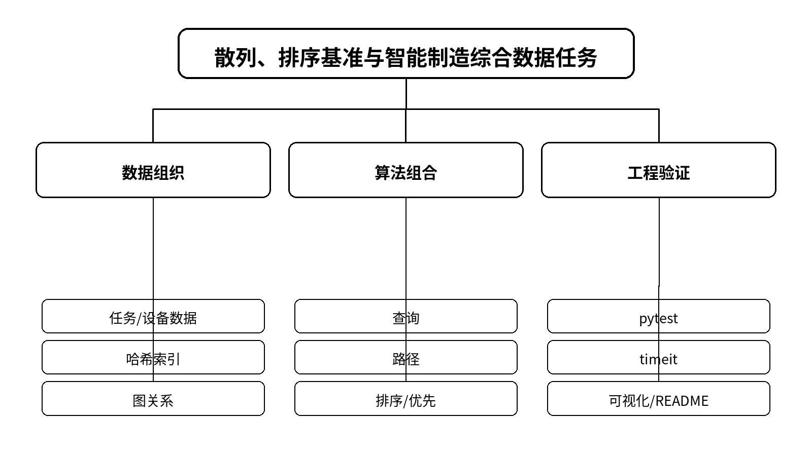 |
| 教学方法 | 项目驱动法、实操演练法、代码评审法、性能实验法、成果汇报法 |
| 教学用具 | 电脑、Python、pytest、timeit、Matplotlib、NetworkX、Git或本地版本工具、教材 |
| 教学设计 | 课前任务→互动导入（5 min）→传授新知（80 min）→过关检测（8 min）→课堂小结（3 min）→作业布置（2 min）→考勤（2 min）；独立产物：综合Python数据结构任务：源码、测试、性能数据、图形、README（该成果计入课程作业，不单列综合项目分值）；保留证据：完整源文件、测试通过记录、性能原始数据、README、个人解释/修改记录；考核关联：课程作业20%中的“综合Python数据结构任务与测试”；为期末闭卷考试的综合算法设计提供复习材料 |
| 参考文献 | 张玉华，吕强，朱晓旭，《数据结构（Python语言描述）（第2版·微课视频版）》[M]. 北京：清华大学出版社，2025。；李春葆，蒋林，李筱驰，《数据结构教程（Python语言描述）（第2版·微课视频版）》[M]. 北京：清华大学出版社，2025。 |

#### 教学目标

**知识目标：**
（1）综合理解图、散列、查找和排序在同一数据任务中的分工。
（2）理解性能、正确性、可读性和库复用之间的工程权衡。
**能力目标：**
（1）能够实现一个小型智能制造数据任务并组合至少两类自实现结构/算法。
（2）能够完成测试、性能比较、可视化和README说明。
**价值目标：**
（1）形成代码所有权、版本协作、结果可复现和负责任使用AI/库的意识。
（2）形成完整交付而非只展示运行截图的工程习惯。

#### 课程思政

（1）通过“演示能跑但代码无法复现、数据来源不清”的案例强调工程诚信、版本记录和结果所有权。
（2）结合本课测试、错误或工程案例，强调结果可复核、边界可说明、责任可追溯。

#### 专创融合

允许学生在设备检索、任务调度、AGV路线、故障传播中选择题目，从结构组合、性能与用户需求提出优化。

#### 教学重难点

**教学重点：多结构组合、散列/排序基准、综合测试与交付。**

**教学难点：控制任务范围，在100分钟内形成可运行最小系统，并用测试/性能证据解释设计选择。**

#### 教学过程

| 教学步骤 | 主要教学内容 | 设计意图 |
|---|---|---|
| 课前任务 | 【教师】1. 发布本课预习任务，明确教材对应主题与关键概念； 2. 提醒学生围绕“散列、排序基准与智能制造综合数据任务”梳理至少1个疑问。 【学生】1. 阅读教材对应内容并记录关键词； 2. 准备上一次课相关代码/笔记，带着问题进入课堂。 | 通过预习建立必要前置概念，减少课堂机械抄录，把注意力集中到结构关系、算法过程和验证方法。 |
| 互动导入（5 min） | 【教师】1. 回顾上一课关键结论； 2. 用智能制造数据或代码错例引出“散列、排序基准与智能制造综合数据任务”； 3. 追问学生本课需要解决的核心问题。 【学生】参与问答、观察案例，明确本次课任务与产物。 | 从已知问题进入新任务，建立知识连续性，同时把课程目标转化为可完成的课堂任务。 |
| 传授新知（共80 min） | **一、最小可运行任务** 【教师】限定成果必须包含数据模型、至少两种自实现结构/算法和测试。 【学生】根据选题完成最小端到端流程，先确保正确再优化。  **二、性能与边界验证** 【教师】要求至少1组规模对比、1个边界/失败场景和1个库对照。 【学生】运行pytest/timeit，保存原始结果并修正性能或逻辑问题。  **三、交付与个人核验** 【教师】随机抽取一个函数/参数要求现场解释或小改。 【学生】整理README、结构图、测试和性能结论，完成2分钟说明与现场修改。 【课堂强化】本课独立产物：综合Python数据结构任务：源码、测试、性能数据、图形、README（该成果计入课程作业，不单列综合项目分值）。 【测试/复核】完整源文件、测试通过记录、性能原始数据、README、个人解释/修改记录。 | 按“概念/结构→算法或实现→测试/解释”的顺序推进，让学生在课堂中形成独立产物，并通过运行、图示或手工轨迹把教师讲解转化为自己的操作路径。 |
| 过关检测（8 min） | 【教师】布置课堂小测： 【现场题】指出项目中自实现的数据结构及其不变量。 【测试题】增加一个边界样例并说明预期。 【性能题】若n扩大10倍，项目中最可能成为瓶颈的算法是什么？ 【学生】独立作答或现场运行，同伴互查； 【教师】根据结果集中点评本课重难点和易错点。 | 即时检查概念、算法过程与实现边界，防止“听懂了但不会判断/不会写/不会测”。 |
| 课堂小结（3 min） | 【教师】简要总结： 1. 本次课解决的关键问题是“散列、排序基准与智能制造综合数据任务”的结构与方法； 2. 需要重点掌握的主线是：结构关系→操作/算法→复杂度或边界→验证； 3. 最值得带走的方法是用测试或手工轨迹验证算法； 4. 需要警惕的易错点是：控制任务范围，在100分钟内形成可运行最小系统，并用测试/性能证据解释设计选择。 | 把零散知识重新组织为可迁移的方法主线，为后续结构和算法学习建立连接。 |
| 作业布置（2 min） | 【教师】布置课后任务： 1. 完成课程作业综合成果整理并按要求提交源码、测试、性能数据和README。 2. 依据期末考试范围复习ADT、线性结构、树、图、查找、散列、排序和Python算法表达。 【要求】作业不只写结果，还要写关键思路、复杂度/边界或测试依据；代码类作业保留测试结果。 | 用课后任务巩固本课方法并为下一次课准备前置材料，使课程作业持续形成可检验的学习证据。 |
| 考勤（2 min） | 【教师】利用学习通/课堂点名完成签到，记录缺勤情况；不在教案中预填实际出勤结果。 | 掌握出勤情况并保障教学秩序，同时避免在课前编造实际考勤事实。 |

#### 教学反思

【教师】课后重点从以下方面进行教学反思：
1. 教学流程：本课“散列、排序基准与智能制造综合数据任务”的导入是否把学生带入真实问题，100分钟推进是否由概念/模型逐步走向算法、实现或验证。
2. 教学内容：控制任务范围，在100分钟内形成可运行最小系统，并用测试/性能证据解释设计选择。是否讲清，学生是否停留在机械记忆或照抄代码。
3. 学生参与：课堂判断、编码、测试或解释是否参与均衡，是否存在“会听不会做”“会做不会说”，薄弱学生是否获得必要指导。
4. 教学改进：下一轮是否需要增加针对“散列、排序基准与智能制造综合数据任务”的错例、动态图示、代码断点演示或测试对照。

# 内部追踪区

## 版本与构建

- canonical_source: 25JX21800-数据结构（C）-教案.md
- lesson_count: 20
- total_hours: 40
- theory_meetings: 12
- computer_meetings: 8
- knowledge_maps: 20
