# 《智能工厂集成技术》教学设计（16次课）

> **Canonical source / 内容权威源**：本 Markdown 与 `images/`、`manifest.json` 共同构成教案语义主源。Word仅由本源包编译，负责学校格式呈现。

## 课程基本信息
- **课程名称**：智能工厂集成技术
- **课程英文名称**：Smart Factory Integration Technology
- **课程代码**：25JD32406
- **课程类别**：专业类
- **课程性质**：选修课
- **授课语言**：中文
- **授课学期**：第7学期
- **学分**：2
- **总学时**：32（理论32；实践/实验/上机/项目式均为0）
- **适用专业**：智能制造工程
- **授课学院**：机械与动力工程学院
- **先修课程**：现行课程教学大纲未列明
- **后续课程**：现行课程教学大纲未列明
- **选用教材**：王军利, 白海清.《智能集成制造系统》[M]. 北京：机械工业出版社，2024. ISBN 9787111768845
- **课程评价**：最终成绩100%=平时成绩20%＋课程作业20%＋期末考核60%；期末采用智能工厂集成综合方案报告并结合方案答辩或个人核验。
- **内容依据**：2025课程目录现行课程教学大纲（制定时间：2026年9月）

## 课程总体设计
本课程32学时全部为理论教学，不虚构实验、上机或项目式学时。课程按照“智能工厂体系架构→工业网络与协议→制造装备与单元→MES/企业系统→工业互联网平台与数字孪生→集成设计/联调/运维”六个单元展开，拆分为16次课×2学时。课堂采用“工厂场景—体系架构—接口与数据—典型系统—集成流程—案例评审”的方法，每次课都形成可检查的系统框图、接口表、数据流、时序图、数据字典、测试矩阵或风险清单，作为平时和课程作业的过程证据。

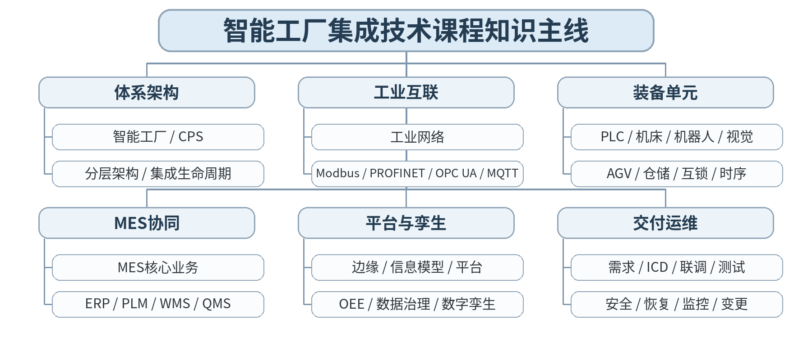

### 课次总览
| 次数 | 单元 | 授课题目 | 单元作业权重 |
|---:|---|---|---:|
| 1 | 第一单元 智能工厂体系架构与集成方法 | 智能工厂、智能制造系统、CPS与分层架构 | 10% |
| 2 | 第一单元 智能工厂体系架构与集成方法 | 制造资源、信息流/业务流、自动化金字塔与集成生命周期 | 10% |
| 3 | 第二单元 工业网络、通信协议与数据互联 | 工业网络基础：拓扑、实时性、可靠性与网络分层 | 15% |
| 4 | 第二单元 工业网络、通信协议与数据互联 | Modbus TCP与PROFINET：协议层级、数据点与控制场景 | 15% |
| 5 | 第二单元 工业网络、通信协议与数据互联 | OPC UA、MQTT、网关与协议转换：从连接到语义互操作 | 15% |
| 6 | 第三单元 制造装备与生产单元集成 | PLC、数控机床、机器人、视觉与传感器的接口对象 | 20% |
| 7 | 第三单元 制造装备与生产单元集成 | AGV/AMR、智能仓储与设备互锁、报警和异常处置 | 20% |
| 8 | 第三单元 制造装备与生产单元集成 | 柔性制造单元：机器人—机床—视觉—物流时序与联调 | 20% |
| 9 | 第四单元 MES与企业信息系统集成 | MES核心功能与生产工单执行闭环 | 20% |
| 10 | 第四单元 MES与企业信息系统集成 | ERP、PLM、WMS、QMS、SCADA与MES的边界和主数据 | 20% |
| 11 | 第四单元 MES与企业信息系统集成 | 订单—计划—工单—质量—入库的数据链与接口模式 | 20% |
| 12 | 第五单元 工业互联网平台、边缘计算与数字孪生 | 设备数据采集、边缘网关、边缘计算与数据质量 | 20% |
| 13 | 第五单元 工业互联网平台、边缘计算与数字孪生 | 信息模型、工业互联网平台、时序数据与OEE/能耗/质量应用 | 20% |
| 14 | 第五单元 工业互联网平台、边缘计算与数字孪生 | 数字孪生：模型、状态映射、虚实同步与应用边界 | 20% |
| 15 | 第六单元 智能工厂集成设计、联调与运维 | 需求分析、总体架构、接口控制与分层联调/端到端测试 | 15% |
| 16 | 第六单元 智能工厂集成设计、联调与运维 | 可靠性、安全、异常恢复、日志监控、备份、变更与综合方案评审 | 15% |

## 第01次课 智能工厂、智能制造系统、CPS与分层架构

### 课次信息
- **章节/单元**：第一单元 智能工厂体系架构与集成方法
- **周次**：按实际课表填写
- **课时安排**：2课时（100 min）
- **课型**：理论

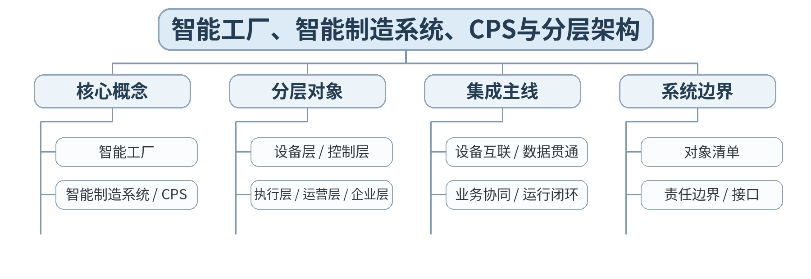

### 教学目标
**知识目标：**
1. 理解智能工厂、智能制造系统、CPS与工业互联网之间的基本关系。
2. 掌握设备—单元—产线/车间—工厂的层级，以及设备层、控制层、执行层、运营层、企业层的主要对象。

**能力目标：**
1. 能够从一个典型制造场景识别设备、控制、执行和企业系统，并绘制分层架构草图。
2. 能够用对象清单和边界说明解释“哪些属于本系统、哪些属于外部系统”。

**价值目标：**
1. 形成跨机械、电气、控制、计算机和管理系统的整体系统观，避免只从单台设备理解智能工厂。

### 课程思政
结合制造业数字化转型讨论系统工程责任：智能化不是简单堆设备，而是要求数据真实、接口清晰、责任可追溯。

### 专创融合
把总体架构图视为智能工厂方案的最小产品蓝图，训练从制造场景到系统方案的表达能力。

### 教学重难点
**教学重点：**智能工厂核心概念；分层架构；集成对象与系统边界。

**教学难点：**区分“自动化程度高”与“系统集成良好”，并从多层对象关系理解智能工厂。

### 教学方法与用具
**教学方法：**讲授法、架构图解法、协议/接口对比法、案例分析法、系统边界分析、分组研讨、方案评审

**教学用具：**电脑、投影仪、多媒体课件、教材、智能工厂架构案例图、白板/流程图工具。

### 教学设计
课前任务 → 互动导入（15 min）→ 传授新知与案例训练（70 min）→ 过关检测（10 min）→ 课堂小结（3 min）→ 作业布置（1 min）→ 考勤（1 min）

### 课前任务
【教师】发布“智能工厂、智能制造系统、CPS与分层架构”对应大纲/教材范围和一个最小案例，不提前给出完整分析结果。

1. 阅读指定内容并圈出3—5个核心术语；
2. 预读一个架构图、接口表、数据流或异常案例，写出第一判断；
3. 记录至少1个“系统边界/接口/数据/异常”问题。

【学生】完成预习与问题记录，带着判断依据进入课堂。

### 互动导入
【教师】展示“单机自动化产线”与“订单—MES—PLC—机器人—仓储贯通”的两张架构图，提问：两者都自动化，为什么后者更接近智能工厂？

【学生】先独立判断，再与同伴交换依据；教师收集典型分歧后进入本课。

### 传授新知与案例训练
**概念与主线（约25 min）**

【教师】讲解智能工厂、智能制造、CPS、工业互联网的关联，围绕“设备互联—数据贯通—业务协同—模型一致—运行闭环”建立课程总框架。

【学生】围绕案例完成对应架构、接口表、时序图、数据流或风险分析，保留修改前后依据。

**层级与对象（约25 min）**

【教师】用设备、PLC、机器人、SCADA、MES、ERP等对象构成分层架构；说明每层关心的时间尺度、职责和典型信息。

【学生】围绕案例完成对应架构、接口表、时序图、数据流或风险分析，保留修改前后依据。

**边界分析（约20 min）**

【教师】学生以“柔性加工车间”为例标注层级、对象、接口和责任方；互审是否把设备功能、业务系统和企业系统混在同一层。

【学生】围绕案例完成对应架构、接口表、时序图、数据流或风险分析，保留修改前后依据。

**课堂学习产物**：一张“柔性加工车间分层架构图”＋对象/责任边界清单。

**学习证据**：架构图、对象清单、边界说明、同伴审查修改记录。

**评价映射**：平时成绩；课程作业“智能工厂总体架构分析”（10%模块）过程证据；目标1.1、2.1、3.1。

### 过关检测
【教师】组织当堂检测：

1. 智能工厂与单机自动化的核心差异是什么？
2. 设备层、执行层和企业层分别解决什么问题？
3. 为什么系统集成设计必须先明确边界？

【学生】独立作答/完成图表判断；【教师】依据错误类型讲解，并要求学生说明系统边界、接口或数据依据。

### 课堂小结
【教师】回到知识脉络图，用“对象—接口—数据—流程—异常—证据”总结“智能工厂、智能制造系统、CPS与分层架构”，再次强调：智能工厂核心概念；分层架构；集成对象与系统边界。

【学生】写下“本课一条最重要的集成规则＋一个最容易出错的边界”。

### 作业布置
【教师】布置课后任务：完善分层架构图，补充每层至少2个对象及跨层接口，并用150字说明“局部最优为何可能破坏工厂整体协同”。

【学生】按课程图表和文档命名规范整理提交，保留版本和修改依据。

### 考勤
【教师】利用学校/课程实际使用的平台进行签到。

【学生】按课程要求完成签到。

### 课后教学反思
【课后填写，不预填事实】

1. 教学流程：记录100 min各环节实际用时及需要调整的位置；
2. 教学内容：重点记录“区分“自动化程度高”与“系统集成良好”，并从多层对象关系理解智能工厂。”的真实掌握证据与典型错误；
3. 学生参与：仅依据课堂实际记录填写架构分析、讨论、互审和技术表达情况，不补写推测性结论；
4. 评价证据：检查本课图表/接口/时序/风险记录是否完整，记录缺项及原因；
5. 后续改进：依据真实课堂证据决定下一轮内容、案例或任务调整。

### 本章节参考文献
[1] 王军利, 白海清.《智能集成制造系统》[M]. 北京：机械工业出版社，2024。
[2] 胡耀光.《智能制造系统设计与运行控制》[M]. 北京：机械工业出版社，2024。

## 第02次课 制造资源、信息流/业务流、自动化金字塔与集成生命周期

### 课次信息
- **章节/单元**：第一单元 智能工厂体系架构与集成方法
- **周次**：按实际课表填写
- **课时安排**：2课时（100 min）
- **课型**：理论

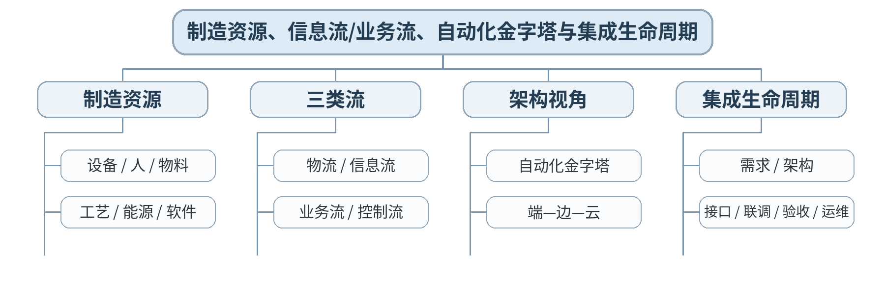

### 教学目标
**知识目标：**
1. 理解制造资源、物流、信息流、控制流和业务流的基本含义。
2. 理解自动化金字塔与端—边—云两种架构视角，并掌握智能工厂集成生命周期。

**能力目标：**
1. 能够围绕订单执行过程绘制“订单—工单—设备动作—质量—入库”的信息/业务流。
2. 能够把一个集成项目拆成需求、架构、接口、联调、测试、验收和运维阶段。

**价值目标：**
1. 形成以生命周期、文档和变更控制开展跨团队协作的职业习惯。

### 课程思政
强调集成工程必须遵循标准流程和变更记录，避免“现场能跑一次”替代可维护、可交付的工程成果。

### 专创融合
把生命周期输出物视为智能工厂咨询/集成服务的可复用模板，训练工程方案产品化。

### 教学重难点
**教学重点：**制造资源与多类流；自动化金字塔/端边云；集成生命周期。

**教学难点：**在同一场景中同时区分“物料移动、控制指令、业务事件和数据上报”，避免把所有流都画成一条线。

### 教学方法与用具
**教学方法：**讲授法、架构图解法、协议/接口对比法、案例分析法、系统边界分析、分组研讨、方案评审

**教学用具：**电脑、投影仪、教材、典型工厂流程图、系统架构图、时序图工具。

### 教学设计
课前任务 → 互动导入（15 min）→ 传授新知与案例训练（70 min）→ 过关检测（10 min）→ 课堂小结（3 min）→ 作业布置（1 min）→ 考勤（1 min）

### 课前任务
【教师】发布“制造资源、信息流/业务流、自动化金字塔与集成生命周期”对应大纲/教材范围和一个最小案例，不提前给出完整分析结果。

1. 阅读指定内容并圈出3—5个核心术语；
2. 预读一个架构图、接口表、数据流或异常案例，写出第一判断；
3. 记录至少1个“系统边界/接口/数据/异常”问题。

【学生】完成预习与问题记录，带着判断依据进入课堂。

### 互动导入
【教师】给出“订单已下达但AGV未到料、MES显示工单已开始”的异常场景，让学生判断这属于物流、业务流、控制流还是数据一致性问题。

【学生】先独立判断，再与同伴交换依据；教师收集典型分歧后进入本课。

### 传授新知与案例训练
**资源与多类流（约25 min）**

【教师】从制造资源出发区分物流、信息流、控制流与业务流；通过订单到入库案例说明不同流的耦合。

【学生】围绕案例完成对应架构、接口表、时序图、数据流或风险分析，保留修改前后依据。

**架构视角（约25 min）**

【教师】比较自动化金字塔和端—边—云：前者突出层级职责，后者突出数据处理位置和计算协同，两者不是互斥关系。

【学生】围绕案例完成对应架构、接口表、时序图、数据流或风险分析，保留修改前后依据。

**生命周期（约20 min）**

【教师】用集成项目WBS示例讲需求—总体架构—接口控制—集成计划—分层联调—端到端测试—验收—运维，学生完成阶段输出物匹配。

【学生】围绕案例完成对应架构、接口表、时序图、数据流或风险分析，保留修改前后依据。

**课堂学习产物**：订单到入库“三流/四流”图＋集成生命周期输出物表。

**学习证据**：流程图、阶段—输出物表、异常场景归因与修正说明。

**评价映射**：平时成绩；课程作业“智能工厂总体架构分析”（10%模块）阶段证据；目标1.1、2.1、3.1。

### 过关检测
【教师】组织当堂检测：

1. 信息流与业务流有什么区别？
2. 自动化金字塔和端—边—云分别更适合回答什么问题？
3. 接口定义为什么必须早于联调？

【学生】独立作答/完成图表判断；【教师】依据错误类型讲解，并要求学生说明系统边界、接口或数据依据。

### 课堂小结
【教师】回到知识脉络图，用“对象—接口—数据—流程—异常—证据”总结“制造资源、信息流/业务流、自动化金字塔与集成生命周期”，再次强调：制造资源与多类流；自动化金字塔/端边云；集成生命周期。

【学生】写下“本课一条最重要的集成规则＋一个最容易出错的边界”。

### 作业布置
【教师】布置课后任务：将第1次课架构图扩展为“资源—流程—接口—生命周期”四层说明，并列出5个项目阶段交付物。

【学生】按课程图表和文档命名规范整理提交，保留版本和修改依据。

### 考勤
【教师】利用学校/课程实际使用的平台进行签到。

【学生】按课程要求完成签到。

### 课后教学反思
【课后填写，不预填事实】

1. 教学流程：记录100 min各环节实际用时及需要调整的位置；
2. 教学内容：重点记录“在同一场景中同时区分“物料移动、控制指令、业务事件和数据上报”，避免把所有流都画成一条线。”的真实掌握证据与典型错误；
3. 学生参与：仅依据课堂实际记录填写架构分析、讨论、互审和技术表达情况，不补写推测性结论；
4. 评价证据：检查本课图表/接口/时序/风险记录是否完整，记录缺项及原因；
5. 后续改进：依据真实课堂证据决定下一轮内容、案例或任务调整。

### 本章节参考文献
[1] 王军利, 白海清.《智能集成制造系统》[M]. 北京：机械工业出版社，2024。
[2] 胡耀光.《智能制造系统设计与运行控制》[M]. 北京：机械工业出版社，2024。

## 第03次课 工业网络基础：拓扑、实时性、可靠性与网络分层

### 课次信息
- **章节/单元**：第二单元 工业网络、通信协议与数据互联
- **周次**：按实际课表填写
- **课时安排**：2课时（100 min）
- **课型**：理论

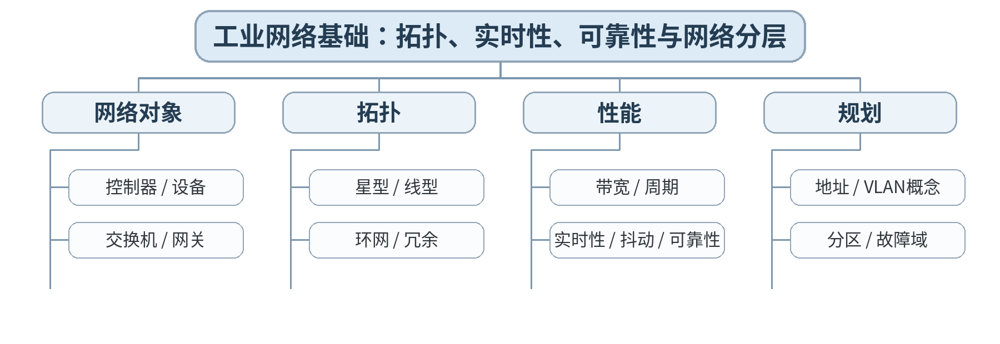

### 教学目标
**知识目标：**
1. 掌握工业以太网和现场通信的基本对象、拓扑与网络性能指标。
2. 理解实时性、确定性、可靠性、带宽、周期和网络故障域的工程含义。

**能力目标：**
1. 能够根据设备数量、周期和可靠性要求绘制基本网络拓扑。
2. 能够从拓扑、链路和网络分区角度分析一个通信故障的影响范围。

**价值目标：**
1. 形成标准化网络规划和工业信息安全分区意识。

### 课程思政
通过网络分区、标准接口和故障影响案例强化“可靠通信服务生产安全”的责任意识。

### 专创融合
将网络需求表作为后续协议选型和集成报价/实施的基础模板。

### 教学重难点
**教学重点：**工业网络拓扑与性能指标；网络分区和故障域。

**教学难点：**不把“带宽高”简单等同于“实时性好”，理解工业网络关注确定性、周期和故障隔离。

### 教学方法与用具
**教学方法：**讲授法、架构图解法、协议/接口对比法、案例分析法、系统边界分析、分组研讨、方案评审

**教学用具：**电脑、投影仪、教材、工业交换机/网络拓扑案例、抓包/报文示意图（演示用）。

### 教学设计
课前任务 → 互动导入（15 min）→ 传授新知与案例训练（70 min）→ 过关检测（10 min）→ 课堂小结（3 min）→ 作业布置（1 min）→ 考勤（1 min）

### 课前任务
【教师】发布“工业网络基础：拓扑、实时性、可靠性与网络分层”对应大纲/教材范围和一个最小案例，不提前给出完整分析结果。

1. 阅读指定内容并圈出3—5个核心术语；
2. 预读一个架构图、接口表、数据流或异常案例，写出第一判断；
3. 记录至少1个“系统边界/接口/数据/异常”问题。

【学生】完成预习与问题记录，带着判断依据进入课堂。

### 互动导入
【教师】对比“千兆办公网络”和“百兆实时控制网络”，提问：为什么更高带宽不必然意味着更适合运动控制？

【学生】先独立判断，再与同伴交换依据；教师收集典型分歧后进入本课。

### 传授新知与案例训练
**工业通信基础（约25 min）**

【教师】从设备、PLC、机器人、交换机、网关讲通信对象；区分办公IT网络与工业OT网络的关键要求。

【学生】围绕案例完成对应架构、接口表、时序图、数据流或风险分析，保留修改前后依据。

**拓扑与可靠性（约25 min）**

【教师】比较星型、线型、环网及冗余；用交换机/链路故障案例说明故障域与网络可用性。

【学生】围绕案例完成对应架构、接口表、时序图、数据流或风险分析，保留修改前后依据。

**需求到网络（约20 min）**

【教师】学生依据“12台设备、4台PLC、2个机器人、1套MES接口”的场景建立网络需求表和拓扑草图，标注实时/非实时流量。

【学生】围绕案例完成对应架构、接口表、时序图、数据流或风险分析，保留修改前后依据。

**课堂学习产物**：工业网络需求表＋拓扑草图＋故障域标注。

**学习证据**：拓扑图、数据流分类、实时性/可靠性需求、故障影响分析。

**评价映射**：平时成绩；课程作业“工业网络与通信方案”（15%模块）过程证据；目标1.2、2.2、3.2、3.5。

### 过关检测
【教师】组织当堂检测：

1. 带宽、实时性和确定性是否是同一个概念？
2. 环网冗余主要解决什么故障？
3. 为什么工业网络需要分区？

【学生】独立作答/完成图表判断；【教师】依据错误类型讲解，并要求学生说明系统边界、接口或数据依据。

### 课堂小结
【教师】回到知识脉络图，用“对象—接口—数据—流程—异常—证据”总结“工业网络基础：拓扑、实时性、可靠性与网络分层”，再次强调：工业网络拓扑与性能指标；网络分区和故障域。

【学生】写下“本课一条最重要的集成规则＋一个最容易出错的边界”。

### 作业布置
【教师】布置课后任务：完善网络拓扑，给每类通信流标出周期/实时性等级和故障后果。

【学生】按课程图表和文档命名规范整理提交，保留版本和修改依据。

### 考勤
【教师】利用学校/课程实际使用的平台进行签到。

【学生】按课程要求完成签到。

### 课后教学反思
【课后填写，不预填事实】

1. 教学流程：记录100 min各环节实际用时及需要调整的位置；
2. 教学内容：重点记录“不把“带宽高”简单等同于“实时性好”，理解工业网络关注确定性、周期和故障隔离。”的真实掌握证据与典型错误；
3. 学生参与：仅依据课堂实际记录填写架构分析、讨论、互审和技术表达情况，不补写推测性结论；
4. 评价证据：检查本课图表/接口/时序/风险记录是否完整，记录缺项及原因；
5. 后续改进：依据真实课堂证据决定下一轮内容、案例或任务调整。

### 本章节参考文献
[1] 王军利, 白海清.《智能集成制造系统》[M]. 北京：机械工业出版社，2024。
[5] 宋志刚, 郭树军, 文双全.《智能工厂应用与虚拟仿真调试》[M]. 北京：机械工业出版社，2025。

## 第04次课 Modbus TCP与PROFINET：协议层级、数据点与控制场景

### 课次信息
- **章节/单元**：第二单元 工业网络、通信协议与数据互联
- **周次**：按实际课表填写
- **课时安排**：2课时（100 min）
- **课型**：理论

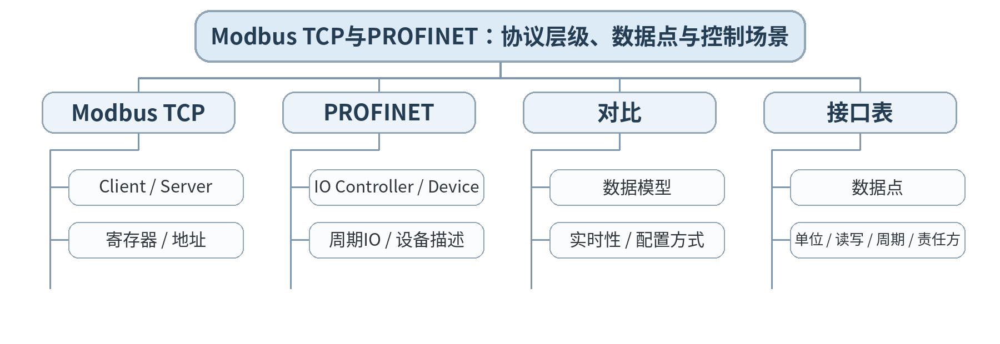

### 教学目标
**知识目标：**
1. 掌握Modbus TCP与PROFINET的基本通信角色、数据对象和典型应用场景。
2. 理解寄存器/数据点、周期I/O、设备地址和工程配置的基本概念。

**能力目标：**
1. 能够根据“状态读取、参数下发、周期控制”等需求选择协议并形成数据点表。
2. 能够识别地址、数据类型、单位、字节序/映射等接口信息缺失带来的联调风险。

**价值目标：**
1. 形成接口字段、单位、版本和责任方必须明确的规范意识。

### 课程思政
用单位/量纲错误、版本不一致案例强调接口文档真实性和工程责任。

### 专创融合
把数据点表视为跨PLC、机器人、上位系统团队协作的“接口产品”。

### 教学重难点
**教学重点：**Modbus TCP/PROFINET基本机制；协议选型与数据点接口表。

**教学难点：**理解协议“能通信”不等于“数据语义一致”，避免只给地址不定义单位、类型和责任。

### 教学方法与用具
**教学方法：**讲授法、架构图解法、协议/接口对比法、案例分析法、系统边界分析、分组研讨、方案评审

**教学用具：**电脑、投影仪、教材、Modbus/PROFINET报文与组态案例、数据点模板。

### 教学设计
课前任务 → 互动导入（15 min）→ 传授新知与案例训练（70 min）→ 过关检测（10 min）→ 课堂小结（3 min）→ 作业布置（1 min）→ 考勤（1 min）

### 课前任务
【教师】发布“Modbus TCP与PROFINET：协议层级、数据点与控制场景”对应大纲/教材范围和一个最小案例，不提前给出完整分析结果。

1. 阅读指定内容并圈出3—5个核心术语；
2. 预读一个架构图、接口表、数据流或异常案例，写出第一判断；
3. 记录至少1个“系统边界/接口/数据/异常”问题。

【学生】完成预习与问题记录，带着判断依据进入课堂。

### 互动导入
【教师】展示两套“温度值=250”的接口文档：一套写明0.1℃缩放，一套未写单位，提问哪套更可能在联调时出事故。

【学生】先独立判断，再与同伴交换依据；教师收集典型分歧后进入本课。

### 传授新知与案例训练
**Modbus TCP（约25 min）**

【教师】讲Client/Server、功能码概念、线圈/寄存器和地址映射；以设备状态/参数读取说明适合的集成场景。

【学生】围绕案例完成对应架构、接口表、时序图、数据流或风险分析，保留修改前后依据。

**PROFINET（约25 min）**

【教师】讲IO Controller/Device、周期IO与工程配置思路；从PLC—远程IO—机器人/变频器说明控制层协同。

【学生】围绕案例完成对应架构、接口表、时序图、数据流或风险分析，保留修改前后依据。

**协议对比与接口表（约20 min）**

【教师】学生为同一柔性单元分别判断哪些信号适合周期IO、哪些适合非周期数据读取，并填写数据点名称、类型、单位、方向、周期、异常值。

【学生】围绕案例完成对应架构、接口表、时序图、数据流或风险分析，保留修改前后依据。

**课堂学习产物**：Modbus TCP/PROFINET协议对比表＋10条数据点接口表。

**学习证据**：协议选择依据、数据点表、错误字段案例修订记录。

**评价映射**：平时成绩；课程作业“工业网络与通信方案”（15%模块）过程证据；目标1.2、2.2、3.2、3.5。

### 过关检测
【教师】组织当堂检测：

1. Modbus TCP中的地址表和PROFINET周期IO在工程使用上有何差别？
2. 一个完整数据点定义至少应包含哪些字段？
3. “通信成功但数值错误”通常应从哪些接口信息排查？

【学生】独立作答/完成图表判断；【教师】依据错误类型讲解，并要求学生说明系统边界、接口或数据依据。

### 课堂小结
【教师】回到知识脉络图，用“对象—接口—数据—流程—异常—证据”总结“Modbus TCP与PROFINET：协议层级、数据点与控制场景”，再次强调：Modbus TCP/PROFINET基本机制；协议选型与数据点接口表。

【学生】写下“本课一条最重要的集成规则＋一个最容易出错的边界”。

### 作业布置
【教师】布置课后任务：扩展接口表到20条数据点，并给出3条联调前必须确认的字段规则。

【学生】按课程图表和文档命名规范整理提交，保留版本和修改依据。

### 考勤
【教师】利用学校/课程实际使用的平台进行签到。

【学生】按课程要求完成签到。

### 课后教学反思
【课后填写，不预填事实】

1. 教学流程：记录100 min各环节实际用时及需要调整的位置；
2. 教学内容：重点记录“理解协议“能通信”不等于“数据语义一致”，避免只给地址不定义单位、类型和责任。”的真实掌握证据与典型错误；
3. 学生参与：仅依据课堂实际记录填写架构分析、讨论、互审和技术表达情况，不补写推测性结论；
4. 评价证据：检查本课图表/接口/时序/风险记录是否完整，记录缺项及原因；
5. 后续改进：依据真实课堂证据决定下一轮内容、案例或任务调整。

### 本章节参考文献
[1] 王军利, 白海清.《智能集成制造系统》[M]. 北京：机械工业出版社，2024。
[4] 朱志亮, 郑道友, 陈传周.《智能制造装备单元系统集成》[M]. 北京：机械工业出版社，2024。

## 第05次课 OPC UA、MQTT、网关与协议转换：从连接到语义互操作

### 课次信息
- **章节/单元**：第二单元 工业网络、通信协议与数据互联
- **周次**：按实际课表填写
- **课时安排**：2课时（100 min）
- **课型**：理论

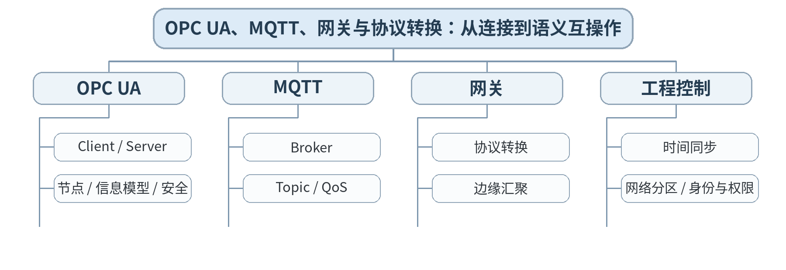

### 教学目标
**知识目标：**
1. 理解OPC UA的信息模型、安全机制和Client/Server基本关系。
2. 理解MQTT的Broker、Topic、发布/订阅和QoS概念，以及网关、协议转换、时间同步与网络分区作用。

**能力目标：**
1. 能够针对设备到MES/平台场景选择OPC UA、MQTT或网关方案。
2. 能够设计Topic/节点命名和基本安全/时间同步要求。

**价值目标：**
1. 形成互操作、网络安全、身份认证和数据语义一致性意识。

### 课程思政
强调工业网络安全、最小权限和标准接口，避免以“网络能连通”替代安全可靠的工程要求。

### 专创融合
将标准化接口与网关服务封装为可复用集成能力，理解平台化接入的产品价值。

### 教学重难点
**教学重点：**OPC UA、MQTT、网关/协议转换；时间同步与网络安全。

**教学难点：**区分“协议转换”和“语义转换”，理解Topic/节点命名、身份权限和时间戳对工业数据可信度的影响。

### 教学方法与用具
**教学方法：**讲授法、架构图解法、协议/接口对比法、案例分析法、系统边界分析、分组研讨、方案评审

**教学用具：**电脑、投影仪、教材、OPC UA/MQTT架构示例、工业网关案例。

### 教学设计
课前任务 → 互动导入（15 min）→ 传授新知与案例训练（70 min）→ 过关检测（10 min）→ 课堂小结（3 min）→ 作业布置（1 min）→ 考勤（1 min）

### 课前任务
【教师】发布“OPC UA、MQTT、网关与协议转换：从连接到语义互操作”对应大纲/教材范围和一个最小案例，不提前给出完整分析结果。

1. 阅读指定内容并圈出3—5个核心术语；
2. 预读一个架构图、接口表、数据流或异常案例，写出第一判断；
3. 记录至少1个“系统边界/接口/数据/异常”问题。

【学生】完成预习与问题记录，带着判断依据进入课堂。

### 互动导入
【教师】给出一条来自PLC的“Alarm=1”数据，经网关转换后平台不知道是“设备报警”还是“工单报警”，提问：协议已通，为什么系统仍不能正确使用？

【学生】先独立判断，再与同伴交换依据；教师收集典型分歧后进入本课。

### 传授新知与案例训练
**OPC UA（约25 min）**

【教师】讲节点、属性、方法/事件和信息模型；说明其在控制层到MES/SCADA的标准化语义接口价值。

【学生】围绕案例完成对应架构、接口表、时序图、数据流或风险分析，保留修改前后依据。

**MQTT与网关（约25 min）**

【教师】讲Broker、Topic、QoS、发布订阅；网关负责协议接入、汇聚、初步处理，但不能自动解决所有业务语义。

【学生】围绕案例完成对应架构、接口表、时序图、数据流或风险分析，保留修改前后依据。

**安全与一致性（约20 min）**

【教师】讨论时间同步、身份认证、最小权限、网络分区和日志；学生设计“设备→网关→平台”的接口/Topic/时间戳规则。

【学生】围绕案例完成对应架构、接口表、时序图、数据流或风险分析，保留修改前后依据。

**课堂学习产物**：OPC UA/MQTT/网关选型表＋节点/Topic命名规则＋安全/时间同步清单。

**学习证据**：方案表、命名示例、安全控制清单、语义缺失案例修正。

**评价映射**：课程作业“工业网络与通信方案”（15%模块）阶段成果；目标1.2、2.2、3.2、3.5。

### 过关检测
【教师】组织当堂检测：

1. OPC UA比“纯地址读写”增加了什么能力？
2. MQTT的Topic设计为什么属于接口设计？
3. 为什么时间同步是跨系统追溯的基础？

【学生】独立作答/完成图表判断；【教师】依据错误类型讲解，并要求学生说明系统边界、接口或数据依据。

### 课堂小结
【教师】回到知识脉络图，用“对象—接口—数据—流程—异常—证据”总结“OPC UA、MQTT、网关与协议转换：从连接到语义互操作”，再次强调：OPC UA、MQTT、网关/协议转换；时间同步与网络安全。

【学生】写下“本课一条最重要的集成规则＋一个最容易出错的边界”。

### 作业布置
【教师】布置课后任务：完成本单元网络与通信方案：网络图、协议选型、数据点/Topic规则、安全和时间同步说明。

【学生】按课程图表和文档命名规范整理提交，保留版本和修改依据。

### 考勤
【教师】利用学校/课程实际使用的平台进行签到。

【学生】按课程要求完成签到。

### 课后教学反思
【课后填写，不预填事实】

1. 教学流程：记录100 min各环节实际用时及需要调整的位置；
2. 教学内容：重点记录“区分“协议转换”和“语义转换”，理解Topic/节点命名、身份权限和时间戳对工业数据可信度的影响。”的真实掌握证据与典型错误；
3. 学生参与：仅依据课堂实际记录填写架构分析、讨论、互审和技术表达情况，不补写推测性结论；
4. 评价证据：检查本课图表/接口/时序/风险记录是否完整，记录缺项及原因；
5. 后续改进：依据真实课堂证据决定下一轮内容、案例或任务调整。

### 本章节参考文献
[1] 王军利, 白海清.《智能集成制造系统》[M]. 北京：机械工业出版社，2024。
[3] 林锋, 洪连环.《数字化网络化智能技术：工业互联网平台与工业APP》[M]. 北京：机械工业出版社，2024。

## 第06次课 PLC、数控机床、机器人、视觉与传感器的接口对象

### 课次信息
- **章节/单元**：第三单元 制造装备与生产单元集成
- **周次**：按实际课表填写
- **课时安排**：2课时（100 min）
- **课型**：理论

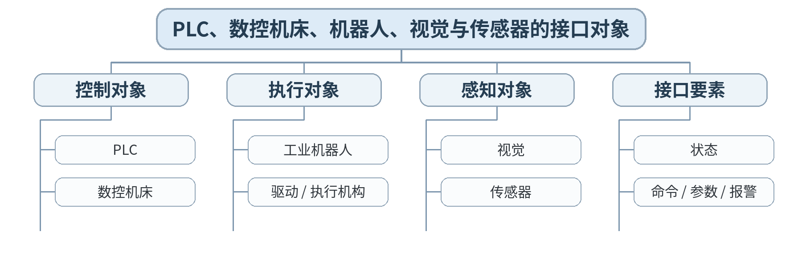

### 教学目标
**知识目标：**
1. 掌握PLC、数控机床、工业机器人、机器视觉、传感器等制造资源的典型接口对象。
2. 理解设备状态、命令、参数、报警和模式的基本分类。

**能力目标：**
1. 能够针对一个机器人上下料单元建立设备对象清单和状态/命令接口表。
2. 能够识别“状态”和“命令”混用造成的控制风险。

**价值目标：**
1. 形成接口契约、设备安全和状态真实性意识。

### 课程思政
通过危险动作和模式切换案例强调设备安全、权限边界与异常处置责任。

### 专创融合
把设备接口表作为设备接入模板，为不同品牌设备的快速集成建立复用基础。

### 教学重难点
**教学重点：**典型制造资源接口；状态/命令/报警分类。

**教学难点：**把设备内部功能转化为可集成的外部接口，正确划分只读状态、可写命令和高风险参数。

### 教学方法与用具
**教学方法：**讲授法、架构图解法、协议/接口对比法、案例分析法、系统边界分析、分组研讨、方案评审

**教学用具：**电脑、投影仪、教材、机器人/数控/PLC/视觉接口案例、接口表模板。

### 教学设计
课前任务 → 互动导入（15 min）→ 传授新知与案例训练（70 min）→ 过关检测（10 min）→ 课堂小结（3 min）→ 作业布置（1 min）→ 考勤（1 min）

### 课前任务
【教师】发布“PLC、数控机床、机器人、视觉与传感器的接口对象”对应大纲/教材范围和一个最小案例，不提前给出完整分析结果。

1. 阅读指定内容并圈出3—5个核心术语；
2. 预读一个架构图、接口表、数据流或异常案例，写出第一判断；
3. 记录至少1个“系统边界/接口/数据/异常”问题。

【学生】完成预习与问题记录，带着判断依据进入课堂。

### 互动导入
【教师】展示“机器人Ready、Busy、Fault”和“Start、Reset、AutoMode”混在同一表中的接口，让学生先判断哪些字段不应由上位系统随意写。

【学生】先独立判断，再与同伴交换依据；教师收集典型分歧后进入本课。

### 传授新知与案例训练
**装备对象（约25 min）**

【教师】讲PLC、机床、机器人、视觉、传感器的角色和常见外部接口；强调设备内部逻辑与集成接口边界。

【学生】围绕案例完成对应架构、接口表、时序图、数据流或风险分析，保留修改前后依据。

**接口分类（约25 min）**

【教师】将接口分状态、命令、参数、报警/事件、模式与心跳；说明方向、确认、超时和默认安全状态。

【学生】围绕案例完成对应架构、接口表、时序图、数据流或风险分析，保留修改前后依据。

**接口表训练（约20 min）**

【教师】学生围绕“机器人给机床上下料+视觉确认”场景建立对象清单与15条接口表，标出读写方向、互锁依赖和异常值。

【学生】围绕案例完成对应架构、接口表、时序图、数据流或风险分析，保留修改前后依据。

**课堂学习产物**：柔性上下料单元设备对象图＋状态/命令/报警接口表。

**学习证据**：对象图、接口表、读写权限与互锁说明。

**评价映射**：平时成绩；课程作业“制造单元接口与协同”（20%模块）过程证据；目标1.3、2.3、3.2、3.3。

### 过关检测
【教师】组织当堂检测：

1. 状态、命令和报警为什么应分开定义？
2. 上位系统是否应该直接写机器人内部每个动作变量？
3. 心跳/在线状态能解决什么问题？

【学生】独立作答/完成图表判断；【教师】依据错误类型讲解，并要求学生说明系统边界、接口或数据依据。

### 课堂小结
【教师】回到知识脉络图，用“对象—接口—数据—流程—异常—证据”总结“PLC、数控机床、机器人、视觉与传感器的接口对象”，再次强调：典型制造资源接口；状态/命令/报警分类。

【学生】写下“本课一条最重要的集成规则＋一个最容易出错的边界”。

### 作业布置
【教师】布置课后任务：完善接口表，为每条命令补充执行前置条件、完成确认和超时/失败反馈。

【学生】按课程图表和文档命名规范整理提交，保留版本和修改依据。

### 考勤
【教师】利用学校/课程实际使用的平台进行签到。

【学生】按课程要求完成签到。

### 课后教学反思
【课后填写，不预填事实】

1. 教学流程：记录100 min各环节实际用时及需要调整的位置；
2. 教学内容：重点记录“把设备内部功能转化为可集成的外部接口，正确划分只读状态、可写命令和高风险参数。”的真实掌握证据与典型错误；
3. 学生参与：仅依据课堂实际记录填写架构分析、讨论、互审和技术表达情况，不补写推测性结论；
4. 评价证据：检查本课图表/接口/时序/风险记录是否完整，记录缺项及原因；
5. 后续改进：依据真实课堂证据决定下一轮内容、案例或任务调整。

### 本章节参考文献
[4] 朱志亮, 郑道友, 陈传周.《智能制造装备单元系统集成》[M]. 北京：机械工业出版社，2024。
[1] 王军利, 白海清.《智能集成制造系统》[M]. 北京：机械工业出版社，2024。

## 第07次课 AGV/AMR、智能仓储与设备互锁、报警和异常处置

### 课次信息
- **章节/单元**：第三单元 制造装备与生产单元集成
- **周次**：按实际课表填写
- **课时安排**：2课时（100 min）
- **课型**：理论

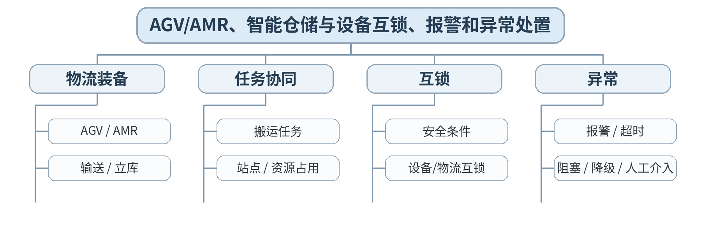

### 教学目标
**知识目标：**
1. 理解AGV/AMR、输送系统、智能仓储在生产单元中的集成角色。
2. 掌握互锁、报警、超时、资源占用和异常恢复的基本逻辑。

**能力目标：**
1. 能够用状态机或流程图描述“请求物料—车辆到位—装卸—放行”的协同过程。
2. 能够设计异常场景下的安全停机、重试、降级和人工介入。

**价值目标：**
1. 形成安全优先、异常必须有明确责任和恢复路径的工程意识。

### 课程思政
把设备安全、人员安全和业务连续性放在自动化效率之前，形成对异常处置结果负责的职业意识。

### 专创融合
将物流协同状态机作为柔性产线调度与仿真的可复用模型。

### 教学重难点
**教学重点：**物流单元协同；互锁/报警/超时和异常恢复。

**教学难点：**异常恢复不能只写“重新执行”，必须区分可重试故障、需要人工处理的安全故障和业务阻塞。

### 教学方法与用具
**教学方法：**讲授法、架构图解法、协议/接口对比法、案例分析法、系统边界分析、分组研讨、方案评审

**教学用具：**电脑、投影仪、教材、AGV/AMR与仓储系统案例、状态机/时序图工具。

### 教学设计
课前任务 → 互动导入（15 min）→ 传授新知与案例训练（70 min）→ 过关检测（10 min）→ 课堂小结（3 min）→ 作业布置（1 min）→ 考勤（1 min）

### 课前任务
【教师】发布“AGV/AMR、智能仓储与设备互锁、报警和异常处置”对应大纲/教材范围和一个最小案例，不提前给出完整分析结果。

1. 阅读指定内容并圈出3—5个核心术语；
2. 预读一个架构图、接口表、数据流或异常案例，写出第一判断；
3. 记录至少1个“系统边界/接口/数据/异常”问题。

【学生】完成预习与问题记录，带着判断依据进入课堂。

### 互动导入
【教师】给出“机器人请求上料，但AGV到位信号丢失；机器人是否可以继续动作？”让学生先写继续/等待/报警的条件。

【学生】先独立判断，再与同伴交换依据；教师收集典型分歧后进入本课。

### 传授新知与案例训练
**物流对象（约25 min）**

【教师】讲AGV/AMR、输送、立库/WCS对象和任务；说明站点、任务、占用、到位、装卸完成等关键状态。

【学生】围绕案例完成对应架构、接口表、时序图、数据流或风险分析，保留修改前后依据。

**互锁与状态机（约25 min）**

【教师】从机器人—AGV—机床三个对象设计互锁，使用状态机表达Ready/Request/Arrived/Transfer/Complete/Fault。

【学生】围绕案例完成对应架构、接口表、时序图、数据流或风险分析，保留修改前后依据。

**异常处置（约20 min）**

【教师】分析超时、任务取消、通道堵塞、设备故障、网络失联；学生为每类异常定义检测、动作、通知和恢复。

【学生】围绕案例完成对应架构、接口表、时序图、数据流或风险分析，保留修改前后依据。

**课堂学习产物**：机器人—AGV—机床协同状态机＋异常处置表。

**学习证据**：状态机、互锁条件、4类异常处理路径、责任方说明。

**评价映射**：平时成绩；课程作业“制造单元接口与协同”（20%模块）过程证据；目标1.3、2.3、3.2、3.3。

### 过关检测
【教师】组织当堂检测：

1. 互锁与普通业务条件的核心差异是什么？
2. 超时后为什么不能默认重复执行所有动作？
3. AGV到位信号应该由谁产生、谁消费？

【学生】独立作答/完成图表判断；【教师】依据错误类型讲解，并要求学生说明系统边界、接口或数据依据。

### 课堂小结
【教师】回到知识脉络图，用“对象—接口—数据—流程—异常—证据”总结“AGV/AMR、智能仓储与设备互锁、报警和异常处置”，再次强调：物流单元协同；互锁/报警/超时和异常恢复。

【学生】写下“本课一条最重要的集成规则＋一个最容易出错的边界”。

### 作业布置
【教师】布置课后任务：为状态机补充“网络失联”和“人工取消任务”两条异常路径。

【学生】按课程图表和文档命名规范整理提交，保留版本和修改依据。

### 考勤
【教师】利用学校/课程实际使用的平台进行签到。

【学生】按课程要求完成签到。

### 课后教学反思
【课后填写，不预填事实】

1. 教学流程：记录100 min各环节实际用时及需要调整的位置；
2. 教学内容：重点记录“异常恢复不能只写“重新执行”，必须区分可重试故障、需要人工处理的安全故障和业务阻塞。”的真实掌握证据与典型错误；
3. 学生参与：仅依据课堂实际记录填写架构分析、讨论、互审和技术表达情况，不补写推测性结论；
4. 评价证据：检查本课图表/接口/时序/风险记录是否完整，记录缺项及原因；
5. 后续改进：依据真实课堂证据决定下一轮内容、案例或任务调整。

### 本章节参考文献
[4] 朱志亮, 郑道友, 陈传周.《智能制造装备单元系统集成》[M]. 北京：机械工业出版社，2024。
[5] 宋志刚, 郭树军, 文双全.《智能工厂应用与虚拟仿真调试》[M]. 北京：机械工业出版社，2025。

## 第08次课 柔性制造单元：机器人—机床—视觉—物流时序与联调

### 课次信息
- **章节/单元**：第三单元 制造装备与生产单元集成
- **周次**：按实际课表填写
- **课时安排**：2课时（100 min）
- **课型**：理论

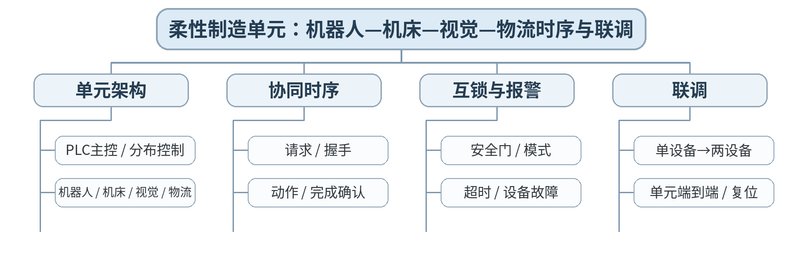

### 教学目标
**知识目标：**
1. 掌握柔性制造单元的控制架构、握手时序、互锁与报警机制。
2. 理解分层联调：单设备、设备对、子流程、单元端到端的基本顺序。

**能力目标：**
1. 能够绘制机器人—机床—视觉—AGV的时序图和接口控制文档片段。
2. 能够根据异常日志定位问题属于设备、接口、时序还是业务规则。

**价值目标：**
1. 形成以接口文档、测试证据和跨团队协作完成单元集成的习惯。

### 课程思政
强调设备互锁和联调测试必须以安全生产为底线，不能通过屏蔽报警“快速通过验收”。

### 专创融合
将柔性单元集成文档沉淀为标准模板，为机器人工作站/智能装备集成服务提供复用基础。

### 教学重难点
**教学重点：**柔性单元时序、互锁与分层联调。

**教学难点：**避免“双方都在等对方”的握手死锁，并保证复位/重启后状态一致。

### 教学方法与用具
**教学方法：**讲授法、架构图解法、协议/接口对比法、案例分析法、系统边界分析、分组研讨、方案评审

**教学用具：**电脑、投影仪、教材、柔性制造单元案例、时序图/状态机工具、测试矩阵模板。

### 教学设计
课前任务 → 互动导入（15 min）→ 传授新知与案例训练（70 min）→ 过关检测（10 min）→ 课堂小结（3 min）→ 作业布置（1 min）→ 考勤（1 min）

### 课前任务
【教师】发布“柔性制造单元：机器人—机床—视觉—物流时序与联调”对应大纲/教材范围和一个最小案例，不提前给出完整分析结果。

1. 阅读指定内容并圈出3—5个核心术语；
2. 预读一个架构图、接口表、数据流或异常案例，写出第一判断；
3. 记录至少1个“系统边界/接口/数据/异常”问题。

【学生】完成预习与问题记录，带着判断依据进入课堂。

### 互动导入
【教师】给出时序：PLC等待机器人Ready，机器人等待PLC Start，双方均未主动置位，提问这是不是网络故障？

【学生】先独立判断，再与同伴交换依据；教师收集典型分歧后进入本课。

### 传授新知与案例训练
**单元架构（约25 min）**

【教师】确定PLC主控、设备自治与上位调度边界；说明谁负责节拍、谁负责安全、谁负责设备内部动作。

【学生】围绕案例完成对应架构、接口表、时序图、数据流或风险分析，保留修改前后依据。

**时序与接口控制（约25 min）**

【教师】讲请求—允许—执行—完成—复位的握手，视觉判定与物流到位插入时序；学生绘制正常流程。

【学生】围绕案例完成对应架构、接口表、时序图、数据流或风险分析，保留修改前后依据。

**分层联调（约20 min）**

【教师】建立单设备→设备对→子流程→端到端测试矩阵；故障注入“信号丢失/超时/重复完成”，分析恢复与复位。

【学生】围绕案例完成对应架构、接口表、时序图、数据流或风险分析，保留修改前后依据。

**课堂学习产物**：柔性制造单元时序图＋接口控制表＋分层联调测试矩阵。

**学习证据**：时序图、接口控制表、测试矩阵、故障归因和恢复说明。

**评价映射**：课程作业“制造单元接口与协同”（20%模块）阶段成果；目标1.3、2.3、3.2、3.3。

### 过关检测
【教师】组织当堂检测：

1. 握手时序中为什么要有完成确认和复位？
2. 联调为什么应从单设备开始而不是直接整线？
3. 如何区分网络故障和逻辑死锁？

【学生】独立作答/完成图表判断；【教师】依据错误类型讲解，并要求学生说明系统边界、接口或数据依据。

### 课堂小结
【教师】回到知识脉络图，用“对象—接口—数据—流程—异常—证据”总结“柔性制造单元：机器人—机床—视觉—物流时序与联调”，再次强调：柔性单元时序、互锁与分层联调。

【学生】写下“本课一条最重要的集成规则＋一个最容易出错的边界”。

### 作业布置
【教师】布置课后任务：提交制造单元集成阶段作业：架构、接口表、时序图、互锁/报警和测试矩阵。

【学生】按课程图表和文档命名规范整理提交，保留版本和修改依据。

### 考勤
【教师】利用学校/课程实际使用的平台进行签到。

【学生】按课程要求完成签到。

### 课后教学反思
【课后填写，不预填事实】

1. 教学流程：记录100 min各环节实际用时及需要调整的位置；
2. 教学内容：重点记录“避免“双方都在等对方”的握手死锁，并保证复位/重启后状态一致。”的真实掌握证据与典型错误；
3. 学生参与：仅依据课堂实际记录填写架构分析、讨论、互审和技术表达情况，不补写推测性结论；
4. 评价证据：检查本课图表/接口/时序/风险记录是否完整，记录缺项及原因；
5. 后续改进：依据真实课堂证据决定下一轮内容、案例或任务调整。

### 本章节参考文献
[4] 朱志亮, 郑道友, 陈传周.《智能制造装备单元系统集成》[M]. 北京：机械工业出版社，2024。
[5] 宋志刚, 郭树军, 文双全.《智能工厂应用与虚拟仿真调试》[M]. 北京：机械工业出版社，2025。

## 第09次课 MES核心功能与生产工单执行闭环

### 课次信息
- **章节/单元**：第四单元 MES与企业信息系统集成
- **周次**：按实际课表填写
- **课时安排**：2课时（100 min）
- **课型**：理论

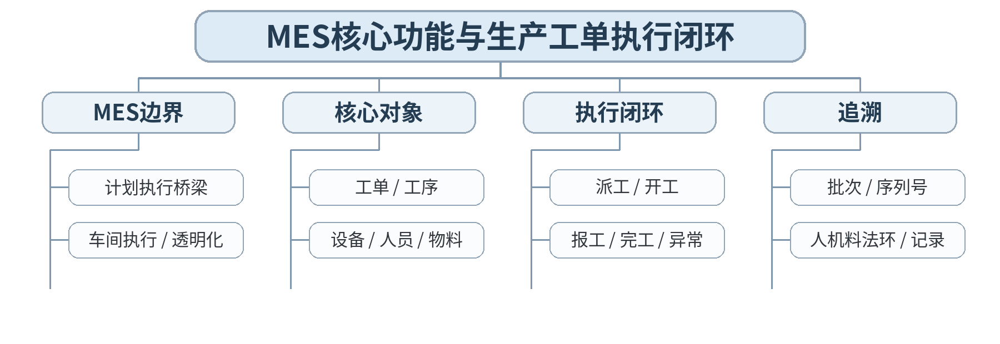

### 教学目标
**知识目标：**
1. 理解MES在企业计划层与现场控制层之间的功能定位。
2. 掌握工单、工序、派工、开工、报工、完工、质量与追溯等核心对象/事件。

**能力目标：**
1. 能够将一个订单拆解为生产工单执行链，并绘制MES业务流程。
2. 能够识别“MES负责业务执行”与“PLC负责实时控制”的边界。

**价值目标：**
1. 形成业务数据真实性和制造过程可追溯意识。

### 课程思政
通过报工真实性、质量追溯和责任链强调工业数据不能“为了完成指标”而失真。

### 专创融合
把MES工单流程作为数字化车间应用的核心业务原型，训练从业务到系统功能的产品设计。

### 教学重难点
**教学重点：**MES功能边界；工单执行闭环与追溯。

**教学难点：**不把MES设计成“远程PLC”；理解业务事件与设备实时信号的时间尺度和责任差异。

### 教学方法与用具
**教学方法：**讲授法、架构图解法、协议/接口对比法、案例分析法、系统边界分析、分组研讨、方案评审

**教学用具：**电脑、投影仪、教材、MES业务流程案例、BPMN/流程图工具。

### 教学设计
课前任务 → 互动导入（15 min）→ 传授新知与案例训练（70 min）→ 过关检测（10 min）→ 课堂小结（3 min）→ 作业布置（1 min）→ 考勤（1 min）

### 课前任务
【教师】发布“MES核心功能与生产工单执行闭环”对应大纲/教材范围和一个最小案例，不提前给出完整分析结果。

1. 阅读指定内容并圈出3—5个核心术语；
2. 预读一个架构图、接口表、数据流或异常案例，写出第一判断；
3. 记录至少1个“系统边界/接口/数据/异常”问题。

【学生】完成预习与问题记录，带着判断依据进入课堂。

### 互动导入
【教师】给出“MES直接控制机器人每一步动作”的架构，让学生判断这种设计在哪些责任和实时性上存在问题。

【学生】先独立判断，再与同伴交换依据；教师收集典型分歧后进入本课。

### 传授新知与案例训练
**MES定位（约25 min）**

【教师】讲MES连接计划与现场执行，说明工单、工序、资源、状态、质量和追溯的核心对象。

【学生】围绕案例完成对应架构、接口表、时序图、数据流或风险分析，保留修改前后依据。

**工单闭环（约25 min）**

【教师】订单/计划→工单→派工→准备→开工→报工→质量→完工/异常；区分业务状态和设备状态。

【学生】围绕案例完成对应架构、接口表、时序图、数据流或风险分析，保留修改前后依据。

**流程建模（约20 min）**

【教师】学生以“零件A加工—检测—入库”设计MES流程图和业务事件表，标明每个事件来源、时间、关联对象。

【学生】围绕案例完成对应架构、接口表、时序图、数据流或风险分析，保留修改前后依据。

**课堂学习产物**：MES工单执行流程图＋业务事件表＋追溯字段清单。

**学习证据**：流程图、事件表、MES/PLC边界说明、追溯字段。

**评价映射**：平时成绩；课程作业“MES与业务系统集成”（20%模块）过程证据；目标1.4、2.4、3.1、3.4。

### 过关检测
【教师】组织当堂检测：

1. MES与PLC的核心职责边界是什么？
2. 工单状态和设备状态可以直接等同吗？
3. 追溯为什么必须有唯一标识和时间？

【学生】独立作答/完成图表判断；【教师】依据错误类型讲解，并要求学生说明系统边界、接口或数据依据。

### 课堂小结
【教师】回到知识脉络图，用“对象—接口—数据—流程—异常—证据”总结“MES核心功能与生产工单执行闭环”，再次强调：MES功能边界；工单执行闭环与追溯。

【学生】写下“本课一条最重要的集成规则＋一个最容易出错的边界”。

### 作业布置
【教师】布置课后任务：完善工单闭环，为异常停机、质量不合格和返工分别补一条业务路径。

【学生】按课程图表和文档命名规范整理提交，保留版本和修改依据。

### 考勤
【教师】利用学校/课程实际使用的平台进行签到。

【学生】按课程要求完成签到。

### 课后教学反思
【课后填写，不预填事实】

1. 教学流程：记录100 min各环节实际用时及需要调整的位置；
2. 教学内容：重点记录“不把MES设计成“远程PLC”；理解业务事件与设备实时信号的时间尺度和责任差异。”的真实掌握证据与典型错误；
3. 学生参与：仅依据课堂实际记录填写架构分析、讨论、互审和技术表达情况，不补写推测性结论；
4. 评价证据：检查本课图表/接口/时序/风险记录是否完整，记录缺项及原因；
5. 后续改进：依据真实课堂证据决定下一轮内容、案例或任务调整。

### 本章节参考文献
[1] 王军利, 白海清.《智能集成制造系统》[M]. 北京：机械工业出版社，2024。
[2] 胡耀光.《智能制造系统设计与运行控制》[M]. 北京：机械工业出版社，2024。

## 第10次课 ERP、PLM、WMS、QMS、SCADA与MES的边界和主数据

### 课次信息
- **章节/单元**：第四单元 MES与企业信息系统集成
- **周次**：按实际课表填写
- **课时安排**：2课时（100 min）
- **课型**：理论

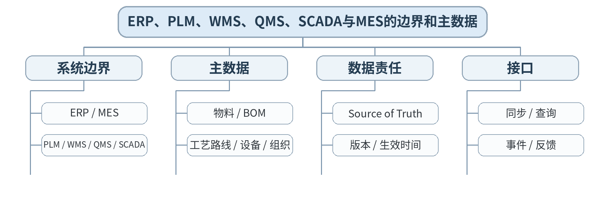

### 教学目标
**知识目标：**
1. 理解ERP、PLM、WMS、QMS、SCADA与MES的主要功能边界。
2. 掌握物料、BOM、工艺路线、设备、人员、仓库等主数据及“唯一权威来源”概念。

**能力目标：**
1. 能够确定一类主数据由哪个系统负责、其他系统如何消费。
2. 能够识别同一物料/BOM多版本并存造成的数据一致性风险。

**价值目标：**
1. 形成主数据、版本、来源、变更和责任方明确的数据治理意识。

### 课程思政
强调数据来源真实、变更有审批、版本可追溯，防止跨系统复制导致责任模糊。

### 专创融合
将主数据责任矩阵作为MES/ERP集成咨询和实施的核心交付件。

### 教学重难点
**教学重点：**多系统功能边界；主数据来源与版本。

**教学难点：**系统集成中“都存一份数据”不等于“数据一致”，必须明确Source of Truth和同步规则。

### 教学方法与用具
**教学方法：**讲授法、架构图解法、协议/接口对比法、案例分析法、系统边界分析、分组研讨、方案评审

**教学用具：**电脑、投影仪、教材、ERP/PLM/MES/WMS/QMS边界案例、主数据模板。

### 教学设计
课前任务 → 互动导入（15 min）→ 传授新知与案例训练（70 min）→ 过关检测（10 min）→ 课堂小结（3 min）→ 作业布置（1 min）→ 考勤（1 min）

### 课前任务
【教师】发布“ERP、PLM、WMS、QMS、SCADA与MES的边界和主数据”对应大纲/教材范围和一个最小案例，不提前给出完整分析结果。

1. 阅读指定内容并圈出3—5个核心术语；
2. 预读一个架构图、接口表、数据流或异常案例，写出第一判断；
3. 记录至少1个“系统边界/接口/数据/异常”问题。

【学生】完成预习与问题记录，带着判断依据进入课堂。

### 互动导入
【教师】展示MES和ERP中同一个物料有两个编码、PLM中BOM版本不同，提问：哪个系统错了？谁应该是权威来源？

【学生】先独立判断，再与同伴交换依据；教师收集典型分歧后进入本课。

### 传授新知与案例训练
**系统边界（约25 min）**

【教师】ERP管企业资源/订单计划，PLM管产品/BOM/工艺设计，WMS管库存物流，QMS管质量，SCADA侧重监控，MES管执行协同。

【学生】围绕案例完成对应架构、接口表、时序图、数据流或风险分析，保留修改前后依据。

**主数据治理（约25 min）**

【教师】定义物料、BOM、工艺路线、设备、组织等主数据；讨论编码、版本、生效时间、停用和历史追溯。

【学生】围绕案例完成对应架构、接口表、时序图、数据流或风险分析，保留修改前后依据。

**责任矩阵（约20 min）**

【教师】学生完成“数据对象—权威系统—消费系统—同步方式—变更触发—失败处理”矩阵。

【学生】围绕案例完成对应架构、接口表、时序图、数据流或风险分析，保留修改前后依据。

**课堂学习产物**：企业系统边界图＋主数据责任矩阵。

**学习证据**：系统边界图、主数据矩阵、冲突版本案例处理原则。

**评价映射**：平时成绩；课程作业“MES与业务系统集成”（20%模块）过程证据；目标1.4、2.4、3.1、3.4。

### 过关检测
【教师】组织当堂检测：

1. PLM和ERP在BOM相关数据上的职责如何区分？
2. 为什么一个数据对象需要明确权威系统？
3. 版本生效时间为什么属于接口信息？

【学生】独立作答/完成图表判断；【教师】依据错误类型讲解，并要求学生说明系统边界、接口或数据依据。

### 课堂小结
【教师】回到知识脉络图，用“对象—接口—数据—流程—异常—证据”总结“ERP、PLM、WMS、QMS、SCADA与MES的边界和主数据”，再次强调：多系统功能边界；主数据来源与版本。

【学生】写下“本课一条最重要的集成规则＋一个最容易出错的边界”。

### 作业布置
【教师】布置课后任务：为物料、BOM、工艺路线、库存、质量结果5类数据补全同步与失败处理规则。

【学生】按课程图表和文档命名规范整理提交，保留版本和修改依据。

### 考勤
【教师】利用学校/课程实际使用的平台进行签到。

【学生】按课程要求完成签到。

### 课后教学反思
【课后填写，不预填事实】

1. 教学流程：记录100 min各环节实际用时及需要调整的位置；
2. 教学内容：重点记录“系统集成中“都存一份数据”不等于“数据一致”，必须明确Source of Truth和同步规则。”的真实掌握证据与典型错误；
3. 学生参与：仅依据课堂实际记录填写架构分析、讨论、互审和技术表达情况，不补写推测性结论；
4. 评价证据：检查本课图表/接口/时序/风险记录是否完整，记录缺项及原因；
5. 后续改进：依据真实课堂证据决定下一轮内容、案例或任务调整。

### 本章节参考文献
[1] 王军利, 白海清.《智能集成制造系统》[M]. 北京：机械工业出版社，2024。
[2] 胡耀光.《智能制造系统设计与运行控制》[M]. 北京：机械工业出版社，2024。

## 第11次课 订单—计划—工单—质量—入库的数据链与接口模式

### 课次信息
- **章节/单元**：第四单元 MES与企业信息系统集成
- **周次**：按实际课表填写
- **课时安排**：2课时（100 min）
- **课型**：理论

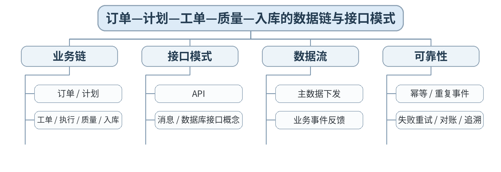

### 教学目标
**知识目标：**
1. 掌握订单到生产执行、质量和入库的数据/业务链。
2. 理解API、消息和数据库接口概念及典型适用场景。

**能力目标：**
1. 能够绘制ERP—MES—QMS—WMS的数据流/时序图。
2. 能够针对重复消息、接口失败、延迟数据设计基本对账和恢复思路。

**价值目标：**
1. 形成以接口规范、测试证据和异常对账保障业务闭环的协作习惯。

### 课程思政
通过重复工单、错误质量结果等案例强化业务数据真实性、接口责任和质量追溯。

### 专创融合
将业务时序和接口清单转化为企业系统集成方案的标准交付物。

### 教学重难点
**教学重点：**跨系统业务时序、接口模式和可靠性。

**教学难点：**理解接口可靠性不仅是“重试”，还涉及幂等、唯一业务键、状态对账和补偿。

### 教学方法与用具
**教学方法：**讲授法、架构图解法、协议/接口对比法、案例分析法、系统边界分析、分组研讨、方案评审

**教学用具：**电脑、投影仪、教材、API/消息时序案例、接口清单模板。

### 教学设计
课前任务 → 互动导入（15 min）→ 传授新知与案例训练（70 min）→ 过关检测（10 min）→ 课堂小结（3 min）→ 作业布置（1 min）→ 考勤（1 min）

### 课前任务
【教师】发布“订单—计划—工单—质量—入库的数据链与接口模式”对应大纲/教材范围和一个最小案例，不提前给出完整分析结果。

1. 阅读指定内容并圈出3—5个核心术语；
2. 预读一个架构图、接口表、数据流或异常案例，写出第一判断；
3. 记录至少1个“系统边界/接口/数据/异常”问题。

【学生】完成预习与问题记录，带着判断依据进入课堂。

### 互动导入
【教师】给出MES重复收到ERP“创建工单”消息导致两张同号工单的案例，提问：仅增加重试次数能解决吗？

【学生】先独立判断，再与同伴交换依据；教师收集典型分歧后进入本课。

### 传授新知与案例训练
**业务链（约25 min）**

【教师】订单→计划→工单→派工/执行→质量→完工→入库→ERP反馈，标注各系统读写职责。

【学生】围绕案例完成对应架构、接口表、时序图、数据流或风险分析，保留修改前后依据。

**接口模式（约25 min）**

【教师】比较同步API、异步消息和数据库接口概念；说明选择与耦合、实时性、失败处理有关。

【学生】围绕案例完成对应架构、接口表、时序图、数据流或风险分析，保留修改前后依据。

**可靠性与时序（约20 min）**

【教师】讲唯一业务键、幂等、重试、对账、失败队列/人工介入概念；学生绘制正常和接口失败两条时序。

【学生】围绕案例完成对应架构、接口表、时序图、数据流或风险分析，保留修改前后依据。

**课堂学习产物**：ERP—MES—QMS—WMS业务时序图＋接口清单＋失败恢复表。

**学习证据**：时序图、接口方向/触发/数据对象、重复/失败案例处理、追溯链。

**评价映射**：课程作业“MES与业务系统集成”（20%模块）阶段成果；目标1.4、2.4、3.1、3.4。

### 过关检测
【教师】组织当堂检测：

1. 同步API与异步消息的核心差别是什么？
2. 为什么重试必须考虑幂等？
3. 跨系统对账至少需要哪些业务标识？

【学生】独立作答/完成图表判断；【教师】依据错误类型讲解，并要求学生说明系统边界、接口或数据依据。

### 课堂小结
【教师】回到知识脉络图，用“对象—接口—数据—流程—异常—证据”总结“订单—计划—工单—质量—入库的数据链与接口模式”，再次强调：跨系统业务时序、接口模式和可靠性。

【学生】写下“本课一条最重要的集成规则＋一个最容易出错的边界”。

### 作业布置
【教师】布置课后任务：提交本单元阶段作业：系统边界、主数据矩阵、业务时序、接口清单和异常恢复说明。

【学生】按课程图表和文档命名规范整理提交，保留版本和修改依据。

### 考勤
【教师】利用学校/课程实际使用的平台进行签到。

【学生】按课程要求完成签到。

### 课后教学反思
【课后填写，不预填事实】

1. 教学流程：记录100 min各环节实际用时及需要调整的位置；
2. 教学内容：重点记录“理解接口可靠性不仅是“重试”，还涉及幂等、唯一业务键、状态对账和补偿。”的真实掌握证据与典型错误；
3. 学生参与：仅依据课堂实际记录填写架构分析、讨论、互审和技术表达情况，不补写推测性结论；
4. 评价证据：检查本课图表/接口/时序/风险记录是否完整，记录缺项及原因；
5. 后续改进：依据真实课堂证据决定下一轮内容、案例或任务调整。

### 本章节参考文献
[1] 王军利, 白海清.《智能集成制造系统》[M]. 北京：机械工业出版社，2024。
[2] 胡耀光.《智能制造系统设计与运行控制》[M]. 北京：机械工业出版社，2024。

## 第12次课 设备数据采集、边缘网关、边缘计算与数据质量

### 课次信息
- **章节/单元**：第五单元 工业互联网平台、边缘计算与数字孪生
- **周次**：按实际课表填写
- **课时安排**：2课时（100 min）
- **课型**：理论

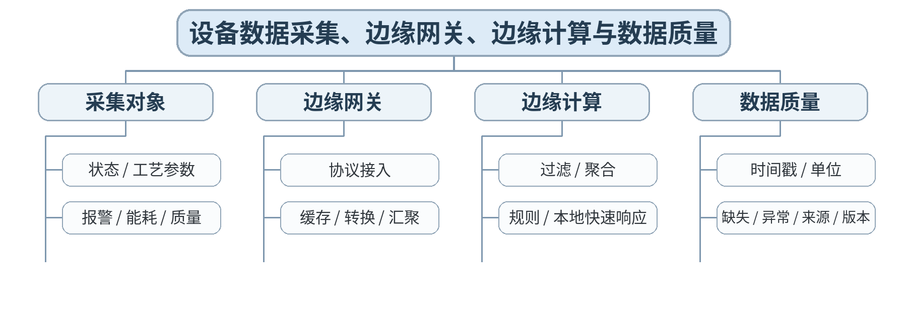

### 教学目标
**知识目标：**
1. 理解设备数据采集、边缘网关和边缘计算的基本作用。
2. 掌握工业数据质量的时间戳、单位、来源、缺失、异常和版本等要求。

**能力目标：**
1. 能够为一个设备健康/OEE场景设计采集点表、采样周期和边缘处理规则。
2. 能够判断数据质量问题应在设备、网关还是平台层处理。

**价值目标：**
1. 形成数据治理、隐私、模型可信和“数据先可信再分析”的责任意识。

### 课程思政
强调工业数据不得脱离来源和语义使用，涉及人员/企业敏感数据应执行最小采集和权限控制。

### 专创融合
将数据字典和边缘规则沉淀为工业互联网接入模板，支撑多设备快速接入。

### 教学重难点
**教学重点：**设备数据采集/边缘处理；数据质量。

**教学难点：**区分原始数据、派生指标和边缘规则结果，并保持来源/时间/单位可追溯。

### 教学方法与用具
**教学方法：**讲授法、架构图解法、协议/接口对比法、案例分析法、系统边界分析、分组研讨、方案评审

**教学用具：**电脑、投影仪、教材、工业网关/边缘架构案例、数据字典模板。

### 教学设计
课前任务 → 互动导入（15 min）→ 传授新知与案例训练（70 min）→ 过关检测（10 min）→ 课堂小结（3 min）→ 作业布置（1 min）→ 考勤（1 min）

### 课前任务
【教师】发布“设备数据采集、边缘网关、边缘计算与数据质量”对应大纲/教材范围和一个最小案例，不提前给出完整分析结果。

1. 阅读指定内容并圈出3—5个核心术语；
2. 预读一个架构图、接口表、数据流或异常案例，写出第一判断；
3. 记录至少1个“系统边界/接口/数据/异常”问题。

【学生】完成预习与问题记录，带着判断依据进入课堂。

### 互动导入
【教师】给出“同一主轴转速在PLC是rpm、平台按r/s解释”的案例，提问：算法没错为什么OEE/能耗分析仍然错误？

【学生】先独立判断，再与同伴交换依据；教师收集典型分歧后进入本课。

### 传授新知与案例训练
**采集与数据点（约25 min）**

【教师】从设备状态、工艺参数、报警、能耗、质量设计采集点；讨论采样周期、变化上报和事件数据。

【学生】围绕案例完成对应架构、接口表、时序图、数据流或风险分析，保留修改前后依据。

**网关与边缘（约25 min）**

【教师】协议接入、缓存、断网续传、过滤、聚合和本地规则；说明边缘不是“所有计算都搬到现场”。

【学生】围绕案例完成对应架构、接口表、时序图、数据流或风险分析，保留修改前后依据。

**数据质量（约20 min）**

【教师】学生建立数据字典：名称、来源、类型、单位、频率、时间戳、质量码、异常范围、责任方，并设计3条边缘处理规则。

【学生】围绕案例完成对应架构、接口表、时序图、数据流或风险分析，保留修改前后依据。

**课堂学习产物**：设备采集点表＋边缘处理规则＋数据质量字典。

**学习证据**：数据字典、采样/上报规则、质量问题案例与处理位置说明。

**评价映射**：平时成绩；课程作业“平台数据与数字孪生”（20%模块）过程证据；目标1.5、2.5、3.2、3.5、3.6。

### 过关检测
【教师】组织当堂检测：

1. 设备数据点表为什么必须记录单位和来源？
2. 边缘计算适合解决哪类问题？
3. 断网续传时为什么时间戳比到达时间更重要？

【学生】独立作答/完成图表判断；【教师】依据错误类型讲解，并要求学生说明系统边界、接口或数据依据。

### 课堂小结
【教师】回到知识脉络图，用“对象—接口—数据—流程—异常—证据”总结“设备数据采集、边缘网关、边缘计算与数据质量”，再次强调：设备数据采集/边缘处理；数据质量。

【学生】写下“本课一条最重要的集成规则＋一个最容易出错的边界”。

### 作业布置
【教师】布置课后任务：为OEE或设备健康场景补充20个数据字段并标出质量规则。

【学生】按课程图表和文档命名规范整理提交，保留版本和修改依据。

### 考勤
【教师】利用学校/课程实际使用的平台进行签到。

【学生】按课程要求完成签到。

### 课后教学反思
【课后填写，不预填事实】

1. 教学流程：记录100 min各环节实际用时及需要调整的位置；
2. 教学内容：重点记录“区分原始数据、派生指标和边缘规则结果，并保持来源/时间/单位可追溯。”的真实掌握证据与典型错误；
3. 学生参与：仅依据课堂实际记录填写架构分析、讨论、互审和技术表达情况，不补写推测性结论；
4. 评价证据：检查本课图表/接口/时序/风险记录是否完整，记录缺项及原因；
5. 后续改进：依据真实课堂证据决定下一轮内容、案例或任务调整。

### 本章节参考文献
[3] 林锋, 洪连环.《数字化网络化智能技术：工业互联网平台与工业APP》[M]. 北京：机械工业出版社，2024。
[1] 王军利, 白海清.《智能集成制造系统》[M]. 北京：机械工业出版社，2024。

## 第13次课 信息模型、工业互联网平台、时序数据与OEE/能耗/质量应用

### 课次信息
- **章节/单元**：第五单元 工业互联网平台、边缘计算与数字孪生
- **周次**：按实际课表填写
- **课时安排**：2课时（100 min）
- **课型**：理论

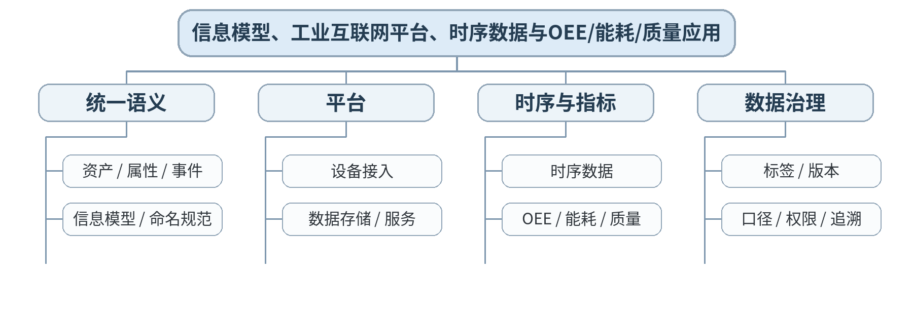

### 教学目标
**知识目标：**
1. 理解信息模型、统一数据语义、工业互联网平台和时序数据的基本作用。
2. 理解OEE、能耗、质量、设备健康等应用如何依赖统一数据模型。

**能力目标：**
1. 能够把多设备异构数据映射为统一资产/属性模型。
2. 能够定义一个OEE或能耗指标的输入数据、计算口径和异常处理。

**价值目标：**
1. 形成指标口径、数据权限和模型版本必须可追溯的数据治理意识。

### 课程思政
通过指标口径和数据版本案例强调不得随意调整口径以美化结果，保持数据诚信。

### 专创融合
把统一信息模型视为数据中台/工业APP的公共产品契约，提升跨系统复用能力。

### 教学重难点
**教学重点：**信息模型与平台数据链；时序数据和业务指标。

**教学难点：**不要把“字段名统一”误当成“语义统一”；指标必须说明时间窗口、状态定义和无效数据处理。

### 教学方法与用具
**教学方法：**讲授法、架构图解法、协议/接口对比法、案例分析法、系统边界分析、分组研讨、方案评审

**教学用具：**电脑、投影仪、教材、工业互联网平台架构案例、信息模型/指标模板。

### 教学设计
课前任务 → 互动导入（15 min）→ 传授新知与案例训练（70 min）→ 过关检测（10 min）→ 课堂小结（3 min）→ 作业布置（1 min）→ 考勤（1 min）

### 课前任务
【教师】发布“信息模型、工业互联网平台、时序数据与OEE/能耗/质量应用”对应大纲/教材范围和一个最小案例，不提前给出完整分析结果。

1. 阅读指定内容并圈出3—5个核心术语；
2. 预读一个架构图、接口表、数据流或异常案例，写出第一判断；
3. 记录至少1个“系统边界/接口/数据/异常”问题。

【学生】完成预习与问题记录，带着判断依据进入课堂。

### 互动导入
【教师】给出三台设备分别用Run=1、State=3、Status="Running"表示运行状态，提问平台如何得到统一“运行”语义？

【学生】先独立判断，再与同伴交换依据；教师收集典型分歧后进入本课。

### 传授新知与案例训练
**信息模型（约25 min）**

【教师】资产、属性、事件、关系；说明统一命名、类型、单位、枚举和版本，比简单字段映射更重要。

【学生】围绕案例完成对应架构、接口表、时序图、数据流或风险分析，保留修改前后依据。

**平台与时序数据（约25 min）**

【教师】设备→边缘→平台→时序存储/数据服务；说明时序数据的时间窗口、标签和查询。

【学生】围绕案例完成对应架构、接口表、时序图、数据流或风险分析，保留修改前后依据。

**指标应用（约20 min）**

【教师】以OEE或能耗为例，学生写“数据输入—口径—计算—异常—展示”的指标定义卡，互审是否存在口径歧义。

【学生】围绕案例完成对应架构、接口表、时序图、数据流或风险分析，保留修改前后依据。

**课堂学习产物**：统一设备信息模型＋OEE/能耗指标定义卡。

**学习证据**：模型字段映射、指标口径、异常数据处理、版本说明。

**评价映射**：平时成绩；课程作业“平台数据与数字孪生”（20%模块）过程证据；目标1.5、2.5、3.2、3.5、3.6。

### 过关检测
【教师】组织当堂检测：

1. 统一字段名为什么不等于统一语义？
2. OEE计算为什么必须明确设备状态定义和时间窗口？
3. 信息模型版本变化如何影响上层应用？

【学生】独立作答/完成图表判断；【教师】依据错误类型讲解，并要求学生说明系统边界、接口或数据依据。

### 课堂小结
【教师】回到知识脉络图，用“对象—接口—数据—流程—异常—证据”总结“信息模型、工业互联网平台、时序数据与OEE/能耗/质量应用”，再次强调：信息模型与平台数据链；时序数据和业务指标。

【学生】写下“本课一条最重要的集成规则＋一个最容易出错的边界”。

### 作业布置
【教师】布置课后任务：选择OEE、能耗、质量或设备健康之一，形成完整指标数据链和模型版本说明。

【学生】按课程图表和文档命名规范整理提交，保留版本和修改依据。

### 考勤
【教师】利用学校/课程实际使用的平台进行签到。

【学生】按课程要求完成签到。

### 课后教学反思
【课后填写，不预填事实】

1. 教学流程：记录100 min各环节实际用时及需要调整的位置；
2. 教学内容：重点记录“不要把“字段名统一”误当成“语义统一”；指标必须说明时间窗口、状态定义和无效数据处理。”的真实掌握证据与典型错误；
3. 学生参与：仅依据课堂实际记录填写架构分析、讨论、互审和技术表达情况，不补写推测性结论；
4. 评价证据：检查本课图表/接口/时序/风险记录是否完整，记录缺项及原因；
5. 后续改进：依据真实课堂证据决定下一轮内容、案例或任务调整。

### 本章节参考文献
[3] 林锋, 洪连环.《数字化网络化智能技术：工业互联网平台与工业APP》[M]. 北京：机械工业出版社，2024。
[1] 王军利, 白海清.《智能集成制造系统》[M]. 北京：机械工业出版社，2024。

## 第14次课 数字孪生：模型、状态映射、虚实同步与应用边界

### 课次信息
- **章节/单元**：第五单元 工业互联网平台、边缘计算与数字孪生
- **周次**：按实际课表填写
- **课时安排**：2课时（100 min）
- **课型**：理论

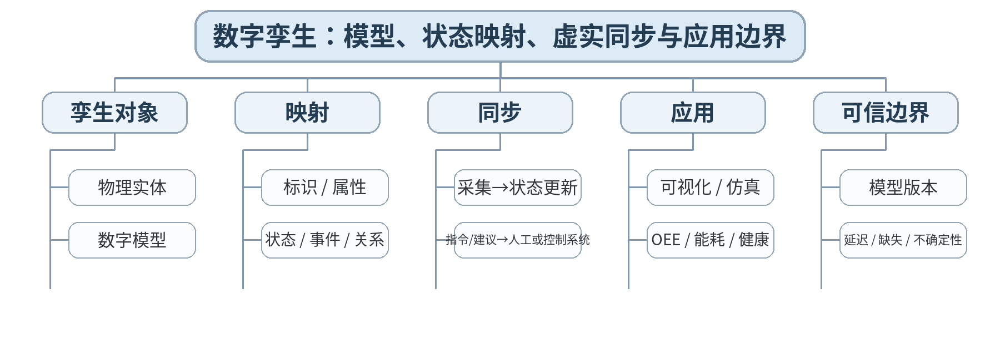

### 教学目标
**知识目标：**
1. 理解数字孪生的物理对象、数字模型、状态映射与虚实同步。
2. 理解数字孪生与普通3D可视化、SCADA画面、离线仿真的区别。

**能力目标：**
1. 能够为一个机床/柔性单元设计孪生对象、属性、状态、事件和数据来源。
2. 能够识别同步延迟、模型失配和数据缺失对孪生可信度的影响。

**价值目标：**
1. 形成模型可信、数据来源明确、自动控制边界清楚的工程意识。

### 课程思政
强调数字模型不能掩盖数据不确定性，关键决策应显示来源、时间和可信状态。

### 专创融合
将数字孪生对象模型作为智能工厂仿真、运维和工业APP的复用资产。

### 教学重难点
**教学重点：**数字孪生对象模型、状态映射和虚实同步。

**教学难点：**避免把“3D模型+实时数据”简单称为完整数字孪生，理解模型、关系、状态和闭环应用。

### 教学方法与用具
**教学方法：**讲授法、架构图解法、协议/接口对比法、案例分析法、系统边界分析、分组研讨、方案评审

**教学用具：**电脑、投影仪、教材、数字孪生架构/可视化案例、对象模型工具。

### 教学设计
课前任务 → 互动导入（15 min）→ 传授新知与案例训练（70 min）→ 过关检测（10 min）→ 课堂小结（3 min）→ 作业布置（1 min）→ 考勤（1 min）

### 课前任务
【教师】发布“数字孪生：模型、状态映射、虚实同步与应用边界”对应大纲/教材范围和一个最小案例，不提前给出完整分析结果。

1. 阅读指定内容并圈出3—5个核心术语；
2. 预读一个架构图、接口表、数据流或异常案例，写出第一判断；
3. 记录至少1个“系统边界/接口/数据/异常”问题。

【学生】完成预习与问题记录，带着判断依据进入课堂。

### 互动导入
【教师】展示两个系统：A只有3D动画，B有设备唯一标识、实时状态、工单上下文、报警、历史与仿真模型，提问哪个更接近数字孪生，为什么？

【学生】先独立判断，再与同伴交换依据；教师收集典型分歧后进入本课。

### 传授新知与案例训练
**孪生结构（约25 min）**

【教师】物理实体、数字模型、连接/数据、服务/应用；区分可视化与模型驱动的数字孪生。

【学生】围绕案例完成对应架构、接口表、时序图、数据流或风险分析，保留修改前后依据。

**状态映射（约25 min）**

【教师】从设备数据字典映射资产、属性、状态、事件、关系；说明标识一致、模型版本和时间同步。

【学生】围绕案例完成对应架构、接口表、时序图、数据流或风险分析，保留修改前后依据。

**同步与可信（约20 min）**

【教师】学生设计“机床孪生卡”，并分析数据延迟、断网、模型版本不一致、错误传感器数据时系统如何标记不可信。

【学生】围绕案例完成对应架构、接口表、时序图、数据流或风险分析，保留修改前后依据。

**课堂学习产物**：机床/柔性单元数字孪生对象模型＋状态映射表＋可信度风险清单。

**学习证据**：孪生模型、数据来源、同步周期、异常/不可信标记、应用说明。

**评价映射**：课程作业“平台数据与数字孪生”（20%模块）阶段成果；目标1.5、2.5、3.2、3.5、3.6。

### 过关检测
【教师】组织当堂检测：

1. 数字孪生与3D可视化的核心差别是什么？
2. 虚实同步为什么必须考虑延迟和时间戳？
3. 模型版本不一致时应如何避免错误决策？

【学生】独立作答/完成图表判断；【教师】依据错误类型讲解，并要求学生说明系统边界、接口或数据依据。

### 课堂小结
【教师】回到知识脉络图，用“对象—接口—数据—流程—异常—证据”总结“数字孪生：模型、状态映射、虚实同步与应用边界”，再次强调：数字孪生对象模型、状态映射和虚实同步。

【学生】写下“本课一条最重要的集成规则＋一个最容易出错的边界”。

### 作业布置
【教师】布置课后任务：提交本单元阶段作业：采集/边缘方案、数据字典、信息模型、指标卡和数字孪生状态映射。

【学生】按课程图表和文档命名规范整理提交，保留版本和修改依据。

### 考勤
【教师】利用学校/课程实际使用的平台进行签到。

【学生】按课程要求完成签到。

### 课后教学反思
【课后填写，不预填事实】

1. 教学流程：记录100 min各环节实际用时及需要调整的位置；
2. 教学内容：重点记录“避免把“3D模型+实时数据”简单称为完整数字孪生，理解模型、关系、状态和闭环应用。”的真实掌握证据与典型错误；
3. 学生参与：仅依据课堂实际记录填写架构分析、讨论、互审和技术表达情况，不补写推测性结论；
4. 评价证据：检查本课图表/接口/时序/风险记录是否完整，记录缺项及原因；
5. 后续改进：依据真实课堂证据决定下一轮内容、案例或任务调整。

### 本章节参考文献
[3] 林锋, 洪连环.《数字化网络化智能技术：工业互联网平台与工业APP》[M]. 北京：机械工业出版社，2024。
[5] 宋志刚, 郭树军, 文双全.《智能工厂应用与虚拟仿真调试》[M]. 北京：机械工业出版社，2025。

## 第15次课 需求分析、总体架构、接口控制与分层联调/端到端测试

### 课次信息
- **章节/单元**：第六单元 智能工厂集成设计、联调与运维
- **周次**：按实际课表填写
- **课时安排**：2课时（100 min）
- **课型**：理论

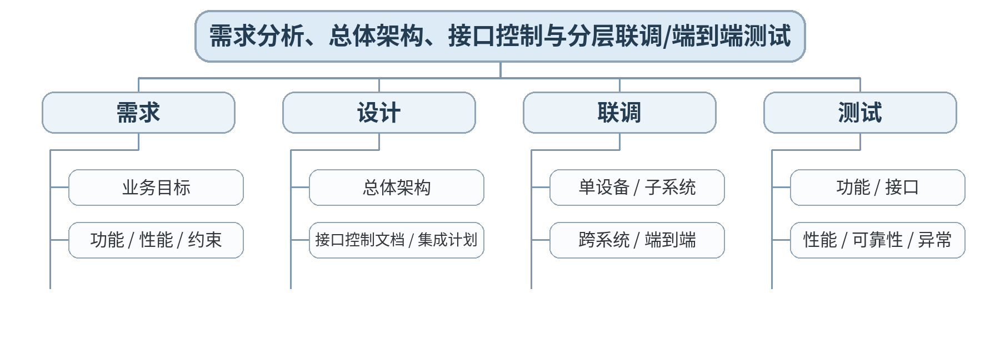

### 教学目标
**知识目标：**
1. 掌握智能工厂集成需求、总体架构、接口控制文档和集成计划的基本内容。
2. 理解分层联调和端到端测试的测试对象、顺序与证据要求。

**能力目标：**
1. 能够把综合场景的需求转化为架构、接口和测试矩阵。
2. 能够设计正常、边界、故障和恢复四类端到端测试。

**价值目标：**
1. 形成以需求、接口、测试证据和变更记录开展集成交付的职业习惯。

### 课程思政
强调工程交付不能隐瞒失败用例，测试数据和异常记录必须真实、可复核。

### 专创融合
将需求—接口—测试追踪矩阵视为系统集成项目管理和技术服务的核心能力。

### 教学重难点
**教学重点：**需求→架构→接口→联调→测试闭环。

**教学难点：**把“需求完成”转化为可验证的验收条件；避免只测试正常流程。

### 教学方法与用具
**教学方法：**讲授法、架构图解法、协议/接口对比法、案例分析法、系统边界分析、分组研讨、方案评审

**教学用具：**电脑、投影仪、教材、综合智能工厂案例、需求/ICD/测试矩阵模板。

### 教学设计
课前任务 → 互动导入（15 min）→ 传授新知与案例训练（70 min）→ 过关检测（10 min）→ 课堂小结（3 min）→ 作业布置（1 min）→ 考勤（1 min）

### 课前任务
【教师】发布“需求分析、总体架构、接口控制与分层联调/端到端测试”对应大纲/教材范围和一个最小案例，不提前给出完整分析结果。

1. 阅读指定内容并圈出3—5个核心术语；
2. 预读一个架构图、接口表、数据流或异常案例，写出第一判断；
3. 记录至少1个“系统边界/接口/数据/异常”问题。

【学生】完成预习与问题记录，带着判断依据进入课堂。

### 互动导入
【教师】给出需求“系统应稳定、实时、可靠”，提问：这种写法能验收吗？如何转成可以测试的指标或判据？

【学生】先独立判断，再与同伴交换依据；教师收集典型分歧后进入本课。

### 传授新知与案例训练
**需求与架构（约25 min）**

【教师】将业务目标拆成功能需求、性能/可靠性、安全/运维约束；建立需求到架构对象映射。

【学生】围绕案例完成对应架构、接口表、时序图、数据流或风险分析，保留修改前后依据。

**接口与集成计划（约25 min）**

【教师】ICD包含对象、字段、方向、协议、周期、异常、版本、责任方；集成计划按依赖和风险排序。

【学生】围绕案例完成对应架构、接口表、时序图、数据流或风险分析，保留修改前后依据。

**联调与测试（约20 min）**

【教师】学生为“订单→生产→质量→入库”设计单设备/子系统/跨系统/端到端测试矩阵，加入断网、设备故障、接口重复等场景。

【学生】围绕案例完成对应架构、接口表、时序图、数据流或风险分析，保留修改前后依据。

**课堂学习产物**：综合方案v1：需求清单＋总体架构＋ICD目录＋分层联调/端到端测试矩阵。

**学习证据**：需求—设计追踪、接口清单、测试用例、预期结果与责任方。

**评价映射**：平时成绩；课程作业“综合性阶段成果与验证证据”（15%模块）过程证据；期末综合方案过程稿；目标1.6、2.6、3.3—3.6。

### 过关检测
【教师】组织当堂检测：

1. 什么样的需求才可验收？
2. 为什么联调计划应按依赖和风险排序？
3. 端到端测试为什么必须包含异常与恢复？

【学生】独立作答/完成图表判断；【教师】依据错误类型讲解，并要求学生说明系统边界、接口或数据依据。

### 课堂小结
【教师】回到知识脉络图，用“对象—接口—数据—流程—异常—证据”总结“需求分析、总体架构、接口控制与分层联调/端到端测试”，再次强调：需求→架构→接口→联调→测试闭环。

【学生】写下“本课一条最重要的集成规则＋一个最容易出错的边界”。

### 作业布置
【教师】布置课后任务：完成综合方案v1，至少定义10条需求、15个接口对象和12条测试用例。

【学生】按课程图表和文档命名规范整理提交，保留版本和修改依据。

### 考勤
【教师】利用学校/课程实际使用的平台进行签到。

【学生】按课程要求完成签到。

### 课后教学反思
【课后填写，不预填事实】

1. 教学流程：记录100 min各环节实际用时及需要调整的位置；
2. 教学内容：重点记录“把“需求完成”转化为可验证的验收条件；避免只测试正常流程。”的真实掌握证据与典型错误；
3. 学生参与：仅依据课堂实际记录填写架构分析、讨论、互审和技术表达情况，不补写推测性结论；
4. 评价证据：检查本课图表/接口/时序/风险记录是否完整，记录缺项及原因；
5. 后续改进：依据真实课堂证据决定下一轮内容、案例或任务调整。

### 本章节参考文献
[1] 王军利, 白海清.《智能集成制造系统》[M]. 北京：机械工业出版社，2024。
[5] 宋志刚, 郭树军, 文双全.《智能工厂应用与虚拟仿真调试》[M]. 北京：机械工业出版社，2025。

## 第16次课 可靠性、安全、异常恢复、日志监控、备份、变更与综合方案评审

### 课次信息
- **章节/单元**：第六单元 智能工厂集成设计、联调与运维
- **周次**：按实际课表填写
- **课时安排**：2课时（100 min）
- **课型**：理论

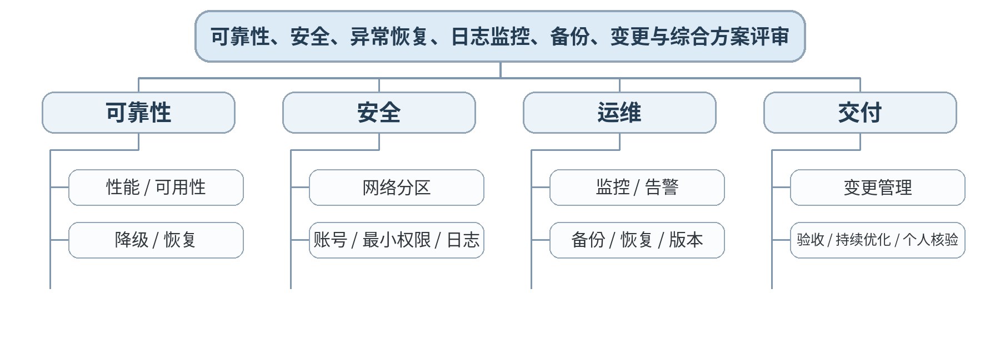

### 教学目标
**知识目标：**
1. 掌握智能工厂集成方案的性能、可靠性、网络/账号安全、异常恢复、日志监控、备份与变更管理基本要求。
2. 理解验收、运行维护和持续优化与前期架构/接口设计之间的闭环关系。

**能力目标：**
1. 能够对完整智能工厂方案进行风险评审，提出安全、可靠、可维护和可扩展改进项。
2. 能够独立解释关键架构选择、验证依据和方案局限，为期末综合报告/答辩做准备。

**价值目标：**
1. 形成工程伦理、安全生产、变更可控、交付可追溯和持续学习意识。

### 课程思政
以安全生产、工程伦理、真实测试记录和变更责任作为最终交付底线，禁止通过屏蔽报警或隐瞒失败完成“表面验收”。

### 专创融合
通过完整方案评审训练智能工厂系统集成、咨询、技术方案和项目交付能力。

### 教学重难点
**教学重点：**可靠性/安全/运维/变更/验收；综合方案评审。

**教学难点：**将“安全、运维、可维护性”前置到设计中，并处理恢复后数据/业务状态一致性。

### 教学方法与用具
**教学方法：**讲授法、架构图解法、协议/接口对比法、案例分析法、系统边界分析、分组研讨、方案评审

**教学用具：**电脑、投影仪、教材、综合案例、风险清单/测试矩阵/变更记录模板。

### 教学设计
课前任务 → 互动导入（15 min）→ 传授新知与案例训练（70 min）→ 过关检测（10 min）→ 课堂小结（3 min）→ 作业布置（1 min）→ 考勤（1 min）

### 课前任务
【教师】发布“可靠性、安全、异常恢复、日志监控、备份、变更与综合方案评审”对应大纲/教材范围和一个最小案例，不提前给出完整分析结果。

1. 阅读指定内容并圈出3—5个核心术语；
2. 预读一个架构图、接口表、数据流或异常案例，写出第一判断；
3. 记录至少1个“系统边界/接口/数据/异常”问题。

【学生】完成预习与问题记录，带着判断依据进入课堂。

### 互动导入
【教师】给出“系统恢复后设备已完成加工，但MES仍显示加工中”的场景，让学生判断仅恢复网络是否足够。

【学生】先独立判断，再与同伴交换依据；教师收集典型分歧后进入本课。

### 传授新知与案例训练
**可靠性与安全（约25 min）**

【教师】性能/可用性、故障检测、降级/恢复；网络分区、身份认证、最小权限、账号和操作日志。

【学生】围绕案例完成对应架构、接口表、时序图、数据流或风险分析，保留修改前后依据。

**运维与变更（约25 min）**

【教师】监控/告警、日志、备份与恢复、配置/接口版本、变更评审和回滚；说明恢复必须验证业务一致性。

【学生】围绕案例完成对应架构、接口表、时序图、数据流或风险分析，保留修改前后依据。

**综合评审（约20 min）**

【教师】学生用风险清单和评分Rubric互评完整方案：架构、网络、设备单元、MES/企业系统、平台/孪生、测试、安全、运维；个人解释一项关键取舍和一条失败/恢复场景。

【学生】围绕案例完成对应架构、接口表、时序图、数据流或风险分析，保留修改前后依据。

**课堂学习产物**：最终综合方案包：总体架构、网络/协议、装备接口、MES数据流、平台/孪生、测试、安全运维和变更清单。

**学习证据**：完整方案报告、测试矩阵、风险清单、版本/变更记录、同伴评审、个人解释记录。

**评价映射**：课程作业“综合性阶段成果与验证证据”（15%模块）＋期末考核（60%综合方案报告+答辩/个人核验）；目标1.6、2.6、3.3—3.6。

### 过关检测
【教师】组织当堂检测：

1. 系统恢复后为什么还要做业务状态对账？
2. 最小权限和网络分区分别解决什么风险？
3. 一个可维护的集成方案必须保留哪些运维与变更证据？

【学生】独立作答/完成图表判断；【教师】依据错误类型讲解，并要求学生说明系统边界、接口或数据依据。

### 课堂小结
【教师】回到知识脉络图，用“对象—接口—数据—流程—异常—证据”总结“可靠性、安全、异常恢复、日志监控、备份、变更与综合方案评审”，再次强调：可靠性/安全/运维/变更/验收；综合方案评审。

【学生】写下“本课一条最重要的集成规则＋一个最容易出错的边界”。

### 作业布置
【教师】布置课后任务：完成期末综合方案报告与个人核验准备：明确关键选择、测试证据、风险、局限和下一步优化。

【学生】按课程图表和文档命名规范整理提交，保留版本和修改依据。

### 考勤
【教师】利用学校/课程实际使用的平台进行签到。

【学生】按课程要求完成签到。

### 课后教学反思
【课后填写，不预填事实】

1. 教学流程：记录100 min各环节实际用时及需要调整的位置；
2. 教学内容：重点记录“将“安全、运维、可维护性”前置到设计中，并处理恢复后数据/业务状态一致性。”的真实掌握证据与典型错误；
3. 学生参与：仅依据课堂实际记录填写架构分析、讨论、互审和技术表达情况，不补写推测性结论；
4. 评价证据：检查本课图表/接口/时序/风险记录是否完整，记录缺项及原因；
5. 后续改进：依据真实课堂证据决定下一轮内容、案例或任务调整。

### 本章节参考文献
[1] 王军利, 白海清.《智能集成制造系统》[M]. 北京：机械工业出版社，2024。
[5] 宋志刚, 郭树军, 文双全.《智能工厂应用与虚拟仿真调试》[M]. 北京：机械工业出版社，2025。
[3] 林锋, 洪连环.《数字化网络化智能技术：工业互联网平台与工业APP》[M]. 北京：机械工业出版社，2024。
