# 《智能测试技术》教学设计（24次课）

> **Canonical source / 内容权威源**：本 Markdown 与 `images/`、`manifest.json` 共同构成教案语义主源。Word 仅由本源包编译，负责学校格式呈现。

## 课程基本信息
- **课程名称**：智能测试技术
- **课程英文名称**：Intelligent Measurement and Testing Technology
- **课程代码**：25JD21407
- **课程类别**：专业类
- **课程性质**：必修课
- **授课学期**：第5学期
- **学分**：3
- **总学时**：48（理论40，实验8）
- **适用专业**：智能制造工程
- **授课学院**：机械与动力工程学院
- **先修课程**：高等数学、线性代数（A）、大学物理（A）、电工电子技术（A）、工程建模与科学计算可视化基础（Python）
- **后续课程**：机械控制工程、人工智能技术与应用、机器人技术与应用（A）、智能制造装备、机械故障诊断及维护、毕业设计（论文）
- **选用教材**：祝海林.《机械工程测试技术（第3版）》[M]. 北京：机械工业出版社，2024. ISBN 9787111758211
- **课程评价**：总评成绩=平时成绩20%＋课程作业20%＋期末考核60%
- **考核类型**：考试课；期末考核形式为期末考试
- **内容依据**：2025版目录现行定稿课程教学大纲（大纲更新时间：2026年9月）

## 课程总体设计
课程以“测试需求与不确定度 → 工程信号 → 测试系统特性 → 传感器与信号调理 → 数据采集与智能仪器 → 多源融合与状态识别”为主线。理论40学时分为六个单元，实验8学时分为静态标定、动态响应、振动采样与FFT、多传感融合与状态识别四个项目，共24次课×2课时=48学时。Python只承担标定拟合、时域统计、相关、FFT、功率谱、滤波、PCA和基础分类分析，不重复讲授Python基础语法。所有实验和数据任务必须保留原始数据、仪器/通道配置、参数、代码、图表和复测结果。

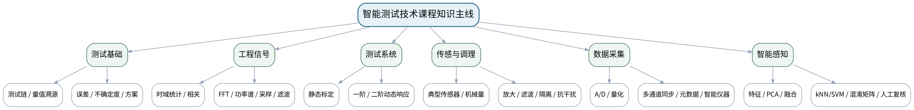

### 课次总览
| 次数 | 课型 | 单元/项目 | 授课题目 | 主要评价 |
|---:|---|---|---|---|
| 1 | 理论 | 第一单元 智能测试基础、误差与不确定度 | 智能测试任务、测试链与量值溯源 | 平时成绩 |
| 2 | 理论 | 第一单元 智能测试基础、误差与不确定度 | 误差、静态性能、不确定度与测试方案预算 | 平时成绩＋课程作业 |
| 3 | 理论 | 第二单元 工程信号、采样与时频分析 | 工程信号分类与时域统计特征 | 平时成绩＋课程作业 |
| 4 | 理论 | 第二单元 工程信号、采样与时频分析 | 卷积、相关与时延/周期特征分析 | 平时成绩＋课程作业 |
| 5 | 理论 | 第二单元 工程信号、采样与时频分析 | 傅里叶变换、FFT、幅值谱与功率谱 | 平时成绩＋课程作业 |
| 6 | 理论 | 第二单元 工程信号、采样与时频分析 | 采样、混叠、窗函数、频谱泄漏与数字滤波 | 平时成绩＋课程作业 |
| 7 | 理论 | 第三单元 测试系统静动态特性与标定 | 测试系统模型、线性时不变与静态标定 | 平时成绩＋课程作业 |
| 8 | 理论 | 第三单元 测试系统静动态特性与标定 | 一阶系统时间常数、阶跃响应与动态误差 | 平时成绩＋课程作业 |
| 9 | 理论 | 第三单元 测试系统静动态特性与标定 | 二阶系统固有频率、阻尼、频率响应与动态不失真 | 平时成绩＋课程作业 |
| 10 | 实验 | 实验一 传感器静态标定与测量不确定度 | 实验一：传感器静态标定与测量不确定度 | 课程作业 |
| 11 | 理论 | 第四单元 传感器、信号调理与典型机械量测量 | 传感器选型、电阻应变式与电桥调理 | 平时成绩＋课程作业＋期末考核 |
| 12 | 理论 | 第四单元 传感器、信号调理与典型机械量测量 | 电感/电容式传感器与位移测量 | 平时成绩＋课程作业＋期末考核 |
| 13 | 理论 | 第四单元 传感器、信号调理与典型机械量测量 | 压电/磁电/霍尔/光电传感器与转速/振动测量 | 平时成绩＋课程作业＋期末考核 |
| 14 | 理论 | 第四单元 传感器、信号调理与典型机械量测量 | 温度传感器、接触/非接触测温与工程误差 | 平时成绩＋课程作业＋期末考核 |
| 15 | 理论 | 第四单元 传感器、信号调理与典型机械量测量 | 信号调理：放大、滤波、隔离、线性化、接地与屏蔽 | 平时成绩＋课程作业＋期末考核 |
| 16 | 实验 | 实验二 测试系统动态响应与信号调理 | 实验二：测试系统动态响应与信号调理 | 课程作业 |
| 17 | 理论 | 第五单元 数据采集、计算机测试与智能仪器 | 采样保持、A/D转换、量化与采集通道配置 | 平时成绩＋课程作业＋期末考核 |
| 18 | 理论 | 第五单元 数据采集、计算机测试与智能仪器 | 多通道同步、触发、缓存、时间戳与元数据 | 平时成绩＋课程作业＋期末考核 |
| 19 | 理论 | 第五单元 数据采集、计算机测试与智能仪器 | 计算机测试、虚拟仪器、智能仪器与测试软件架构 | 平时成绩＋课程作业＋期末考核 |
| 20 | 实验 | 实验三 振动信号采集、采样与FFT分析 | 实验三：振动信号采集、采样与FFT分析 | 课程作业 |
| 21 | 理论 | 第六单元 智能感知、多源融合与状态识别 | 智能传感、边缘处理与特征工程 | 平时成绩＋课程作业＋期末考核 |
| 22 | 理论 | 第六单元 智能感知、多源融合与状态识别 | 特征选择、PCA降维与多传感信息融合 | 平时成绩＋课程作业＋期末考核 |
| 23 | 理论 | 第六单元 智能感知、多源融合与状态识别 | k近邻/SVM基础分类、混淆矩阵与人工复核 | 平时成绩＋课程作业＋期末考核 |
| 24 | 实验 | 实验四 多传感数据融合与异常状态识别 | 实验四：多传感数据融合与异常状态识别 | 课程作业 |

### 正式实验项目与课程作业证据
四个实验项目均按大纲实施，并作为“课程作业20%”的重要学习证据，不另设独立实验总评项：实验一静态标定与不确定度、实验二动态响应与信号调理、实验三振动采样与FFT、实验四多传感融合与状态识别。

---

## 第1次课 智能测试任务、测试链与量值溯源

### 课次信息
- **章节/单元**：第一单元 智能测试基础、误差与不确定度
- **周次**：按实际课表填写
- **课时安排**：2课时（100 min）
- **课型**：理论

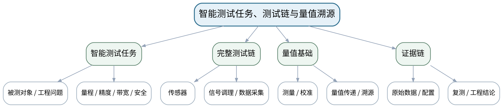

### 教学目标
**知识目标：**
1. 理解智能测试技术的课程定位、测试任务与“被测对象—传感器—调理—采集—分析—融合—判断”完整测试链。
2. 理解测量、测试、校准、量值传递与量值溯源的基本含义。

**能力目标：**
1. 能够从智能装备/制造过程问题中确定被测量、量程、精度、带宽、测点和安全要求。
2. 能够绘制基础测试链并指出每个环节需要保留的证据。

**价值目标：**
1. 形成测试结论必须可校准、可复测、可追溯，且对工程安全负责的证据意识。

### 课程思政
通过高端装备质量事故和计量溯源案例强调数据真实、可校准、可复测以及对公共安全负责。

### 专创融合
将测试需求卡视为智能检测产品的最小需求文档，训练面向可验收指标设计测试系统。

### 教学重难点
**教学重点：**智能测试完整测试链；量值溯源与测试需求定义。

**教学难点：**从开放工程问题中形成可验证测试需求，避免“先拿传感器、后找问题”。

### 教学方法与用具
**教学方法：**讲授法、问题引导法、工程案例法、模型/公式推演法、仪器/Python演示法、分组研讨法、反例分析法

**教学用具：**电脑、投影仪、测试链示意图、典型传感器/采集设备实物或图片。

### 教学设计
课前任务 → 互动导入（15 min）→ 传授新知与课堂训练（70 min）→ 过关检测（10 min）→ 课堂小结（3 min）→ 作业布置（1 min）→ 考勤（1 min）

### 课前任务
【教师】发布“智能测试任务、测试链与量值溯源”对应大纲/教材范围和一个最小工程问题，不提前给出完整答案。

1. 阅读对应大纲与教材内容；
2. 圈出3个关键术语并记录至少1个疑问；
3. 预读一个测试链、波形、频谱、传感器结构或配置表，写出预期结果和至少一个疑问。

【学生】完成准备并带着“预期结果/疑问/已有证据”进入课堂。

### 互动导入
【教师】展示一个数控主轴“振动变大”的模糊问题，要求学生先列出必须明确的量程、频带、测点、工况和安全条件，再讨论传感器。

【学生】先独立预测/判断，再与同伴交换依据；教师收集典型分歧后进入本课。

### 传授新知与课堂训练
**一、核心概念与工程案例（约25 min）—测试链与课程主线**

【教师】以机器人关节、数控主轴和3D打印过程为例拆解完整测试链，说明每一层的输入输出与证据。

【学生】完成公式/测试链/代码/图表推演，先写预期与依据，再用演示或数据验证并修正。

**二、模型/方法与Python/仪器演示（约25 min）—量值与溯源**

【教师】讲测量、测试、校准、量值传递和溯源；对比“仪器有读数”和“读数可信”两件事。

【学生】完成公式/测试链/代码/图表推演，先写预期与依据，再用演示或数据验证并修正。

**三、学生分析、验证与错误复盘（约20 min）—方案拆解练习**

【教师】学生完成一个主轴振动测试需求卡：对象、量、单位、量程、带宽、测点、采样、安全、验收指标。

【学生】完成公式/测试链/代码/图表推演，先写预期与依据，再用演示或数据验证并修正。

**独立学习产物**：一页“测试需求—测试链—验收指标”方案卡。

**学习证据**：方案卡、测试链图、单位/量程/带宽表、风险检查项、同伴审查记录。

**评价映射**：平时成绩；目标1.1、2.1、3.1。

### 过关检测
【教师】组织当堂检测：

1. 智能测试链至少包含哪些核心环节？
2. “有校准证书”与“量值可溯源”是什么关系？
3. 为什么选传感器前必须先定义量程和带宽？

【学生】独立作答/运行/推演验证；【教师】按错误类型讲解，要求说明测试链、信号、模型或数据依据。

### 课堂小结
【教师】回到本课知识脉络图，用“对象—测量链—参数/方法—验证—证据—边界”总结“智能测试任务、测试链与量值溯源”，再次强调教学重点：智能测试完整测试链；量值溯源与测试需求定义。

【学生】写下“本课一条最重要的测试规则 + 一个最容易出错的边界”。

### 作业布置
【教师】布置课后任务：选择一个智能制造设备测试场景，补全测试需求卡，并写出3条必须保留的原始证据。

【学生】按课程统一文件命名和证据要求整理提交。

### 考勤
【教师】利用学校/课程实际使用的平台进行签到。

【学生】按课程要求完成签到。

### 课后教学反思
【课后填写，不预填事实】

1. 教学流程：记录100 min各环节实际用时及需要调整的位置；
2. 教学内容：重点记录“从开放工程问题中形成可验证测试需求，避免“先拿传感器、后找问题”。”的真实掌握证据与常见错误；
3. 学生参与：仅依据真实课堂/实验记录填写测试链设计、推演、仪器操作、Python分析、互审和复测情况，不补写推测；
4. 评价证据：检查本课原始数据、配置、代码、图表、参数、复测和结论是否完整，记录缺项原因；
5. 后续改进：依据真实课堂证据决定下一次课的补救、复现或拓展。

### 本章节参考文献
[1] 祝海林.《机械工程测试技术（第3版）》[M]. 机械工业出版社，2024。

## 第2次课 误差、静态性能、不确定度与测试方案预算

### 课次信息
- **章节/单元**：第一单元 智能测试基础、误差与不确定度
- **周次**：按实际课表填写
- **课时安排**：2课时（100 min）
- **课型**：理论

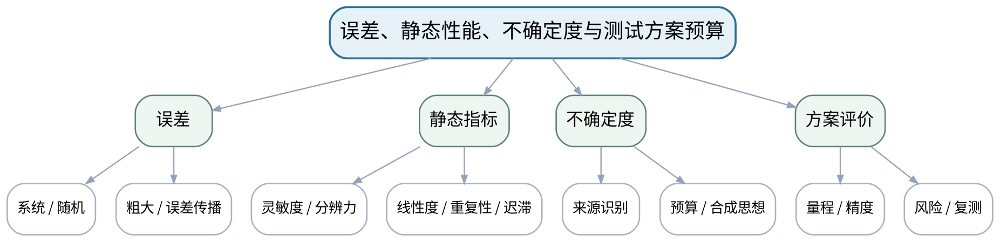

### 教学目标
**知识目标：**
1. 掌握系统误差、随机误差、粗大误差及误差传播的基本概念。
2. 掌握精度、灵敏度、分辨力、线性度、重复性、迟滞等静态指标，理解测量不确定度的基本思想。

**能力目标：**
1. 能够依据标定/样例数据计算或解释主要静态指标，并建立简化误差/不确定度预算。
2. 能够比较两个测试方案在量程、精度、风险和可追溯性上的差异。

**价值目标：**
1. 形成不删改不利数据、不把单次结果当真值、主动说明不确定度来源的工程诚信习惯。

### 课程思政
通过选择性删数据、忽视校准有效期的反例强调工程数据诚信和量值责任。

### 专创融合
把误差预算表转化为测试方案风险清单，为后续测试系统选型和标定提供工程决策依据。

### 教学重难点
**教学重点：**误差分类、静态性能指标和不确定度预算。

**教学难点：**区分误差与不确定度；把指标计算结果转化为测试方案可行性判断。

### 教学方法与用具
**教学方法：**讲授法、问题引导法、工程案例法、模型/公式推演法、仪器/Python演示法、分组研讨法、反例分析法

**教学用具：**电脑、计算器/Python、标定数据表、精度/校准证书样例。

### 教学设计
课前任务 → 互动导入（15 min）→ 传授新知与课堂训练（70 min）→ 过关检测（10 min）→ 课堂小结（3 min）→ 作业布置（1 min）→ 考勤（1 min）

### 课前任务
【教师】发布“误差、静态性能、不确定度与测试方案预算”对应大纲/教材范围和一个最小工程问题，不提前给出完整答案。

1. 阅读对应大纲与教材内容；
2. 圈出3个关键术语并记录至少1个疑问；
3. 预读一个测试链、波形、频谱、传感器结构或配置表，写出预期结果和至少一个疑问。

【学生】完成准备并带着“预期结果/疑问/已有证据”进入课堂。

### 互动导入
【教师】给出两个测力方案：A量程过大但精度高、B量程匹配但标定过期；学生先判断哪个“数字更漂亮”，再按实际测试需求评审。

【学生】先独立预测/判断，再与同伴交换依据；教师收集典型分歧后进入本课。

### 传授新知与课堂训练
**一、核心概念与工程案例（约25 min）—误差与传播**

【教师】从仪器、环境、安装、方法和数据处理分析误差源，讲绝对/相对误差和传播基本思想。

【学生】完成公式/测试链/代码/图表推演，先写预期与依据，再用演示或数据验证并修正。

**二、模型/方法与Python/仪器演示（约25 min）—静态指标与不确定度**

【教师】用标定曲线解释灵敏度、线性度、重复性、迟滞和残差；用来源清单建立简化不确定度预算。

【学生】完成公式/测试链/代码/图表推演，先写预期与依据，再用演示或数据验证并修正。

**三、学生分析、验证与错误复盘（约20 min）—方案预算练习**

【教师】学生针对力/温度/位移任务列“来源—估计—影响—控制/复测”表，并比较两套测量链。

【学生】完成公式/测试链/代码/图表推演，先写预期与依据，再用演示或数据验证并修正。

**独立学习产物**：静态指标计算卡＋简化不确定度预算表＋方案比较结论。

**学习证据**：标定/样例数据、计算过程、误差源列表、不确定度预算、选择依据。

**评价映射**：平时成绩＋课程作业；目标1.1、2.1、3.1。

### 过关检测
【教师】组织当堂检测：

1. 重复性差与线性度差分别说明什么？
2. 误差与不确定度为什么不能简单当作同一个量？
3. 灵敏度越高是否一定代表测试系统更好？

【学生】独立作答/运行/推演验证；【教师】按错误类型讲解，要求说明测试链、信号、模型或数据依据。

### 课堂小结
【教师】回到本课知识脉络图，用“对象—测量链—参数/方法—验证—证据—边界”总结“误差、静态性能、不确定度与测试方案预算”，再次强调教学重点：误差分类、静态性能指标和不确定度预算。

【学生】写下“本课一条最重要的测试规则 + 一个最容易出错的边界”。

### 作业布置
【教师】布置课后任务：完成一组简化标定数据计算，并写出一个不确定度来源未被控制会怎样影响结论。

【学生】按课程统一文件命名和证据要求整理提交。

### 考勤
【教师】利用学校/课程实际使用的平台进行签到。

【学生】按课程要求完成签到。

### 课后教学反思
【课后填写，不预填事实】

1. 教学流程：记录100 min各环节实际用时及需要调整的位置；
2. 教学内容：重点记录“区分误差与不确定度；把指标计算结果转化为测试方案可行性判断。”的真实掌握证据与常见错误；
3. 学生参与：仅依据真实课堂/实验记录填写测试链设计、推演、仪器操作、Python分析、互审和复测情况，不补写推测；
4. 评价证据：检查本课原始数据、配置、代码、图表、参数、复测和结论是否完整，记录缺项原因；
5. 后续改进：依据真实课堂证据决定下一次课的补救、复现或拓展。

### 本章节参考文献
[1] 祝海林.《机械工程测试技术（第3版）》[M]. 机械工业出版社，2024。

## 第3次课 工程信号分类与时域统计特征

### 课次信息
- **章节/单元**：第二单元 工程信号、采样与时频分析
- **周次**：按实际课表填写
- **课时安排**：2课时（100 min）
- **课型**：理论

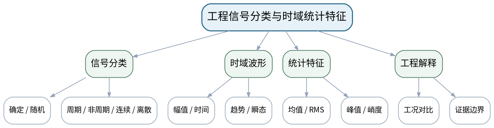

### 教学目标
**知识目标：**
1. 掌握确定/随机、周期/非周期、连续/离散等信号分类。
2. 掌握均值、方差、均方根、峰值、峰峰值、峭度等时域统计量的工程含义。

**能力目标：**
1. 能够对振动、电流、温度等测试信号进行分类并用Python计算基础时域指标。
2. 能够将时域指标变化联系到工况变化，但不越过证据范围做故障定性。

**价值目标：**
1. 形成先看原始波形和单位、再做统计归纳，避免只挑显著指标的科学态度。

### 课程思政
强调信号处理不能通过截取和选择指标制造结论，原始数据和处理步骤必须公开。

### 专创融合
将时域特征视为智能测试的第一层“可解释特征接口”，为后续融合和状态识别准备。

### 教学重难点
**教学重点：**信号分类与基础时域统计特征。

**教学难点：**理解统计指标只描述某一方面，不能脱离原始波形和工况单独下结论。

### 教学方法与用具
**教学方法：**讲授法、问题引导法、工程案例法、模型/公式推演法、仪器/Python演示法、分组研讨法、反例分析法

**教学用具：**电脑、VS Code、Python、NumPy、Pandas、Matplotlib、示例信号数据。

### 教学设计
课前任务 → 互动导入（15 min）→ 传授新知与课堂训练（70 min）→ 过关检测（10 min）→ 课堂小结（3 min）→ 作业布置（1 min）→ 考勤（1 min）

### 课前任务
【教师】发布“工程信号分类与时域统计特征”对应大纲/教材范围和一个最小工程问题，不提前给出完整答案。

1. 阅读对应大纲与教材内容；
2. 圈出3个关键术语并记录至少1个疑问；
3. 预读一个测试链、波形、频谱、传感器结构或配置表，写出预期结果和至少一个疑问。

【学生】完成准备并带着“预期结果/疑问/已有证据”进入课堂。

### 互动导入
【教师】展示“RMS相同但波形完全不同”的正弦和冲击型信号，要求学生判断仅用RMS能否区分。

【学生】先独立预测/判断，再与同伴交换依据；教师收集典型分歧后进入本课。

### 传授新知与课堂训练
**一、核心概念与工程案例（约25 min）—信号分类**

【教师】以主轴振动、伺服电流、温度和冲击信号建立分类树，解释不同类型决定不同分析方法。

【学生】完成公式/测试链/代码/图表推演，先写预期与依据，再用演示或数据验证并修正。

**二、模型/方法与Python/仪器演示（约25 min）—时域统计**

【教师】讲均值、方差、RMS、峰值、峭度等指标并用Python最小示例计算。

【学生】完成公式/测试链/代码/图表推演，先写预期与依据，再用演示或数据验证并修正。

**三、学生分析、验证与错误复盘（约20 min）—对比判断**

【教师】学生对两段匿名波形和指标表判断差异，必须同时引用原始波形、单位和指标。

【学生】完成公式/测试链/代码/图表推演，先写预期与依据，再用演示或数据验证并修正。

**独立学习产物**：一张信号分类表＋Python时域统计脚本＋波形/指标联合说明。

**学习证据**：原始波形、脚本、指标表、工况标签、结论与不确定性说明。

**评价映射**：平时成绩＋课程作业；目标1.2、2.2、3.2。

### 过关检测
【教师】组织当堂检测：

1. RMS与峰值分别强调什么？
2. 峭度升高一定表示设备有故障吗？
3. 为什么必须同时保留原始波形和单位？

【学生】独立作答/运行/推演验证；【教师】按错误类型讲解，要求说明测试链、信号、模型或数据依据。

### 课堂小结
【教师】回到本课知识脉络图，用“对象—测量链—参数/方法—验证—证据—边界”总结“工程信号分类与时域统计特征”，再次强调教学重点：信号分类与基础时域统计特征。

【学生】写下“本课一条最重要的测试规则 + 一个最容易出错的边界”。

### 作业布置
【教师】布置课后任务：用Python生成/读取3类信号，计算至少5个时域特征并写出“能说明什么/不能说明什么”。

【学生】按课程统一文件命名和证据要求整理提交。

### 考勤
【教师】利用学校/课程实际使用的平台进行签到。

【学生】按课程要求完成签到。

### 课后教学反思
【课后填写，不预填事实】

1. 教学流程：记录100 min各环节实际用时及需要调整的位置；
2. 教学内容：重点记录“理解统计指标只描述某一方面，不能脱离原始波形和工况单独下结论。”的真实掌握证据与常见错误；
3. 学生参与：仅依据真实课堂/实验记录填写测试链设计、推演、仪器操作、Python分析、互审和复测情况，不补写推测；
4. 评价证据：检查本课原始数据、配置、代码、图表、参数、复测和结论是否完整，记录缺项原因；
5. 后续改进：依据真实课堂证据决定下一次课的补救、复现或拓展。

### 本章节参考文献
[1] 祝海林.《机械工程测试技术（第3版）》[M]. 机械工业出版社，2024。

## 第4次课 卷积、相关与时延/周期特征分析

### 课次信息
- **章节/单元**：第二单元 工程信号、采样与时频分析
- **周次**：按实际课表填写
- **课时安排**：2课时（100 min）
- **课型**：理论

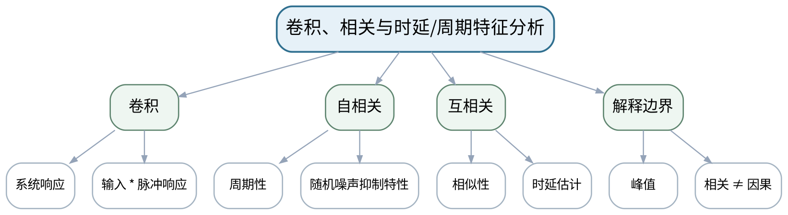

### 教学目标
**知识目标：**
1. 理解卷积、自相关和互相关的基本概念与物理意义。
2. 掌握自相关用于周期性/相似性分析、互相关用于时延和关联分析的基本方法。

**能力目标：**
1. 能够使用Python完成自相关/互相关并从峰值位置解释周期或时延。
2. 能够区分相关关系、传播时延与因果结论之间的边界。

**价值目标：**
1. 形成不把“相关”直接等同“因果”的严谨分析意识。

### 课程思政
通过“相关不等于因果”训练科学论证边界，防止算法结果被过度解读。

### 专创融合
把相关分析封装为时延/周期特征模块，可服务多传感同步校验和设备状态特征提取。

### 教学重难点
**教学重点：**卷积与相关的工程含义；相关峰值解释。

**教学难点：**从数学运算理解相关函数的工程用途，同时避免因果过度解释。

### 教学方法与用具
**教学方法：**讲授法、问题引导法、工程案例法、模型/公式推演法、仪器/Python演示法、分组研讨法、反例分析法

**教学用具：**电脑、Python、NumPy/SciPy、Matplotlib、双通道示例信号。

### 教学设计
课前任务 → 互动导入（15 min）→ 传授新知与课堂训练（70 min）→ 过关检测（10 min）→ 课堂小结（3 min）→ 作业布置（1 min）→ 考勤（1 min）

### 课前任务
【教师】发布“卷积、相关与时延/周期特征分析”对应大纲/教材范围和一个最小工程问题，不提前给出完整答案。

1. 阅读对应大纲与教材内容；
2. 圈出3个关键术语并记录至少1个疑问；
3. 预读一个测试链、波形、频谱、传感器结构或配置表，写出预期结果和至少一个疑问。

【学生】完成准备并带着“预期结果/疑问/已有证据”进入课堂。

### 互动导入
【教师】给出两个相似振动波形，其中一个延迟12 ms，要求学生不看文件名判断哪一个“更晚”。

【学生】先独立预测/判断，再与同伴交换依据；教师收集典型分歧后进入本课。

### 传授新知与课堂训练
**一、核心概念与工程案例（约25 min）—卷积思想**

【教师】用LTI系统“输入—系统—输出”说明卷积，强调它是后续滤波与系统响应的桥梁。

【学生】完成公式/测试链/代码/图表推演，先写预期与依据，再用演示或数据验证并修正。

**二、模型/方法与Python/仪器演示（约25 min）—相关分析**

【教师】演示自相关提周期、互相关估时延；用Python绘制相关曲线和峰值。

【学生】完成公式/测试链/代码/图表推演，先写预期与依据，再用演示或数据验证并修正。

**三、学生分析、验证与错误复盘（约20 min）—工程边界**

【教师】讨论超声/振动传播时延与两个传感器共同受第三因素影响的区别，要求写出证据边界。

【学生】完成公式/测试链/代码/图表推演，先写预期与依据，再用演示或数据验证并修正。

**独立学习产物**：相关分析脚本＋一张峰值解释图＋“相关/因果”边界说明。

**学习证据**：两段原始信号、相关曲线、峰值索引/时延换算、人工解释记录。

**评价映射**：平时成绩＋课程作业；目标1.2、2.2、3.2。

### 过关检测
【教师】组织当堂检测：

1. 自相关峰值间隔可反映什么？
2. 互相关峰值与采样率怎样共同决定时延？
3. 为什么互相关高不等于存在因果关系？

【学生】独立作答/运行/推演验证；【教师】按错误类型讲解，要求说明测试链、信号、模型或数据依据。

### 课堂小结
【教师】回到本课知识脉络图，用“对象—测量链—参数/方法—验证—证据—边界”总结“卷积、相关与时延/周期特征分析”，再次强调教学重点：卷积与相关的工程含义；相关峰值解释。

【学生】写下“本课一条最重要的测试规则 + 一个最容易出错的边界”。

### 作业布置
【教师】布置课后任务：完成一组已知时延信号的互相关估计，并用已知时延核对误差。

【学生】按课程统一文件命名和证据要求整理提交。

### 考勤
【教师】利用学校/课程实际使用的平台进行签到。

【学生】按课程要求完成签到。

### 课后教学反思
【课后填写，不预填事实】

1. 教学流程：记录100 min各环节实际用时及需要调整的位置；
2. 教学内容：重点记录“从数学运算理解相关函数的工程用途，同时避免因果过度解释。”的真实掌握证据与常见错误；
3. 学生参与：仅依据真实课堂/实验记录填写测试链设计、推演、仪器操作、Python分析、互审和复测情况，不补写推测；
4. 评价证据：检查本课原始数据、配置、代码、图表、参数、复测和结论是否完整，记录缺项原因；
5. 后续改进：依据真实课堂证据决定下一次课的补救、复现或拓展。

### 本章节参考文献
[1] 祝海林.《机械工程测试技术（第3版）》[M]. 机械工业出版社，2024。

## 第5次课 傅里叶变换、FFT、幅值谱与功率谱

### 课次信息
- **章节/单元**：第二单元 工程信号、采样与时频分析
- **周次**：按实际课表填写
- **课时安排**：2课时（100 min）
- **课型**：理论

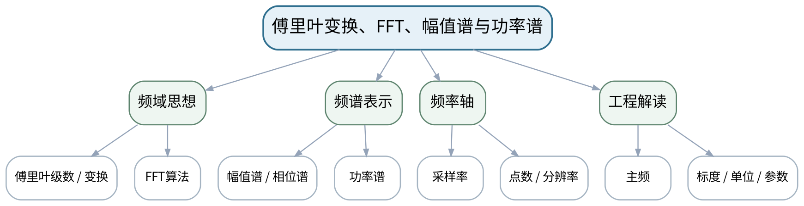

### 教学目标
**知识目标：**
1. 理解傅里叶级数/变换和FFT的关系，掌握频率分辨率、幅值谱、相位谱、功率谱基本概念。
2. 理解周期/非周期信号在频域表示上的基本差异。

**能力目标：**
1. 能够用Python对简单振动信号完成FFT/功率谱并正确构造频率轴。
2. 能够从频谱峰值识别主要频率成分，并核对幅值标度和单位。

**价值目标：**
1. 形成频谱必须说明采样率、采样长度、窗和幅值标度的参数透明习惯。

### 课程思政
强调频谱处理参数必须完整公开，禁止只展示“符合预期”的频率区间。

### 专创融合
将FFT/功率谱作为设备状态监测的通用特征模块，为后续振动实验和智能识别打基础。

### 教学重难点
**教学重点：**FFT频率轴、频谱标度和主要频率成分。

**教学难点：**避免“会调用fft”但不会构造频率轴/标度；理解频谱图与采样配置不可分离。

### 教学方法与用具
**教学方法：**讲授法、问题引导法、工程案例法、模型/公式推演法、仪器/Python演示法、分组研讨法、反例分析法

**教学用具：**电脑、Python、NumPy/SciPy、Matplotlib、示例振动信号。

### 教学设计
课前任务 → 互动导入（15 min）→ 传授新知与课堂训练（70 min）→ 过关检测（10 min）→ 课堂小结（3 min）→ 作业布置（1 min）→ 考勤（1 min）

### 课前任务
【教师】发布“傅里叶变换、FFT、幅值谱与功率谱”对应大纲/教材范围和一个最小工程问题，不提前给出完整答案。

1. 阅读对应大纲与教材内容；
2. 圈出3个关键术语并记录至少1个疑问；
3. 预读一个测试链、波形、频谱、传感器结构或配置表，写出预期结果和至少一个疑问。

【学生】完成准备并带着“预期结果/疑问/已有证据”进入课堂。

### 互动导入
【教师】展示同一信号两张频谱图，一张把横轴误当作“点号”、一张是Hz；要求学生指出哪张能支持工程结论。

【学生】先独立预测/判断，再与同伴交换依据；教师收集典型分歧后进入本课。

### 传授新知与课堂训练
**一、核心概念与工程案例（约25 min）—傅里叶到FFT**

【教师】从周期信号分解过渡到DFT/FFT，重点讲物理意义和频率离散。

【学生】完成公式/测试链/代码/图表推演，先写预期与依据，再用演示或数据验证并修正。

**二、模型/方法与Python/仪器演示（约25 min）—谱与频率轴**

【教师】用Python构造rfft/rfftfreq，讲幅值、功率与频率分辨率，强调单位和单边谱。

【学生】完成公式/测试链/代码/图表推演，先写预期与依据，再用演示或数据验证并修正。

**三、学生分析、验证与错误复盘（约20 min）—频谱解释**

【教师】学生分析含10 Hz、35 Hz和噪声的合成信号，标注主要峰值并核对输入。

【学生】完成公式/测试链/代码/图表推演，先写预期与依据，再用演示或数据验证并修正。

**独立学习产物**：FFT分析脚本＋频谱图＋参数/幅值标度说明。

**学习证据**：原始信号、fs、N、频率轴代码、幅值/功率谱图、已知输入频率核验。

**评价映射**：平时成绩＋课程作业；目标1.2、2.2、3.2。

### 过关检测
【教师】组织当堂检测：

1. 频率分辨率由哪些量决定？
2. FFT数组下标为什么不能直接当Hz？
3. 幅值谱和功率谱分别适合回答什么问题？

【学生】独立作答/运行/推演验证；【教师】按错误类型讲解，要求说明测试链、信号、模型或数据依据。

### 课堂小结
【教师】回到本课知识脉络图，用“对象—测量链—参数/方法—验证—证据—边界”总结“傅里叶变换、FFT、幅值谱与功率谱”，再次强调教学重点：FFT频率轴、频谱标度和主要频率成分。

【学生】写下“本课一条最重要的测试规则 + 一个最容易出错的边界”。

### 作业布置
【教师】布置课后任务：对一段多频信号改变采样长度，比较频率分辨率并保留前后图。

【学生】按课程统一文件命名和证据要求整理提交。

### 考勤
【教师】利用学校/课程实际使用的平台进行签到。

【学生】按课程要求完成签到。

### 课后教学反思
【课后填写，不预填事实】

1. 教学流程：记录100 min各环节实际用时及需要调整的位置；
2. 教学内容：重点记录“避免“会调用fft”但不会构造频率轴/标度；理解频谱图与采样配置不可分离。”的真实掌握证据与常见错误；
3. 学生参与：仅依据真实课堂/实验记录填写测试链设计、推演、仪器操作、Python分析、互审和复测情况，不补写推测；
4. 评价证据：检查本课原始数据、配置、代码、图表、参数、复测和结论是否完整，记录缺项原因；
5. 后续改进：依据真实课堂证据决定下一次课的补救、复现或拓展。

### 本章节参考文献
[1] 祝海林.《机械工程测试技术（第3版）》[M]. 机械工业出版社，2024。
[4] 《机械故障诊断技术（第3版）》——课程大纲调研说明推荐参考资料。

## 第6次课 采样、混叠、窗函数、频谱泄漏与数字滤波

### 课次信息
- **章节/单元**：第二单元 工程信号、采样与时频分析
- **周次**：按实际课表填写
- **课时安排**：2课时（100 min）
- **课型**：理论

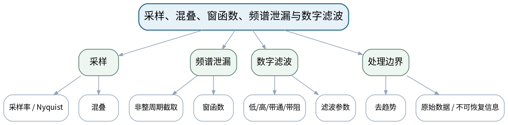

### 教学目标
**知识目标：**
1. 掌握采样定理、混叠、量化基本概念，理解窗函数与频谱泄漏。
2. 理解低通、高通、带通、带阻和去趋势等处理的适用目的及边界。

**能力目标：**
1. 能够设计采样率和采样长度，识别混叠与泄漏，并用Python比较不同窗/滤波参数。
2. 能够说明滤波前后哪些信息被保留、削弱或不可恢复。

**价值目标：**
1. 形成不过度滤波、不通过处理隐藏异常、完整保留参数和原始信号的科学态度。

### 课程思政
通过过度滤波、选择性截取和误导图表反例，强调参数透明和忠实呈现原始数据。

### 专创融合
把采样/滤波配置视为测试系统可审查“配置资产”，为多通道采集和回放复核做准备。

### 教学重难点
**教学重点：**采样与混叠；窗函数和泄漏；数字滤波。

**教学难点：**处理参数会改变结果，必须识别“抑噪”与“删掉真实信息”的边界。

### 教学方法与用具
**教学方法：**讲授法、问题引导法、工程案例法、模型/公式推演法、仪器/Python演示法、分组研讨法、反例分析法

**教学用具：**电脑、Python、SciPy signal、Matplotlib、示例振动/温度数据。

### 教学设计
课前任务 → 互动导入（15 min）→ 传授新知与课堂训练（70 min）→ 过关检测（10 min）→ 课堂小结（3 min）→ 作业布置（1 min）→ 考勤（1 min）

### 课前任务
【教师】发布“采样、混叠、窗函数、频谱泄漏与数字滤波”对应大纲/教材范围和一个最小工程问题，不提前给出完整答案。

1. 阅读对应大纲与教材内容；
2. 圈出3个关键术语并记录至少1个疑问；
3. 预读一个测试链、波形、频谱、传感器结构或配置表，写出预期结果和至少一个疑问。

【学生】完成准备并带着“预期结果/疑问/已有证据”进入课堂。

### 互动导入
【教师】让一段80 Hz信号分别以100 Hz和500 Hz采样，展示两个看似不同的低频波形，要求学生解释。

【学生】先独立预测/判断，再与同伴交换依据；教师收集典型分歧后进入本课。

### 传授新知与课堂训练
**一、核心概念与工程案例（约25 min）—采样与混叠**

【教师】从Nyquist条件和工程带宽设计采样率，演示不足采样导致假频率。

【学生】完成公式/测试链/代码/图表推演，先写预期与依据，再用演示或数据验证并修正。

**二、模型/方法与Python/仪器演示（约25 min）—窗与泄漏**

【教师】比较矩形窗、Hann窗等对非整周期信号频谱的影响，说明主瓣/旁瓣权衡。

【学生】完成公式/测试链/代码/图表推演，先写预期与依据，再用演示或数据验证并修正。

**三、学生分析、验证与错误复盘（约20 min）—滤波与反例**

【教师】用低通/带通处理噪声信号，同时展示过度滤波案例；学生记录参数和失去的信息。

【学生】完成公式/测试链/代码/图表推演，先写预期与依据，再用演示或数据验证并修正。

**独立学习产物**：采样/窗/滤波对照Notebook或脚本＋三组对比图。

**学习证据**：原始数据、处理参数、混叠案例、不同窗频谱、滤波前后结果及边界说明。

**评价映射**：平时成绩＋课程作业；目标1.2、2.2、3.2。

### 过关检测
【教师】组织当堂检测：

1. 采样频率刚好等于2倍最高频率是否总是工程最佳选择？
2. 频谱泄漏的直接原因是什么？
3. 滤波后曲线更平滑是否代表更真实？

【学生】独立作答/运行/推演验证；【教师】按错误类型讲解，要求说明测试链、信号、模型或数据依据。

### 课堂小结
【教师】回到本课知识脉络图，用“对象—测量链—参数/方法—验证—证据—边界”总结“采样、混叠、窗函数、频谱泄漏与数字滤波”，再次强调教学重点：采样与混叠；窗函数和泄漏；数字滤波。

【学生】写下“本课一条最重要的测试规则 + 一个最容易出错的边界”。

### 作业布置
【教师】布置课后任务：完成“同一信号不同采样率/窗/滤波”的三因素对照，明确每次只改变一个变量。

【学生】按课程统一文件命名和证据要求整理提交。

### 考勤
【教师】利用学校/课程实际使用的平台进行签到。

【学生】按课程要求完成签到。

### 课后教学反思
【课后填写，不预填事实】

1. 教学流程：记录100 min各环节实际用时及需要调整的位置；
2. 教学内容：重点记录“处理参数会改变结果，必须识别“抑噪”与“删掉真实信息”的边界。”的真实掌握证据与常见错误；
3. 学生参与：仅依据真实课堂/实验记录填写测试链设计、推演、仪器操作、Python分析、互审和复测情况，不补写推测；
4. 评价证据：检查本课原始数据、配置、代码、图表、参数、复测和结论是否完整，记录缺项原因；
5. 后续改进：依据真实课堂证据决定下一次课的补救、复现或拓展。

### 本章节参考文献
[1] 祝海林.《机械工程测试技术（第3版）》[M]. 机械工业出版社，2024。

## 第7次课 测试系统模型、线性时不变与静态标定

### 课次信息
- **章节/单元**：第三单元 测试系统静动态特性与标定
- **周次**：按实际课表填写
- **课时安排**：2课时（100 min）
- **课型**：理论

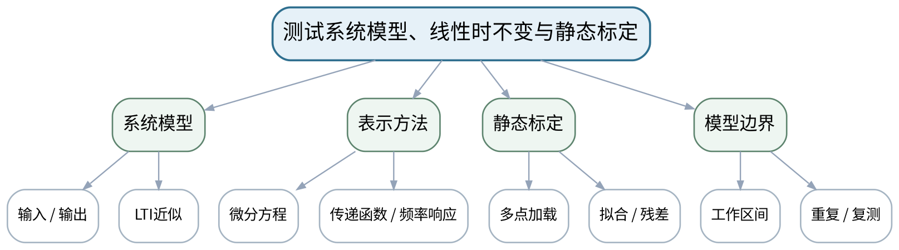

### 教学目标
**知识目标：**
1. 理解测试系统数学模型、线性时不变系统、传递函数和频率响应的基本联系。
2. 掌握静态标定流程及灵敏度、线性度、重复性和残差的评价。

**能力目标：**
1. 能够根据标定数据拟合输入输出关系并评价残差。
2. 能够判断一个测试系统在给定工作区间内采用线性模型的合理性。

**价值目标：**
1. 形成未经标定不得直接宣称测量准确、线性近似必须说明工作范围的规范意识。

### 课程思政
通过“未经标定直接使用”反例强调规范标定、变量控制和复测责任。

### 专创融合
将标定参数和残差图作为传感器数字档案的一部分，为自动补偿和智能仪器自校准铺垫。

### 教学重难点
**教学重点：**LTI模型与静态标定；残差评价。

**教学难点：**将“拟合得很直”与“系统满足需求”区分开，明确工作区间和复测条件。

### 教学方法与用具
**教学方法：**讲授法、问题引导法、工程案例法、模型/公式推演法、仪器/Python演示法、分组研讨法、反例分析法

**教学用具：**电脑、Python、NumPy/Pandas/Matplotlib、标定数据、传感器示例。

### 教学设计
课前任务 → 互动导入（15 min）→ 传授新知与课堂训练（70 min）→ 过关检测（10 min）→ 课堂小结（3 min）→ 作业布置（1 min）→ 考勤（1 min）

### 课前任务
【教师】发布“测试系统模型、线性时不变与静态标定”对应大纲/教材范围和一个最小工程问题，不提前给出完整答案。

1. 阅读对应大纲与教材内容；
2. 圈出3个关键术语并记录至少1个疑问；
3. 预读一个测试链、波形、频谱、传感器结构或配置表，写出预期结果和至少一个疑问。

【学生】完成准备并带着“预期结果/疑问/已有证据”进入课堂。

### 互动导入
【教师】展示同一传感器在0~10 N线性、0~100 N明显弯曲的标定曲线，提问“它到底是不是线性的？”

【学生】先独立预测/判断，再与同伴交换依据；教师收集典型分歧后进入本课。

### 传授新知与课堂训练
**一、核心概念与工程案例（约25 min）—模型概念**

【教师】由输入/输出到LTI近似、微分方程、传递函数和频率响应，强调模型依赖工作条件。

【学生】完成公式/测试链/代码/图表推演，先写预期与依据，再用演示或数据验证并修正。

**二、模型/方法与Python/仪器演示（约25 min）—静态标定**

【教师】多点加载、重复测量、拟合、灵敏度/线性度/重复性/残差；用Python演示。

【学生】完成公式/测试链/代码/图表推演，先写预期与依据，再用演示或数据验证并修正。

**三、学生分析、验证与错误复盘（约20 min）—模型边界**

【教师】学生给一组标定数据划定可用区间并写出超区间风险和复测要求。

【学生】完成公式/测试链/代码/图表推演，先写预期与依据，再用演示或数据验证并修正。

**独立学习产物**：静态标定分析脚本＋模型适用区间说明。

**学习证据**：标定原始数据、拟合参数、残差图、重复测量统计、适用范围。

**评价映射**：平时成绩＋课程作业；目标1.3、2.3、3.3。

### 过关检测
【教师】组织当堂检测：

1. 为什么静态标定要做多点和重复测量？
2. 残差图比单一R²还能看出什么？
3. 线性模型的适用范围应该怎样说明？

【学生】独立作答/运行/推演验证；【教师】按错误类型讲解，要求说明测试链、信号、模型或数据依据。

### 课堂小结
【教师】回到本课知识脉络图，用“对象—测量链—参数/方法—验证—证据—边界”总结“测试系统模型、线性时不变与静态标定”，再次强调教学重点：LTI模型与静态标定；残差评价。

【学生】写下“本课一条最重要的测试规则 + 一个最容易出错的边界”。

### 作业布置
【教师】布置课后任务：完成一组传感器标定数据拟合和残差分析，标出建议工作区间。

【学生】按课程统一文件命名和证据要求整理提交。

### 考勤
【教师】利用学校/课程实际使用的平台进行签到。

【学生】按课程要求完成签到。

### 课后教学反思
【课后填写，不预填事实】

1. 教学流程：记录100 min各环节实际用时及需要调整的位置；
2. 教学内容：重点记录“将“拟合得很直”与“系统满足需求”区分开，明确工作区间和复测条件。”的真实掌握证据与常见错误；
3. 学生参与：仅依据真实课堂/实验记录填写测试链设计、推演、仪器操作、Python分析、互审和复测情况，不补写推测；
4. 评价证据：检查本课原始数据、配置、代码、图表、参数、复测和结论是否完整，记录缺项原因；
5. 后续改进：依据真实课堂证据决定下一次课的补救、复现或拓展。

### 本章节参考文献
[1] 祝海林.《机械工程测试技术（第3版）》[M]. 机械工业出版社，2024。

## 第8次课 一阶系统时间常数、阶跃响应与动态误差

### 课次信息
- **章节/单元**：第三单元 测试系统静动态特性与标定
- **周次**：按实际课表填写
- **课时安排**：2课时（100 min）
- **课型**：理论

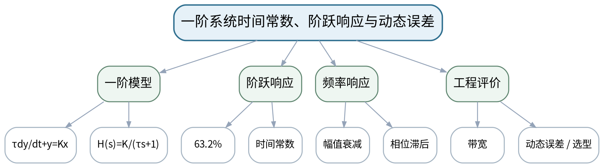

### 教学目标
**知识目标：**
1. 掌握一阶系统传递函数、时间常数、阶跃响应和频率响应的基本特征。
2. 理解动态误差、响应速度和测量带宽的关系。

**能力目标：**
1. 能够从阶跃响应数据估计时间常数，并评价某温度/压力测量环节对动态过程的跟随能力。
2. 能够用Python拟合或图解一阶响应。

**价值目标：**
1. 形成动态测量不能只看静态精度、系统响应速度必须与对象变化速度匹配的系统思维。

### 课程思政
强调动态特性与测试对象必须匹配，不能以静态参数掩盖动态失真。

### 专创融合
把阶跃响应参数识别作为智能仪器在线健康检查/自校准的基础方法。

### 教学重难点
**教学重点：**时间常数与阶跃响应；动态误差和带宽。

**教学难点：**把时间常数从公式参数转化为“能否跟上被测变化”的工程判断。

### 教学方法与用具
**教学方法：**讲授法、问题引导法、工程案例法、模型/公式推演法、仪器/Python演示法、分组研讨法、反例分析法

**教学用具：**电脑、Python、SciPy curve_fit或等价方法、阶跃响应数据。

### 教学设计
课前任务 → 互动导入（15 min）→ 传授新知与课堂训练（70 min）→ 过关检测（10 min）→ 课堂小结（3 min）→ 作业布置（1 min）→ 考勤（1 min）

### 课前任务
【教师】发布“一阶系统时间常数、阶跃响应与动态误差”对应大纲/教材范围和一个最小工程问题，不提前给出完整答案。

1. 阅读对应大纲与教材内容；
2. 圈出3个关键术语并记录至少1个疑问；
3. 预读一个测试链、波形、频谱、传感器结构或配置表，写出预期结果和至少一个疑问。

【学生】完成准备并带着“预期结果/疑问/已有证据”进入课堂。

### 互动导入
【教师】对比两个静态精度相同的温度传感器，一个τ=0.3 s、一个τ=8 s，要求学生为快速加热过程选型。

【学生】先独立预测/判断，再与同伴交换依据；教师收集典型分歧后进入本课。

### 传授新知与课堂训练
**一、核心概念与工程案例（约25 min）—一阶模型**

【教师】用温度传感器/RC环节建立模型，解释K和τ的物理意义。

【学生】完成公式/测试链/代码/图表推演，先写预期与依据，再用演示或数据验证并修正。

**二、模型/方法与Python/仪器演示（约25 min）—阶跃识别**

【教师】从63.2%点、拟合和响应曲线估计τ，比较噪声和采样对估计的影响。

【学生】完成公式/测试链/代码/图表推演，先写预期与依据，再用演示或数据验证并修正。

**三、学生分析、验证与错误复盘（约20 min）—动态误差评价**

【教师】以快变温度/压力为例判断传感器是否跟得上，并讨论补偿与更换传感器的边界。

【学生】完成公式/测试链/代码/图表推演，先写预期与依据，再用演示或数据验证并修正。

**独立学习产物**：一阶响应参数识别卡＋Python拟合/图解结果。

**学习证据**：阶跃原始数据、τ估计、拟合曲线、残差/误差、选型结论。

**评价映射**：平时成绩＋课程作业；目标1.3、2.3、3.3。

### 过关检测
【教师】组织当堂检测：

1. 63.2%规则对应什么参数？
2. 静态精度高为什么仍可能动态测不准？
3. τ减小对响应速度和带宽意味着什么？

【学生】独立作答/运行/推演验证；【教师】按错误类型讲解，要求说明测试链、信号、模型或数据依据。

### 课堂小结
【教师】回到本课知识脉络图，用“对象—测量链—参数/方法—验证—证据—边界”总结“一阶系统时间常数、阶跃响应与动态误差”，再次强调教学重点：时间常数与阶跃响应；动态误差和带宽。

【学生】写下“本课一条最重要的测试规则 + 一个最容易出错的边界”。

### 作业布置
【教师】布置课后任务：对给定一阶响应数据用两种方法估计τ，比较结果并解释差异。

【学生】按课程统一文件命名和证据要求整理提交。

### 考勤
【教师】利用学校/课程实际使用的平台进行签到。

【学生】按课程要求完成签到。

### 课后教学反思
【课后填写，不预填事实】

1. 教学流程：记录100 min各环节实际用时及需要调整的位置；
2. 教学内容：重点记录“把时间常数从公式参数转化为“能否跟上被测变化”的工程判断。”的真实掌握证据与常见错误；
3. 学生参与：仅依据真实课堂/实验记录填写测试链设计、推演、仪器操作、Python分析、互审和复测情况，不补写推测；
4. 评价证据：检查本课原始数据、配置、代码、图表、参数、复测和结论是否完整，记录缺项原因；
5. 后续改进：依据真实课堂证据决定下一次课的补救、复现或拓展。

### 本章节参考文献
[1] 祝海林.《机械工程测试技术（第3版）》[M]. 机械工业出版社，2024。

## 第9次课 二阶系统固有频率、阻尼、频率响应与动态不失真

### 课次信息
- **章节/单元**：第三单元 测试系统静动态特性与标定
- **周次**：按实际课表填写
- **课时安排**：2课时（100 min）
- **课型**：理论

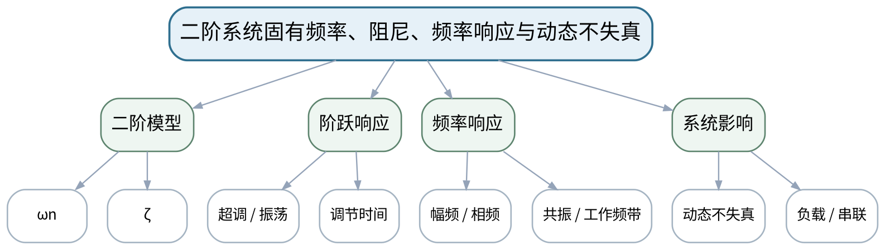

### 教学目标
**知识目标：**
1. 掌握二阶系统固有频率、阻尼比、阶跃响应和频率响应的基本规律。
2. 理解动态不失真、负载效应、系统串联和参数识别的基本思想。

**能力目标：**
1. 能够从响应曲线判断欠阻尼/临界/过阻尼特征并估计主要参数。
2. 能够根据被测信号频带评价二阶振动测量系统的适用性。

**价值目标：**
1. 形成用响应/频率证据验证系统动态范围，而不是只看产品名义参数的习惯。

### 课程思政
通过忽视动态范围、安装影响造成误判的案例，强调复测、变量控制和系统级证据。

### 专创融合
将频响审查和参数识别作为测试系统选型/自动补偿的工程接口。

### 教学重难点
**教学重点：**二阶系统阻尼/固有频率；频率响应与动态不失真。

**教学难点：**理解传感器自身共振与被测振动频率可能耦合，避免把传感器共振当设备故障。

### 教学方法与用具
**教学方法：**讲授法、问题引导法、工程案例法、模型/公式推演法、仪器/Python演示法、分组研讨法、反例分析法

**教学用具：**电脑、Python/Matplotlib、频率响应/阶跃响应数据、振动传感器样例。

### 教学设计
课前任务 → 互动导入（15 min）→ 传授新知与课堂训练（70 min）→ 过关检测（10 min）→ 课堂小结（3 min）→ 作业布置（1 min）→ 考勤（1 min）

### 课前任务
【教师】发布“二阶系统固有频率、阻尼、频率响应与动态不失真”对应大纲/教材范围和一个最小工程问题，不提前给出完整答案。

1. 阅读对应大纲与教材内容；
2. 圈出3个关键术语并记录至少1个疑问；
3. 预读一个测试链、波形、频谱、传感器结构或配置表，写出预期结果和至少一个疑问。

【学生】完成准备并带着“预期结果/疑问/已有证据”进入课堂。

### 互动导入
【教师】展示加速度传感器在接近自身共振频率时出现的巨大谱峰，要求学生先判断谱峰来自设备还是测量链。

【学生】先独立预测/判断，再与同伴交换依据；教师收集典型分歧后进入本课。

### 传授新知与课堂训练
**一、核心概念与工程案例（约25 min）—二阶响应**

【教师】用质量—弹簧—阻尼/加速度传感器解释ωn和ζ，比较不同阻尼阶跃响应。

【学生】完成公式/测试链/代码/图表推演，先写预期与依据，再用演示或数据验证并修正。

**二、模型/方法与Python/仪器演示（约25 min）—频率响应与工作区**

【教师】分析幅频/相频、共振峰和可用频带；强调工作频率应远离传感器共振。

【学生】完成公式/测试链/代码/图表推演，先写预期与依据，再用演示或数据验证并修正。

**三、学生分析、验证与错误复盘（约20 min）—系统级误差**

【教师】讨论安装刚度、负载效应、串联环节和动态补偿；学生完成“被测频带—系统带宽”审查。

【学生】完成公式/测试链/代码/图表推演，先写预期与依据，再用演示或数据验证并修正。

**独立学习产物**：二阶系统参数/频带审查表＋响应曲线解释。

**学习证据**：响应曲线、ωn/ζ估计、频率响应图、被测频带与可用频带比较。

**评价映射**：平时成绩＋课程作业；目标1.3、2.3、3.3。

### 过关检测
【教师】组织当堂检测：

1. 阻尼比过小会在阶跃响应中表现为什么？
2. 为什么传感器共振峰可能伪装成设备故障特征？
3. 动态不失真在频域上需要什么基本条件？

【学生】独立作答/运行/推演验证；【教师】按错误类型讲解，要求说明测试链、信号、模型或数据依据。

### 课堂小结
【教师】回到本课知识脉络图，用“对象—测量链—参数/方法—验证—证据—边界”总结“二阶系统固有频率、阻尼、频率响应与动态不失真”，再次强调教学重点：二阶系统阻尼/固有频率；频率响应与动态不失真。

【学生】写下“本课一条最重要的测试规则 + 一个最容易出错的边界”。

### 作业布置
【教师】布置课后任务：给定一个传感器频率响应和目标振动频带，判断是否可用并给出安全余量说明。

【学生】按课程统一文件命名和证据要求整理提交。

### 考勤
【教师】利用学校/课程实际使用的平台进行签到。

【学生】按课程要求完成签到。

### 课后教学反思
【课后填写，不预填事实】

1. 教学流程：记录100 min各环节实际用时及需要调整的位置；
2. 教学内容：重点记录“理解传感器自身共振与被测振动频率可能耦合，避免把传感器共振当设备故障。”的真实掌握证据与常见错误；
3. 学生参与：仅依据真实课堂/实验记录填写测试链设计、推演、仪器操作、Python分析、互审和复测情况，不补写推测；
4. 评价证据：检查本课原始数据、配置、代码、图表、参数、复测和结论是否完整，记录缺项原因；
5. 后续改进：依据真实课堂证据决定下一次课的补救、复现或拓展。

### 本章节参考文献
[1] 祝海林.《机械工程测试技术（第3版）》[M]. 机械工业出版社，2024。

## 第10次课 实验一：传感器静态标定与测量不确定度

### 课次信息
- **章节/单元**：实验一 传感器静态标定与测量不确定度
- **周次**：按实际课表填写
- **课时安排**：2课时（100 min）
- **课型**：实验

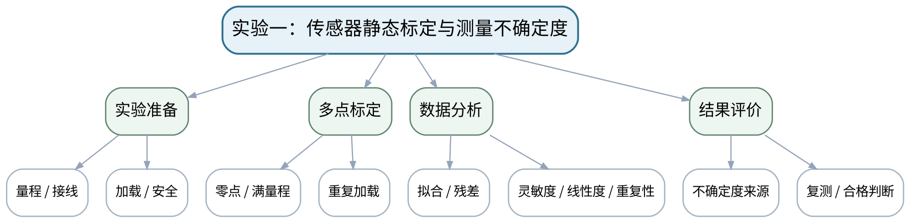

### 教学目标
**知识目标：**
1. 理解零点、量程、多点重复标定、灵敏度、线性度、重复性、残差与主要不确定度分量。

**能力目标：**
1. 能够规范完成量程/接线/加载安全检查和多点重复标定。
2. 能够用Python拟合校准曲线、计算指标并给出结果是否满足要求的判断。

**价值目标：**
1. 形成原始数据不覆盖、标定证据完整、复测和安全检查的实验习惯。

### 课程思政
以“凭感觉认为准确”对比标定证据，落实量值溯源、数据诚信和安全操作。

### 专创融合
把标定脚本、参数和曲线整理成传感器数字档案，可供后续数据采集和自动换算调用。

### 教学重难点
**教学重点：**多点重复标定、Python拟合和不确定度说明。

**教学难点：**保证加载/接线安全并正确处理重复数据；不能删去“不好看”的点。

### 教学方法与用具
**教学方法：**实验讲解法、分组实操法、故障注入法、Python数据分析法、对照复测法、结果讲评法

**教学用具：**传感器/等价标定平台、标准加载/恒温源、采集装置、Python、Pandas、Matplotlib。

### 教学设计
课前任务 → 互动导入（15 min）→ 传授新知与课堂训练（70 min）→ 过关检测（10 min）→ 课堂小结（3 min）→ 作业布置（1 min）→ 考勤（1 min）

### 课前任务
【教师】发布“实验一：传感器静态标定与测量不确定度”对应大纲/教材范围和一个最小工程问题，不提前给出完整答案。

1. 阅读对应大纲与教材内容；
2. 圈出3个关键术语并记录至少1个疑问；
3. 检查实验设备/等价数据、Python环境和上一任务文件是否可用；实验前不通电，先完成安全与量程检查。

【学生】完成准备并带着“预期结果/疑问/已有证据”进入课堂。

### 互动导入
【教师】教师先提供一组看似线性但有一次明显漂移的标定数据，要求学生先决定是否删点，并说明依据。

【学生】先独立预测/判断，再与同伴交换依据；教师收集典型分歧后进入本课。

### 传授新知与课堂训练
**一、任务说明与安全/配置确认（约15 min）—安全与任务说明**

【教师】检查传感器量程、接线、加载方向、零点、采集通道和安全边界；明确原始数据只读保存。

【学生】按任务约束完成实验/分析，保留原始数据、配置、代码、图表、错误与复测证据。

**二、分组实验与数据采集（约40 min）—分组标定**

【教师】使用力/应变、位移或温度传感器完成多点重复标定，记录输入、输出、时间、重复序号和环境。

【学生】按任务约束完成实验/分析，保留原始数据、配置、代码、图表、错误与复测证据。

**三、分析、复测与证据固化（约15 min）—Python分析与复核**

【教师】拟合校准曲线，计算灵敏度、线性度、重复性、残差，列主要不确定度来源；至少复测一个点。

【学生】按任务约束完成实验/分析，保留原始数据、配置、代码、图表、错误与复测证据。

**独立学习产物**：实验一完整包：原始数据＋标定脚本＋校准曲线＋不确定度说明＋实验报告。

**学习证据**：原始数据、仪器/通道配置、标定参数、拟合/残差图、复测结果、安全检查单。

**评价映射**：课程作业；实验一正式证据；目标1.1、1.3、1.4、2.1、2.3、2.4、3.1、3.3、3.4。

### 过关检测
【教师】组织当堂检测：

1. 标定前为什么必须检查量程和加载方向？
2. 能否因为一个点偏差大就直接删除？
3. 怎样证明校准曲线具有可复测性？

【学生】独立作答/运行/推演验证；【教师】按错误类型讲解，要求说明测试链、信号、模型或数据依据。

### 课堂小结
【教师】回到本课知识脉络图，用“对象—测量链—参数/方法—验证—证据—边界”总结“实验一：传感器静态标定与测量不确定度”，再次强调教学重点：多点重复标定、Python拟合和不确定度说明。

【学生】写下“本课一条最重要的测试规则 + 一个最容易出错的边界”。

### 作业布置
【教师】布置课后任务：整理实验一报告，保留全部原始记录；补充一个“若不校准会造成什么工程后果”的说明。

【学生】按课程统一文件命名和证据要求整理提交。

### 考勤
【教师】利用学校/课程实际使用的平台进行签到。

【学生】按课程要求完成签到。

### 课后教学反思
【课后填写，不预填事实】

1. 教学流程：记录100 min各环节实际用时及需要调整的位置；
2. 教学内容：重点记录“保证加载/接线安全并正确处理重复数据；不能删去“不好看”的点。”的真实掌握证据与常见错误；
3. 学生参与：仅依据真实课堂/实验记录填写测试链设计、推演、仪器操作、Python分析、互审和复测情况，不补写推测；
4. 评价证据：检查本课原始数据、配置、代码、图表、参数、复测和结论是否完整，记录缺项原因；
5. 后续改进：依据真实课堂证据决定下一次课的补救、复现或拓展。

### 本章节参考文献
[1] 祝海林.《机械工程测试技术（第3版）》[M]. 机械工业出版社，2024。

## 第11次课 传感器选型、电阻应变式与电桥调理

### 课次信息
- **章节/单元**：第四单元 传感器、信号调理与典型机械量测量
- **周次**：按实际课表填写
- **课时安排**：2课时（100 min）
- **课型**：理论

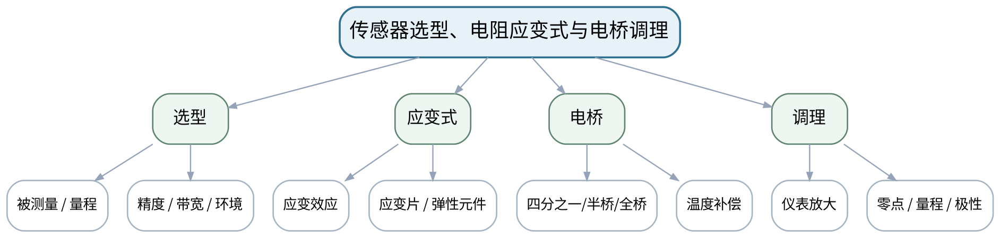

### 教学目标
**知识目标：**
1. 掌握传感器选型原则和电阻应变式传感器基本原理。
2. 理解惠斯登电桥、仪表放大、温度补偿及力/应变测量链。

**能力目标：**
1. 能够根据量程、频带、精度、环境和安装要求选择应变式传感器并设计基本桥路。
2. 能够识别极性、桥路、供电、温漂和放大倍数的常见错误。

**价值目标：**
1. 形成“先检查后通电”、量程和接线必须与工程风险匹配的职业责任。

### 课程思政
通过超量程、错接线和应变片脱落事故风险强化规范接线和设备安全。

### 专创融合
把桥路/放大参数配置抽象为可复用测试通道模板，服务柔性测试平台。

### 教学重难点
**教学重点：**传感器选型；应变式传感器和电桥调理。

**教学难点：**把应变片、电桥和放大器看成完整测力链，避免只记公式不看接线与量程。

### 教学方法与用具
**教学方法：**讲授法、问题引导法、工程案例法、模型/公式推演法、仪器/Python演示法、分组研讨法、反例分析法

**教学用具：**应变片、桥路实验板、仪表放大器、万用表、示波器/采集设备。

### 教学设计
课前任务 → 互动导入（15 min）→ 传授新知与课堂训练（70 min）→ 过关检测（10 min）→ 课堂小结（3 min）→ 作业布置（1 min）→ 考勤（1 min）

### 课前任务
【教师】发布“传感器选型、电阻应变式与电桥调理”对应大纲/教材范围和一个最小工程问题，不提前给出完整答案。

1. 阅读对应大纲与教材内容；
2. 圈出3个关键术语并记录至少1个疑问；
3. 预读一个测试链、波形、频谱、传感器结构或配置表，写出预期结果和至少一个疑问。

【学生】完成准备并带着“预期结果/疑问/已有证据”进入课堂。

### 互动导入
【教师】给出全桥四片应变片方向错误的接线图，要求学生预测加载后输出为何接近零。

【学生】先独立预测/判断，再与同伴交换依据；教师收集典型分歧后进入本课。

### 传授新知与课堂训练
**一、核心概念与工程案例（约25 min）—传感器选型框架**

【教师】以位移/力/温度任务建立“对象—量—量程—带宽—环境—输出—安装”表。

【学生】完成公式/测试链/代码/图表推演，先写预期与依据，再用演示或数据验证并修正。

**二、模型/方法与Python/仪器演示（约25 min）—应变式与桥路**

【教师】讲应变效应、贴片方向、四分之一/半桥/全桥、温补和灵敏度差异。

【学生】完成公式/测试链/代码/图表推演，先写预期与依据，再用演示或数据验证并修正。

**三、学生分析、验证与错误复盘（约20 min）—调理与故障分析**

【教师】讲仪表放大、零点/量程、极性；分析断线、桥臂接错、超量程和温漂案例。

【学生】完成公式/测试链/代码/图表推演，先写预期与依据，再用演示或数据验证并修正。

**独立学习产物**：力/应变测试链设计图＋桥路/放大参数检查表。

**学习证据**：选型表、桥路图、预期极性、量程预算、故障案例修正记录。

**评价映射**：平时成绩＋课程作业＋期末考核；目标1.4、2.4、3.4。

### 过关检测
【教师】组织当堂检测：

1. 全桥相对四分之一桥的主要工程优势是什么？
2. 应变片贴片方向错误会影响什么？
3. 仪表放大器增益为什么不能越大越好？

【学生】独立作答/运行/推演验证；【教师】按错误类型讲解，要求说明测试链、信号、模型或数据依据。

### 课堂小结
【教师】回到本课知识脉络图，用“对象—测量链—参数/方法—验证—证据—边界”总结“传感器选型、电阻应变式与电桥调理”，再次强调教学重点：传感器选型；应变式传感器和电桥调理。

【学生】写下“本课一条最重要的测试规则 + 一个最容易出错的边界”。

### 作业布置
【教师】布置课后任务：为一个0~2 kN拉压力测试任务设计传感器/桥路/放大/采集链，并写安全检查。

【学生】按课程统一文件命名和证据要求整理提交。

### 考勤
【教师】利用学校/课程实际使用的平台进行签到。

【学生】按课程要求完成签到。

### 课后教学反思
【课后填写，不预填事实】

1. 教学流程：记录100 min各环节实际用时及需要调整的位置；
2. 教学内容：重点记录“把应变片、电桥和放大器看成完整测力链，避免只记公式不看接线与量程。”的真实掌握证据与常见错误；
3. 学生参与：仅依据真实课堂/实验记录填写测试链设计、推演、仪器操作、Python分析、互审和复测情况，不补写推测；
4. 评价证据：检查本课原始数据、配置、代码、图表、参数、复测和结论是否完整，记录缺项原因；
5. 后续改进：依据真实课堂证据决定下一次课的补救、复现或拓展。

### 本章节参考文献
[1] 祝海林.《机械工程测试技术（第3版）》[M]. 机械工业出版社，2024。
[2] 《传感与检测技术（第3版）》——课程大纲调研说明推荐参考资料。

## 第12次课 电感/电容式传感器与位移测量

### 课次信息
- **章节/单元**：第四单元 传感器、信号调理与典型机械量测量
- **周次**：按实际课表填写
- **课时安排**：2课时（100 min）
- **课型**：理论

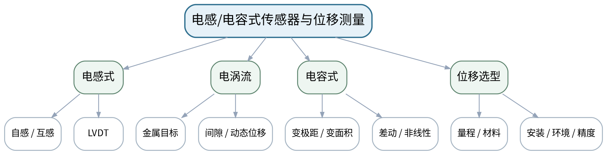

### 教学目标
**知识目标：**
1. 掌握电感式、电容式传感器的基本结构、工作原理和差动思想。
2. 理解LVDT、电涡流、电容位移等方法及其非接触测量特点。

**能力目标：**
1. 能够根据被测材料、量程、精度、安装间隙和环境选择位移传感器。
2. 能够分析差动结构、非线性、零点和安装偏心等误差。

**价值目标：**
1. 形成结构/安装与信号质量同等重要的工程测试意识。

### 课程思政
强调传感器安装松动、偏心和间隙错误会直接造成错误结论，测试前必须结构检查。

### 专创融合
将位移传感器配置与安装规范形成“测点组件”，服务设备在线监测和数字孪生状态采集。

### 教学重难点
**教学重点：**电感/电容式传感器原理及位移选型。

**教学难点：**把传感器结构、被测材料和安装间隙共同纳入选型，理解差动补偿并非万能。

### 教学方法与用具
**教学方法：**讲授法、问题引导法、工程案例法、模型/公式推演法、仪器/Python演示法、分组研讨法、反例分析法

**教学用具：**LVDT/电涡流/电容式传感器实物或结构图、位移台、示波器/采集设备。

### 教学设计
课前任务 → 互动导入（15 min）→ 传授新知与课堂训练（70 min）→ 过关检测（10 min）→ 课堂小结（3 min）→ 作业布置（1 min）→ 考勤（1 min）

### 课前任务
【教师】发布“电感/电容式传感器与位移测量”对应大纲/教材范围和一个最小工程问题，不提前给出完整答案。

1. 阅读对应大纲与教材内容；
2. 圈出3个关键术语并记录至少1个疑问；
3. 预读一个测试链、波形、频谱、传感器结构或配置表，写出预期结果和至少一个疑问。

【学生】完成准备并带着“预期结果/疑问/已有证据”进入课堂。

### 互动导入
【教师】同一个主轴径向位移任务分别给出金属转子和塑料目标件，要求学生判断电涡流方案是否都适用。

【学生】先独立预测/判断，再与同伴交换依据；教师收集典型分歧后进入本课。

### 传授新知与课堂训练
**一、核心概念与工程案例（约25 min）—原理与结构**

【教师】讲LVDT、自感/互感、电涡流和电容位移基本原理，比较接触/非接触。

【学生】完成公式/测试链/代码/图表推演，先写预期与依据，再用演示或数据验证并修正。

**二、模型/方法与Python/仪器演示（约25 min）—差动与误差**

【教师】分析差动结构对灵敏度/温漂/非线性的影响，讨论零点残余、边缘效应和安装偏心。

【学生】完成公式/测试链/代码/图表推演，先写预期与依据，再用演示或数据验证并修正。

**三、学生分析、验证与错误复盘（约20 min）—位移选型任务**

【教师】学生为机床直线位移、主轴径向振动和非金属薄膜厚度选择方案并说明排除理由。

【学生】完成公式/测试链/代码/图表推演，先写预期与依据，再用演示或数据验证并修正。

**独立学习产物**：三种位移场景传感器选型表＋安装/误差清单。

**学习证据**：结构图、选型参数、被测材料/量程/频带、安装间隙、误差控制说明。

**评价映射**：平时成绩＋课程作业＋期末考核；目标1.4、2.4、3.4。

### 过关检测
【教师】组织当堂检测：

1. 电涡流传感器为什么受被测材料影响？
2. 差动LVDT的零点残余电压可能来自什么？
3. 变极距电容为何更适合微小位移？

【学生】独立作答/运行/推演验证；【教师】按错误类型讲解，要求说明测试链、信号、模型或数据依据。

### 课堂小结
【教师】回到本课知识脉络图，用“对象—测量链—参数/方法—验证—证据—边界”总结“电感/电容式传感器与位移测量”，再次强调教学重点：电感/电容式传感器原理及位移选型。

【学生】写下“本课一条最重要的测试规则 + 一个最容易出错的边界”。

### 作业布置
【教师】布置课后任务：完成一个主轴位移/振动测量方案，画出传感器安装位置和信号调理链。

【学生】按课程统一文件命名和证据要求整理提交。

### 考勤
【教师】利用学校/课程实际使用的平台进行签到。

【学生】按课程要求完成签到。

### 课后教学反思
【课后填写，不预填事实】

1. 教学流程：记录100 min各环节实际用时及需要调整的位置；
2. 教学内容：重点记录“把传感器结构、被测材料和安装间隙共同纳入选型，理解差动补偿并非万能。”的真实掌握证据与常见错误；
3. 学生参与：仅依据真实课堂/实验记录填写测试链设计、推演、仪器操作、Python分析、互审和复测情况，不补写推测；
4. 评价证据：检查本课原始数据、配置、代码、图表、参数、复测和结论是否完整，记录缺项原因；
5. 后续改进：依据真实课堂证据决定下一次课的补救、复现或拓展。

### 本章节参考文献
[1] 祝海林.《机械工程测试技术（第3版）》[M]. 机械工业出版社，2024。
[2] 《传感与检测技术（第3版）》——课程大纲调研说明推荐参考资料。

## 第13次课 压电/磁电/霍尔/光电传感器与转速/振动测量

### 课次信息
- **章节/单元**：第四单元 传感器、信号调理与典型机械量测量
- **周次**：按实际课表填写
- **课时安排**：2课时（100 min）
- **课型**：理论

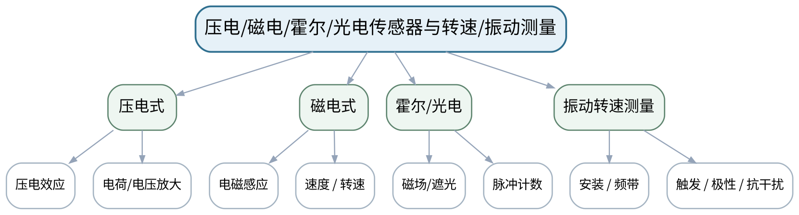

### 教学目标
**知识目标：**
1. 掌握压电式、磁电式、霍尔和光电式传感器的基本工作原理。
2. 理解加速度、速度、转速测量中动态范围、安装和输出调理要求。

**能力目标：**
1. 能够为振动/转速任务选择传感器并说明频带、安装、供电/调理和抗干扰要求。
2. 能够识别压电静态测量限制、磁电低频特性和光电/霍尔触发问题。

**价值目标：**
1. 形成动态测量必须匹配频带并验证安装状态的工程习惯。

### 课程思政
通过传感器安装错误、触发误判案例强化“先检查测量链、后判断设备”的责任。

### 专创融合
将振动与转速多通道方案作为后续同步采集、状态融合的基础原型。

### 教学重难点
**教学重点：**压电/磁电/霍尔/光电传感器；振动与转速测量。

**教学难点：**动态传感器的频带、安装和调理会共同塑造测得信号；不能只按“测什么量”选型。

### 教学方法与用具
**教学方法：**讲授法、问题引导法、工程案例法、模型/公式推演法、仪器/Python演示法、分组研讨法、反例分析法

**教学用具：**压电加速度计、磁电/霍尔/光电转速传感器、示波器、采集卡、安装附件。

### 教学设计
课前任务 → 互动导入（15 min）→ 传授新知与课堂训练（70 min）→ 过关检测（10 min）→ 课堂小结（3 min）→ 作业布置（1 min）→ 考勤（1 min）

### 课前任务
【教师】发布“压电/磁电/霍尔/光电传感器与转速/振动测量”对应大纲/教材范围和一个最小工程问题，不提前给出完整答案。

1. 阅读对应大纲与教材内容；
2. 圈出3个关键术语并记录至少1个疑问；
3. 预读一个测试链、波形、频谱、传感器结构或配置表，写出预期结果和至少一个疑问。

【学生】完成准备并带着“预期结果/疑问/已有证据”进入课堂。

### 互动导入
【教师】给出压电加速度传感器松动安装后出现高频异常峰的案例，要求学生先检查安装还是先判设备故障。

【学生】先独立预测/判断，再与同伴交换依据；教师收集典型分歧后进入本课。

### 传授新知与课堂训练
**一、核心概念与工程案例（约25 min）—动态传感原理**

【教师】压电效应、电荷放大、磁电速度、霍尔/光电脉冲，比较有源/无源与输出形式。

【学生】完成公式/测试链/代码/图表推演，先写预期与依据，再用演示或数据验证并修正。

**二、模型/方法与Python/仪器演示（约25 min）—测量任务**

【教师】从加速度/速度/转速定义测量链，讲安装方向、固定刚度、触发阈值和电缆/屏蔽。

【学生】完成公式/测试链/代码/图表推演，先写预期与依据，再用演示或数据验证并修正。

**三、学生分析、验证与错误复盘（约20 min）—故障分析**

【教师】分析松动安装、低频漂移、触发抖动、磁场干扰等案例，学生给排查顺序。

【学生】完成公式/测试链/代码/图表推演，先写预期与依据，再用演示或数据验证并修正。

**独立学习产物**：振动/转速测试链＋传感器选型/安装/调理检查单。

**学习证据**：频带与量程参数、安装图、调理链、故障注入判断、复核步骤。

**评价映射**：平时成绩＋课程作业＋期末考核；目标1.4、2.4、3.4。

### 过关检测
【教师】组织当堂检测：

1. 压电传感器为什么不适合长期静态力测量？
2. 传感器安装刚度怎样影响高频振动测量？
3. 霍尔/光电转速信号为什么需要关注触发阈值？

【学生】独立作答/运行/推演验证；【教师】按错误类型讲解，要求说明测试链、信号、模型或数据依据。

### 课堂小结
【教师】回到本课知识脉络图，用“对象—测量链—参数/方法—验证—证据—边界”总结“压电/磁电/霍尔/光电传感器与转速/振动测量”，再次强调教学重点：压电/磁电/霍尔/光电传感器；振动与转速测量。

【学生】写下“本课一条最重要的测试规则 + 一个最容易出错的边界”。

### 作业布置
【教师】布置课后任务：对一个电机振动+转速同步测量任务，设计两通道传感器和安装方案。

【学生】按课程统一文件命名和证据要求整理提交。

### 考勤
【教师】利用学校/课程实际使用的平台进行签到。

【学生】按课程要求完成签到。

### 课后教学反思
【课后填写，不预填事实】

1. 教学流程：记录100 min各环节实际用时及需要调整的位置；
2. 教学内容：重点记录“动态传感器的频带、安装和调理会共同塑造测得信号；不能只按“测什么量”选型。”的真实掌握证据与常见错误；
3. 学生参与：仅依据真实课堂/实验记录填写测试链设计、推演、仪器操作、Python分析、互审和复测情况，不补写推测；
4. 评价证据：检查本课原始数据、配置、代码、图表、参数、复测和结论是否完整，记录缺项原因；
5. 后续改进：依据真实课堂证据决定下一次课的补救、复现或拓展。

### 本章节参考文献
[1] 祝海林.《机械工程测试技术（第3版）》[M]. 机械工业出版社，2024。
[2] 《传感与检测技术（第3版）》——课程大纲调研说明推荐参考资料。

## 第14次课 温度传感器、接触/非接触测温与工程误差

### 课次信息
- **章节/单元**：第四单元 传感器、信号调理与典型机械量测量
- **周次**：按实际课表填写
- **课时安排**：2课时（100 min）
- **课型**：理论

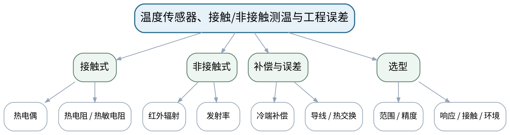

### 教学目标
**知识目标：**
1. 掌握热电偶、热电阻/热敏电阻和红外测温的基本原理与适用范围。
2. 理解冷端补偿、导线/安装热误差、发射率和响应时间等影响。

**能力目标：**
1. 能够根据温度范围、响应速度、接触条件和精度要求选择测温方案。
2. 能够为热电偶/Pt100/红外测温提出基本补偿和校准措施。

**价值目标：**
1. 形成“测温对象改变传感器、传感器也会改变对象”的负载/扰动意识。

### 课程思政
通过超温/误测造成安全风险的案例强调补偿、校准和工况匹配。

### 专创融合
将温度测点纳入多传感状态监测，为制造过程质量监控和预测维护提供热特征。

### 教学重难点
**教学重点：**热电偶/Pt100/红外测温与误差补偿。

**教学难点：**区分传感器本体精度和安装/热交换/发射率带来的系统误差。

### 教学方法与用具
**教学方法：**讲授法、问题引导法、工程案例法、模型/公式推演法、仪器/Python演示法、分组研讨法、反例分析法

**教学用具：**热电偶、Pt100、红外测温仪、温度采集模块、恒温/加热示例。

### 教学设计
课前任务 → 互动导入（15 min）→ 传授新知与课堂训练（70 min）→ 过关检测（10 min）→ 课堂小结（3 min）→ 作业布置（1 min）→ 考勤（1 min）

### 课前任务
【教师】发布“温度传感器、接触/非接触测温与工程误差”对应大纲/教材范围和一个最小工程问题，不提前给出完整答案。

1. 阅读对应大纲与教材内容；
2. 圈出3个关键术语并记录至少1个疑问；
3. 预读一个测试链、波形、频谱、传感器结构或配置表，写出预期结果和至少一个疑问。

【学生】完成准备并带着“预期结果/疑问/已有证据”进入课堂。

### 互动导入
【教师】同一加热金属表面，贴片热电偶和红外枪相差15 ℃，要求学生列出至少4个可能原因而不是立即判断谁坏了。

【学生】先独立预测/判断，再与同伴交换依据；教师收集典型分歧后进入本课。

### 传授新知与课堂训练
**一、核心概念与工程案例（约25 min）—测温原理**

【教师】讲热电偶热电效应、冷端补偿；Pt100电阻温度特性；红外辐射/发射率。

【学生】完成公式/测试链/代码/图表推演，先写预期与依据，再用演示或数据验证并修正。

**二、模型/方法与Python/仪器演示（约25 min）—动态与安装**

【教师】比较接触式响应、热容量、导线热传导、安装位置；非接触式距离/视场/表面状态。

【学生】完成公式/测试链/代码/图表推演，先写预期与依据，再用演示或数据验证并修正。

**三、学生分析、验证与错误复盘（约20 min）—选型与误差**

【教师】学生为电机轴承、3D打印喷嘴、移动热工件设计方案并列校准/补偿。

【学生】完成公式/测试链/代码/图表推演，先写预期与依据，再用演示或数据验证并修正。

**独立学习产物**：三场景测温选型表＋误差/补偿清单。

**学习证据**：测温范围、响应、安装方式、补偿参数、复测方案、选择理由。

**评价映射**：平时成绩＋课程作业＋期末考核；目标1.4、2.4、3.4。

### 过关检测
【教师】组织当堂检测：

1. 热电偶为什么需要冷端补偿？
2. 红外测温为什么必须关注发射率？
3. 接触式传感器响应慢可能与哪些因素有关？

【学生】独立作答/运行/推演验证；【教师】按错误类型讲解，要求说明测试链、信号、模型或数据依据。

### 课堂小结
【教师】回到本课知识脉络图，用“对象—测量链—参数/方法—验证—证据—边界”总结“温度传感器、接触/非接触测温与工程误差”，再次强调教学重点：热电偶/Pt100/红外测温与误差补偿。

【学生】写下“本课一条最重要的测试规则 + 一个最容易出错的边界”。

### 作业布置
【教师】布置课后任务：为一个快速升温3D打印喷嘴和一个电机轴承分别设计测温方案并比较。

【学生】按课程统一文件命名和证据要求整理提交。

### 考勤
【教师】利用学校/课程实际使用的平台进行签到。

【学生】按课程要求完成签到。

### 课后教学反思
【课后填写，不预填事实】

1. 教学流程：记录100 min各环节实际用时及需要调整的位置；
2. 教学内容：重点记录“区分传感器本体精度和安装/热交换/发射率带来的系统误差。”的真实掌握证据与常见错误；
3. 学生参与：仅依据真实课堂/实验记录填写测试链设计、推演、仪器操作、Python分析、互审和复测情况，不补写推测；
4. 评价证据：检查本课原始数据、配置、代码、图表、参数、复测和结论是否完整，记录缺项原因；
5. 后续改进：依据真实课堂证据决定下一次课的补救、复现或拓展。

### 本章节参考文献
[1] 祝海林.《机械工程测试技术（第3版）》[M]. 机械工业出版社，2024。
[2] 《传感与检测技术（第3版）》——课程大纲调研说明推荐参考资料。

## 第15次课 信号调理：放大、滤波、隔离、线性化、接地与屏蔽

### 课次信息
- **章节/单元**：第四单元 传感器、信号调理与典型机械量测量
- **周次**：按实际课表填写
- **课时安排**：2课时（100 min）
- **课型**：理论

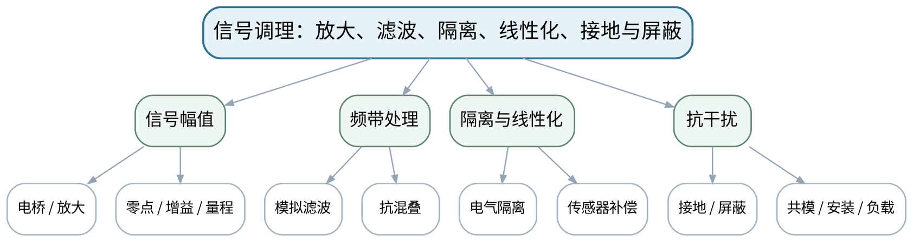

### 教学目标
**知识目标：**
1. 掌握电桥、仪表/电荷放大、模拟滤波、隔离、线性化和抗干扰的基本作用。
2. 理解接地环路、屏蔽、共模干扰、超量程和传感器安装/负载影响。

**能力目标：**
1. 能够根据传感器输出和采集输入设计基本调理链并做量程预算。
2. 能够按“复现—定位—修正—复测”分析接地、屏蔽、增益、滤波和安装故障。

**价值目标：**
1. 形成先检查后通电、故障修改一次只变一个变量、修正后必须复测的规范。

### 课程思政
以错误接地、超量程和不当滤波导致误结论的案例强化规范调试和责任边界。

### 专创融合
把调理链配置化、模块化，为多通道可复用智能测试前端提供接口规范。

### 教学重难点
**教学重点：**调理链与量程预算；接地/屏蔽/滤波故障分析。

**教学难点：**一个“更干净”的信号可能是过度滤波或饱和造成，必须结合原始信号和配置判断。

### 教学方法与用具
**教学方法：**讲授法、问题引导法、工程案例法、模型/公式推演法、仪器/Python演示法、分组研讨法、反例分析法

**教学用具：**电桥/仪表放大/电荷放大模块、滤波/隔离示例、示波器、采集卡。

### 教学设计
课前任务 → 互动导入（15 min）→ 传授新知与课堂训练（70 min）→ 过关检测（10 min）→ 课堂小结（3 min）→ 作业布置（1 min）→ 考勤（1 min）

### 课前任务
【教师】发布“信号调理：放大、滤波、隔离、线性化、接地与屏蔽”对应大纲/教材范围和一个最小工程问题，不提前给出完整答案。

1. 阅读对应大纲与教材内容；
2. 圈出3个关键术语并记录至少1个疑问；
3. 预读一个测试链、波形、频谱、传感器结构或配置表，写出预期结果和至少一个疑问。

【学生】完成准备并带着“预期结果/疑问/已有证据”进入课堂。

### 互动导入
【教师】展示接地环路产生50 Hz干扰、把滤波截止频率设得过低后“干扰消失”的两张图，问：问题真的解决了吗？

【学生】先独立预测/判断，再与同伴交换依据；教师收集典型分歧后进入本课。

### 传授新知与课堂训练
**一、核心概念与工程案例（约25 min）—调理链设计**

【教师】从传感器量级到采集卡输入范围做增益/偏置预算；讲电桥、仪表/电荷放大和隔离。

【学生】完成公式/测试链/代码/图表推演，先写预期与依据，再用演示或数据验证并修正。

**二、模型/方法与Python/仪器演示（约25 min）—滤波与抗混叠**

【教师】讲模拟前置滤波和数字滤波职责边界，避免用后处理弥补采样前混叠。

【学生】完成公式/测试链/代码/图表推演，先写预期与依据，再用演示或数据验证并修正。

**三、学生分析、验证与错误复盘（约20 min）—抗干扰故障闭环**

【教师】分析接地环路、屏蔽错误、共模、超量程、松动安装；学生按一次一变量完成排查流程。

【学生】完成公式/测试链/代码/图表推演，先写预期与依据，再用演示或数据验证并修正。

**独立学习产物**：一张信号调理链＋量程预算＋故障排查流程图。

**学习证据**：输入/输出量级、增益、滤波/隔离、接地屏蔽方案、故障复测证据。

**评价映射**：平时成绩＋课程作业＋期末考核；目标1.4、2.4、3.4。

### 过关检测
【教师】组织当堂检测：

1. 模拟抗混叠滤波为什么不能完全由数字滤波替代？
2. 接地环路常出现什么频率特征？
3. 放大器饱和后的信号还能靠软件恢复吗？

【学生】独立作答/运行/推演验证；【教师】按错误类型讲解，要求说明测试链、信号、模型或数据依据。

### 课堂小结
【教师】回到本课知识脉络图，用“对象—测量链—参数/方法—验证—证据—边界”总结“信号调理：放大、滤波、隔离、线性化、接地与屏蔽”，再次强调教学重点：调理链与量程预算；接地/屏蔽/滤波故障分析。

【学生】写下“本课一条最重要的测试规则 + 一个最容易出错的边界”。

### 作业布置
【教师】布置课后任务：为压电振动和应变测力各设计一条调理链，标明量程和抗干扰措施。

【学生】按课程统一文件命名和证据要求整理提交。

### 考勤
【教师】利用学校/课程实际使用的平台进行签到。

【学生】按课程要求完成签到。

### 课后教学反思
【课后填写，不预填事实】

1. 教学流程：记录100 min各环节实际用时及需要调整的位置；
2. 教学内容：重点记录“一个“更干净”的信号可能是过度滤波或饱和造成，必须结合原始信号和配置判断。”的真实掌握证据与常见错误；
3. 学生参与：仅依据真实课堂/实验记录填写测试链设计、推演、仪器操作、Python分析、互审和复测情况，不补写推测；
4. 评价证据：检查本课原始数据、配置、代码、图表、参数、复测和结论是否完整，记录缺项原因；
5. 后续改进：依据真实课堂证据决定下一次课的补救、复现或拓展。

### 本章节参考文献
[1] 祝海林.《机械工程测试技术（第3版）》[M]. 机械工业出版社，2024。
[2] 《传感与检测技术（第3版）》——课程大纲调研说明推荐参考资料。

## 第16次课 实验二：测试系统动态响应与信号调理

### 课次信息
- **章节/单元**：实验二 测试系统动态响应与信号调理
- **周次**：按实际课表填写
- **课时安排**：2课时（100 min）
- **课型**：实验

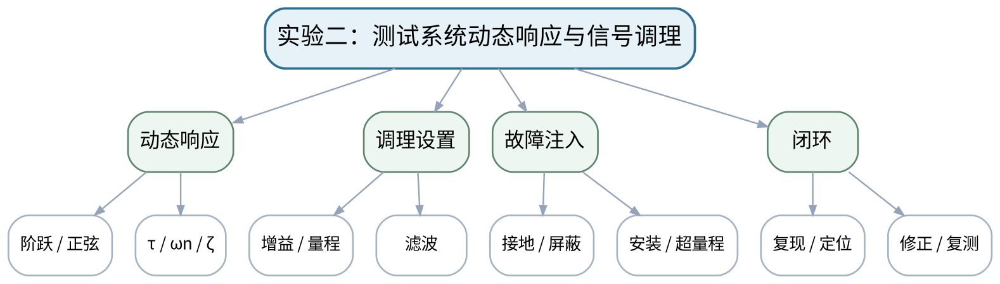

### 教学目标
**知识目标：**
1. 理解一阶/二阶动态响应参数和调理设置对测试结果的影响。

**能力目标：**
1. 能够采集阶跃/正弦响应或分析给定数据，识别时间常数、固有频率或阻尼。
2. 能够通过故障注入比较滤波、放大、接地、屏蔽或安装设置前后结果。

**价值目标：**
1. 形成复现—定位—修正—复测闭环和变量控制意识。

### 课程思政
用错误接地和不当滤波的实际后果强调规范调试、变量控制和对测试结论负责。

### 专创融合
将故障闭环记录固化为测试台调试SOP，为后续自动诊断和自校准积累规则。

### 教学重难点
**教学重点：**动态参数识别与信号调理故障闭环。

**教学难点：**每次只改变一个变量，避免同时改滤波、增益和安装导致无法归因。

### 教学方法与用具
**教学方法：**实验讲解法、分组实操法、故障注入法、Python数据分析法、对照复测法、结果讲评法

**教学用具：**动态响应实验台/等价数据、传感器、调理模块、示波器/采集卡、Python。

### 教学设计
课前任务 → 互动导入（15 min）→ 传授新知与课堂训练（70 min）→ 过关检测（10 min）→ 课堂小结（3 min）→ 作业布置（1 min）→ 考勤（1 min）

### 课前任务
【教师】发布“实验二：测试系统动态响应与信号调理”对应大纲/教材范围和一个最小工程问题，不提前给出完整答案。

1. 阅读对应大纲与教材内容；
2. 圈出3个关键术语并记录至少1个疑问；
3. 检查实验设备/等价数据、Python环境和上一任务文件是否可用；实验前不通电，先完成安全与量程检查。

【学生】完成准备并带着“预期结果/疑问/已有证据”进入课堂。

### 互动导入
【教师】教师先设置一个错误接地或不当滤波参数，让学生按仪器现象和记录定位，而不是直接告知故障。

【学生】先独立预测/判断，再与同伴交换依据；教师收集典型分歧后进入本课。

### 传授新知与课堂训练
**一、任务说明与安全/配置确认（约15 min）—实验准备**

【教师】完成安全、量程、接线、安装和通道配置检查；记录基线参数。

【学生】按任务约束完成实验/分析，保留原始数据、配置、代码、图表、错误与复测证据。

**二、分组实验与数据采集（约40 min）—响应与故障注入**

【教师】获取一阶/二阶响应，设置一种调理/安装故障，记录异常波形或频谱。

【学生】按任务约束完成实验/分析，保留原始数据、配置、代码、图表、错误与复测证据。

**三、分析、复测与证据固化（约15 min）—修正与复测**

【教师】只修改一个变量，复测并比较；用Python估计τ/ωn/ζ或频带指标，写根因证据。

【学生】按任务约束完成实验/分析，保留原始数据、配置、代码、图表、错误与复测证据。

**独立学习产物**：实验二完整包：响应数据＋故障前后配置＋参数识别脚本＋复测报告。

**学习证据**：原始/故障/修正数据、通道配置、响应曲线、参数估计、故障根因与复测。

**评价映射**：课程作业；实验二正式证据；目标1.3、1.4、2.3、2.4、3.3、3.4。

### 过关检测
【教师】组织当堂检测：

1. 为什么故障排查要求一次只改一个变量？
2. 如何证明滤波修正没有删除真实目标频带？
3. 动态参数识别至少要保留哪些原始配置？

【学生】独立作答/运行/推演验证；【教师】按错误类型讲解，要求说明测试链、信号、模型或数据依据。

### 课堂小结
【教师】回到本课知识脉络图，用“对象—测量链—参数/方法—验证—证据—边界”总结“实验二：测试系统动态响应与信号调理”，再次强调教学重点：动态参数识别与信号调理故障闭环。

【学生】写下“本课一条最重要的测试规则 + 一个最容易出错的边界”。

### 作业布置
【教师】布置课后任务：完成实验二报告，附一条完整“复现—定位—修正—复测”证据链。

【学生】按课程统一文件命名和证据要求整理提交。

### 考勤
【教师】利用学校/课程实际使用的平台进行签到。

【学生】按课程要求完成签到。

### 课后教学反思
【课后填写，不预填事实】

1. 教学流程：记录100 min各环节实际用时及需要调整的位置；
2. 教学内容：重点记录“每次只改变一个变量，避免同时改滤波、增益和安装导致无法归因。”的真实掌握证据与常见错误；
3. 学生参与：仅依据真实课堂/实验记录填写测试链设计、推演、仪器操作、Python分析、互审和复测情况，不补写推测；
4. 评价证据：检查本课原始数据、配置、代码、图表、参数、复测和结论是否完整，记录缺项原因；
5. 后续改进：依据真实课堂证据决定下一次课的补救、复现或拓展。

### 本章节参考文献
[1] 祝海林.《机械工程测试技术（第3版）》[M]. 机械工业出版社，2024。

## 第17次课 采样保持、A/D转换、量化与采集通道配置

### 课次信息
- **章节/单元**：第五单元 数据采集、计算机测试与智能仪器
- **周次**：按实际课表填写
- **课时安排**：2课时（100 min）
- **课型**：理论

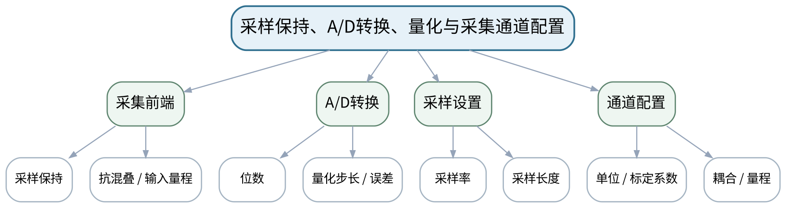

### 教学目标
**知识目标：**
1. 掌握采样保持、A/D转换、分辨率、量化误差、输入量程和采样率的基本关系。
2. 理解通道配置和抗混叠前端对数字数据质量的影响。

**能力目标：**
1. 能够根据传感器输出、目标频带和精度要求配置采样率、量程和ADC分辨率。
2. 能够估算量化步长并识别欠量程/过量程的后果。

**价值目标：**
1. 形成“采集配置就是实验条件”的意识，任何数据必须带采样率、量程、单位和标定系数。

### 课程思政
通过缺少单位/量程造成错误决策的案例强化接口契约和数据可追溯。

### 专创融合
将通道表视为测试系统机器可读配置的前身，为自动化采集和团队协作铺垫。

### 教学重难点
**教学重点：**ADC分辨率/量程/量化；采样率和通道配置。

**教学难点：**同时权衡量程、分辨率、噪声和目标频带，避免默认设置。

### 教学方法与用具
**教学方法：**讲授法、问题引导法、工程案例法、模型/公式推演法、仪器/Python演示法、分组研讨法、反例分析法

**教学用具：**采集卡/控制器示例、Python、数据采集框图、通道配置表。

### 教学设计
课前任务 → 互动导入（15 min）→ 传授新知与课堂训练（70 min）→ 过关检测（10 min）→ 课堂小结（3 min）→ 作业布置（1 min）→ 考勤（1 min）

### 课前任务
【教师】发布“采样保持、A/D转换、量化与采集通道配置”对应大纲/教材范围和一个最小工程问题，不提前给出完整答案。

1. 阅读对应大纲与教材内容；
2. 圈出3个关键术语并记录至少1个疑问；
3. 预读一个测试链、波形、频谱、传感器结构或配置表，写出预期结果和至少一个疑问。

【学生】完成准备并带着“预期结果/疑问/已有证据”进入课堂。

### 互动导入
【教师】同一12位ADC，一个设置±10 V、一个±1 V测量50 mV信号，要求学生比较量化步长和有效分辨能力。

【学生】先独立预测/判断，再与同伴交换依据；教师收集典型分歧后进入本课。

### 传授新知与课堂训练
**一、核心概念与工程案例（约25 min）—采样保持与ADC**

【教师】讲模拟→采样保持→量化→数字码，计算2^N和量化步长。

【学生】完成公式/测试链/代码/图表推演，先写预期与依据，再用演示或数据验证并修正。

**二、模型/方法与Python/仪器演示（约25 min）—量程/采样配置**

【教师】以振动和温度通道比较量程、采样率、耦合和抗混叠。

【学生】完成公式/测试链/代码/图表推演，先写预期与依据，再用演示或数据验证并修正。

**三、学生分析、验证与错误复盘（约20 min）—配置审查**

【教师】学生完成一张多通道配置表，教师注入“单位缺失/量程过大/采样不足”错误让同伴找出。

【学生】完成公式/测试链/代码/图表推演，先写预期与依据，再用演示或数据验证并修正。

**独立学习产物**：多通道采集配置表＋量化/采样计算卡。

**学习证据**：通道名、传感器、单位、量程、ADC位数、采样率、标定系数、风险说明。

**评价映射**：平时成绩＋课程作业＋期末考核；目标1.5、2.5、3.5。

### 过关检测
【教师】组织当堂检测：

1. ADC位数相同时，量程缩小对量化步长有什么影响？
2. 为什么采样率高并不自动代表数据更好？
3. 为什么通道配置必须记录单位和标定系数？

【学生】独立作答/运行/推演验证；【教师】按错误类型讲解，要求说明测试链、信号、模型或数据依据。

### 课堂小结
【教师】回到本课知识脉络图，用“对象—测量链—参数/方法—验证—证据—边界”总结“采样保持、A/D转换、量化与采集通道配置”，再次强调教学重点：ADC分辨率/量程/量化；采样率和通道配置。

【学生】写下“本课一条最重要的测试规则 + 一个最容易出错的边界”。

### 作业布置
【教师】布置课后任务：为振动、温度、转速三通道制定采集表并说明采样率差异理由。

【学生】按课程统一文件命名和证据要求整理提交。

### 考勤
【教师】利用学校/课程实际使用的平台进行签到。

【学生】按课程要求完成签到。

### 课后教学反思
【课后填写，不预填事实】

1. 教学流程：记录100 min各环节实际用时及需要调整的位置；
2. 教学内容：重点记录“同时权衡量程、分辨率、噪声和目标频带，避免默认设置。”的真实掌握证据与常见错误；
3. 学生参与：仅依据真实课堂/实验记录填写测试链设计、推演、仪器操作、Python分析、互审和复测情况，不补写推测；
4. 评价证据：检查本课原始数据、配置、代码、图表、参数、复测和结论是否完整，记录缺项原因；
5. 后续改进：依据真实课堂证据决定下一次课的补救、复现或拓展。

### 本章节参考文献
[1] 祝海林.《机械工程测试技术（第3版）》[M]. 机械工业出版社，2024。
[5] 《智能仪器设计基础（第2版）》——课程大纲调研说明推荐参考资料。

## 第18次课 多通道同步、触发、缓存、时间戳与元数据

### 课次信息
- **章节/单元**：第五单元 数据采集、计算机测试与智能仪器
- **周次**：按实际课表填写
- **课时安排**：2课时（100 min）
- **课型**：理论

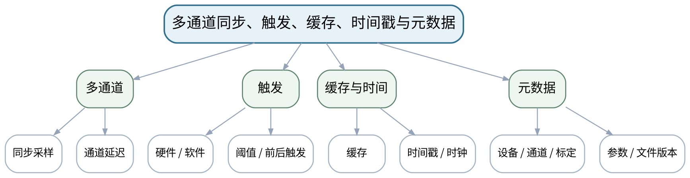

### 教学目标
**知识目标：**
1. 理解多通道同步、触发、缓存、时间戳和数据文件/元数据的基本作用。
2. 理解同步采样与轮询、硬件/软件触发等基本差异。

**能力目标：**
1. 能够为振动+转速+温度等多通道任务设计同步/触发和数据记录方案。
2. 能够定义最小元数据字段并用回放数据复核采集结果。

**价值目标：**
1. 形成数据文件必须可被“未来的自己/同伴”解释和复现的文档意识。

### 课程思政
通过缺时间戳、单位和配置导致实验无法复现的案例强化技术文档和团队协作。

### 专创融合
把元数据模板作为实验/企业数据交接接口，支持后续自动回放和批量分析。

### 教学重难点
**教学重点：**多通道同步与触发；元数据和可复现数据文件。

**教学难点：**同步误差可能被误认为物理相位差；缺元数据会让数据失去工程意义。

### 教学方法与用具
**教学方法：**讲授法、问题引导法、工程案例法、模型/公式推演法、仪器/Python演示法、分组研讨法、反例分析法

**教学用具：**采集设备示例、Python/Pandas、配置文件样例、时序图。

### 教学设计
课前任务 → 互动导入（15 min）→ 传授新知与课堂训练（70 min）→ 过关检测（10 min）→ 课堂小结（3 min）→ 作业布置（1 min）→ 考勤（1 min）

### 课前任务
【教师】发布“多通道同步、触发、缓存、时间戳与元数据”对应大纲/教材范围和一个最小工程问题，不提前给出完整答案。

1. 阅读对应大纲与教材内容；
2. 圈出3个关键术语并记录至少1个疑问；
3. 预读一个测试链、波形、频谱、传感器结构或配置表，写出预期结果和至少一个疑问。

【学生】完成准备并带着“预期结果/疑问/已有证据”进入课堂。

### 互动导入
【教师】给出两个“同一事件”通道相差20 ms的波形，先让学生判断是物理传播还是采集不同步。

【学生】先独立预测/判断，再与同伴交换依据；教师收集典型分歧后进入本课。

### 传授新知与课堂训练
**一、核心概念与工程案例（约25 min）—同步与触发**

【教师】讲多通道同步、时钟、触发和前/后触发，讨论同步误差和事件捕捉。

【学生】完成公式/测试链/代码/图表推演，先写预期与依据，再用演示或数据验证并修正。

**二、模型/方法与Python/仪器演示（约25 min）—缓存与数据记录**

【教师】讲连续采集、缓存、丢样风险和时间戳。

【学生】完成公式/测试链/代码/图表推演，先写预期与依据，再用演示或数据验证并修正。

**三、学生分析、验证与错误复盘（约20 min）—元数据契约**

【教师】学生设计JSON/CSV伴随元数据：设备、通道、fs、量程、单位、标定、时间、版本、备注。

【学生】完成公式/测试链/代码/图表推演，先写预期与依据，再用演示或数据验证并修正。

**独立学习产物**：多通道采集时序图＋元数据模板＋回放复核清单。

**学习证据**：通道表、触发条件、同步/时钟说明、元数据样例、回放核验记录。

**评价映射**：平时成绩＋课程作业＋期末考核；目标1.5、2.5、3.5。

### 过关检测
【教师】组织当堂检测：

1. 通道不同步会对互相关/相位分析造成什么影响？
2. 触发前数据有什么价值？
3. 数据文件只有数值没有元数据为什么不可接受？

【学生】独立作答/运行/推演验证；【教师】按错误类型讲解，要求说明测试链、信号、模型或数据依据。

### 课堂小结
【教师】回到本课知识脉络图，用“对象—测量链—参数/方法—验证—证据—边界”总结“多通道同步、触发、缓存、时间戳与元数据”，再次强调教学重点：多通道同步与触发；元数据和可复现数据文件。

【学生】写下“本课一条最重要的测试规则 + 一个最容易出错的边界”。

### 作业布置
【教师】布置课后任务：为实验三设计采集配置与元数据模板，至少包含10个可复现字段。

【学生】按课程统一文件命名和证据要求整理提交。

### 考勤
【教师】利用学校/课程实际使用的平台进行签到。

【学生】按课程要求完成签到。

### 课后教学反思
【课后填写，不预填事实】

1. 教学流程：记录100 min各环节实际用时及需要调整的位置；
2. 教学内容：重点记录“同步误差可能被误认为物理相位差；缺元数据会让数据失去工程意义。”的真实掌握证据与常见错误；
3. 学生参与：仅依据真实课堂/实验记录填写测试链设计、推演、仪器操作、Python分析、互审和复测情况，不补写推测；
4. 评价证据：检查本课原始数据、配置、代码、图表、参数、复测和结论是否完整，记录缺项原因；
5. 后续改进：依据真实课堂证据决定下一次课的补救、复现或拓展。

### 本章节参考文献
[1] 祝海林.《机械工程测试技术（第3版）》[M]. 机械工业出版社，2024。
[5] 《智能仪器设计基础（第2版）》——课程大纲调研说明推荐参考资料。

## 第19次课 计算机测试、虚拟仪器、智能仪器与测试软件架构

### 课次信息
- **章节/单元**：第五单元 数据采集、计算机测试与智能仪器
- **周次**：按实际课表填写
- **课时安排**：2课时（100 min）
- **课型**：理论

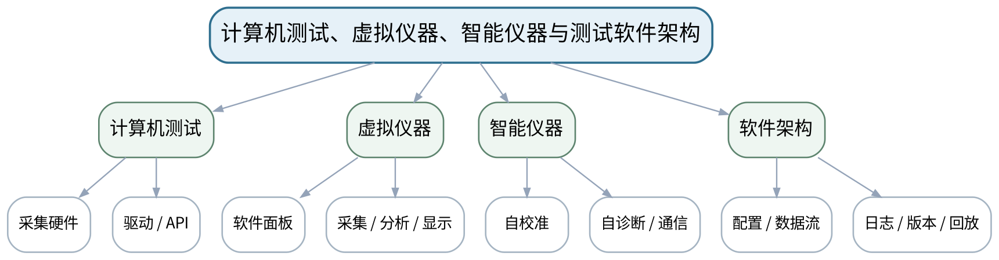

### 教学目标
**知识目标：**
1. 理解计算机测试系统、虚拟仪器、智能仪器的基本架构。
2. 理解智能仪器输入输出通道、通信、自校准、自诊断、测试软件分层和数据质量/版本管理。

**能力目标：**
1. 能够把测试软件拆分为采集、配置、处理、显示、存储和诊断模块并定义接口。
2. 能够评审一个测试软件的数据流、错误处理和版本记录。

**价值目标：**
1. 形成接口化、模块化、文档化和对失败状态可观察的工程软件意识。

### 课程思政
强调测试软件发生错误时必须可观察、可追踪，不能用界面效果掩盖数据链问题。

### 专创融合
把测试软件架构视为可复用产品平台，为后续智能感知算法提供稳定数据接口。

### 教学重难点
**教学重点：**计算机测试/虚拟仪器/智能仪器；软件架构与可观察性。

**教学难点：**区分“画了一个漂亮界面”与“测试数据链可复现、错误可追踪”。

### 教学方法与用具
**教学方法：**讲授法、问题引导法、工程案例法、模型/公式推演法、仪器/Python演示法、分组研讨法、反例分析法

**教学用具：**电脑、采集系统架构示例、Python/LabVIEW等虚拟仪器示例、配置/日志文件。

### 教学设计
课前任务 → 互动导入（15 min）→ 传授新知与课堂训练（70 min）→ 过关检测（10 min）→ 课堂小结（3 min）→ 作业布置（1 min）→ 考勤（1 min）

### 课前任务
【教师】发布“计算机测试、虚拟仪器、智能仪器与测试软件架构”对应大纲/教材范围和一个最小工程问题，不提前给出完整答案。

1. 阅读对应大纲与教材内容；
2. 圈出3个关键术语并记录至少1个疑问；
3. 预读一个测试链、波形、频谱、传感器结构或配置表，写出预期结果和至少一个疑问。

【学生】完成准备并带着“预期结果/疑问/已有证据”进入课堂。

### 互动导入
【教师】展示两个测试程序：A界面复杂但配置/日志不可导出，B界面简单但可回放、可追踪。要求学生按测试可信度评审。

【学生】先独立预测/判断，再与同伴交换依据；教师收集典型分歧后进入本课。

### 传授新知与课堂训练
**一、核心概念与工程案例（约25 min）—系统架构**

【教师】从传感器/采集卡/驱动/API到Python或虚拟仪器软件，画数据流。

【学生】完成公式/测试链/代码/图表推演，先写预期与依据，再用演示或数据验证并修正。

**二、模型/方法与Python/仪器演示（约25 min）—智能仪器能力**

【教师】讲自校准、自诊断、通信、边缘处理和通道管理，强调失败状态显式。

【学生】完成公式/测试链/代码/图表推演，先写预期与依据，再用演示或数据验证并修正。

**三、学生分析、验证与错误复盘（约20 min）—软件评审**

【教师】学生为“主轴在线测试仪”拆模块，设计配置文件、日志、数据文件和版本策略。

【学生】完成公式/测试链/代码/图表推演，先写预期与依据，再用演示或数据验证并修正。

**独立学习产物**：测试软件架构图＋模块/接口表＋日志/版本清单。

**学习证据**：数据流图、模块职责、接口输入输出、失败状态、版本/配置示例。

**评价映射**：平时成绩＋课程作业＋期末考核；目标1.5、2.5、3.5。

### 过关检测
【教师】组织当堂检测：

1. 虚拟仪器“虚拟”的主要是什么？
2. 自校准和人工校准是什么关系？
3. 测试软件为什么必须保留配置版本和日志？

【学生】独立作答/运行/推演验证；【教师】按错误类型讲解，要求说明测试链、信号、模型或数据依据。

### 课堂小结
【教师】回到本课知识脉络图，用“对象—测量链—参数/方法—验证—证据—边界”总结“计算机测试、虚拟仪器、智能仪器与测试软件架构”，再次强调教学重点：计算机测试/虚拟仪器/智能仪器；软件架构与可观察性。

【学生】写下“本课一条最重要的测试规则 + 一个最容易出错的边界”。

### 作业布置
【教师】布置课后任务：完成一个智能测试软件模块图，明确至少3种失败状态和处理策略。

【学生】按课程统一文件命名和证据要求整理提交。

### 考勤
【教师】利用学校/课程实际使用的平台进行签到。

【学生】按课程要求完成签到。

### 课后教学反思
【课后填写，不预填事实】

1. 教学流程：记录100 min各环节实际用时及需要调整的位置；
2. 教学内容：重点记录“区分“画了一个漂亮界面”与“测试数据链可复现、错误可追踪”。”的真实掌握证据与常见错误；
3. 学生参与：仅依据真实课堂/实验记录填写测试链设计、推演、仪器操作、Python分析、互审和复测情况，不补写推测；
4. 评价证据：检查本课原始数据、配置、代码、图表、参数、复测和结论是否完整，记录缺项原因；
5. 后续改进：依据真实课堂证据决定下一次课的补救、复现或拓展。

### 本章节参考文献
[1] 祝海林.《机械工程测试技术（第3版）》[M]. 机械工业出版社，2024。
[5] 《智能仪器设计基础（第2版）》——课程大纲调研说明推荐参考资料。

## 第20次课 实验三：振动信号采集、采样与FFT分析

### 课次信息
- **章节/单元**：实验三 振动信号采集、采样与FFT分析
- **周次**：按实际课表填写
- **课时安排**：2课时（100 min）
- **课型**：实验

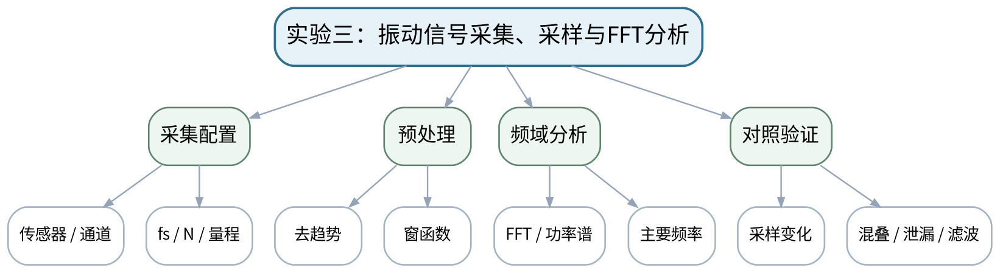

### 教学目标
**知识目标：**
1. 理解振动采集中的采样率、采样长度、去趋势、窗函数、FFT/功率谱和滤波设置。

**能力目标：**
1. 能够采集或调用轴承/主轴/结构振动数据并保存完整元数据。
2. 能够用Python比较不同采样/窗设置，识别混叠、泄漏和主要频率。

**价值目标：**
1. 形成原始波形、处理参数和元数据完整公开，不通过滤波/截取隐藏异常的实验诚信。

### 课程思政
要求如实展示原始波形和处理参数，禁止只保留有利片段或通过滤波掩盖异常。

### 专创融合
将振动采集与分析包作为可复用状态监测数据产品，为智能识别提供规范输入。

### 教学重难点
**教学重点：**振动采集元数据、采样/窗对照和FFT解释。

**教学难点：**在对照实验中控制变量，不能同时改采样率、窗和滤波导致无法解释差异。

### 教学方法与用具
**教学方法：**实验讲解法、分组实操法、故障注入法、Python数据分析法、对照复测法、结果讲评法

**教学用具：**加速度传感器/振动数据、转速参考、采集设备或回放数据、Python/SciPy。

### 教学设计
课前任务 → 互动导入（15 min）→ 传授新知与课堂训练（70 min）→ 过关检测（10 min）→ 课堂小结（3 min）→ 作业布置（1 min）→ 考勤（1 min）

### 课前任务
【教师】发布“实验三：振动信号采集、采样与FFT分析”对应大纲/教材范围和一个最小工程问题，不提前给出完整答案。

1. 阅读对应大纲与教材内容；
2. 圈出3个关键术语并记录至少1个疑问；
3. 检查实验设备/等价数据、Python环境和上一任务文件是否可用；实验前不通电，先完成安全与量程检查。

【学生】完成准备并带着“预期结果/疑问/已有证据”进入课堂。

### 互动导入
【教师】教师给一份“频谱很漂亮但没有采样率/窗函数记录”的文件，要求学生判断是否能作为实验结论。

【学生】先独立预测/判断，再与同伴交换依据；教师收集典型分歧后进入本课。

### 传授新知与课堂训练
**一、任务说明与安全/配置确认（约15 min）—采集/回放准备**

【教师】配置振动通道和转速/事件信息，记录采样率、量程、标定、时间戳；或加载课程提供的等价数据。

【学生】按任务约束完成实验/分析，保留原始数据、配置、代码、图表、错误与复测证据。

**二、分组实验与数据采集（约40 min）—Python分析**

【教师】完成去趋势、时域统计、窗、FFT/功率谱和基本滤波，标出主要频率。

【学生】按任务约束完成实验/分析，保留原始数据、配置、代码、图表、错误与复测证据。

**三、分析、复测与证据固化（约15 min）—参数对照**

【教师】只改变采样率/采样长度或窗的一项，观察混叠/泄漏；保留原始波形和全部参数。

【学生】按任务约束完成实验/分析，保留原始数据、配置、代码、图表、错误与复测证据。

**独立学习产物**：实验三完整包：原始数据＋元数据＋Python脚本＋时域/频域图＋参数对照报告。

**学习证据**：数据与配置、代码、时域/频域图、混叠/泄漏对照、主要频率解释、复现记录。

**评价映射**：课程作业；实验三正式证据；目标1.2、1.5、2.2、2.5、3.2、3.5。

### 过关检测
【教师】组织当堂检测：

1. 为什么频谱图不能脱离采样率解释？
2. 窗函数变化时哪些条件必须保持不变？
3. 怎样证明滤波没有掩盖真实异常？

【学生】独立作答/运行/推演验证；【教师】按错误类型讲解，要求说明测试链、信号、模型或数据依据。

### 课堂小结
【教师】回到本课知识脉络图，用“对象—测量链—参数/方法—验证—证据—边界”总结“实验三：振动信号采集、采样与FFT分析”，再次强调教学重点：振动采集元数据、采样/窗对照和FFT解释。

【学生】写下“本课一条最重要的测试规则 + 一个最容易出错的边界”。

### 作业布置
【教师】布置课后任务：完成实验三报告，附完整元数据表和一个“处理参数改变结论”的反例。

【学生】按课程统一文件命名和证据要求整理提交。

### 考勤
【教师】利用学校/课程实际使用的平台进行签到。

【学生】按课程要求完成签到。

### 课后教学反思
【课后填写，不预填事实】

1. 教学流程：记录100 min各环节实际用时及需要调整的位置；
2. 教学内容：重点记录“在对照实验中控制变量，不能同时改采样率、窗和滤波导致无法解释差异。”的真实掌握证据与常见错误；
3. 学生参与：仅依据真实课堂/实验记录填写测试链设计、推演、仪器操作、Python分析、互审和复测情况，不补写推测；
4. 评价证据：检查本课原始数据、配置、代码、图表、参数、复测和结论是否完整，记录缺项原因；
5. 后续改进：依据真实课堂证据决定下一次课的补救、复现或拓展。

### 本章节参考文献
[1] 祝海林.《机械工程测试技术（第3版）》[M]. 机械工业出版社，2024。
[4] 《机械故障诊断技术（第3版）》——课程大纲调研说明推荐参考资料。

## 第21次课 智能传感、边缘处理与特征工程

### 课次信息
- **章节/单元**：第六单元 智能感知、多源融合与状态识别
- **周次**：按实际课表填写
- **课时安排**：2课时（100 min）
- **课型**：理论

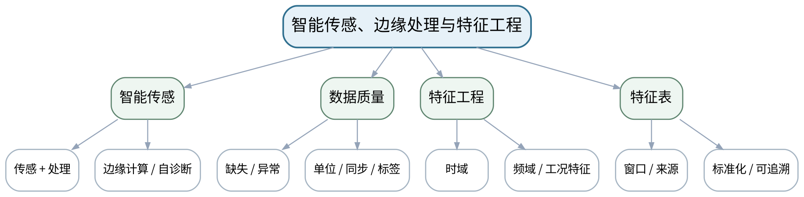

### 教学目标
**知识目标：**
1. 理解智能传感器、边缘处理、数据质量控制和特征工程基本概念。
2. 掌握缺失、异常、标准化以及时域/频域特征构造的基本流程。

**能力目标：**
1. 能够把多传感原始数据转换为带来源、单位和窗口定义的特征表。
2. 能够识别缺失/异常处理和特征窗口设置可能引入的数据偏差。

**价值目标：**
1. 形成算法前先检查传感器状态、数据质量和标签来源的智能测试责任意识。

### 课程思政
通过单位错、标签偏差和缺失处理案例强调智能算法的责任从数据质量开始。

### 专创融合
把特征字典视为多传感智能测试的接口契约，便于模型替换和跨团队复用。

### 教学重难点
**教学重点：**智能传感与数据质量；可追溯特征工程。

**教学难点：**避免把清洗/窗口/标签错误误认为“模型问题”，特征必须保持物理意义和来源。

### 教学方法与用具
**教学方法：**讲授法、问题引导法、工程案例法、模型/公式推演法、仪器/Python演示法、分组研讨法、反例分析法

**教学用具：**电脑、Python、Pandas/NumPy/SciPy、示例多传感数据。

### 教学设计
课前任务 → 互动导入（15 min）→ 传授新知与课堂训练（70 min）→ 过关检测（10 min）→ 课堂小结（3 min）→ 作业布置（1 min）→ 考勤（1 min）

### 课前任务
【教师】发布“智能传感、边缘处理与特征工程”对应大纲/教材范围和一个最小工程问题，不提前给出完整答案。

1. 阅读对应大纲与教材内容；
2. 圈出3个关键术语并记录至少1个疑问；
3. 预读一个测试链、波形、频谱、传感器结构或配置表，写出预期结果和至少一个疑问。

【学生】完成准备并带着“预期结果/疑问/已有证据”进入课堂。

### 互动导入
【教师】展示一份准确率很差的状态数据，最终发现一通道单位是mm/s、另一批是m/s，要求学生决定先调模型还是先查数据。

【学生】先独立预测/判断，再与同伴交换依据；教师收集典型分歧后进入本课。

### 传授新知与课堂训练
**一、核心概念与工程案例（约25 min）—智能传感与边缘**

【教师】说明智能传感器集成预处理、自诊断、通信的思路，强调边缘处理仍需保留原始证据。

【学生】完成公式/测试链/代码/图表推演，先写预期与依据，再用演示或数据验证并修正。

**二、模型/方法与Python/仪器演示（约25 min）—数据质量**

【教师】缺失、异常、不同步、单位和标签检查；演示标准化前先确认物理量。

【学生】完成公式/测试链/代码/图表推演，先写预期与依据，再用演示或数据验证并修正。

**三、学生分析、验证与错误复盘（约20 min）—特征工程**

【教师】构造RMS、峰值、峭度、主频、频带能量等特征并保存窗口、来源和参数。

【学生】完成公式/测试链/代码/图表推演，先写预期与依据，再用演示或数据验证并修正。

**独立学习产物**：多传感数据质量检查表＋特征字典＋特征表样例。

**学习证据**：原始数据来源、单位/同步/标签检查、特征定义、窗口参数、异常处理记录。

**评价映射**：平时成绩＋课程作业＋期末考核；目标1.6、2.6、3.6。

### 过关检测
【教师】组织当堂检测：

1. 为什么标准化之前仍必须确认单位？
2. 边缘设备做预处理后为什么仍要保留原始/配置证据？
3. 特征窗口长度会怎样影响状态特征？

【学生】独立作答/运行/推演验证；【教师】按错误类型讲解，要求说明测试链、信号、模型或数据依据。

### 课堂小结
【教师】回到本课知识脉络图，用“对象—测量链—参数/方法—验证—证据—边界”总结“智能传感、边缘处理与特征工程”，再次强调教学重点：智能传感与数据质量；可追溯特征工程。

【学生】写下“本课一条最重要的测试规则 + 一个最容易出错的边界”。

### 作业布置
【教师】布置课后任务：从一份多传感数据中设计不少于8个可解释特征，并写清来源、单位和窗口。

【学生】按课程统一文件命名和证据要求整理提交。

### 考勤
【教师】利用学校/课程实际使用的平台进行签到。

【学生】按课程要求完成签到。

### 课后教学反思
【课后填写，不预填事实】

1. 教学流程：记录100 min各环节实际用时及需要调整的位置；
2. 教学内容：重点记录“避免把清洗/窗口/标签错误误认为“模型问题”，特征必须保持物理意义和来源。”的真实掌握证据与常见错误；
3. 学生参与：仅依据真实课堂/实验记录填写测试链设计、推演、仪器操作、Python分析、互审和复测情况，不补写推测；
4. 评价证据：检查本课原始数据、配置、代码、图表、参数、复测和结论是否完整，记录缺项原因；
5. 后续改进：依据真实课堂证据决定下一次课的补救、复现或拓展。

### 本章节参考文献
[3] 《智能检测技术》——课程大纲调研说明推荐参考资料。
[4] 《机械故障诊断技术（第3版）》——课程大纲调研说明推荐参考资料。

## 第22次课 特征选择、PCA降维与多传感信息融合

### 课次信息
- **章节/单元**：第六单元 智能感知、多源融合与状态识别
- **周次**：按实际课表填写
- **课时安排**：2课时（100 min）
- **课型**：理论

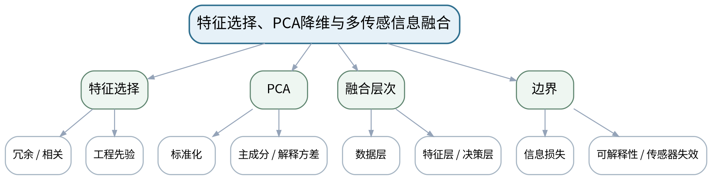

### 教学目标
**知识目标：**
1. 理解特征选择、标准化、PCA降维的基本思想以及数据层/特征层/决策层融合。
2. 理解PCA主成分解释方差和降维后可解释性限制。

**能力目标：**
1. 能够用Python对特征进行标准化、PCA降维并比较降维前后结构。
2. 能够为多传感任务选择合适融合层次并说明信息损失/依赖。

**价值目标：**
1. 形成降维与融合是信息变换而非“自动变聪明”，必须报告信息保留和适用边界的意识。

### 课程思政
强调降维和融合结果必须说明信息损失和通道状态，不能用复杂算法掩盖数据缺陷。

### 专创融合
把PCA与特征融合做成可替换的数据处理中间层，为状态分类模型提供规范输入。

### 教学重难点
**教学重点：**PCA标准化、解释方差；多传感融合层次。

**教学难点：**避免PCA前忘记标准化；融合结果可能掩盖单传感器失效。

### 教学方法与用具
**教学方法：**讲授法、问题引导法、工程案例法、模型/公式推演法、仪器/Python演示法、分组研讨法、反例分析法

**教学用具：**电脑、Python、scikit-learn、Pandas、Matplotlib、多传感特征数据。

### 教学设计
课前任务 → 互动导入（15 min）→ 传授新知与课堂训练（70 min）→ 过关检测（10 min）→ 课堂小结（3 min）→ 作业布置（1 min）→ 考勤（1 min）

### 课前任务
【教师】发布“特征选择、PCA降维与多传感信息融合”对应大纲/教材范围和一个最小工程问题，不提前给出完整答案。

1. 阅读对应大纲与教材内容；
2. 圈出3个关键术语并记录至少1个疑问；
3. 预读一个测试链、波形、频谱、传感器结构或配置表，写出预期结果和至少一个疑问。

【学生】完成准备并带着“预期结果/疑问/已有证据”进入课堂。

### 互动导入
【教师】给出温度(℃)、振动(mm/s)、电流(A)三类特征量纲差异很大的表，先做PCA和标准化后PCA对比。

【学生】先独立预测/判断，再与同伴交换依据；教师收集典型分歧后进入本课。

### 传授新知与课堂训练
**一、核心概念与工程案例（约25 min）—特征选择**

【教师】从冗余、相关、物理机理和数据泄漏角度筛特征，避免使用未来信息。

【学生】完成公式/测试链/代码/图表推演，先写预期与依据，再用演示或数据验证并修正。

**二、模型/方法与Python/仪器演示（约25 min）—PCA降维**

【教师】标准化→协方差/主成分→解释方差→二维投影，用Python演示。

【学生】完成公式/测试链/代码/图表推演，先写预期与依据，再用演示或数据验证并修正。

**三、学生分析、验证与错误复盘（约20 min）—融合设计**

【教师】比较数据/特征/决策融合，讨论通道失效、不同步和信息丢失；学生画融合架构。

【学生】完成公式/测试链/代码/图表推演，先写预期与依据，再用演示或数据验证并修正。

**独立学习产物**：PCA分析脚本＋解释方差图＋多传感融合架构图。

**学习证据**：标准化参数、PCA载荷/解释方差、降维图、融合层选择理由、失效通道处理。

**评价映射**：平时成绩＋课程作业＋期末考核；目标1.6、2.6、3.6。

### 过关检测
【教师】组织当堂检测：

1. 为什么PCA通常先标准化？
2. 累计解释方差高是否等于分类一定更好？
3. 多传感融合为什么不能掩盖单通道失效？

【学生】独立作答/运行/推演验证；【教师】按错误类型讲解，要求说明测试链、信号、模型或数据依据。

### 课堂小结
【教师】回到本课知识脉络图，用“对象—测量链—参数/方法—验证—证据—边界”总结“特征选择、PCA降维与多传感信息融合”，再次强调教学重点：PCA标准化、解释方差；多传感融合层次。

【学生】写下“本课一条最重要的测试规则 + 一个最容易出错的边界”。

### 作业布置
【教师】布置课后任务：完成一份特征表PCA降维，对比保留2/3/更多主成分时信息量和可视化差异。

【学生】按课程统一文件命名和证据要求整理提交。

### 考勤
【教师】利用学校/课程实际使用的平台进行签到。

【学生】按课程要求完成签到。

### 课后教学反思
【课后填写，不预填事实】

1. 教学流程：记录100 min各环节实际用时及需要调整的位置；
2. 教学内容：重点记录“避免PCA前忘记标准化；融合结果可能掩盖单传感器失效。”的真实掌握证据与常见错误；
3. 学生参与：仅依据真实课堂/实验记录填写测试链设计、推演、仪器操作、Python分析、互审和复测情况，不补写推测；
4. 评价证据：检查本课原始数据、配置、代码、图表、参数、复测和结论是否完整，记录缺项原因；
5. 后续改进：依据真实课堂证据决定下一次课的补救、复现或拓展。

### 本章节参考文献
[3] 《智能检测技术》——课程大纲调研说明推荐参考资料。

## 第23次课 k近邻/SVM基础分类、混淆矩阵与人工复核

### 课次信息
- **章节/单元**：第六单元 智能感知、多源融合与状态识别
- **周次**：按实际课表填写
- **课时安排**：2课时（100 min）
- **课型**：理论

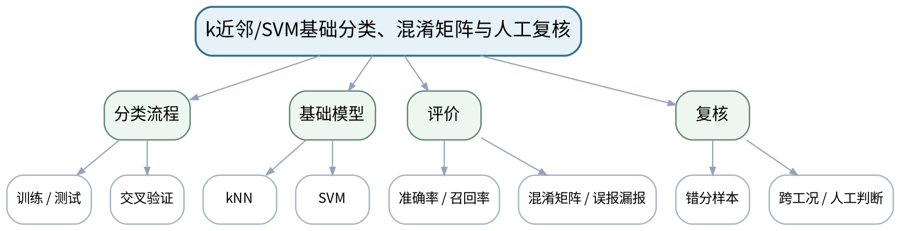

### 教学目标
**知识目标：**
1. 理解训练/测试、交叉验证、k近邻与支持向量机的基本思想。
2. 掌握准确率、召回率、混淆矩阵、误报/漏报和人工复核条件。

**能力目标：**
1. 能够使用Python完成基础状态分类并比较模型。
2. 能够分析错分样本、样本偏差和跨工况失效，并联系装备机理提出复核建议。

**价值目标：**
1. 形成模型输出不是事实结论、对误报漏报和适用边界保持独立判断的意识。

### 课程思政
通过样本偏差、数据泄漏和误报漏报案例强调模型输出不是事实，测试人员承担复核责任。

### 专创融合
把模型评价和复核规则视为智能测试产品的验收条件，而不是只追求最高准确率。

### 教学重难点
**教学重点：**基础分类与混淆矩阵；错分/误报/漏报和人工复核。

**教学难点：**防止数据泄漏和过拟合；准确率高不能掩盖关键类别漏报。

### 教学方法与用具
**教学方法：**讲授法、问题引导法、工程案例法、模型/公式推演法、仪器/Python演示法、分组研讨法、反例分析法

**教学用具：**电脑、Python、scikit-learn、Matplotlib、混淆矩阵示例数据。

### 教学设计
课前任务 → 互动导入（15 min）→ 传授新知与课堂训练（70 min）→ 过关检测（10 min）→ 课堂小结（3 min）→ 作业布置（1 min）→ 考勤（1 min）

### 课前任务
【教师】发布“k近邻/SVM基础分类、混淆矩阵与人工复核”对应大纲/教材范围和一个最小工程问题，不提前给出完整答案。

1. 阅读对应大纲与教材内容；
2. 圈出3个关键术语并记录至少1个疑问；
3. 预读一个测试链、波形、频谱、传感器结构或配置表，写出预期结果和至少一个疑问。

【学生】完成准备并带着“预期结果/疑问/已有证据”进入课堂。

### 互动导入
【教师】展示一个总体准确率95%但异常召回率只有55%的分类结果，要求学生判断是否可用于设备安全报警。

【学生】先独立预测/判断，再与同伴交换依据；教师收集典型分歧后进入本课。

### 传授新知与课堂训练
**一、核心概念与工程案例（约25 min）—训练评价基本流程**

【教师】划分训练/测试、标准化只在训练集拟合、交叉验证和数据泄漏反例。

【学生】完成公式/测试链/代码/图表推演，先写预期与依据，再用演示或数据验证并修正。

**二、模型/方法与Python/仪器演示（约25 min）—kNN/SVM**

【教师】用最小示例说明距离邻域和分类边界，不展开机器学习理论细节。

【学生】完成公式/测试链/代码/图表推演，先写预期与依据，再用演示或数据验证并修正。

**三、学生分析、验证与错误复盘（约20 min）—错分与人工复核**

【教师】读混淆矩阵、误报/漏报，检查错分样本的信号特征/传感器状态/工况，设计人工复核触发。

【学生】完成公式/测试链/代码/图表推演，先写预期与依据，再用演示或数据验证并修正。

**独立学习产物**：分类脚本＋混淆矩阵＋错分样本分析＋人工复核规则。

**学习证据**：数据划分、标准化流程、模型参数、混淆矩阵、错分样本、跨工况说明。

**评价映射**：平时成绩＋课程作业＋期末考核；目标1.6、2.6、3.6。

### 过关检测
【教师】组织当堂检测：

1. 为什么总体准确率高仍可能不适合安全报警？
2. 标准化在哪一步拟合才能避免数据泄漏？
3. 哪些错分应优先进入人工复核？

【学生】独立作答/运行/推演验证；【教师】按错误类型讲解，要求说明测试链、信号、模型或数据依据。

### 课堂小结
【教师】回到本课知识脉络图，用“对象—测量链—参数/方法—验证—证据—边界”总结“k近邻/SVM基础分类、混淆矩阵与人工复核”，再次强调教学重点：基础分类与混淆矩阵；错分/误报/漏报和人工复核。

【学生】写下“本课一条最重要的测试规则 + 一个最容易出错的边界”。

### 作业布置
【教师】布置课后任务：对同一特征数据比较kNN与SVM，至少分析3个错分样本并写复核建议。

【学生】按课程统一文件命名和证据要求整理提交。

### 考勤
【教师】利用学校/课程实际使用的平台进行签到。

【学生】按课程要求完成签到。

### 课后教学反思
【课后填写，不预填事实】

1. 教学流程：记录100 min各环节实际用时及需要调整的位置；
2. 教学内容：重点记录“防止数据泄漏和过拟合；准确率高不能掩盖关键类别漏报。”的真实掌握证据与常见错误；
3. 学生参与：仅依据真实课堂/实验记录填写测试链设计、推演、仪器操作、Python分析、互审和复测情况，不补写推测；
4. 评价证据：检查本课原始数据、配置、代码、图表、参数、复测和结论是否完整，记录缺项原因；
5. 后续改进：依据真实课堂证据决定下一次课的补救、复现或拓展。

### 本章节参考文献
[3] 《智能检测技术》——课程大纲调研说明推荐参考资料。
[4] 《机械故障诊断技术（第3版）》——课程大纲调研说明推荐参考资料。

## 第24次课 实验四：多传感数据融合与异常状态识别

### 课次信息
- **章节/单元**：实验四 多传感数据融合与异常状态识别
- **周次**：按实际课表填写
- **课时安排**：2课时（100 min）
- **课型**：实验

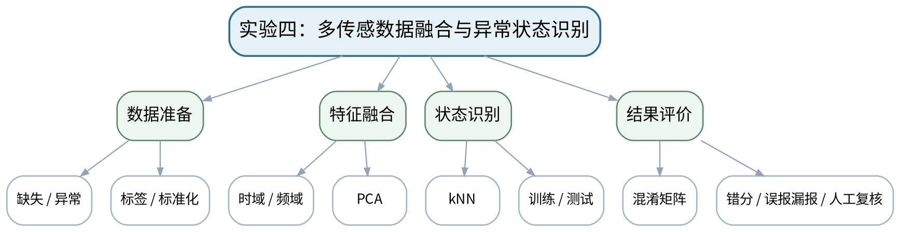

### 教学目标
**知识目标：**
1. 理解多源数据清洗、特征、标准化、PCA、k近邻分类和混淆矩阵的完整链。

**能力目标：**
1. 能够完成小型多传感正常/异常识别任务并评价结果。
2. 能够分析错分样本、样本偏差、传感器状态和人工复核条件，而不以单次最高准确率作为唯一结论。

**价值目标：**
1. 形成算法结论必须与信号特征、传感器状态、装备机理和人工复核结合的责任意识。

### 课程思政
通过样本偏差、错分、误报漏报和人工复核落实负责任智能测试，算法不能替代工程人员最终判断。

### 专创融合
将最终实验形成小型智能测试原型，打通传感—采集—分析—融合—判断—复核全链。

### 教学重难点
**教学重点：**完整数据—特征—模型—评价链；错分与人工复核。

**教学难点：**防止数据泄漏、只报最高准确率和忽视传感器/工况偏差。

### 教学方法与用具
**教学方法：**实验讲解法、分组实操法、故障注入法、Python数据分析法、对照复测法、结果讲评法

**教学用具：**多传感状态数据或等价实验平台、Python、Pandas、SciPy、scikit-learn、Matplotlib。

### 教学设计
课前任务 → 互动导入（15 min）→ 传授新知与课堂训练（70 min）→ 过关检测（10 min）→ 课堂小结（3 min）→ 作业布置（1 min）→ 考勤（1 min）

### 课前任务
【教师】发布“实验四：多传感数据融合与异常状态识别”对应大纲/教材范围和一个最小工程问题，不提前给出完整答案。

1. 阅读对应大纲与教材内容；
2. 圈出3个关键术语并记录至少1个疑问；
3. 检查实验设备/等价数据、Python环境和上一任务文件是否可用；实验前不通电，先完成安全与量程检查。

【学生】完成准备并带着“预期结果/疑问/已有证据”进入课堂。

### 互动导入
【教师】教师给一个“99%准确率”的结果，但训练/测试中存在同一批次样本泄漏，要求学生首先审查数据划分而不是庆祝高分。

【学生】先独立预测/判断，再与同伴交换依据；教师收集典型分歧后进入本课。

### 传授新知与课堂训练
**一、任务说明与安全/配置确认（约15 min）—数据与安全检查**

【教师】核对数据来源、标签、单位、缺失/异常、传感器状态；划分训练/测试并记录。

【学生】按任务约束完成实验/分析，保留原始数据、配置、代码、图表、错误与复测证据。

**二、分组实验与数据采集（约40 min）—特征/PCA/分类**

【教师】构造时域/频域特征，标准化、PCA，使用kNN完成基础分类；保留全部参数。

【学生】按任务约束完成实验/分析，保留原始数据、配置、代码、图表、错误与复测证据。

**三、分析、复测与证据固化（约15 min）—评价与复核**

【教师】输出混淆矩阵、准确率/召回率，逐条检查错分样本，设计人工复核条件并比较单传感/融合结果。

【学生】按任务约束完成实验/分析，保留原始数据、配置、代码、图表、错误与复测证据。

**独立学习产物**：实验四完整包：数据说明＋特征/PCA/分类代码＋混淆矩阵＋错分/复核报告。

**学习证据**：原始/特征数据、数据划分、标准化/PCA参数、模型参数、混淆矩阵、错分样本和复核规则。

**评价映射**：课程作业；实验四正式证据；目标1.6、2.6、3.6。

### 过关检测
【教师】组织当堂检测：

1. 如何检查是否发生数据泄漏？
2. 为什么要同时报告准确率和异常召回率？
3. 模型输出异常时人工复核至少检查哪三类证据？

【学生】独立作答/运行/推演验证；【教师】按错误类型讲解，要求说明测试链、信号、模型或数据依据。

### 课堂小结
【教师】回到本课知识脉络图，用“对象—测量链—参数/方法—验证—证据—边界”总结“实验四：多传感数据融合与异常状态识别”，再次强调教学重点：完整数据—特征—模型—评价链；错分与人工复核。

【学生】写下“本课一条最重要的测试规则 + 一个最容易出错的边界”。

### 作业布置
【教师】布置课后任务：整理课程学习档案：选择一个最有价值的失败/错分案例，说明根因、修正和仍存在的局限。

【学生】按课程统一文件命名和证据要求整理提交。

### 考勤
【教师】利用学校/课程实际使用的平台进行签到。

【学生】按课程要求完成签到。

### 课后教学反思
【课后填写，不预填事实】

1. 教学流程：记录100 min各环节实际用时及需要调整的位置；
2. 教学内容：重点记录“防止数据泄漏、只报最高准确率和忽视传感器/工况偏差。”的真实掌握证据与常见错误；
3. 学生参与：仅依据真实课堂/实验记录填写测试链设计、推演、仪器操作、Python分析、互审和复测情况，不补写推测；
4. 评价证据：检查本课原始数据、配置、代码、图表、参数、复测和结论是否完整，记录缺项原因；
5. 后续改进：依据真实课堂证据决定下一次课的补救、复现或拓展。

### 本章节参考文献
[3] 《智能检测技术》——课程大纲调研说明推荐参考资料。
[4] 《机械故障诊断技术（第3版）》——课程大纲调研说明推荐参考资料。
