# 《智能生产计划管理（MES/ERP）》教学设计（16次课）

> **Canonical source / 内容权威源**：本 Markdown 与 `images/`、`manifest.json` 共同构成教案语义主源。Word 仅由本源包编译，负责学校格式呈现。

## 课程基本信息
- **课程名称**：智能生产计划管理（MES/ERP）
- **课程英文名称**：Intelligent Production Planning and Management (MES/ERP)
- **课程代码**：25JD32416
- **课程类别**：专业类
- **课程性质**：选修课
- **授课语言**：中文
- **授课学期**：第7学期
- **学分**：2
- **课程学时及分配**：总学时32；理论32；实践0；实验0；上机0；项目式0
- **适用专业**：智能制造工程
- **授课学院**：机械与动力工程学院
- **先修课程**：智能制造导论、机械制造技术基础、数据库基础或同等基础
- **后续课程**：智能制造综合实践、毕业实习、毕业设计（论文）
- **选用教材**：刘晓冰, 赵希男.《生产计划与控制（第2版）》[M]. 北京：清华大学出版社，2022
- **课程评价**：平时成绩20%＋课程作业20%＋期末考核60%
- **内容依据**：2025版目录现行大纲（大纲更新时间：2026年9月）

## 课程总体设计
课程严格按现行培养方案与大纲执行32学时全理论教学，不虚构实验、上机或项目式学时。16次课×2课时=32学时。课程采用“业务场景—数据模型—计划计算—执行闭环—案例评审”的理论教学方式，允许使用Excel、Python或演示型MES/ERP界面辅助课堂计算和说明，但软件操作本身不是课程目标。六个单元学时严格闭合为4+6+5+6+6+5=32学时，其中第8、11、14次课各承担相邻单元1+1课时的过渡衔接。课程学习证据以业务流程图、MPS/MRP计算表、能力负荷表、工单状态/异常闭环、ERP-MES数据流与追溯链、KPI/成本方案比较和综合业务分析报告为主。

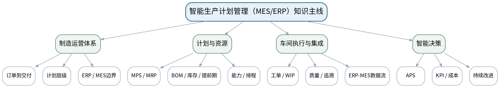

### 课次总览
| 次数 | 课型 | 单元学时分配 | 单元/过渡 | 授课题目 | 主要评价 |
|---:|---|---|---|---|---|
| 1 | 理论 | 理论2课时 | 第一单元 制造运营管理与ERP/MES体系 | 制造企业订单到交付业务链与生产计划层级 | 平时成绩＋期末综合报告基础 |
| 2 | 理论 | 理论2课时 | 第一单元 制造运营管理与ERP/MES体系 | ERP、MRP/MRPⅡ、MES、APS体系与系统边界 | 平时成绩＋课程作业ERP-MES数据流前置＋期末综合报告 |
| 3 | 理论 | 理论2课时 | 第二单元 需求管理、MPS与MRP | 需求管理、预测/订单与主生产计划MPS | 课程作业MPS/MRP计算（30%内部权重）阶段1＋期末考核 |
| 4 | 理论 | 理论2课时 | 第二单元 需求管理、MPS与MRP | BOM、库存状态、提前期与批量规则 | 课程作业MPS/MRP计算（30%内部权重）阶段2＋期末考核 |
| 5 | 理论 | 理论2课时 | 第二单元 需求管理、MPS与MRP | MRP净需求、计划订单与安全库存校核 | 课程作业MPS/MRP计算与结果解释（30%内部权重）完成＋期末考核 |
| 6 | 理论 | 理论2课时 | 第三单元 能力计划与生产排程基础 | 工艺路线、工作中心、标准工时与能力数据 | 课程作业能力负荷与排程分析（25%内部权重）阶段1＋期末考核 |
| 7 | 理论 | 理论2课时 | 第三单元 能力计划与生产排程基础 | 能力需求、负荷平衡与瓶颈调整 | 课程作业能力负荷与排程分析（25%内部权重）阶段2＋期末考核 |
| 8 | 理论 | 第三单元1课时＋第四单元1课时 | 第三→第四单元过渡 | 正排/倒排、优先规则与生产工单下达衔接 | 课程作业能力负荷与排程分析（25%内部权重）完成，并衔接工单执行作业 |
| 9 | 理论 | 理论2课时 | 第四单元 车间作业控制与执行闭环 | 工单状态、派工、报工与WIP控制 | 课程作业工单执行与异常闭环（20%内部权重）阶段1＋期末考核 |
| 10 | 理论 | 理论2课时 | 第四单元 车间作业控制与执行闭环 | 物料配送、质量异常、返工与计划调整闭环 | 课程作业工单执行与异常闭环（20%内部权重）阶段2＋期末考核 |
| 11 | 理论 | 第四单元1课时＋第五单元1课时 | 第四→第五单元过渡 | 车间执行反馈、MES功能入口与执行闭环 | 课程作业工单执行与异常闭环（20%内部权重）完成，并衔接ERP-MES数据流作业 |
| 12 | 理论 | 理论2课时 | 第五单元 MES功能、数据与ERP-MES集成 | MES核心功能、生产数据采集与资源状态 | 课程作业ERP-MES数据流与追溯（15%内部权重）阶段1＋期末考核 |
| 13 | 理论 | 理论2课时 | 第五单元 MES功能、数据与ERP-MES集成 | ERP-MES主数据/业务数据接口、状态同步与追溯 | 课程作业ERP-MES数据流与追溯（15%内部权重）阶段2＋期末考核 |
| 14 | 理论 | 第五单元1课时＋第六单元1课时 | 第五→第六单元过渡 | ERP-MES集成数据到APS/KPI决策输入 | 课程作业ERP-MES数据流与追溯（15%内部权重）完成，并衔接KPI判断作业 |
| 15 | 理论 | 理论2课时 | 第六单元 智能计划、绩效与管理决策 | APS多约束排程与制造KPI评价 | 课程作业KPI与管理判断（10%内部权重）阶段1＋期末考核 |
| 16 | 理论 | 理论2课时 | 第六单元 智能计划、绩效与管理决策 | 成本经济决策、可视化看板与MES/ERP综合方案评审 | 课程作业KPI与管理判断（10%内部权重）完成＋期末考核60%核心准备 |

## 第1次课 制造企业订单到交付业务链与生产计划层级

### 课次信息
- **章节/单元**：第一单元 制造运营管理与ERP/MES体系
- **周次**：按实际课表填写
- **课时安排**：2课时（100 min）
- **课型**：理论
- **单元学时分配**：理论2课时

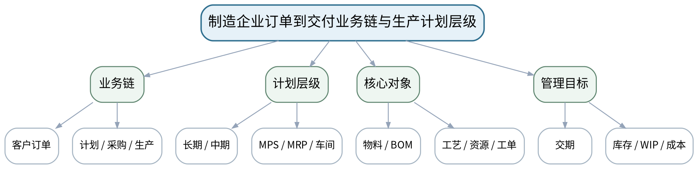

### 教学目标
**知识目标：**
1. 理解制造企业从客户订单到生产交付的基本业务链，以及战略、主计划、物料/能力计划和车间执行的层级关系。
2. 理解订单、物料、工艺路线、工作中心、工单、库存和质量记录等核心业务对象。

**能力目标：**
1. 能够从一个简化制造订单案例识别业务对象、主要流程、输入输出数据和管理目标。
2. 能够绘制订单—计划—执行—反馈的基本闭环，并指出交期、库存、WIP和产能之间的约束关系。

**价值目标：**
1. 形成以客户需求、交付承诺和企业资源约束为基础的系统管理意识，避免局部最优替代整体协同。

### 课程思政
以交付承诺、资源约束和跨部门协同讨论企业责任，强调管理结论必须建立在真实业务数据与可执行资源条件上。

### 专创融合
将制造业务链抽象为可配置的流程与数据对象，为后续MES/ERP业务建模和数字化产品设计建立基础。

### 教学重难点
**教学重点：**订单到交付业务链、生产计划层级与核心数据对象。

**教学难点：**把业务事件、计划层级、数据对象和管理目标对应起来，避免把MES/ERP理解为孤立的软件菜单。

### 教学方法与用具
**教学方法：**业务场景法、案例分析法、表格推演法、问题驱动法、数据流/流程建模法、方案比较法、错误复盘法

**教学用具：**投影仪、订单/BOM/库存/工艺路线简化案例表、流程图模板、白板。

### 教学设计
课前任务 → 互动导入（10 min）→ 传授新知与课堂训练（75 min）→ 过关检测（10 min）→ 课堂小结（3 min）→ 作业布置（1 min）→ 考勤（1 min）

### 课前任务
【教师】发布“制造企业订单到交付业务链与生产计划层级”对应大纲/教材范围和一个最小制造业务案例，不提前给出完整结论。

1. 阅读对应大纲与教材内容；
2. 圈出3个关键术语并记录至少1个疑问；
3. 预读订单/BOM/库存/工艺/能力/工单/接口/KPI中的相关数据表，写出一个预期业务关系或计算结果。

【学生】完成准备并带着“业务关系预测/疑问/已有计算或流程证据”进入课堂。

### 互动导入
【教师】给出一个“客户要求10天交付100件产品，但关键工序能力有限、部分物料不足”的场景，让学生先判断哪些部门和数据必须参与计划。

【学生】先独立判断业务关系、流程或计算结果，再与同伴交换依据；教师收集典型分歧后进入本课。

### 传授新知与课堂训练
**一、业务概念与数据模型（约30 min）—业务链拆解**

【教师】从客户订单、销售承诺、物料准备、能力配置、生产执行、质量检验到完工入库逐步拆解制造闭环，明确每一步输入输出。

【学生】先独立完成流程、表格、计算或数据流推演并写出判断依据，再与同伴互核；需要电子表格/Python时仅作为计算辅助，不把软件操作本身作为课程目标。

**二、学生计算/流程/数据推演（约25 min）—计划层级与对象**

【教师】用时间尺度和决策粒度解释战略/销售运营、MPS/MRP、能力计划和车间作业控制，建立订单、物料、工艺、资源、工单等对象表。

【学生】先独立完成流程、表格、计算或数据流推演并写出判断依据，再与同伴互核；需要电子表格/Python时仅作为计算辅助，不把软件操作本身作为课程目标。

**三、方案比较、校核与错误复盘（约20 min）—案例复盘**

【教师】学生根据简化订单案例绘制业务链，并识别若“只追求设备利用率”可能造成的WIP、交期或库存副作用。

【学生】先独立完成流程、表格、计算或数据流推演并写出判断依据，再与同伴互核；需要电子表格/Python时仅作为计算辅助，不把软件操作本身作为课程目标。

**独立学习产物**：一张订单到交付业务流程图＋核心业务对象/数据表。

**学习证据**：流程节点、责任对象、输入输出数据、至少2个管理目标冲突及其解释。

**评价映射**：平时成绩＋期末综合报告基础；目标1.1、2.1、3.1。

### 过关检测
【教师】组织当堂检测：

1. ERP/MES课程为什么要从订单到交付业务链开始？
2. MPS与车间派工处于同一决策层级吗？为什么？
3. 设备利用率越高是否一定意味着企业绩效越好？

【学生】独立作答/计算/绘图；【教师】按错误类型讲解，要求说明业务、数据、计算或流程依据。

### 课堂小结
【教师】回到本课知识脉络图，用“业务场景—对象/数据—计划/执行逻辑—校核/异常—管理判断”总结“制造企业订单到交付业务链与生产计划层级”，再次强调教学重点：订单到交付业务链、生产计划层级与核心数据对象。

【学生】写下“本课一个关键业务规则 + 一个最容易造成错误决策的数据/边界”。

### 作业布置
【教师】布置课后任务：选择一个离散制造产品，列出从订单到完工至少8个业务对象及其关键字段，为后续系统边界分析准备。

【学生】按课程文件命名与证据要求整理流程图、计算表、数据流或方案说明；使用电子工具时需保留输入、规则和人工核验记录。

### 考勤
【教师】利用学校/课程实际使用的平台进行签到。

【学生】按课程要求完成签到。

### 课后教学反思
【课后填写，不预填事实】记录本次实际用时、“把业务事件、计划层级、数据对象和管理目标对应起来，避免把MES/ERP理解为孤立的软件菜单。”的真实掌握/错误，以及流程图、计算表、数据流/接口表、方案比较等评价证据完整性；仅依据真实课堂记录确定后续补救或拓展，不补写未发生事实。

### 本章节参考文献
[1] 刘晓冰, 赵希男.《生产计划与控制（第2版）》[M]. 清华大学出版社，2022。
[3] 陈启申.《ERP——从内部集成起步（第3版）》[M]. 电子工业出版社，2022。

## 第2次课 ERP、MRP/MRPⅡ、MES、APS体系与系统边界

### 课次信息
- **章节/单元**：第一单元 制造运营管理与ERP/MES体系
- **周次**：按实际课表填写
- **课时安排**：2课时（100 min）
- **课型**：理论
- **单元学时分配**：理论2课时

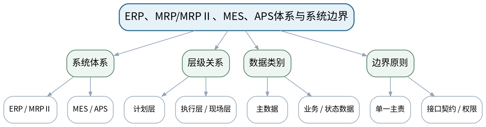

### 教学目标
**知识目标：**
1. 理解ERP、MRP、MRPⅡ、MES、APS的核心概念、主要职责和相互关系，了解ISA-95层级思想。
2. 理解主数据、业务数据、状态数据和经营数据的基本区别，以及系统边界与数据责任。

**能力目标：**
1. 能够针对订单、BOM、库存、工艺、工单、设备状态、报工和质量数据判断其主要产生/维护/消费位置。
2. 能够绘制ERP—MES—设备/人员的概念边界图，并识别重复维护和职责模糊风险。

**价值目标：**
1. 形成权限控制、数据主责、业务契约和跨部门沟通意识，认识系统集成首先是业务与数据边界问题。

### 课程思政
通过数据主权、权限和责任边界案例强调数字化系统中的数据诚信与岗位责任。

### 专创融合
把系统边界和接口对象视为数字化制造解决方案的架构资产，训练平台化和接口化思维。

### 教学重难点
**教学重点：**ERP/MES/APS职责边界、计划与执行层级、数据主责。

**教学难点：**避免“ERP什么都做”或“MES等于看板”的泛化理解，能用业务对象和数据流解释系统边界。

### 教学方法与用具
**教学方法：**业务场景法、案例分析法、表格推演法、问题驱动法、数据流/流程建模法、方案比较法、错误复盘法

**教学用具：**投影仪、ERP/MES概念架构图、ISA-95层级示意、数据对象卡片。

### 教学设计
课前任务 → 互动导入（10 min）→ 传授新知与课堂训练（75 min）→ 过关检测（10 min）→ 课堂小结（3 min）→ 作业布置（1 min）→ 考勤（1 min）

### 课前任务
【教师】发布“ERP、MRP/MRPⅡ、MES、APS体系与系统边界”对应大纲/教材范围和一个最小制造业务案例，不提前给出完整结论。

1. 阅读对应大纲与教材内容；
2. 圈出3个关键术语并记录至少1个疑问；
3. 预读订单/BOM/库存/工艺/能力/工单/接口/KPI中的相关数据表，写出一个预期业务关系或计算结果。

【学生】完成准备并带着“业务关系预测/疑问/已有计算或流程证据”进入课堂。

### 互动导入
【教师】展示同一“工单状态”在ERP和MES里都可修改的冲突案例，让学生判断谁应为主责、另一侧如何同步。

【学生】先独立判断业务关系、流程或计算结果，再与同伴交换依据；教师收集典型分歧后进入本课。

### 传授新知与课堂训练
**一、业务概念与数据模型（约30 min）—体系演进**

【教师】从MRP的物料计算到MRPⅡ资源闭环、ERP企业资源集成，再到MES车间执行和APS高级计划，解释各系统的决策范围。

【学生】先独立完成流程、表格、计算或数据流推演并写出判断依据，再与同伴互核；需要电子表格/Python时仅作为计算辅助，不把软件操作本身作为课程目标。

**二、学生计算/流程/数据推演（约25 min）—数据与边界**

【教师】围绕物料、BOM、工艺、计划订单、生产工单、报工、设备状态、质量记录建立“主责系统—消费系统—同步方向”表。

【学生】先独立完成流程、表格、计算或数据流推演并写出判断依据，再与同伴互核；需要电子表格/Python时仅作为计算辅助，不把软件操作本身作为课程目标。

**三、方案比较、校核与错误复盘（约20 min）—冲突分析**

【教师】学生分析重复主数据、双向任意修改、状态不同步等典型问题，给出数据主责和接口边界原则。

【学生】先独立完成流程、表格、计算或数据流推演并写出判断依据，再与同伴互核；需要电子表格/Python时仅作为计算辅助，不把软件操作本身作为课程目标。

**独立学习产物**：ERP/MES/APS职责矩阵＋核心数据主责表。

**学习证据**：系统职责、对象主责、同步方向、至少2个边界冲突案例及改进规则。

**评价映射**：平时成绩＋课程作业ERP-MES数据流前置＋期末综合报告；目标1.1、2.1、3.1。

### 过关检测
【教师】组织当堂检测：

1. MRP、MRPⅡ和ERP的核心扩展关系是什么？
2. 为什么MES不能简单替代ERP？
3. 同一主数据由多个系统随意维护会造成什么问题？

【学生】独立作答/计算/绘图；【教师】按错误类型讲解，要求说明业务、数据、计算或流程依据。

### 课堂小结
【教师】回到本课知识脉络图，用“业务场景—对象/数据—计划/执行逻辑—校核/异常—管理判断”总结“ERP、MRP/MRPⅡ、MES、APS体系与系统边界”，再次强调教学重点：ERP/MES/APS职责边界、计划与执行层级、数据主责。

【学生】写下“本课一个关键业务规则 + 一个最容易造成错误决策的数据/边界”。

### 作业布置
【教师】布置课后任务：完善“对象—主责系统—消费系统—更新频率—异常处理”表，预习独立需求、相关需求与MPS。

【学生】按课程文件命名与证据要求整理流程图、计算表、数据流或方案说明；使用电子工具时需保留输入、规则和人工核验记录。

### 考勤
【教师】利用学校/课程实际使用的平台进行签到。

【学生】按课程要求完成签到。

### 课后教学反思
【课后填写，不预填事实】记录本次实际用时、“避免“ERP什么都做”或“MES等于看板”的泛化理解，能用业务对象和数据流解释系统边界。”的真实掌握/错误，以及流程图、计算表、数据流/接口表、方案比较等评价证据完整性；仅依据真实课堂记录确定后续补救或拓展，不补写未发生事实。

### 本章节参考文献
[3] 陈启申.《ERP——从内部集成起步（第3版）》[M]. 电子工业出版社，2022。
[2] 王爱民.《制造执行系统（MES）原理与应用》[M]. 北京航空航天大学出版社，2021。

## 第3次课 需求管理、预测/订单与主生产计划MPS

### 课次信息
- **章节/单元**：第二单元 需求管理、MPS与MRP
- **周次**：按实际课表填写
- **课时安排**：2课时（100 min）
- **课型**：理论
- **单元学时分配**：理论2课时

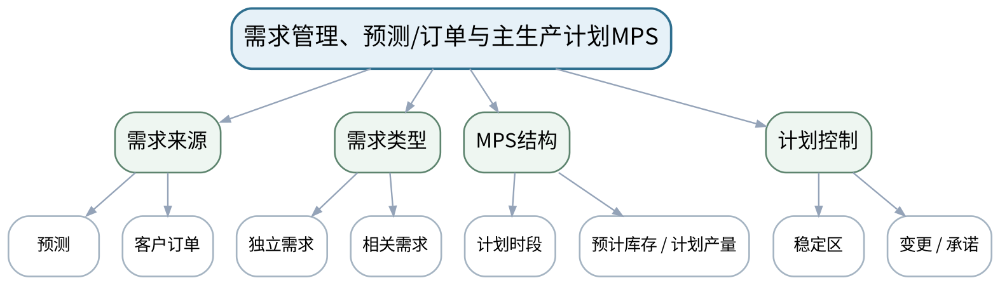

### 教学目标
**知识目标：**
1. 理解独立需求与相关需求、预测与客户订单的关系，掌握MPS的对象、时段和基本编制逻辑。
2. 理解可承诺量、计划稳定性和需求变动对生产计划的影响。

**能力目标：**
1. 能够依据简化预测、订单、期初库存和批量条件编制分时段MPS表。
2. 能够检查MPS是否与交付承诺、库存和资源条件一致，并解释计划变更影响。

**价值目标：**
1. 形成数据准确、版本一致和计划可执行意识，认识频繁无依据变更会向采购和车间传递波动。

### 课程思政
通过计划承诺与版本变更强调守信、协同和数据责任，避免用随意改数“满足”交期。

### 专创融合
把MPS表设计成可复用的计划计算模板，训练将业务规则转化为可验证的数据产品。

### 教学重难点
**教学重点：**需求管理与MPS时间分段计算。

**教学难点：**区分预测、订单和实际需求口径，并在库存、交期与计划稳定性之间保持一致。

### 教学方法与用具
**教学方法：**业务场景法、案例分析法、表格推演法、问题驱动法、数据流/流程建模法、方案比较法、错误复盘法

**教学用具：**投影仪、MPS时段案例表、计算器或电子表格（仅辅助计算）、白板。

### 教学设计
课前任务 → 互动导入（10 min）→ 传授新知与课堂训练（75 min）→ 过关检测（10 min）→ 课堂小结（3 min）→ 作业布置（1 min）→ 考勤（1 min）

### 课前任务
【教师】发布“需求管理、预测/订单与主生产计划MPS”对应大纲/教材范围和一个最小制造业务案例，不提前给出完整结论。

1. 阅读对应大纲与教材内容；
2. 圈出3个关键术语并记录至少1个疑问；
3. 预读订单/BOM/库存/工艺/能力/工单/接口/KPI中的相关数据表，写出一个预期业务关系或计算结果。

【学生】完成准备并带着“业务关系预测/疑问/已有计算或流程证据”进入课堂。

### 互动导入
【教师】给出预测与实际订单在第3周发生偏差的案例，让学生判断能否直接把预测和订单相加，以及MPS应如何响应。

【学生】先独立判断业务关系、流程或计算结果，再与同伴交换依据；教师收集典型分歧后进入本课。

### 传授新知与课堂训练
**一、业务概念与数据模型（约30 min）—需求口径**

【教师】解释独立/相关需求、预测、客户订单和订单承诺，讨论不同阶段需求数据的来源与可信度。

【学生】先独立完成流程、表格、计算或数据流推演并写出判断依据，再与同伴互核；需要电子表格/Python时仅作为计算辅助，不把软件操作本身作为课程目标。

**二、学生计算/流程/数据推演（约25 min）—MPS推演**

【教师】用4—6个计划时段的简化数据计算预计可用库存、计划产量和可能的可承诺量，学生分组核对。

【学生】先独立完成流程、表格、计算或数据流推演并写出判断依据，再与同伴互核；需要电子表格/Python时仅作为计算辅助，不把软件操作本身作为课程目标。

**三、方案比较、校核与错误复盘（约20 min）—变更分析**

【教师】改变一个时段订单量或库存值，比较MPS前后变化，讨论计划冻结、沟通与版本控制。

【学生】先独立完成流程、表格、计算或数据流推演并写出判断依据，再与同伴互核；需要电子表格/Python时仅作为计算辅助，不把软件操作本身作为课程目标。

**独立学习产物**：一份6时段MPS计算表＋需求版本说明。

**学习证据**：需求来源、计算公式/口径、时段结果、变更前后对比和一条可执行性说明。

**评价映射**：课程作业MPS/MRP计算（30%内部权重）阶段1＋期末考核；目标1.2、2.2、3.2。

### 过关检测
【教师】组织当堂检测：

1. 独立需求与相关需求的差别是什么？
2. MPS为什么不是简单的销售订单列表？
3. 计划版本变化后哪些下游数据可能受影响？

【学生】独立作答/计算/绘图；【教师】按错误类型讲解，要求说明业务、数据、计算或流程依据。

### 课堂小结
【教师】回到本课知识脉络图，用“业务场景—对象/数据—计划/执行逻辑—校核/异常—管理判断”总结“需求管理、预测/订单与主生产计划MPS”，再次强调教学重点：需求管理与MPS时间分段计算。

【学生】写下“本课一个关键业务规则 + 一个最容易造成错误决策的数据/边界”。

### 作业布置
【教师】布置课后任务：完成给定案例MPS表，并写出一个“订单增加20%”时的影响清单。

【学生】按课程文件命名与证据要求整理流程图、计算表、数据流或方案说明；使用电子工具时需保留输入、规则和人工核验记录。

### 考勤
【教师】利用学校/课程实际使用的平台进行签到。

【学生】按课程要求完成签到。

### 课后教学反思
【课后填写，不预填事实】记录本次实际用时、“区分预测、订单和实际需求口径，并在库存、交期与计划稳定性之间保持一致。”的真实掌握/错误，以及流程图、计算表、数据流/接口表、方案比较等评价证据完整性；仅依据真实课堂记录确定后续补救或拓展，不补写未发生事实。

### 本章节参考文献
[1] 刘晓冰, 赵希男.《生产计划与控制（第2版）》[M]. 清华大学出版社，2022。

## 第4次课 BOM、库存状态、提前期与批量规则

### 课次信息
- **章节/单元**：第二单元 需求管理、MPS与MRP
- **周次**：按实际课表填写
- **课时安排**：2课时（100 min）
- **课型**：理论
- **单元学时分配**：理论2课时

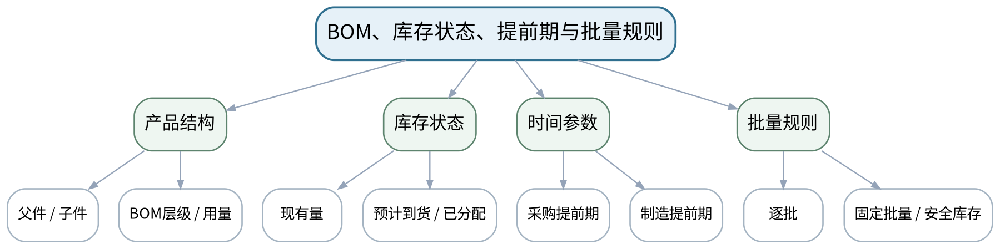

### 教学目标
**知识目标：**
1. 掌握BOM层级、父子件用量、库存现有量/已分配量/预计到货、提前期和批量规则等MRP基础数据。
2. 理解低层码、提前期偏置和基础数据准确性对MRP结果的影响。

**能力目标：**
1. 能够从产品结构图建立简化BOM并按层级展开需求。
2. 能够构造库存状态记录并判断错误BOM、库存或提前期如何导致计划偏差。

**价值目标：**
1. 形成基础数据“一处错误、全链扩散”的质量意识，重视BOM、库存和提前期版本一致性。

### 课程思政
以BOM和库存数据错误造成缺料/积压为例强调基础数据治理、版本责任和工程诚信。

### 专创融合
将BOM与库存状态视为计划算法的核心数据模型，训练数据结构化与规则可配置思维。

### 教学重难点
**教学重点：**BOM展开、库存状态与提前期偏置。

**教学难点：**把数量逻辑与时间逻辑同时放入MRP基础数据，理解错误主数据的连锁效应。

### 教学方法与用具
**教学方法：**业务场景法、案例分析法、表格推演法、问题驱动法、数据流/流程建模法、方案比较法、错误复盘法

**教学用具：**投影仪、产品结构卡片、BOM/库存状态模板、电子表格（可选）。

### 教学设计
课前任务 → 互动导入（10 min）→ 传授新知与课堂训练（75 min）→ 过关检测（10 min）→ 课堂小结（3 min）→ 作业布置（1 min）→ 考勤（1 min）

### 课前任务
【教师】发布“BOM、库存状态、提前期与批量规则”对应大纲/教材范围和一个最小制造业务案例，不提前给出完整结论。

1. 阅读对应大纲与教材内容；
2. 圈出3个关键术语并记录至少1个疑问；
3. 预读订单/BOM/库存/工艺/能力/工单/接口/KPI中的相关数据表，写出一个预期业务关系或计算结果。

【学生】完成准备并带着“业务关系预测/疑问/已有计算或流程证据”进入课堂。

### 互动导入
【教师】给出一个BOM中紧固件用量误写为1而实际需要4的案例，让学生追踪该错误在多批计划中的放大效应。

【学生】先独立判断业务关系、流程或计算结果，再与同伴交换依据；教师收集典型分歧后进入本课。

### 传授新知与课堂训练
**一、业务概念与数据模型（约30 min）—BOM结构**

【教师】从产品—组件—零件建立多层BOM，解释父子关系、用量、层级和版本。

【学生】先独立完成流程、表格、计算或数据流推演并写出判断依据，再与同伴互核；需要电子表格/Python时仅作为计算辅助，不把软件操作本身作为课程目标。

**二、学生计算/流程/数据推演（约25 min）—库存与时间**

【教师】建立现有量、预计到货、已分配和提前期数据表，演示需求数量与计划时间的两条计算线。

【学生】先独立完成流程、表格、计算或数据流推演并写出判断依据，再与同伴互核；需要电子表格/Python时仅作为计算辅助，不把软件操作本身作为课程目标。

**三、方案比较、校核与错误复盘（约20 min）—数据质量**

【教师】注入一个BOM用量、库存或提前期错误，学生比较MRP前置数据和可能的生产后果。

【学生】先独立完成流程、表格、计算或数据流推演并写出判断依据，再与同伴互核；需要电子表格/Python时仅作为计算辅助，不把软件操作本身作为课程目标。

**独立学习产物**：多层BOM图＋库存/提前期基础数据表。

**学习证据**：BOM层级、单位用量、库存状态、提前期、批量规则和一条数据错误影响链。

**评价映射**：课程作业MPS/MRP计算（30%内部权重）阶段2＋期末考核；目标1.2、2.2、3.2。

### 过关检测
【教师】组织当堂检测：

1. BOM中的“单位用量”为什么会沿层级放大？
2. 库存现有量和预计到货量能否直接等同？
3. 提前期错误主要影响MRP的数量还是时间？

【学生】独立作答/计算/绘图；【教师】按错误类型讲解，要求说明业务、数据、计算或流程依据。

### 课堂小结
【教师】回到本课知识脉络图，用“业务场景—对象/数据—计划/执行逻辑—校核/异常—管理判断”总结“BOM、库存状态、提前期与批量规则”，再次强调教学重点：BOM展开、库存状态与提前期偏置。

【学生】写下“本课一个关键业务规则 + 一个最容易造成错误决策的数据/边界”。

### 作业布置
【教师】布置课后任务：完善案例BOM和库存状态记录，为下一课完整MRP净需求展开准备。

【学生】按课程文件命名与证据要求整理流程图、计算表、数据流或方案说明；使用电子工具时需保留输入、规则和人工核验记录。

### 考勤
【教师】利用学校/课程实际使用的平台进行签到。

【学生】按课程要求完成签到。

### 课后教学反思
【课后填写，不预填事实】记录本次实际用时、“把数量逻辑与时间逻辑同时放入MRP基础数据，理解错误主数据的连锁效应。”的真实掌握/错误，以及流程图、计算表、数据流/接口表、方案比较等评价证据完整性；仅依据真实课堂记录确定后续补救或拓展，不补写未发生事实。

### 本章节参考文献
[1] 刘晓冰, 赵希男.《生产计划与控制（第2版）》[M]. 清华大学出版社，2022。
[3] 陈启申.《ERP——从内部集成起步（第3版）》[M]. 电子工业出版社，2022。

## 第5次课 MRP净需求、计划订单与安全库存校核

### 课次信息
- **章节/单元**：第二单元 需求管理、MPS与MRP
- **周次**：按实际课表填写
- **课时安排**：2课时（100 min）
- **课型**：理论
- **单元学时分配**：理论2课时

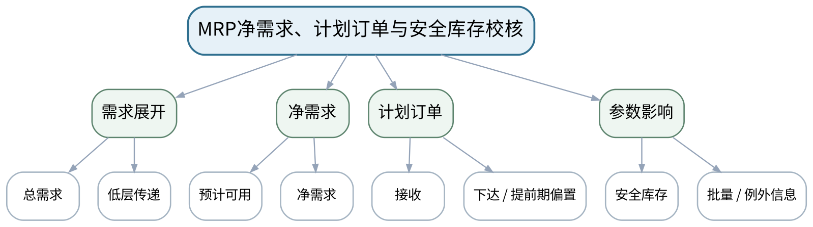

### 教学目标
**知识目标：**
1. 掌握总需求、预计可用量、净需求、计划订单接收与计划订单下达的基本计算逻辑。
2. 理解安全库存、批量规则、提前期和例外信息对MRP结果的影响。

**能力目标：**
1. 能够依据MPS、BOM、库存和提前期完成一个两层产品的MRP展开。
2. 能够通过数量守恒、时段偏置和边界条件检查MRP结果，并解释计划订单为何变化。

**价值目标：**
1. 形成计划结果必须可追溯到数据和规则的证据意识，不把软件输出直接等同于正确结论。

### 课程思政
强调计算结果必须可复核、参数变更必须有依据，避免通过随意调整库存/提前期“美化”计划。

### 专创融合
把MRP推演表视作可审核的计划算法原型，为后续ERP计划模块与APS优化理解打基础。

### 教学重难点
**教学重点：**MRP净需求计算、计划订单接收/下达及校核。

**教学难点：**同时处理数量、时段、批量和安全库存，能从结果反查数据与规则。

### 教学方法与用具
**教学方法：**业务场景法、案例分析法、表格推演法、问题驱动法、数据流/流程建模法、方案比较法、错误复盘法

**教学用具：**投影仪、MRP案例数据、计算器/电子表格（仅辅助）、校核清单。

### 教学设计
课前任务 → 互动导入（10 min）→ 传授新知与课堂训练（75 min）→ 过关检测（10 min）→ 课堂小结（3 min）→ 作业布置（1 min）→ 考勤（1 min）

### 课前任务
【教师】发布“MRP净需求、计划订单与安全库存校核”对应大纲/教材范围和一个最小制造业务案例，不提前给出完整结论。

1. 阅读对应大纲与教材内容；
2. 圈出3个关键术语并记录至少1个疑问；
3. 预读订单/BOM/库存/工艺/能力/工单/接口/KPI中的相关数据表，写出一个预期业务关系或计算结果。

【学生】完成准备并带着“业务关系预测/疑问/已有计算或流程证据”进入课堂。

### 互动导入
【教师】给出“系统显示第4周缺料，但采购提前期为2周”的MRP表，让学生判断计划订单应在哪一周下达。

【学生】先独立判断业务关系、流程或计算结果，再与同伴交换依据；教师收集典型分歧后进入本课。

### 传授新知与课堂训练
**一、业务概念与数据模型（约30 min）—MRP计算链**

【教师】按“总需求→预计可用→净需求→计划接收→计划下达”逐行推演，关联上层计划与BOM用量。

【学生】先独立完成流程、表格、计算或数据流推演并写出判断依据，再与同伴互核；需要电子表格/Python时仅作为计算辅助，不把软件操作本身作为课程目标。

**二、学生计算/流程/数据推演（约25 min）—参数实验**

【教师】改变安全库存、固定批量或提前期，比较净需求和计划下达的变化，讨论库存与交付权衡。

【学生】先独立完成流程、表格、计算或数据流推演并写出判断依据，再与同伴互核；需要电子表格/Python时仅作为计算辅助，不把软件操作本身作为课程目标。

**三、方案比较、校核与错误复盘（约20 min）—结果校核**

【教师】学生使用数量守恒、时段偏置和零/边界库存检查MRP表，指出一个潜在例外并提出处理建议。

【学生】先独立完成流程、表格、计算或数据流推演并写出判断依据，再与同伴互核；需要电子表格/Python时仅作为计算辅助，不把软件操作本身作为课程目标。

**独立学习产物**：完整MPS/MRP计算表＋结果解释短报告。

**学习证据**：计算过程、参数、净需求、计划订单、至少2个参数对照和校核结论。

**评价映射**：课程作业MPS/MRP计算与结果解释（30%内部权重）完成＋期末考核；目标1.2、2.2、3.2。

### 过关检测
【教师】组织当堂检测：

1. 计划订单接收与计划订单下达为什么不一定在同一时段？
2. 安全库存增加通常会怎样影响计划订单？
3. 如何验证MRP结果而不是只相信表格输出？

【学生】独立作答/计算/绘图；【教师】按错误类型讲解，要求说明业务、数据、计算或流程依据。

### 课堂小结
【教师】回到本课知识脉络图，用“业务场景—对象/数据—计划/执行逻辑—校核/异常—管理判断”总结“MRP净需求、计划订单与安全库存校核”，再次强调教学重点：MRP净需求计算、计划订单接收/下达及校核。

【学生】写下“本课一个关键业务规则 + 一个最容易造成错误决策的数据/边界”。

### 作业布置
【教师】布置课后任务：整理MPS/MRP阶段作业；预习工艺路线、工作中心、标准工时和能力负荷。

【学生】按课程文件命名与证据要求整理流程图、计算表、数据流或方案说明；使用电子工具时需保留输入、规则和人工核验记录。

### 考勤
【教师】利用学校/课程实际使用的平台进行签到。

【学生】按课程要求完成签到。

### 课后教学反思
【课后填写，不预填事实】记录本次实际用时、“同时处理数量、时段、批量和安全库存，能从结果反查数据与规则。”的真实掌握/错误，以及流程图、计算表、数据流/接口表、方案比较等评价证据完整性；仅依据真实课堂记录确定后续补救或拓展，不补写未发生事实。

### 本章节参考文献
[1] 刘晓冰, 赵希男.《生产计划与控制（第2版）》[M]. 清华大学出版社，2022。
[3] 陈启申.《ERP——从内部集成起步（第3版）》[M]. 电子工业出版社，2022。

## 第6次课 工艺路线、工作中心、标准工时与能力数据

### 课次信息
- **章节/单元**：第三单元 能力计划与生产排程基础
- **周次**：按实际课表填写
- **课时安排**：2课时（100 min）
- **课型**：理论
- **单元学时分配**：理论2课时

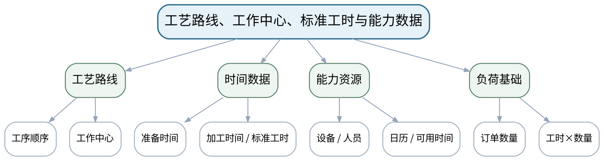

### 教学目标
**知识目标：**
1. 理解工艺路线、工序顺序、工作中心、设备/人员能力、准备时间、加工时间和标准工时等能力计划基础数据。
2. 理解产能日历、可用时间、效率/利用率等参数的基本作用。

**能力目标：**
1. 能够把一个产品工艺路线转换为工作中心负荷需求，并建立简化能力数据表。
2. 能够识别工艺路线或标准工时错误对能力计划和交期判断的影响。

**价值目标：**
1. 形成资源节约、标准数据有据和工艺—计划协同意识，认识能力数据既影响效率也影响员工负荷与安全。

### 课程思政
从工时标准、人员负荷和设备能力讨论效率目标与安全/合理劳动负荷之间的责任边界。

### 专创融合
把工艺路线和能力表结构化，为数字化产能分析、排程和瓶颈可视化准备数据模型。

### 教学重难点
**教学重点：**工艺路线、工作中心和标准工时到负荷需求的转换。

**教学难点：**区分工艺时间、日历能力和有效能力，并避免把理论能力直接当可用能力。

### 教学方法与用具
**教学方法：**业务场景法、案例分析法、表格推演法、问题驱动法、数据流/流程建模法、方案比较法、错误复盘法

**教学用具：**投影仪、工艺路线/工作中心案例表、能力日历模板、计算器。

### 教学设计
课前任务 → 互动导入（10 min）→ 传授新知与课堂训练（75 min）→ 过关检测（10 min）→ 课堂小结（3 min）→ 作业布置（1 min）→ 考勤（1 min）

### 课前任务
【教师】发布“工艺路线、工作中心、标准工时与能力数据”对应大纲/教材范围和一个最小制造业务案例，不提前给出完整结论。

1. 阅读对应大纲与教材内容；
2. 圈出3个关键术语并记录至少1个疑问；
3. 预读订单/BOM/库存/工艺/能力/工单/接口/KPI中的相关数据表，写出一个预期业务关系或计算结果。

【学生】完成准备并带着“业务关系预测/疑问/已有计算或流程证据”进入课堂。

### 互动导入
【教师】给出两条工艺路线，其中关键工序都经过同一工作中心，让学生判断为什么物料齐套仍可能无法按期交付。

【学生】先独立判断业务关系、流程或计算结果，再与同伴交换依据；教师收集典型分歧后进入本课。

### 传授新知与课堂训练
**一、业务概念与数据模型（约30 min）—能力数据模型**

【教师】解释工艺路线、工序、工作中心、准备/加工时间和资源日历，建立“产品—工序—中心—工时”关系。

【学生】先独立完成流程、表格、计算或数据流推演并写出判断依据，再与同伴互核；需要电子表格/Python时仅作为计算辅助，不把软件操作本身作为课程目标。

**二、学生计算/流程/数据推演（约25 min）—负荷计算**

【教师】根据订单数量和标准工时计算各工作中心工时负荷，区分理论可用时间与考虑效率后的有效能力。

【学生】先独立完成流程、表格、计算或数据流推演并写出判断依据，再与同伴互核；需要电子表格/Python时仅作为计算辅助，不把软件操作本身作为课程目标。

**三、方案比较、校核与错误复盘（约20 min）—数据审查**

【教师】比较标准工时低估、工艺路线漏工序和日历未更新三类错误，学生说明对交期和资源配置的影响。

【学生】先独立完成流程、表格、计算或数据流推演并写出判断依据，再与同伴互核；需要电子表格/Python时仅作为计算辅助，不把软件操作本身作为课程目标。

**独立学习产物**：工艺路线表＋工作中心能力表＋初步负荷计算表。

**学习证据**：工序顺序、标准工时、工作中心、日历能力、负荷公式和数据风险说明。

**评价映射**：课程作业能力负荷与排程分析（25%内部权重）阶段1＋期末考核；目标1.3、2.3、3.3。

### 过关检测
【教师】组织当堂检测：

1. 工艺路线与BOM分别回答什么问题？
2. 理论能力与有效能力为什么不同？
3. 标准工时偏小会怎样影响交期承诺？

【学生】独立作答/计算/绘图；【教师】按错误类型讲解，要求说明业务、数据、计算或流程依据。

### 课堂小结
【教师】回到本课知识脉络图，用“业务场景—对象/数据—计划/执行逻辑—校核/异常—管理判断”总结“工艺路线、工作中心、标准工时与能力数据”，再次强调教学重点：工艺路线、工作中心和标准工时到负荷需求的转换。

【学生】写下“本课一个关键业务规则 + 一个最容易造成错误决策的数据/边界”。

### 作业布置
【教师】布置课后任务：完成给定订单在3个工作中心上的工时负荷表，标注能力数据来源/假设。

【学生】按课程文件命名与证据要求整理流程图、计算表、数据流或方案说明；使用电子工具时需保留输入、规则和人工核验记录。

### 考勤
【教师】利用学校/课程实际使用的平台进行签到。

【学生】按课程要求完成签到。

### 课后教学反思
【课后填写，不预填事实】记录本次实际用时、“区分工艺时间、日历能力和有效能力，并避免把理论能力直接当可用能力。”的真实掌握/错误，以及流程图、计算表、数据流/接口表、方案比较等评价证据完整性；仅依据真实课堂记录确定后续补救或拓展，不补写未发生事实。

### 本章节参考文献
[1] 刘晓冰, 赵希男.《生产计划与控制（第2版）》[M]. 清华大学出版社，2022。

## 第7次课 能力需求、负荷平衡与瓶颈调整

### 课次信息
- **章节/单元**：第三单元 能力计划与生产排程基础
- **周次**：按实际课表填写
- **课时安排**：2课时（100 min）
- **课型**：理论
- **单元学时分配**：理论2课时

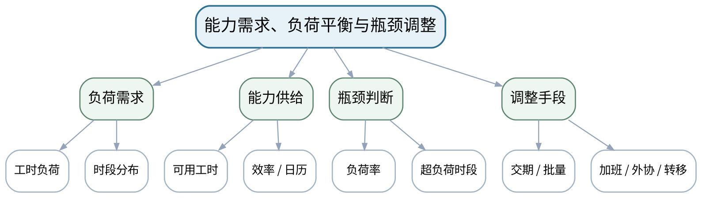

### 教学目标
**知识目标：**
1. 理解粗能力计划/能力需求计划、负荷、产能、瓶颈和能力平衡的基本关系。
2. 理解加班、外协、转移工序、调整批量/交期等常见能力调整手段及其约束。

**能力目标：**
1. 能够依据工作中心负荷与能力数据识别超负荷时段和瓶颈。
2. 能够提出至少两种能力调整方案，并比较交期、成本、质量和人员影响。

**价值目标：**
1. 形成瓶颈管理、资源节约和协同决策意识，避免只通过无限加班解决计划问题。

### 课程思政
强调产能决策对员工、安全、质量和成本的综合影响，避免把效率指标作为唯一价值尺度。

### 专创融合
将负荷—能力比较转化为排程决策看板，为APS与智能排程的约束建模建立直觉。

### 教学重难点
**教学重点：**负荷—能力对比、瓶颈识别和调整方案评价。

**教学难点：**在交期、成本、质量和人员影响之间做有约束的方案权衡。

### 教学方法与用具
**教学方法：**业务场景法、案例分析法、表格推演法、问题驱动法、数据流/流程建模法、方案比较法、错误复盘法

**教学用具：**投影仪、能力负荷案例、方案评价矩阵、白板。

### 教学设计
课前任务 → 互动导入（10 min）→ 传授新知与课堂训练（75 min）→ 过关检测（10 min）→ 课堂小结（3 min）→ 作业布置（1 min）→ 考勤（1 min）

### 课前任务
【教师】发布“能力需求、负荷平衡与瓶颈调整”对应大纲/教材范围和一个最小制造业务案例，不提前给出完整结论。

1. 阅读对应大纲与教材内容；
2. 圈出3个关键术语并记录至少1个疑问；
3. 预读订单/BOM/库存/工艺/能力/工单/接口/KPI中的相关数据表，写出一个预期业务关系或计算结果。

【学生】完成准备并带着“业务关系预测/疑问/已有计算或流程证据”进入课堂。

### 互动导入
【教师】给出关键工作中心负荷率130%的周计划，让学生先回答“加班30%”是否是唯一方案，并列出潜在副作用。

【学生】先独立判断业务关系、流程或计算结果，再与同伴交换依据；教师收集典型分歧后进入本课。

### 传授新知与课堂训练
**一、业务概念与数据模型（约30 min）—负荷平衡**

【教师】将上一课负荷表按时段汇总，与能力日历比较，计算负荷率并识别瓶颈。

【学生】先独立完成流程、表格、计算或数据流推演并写出判断依据，再与同伴互核；需要电子表格/Python时仅作为计算辅助，不把软件操作本身作为课程目标。

**二、学生计算/流程/数据推演（约25 min）—方案设计**

【教师】讨论加班、外协、转移、批量调整、交期协商等方案，要求说明前提与代价。

【学生】先独立完成流程、表格、计算或数据流推演并写出判断依据，再与同伴互核；需要电子表格/Python时仅作为计算辅助，不把软件操作本身作为课程目标。

**三、方案比较、校核与错误复盘（约20 min）—方案评审**

【教师】学生用交期、成本、质量、员工负荷、风险五个维度比较两种方案，形成简短管理建议。

【学生】先独立完成流程、表格、计算或数据流推演并写出判断依据，再与同伴互核；需要电子表格/Python时仅作为计算辅助，不把软件操作本身作为课程目标。

**独立学习产物**：工作中心负荷—能力图＋两方案比较表。

**学习证据**：负荷率、瓶颈时段、调整量、约束条件、方案比较和推荐理由。

**评价映射**：课程作业能力负荷与排程分析（25%内部权重）阶段2＋期末考核；目标1.3、2.3、3.3。

### 过关检测
【教师】组织当堂检测：

1. 负荷率超过100%意味着什么？
2. 为什么“无限能力计划”仍有分析价值？
3. 加班方案评价至少还应考虑哪些非交期因素？

【学生】独立作答/计算/绘图；【教师】按错误类型讲解，要求说明业务、数据、计算或流程依据。

### 课堂小结
【教师】回到本课知识脉络图，用“业务场景—对象/数据—计划/执行逻辑—校核/异常—管理判断”总结“能力需求、负荷平衡与瓶颈调整”，再次强调教学重点：负荷—能力对比、瓶颈识别和调整方案评价。

【学生】写下“本课一个关键业务规则 + 一个最容易造成错误决策的数据/边界”。

### 作业布置
【教师】布置课后任务：完成瓶颈能力调整方案，预习正排、倒排、优先规则和生产工单下达。

【学生】按课程文件命名与证据要求整理流程图、计算表、数据流或方案说明；使用电子工具时需保留输入、规则和人工核验记录。

### 考勤
【教师】利用学校/课程实际使用的平台进行签到。

【学生】按课程要求完成签到。

### 课后教学反思
【课后填写，不预填事实】记录本次实际用时、“在交期、成本、质量和人员影响之间做有约束的方案权衡。”的真实掌握/错误，以及流程图、计算表、数据流/接口表、方案比较等评价证据完整性；仅依据真实课堂记录确定后续补救或拓展，不补写未发生事实。

### 本章节参考文献
[1] 刘晓冰, 赵希男.《生产计划与控制（第2版）》[M]. 清华大学出版社，2022。

## 第8次课 正排/倒排、优先规则与生产工单下达衔接

### 课次信息
- **章节/单元**：第三→第四单元过渡
- **周次**：按实际课表填写
- **课时安排**：2课时（100 min）
- **课型**：理论
- **单元学时分配**：第三单元1课时＋第四单元1课时

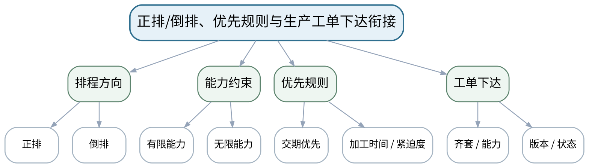

### 教学目标
**知识目标：**
1. 理解有限/无限能力、正排/倒排及常见优先规则的基本思想。
2. 理解计划订单转生产工单、下达条件和计划层向执行层移交的业务含义。

**能力目标：**
1. 能够对同一组工单按交期、最短加工时间等规则形成简化排序并比较结果。
2. 能够制定工单下达前检查清单，连接物料、能力、工艺和版本状态。

**价值目标：**
1. 形成计划可执行、下达有条件和跨层级责任清晰的意识，避免把“排出来”误当“能执行”。

### 课程思政
通过工单下达条件强调计划人员对可执行性、版本和资源事实负责，避免把压力简单转嫁给车间。

### 专创融合
把排程规则与下达检查清单转化为可配置决策规则，为APS/工作流系统设计提供原型。

### 教学重难点
**教学重点：**排程规则与计划到车间工单的移交条件。

**教学难点：**理解优先规则的局限，并把排程结果与工单下达的物料/能力/工艺约束连接起来。

### 教学方法与用具
**教学方法：**业务场景法、案例分析法、表格推演法、问题驱动法、数据流/流程建模法、方案比较法、错误复盘法

**教学用具：**投影仪、工单/交期/工时案例、甘特图模板、下达检查表。

### 教学设计
课前任务 → 互动导入（10 min）→ 传授新知与课堂训练（75 min）→ 过关检测（10 min）→ 课堂小结（3 min）→ 作业布置（1 min）→ 考勤（1 min）

### 课前任务
【教师】发布“正排/倒排、优先规则与生产工单下达衔接”对应大纲/教材范围和一个最小制造业务案例，不提前给出完整结论。

1. 阅读对应大纲与教材内容；
2. 圈出3个关键术语并记录至少1个疑问；
3. 预读订单/BOM/库存/工艺/能力/工单/接口/KPI中的相关数据表，写出一个预期业务关系或计算结果。

【学生】完成准备并带着“业务关系预测/疑问/已有计算或流程证据”进入课堂。

### 互动导入
【教师】给出3张工单：一张交期最紧、一张加工时间最短、一张客户等级最高，让学生说明不同优先规则为何给出不同顺序。

【学生】先独立判断业务关系、流程或计算结果，再与同伴交换依据；教师收集典型分歧后进入本课。

### 传授新知与课堂训练
**一、业务概念与数据模型（约30 min）—排程基础**

【教师】用简化甘特表解释正排、倒排、有限/无限能力和常见优先规则，比较完工时间、延期和在制品倾向。

【学生】先独立完成流程、表格、计算或数据流推演并写出判断依据，再与同伴互核；需要电子表格/Python时仅作为计算辅助，不把软件操作本身作为课程目标。

**二、学生计算/流程/数据推演（约25 min）—工单下达**

【教师】从计划订单到生产工单说明齐套、工艺版本、工作中心能力、质量/图纸版本和授权状态等下达条件。

【学生】先独立完成流程、表格、计算或数据流推演并写出判断依据，再与同伴互核；需要电子表格/Python时仅作为计算辅助，不把软件操作本身作为课程目标。

**三、方案比较、校核与错误复盘（约20 min）—衔接评审**

【教师】学生把排序结果放入工单下达检查表，判断哪些工单“顺序靠前但暂不能下达”，解释原因。

【学生】先独立完成流程、表格、计算或数据流推演并写出判断依据，再与同伴互核；需要电子表格/Python时仅作为计算辅助，不把软件操作本身作为课程目标。

**独立学习产物**：简化工单排序表＋生产工单下达检查清单。

**学习证据**：规则、排程顺序、延期/等待结果、物料/能力/版本下达条件及判断依据。

**评价映射**：课程作业能力负荷与排程分析（25%内部权重）完成，并衔接工单执行作业；目标1.3/2.3/3.3与1.4/2.4/3.4。

### 过关检测
【教师】组织当堂检测：

1. 正排和倒排各适合回答什么问题？
2. 不同优先规则为什么可能相互冲突？
3. 排程顺序第一的工单为什么仍可能不能下达？

【学生】独立作答/计算/绘图；【教师】按错误类型讲解，要求说明业务、数据、计算或流程依据。

### 课堂小结
【教师】回到本课知识脉络图，用“业务场景—对象/数据—计划/执行逻辑—校核/异常—管理判断”总结“正排/倒排、优先规则与生产工单下达衔接”，再次强调教学重点：排程规则与计划到车间工单的移交条件。

【学生】写下“本课一个关键业务规则 + 一个最容易造成错误决策的数据/边界”。

### 作业布置
【教师】布置课后任务：整理能力与排程阶段作业；选一张工单列出从“计划下达”到“完工报工”的预计状态。

【学生】按课程文件命名与证据要求整理流程图、计算表、数据流或方案说明；使用电子工具时需保留输入、规则和人工核验记录。

### 考勤
【教师】利用学校/课程实际使用的平台进行签到。

【学生】按课程要求完成签到。

### 课后教学反思
【课后填写，不预填事实】记录本次实际用时、“理解优先规则的局限，并把排程结果与工单下达的物料/能力/工艺约束连接起来。”的真实掌握/错误，以及流程图、计算表、数据流/接口表、方案比较等评价证据完整性；仅依据真实课堂记录确定后续补救或拓展，不补写未发生事实。

### 本章节参考文献
[1] 刘晓冰, 赵希男.《生产计划与控制（第2版）》[M]. 清华大学出版社，2022。

## 第9次课 工单状态、派工、报工与WIP控制

### 课次信息
- **章节/单元**：第四单元 车间作业控制与执行闭环
- **周次**：按实际课表填写
- **课时安排**：2课时（100 min）
- **课型**：理论
- **单元学时分配**：理论2课时

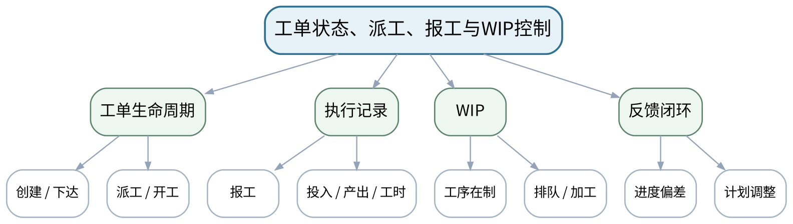

### 教学目标
**知识目标：**
1. 掌握生产工单从创建、下达、派工、开工、报工到完工/关闭的基本状态流。
2. 理解WIP、工序进度、投入/产出记录和车间反馈对计划调整的作用。

**能力目标：**
1. 能够绘制工单状态机并判断不允许的状态跳转。
2. 能够根据简化报工数据计算在制数量、完工数量和偏差，并提出计划反馈信息。

**价值目标：**
1. 形成生产记录真实、状态可追溯和跨岗位协同意识，不用事后补录掩盖真实执行偏差。

### 课程思政
通过真实报工、不可篡改事实与责任追溯强调生产数据诚信和质量责任。

### 专创融合
把工单状态机和WIP数据设计成MES执行工作流核心模型，训练事件驱动和状态化产品思维。

### 教学重难点
**教学重点：**工单状态流、报工数据和WIP反馈。

**教学难点：**把业务状态与实际生产事实对应，防止非法跳转、漏报/补报造成执行数据失真。

### 教学方法与用具
**教学方法：**业务场景法、案例分析法、表格推演法、问题驱动法、数据流/流程建模法、方案比较法、错误复盘法

**教学用具：**投影仪、工单状态卡、报工/WIP案例数据、状态图模板。

### 教学设计
课前任务 → 互动导入（10 min）→ 传授新知与课堂训练（75 min）→ 过关检测（10 min）→ 课堂小结（3 min）→ 作业布置（1 min）→ 考勤（1 min）

### 课前任务
【教师】发布“工单状态、派工、报工与WIP控制”对应大纲/教材范围和一个最小制造业务案例，不提前给出完整结论。

1. 阅读对应大纲与教材内容；
2. 圈出3个关键术语并记录至少1个疑问；
3. 预读订单/BOM/库存/工艺/能力/工单/接口/KPI中的相关数据表，写出一个预期业务关系或计算结果。

【学生】完成准备并带着“业务关系预测/疑问/已有计算或流程证据”进入课堂。

### 互动导入
【教师】给出“工单尚未下达却出现完工报工”的记录，要求学生判断这是界面问题、流程问题还是数据治理问题。

【学生】先独立判断业务关系、流程或计算结果，再与同伴交换依据；教师收集典型分歧后进入本课。

### 传授新知与课堂训练
**一、业务概念与数据模型（约30 min）—状态流**

【教师】建立工单创建—下达—派工—开工—暂停/异常—报工—完工—关闭的状态机，明确每次转换的业务条件。

【学生】先独立完成流程、表格、计算或数据流推演并写出判断依据，再与同伴互核；需要电子表格/Python时仅作为计算辅助，不把软件操作本身作为课程目标。

**二、学生计算/流程/数据推演（约25 min）—报工与WIP**

【教师】用投入、良品、不良品、在制、工时数据分析工序进度，解释WIP过高/过低的管理含义。

【学生】先独立完成流程、表格、计算或数据流推演并写出判断依据，再与同伴互核；需要电子表格/Python时仅作为计算辅助，不把软件操作本身作为课程目标。

**三、方案比较、校核与错误复盘（约20 min）—反馈分析**

【教师】学生根据一组实际进度低于计划的数据，形成“事实—偏差—影响—建议”反馈卡，区分记录事实与管理判断。

【学生】先独立完成流程、表格、计算或数据流推演并写出判断依据，再与同伴互核；需要电子表格/Python时仅作为计算辅助，不把软件操作本身作为课程目标。

**独立学习产物**：工单状态图＋WIP/报工分析表。

**学习证据**：状态转换条件、投入产出数据、WIP计算、计划偏差及一条调整建议。

**评价映射**：课程作业工单执行与异常闭环（20%内部权重）阶段1＋期末考核；目标1.4、2.4、3.4。

### 过关检测
【教师】组织当堂检测：

1. 工单“下达”和“开工”有什么区别？
2. WIP为什么不是越低越好或越高越好？
3. 为什么报工数据必须区分事实记录和计划判断？

【学生】独立作答/计算/绘图；【教师】按错误类型讲解，要求说明业务、数据、计算或流程依据。

### 课堂小结
【教师】回到本课知识脉络图，用“业务场景—对象/数据—计划/执行逻辑—校核/异常—管理判断”总结“工单状态、派工、报工与WIP控制”，再次强调教学重点：工单状态流、报工数据和WIP反馈。

【学生】写下“本课一个关键业务规则 + 一个最容易造成错误决策的数据/边界”。

### 作业布置
【教师】布置课后任务：完善工单状态机，为下一课质量、不合格、返工和异常流程增加分支。

【学生】按课程文件命名与证据要求整理流程图、计算表、数据流或方案说明；使用电子工具时需保留输入、规则和人工核验记录。

### 考勤
【教师】利用学校/课程实际使用的平台进行签到。

【学生】按课程要求完成签到。

### 课后教学反思
【课后填写，不预填事实】记录本次实际用时、“把业务状态与实际生产事实对应，防止非法跳转、漏报/补报造成执行数据失真。”的真实掌握/错误，以及流程图、计算表、数据流/接口表、方案比较等评价证据完整性；仅依据真实课堂记录确定后续补救或拓展，不补写未发生事实。

### 本章节参考文献
[1] 刘晓冰, 赵希男.《生产计划与控制（第2版）》[M]. 清华大学出版社，2022。
[2] 王爱民.《制造执行系统（MES）原理与应用》[M]. 北京航空航天大学出版社，2021。

## 第10次课 物料配送、质量异常、返工与计划调整闭环

### 课次信息
- **章节/单元**：第四单元 车间作业控制与执行闭环
- **周次**：按实际课表填写
- **课时安排**：2课时（100 min）
- **课型**：理论
- **单元学时分配**：理论2课时

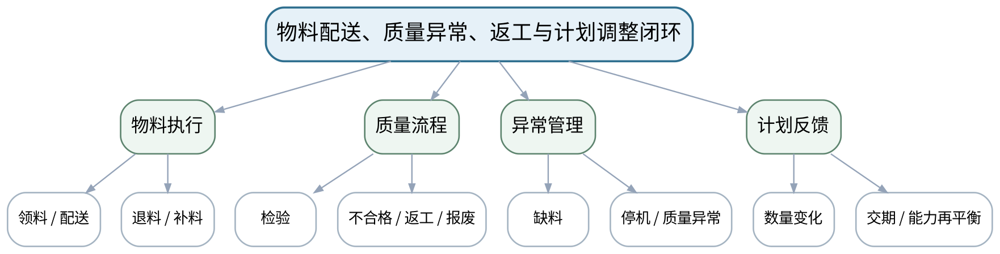

### 教学目标
**知识目标：**
1. 理解车间物料配送、领退补料、质量检验、不合格、返工/报废和异常停机的基本业务关系。
2. 理解异常事实如何触发工单、库存、质量和计划层的协同调整。

**能力目标：**
1. 能够为“不合格返工”或“关键物料短缺”绘制跨部门异常闭环。
2. 能够判断异常发生后哪些状态/数量必须同步更新，哪些决策需人工授权。

**价值目标：**
1. 形成质量追溯、异常闭环和不得掩盖不合格/停机事实的职业责任意识。

### 课程思政
以不合格品和停机记录说明“如实记录比数据好看更重要”，强化质量追溯和管理责任。

### 专创融合
将异常闭环设计为可配置工作流，为MES质量、维护和计划联动的产品功能设计建立框架。

### 教学重难点
**教学重点：**物料—质量—异常—计划调整的闭环。

**教学难点：**跨系统/部门保持数量、状态和追溯一致，同时保留人工审批与责任边界。

### 教学方法与用具
**教学方法：**业务场景法、案例分析法、表格推演法、问题驱动法、数据流/流程建模法、方案比较法、错误复盘法

**教学用具：**投影仪、质量/物料异常案例、流程图模板、数量状态表。

### 教学设计
课前任务 → 互动导入（10 min）→ 传授新知与课堂训练（75 min）→ 过关检测（10 min）→ 课堂小结（3 min）→ 作业布置（1 min）→ 考勤（1 min）

### 课前任务
【教师】发布“物料配送、质量异常、返工与计划调整闭环”对应大纲/教材范围和一个最小制造业务案例，不提前给出完整结论。

1. 阅读对应大纲与教材内容；
2. 圈出3个关键术语并记录至少1个疑问；
3. 预读订单/BOM/库存/工艺/能力/工单/接口/KPI中的相关数据表，写出一个预期业务关系或计算结果。

【学生】完成准备并带着“业务关系预测/疑问/已有计算或流程证据”进入课堂。

### 互动导入
【教师】给出“工序完成100件，其中8件不合格、5件返工、3件报废”的数据，让学生判断完工、WIP、库存和订单交付量应如何更新。

【学生】先独立判断业务关系、流程或计算结果，再与同伴交换依据；教师收集典型分歧后进入本课。

### 传授新知与课堂训练
**一、业务概念与数据模型（约30 min）—物料与质量**

【教师】串联领料、退料、补料、检验、合格、不合格、返工和报废，说明批次/序列追溯的重要性。

【学生】先独立完成流程、表格、计算或数据流推演并写出判断依据，再与同伴互核；需要电子表格/Python时仅作为计算辅助，不把软件操作本身作为课程目标。

**二、学生计算/流程/数据推演（约25 min）—异常闭环**

【教师】构建缺料、设备停机和质量异常三类事件的发现—隔离—处置—恢复—复测—关闭流程。

【学生】先独立完成流程、表格、计算或数据流推演并写出判断依据，再与同伴互核；需要电子表格/Python时仅作为计算辅助，不把软件操作本身作为课程目标。

**三、方案比较、校核与错误复盘（约20 min）—计划调整**

【教师】学生根据不合格/返工造成的可交付量变化，判断是否需要补产、延期或能力调整，并说明批准/沟通对象。

【学生】先独立完成流程、表格、计算或数据流推演并写出判断依据，再与同伴互核；需要电子表格/Python时仅作为计算辅助，不把软件操作本身作为课程目标。

**独立学习产物**：异常闭环流程图＋质量/数量状态调整表。

**学习证据**：不合格数量、返工/报废状态、物料/工单/计划影响、责任与审批点、追溯字段。

**评价映射**：课程作业工单执行与异常闭环（20%内部权重）阶段2＋期末考核；目标1.4、2.4、3.4。

### 过关检测
【教师】组织当堂检测：

1. 返工品在业务上为什么不能简单当作完工品？
2. 异常关闭至少需要哪些证据？
3. 质量异常为什么可能需要重新运行MRP/能力评估？

【学生】独立作答/计算/绘图；【教师】按错误类型讲解，要求说明业务、数据、计算或流程依据。

### 课堂小结
【教师】回到本课知识脉络图，用“业务场景—对象/数据—计划/执行逻辑—校核/异常—管理判断”总结“物料配送、质量异常、返工与计划调整闭环”，再次强调教学重点：物料—质量—异常—计划调整的闭环。

【学生】写下“本课一个关键业务规则 + 一个最容易造成错误决策的数据/边界”。

### 作业布置
【教师】布置课后任务：完成一个异常闭环案例，预习MES功能模型与车间事实数据。

【学生】按课程文件命名与证据要求整理流程图、计算表、数据流或方案说明；使用电子工具时需保留输入、规则和人工核验记录。

### 考勤
【教师】利用学校/课程实际使用的平台进行签到。

【学生】按课程要求完成签到。

### 课后教学反思
【课后填写，不预填事实】记录本次实际用时、“跨系统/部门保持数量、状态和追溯一致，同时保留人工审批与责任边界。”的真实掌握/错误，以及流程图、计算表、数据流/接口表、方案比较等评价证据完整性；仅依据真实课堂记录确定后续补救或拓展，不补写未发生事实。

### 本章节参考文献
[1] 刘晓冰, 赵希男.《生产计划与控制（第2版）》[M]. 清华大学出版社，2022。
[2] 王爱民.《制造执行系统（MES）原理与应用》[M]. 北京航空航天大学出版社，2021。

## 第11次课 车间执行反馈、MES功能入口与执行闭环

### 课次信息
- **章节/单元**：第四→第五单元过渡
- **周次**：按实际课表填写
- **课时安排**：2课时（100 min）
- **课型**：理论
- **单元学时分配**：第四单元1课时＋第五单元1课时

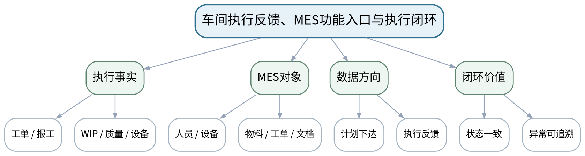

### 教学目标
**知识目标：**
1. 理解车间执行事实（工单、报工、WIP、质量、设备状态）如何形成MES的核心信息入口。
2. 理解MES“管理执行闭环”而非简单数据展示，其功能围绕人员、设备、物料、质量、工单和文档组织。

**能力目标：**
1. 能够把上一单元工单/异常流程映射到MES功能模块和数据对象。
2. 能够区分计划要求、执行事实、分析结果和管理指令的方向。

**价值目标：**
1. 形成事实先于看板、业务闭环先于界面美观的数字化建设意识。

### 课程思政
强调数字化系统必须忠实反映生产事实，避免“数据装饰”替代真实质量和执行管理。

### 专创融合
将车间业务对象映射到MES模块，训练从流程痛点到数字化产品功能的需求分析能力。

### 教学重难点
**教学重点：**执行事实到MES功能模型的映射。

**教学难点：**避免以界面/看板代替真实执行闭环，明确计划下行、事实上行和异常处理的方向。

### 教学方法与用具
**教学方法：**业务场景法、案例分析法、表格推演法、问题驱动法、数据流/流程建模法、方案比较法、错误复盘法

**教学用具：**投影仪、工单/质量/设备状态案例、MES功能卡片、数据流模板。

### 教学设计
课前任务 → 互动导入（10 min）→ 传授新知与课堂训练（75 min）→ 过关检测（10 min）→ 课堂小结（3 min）→ 作业布置（1 min）→ 考勤（1 min）

### 课前任务
【教师】发布“车间执行反馈、MES功能入口与执行闭环”对应大纲/教材范围和一个最小制造业务案例，不提前给出完整结论。

1. 阅读对应大纲与教材内容；
2. 圈出3个关键术语并记录至少1个疑问；
3. 预读订单/BOM/库存/工艺/能力/工单/接口/KPI中的相关数据表，写出一个预期业务关系或计算结果。

【学生】完成准备并带着“业务关系预测/疑问/已有计算或流程证据”进入课堂。

### 互动导入
【教师】展示一个“看板显示100%完成，但报工/质量记录不完整”的案例，让学生判断MES是否真的完成了执行闭环。

【学生】先独立判断业务关系、流程或计算结果，再与同伴交换依据；教师收集典型分歧后进入本课。

### 传授新知与课堂训练
**一、业务概念与数据模型（约30 min）—执行收口**

【教师】汇总工单、WIP、质量、物料和异常反馈，建立车间事实清单与状态来源。

【学生】先独立完成流程、表格、计算或数据流推演并写出判断依据，再与同伴互核；需要电子表格/Python时仅作为计算辅助，不把软件操作本身作为课程目标。

**二、学生计算/流程/数据推演（约25 min）—MES功能映射**

【教师】把事实清单映射到工单管理、资源管理、物料管理、质量管理、追溯、文档和数据采集等功能。

【学生】先独立完成流程、表格、计算或数据流推演并写出判断依据，再与同伴互核；需要电子表格/Python时仅作为计算辅助，不把软件操作本身作为课程目标。

**三、方案比较、校核与错误复盘（约20 min）—方向检查**

【教师】学生在数据流图上标注“计划/指令下行、执行事实/异常上行、分析/决策回路”，查找方向反转或职责混乱。

【学生】先独立完成流程、表格、计算或数据流推演并写出判断依据，再与同伴互核；需要电子表格/Python时仅作为计算辅助，不把软件操作本身作为课程目标。

**独立学习产物**：车间事实—MES功能映射表＋上下行数据流草图。

**学习证据**：事实来源、MES对象、计划/状态方向、异常闭环和至少一条界面与事实不一致风险。

**评价映射**：课程作业工单执行与异常闭环（20%内部权重）完成，并衔接ERP-MES数据流作业；目标1.4/2.4/3.4与1.5/2.5/3.5。

### 过关检测
【教师】组织当堂检测：

1. MES的核心价值为什么不等于“可视化大屏”？
2. 计划数据与执行事实通常各从哪个方向流动？
3. 看板状态和实际报工不一致时应先相信哪一个？为什么？

【学生】独立作答/计算/绘图；【教师】按错误类型讲解，要求说明业务、数据、计算或流程依据。

### 课堂小结
【教师】回到本课知识脉络图，用“业务场景—对象/数据—计划/执行逻辑—校核/异常—管理判断”总结“车间执行反馈、MES功能入口与执行闭环”，再次强调教学重点：执行事实到MES功能模型的映射。

【学生】写下“本课一个关键业务规则 + 一个最容易造成错误决策的数据/边界”。

### 作业布置
【教师】布置课后任务：整理车间执行阶段作业；为下一课列出MES需要管理的至少6类对象和其关键状态。

【学生】按课程文件命名与证据要求整理流程图、计算表、数据流或方案说明；使用电子工具时需保留输入、规则和人工核验记录。

### 考勤
【教师】利用学校/课程实际使用的平台进行签到。

【学生】按课程要求完成签到。

### 课后教学反思
【课后填写，不预填事实】记录本次实际用时、“避免以界面/看板代替真实执行闭环，明确计划下行、事实上行和异常处理的方向。”的真实掌握/错误，以及流程图、计算表、数据流/接口表、方案比较等评价证据完整性；仅依据真实课堂记录确定后续补救或拓展，不补写未发生事实。

### 本章节参考文献
[2] 王爱民.《制造执行系统（MES）原理与应用》[M]. 北京航空航天大学出版社，2021。
[1] 刘晓冰, 赵希男.《生产计划与控制（第2版）》[M]. 清华大学出版社，2022。

## 第12次课 MES核心功能、生产数据采集与资源状态

### 课次信息
- **章节/单元**：第五单元 MES功能、数据与ERP-MES集成
- **周次**：按实际课表填写
- **课时安排**：2课时（100 min）
- **课型**：理论
- **单元学时分配**：理论2课时

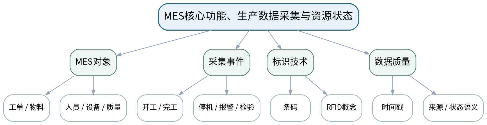

### 教学目标
**知识目标：**
1. 理解MES在生产工单、物料、人员、设备、质量、追溯和文档等方面的核心功能。
2. 理解生产数据采集的事件、时间戳、数据来源、状态语义及条码/RFID等识别技术的概念作用。

**能力目标：**
1. 能够为一个制造单元设计基本MES对象清单、事件清单和数据采集点。
2. 能够识别“采集到了数据但语义不清/时间错乱/来源不可追溯”的数据质量问题。

**价值目标：**
1. 形成数据来源可追溯、采集最小必要和员工/设备数据使用合规意识。

### 课程思政
讨论人员、质量和设备数据使用中的隐私、权限与最小必要原则，强化规范采集与审计意识。

### 专创融合
把MES对象和事件抽象为可扩展数据模型，为接口API、事件总线和工业数据平台设计建立基础。

### 教学重难点
**教学重点：**MES功能对象、事件采集和数据质量。

**教学难点：**从业务事件定义采集点与状态，而不是先收集大量无语义数据。

### 教学方法与用具
**教学方法：**业务场景法、案例分析法、表格推演法、问题驱动法、数据流/流程建模法、方案比较法、错误复盘法

**教学用具：**投影仪、MES功能模型示意、生产事件卡片、采集点模板。

### 教学设计
课前任务 → 互动导入（10 min）→ 传授新知与课堂训练（75 min）→ 过关检测（10 min）→ 课堂小结（3 min）→ 作业布置（1 min）→ 考勤（1 min）

### 课前任务
【教师】发布“MES核心功能、生产数据采集与资源状态”对应大纲/教材范围和一个最小制造业务案例，不提前给出完整结论。

1. 阅读对应大纲与教材内容；
2. 圈出3个关键术语并记录至少1个疑问；
3. 预读订单/BOM/库存/工艺/能力/工单/接口/KPI中的相关数据表，写出一个预期业务关系或计算结果。

【学生】完成准备并带着“业务关系预测/疑问/已有计算或流程证据”进入课堂。

### 互动导入
【教师】给出“设备每秒上报一条状态，但没有工单号、人员和事件语义”的数据流，让学生判断其对生产追溯到底有多大价值。

【学生】先独立判断业务关系、流程或计算结果，再与同伴交换依据；教师收集典型分歧后进入本课。

### 传授新知与课堂训练
**一、业务概念与数据模型（约30 min）—功能模型**

【教师】围绕工单、资源、物料、质量、文档、追溯建立MES功能矩阵，说明功能之间通过共同业务对象连接。

【学生】先独立完成流程、表格、计算或数据流推演并写出判断依据，再与同伴互核；需要电子表格/Python时仅作为计算辅助，不把软件操作本身作为课程目标。

**二、学生计算/流程/数据推演（约25 min）—事件采集**

【教师】从开工、完工、停机、换型、报警、检验等事件定义时间戳、对象标识、状态和值，讨论条码/RFID概念用途。

【学生】先独立完成流程、表格、计算或数据流推演并写出判断依据，再与同伴互核；需要电子表格/Python时仅作为计算辅助，不把软件操作本身作为课程目标。

**三、方案比较、校核与错误复盘（约20 min）—数据质量**

【教师】学生检查一组缺失工单号、重复时间戳或单位不一致的数据，说明为什么“采集量大”不代表“可用”。

【学生】先独立完成流程、表格、计算或数据流推演并写出判断依据，再与同伴互核；需要电子表格/Python时仅作为计算辅助，不把软件操作本身作为课程目标。

**独立学习产物**：MES对象/事件/采集点矩阵＋数据质量问题清单。

**学习证据**：对象ID、事件、时间戳、状态、来源、单位、关联工单/物料和数据质量检查项。

**评价映射**：课程作业ERP-MES数据流与追溯（15%内部权重）阶段1＋期末考核；目标1.5、2.5、3.5。

### 过关检测
【教师】组织当堂检测：

1. MES数据采集为什么必须有业务语义？
2. 条码/RFID解决的是识别问题还是完整业务流程问题？
3. 生产数据的时间戳和来源为什么必须可追溯？

【学生】独立作答/计算/绘图；【教师】按错误类型讲解，要求说明业务、数据、计算或流程依据。

### 课堂小结
【教师】回到本课知识脉络图，用“业务场景—对象/数据—计划/执行逻辑—校核/异常—管理判断”总结“MES核心功能、生产数据采集与资源状态”，再次强调教学重点：MES功能对象、事件采集和数据质量。

【学生】写下“本课一个关键业务规则 + 一个最容易造成错误决策的数据/边界”。

### 作业布置
【教师】布置课后任务：完善MES采集矩阵，并标注哪些数据应由ERP主责、哪些由MES/现场产生。

【学生】按课程文件命名与证据要求整理流程图、计算表、数据流或方案说明；使用电子工具时需保留输入、规则和人工核验记录。

### 考勤
【教师】利用学校/课程实际使用的平台进行签到。

【学生】按课程要求完成签到。

### 课后教学反思
【课后填写，不预填事实】记录本次实际用时、“从业务事件定义采集点与状态，而不是先收集大量无语义数据。”的真实掌握/错误，以及流程图、计算表、数据流/接口表、方案比较等评价证据完整性；仅依据真实课堂记录确定后续补救或拓展，不补写未发生事实。

### 本章节参考文献
[2] 王爱民.《制造执行系统（MES）原理与应用》[M]. 北京航空航天大学出版社，2021。

## 第13次课 ERP-MES主数据/业务数据接口、状态同步与追溯

### 课次信息
- **章节/单元**：第五单元 MES功能、数据与ERP-MES集成
- **周次**：按实际课表填写
- **课时安排**：2课时（100 min）
- **课型**：理论
- **单元学时分配**：理论2课时

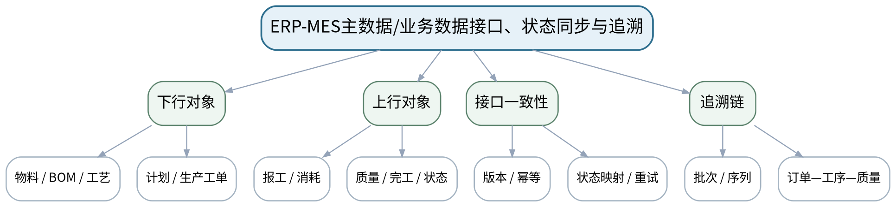

### 教学目标
**知识目标：**
1. 掌握ERP-MES常见主数据和业务数据对象、下行/上行方向及基本同步逻辑。
2. 理解接口幂等、版本、时间戳、状态映射、失败重试和一致性风险的基本概念。

**能力目标：**
1. 能够绘制物料/BOM/工艺/工单下行与报工/质量/消耗/完工上行的数据流。
2. 能够设计一个产品批次从订单到原料/工序/质量/成品的追溯链，并指出断链风险。

**价值目标：**
1. 形成权限边界、接口契约、数据一致性和跨系统审计意识。

### 课程思政
通过接口权限、审计和追溯链强调跨系统协作中的契约意识和数据责任。

### 专创融合
把接口对象、状态映射和追溯标识设计为可版本化契约，训练数字化平台集成产品思维。

### 教学重难点
**教学重点：**ERP-MES数据流、状态同步和端到端追溯。

**教学难点：**处理跨系统对象主责、状态映射和异常重试，避免重复/丢失/乱序导致业务不一致。

### 教学方法与用具
**教学方法：**业务场景法、案例分析法、表格推演法、问题驱动法、数据流/流程建模法、方案比较法、错误复盘法

**教学用具：**投影仪、ERP-MES数据流案例、接口对象模板、追溯链模板。

### 教学设计
课前任务 → 互动导入（10 min）→ 传授新知与课堂训练（75 min）→ 过关检测（10 min）→ 课堂小结（3 min）→ 作业布置（1 min）→ 考勤（1 min）

### 课前任务
【教师】发布“ERP-MES主数据/业务数据接口、状态同步与追溯”对应大纲/教材范围和一个最小制造业务案例，不提前给出完整结论。

1. 阅读对应大纲与教材内容；
2. 圈出3个关键术语并记录至少1个疑问；
3. 预读订单/BOM/库存/工艺/能力/工单/接口/KPI中的相关数据表，写出一个预期业务关系或计算结果。

【学生】完成准备并带着“业务关系预测/疑问/已有计算或流程证据”进入课堂。

### 互动导入
【教师】给出“ERP重试发送同一工单，MES因此创建两张工单”的案例，让学生判断需要何种接口标识和幂等规则。

【学生】先独立判断业务关系、流程或计算结果，再与同伴交换依据；教师收集典型分歧后进入本课。

### 传授新知与课堂训练
**一、业务概念与数据模型（约30 min）—接口对象**

【教师】建立ERP→MES主数据/工单下行和MES→ERP报工/质量/消耗/完工上行表，明确主责、触发时机和关键字段。

【学生】先独立完成流程、表格、计算或数据流推演并写出判断依据，再与同伴互核；需要电子表格/Python时仅作为计算辅助，不把软件操作本身作为课程目标。

**二、学生计算/流程/数据推演（约25 min）—一致性控制**

【教师】通过重复消息、乱序状态、接口超时案例讨论唯一标识、版本、状态映射、重试和人工补偿。

【学生】先独立完成流程、表格、计算或数据流推演并写出判断依据，再与同伴互核；需要电子表格/Python时仅作为计算辅助，不把软件操作本身作为课程目标。

**三、方案比较、校核与错误复盘（约20 min）—追溯设计**

【教师】学生用订单号、批次/序列号、工单、工序、物料批次、检验记录建立追溯链，并检查一处断链。

【学生】先独立完成流程、表格、计算或数据流推演并写出判断依据，再与同伴互核；需要电子表格/Python时仅作为计算辅助，不把软件操作本身作为课程目标。

**独立学习产物**：ERP-MES数据流图＋接口对象表＋追溯链。

**学习证据**：对象主责、方向、关键字段、状态映射、失败处理和端到端追溯路径。

**评价映射**：课程作业ERP-MES数据流与追溯（15%内部权重）阶段2＋期末考核；目标1.5、2.5、3.5。

### 过关检测
【教师】组织当堂检测：

1. 为什么接口重试可能导致重复工单？
2. 主数据和业务状态同步的频率是否应该完全一样？
3. 产品追溯链至少需要哪些关联标识？

【学生】独立作答/计算/绘图；【教师】按错误类型讲解，要求说明业务、数据、计算或流程依据。

### 课堂小结
【教师】回到本课知识脉络图，用“业务场景—对象/数据—计划/执行逻辑—校核/异常—管理判断”总结“ERP-MES主数据/业务数据接口、状态同步与追溯”，再次强调教学重点：ERP-MES数据流、状态同步和端到端追溯。

【学生】写下“本课一个关键业务规则 + 一个最容易造成错误决策的数据/边界”。

### 作业布置
【教师】布置课后任务：完成ERP-MES接口分析作业；预习APS/KPI需要哪些来自计划和执行层的数据。

【学生】按课程文件命名与证据要求整理流程图、计算表、数据流或方案说明；使用电子工具时需保留输入、规则和人工核验记录。

### 考勤
【教师】利用学校/课程实际使用的平台进行签到。

【学生】按课程要求完成签到。

### 课后教学反思
【课后填写，不预填事实】记录本次实际用时、“处理跨系统对象主责、状态映射和异常重试，避免重复/丢失/乱序导致业务不一致。”的真实掌握/错误，以及流程图、计算表、数据流/接口表、方案比较等评价证据完整性；仅依据真实课堂记录确定后续补救或拓展，不补写未发生事实。

### 本章节参考文献
[2] 王爱民.《制造执行系统（MES）原理与应用》[M]. 北京航空航天大学出版社，2021。
[3] 陈启申.《ERP——从内部集成起步（第3版）》[M]. 电子工业出版社，2022。

## 第14次课 ERP-MES集成数据到APS/KPI决策输入

### 课次信息
- **章节/单元**：第五→第六单元过渡
- **周次**：按实际课表填写
- **课时安排**：2课时（100 min）
- **课型**：理论
- **单元学时分配**：第五单元1课时＋第六单元1课时

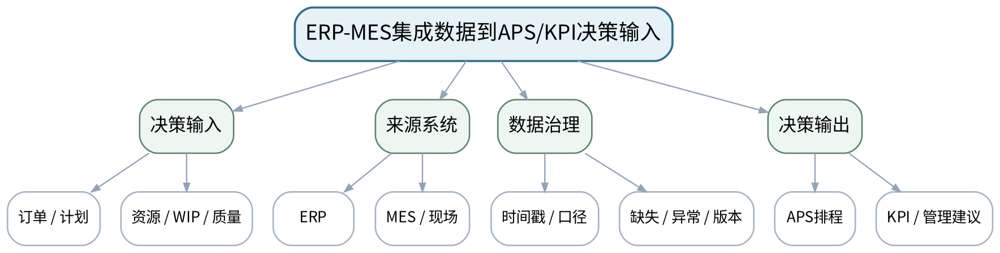

### 教学目标
**知识目标：**
1. 理解计划、工单、资源、质量和执行事实如何成为APS排程和KPI计算输入。
2. 理解数据时效性、口径、缺失/异常和权限对智能计划与绩效判断的影响。

**能力目标：**
1. 能够建立“业务问题—所需数据—来源系统—口径/刷新频率—质量检查”表。
2. 能够识别用错误时间窗、错误口径或缺失状态计算KPI/排程造成的决策风险。

**价值目标：**
1. 形成“算法之前先治理数据、指标之前先统一口径”的决策责任意识。

### 课程思政
强调智能决策不能把数据问题隐藏在算法之后，技术人员必须说明数据时效、口径和不确定性。

### 专创融合
把数据质量门控设计成APS/KPI服务的前置校验机制，训练智能制造数据产品的可靠性设计。

### 教学重难点
**教学重点：**ERP/MES集成数据作为APS和KPI决策输入。

**教学难点：**把数据口径、时效和质量前置到算法/指标讨论，避免“精确计算错误数据”。

### 教学方法与用具
**教学方法：**业务场景法、案例分析法、表格推演法、问题驱动法、数据流/流程建模法、方案比较法、错误复盘法

**教学用具：**投影仪、跨系统数据时间戳案例、数据质量检查表、白板。

### 教学设计
课前任务 → 互动导入（10 min）→ 传授新知与课堂训练（75 min）→ 过关检测（10 min）→ 课堂小结（3 min）→ 作业布置（1 min）→ 考勤（1 min）

### 课前任务
【教师】发布“ERP-MES集成数据到APS/KPI决策输入”对应大纲/教材范围和一个最小制造业务案例，不提前给出完整结论。

1. 阅读对应大纲与教材内容；
2. 圈出3个关键术语并记录至少1个疑问；
3. 预读订单/BOM/库存/工艺/能力/工单/接口/KPI中的相关数据表，写出一个预期业务关系或计算结果。

【学生】完成准备并带着“业务关系预测/疑问/已有计算或流程证据”进入课堂。

### 互动导入
【教师】展示“ERP库存为昨日日终、MES WIP为实时、产能日历未更新”却直接用于APS排程的案例，让学生指出至少三类数据时效风险。

【学生】先独立判断业务关系、流程或计算结果，再与同伴交换依据；教师收集典型分歧后进入本课。

### 传授新知与课堂训练
**一、业务概念与数据模型（约30 min）—集成收口**

【教师】回顾ERP-MES接口对象和追溯链，区分计划数据、执行事实、主数据和状态数据。

【学生】先独立完成流程、表格、计算或数据流推演并写出判断依据，再与同伴互核；需要电子表格/Python时仅作为计算辅助，不把软件操作本身作为课程目标。

**二、学生计算/流程/数据推演（约25 min）—决策数据准备**

【教师】面向APS与KPI建立数据需求表，讨论时间窗、刷新频率、单位口径、缺失/异常和版本。

【学生】先独立完成流程、表格、计算或数据流推演并写出判断依据，再与同伴互核；需要电子表格/Python时仅作为计算辅助，不把软件操作本身作为课程目标。

**三、方案比较、校核与错误复盘（约20 min）—风险评审**

【教师】学生对一组不同时间戳/口径的数据做“可用/需修正/不可用于决策”判定，并说明理由。

【学生】先独立完成流程、表格、计算或数据流推演并写出判断依据，再与同伴互核；需要电子表格/Python时仅作为计算辅助，不把软件操作本身作为课程目标。

**独立学习产物**：APS/KPI数据需求与质量检查表。

**学习证据**：数据项、来源系统、时间戳/频率、口径、质量检查和是否可用于决策的判断。

**评价映射**：课程作业ERP-MES数据流与追溯（15%内部权重）完成，并衔接KPI判断作业；目标1.5/2.5/3.5与1.6/2.6/3.6。

### 过关检测
【教师】组织当堂检测：

1. 为什么实时MES数据与日结ERP数据不能不加说明地直接拼接？
2. KPI口径不一致会造成什么管理问题？
3. APS优化前最少应做哪些数据质量检查？

【学生】独立作答/计算/绘图；【教师】按错误类型讲解，要求说明业务、数据、计算或流程依据。

### 课堂小结
【教师】回到本课知识脉络图，用“业务场景—对象/数据—计划/执行逻辑—校核/异常—管理判断”总结“ERP-MES集成数据到APS/KPI决策输入”，再次强调教学重点：ERP/MES集成数据作为APS和KPI决策输入。

【学生】写下“本课一个关键业务规则 + 一个最容易造成错误决策的数据/边界”。

### 作业布置
【教师】布置课后任务：整理ERP-MES数据流作业；准备一个计划方案，列出需要评价的交期、库存、WIP、利用率和质量指标。

【学生】按课程文件命名与证据要求整理流程图、计算表、数据流或方案说明；使用电子工具时需保留输入、规则和人工核验记录。

### 考勤
【教师】利用学校/课程实际使用的平台进行签到。

【学生】按课程要求完成签到。

### 课后教学反思
【课后填写，不预填事实】记录本次实际用时、“把数据口径、时效和质量前置到算法/指标讨论，避免“精确计算错误数据”。”的真实掌握/错误，以及流程图、计算表、数据流/接口表、方案比较等评价证据完整性；仅依据真实课堂记录确定后续补救或拓展，不补写未发生事实。

### 本章节参考文献
[2] 王爱民.《制造执行系统（MES）原理与应用》[M]. 北京航空航天大学出版社，2021。
[3] 陈启申.《ERP——从内部集成起步（第3版）》[M]. 电子工业出版社，2022。

## 第15次课 APS多约束排程与制造KPI评价

### 课次信息
- **章节/单元**：第六单元 智能计划、绩效与管理决策
- **周次**：按实际课表填写
- **课时安排**：2课时（100 min）
- **课型**：理论
- **单元学时分配**：理论2课时

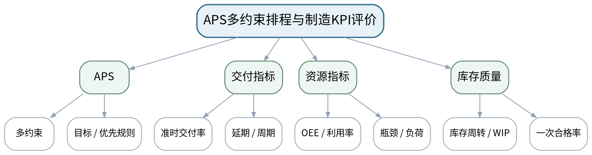

### 教学目标
**知识目标：**
1. 理解APS、多约束计划和优化排程的基本思想，认识约束、目标函数和启发式/优化结果的边界。
2. 掌握OEE、准时交付率、库存周转、WIP、一次合格率等常见指标的基本含义和相互影响。

**能力目标：**
1. 能够比较两个简化排程方案在交期、库存/WIP、利用率和质量风险上的差异。
2. 能够选择与业务问题匹配的KPI，并识别单指标优化带来的副作用。

**价值目标：**
1. 形成成本、效率、质量、交付和员工影响综合平衡的管理意识，不以单一KPI驱动不合理行为。

### 课程思政
通过单指标激励失真案例强调负责任绩效管理和对员工、质量、交付的综合责任。

### 专创融合
将APS约束、KPI和方案评价组成可解释决策支持原型，训练智能计划产品的指标设计能力。

### 教学重难点
**教学重点：**APS约束与制造KPI的多目标评价。

**教学难点：**避免把OEE/利用率等指标等同于最终经营目标，能解释指标间冲突和局限。

### 教学方法与用具
**教学方法：**业务场景法、案例分析法、表格推演法、问题驱动法、数据流/流程建模法、方案比较法、错误复盘法

**教学用具：**投影仪、APS简化排程案例、KPI数据表、方案评价矩阵。

### 教学设计
课前任务 → 互动导入（10 min）→ 传授新知与课堂训练（75 min）→ 过关检测（10 min）→ 课堂小结（3 min）→ 作业布置（1 min）→ 考勤（1 min）

### 课前任务
【教师】发布“APS多约束排程与制造KPI评价”对应大纲/教材范围和一个最小制造业务案例，不提前给出完整结论。

1. 阅读对应大纲与教材内容；
2. 圈出3个关键术语并记录至少1个疑问；
3. 预读订单/BOM/库存/工艺/能力/工单/接口/KPI中的相关数据表，写出一个预期业务关系或计算结果。

【学生】完成准备并带着“业务关系预测/疑问/已有计算或流程证据”进入课堂。

### 互动导入
【教师】给出方案A“高利用率但WIP高、交期波动”和方案B“利用率略低但准时交付高”的数据，让学生先判断哪一个更优以及还缺什么信息。

【学生】先独立判断业务关系、流程或计算结果，再与同伴交换依据；教师收集典型分歧后进入本课。

### 传授新知与课堂训练
**一、业务概念与数据模型（约30 min）—APS思想**

【教师】从人工优先规则扩展到多约束排程，解释订单、物料、能力、换型、设备状态、交期等约束与目标。

【学生】先独立完成流程、表格、计算或数据流推演并写出判断依据，再与同伴互核；需要电子表格/Python时仅作为计算辅助，不把软件操作本身作为课程目标。

**二、学生计算/流程/数据推演（约25 min）—KPI计算**

【教师】用简化数据计算/解释准时交付率、OEE、库存周转、WIP和一次合格率，强调指标口径和时间窗。

【学生】先独立完成流程、表格、计算或数据流推演并写出判断依据，再与同伴互核；需要电子表格/Python时仅作为计算辅助，不把软件操作本身作为课程目标。

**三、方案比较、校核与错误复盘（约20 min）—方案比较**

【教师】学生用多指标评分/权衡表比较两个排程方案，说明推荐方案、适用条件和可能副作用。

【学生】先独立完成流程、表格、计算或数据流推演并写出判断依据，再与同伴互核；需要电子表格/Python时仅作为计算辅助，不把软件操作本身作为课程目标。

**独立学习产物**：双方案APS/KPI比较表＋管理建议。

**学习证据**：约束清单、关键KPI、计算口径、方案差异、推荐理由和至少一条指标副作用。

**评价映射**：课程作业KPI与管理判断（10%内部权重）阶段1＋期末考核；目标1.6、2.6、3.6。

### 过关检测
【教师】组织当堂检测：

1. APS与简单优先规则的核心区别是什么？
2. OEE提高是否一定提高准时交付率？
3. 为什么KPI必须同时说明口径和时间窗？

【学生】独立作答/计算/绘图；【教师】按错误类型讲解，要求说明业务、数据、计算或流程依据。

### 课堂小结
【教师】回到本课知识脉络图，用“业务场景—对象/数据—计划/执行逻辑—校核/异常—管理判断”总结“APS多约束排程与制造KPI评价”，再次强调教学重点：APS约束与制造KPI的多目标评价。

【学生】写下“本课一个关键业务规则 + 一个最容易造成错误决策的数据/边界”。

### 作业布置
【教师】布置课后任务：完善方案比较表，并补充成本/经济性和员工/合规影响，为期末综合业务分析报告准备。

【学生】按课程文件命名与证据要求整理流程图、计算表、数据流或方案说明；使用电子工具时需保留输入、规则和人工核验记录。

### 考勤
【教师】利用学校/课程实际使用的平台进行签到。

【学生】按课程要求完成签到。

### 课后教学反思
【课后填写，不预填事实】记录本次实际用时、“避免把OEE/利用率等指标等同于最终经营目标，能解释指标间冲突和局限。”的真实掌握/错误，以及流程图、计算表、数据流/接口表、方案比较等评价证据完整性；仅依据真实课堂记录确定后续补救或拓展，不补写未发生事实。

### 本章节参考文献
[1] 刘晓冰, 赵希男.《生产计划与控制（第2版）》[M]. 清华大学出版社，2022。
[2] 王爱民.《制造执行系统（MES）原理与应用》[M]. 北京航空航天大学出版社，2021。

## 第16次课 成本经济决策、可视化看板与MES/ERP综合方案评审

### 课次信息
- **章节/单元**：第六单元 智能计划、绩效与管理决策
- **周次**：按实际课表填写
- **课时安排**：2课时（100 min）
- **课型**：理论
- **单元学时分配**：理论2课时

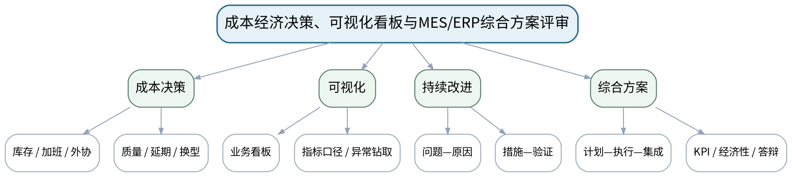

### 教学目标
**知识目标：**
1. 理解库存、加班、外协、换型、停机、质量和延期等成本因素，以及可视化看板与持续改进的基本逻辑。
2. 理解期末MES/ERP综合业务分析报告应覆盖业务流程、计划与能力、MES执行追溯、ERP-MES集成、KPI/经济性和个人核验。

**能力目标：**
1. 能够对综合制造案例形成端到端MES/ERP方案并用交付、库存、WIP、资源、质量和成本证据评价。
2. 能够独立解释方案假设、数据来源、系统边界和改进建议，并针对指定数据变更现场修正部分计算/流程。

**价值目标：**
1. 形成经济决策、合规、数据诚信、协作责任和持续改进意识，对采用的数字化方案和管理建议承担解释责任。

### 课程思政
通过成本、员工影响、权限、数据诚信和可追溯性强化负责任数字化决策，反对只追求“漂亮指标”。

### 专创融合
将综合方案视作制造数字化咨询/产品方案原型，训练需求分析、数据设计、流程编排、指标与经济性论证能力。

### 教学重难点
**教学重点：**成本/KPI综合评价、可视化与端到端MES/ERP方案评审。

**教学难点：**在不同系统、数据和指标间保持一致的业务逻辑，并明确假设、成本、人员与合规边界。

### 教学方法与用具
**教学方法：**业务场景法、案例分析法、表格推演法、问题驱动法、数据流/流程建模法、方案比较法、错误复盘法

**教学用具：**投影仪、综合制造案例包、业务流程/数据流模板、KPI/成本评审表。

### 教学设计
课前任务 → 互动导入（10 min）→ 传授新知与课堂训练（75 min）→ 过关检测（10 min）→ 课堂小结（3 min）→ 作业布置（1 min）→ 考勤（1 min）

### 课前任务
【教师】发布“成本经济决策、可视化看板与MES/ERP综合方案评审”对应大纲/教材范围和一个最小制造业务案例，不提前给出完整结论。

1. 阅读对应大纲与教材内容；
2. 圈出3个关键术语并记录至少1个疑问；
3. 预读订单/BOM/库存/工艺/能力/工单/接口/KPI中的相关数据表，写出一个预期业务关系或计算结果。

【学生】完成准备并带着“业务关系预测/疑问/已有计算或流程证据”进入课堂。

### 互动导入
【教师】展示一个“通过大量加班实现100%准时交付”的方案，让学生判断如果只看OTD为什么可能得出错误管理结论。

【学生】先独立判断业务关系、流程或计算结果，再与同伴交换依据；教师收集典型分歧后进入本课。

### 传授新知与课堂训练
**一、业务概念与数据模型（约30 min）—经济性与看板**

【教师】梳理库存、加班、外协、换型、质量、停机和延期成本，讨论看板应从异常和决策问题出发而非堆叠图表。

【学生】先独立完成流程、表格、计算或数据流推演并写出判断依据，再与同伴互核；需要电子表格/Python时仅作为计算辅助，不把软件操作本身作为课程目标。

**二、学生计算/流程/数据推演（约25 min）—综合方案串联**

【教师】把订单/MPS/MRP、能力/排程、工单/WIP/质量、MES、ERP-MES接口、追溯、APS/KPI串成端到端方案。

【学生】先独立完成流程、表格、计算或数据流推演并写出判断依据，再与同伴互核；需要电子表格/Python时仅作为计算辅助，不把软件操作本身作为课程目标。

**三、方案比较、校核与错误复盘（约20 min）—方案评审与个人核验**

【教师】学生用评审清单交叉检查业务边界、计算、数据流、KPI和经济性，并模拟回答“若订单/能力/库存改变如何调整方案”。

【学生】先独立完成流程、表格、计算或数据流推演并写出判断依据，再与同伴互核；需要电子表格/Python时仅作为计算辅助，不把软件操作本身作为课程目标。

**独立学习产物**：MES/ERP综合业务分析报告框架＋个人答辩核验清单。

**学习证据**：端到端业务图、MPS/MRP与能力摘要、MES执行/追溯、ERP-MES数据流、KPI/成本比较、假设与改进记录。

**评价映射**：课程作业KPI与管理判断（10%内部权重）完成＋期末考核60%核心准备；全部课程目标。

### 过关检测
【教师】组织当堂检测：

1. 为什么准时交付率不能脱离成本和质量单独评价？
2. 一个合格的MES/ERP综合方案必须说明哪些系统边界？
3. 个人核验为什么需要现场修改/指定计算，而不是只做团队汇报？

【学生】独立作答/计算/绘图；【教师】按错误类型讲解，要求说明业务、数据、计算或流程依据。

### 课堂小结
【教师】回到本课知识脉络图，用“业务场景—对象/数据—计划/执行逻辑—校核/异常—管理判断”总结“成本经济决策、可视化看板与MES/ERP综合方案评审”，再次强调教学重点：成本/KPI综合评价、可视化与端到端MES/ERP方案评审。

【学生】写下“本课一个关键业务规则 + 一个最容易造成错误决策的数据/边界”。

### 作业布置
【教师】布置课后任务：按期末要求完成综合业务分析报告和个人准备；所有数据、流程、计算与引用应可追溯并标明假设。

【学生】按课程文件命名与证据要求整理流程图、计算表、数据流或方案说明；使用电子工具时需保留输入、规则和人工核验记录。

### 考勤
【教师】利用学校/课程实际使用的平台进行签到。

【学生】按课程要求完成签到。

### 课后教学反思
【课后填写，不预填事实】记录本次实际用时、“在不同系统、数据和指标间保持一致的业务逻辑，并明确假设、成本、人员与合规边界。”的真实掌握/错误，以及流程图、计算表、数据流/接口表、方案比较等评价证据完整性；仅依据真实课堂记录确定后续补救或拓展，不补写未发生事实。

### 本章节参考文献
[1] 刘晓冰, 赵希男.《生产计划与控制（第2版）》[M]. 清华大学出版社，2022。
[2] 王爱民.《制造执行系统（MES）原理与应用》[M]. 北京航空航天大学出版社，2021。
[3] 陈启申.《ERP——从内部集成起步（第3版）》[M]. 电子工业出版社，2022。
