# 机器人技术与应用（A）教案（28次课）

> **Canonical Markdown / 内容权威源**：本文件与 `images/`、`manifest.json` 共同构成课程教案内容主源；Word 仅由此编译。

## 教案封面信息
- **学院**：机械与动力工程学院
- **专业（教研室）**：智能制造工程
- **课程名称**：机器人技术与应用（A）
- **主讲教师**：（按实际填写）
- **职称**：（按实际填写）
- **授课学期**：第5学期
- **授课专业**：智能制造工程
- **编制日期**：（按实际填写）

## 课程基本信息
- **课程代码**：25JD31403
- **课程名称（中文）**：机器人技术与应用（A）
- **课程名称（英文）**：Robotics Technology and Applications (A)
- **课程类别**：专业类；课程性质：必修；授课语言：中文
- **授课学期**：第5学期；学分：3.5
- **课程学时及分配**：总学时56；理论24；实验8；上机16；项目式8
- **适用专业**：智能制造工程
- **教材**：周晓敏, 郑莉芳, 刘鸿飞. 机器人学基础[M]. 北京：清华大学出版社，2023. ISBN 9787302635888
- **授课学院**：机械与动力工程学院
- **先修课程**：线性代数（A）、工程力学（A）、机械设计基础、微机原理及接口技术、工程建模与科学计算可视化基础（Python）
- **后续课程**：机械控制工程、人工智能技术与应用、先进装备系统设计与开发（ROS）、毕业设计（论文）
- **考核类型**：考试课
- **考核形式**：期末考核由综合项目和期末考试共同构成；期末考核内部综合项目占42%、期末考试占58%；期末考试具体形式按课程组及学校考试安排执行。
- **考核方式**：平时成绩、课程作业（实验与上机成果为主要证据）、综合项目、期末考试
- **总评成绩比例**：总评成绩 = 平时成绩×20% + 课程作业×20% + 期末考核×60%

### 课程简介

课程基本定位：本课程是智能制造工程专业核心必修课，承接线性代数、工程力学、机械设计、微机接口与Python科学计算基础，面向机器人系统的建模、分析、仿真与应用。课程不再从Python语法起步，也不提前展开后续ROS节点通信与系统工程，而是构建“机器人体系与空间数学—串联机器人正逆运动学—雅可比/轨迹/动力学与控制—轮式移动机器人—足式/轮足机器人—感知、规划、应用与安全”的连续主线。

核心学习结果：学生能够建立二维/三维刚体位姿和串联机器人D-H或等价模型，完成正逆运动学、雅可比、工作空间与奇异性分析；能够理解动力学方程并完成轨迹/基础控制仿真；能够建立差速/自行车/全向移动模型并完成里程计、规划或跟踪；能够从支撑、接触和多指标角度分析足式/轮足机器人；能够以Python代码、实验数据、图表、测试和项目证据说明机器人系统行为及边界。

学情分析：学生已完成Python科学计算及基础机器人小任务，具备线性代数、工程力学、机械设计与微机接口基础。本课程直接使用NumPy、SciPy、Matplotlib、SpatialMath和Robotics Toolbox for Python开展机器人学计算，不重复Python基础语法；实验优先使用现有机器人平台，无硬件时采用可复现实验数据或等价数字模型。

主要教学方法：采用“原理短讲—公式/模型推导—Python实现—仿真可视化—实验验证—工程复盘”，理论、实验、上机和项目式环节均要求产生可检查的模型、代码、数据、测试、图表或设计文档；所有机器人实验和真实设备操作坚持低速、限位、碰撞/急停与人工确认等安全边界。

## 28次课教学设计

## 第01次课 机器人体系、构型谱系、性能指标与系统安全

- **章节/单元**：第一单元 机器人体系与空间数学
- **周次**：按实际课表填写
- **课时安排**：2课时（100 min）
- **课型**：理论

### 知识脉络图

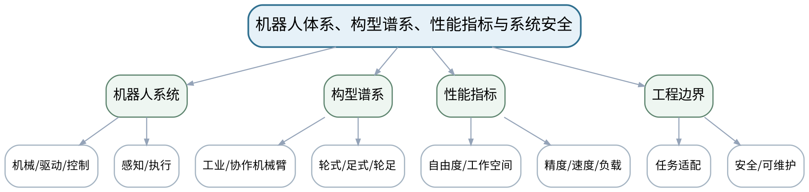

### 教学目标

**知识目标：**
- （1）理解机器人定义、组成、自由度与典型性能指标。
- （2）掌握工业、协作、轮式、足式、轮足式及无人系统的基本构型差异。
**能力目标：**
- （1）能够依据任务、工作空间、负载、精度、速度和安全要求比较机器人构型。
**价值目标：**
- （1）形成需求驱动、指标可测和安全优先的机器人系统观。

### 课程思政

结合我国机器人产业和智能制造应用，强调自主创新必须建立在标准、验证和安全责任之上。

### 专创融合 / 双创融合

把构型选型表视为机器人产品需求定义的起点，训练从“产品展示”转向“指标—场景—验证”决策。

### 教学重难点

教学重点：机器人构成、构型与性能指标之间的关系。
教学难点：避免用“新颖/智能”替代可测指标，能够说明构型选择的工程依据。

### 教学方法

问题引导法、模型推导法、案例分析法、Python/仿真教师演示、同伴互评、证据复盘

### 教学用具

电脑、投影仪、多媒体课件、教材、构型案例图、性能指标表。

### 教学设计

课前任务 → 互动导入（15 min）→ 传授新知与课堂训练（70 min）→ 过关检测（10 min）→ 课堂小结（3 min）→ 作业布置（1 min）→ 考勤（1 min）

### 教学过程

#### 课前任务

【教师】发布“机器人体系、构型谱系、性能指标与系统安全”预习/准备要求和一个最小问题，不提前给出完整答案。
- 1. 阅读大纲对应内容与指定教材/资料，圈出3个核心术语；
- 2. 预读一张结构图、公式或案例，写出第一判断。
- 3. 记录至少1个疑问或风险点。
【学生】完成准备并带着问题进入课堂。

**设计意图：** 通过课前阅读、环境/安全检查和最小问题建立先备认知，让学生带着真实问题进入课堂。

#### 互动导入与传授新知 / 课堂训练

【互动导入 15 min】
【教师】并列展示六轴工业机械臂、协作机械臂、AMR、四足与轮足机器人，要求学生只根据任务约束而非外观选择方案。
【学生】先独立预测/判断/操作，再交换依据，不先听完整结论。

【传授新知与课堂训练 70 min】
**一、核心原理与结构讲解（约25 min）—构型与组成**

【教师】从机械结构、驱动、控制、感知和末端执行器建立机器人系统组成；用制造、物流和巡检案例区分构型。

【学生】按任务约束完成分析/实现，保存中间结果并说明判断依据；教师只提示定位方法、边界与验收条件，不代替学生完成核心产物。

**二、模型/案例推演与学生分析（约25 min）—指标与任务**

【教师】解释自由度、工作空间、精度、重复定位精度、速度、负载等指标，讨论指标之间的权衡。

【学生】按任务约束完成分析/实现，保存中间结果并说明判断依据；教师只提示定位方法、边界与验收条件，不代替学生完成核心产物。

**三、独立产出、互审与证据复盘（约20 min）—安全与边界**

【教师】学生完成“任务—构型—关键指标—风险”比较表，分析人机协作、碰撞、急停和运行区域边界。

【学生】按任务约束完成分析/实现，保存中间结果并说明判断依据；教师只提示定位方法、边界与验收条件，不代替学生完成核心产物。

【课堂产物】机器人构型选型表 + 系统组成框图。

【学习证据】选型表、指标依据、风险清单及一次错误选型修正记录。

【评价关联】平时成绩；目标1.1、2.1、3.1。

**设计意图：** 采用“先预测/操作 → 最小讲解/示范 → 独立产出 → 测试/互审 → 证据固化”的闭环，使机器人学模型、算法和实验结论都有可复核证据。

#### 过关检测

【教师】组织当堂检测：
- 1. 机器人“自由度”与“关节数”一定相等吗？
- 2. 工业机械臂和协作机械臂的选择为什么不能只看负载？
- 3. 构型选型至少需要哪些可测指标？
【学生】独立作答/运行/数据判断；【教师】依据错误类型进行针对性讲解并要求说明判断依据。

**设计意图：** 用概念、模型、边界和运行/数据验证即时检测关键知识，暴露易错点。

#### 课堂小结

【教师】回到知识脉络图，用“概念—模型—关系—应用—边界”总结“机器人体系、构型谱系、性能指标与系统安全”，再次强调：机器人构成、构型与性能指标之间的关系。
【学生】写下本课最重要的一条规则和一个最容易出错的边界。

**设计意图：** 压缩本课信息并把规则、边界与后续任务连接。

#### 作业布置

【教师】布置课后任务：选择一个智能制造任务，比较两种机器人构型并用不少于4个指标说明取舍。
【学生】按课程文件命名和证据规范整理提交。

**设计意图：** 固化课堂产物，形成可复查、可复现的过程证据。

#### 考勤

【教师】利用学校/课程实际使用的平台进行签到。
【学生】按课程要求完成签到。

**设计意图：** 保留学校模板考勤环节，不在教案中预填出勤事实。

### 课后教学反思

【课后填写，不预填事实】
- 1. 教学流程：记录100 min各环节实际用时及需调整的位置；
- 2. 教学内容：重点记录“避免用“新颖/智能”替代可测指标，能够说明构型选择的工程依据。”的真实掌握证据与常见错误；
- 3. 学生参与：仅依据实际课堂记录填写独立分析、实验、编码、互审或项目协作情况，不补写推测；
- 4. 评价证据：检查本课课堂产物/代码/实验数据/测试/项目记录是否完整，记录缺项及原因；
- 5. 后续改进：依据真实课堂证据确定下一轮调整。

### 本章节参考文献

[1] 周晓敏, 郑莉芳, 刘鸿飞. 机器人学基础[M]. 北京：清华大学出版社，2023. ISBN 9787302635888
[3] 赵建伟, 马学品, 盖逸馨, 毛向军, 梅勇, 钱航, 姚志广. 机器人系统设计及其应用技术（第2版）[M]. 北京：清华大学出版社，2024. ISBN 9787302676577

## 第02次课 刚体位姿、旋转表示与齐次变换

- **章节/单元**：第一单元 机器人体系与空间数学
- **周次**：按实际课表填写
- **课时安排**：2课时（100 min）
- **课型**：理论

### 知识脉络图

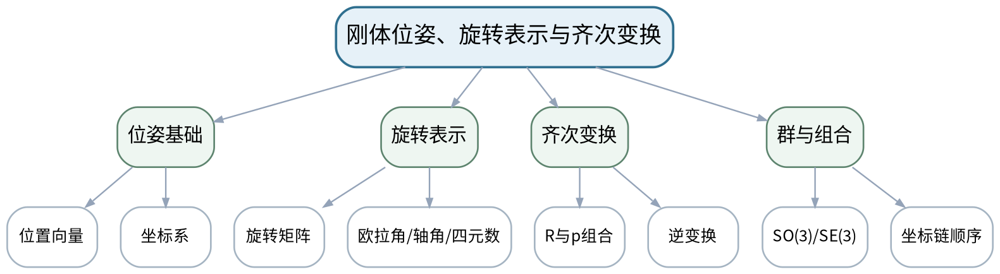

### 教学目标

**知识目标：**
- （1）掌握位置向量、旋转矩阵、齐次变换和坐标系链。
- （2）理解欧拉角、轴角、四元数及SO(3)/SE(3)的表示意义。
**能力目标：**
- （1）能够手工并用Python思路验证坐标变换和位姿组合顺序。
**价值目标：**
- （1）形成坐标系、单位、方向和乘法顺序可追溯的严谨习惯。

### 课程思政

强调工程坐标、单位和参数不能靠界面“看起来对”，必须记录约定并独立校验。

### 专创融合 / 双创融合

把坐标变换封装为机器人软件中可测试的基础模块，为后续机械臂和移动机器人算法复用。

### 教学重难点

教学重点：旋转矩阵、齐次变换和多种姿态表示的联系。
教学难点：主动/被动变换、左右乘与坐标系方向容易混淆；欧拉角奇异性需要结合几何解释。

### 教学方法

问题引导法、模型推导法、案例分析法、Python/仿真教师演示、同伴互评、证据复盘

### 教学用具

电脑、投影仪、白板/坐标系模型、Python/SpatialMath教师演示。

### 教学设计

课前任务 → 互动导入（15 min）→ 传授新知与课堂训练（70 min）→ 过关检测（10 min）→ 课堂小结（3 min）→ 作业布置（1 min）→ 考勤（1 min）

### 教学过程

#### 课前任务

【教师】发布“刚体位姿、旋转表示与齐次变换”预习/准备要求和一个最小问题，不提前给出完整答案。
- 1. 阅读大纲对应内容与指定教材/资料，圈出3个核心术语；
- 2. 预读一张结构图、公式或案例，写出第一判断。
- 3. 记录至少1个疑问或风险点。
【学生】完成准备并带着问题进入课堂。

**设计意图：** 通过课前阅读、环境/安全检查和最小问题建立先备认知，让学生带着真实问题进入课堂。

#### 互动导入与传授新知 / 课堂训练

【互动导入 15 min】
【教师】给出同一个末端位姿的“XYZ欧拉角”和四元数表示，提问为什么数值完全不同却可以描述同一姿态。
【学生】先独立预测/判断/操作，再交换依据，不先听完整结论。

【传授新知与课堂训练 70 min】
**一、核心原理与结构讲解（约25 min）—坐标与旋转**

【教师】用平面旋转过渡到三维旋转矩阵，检查正交性和行列式；明确坐标系命名。

【学生】按任务约束完成分析/实现，保存中间结果并说明判断依据；教师只提示定位方法、边界与验收条件，不代替学生完成核心产物。

**二、模型/案例推演与学生分析（约25 min）—姿态表示与奇异**

【教师】比较欧拉角、轴角、四元数的参数数量、约束和奇异问题，不把表示方式混同于物理姿态。

【学生】按任务约束完成分析/实现，保存中间结果并说明判断依据；教师只提示定位方法、边界与验收条件，不代替学生完成核心产物。

**三、独立产出、互审与证据复盘（约20 min）—齐次变换链**

【教师】学生依据基座—工件—工具三个坐标系推演变换链，并用逆变换检查闭环一致性。

【学生】按任务约束完成分析/实现，保存中间结果并说明判断依据；教师只提示定位方法、边界与验收条件，不代替学生完成核心产物。

【课堂产物】一页位姿表示对照表 + 三坐标系变换链计算。

【学习证据】手算矩阵、变换链图、逆变换校验及一条顺序错误修正记录。

【评价关联】平时成绩、课程作业；目标1.1、2.1、3.1。

**设计意图：** 采用“先预测/操作 → 最小讲解/示范 → 独立产出 → 测试/互审 → 证据固化”的闭环，使机器人学模型、算法和实验结论都有可复核证据。

#### 过关检测

【教师】组织当堂检测：
- 1. 旋转矩阵需要满足哪些基本约束？
- 2. 齐次变换矩阵的最后一行是什么？
- 3. 欧拉角出现奇异时物理姿态是否消失？
【学生】独立作答/运行/数据判断；【教师】依据错误类型进行针对性讲解并要求说明判断依据。

**设计意图：** 用概念、模型、边界和运行/数据验证即时检测关键知识，暴露易错点。

#### 课堂小结

【教师】回到知识脉络图，用“概念—模型—关系—应用—边界”总结“刚体位姿、旋转表示与齐次变换”，再次强调：旋转矩阵、齐次变换和多种姿态表示的联系。
【学生】写下本课最重要的一条规则和一个最容易出错的边界。

**设计意图：** 压缩本课信息并把规则、边界与后续任务连接。

#### 作业布置

【教师】布置课后任务：完成一个基座—工具—工件坐标链计算，并写出两种独立校验方法。
【学生】按课程文件命名和证据规范整理提交。

**设计意图：** 固化课堂产物，形成可复查、可复现的过程证据。

#### 考勤

【教师】利用学校/课程实际使用的平台进行签到。
【学生】按课程要求完成签到。

**设计意图：** 保留学校模板考勤环节，不在教案中预填出勤事实。

### 课后教学反思

【课后填写，不预填事实】
- 1. 教学流程：记录100 min各环节实际用时及需调整的位置；
- 2. 教学内容：重点记录“主动/被动变换、左右乘与坐标系方向容易混淆；欧拉角奇异性需要结合几何解释。”的真实掌握证据与常见错误；
- 3. 学生参与：仅依据实际课堂记录填写独立分析、实验、编码、互审或项目协作情况，不补写推测；
- 4. 评价证据：检查本课课堂产物/代码/实验数据/测试/项目记录是否完整，记录缺项及原因；
- 5. 后续改进：依据真实课堂证据确定下一轮调整。

### 本章节参考文献

[1] 周晓敏, 郑莉芳, 刘鸿飞. 机器人学基础[M]. 北京：清华大学出版社，2023. ISBN 9787302635888
[2] Corke, P. Robotics, Vision and Control: Fundamental Algorithms in Python（3rd Edition）[M]. Cham: Springer, 2023. ISBN 9783031064685

## 第03次课 连杆关节、D-H参数与串联机器人模型

- **章节/单元**：第二单元 串联机器人正逆运动学
- **周次**：按实际课表填写
- **课时安排**：2课时（100 min）
- **课型**：理论

### 知识脉络图

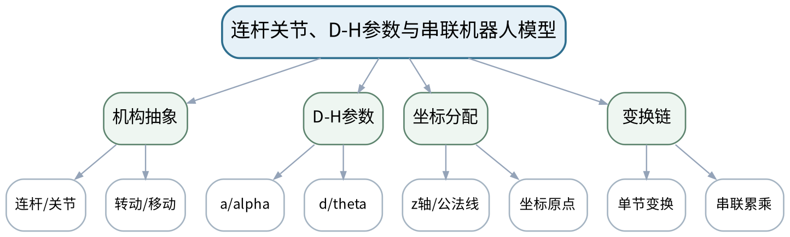

### 教学目标

**知识目标：**
- （1）掌握转动/移动关节、连杆坐标系与D-H参数定义。
- （2）理解D-H变换链和等价刚体树/指数积建模思想。
**能力目标：**
- （1）能够为2R/3R、SCARA或简化六轴机构建立参数表与变换链。
**价值目标：**
- （1）形成模型参数来源、坐标定义和机械结构一致性的建模责任意识。

### 课程思政

通过“坐标与参数错误会导致实体设备动作错误”强调建模规范与工程安全。

### 专创融合 / 双创融合

将D-H模型视为数字机器人资产的一部分，讨论标准化参数表对仿真、离线编程和设备交付的价值。

### 教学重难点

教学重点：D-H坐标系分配与参数表。
教学难点：同一机构可能有不同但等价的坐标选择；参数符号和坐标定义必须自洽。

### 教学方法

问题引导法、模型推导法、案例分析法、Python/仿真教师演示、同伴互评、证据复盘

### 教学用具

电脑、投影仪、机械臂结构图/模型、教材、矩阵计算工具。

### 教学设计

课前任务 → 互动导入（15 min）→ 传授新知与课堂训练（70 min）→ 过关检测（10 min）→ 课堂小结（3 min）→ 作业布置（1 min）→ 考勤（1 min）

### 教学过程

#### 课前任务

【教师】发布“连杆关节、D-H参数与串联机器人模型”预习/准备要求和一个最小问题，不提前给出完整答案。
- 1. 阅读大纲对应内容与指定教材/资料，圈出3个核心术语；
- 2. 预读一张结构图、公式或案例，写出第一判断。
- 3. 记录至少1个疑问或风险点。
【学生】完成准备并带着问题进入课堂。

**设计意图：** 通过课前阅读、环境/安全检查和最小问题建立先备认知，让学生带着真实问题进入课堂。

#### 互动导入与传授新知 / 课堂训练

【互动导入 15 min】
【教师】给出同一2R机械臂的两份D-H表，其中一份坐标系定义不清，要求学生先判断“参数表能否脱离坐标图独立成立”。
【学生】先独立预测/判断/操作，再交换依据，不先听完整结论。

【传授新知与课堂训练 70 min】
**一、核心原理与结构讲解（约25 min）—机构到模型**

【教师】从实际关节轴和连杆几何抽象关节变量与固定参数，说明为什么模型要保留坐标图。

【学生】按任务约束完成分析/实现，保存中间结果并说明判断依据；教师只提示定位方法、边界与验收条件，不代替学生完成核心产物。

**二、模型/案例推演与学生分析（约25 min）—D-H规则**

【教师】按关节轴、公法线和参数含义逐步建立D-H表；比较标准D-H与等价建模表达的边界。

【学生】按任务约束完成分析/实现，保存中间结果并说明判断依据；教师只提示定位方法、边界与验收条件，不代替学生完成核心产物。

**三、独立产出、互审与证据复盘（约20 min）—课堂建模**

【教师】学生为SCARA或3R机械臂绘坐标系、填写参数表、写出单节变换矩阵，并互审坐标与参数一致性。

【学生】按任务约束完成分析/实现，保存中间结果并说明判断依据；教师只提示定位方法、边界与验收条件，不代替学生完成核心产物。

【课堂产物】一份完整D-H坐标图 + 参数表 + 变换链草稿。

【学习证据】坐标图、参数表、互审记录及至少1条参数来源说明。

【评价关联】平时成绩、课程作业；目标1.2、2.2、3.2。

**设计意图：** 采用“先预测/操作 → 最小讲解/示范 → 独立产出 → 测试/互审 → 证据固化”的闭环，使机器人学模型、算法和实验结论都有可复核证据。

#### 过关检测

【教师】组织当堂检测：
- 1. D-H中的a和d分别沿哪一类轴定义？
- 2. 为什么参数表必须配坐标系图？
- 3. 两个不同D-H表是否可能描述同一机构？
【学生】独立作答/运行/数据判断；【教师】依据错误类型进行针对性讲解并要求说明判断依据。

**设计意图：** 用概念、模型、边界和运行/数据验证即时检测关键知识，暴露易错点。

#### 课堂小结

【教师】回到知识脉络图，用“概念—模型—关系—应用—边界”总结“连杆关节、D-H参数与串联机器人模型”，再次强调：D-H坐标系分配与参数表。
【学生】写下本课最重要的一条规则和一个最容易出错的边界。

**设计意图：** 压缩本课信息并把规则、边界与后续任务连接。

#### 作业布置

【教师】布置课后任务：完成一个3R或SCARA的D-H表，并标注每个参数来自机构的哪一个几何量。
【学生】按课程文件命名和证据规范整理提交。

**设计意图：** 固化课堂产物，形成可复查、可复现的过程证据。

#### 考勤

【教师】利用学校/课程实际使用的平台进行签到。
【学生】按课程要求完成签到。

**设计意图：** 保留学校模板考勤环节，不在教案中预填出勤事实。

### 课后教学反思

【课后填写，不预填事实】
- 1. 教学流程：记录100 min各环节实际用时及需调整的位置；
- 2. 教学内容：重点记录“同一机构可能有不同但等价的坐标选择；参数符号和坐标定义必须自洽。”的真实掌握证据与常见错误；
- 3. 学生参与：仅依据实际课堂记录填写独立分析、实验、编码、互审或项目协作情况，不补写推测；
- 4. 评价证据：检查本课课堂产物/代码/实验数据/测试/项目记录是否完整，记录缺项及原因；
- 5. 后续改进：依据真实课堂证据确定下一轮调整。

### 本章节参考文献

[1] 周晓敏, 郑莉芳, 刘鸿飞. 机器人学基础[M]. 北京：清华大学出版社，2023. ISBN 9787302635888
[2] Corke, P. Robotics, Vision and Control: Fundamental Algorithms in Python（3rd Edition）[M]. Cham: Springer, 2023. ISBN 9783031064685

## 第04次课 正运动学、工作空间与模型独立验证

- **章节/单元**：第二单元 串联机器人正逆运动学
- **周次**：按实际课表填写
- **课时安排**：2课时（100 min）
- **课型**：理论

### 知识脉络图

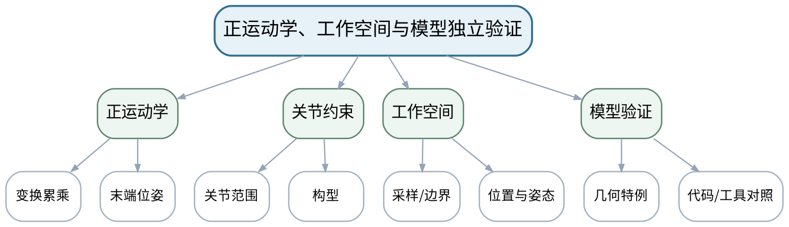

### 教学目标

**知识目标：**
- （1）掌握串联机器人正运动学与末端位姿计算。
- （2）理解工作空间、关节限位和模型误差的基本关系。
**能力目标：**
- （1）能够由关节变量求末端位姿，并用数值/几何方法独立校验。
- （2）能够解释工作空间图不能替代可达性和姿态约束分析。
**价值目标：**
- （1）形成“模型结果必须至少一种独立验证”的实证习惯。

### 课程思政

强调模型、工具和视觉展示都不能替代独立验证，工程结论应有可复核证据。

### 专创融合 / 双创融合

把模型验证清单作为机器人仿真/数字样机的最小验收规范。

### 教学重难点

教学重点：正运动学计算与工作空间含义。
教学难点：动画看起来合理不等于模型正确；工作空间的定义受关节限位、姿态和碰撞条件影响。

### 教学方法

问题引导法、模型推导法、案例分析法、Python/仿真教师演示、同伴互评、证据复盘

### 教学用具

电脑、投影仪、教材、Python/Robotics Toolbox教师演示。

### 教学设计

课前任务 → 互动导入（15 min）→ 传授新知与课堂训练（70 min）→ 过关检测（10 min）→ 课堂小结（3 min）→ 作业布置（1 min）→ 考勤（1 min）

### 教学过程

#### 课前任务

【教师】发布“正运动学、工作空间与模型独立验证”预习/准备要求和一个最小问题，不提前给出完整答案。
- 1. 阅读大纲对应内容与指定教材/资料，圈出3个核心术语；
- 2. 预读一张结构图、公式或案例，写出第一判断。
- 3. 记录至少1个疑问或风险点。
【学生】完成准备并带着问题进入课堂。

**设计意图：** 通过课前阅读、环境/安全检查和最小问题建立先备认知，让学生带着真实问题进入课堂。

#### 互动导入与传授新知 / 课堂训练

【互动导入 15 min】
【教师】教师给出一段“动画正常但坐标单位错了1000倍”的例子，要求学生说明为什么视觉效果可能掩盖模型错误。
【学生】先独立预测/判断/操作，再交换依据，不先听完整结论。

【传授新知与课堂训练 70 min】
**一、核心原理与结构讲解（约25 min）—正运动学**

【教师】从D-H单节变换得到总变换，解释末端位置和姿态的提取。

【学生】按任务约束完成分析/实现，保存中间结果并说明判断依据；教师只提示定位方法、边界与验收条件，不代替学生完成核心产物。

**二、模型/案例推演与学生分析（约25 min）—工作空间**

【教师】比较解析边界与蒙特卡罗采样思路，说明关节限位和姿态要求如何改变可达区域。

【学生】按任务约束完成分析/实现，保存中间结果并说明判断依据；教师只提示定位方法、边界与验收条件，不代替学生完成核心产物。

**三、独立产出、互审与证据复盘（约20 min）—独立校验**

【教师】学生用零位/对称位形几何特例检查模型，并设计“手算—自编函数—工具箱”三方互证流程。

【学生】按任务约束完成分析/实现，保存中间结果并说明判断依据；教师只提示定位方法、边界与验收条件，不代替学生完成核心产物。

【课堂产物】正运动学计算单 + 工作空间验证方案。

【学习证据】变换矩阵、特例校验、工作空间样例和误差解释。

【评价关联】平时成绩、课程作业；目标1.2、2.2、3.2。

**设计意图：** 采用“先预测/操作 → 最小讲解/示范 → 独立产出 → 测试/互审 → 证据固化”的闭环，使机器人学模型、算法和实验结论都有可复核证据。

#### 过关检测

【教师】组织当堂检测：
- 1. 正运动学的输入与输出分别是什么？
- 2. 工作空间采样点越多是否一定越“正确”？
- 3. 如何设计一个不依赖工具箱的正运动学校验？
【学生】独立作答/运行/数据判断；【教师】依据错误类型进行针对性讲解并要求说明判断依据。

**设计意图：** 用概念、模型、边界和运行/数据验证即时检测关键知识，暴露易错点。

#### 课堂小结

【教师】回到知识脉络图，用“概念—模型—关系—应用—边界”总结“正运动学、工作空间与模型独立验证”，再次强调：正运动学计算与工作空间含义。
【学生】写下本课最重要的一条规则和一个最容易出错的边界。

**设计意图：** 压缩本课信息并把规则、边界与后续任务连接。

#### 作业布置

【教师】布置课后任务：选择两个关节构型，分别用解析/代码思路计算末端位姿并说明误差来源。
【学生】按课程文件命名和证据规范整理提交。

**设计意图：** 固化课堂产物，形成可复查、可复现的过程证据。

#### 考勤

【教师】利用学校/课程实际使用的平台进行签到。
【学生】按课程要求完成签到。

**设计意图：** 保留学校模板考勤环节，不在教案中预填出勤事实。

### 课后教学反思

【课后填写，不预填事实】
- 1. 教学流程：记录100 min各环节实际用时及需调整的位置；
- 2. 教学内容：重点记录“动画看起来合理不等于模型正确；工作空间的定义受关节限位、姿态和碰撞条件影响。”的真实掌握证据与常见错误；
- 3. 学生参与：仅依据实际课堂记录填写独立分析、实验、编码、互审或项目协作情况，不补写推测；
- 4. 评价证据：检查本课课堂产物/代码/实验数据/测试/项目记录是否完整，记录缺项及原因；
- 5. 后续改进：依据真实课堂证据确定下一轮调整。

### 本章节参考文献

[1] 周晓敏, 郑莉芳, 刘鸿飞. 机器人学基础[M]. 北京：清华大学出版社，2023. ISBN 9787302635888
[2] Corke, P. Robotics, Vision and Control: Fundamental Algorithms in Python（3rd Edition）[M]. Cham: Springer, 2023. ISBN 9783031064685

## 第05次课 逆运动学、多解、不可达与关节限位

- **章节/单元**：第二单元 串联机器人正逆运动学
- **周次**：按实际课表填写
- **课时安排**：2课时（100 min）
- **课型**：理论

### 知识脉络图

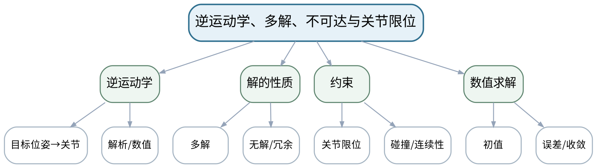

### 教学目标

**知识目标：**
- （1）掌握逆运动学问题定义，理解解析解和数值解。
- （2）理解多解、无解、关节限位、初值和构型选择。
**能力目标：**
- （1）能够判断目标位姿是否可达，并依据限位/连续性/碰撞等条件筛选解。
**价值目标：**
- （1）形成“数学有解不等于工程可用”的安全与约束意识。

### 课程思政

通过不可达和限位案例强调机器人软件必须尊重机械边界并提供安全失败路径。

### 专创融合 / 双创融合

将“候选解+约束筛选”视为智能作业规划的核心服务接口。

### 教学重难点

教学重点：逆运动学解的性质与工程筛选。
教学难点：数值算法返回解后仍需检查限位、残差和安全边界；不同初值可能收敛到不同构型。

### 教学方法

问题引导法、模型推导法、案例分析法、Python/仿真教师演示、同伴互评、证据复盘

### 教学用具

电脑、投影仪、2R/六轴案例、Python/工具箱教师演示。

### 教学设计

课前任务 → 互动导入（15 min）→ 传授新知与课堂训练（70 min）→ 过关检测（10 min）→ 课堂小结（3 min）→ 作业布置（1 min）→ 考勤（1 min）

### 教学过程

#### 课前任务

【教师】发布“逆运动学、多解、不可达与关节限位”预习/准备要求和一个最小问题，不提前给出完整答案。
- 1. 阅读大纲对应内容与指定教材/资料，圈出3个核心术语；
- 2. 预读一张结构图、公式或案例，写出第一判断。
- 3. 记录至少1个疑问或风险点。
【学生】完成准备并带着问题进入课堂。

**设计意图：** 通过课前阅读、环境/安全检查和最小问题建立先备认知，让学生带着真实问题进入课堂。

#### 互动导入与传授新知 / 课堂训练

【互动导入 15 min】
【教师】给出六轴机械臂到达同一末端位姿的“肘上/肘下”两种构型，要求学生解释为什么系统必须选择而不能只说“求到了一个解”。
【学生】先独立预测/判断/操作，再交换依据，不先听完整结论。

【传授新知与课堂训练 70 min】
**一、核心原理与结构讲解（约25 min）—逆问题结构**

【教师】从2R几何解析说明多解与不可达，再过渡到一般数值IK。

【学生】按任务约束完成分析/实现，保存中间结果并说明判断依据；教师只提示定位方法、边界与验收条件，不代替学生完成核心产物。

**二、模型/案例推演与学生分析（约25 min）—约束筛选**

【教师】加入关节限位、姿态、碰撞和连续运动约束，比较“最小残差”与“工程可用”。

【学生】按任务约束完成分析/实现，保存中间结果并说明判断依据；教师只提示定位方法、边界与验收条件，不代替学生完成核心产物。

**三、独立产出、互审与证据复盘（约20 min）—案例评审**

【教师】学生分析3个目标：可达多解、不可达、接近限位，给出判定与安全处理策略。

【学生】按任务约束完成分析/实现，保存中间结果并说明判断依据；教师只提示定位方法、边界与验收条件，不代替学生完成核心产物。

【课堂产物】逆运动学解筛选表 + 三类目标判定记录。

【学习证据】目标位姿、候选解、残差/限位检查及选择理由。

【评价关联】平时成绩、课程作业；目标1.2、2.2、3.2。

**设计意图：** 采用“先预测/操作 → 最小讲解/示范 → 独立产出 → 测试/互审 → 证据固化”的闭环，使机器人学模型、算法和实验结论都有可复核证据。

#### 过关检测

【教师】组织当堂检测：
- 1. 逆运动学为什么可能多解？
- 2. 数值IK收敛是否代表工程可执行？
- 3. 不可达目标最合理的系统响应是什么？
【学生】独立作答/运行/数据判断；【教师】依据错误类型进行针对性讲解并要求说明判断依据。

**设计意图：** 用概念、模型、边界和运行/数据验证即时检测关键知识，暴露易错点。

#### 课堂小结

【教师】回到知识脉络图，用“概念—模型—关系—应用—边界”总结“逆运动学、多解、不可达与关节限位”，再次强调：逆运动学解的性质与工程筛选。
【学生】写下本课最重要的一条规则和一个最容易出错的边界。

**设计意图：** 压缩本课信息并把规则、边界与后续任务连接。

#### 作业布置

【教师】布置课后任务：构造一组多解和一组不可达目标，写出筛选/拒绝规则。
【学生】按课程文件命名和证据规范整理提交。

**设计意图：** 固化课堂产物，形成可复查、可复现的过程证据。

#### 考勤

【教师】利用学校/课程实际使用的平台进行签到。
【学生】按课程要求完成签到。

**设计意图：** 保留学校模板考勤环节，不在教案中预填出勤事实。

### 课后教学反思

【课后填写，不预填事实】
- 1. 教学流程：记录100 min各环节实际用时及需调整的位置；
- 2. 教学内容：重点记录“数值算法返回解后仍需检查限位、残差和安全边界；不同初值可能收敛到不同构型。”的真实掌握证据与常见错误；
- 3. 学生参与：仅依据实际课堂记录填写独立分析、实验、编码、互审或项目协作情况，不补写推测；
- 4. 评价证据：检查本课课堂产物/代码/实验数据/测试/项目记录是否完整，记录缺项及原因；
- 5. 后续改进：依据真实课堂证据确定下一轮调整。

### 本章节参考文献

[1] 周晓敏, 郑莉芳, 刘鸿飞. 机器人学基础[M]. 北京：清华大学出版社，2023. ISBN 9787302635888
[2] Corke, P. Robotics, Vision and Control: Fundamental Algorithms in Python（3rd Edition）[M]. Cham: Springer, 2023. ISBN 9783031064685

## 第06次课 雅可比、速度/力映射与奇异性

- **章节/单元**：第三单元 雅可比、轨迹、动力学与控制基础
- **周次**：按实际课表填写
- **课时安排**：2课时（100 min）
- **课型**：理论

### 知识脉络图

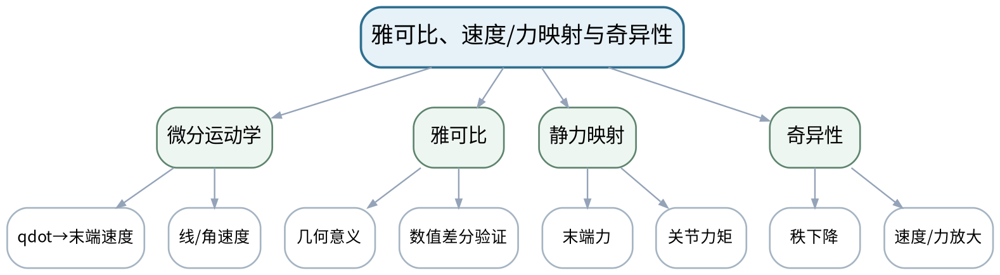

### 教学目标

**知识目标：**
- （1）掌握雅可比矩阵的速度映射意义，理解静力/力矩映射。
- （2）理解奇异位形、秩和可操作性变化。
**能力目标：**
- （1）能够用数值差分验证雅可比，并分析接近奇异时速度/力矩放大现象。
**价值目标：**
- （1）形成奇异性预警和不以单一数值结果做安全结论的意识。

### 课程思政

结合奇异性导致速度/力矩风险，强调算法设计必须考虑设备极限和人员安全。

### 专创融合 / 双创融合

把奇异性指标作为离线规划和作业可行性评价的一部分，而不是异常发生后再处理。

### 教学重难点

教学重点：雅可比的物理意义和奇异性。
教学难点：抽象矩阵秩与机器人实际失去运动能力之间的对应，以及接近奇异时数值不稳定。

### 教学方法

问题引导法、模型推导法、案例分析法、Python/仿真教师演示、同伴互评、证据复盘

### 教学用具

电脑、投影仪、教材、Python/NumPy教师演示。

### 教学设计

课前任务 → 互动导入（15 min）→ 传授新知与课堂训练（70 min）→ 过关检测（10 min）→ 课堂小结（3 min）→ 作业布置（1 min）→ 考勤（1 min）

### 教学过程

#### 课前任务

【教师】发布“雅可比、速度/力映射与奇异性”预习/准备要求和一个最小问题，不提前给出完整答案。
- 1. 阅读大纲对应内容与指定教材/资料，圈出3个核心术语；
- 2. 预读一张结构图、公式或案例，写出第一判断。
- 3. 记录至少1个疑问或风险点。
【学生】完成准备并带着问题进入课堂。

**设计意图：** 通过课前阅读、环境/安全检查和最小问题建立先备认知，让学生带着真实问题进入课堂。

#### 互动导入与传授新知 / 课堂训练

【互动导入 15 min】
【教师】展示一个机械臂末端速度命令很小、但某关节速度急剧增大的曲线，要求学生判断是控制器坏了还是构型问题。
【学生】先独立预测/判断/操作，再交换依据，不先听完整结论。

【传授新知与课堂训练 70 min】
**一、核心原理与结构讲解（约25 min）—雅可比来源**

【教师】从微小关节变化到末端速度建立映射，并用数值差分验证列向量含义。

【学生】按任务约束完成分析/实现，保存中间结果并说明判断依据；教师只提示定位方法、边界与验收条件，不代替学生完成核心产物。

**二、模型/案例推演与学生分析（约25 min）—力与静力**

【教师】说明J与转置在末端力—关节力矩关系中的作用，联系负载与姿态。

【学生】按任务约束完成分析/实现，保存中间结果并说明判断依据；教师只提示定位方法、边界与验收条件，不代替学生完成核心产物。

**三、独立产出、互审与证据复盘（约20 min）—奇异分析**

【教师】学生对2R伸直位形分析秩和可运动方向，讨论阻尼伪逆/避奇异只作概念说明。

【学生】按任务约束完成分析/实现，保存中间结果并说明判断依据；教师只提示定位方法、边界与验收条件，不代替学生完成核心产物。

【课堂产物】雅可比验证表 + 奇异位形分析图。

【学习证据】解析/工具雅可比、数值差分误差、奇异前后速度或条件变化记录。

【评价关联】平时成绩、课程作业、期末考试；目标1.3、2.3、3.3。

**设计意图：** 采用“先预测/操作 → 最小讲解/示范 → 独立产出 → 测试/互审 → 证据固化”的闭环，使机器人学模型、算法和实验结论都有可复核证据。

#### 过关检测

【教师】组织当堂检测：
- 1. 雅可比把哪两个速度空间联系起来？
- 2. 数值差分如何验证雅可比？
- 3. 奇异位形意味着机器人完全不能运动吗？
【学生】独立作答/运行/数据判断；【教师】依据错误类型进行针对性讲解并要求说明判断依据。

**设计意图：** 用概念、模型、边界和运行/数据验证即时检测关键知识，暴露易错点。

#### 课堂小结

【教师】回到知识脉络图，用“概念—模型—关系—应用—边界”总结“雅可比、速度/力映射与奇异性”，再次强调：雅可比的物理意义和奇异性。
【学生】写下本课最重要的一条规则和一个最容易出错的边界。

**设计意图：** 压缩本课信息并把规则、边界与后续任务连接。

#### 作业布置

【教师】布置课后任务：选择一个2R/3R构型，计算或查得雅可比，设计一个数值差分验证。
【学生】按课程文件命名和证据规范整理提交。

**设计意图：** 固化课堂产物，形成可复查、可复现的过程证据。

#### 考勤

【教师】利用学校/课程实际使用的平台进行签到。
【学生】按课程要求完成签到。

**设计意图：** 保留学校模板考勤环节，不在教案中预填出勤事实。

### 课后教学反思

【课后填写，不预填事实】
- 1. 教学流程：记录100 min各环节实际用时及需调整的位置；
- 2. 教学内容：重点记录“抽象矩阵秩与机器人实际失去运动能力之间的对应，以及接近奇异时数值不稳定。”的真实掌握证据与常见错误；
- 3. 学生参与：仅依据实际课堂记录填写独立分析、实验、编码、互审或项目协作情况，不补写推测；
- 4. 评价证据：检查本课课堂产物/代码/实验数据/测试/项目记录是否完整，记录缺项及原因；
- 5. 后续改进：依据真实课堂证据确定下一轮调整。

### 本章节参考文献

[1] 周晓敏, 郑莉芳, 刘鸿飞. 机器人学基础[M]. 北京：清华大学出版社，2023. ISBN 9787302635888
[2] Corke, P. Robotics, Vision and Control: Fundamental Algorithms in Python（3rd Edition）[M]. Cham: Springer, 2023. ISBN 9783031064685

## 第07次课 关节空间与笛卡儿空间轨迹规划

- **章节/单元**：第三单元 雅可比、轨迹、动力学与控制基础
- **周次**：按实际课表填写
- **课时安排**：2课时（100 min）
- **课型**：理论

### 知识脉络图

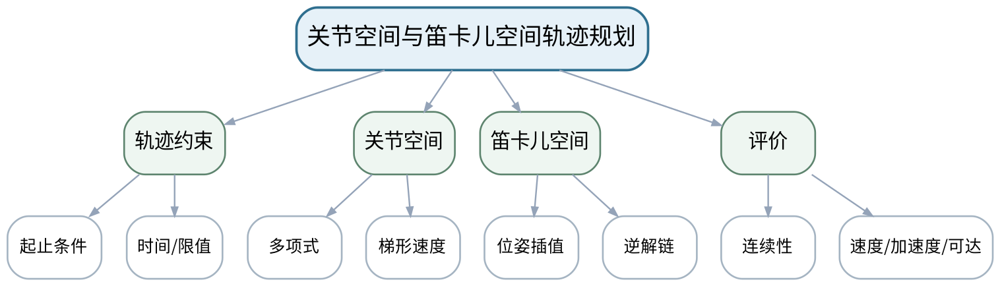

### 教学目标

**知识目标：**
- （1）掌握梯形速度、三次/五次多项式等关节轨迹基本思想。
- （2）理解关节空间与笛卡儿空间轨迹、位置/速度/加速度连续性。
**能力目标：**
- （1）能够依据任务要求比较轨迹方法，并读懂位置、速度和加速度曲线。
**价值目标：**
- （1）形成同时关注平滑性、时间、约束和可执行性的轨迹评价意识。

### 课程思政

强调平滑轨迹不仅是性能问题，也关系冲击、磨损和人员安全。

### 专创融合 / 双创融合

将轨迹参数和验收指标视为机器人节拍优化与工艺调试的可配置产品参数。

### 教学重难点

教学重点：轨迹边界条件与连续性。
教学难点：路径几何与时间参数化不同；末端直线轨迹可能导致关节速度不连续或逆解跳变。

### 教学方法

问题引导法、模型推导法、案例分析法、Python/仿真教师演示、同伴互评、证据复盘

### 教学用具

电脑、投影仪、轨迹曲线、Python/Matplotlib教师演示。

### 教学设计

课前任务 → 互动导入（15 min）→ 传授新知与课堂训练（70 min）→ 过关检测（10 min）→ 课堂小结（3 min）→ 作业布置（1 min）→ 考勤（1 min）

### 教学过程

#### 课前任务

【教师】发布“关节空间与笛卡儿空间轨迹规划”预习/准备要求和一个最小问题，不提前给出完整答案。
- 1. 阅读大纲对应内容与指定教材/资料，圈出3个核心术语；
- 2. 预读一张结构图、公式或案例，写出第一判断。
- 3. 记录至少1个疑问或风险点。
【学生】完成准备并带着问题进入课堂。

**设计意图：** 通过课前阅读、环境/安全检查和最小问题建立先备认知，让学生带着真实问题进入课堂。

#### 互动导入与传授新知 / 课堂训练

【互动导入 15 min】
【教师】对比两条都“到达终点”的轨迹：一条位置连续但加速度突变，一条平滑，要求学生判断真实机器人上可能出现什么后果。
【学生】先独立预测/判断/操作，再交换依据，不先听完整结论。

【传授新知与课堂训练 70 min】
**一、核心原理与结构讲解（约25 min）—边界与时间**

【教师】从起止位置、速度、加速度条件建立轨迹参数，解释时间尺度对速度/加速度的影响。

【学生】按任务约束完成分析/实现，保存中间结果并说明判断依据；教师只提示定位方法、边界与验收条件，不代替学生完成核心产物。

**二、模型/案例推演与学生分析（约25 min）—轨迹类型**

【教师】比较关节空间与笛卡儿空间规划，讨论直线末端路径与关节约束之间的冲突。

【学生】按任务约束完成分析/实现，保存中间结果并说明判断依据；教师只提示定位方法、边界与验收条件，不代替学生完成核心产物。

**三、独立产出、互审与证据复盘（约20 min）—曲线评价**

【教师】学生根据三组曲线识别不连续、超速和时间过短问题，给出修改策略。

【学生】按任务约束完成分析/实现，保存中间结果并说明判断依据；教师只提示定位方法、边界与验收条件，不代替学生完成核心产物。

【课堂产物】轨迹方法对照表 + 三组曲线诊断。

【学习证据】边界条件、曲线诊断、方法选择理由和一条修正建议。

【评价关联】平时成绩、课程作业、期末考试；目标1.3、2.3、3.3。

**设计意图：** 采用“先预测/操作 → 最小讲解/示范 → 独立产出 → 测试/互审 → 证据固化”的闭环，使机器人学模型、算法和实验结论都有可复核证据。

#### 过关检测

【教师】组织当堂检测：
- 1. 轨迹与路径有什么区别？
- 2. 五次多项式相比三次可额外约束什么？
- 3. 末端直线轨迹为什么可能造成关节层问题？
【学生】独立作答/运行/数据判断；【教师】依据错误类型进行针对性讲解并要求说明判断依据。

**设计意图：** 用概念、模型、边界和运行/数据验证即时检测关键知识，暴露易错点。

#### 课堂小结

【教师】回到知识脉络图，用“概念—模型—关系—应用—边界”总结“关节空间与笛卡儿空间轨迹规划”，再次强调：轨迹边界条件与连续性。
【学生】写下本课最重要的一条规则和一个最容易出错的边界。

**设计意图：** 压缩本课信息并把规则、边界与后续任务连接。

#### 作业布置

【教师】布置课后任务：为一个机械臂点到点任务选择轨迹方法，并列出速度、加速度和可达性验收条件。
【学生】按课程文件命名和证据规范整理提交。

**设计意图：** 固化课堂产物，形成可复查、可复现的过程证据。

#### 考勤

【教师】利用学校/课程实际使用的平台进行签到。
【学生】按课程要求完成签到。

**设计意图：** 保留学校模板考勤环节，不在教案中预填出勤事实。

### 课后教学反思

【课后填写，不预填事实】
- 1. 教学流程：记录100 min各环节实际用时及需调整的位置；
- 2. 教学内容：重点记录“路径几何与时间参数化不同；末端直线轨迹可能导致关节速度不连续或逆解跳变。”的真实掌握证据与常见错误；
- 3. 学生参与：仅依据实际课堂记录填写独立分析、实验、编码、互审或项目协作情况，不补写推测；
- 4. 评价证据：检查本课课堂产物/代码/实验数据/测试/项目记录是否完整，记录缺项及原因；
- 5. 后续改进：依据真实课堂证据确定下一轮调整。

### 本章节参考文献

[1] 周晓敏, 郑莉芳, 刘鸿飞. 机器人学基础[M]. 北京：清华大学出版社，2023. ISBN 9787302635888
[2] Corke, P. Robotics, Vision and Control: Fundamental Algorithms in Python（3rd Edition）[M]. Cham: Springer, 2023. ISBN 9783031064685

## 第08次课 机器人动力学方程、负载与基础关节控制

- **章节/单元**：第三单元 雅可比、轨迹、动力学与控制基础
- **周次**：按实际课表填写
- **课时安排**：2课时（100 min）
- **课型**：理论

### 知识脉络图

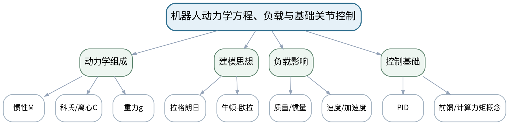

### 教学目标

**知识目标：**
- （1）理解M(q)q̈+C(q,q̇)q̇+g(q)=τ各项物理意义。
- （2）了解拉格朗日法、牛顿—欧拉法和PID/前馈/计算力矩控制概念。
**能力目标：**
- （1）能够依据轨迹和模型参数解释关节力矩、负载和控制误差曲线。
**价值目标：**
- （1）形成物理机理、参数来源和控制结果相互核验的实证意识。

### 课程思政

强调调参必须小步、留证据并尊重速度/力矩/温升等设备限值。

### 专创融合 / 双创融合

将动力学与控制评价转化为机器人节拍、负载能力和能耗优化的工程指标。

### 教学重难点

教学重点：动力学标准形式及各项物理意义。
教学难点：不能把控制曲线“跟上了”直接等同于模型正确；参数、饱和和离散时间都会影响结果。

### 教学方法

问题引导法、模型推导法、案例分析法、Python/仿真教师演示、同伴互评、证据复盘

### 教学用具

电脑、投影仪、动力学方程、Python曲线/工具箱教师演示。

### 教学设计

课前任务 → 互动导入（15 min）→ 传授新知与课堂训练（70 min）→ 过关检测（10 min）→ 课堂小结（3 min）→ 作业布置（1 min）→ 考勤（1 min）

### 教学过程

#### 课前任务

【教师】发布“机器人动力学方程、负载与基础关节控制”预习/准备要求和一个最小问题，不提前给出完整答案。
- 1. 阅读大纲对应内容与指定教材/资料，圈出3个核心术语；
- 2. 预读一张结构图、公式或案例，写出第一判断。
- 3. 记录至少1个疑问或风险点。
【学生】完成准备并带着问题进入课堂。

**设计意图：** 通过课前阅读、环境/安全检查和最小问题建立先备认知，让学生带着真实问题进入课堂。

#### 互动导入与传授新知 / 课堂训练

【互动导入 15 min】
【教师】展示同一轨迹在“空载”和“末端加负载”下关节力矩曲线，要求学生先说明差异来自哪些物理项。
【学生】先独立预测/判断/操作，再交换依据，不先听完整结论。

【传授新知与课堂训练 70 min】
**一、核心原理与结构讲解（约25 min）—动力学结构**

【教师】不展开冗长符号推导，重点建立惯性、科氏/离心、重力和外负载的物理解释。

【学生】按任务约束完成分析/实现，保存中间结果并说明判断依据；教师只提示定位方法、边界与验收条件，不代替学生完成核心产物。

**二、模型/案例推演与学生分析（约25 min）—控制闭环**

【教师】用关节PID和前馈示意说明参考轨迹—误差—控制输入—机器人响应关系，认识饱和/采样影响。

【学生】按任务约束完成分析/实现，保存中间结果并说明判断依据；教师只提示定位方法、边界与验收条件，不代替学生完成核心产物。

**三、独立产出、互审与证据复盘（约20 min）—曲线诊断**

【教师】学生对负载变化、时间缩短、参数偏差三组曲线分析力矩/误差变化，并说明可验证假设。

【学生】按任务约束完成分析/实现，保存中间结果并说明判断依据；教师只提示定位方法、边界与验收条件，不代替学生完成核心产物。

【课堂产物】动力学各项物理解释表 + 控制曲线诊断记录。

【学习证据】参数假设、曲线、误差/控制输入比较和边界说明。

【评价关联】平时成绩、课程作业、期末考试；目标1.3、2.3、3.3。

**设计意图：** 采用“先预测/操作 → 最小讲解/示范 → 独立产出 → 测试/互审 → 证据固化”的闭环，使机器人学模型、算法和实验结论都有可复核证据。

#### 过关检测

【教师】组织当堂检测：
- 1. 动力学方程中g(q)代表什么？
- 2. 为什么把轨迹时间缩短通常会提高力矩需求？
- 3. 误差很小是否说明控制输入一定安全？
【学生】独立作答/运行/数据判断；【教师】依据错误类型进行针对性讲解并要求说明判断依据。

**设计意图：** 用概念、模型、边界和运行/数据验证即时检测关键知识，暴露易错点。

#### 课堂小结

【教师】回到知识脉络图，用“概念—模型—关系—应用—边界”总结“机器人动力学方程、负载与基础关节控制”，再次强调：动力学标准形式及各项物理意义。
【学生】写下本课最重要的一条规则和一个最容易出错的边界。

**设计意图：** 压缩本课信息并把规则、边界与后续任务连接。

#### 作业布置

【教师】布置课后任务：选一个参数变化（负载/轨迹时间/重力方向），预测其对力矩和跟踪误差的影响，并给出验证方案。
【学生】按课程文件命名和证据规范整理提交。

**设计意图：** 固化课堂产物，形成可复查、可复现的过程证据。

#### 考勤

【教师】利用学校/课程实际使用的平台进行签到。
【学生】按课程要求完成签到。

**设计意图：** 保留学校模板考勤环节，不在教案中预填出勤事实。

### 课后教学反思

【课后填写，不预填事实】
- 1. 教学流程：记录100 min各环节实际用时及需调整的位置；
- 2. 教学内容：重点记录“不能把控制曲线“跟上了”直接等同于模型正确；参数、饱和和离散时间都会影响结果。”的真实掌握证据与常见错误；
- 3. 学生参与：仅依据实际课堂记录填写独立分析、实验、编码、互审或项目协作情况，不补写推测；
- 4. 评价证据：检查本课课堂产物/代码/实验数据/测试/项目记录是否完整，记录缺项及原因；
- 5. 后续改进：依据真实课堂证据确定下一轮调整。

### 本章节参考文献

[1] 周晓敏, 郑莉芳, 刘鸿飞. 机器人学基础[M]. 北京：清华大学出版社，2023. ISBN 9787302635888
[2] Corke, P. Robotics, Vision and Control: Fundamental Algorithms in Python（3rd Edition）[M]. Cham: Springer, 2023. ISBN 9783031064685

## 第09次课 轮式移动模型、非完整约束与里程计

- **章节/单元**：第四单元 轮式移动机器人
- **周次**：按实际课表填写
- **课时安排**：2课时（100 min）
- **课型**：理论

### 知识脉络图

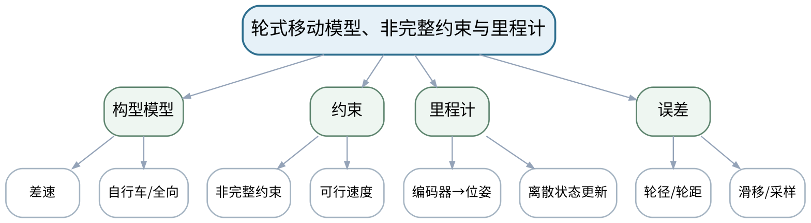

### 教学目标

**知识目标：**
- （1）掌握差速、独轮/自行车和全向轮模型的基本状态方程。
- （2）理解非完整约束、编码器里程计和轮径/轮距误差。
**能力目标：**
- （1）能够建立差速移动机器人状态更新模型并分析累积误差。
**价值目标：**
- （1）形成对定位不确定性、参数标定和人机混行安全的认识。

### 课程思政

以AGV/AMR人员混行场景强调定位误差必须进入速度限制、急停和人工接管策略。

### 专创融合 / 双创融合

将里程计和标定视为移动机器人部署的基础服务，讨论可复现标定流程的产品价值。

### 教学重难点

教学重点：差速状态更新和非完整约束。
教学难点：里程计误差会累积，短时轨迹合理不代表长期定位可信。

### 教学方法

问题引导法、模型推导法、案例分析法、Python/仿真教师演示、同伴互评、证据复盘

### 教学用具

电脑、投影仪、移动机器人模型、Python轨迹教师演示。

### 教学设计

课前任务 → 互动导入（15 min）→ 传授新知与课堂训练（70 min）→ 过关检测（10 min）→ 课堂小结（3 min）→ 作业布置（1 min）→ 考勤（1 min）

### 教学过程

#### 课前任务

【教师】发布“轮式移动模型、非完整约束与里程计”预习/准备要求和一个最小问题，不提前给出完整答案。
- 1. 阅读大纲对应内容与指定教材/资料，圈出3个核心术语；
- 2. 预读一张结构图、公式或案例，写出第一判断。
- 3. 记录至少1个疑问或风险点。
【学生】完成准备并带着问题进入课堂。

**设计意图：** 通过课前阅读、环境/安全检查和最小问题建立先备认知，让学生带着真实问题进入课堂。

#### 互动导入与传授新知 / 课堂训练

【互动导入 15 min】
【教师】给出小车绕一圈后没有回到原点的真实/仿真轨迹，要求学生判断是“算法错”还是“参数/滑移/采样”问题。
【学生】先独立预测/判断/操作，再交换依据，不先听完整结论。

【传授新知与课堂训练 70 min】
**一、核心原理与结构讲解（约25 min）—移动模型**

【教师】由轮速到线速度/角速度建立差速模型，并比较自行车/全向构型的约束差异。

【学生】按任务约束完成分析/实现，保存中间结果并说明判断依据；教师只提示定位方法、边界与验收条件，不代替学生完成核心产物。

**二、模型/案例推演与学生分析（约25 min）—里程计**

【教师】从编码器增量更新位姿，说明采样和坐标系；引入轮径/轮距标定。

【学生】按任务约束完成分析/实现，保存中间结果并说明判断依据；教师只提示定位方法、边界与验收条件，不代替学生完成核心产物。

**三、独立产出、互审与证据复盘（约20 min）—误差分析**

【教师】学生推演轮径偏大、左右轮不一致、滑移三种情况下轨迹误差方向。

【学生】按任务约束完成分析/实现，保存中间结果并说明判断依据；教师只提示定位方法、边界与验收条件，不代替学生完成核心产物。

【课堂产物】差速模型方程 + 里程计误差因果表。

【学习证据】状态更新推导、误差方向预测和参数标定建议。

【评价关联】平时成绩、课程作业、期末考试；目标1.4、2.4、3.4。

**设计意图：** 采用“先预测/操作 → 最小讲解/示范 → 独立产出 → 测试/互审 → 证据固化”的闭环，使机器人学模型、算法和实验结论都有可复核证据。

#### 过关检测

【教师】组织当堂检测：
- 1. 非完整约束直观上限制了什么运动？
- 2. 里程计为什么会累积漂移？
- 3. 左右轮径误差会怎样影响直线路径？
【学生】独立作答/运行/数据判断；【教师】依据错误类型进行针对性讲解并要求说明判断依据。

**设计意图：** 用概念、模型、边界和运行/数据验证即时检测关键知识，暴露易错点。

#### 课堂小结

【教师】回到知识脉络图，用“概念—模型—关系—应用—边界”总结“轮式移动模型、非完整约束与里程计”，再次强调：差速状态更新和非完整约束。
【学生】写下本课最重要的一条规则和一个最容易出错的边界。

**设计意图：** 压缩本课信息并把规则、边界与后续任务连接。

#### 作业布置

【教师】布置课后任务：完成一个差速机器人三步状态更新，并说明轮径/轮距各自影响。
【学生】按课程文件命名和证据规范整理提交。

**设计意图：** 固化课堂产物，形成可复查、可复现的过程证据。

#### 考勤

【教师】利用学校/课程实际使用的平台进行签到。
【学生】按课程要求完成签到。

**设计意图：** 保留学校模板考勤环节，不在教案中预填出勤事实。

### 课后教学反思

【课后填写，不预填事实】
- 1. 教学流程：记录100 min各环节实际用时及需调整的位置；
- 2. 教学内容：重点记录“里程计误差会累积，短时轨迹合理不代表长期定位可信。”的真实掌握证据与常见错误；
- 3. 学生参与：仅依据实际课堂记录填写独立分析、实验、编码、互审或项目协作情况，不补写推测；
- 4. 评价证据：检查本课课堂产物/代码/实验数据/测试/项目记录是否完整，记录缺项及原因；
- 5. 后续改进：依据真实课堂证据确定下一轮调整。

### 本章节参考文献

[1] 周晓敏, 郑莉芳, 刘鸿飞. 机器人学基础[M]. 北京：清华大学出版社，2023. ISBN 9787302635888
[4] 仉新, 矫健, 付垚. 移动机器人原理与应用[M]. 北京：清华大学出版社，2025. ISBN 9787302704478
[2] Corke, P. Robotics, Vision and Control: Fundamental Algorithms in Python（3rd Edition）[M]. Cham: Springer, 2023. ISBN 9783031064685

## 第10次课 路径规划、轨迹跟踪与AGV/AMR任务评价

- **章节/单元**：第四单元 轮式移动机器人
- **周次**：按实际课表填写
- **课时安排**：2课时（100 min）
- **课型**：理论

### 知识脉络图

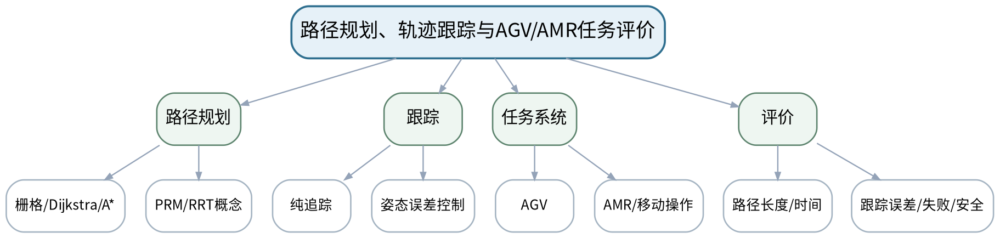

### 教学目标

**知识目标：**
- （1）理解栅格、Dijkstra/A*、势场、PRM/RRT等规划思想。
- （2）掌握纯追踪/姿态误差等基础跟踪思想及AGV/AMR差异。
**能力目标：**
- （1）能够比较规划路径与实际跟踪轨迹，并用误差、时间、碰撞/失败等指标评价。
**价值目标：**
- （1）形成场景测试、失败分析和运行区域安全意识。

### 课程思政

以公共区域运行案例强调路径效率不能凌驾于人员安全和可恢复性。

### 专创融合 / 双创融合

把“场景测试+指标”作为移动机器人方案评审和产品验收的最小集合。

### 教学重难点

教学重点：规划与跟踪的职责边界及评价指标。
教学难点：规划出路径不等于机器人能安全跟踪；地图分辨率、转弯半径、定位误差和动态障碍共同影响执行。

### 教学方法

问题引导法、模型推导法、案例分析法、Python/仿真教师演示、同伴互评、证据复盘

### 教学用具

电脑、投影仪、栅格地图、Python规划/跟踪教师演示。

### 教学设计

课前任务 → 互动导入（15 min）→ 传授新知与课堂训练（70 min）→ 过关检测（10 min）→ 课堂小结（3 min）→ 作业布置（1 min）→ 考勤（1 min）

### 教学过程

#### 课前任务

【教师】发布“路径规划、轨迹跟踪与AGV/AMR任务评价”预习/准备要求和一个最小问题，不提前给出完整答案。
- 1. 阅读大纲对应内容与指定教材/资料，圈出3个核心术语；
- 2. 预读一张结构图、公式或案例，写出第一判断。
- 3. 记录至少1个疑问或风险点。
【学生】完成准备并带着问题进入课堂。

**设计意图：** 通过课前阅读、环境/安全检查和最小问题建立先备认知，让学生带着真实问题进入课堂。

#### 互动导入与传授新知 / 课堂训练

【互动导入 15 min】
【教师】给出一条穿过狭窄拐角的“最短路径”，让学生判断为何对真实差速机器人可能不是最佳路线。
【学生】先独立预测/判断/操作，再交换依据，不先听完整结论。

【传授新知与课堂训练 70 min】
**一、核心原理与结构讲解（约25 min）—规划思想**

【教师】从图搜索到采样方法建立“环境表示—可行空间—搜索”的共同框架，不追求算法推导全覆盖。

【学生】按任务约束完成分析/实现，保存中间结果并说明判断依据；教师只提示定位方法、边界与验收条件，不代替学生完成核心产物。

**二、模型/案例推演与学生分析（约25 min）—跟踪闭环**

【教师】区分规划路径与实际轨迹，说明预瞄距离/速度/定位误差对纯追踪等控制的影响。

【学生】按任务约束完成分析/实现，保存中间结果并说明判断依据；教师只提示定位方法、边界与验收条件，不代替学生完成核心产物。

**三、独立产出、互审与证据复盘（约20 min）—任务评价**

【教师】学生为仓储AMR设计包含正常、窄通道、人员进入、失定位的测试表和评价指标。

【学生】按任务约束完成分析/实现，保存中间结果并说明判断依据；教师只提示定位方法、边界与验收条件，不代替学生完成核心产物。

【课堂产物】规划/跟踪职责图 + AMR场景测试表。

【学习证据】路径图、评价指标、失败场景和安全处理说明。

【评价关联】平时成绩、课程作业、期末考试；目标1.4、2.4、3.4。

**设计意图：** 采用“先预测/操作 → 最小讲解/示范 → 独立产出 → 测试/互审 → 证据固化”的闭环，使机器人学模型、算法和实验结论都有可复核证据。

#### 过关检测

【教师】组织当堂检测：
- 1. A*中的启发信息解决什么问题？
- 2. 路径规划和轨迹跟踪为何不能合成一个概念？
- 3. AMR测试至少应包含哪些失败场景？
【学生】独立作答/运行/数据判断；【教师】依据错误类型进行针对性讲解并要求说明判断依据。

**设计意图：** 用概念、模型、边界和运行/数据验证即时检测关键知识，暴露易错点。

#### 课堂小结

【教师】回到知识脉络图，用“概念—模型—关系—应用—边界”总结“路径规划、轨迹跟踪与AGV/AMR任务评价”，再次强调：规划与跟踪的职责边界及评价指标。
【学生】写下本课最重要的一条规则和一个最容易出错的边界。

**设计意图：** 压缩本课信息并把规则、边界与后续任务连接。

#### 作业布置

【教师】布置课后任务：为一个仓储地图设计3类测试场景，说明每类的通过判据。
【学生】按课程文件命名和证据规范整理提交。

**设计意图：** 固化课堂产物，形成可复查、可复现的过程证据。

#### 考勤

【教师】利用学校/课程实际使用的平台进行签到。
【学生】按课程要求完成签到。

**设计意图：** 保留学校模板考勤环节，不在教案中预填出勤事实。

### 课后教学反思

【课后填写，不预填事实】
- 1. 教学流程：记录100 min各环节实际用时及需调整的位置；
- 2. 教学内容：重点记录“规划出路径不等于机器人能安全跟踪；地图分辨率、转弯半径、定位误差和动态障碍共同影响执行。”的真实掌握证据与常见错误；
- 3. 学生参与：仅依据实际课堂记录填写独立分析、实验、编码、互审或项目协作情况，不补写推测；
- 4. 评价证据：检查本课课堂产物/代码/实验数据/测试/项目记录是否完整，记录缺项及原因；
- 5. 后续改进：依据真实课堂证据确定下一轮调整。

### 本章节参考文献

[4] 仉新, 矫健, 付垚. 移动机器人原理与应用[M]. 北京：清华大学出版社，2025. ISBN 9787302704478
[2] Corke, P. Robotics, Vision and Control: Fundamental Algorithms in Python（3rd Edition）[M]. Cham: Springer, 2023. ISBN 9783031064685

## 第11次课 足式/轮足机器人支撑、稳定与模式切换

- **章节/单元**：第五单元 足式、四足、人形与轮足式机器人
- **周次**：按实际课表填写
- **课时安排**：2课时（100 min）
- **课型**：理论

### 知识脉络图

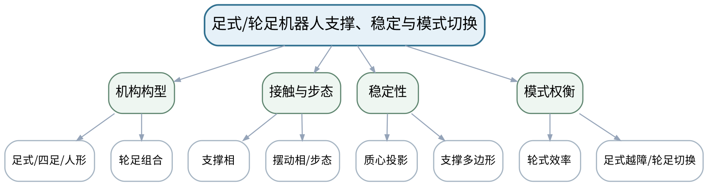

### 教学目标

**知识目标：**
- （1）理解支撑相、摆动相、接触、质心投影和支撑多边形。
- （2）了解四足、人形和轮足式构型、静态/动态稳定与模式切换。
**能力目标：**
- （1）能够依据地形、效率、稳定、越障、能耗和复杂度比较轮式/足式/轮足方案。
**价值目标：**
- （1）形成不以“炫技”替代工程验证、面向场景权衡构型的意识。

### 课程思政

结合巡检救援场景强调机器人性能提升必须与可靠性、能耗和安全验证同步。

### 专创融合 / 双创融合

将多构型比较转化为特种巡检装备的需求与产品定位分析。

### 教学重难点

教学重点：支撑、接触和稳定的基本几何关系。
教学难点：静态稳定判据适用范围有限，不能直接替代动态运动稳定性评价。

### 教学方法

问题引导法、模型推导法、案例分析法、Python/仿真教师演示、同伴互评、证据复盘

### 教学用具

电脑、投影仪、构型视频/数据、支撑几何示意。

### 教学设计

课前任务 → 互动导入（15 min）→ 传授新知与课堂训练（70 min）→ 过关检测（10 min）→ 课堂小结（3 min）→ 作业布置（1 min）→ 考勤（1 min）

### 教学过程

#### 课前任务

【教师】发布“足式/轮足机器人支撑、稳定与模式切换”预习/准备要求和一个最小问题，不提前给出完整答案。
- 1. 阅读大纲对应内容与指定教材/资料，圈出3个核心术语；
- 2. 预读一张结构图、公式或案例，写出第一判断。
- 3. 记录至少1个疑问或风险点。
【学生】完成准备并带着问题进入课堂。

**设计意图：** 通过课前阅读、环境/安全检查和最小问题建立先备认知，让学生带着真实问题进入课堂。

#### 互动导入与传授新知 / 课堂训练

【互动导入 15 min】
【教师】展示“质心投影仍在支撑多边形内”但机器人快速转身失败的视频/数据现象，提问为什么静态判据不足。
【学生】先独立预测/判断/操作，再交换依据，不先听完整结论。

【传授新知与课堂训练 70 min】
**一、核心原理与结构讲解（约25 min）—支撑与接触**

【教师】用几何图解释支撑相、摆动相、支撑多边形和质心投影。

【学生】按任务约束完成分析/实现，保存中间结果并说明判断依据；教师只提示定位方法、边界与验收条件，不代替学生完成核心产物。

**二、模型/案例推演与学生分析（约25 min）—构型与步态**

【教师】比较四足、人形和轮足的驱动、接触和典型模式，说明轮腿模式切换的状态逻辑。

【学生】按任务约束完成分析/实现，保存中间结果并说明判断依据；教师只提示定位方法、边界与验收条件，不代替学生完成核心产物。

**三、独立产出、互审与证据复盘（约20 min）—方案评审**

【教师】学生针对平地搬运、楼梯巡检、碎石越障三场景给出轮式/足式/轮足选型，并用指标说明。

【学生】按任务约束完成分析/实现，保存中间结果并说明判断依据；教师只提示定位方法、边界与验收条件，不代替学生完成核心产物。

【课堂产物】三场景构型比较表 + 支撑几何分析图。

【学习证据】支撑图、指标比较和一条“静态判据局限”说明。

【评价关联】平时成绩、课程作业、期末考试；目标1.5、2.5、3.5。

**设计意图：** 采用“先预测/操作 → 最小讲解/示范 → 独立产出 → 测试/互审 → 证据固化”的闭环，使机器人学模型、算法和实验结论都有可复核证据。

#### 过关检测

【教师】组织当堂检测：
- 1. 支撑多边形由什么决定？
- 2. 质心投影在支撑区内能否保证动态稳定？
- 3. 轮足模式切换为什么需要状态/安全条件？
【学生】独立作答/运行/数据判断；【教师】依据错误类型进行针对性讲解并要求说明判断依据。

**设计意图：** 用概念、模型、边界和运行/数据验证即时检测关键知识，暴露易错点。

#### 课堂小结

【教师】回到知识脉络图，用“概念—模型—关系—应用—边界”总结“足式/轮足机器人支撑、稳定与模式切换”，再次强调：支撑、接触和稳定的基本几何关系。
【学生】写下本课最重要的一条规则和一个最容易出错的边界。

**设计意图：** 压缩本课信息并把规则、边界与后续任务连接。

#### 作业布置

【教师】布置课后任务：为巡检任务比较四足与轮足方案，列出至少5个可验证指标。
【学生】按课程文件命名和证据规范整理提交。

**设计意图：** 固化课堂产物，形成可复查、可复现的过程证据。

#### 考勤

【教师】利用学校/课程实际使用的平台进行签到。
【学生】按课程要求完成签到。

**设计意图：** 保留学校模板考勤环节，不在教案中预填出勤事实。

### 课后教学反思

【课后填写，不预填事实】
- 1. 教学流程：记录100 min各环节实际用时及需调整的位置；
- 2. 教学内容：重点记录“静态稳定判据适用范围有限，不能直接替代动态运动稳定性评价。”的真实掌握证据与常见错误；
- 3. 学生参与：仅依据实际课堂记录填写独立分析、实验、编码、互审或项目协作情况，不补写推测；
- 4. 评价证据：检查本课课堂产物/代码/实验数据/测试/项目记录是否完整，记录缺项及原因；
- 5. 后续改进：依据真实课堂证据确定下一轮调整。

### 本章节参考文献

[4] 仉新, 矫健, 付垚. 移动机器人原理与应用[M]. 北京：清华大学出版社，2025. ISBN 9787302704478
[3] 赵建伟, 马学品, 盖逸馨, 毛向军, 梅勇, 钱航, 姚志广. 机器人系统设计及其应用技术（第2版）[M]. 北京：清华大学出版社，2024. ISBN 9787302676577

## 第12次课 机器人感知—规划—控制系统链与安全验证

- **章节/单元**：第六单元 机器人感知、规划、应用与安全
- **周次**：按实际课表填写
- **课时安排**：2课时（100 min）
- **课型**：理论

### 知识脉络图

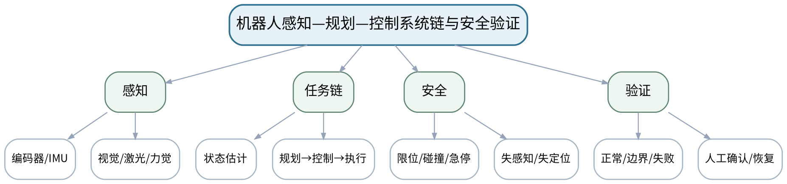

### 教学目标

**知识目标：**
- （1）理解编码器、IMU、力/力矩、视觉、激光等传感器及误差。
- （2）理解感知、状态估计、规划、控制、执行、安全与系统集成关系。
**能力目标：**
- （1）能够为机器人任务建立“任务—模型—规划—控制—感知—验证—安全”链并设计测试。
**价值目标：**
- （1）形成限位、碰撞、人机协作、失定位和人工复核责任意识。

### 课程思政

以人机协作和移动机器人失效案例落实最小风险、人工最终责任和工程伦理。

### 专创融合 / 双创融合

把系统链和测试矩阵直接作为后续综合项目的架构与验收基线。

### 教学重难点

教学重点：机器人系统链路及安全验证。
教学难点：算法模块局部正确不等于系统安全，需要将感知误差、约束和失败恢复贯穿任务链。

### 教学方法

问题引导法、模型推导法、案例分析法、Python/仿真教师演示、同伴互评、证据复盘

### 教学用具

电脑、投影仪、传感器/系统案例、风险与测试模板。

### 教学设计

课前任务 → 互动导入（15 min）→ 传授新知与课堂训练（70 min）→ 过关检测（10 min）→ 课堂小结（3 min）→ 作业布置（1 min）→ 考勤（1 min）

### 教学过程

#### 课前任务

【教师】发布“机器人感知—规划—控制系统链与安全验证”预习/准备要求和一个最小问题，不提前给出完整答案。
- 1. 阅读大纲对应内容与指定教材/资料，圈出3个核心术语；
- 2. 预读一张结构图、公式或案例，写出第一判断。
- 3. 记录至少1个疑问或风险点。
【学生】完成准备并带着问题进入课堂。

**设计意图：** 通过课前阅读、环境/安全检查和最小问题建立先备认知，让学生带着真实问题进入课堂。

#### 互动导入与传授新知 / 课堂训练

【互动导入 15 min】
【教师】给出“规划器输出无碰撞轨迹，但实际执行发生碰撞”的情境，要求学生列出可能来自模型、感知、时延、控制和安全配置的原因。
【学生】先独立预测/判断/操作，再交换依据，不先听完整结论。

【传授新知与课堂训练 70 min】
**一、核心原理与结构讲解（约25 min）—传感与状态**

【教师】说明传感器数据、状态估计和模型之间的关系，区分测量事实与算法估计。

【学生】按任务约束完成分析/实现，保存中间结果并说明判断依据；教师只提示定位方法、边界与验收条件，不代替学生完成核心产物。

**二、模型/案例推演与学生分析（约25 min）—系统任务链**

【教师】从机械臂装配/AMR巡检案例拆解感知—规划—控制—执行接口和依赖。

【学生】按任务约束完成分析/实现，保存中间结果并说明判断依据；教师只提示定位方法、边界与验收条件，不代替学生完成核心产物。

**三、独立产出、互审与证据复盘（约20 min）—安全验证**

【教师】学生建立风险清单和测试矩阵，覆盖限位、碰撞、失定位、感知中断、急停和人工确认。

【学生】按任务约束完成分析/实现，保存中间结果并说明判断依据；教师只提示定位方法、边界与验收条件，不代替学生完成核心产物。

【课堂产物】机器人系统任务链图 + 安全测试矩阵。

【学习证据】系统框图、风险清单、测试用例与人工确认点。

【评价关联】平时成绩、课程作业、期末考试；目标1.6、2.6、3.6。

**设计意图：** 采用“先预测/操作 → 最小讲解/示范 → 独立产出 → 测试/互审 → 证据固化”的闭环，使机器人学模型、算法和实验结论都有可复核证据。

#### 过关检测

【教师】组织当堂检测：
- 1. 传感器读数与状态估计有什么区别？
- 2. 局部算法正确为什么仍可能造成系统事故？
- 3. 哪些机器人动作应设置人工确认或安全互锁？
【学生】独立作答/运行/数据判断；【教师】依据错误类型进行针对性讲解并要求说明判断依据。

**设计意图：** 用概念、模型、边界和运行/数据验证即时检测关键知识，暴露易错点。

#### 课堂小结

【教师】回到知识脉络图，用“概念—模型—关系—应用—边界”总结“机器人感知—规划—控制系统链与安全验证”，再次强调：机器人系统链路及安全验证。
【学生】写下本课最重要的一条规则和一个最容易出错的边界。

**设计意图：** 压缩本课信息并把规则、边界与后续任务连接。

#### 作业布置

【教师】布置课后任务：为综合项目候选任务画系统链并设计5类正常/边界/故障测试。
【学生】按课程文件命名和证据规范整理提交。

**设计意图：** 固化课堂产物，形成可复查、可复现的过程证据。

#### 考勤

【教师】利用学校/课程实际使用的平台进行签到。
【学生】按课程要求完成签到。

**设计意图：** 保留学校模板考勤环节，不在教案中预填出勤事实。

### 课后教学反思

【课后填写，不预填事实】
- 1. 教学流程：记录100 min各环节实际用时及需调整的位置；
- 2. 教学内容：重点记录“算法模块局部正确不等于系统安全，需要将感知误差、约束和失败恢复贯穿任务链。”的真实掌握证据与常见错误；
- 3. 学生参与：仅依据实际课堂记录填写独立分析、实验、编码、互审或项目协作情况，不补写推测；
- 4. 评价证据：检查本课课堂产物/代码/实验数据/测试/项目记录是否完整，记录缺项及原因；
- 5. 后续改进：依据真实课堂证据确定下一轮调整。

### 本章节参考文献

[3] 赵建伟, 马学品, 盖逸馨, 毛向军, 梅勇, 钱航, 姚志广. 机器人系统设计及其应用技术（第2版）[M]. 北京：清华大学出版社，2024. ISBN 9787302676577
[5] 栗琳, 郑莉芳, 孙浩, 刘新洋, 郑世杰, 佘鹏飞. 机器人检测与控制综合实践[M]. 北京：清华大学出版社，2023. ISBN 9787302643708

## 第13次课 实验一：机械臂坐标标定、正运动学与误差验证

- **章节/单元**：实验一 机械臂坐标标定与位姿验证
- **周次**：按实际课表填写
- **课时安排**：2课时（100 min）
- **课型**：实验

### 知识脉络图

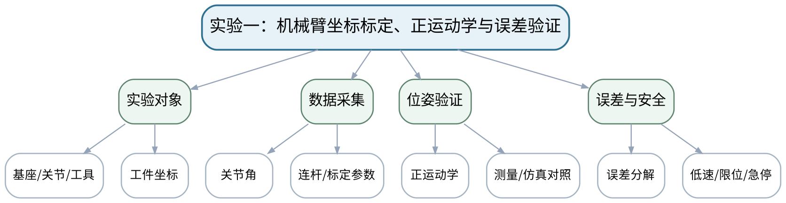

### 教学目标

**知识目标：**
- （1）理解坐标标定、关节参数、正运动学和测量/仿真结果之间的关系。
**能力目标：**
- （1）能够在桌面机械臂或等价数字模型上识别坐标系、读取参数、计算末端位姿并完成误差分析。
**价值目标：**
- （1）形成低速、限位、急停、原始数据记录与独立复核意识。

### 课程思政

以低速、限位、急停和数据真实性落实设备安全与实验诚信。

### 专创融合 / 双创融合

把标定与验证流程转化为机器人部署/维护的标准检查单。

### 教学重难点

教学重点：坐标/参数记录与位姿验证。
教学难点：实验坐标约定必须与计算模型一致；不能用设备界面读数替代独立验证。

### 教学方法

实验演示法、分组实验法、数据复核法、误差分析法、安全检查与实验复盘

### 教学用具

桌面机械臂或等价数字模型、测量工具、Python/计算表、投影设备。

### 教学设计

课前任务 → 互动导入（15 min）→ 传授新知与课堂训练（70 min）→ 过关检测（10 min）→ 课堂小结（3 min）→ 作业布置（1 min）→ 考勤（1 min）

### 教学过程

#### 课前任务

【教师】发布“实验一：机械臂坐标标定、正运动学与误差验证”预习/准备要求和一个最小问题，不提前给出完整答案。
- 1. 阅读大纲对应内容与指定教材/资料，圈出3个核心术语；
- 2. 阅读实验安全与设备/数据说明，准备记录表。
- 3. 记录至少1个疑问或风险点。
【学生】完成准备并带着问题进入课堂。

**设计意图：** 通过课前阅读、环境/安全检查和最小问题建立先备认知，让学生带着真实问题进入课堂。

#### 互动导入与传授新知 / 课堂训练

【互动导入 15 min】
【教师】教师先给一组坐标轴方向故意标反的数据，让学生预测位姿计算会出现什么系统性误差。
【学生】先独立预测/判断/操作，再交换依据，不先听完整结论。

【传授新知与课堂训练 70 min】
**一、安全检查与实验设计确认（约15 min）—实验准备**

【教师】检查设备/数字模型、急停和安全区域；确认基座、工具、工件坐标和单位；记录原始参数。

【学生】按任务约束完成分析/实现，保存中间结果并说明判断依据；教师只提示定位方法、边界与验收条件，不代替学生完成核心产物。

**二、分组实验与数据采集（约35 min）—测量与计算**

【教师】分组读取3组关节角，计算末端位姿，并从设备/仿真读取对应结果。

【学生】按任务约束完成分析/实现，保存中间结果并说明判断依据；教师只提示定位方法、边界与验收条件，不代替学生完成核心产物。

**三、数据复核、误差分析与证据固化（约20 min）—误差复核**

【教师】比较位置/姿态误差，检查坐标、单位、参数、零位等原因；互换数据进行复算。

【学生】按任务约束完成分析/实现，保存中间结果并说明判断依据；教师只提示定位方法、边界与验收条件，不代替学生完成核心产物。

【课堂产物】实验记录表 + 3组位姿计算/测量对照 + 误差分析。

【学习证据】原始数据、计算表、设备/仿真截图或记录、误差表、互审复算证据。

【评价关联】课程作业；目标1.1、1.2、2.1、2.2、3.1、3.2。

**设计意图：** 采用“先预测/操作 → 最小讲解/示范 → 独立产出 → 测试/互审 → 证据固化”的闭环，使机器人学模型、算法和实验结论都有可复核证据。

#### 过关检测

【教师】组织当堂检测：
- 1. 实验前为什么必须确认坐标轴方向和单位？
- 2. 误差很大时先检查模型还是直接调参数？
- 3. 怎样证明结果不是只在一个构型下“碰巧正确”？
【学生】独立作答/运行/数据判断；【教师】依据错误类型进行针对性讲解并要求说明判断依据。

**设计意图：** 用概念、模型、边界和运行/数据验证即时检测关键知识，暴露易错点。

#### 课堂小结

【教师】回到知识脉络图，用“概念—模型—关系—应用—边界”总结“实验一：机械臂坐标标定、正运动学与误差验证”，再次强调：坐标/参数记录与位姿验证。
【学生】写下本课最重要的一条规则和一个最容易出错的边界。

**设计意图：** 压缩本课信息并把规则、边界与后续任务连接。

#### 作业布置

【教师】布置课后任务：完成实验一报告，保留原始数据和至少一项误差根因分析。
【学生】按课程文件命名和证据规范整理提交。

**设计意图：** 固化课堂产物，形成可复查、可复现的过程证据。

#### 考勤

【教师】利用学校/课程实际使用的平台进行签到。
【学生】按课程要求完成签到。

**设计意图：** 保留学校模板考勤环节，不在教案中预填出勤事实。

### 课后教学反思

【课后填写，不预填事实】
- 1. 教学流程：记录100 min各环节实际用时及需调整的位置；
- 2. 教学内容：重点记录“实验坐标约定必须与计算模型一致；不能用设备界面读数替代独立验证。”的真实掌握证据与常见错误；
- 3. 学生参与：仅依据实际课堂记录填写独立分析、实验、编码、互审或项目协作情况，不补写推测；
- 4. 评价证据：检查本课课堂产物/代码/实验数据/测试/项目记录是否完整，记录缺项及原因；
- 5. 后续改进：依据真实课堂证据确定下一轮调整。

### 本章节参考文献

[1] 周晓敏, 郑莉芳, 刘鸿飞. 机器人学基础[M]. 北京：清华大学出版社，2023. ISBN 9787302635888
[5] 栗琳, 郑莉芳, 孙浩, 刘新洋, 郑世杰, 佘鹏飞. 机器人检测与控制综合实践[M]. 北京：清华大学出版社，2023. ISBN 9787302643708

## 第14次课 实验二：机械臂轨迹、动态响应与安全限值

- **章节/单元**：实验二 机械臂轨迹与动力响应
- **周次**：按实际课表填写
- **课时安排**：2课时（100 min）
- **课型**：实验

### 知识脉络图

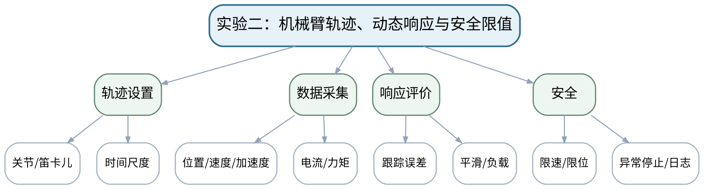

### 教学目标

**知识目标：**
- （1）理解轨迹连续性、动态响应、负载和控制参数在实验数据中的表现。
**能力目标：**
- （1）能够执行安全轨迹并采集位置/速度/加速度/电流或力矩数据，比较时间尺度或控制参数影响。
**价值目标：**
- （1）形成小步调参、异常停机、日志留存和证据解释习惯。

### 课程思政

强调设备限值、异常停机和真实记录，培养对实验结果与设备安全共同负责的意识。

### 专创融合 / 双创融合

将轨迹与动态响应评价转化为机器人节拍调试和负载验收方法。

### 教学重难点

教学重点：轨迹参数与动态响应数据对照。
教学难点：真实设备数据受控制器滤波、负载和采样影响，不能机械套用理想模型曲线。

### 教学方法

实验演示法、分组实验法、数据复核法、误差分析法、安全检查与实验复盘

### 教学用具

桌面机械臂/数字模型、数据采集接口、Python/绘图工具。

### 教学设计

课前任务 → 互动导入（15 min）→ 传授新知与课堂训练（70 min）→ 过关检测（10 min）→ 课堂小结（3 min）→ 作业布置（1 min）→ 考勤（1 min）

### 教学过程

#### 课前任务

【教师】发布“实验二：机械臂轨迹、动态响应与安全限值”预习/准备要求和一个最小问题，不提前给出完整答案。
- 1. 阅读大纲对应内容与指定教材/资料，圈出3个核心术语；
- 2. 阅读实验安全与设备/数据说明，准备记录表。
- 3. 记录至少1个疑问或风险点。
【学生】完成准备并带着问题进入课堂。

**设计意图：** 通过课前阅读、环境/安全检查和最小问题建立先备认知，让学生带着真实问题进入课堂。

#### 互动导入与传授新知 / 课堂训练

【互动导入 15 min】
【教师】给出“轨迹时间减半后误差和电流峰值同时增大”的数据，让学生先提出物理解释再进入实验。
【学生】先独立预测/判断/操作，再交换依据，不先听完整结论。

【传授新知与课堂训练 70 min】
**一、安全检查与实验设计确认（约15 min）—安全与基线**

【教师】确认负载、限速、限位、急停，先运行低速基线轨迹并保存日志。

【学生】按任务约束完成分析/实现，保存中间结果并说明判断依据；教师只提示定位方法、边界与验收条件，不代替学生完成核心产物。

**二、分组实验与数据采集（约35 min）—对比实验**

【教师】改变轨迹时间或一个控制参数，采集位置、速度、误差及可用的电流/力矩数据。

【学生】按任务约束完成分析/实现，保存中间结果并说明判断依据；教师只提示定位方法、边界与验收条件，不代替学生完成核心产物。

**三、数据复核、误差分析与证据固化（约20 min）—响应复盘**

【教师】比较曲线峰值、连续性、误差和安全余量；异常时停止并保留失败日志，禁止为“好看”删数据。

【学生】按任务约束完成分析/实现，保存中间结果并说明判断依据；教师只提示定位方法、边界与验收条件，不代替学生完成核心产物。

【课堂产物】两组轨迹/响应数据对比 + 安全限值记录。

【学习证据】参数表、曲线、误差/峰值、失败或异常日志、复盘结论。

【评价关联】课程作业；目标1.3、2.3、3.2、3.3。

**设计意图：** 采用“先预测/操作 → 最小讲解/示范 → 独立产出 → 测试/互审 → 证据固化”的闭环，使机器人学模型、算法和实验结论都有可复核证据。

#### 过关检测

【教师】组织当堂检测：
- 1. 为什么轨迹时间变短会提高动态要求？
- 2. 调参为什么应一次只改一个主要变量？
- 3. 异常数据为什么不能直接删除？
【学生】独立作答/运行/数据判断；【教师】依据错误类型进行针对性讲解并要求说明判断依据。

**设计意图：** 用概念、模型、边界和运行/数据验证即时检测关键知识，暴露易错点。

#### 课堂小结

【教师】回到知识脉络图，用“概念—模型—关系—应用—边界”总结“实验二：机械臂轨迹、动态响应与安全限值”，再次强调：轨迹参数与动态响应数据对照。
【学生】写下本课最重要的一条规则和一个最容易出错的边界。

**设计意图：** 压缩本课信息并把规则、边界与后续任务连接。

#### 作业布置

【教师】布置课后任务：完成实验二报告，并说明一项“模型预测与实验不一致”的可能原因。
【学生】按课程文件命名和证据规范整理提交。

**设计意图：** 固化课堂产物，形成可复查、可复现的过程证据。

#### 考勤

【教师】利用学校/课程实际使用的平台进行签到。
【学生】按课程要求完成签到。

**设计意图：** 保留学校模板考勤环节，不在教案中预填出勤事实。

### 课后教学反思

【课后填写，不预填事实】
- 1. 教学流程：记录100 min各环节实际用时及需调整的位置；
- 2. 教学内容：重点记录“真实设备数据受控制器滤波、负载和采样影响，不能机械套用理想模型曲线。”的真实掌握证据与常见错误；
- 3. 学生参与：仅依据实际课堂记录填写独立分析、实验、编码、互审或项目协作情况，不补写推测；
- 4. 评价证据：检查本课课堂产物/代码/实验数据/测试/项目记录是否完整，记录缺项及原因；
- 5. 后续改进：依据真实课堂证据确定下一轮调整。

### 本章节参考文献

[1] 周晓敏, 郑莉芳, 刘鸿飞. 机器人学基础[M]. 北京：清华大学出版社，2023. ISBN 9787302635888
[5] 栗琳, 郑莉芳, 孙浩, 刘新洋, 郑世杰, 佘鹏飞. 机器人检测与控制综合实践[M]. 北京：清华大学出版社，2023. ISBN 9787302643708

## 第15次课 实验三：轮式机器人参数标定、里程计与路径跟踪

- **章节/单元**：实验三 轮式机器人里程计与路径跟踪
- **周次**：按实际课表填写
- **课时安排**：2课时（100 min）
- **课型**：实验

### 知识脉络图

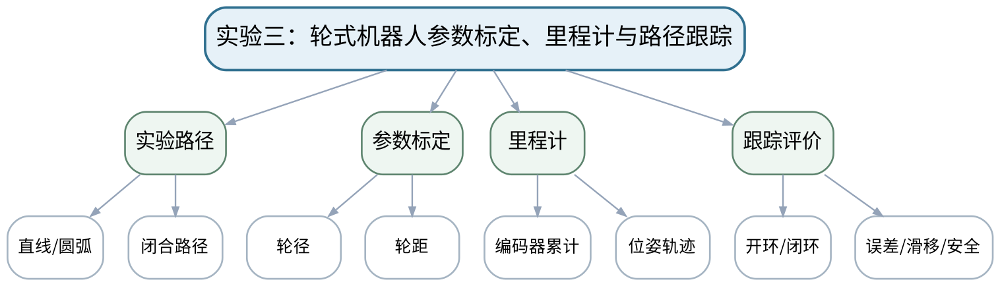

### 教学目标

**知识目标：**
- （1）理解轮径、轮距、里程计、滑移和跟踪误差的实验关系。
**能力目标：**
- （1）能够在安全区域完成直线/圆弧/闭合路径测试，标定参数并比较开环里程计与闭环轨迹。
**价值目标：**
- （1）形成人机混行安全、定位不确定性和重复测试意识。

### 课程思政

通过安全区域、急停和重复测试强调移动机器人对人员环境的运行责任。

### 专创融合 / 双创融合

将标定和路径测试组织成AMR现场验收的可复用流程。

### 教学重难点

教学重点：轮式参数标定与轨迹误差。
教学难点：参数偏差和地面滑移会产生不同误差形态，需要通过多路径实验区分。

### 教学方法

实验演示法、分组实验法、数据复核法、误差分析法、安全检查与实验复盘

### 教学用具

差速/等价移动平台或仿真、测量工具、Python轨迹分析。

### 教学设计

课前任务 → 互动导入（15 min）→ 传授新知与课堂训练（70 min）→ 过关检测（10 min）→ 课堂小结（3 min）→ 作业布置（1 min）→ 考勤（1 min）

### 教学过程

#### 课前任务

【教师】发布“实验三：轮式机器人参数标定、里程计与路径跟踪”预习/准备要求和一个最小问题，不提前给出完整答案。
- 1. 阅读大纲对应内容与指定教材/资料，圈出3个核心术语；
- 2. 阅读实验安全与设备/数据说明，准备记录表。
- 3. 记录至少1个疑问或风险点。
【学生】完成准备并带着问题进入课堂。

**设计意图：** 通过课前阅读、环境/安全检查和最小问题建立先备认知，让学生带着真实问题进入课堂。

#### 互动导入与传授新知 / 课堂训练

【互动导入 15 min】
【教师】展示一条“直线正常但圆弧偏差很大”的轨迹，要求学生判断优先检查轮径还是轮距。
【学生】先独立预测/判断/操作，再交换依据，不先听完整结论。

【传授新知与课堂训练 70 min】
**一、安全检查与实验设计确认（约15 min）—安全准备**

【教师】设置运行区域、低速和人工急停；检查路径周围人员/障碍；记录初始参数。

【学生】按任务约束完成分析/实现，保存中间结果并说明判断依据；教师只提示定位方法、边界与验收条件，不代替学生完成核心产物。

**二、分组实验与数据采集（约35 min）—标定与路径**

【教师】执行直线、圆弧、闭合路径，记录编码器和位姿；根据误差调整轮径/轮距。

【学生】按任务约束完成分析/实现，保存中间结果并说明判断依据；教师只提示定位方法、边界与验收条件，不代替学生完成核心产物。

**三、数据复核、误差分析与证据固化（约20 min）—跟踪比较**

【教师】运行开环与闭环/等价跟踪，比较轨迹误差和重复性，分析滑移和采样影响。

【学生】按任务约束完成分析/实现，保存中间结果并说明判断依据；教师只提示定位方法、边界与验收条件，不代替学生完成核心产物。

【课堂产物】参数标定表 + 三类路径数据 + 开环/闭环误差对比。

【学习证据】参数版本、原始轨迹、误差指标、重复测试和安全检查记录。

【评价关联】课程作业；目标1.4、2.4、3.4。

**设计意图：** 采用“先预测/操作 → 最小讲解/示范 → 独立产出 → 测试/互审 → 证据固化”的闭环，使机器人学模型、算法和实验结论都有可复核证据。

#### 过关检测

【教师】组织当堂检测：
- 1. 直线和转弯测试分别更敏感于哪些参数？
- 2. 为什么闭合路径特别适合观察累积误差？
- 3. 重复测试结果差异大说明什么？
【学生】独立作答/运行/数据判断；【教师】依据错误类型进行针对性讲解并要求说明判断依据。

**设计意图：** 用概念、模型、边界和运行/数据验证即时检测关键知识，暴露易错点。

#### 课堂小结

【教师】回到知识脉络图，用“概念—模型—关系—应用—边界”总结“实验三：轮式机器人参数标定、里程计与路径跟踪”，再次强调：轮式参数标定与轨迹误差。
【学生】写下本课最重要的一条规则和一个最容易出错的边界。

**设计意图：** 压缩本课信息并把规则、边界与后续任务连接。

#### 作业布置

【教师】布置课后任务：完成实验三报告，给出标定前后误差变化和一条滑移/采样影响说明。
【学生】按课程文件命名和证据规范整理提交。

**设计意图：** 固化课堂产物，形成可复查、可复现的过程证据。

#### 考勤

【教师】利用学校/课程实际使用的平台进行签到。
【学生】按课程要求完成签到。

**设计意图：** 保留学校模板考勤环节，不在教案中预填出勤事实。

### 课后教学反思

【课后填写，不预填事实】
- 1. 教学流程：记录100 min各环节实际用时及需调整的位置；
- 2. 教学内容：重点记录“参数偏差和地面滑移会产生不同误差形态，需要通过多路径实验区分。”的真实掌握证据与常见错误；
- 3. 学生参与：仅依据实际课堂记录填写独立分析、实验、编码、互审或项目协作情况，不补写推测；
- 4. 评价证据：检查本课课堂产物/代码/实验数据/测试/项目记录是否完整，记录缺项及原因；
- 5. 后续改进：依据真实课堂证据确定下一轮调整。

### 本章节参考文献

[4] 仉新, 矫健, 付垚. 移动机器人原理与应用[M]. 北京：清华大学出版社，2025. ISBN 9787302704478
[5] 栗琳, 郑莉芳, 孙浩, 刘新洋, 郑世杰, 佘鹏飞. 机器人检测与控制综合实践[M]. 北京：清华大学出版社，2023. ISBN 9787302643708

## 第16次课 实验四：足式/轮足运动、支撑与稳定性数据观察

- **章节/单元**：实验四 足式/轮足式机器人运动与稳定性观察
- **周次**：按实际课表填写
- **课时安排**：2课时（100 min）
- **课型**：实验

### 知识脉络图

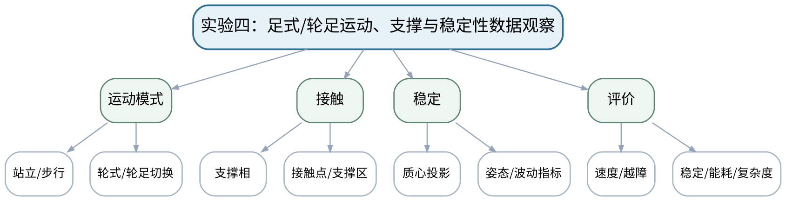

### 教学目标

**知识目标：**
- （1）理解支撑相、接触、质心投影、模式切换和稳定性数据的实验意义。
**能力目标：**
- （1）能够基于真实平台、等价仿真或公开可复现实验数据标注运动阶段并比较速度/稳定/能耗等指标。
**价值目标：**
- （1）形成保护区、不过度推断、数据来源可追溯的实验态度。

### 课程思政

强调真实平台保护区和数据证据，避免把宣传效果替代工程评价。

### 专创融合 / 双创融合

将构型多指标评价用于巡检/救援机器人方案选型和产品论证。

### 教学重难点

教学重点：支撑/接触与运动指标的对应。
教学难点：宣传视频只能说明现象，不能替代可复现数据；静态几何稳定不能直接等同于动态稳定。

### 教学方法

实验演示法、分组实验法、数据复核法、误差分析法、安全检查与实验复盘

### 教学用具

四足/轮足平台或可复现实验数据、视频、数据分析工具。

### 教学设计

课前任务 → 互动导入（15 min）→ 传授新知与课堂训练（70 min）→ 过关检测（10 min）→ 课堂小结（3 min）→ 作业布置（1 min）→ 考勤（1 min）

### 教学过程

#### 课前任务

【教师】发布“实验四：足式/轮足运动、支撑与稳定性数据观察”预习/准备要求和一个最小问题，不提前给出完整答案。
- 1. 阅读大纲对应内容与指定教材/资料，圈出3个核心术语；
- 2. 阅读实验安全与设备/数据说明，准备记录表。
- 3. 记录至少1个疑问或风险点。
【学生】完成准备并带着问题进入课堂。

**设计意图：** 通过课前阅读、环境/安全检查和最小问题建立先备认知，让学生带着真实问题进入课堂。

#### 互动导入与传授新知 / 课堂训练

【互动导入 15 min】
【教师】先给一段高速四足视频，再给姿态波动和功率数据，要求学生判断“看起来稳”和“指标稳”是否一致。
【学生】先独立预测/判断/操作，再交换依据，不先听完整结论。

【传授新知与课堂训练 70 min】
**一、安全检查与实验设计确认（约15 min）—数据/平台准备**

【教师】真实平台设置保护区与限位；无硬件时明确数据来源、采样与版本。

【学生】按任务约束完成分析/实现，保存中间结果并说明判断依据；教师只提示定位方法、边界与验收条件，不代替学生完成核心产物。

**二、分组实验与数据采集（约35 min）—运动标注**

【教师】观察站立、步行、转向、越障或轮足切换，标注支撑相、接触变化和质心/姿态信息。

【学生】按任务约束完成分析/实现，保存中间结果并说明判断依据；教师只提示定位方法、边界与验收条件，不代替学生完成核心产物。

**三、数据复核、误差分析与证据固化（约20 min）—指标比较**

【教师】比较速度、姿态波动、越障、能耗等可用指标；学生说明哪些结论被数据支持、哪些仍不能断言。

【学生】按任务约束完成分析/实现，保存中间结果并说明判断依据；教师只提示定位方法、边界与验收条件，不代替学生完成核心产物。

【课堂产物】运动阶段标注图 + 多指标比较表 + 结论边界说明。

【学习证据】数据/视频来源、阶段标注、指标表和一条“不能据此断言”的结论。

【评价关联】课程作业；目标1.5、2.5、3.5。

**设计意图：** 采用“先预测/操作 → 最小讲解/示范 → 独立产出 → 测试/互审 → 证据固化”的闭环，使机器人学模型、算法和实验结论都有可复核证据。

#### 过关检测

【教师】组织当堂检测：
- 1. 什么信息可以确定支撑相？
- 2. 静态支撑几何为什么不足以评价高速运动？
- 3. 只有公开视频时如何保持分析可追溯？
【学生】独立作答/运行/数据判断；【教师】依据错误类型进行针对性讲解并要求说明判断依据。

**设计意图：** 用概念、模型、边界和运行/数据验证即时检测关键知识，暴露易错点。

#### 课堂小结

【教师】回到知识脉络图，用“概念—模型—关系—应用—边界”总结“实验四：足式/轮足运动、支撑与稳定性数据观察”，再次强调：支撑/接触与运动指标的对应。
【学生】写下本课最重要的一条规则和一个最容易出错的边界。

**设计意图：** 压缩本课信息并把规则、边界与后续任务连接。

#### 作业布置

【教师】布置课后任务：完成实验四报告，以数据支持一种构型优势，同时明确至少一个局限。
【学生】按课程文件命名和证据规范整理提交。

**设计意图：** 固化课堂产物，形成可复查、可复现的过程证据。

#### 考勤

【教师】利用学校/课程实际使用的平台进行签到。
【学生】按课程要求完成签到。

**设计意图：** 保留学校模板考勤环节，不在教案中预填出勤事实。

### 课后教学反思

【课后填写，不预填事实】
- 1. 教学流程：记录100 min各环节实际用时及需调整的位置；
- 2. 教学内容：重点记录“宣传视频只能说明现象，不能替代可复现数据；静态几何稳定不能直接等同于动态稳定。”的真实掌握证据与常见错误；
- 3. 学生参与：仅依据实际课堂记录填写独立分析、实验、编码、互审或项目协作情况，不补写推测；
- 4. 评价证据：检查本课课堂产物/代码/实验数据/测试/项目记录是否完整，记录缺项及原因；
- 5. 后续改进：依据真实课堂证据确定下一轮调整。

### 本章节参考文献

[4] 仉新, 矫健, 付垚. 移动机器人原理与应用[M]. 北京：清华大学出版社，2025. ISBN 9787302704478
[3] 赵建伟, 马学品, 盖逸馨, 毛向军, 梅勇, 钱航, 姚志广. 机器人系统设计及其应用技术（第2版）[M]. 北京：清华大学出版社，2024. ISBN 9787302676577

## 第17次课 上机一①：二维/三维旋转、齐次变换与表示转换

- **章节/单元**：上机一 Python空间数学与机器人模型
- **周次**：按实际课表填写
- **课时安排**：2课时（100 min）
- **课型**：上机

### 知识脉络图

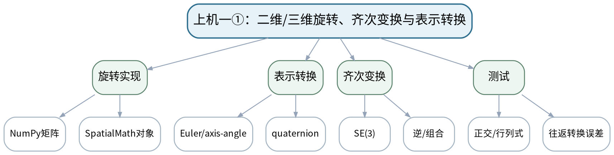

### 教学目标

**知识目标：**
- （1）掌握NumPy/SpatialMath中旋转和位姿对象与数学定义的对应。
**能力目标：**
- （1）能够实现/调用旋转矩阵、齐次变换、欧拉角/轴角/四元数转换，并用单元测试检查约束。
**价值目标：**
- （1）形成不重复Python语法、直接以测试验证数学模型的工程习惯。

### 课程思政

通过显式单位、轴顺序和测试落实计算结果的可解释与可复现责任。

### 专创融合 / 双创融合

把空间数学代码组织为可复用、可测试的机器人算法基础库。

### 教学重难点

教学重点：数学定义与库函数对象的对应及测试。
教学难点：不同库的欧拉角顺序/单位约定可能不同；必须显式记录约定。

### 教学方法

任务驱动法、分段编码法、上机实践法、单元/边界测试、故障注入、代码互审与复盘

### 教学用具

机房、VS Code/Jupyter、Python、NumPy、SpatialMath、Matplotlib。

### 教学设计

课前任务 → 互动导入（15 min）→ 传授新知与课堂训练（70 min）→ 过关检测（10 min）→ 课堂小结（3 min）→ 作业布置（1 min）→ 考勤（1 min）

### 教学过程

#### 课前任务

【教师】发布“上机一①：二维/三维旋转、齐次变换与表示转换”预习/准备要求和一个最小问题，不提前给出完整答案。
- 1. 阅读大纲对应内容与指定教材/资料，圈出3个核心术语；
- 2. 确认Python环境、依赖和上一阶段代码可运行。
- 3. 记录至少1个疑问或风险点。
【学生】完成准备并带着问题进入课堂。

**设计意图：** 通过课前阅读、环境/安全检查和最小问题建立先备认知，让学生带着真实问题进入课堂。

#### 互动导入与传授新知 / 课堂训练

【互动导入 15 min】
【教师】教师让同一欧拉角以“度”和“弧度”分别调用，学生先预测输出差异并用测试发现问题。
【学生】先独立预测/判断/操作，再交换依据，不先听完整结论。

【传授新知与课堂训练 70 min】
**一、任务说明与最小代码骨架（约15 min）—最小骨架**

【教师】加载NumPy/SpatialMath，构造2D/3D旋转和SE(3)位姿；打印对象和矩阵检查维度。

【学生】按任务约束完成分析/实现，保存中间结果并说明判断依据；教师只提示定位方法、边界与验收条件，不代替学生完成核心产物。

**二、学生独立/小组编码实现（约40 min）—独立实现**

【教师】完成至少三种姿态表示转换和两次位姿组合，记录角度单位/旋转顺序。

【学生】按任务约束完成分析/实现，保存中间结果并说明判断依据；教师只提示定位方法、边界与验收条件，不代替学生完成核心产物。

**三、测试、故障注入与证据固化（约15 min）—测试验收**

【教师】编写正交性、det(R)=1、T*T^-1≈I、表示往返误差测试，并故障注入度/弧度或乘法顺序错误。

【学生】按任务约束完成分析/实现，保存中间结果并说明判断依据；教师只提示定位方法、边界与验收条件，不代替学生完成核心产物。

【课堂产物】可运行脚本/Notebook + 旋转/位姿转换测试。

【学习证据】源代码、测试结果、故障注入与修复记录、可视化/矩阵输出。

【评价关联】课程作业；目标1.1、2.1、3.1。

**设计意图：** 采用“先预测/操作 → 最小讲解/示范 → 独立产出 → 测试/互审 → 证据固化”的闭环，使机器人学模型、算法和实验结论都有可复核证据。

#### 过关检测

【教师】组织当堂检测：
- 1. 如何程序检查旋转矩阵是否合法？
- 2. 为什么欧拉角转换必须记录轴顺序？
- 3. T*T^-1应满足什么？
【学生】独立作答/运行/数据判断；【教师】依据错误类型进行针对性讲解并要求说明判断依据。

**设计意图：** 用概念、模型、边界和运行/数据验证即时检测关键知识，暴露易错点。

#### 课堂小结

【教师】回到知识脉络图，用“概念—模型—关系—应用—边界”总结“上机一①：二维/三维旋转、齐次变换与表示转换”，再次强调：数学定义与库函数对象的对应及测试。
【学生】写下本课最重要的一条规则和一个最容易出错的边界。

**设计意图：** 压缩本课信息并把规则、边界与后续任务连接。

#### 作业布置

【教师】布置课后任务：补充5个边界测试（零旋转、180°附近、随机旋转等），整理上机一第一部分。
【学生】按课程文件命名和证据规范整理提交。

**设计意图：** 固化课堂产物，形成可复查、可复现的过程证据。

#### 考勤

【教师】利用学校/课程实际使用的平台进行签到。
【学生】按课程要求完成签到。

**设计意图：** 保留学校模板考勤环节，不在教案中预填出勤事实。

### 课后教学反思

【课后填写，不预填事实】
- 1. 教学流程：记录100 min各环节实际用时及需调整的位置；
- 2. 教学内容：重点记录“不同库的欧拉角顺序/单位约定可能不同；必须显式记录约定。”的真实掌握证据与常见错误；
- 3. 学生参与：仅依据实际课堂记录填写独立分析、实验、编码、互审或项目协作情况，不补写推测；
- 4. 评价证据：检查本课课堂产物/代码/实验数据/测试/项目记录是否完整，记录缺项及原因；
- 5. 后续改进：依据真实课堂证据确定下一轮调整。

### 本章节参考文献

[2] Corke, P. Robotics, Vision and Control: Fundamental Algorithms in Python（3rd Edition）[M]. Cham: Springer, 2023. ISBN 9783031064685
[1] 周晓敏, 郑莉芳, 刘鸿飞. 机器人学基础[M]. 北京：清华大学出版社，2023. ISBN 9787302635888

## 第18次课 上机一②：多坐标系链、位姿插值、可视化与回归测试

- **章节/单元**：上机一 Python空间数学与机器人模型
- **周次**：按实际课表填写
- **课时安排**：2课时（100 min）
- **课型**：上机

### 知识脉络图

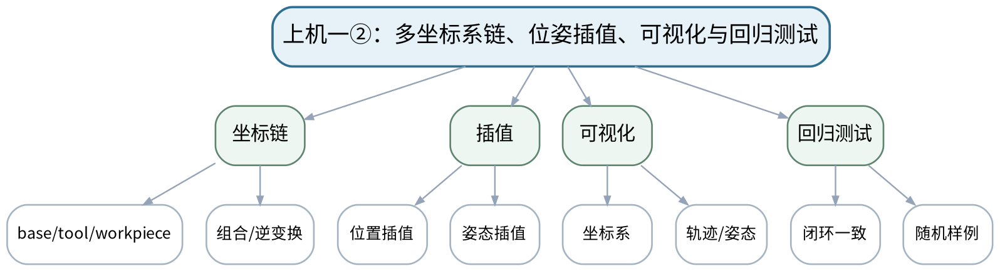

### 教学目标

**知识目标：**
- （1）理解多坐标系链和位姿插值的程序结构。
**能力目标：**
- （1）能够建立基座—工具—工件变换链、可视化坐标系，并实现插值/回归测试。
**价值目标：**
- （1）形成“图形只做辅助，矩阵与测试才是证据”的验证意识。

### 课程思政

强调工具箱结果必须能由数学约束和回归测试验证。

### 专创融合 / 双创融合

形成可直接被后续机械臂/移动机器人项目复用的空间数学小库。

### 教学重难点

教学重点：多坐标系链和插值的测试。
教学难点：插值不是简单对矩阵元素线性插值；可视化看似平滑也可能姿态约束错误。

### 教学方法

任务驱动法、分段编码法、上机实践法、单元/边界测试、故障注入、代码互审与复盘

### 教学用具

机房、VS Code/Jupyter、Python、NumPy、SpatialMath、Matplotlib、pytest或断言。

### 教学设计

课前任务 → 互动导入（15 min）→ 传授新知与课堂训练（70 min）→ 过关检测（10 min）→ 课堂小结（3 min）→ 作业布置（1 min）→ 考勤（1 min）

### 教学过程

#### 课前任务

【教师】发布“上机一②：多坐标系链、位姿插值、可视化与回归测试”预习/准备要求和一个最小问题，不提前给出完整答案。
- 1. 阅读大纲对应内容与指定教材/资料，圈出3个核心术语；
- 2. 确认Python环境、依赖和上一阶段代码可运行。
- 3. 记录至少1个疑问或风险点。
【学生】完成准备并带着问题进入课堂。

**设计意图：** 通过课前阅读、环境/安全检查和最小问题建立先备认知，让学生带着真实问题进入课堂。

#### 互动导入与传授新知 / 课堂训练

【互动导入 15 min】
【教师】展示一个对旋转矩阵逐元素线性插值产生非正交矩阵的例子，要求学生用测试而不是肉眼判断。
【学生】先独立预测/判断/操作，再交换依据，不先听完整结论。

【传授新知与课堂训练 70 min】
**一、任务说明与最小代码骨架（约15 min）—坐标链**

【教师】读取一组base→camera、camera→object、base→tool数据，计算tool与object关系并回代验证。

【学生】按任务约束完成分析/实现，保存中间结果并说明判断依据；教师只提示定位方法、边界与验收条件，不代替学生完成核心产物。

**二、学生独立/小组编码实现（约40 min）—插值与可视化**

【教师】实现/调用位置+姿态插值，绘坐标轴序列，检查旋转合法性。

【学生】按任务约束完成分析/实现，保存中间结果并说明判断依据；教师只提示定位方法、边界与验收条件，不代替学生完成核心产物。

**三、测试、故障注入与证据固化（约15 min）—回归测试**

【教师】生成随机合法位姿，测试组合/逆/插值端点，建立最小pytest或断言测试集。

【学生】按任务约束完成分析/实现，保存中间结果并说明判断依据；教师只提示定位方法、边界与验收条件，不代替学生完成核心产物。

【课堂产物】上机一完整包：空间数学模块 + 可视化 + 测试。

【学习证据】代码、测试日志、坐标图、失败样例和README约定。

【评价关联】课程作业；目标1.1、2.1、3.1。

**设计意图：** 采用“先预测/操作 → 最小讲解/示范 → 独立产出 → 测试/互审 → 证据固化”的闭环，使机器人学模型、算法和实验结论都有可复核证据。

#### 过关检测

【教师】组织当堂检测：
- 1. 为什么不能直接线性插值旋转矩阵元素？
- 2. 坐标链错误最常见的两类原因是什么？
- 3. 回归测试如何防止后续改代码破坏已有功能？
【学生】独立作答/运行/数据判断；【教师】依据错误类型进行针对性讲解并要求说明判断依据。

**设计意图：** 用概念、模型、边界和运行/数据验证即时检测关键知识，暴露易错点。

#### 课堂小结

【教师】回到知识脉络图，用“概念—模型—关系—应用—边界”总结“上机一②：多坐标系链、位姿插值、可视化与回归测试”，再次强调：多坐标系链和插值的测试。
【学生】写下本课最重要的一条规则和一个最容易出错的边界。

**设计意图：** 压缩本课信息并把规则、边界与后续任务连接。

#### 作业布置

【教师】布置课后任务：提交上机一成果，README明确角度单位、坐标命名和主要测试。
【学生】按课程文件命名和证据规范整理提交。

**设计意图：** 固化课堂产物，形成可复查、可复现的过程证据。

#### 考勤

【教师】利用学校/课程实际使用的平台进行签到。
【学生】按课程要求完成签到。

**设计意图：** 保留学校模板考勤环节，不在教案中预填出勤事实。

### 课后教学反思

【课后填写，不预填事实】
- 1. 教学流程：记录100 min各环节实际用时及需调整的位置；
- 2. 教学内容：重点记录“插值不是简单对矩阵元素线性插值；可视化看似平滑也可能姿态约束错误。”的真实掌握证据与常见错误；
- 3. 学生参与：仅依据实际课堂记录填写独立分析、实验、编码、互审或项目协作情况，不补写推测；
- 4. 评价证据：检查本课课堂产物/代码/实验数据/测试/项目记录是否完整，记录缺项及原因；
- 5. 后续改进：依据真实课堂证据确定下一轮调整。

### 本章节参考文献

[2] Corke, P. Robotics, Vision and Control: Fundamental Algorithms in Python（3rd Edition）[M]. Cham: Springer, 2023. ISBN 9783031064685

## 第19次课 上机二①：Python机械臂建模、正逆运动学与误差验证

- **章节/单元**：上机二 串联机械臂运动学、工作空间与奇异性
- **周次**：按实际课表填写
- **课时安排**：2课时（100 min）
- **课型**：上机

### 知识脉络图

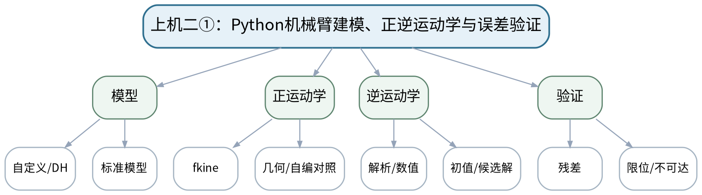

### 教学目标

**知识目标：**
- （1）理解工具箱机械臂模型、关节变量和FK/IK接口。
**能力目标：**
- （1）能够建立2R/3R/SCARA或标准六轴模型，完成FK/IK、残差和限位检查。
**价值目标：**
- （1）形成解析模型、自编函数与工具箱至少两种方法互证的习惯。

### 课程思政

强调软件成功标志不能替代工程约束验证，防止模型结果驱动设备越界。

### 专创融合 / 双创融合

把IK验收规则封装成可复用规划前置检查模块。

### 教学重难点

教学重点：FK/IK实现和残差/限位验证。
教学难点：工具箱IK成功标志不等于工程可用，必须检查末端误差、限位和候选构型。

### 教学方法

任务驱动法、分段编码法、上机实践法、单元/边界测试、故障注入、代码互审与复盘

### 教学用具

机房、Python、Robotics Toolbox for Python、SpatialMath、NumPy。

### 教学设计

课前任务 → 互动导入（15 min）→ 传授新知与课堂训练（70 min）→ 过关检测（10 min）→ 课堂小结（3 min）→ 作业布置（1 min）→ 考勤（1 min）

### 教学过程

#### 课前任务

【教师】发布“上机二①：Python机械臂建模、正逆运动学与误差验证”预习/准备要求和一个最小问题，不提前给出完整答案。
- 1. 阅读大纲对应内容与指定教材/资料，圈出3个核心术语；
- 2. 确认Python环境、依赖和上一阶段代码可运行。
- 3. 记录至少1个疑问或风险点。
【学生】完成准备并带着问题进入课堂。

**设计意图：** 通过课前阅读、环境/安全检查和最小问题建立先备认知，让学生带着真实问题进入课堂。

#### 互动导入与传授新知 / 课堂训练

【互动导入 15 min】
【教师】教师给出一个工具箱返回“success”的逆解，但其中一个关节超出实际限位，要求学生定义验收条件。
【学生】先独立预测/判断/操作，再交换依据，不先听完整结论。

【传授新知与课堂训练 70 min】
**一、任务说明与最小代码骨架（约15 min）—模型建立**

【教师】建立2R/3R/SCARA或六轴模型，打印连杆参数并与坐标图核对。

【学生】按任务约束完成分析/实现，保存中间结果并说明判断依据；教师只提示定位方法、边界与验收条件，不代替学生完成核心产物。

**二、学生独立/小组编码实现（约40 min）—FK/IK实现**

【教师】对若干关节配置计算FK，再用目标位姿求IK；比较解析/数值/工具箱结果。

【学生】按任务约束完成分析/实现，保存中间结果并说明判断依据；教师只提示定位方法、边界与验收条件，不代替学生完成核心产物。

**三、测试、故障注入与证据固化（约15 min）—边界测试**

【教师】构造多解、不可达、限位附近目标，记录残差、迭代/初值和筛选规则。

【学生】按任务约束完成分析/实现，保存中间结果并说明判断依据；教师只提示定位方法、边界与验收条件，不代替学生完成核心产物。

【课堂产物】机械臂模型脚本 + FK/IK测试集 + 解筛选报告。

【学习证据】代码、模型参数、目标/候选解、残差、限位/不可达测试。

【评价关联】课程作业；目标1.2、2.2、3.2。

**设计意图：** 采用“先预测/操作 → 最小讲解/示范 → 独立产出 → 测试/互审 → 证据固化”的闭环，使机器人学模型、算法和实验结论都有可复核证据。

#### 过关检测

【教师】组织当堂检测：
- 1. 如何用FK验证IK结果？
- 2. 数值IK为什么受初值影响？
- 3. success=True后还应检查哪些工程约束？
【学生】独立作答/运行/数据判断；【教师】依据错误类型进行针对性讲解并要求说明判断依据。

**设计意图：** 用概念、模型、边界和运行/数据验证即时检测关键知识，暴露易错点。

#### 课堂小结

【教师】回到知识脉络图，用“概念—模型—关系—应用—边界”总结“上机二①：Python机械臂建模、正逆运动学与误差验证”，再次强调：FK/IK实现和残差/限位验证。
【学生】写下本课最重要的一条规则和一个最容易出错的边界。

**设计意图：** 压缩本课信息并把规则、边界与后续任务连接。

#### 作业布置

【教师】布置课后任务：扩展到至少10个目标位姿，统计求解/拒绝情况并记录原因。
【学生】按课程文件命名和证据规范整理提交。

**设计意图：** 固化课堂产物，形成可复查、可复现的过程证据。

#### 考勤

【教师】利用学校/课程实际使用的平台进行签到。
【学生】按课程要求完成签到。

**设计意图：** 保留学校模板考勤环节，不在教案中预填出勤事实。

### 课后教学反思

【课后填写，不预填事实】
- 1. 教学流程：记录100 min各环节实际用时及需调整的位置；
- 2. 教学内容：重点记录“工具箱IK成功标志不等于工程可用，必须检查末端误差、限位和候选构型。”的真实掌握证据与常见错误；
- 3. 学生参与：仅依据实际课堂记录填写独立分析、实验、编码、互审或项目协作情况，不补写推测；
- 4. 评价证据：检查本课课堂产物/代码/实验数据/测试/项目记录是否完整，记录缺项及原因；
- 5. 后续改进：依据真实课堂证据确定下一轮调整。

### 本章节参考文献

[2] Corke, P. Robotics, Vision and Control: Fundamental Algorithms in Python（3rd Edition）[M]. Cham: Springer, 2023. ISBN 9783031064685
[1] 周晓敏, 郑莉芳, 刘鸿飞. 机器人学基础[M]. 北京：清华大学出版社，2023. ISBN 9787302635888

## 第20次课 上机二②：工作空间、雅可比、奇异性与边界测试

- **章节/单元**：上机二 串联机械臂运动学、工作空间与奇异性
- **周次**：按实际课表填写
- **课时安排**：2课时（100 min）
- **课型**：上机

### 知识脉络图

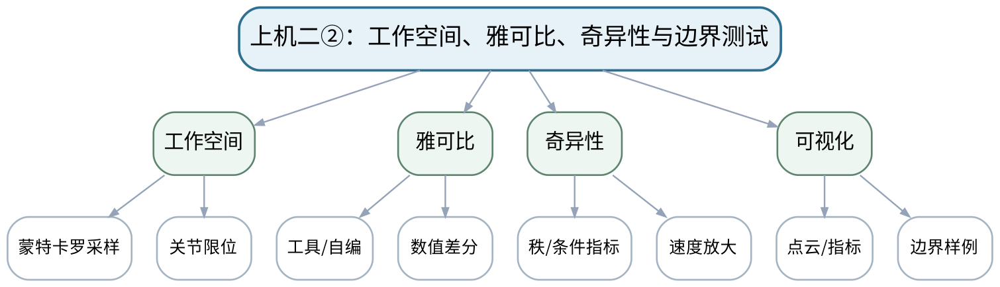

### 教学目标

**知识目标：**
- （1）理解工作空间采样、雅可比和奇异性在代码中的对应。
**能力目标：**
- （1）能够绘制工作空间、计算/调用雅可比，并用数值差分和指标识别奇异区域。
**价值目标：**
- （1）形成固定随机种子、记录关节限位和边界失败样例的可复现意识。

### 课程思政

要求完整保存边界失败样例，反对只展示“漂亮的工作空间”。

### 专创融合 / 双创融合

将工作空间和奇异性图作为工位布局与作业可行性评审工具。

### 教学重难点

教学重点：工作空间与雅可比/奇异性联合分析。
教学难点：采样图只能近似工作空间；奇异指标阈值与数值尺度需要解释。

### 教学方法

任务驱动法、分段编码法、上机实践法、单元/边界测试、故障注入、代码互审与复盘

### 教学用具

机房、Python、Robotics Toolbox、NumPy、Matplotlib。

### 教学设计

课前任务 → 互动导入（15 min）→ 传授新知与课堂训练（70 min）→ 过关检测（10 min）→ 课堂小结（3 min）→ 作业布置（1 min）→ 考勤（1 min）

### 教学过程

#### 课前任务

【教师】发布“上机二②：工作空间、雅可比、奇异性与边界测试”预习/准备要求和一个最小问题，不提前给出完整答案。
- 1. 阅读大纲对应内容与指定教材/资料，圈出3个核心术语；
- 2. 确认Python环境、依赖和上一阶段代码可运行。
- 3. 记录至少1个疑问或风险点。
【学生】完成准备并带着问题进入课堂。

**设计意图：** 通过课前阅读、环境/安全检查和最小问题建立先备认知，让学生带着真实问题进入课堂。

#### 互动导入与传授新知 / 课堂训练

【互动导入 15 min】
【教师】给出两张不同随机种子采样的“工作空间边界”，让学生判断为何点云边界不同但模型不一定变化。
【学生】先独立预测/判断/操作，再交换依据，不先听完整结论。

【传授新知与课堂训练 70 min】
**一、任务说明与最小代码骨架（约15 min）—工作空间**

【教师】在固定限位/随机种子下采样关节配置，绘位置点云并标记特定姿态/约束。

【学生】按任务约束完成分析/实现，保存中间结果并说明判断依据；教师只提示定位方法、边界与验收条件，不代替学生完成核心产物。

**二、学生独立/小组编码实现（约40 min）—雅可比验证**

【教师】对随机配置计算雅可比，与有限差分末端变化对照。

【学生】按任务约束完成分析/实现，保存中间结果并说明判断依据；教师只提示定位方法、边界与验收条件，不代替学生完成核心产物。

**三、测试、故障注入与证据固化（约15 min）—奇异测试**

【教师】扫描一条关节路径，记录最小奇异值/条件变化，观察接近奇异时速度映射。

【学生】按任务约束完成分析/实现，保存中间结果并说明判断依据；教师只提示定位方法、边界与验收条件，不代替学生完成核心产物。

【课堂产物】上机二完整包：工作空间图 + 雅可比验证 + 奇异性曲线。

【学习证据】代码、随机种子/限位、图表、差分误差、奇异边界样例。

【评价关联】课程作业；目标1.2、1.3、2.2、2.3、3.2。

**设计意图：** 采用“先预测/操作 → 最小讲解/示范 → 独立产出 → 测试/互审 → 证据固化”的闭环，使机器人学模型、算法和实验结论都有可复核证据。

#### 过关检测

【教师】组织当堂检测：
- 1. 采样点云为什么不能精确代表所有工作空间边界？
- 2. 数值差分步长太大/太小各有什么问题？
- 3. 接近奇异时如何从指标提前发现风险？
【学生】独立作答/运行/数据判断；【教师】依据错误类型进行针对性讲解并要求说明判断依据。

**设计意图：** 用概念、模型、边界和运行/数据验证即时检测关键知识，暴露易错点。

#### 课堂小结

【教师】回到知识脉络图，用“概念—模型—关系—应用—边界”总结“上机二②：工作空间、雅可比、奇异性与边界测试”，再次强调：工作空间与雅可比/奇异性联合分析。
【学生】写下本课最重要的一条规则和一个最容易出错的边界。

**设计意图：** 压缩本课信息并把规则、边界与后续任务连接。

#### 作业布置

【教师】布置课后任务：提交上机二报告，至少保留1个不可达和1个近奇异案例。
【学生】按课程文件命名和证据规范整理提交。

**设计意图：** 固化课堂产物，形成可复查、可复现的过程证据。

#### 考勤

【教师】利用学校/课程实际使用的平台进行签到。
【学生】按课程要求完成签到。

**设计意图：** 保留学校模板考勤环节，不在教案中预填出勤事实。

### 课后教学反思

【课后填写，不预填事实】
- 1. 教学流程：记录100 min各环节实际用时及需调整的位置；
- 2. 教学内容：重点记录“采样图只能近似工作空间；奇异指标阈值与数值尺度需要解释。”的真实掌握证据与常见错误；
- 3. 学生参与：仅依据实际课堂记录填写独立分析、实验、编码、互审或项目协作情况，不补写推测；
- 4. 评价证据：检查本课课堂产物/代码/实验数据/测试/项目记录是否完整，记录缺项及原因；
- 5. 后续改进：依据真实课堂证据确定下一轮调整。

### 本章节参考文献

[2] Corke, P. Robotics, Vision and Control: Fundamental Algorithms in Python（3rd Edition）[M]. Cham: Springer, 2023. ISBN 9783031064685

## 第21次课 上机三①：轨迹生成、连续性与时间尺度评价

- **章节/单元**：上机三 轨迹、动力学与关节控制仿真
- **周次**：按实际课表填写
- **课时安排**：2课时（100 min）
- **课型**：上机

### 知识脉络图

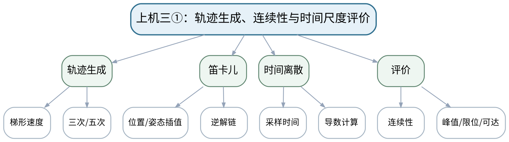

### 教学目标

**知识目标：**
- （1）理解梯形速度、三次/五次多项式和笛卡儿轨迹的程序实现。
**能力目标：**
- （1）能够生成轨迹并比较位置/速度/加速度连续性及约束。
**价值目标：**
- （1）形成图表单位、时间步和边界条件完整记录的规范。

### 课程思政

强调轨迹评价必须同时关注性能和设备安全约束。

### 专创融合 / 双创融合

将轨迹生成器包装为可配置模块，为节拍优化和项目复用。

### 教学重难点

教学重点：轨迹曲线与边界条件的程序验收。
教学难点：不同轨迹方法的曲线不能只看位置；需要联合速度、加速度、逆解和关节限位。

### 教学方法

任务驱动法、分段编码法、上机实践法、单元/边界测试、故障注入、代码互审与复盘

### 教学用具

机房、Python、NumPy、Matplotlib、Robotics Toolbox/SpatialMath。

### 教学设计

课前任务 → 互动导入（15 min）→ 传授新知与课堂训练（70 min）→ 过关检测（10 min）→ 课堂小结（3 min）→ 作业布置（1 min）→ 考勤（1 min）

### 教学过程

#### 课前任务

【教师】发布“上机三①：轨迹生成、连续性与时间尺度评价”预习/准备要求和一个最小问题，不提前给出完整答案。
- 1. 阅读大纲对应内容与指定教材/资料，圈出3个核心术语；
- 2. 确认Python环境、依赖和上一阶段代码可运行。
- 3. 记录至少1个疑问或风险点。
【学生】完成准备并带着问题进入课堂。

**设计意图：** 通过课前阅读、环境/安全检查和最小问题建立先备认知，让学生带着真实问题进入课堂。

#### 互动导入与传授新知 / 课堂训练

【互动导入 15 min】
【教师】教师只展示位置曲线，让学生要求补充速度/加速度后再判断轨迹是否可执行。
【学生】先独立预测/判断/操作，再交换依据，不先听完整结论。

【传授新知与课堂训练 70 min】
**一、任务说明与最小代码骨架（约15 min）—轨迹实现**

【教师】生成至少两种关节轨迹，设置相同起终点和总时间，保存q/qdot/qddot。

【学生】按任务约束完成分析/实现，保存中间结果并说明判断依据；教师只提示定位方法、边界与验收条件，不代替学生完成核心产物。

**二、学生独立/小组编码实现（约40 min）—笛卡儿对照**

【教师】生成末端位姿插值并通过IK得到关节序列，检查逆解跳变/不可达。

【学生】按任务约束完成分析/实现，保存中间结果并说明判断依据；教师只提示定位方法、边界与验收条件，不代替学生完成核心产物。

**三、测试、故障注入与证据固化（约15 min）—指标评价**

【教师】比较峰值速度/加速度、连续性和执行时间；故障注入过短时间。

【学生】按任务约束完成分析/实现，保存中间结果并说明判断依据；教师只提示定位方法、边界与验收条件，不代替学生完成核心产物。

【课堂产物】轨迹脚本 + q/qdot/qddot曲线 + 方法比较表。

【学习证据】代码、时间步、边界条件、曲线、峰值/约束和失败轨迹。

【评价关联】课程作业；目标1.3、2.3、3.3。

**设计意图：** 采用“先预测/操作 → 最小讲解/示范 → 独立产出 → 测试/互审 → 证据固化”的闭环，使机器人学模型、算法和实验结论都有可复核证据。

#### 过关检测

【教师】组织当堂检测：
- 1. 为什么不能只看位置轨迹？
- 2. 总时间减半对速度/加速度大致有什么趋势？
- 3. 笛卡儿轨迹为何还要检查IK连续性？
【学生】独立作答/运行/数据判断；【教师】依据错误类型进行针对性讲解并要求说明判断依据。

**设计意图：** 用概念、模型、边界和运行/数据验证即时检测关键知识，暴露易错点。

#### 课堂小结

【教师】回到知识脉络图，用“概念—模型—关系—应用—边界”总结“上机三①：轨迹生成、连续性与时间尺度评价”，再次强调：轨迹曲线与边界条件的程序验收。
【学生】写下本课最重要的一条规则和一个最容易出错的边界。

**设计意图：** 压缩本课信息并把规则、边界与后续任务连接。

#### 作业布置

【教师】布置课后任务：补充一组时间尺度对照，给出可执行性结论和依据。
【学生】按课程文件命名和证据规范整理提交。

**设计意图：** 固化课堂产物，形成可复查、可复现的过程证据。

#### 考勤

【教师】利用学校/课程实际使用的平台进行签到。
【学生】按课程要求完成签到。

**设计意图：** 保留学校模板考勤环节，不在教案中预填出勤事实。

### 课后教学反思

【课后填写，不预填事实】
- 1. 教学流程：记录100 min各环节实际用时及需调整的位置；
- 2. 教学内容：重点记录“不同轨迹方法的曲线不能只看位置；需要联合速度、加速度、逆解和关节限位。”的真实掌握证据与常见错误；
- 3. 学生参与：仅依据实际课堂记录填写独立分析、实验、编码、互审或项目协作情况，不补写推测；
- 4. 评价证据：检查本课课堂产物/代码/实验数据/测试/项目记录是否完整，记录缺项及原因；
- 5. 后续改进：依据真实课堂证据确定下一轮调整。

### 本章节参考文献

[2] Corke, P. Robotics, Vision and Control: Fundamental Algorithms in Python（3rd Edition）[M]. Cham: Springer, 2023. ISBN 9783031064685
[1] 周晓敏, 郑莉芳, 刘鸿飞. 机器人学基础[M]. 北京：清华大学出版社，2023. ISBN 9787302635888

## 第22次课 上机三②：动力学、负载影响与PID/前馈控制仿真

- **章节/单元**：上机三 轨迹、动力学与关节控制仿真
- **周次**：按实际课表填写
- **课时安排**：2课时（100 min）
- **课型**：上机

### 知识脉络图

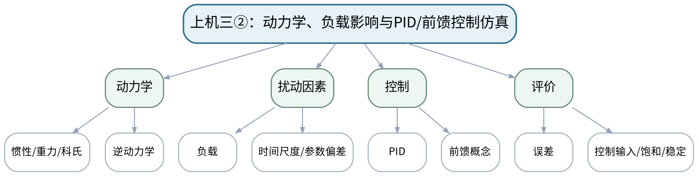

### 教学目标

**知识目标：**
- （1）理解工具箱/简化动力学模型输出和控制环节。
**能力目标：**
- （1）能够比较负载、时间尺度或参数变化下的力矩与跟踪误差，并完成基础PID/前馈仿真。
**价值目标：**
- （1）形成参数扫描、控制输入与误差同时评价的实证意识。

### 课程思政

将安全限值纳入控制评价，避免只以误差最小为目标。

### 专创融合 / 双创融合

把参数扫描转化为机器人控制方案的自动化验收思路。

### 教学重难点

教学重点：动力学参数与控制曲线的因果解释。
教学难点：只优化误差可能导致过大控制输入；参数扫描需要固定其他条件。

### 教学方法

任务驱动法、分段编码法、上机实践法、单元/边界测试、故障注入、代码互审与复盘

### 教学用具

机房、Python、Robotics Toolbox/简化动力学模型、Matplotlib。

### 教学设计

课前任务 → 互动导入（15 min）→ 传授新知与课堂训练（70 min）→ 过关检测（10 min）→ 课堂小结（3 min）→ 作业布置（1 min）→ 考勤（1 min）

### 教学过程

#### 课前任务

【教师】发布“上机三②：动力学、负载影响与PID/前馈控制仿真”预习/准备要求和一个最小问题，不提前给出完整答案。
- 1. 阅读大纲对应内容与指定教材/资料，圈出3个核心术语；
- 2. 确认Python环境、依赖和上一阶段代码可运行。
- 3. 记录至少1个疑问或风险点。
【学生】完成准备并带着问题进入课堂。

**设计意图：** 通过课前阅读、环境/安全检查和最小问题建立先备认知，让学生带着真实问题进入课堂。

#### 互动导入与传授新知 / 课堂训练

【互动导入 15 min】
【教师】给出两组控制结果：误差更小的一组力矩已经超限，要求学生判断哪组“更好”。
【学生】先独立预测/判断/操作，再交换依据，不先听完整结论。

【传授新知与课堂训练 70 min】
**一、任务说明与最小代码骨架（约15 min）—动力学比较**

【教师】使用简化模型/工具箱计算空载与负载、慢轨迹与快轨迹的关节力矩。

【学生】按任务约束完成分析/实现，保存中间结果并说明判断依据；教师只提示定位方法、边界与验收条件，不代替学生完成核心产物。

**二、学生独立/小组编码实现（约40 min）—控制仿真**

【教师】搭建基础关节PID/前馈控制，保存参考、响应、误差和控制输入。

【学生】按任务约束完成分析/实现，保存中间结果并说明判断依据；教师只提示定位方法、边界与验收条件，不代替学生完成核心产物。

**三、测试、故障注入与证据固化（约15 min）—参数扫描**

【教师】一次改变一个主参数，比较误差、峰值输入和稳定性，记录不可接受组合。

【学生】按任务约束完成分析/实现，保存中间结果并说明判断依据；教师只提示定位方法、边界与验收条件，不代替学生完成核心产物。

【课堂产物】上机三完整包：动力学/控制脚本 + 参数扫描报告。

【学习证据】代码、参数、力矩/误差/控制输入曲线、超限/失败样例。

【评价关联】课程作业；目标1.3、2.3、3.3。

**设计意图：** 采用“先预测/操作 → 最小讲解/示范 → 独立产出 → 测试/互审 → 证据固化”的闭环，使机器人学模型、算法和实验结论都有可复核证据。

#### 过关检测

【教师】组织当堂检测：
- 1. 为什么控制评价要同时看误差和输入？
- 2. 负载增大对重力项/惯性项有什么影响？
- 3. 参数扫描为什么要固定其他条件？
【学生】独立作答/运行/数据判断；【教师】依据错误类型进行针对性讲解并要求说明判断依据。

**设计意图：** 用概念、模型、边界和运行/数据验证即时检测关键知识，暴露易错点。

#### 课堂小结

【教师】回到知识脉络图，用“概念—模型—关系—应用—边界”总结“上机三②：动力学、负载影响与PID/前馈控制仿真”，再次强调：动力学参数与控制曲线的因果解释。
【学生】写下本课最重要的一条规则和一个最容易出错的边界。

**设计意图：** 压缩本课信息并把规则、边界与后续任务连接。

#### 作业布置

【教师】布置课后任务：提交上机三报告，说明一组“误差更小但工程上不可接受”的情况。
【学生】按课程文件命名和证据规范整理提交。

**设计意图：** 固化课堂产物，形成可复查、可复现的过程证据。

#### 考勤

【教师】利用学校/课程实际使用的平台进行签到。
【学生】按课程要求完成签到。

**设计意图：** 保留学校模板考勤环节，不在教案中预填出勤事实。

### 课后教学反思

【课后填写，不预填事实】
- 1. 教学流程：记录100 min各环节实际用时及需调整的位置；
- 2. 教学内容：重点记录“只优化误差可能导致过大控制输入；参数扫描需要固定其他条件。”的真实掌握证据与常见错误；
- 3. 学生参与：仅依据实际课堂记录填写独立分析、实验、编码、互审或项目协作情况，不补写推测；
- 4. 评价证据：检查本课课堂产物/代码/实验数据/测试/项目记录是否完整，记录缺项及原因；
- 5. 后续改进：依据真实课堂证据确定下一轮调整。

### 本章节参考文献

[2] Corke, P. Robotics, Vision and Control: Fundamental Algorithms in Python（3rd Edition）[M]. Cham: Springer, 2023. ISBN 9783031064685
[1] 周晓敏, 郑莉芳, 刘鸿飞. 机器人学基础[M]. 北京：清华大学出版社，2023. ISBN 9787302635888

## 第23次课 上机四①：移动模型、里程计与路径规划

- **章节/单元**：上机四 移动机器人规划、跟踪与多构型比较
- **周次**：按实际课表填写
- **课时安排**：2课时（100 min）
- **课型**：上机

### 知识脉络图

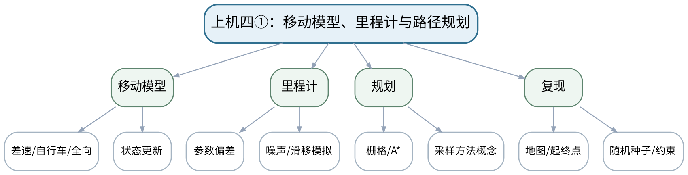

### 教学目标

**知识目标：**
- （1）理解差速/自行车/全向模型和规划算法代码结构。
**能力目标：**
- （1）能够实现移动状态更新、里程计仿真及A*/等价规划，固定地图、约束和随机种子。
**价值目标：**
- （1）形成场景、参数、随机性和失败案例可复现的规范。

### 课程思政

要求失败路径和无解场景如实保留，培养可靠算法评价习惯。

### 专创融合 / 双创融合

将规划测试集作为AMR软件功能验收资产。

### 教学重难点

教学重点：移动模型与规划输入的可复现设置。
教学难点：规划算法成功不代表路径可跟踪，需要考虑机器人几何/运动约束和地图分辨率。

### 教学方法

任务驱动法、分段编码法、上机实践法、单元/边界测试、故障注入、代码互审与复盘

### 教学用具

机房、Python、NumPy、Matplotlib、栅格地图/规划代码。

### 教学设计

课前任务 → 互动导入（15 min）→ 传授新知与课堂训练（70 min）→ 过关检测（10 min）→ 课堂小结（3 min）→ 作业布置（1 min）→ 考勤（1 min）

### 教学过程

#### 课前任务

【教师】发布“上机四①：移动模型、里程计与路径规划”预习/准备要求和一个最小问题，不提前给出完整答案。
- 1. 阅读大纲对应内容与指定教材/资料，圈出3个核心术语；
- 2. 确认Python环境、依赖和上一阶段代码可运行。
- 3. 记录至少1个疑问或风险点。
【学生】完成准备并带着问题进入课堂。

**设计意图：** 通过课前阅读、环境/安全检查和最小问题建立先备认知，让学生带着真实问题进入课堂。

#### 互动导入与传授新知 / 课堂训练

【互动导入 15 min】
【教师】给出一条A*最短路径含90°尖角，要求学生判断对自行车型机器人是否直接可执行。
【学生】先独立预测/判断/操作，再交换依据，不先听完整结论。

【传授新知与课堂训练 70 min】
**一、任务说明与最小代码骨架（约15 min）—模型与里程计**

【教师】实现差速/等价模型，加入轮径偏差或噪声，比较真实状态与里程计估计。

【学生】按任务约束完成分析/实现，保存中间结果并说明判断依据；教师只提示定位方法、边界与验收条件，不代替学生完成核心产物。

**二、学生独立/小组编码实现（约40 min）—路径规划**

【教师】固定栅格地图和起终点，实现A*或等价方法，保存路径和搜索结果。

【学生】按任务约束完成分析/实现，保存中间结果并说明判断依据；教师只提示定位方法、边界与验收条件，不代替学生完成核心产物。

**三、测试、故障注入与证据固化（约15 min）—边界测试**

【教师】构造无路、狭窄、起终点非法场景，记录算法失败/拒绝而非只保留成功。

【学生】按任务约束完成分析/实现，保存中间结果并说明判断依据；教师只提示定位方法、边界与验收条件，不代替学生完成核心产物。

【课堂产物】移动模型/里程计脚本 + 规划器 + 边界测试。

【学习证据】源代码、地图/起终点、参数/随机种子、路径/失败日志。

【评价关联】课程作业；目标1.4、2.4、3.4。

**设计意图：** 采用“先预测/操作 → 最小讲解/示范 → 独立产出 → 测试/互审 → 证据固化”的闭环，使机器人学模型、算法和实验结论都有可复核证据。

#### 过关检测

【教师】组织当堂检测：
- 1. 规划路径为什么还要检查机器人运动约束？
- 2. 随机采样算法为何要记录随机种子？
- 3. 无路可达时程序应该怎样返回？
【学生】独立作答/运行/数据判断；【教师】依据错误类型进行针对性讲解并要求说明判断依据。

**设计意图：** 用概念、模型、边界和运行/数据验证即时检测关键知识，暴露易错点。

#### 课堂小结

【教师】回到知识脉络图，用“概念—模型—关系—应用—边界”总结“上机四①：移动模型、里程计与路径规划”，再次强调：移动模型与规划输入的可复现设置。
【学生】写下本课最重要的一条规则和一个最容易出错的边界。

**设计意图：** 压缩本课信息并把规则、边界与后续任务连接。

#### 作业布置

【教师】布置课后任务：增加至少3个边界地图，形成规划测试集。
【学生】按课程文件命名和证据规范整理提交。

**设计意图：** 固化课堂产物，形成可复查、可复现的过程证据。

#### 考勤

【教师】利用学校/课程实际使用的平台进行签到。
【学生】按课程要求完成签到。

**设计意图：** 保留学校模板考勤环节，不在教案中预填出勤事实。

### 课后教学反思

【课后填写，不预填事实】
- 1. 教学流程：记录100 min各环节实际用时及需调整的位置；
- 2. 教学内容：重点记录“规划算法成功不代表路径可跟踪，需要考虑机器人几何/运动约束和地图分辨率。”的真实掌握证据与常见错误；
- 3. 学生参与：仅依据实际课堂记录填写独立分析、实验、编码、互审或项目协作情况，不补写推测；
- 4. 评价证据：检查本课课堂产物/代码/实验数据/测试/项目记录是否完整，记录缺项及原因；
- 5. 后续改进：依据真实课堂证据确定下一轮调整。

### 本章节参考文献

[4] 仉新, 矫健, 付垚. 移动机器人原理与应用[M]. 北京：清华大学出版社，2025. ISBN 9787302704478
[2] Corke, P. Robotics, Vision and Control: Fundamental Algorithms in Python（3rd Edition）[M]. Cham: Springer, 2023. ISBN 9783031064685

## 第24次课 上机四②：轨迹跟踪、规划失败与多构型指标比较

- **章节/单元**：上机四 移动机器人规划、跟踪与多构型比较
- **周次**：按实际课表填写
- **课时安排**：2课时（100 min）
- **课型**：上机

### 知识脉络图

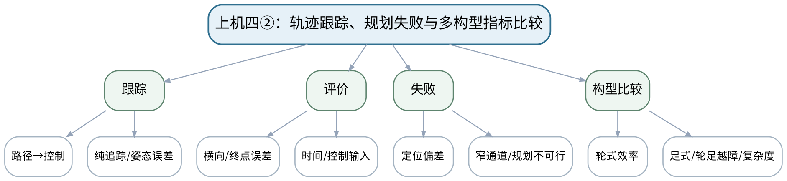

### 教学目标

**知识目标：**
- （1）理解纯追踪/姿态误差等跟踪方法与规划路径的接口。
**能力目标：**
- （1）能够完成轨迹跟踪、误差评价，并用简化指标比较轮式与足式/轮足构型。
**价值目标：**
- （1）形成场景驱动、多指标权衡和模型边界意识。

### 课程思政

强调“失败可见、边界明确、不过度推断”，落实机器人算法工程责任。

### 专创融合 / 双创融合

形成可用于机器人方案选型的小型场景基准与评价报告。

### 教学重难点

教学重点：规划—跟踪闭环和多指标比较。
教学难点：不同构型的简化模型层级不同，比较时只能对共同可测指标下结论。

### 教学方法

任务驱动法、分段编码法、上机实践法、单元/边界测试、故障注入、代码互审与复盘

### 教学用具

机房、Python、规划/跟踪代码、Matplotlib、固定场景数据。

### 教学设计

课前任务 → 互动导入（15 min）→ 传授新知与课堂训练（70 min）→ 过关检测（10 min）→ 课堂小结（3 min）→ 作业布置（1 min）→ 考勤（1 min）

### 教学过程

#### 课前任务

【教师】发布“上机四②：轨迹跟踪、规划失败与多构型指标比较”预习/准备要求和一个最小问题，不提前给出完整答案。
- 1. 阅读大纲对应内容与指定教材/资料，圈出3个核心术语；
- 2. 确认Python环境、依赖和上一阶段代码可运行。
- 3. 记录至少1个疑问或风险点。
【学生】完成准备并带着问题进入课堂。

**设计意图：** 通过课前阅读、环境/安全检查和最小问题建立先备认知，让学生带着真实问题进入课堂。

#### 互动导入与传授新知 / 课堂训练

【互动导入 15 min】
【教师】同一地图中轮式机器人速度快但越障失败，轮足模型较慢但通过，要求学生建立指标而非直接宣布“谁更先进”。
【学生】先独立预测/判断/操作，再交换依据，不先听完整结论。

【传授新知与课堂训练 70 min】
**一、任务说明与最小代码骨架（约15 min）—跟踪实现**

【教师】将上次路径输入纯追踪/等价控制器，记录轨迹和误差；调整预瞄/速度等参数。

【学生】按任务约束完成分析/实现，保存中间结果并说明判断依据；教师只提示定位方法、边界与验收条件，不代替学生完成核心产物。

**二、学生独立/小组编码实现（约40 min）—失败注入**

【教师】加入定位偏差、速度过高、急弯等情况，观察跟踪失败并提出安全降级。

【学生】按任务约束完成分析/实现，保存中间结果并说明判断依据；教师只提示定位方法、边界与验收条件，不代替学生完成核心产物。

**三、测试、故障注入与证据固化（约15 min）—构型比较**

【教师】固定场景，比较轮式与简化足式/轮足在时间、路径、越障、能耗代理、复杂度等指标，明确模型局限。

【学生】按任务约束完成分析/实现，保存中间结果并说明判断依据；教师只提示定位方法、边界与验收条件，不代替学生完成核心产物。

【课堂产物】上机四完整包：规划+跟踪+多构型比较报告。

【学习证据】代码、跟踪轨迹/误差、失败场景、指标表、模型局限说明。

【评价关联】课程作业；目标1.4、1.5、2.4、2.5、3.4、3.5。

**设计意图：** 采用“先预测/操作 → 最小讲解/示范 → 独立产出 → 测试/互审 → 证据固化”的闭环，使机器人学模型、算法和实验结论都有可复核证据。

#### 过关检测

【教师】组织当堂检测：
- 1. 预瞄距离过大/过小可能分别带来什么现象？
- 2. 比较两种构型时为什么要固定场景和指标？
- 3. 模型层级不同的结果可以支持什么、不可以支持什么？
【学生】独立作答/运行/数据判断；【教师】依据错误类型进行针对性讲解并要求说明判断依据。

**设计意图：** 用概念、模型、边界和运行/数据验证即时检测关键知识，暴露易错点。

#### 课堂小结

【教师】回到知识脉络图，用“概念—模型—关系—应用—边界”总结“上机四②：轨迹跟踪、规划失败与多构型指标比较”，再次强调：规划—跟踪闭环和多指标比较。
【学生】写下本课最重要的一条规则和一个最容易出错的边界。

**设计意图：** 压缩本课信息并把规则、边界与后续任务连接。

#### 作业布置

【教师】布置课后任务：提交上机四报告，保留至少一个规划失败和一个跟踪失败案例。
【学生】按课程文件命名和证据规范整理提交。

**设计意图：** 固化课堂产物，形成可复查、可复现的过程证据。

#### 考勤

【教师】利用学校/课程实际使用的平台进行签到。
【学生】按课程要求完成签到。

**设计意图：** 保留学校模板考勤环节，不在教案中预填出勤事实。

### 课后教学反思

【课后填写，不预填事实】
- 1. 教学流程：记录100 min各环节实际用时及需调整的位置；
- 2. 教学内容：重点记录“不同构型的简化模型层级不同，比较时只能对共同可测指标下结论。”的真实掌握证据与常见错误；
- 3. 学生参与：仅依据实际课堂记录填写独立分析、实验、编码、互审或项目协作情况，不补写推测；
- 4. 评价证据：检查本课课堂产物/代码/实验数据/测试/项目记录是否完整，记录缺项及原因；
- 5. 后续改进：依据真实课堂证据确定下一轮调整。

### 本章节参考文献

[4] 仉新, 矫健, 付垚. 移动机器人原理与应用[M]. 北京：清华大学出版社，2025. ISBN 9787302704478
[2] Corke, P. Robotics, Vision and Control: Fundamental Algorithms in Python（3rd Edition）[M]. Cham: Springer, 2023. ISBN 9783031064685

## 第25次课 综合项目①：场景选题、需求、机器人构型与安全边界

- **章节/单元**：项目一 机器人任务定义与系统建模
- **周次**：按实际课表填写
- **课时安排**：2课时（100 min）
- **课型**：项目式

### 知识脉络图

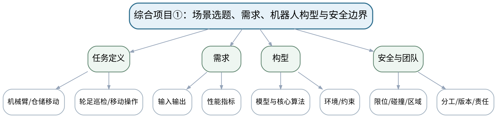

### 教学目标

**知识目标：**
- （1）理解项目任务、需求、构型、指标和安全边界的对应关系。
**能力目标：**
- （1）能够从四类方向中定义可验证项目，确定输入输出、约束、性能指标和安全场景。
**价值目标：**
- （1）形成需求驱动、风险前置、团队分工可追溯意识。

### 课程思政

将人员/设备安全、学术诚信、外部代码来源和个人责任前置到项目需求。

### 专创融合 / 双创融合

训练从技术兴趣转化为有场景、有指标、有验收的机器人项目立项能力。

### 教学重难点

教学重点：项目可验证需求与安全边界。
教学难点：避免把“做一个机器人仿真”当作需求；必须把成功、边界和失败条件写成可测试标准。

### 教学方法

项目驱动法、里程碑评审、接口先行、团队协作、测试验收、版本管理与个人核验

### 教学用具

机房/研讨环境、需求与风险模板、Git、Python项目骨架。

### 教学设计

课前任务 → 互动导入（15 min）→ 传授新知与课堂训练（70 min）→ 过关检测（10 min）→ 课堂小结（3 min）→ 作业布置（1 min）→ 考勤（1 min）

### 教学过程

#### 课前任务

【教师】发布“综合项目①：场景选题、需求、机器人构型与安全边界”预习/准备要求和一个最小问题，不提前给出完整答案。
- 1. 阅读大纲对应内容与指定教材/资料，圈出3个核心术语；
- 2. 更新Git/任务清单，带上当前版本、问题和待验收证据。
- 3. 记录至少1个疑问或风险点。
【学生】完成准备并带着问题进入课堂。

**设计意图：** 通过课前阅读、环境/安全检查和最小问题建立先备认知，让学生带着真实问题进入课堂。

#### 互动导入与传授新知 / 课堂训练

【互动导入 15 min】
【教师】教师给出“做一个智能仓储机器人”的模糊题目，要求团队在10分钟内把它改写成可验收需求。
【学生】先独立预测/判断/操作，再交换依据，不先听完整结论。

【传授新知与课堂训练 70 min】
**一、里程碑与接口/验收条件确认（约15 min）—选题与范围**

【教师】从机械臂抓取/装配、仓储移动、轮足巡检、移动操作中选题，明确课程范围，不引入ROS系统工程。

【学生】按任务约束完成分析/实现，保存中间结果并说明判断依据；教师只提示定位方法、边界与验收条件，不代替学生完成核心产物。

**二、团队独立开发/评审/集成（约40 min）—需求与指标**

【教师】定义任务对象、坐标/状态、输入输出、精度/时间/路径/稳定等指标及环境约束。

【学生】按任务约束完成分析/实现，保存中间结果并说明判断依据；教师只提示定位方法、边界与验收条件，不代替学生完成核心产物。

**三、测试、复盘与版本固化（约15 min）—风险与分工**

【教师】建立安全边界、失败场景、人工确认点和团队模块分工/Git责任。

【学生】按任务约束完成分析/实现，保存中间结果并说明判断依据；教师只提示定位方法、边界与验收条件，不代替学生完成核心产物。

【课堂产物】项目任务书V1：场景、需求、构型、指标、安全边界、团队分工。

【学习证据】任务书、指标表、风险清单、分工记录和评审修改。

【评价关联】期末考核—综合项目；目标1.1—1.6、2.1—2.6、3.1—3.6。

**设计意图：** 采用“先预测/操作 → 最小讲解/示范 → 独立产出 → 测试/互审 → 证据固化”的闭环，使机器人学模型、算法和实验结论都有可复核证据。

#### 过关检测

【教师】组织当堂检测：
- 1. 一个项目需求怎样才算“可测试”？
- 2. 为什么构型必须由场景指标决定？
- 3. 安全边界应在项目哪个阶段定义？
【学生】独立作答/运行/数据判断；【教师】依据错误类型进行针对性讲解并要求说明判断依据。

**设计意图：** 用概念、模型、边界和运行/数据验证即时检测关键知识，暴露易错点。

#### 课堂小结

【教师】回到知识脉络图，用“概念—模型—关系—应用—边界”总结“综合项目①：场景选题、需求、机器人构型与安全边界”，再次强调：项目可验证需求与安全边界。
【学生】写下本课最重要的一条规则和一个最容易出错的边界。

**设计意图：** 压缩本课信息并把规则、边界与后续任务连接。

#### 作业布置

【教师】布置课后任务：根据评审意见修订任务书，冻结项目V1范围和验收指标。
【学生】按课程文件命名和证据规范整理提交。

**设计意图：** 固化课堂产物，形成可复查、可复现的过程证据。

#### 考勤

【教师】利用学校/课程实际使用的平台进行签到。
【学生】按课程要求完成签到。

**设计意图：** 保留学校模板考勤环节，不在教案中预填出勤事实。

### 课后教学反思

【课后填写，不预填事实】
- 1. 教学流程：记录100 min各环节实际用时及需调整的位置；
- 2. 教学内容：重点记录“避免把“做一个机器人仿真”当作需求；必须把成功、边界和失败条件写成可测试标准。”的真实掌握证据与常见错误；
- 3. 学生参与：仅依据实际课堂记录填写独立分析、实验、编码、互审或项目协作情况，不补写推测；
- 4. 评价证据：检查本课课堂产物/代码/实验数据/测试/项目记录是否完整，记录缺项及原因；
- 5. 后续改进：依据真实课堂证据确定下一轮调整。

### 本章节参考文献

[3] 赵建伟, 马学品, 盖逸馨, 毛向军, 梅勇, 钱航, 姚志广. 机器人系统设计及其应用技术（第2版）[M]. 北京：清华大学出版社，2024. ISBN 9787302676577
[2] Corke, P. Robotics, Vision and Control: Fundamental Algorithms in Python（3rd Edition）[M]. Cham: Springer, 2023. ISBN 9783031064685

## 第26次课 综合项目②：系统模型、算法链、接口与测试计划评审

- **章节/单元**：项目一 机器人任务定义与系统建模
- **周次**：按实际课表填写
- **课时安排**：2课时（100 min）
- **课型**：项目式

### 知识脉络图

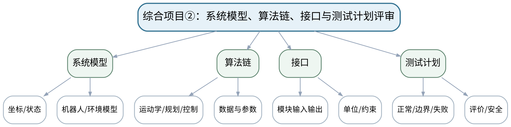

### 教学目标

**知识目标：**
- （1）理解项目中空间/运动学/移动/稳定模型与算法模块之间的接口。
**能力目标：**
- （1）能够形成系统图、模型说明、算法链、接口表和测试计划。
**价值目标：**
- （1）形成接口契约、模型假设和测试先行意识。

### 课程思政

通过接口契约和测试先行减少团队协作中的责任模糊与结果不可追溯。

### 专创融合 / 双创融合

把系统图和测试计划视为机器人技术方案评审的正式工程文档。

### 教学重难点

教学重点：系统模型与算法接口闭合。
教学难点：项目不能只列算法名；每个模块必须说明输入、输出、参数、假设和验证方式。

### 教学方法

项目驱动法、里程碑评审、接口先行、团队协作、测试验收、版本管理与个人核验

### 教学用具

机房、Python项目骨架、Git、建模/接口/测试模板。

### 教学设计

课前任务 → 互动导入（15 min）→ 传授新知与课堂训练（70 min）→ 过关检测（10 min）→ 课堂小结（3 min）→ 作业布置（1 min）→ 考勤（1 min）

### 教学过程

#### 课前任务

【教师】发布“综合项目②：系统模型、算法链、接口与测试计划评审”预习/准备要求和一个最小问题，不提前给出完整答案。
- 1. 阅读大纲对应内容与指定教材/资料，圈出3个核心术语；
- 2. 更新Git/任务清单，带上当前版本、问题和待验收证据。
- 3. 记录至少1个疑问或风险点。
【学生】完成准备并带着问题进入课堂。

**设计意图：** 通过课前阅读、环境/安全检查和最小问题建立先备认知，让学生带着真实问题进入课堂。

#### 互动导入与传授新知 / 课堂训练

【互动导入 15 min】
【教师】教师展示一张只有“IK→规划→控制”三个框的架构图，要求学生补齐数据、单位、状态和失败返回。
【学生】先独立预测/判断/操作，再交换依据，不先听完整结论。

【传授新知与课堂训练 70 min】
**一、里程碑与接口/验收条件确认（约15 min）—模型冻结**

【教师】完成机器人、环境、坐标/状态和约束模型，记录来源与简化假设。

【学生】按任务约束完成分析/实现，保存中间结果并说明判断依据；教师只提示定位方法、边界与验收条件，不代替学生完成核心产物。

**二、团队独立开发/评审/集成（约40 min）—算法与接口**

【教师】明确核心算法链，填写模块输入/输出/参数/异常接口表，避免隐藏全局变量。

【学生】按任务约束完成分析/实现，保存中间结果并说明判断依据；教师只提示定位方法、边界与验收条件，不代替学生完成核心产物。

**三、测试、复盘与版本固化（约15 min）—测试评审**

【教师】设计正常、边界、奇异/不可达、规划失败、误差或安全场景，给出通过判据和证据形式。

【学生】按任务约束完成分析/实现，保存中间结果并说明判断依据；教师只提示定位方法、边界与验收条件，不代替学生完成核心产物。

【课堂产物】项目设计包V2：系统图 + 模型 + 接口表 + 算法流程 + 测试计划。

【学习证据】模型文件/图、接口表、测试用例、评审意见与修改记录。

【评价关联】期末考核—综合项目；目标1.1—1.6、2.1—2.6、3.1—3.6。

**设计意图：** 采用“先预测/操作 → 最小讲解/示范 → 独立产出 → 测试/互审 → 证据固化”的闭环，使机器人学模型、算法和实验结论都有可复核证据。

#### 过关检测

【教师】组织当堂检测：
- 1. 接口表至少要写哪些字段？
- 2. 模型假设为什么必须进入报告？
- 3. 测试计划为什么要在实现前完成？
【学生】独立作答/运行/数据判断；【教师】依据错误类型进行针对性讲解并要求说明判断依据。

**设计意图：** 用概念、模型、边界和运行/数据验证即时检测关键知识，暴露易错点。

#### 课堂小结

【教师】回到知识脉络图，用“概念—模型—关系—应用—边界”总结“综合项目②：系统模型、算法链、接口与测试计划评审”，再次强调：系统模型与算法接口闭合。
【学生】写下本课最重要的一条规则和一个最容易出错的边界。

**设计意图：** 压缩本课信息并把规则、边界与后续任务连接。

#### 作业布置

【教师】布置课后任务：冻结接口与测试计划，完成最小可运行骨架，为下一阶段实现准备。
【学生】按课程文件命名和证据规范整理提交。

**设计意图：** 固化课堂产物，形成可复查、可复现的过程证据。

#### 考勤

【教师】利用学校/课程实际使用的平台进行签到。
【学生】按课程要求完成签到。

**设计意图：** 保留学校模板考勤环节，不在教案中预填出勤事实。

### 课后教学反思

【课后填写，不预填事实】
- 1. 教学流程：记录100 min各环节实际用时及需调整的位置；
- 2. 教学内容：重点记录“项目不能只列算法名；每个模块必须说明输入、输出、参数、假设和验证方式。”的真实掌握证据与常见错误；
- 3. 学生参与：仅依据实际课堂记录填写独立分析、实验、编码、互审或项目协作情况，不补写推测；
- 4. 评价证据：检查本课课堂产物/代码/实验数据/测试/项目记录是否完整，记录缺项及原因；
- 5. 后续改进：依据真实课堂证据确定下一轮调整。

### 本章节参考文献

[3] 赵建伟, 马学品, 盖逸馨, 毛向军, 梅勇, 钱航, 姚志广. 机器人系统设计及其应用技术（第2版）[M]. 北京：清华大学出版社，2024. ISBN 9787302676577
[2] Corke, P. Robotics, Vision and Control: Fundamental Algorithms in Python（3rd Edition）[M]. Cham: Springer, 2023. ISBN 9783031064685

## 第27次课 综合项目③：核心实现、联合仿真与故障/边界测试

- **章节/单元**：项目二 Python机器人系统实现、验证与答辩
- **周次**：按实际课表填写
- **课时安排**：2课时（100 min）
- **课型**：项目式

### 知识脉络图

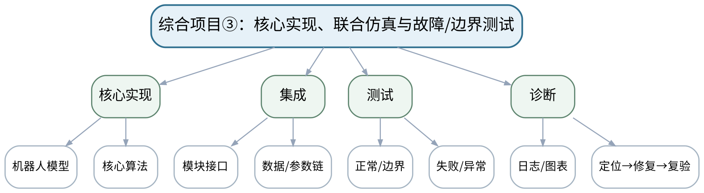

### 教学目标

**知识目标：**
- （1）理解项目核心算法、数据和测试证据之间的关系。
**能力目标：**
- （1）能够完成Python核心链路并运行正常、边界和失败测试，定位模型/参数/算法问题。
**价值目标：**
- （1）形成失败证据保留、版本可复现和安全降级意识。

### 课程思政

要求真实记录失败和修复，工具或AI辅助内容必须由团队运行、解释和验证。

### 专创融合 / 双创融合

训练从“算法能跑”走向“系统可测试、可复现、可维护”的机器人软件交付。

### 教学重难点

教学重点：端到端核心链和失败测试。
教学难点：多个模块单独通过后仍可能因接口/单位/坐标/参数集成失败，需要分层定位。

### 教学方法

项目驱动法、里程碑评审、接口先行、团队协作、测试验收、版本管理与个人核验

### 教学用具

机房、Python、Git、测试/日志工具、所需机器人仿真与数据。

### 教学设计

课前任务 → 互动导入（15 min）→ 传授新知与课堂训练（70 min）→ 过关检测（10 min）→ 课堂小结（3 min）→ 作业布置（1 min）→ 考勤（1 min）

### 教学过程

#### 课前任务

【教师】发布“综合项目③：核心实现、联合仿真与故障/边界测试”预习/准备要求和一个最小问题，不提前给出完整答案。
- 1. 阅读大纲对应内容与指定教材/资料，圈出3个核心术语；
- 2. 更新Git/任务清单，带上当前版本、问题和待验收证据。
- 3. 记录至少1个疑问或风险点。
【学生】完成准备并带着问题进入课堂。

**设计意图：** 通过课前阅读、环境/安全检查和最小问题建立先备认知，让学生带着真实问题进入课堂。

#### 互动导入与传授新知 / 课堂训练

【互动导入 15 min】
【教师】以一个“单元测试都过、集成轨迹却错位”的案例要求团队先查坐标/单位/接口，而不是立刻改核心算法。
【学生】先独立预测/判断/操作，再交换依据，不先听完整结论。

【传授新知与课堂训练 70 min】
**一、里程碑与接口/验收条件确认（约15 min）—实现与集成**

【教师】按冻结接口完成核心机器人模型和至少一种算法，保持参数集中管理和版本记录。

【学生】按任务约束完成分析/实现，保存中间结果并说明判断依据；教师只提示定位方法、边界与验收条件，不代替学生完成核心产物。

**二、团队独立开发/评审/集成（约40 min）—测试执行**

【教师】逐条运行正常、边界、奇异/不可达、规划/跟踪失败或安全场景，保存日志/图表。

【学生】按任务约束完成分析/实现，保存中间结果并说明判断依据；教师只提示定位方法、边界与验收条件，不代替学生完成核心产物。

**三、测试、复盘与版本固化（约15 min）—故障复盘**

【教师】选择至少一个真实失败，记录定位路径、修改内容、版本和复验结果，禁止只保留最终成功演示。

【学生】按任务约束完成分析/实现，保存中间结果并说明判断依据；教师只提示定位方法、边界与验收条件，不代替学生完成核心产物。

【课堂产物】可运行Beta项目 + 测试结果 + 故障修复记录。

【学习证据】代码/模型、版本、正常/失败测试、日志/图表、修复前后对比。

【评价关联】期末考核—综合项目；目标2.1—2.6、3.1—3.6。

**设计意图：** 采用“先预测/操作 → 最小讲解/示范 → 独立产出 → 测试/互审 → 证据固化”的闭环，使机器人学模型、算法和实验结论都有可复核证据。

#### 过关检测

【教师】组织当堂检测：
- 1. 集成失败时为什么先检查接口/单位/坐标？
- 2. 怎样证明某个修复没有破坏其他功能？
- 3. 一个合格项目为什么必须保留失败案例？
【学生】独立作答/运行/数据判断；【教师】依据错误类型进行针对性讲解并要求说明判断依据。

**设计意图：** 用概念、模型、边界和运行/数据验证即时检测关键知识，暴露易错点。

#### 课堂小结

【教师】回到知识脉络图，用“概念—模型—关系—应用—边界”总结“综合项目③：核心实现、联合仿真与故障/边界测试”，再次强调：端到端核心链和失败测试。
【学生】写下本课最重要的一条规则和一个最容易出错的边界。

**设计意图：** 压缩本课信息并把规则、边界与后续任务连接。

#### 作业布置

【教师】布置课后任务：完成剩余测试，整理README、环境/依赖和一键运行/复现步骤。
【学生】按课程文件命名和证据规范整理提交。

**设计意图：** 固化课堂产物，形成可复查、可复现的过程证据。

#### 考勤

【教师】利用学校/课程实际使用的平台进行签到。
【学生】按课程要求完成签到。

**设计意图：** 保留学校模板考勤环节，不在教案中预填出勤事实。

### 课后教学反思

【课后填写，不预填事实】
- 1. 教学流程：记录100 min各环节实际用时及需调整的位置；
- 2. 教学内容：重点记录“多个模块单独通过后仍可能因接口/单位/坐标/参数集成失败，需要分层定位。”的真实掌握证据与常见错误；
- 3. 学生参与：仅依据实际课堂记录填写独立分析、实验、编码、互审或项目协作情况，不补写推测；
- 4. 评价证据：检查本课课堂产物/代码/实验数据/测试/项目记录是否完整，记录缺项及原因；
- 5. 后续改进：依据真实课堂证据确定下一轮调整。

### 本章节参考文献

[2] Corke, P. Robotics, Vision and Control: Fundamental Algorithms in Python（3rd Edition）[M]. Cham: Springer, 2023. ISBN 9783031064685
[3] 赵建伟, 马学品, 盖逸馨, 毛向军, 梅勇, 钱航, 姚志广. 机器人系统设计及其应用技术（第2版）[M]. 北京：清华大学出版社，2024. ISBN 9787302676577

## 第28次课 综合项目④：工程交付、演示、个人核验与课程闭环

- **章节/单元**：项目二 Python机器人系统实现、验证与答辩
- **周次**：按实际课表填写
- **课时安排**：2课时（100 min）
- **课型**：项目式

### 知识脉络图

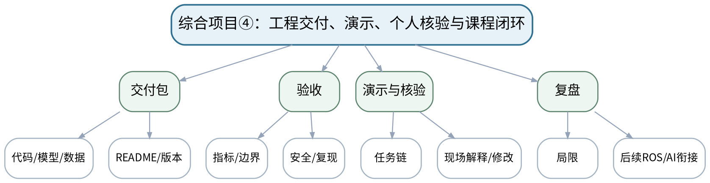

### 教学目标

**知识目标：**
- （1）理解机器人项目交付中模型、代码、测试、证据、安全和个人解释的联合要求。
**能力目标：**
- （1）能够完成最终验收、现场演示/修改并独立解释本人负责模块和模型边界。
**价值目标：**
- （1）形成规范交付、学术诚信、持续改进和对机器人结果负责的意识。

### 课程思政

以安全、诚信、可复现和个人责任作为最终交付底线。

### 专创融合 / 双创融合

完成从机器人学模型与算法到可交付Python机器人项目的闭环，并为后续ROS/AI系统工程学习建立接口意识。

### 教学重难点

教学重点：综合项目验收与个人可解释性。
教学难点：一次演示成功不能证明工程可用；必须结合测试集、边界、复现和个人核验。

### 教学方法

项目驱动法、里程碑评审、接口先行、团队协作、测试验收、版本管理与个人核验

### 教学用具

机房、完整项目环境、Git、测试/日志、演示设备。

### 教学设计

课前任务 → 互动导入（15 min）→ 传授新知与课堂训练（70 min）→ 过关检测（10 min）→ 课堂小结（3 min）→ 作业布置（1 min）→ 考勤（1 min）

### 教学过程

#### 课前任务

【教师】发布“综合项目④：工程交付、演示、个人核验与课程闭环”预习/准备要求和一个最小问题，不提前给出完整答案。
- 1. 阅读大纲对应内容与指定教材/资料，圈出3个核心术语；
- 2. 更新Git/任务清单，带上当前版本、问题和待验收证据。
- 3. 记录至少1个疑问或风险点。
【学生】完成准备并带着问题进入课堂。

**设计意图：** 通过课前阅读、环境/安全检查和最小问题建立先备认知，让学生带着真实问题进入课堂。

#### 互动导入与传授新知 / 课堂训练

【互动导入 15 min】
【教师】先让项目执行一个预先设计的边界/失败用例，再运行正常演示，要求团队说明为什么“会失败且安全失败”也是质量。
【学生】先独立预测/判断/操作，再交换依据，不先听完整结论。

【传授新知与课堂训练 70 min】
**一、里程碑与接口/验收条件确认（约15 min）—最终验收**

【教师】按任务书和测试计划逐项核验功能、精度/时间/误差、边界与安全条件，保留版本。

【学生】按任务约束完成分析/实现，保存中间结果并说明判断依据；教师只提示定位方法、边界与验收条件，不代替学生完成核心产物。

**二、团队独立开发/评审/集成（约40 min）—工程交付**

【教师】检查代码、模型、参数、数据、图表、README、环境/依赖、Git记录和外部资源来源。

【学生】按任务约束完成分析/实现，保存中间结果并说明判断依据；教师只提示定位方法、边界与验收条件，不代替学生完成核心产物。

**三、测试、复盘与版本固化（约15 min）—演示与个人核验**

【教师】按“任务→模型→算法→结果→验证→边界”演示；个人解释或现场修改负责模块，并说明失败案例和改进。

【学生】按任务约束完成分析/实现，保存中间结果并说明判断依据；教师只提示定位方法、边界与验收条件，不代替学生完成核心产物。

【课堂产物】最终机器人项目包 + 测试/安全报告 + 演示与个人贡献说明。

【学习证据】最终代码/模型、测试表、运行证据、版本/日志、答辩/现场修改记录。

【评价关联】期末考核—综合项目；目标1.1—1.6、2.1—2.6、3.1—3.6。

**设计意图：** 采用“先预测/操作 → 最小讲解/示范 → 独立产出 → 测试/互审 → 证据固化”的闭环，使机器人学模型、算法和实验结论都有可复核证据。

#### 过关检测

【教师】组织当堂检测：
- 1. 为什么演示成功不能替代测试集？
- 2. 个人核验重点验证什么？
- 3. 一个成熟机器人项目应怎样说明自身边界？
【学生】独立作答/运行/数据判断；【教师】依据错误类型进行针对性讲解并要求说明判断依据。

**设计意图：** 用概念、模型、边界和运行/数据验证即时检测关键知识，暴露易错点。

#### 课堂小结

【教师】回到知识脉络图，用“概念—模型—关系—应用—边界”总结“综合项目④：工程交付、演示、个人核验与课程闭环”，再次强调：综合项目验收与个人可解释性。
【学生】写下本课最重要的一条规则和一个最容易出错的边界。

**设计意图：** 压缩本课信息并把规则、边界与后续任务连接。

#### 作业布置

【教师】布置课后任务：整理课程学习档案：选一个最重要的失败案例，说明根因、修复、复验和仍存在的局限。
【学生】按课程文件命名和证据规范整理提交。

**设计意图：** 固化课堂产物，形成可复查、可复现的过程证据。

#### 考勤

【教师】利用学校/课程实际使用的平台进行签到。
【学生】按课程要求完成签到。

**设计意图：** 保留学校模板考勤环节，不在教案中预填出勤事实。

### 课后教学反思

【课后填写，不预填事实】
- 1. 教学流程：记录100 min各环节实际用时及需调整的位置；
- 2. 教学内容：重点记录“一次演示成功不能证明工程可用；必须结合测试集、边界、复现和个人核验。”的真实掌握证据与常见错误；
- 3. 学生参与：仅依据实际课堂记录填写独立分析、实验、编码、互审或项目协作情况，不补写推测；
- 4. 评价证据：检查本课课堂产物/代码/实验数据/测试/项目记录是否完整，记录缺项及原因；
- 5. 后续改进：依据真实课堂证据确定下一轮调整。

### 本章节参考文献

[1] 周晓敏, 郑莉芳, 刘鸿飞. 机器人学基础[M]. 北京：清华大学出版社，2023. ISBN 9787302635888
[2] Corke, P. Robotics, Vision and Control: Fundamental Algorithms in Python（3rd Edition）[M]. Cham: Springer, 2023. ISBN 9783031064685
[3] 赵建伟, 马学品, 盖逸馨, 毛向军, 梅勇, 钱航, 姚志广. 机器人系统设计及其应用技术（第2版）[M]. 北京：清华大学出版社，2024. ISBN 9787302676577
[4] 仉新, 矫健, 付垚. 移动机器人原理与应用[M]. 北京：清华大学出版社，2025. ISBN 9787302704478
