# 编制信息

## 当前任务与边界
- 用户需要成果：完整教案 Markdown、知识脉络图、学校格式 Word、源码包与完整交付包。
- 正常工作流：官方大纲 → canonical Markdown/图片 → 内容门禁 → Word编译 → 全页视觉QA。
- 课程硬边界：32学时全部为理论；Python/NumPy/OpenCV代码演示与案例复现属于理论课堂教学活动，不虚构上机学时。

## 来源清单

| source_id | 材料或 Skill | 证据角色 | 版本或日期 | 定位 |
|---|---|---|---|---|
| S1 | `course/机器视觉技术/2025/大纲/25JD32405-机器视觉技术-课程教学大纲.md` | official_syllabus | 2026年9月；SHA `cd100bf9dd06b85abdc5cbc10394f930d5973934` | 课程事实、目标、教学单元、评价 |
| S2 | `course/机器视觉技术/2025/说明/25JD32405-机器视觉技术-依据与实施说明.md` | official_syllabus | SHA `15a237b72262f2deb3e32158a250e41575c962b9` | 教材与Python/OpenCV实施说明 |
| S3 | `Teaching-Works-Lab/lesson-plan-compiler` / lesson-plan-compiler | reference_only | SHA `23bc5a10e7881e8863ad993c74dabdc9faf24a4d` | 教案字段、语言、Markdown审查与Word版式规则 |

## 缺项与冲突

| issue_id | 字段或主题 | 当前情况 | 影响 | 处理 |
|---|---|---|---|---|
| I1 | 主讲教师 | 用户未提供 | 仅影响封面 | Word留空，不虚构 |
| I2 | 职称 | 用户未提供 | 仅影响封面 | Word留空，不虚构 |
| I3 | 制定日期 | 用户未提供 | 仅影响封面 | Word留空，不把大纲定稿日期冒充教案制定日期 |
| I4 | 具体校历周次 | 用户未提供课表 | 课次表周次栏 | Word留空，不推测 |

# 正式教案内容

## 课程基本信息

| 字段 | 内容 | 状态 | source_id |
|---|---|---|---|
| 学院 | 机械与动力工程学院 | official | S1 |
| 专业（教研室） | 智能制造工程 | official | S1 |
| 课程名称 | 机器视觉技术 | official | S1 |
| 课程名称（英文） | Machine Vision Technology | official | S1 |
| 主讲教师 |  | to_confirm |  |
| 职称 |  | to_confirm |  |
| 授课专业 | 智能制造工程 | official | S1 |
| 授课学期 | 第7学期 | official | S1 |
| 制定日期 |  | to_confirm |  |
| 课程类别 | 专业类 | official | S1 |
| 课程性质 | 选修 | official | S1 |
| 授课语言 | 中文 | official | S1 |
| 学分 | 2 | official | S1 |
| 总学时 | 32 | official | S1 |
| 理论学时 | 32 | official | S1 |
| 实验/上机学时 | 0 | official | S1 |
| 实习学时 | 0 | official | S1 |
| 其他学时 | 0 | official | S1 |
| 教材 | 何文辉、葛大伟.《机器视觉技术与应用》[M]. 北京：机械工业出版社，2024. ISBN 9787111763048 | official | S2 |
| 授课学院 | 机械与动力工程学院 | official | S1 |
| 先修课程 | 程序设计基础（C&C++）Ⅱ、工程建模与科学计算可视化基础（Python） | official | S1 |
| 后续课程 | 毕业设计（论文） | official | S1 |
| 考核类型 | 考查课 | official | S2 |
| 考核形式 | 机器视觉综合方案/项目报告（或等效作品）＋现场答辩/个人核验；不另设笔试或机考 | official | S1 |
| 考核方式 | 平时成绩、课程作业、期末综合方案/作品与个人核验 | official | S1 |
| 总评成绩比例 | 最终成绩100%=平时成绩20%＋课程作业20%＋期末考核60%；期末考核采用机器视觉综合方案/项目报告（或等效作品）＋现场答辩/个人核验，不另设笔试或机考。 | official | S1 |

#### 课程简介

**课程基本定位**：本课程是智能制造工程专业的一门专业选修课，面向工业检测、测量、定位、识别与视觉引导等典型任务，以Python为统一实现语言，以NumPy和OpenCV为核心工具，建立“成像条件—图像处理—特征与测量—识别判定—性能评价”的机器视觉工作链。

**学时组织**：总学时32，全部为理论学时，按16次课×2课时组织。课堂包含Python/OpenCV最小实现、参数对比和案例复现，但这些活动属于理论课堂中的案例教学，不作为独立上机课时。

**核心学习结果**：学生能够分析相机、镜头、光源与成像参数，使用Python/OpenCV完成图像预处理、分割、形态学、轮廓与几何测量、模板与特征匹配，理解深度学习视觉基本流程，并针对零件、装配、输送或FDM 3D打印场景形成可复现视觉方案，以测量误差、误检/漏检、精确率/召回率、速度和鲁棒性评价结果。

**主要教学方法**：采用“成像现象—算法原理—Python最小实现—OpenCV工程实现—参数对比—结果验证”的案例驱动方式；所有案例保留原始图像、参数、中间结果、评价指标和失败样例。

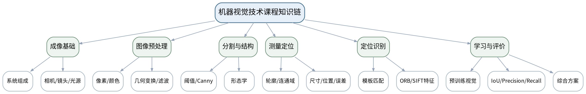

## 教学单元

### lesson-01

| 字段 | 内容 | 状态 | source_id |
|---|---|---|---|
| 章节 | 第一单元 机器视觉系统与成像基础 | derived | S1 |
| 授课题目 | 机器视觉系统、工业任务与“成像—处理—判定”工作链 | derived | S1 |
| 周次 |  | to_confirm |  |
| 课时安排 | 2课时（100 min）；类型：理论2 | official | S1 |
| 知识脉络图 | images/lesson-01-knowledge-map.png | derived | S1 |
| 教学方法 | 讲授法、问答法、案例分析法、结构图解法、Python/OpenCV代码演示法、参数对比法、课堂检测法 | derived | S3 |
| 教学用具 | 电脑、投影仪、多媒体课件、教材、工业视觉系统案例图、任务定义卡。 | derived | S1/S2 |
| 教学设计 | 课前任务→互动导入（10 min）→传授新知（70 min）→过关检测（10 min）→课堂小结（5 min）→作业布置（3 min）→考勤（2 min） | derived | S3 |
| 参考文献 | [1] 何文辉、葛大伟.《机器视觉技术与应用》[M]. 北京：机械工业出版社，2024.；[2] 李宁.《Python OpenCV从菜鸟到高手》[M]. 北京：清华大学出版社，2024. | provided | S2 |

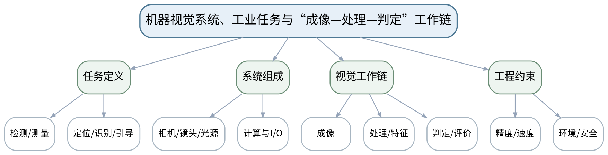

#### 教学目标

**知识目标：**
（1）理解机器视觉的定义、典型工业任务和系统基本组成。
（2）理解“成像条件—图像处理—特征与测量—识别判定—性能评价”的完整工作链。

**能力目标：**
（1）能够把零件检测或装配检查任务拆解为对象、输入图像、输出结果和评价指标。
（2）能够识别系统中相机、镜头、光源、计算平台与外围接口的职责。

**价值目标：**
（1）形成先定义检测目标和工程约束、再选择算法的系统工程意识。
（2）理解误检、漏检和错误引导可能带来的质量与安全责任。

#### 课程思政

（1）结合关键缺陷漏检和错误定位案例，强调视觉结论会进入质量判定甚至设备动作链，必须以可复核证据承担工程责任。

（2）要求课堂代码演示、图像参数和评价结果保留原始证据，不以单张成功截图替代多工况验证，强化数据诚信和质量责任。

#### 专创融合

围绕“人工目检→机器视觉”的替代条件，比较一致性、节拍、可追溯和改造成本，提出一个可行的小型视觉改造方案。

#### 教学重难点

**教学重点**：机器视觉任务类型、系统组成与视觉工作链。

**教学难点**：把“识别算法”放回完整系统中理解，避免只关注后端算法而忽视成像条件和工程判据。

#### 教学过程

| 教学步骤 | 主要教学内容 | 设计意图 |
|---|---|---|
| 课前任务 | 【教师】1. 发布本课主题、教材/资料范围和一个成像/算法最小问题； 2. 明确课堂代码仅作理论课中的原理演示和案例复现，不改变课程32学时全理论的事实。 【学生】1. 预读关键概念/代码片段； 2. 记录至少1个预测和1个疑问，带着问题进入课堂。 | 通过预读和最小问题建立先备认知，同时明确理论课中的代码演示属于案例教学活动。 |
| 互动导入（10 min） | 【教师】展示同一个零件在良好照明与强反光条件下的两组图像，提问：算法不变时为什么结果可能完全不同？由此引出完整视觉链。 【学生】先独立判断，再与同伴交换依据；教师收集典型分歧后进入本课。 | 从真实成像/检测现象切入，使学生先暴露直觉判断，再建立本课问题主线。 |
| 传授新知（共70 min） | 1、机器视觉任务与应用（约18 min） 【教师】【教师】用质量检测、尺寸测量、工件定位、装配完整性和视觉引导案例区分不同任务输出。 【学生】【学生】为5个案例判断任务类型，并写出最小输出结果。 2、系统组成与职责（约18 min） 【教师】【教师】拆解相机、镜头、光源、计算单元、I/O和执行机构的功能边界。 【学生】【学生】完成“模块—输入—输出—失效影响”表。 3、视觉工作链（约18 min） 【教师】【教师】用成像→预处理→分割/特征→测量/识别→判定→评价串联后续课程。 【学生】【学生】为一个装配检查案例画流程图。 4、工程约束与评价（约16 min） 【教师】【教师】说明精度、速度、鲁棒性、误检/漏检和安全约束，强调“单张成功图”不能代表工程可用。 【学生】【学生】为案例补充3个验收指标与1个失败工况。 【课堂强化】形成可检查的课堂产物：['选择一个机械零件、装配或FDM打印场景，完成“视觉任务定义卡”：对象、任务、输入、输出、精度/速度和失败风险。']；课堂中至少保留参数/图像/计算或分析证据。 | 按“现象—原理—Python/OpenCV最小实现—参数比较—结果验证”推进，把教师讲解转化为可检查的分析或代码证据。 |
| 过关检测（10 min） | 【教师】组织课堂小测： 1.【选择题】机器视觉系统中最直接决定原始图像质量的环节通常包括（ ）。A. 相机/镜头/光源 B. 排序算法 C. 数据库 D. PLC程序 2.【判断题】只要识别算法准确率高，成像条件变化通常无需重新验证。（ ） 3.【简答题】一个可验收的工业视觉任务至少应明确哪些输入、输出和评价指标？ 【学生】独立作答/运行或读图验证；同伴互查后说明依据。 | 覆盖本课重点和典型误区，以即时证据发现“会看结果但不会解释”的问题。 |
| 课堂小结（5 min） | 【教师】1. 本次课解决的关键问题是“机器视觉系统、工业任务与“成像—处理—判定”工作链”； 2. 需要重点掌握：机器视觉任务类型、系统组成与视觉工作链。 3. 最值得带走的方法是先固定条件、再做参数/方案对比； 4. 需要警惕的易错点是：把“识别算法”放回完整系统中理解，避免只关注后端算法而忽视成像条件和工程判据。 | 回到知识脉络图压缩信息，形成“概念—条件—参数—证据—边界”的完整认知。 |
| 作业布置（3 min） | 【教师】布置课后任务：['选择一个机械零件、装配或FDM打印场景，完成“视觉任务定义卡”：对象、任务、输入、输出、精度/速度和失败风险。'] 【要求】不只提交结果，还需保留原图/参数/中间结果/失败样例或判断依据。 | 固化课堂成果，形成可复核学习证据，并为下一课提供真实输入。 |
| 考勤（2 min） | 【教师】利用学校/课程实际使用的平台或课堂点名完成签到。 | 掌握出勤情况，保障教学秩序；不在教案中预填任何实际出勤事实。 |

#### 教学反思

【教师】课后重点从以下方面进行教学反思：

1. 教学流程：导入是否把学生带入真实视觉问题，70分钟主体是否按“现象—原理—实现—参数—验证”由浅入深。
2. 教学内容：重点记录“把“识别算法”放回完整系统中理解，避免只关注后端算法而忽视成像条件和工程判据。”是否讲清，学生是否能说明参数/方法适用边界。
3. 学生参与：仅依据实际课堂记录填写参与、代码阅读/参数分析、互审和表达情况，不补写推测性结论。
4. 教学改进：依据真实课堂证据决定是否增加成像对比、失败样例、最小代码或指标练习。

### lesson-02

| 字段 | 内容 | 状态 | source_id |
|---|---|---|---|
| 章节 | 第一单元 机器视觉系统与成像基础 | derived | S1 |
| 授课题目 | 相机、镜头、光源与视场/分辨率/景深/曝光设计 | derived | S1 |
| 周次 |  | to_confirm |  |
| 课时安排 | 2课时（100 min）；类型：理论2 | official | S1 |
| 知识脉络图 | images/lesson-02-knowledge-map.png | derived | S1 |
| 教学方法 | 讲授法、问答法、案例分析法、结构图解法、Python/OpenCV代码演示法、参数对比法、课堂检测法 | derived | S3 |
| 教学用具 | 电脑、投影仪、多媒体课件、教材、相机/镜头参数样本、照明对比图、计算器。 | derived | S1/S2 |
| 教学设计 | 课前任务→互动导入（10 min）→传授新知（70 min）→过关检测（10 min）→课堂小结（5 min）→作业布置（3 min）→考勤（2 min） | derived | S3 |
| 参考文献 | [1] 何文辉、葛大伟.《机器视觉技术与应用》[M]. 北京：机械工业出版社，2024. | provided | S2 |

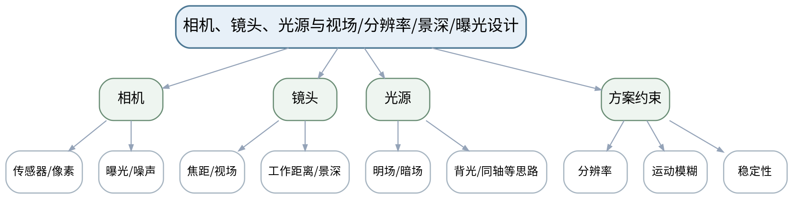

#### 教学目标

**知识目标：**
（1）理解相机像素、曝光、噪声，镜头焦距、视场、工作距离、景深以及光源方式的工程含义。
（2）理解视场、目标尺寸、测量精度和像素分辨率之间的关系。

**能力目标：**
（1）能够根据目标尺寸和最小特征估算基本成像分辨率需求。
（2）能够针对反光、轮廓、表面缺陷等场景选择合理照明思路并说明理由。

**价值目标：**
（1）形成“先把图像拍稳定，再谈算法”的工程习惯。
（2）树立参数变更留痕和多工况复核意识。

#### 课程思政

（1）以错误照明导致缺陷漏检的案例说明成像条件也是质量控制的一部分，不能把全部责任推给后端算法。

（2）要求课堂代码演示、图像参数和评价结果保留原始证据，不以单张成功截图替代多工况验证，强化数据诚信和质量责任。

#### 专创融合

比较“更换算法”和“优化光学/照明”两种改造路径的成本与收益，培养跨光机电软协同的方案意识。

#### 教学重难点

**教学重点**：成像参数与光照方案；从检测精度反推视场/像素需求。

**教学难点**：将参数计算与现场光照、运动和景深约束结合，避免只做理想条件下的静态计算。

#### 教学过程

| 教学步骤 | 主要教学内容 | 设计意图 |
|---|---|---|
| 课前任务 | 【教师】1. 发布本课主题、教材/资料范围和一个成像/算法最小问题； 2. 明确课堂代码仅作理论课中的原理演示和案例复现，不改变课程32学时全理论的事实。 【学生】1. 预读关键概念/代码片段； 2. 记录至少1个预测和1个疑问，带着问题进入课堂。 | 通过预读和最小问题建立先备认知，同时明确理论课中的代码演示属于案例教学活动。 |
| 互动导入（10 min） | 【教师】给出同一金属件的正面明场、侧向暗场和背光图，要求学生先判断哪一种更适合表面划痕、轮廓尺寸和孔洞检测。 【学生】先独立判断，再与同伴交换依据；教师收集典型分歧后进入本课。 | 从真实成像/检测现象切入，使学生先暴露直觉判断，再建立本课问题主线。 |
| 传授新知（共70 min） | 1、相机与曝光（约18 min） 【教师】【教师】讲解像素、分辨率、曝光、增益、噪声与运动模糊的基本关系。 【学生】【学生】判断提高曝光时间可能带来的收益与风险。 2、镜头与几何参数（约20 min） 【教师】【教师】讲解视场、工作距离、焦距、景深和畸变的工程意义，完成最小像素需求示例。 【学生】【学生】根据零件尺寸和最小缺陷尺寸完成一组分辨率估算。 3、光源与成像对比（约18 min） 【教师】【教师】比较明场、暗场、背光、同轴/漫射等照明思路及其适用对象。 【学生】【学生】为三种检测任务匹配照明方案并说明理由。 4、方案评审（约14 min） 【教师】【教师】组织“精度—视场—景深—曝光—速度”约束评审。 【学生】【学生】完成一页成像方案卡，指出2个最可能失效的工况。 【课堂强化】形成可检查的课堂产物：['完成一个零件尺寸检测成像方案：视场、最小特征、像素需求、工作距离、照明思路与两类风险。']；课堂中至少保留参数/图像/计算或分析证据。 | 按“现象—原理—Python/OpenCV最小实现—参数比较—结果验证”推进，把教师讲解转化为可检查的分析或代码证据。 |
| 过关检测（10 min） | 【教师】组织课堂小测： 1.【选择题】要突出零件外轮廓并弱化表面纹理，通常更适合优先考虑（ ）。A. 背光 B. 随机环境光 C. 关闭光源 D. 任意颜色屏幕 2.【判断题】曝光时间越长，所有运动场景图像都越清晰。（ ） 3.【简答题】为什么“像素很多”并不自动等于“测量精度一定高”？ 【学生】独立作答/运行或读图验证；同伴互查后说明依据。 | 覆盖本课重点和典型误区，以即时证据发现“会看结果但不会解释”的问题。 |
| 课堂小结（5 min） | 【教师】1. 本次课解决的关键问题是“相机、镜头、光源与视场/分辨率/景深/曝光设计”； 2. 需要重点掌握：成像参数与光照方案；从检测精度反推视场/像素需求。 3. 最值得带走的方法是先固定条件、再做参数/方案对比； 4. 需要警惕的易错点是：将参数计算与现场光照、运动和景深约束结合，避免只做理想条件下的静态计算。 | 回到知识脉络图压缩信息，形成“概念—条件—参数—证据—边界”的完整认知。 |
| 作业布置（3 min） | 【教师】布置课后任务：['完成一个零件尺寸检测成像方案：视场、最小特征、像素需求、工作距离、照明思路与两类风险。'] 【要求】不只提交结果，还需保留原图/参数/中间结果/失败样例或判断依据。 | 固化课堂成果，形成可复核学习证据，并为下一课提供真实输入。 |
| 考勤（2 min） | 【教师】利用学校/课程实际使用的平台或课堂点名完成签到。 | 掌握出勤情况，保障教学秩序；不在教案中预填任何实际出勤事实。 |

#### 教学反思

【教师】课后重点从以下方面进行教学反思：

1. 教学流程：导入是否把学生带入真实视觉问题，70分钟主体是否按“现象—原理—实现—参数—验证”由浅入深。
2. 教学内容：重点记录“将参数计算与现场光照、运动和景深约束结合，避免只做理想条件下的静态计算。”是否讲清，学生是否能说明参数/方法适用边界。
3. 学生参与：仅依据实际课堂记录填写参与、代码阅读/参数分析、互审和表达情况，不补写推测性结论。
4. 教学改进：依据真实课堂证据决定是否增加成像对比、失败样例、最小代码或指标练习。

#### 单元课程作业节点

- 课程作业内部权重15%；目标1.1、2.1、3.1、3.3。
- 本单元作业必须包含原图/任务条件、关键参数、中间结果、评价或失败样例；不要求虚构独立上机课时。

### lesson-03

| 字段 | 内容 | 状态 | source_id |
|---|---|---|---|
| 章节 | 第二单元 Python/OpenCV图像表示与预处理 | derived | S1 |
| 授课题目 | 数字图像、NumPy像素/ROI与BGR-RGB-HSV-灰度表示 | derived | S1 |
| 周次 |  | to_confirm |  |
| 课时安排 | 2课时（100 min）；类型：理论2 | official | S1 |
| 知识脉络图 | images/lesson-03-knowledge-map.png | derived | S1 |
| 教学方法 | 讲授法、问答法、案例分析法、结构图解法、Python/OpenCV代码演示法、参数对比法、课堂检测法 | derived | S3 |
| 教学用具 | 电脑、投影仪、多媒体课件、教材、Python、NumPy、OpenCV、Jupyter/VS Code、示例图像。 | derived | S1/S2 |
| 教学设计 | 课前任务→互动导入（10 min）→传授新知（70 min）→过关检测（10 min）→课堂小结（5 min）→作业布置（3 min）→考勤（2 min） | derived | S3 |
| 参考文献 | [1] 何文辉、葛大伟.《机器视觉技术与应用》[M]. 北京：机械工业出版社，2024.；[2] 李宁.《Python OpenCV从菜鸟到高手》[M]. 北京：清华大学出版社，2024. | provided | S2 |

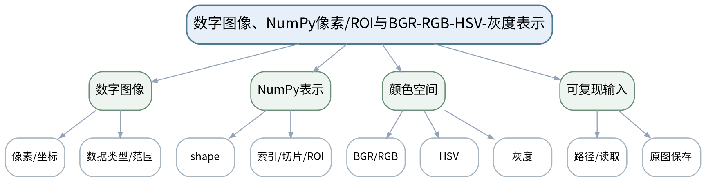

#### 教学目标

**知识目标：**
（1）理解数字图像的像素、坐标、通道、shape和数据类型。
（2）掌握BGR/RGB、HSV和灰度表示及其基本用途。

**能力目标：**
（1）能够使用NumPy/OpenCV读取图像、访问像素、提取ROI并转换颜色空间。
（2）能够识别通道顺序、坐标和数据类型错误造成的异常结果。

**价值目标：**
（1）形成原始图像不覆盖、参数和代码版本可追溯的规范习惯。

#### 课程思政

（1）强调原始图像、通道和数据类型属于实验事实，禁止为了“结果好看”覆盖原始数据或省略处理步骤。

（2）要求课堂代码演示、图像参数和评价结果保留原始证据，不以单张成功截图替代多工况验证，强化数据诚信和质量责任。

#### 专创融合

将ROI和颜色空间转换封装为可复用预处理模块，讨论模块接口对后续检测流程复用的价值。

#### 教学重难点

**教学重点**：图像矩阵表示、ROI、颜色空间转换与数据类型。

**教学难点**：学生容易混淆行列坐标、x/y坐标和BGR/RGB通道顺序，需要通过最小代码和结果图对应验证。

#### 教学过程

| 教学步骤 | 主要教学内容 | 设计意图 |
|---|---|---|
| 课前任务 | 【教师】1. 发布本课主题、教材/资料范围和一个成像/算法最小问题； 2. 明确课堂代码仅作理论课中的原理演示和案例复现，不改变课程32学时全理论的事实。 【学生】1. 预读关键概念/代码片段； 2. 记录至少1个预测和1个疑问，带着问题进入课堂。 | 通过预读和最小问题建立先备认知，同时明确理论课中的代码演示属于案例教学活动。 |
| 互动导入（10 min） | 【教师】展示一张“颜色完全错误”的OpenCV→Matplotlib显示结果，让学生判断是相机坏了还是通道顺序出了问题。 【学生】先独立判断，再与同伴交换依据；教师收集典型分歧后进入本课。 | 从真实成像/检测现象切入，使学生先暴露直觉判断，再建立本课问题主线。 |
| 传授新知（共70 min） | 1、图像矩阵与坐标（约18 min） 【教师】【教师】用小矩阵说明高×宽×通道、uint8范围、行列索引和图像坐标。 【学生】【学生】手算3个像素位置并预测切片结果。 2、NumPy与ROI（约18 min） 【教师】【教师】演示读取、shape、切片、复制与ROI，说明视图/复制和越界风险。 【学生】【学生】写/补全最小代码提取指定ROI并检查尺寸。 3、颜色空间（约20 min） 【教师】【教师】比较BGR/RGB、HSV和灰度的表示与适用场景。 【学生】【学生】对同一图像生成三种表示并描述信息变化。 4、规范输入与证据（约14 min） 【教师】【教师】示范保留原图、输出目录和参数日志。 【学生】【学生】建立“原图—中间图—结果图”的文件命名规则。 【课堂强化】形成可检查的课堂产物：['用一张课程图像完成读取、ROI、BGR→RGB、BGR→HSV和灰度转换，保留原图与中间结果。']；课堂中至少保留参数/图像/计算或分析证据。 | 按“现象—原理—Python/OpenCV最小实现—参数比较—结果验证”推进，把教师讲解转化为可检查的分析或代码证据。 |
| 过关检测（10 min） | 【教师】组织课堂小测： 1.【选择题】OpenCV默认读取彩色图像的通道顺序通常是（ ）。A. RGB B. BGR C. HSV D. CMYK 2.【判断题】图像数组的第一维通常直接表示x坐标。（ ） 3.【简答题】HSV相比RGB/BGR在颜色阈值分割中有什么潜在优势？ 【学生】独立作答/运行或读图验证；同伴互查后说明依据。 | 覆盖本课重点和典型误区，以即时证据发现“会看结果但不会解释”的问题。 |
| 课堂小结（5 min） | 【教师】1. 本次课解决的关键问题是“数字图像、NumPy像素/ROI与BGR-RGB-HSV-灰度表示”； 2. 需要重点掌握：图像矩阵表示、ROI、颜色空间转换与数据类型。 3. 最值得带走的方法是先固定条件、再做参数/方案对比； 4. 需要警惕的易错点是：学生容易混淆行列坐标、x/y坐标和BGR/RGB通道顺序，需要通过最小代码和结果图对应验证。 | 回到知识脉络图压缩信息，形成“概念—条件—参数—证据—边界”的完整认知。 |
| 作业布置（3 min） | 【教师】布置课后任务：['用一张课程图像完成读取、ROI、BGR→RGB、BGR→HSV和灰度转换，保留原图与中间结果。'] 【要求】不只提交结果，还需保留原图/参数/中间结果/失败样例或判断依据。 | 固化课堂成果，形成可复核学习证据，并为下一课提供真实输入。 |
| 考勤（2 min） | 【教师】利用学校/课程实际使用的平台或课堂点名完成签到。 | 掌握出勤情况，保障教学秩序；不在教案中预填任何实际出勤事实。 |

#### 教学反思

【教师】课后重点从以下方面进行教学反思：

1. 教学流程：导入是否把学生带入真实视觉问题，70分钟主体是否按“现象—原理—实现—参数—验证”由浅入深。
2. 教学内容：重点记录“学生容易混淆行列坐标、x/y坐标和BGR/RGB通道顺序，需要通过最小代码和结果图对应验证。”是否讲清，学生是否能说明参数/方法适用边界。
3. 学生参与：仅依据实际课堂记录填写参与、代码阅读/参数分析、互审和表达情况，不补写推测性结论。
4. 教学改进：依据真实课堂证据决定是否增加成像对比、失败样例、最小代码或指标练习。

### lesson-04

| 字段 | 内容 | 状态 | source_id |
|---|---|---|---|
| 章节 | 第二单元 Python/OpenCV图像表示与预处理 | derived | S1 |
| 授课题目 | 直方图、亮度/对比度与成像质量对比 | derived | S1 |
| 周次 |  | to_confirm |  |
| 课时安排 | 2课时（100 min）；类型：理论2 | official | S1 |
| 知识脉络图 | images/lesson-04-knowledge-map.png | derived | S1 |
| 教学方法 | 讲授法、问答法、案例分析法、结构图解法、Python/OpenCV代码演示法、参数对比法、课堂检测法 | derived | S3 |
| 教学用具 | 电脑、投影仪、多媒体课件、教材、Python、NumPy、OpenCV、Matplotlib。 | derived | S1/S2 |
| 教学设计 | 课前任务→互动导入（10 min）→传授新知（70 min）→过关检测（10 min）→课堂小结（5 min）→作业布置（3 min）→考勤（2 min） | derived | S3 |
| 参考文献 | [1] 何文辉、葛大伟.《机器视觉技术与应用》[M]. 北京：机械工业出版社，2024.；[2] 李宁.《Python OpenCV从菜鸟到高手》[M]. 北京：清华大学出版社，2024. | provided | S2 |

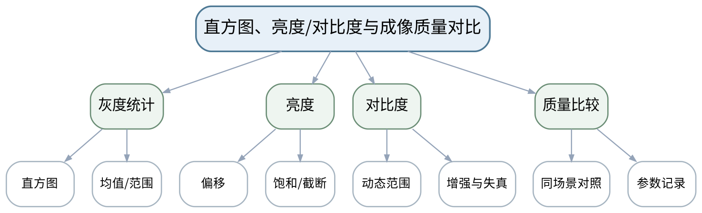

#### 教学目标

**知识目标：**
（1）理解直方图反映的灰度分布及亮度、对比度的基本含义。
（2）理解像素线性变换、截断/饱和对图像信息的影响。

**能力目标：**
（1）能够用OpenCV/NumPy计算并绘制直方图，比较不同曝光/亮度/对比度条件。
（2）能够用受控变量方式评价预处理是否改善了后续可分性。

**价值目标：**
（1）形成不凭“视觉更漂亮”评价算法、而以任务效果和参数证据判断的习惯。

#### 课程思政

（1）通过过曝和噪声放大案例强调参数调整必须诚实报告，不选择性隐藏失败图像。

（2）要求课堂代码演示、图像参数和评价结果保留原始证据，不以单张成功截图替代多工况验证，强化数据诚信和质量责任。

#### 专创融合

围绕“自动曝光/自适应参数”的工程需求，提出一种基于统计量的简单参数调节思路。

#### 教学重难点

**教学重点**：直方图、亮度/对比度调整与质量评价。

**教学难点**：区分主观观感改善与机器视觉任务可分性改善，避免把图像增强等同于检测性能提升。

#### 教学过程

| 教学步骤 | 主要教学内容 | 设计意图 |
|---|---|---|
| 课前任务 | 【教师】1. 发布本课主题、教材/资料范围和一个成像/算法最小问题； 2. 明确课堂代码仅作理论课中的原理演示和案例复现，不改变课程32学时全理论的事实。 【学生】1. 预读关键概念/代码片段； 2. 记录至少1个预测和1个疑问，带着问题进入课堂。 | 通过预读和最小问题建立先备认知，同时明确理论课中的代码演示属于案例教学活动。 |
| 互动导入（10 min） | 【教师】展示两张“肉眼看起来更亮”的图像，其中一张细节被过曝截断，提问哪张更适合阈值检测并说明证据。 【学生】先独立判断，再与同伴交换依据；教师收集典型分歧后进入本课。 | 从真实成像/检测现象切入，使学生先暴露直觉判断，再建立本课问题主线。 |
| 传授新知（共70 min） | 1、直方图与统计（约18 min） 【教师】【教师】解释直方图、灰度范围、均值和峰形，演示同场景不同曝光的统计变化。 【学生】【学生】根据3条直方图判断欠曝、正常和过曝可能性。 2、亮度调整（约16 min） 【教师】【教师】演示加减偏移和uint8截断问题。 【学生】【学生】预测不同偏移对暗区/亮区信息的影响。 3、对比度调整（约18 min） 【教师】【教师】说明线性缩放和动态范围，强调增强可能放大噪声。 【学生】【学生】对一张低对比图做2组参数对比。 4、任务导向评价（约18 min） 【教师】【教师】把处理结果送入简单阈值/边缘观察，说明增强必须服务后续任务。 【学生】【学生】记录“参数—直方图—后续效果”三列证据。 【课堂强化】形成可检查的课堂产物：['完成“原图＋两组亮度/对比度参数”的直方图和结果对比，写出哪组更适合后续分割及依据。']；课堂中至少保留参数/图像/计算或分析证据。 | 按“现象—原理—Python/OpenCV最小实现—参数比较—结果验证”推进，把教师讲解转化为可检查的分析或代码证据。 |
| 过关检测（10 min） | 【教师】组织课堂小测： 1.【选择题】图像大量像素堆积在灰度高端并发生截断，最可能说明（ ）。A. 过曝 B. 欠曝 C. 坐标系错误 D. 镜头焦距为0 2.【判断题】肉眼观感更强的对比度一定会提高机器视觉检测准确性。（ ） 3.【简答题】为什么比较亮度/对比度算法时必须固定原始图像和其他条件？ 【学生】独立作答/运行或读图验证；同伴互查后说明依据。 | 覆盖本课重点和典型误区，以即时证据发现“会看结果但不会解释”的问题。 |
| 课堂小结（5 min） | 【教师】1. 本次课解决的关键问题是“直方图、亮度/对比度与成像质量对比”； 2. 需要重点掌握：直方图、亮度/对比度调整与质量评价。 3. 最值得带走的方法是先固定条件、再做参数/方案对比； 4. 需要警惕的易错点是：区分主观观感改善与机器视觉任务可分性改善，避免把图像增强等同于检测性能提升。 | 回到知识脉络图压缩信息，形成“概念—条件—参数—证据—边界”的完整认知。 |
| 作业布置（3 min） | 【教师】布置课后任务：['完成“原图＋两组亮度/对比度参数”的直方图和结果对比，写出哪组更适合后续分割及依据。'] 【要求】不只提交结果，还需保留原图/参数/中间结果/失败样例或判断依据。 | 固化课堂成果，形成可复核学习证据，并为下一课提供真实输入。 |
| 考勤（2 min） | 【教师】利用学校/课程实际使用的平台或课堂点名完成签到。 | 掌握出勤情况，保障教学秩序；不在教案中预填任何实际出勤事实。 |

#### 教学反思

【教师】课后重点从以下方面进行教学反思：

1. 教学流程：导入是否把学生带入真实视觉问题，70分钟主体是否按“现象—原理—实现—参数—验证”由浅入深。
2. 教学内容：重点记录“区分主观观感改善与机器视觉任务可分性改善，避免把图像增强等同于检测性能提升。”是否讲清，学生是否能说明参数/方法适用边界。
3. 学生参与：仅依据实际课堂记录填写参与、代码阅读/参数分析、互审和表达情况，不补写推测性结论。
4. 教学改进：依据真实课堂证据决定是否增加成像对比、失败样例、最小代码或指标练习。

### lesson-05

| 字段 | 内容 | 状态 | source_id |
|---|---|---|---|
| 章节 | 第二单元 Python/OpenCV图像表示与预处理 | derived | S1 |
| 授课题目 | 缩放/旋转/透视变换与均值/高斯/中值滤波 | derived | S1 |
| 周次 |  | to_confirm |  |
| 课时安排 | 2课时（100 min）；类型：理论2 | official | S1 |
| 知识脉络图 | images/lesson-05-knowledge-map.png | derived | S1 |
| 教学方法 | 讲授法、问答法、案例分析法、结构图解法、Python/OpenCV代码演示法、参数对比法、课堂检测法 | derived | S3 |
| 教学用具 | 电脑、投影仪、多媒体课件、教材、Python、OpenCV、NumPy、Matplotlib、噪声样例。 | derived | S1/S2 |
| 教学设计 | 课前任务→互动导入（10 min）→传授新知（70 min）→过关检测（10 min）→课堂小结（5 min）→作业布置（3 min）→考勤（2 min） | derived | S3 |
| 参考文献 | [1] 何文辉、葛大伟.《机器视觉技术与应用》[M]. 北京：机械工业出版社，2024.；[2] 李宁.《Python OpenCV从菜鸟到高手》[M]. 北京：清华大学出版社，2024. | provided | S2 |

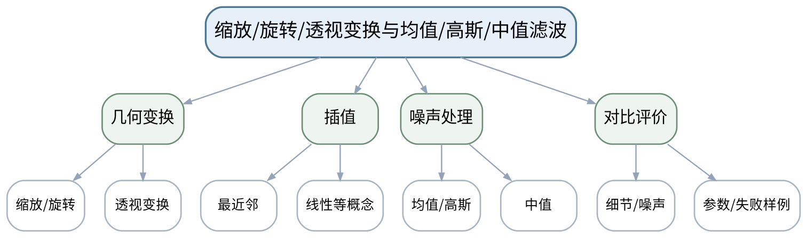

#### 教学目标

**知识目标：**
（1）掌握缩放、旋转、透视变换的用途和基本参数。
（2）理解均值、高斯、中值滤波的核心差异及典型噪声适用性。

**能力目标：**
（1）能够用OpenCV完成常见几何变换和滤波，并保存对比结果。
（2）能够针对椒盐噪声、随机噪声和细节保留要求选择基本滤波方案。

**价值目标：**
（1）形成受控变量和失败样例记录意识，避免“参数试到好看为止”。

#### 课程思政

（1）以参数过度平滑造成关键缺陷消失的案例强调图像处理不能只追求视觉平滑，必须对检测后果负责。

（2）要求课堂代码演示、图像参数和评价结果保留原始证据，不以单张成功截图替代多工况验证，强化数据诚信和质量责任。

#### 专创融合

把几何校正和滤波组合为“可配置预处理流水线”，思考如何支持不同产品快速换型。

#### 教学重难点

**教学重点**：几何变换与三类基本滤波；参数对图像信息的影响。

**教学难点**：既要降低噪声又要保留边缘/几何信息，学生需理解滤波尺度与后续任务之间的权衡。

#### 教学过程

| 教学步骤 | 主要教学内容 | 设计意图 |
|---|---|---|
| 课前任务 | 【教师】1. 发布本课主题、教材/资料范围和一个成像/算法最小问题； 2. 明确课堂代码仅作理论课中的原理演示和案例复现，不改变课程32学时全理论的事实。 【学生】1. 预读关键概念/代码片段； 2. 记录至少1个预测和1个疑问，带着问题进入课堂。 | 通过预读和最小问题建立先备认知，同时明确理论课中的代码演示属于案例教学活动。 |
| 互动导入（10 min） | 【教师】给出“中值滤波去椒盐噪声”和“高斯滤波去椒盐噪声”两组结果，让学生先观察细节和残留噪声再解释原因。 【学生】先独立判断，再与同伴交换依据；教师收集典型分歧后进入本课。 | 从真实成像/检测现象切入，使学生先暴露直觉判断，再建立本课问题主线。 |
| 传授新知（共70 min） | 1、几何变换（约18 min） 【教师】【教师】演示缩放、旋转、透视变换的矩阵/映射思想和OpenCV接口。 【学生】【学生】为倾斜拍摄的矩形标签选择校正方案。 2、插值与信息变化（约12 min） 【教师】【教师】说明缩放并非凭空增加真实细节，比较最近邻/线性插值现象。 【学生】【学生】观察放大后边缘差异并写出限制。 3、三类滤波（约22 min） 【教师】【教师】比较均值、高斯和中值滤波及核大小影响。 【学生】【学生】对两类噪声分别选择滤波器并说明依据。 4、参数AB比较（约18 min） 【教师】【教师】要求固定原图，比较2—3组核大小及边缘保留。 【学生】【学生】提交参数表和失败样例，不能只保留最好结果。 【课堂强化】形成可检查的课堂产物：['选择一张噪声图，比较均值/高斯/中值滤波至少3种配置，并记录“噪声抑制—边缘保留—后续任务”结论。']；课堂中至少保留参数/图像/计算或分析证据。 | 按“现象—原理—Python/OpenCV最小实现—参数比较—结果验证”推进，把教师讲解转化为可检查的分析或代码证据。 |
| 过关检测（10 min） | 【教师】组织课堂小测： 1.【选择题】对椒盐噪声通常优先尝试（ ）。A. 中值滤波 B. 任意旋转 C. 直方图统计 D. 透视变换 2.【判断题】图像放大后生成的更多像素等同于获得了更多真实空间细节。（ ） 3.【简答题】滤波核过大为什么可能降低后续边缘定位精度？ 【学生】独立作答/运行或读图验证；同伴互查后说明依据。 | 覆盖本课重点和典型误区，以即时证据发现“会看结果但不会解释”的问题。 |
| 课堂小结（5 min） | 【教师】1. 本次课解决的关键问题是“缩放/旋转/透视变换与均值/高斯/中值滤波”； 2. 需要重点掌握：几何变换与三类基本滤波；参数对图像信息的影响。 3. 最值得带走的方法是先固定条件、再做参数/方案对比； 4. 需要警惕的易错点是：既要降低噪声又要保留边缘/几何信息，学生需理解滤波尺度与后续任务之间的权衡。 | 回到知识脉络图压缩信息，形成“概念—条件—参数—证据—边界”的完整认知。 |
| 作业布置（3 min） | 【教师】布置课后任务：['选择一张噪声图，比较均值/高斯/中值滤波至少3种配置，并记录“噪声抑制—边缘保留—后续任务”结论。'] 【要求】不只提交结果，还需保留原图/参数/中间结果/失败样例或判断依据。 | 固化课堂成果，形成可复核学习证据，并为下一课提供真实输入。 |
| 考勤（2 min） | 【教师】利用学校/课程实际使用的平台或课堂点名完成签到。 | 掌握出勤情况，保障教学秩序；不在教案中预填任何实际出勤事实。 |

#### 教学反思

【教师】课后重点从以下方面进行教学反思：

1. 教学流程：导入是否把学生带入真实视觉问题，70分钟主体是否按“现象—原理—实现—参数—验证”由浅入深。
2. 教学内容：重点记录“既要降低噪声又要保留边缘/几何信息，学生需理解滤波尺度与后续任务之间的权衡。”是否讲清，学生是否能说明参数/方法适用边界。
3. 学生参与：仅依据实际课堂记录填写参与、代码阅读/参数分析、互审和表达情况，不补写推测性结论。
4. 教学改进：依据真实课堂证据决定是否增加成像对比、失败样例、最小代码或指标练习。

#### 单元课程作业节点

- 课程作业内部权重20%；目标1.2、2.2、3.2、3.5。
- 本单元作业必须包含原图/任务条件、关键参数、中间结果、评价或失败样例；不要求虚构独立上机课时。

### lesson-06

| 字段 | 内容 | 状态 | source_id |
|---|---|---|---|
| 章节 | 第三单元 分割、边缘与数学形态学 | derived | S1 |
| 授课题目 | 固定阈值、自适应阈值与Otsu分割 | derived | S1 |
| 周次 |  | to_confirm |  |
| 课时安排 | 2课时（100 min）；类型：理论2 | official | S1 |
| 知识脉络图 | images/lesson-06-knowledge-map.png | derived | S1 |
| 教学方法 | 讲授法、问答法、案例分析法、结构图解法、Python/OpenCV代码演示法、参数对比法、课堂检测法 | derived | S3 |
| 教学用具 | 电脑、投影仪、多媒体课件、教材、Python、OpenCV、直方图与多光照图像。 | derived | S1/S2 |
| 教学设计 | 课前任务→互动导入（10 min）→传授新知（70 min）→过关检测（10 min）→课堂小结（5 min）→作业布置（3 min）→考勤（2 min） | derived | S3 |
| 参考文献 | [1] 何文辉、葛大伟.《机器视觉技术与应用》[M]. 北京：机械工业出版社，2024.；[2] 李宁.《Python OpenCV从菜鸟到高手》[M]. 北京：清华大学出版社，2024. | provided | S2 |

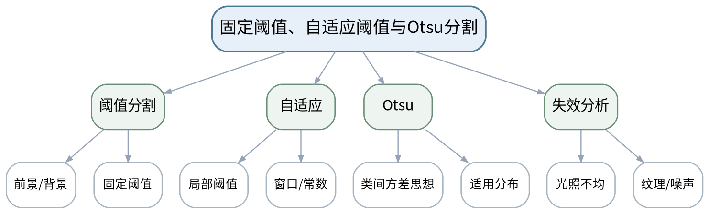

#### 教学目标

**知识目标：**
（1）掌握固定阈值、自适应阈值和Otsu阈值的基本思想与适用条件。
（2）理解二值结果中前景/背景定义和阈值方向。

**能力目标：**
（1）能够对同一组图像比较三类阈值方法，并记录阈值/窗口等参数。
（2）能够从光照不均、直方图分布和噪声解释分割失败。

**价值目标：**
（1）形成跨多图像验证参数、不以单张成功截图作为结论的实证意识。

#### 课程思政

（1）通过“只挑成功图片”会夸大方案能力的案例，强调评价必须包含失败样例和真实参数。

（2）要求课堂代码演示、图像参数和评价结果保留原始证据，不以单张成功截图替代多工况验证，强化数据诚信和质量责任。

#### 专创融合

把阈值方法选择设计成可配置策略，探索根据光照统计自动切换分割方案的思路。

#### 教学重难点

**教学重点**：三类阈值分割方法及光照/噪声条件下的失败分析。

**教学难点**：参数并非越“自动”越可靠，需要从图像分布和局部光照解释方法边界。

#### 教学过程

| 教学步骤 | 主要教学内容 | 设计意图 |
|---|---|---|
| 课前任务 | 【教师】1. 发布本课主题、教材/资料范围和一个成像/算法最小问题； 2. 明确课堂代码仅作理论课中的原理演示和案例复现，不改变课程32学时全理论的事实。 【学生】1. 预读关键概念/代码片段； 2. 记录至少1个预测和1个疑问，带着问题进入课堂。 | 通过预读和最小问题建立先备认知，同时明确理论课中的代码演示属于案例教学活动。 |
| 互动导入（10 min） | 【教师】展示一张中心明亮、边缘偏暗的零件图：固定阈值在中心成功、边缘失败；要求学生先判断“换一个全局阈值能否根治”。 【学生】先独立判断，再与同伴交换依据；教师收集典型分歧后进入本课。 | 从真实成像/检测现象切入，使学生先暴露直觉判断，再建立本课问题主线。 |
| 传授新知（共70 min） | 1、固定阈值（约16 min） 【教师】【教师】讲解二值化、阈值方向和阈值选择，结合直方图解释。 【学生】【学生】根据灰度分布预测两个阈值的分割差异。 2、自适应阈值（约18 min） 【教师】【教师】说明局部窗口与常数项的作用，演示光照不均场景。 【学生】【学生】比较两组窗口大小并观察局部噪声。 3、Otsu方法（约18 min） 【教师】【教师】以类间可分性直观解释Otsu自动阈值，说明其对分布的依赖。 【学生】【学生】对双峰/非双峰样例判断是否适合。 4、AB验证与失败归因（约18 min） 【教师】【教师】组织固定/自适应/Otsu多图像对照。 【学生】【学生】完成“方法—参数—成功条件—失败样例”表。 【课堂强化】形成可检查的课堂产物：['使用不少于5张不同光照图像比较固定/自适应/Otsu，统计失败图像并说明根因。']；课堂中至少保留参数/图像/计算或分析证据。 | 按“现象—原理—Python/OpenCV最小实现—参数比较—结果验证”推进，把教师讲解转化为可检查的分析或代码证据。 |
| 过关检测（10 min） | 【教师】组织课堂小测： 1.【选择题】当图像存在明显不均匀光照时，相比单一固定阈值更值得尝试（ ）。A. 自适应阈值 B. 图像旋转 C. 只看RGB蓝通道 D. 不做验证 2.【判断题】Otsu产生一个自动阈值，因此在所有分布上都比人工阈值更可靠。（ ） 3.【简答题】阈值分割实验为什么必须明确前景是白还是黑？ 【学生】独立作答/运行或读图验证；同伴互查后说明依据。 | 覆盖本课重点和典型误区，以即时证据发现“会看结果但不会解释”的问题。 |
| 课堂小结（5 min） | 【教师】1. 本次课解决的关键问题是“固定阈值、自适应阈值与Otsu分割”； 2. 需要重点掌握：三类阈值分割方法及光照/噪声条件下的失败分析。 3. 最值得带走的方法是先固定条件、再做参数/方案对比； 4. 需要警惕的易错点是：参数并非越“自动”越可靠，需要从图像分布和局部光照解释方法边界。 | 回到知识脉络图压缩信息，形成“概念—条件—参数—证据—边界”的完整认知。 |
| 作业布置（3 min） | 【教师】布置课后任务：['使用不少于5张不同光照图像比较固定/自适应/Otsu，统计失败图像并说明根因。'] 【要求】不只提交结果，还需保留原图/参数/中间结果/失败样例或判断依据。 | 固化课堂成果，形成可复核学习证据，并为下一课提供真实输入。 |
| 考勤（2 min） | 【教师】利用学校/课程实际使用的平台或课堂点名完成签到。 | 掌握出勤情况，保障教学秩序；不在教案中预填任何实际出勤事实。 |

#### 教学反思

【教师】课后重点从以下方面进行教学反思：

1. 教学流程：导入是否把学生带入真实视觉问题，70分钟主体是否按“现象—原理—实现—参数—验证”由浅入深。
2. 教学内容：重点记录“参数并非越“自动”越可靠，需要从图像分布和局部光照解释方法边界。”是否讲清，学生是否能说明参数/方法适用边界。
3. 学生参与：仅依据实际课堂记录填写参与、代码阅读/参数分析、互审和表达情况，不补写推测性结论。
4. 教学改进：依据真实课堂证据决定是否增加成像对比、失败样例、最小代码或指标练习。

### lesson-07

| 字段 | 内容 | 状态 | source_id |
|---|---|---|---|
| 章节 | 第三单元 分割、边缘与数学形态学 | derived | S1 |
| 授课题目 | Canny边缘检测、梯度阈值与边缘质量评价 | derived | S1 |
| 周次 |  | to_confirm |  |
| 课时安排 | 2课时（100 min）；类型：理论2 | official | S1 |
| 知识脉络图 | images/lesson-07-knowledge-map.png | derived | S1 |
| 教学方法 | 讲授法、问答法、案例分析法、结构图解法、Python/OpenCV代码演示法、参数对比法、课堂检测法 | derived | S3 |
| 教学用具 | 电脑、投影仪、多媒体课件、教材、Python、OpenCV、边缘/轮廓样例。 | derived | S1/S2 |
| 教学设计 | 课前任务→互动导入（10 min）→传授新知（70 min）→过关检测（10 min）→课堂小结（5 min）→作业布置（3 min）→考勤（2 min） | derived | S3 |
| 参考文献 | [1] 何文辉、葛大伟.《机器视觉技术与应用》[M]. 北京：机械工业出版社，2024.；[2] 李宁.《Python OpenCV从菜鸟到高手》[M]. 北京：清华大学出版社，2024. | provided | S2 |

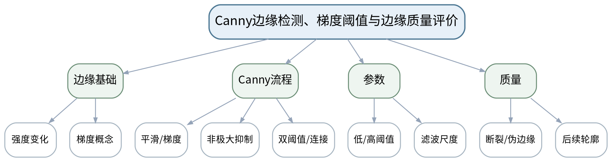

#### 教学目标

**知识目标：**
（1）理解边缘与灰度梯度的关系，掌握Canny流程的基本组成。
（2）理解双阈值与边缘连接对噪声和弱边缘的影响。

**能力目标：**
（1）能够使用OpenCV Canny并系统比较阈值参数。
（2）能够用断裂、伪边缘和后续轮廓完整性评价边缘结果。

**价值目标：**
（1）形成参数选择可解释、结果可复核的算法使用习惯。

#### 课程思政

（1）强调参数结果需经后续任务验证，避免为了截图“好看”而忽略伪边缘带来的误判风险。

（2）要求课堂代码演示、图像参数和评价结果保留原始证据，不以单张成功截图替代多工况验证，强化数据诚信和质量责任。

#### 专创融合

讨论将Canny参数与不同材质/光照产品配置绑定，形成可切换工艺参数表。

#### 教学重难点

**教学重点**：Canny基本流程、双阈值参数和边缘质量评价。

**教学难点**：学生容易只调阈值看“边缘多不多”，难点是把边缘质量与后续轮廓/测量任务关联。

#### 教学过程

| 教学步骤 | 主要教学内容 | 设计意图 |
|---|---|---|
| 课前任务 | 【教师】1. 发布本课主题、教材/资料范围和一个成像/算法最小问题； 2. 明确课堂代码仅作理论课中的原理演示和案例复现，不改变课程32学时全理论的事实。 【学生】1. 预读关键概念/代码片段； 2. 记录至少1个预测和1个疑问，带着问题进入课堂。 | 通过预读和最小问题建立先备认知，同时明确理论课中的代码演示属于案例教学活动。 |
| 互动导入（10 min） | 【教师】给出两张Canny结果：一张边缘很多但噪声严重，一张边缘较少但目标轮廓完整，要求学生先定义“哪个更好”的任务依据。 【学生】先独立判断，再与同伴交换依据；教师收集典型分歧后进入本课。 | 从真实成像/检测现象切入，使学生先暴露直觉判断，再建立本课问题主线。 |
| 传授新知（共70 min） | 1、边缘与梯度（约14 min） 【教师】【教师】用一维灰度剖面说明强度变化和梯度，建立边缘概念。 【学生】【学生】在剖面图上标出可能边缘。 2、Canny流程（约22 min） 【教师】【教师】讲解平滑、梯度、非极大抑制、双阈值与连接的逻辑。 【学生】【学生】用流程卡排序Canny步骤并解释每步作用。 3、阈值参数实验（约18 min） 【教师】【教师】固定图像比较3组低/高阈值。 【学生】【学生】记录伪边缘、断裂和目标边界完整度。 4、任务评价（约16 min） 【教师】【教师】把边缘结果用于轮廓/直线检测示例，说明边缘是中间证据。 【学生】【学生】选择一组参数并用后续任务结果证明选择。 【课堂强化】形成可检查的课堂产物：['对同一图像比较至少3组Canny阈值，附原图、边缘图和后续轮廓/直线结果。']；课堂中至少保留参数/图像/计算或分析证据。 | 按“现象—原理—Python/OpenCV最小实现—参数比较—结果验证”推进，把教师讲解转化为可检查的分析或代码证据。 |
| 过关检测（10 min） | 【教师】组织课堂小测： 1.【选择题】Canny中的非极大抑制主要用于（ ）。A. 细化边缘 B. 转换颜色空间 C. 计算直方图 D. 增大图像尺寸 2.【判断题】Canny阈值越低，边缘越多，因此检测效果一定越好。（ ） 3.【简答题】为什么评价边缘结果时应同时观察后续轮廓或几何检测？ 【学生】独立作答/运行或读图验证；同伴互查后说明依据。 | 覆盖本课重点和典型误区，以即时证据发现“会看结果但不会解释”的问题。 |
| 课堂小结（5 min） | 【教师】1. 本次课解决的关键问题是“Canny边缘检测、梯度阈值与边缘质量评价”； 2. 需要重点掌握：Canny基本流程、双阈值参数和边缘质量评价。 3. 最值得带走的方法是先固定条件、再做参数/方案对比； 4. 需要警惕的易错点是：学生容易只调阈值看“边缘多不多”，难点是把边缘质量与后续轮廓/测量任务关联。 | 回到知识脉络图压缩信息，形成“概念—条件—参数—证据—边界”的完整认知。 |
| 作业布置（3 min） | 【教师】布置课后任务：['对同一图像比较至少3组Canny阈值，附原图、边缘图和后续轮廓/直线结果。'] 【要求】不只提交结果，还需保留原图/参数/中间结果/失败样例或判断依据。 | 固化课堂成果，形成可复核学习证据，并为下一课提供真实输入。 |
| 考勤（2 min） | 【教师】利用学校/课程实际使用的平台或课堂点名完成签到。 | 掌握出勤情况，保障教学秩序；不在教案中预填任何实际出勤事实。 |

#### 教学反思

【教师】课后重点从以下方面进行教学反思：

1. 教学流程：导入是否把学生带入真实视觉问题，70分钟主体是否按“现象—原理—实现—参数—验证”由浅入深。
2. 教学内容：重点记录“学生容易只调阈值看“边缘多不多”，难点是把边缘质量与后续轮廓/测量任务关联。”是否讲清，学生是否能说明参数/方法适用边界。
3. 学生参与：仅依据实际课堂记录填写参与、代码阅读/参数分析、互审和表达情况，不补写推测性结论。
4. 教学改进：依据真实课堂证据决定是否增加成像对比、失败样例、最小代码或指标练习。

### lesson-08

| 字段 | 内容 | 状态 | source_id |
|---|---|---|---|
| 章节 | 第三单元 分割、边缘与数学形态学 | derived | S1 |
| 授课题目 | 腐蚀/膨胀、开闭运算与粘连/断裂/孔洞修复 | derived | S1 |
| 周次 |  | to_confirm |  |
| 课时安排 | 2课时（100 min）；类型：理论2 | official | S1 |
| 知识脉络图 | images/lesson-08-knowledge-map.png | derived | S1 |
| 教学方法 | 讲授法、问答法、案例分析法、结构图解法、Python/OpenCV代码演示法、参数对比法、课堂检测法 | derived | S3 |
| 教学用具 | 电脑、投影仪、多媒体课件、教材、Python、OpenCV、二值图和结构元素示例。 | derived | S1/S2 |
| 教学设计 | 课前任务→互动导入（10 min）→传授新知（70 min）→过关检测（10 min）→课堂小结（5 min）→作业布置（3 min）→考勤（2 min） | derived | S3 |
| 参考文献 | [1] 何文辉、葛大伟.《机器视觉技术与应用》[M]. 北京：机械工业出版社，2024.；[2] 李宁.《Python OpenCV从菜鸟到高手》[M]. 北京：清华大学出版社，2024. | provided | S2 |

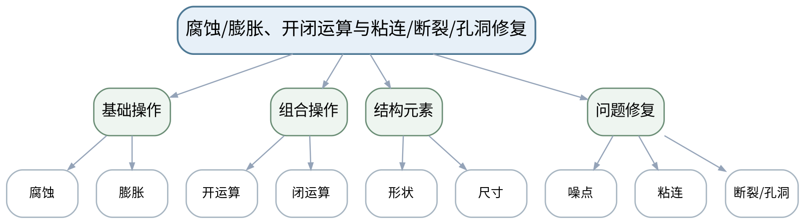

#### 教学目标

**知识目标：**
（1）掌握腐蚀、膨胀、开运算和闭运算的基本作用。
（2）理解结构元素形状/尺寸与目标几何之间的关系。

**能力目标：**
（1）能够根据噪点、粘连、断裂、孔洞问题选择形态学组合。
（2）能够比较不同结构元素并分析过处理导致的尺寸/拓扑改变。

**价值目标：**
（1）形成“结构修复不能破坏真实缺陷”的质量意识。

#### 课程思政

（1）通过过度形态学把真实小缺陷抹掉的案例强调处理算法不能为了结果整洁牺牲质量事实。

（2）要求课堂代码演示、图像参数和评价结果保留原始证据，不以单张成功截图替代多工况验证，强化数据诚信和质量责任。

#### 专创融合

将分割+形态学流程封装成“产品参数配方”，比较不同产品换型时参数管理方法。

#### 教学重难点

**教学重点**：形态学操作、结构元素与二值结构修复。

**教学难点**：难点是选择操作顺序和结构元素尺度，使噪声得到处理而目标几何不被过度改变。

#### 教学过程

| 教学步骤 | 主要教学内容 | 设计意图 |
|---|---|---|
| 课前任务 | 【教师】1. 发布本课主题、教材/资料范围和一个成像/算法最小问题； 2. 明确课堂代码仅作理论课中的原理演示和案例复现，不改变课程32学时全理论的事实。 【学生】1. 预读关键概念/代码片段； 2. 记录至少1个预测和1个疑问，带着问题进入课堂。 | 通过预读和最小问题建立先备认知，同时明确理论课中的代码演示属于案例教学活动。 |
| 互动导入（10 min） | 【教师】展示一张含小噪点、细小断裂和相邻粘连的二值图，要求学生指出一个操作不可能同时解决全部问题。 【学生】先独立判断，再与同伴交换依据；教师收集典型分歧后进入本课。 | 从真实成像/检测现象切入，使学生先暴露直觉判断，再建立本课问题主线。 |
| 传授新知（共70 min） | 1、腐蚀与膨胀（约16 min） 【教师】【教师】用集合/邻域直观说明腐蚀和膨胀对前景边界的作用。 【学生】【学生】预测同一小孔/细线经过两操作后的变化。 2、开闭运算（约18 min） 【教师】【教师】比较开运算去小前景噪点、闭运算填小孔/连接断裂的典型效果。 【学生】【学生】为四类问题选择开/闭及顺序。 3、结构元素（约18 min） 【教师】【教师】演示形状、大小对细长目标、圆孔和间隙的影响。 【学生】【学生】比较两种核并解释为何可能破坏尺寸。 4、组合验证（约18 min） 【教师】【教师】提供多工况二值图进行流程组合。 【学生】【学生】提交“原始二值→形态学→轮廓”的前后证据和失败案例。 【课堂强化】形成可检查的课堂产物：['围绕“噪点、粘连、断裂、孔洞”至少选择两类问题设计形态学处理，并报告结构元素与失败样例。']；课堂中至少保留参数/图像/计算或分析证据。 | 按“现象—原理—Python/OpenCV最小实现—参数比较—结果验证”推进，把教师讲解转化为可检查的分析或代码证据。 |
| 过关检测（10 min） | 【教师】组织课堂小测： 1.【选择题】去除孤立的小白色噪点通常优先考虑（ ）。A. 开运算 B. 闭运算 C. 透视变换 D. 颜色空间转换 2.【判断题】结构元素越大，形态学结果通常越可靠。（ ） 3.【简答题】为什么测量任务中形态学处理必须评估几何尺寸偏差？ 【学生】独立作答/运行或读图验证；同伴互查后说明依据。 | 覆盖本课重点和典型误区，以即时证据发现“会看结果但不会解释”的问题。 |
| 课堂小结（5 min） | 【教师】1. 本次课解决的关键问题是“腐蚀/膨胀、开闭运算与粘连/断裂/孔洞修复”； 2. 需要重点掌握：形态学操作、结构元素与二值结构修复。 3. 最值得带走的方法是先固定条件、再做参数/方案对比； 4. 需要警惕的易错点是：难点是选择操作顺序和结构元素尺度，使噪声得到处理而目标几何不被过度改变。 | 回到知识脉络图压缩信息，形成“概念—条件—参数—证据—边界”的完整认知。 |
| 作业布置（3 min） | 【教师】布置课后任务：['围绕“噪点、粘连、断裂、孔洞”至少选择两类问题设计形态学处理，并报告结构元素与失败样例。'] 【要求】不只提交结果，还需保留原图/参数/中间结果/失败样例或判断依据。 | 固化课堂成果，形成可复核学习证据，并为下一课提供真实输入。 |
| 考勤（2 min） | 【教师】利用学校/课程实际使用的平台或课堂点名完成签到。 | 掌握出勤情况，保障教学秩序；不在教案中预填任何实际出勤事实。 |

#### 教学反思

【教师】课后重点从以下方面进行教学反思：

1. 教学流程：导入是否把学生带入真实视觉问题，70分钟主体是否按“现象—原理—实现—参数—验证”由浅入深。
2. 教学内容：重点记录“难点是选择操作顺序和结构元素尺度，使噪声得到处理而目标几何不被过度改变。”是否讲清，学生是否能说明参数/方法适用边界。
3. 学生参与：仅依据实际课堂记录填写参与、代码阅读/参数分析、互审和表达情况，不补写推测性结论。
4. 教学改进：依据真实课堂证据决定是否增加成像对比、失败样例、最小代码或指标练习。

#### 单元课程作业节点

- 课程作业内部权重20%；目标1.3、2.2、3.2、3.4。
- 本单元作业必须包含原图/任务条件、关键参数、中间结果、评价或失败样例；不要求虚构独立上机课时。

### lesson-09

| 字段 | 内容 | 状态 | source_id |
|---|---|---|---|
| 章节 | 第四单元 轮廓、连通域、测量与定位 | derived | S1 |
| 授课题目 | 轮廓、层级、连通域与面积/周长/质心统计 | derived | S1 |
| 周次 |  | to_confirm |  |
| 课时安排 | 2课时（100 min）；类型：理论2 | official | S1 |
| 知识脉络图 | images/lesson-09-knowledge-map.png | derived | S1 |
| 教学方法 | 讲授法、问答法、案例分析法、结构图解法、Python/OpenCV代码演示法、参数对比法、课堂检测法 | derived | S3 |
| 教学用具 | 电脑、投影仪、多媒体课件、教材、Python、OpenCV、计数与孔洞样例。 | derived | S1/S2 |
| 教学设计 | 课前任务→互动导入（10 min）→传授新知（70 min）→过关检测（10 min）→课堂小结（5 min）→作业布置（3 min）→考勤（2 min） | derived | S3 |
| 参考文献 | [1] 何文辉、葛大伟.《机器视觉技术与应用》[M]. 北京：机械工业出版社，2024.；[2] 李宁.《Python OpenCV从菜鸟到高手》[M]. 北京：清华大学出版社，2024. | provided | S2 |

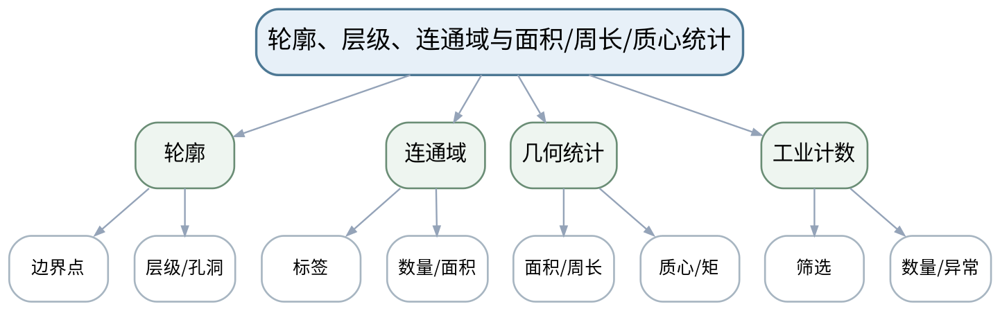

#### 教学目标

**知识目标：**
（1）掌握轮廓、层级与连通域的基本概念。
（2）理解面积、周长、质心和矩等几何统计量。

**能力目标：**
（1）能够使用OpenCV提取轮廓/连通域并完成目标计数与筛选。
（2）能够通过面积、位置等条件排除明显噪声并解释筛选依据。

**价值目标：**
（1）形成统计规则和阈值来源可解释的质量判定意识。

#### 课程思政

（1）强调计数和统计阈值必须有来源，避免为了达到预期数量随意调参。

（2）要求课堂代码演示、图像参数和评价结果保留原始证据，不以单张成功截图替代多工况验证，强化数据诚信和质量责任。

#### 专创融合

把轮廓/连通域统计做成生产计数模块，思考如何输出可对接MES/PLC的结构化结果。

#### 教学重难点

**教学重点**：轮廓/连通域提取及面积、周长、质心统计。

**教学难点**：轮廓层级、孔洞和噪声目标会影响计数，需要从二值结构和工业判据共同解释。

#### 教学过程

| 教学步骤 | 主要教学内容 | 设计意图 |
|---|---|---|
| 课前任务 | 【教师】1. 发布本课主题、教材/资料范围和一个成像/算法最小问题； 2. 明确课堂代码仅作理论课中的原理演示和案例复现，不改变课程32学时全理论的事实。 【学生】1. 预读关键概念/代码片段； 2. 记录至少1个预测和1个疑问，带着问题进入课堂。 | 通过预读和最小问题建立先备认知，同时明确理论课中的代码演示属于案例教学活动。 |
| 互动导入（10 min） | 【教师】给出一个带孔零件和一个实心零件的二值图，使用不同轮廓检索模式得到不同数量，要求学生解释“数量为什么变了”。 【学生】先独立判断，再与同伴交换依据；教师收集典型分歧后进入本课。 | 从真实成像/检测现象切入，使学生先暴露直觉判断，再建立本课问题主线。 |
| 传授新知（共70 min） | 1、轮廓与检索模式（约18 min） 【教师】【教师】讲解轮廓边界、层级和孔洞关系，比较常见检索模式。 【学生】【学生】根据层级树判断外轮廓与孔轮廓。 2、连通域（约16 min） 【教师】【教师】讲解连通域标签、面积、包围盒与质心。 【学生】【学生】对颗粒/零件图完成数量统计思路。 3、几何统计（约18 min） 【教师】【教师】说明面积、周长、矩和质心的计算用途。 【学生】【学生】根据特征表筛选过小噪声和目标。 4、计数案例（约18 min） 【教师】【教师】用工件计数案例串联分割→形态学→连通域/轮廓→筛选。 【学生】【学生】形成参数和数量结果表，并保留误计案例。 【课堂强化】形成可检查的课堂产物：['使用一组零件图完成轮廓/连通域计数，报告面积筛选阈值、误计样例与修改依据。']；课堂中至少保留参数/图像/计算或分析证据。 | 按“现象—原理—Python/OpenCV最小实现—参数比较—结果验证”推进，把教师讲解转化为可检查的分析或代码证据。 |
| 过关检测（10 min） | 【教师】组织课堂小测： 1.【选择题】需要同时获取每个独立前景区域的标签和面积时，常用思路是（ ）。A. 连通域分析 B. 图像旋转 C. 颜色显示 D. 文件压缩 2.【判断题】轮廓数量等于真实零件数量，不需要考虑孔洞或噪声。（ ） 3.【简答题】面积阈值用于剔除噪声时，阈值应如何获得工程依据？ 【学生】独立作答/运行或读图验证；同伴互查后说明依据。 | 覆盖本课重点和典型误区，以即时证据发现“会看结果但不会解释”的问题。 |
| 课堂小结（5 min） | 【教师】1. 本次课解决的关键问题是“轮廓、层级、连通域与面积/周长/质心统计”； 2. 需要重点掌握：轮廓/连通域提取及面积、周长、质心统计。 3. 最值得带走的方法是先固定条件、再做参数/方案对比； 4. 需要警惕的易错点是：轮廓层级、孔洞和噪声目标会影响计数，需要从二值结构和工业判据共同解释。 | 回到知识脉络图压缩信息，形成“概念—条件—参数—证据—边界”的完整认知。 |
| 作业布置（3 min） | 【教师】布置课后任务：['使用一组零件图完成轮廓/连通域计数，报告面积筛选阈值、误计样例与修改依据。'] 【要求】不只提交结果，还需保留原图/参数/中间结果/失败样例或判断依据。 | 固化课堂成果，形成可复核学习证据，并为下一课提供真实输入。 |
| 考勤（2 min） | 【教师】利用学校/课程实际使用的平台或课堂点名完成签到。 | 掌握出勤情况，保障教学秩序；不在教案中预填任何实际出勤事实。 |

#### 教学反思

【教师】课后重点从以下方面进行教学反思：

1. 教学流程：导入是否把学生带入真实视觉问题，70分钟主体是否按“现象—原理—实现—参数—验证”由浅入深。
2. 教学内容：重点记录“轮廓层级、孔洞和噪声目标会影响计数，需要从二值结构和工业判据共同解释。”是否讲清，学生是否能说明参数/方法适用边界。
3. 学生参与：仅依据实际课堂记录填写参与、代码阅读/参数分析、互审和表达情况，不补写推测性结论。
4. 教学改进：依据真实课堂证据决定是否增加成像对比、失败样例、最小代码或指标练习。

### lesson-10

| 字段 | 内容 | 状态 | source_id |
|---|---|---|---|
| 章节 | 第四单元 轮廓、连通域、测量与定位 | derived | S1 |
| 授课题目 | 外接几何、直线/圆检测与尺寸/位置/角度提取 | derived | S1 |
| 周次 |  | to_confirm |  |
| 课时安排 | 2课时（100 min）；类型：理论2 | official | S1 |
| 知识脉络图 | images/lesson-10-knowledge-map.png | derived | S1 |
| 教学方法 | 讲授法、问答法、案例分析法、结构图解法、Python/OpenCV代码演示法、参数对比法、课堂检测法 | derived | S3 |
| 教学用具 | 电脑、投影仪、多媒体课件、教材、Python、OpenCV、几何零件图、坐标示意。 | derived | S1/S2 |
| 教学设计 | 课前任务→互动导入（10 min）→传授新知（70 min）→过关检测（10 min）→课堂小结（5 min）→作业布置（3 min）→考勤（2 min） | derived | S3 |
| 参考文献 | [1] 何文辉、葛大伟.《机器视觉技术与应用》[M]. 北京：机械工业出版社，2024.；[2] 李宁.《Python OpenCV从菜鸟到高手》[M]. 北京：清华大学出版社，2024. | provided | S2 |

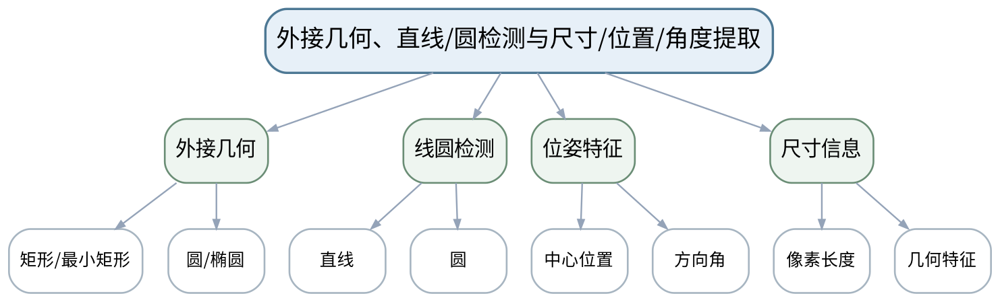

#### 教学目标

**知识目标：**
（1）掌握外接矩形、最小外接矩形、圆/椭圆拟合及直线/圆检测的基本用途。
（2）理解像素几何特征与零件位置、角度、尺寸之间的关系。

**能力目标：**
（1）能够从轮廓提取中心、宽高、角度等特征。
（2）能够根据对象几何选择轮廓拟合或直线/圆检测方法。

**价值目标：**
（1）形成“几何结果必须对应真实基准和工艺判据”的测量意识。

#### 课程思政

（1）通过错误坐标或尺度导致机器人错误抓取/质量误判的案例强调几何量必须有基准。

（2）要求课堂代码演示、图像参数和评价结果保留原始证据，不以单张成功截图替代多工况验证，强化数据诚信和质量责任。

#### 专创融合

将二维位置/角度输出设计成可供机器人或工控系统调用的结果接口，讨论单位和坐标契约。

#### 教学重难点

**教学重点**：外接几何、直线/圆检测、位置/角度与像素尺寸。

**教学难点**：学生需区分“算法输出几何参数”和“工程尺寸/姿态”之间仍需要基准、尺度和坐标定义。

#### 教学过程

| 教学步骤 | 主要教学内容 | 设计意图 |
|---|---|---|
| 课前任务 | 【教师】1. 发布本课主题、教材/资料范围和一个成像/算法最小问题； 2. 明确课堂代码仅作理论课中的原理演示和案例复现，不改变课程32学时全理论的事实。 【学生】1. 预读关键概念/代码片段； 2. 记录至少1个预测和1个疑问，带着问题进入课堂。 | 通过预读和最小问题建立先备认知，同时明确理论课中的代码演示属于案例教学活动。 |
| 互动导入（10 min） | 【教师】展示倾斜矩形工件：普通外接矩形给出轴对齐宽高，而最小外接矩形给出方向角，要求学生判断哪组更适合姿态估计。 【学生】先独立判断，再与同伴交换依据；教师收集典型分歧后进入本课。 | 从真实成像/检测现象切入，使学生先暴露直觉判断，再建立本课问题主线。 |
| 传授新知（共70 min） | 1、外接几何（约18 min） 【教师】【教师】比较boundingRect、minAreaRect、minEnclosingCircle、fitEllipse的输出与条件。 【学生】【学生】为矩形、圆孔、椭圆件分别选择特征。 2、直线与圆（约16 min） 【教师】【教师】讲解边缘到直线/圆检测的基本思路和参数敏感性。 【学生】【学生】判断复杂背景中为何先做好边缘/ROI更重要。 3、位姿特征（约18 min） 【教师】【教师】用最小外接矩形中心和角度说明二维定位。 【学生】【学生】计算/读取中心与角度，并说明坐标参考。 4、像素尺寸与判定（约18 min） 【教师】【教师】串联像素长度、尺度换算的下一步需求。 【学生】【学生】形成“像素量—工程量—需要的标定信息”表。 【课堂强化】形成可检查的课堂产物：['选择一个矩形/孔类零件，提取中心、尺寸和方向角，说明每个输出的坐标/尺度含义。']；课堂中至少保留参数/图像/计算或分析证据。 | 按“现象—原理—Python/OpenCV最小实现—参数比较—结果验证”推进，把教师讲解转化为可检查的分析或代码证据。 |
| 过关检测（10 min） | 【教师】组织课堂小测： 1.【选择题】需要获得旋转矩形工件的方向角时，更适合采用（ ）。A. 最小外接矩形 B. 只看图像宽度 C. 直方图均值 D. 文件名 2.【判断题】检测到100像素长度即可直接得出100毫米实际尺寸。（ ） 3.【简答题】直线/圆检测前为什么常需要ROI、滤波或边缘预处理？ 【学生】独立作答/运行或读图验证；同伴互查后说明依据。 | 覆盖本课重点和典型误区，以即时证据发现“会看结果但不会解释”的问题。 |
| 课堂小结（5 min） | 【教师】1. 本次课解决的关键问题是“外接几何、直线/圆检测与尺寸/位置/角度提取”； 2. 需要重点掌握：外接几何、直线/圆检测、位置/角度与像素尺寸。 3. 最值得带走的方法是先固定条件、再做参数/方案对比； 4. 需要警惕的易错点是：学生需区分“算法输出几何参数”和“工程尺寸/姿态”之间仍需要基准、尺度和坐标定义。 | 回到知识脉络图压缩信息，形成“概念—条件—参数—证据—边界”的完整认知。 |
| 作业布置（3 min） | 【教师】布置课后任务：['选择一个矩形/孔类零件，提取中心、尺寸和方向角，说明每个输出的坐标/尺度含义。'] 【要求】不只提交结果，还需保留原图/参数/中间结果/失败样例或判断依据。 | 固化课堂成果，形成可复核学习证据，并为下一课提供真实输入。 |
| 考勤（2 min） | 【教师】利用学校/课程实际使用的平台或课堂点名完成签到。 | 掌握出勤情况，保障教学秩序；不在教案中预填任何实际出勤事实。 |

#### 教学反思

【教师】课后重点从以下方面进行教学反思：

1. 教学流程：导入是否把学生带入真实视觉问题，70分钟主体是否按“现象—原理—实现—参数—验证”由浅入深。
2. 教学内容：重点记录“学生需区分“算法输出几何参数”和“工程尺寸/姿态”之间仍需要基准、尺度和坐标定义。”是否讲清，学生是否能说明参数/方法适用边界。
3. 学生参与：仅依据实际课堂记录填写参与、代码阅读/参数分析、互审和表达情况，不补写推测性结论。
4. 教学改进：依据真实课堂证据决定是否增加成像对比、失败样例、最小代码或指标练习。

### lesson-11

| 字段 | 内容 | 状态 | source_id |
|---|---|---|---|
| 章节 | 第四单元 轮廓、连通域、测量与定位 | derived | S1 |
| 授课题目 | 尺度换算、标定概念、容差判定与重复性/误差分析 | derived | S1 |
| 周次 |  | to_confirm |  |
| 课时安排 | 2课时（100 min）；类型：理论2 | official | S1 |
| 知识脉络图 | images/lesson-11-knowledge-map.png | derived | S1 |
| 教学方法 | 讲授法、问答法、案例分析法、结构图解法、Python/OpenCV代码演示法、参数对比法、课堂检测法 | derived | S3 |
| 教学用具 | 电脑、投影仪、多媒体课件、教材、Python、OpenCV、测量数据表、标准尺寸样例。 | derived | S1/S2 |
| 教学设计 | 课前任务→互动导入（10 min）→传授新知（70 min）→过关检测（10 min）→课堂小结（5 min）→作业布置（3 min）→考勤（2 min） | derived | S3 |
| 参考文献 | [1] 何文辉、葛大伟.《机器视觉技术与应用》[M]. 北京：机械工业出版社，2024.；[2] 李宁.《Python OpenCV从菜鸟到高手》[M]. 北京：清华大学出版社，2024. | provided | S2 |

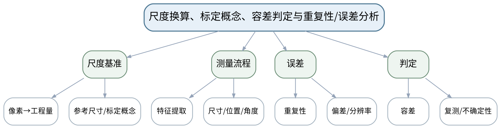

#### 教学目标

**知识目标：**
（1）理解尺度换算、参考基准和标定概念。
（2）理解重复性、偏差、分辨率与容差判定的基本关系。

**能力目标：**
（1）能够依据已知尺度基准把像素量转换为工程量，并完成简单合格判定。
（2）能够通过重复图像测量计算均值/极差或标准差等基本统计并分析误差来源。

**价值目标：**
（1）树立测量结果必须有尺度基准、重复性和误差说明的计量意识。

#### 课程思政

（1）以尺寸临界判定和误差责任为例强调不能隐去不确定性，对临界结果应保留复测/人工确认机制。

（2）要求课堂代码演示、图像参数和评价结果保留原始证据，不以单张成功截图替代多工况验证，强化数据诚信和质量责任。

#### 专创融合

将“合格/不合格/需复核”三状态输出用于质量系统，探索减少误判成本的产品化规则。

#### 教学重难点

**教学重点**：像素-工程量换算、容差判定、重复测量和误差分析。

**教学难点**：难点是避免把单次算法输出当作真实值，需要从标定、视角、畸变、分割边界和重复性分析误差。

#### 教学过程

| 教学步骤 | 主要教学内容 | 设计意图 |
|---|---|---|
| 课前任务 | 【教师】1. 发布本课主题、教材/资料范围和一个成像/算法最小问题； 2. 明确课堂代码仅作理论课中的原理演示和案例复现，不改变课程32学时全理论的事实。 【学生】1. 预读关键概念/代码片段； 2. 记录至少1个预测和1个疑问，带着问题进入课堂。 | 通过预读和最小问题建立先备认知，同时明确理论课中的代码演示属于案例教学活动。 |
| 互动导入（10 min） | 【教师】给出同一标准件连续5次测量结果，均在公差附近波动；要求学生判断是否仅凭一次“合格”就能宣布方案可靠。 【学生】先独立判断，再与同伴交换依据；教师收集典型分歧后进入本课。 | 从真实成像/检测现象切入，使学生先暴露直觉判断，再建立本课问题主线。 |
| 传授新知（共70 min） | 1、尺度换算与标定概念（约18 min） 【教师】【教师】讲解已知基准尺寸、像素/毫米换算和更一般相机标定的作用边界。 【学生】【学生】用一组参考尺寸完成像素→毫米换算。 2、测量链与误差源（约18 min） 【教师】【教师】梳理成像、分割、轮廓、尺度、透视/畸变等误差来源。 【学生】【学生】建立误差鱼骨/清单。 3、重复性分析（约18 min） 【教师】【教师】演示多次测量均值、极差/标准差和异常值检查。 【学生】【学生】计算5次结果并判断稳定性。 4、容差与复核（约16 min） 【教师】【教师】说明公差边界、灰区复测和安全判定。 【学生】【学生】设计“合格/不合格/需复核”三状态判定规则。 【课堂强化】形成可检查的课堂产物：['用同一对象至少5次图像/测量结果完成尺度换算、重复性统计和公差判定，并写出主要误差来源。']；课堂中至少保留参数/图像/计算或分析证据。 | 按“现象—原理—Python/OpenCV最小实现—参数比较—结果验证”推进，把教师讲解转化为可检查的分析或代码证据。 |
| 过关检测（10 min） | 【教师】组织课堂小测： 1.【选择题】把像素长度换算成毫米，至少需要（ ）。A. 有物理意义的尺度基准 B. 只需图像文件大小 C. 只需颜色空间 D. 只需阈值 2.【判断题】一次测量落在公差内即可证明视觉测量系统具有良好重复性。（ ） 3.【简答题】列举至少三类会影响视觉尺寸测量的误差来源。 【学生】独立作答/运行或读图验证；同伴互查后说明依据。 | 覆盖本课重点和典型误区，以即时证据发现“会看结果但不会解释”的问题。 |
| 课堂小结（5 min） | 【教师】1. 本次课解决的关键问题是“尺度换算、标定概念、容差判定与重复性/误差分析”； 2. 需要重点掌握：像素-工程量换算、容差判定、重复测量和误差分析。 3. 最值得带走的方法是先固定条件、再做参数/方案对比； 4. 需要警惕的易错点是：难点是避免把单次算法输出当作真实值，需要从标定、视角、畸变、分割边界和重复性分析误差。 | 回到知识脉络图压缩信息，形成“概念—条件—参数—证据—边界”的完整认知。 |
| 作业布置（3 min） | 【教师】布置课后任务：['用同一对象至少5次图像/测量结果完成尺度换算、重复性统计和公差判定，并写出主要误差来源。'] 【要求】不只提交结果，还需保留原图/参数/中间结果/失败样例或判断依据。 | 固化课堂成果，形成可复核学习证据，并为下一课提供真实输入。 |
| 考勤（2 min） | 【教师】利用学校/课程实际使用的平台或课堂点名完成签到。 | 掌握出勤情况，保障教学秩序；不在教案中预填任何实际出勤事实。 |

#### 教学反思

【教师】课后重点从以下方面进行教学反思：

1. 教学流程：导入是否把学生带入真实视觉问题，70分钟主体是否按“现象—原理—实现—参数—验证”由浅入深。
2. 教学内容：重点记录“难点是避免把单次算法输出当作真实值，需要从标定、视角、畸变、分割边界和重复性分析误差。”是否讲清，学生是否能说明参数/方法适用边界。
3. 学生参与：仅依据实际课堂记录填写参与、代码阅读/参数分析、互审和表达情况，不补写推测性结论。
4. 教学改进：依据真实课堂证据决定是否增加成像对比、失败样例、最小代码或指标练习。

#### 单元课程作业节点

- 课程作业内部权重20%；目标1.4、2.3、3.3、3.4。
- 本单元作业必须包含原图/任务条件、关键参数、中间结果、评价或失败样例；不要求虚构独立上机课时。

### lesson-12

| 字段 | 内容 | 状态 | source_id |
|---|---|---|---|
| 章节 | 第五单元 模板匹配、特征与工业识别 | derived | S1 |
| 授课题目 | 模板匹配、相似度图与尺度/旋转/遮挡鲁棒性 | derived | S1 |
| 周次 |  | to_confirm |  |
| 课时安排 | 2课时（100 min）；类型：理论2 | official | S1 |
| 知识脉络图 | images/lesson-12-knowledge-map.png | derived | S1 |
| 教学方法 | 讲授法、问答法、案例分析法、结构图解法、Python/OpenCV代码演示法、参数对比法、课堂检测法 | derived | S3 |
| 教学用具 | 电脑、投影仪、多媒体课件、教材、Python、OpenCV、模板与受控变量图像。 | derived | S1/S2 |
| 教学设计 | 课前任务→互动导入（10 min）→传授新知（70 min）→过关检测（10 min）→课堂小结（5 min）→作业布置（3 min）→考勤（2 min） | derived | S3 |
| 参考文献 | [1] 何文辉、葛大伟.《机器视觉技术与应用》[M]. 北京：机械工业出版社，2024.；[2] 李宁.《Python OpenCV从菜鸟到高手》[M]. 北京：清华大学出版社，2024. | provided | S2 |

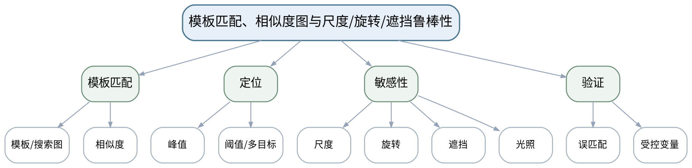

#### 教学目标

**知识目标：**
（1）掌握模板匹配的基本思想和相似度响应图概念。
（2）理解模板方法对尺度、旋转、遮挡和光照变化的敏感性。

**能力目标：**
（1）能够使用OpenCV完成基本模板定位并设置合理阈值。
（2）能够设计受控变量实验分析误匹配和漏匹配。

**价值目标：**
（1）形成阈值必须有样本证据、识别结果必须报告误匹配的实证意识。

#### 课程思政

（1）以误匹配造成错误抓取/分拣的案例强调阈值与环境假设必须通过数据验证。

（2）要求课堂代码演示、图像参数和评价结果保留原始证据，不以单张成功截图替代多工况验证，强化数据诚信和质量责任。

#### 专创融合

讨论通过治具约束、标准光照和ROI限制降低算法复杂度的工程优化思路。

#### 教学重难点

**教学重点**：模板匹配流程、阈值与尺度/旋转/遮挡影响。

**教学难点**：模板在理想条件下简单有效，但鲁棒性边界明显；学生需从受控变量实验而非单张图判断适用性。

#### 教学过程

| 教学步骤 | 主要教学内容 | 设计意图 |
|---|---|---|
| 课前任务 | 【教师】1. 发布本课主题、教材/资料范围和一个成像/算法最小问题； 2. 明确课堂代码仅作理论课中的原理演示和案例复现，不改变课程32学时全理论的事实。 【学生】1. 预读关键概念/代码片段； 2. 记录至少1个预测和1个疑问，带着问题进入课堂。 | 通过预读和最小问题建立先备认知，同时明确理论课中的代码演示属于案例教学活动。 |
| 互动导入（10 min） | 【教师】先用正向模板在原图准确定位，再把目标旋转15°，观察匹配值骤降；提问问题发生在“代码”还是“方法假设”。 【学生】先独立判断，再与同伴交换依据；教师收集典型分歧后进入本课。 | 从真实成像/检测现象切入，使学生先暴露直觉判断，再建立本课问题主线。 |
| 传授新知（共70 min） | 1、模板匹配流程（约18 min） 【教师】【教师】说明模板、搜索区域、滑动比较和相似度图，演示单目标定位。 【学生】【学生】读取响应图峰值并验证目标位置。 2、阈值与多目标（约14 min） 【教师】【教师】讲解阈值对漏检/误检的影响。 【学生】【学生】比较两种阈值并记录匹配数量。 3、受控变量实验（约22 min） 【教师】【教师】固定其他条件，改变尺度、旋转、遮挡、亮度。 【学生】【学生】建立“变量—匹配分数—是否成功”表。 4、适用边界（约16 min） 【教师】【教师】引导比较标准化工位和自由姿态场景。 【学生】【学生】写出模板匹配适合/不适合的各2类场景。 【课堂强化】形成可检查的课堂产物：['对一目标完成原始、旋转、缩放、遮挡、亮度变化至少4类受控实验，形成匹配分数和误检/漏检表。']；课堂中至少保留参数/图像/计算或分析证据。 | 按“现象—原理—Python/OpenCV最小实现—参数比较—结果验证”推进，把教师讲解转化为可检查的分析或代码证据。 |
| 过关检测（10 min） | 【教师】组织课堂小测： 1.【选择题】模板匹配最容易受到下列哪类变化影响（ ）。A. 尺度和旋转变化 B. 文件扩展名 C. Python变量名 D. 显示窗口标题 2.【判断题】只要把匹配阈值降低，就可以同时消除漏检和误检。（ ） 3.【简答题】怎样设计一个公平实验比较光照变化对模板匹配的影响？ 【学生】独立作答/运行或读图验证；同伴互查后说明依据。 | 覆盖本课重点和典型误区，以即时证据发现“会看结果但不会解释”的问题。 |
| 课堂小结（5 min） | 【教师】1. 本次课解决的关键问题是“模板匹配、相似度图与尺度/旋转/遮挡鲁棒性”； 2. 需要重点掌握：模板匹配流程、阈值与尺度/旋转/遮挡影响。 3. 最值得带走的方法是先固定条件、再做参数/方案对比； 4. 需要警惕的易错点是：模板在理想条件下简单有效，但鲁棒性边界明显；学生需从受控变量实验而非单张图判断适用性。 | 回到知识脉络图压缩信息，形成“概念—条件—参数—证据—边界”的完整认知。 |
| 作业布置（3 min） | 【教师】布置课后任务：['对一目标完成原始、旋转、缩放、遮挡、亮度变化至少4类受控实验，形成匹配分数和误检/漏检表。'] 【要求】不只提交结果，还需保留原图/参数/中间结果/失败样例或判断依据。 | 固化课堂成果，形成可复核学习证据，并为下一课提供真实输入。 |
| 考勤（2 min） | 【教师】利用学校/课程实际使用的平台或课堂点名完成签到。 | 掌握出勤情况，保障教学秩序；不在教案中预填任何实际出勤事实。 |

#### 教学反思

【教师】课后重点从以下方面进行教学反思：

1. 教学流程：导入是否把学生带入真实视觉问题，70分钟主体是否按“现象—原理—实现—参数—验证”由浅入深。
2. 教学内容：重点记录“模板在理想条件下简单有效，但鲁棒性边界明显；学生需从受控变量实验而非单张图判断适用性。”是否讲清，学生是否能说明参数/方法适用边界。
3. 学生参与：仅依据实际课堂记录填写参与、代码阅读/参数分析、互审和表达情况，不补写推测性结论。
4. 教学改进：依据真实课堂证据决定是否增加成像对比、失败样例、最小代码或指标练习。

### lesson-13

| 字段 | 内容 | 状态 | source_id |
|---|---|---|---|
| 章节 | 第五单元 模板匹配、特征与工业识别 | derived | S1 |
| 授课题目 | 角点、ORB/SIFT局部特征、描述子匹配与几何验证 | derived | S1 |
| 周次 |  | to_confirm |  |
| 课时安排 | 2课时（100 min）；类型：理论2 | official | S1 |
| 知识脉络图 | images/lesson-13-knowledge-map.png | derived | S1 |
| 教学方法 | 讲授法、问答法、案例分析法、结构图解法、Python/OpenCV代码演示法、参数对比法、课堂检测法 | derived | S3 |
| 教学用具 | 电脑、投影仪、多媒体课件、教材、Python、OpenCV、特征匹配图像。 | derived | S1/S2 |
| 教学设计 | 课前任务→互动导入（10 min）→传授新知（70 min）→过关检测（10 min）→课堂小结（5 min）→作业布置（3 min）→考勤（2 min） | derived | S3 |
| 参考文献 | [1] 何文辉、葛大伟.《机器视觉技术与应用》[M]. 北京：机械工业出版社，2024.；[2] 李宁.《Python OpenCV从菜鸟到高手》[M]. 北京：清华大学出版社，2024. | provided | S2 |

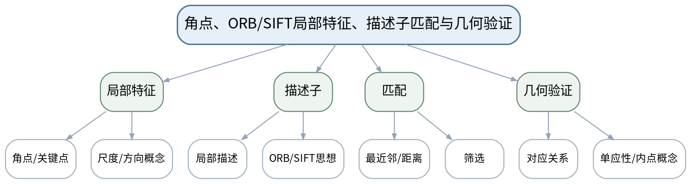

#### 教学目标

**知识目标：**
（1）理解角点/关键点、局部描述子与特征匹配的基本思想。
（2）理解ORB/SIFT相对简单模板匹配在尺度/旋转变化下的优势与成本。

**能力目标：**
（1）能够调用OpenCV提取局部特征并完成基本描述子匹配。
（2）能够通过匹配筛选与几何验证减少明显误匹配。

**价值目标：**
（1）形成对开源算法与现成接口“会调用更要会验证”的工具边界意识。

#### 课程思政

（1）强调“现成算法接口不等于可靠结论”，开源代码、参数和结果仍需独立核验。

（2）要求课堂代码演示、图像参数和评价结果保留原始证据，不以单张成功截图替代多工况验证，强化数据诚信和质量责任。

#### 专创融合

比较模板、ORB/SIFT与治具约束三种方案的开发成本、速度、鲁棒性和维护性，提出场景化选择。

#### 教学重难点

**教学重点**：局部特征、描述子匹配与几何验证；与模板方法比较。

**教学难点**：匹配点多不等于定位正确，需要用几何一致性/内点等证据进行二次验证。

#### 教学过程

| 教学步骤 | 主要教学内容 | 设计意图 |
|---|---|---|
| 课前任务 | 【教师】1. 发布本课主题、教材/资料范围和一个成像/算法最小问题； 2. 明确课堂代码仅作理论课中的原理演示和案例复现，不改变课程32学时全理论的事实。 【学生】1. 预读关键概念/代码片段； 2. 记录至少1个预测和1个疑问，带着问题进入课堂。 | 通过预读和最小问题建立先备认知，同时明确理论课中的代码演示属于案例教学活动。 |
| 互动导入（10 min） | 【教师】展示一张含大量错误连线的原始特征匹配图，让学生判断“匹配数量很多”为何反而不可信。 【学生】先独立判断，再与同伴交换依据；教师收集典型分歧后进入本课。 | 从真实成像/检测现象切入，使学生先暴露直觉判断，再建立本课问题主线。 |
| 传授新知（共70 min） | 1、关键点与描述子（约18 min） 【教师】【教师】直观说明角点/局部结构、尺度/方向和描述子作用。 【学生】【学生】比较平坦区域与角点区域为何可辨识性不同。 2、ORB/SIFT思想（约16 min） 【教师】【教师】介绍两类局部特征的应用思路，不展开算法细节推导。 【学生】【学生】根据速度/鲁棒性需求选择方案。 3、描述子匹配（约18 min） 【教师】【教师】演示匹配距离、筛选和误匹配现象。 【学生】【学生】比较筛选前后连线质量。 4、几何验证（约18 min） 【教师】【教师】说明单应性/内点等几何一致性验证思想。 【学生】【学生】用“有效内点比例/定位框”评价匹配是否可信。 【课堂强化】形成可检查的课堂产物：['完成同一目标的模板匹配与ORB/SIFT之一的对比，报告尺度/旋转条件下的成功与失败。']；课堂中至少保留参数/图像/计算或分析证据。 | 按“现象—原理—Python/OpenCV最小实现—参数比较—结果验证”推进，把教师讲解转化为可检查的分析或代码证据。 |
| 过关检测（10 min） | 【教师】组织课堂小测： 1.【选择题】局部特征匹配中，为减少明显误匹配通常需要（ ）。A. 匹配筛选和几何验证 B. 只增加连线数量 C. 关闭图像 D. 改变量名 2.【判断题】匹配点数量越多，就一定说明目标定位越准确。（ ） 3.【简答题】与简单模板匹配相比，局部特征方法通常在哪些变化条件下更有优势？ 【学生】独立作答/运行或读图验证；同伴互查后说明依据。 | 覆盖本课重点和典型误区，以即时证据发现“会看结果但不会解释”的问题。 |
| 课堂小结（5 min） | 【教师】1. 本次课解决的关键问题是“角点、ORB/SIFT局部特征、描述子匹配与几何验证”； 2. 需要重点掌握：局部特征、描述子匹配与几何验证；与模板方法比较。 3. 最值得带走的方法是先固定条件、再做参数/方案对比； 4. 需要警惕的易错点是：匹配点多不等于定位正确，需要用几何一致性/内点等证据进行二次验证。 | 回到知识脉络图压缩信息，形成“概念—条件—参数—证据—边界”的完整认知。 |
| 作业布置（3 min） | 【教师】布置课后任务：['完成同一目标的模板匹配与ORB/SIFT之一的对比，报告尺度/旋转条件下的成功与失败。'] 【要求】不只提交结果，还需保留原图/参数/中间结果/失败样例或判断依据。 | 固化课堂成果，形成可复核学习证据，并为下一课提供真实输入。 |
| 考勤（2 min） | 【教师】利用学校/课程实际使用的平台或课堂点名完成签到。 | 掌握出勤情况，保障教学秩序；不在教案中预填任何实际出勤事实。 |

#### 教学反思

【教师】课后重点从以下方面进行教学反思：

1. 教学流程：导入是否把学生带入真实视觉问题，70分钟主体是否按“现象—原理—实现—参数—验证”由浅入深。
2. 教学内容：重点记录“匹配点多不等于定位正确，需要用几何一致性/内点等证据进行二次验证。”是否讲清，学生是否能说明参数/方法适用边界。
3. 学生参与：仅依据实际课堂记录填写参与、代码阅读/参数分析、互审和表达情况，不补写推测性结论。
4. 教学改进：依据真实课堂证据决定是否增加成像对比、失败样例、最小代码或指标练习。

#### 单元课程作业节点

- 课程作业内部权重10%；目标1.5、2.4、3.4、3.6。
- 本单元作业必须包含原图/任务条件、关键参数、中间结果、评价或失败样例；不要求虚构独立上机课时。

### lesson-14

| 字段 | 内容 | 状态 | source_id |
|---|---|---|---|
| 章节 | 第六单元 深度学习视觉入门与智能制造综合案例 | derived | S1 |
| 授课题目 | 分类/目标检测/缺陷检测、数据标注划分与预训练模型推理 | derived | S1 |
| 周次 |  | to_confirm |  |
| 课时安排 | 2课时（100 min）；类型：理论2 | official | S1 |
| 知识脉络图 | images/lesson-14-knowledge-map.png | derived | S1 |
| 教学方法 | 讲授法、问答法、案例分析法、结构图解法、Python/OpenCV代码演示法、参数对比法、课堂检测法 | derived | S3 |
| 教学用具 | 电脑、投影仪、多媒体课件、教材、Python、OpenCV、经过验证的预训练视觉模型及小型示例数据。 | derived | S1/S2 |
| 教学设计 | 课前任务→互动导入（10 min）→传授新知（70 min）→过关检测（10 min）→课堂小结（5 min）→作业布置（3 min）→考勤（2 min） | derived | S3 |
| 参考文献 | [1] 何文辉、葛大伟.《机器视觉技术与应用》[M]. 北京：机械工业出版社，2024.；[2] 李宁.《Python OpenCV从菜鸟到高手》[M]. 北京：清华大学出版社，2024. | provided | S2 |

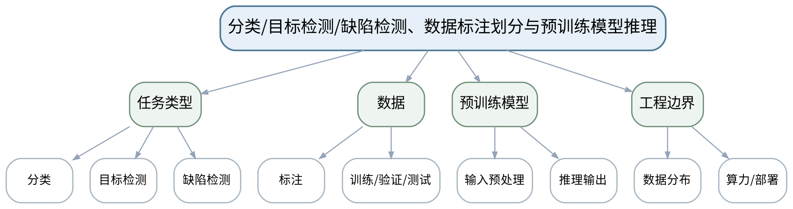

#### 教学目标

**知识目标：**
（1）理解分类、目标检测、缺陷检测的输出差异。
（2）理解数据标注、训练/验证/测试划分和预训练模型推理的基本流程。

**能力目标：**
（1）能够调用经过验证的预训练视觉模型完成基础推理并读取主要输出。
（2）能够检查输入尺寸、类别标签、置信度等推理配置。

**价值目标：**
（1）形成数据质量、模型来源和推理配置可追溯的工程规范。

#### 课程思政

（1）强调模型来源、数据质量和外部代码/AI工具使用必须披露并核验，避免“模型权威化”。

（2）要求课堂代码演示、图像参数和评价结果保留原始证据，不以单张成功截图替代多工况验证，强化数据诚信和质量责任。

#### 专创融合

比较传统视觉与预训练模型在开发周期、数据需求、算力和维护成本上的产品化差异。

#### 教学重难点

**教学重点**：深度学习视觉任务、数据划分与预训练模型推理。

**教学难点**：避免把“调用模型成功”误认为“模型适合本场景”，需要理解数据分布、类别和输入前处理边界。

#### 教学过程

| 教学步骤 | 主要教学内容 | 设计意图 |
|---|---|---|
| 课前任务 | 【教师】1. 发布本课主题、教材/资料范围和一个成像/算法最小问题； 2. 明确课堂代码仅作理论课中的原理演示和案例复现，不改变课程32学时全理论的事实。 【学生】1. 预读关键概念/代码片段； 2. 记录至少1个预测和1个疑问，带着问题进入课堂。 | 通过预读和最小问题建立先备认知，同时明确理论课中的代码演示属于案例教学活动。 |
| 互动导入（10 min） | 【教师】对一张制造缺陷图分别提出“分类”和“目标检测”任务，要求学生说明两者标注成本与输出差异。 【学生】先独立判断，再与同伴交换依据；教师收集典型分歧后进入本课。 | 从真实成像/检测现象切入，使学生先暴露直觉判断，再建立本课问题主线。 |
| 传授新知（共70 min） | 1、视觉任务类型（约18 min） 【教师】【教师】比较分类、目标检测和缺陷检测/异常检测的输入输出。 【学生】【学生】为4个制造案例选择任务类型。 2、数据标注与划分（约18 min） 【教师】【教师】说明训练/验证/测试分工、数据泄漏和类别分布。 【学生】【学生】识别一个“同一批次图像被分到训练和测试”的泄漏问题。 3、预训练模型推理（约20 min） 【教师】【教师】演示加载经过验证的预训练模型、输入预处理与输出解析。 【学生】【学生】记录模型来源、版本、输入尺寸和输出字段。 4、场景适用性（约14 min） 【教师】【教师】讨论数据域差异、算力和部署边界。 【学生】【学生】写出“可以试用”与“可以上线”之间还缺的证据。 【课堂强化】形成可检查的课堂产物：['选取一个制造视觉任务，说明分类/检测任务定义、数据标注要求、预训练模型来源和预期输出。']；课堂中至少保留参数/图像/计算或分析证据。 | 按“现象—原理—Python/OpenCV最小实现—参数比较—结果验证”推进，把教师讲解转化为可检查的分析或代码证据。 |
| 过关检测（10 min） | 【教师】组织课堂小测： 1.【选择题】目标检测相比图像分类通常额外需要输出（ ）。A. 目标位置/框 B. 文件名 C. 显示器尺寸 D. Python版本号 2.【判断题】使用预训练模型推理成功即可证明它适合本企业全部缺陷类型。（ ） 3.【简答题】为什么训练集、验证集和测试集应承担不同角色？ 【学生】独立作答/运行或读图验证；同伴互查后说明依据。 | 覆盖本课重点和典型误区，以即时证据发现“会看结果但不会解释”的问题。 |
| 课堂小结（5 min） | 【教师】1. 本次课解决的关键问题是“分类/目标检测/缺陷检测、数据标注划分与预训练模型推理”； 2. 需要重点掌握：深度学习视觉任务、数据划分与预训练模型推理。 3. 最值得带走的方法是先固定条件、再做参数/方案对比； 4. 需要警惕的易错点是：避免把“调用模型成功”误认为“模型适合本场景”，需要理解数据分布、类别和输入前处理边界。 | 回到知识脉络图压缩信息，形成“概念—条件—参数—证据—边界”的完整认知。 |
| 作业布置（3 min） | 【教师】布置课后任务：['选取一个制造视觉任务，说明分类/检测任务定义、数据标注要求、预训练模型来源和预期输出。'] 【要求】不只提交结果，还需保留原图/参数/中间结果/失败样例或判断依据。 | 固化课堂成果，形成可复核学习证据，并为下一课提供真实输入。 |
| 考勤（2 min） | 【教师】利用学校/课程实际使用的平台或课堂点名完成签到。 | 掌握出勤情况，保障教学秩序；不在教案中预填任何实际出勤事实。 |

#### 教学反思

【教师】课后重点从以下方面进行教学反思：

1. 教学流程：导入是否把学生带入真实视觉问题，70分钟主体是否按“现象—原理—实现—参数—验证”由浅入深。
2. 教学内容：重点记录“避免把“调用模型成功”误认为“模型适合本场景”，需要理解数据分布、类别和输入前处理边界。”是否讲清，学生是否能说明参数/方法适用边界。
3. 学生参与：仅依据实际课堂记录填写参与、代码阅读/参数分析、互审和表达情况，不补写推测性结论。
4. 教学改进：依据真实课堂证据决定是否增加成像对比、失败样例、最小代码或指标练习。

### lesson-15

| 字段 | 内容 | 状态 | source_id |
|---|---|---|---|
| 章节 | 第六单元 深度学习视觉入门与智能制造综合案例 | derived | S1 |
| 授课题目 | 置信度、IoU、混淆矩阵、精确率/召回率与传统/学习型视觉比较 | derived | S1 |
| 周次 |  | to_confirm |  |
| 课时安排 | 2课时（100 min）；类型：理论2 | official | S1 |
| 知识脉络图 | images/lesson-15-knowledge-map.png | derived | S1 |
| 教学方法 | 讲授法、问答法、案例分析法、结构图解法、Python/OpenCV代码演示法、参数对比法、课堂检测法 | derived | S3 |
| 教学用具 | 电脑、投影仪、多媒体课件、教材、指标练习表、预训练模型推理结果。 | derived | S1/S2 |
| 教学设计 | 课前任务→互动导入（10 min）→传授新知（70 min）→过关检测（10 min）→课堂小结（5 min）→作业布置（3 min）→考勤（2 min） | derived | S3 |
| 参考文献 | [1] 何文辉、葛大伟.《机器视觉技术与应用》[M]. 北京：机械工业出版社，2024.；[2] 李宁.《Python OpenCV从菜鸟到高手》[M]. 北京：清华大学出版社，2024. | provided | S2 |

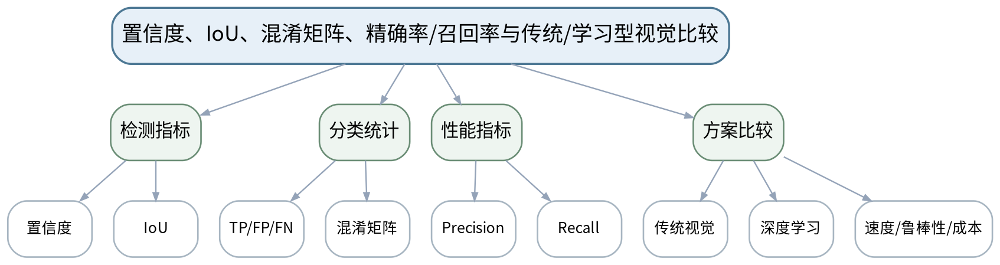

#### 教学目标

**知识目标：**
（1）理解置信度、IoU、TP/FP/FN、混淆矩阵、精确率和召回率。
（2）理解传统视觉与学习型视觉在数据、解释性、速度、鲁棒性和维护成本上的差异。

**能力目标：**
（1）能够根据小型结果表计算Precision/Recall并解释误检/漏检。
（2）能够针对质量检测场景说明为何不同指标权重可能不同。

**价值目标：**
（1）树立不以单一准确率或单张结果评价系统的实证意识。
（2）理解关键缺陷漏检的质量与安全风险。

#### 课程思政

（1）以关键缺陷漏检和误报停线的双重成本说明评价指标需要服务真实质量责任，而不是追求单一数字。

（2）要求课堂代码演示、图像参数和评价结果保留原始证据，不以单张成功截图替代多工况验证，强化数据诚信和质量责任。

#### 专创融合

把指标阈值与产品质量等级、人工复检成本关联，设计分层判定/复核策略。

#### 教学重难点

**教学重点**：IoU、混淆矩阵、Precision/Recall和方案比较。

**教学难点**：指标没有脱离业务代价的绝对优劣，需要把误检/漏检与质量、安全、节拍成本联系起来。

#### 教学过程

| 教学步骤 | 主要教学内容 | 设计意图 |
|---|---|---|
| 课前任务 | 【教师】1. 发布本课主题、教材/资料范围和一个成像/算法最小问题； 2. 明确课堂代码仅作理论课中的原理演示和案例复现，不改变课程32学时全理论的事实。 【学生】1. 预读关键概念/代码片段； 2. 记录至少1个预测和1个疑问，带着问题进入课堂。 | 通过预读和最小问题建立先备认知，同时明确理论课中的代码演示属于案例教学活动。 |
| 互动导入（10 min） | 【教师】给出两个模型：A精确率高但召回率低，B召回率高但误检多；提问在关键安全缺陷筛查中应优先关注什么。 【学生】先独立判断，再与同伴交换依据；教师收集典型分歧后进入本课。 | 从真实成像/检测现象切入，使学生先暴露直觉判断，再建立本课问题主线。 |
| 传授新知（共70 min） | 1、置信度与IoU（约16 min） 【教师】【教师】解释检测框置信度和IoU，演示阈值变化对保留框的影响。 【学生】【学生】手算/判断3个预测框是否满足IoU条件。 2、混淆矩阵与基本指标（约20 min） 【教师】【教师】从TP/FP/FN推导Precision/Recall直观含义。 【学生】【学生】根据小表计算并解释误检/漏检。 3、阈值与业务代价（约18 min） 【教师】【教师】改变置信阈值，展示Precision/Recall变化。 【学生】【学生】针对关键缺陷和普通外观缺陷分别选择偏好。 4、传统/学习型比较（约16 min） 【教师】【教师】从数据、解释性、速度、部署和维护比较两类方案。 【学生】【学生】形成“任务条件→方案选择”的决策表。 【课堂强化】形成可检查的课堂产物：['用给定/自建小型预测结果计算混淆矩阵、Precision和Recall，并讨论提高/降低阈值的代价。']；课堂中至少保留参数/图像/计算或分析证据。 | 按“现象—原理—Python/OpenCV最小实现—参数比较—结果验证”推进，把教师讲解转化为可检查的分析或代码证据。 |
| 过关检测（10 min） | 【教师】组织课堂小测： 1.【选择题】关键缺陷“漏掉一个可能造成严重后果”时，通常需要重点关注（ ）。A. 召回率 B. 文件大小 C. 代码行数 D. 图像颜色 2.【判断题】精确率和召回率可以脱离具体阈值与场景成本单独判断哪个模型永远更好。（ ） 3.【简答题】传统视觉在什么条件下可能比深度学习方案更合适？ 【学生】独立作答/运行或读图验证；同伴互查后说明依据。 | 覆盖本课重点和典型误区，以即时证据发现“会看结果但不会解释”的问题。 |
| 课堂小结（5 min） | 【教师】1. 本次课解决的关键问题是“置信度、IoU、混淆矩阵、精确率/召回率与传统/学习型视觉比较”； 2. 需要重点掌握：IoU、混淆矩阵、Precision/Recall和方案比较。 3. 最值得带走的方法是先固定条件、再做参数/方案对比； 4. 需要警惕的易错点是：指标没有脱离业务代价的绝对优劣，需要把误检/漏检与质量、安全、节拍成本联系起来。 | 回到知识脉络图压缩信息，形成“概念—条件—参数—证据—边界”的完整认知。 |
| 作业布置（3 min） | 【教师】布置课后任务：['用给定/自建小型预测结果计算混淆矩阵、Precision和Recall，并讨论提高/降低阈值的代价。'] 【要求】不只提交结果，还需保留原图/参数/中间结果/失败样例或判断依据。 | 固化课堂成果，形成可复核学习证据，并为下一课提供真实输入。 |
| 考勤（2 min） | 【教师】利用学校/课程实际使用的平台或课堂点名完成签到。 | 掌握出勤情况，保障教学秩序；不在教案中预填任何实际出勤事实。 |

#### 教学反思

【教师】课后重点从以下方面进行教学反思：

1. 教学流程：导入是否把学生带入真实视觉问题，70分钟主体是否按“现象—原理—实现—参数—验证”由浅入深。
2. 教学内容：重点记录“指标没有脱离业务代价的绝对优劣，需要把误检/漏检与质量、安全、节拍成本联系起来。”是否讲清，学生是否能说明参数/方法适用边界。
3. 学生参与：仅依据实际课堂记录填写参与、代码阅读/参数分析、互审和表达情况，不补写推测性结论。
4. 教学改进：依据真实课堂证据决定是否增加成像对比、失败样例、最小代码或指标练习。

### lesson-16

| 字段 | 内容 | 状态 | source_id |
|---|---|---|---|
| 章节 | 第六单元 深度学习视觉入门与智能制造综合案例 | derived | S1 |
| 授课题目 | 智能制造机器视觉综合方案：零件/装配/FDM打印场景与期末验收 | derived | S1 |
| 周次 |  | to_confirm |  |
| 课时安排 | 2课时（100 min）；类型：理论2 | official | S1 |
| 知识脉络图 | images/lesson-16-knowledge-map.png | derived | S1 |
| 教学方法 | 讲授法、问答法、案例分析法、结构图解法、Python/OpenCV代码演示法、参数对比法、课堂检测法 | derived | S3 |
| 教学用具 | 电脑、投影仪、多媒体课件、教材、Python、OpenCV、预训练模型示例、综合项目验收表。 | derived | S1/S2 |
| 教学设计 | 课前任务→互动导入（10 min）→传授新知（70 min）→过关检测（10 min）→课堂小结（5 min）→作业布置（3 min）→考勤（2 min） | derived | S3 |
| 参考文献 | [1] 何文辉、葛大伟.《机器视觉技术与应用》[M]. 北京：机械工业出版社，2024.；[2] 李宁.《Python OpenCV从菜鸟到高手》[M]. 北京：清华大学出版社，2024. | provided | S2 |

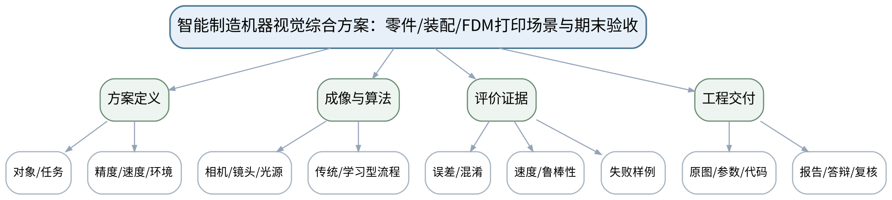

#### 教学目标

**知识目标：**
（1）综合理解成像、预处理、分割/特征/测量、识别与评价之间的关系。
（2）理解机器视觉综合方案和期末考核的工程交付要求。

**能力目标：**
（1）能够针对零件尺寸/孔位、装配完整性、传送目标或FDM打印异常设计完整机器视觉方案。
（2）能够从原图、参数、代码、指标、失败样例和改进计划形成可复核技术报告并进行个人解释。

**价值目标：**
（1）形成持续学习、工具边界、数据诚信和对视觉结论独立核验的职业意识。
（2）理解视觉系统输出进入质量与自动化决策后的人类最终责任。

#### 课程思政

（1）以质量、安全、数据诚信和可追溯为课程最终底线，要求学生对开源代码、预训练模型和AI辅助结果保持独立核验。

（2）要求课堂代码演示、图像参数和评价结果保留原始证据，不以单张成功截图替代多工况验证，强化数据诚信和质量责任。

#### 专创融合

将综合视觉方案视为智能制造现场可落地的小型技术产品，训练从技术效果、部署成本、维护性和换型能力综合评审。

#### 教学重难点

**教学重点**：端到端视觉方案、指标/失败样例、工程文档与答辩核验。

**教学难点**：综合方案需要在成像、算法、数据、指标、速度和成本之间做有证据的权衡，不能简单堆叠算法。

#### 教学过程

| 教学步骤 | 主要教学内容 | 设计意图 |
|---|---|---|
| 课前任务 | 【教师】1. 发布本课主题、教材/资料范围和一个成像/算法最小问题； 2. 明确课堂代码仅作理论课中的原理演示和案例复现，不改变课程32学时全理论的事实。 【学生】1. 预读关键概念/代码片段； 2. 记录至少1个预测和1个疑问，带着问题进入课堂。 | 通过预读和最小问题建立先备认知，同时明确理论课中的代码演示属于案例教学活动。 |
| 互动导入（10 min） | 【教师】给出一个“算法在实验图片上100%成功、现场换光照后大量漏检”的项目复盘，要求学生从成像、数据、算法、阈值和验收集五个层面提出整改。 【学生】先独立判断，再与同伴交换依据；教师收集典型分歧后进入本课。 | 从真实成像/检测现象切入，使学生先暴露直觉判断，再建立本课问题主线。 |
| 传授新知（共70 min） | 1、需求与成像方案（约18 min） 【教师】【教师】用四类综合案例示范从对象、精度、节拍、环境反推相机/镜头/光源与采集约束。 【学生】【学生】选择一个场景写任务/成像方案卡。 2、算法链与方案选择（约18 min） 【教师】【教师】组织传统预处理/分割/测量/匹配与预训练模型方案对比。 【学生】【学生】画端到端流程，解释每个模块输入输出和替代方案。 3、评价、失败与改进（约18 min） 【教师】【教师】要求方案包含测量误差或Precision/Recall、速度、鲁棒性与失败样例。 【学生】【学生】为至少3类失败工况设计测试和改进。 4、工程交付与期末核验（约16 min） 【教师】【教师】说明综合报告/等效作品+现场答辩/个人核验要求，强调不另设笔试/机考。 【学生】【学生】完成交付清单：原图、参数、代码、图表、结论、版本、失败案例和个人可解释内容。 【课堂强化】形成可检查的课堂产物：['完成期末综合方案/项目报告准备：任务定义、成像条件、算法链、关键参数、评价指标、失败样例、改进计划与个人解释提纲。']；课堂中至少保留参数/图像/计算或分析证据。 | 按“现象—原理—Python/OpenCV最小实现—参数比较—结果验证”推进，把教师讲解转化为可检查的分析或代码证据。 |
| 过关检测（10 min） | 【教师】组织课堂小测： 1.【选择题】完整机器视觉方案中，哪一项不能被“单张成功截图”替代（ ）。A. 多工况评价与失败样例 B. 文件名 C. 幻灯片背景 D. 代码缩进颜色 2.【判断题】综合方案只要算法指标高，就可以忽略光源、相机和现场部署条件。（ ） 3.【简答题】期末综合视觉方案至少应提供哪些可追溯工程证据？ 【学生】独立作答/运行或读图验证；同伴互查后说明依据。 | 覆盖本课重点和典型误区，以即时证据发现“会看结果但不会解释”的问题。 |
| 课堂小结（5 min） | 【教师】1. 本次课解决的关键问题是“智能制造机器视觉综合方案：零件/装配/FDM打印场景与期末验收”； 2. 需要重点掌握：端到端视觉方案、指标/失败样例、工程文档与答辩核验。 3. 最值得带走的方法是先固定条件、再做参数/方案对比； 4. 需要警惕的易错点是：综合方案需要在成像、算法、数据、指标、速度和成本之间做有证据的权衡，不能简单堆叠算法。 | 回到知识脉络图压缩信息，形成“概念—条件—参数—证据—边界”的完整认知。 |
| 作业布置（3 min） | 【教师】布置课后任务：['完成期末综合方案/项目报告准备：任务定义、成像条件、算法链、关键参数、评价指标、失败样例、改进计划与个人解释提纲。'] 【要求】不只提交结果，还需保留原图/参数/中间结果/失败样例或判断依据。 | 固化课堂成果，形成可复核学习证据，并为下一课提供真实输入。 |
| 考勤（2 min） | 【教师】利用学校/课程实际使用的平台或课堂点名完成签到。 | 掌握出勤情况，保障教学秩序；不在教案中预填任何实际出勤事实。 |

#### 教学反思

【教师】课后重点从以下方面进行教学反思：

1. 教学流程：导入是否把学生带入真实视觉问题，70分钟主体是否按“现象—原理—实现—参数—验证”由浅入深。
2. 教学内容：重点记录“综合方案需要在成像、算法、数据、指标、速度和成本之间做有证据的权衡，不能简单堆叠算法。”是否讲清，学生是否能说明参数/方法适用边界。
3. 学生参与：仅依据实际课堂记录填写参与、代码阅读/参数分析、互审和表达情况，不补写推测性结论。
4. 教学改进：依据真实课堂证据决定是否增加成像对比、失败样例、最小代码或指标练习。

#### 单元课程作业节点

- 课程作业内部权重15%；目标1.6、2.5、2.6、3.1—3.6。
- 本单元作业必须包含原图/任务条件、关键参数、中间结果、评价或失败样例；不要求虚构独立上机课时。

# 内部追踪区

## 版本与哈希

- lesson_plan_version：1
- 大纲SHA：`cd100bf9dd06b85abdc5cbc10394f930d5973934`
- lesson-plan-compiler SHA：`23bc5a10e7881e8863ad993c74dabdc9faf24a4d`

## 变更原则

- 内容修改必须先回到本Markdown及图片主源，再重新编译Word。
- Word阶段只处理字体、表格、分页、图片尺寸等呈现问题；不得在Word中独立改写课程语义。