# 《机械故障诊断及维护》教学设计（16次课）

## 课程基本信息

| 字段 | 内容 |
|---|---|
| 学院 | 机械与动力工程学院 |
| 专业（教研室） | 智能制造工程 |
| 课程名称 | 机械故障诊断及维护 |
| 课程名称（英文） | Mechanical Fault Diagnosis and Maintenance |
| 课程代码 | 25JD32106 |
| 授课专业 | 智能制造工程 |
| 授课学期 | 第7学期 |
| 制定日期 | 2026年9月 |
| 课程类别 | 专业类 |
| 课程性质 | 选修 |
| 授课语言 | 中文 |
| 学分 | 2 |
| 总学时 | 32 |
| 理论学时 | 32 |
| 实验/上机学时 | 0 |
| 实习学时 | 0 |
| 其他学时 | 0 |
| 教材 | 张键, 汤赫男.《机械故障诊断技术（第3版）》[M]. 北京：机械工业出版社，2024. ISBN 9787111756989 |
| 授课学院 | 机械与动力工程学院 |
| 先修课程 | 智能测试技术、机械设计基础、机械控制工程、工程建模与科学计算可视化基础（Python） |
| 后续课程 | 毕业设计（论文） |
| 考核类型 | 考试课（ ）；考查课（√） |
| 考核形式 | 闭卷（ ）；开卷（ ）；笔试（ ）；机试（ ）；口试（ ）；其它（√，诊断与维护综合方案报告＋现场答辩/个人核验） |
| 考核方式 | 作业（√）；报告（√）；随堂测验（ ）；阶段测验（ ）；论文（ ）；设计（√）；作品（ ）；线上考试（ ）；线下考试（ ）；其它（√，个人核验） |
| 总评成绩比例 | 最终成绩100%=平时成绩20%＋课程作业20%＋期末考核60% |

#### 课程简介

**课程基本定位**：本课程是智能制造工程专业的专业选修课，面向智能装备、数控机床、旋转机械和自动化生产线的状态监测、故障诊断与维护决策，以“故障机理—状态感知—信号处理—特征提取—故障识别—趋势评估—维护决策”为主线。

**学时组织**：总学时32，全部为理论学时，按16次课×2课时组织。传感采集、FFT、包络分析、趋势分析和机器学习分类等仅作为课堂演示、课内分析或课后作业，不另计实验/上机/项目式学时。

**核心学习结果**：学生能够判断振动数据有效性，使用波形、统计量、频谱、包络谱和趋势识别典型故障；能够分析转子、滚动轴承、齿轮箱、电动机等设备故障；理解多源监测和数据驱动方法的作用与局限；能够形成包含监测点、特征、阈值、诊断依据、风险等级、维护措施和复机验证的综合方案。

**主要教学方法**：采用机理讲授、波形/频谱解析、公开或教师提供数据的Python演示、典型故障案例研讨、故障树推演和维护方案评审。涉及设备维护时强调停机、锁定挂牌、能量隔离、设备说明书和安全规范；诊断结论必须由数据、机理或可复核资料支撑。

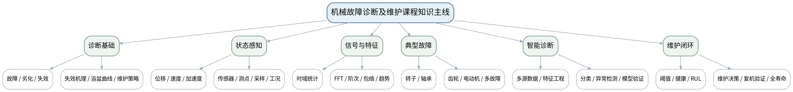

## 教学单元

### lesson-01

| 字段 | 内容 |
|---|---|
| 章节 | 第1单元 故障诊断基础、失效机理与维护策略 |
| 授课题目 | 机械故障、劣化、失效与诊断流程 |
| 周次 | 第1周（第1次课） |
| 课时安排 | 2课时（100 min）；类型：理论2 |
| 知识脉络图 | 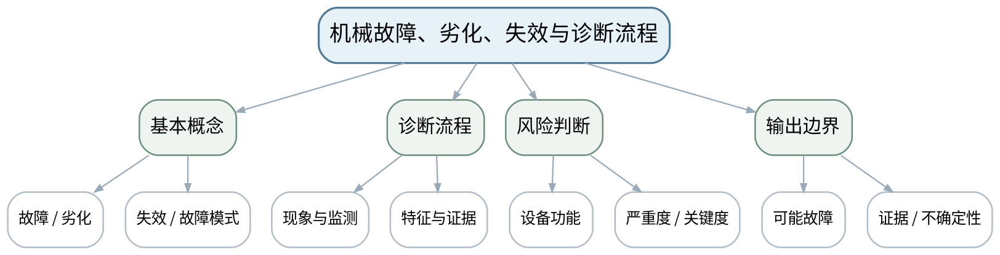 |
| 教学方法 | 讲授法、问答法、案例分析法、波形/频谱判读法、故障树推演法、Python演示法、方案评审法 |
| 教学用具 | 电脑、投影仪、多媒体课件、教材、典型设备结构图、故障案例卡、振动/温度趋势示例。 |
| 教学设计 | 课前任务→互动导入（10 min）→传授新知（70 min）→过关检测（10 min）→课堂小结（5 min）→作业布置（3 min）→考勤（2 min） |
| 参考文献 | [1] 张键, 汤赫男.《机械故障诊断技术（第3版）》[M]. 北京：机械工业出版社，2024。；[2] 汪永华, 贾芸.《机电设备故障诊断与维修（第3版）》[M]. 北京：机械工业出版社，2024。 |

#### 教学目标

**知识目标：**
（1）理解故障、劣化、失效、故障模式与状态监测的基本概念。 （2）掌握从异常现象、状态数据到诊断结论和维护建议的基本流程。

**能力目标：**
（1）能够根据设备功能和异常现象建立初步故障模式清单。 （2）能够把诊断结论拆成“现象—数据—机理—结论—不确定性”证据链。

**价值目标：**
（1）形成安全优先、结论分级和维护记录可追溯意识。

#### 课程思政

（1）通过误诊导致非计划停机或错误换件案例，强调故障诊断必须对安全、成本和生产连续性负责。 （2）涉及设备检查、维修或复机的讨论，均强调停机、锁定挂牌、能量隔离、说明书和授权边界；Python/数据分析必须保留数据来源、参数和不确定性。

#### 专创融合

把故障证据链视为状态监测产品的最小输出合同，训练可审查、可复用的诊断表达。

#### 教学重难点

**教学重点**：故障诊断基本概念与证据链流程。

**教学难点**：区分“检测到异常”和“已经确定故障根因”，避免把单一现象直接等同于故障结论。

#### 教学过程

| 教学步骤 | 主要教学内容 | 设计意图 |
|---|---|---|
| 课前任务 | 【教师】1. 发布教材范围、设备结构/信号材料和一个“先判断再分析”的问题； 2. 提醒Python数据演示只使用公开或教师提供数据，设备维护案例必须遵守停机、锁定挂牌、能量隔离和设备说明书； 【学生】1. 阅读材料并标出3个核心术语； 2. 写出一个预测结论及所需证据； 3. 带着疑问进入课堂。 | 通过课前预习与安全边界提醒建立先备认知，避免把设备维护和数据分析变成无依据试错。 |
| 互动导入（10 min） | 【教师】1. 复习与本课直接相关的上一课主线； 2. 展示“轴承温度升高、振动增大、噪声变大”三个现象，追问：这些现象能否直接证明是轴承损坏？还缺哪些证据？ 3. 追问“现象能证明什么、不能证明什么、还需补什么证据”。 【学生】先独立判断，再与同伴交换依据，明确本次课任务。 | 从故障现象和证据冲突切入，让学生先判断再学习机理，建立问题驱动的诊断思维。 |
| 传授新知（共70 min） | 一、概念与边界 【教师】从设备正常、劣化、故障到失效梳理概念，强调故障模式是具体失效表现，不等于所有异常。 【学生】完成对应波形/频谱/结构/参数/维护判断，先写预期，再对照教师案例或演示修正。 【课堂强化】每个诊断结论至少写一条支持证据和一条边界/不确定项。  二、诊断证据链 【教师】用“异常发现→测量条件→特征提取→机理对照→结论分级→维护建议→验证”讲清闭环。 【学生】完成对应波形/频谱/结构/参数/维护判断，先写预期，再对照教师案例或演示修正。 【课堂强化】每个诊断结论至少写一条支持证据和一条边界/不确定项。  三、案例推演 【教师】以电机—联轴器—泵机组为例，让学生根据现象列出不少于3种可能故障及需要补充的证据。 【学生】完成对应波形/频谱/结构/参数/维护判断，先写预期，再对照教师案例或演示修正。 【课堂强化】每个诊断结论至少写一条支持证据和一条边界/不确定项。  【形成产物】一张机械故障诊断证据链图＋初步故障模式清单。 【学习证据】现象记录、候选故障、待补证据、不确定性说明。 【评价映射】平时成绩；目标1.1、2.1、3.1。 | 按“数据质量→特征→机理→工况→结论→维护/验证”展开，训练证据链而不是背故障口诀。 |
| 过关检测（10 min） | 【教师】布置课堂检测： 1. 故障、劣化和失效有什么区别？ 2. 为什么“振动大”不能直接等同于“轴承坏”？ 3. 完整诊断结论至少应说明哪些证据与边界？ 【学生】独立作答、同伴互查并标出证据； 【教师】按“数据质量—特征—机理—维护边界”分类点评。 | 即时暴露概念、频率、数据质量和结论边界错误，要求用证据修正。 |
| 课堂小结（5 min） | 【教师】1. 本次课解决的关键问题：机械故障、劣化、失效与诊断流程； 2. 重点主线：故障诊断基本概念与证据链流程。； 3. 最值得带走的方法：先验证数据，再把特征与机理/工况关联，最后形成分级结论； 4. 易错点：区分“检测到异常”和“已经确定故障根因”，避免把单一现象直接等同于故障结论。 【学生】写下“一条诊断规则＋一条不能越过的证据边界”。 | 回到知识脉络图压缩方法，形成可迁移的诊断流程和风险意识。 |
| 作业布置（3 min） | 【教师】1. 选择一台熟悉的旋转设备，绘制“异常现象→候选故障→所需监测量→验证方法”表。 【要求】不只写“是什么故障”，还要写测量条件、参数/结构依据、支持与反对证据、结论等级和下一步验证；数据与代码须说明来源。 【学生】按课程命名规范整理提交。 | 固化数据、图表、计算和维护证据，为阶段作业与期末综合方案积累可追溯素材。 |
| 考勤（2 min） | 【教师】利用学习通/课堂点名完成签到；不预填实际出勤事实。 【学生】按要求完成签到。 | 保留学校课堂管理环节，不预填实际出勤事实。 |

#### 教学反思

【课后填写，不预填事实】 1. 教学流程：记录本课100 min各环节实际用时和需要调整的位置； 2. 教学内容：重点记录“区分“检测到异常”和“已经确定故障根因”，避免把单一现象直接等同于故障结论。”的真实掌握证据与常见错误； 3. 学生参与：仅依据实际课堂记录填写波形/频谱判读、计算、讨论与证据表达情况； 4. 教学改进：依据真实课堂证据决定是否增加参数演示、故障对照、Python示例或维护决策练习。

### lesson-02

| 字段 | 内容 |
|---|---|
| 章节 | 第1单元 故障诊断基础、失效机理与维护策略 |
| 授课题目 | 失效机理、浴盆曲线与维护策略选择 |
| 周次 | 第1周（第2次课） |
| 课时安排 | 2课时（100 min）；类型：理论2 |
| 知识脉络图 | 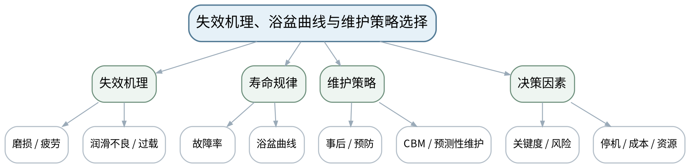 |
| 教学方法 | 讲授法、问答法、案例分析法、波形/频谱判读法、故障树推演法、Python演示法、方案评审法 |
| 教学用具 | 电脑、投影仪、多媒体课件、教材、浴盆曲线、设备关键度案例、维护策略卡。 |
| 教学设计 | 课前任务→互动导入（10 min）→传授新知（70 min）→过关检测（10 min）→课堂小结（5 min）→作业布置（3 min）→考勤（2 min） |
| 参考文献 | [1] 张键, 汤赫男.《机械故障诊断技术（第3版）》[M]. 北京：机械工业出版社，2024。；[2] 汪永华, 贾芸.《机电设备故障诊断与维修（第3版）》[M]. 北京：机械工业出版社，2024。 |

#### 教学目标

**知识目标：**
（1）理解磨损、疲劳、润滑不良、松动和过载等常见失效机理。 （2）理解浴盆曲线及事后维修、预防性维护、基于状态维护和预测性维护的差异。

**能力目标：**
（1）能够根据关键度、故障后果、可监测性和成本选择基本维护策略。 （2）能够解释维护过度与维护不足的风险。

**价值目标：**
（1）形成全寿命周期、安全优先和资源节约意识。

#### 课程思政

（1）通过带病运行、无依据换件和无复核复机案例，强调维护活动的安全责任与经济责任。 （2）涉及设备检查、维修或复机的讨论，均强调停机、锁定挂牌、能量隔离、说明书和授权边界；Python/数据分析必须保留数据来源、参数和不确定性。

#### 专创融合

将维护策略矩阵转化为设备管理规则，为后续状态监测和MES维护计划提供结构化输入。

#### 教学重难点

**教学重点**：典型失效机理、浴盆曲线与维护策略。

**教学难点**：维护策略不是越“先进”越好，需要与风险、可监测性、资源和停机窗口匹配。

#### 教学过程

| 教学步骤 | 主要教学内容 | 设计意图 |
|---|---|---|
| 课前任务 | 【教师】1. 发布教材范围、设备结构/信号材料和一个“先判断再分析”的问题； 2. 提醒Python数据演示只使用公开或教师提供数据，设备维护案例必须遵守停机、锁定挂牌、能量隔离和设备说明书； 【学生】1. 阅读材料并标出3个核心术语； 2. 写出一个预测结论及所需证据； 3. 带着疑问进入课堂。 | 通过课前预习与安全边界提醒建立先备认知，避免把设备维护和数据分析变成无依据试错。 |
| 互动导入（10 min） | 【教师】1. 复习与本课直接相关的上一课主线； 2. 对比两台设备：廉价备用风机与产线唯一主轴，提问二者能否采用同样的维护策略。 3. 追问“现象能证明什么、不能证明什么、还需补什么证据”。 【学生】先独立判断，再与同伴交换依据，明确本次课任务。 | 从故障现象和证据冲突切入，让学生先判断再学习机理，建立问题驱动的诊断思维。 |
| 传授新知（共70 min） | 一、失效机理 【教师】从表面磨损、疲劳裂纹、润滑失效、松动和过载解释“故障特征为什么会出现”。 【学生】完成对应波形/频谱/结构/参数/维护判断，先写预期，再对照教师案例或演示修正。 【课堂强化】每个诊断结论至少写一条支持证据和一条边界/不确定项。  二、浴盆曲线 【教师】讲早期失效、偶然失效和磨损失效阶段，强调曲线是风险与寿命管理的概念工具。 【学生】完成对应波形/频谱/结构/参数/维护判断，先写预期，再对照教师案例或演示修正。 【课堂强化】每个诊断结论至少写一条支持证据和一条边界/不确定项。  三、策略比较 【教师】用事后维修、定期预防、基于状态和预测性维护比较适用条件，学生为三类设备选择策略并写出依据。 【学生】完成对应波形/频谱/结构/参数/维护判断，先写预期，再对照教师案例或演示修正。 【课堂强化】每个诊断结论至少写一条支持证据和一条边界/不确定项。  【形成产物】维护策略决策矩阵：设备关键度、故障后果、可监测性、策略、验证。 【学习证据】策略矩阵＋风险/成本理由＋一个过度维修反例。 【评价映射】课程作业阶段1（课程作业内部10%）；目标1.1、2.1、3.1。 | 按“数据质量→特征→机理→工况→结论→维护/验证”展开，训练证据链而不是背故障口诀。 |
| 过关检测（10 min） | 【教师】布置课堂检测： 1. 浴盆曲线三个阶段的主要风险特征是什么？ 2. 什么设备适合事后维修？ 3. 预测性维护为什么也可能产生误报和过度维护？ 【学生】独立作答、同伴互查并标出证据； 【教师】按“数据质量—特征—机理—维护边界”分类点评。 | 即时暴露概念、频率、数据质量和结论边界错误，要求用证据修正。 |
| 课堂小结（5 min） | 【教师】1. 本次课解决的关键问题：失效机理、浴盆曲线与维护策略选择； 2. 重点主线：典型失效机理、浴盆曲线与维护策略。； 3. 最值得带走的方法：先验证数据，再把特征与机理/工况关联，最后形成分级结论； 4. 易错点：维护策略不是越“先进”越好，需要与风险、可监测性、资源和停机窗口匹配。 【学生】写下“一条诊断规则＋一条不能越过的证据边界”。 | 回到知识脉络图压缩方法，形成可迁移的诊断流程和风险意识。 |
| 作业布置（3 min） | 【教师】1. 提交阶段作业1：为一套智能制造关键设备制定初步故障模式和维护策略矩阵。 【要求】不只写“是什么故障”，还要写测量条件、参数/结构依据、支持与反对证据、结论等级和下一步验证；数据与代码须说明来源。 【学生】按课程命名规范整理提交。 | 固化数据、图表、计算和维护证据，为阶段作业与期末综合方案积累可追溯素材。 |
| 考勤（2 min） | 【教师】利用学习通/课堂点名完成签到；不预填实际出勤事实。 【学生】按要求完成签到。 | 保留学校课堂管理环节，不预填实际出勤事实。 |

#### 教学反思

【课后填写，不预填事实】 1. 教学流程：记录本课100 min各环节实际用时和需要调整的位置； 2. 教学内容：重点记录“维护策略不是越“先进”越好，需要与风险、可监测性、资源和停机窗口匹配。”的真实掌握证据与常见错误； 3. 学生参与：仅依据实际课堂记录填写波形/频谱判读、计算、讨论与证据表达情况； 4. 教学改进：依据真实课堂证据决定是否增加参数演示、故障对照、Python示例或维护决策练习。

### lesson-03

| 字段 | 内容 |
|---|---|
| 章节 | 第2单元 机械振动、传感器与状态数据采集 |
| 授课题目 | 机械振动参数、位移/速度/加速度与转速参考 |
| 周次 | 第2周（第3次课） |
| 课时安排 | 2课时（100 min）；类型：理论2 |
| 知识脉络图 | 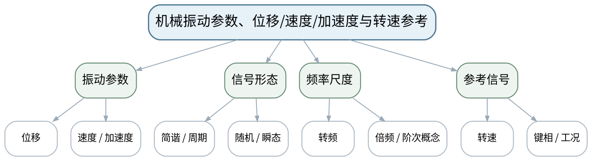 |
| 教学方法 | 讲授法、问答法、案例分析法、波形/频谱判读法、故障树推演法、Python演示法、方案评审法 |
| 教学用具 | 电脑、投影仪、多媒体课件、教材、振动波形图、转速/键相信号示意、Python绘图演示。 |
| 教学设计 | 课前任务→互动导入（10 min）→传授新知（70 min）→过关检测（10 min）→课堂小结（5 min）→作业布置（3 min）→考勤（2 min） |
| 参考文献 | [1] 张键, 汤赫男.《机械故障诊断技术（第3版）》[M]. 北京：机械工业出版社，2024。 |

#### 教学目标

**知识目标：**
（1）掌握位移、速度、加速度、频率、相位等振动参数及其关系。 （2）理解简谐、周期、随机振动和转速/键相信号在诊断中的作用。

**能力目标：**
（1）能够根据低频位移、中频速度、高频冲击等目标选择合适的振动量。 （2）能够把设备转速换算为转频，并用转频建立频谱判读基准。

**价值目标：**
（1）形成“先记录工况与转速，再解释振动特征”的习惯。

#### 课程思政

（1）强调测量单位、转速和工况必须真实记录，数据口径不一致会直接造成误诊。 （2）涉及设备检查、维修或复机的讨论，均强调停机、锁定挂牌、能量隔离、说明书和授权边界；Python/数据分析必须保留数据来源、参数和不确定性。

#### 专创融合

把转速与振动量选择表作为在线监测点配置的基础数据结构。

#### 教学重难点

**教学重点**：振动基本参数与转速参考。

**教学难点**：同一故障在位移、速度、加速度中的表现不同；转速变化会改变频率特征位置。

#### 教学过程

| 教学步骤 | 主要教学内容 | 设计意图 |
|---|---|---|
| 课前任务 | 【教师】1. 发布教材范围、设备结构/信号材料和一个“先判断再分析”的问题； 2. 提醒Python数据演示只使用公开或教师提供数据，设备维护案例必须遵守停机、锁定挂牌、能量隔离和设备说明书； 【学生】1. 阅读材料并标出3个核心术语； 2. 写出一个预测结论及所需证据； 3. 带着疑问进入课堂。 | 通过课前预习与安全边界提醒建立先备认知，避免把设备维护和数据分析变成无依据试错。 |
| 互动导入（10 min） | 【教师】1. 复习与本课直接相关的上一课主线； 2. 给出同一段振动的位移、速度、加速度三条曲线，提问为何“看起来完全不同”但来自同一运动。 3. 追问“现象能证明什么、不能证明什么、还需补什么证据”。 【学生】先独立判断，再与同伴交换依据，明确本次课任务。 | 从故障现象和证据冲突切入，让学生先判断再学习机理，建立问题驱动的诊断思维。 |
| 传授新知（共70 min） | 一、振动参数 【教师】从简谐运动建立位移—速度—加速度关系，侧重工程物理意义而非长公式推导。 【学生】完成对应波形/频谱/结构/参数/维护判断，先写预期，再对照教师案例或演示修正。 【课堂强化】每个诊断结论至少写一条支持证据和一条边界/不确定项。  二、信号类型 【教师】结合稳态转子、随机噪声和冲击波形辨析周期/随机/瞬态信号及诊断价值。 【学生】完成对应波形/频谱/结构/参数/维护判断，先写预期，再对照教师案例或演示修正。 【课堂强化】每个诊断结论至少写一条支持证据和一条边界/不确定项。  三、转速基准 【教师】用rpm→Hz转频换算，说明1X、2X和阶次的基础概念；学生为三种转速计算转频并标注频谱位置。 【学生】完成对应波形/频谱/结构/参数/维护判断，先写预期，再对照教师案例或演示修正。 【课堂强化】每个诊断结论至少写一条支持证据和一条边界/不确定项。  【形成产物】振动量选择表＋转速/转频/阶次基准表。 【学习证据】参数选择理由、转频计算、频谱位置预测。 【评价映射】平时成绩；目标1.2、2.2、3.2。 | 按“数据质量→特征→机理→工况→结论→维护/验证”展开，训练证据链而不是背故障口诀。 |
| 过关检测（10 min） | 【教师】布置课堂检测： 1. 低频大位移与高频冲击分别更适合观察哪种振动量？ 2. 1500 r/min对应的转频是多少？ 3. 没有转速信息时诊断1X/2X特征会遇到什么问题？ 【学生】独立作答、同伴互查并标出证据； 【教师】按“数据质量—特征—机理—维护边界”分类点评。 | 即时暴露概念、频率、数据质量和结论边界错误，要求用证据修正。 |
| 课堂小结（5 min） | 【教师】1. 本次课解决的关键问题：机械振动参数、位移/速度/加速度与转速参考； 2. 重点主线：振动基本参数与转速参考。； 3. 最值得带走的方法：先验证数据，再把特征与机理/工况关联，最后形成分级结论； 4. 易错点：同一故障在位移、速度、加速度中的表现不同；转速变化会改变频率特征位置。 【学生】写下“一条诊断规则＋一条不能越过的证据边界”。 | 回到知识脉络图压缩方法，形成可迁移的诊断流程和风险意识。 |
| 作业布置（3 min） | 【教师】1. 为主轴、风机和齿轮箱各选择一个主要振动量，并写出频段/转速信息需求。 【要求】不只写“是什么故障”，还要写测量条件、参数/结构依据、支持与反对证据、结论等级和下一步验证；数据与代码须说明来源。 【学生】按课程命名规范整理提交。 | 固化数据、图表、计算和维护证据，为阶段作业与期末综合方案积累可追溯素材。 |
| 考勤（2 min） | 【教师】利用学习通/课堂点名完成签到；不预填实际出勤事实。 【学生】按要求完成签到。 | 保留学校课堂管理环节，不预填实际出勤事实。 |

#### 教学反思

【课后填写，不预填事实】 1. 教学流程：记录本课100 min各环节实际用时和需要调整的位置； 2. 教学内容：重点记录“同一故障在位移、速度、加速度中的表现不同；转速变化会改变频率特征位置。”的真实掌握证据与常见错误； 3. 学生参与：仅依据实际课堂记录填写波形/频谱判读、计算、讨论与证据表达情况； 4. 教学改进：依据真实课堂证据决定是否增加参数演示、故障对照、Python示例或维护决策练习。

### lesson-04

| 字段 | 内容 |
|---|---|
| 章节 | 第2单元 机械振动、传感器与状态数据采集 |
| 授课题目 | 传感器、测点方向与测量链有效性 |
| 周次 | 第2周（第4次课） |
| 课时安排 | 2课时（100 min）；类型：理论2 |
| 知识脉络图 | 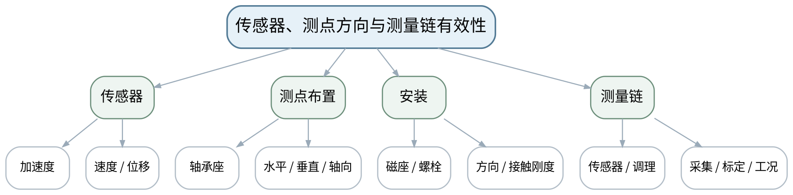 |
| 教学方法 | 讲授法、问答法、案例分析法、波形/频谱判读法、故障树推演法、Python演示法、方案评审法 |
| 教学用具 | 电脑、投影仪、多媒体课件、教材、加速度/速度/位移传感器图片或实物、设备结构图。 |
| 教学设计 | 课前任务→互动导入（10 min）→传授新知（70 min）→过关检测（10 min）→课堂小结（5 min）→作业布置（3 min）→考勤（2 min） |
| 参考文献 | [1] 张键, 汤赫男.《机械故障诊断技术（第3版）》[M]. 北京：机械工业出版社，2024。；[2] 汪永华, 贾芸.《机电设备故障诊断与维修（第3版）》[M]. 北京：机械工业出版社，2024。 |

#### 教学目标

**知识目标：**
（1）掌握加速度、速度、位移传感器及转速参考的基本用途。 （2）理解测点位置、方向、安装方式和测量链对数据可信度的影响。

**能力目标：**
（1）能够依据设备结构和故障受力方向设计基本测点方案。 （2）能够识别安装松动、方向错误、量程不匹配等数据质量风险。

**价值目标：**
（1）形成测量条件透明、安装规范和原始数据可信意识。

#### 课程思政

（1）以错误测点和安装不规范导致误诊为例，强调计量规范与工程责任。 （2）涉及设备检查、维修或复机的讨论，均强调停机、锁定挂牌、能量隔离、说明书和授权边界；Python/数据分析必须保留数据来源、参数和不确定性。

#### 专创融合

把测点表设计为巡检/在线监测系统的配置模板，支持后续自动采集和资产管理。

#### 教学重难点

**教学重点**：传感器选择、测点方向和测量链质量。

**教学难点**：同一设备测点位置与安装方式不同可能造成特征显著差异，诊断前必须先验证测量链。

#### 教学过程

| 教学步骤 | 主要教学内容 | 设计意图 |
|---|---|---|
| 课前任务 | 【教师】1. 发布教材范围、设备结构/信号材料和一个“先判断再分析”的问题； 2. 提醒Python数据演示只使用公开或教师提供数据，设备维护案例必须遵守停机、锁定挂牌、能量隔离和设备说明书； 【学生】1. 阅读材料并标出3个核心术语； 2. 写出一个预测结论及所需证据； 3. 带着疑问进入课堂。 | 通过课前预习与安全边界提醒建立先备认知，避免把设备维护和数据分析变成无依据试错。 |
| 互动导入（10 min） | 【教师】1. 复习与本课直接相关的上一课主线； 2. 展示“同一轴承座磁吸松动/螺栓固定”两组振动频谱，提问差异可能来自设备还是测量？ 3. 追问“现象能证明什么、不能证明什么、还需补什么证据”。 【学生】先独立判断，再与同伴交换依据，明确本次课任务。 | 从故障现象和证据冲突切入，让学生先判断再学习机理，建立问题驱动的诊断思维。 |
| 传授新知（共70 min） | 一、传感器选择 【教师】比较加速度、速度、位移传感器的频段、安装和场景边界；具体量程/灵敏度以手册为准。 【学生】完成对应波形/频谱/结构/参数/维护判断，先写预期，再对照教师案例或演示修正。 【课堂强化】每个诊断结论至少写一条支持证据和一条边界/不确定项。  二、测点与方向 【教师】从轴承座、机座、联轴器两端等位置讲水平/垂直/轴向布置，强调靠近力传递路径和可重复安装。 【学生】完成对应波形/频谱/结构/参数/维护判断，先写预期，再对照教师案例或演示修正。 【课堂强化】每个诊断结论至少写一条支持证据和一条边界/不确定项。  三、测量链验收 【教师】用安装、线缆、量程、标定、供电/调理、转速与工况字段建立采集检查表；学生评审一份错误布点方案。 【学生】完成对应波形/频谱/结构/参数/维护判断，先写预期，再对照教师案例或演示修正。 【课堂强化】每个诊断结论至少写一条支持证据和一条边界/不确定项。  【形成产物】设备测点布置图＋测量链采集检查表。 【学习证据】测点图、方向说明、安装方式、量程/采样前检查项。 【评价映射】平时成绩；目标1.2、2.2、3.2。 | 按“数据质量→特征→机理→工况→结论→维护/验证”展开，训练证据链而不是背故障口诀。 |
| 过关检测（10 min） | 【教师】布置课堂检测： 1. 为什么同一轴承需要多个方向的测量？ 2. 传感器安装松动会如何影响高频数据？ 3. 诊断前如何证明测量链是可信的？ 【学生】独立作答、同伴互查并标出证据； 【教师】按“数据质量—特征—机理—维护边界”分类点评。 | 即时暴露概念、频率、数据质量和结论边界错误，要求用证据修正。 |
| 课堂小结（5 min） | 【教师】1. 本次课解决的关键问题：传感器、测点方向与测量链有效性； 2. 重点主线：传感器选择、测点方向和测量链质量。； 3. 最值得带走的方法：先验证数据，再把特征与机理/工况关联，最后形成分级结论； 4. 易错点：同一设备测点位置与安装方式不同可能造成特征显著差异，诊断前必须先验证测量链。 【学生】写下“一条诊断规则＋一条不能越过的证据边界”。 | 回到知识脉络图压缩方法，形成可迁移的诊断流程和风险意识。 |
| 作业布置（3 min） | 【教师】1. 为电机—联轴器—泵机组设计不少于6个振动测点，标出方向、传感器与工况字段。 【要求】不只写“是什么故障”，还要写测量条件、参数/结构依据、支持与反对证据、结论等级和下一步验证；数据与代码须说明来源。 【学生】按课程命名规范整理提交。 | 固化数据、图表、计算和维护证据，为阶段作业与期末综合方案积累可追溯素材。 |
| 考勤（2 min） | 【教师】利用学习通/课堂点名完成签到；不预填实际出勤事实。 【学生】按要求完成签到。 | 保留学校课堂管理环节，不预填实际出勤事实。 |

#### 教学反思

【课后填写，不预填事实】 1. 教学流程：记录本课100 min各环节实际用时和需要调整的位置； 2. 教学内容：重点记录“同一设备测点位置与安装方式不同可能造成特征显著差异，诊断前必须先验证测量链。”的真实掌握证据与常见错误； 3. 学生参与：仅依据实际课堂记录填写波形/频谱判读、计算、讨论与证据表达情况； 4. 教学改进：依据真实课堂证据决定是否增加参数演示、故障对照、Python示例或维护决策练习。

### lesson-05

| 字段 | 内容 |
|---|---|
| 章节 | 第2单元 机械振动、传感器与状态数据采集 |
| 授课题目 | 采样、混叠、窗函数、泄漏、分辨率与信噪比 |
| 周次 | 第3周（第5次课） |
| 课时安排 | 2课时（100 min）；类型：理论2 |
| 知识脉络图 | 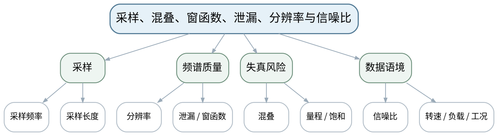 |
| 教学方法 | 讲授法、问答法、案例分析法、波形/频谱判读法、故障树推演法、Python演示法、方案评审法 |
| 教学用具 | 电脑、投影仪、多媒体课件、教材、教师提供波形/频谱、Python/NumPy采样演示。 |
| 教学设计 | 课前任务→互动导入（10 min）→传授新知（70 min）→过关检测（10 min）→课堂小结（5 min）→作业布置（3 min）→考勤（2 min） |
| 参考文献 | [1] 张键, 汤赫男.《机械故障诊断技术（第3版）》[M]. 北京：机械工业出版社，2024。 |

#### 教学目标

**知识目标：**
（1）理解采样频率、采样长度、频率分辨率、混叠、泄漏、窗函数和信噪比。 （2）理解工况、转速、负载和测量链参数必须与数据一起保存。

**能力目标：**
（1）能够依据最高关注频率和分辨率需求推演采样参数。 （2）能够从波形/频谱现象识别明显混叠、泄漏或饱和风险。

**价值目标：**
（1）形成“数据不是只有数值，还包括采集条件”的可追溯习惯。

#### 课程思政

（1）通过采样不足、数据删改和条件不透明导致误诊案例强调原始数据真实性与参数完整记录。 （2）涉及设备检查、维修或复机的讨论，均强调停机、锁定挂牌、能量隔离、说明书和授权边界；Python/数据分析必须保留数据来源、参数和不确定性。

#### 专创融合

将采集参数表作为监测系统配置和数据治理元数据，便于跨设备、跨时间比较。

#### 教学重难点

**教学重点**：采样参数与频谱质量。

**教学难点**：采样率高并不自动保证频率分辨率高；窗函数不能“修复”错误采样。

#### 教学过程

| 教学步骤 | 主要教学内容 | 设计意图 |
|---|---|---|
| 课前任务 | 【教师】1. 发布教材范围、设备结构/信号材料和一个“先判断再分析”的问题； 2. 提醒Python数据演示只使用公开或教师提供数据，设备维护案例必须遵守停机、锁定挂牌、能量隔离和设备说明书； 【学生】1. 阅读材料并标出3个核心术语； 2. 写出一个预测结论及所需证据； 3. 带着疑问进入课堂。 | 通过课前预习与安全边界提醒建立先备认知，避免把设备维护和数据分析变成无依据试错。 |
| 互动导入（10 min） | 【教师】1. 复习与本课直接相关的上一课主线； 2. 展示两张FFT：一张分辨率不足合并了邻近峰，一张发生明显泄漏，要求学生先判断是设备故障还是采样设置问题。 3. 追问“现象能证明什么、不能证明什么、还需补什么证据”。 【学生】先独立判断，再与同伴交换依据，明确本次课任务。 | 从故障现象和证据冲突切入，让学生先判断再学习机理，建立问题驱动的诊断思维。 |
| 传授新知（共70 min） | 一、采样与混叠 【教师】围绕奈奎斯特思想解释最高关注频率、采样率与抗混叠，强调工程需留裕量且以仪器设置为准。 【学生】完成对应波形/频谱/结构/参数/维护判断，先写预期，再对照教师案例或演示修正。 【课堂强化】每个诊断结论至少写一条支持证据和一条边界/不确定项。  二、长度与分辨率 【教师】解释采样时长决定频率分辨率，比较短记录/长记录的频谱差异。 【学生】完成对应波形/频谱/结构/参数/维护判断，先写预期，再对照教师案例或演示修正。 【课堂强化】每个诊断结论至少写一条支持证据和一条边界/不确定项。  三、窗与数据质量 【教师】讲泄漏、常见窗函数作用、信噪比、饱和和工况记录；学生完成“采集参数—可能失真—验证方式”表。 【学生】完成对应波形/频谱/结构/参数/维护判断，先写预期，再对照教师案例或演示修正。 【课堂强化】每个诊断结论至少写一条支持证据和一条边界/不确定项。  【形成产物】课程作业阶段2：振动采集参数与数据有效性分析。 【学习证据】采样参数推演、波形/频谱对比、数据质量检查表。 【评价映射】课程作业阶段2（课程作业内部15%）；目标1.2、2.2、3.2。 | 按“数据质量→特征→机理→工况→结论→维护/验证”展开，训练证据链而不是背故障口诀。 |
| 过关检测（10 min） | 【教师】布置课堂检测： 1. 提高采样频率是否一定提高频率分辨率？ 2. 窗函数主要缓解什么问题？ 3. 采集数据为何必须同时记录转速和负载？ 【学生】独立作答、同伴互查并标出证据； 【教师】按“数据质量—特征—机理—维护边界”分类点评。 | 即时暴露概念、频率、数据质量和结论边界错误，要求用证据修正。 |
| 课堂小结（5 min） | 【教师】1. 本次课解决的关键问题：采样、混叠、窗函数、泄漏、分辨率与信噪比； 2. 重点主线：采样参数与频谱质量。； 3. 最值得带走的方法：先验证数据，再把特征与机理/工况关联，最后形成分级结论； 4. 易错点：采样率高并不自动保证频率分辨率高；窗函数不能“修复”错误采样。 【学生】写下“一条诊断规则＋一条不能越过的证据边界”。 | 回到知识脉络图压缩方法，形成可迁移的诊断流程和风险意识。 |
| 作业布置（3 min） | 【教师】1. 提交阶段作业2：为给定故障频段设计采样率、采样时长和记录字段，并分析两个错误参数案例。 【要求】不只写“是什么故障”，还要写测量条件、参数/结构依据、支持与反对证据、结论等级和下一步验证；数据与代码须说明来源。 【学生】按课程命名规范整理提交。 | 固化数据、图表、计算和维护证据，为阶段作业与期末综合方案积累可追溯素材。 |
| 考勤（2 min） | 【教师】利用学习通/课堂点名完成签到；不预填实际出勤事实。 【学生】按要求完成签到。 | 保留学校课堂管理环节，不预填实际出勤事实。 |

#### 教学反思

【课后填写，不预填事实】 1. 教学流程：记录本课100 min各环节实际用时和需要调整的位置； 2. 教学内容：重点记录“采样率高并不自动保证频率分辨率高；窗函数不能“修复”错误采样。”的真实掌握证据与常见错误； 3. 学生参与：仅依据实际课堂记录填写波形/频谱判读、计算、讨论与证据表达情况； 4. 教学改进：依据真实课堂证据决定是否增加参数演示、故障对照、Python示例或维护决策练习。

### lesson-06

| 字段 | 内容 |
|---|---|
| 章节 | 第3单元 时域、频域与包络分析及特征提取 |
| 授课题目 | 时域波形与RMS、峰值、峭度等统计特征 |
| 周次 | 第3周（第6次课） |
| 课时安排 | 2课时（100 min）；类型：理论2 |
| 知识脉络图 | 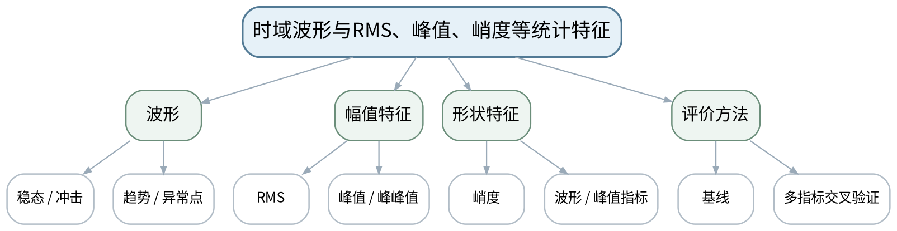 |
| 教学方法 | 讲授法、问答法、案例分析法、波形/频谱判读法、故障树推演法、Python演示法、方案评审法 |
| 教学用具 | 电脑、投影仪、多媒体课件、教材、教师提供振动数据、Python/NumPy演示。 |
| 教学设计 | 课前任务→互动导入（10 min）→传授新知（70 min）→过关检测（10 min）→课堂小结（5 min）→作业布置（3 min）→考勤（2 min） |
| 参考文献 | [1] 张键, 汤赫男.《机械故障诊断技术（第3版）》[M]. 北京：机械工业出版社，2024。 |

#### 教学目标

**知识目标：**
（1）掌握均值、均方根、峰值、峰峰值、峭度、波形指标、峰值指标等常用时域特征。 （2）理解不同特征对能量、冲击性和波形形态的侧重点不同。

**能力目标：**
（1）能够从时域波形和统计量识别能量增长、冲击增强或异常变化。 （2）能够比较单指标与多指标判断，说明基线的重要性。

**价值目标：**
（1）形成不依赖单一指标、如实保留异常和基线数据的诊断意识。

#### 课程思政

（1）通过“只看一个峰值”造成误判的案例强调科学求证和多证据交叉验证。 （2）涉及设备检查、维修或复机的讨论，均强调停机、锁定挂牌、能量隔离、说明书和授权边界；Python/数据分析必须保留数据来源、参数和不确定性。

#### 专创融合

把时域特征表组织为设备健康看板的最小指标层，并保留原始波形链接/索引。

#### 教学重难点

**教学重点**：时域波形与统计特征。

**教学难点**：峭度/峰值对冲击敏感但可能受偶发冲击影响，RMS稳定但可能掩盖局部冲击，需要组合判断。

#### 教学过程

| 教学步骤 | 主要教学内容 | 设计意图 |
|---|---|---|
| 课前任务 | 【教师】1. 发布教材范围、设备结构/信号材料和一个“先判断再分析”的问题； 2. 提醒Python数据演示只使用公开或教师提供数据，设备维护案例必须遵守停机、锁定挂牌、能量隔离和设备说明书； 【学生】1. 阅读材料并标出3个核心术语； 2. 写出一个预测结论及所需证据； 3. 带着疑问进入课堂。 | 通过课前预习与安全边界提醒建立先备认知，避免把设备维护和数据分析变成无依据试错。 |
| 互动导入（10 min） | 【教师】1. 复习与本课直接相关的上一课主线； 2. 给出两组数据：A的RMS升高但峭度不高，B的RMS接近正常但峭度显著升高，让学生判断两者可能代表什么。 3. 追问“现象能证明什么、不能证明什么、还需补什么证据”。 【学生】先独立判断，再与同伴交换依据，明确本次课任务。 | 从故障现象和证据冲突切入，让学生先判断再学习机理，建立问题驱动的诊断思维。 |
| 传授新知（共70 min） | 一、波形观察 【教师】从周期、冲击、调制、削顶和趋势变化训练先看时域质量再计算特征。 【学生】完成对应波形/频谱/结构/参数/维护判断，先写预期，再对照教师案例或演示修正。 【课堂强化】每个诊断结论至少写一条支持证据和一条边界/不确定项。  二、统计特征 【教师】解释RMS、峰值、峰峰值、峭度及常见无量纲指标的物理意义，Python只演示计算，不单列上机。 【学生】完成对应波形/频谱/结构/参数/维护判断，先写预期，再对照教师案例或演示修正。 【课堂强化】每个诊断结论至少写一条支持证据和一条边界/不确定项。  三、交叉验证 【教师】学生对3个状态样本比较RMS/峭度/峰值指标并给出分级结论，必须说明基线和不确定性。 【学生】完成对应波形/频谱/结构/参数/维护判断，先写预期，再对照教师案例或演示修正。 【课堂强化】每个诊断结论至少写一条支持证据和一条边界/不确定项。  【形成产物】时域特征对比表＋状态分级初判。 【学习证据】波形图、统计特征、基线对照、初判与不确定性。 【评价映射】平时成绩；目标1.3、2.3、3.3。 | 按“数据质量→特征→机理→工况→结论→维护/验证”展开，训练证据链而不是背故障口诀。 |
| 过关检测（10 min） | 【教师】布置课堂检测： 1. RMS主要反映什么？ 2. 峭度高一定代表轴承故障吗？ 3. 为什么状态指标必须与基线或历史趋势比较？ 【学生】独立作答、同伴互查并标出证据； 【教师】按“数据质量—特征—机理—维护边界”分类点评。 | 即时暴露概念、频率、数据质量和结论边界错误，要求用证据修正。 |
| 课堂小结（5 min） | 【教师】1. 本次课解决的关键问题：时域波形与RMS、峰值、峭度等统计特征； 2. 重点主线：时域波形与统计特征。； 3. 最值得带走的方法：先验证数据，再把特征与机理/工况关联，最后形成分级结论； 4. 易错点：峭度/峰值对冲击敏感但可能受偶发冲击影响，RMS稳定但可能掩盖局部冲击，需要组合判断。 【学生】写下“一条诊断规则＋一条不能越过的证据边界”。 | 回到知识脉络图压缩方法，形成可迁移的诊断流程和风险意识。 |
| 作业布置（3 min） | 【教师】1. 使用教师提供数据计算3—5个时域特征，写出“能说明什么/不能说明什么”。 【要求】不只写“是什么故障”，还要写测量条件、参数/结构依据、支持与反对证据、结论等级和下一步验证；数据与代码须说明来源。 【学生】按课程命名规范整理提交。 | 固化数据、图表、计算和维护证据，为阶段作业与期末综合方案积累可追溯素材。 |
| 考勤（2 min） | 【教师】利用学习通/课堂点名完成签到；不预填实际出勤事实。 【学生】按要求完成签到。 | 保留学校课堂管理环节，不预填实际出勤事实。 |

#### 教学反思

【课后填写，不预填事实】 1. 教学流程：记录本课100 min各环节实际用时和需要调整的位置； 2. 教学内容：重点记录“峭度/峰值对冲击敏感但可能受偶发冲击影响，RMS稳定但可能掩盖局部冲击，需要组合判断。”的真实掌握证据与常见错误； 3. 学生参与：仅依据实际课堂记录填写波形/频谱判读、计算、讨论与证据表达情况； 4. 教学改进：依据真实课堂证据决定是否增加参数演示、故障对照、Python示例或维护决策练习。

### lesson-07

| 字段 | 内容 |
|---|---|
| 章节 | 第3单元 时域、频域与包络分析及特征提取 |
| 授课题目 | FFT频谱、转频/倍频、阶次与边频带 |
| 周次 | 第4周（第7次课） |
| 课时安排 | 2课时（100 min）；类型：理论2 |
| 知识脉络图 | 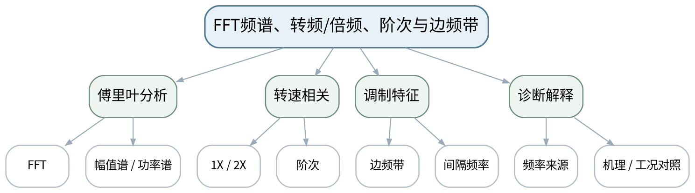 |
| 教学方法 | 讲授法、问答法、案例分析法、波形/频谱判读法、故障树推演法、Python演示法、方案评审法 |
| 教学用具 | 电脑、投影仪、多媒体课件、教材、教师提供频谱、Python/SciPy FFT演示、转速与结构参数表。 |
| 教学设计 | 课前任务→互动导入（10 min）→传授新知（70 min）→过关检测（10 min）→课堂小结（5 min）→作业布置（3 min）→考勤（2 min） |
| 参考文献 | [1] 张键, 汤赫男.《机械故障诊断技术（第3版）》[M]. 北京：机械工业出版社，2024。 |

#### 教学目标

**知识目标：**
（1）理解傅里叶变换/FFT在机械故障诊断中的作用。 （2）掌握转频、倍频、阶次、边频带和功率谱等基本频域概念。

**能力目标：**
（1）能够根据转速和结构参数预测1X、2X及典型边频带位置。 （2）能够区分“看到频谱峰”与“证明故障机理”之间的证据差距。

**价值目标：**
（1）形成频率必须关联结构、转速和工况解释的习惯。

#### 课程思政

（1）强调频谱解释必须基于结构与工况，不夸大算法输出，不删除不符合预期的频率成分。 （2）涉及设备检查、维修或复机的讨论，均强调停机、锁定挂牌、能量隔离、说明书和授权边界；Python/数据分析必须保留数据来源、参数和不确定性。

#### 专创融合

将频率解释表作为规则诊断、知识库和智能模型解释层的可复用资产。

#### 教学重难点

**教学重点**：FFT频谱、阶次与边频带。

**教学难点**：边频带与倍频需要结合调制源和结构参数解释，不能只靠频率形状套模板。

#### 教学过程

| 教学步骤 | 主要教学内容 | 设计意图 |
|---|---|---|
| 课前任务 | 【教师】1. 发布教材范围、设备结构/信号材料和一个“先判断再分析”的问题； 2. 提醒Python数据演示只使用公开或教师提供数据，设备维护案例必须遵守停机、锁定挂牌、能量隔离和设备说明书； 【学生】1. 阅读材料并标出3个核心术语； 2. 写出一个预测结论及所需证据； 3. 带着疑问进入课堂。 | 通过课前预习与安全边界提醒建立先备认知，避免把设备维护和数据分析变成无依据试错。 |
| 互动导入（10 min） | 【教师】1. 复习与本课直接相关的上一课主线； 2. 给出一个100 Hz主峰两侧每隔25 Hz出现边频带的频谱，追问“25 Hz可能来自什么？还需什么转速/结构信息？” 3. 追问“现象能证明什么、不能证明什么、还需补什么证据”。 【学生】先独立判断，再与同伴交换依据，明确本次课任务。 | 从故障现象和证据冲突切入，让学生先判断再学习机理，建立问题驱动的诊断思维。 |
| 传授新知（共70 min） | 一、FFT与频谱 【教师】由时域波形进入频域，说明幅值谱/功率谱用于识别能量在频率上的分布，Python演示保持与采样设置一致。 【学生】完成对应波形/频谱/结构/参数/维护判断，先写预期，再对照教师案例或演示修正。 【课堂强化】每个诊断结论至少写一条支持证据和一条边界/不确定项。  二、转频与阶次 【教师】计算转频、倍频和阶次，比较定转速下Hz与变转速下阶次表达的意义。 【学生】完成对应波形/频谱/结构/参数/维护判断，先写预期，再对照教师案例或演示修正。 【课堂强化】每个诊断结论至少写一条支持证据和一条边界/不确定项。  三、边频带解释 【教师】用调制概念解释围绕载频出现边频带，学生根据给定转速/齿数/结构参数标注可能来源并写验证条件。 【学生】完成对应波形/频谱/结构/参数/维护判断，先写预期，再对照教师案例或演示修正。 【课堂强化】每个诊断结论至少写一条支持证据和一条边界/不确定项。  【形成产物】频率成分解释表：峰值频率、阶次、可能来源、所需验证证据。 【学习证据】FFT/功率谱、转频/阶次计算、边频带标注、机理解释。 【评价映射】平时成绩；目标1.3、2.3、3.3。 | 按“数据质量→特征→机理→工况→结论→维护/验证”展开，训练证据链而不是背故障口诀。 |
| 过关检测（10 min） | 【教师】布置课堂检测： 1. 1X、2X分别如何由转速得到？ 2. 边频带的间隔频率为什么重要？ 3. 一个频谱峰为什么不能单独构成故障结论？ 【学生】独立作答、同伴互查并标出证据； 【教师】按“数据质量—特征—机理—维护边界”分类点评。 | 即时暴露概念、频率、数据质量和结论边界错误，要求用证据修正。 |
| 课堂小结（5 min） | 【教师】1. 本次课解决的关键问题：FFT频谱、转频/倍频、阶次与边频带； 2. 重点主线：FFT频谱、阶次与边频带。； 3. 最值得带走的方法：先验证数据，再把特征与机理/工况关联，最后形成分级结论； 4. 易错点：边频带与倍频需要结合调制源和结构参数解释，不能只靠频率形状套模板。 【学生】写下“一条诊断规则＋一条不能越过的证据边界”。 | 回到知识脉络图压缩方法，形成可迁移的诊断流程和风险意识。 |
| 作业布置（3 min） | 【教师】1. 完成一份“频谱峰值解释表”，至少包含5个频率成分和相应验证条件。 【要求】不只写“是什么故障”，还要写测量条件、参数/结构依据、支持与反对证据、结论等级和下一步验证；数据与代码须说明来源。 【学生】按课程命名规范整理提交。 | 固化数据、图表、计算和维护证据，为阶段作业与期末综合方案积累可追溯素材。 |
| 考勤（2 min） | 【教师】利用学习通/课堂点名完成签到；不预填实际出勤事实。 【学生】按要求完成签到。 | 保留学校课堂管理环节，不预填实际出勤事实。 |

#### 教学反思

【课后填写，不预填事实】 1. 教学流程：记录本课100 min各环节实际用时和需要调整的位置； 2. 教学内容：重点记录“边频带与倍频需要结合调制源和结构参数解释，不能只靠频率形状套模板。”的真实掌握证据与常见错误； 3. 学生参与：仅依据实际课堂记录填写波形/频谱判读、计算、讨论与证据表达情况； 4. 教学改进：依据真实课堂证据决定是否增加参数演示、故障对照、Python示例或维护决策练习。

### lesson-08

| 字段 | 内容 |
|---|---|
| 章节 | 第3单元 时域、频域与包络分析及特征提取 |
| 授课题目 | 滤波、包络谱、时频概念与趋势/阈值特征工程 |
| 周次 | 第4周（第8次课） |
| 课时安排 | 2课时（100 min）；类型：理论2 |
| 知识脉络图 | 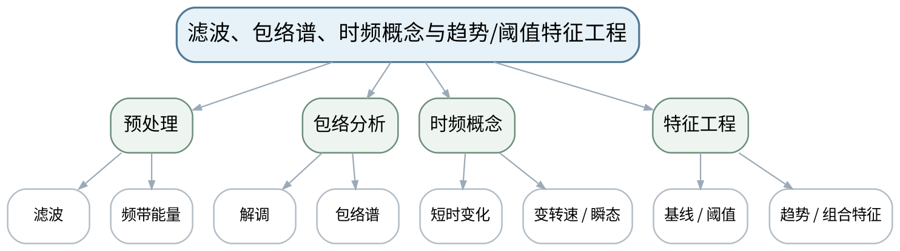 |
| 教学方法 | 讲授法、问答法、案例分析法、波形/频谱判读法、故障树推演法、Python演示法、方案评审法 |
| 教学用具 | 电脑、投影仪、多媒体课件、教材、教师提供公开/课程数据、Python/NumPy/SciPy演示。 |
| 教学设计 | 课前任务→互动导入（10 min）→传授新知（70 min）→过关检测（10 min）→课堂小结（5 min）→作业布置（3 min）→考勤（2 min） |
| 参考文献 | [1] 张键, 汤赫男.《机械故障诊断技术（第3版）》[M]. 北京：机械工业出版社，2024。 |

#### 教学目标

**知识目标：**
（1）掌握滤波、频带能量、包络解调和包络谱的基本诊断逻辑。 （2）理解时频分析、特征选择、基线、阈值和趋势判定的基本概念。

**能力目标：**
（1）能够解释为什么轴承冲击常通过共振频带和包络谱增强故障周期。 （2）能够形成一组“原始信号—预处理—特征—基线—阈值/趋势”的分析流程。

**价值目标：**
（1）形成参数、滤波范围和阈值来源必须透明可复核的习惯。

#### 课程思政

（1）通过算法参数透明和“不确定就说明不确定”落实学术诚信与工程责任。 （2）涉及设备检查、维修或复机的讨论，均强调停机、锁定挂牌、能量隔离、说明书和授权边界；Python/数据分析必须保留数据来源、参数和不确定性。

#### 专创融合

把Python分析流程封装成可复用诊断Notebook/脚本模板，为后续典型故障证据链服务。

#### 教学重难点

**教学重点**：滤波与包络诊断；基线、阈值和趋势特征。

**教学难点**：滤波/包络会改变观察视角，参数选择不当可能制造或掩盖特征；阈值不能脱离基线直接套用。

#### 教学过程

| 教学步骤 | 主要教学内容 | 设计意图 |
|---|---|---|
| 课前任务 | 【教师】1. 发布教材范围、设备结构/信号材料和一个“先判断再分析”的问题； 2. 提醒Python数据演示只使用公开或教师提供数据，设备维护案例必须遵守停机、锁定挂牌、能量隔离和设备说明书； 【学生】1. 阅读材料并标出3个核心术语； 2. 写出一个预测结论及所需证据； 3. 带着疑问进入课堂。 | 通过课前预习与安全边界提醒建立先备认知，避免把设备维护和数据分析变成无依据试错。 |
| 互动导入（10 min） | 【教师】1. 复习与本课直接相关的上一课主线； 2. 展示同一轴承数据原始频谱“看不出特征”，包络谱中出现清晰故障频率，追问包络分析做了什么、是否因此就能100%确诊。 3. 追问“现象能证明什么、不能证明什么、还需补什么证据”。 【学生】先独立判断，再与同伴交换依据，明确本次课任务。 | 从故障现象和证据冲突切入，让学生先判断再学习机理，建立问题驱动的诊断思维。 |
| 传授新知（共70 min） | 一、滤波与频带 【教师】说明高/低/带通滤波和频带能量的目标，强调频带选择需由结构共振/经验/数据共同支撑。 【学生】完成对应波形/频谱/结构/参数/维护判断，先写预期，再对照教师案例或演示修正。 【课堂强化】每个诊断结论至少写一条支持证据和一条边界/不确定项。  二、包络分析 【教师】用冲击激励高频共振→带通→包络解调→低频重复频率的链条解释轴承诊断。 【学生】完成对应波形/频谱/结构/参数/维护判断，先写预期，再对照教师案例或演示修正。 【课堂强化】每个诊断结论至少写一条支持证据和一条边界/不确定项。  三、趋势与时频 【教师】介绍时频分析用于瞬态/变速概念；围绕基线、阈值、趋势和组合特征组织Python演示与阶段作业证据。 【学生】完成对应波形/频谱/结构/参数/维护判断，先写预期，再对照教师案例或演示修正。 【课堂强化】每个诊断结论至少写一条支持证据和一条边界/不确定项。  【形成产物】课程作业阶段3：公开/教师数据的时域—频域—包络—趋势分析报告。 【学习证据】代码/参数、波形、频谱/包络谱、特征表、基线/阈值说明、失败或不确定案例。 【评价映射】课程作业阶段3（课程作业内部20%）；目标1.3、2.3、3.3。 | 按“数据质量→特征→机理→工况→结论→维护/验证”展开，训练证据链而不是背故障口诀。 |
| 过关检测（10 min） | 【教师】布置课堂检测： 1. 包络谱为什么适合提取重复冲击周期？ 2. 滤波频带选择不合理可能造成什么后果？ 3. 阈值为什么必须说明基线与工况？ 【学生】独立作答、同伴互查并标出证据； 【教师】按“数据质量—特征—机理—维护边界”分类点评。 | 即时暴露概念、频率、数据质量和结论边界错误，要求用证据修正。 |
| 课堂小结（5 min） | 【教师】1. 本次课解决的关键问题：滤波、包络谱、时频概念与趋势/阈值特征工程； 2. 重点主线：滤波与包络诊断；基线、阈值和趋势特征。； 3. 最值得带走的方法：先验证数据，再把特征与机理/工况关联，最后形成分级结论； 4. 易错点：滤波/包络会改变观察视角，参数选择不当可能制造或掩盖特征；阈值不能脱离基线直接套用。 【学生】写下“一条诊断规则＋一条不能越过的证据边界”。 | 回到知识脉络图压缩方法，形成可迁移的诊断流程和风险意识。 |
| 作业布置（3 min） | 【教师】1. 提交阶段作业3：对教师提供数据完成时域、FFT、包络或趋势分析，并写出至少一个不能由当前证据确定的结论。 【要求】不只写“是什么故障”，还要写测量条件、参数/结构依据、支持与反对证据、结论等级和下一步验证；数据与代码须说明来源。 【学生】按课程命名规范整理提交。 | 固化数据、图表、计算和维护证据，为阶段作业与期末综合方案积累可追溯素材。 |
| 考勤（2 min） | 【教师】利用学习通/课堂点名完成签到；不预填实际出勤事实。 【学生】按要求完成签到。 | 保留学校课堂管理环节，不预填实际出勤事实。 |

#### 教学反思

【课后填写，不预填事实】 1. 教学流程：记录本课100 min各环节实际用时和需要调整的位置； 2. 教学内容：重点记录“滤波/包络会改变观察视角，参数选择不当可能制造或掩盖特征；阈值不能脱离基线直接套用。”的真实掌握证据与常见错误； 3. 学生参与：仅依据实际课堂记录填写波形/频谱判读、计算、讨论与证据表达情况； 4. 教学改进：依据真实课堂证据决定是否增加参数演示、故障对照、Python示例或维护决策练习。

### lesson-09

| 字段 | 内容 |
|---|---|
| 章节 | 第4单元 旋转机械、滚动轴承、齿轮箱与电动机故障诊断 |
| 授课题目 | 转子不平衡、不对中、松动、碰摩与油膜涡动 |
| 周次 | 第5周（第9次课） |
| 课时安排 | 2课时（100 min）；类型：理论2 |
| 知识脉络图 | 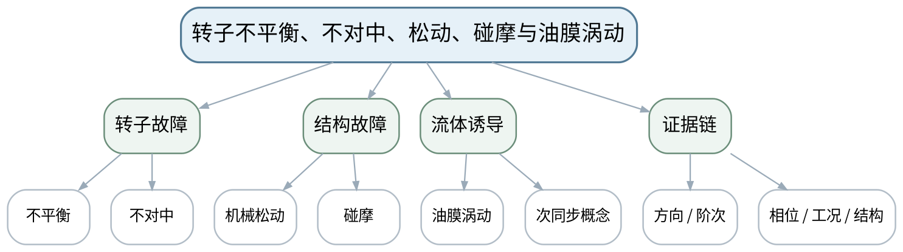 |
| 教学方法 | 讲授法、问答法、案例分析法、波形/频谱判读法、故障树推演法、Python演示法、方案评审法 |
| 教学用具 | 电脑、投影仪、多媒体课件、教材、转子结构图、教师提供波形/频谱/工况数据。 |
| 教学设计 | 课前任务→互动导入（10 min）→传授新知（70 min）→过关检测（10 min）→课堂小结（5 min）→作业布置（3 min）→考勤（2 min） |
| 参考文献 | [1] 张键, 汤赫男.《机械故障诊断技术（第3版）》[M]. 北京：机械工业出版社，2024。 |

#### 教学目标

**知识目标：**
（1）掌握不平衡、不对中、机械松动、碰摩和油膜涡动等典型机理与常见振动特征。 （2）理解1X/2X、谐波、次同步和方向特征只是诊断证据的一部分。

**能力目标：**
（1）能够结合轴向/径向方向、频谱阶次、工况和结构信息建立转子故障候选。 （2）能够用故障树区分相似特征并提出进一步验证方法。

**价值目标：**
（1）形成机理优先、工况关联和结论分级表达意识。

#### 课程思政

（1）通过转子误诊导致错误平衡/对中操作案例强调诊断结论会直接影响安全和维护成本。 （2）涉及设备检查、维修或复机的讨论，均强调停机、锁定挂牌、能量隔离、说明书和授权边界；Python/数据分析必须保留数据来源、参数和不确定性。

#### 专创融合

把转子故障树转化为规则库/知识图谱的候选规则，支持后续智能诊断的可解释层。

#### 教学重难点

**教学重点**：典型转子故障机理与特征。

**教学难点**：不平衡、不对中和松动可能同时出现1X/2X等相似成分，需要结合方向、相位、结构与工况交叉验证。

#### 教学过程

| 教学步骤 | 主要教学内容 | 设计意图 |
|---|---|---|
| 课前任务 | 【教师】1. 发布教材范围、设备结构/信号材料和一个“先判断再分析”的问题； 2. 提醒Python数据演示只使用公开或教师提供数据，设备维护案例必须遵守停机、锁定挂牌、能量隔离和设备说明书； 【学生】1. 阅读材料并标出3个核心术语； 2. 写出一个预测结论及所需证据； 3. 带着疑问进入课堂。 | 通过课前预习与安全边界提醒建立先备认知，避免把设备维护和数据分析变成无依据试错。 |
| 互动导入（10 min） | 【教师】1. 复习与本课直接相关的上一课主线； 2. 给出三个都含明显1X的频谱案例，要求学生说明为什么不能“看到1X就判不平衡”。 3. 追问“现象能证明什么、不能证明什么、还需补什么证据”。 【学生】先独立判断，再与同伴交换依据，明确本次课任务。 | 从故障现象和证据冲突切入，让学生先判断再学习机理，建立问题驱动的诊断思维。 |
| 传授新知（共70 min） | 一、不平衡与不对中 【教师】从质量偏心和轴线偏差解释力学机理，比较径向/轴向、1X/2X和相位等常见线索。 【学生】完成对应波形/频谱/结构/参数/维护判断，先写预期，再对照教师案例或演示修正。 【课堂强化】每个诊断结论至少写一条支持证据和一条边界/不确定项。  二、松动与碰摩 【教师】解释结构刚度变化、间隙/接触导致谐波、宽带和波形畸变的可能表现，强调具体设备差异。 【学生】完成对应波形/频谱/结构/参数/维护判断，先写预期，再对照教师案例或演示修正。 【课堂强化】每个诊断结论至少写一条支持证据和一条边界/不确定项。  三、次同步与故障树 【教师】介绍油膜涡动次同步概念；学生以“1X大/轴向大/谐波多/次同步”构建故障树和验证清单。 【学生】完成对应波形/频谱/结构/参数/维护判断，先写预期，再对照教师案例或演示修正。 【课堂强化】每个诊断结论至少写一条支持证据和一条边界/不确定项。  【形成产物】转子故障特征对照表＋故障树。 【学习证据】频谱/波形标注、方向与工况、候选故障、进一步验证步骤。 【评价映射】平时成绩；目标1.4、2.4、3.4。 | 按“数据质量→特征→机理→工况→结论→维护/验证”展开，训练证据链而不是背故障口诀。 |
| 过关检测（10 min） | 【教师】布置课堂检测： 1. 为什么1X大不能直接确诊不平衡？ 2. 不对中为什么常需要关注轴向振动？ 3. 碰摩与机械松动的特征为什么需要结构/工况证据支持？ 【学生】独立作答、同伴互查并标出证据； 【教师】按“数据质量—特征—机理—维护边界”分类点评。 | 即时暴露概念、频率、数据质量和结论边界错误，要求用证据修正。 |
| 课堂小结（5 min） | 【教师】1. 本次课解决的关键问题：转子不平衡、不对中、松动、碰摩与油膜涡动； 2. 重点主线：典型转子故障机理与特征。； 3. 最值得带走的方法：先验证数据，再把特征与机理/工况关联，最后形成分级结论； 4. 易错点：不平衡、不对中和松动可能同时出现1X/2X等相似成分，需要结合方向、相位、结构与工况交叉验证。 【学生】写下“一条诊断规则＋一条不能越过的证据边界”。 | 回到知识脉络图压缩方法，形成可迁移的诊断流程和风险意识。 |
| 作业布置（3 min） | 【教师】1. 对教师提供的两组转子案例写“首选故障＋备选故障＋验证步骤”，不得只给单一结论。 【要求】不只写“是什么故障”，还要写测量条件、参数/结构依据、支持与反对证据、结论等级和下一步验证；数据与代码须说明来源。 【学生】按课程命名规范整理提交。 | 固化数据、图表、计算和维护证据，为阶段作业与期末综合方案积累可追溯素材。 |
| 考勤（2 min） | 【教师】利用学习通/课堂点名完成签到；不预填实际出勤事实。 【学生】按要求完成签到。 | 保留学校课堂管理环节，不预填实际出勤事实。 |

#### 教学反思

【课后填写，不预填事实】 1. 教学流程：记录本课100 min各环节实际用时和需要调整的位置； 2. 教学内容：重点记录“不平衡、不对中和松动可能同时出现1X/2X等相似成分，需要结合方向、相位、结构与工况交叉验证。”的真实掌握证据与常见错误； 3. 学生参与：仅依据实际课堂记录填写波形/频谱判读、计算、讨论与证据表达情况； 4. 教学改进：依据真实课堂证据决定是否增加参数演示、故障对照、Python示例或维护决策练习。

### lesson-10

| 字段 | 内容 |
|---|---|
| 章节 | 第4单元 旋转机械、滚动轴承、齿轮箱与电动机故障诊断 |
| 授课题目 | 滚动轴承故障频率、冲击机理与包络诊断 |
| 周次 | 第5周（第10次课） |
| 课时安排 | 2课时（100 min）；类型：理论2 |
| 知识脉络图 | 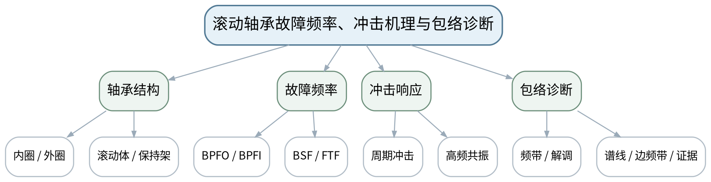 |
| 教学方法 | 讲授法、问答法、案例分析法、波形/频谱判读法、故障树推演法、Python演示法、方案评审法 |
| 教学用具 | 电脑、投影仪、多媒体课件、教材、轴承结构参数表、教师提供包络谱/Python计算演示。 |
| 教学设计 | 课前任务→互动导入（10 min）→传授新知（70 min）→过关检测（10 min）→课堂小结（5 min）→作业布置（3 min）→考勤（2 min） |
| 参考文献 | [1] 张键, 汤赫男.《机械故障诊断技术（第3版）》[M]. 北京：机械工业出版社，2024。 |

#### 教学目标

**知识目标：**
（1）理解滚动轴承内圈、外圈、滚动体和保持架故障的冲击机理。 （2）掌握BPFO、BPFI、BSF、FTF等特征频率的结构参数依赖及包络诊断思路。

**能力目标：**
（1）能够根据转速和轴承几何参数计算/使用给定特征频率，并在包络谱中寻找对应证据。 （2）能够结合转频调制、谐波和工况判断轴承故障证据强度。

**价值目标：**
（1）形成计算参数可追溯、频率匹配有容差且不做机械“对号入座”的意识。

#### 课程思政

（1）强调轴承参数、转速和数据来源必须可核验，避免为了匹配理论值而选择性调整参数。 （2）涉及设备检查、维修或复机的讨论，均强调停机、锁定挂牌、能量隔离、说明书和授权边界；Python/数据分析必须保留数据来源、参数和不确定性。

#### 专创融合

将轴承特征频率计算和包络证据表做成自动计算/报告模块，但保留人工机理核验。

#### 教学重难点

**教学重点**：轴承特征频率与包络诊断证据链。

**教学难点**：实际特征频率可能因滑移、转速波动和结构差异偏移，不能要求谱线精确“对点”。

#### 教学过程

| 教学步骤 | 主要教学内容 | 设计意图 |
|---|---|---|
| 课前任务 | 【教师】1. 发布教材范围、设备结构/信号材料和一个“先判断再分析”的问题； 2. 提醒Python数据演示只使用公开或教师提供数据，设备维护案例必须遵守停机、锁定挂牌、能量隔离和设备说明书； 【学生】1. 阅读材料并标出3个核心术语； 2. 写出一个预测结论及所需证据； 3. 带着疑问进入课堂。 | 通过课前预习与安全边界提醒建立先备认知，避免把设备维护和数据分析变成无依据试错。 |
| 互动导入（10 min） | 【教师】1. 复习与本课直接相关的上一课主线； 2. 给出一个包络谱峰值比理论BPFI偏差2%—3%的案例，提问应判“不是轴承故障”还是先检查滑移/转速/参数？ 3. 追问“现象能证明什么、不能证明什么、还需补什么证据”。 【学生】先独立判断，再与同伴交换依据，明确本次课任务。 | 从故障现象和证据冲突切入，让学生先判断再学习机理，建立问题驱动的诊断思维。 |
| 传授新知（共70 min） | 一、轴承机理 【教师】通过内外圈相对运动解释局部缺陷为何产生周期冲击，区分四类故障位置。 【学生】完成对应波形/频谱/结构/参数/维护判断，先写预期，再对照教师案例或演示修正。 【课堂强化】每个诊断结论至少写一条支持证据和一条边界/不确定项。  二、特征频率 【教师】展示BPFO/BPFI/BSF/FTF公式的变量意义，学生使用教师给定轴承参数完成计算，重点是参数来源。 【学生】完成对应波形/频谱/结构/参数/维护判断，先写预期，再对照教师案例或演示修正。 【课堂强化】每个诊断结论至少写一条支持证据和一条边界/不确定项。  三、包络证据 【教师】结合包络谱中故障频率、谐波、1X边频带和趋势建立证据链，并讨论滑移和变转速偏差。 【学生】完成对应波形/频谱/结构/参数/维护判断，先写预期，再对照教师案例或演示修正。 【课堂强化】每个诊断结论至少写一条支持证据和一条边界/不确定项。  【形成产物】轴承故障频率计算表＋包络谱证据链卡。 【学习证据】结构参数来源、理论频率、实测峰值、偏差、谐波/边频带、结论等级。 【评价映射】平时成绩；目标1.4、2.4、3.4。 | 按“数据质量→特征→机理→工况→结论→维护/验证”展开，训练证据链而不是背故障口诀。 |
| 过关检测（10 min） | 【教师】布置课堂检测： 1. BPFI/BPFO由哪些结构和转速参数决定？ 2. 实际峰值为什么可能不与理论频率完全相等？ 3. 包络谱中出现一个接近BPFO的峰是否足以确诊？ 【学生】独立作答、同伴互查并标出证据； 【教师】按“数据质量—特征—机理—维护边界”分类点评。 | 即时暴露概念、频率、数据质量和结论边界错误，要求用证据修正。 |
| 课堂小结（5 min） | 【教师】1. 本次课解决的关键问题：滚动轴承故障频率、冲击机理与包络诊断； 2. 重点主线：轴承特征频率与包络诊断证据链。； 3. 最值得带走的方法：先验证数据，再把特征与机理/工况关联，最后形成分级结论； 4. 易错点：实际特征频率可能因滑移、转速波动和结构差异偏移，不能要求谱线精确“对点”。 【学生】写下“一条诊断规则＋一条不能越过的证据边界”。 | 回到知识脉络图压缩方法，形成可迁移的诊断流程和风险意识。 |
| 作业布置（3 min） | 【教师】1. 完成一个轴承公开/教师案例：计算特征频率，标注包络谱，并写出结论与不确定性。 【要求】不只写“是什么故障”，还要写测量条件、参数/结构依据、支持与反对证据、结论等级和下一步验证；数据与代码须说明来源。 【学生】按课程命名规范整理提交。 | 固化数据、图表、计算和维护证据，为阶段作业与期末综合方案积累可追溯素材。 |
| 考勤（2 min） | 【教师】利用学习通/课堂点名完成签到；不预填实际出勤事实。 【学生】按要求完成签到。 | 保留学校课堂管理环节，不预填实际出勤事实。 |

#### 教学反思

【课后填写，不预填事实】 1. 教学流程：记录本课100 min各环节实际用时和需要调整的位置； 2. 教学内容：重点记录“实际特征频率可能因滑移、转速波动和结构差异偏移，不能要求谱线精确“对点”。”的真实掌握证据与常见错误； 3. 学生参与：仅依据实际课堂记录填写波形/频谱判读、计算、讨论与证据表达情况； 4. 教学改进：依据真实课堂证据决定是否增加参数演示、故障对照、Python示例或维护决策练习。

### lesson-11

| 字段 | 内容 |
|---|---|
| 章节 | 第4单元 旋转机械、滚动轴承、齿轮箱与电动机故障诊断 |
| 授课题目 | 齿轮啮合频率、边频带与齿轮箱故障 |
| 周次 | 第6周（第11次课） |
| 课时安排 | 2课时（100 min）；类型：理论2 |
| 知识脉络图 | 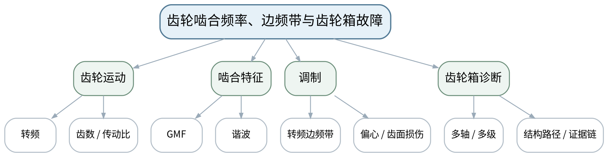 |
| 教学方法 | 讲授法、问答法、案例分析法、波形/频谱判读法、故障树推演法、Python演示法、方案评审法 |
| 教学用具 | 电脑、投影仪、多媒体课件、教材、齿轮箱结构图、齿数/转速表、教师提供频谱。 |
| 教学设计 | 课前任务→互动导入（10 min）→传授新知（70 min）→过关检测（10 min）→课堂小结（5 min）→作业布置（3 min）→考勤（2 min） |
| 参考文献 | [1] 张键, 汤赫男.《机械故障诊断技术（第3版）》[M]. 北京：机械工业出版社，2024。；[2] 汪永华, 贾芸.《机电设备故障诊断与维修（第3版）》[M]. 北京：机械工业出版社，2024。 |

#### 教学目标

**知识目标：**
（1）掌握齿轮啮合频率、转频边频带及常见齿面损伤/偏心/断齿等故障线索。 （2）理解多级齿轮箱中多轴转速和多组啮合频率共存。

**能力目标：**
（1）能够根据齿数和转速计算啮合频率并标注边频带间隔。 （2）能够结合传动结构图解释频谱中的可能来源。

**价值目标：**
（1）形成“先算结构运动关系，再看频谱”的诊断作风。

#### 课程思政

（1）通过错误换齿轮/错误停机案例强调频谱结论必须与结构频率和维护成本共同审查。 （2）涉及设备检查、维修或复机的讨论，均强调停机、锁定挂牌、能量隔离、说明书和授权边界；Python/数据分析必须保留数据来源、参数和不确定性。

#### 专创融合

将齿轮箱频率表做成设备数字档案的一部分，支持自动谱线标注和知识库维护。

#### 教学重难点

**教学重点**：齿轮啮合频率、边频带和传动链证据。

**教学难点**：多级齿轮箱频率成分密集，必须用齿数、轴转速和传动路径约束解释。

#### 教学过程

| 教学步骤 | 主要教学内容 | 设计意图 |
|---|---|---|
| 课前任务 | 【教师】1. 发布教材范围、设备结构/信号材料和一个“先判断再分析”的问题； 2. 提醒Python数据演示只使用公开或教师提供数据，设备维护案例必须遵守停机、锁定挂牌、能量隔离和设备说明书； 【学生】1. 阅读材料并标出3个核心术语； 2. 写出一个预测结论及所需证据； 3. 带着疑问进入课堂。 | 通过课前预习与安全边界提醒建立先备认知，避免把设备维护和数据分析变成无依据试错。 |
| 互动导入（10 min） | 【教师】1. 复习与本课直接相关的上一课主线； 2. 给出一个多级齿轮箱频谱，峰很多但无标注；先让学生画传动链并计算GMF，再讨论哪些峰值得关注。 3. 追问“现象能证明什么、不能证明什么、还需补什么证据”。 【学生】先独立判断，再与同伴交换依据，明确本次课任务。 | 从故障现象和证据冲突切入，让学生先判断再学习机理，建立问题驱动的诊断思维。 |
| 传授新知（共70 min） | 一、传动关系 【教师】依据主动/从动齿数计算各轴转速和传动比，建立频率来源表。 【学生】完成对应波形/频谱/结构/参数/维护判断，先写预期，再对照教师案例或演示修正。 【课堂强化】每个诊断结论至少写一条支持证据和一条边界/不确定项。  二、GMF与边频带 【教师】解释啮合频率=齿数×轴转频，偏心/齿面故障可形成以轴转频为间隔的边频带及谐波变化。 【学生】完成对应波形/频谱/结构/参数/维护判断，先写预期，再对照教师案例或演示修正。 【课堂强化】每个诊断结论至少写一条支持证据和一条边界/不确定项。  三、案例诊断 【教师】学生按“结构→理论频率→实测谱线→边频带/趋势→候选故障→验证”完成两级齿轮箱案例。 【学生】完成对应波形/频谱/结构/参数/维护判断，先写预期，再对照教师案例或演示修正。 【课堂强化】每个诊断结论至少写一条支持证据和一条边界/不确定项。  【形成产物】齿轮箱传动频率表＋故障证据链。 【学习证据】齿数/转速、GMF、边频带间隔、频谱标注、候选故障与验证。 【评价映射】课程作业阶段4（课程作业内部30%的组成证据）；目标1.4、2.4、3.4。 | 按“数据质量→特征→机理→工况→结论→维护/验证”展开，训练证据链而不是背故障口诀。 |
| 过关检测（10 min） | 【教师】布置课堂检测： 1. 齿轮啮合频率如何计算？ 2. 边频带间隔常与什么转频有关？ 3. 多级齿轮箱为什么必须先建立传动频率表？ 【学生】独立作答、同伴互查并标出证据； 【教师】按“数据质量—特征—机理—维护边界”分类点评。 | 即时暴露概念、频率、数据质量和结论边界错误，要求用证据修正。 |
| 课堂小结（5 min） | 【教师】1. 本次课解决的关键问题：齿轮啮合频率、边频带与齿轮箱故障； 2. 重点主线：齿轮啮合频率、边频带和传动链证据。； 3. 最值得带走的方法：先验证数据，再把特征与机理/工况关联，最后形成分级结论； 4. 易错点：多级齿轮箱频率成分密集，必须用齿数、轴转速和传动路径约束解释。 【学生】写下“一条诊断规则＋一条不能越过的证据边界”。 | 回到知识脉络图压缩方法，形成可迁移的诊断流程和风险意识。 |
| 作业布置（3 min） | 【教师】1. 完成一套齿轮箱频率计算与频谱判读，至少提出一个备选故障并说明排除条件。 【要求】不只写“是什么故障”，还要写测量条件、参数/结构依据、支持与反对证据、结论等级和下一步验证；数据与代码须说明来源。 【学生】按课程命名规范整理提交。 | 固化数据、图表、计算和维护证据，为阶段作业与期末综合方案积累可追溯素材。 |
| 考勤（2 min） | 【教师】利用学习通/课堂点名完成签到；不预填实际出勤事实。 【学生】按要求完成签到。 | 保留学校课堂管理环节，不预填实际出勤事实。 |

#### 教学反思

【课后填写，不预填事实】 1. 教学流程：记录本课100 min各环节实际用时和需要调整的位置； 2. 教学内容：重点记录“多级齿轮箱频率成分密集，必须用齿数、轴转速和传动路径约束解释。”的真实掌握证据与常见错误； 3. 学生参与：仅依据实际课堂记录填写波形/频谱判读、计算、讨论与证据表达情况； 4. 教学改进：依据真实课堂证据决定是否增加参数演示、故障对照、Python示例或维护决策练习。

### lesson-12

| 字段 | 内容 |
|---|---|
| 章节 | 第4单元 旋转机械、滚动轴承、齿轮箱与电动机故障诊断 |
| 授课题目 | 电动机故障、多故障耦合与综合证据链诊断 |
| 周次 | 第6周（第12次课） |
| 课时安排 | 2课时（100 min）；类型：理论2 |
| 知识脉络图 | 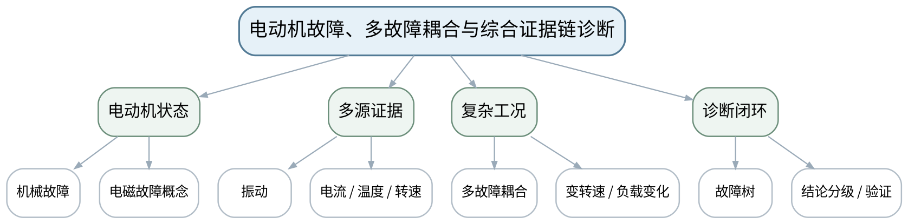 |
| 教学方法 | 讲授法、问答法、案例分析法、波形/频谱判读法、故障树推演法、Python演示法、方案评审法 |
| 教学用具 | 电脑、投影仪、多媒体课件、教材、教师提供振动/温度/电流/工况数据、故障树模板。 |
| 教学设计 | 课前任务→互动导入（10 min）→传授新知（70 min）→过关检测（10 min）→课堂小结（5 min）→作业布置（3 min）→考勤（2 min） |
| 参考文献 | [1] 张键, 汤赫男.《机械故障诊断技术（第3版）》[M]. 北京：机械工业出版社，2024。；[2] 汪永华, 贾芸.《机电设备故障诊断与维修（第3版）》[M]. 北京：机械工业出版社，2024。 |

#### 教学目标

**知识目标：**
（1）理解电动机常见机械/电磁故障与振动、电流等状态信息的关联概念。 （2）理解多故障耦合、变转速和负载变化会改变单一特征的可靠性。

**能力目标：**
（1）能够综合振动、转速、温度/电流等证据构建候选故障树。 （2）能够在新增证据或工况变化后修正诊断结论。

**价值目标：**
（1）形成不把复杂设备简化为“一个特征一个故障”、主动说明不确定性的审慎意识。

#### 课程思政

（1）通过误诊影响备件、停机窗口和生产安全的案例强调审慎诊断与责任边界。 （2）涉及设备检查、维修或复机的讨论，均强调停机、锁定挂牌、能量隔离、说明书和授权边界；Python/数据分析必须保留数据来源、参数和不确定性。

#### 专创融合

把故障树与多源证据表转化为智能诊断系统的解释模板，为下一单元数据驱动方法设置工程约束。

#### 教学重难点

**教学重点**：电动机多源诊断与多故障证据链。

**教学难点**：机械与电磁问题可能互相影响，多故障和变工况下固定阈值/固定频率模板容易失效。

#### 教学过程

| 教学步骤 | 主要教学内容 | 设计意图 |
|---|---|---|
| 课前任务 | 【教师】1. 发布教材范围、设备结构/信号材料和一个“先判断再分析”的问题； 2. 提醒Python数据演示只使用公开或教师提供数据，设备维护案例必须遵守停机、锁定挂牌、能量隔离和设备说明书； 【学生】1. 阅读材料并标出3个核心术语； 2. 写出一个预测结论及所需证据； 3. 带着疑问进入课堂。 | 通过课前预习与安全边界提醒建立先备认知，避免把设备维护和数据分析变成无依据试错。 |
| 互动导入（10 min） | 【教师】1. 复习与本课直接相关的上一课主线； 2. 给出“1X升高＋电流波动＋温升，但负载同时增加”的案例，要求学生判断哪些变化可能只是工况效应。 3. 追问“现象能证明什么、不能证明什么、还需补什么证据”。 【学生】先独立判断，再与同伴交换依据，明确本次课任务。 | 从故障现象和证据冲突切入，让学生先判断再学习机理，建立问题驱动的诊断思维。 |
| 传授新知（共70 min） | 一、电动机故障概念 【教师】从不平衡/轴承等机械问题与电磁不对称/供电异常等概念说明需要振动和电气多源信息。 【学生】完成对应波形/频谱/结构/参数/维护判断，先写预期，再对照教师案例或演示修正。 【课堂强化】每个诊断结论至少写一条支持证据和一条边界/不确定项。  二、耦合与工况 【教师】分析负载、转速、基础松动、轴承和电磁问题叠加时特征如何变化，强调趋势和对照工况。 【学生】完成对应波形/频谱/结构/参数/维护判断，先写预期，再对照教师案例或演示修正。 【课堂强化】每个诊断结论至少写一条支持证据和一条边界/不确定项。  三、综合故障树 【教师】学生完成“证据—候选故障—支持/反对证据—下一步验证—维护风险”表，并形成第4单元综合作业。 【学生】完成对应波形/频谱/结构/参数/维护判断，先写预期，再对照教师案例或演示修正。 【课堂强化】每个诊断结论至少写一条支持证据和一条边界/不确定项。  【形成产物】课程作业阶段4：典型旋转机械综合故障诊断报告。 【学习证据】结构参数、时域/频域/包络谱、多源状态、故障树、诊断结论等级与验证建议。 【评价映射】课程作业阶段4（课程作业内部30%）；目标1.4、2.4、3.4。 | 按“数据质量→特征→机理→工况→结论→维护/验证”展开，训练证据链而不是背故障口诀。 |
| 过关检测（10 min） | 【教师】布置课堂检测： 1. 为什么负载变化可能造成“像故障”的振动变化？ 2. 多源监测的价值是否等于传感器越多越好？ 3. 当证据冲突时诊断结论应如何表达？ 【学生】独立作答、同伴互查并标出证据； 【教师】按“数据质量—特征—机理—维护边界”分类点评。 | 即时暴露概念、频率、数据质量和结论边界错误，要求用证据修正。 |
| 课堂小结（5 min） | 【教师】1. 本次课解决的关键问题：电动机故障、多故障耦合与综合证据链诊断； 2. 重点主线：电动机多源诊断与多故障证据链。； 3. 最值得带走的方法：先验证数据，再把特征与机理/工况关联，最后形成分级结论； 4. 易错点：机械与电磁问题可能互相影响，多故障和变工况下固定阈值/固定频率模板容易失效。 【学生】写下“一条诊断规则＋一条不能越过的证据边界”。 | 回到知识脉络图压缩方法，形成可迁移的诊断流程和风险意识。 |
| 作业布置（3 min） | 【教师】1. 提交阶段作业4：完成一份轴承/齿轮/转子/电机综合案例诊断，明确“支持证据、反对证据、不确定项、验证步骤”。 【要求】不只写“是什么故障”，还要写测量条件、参数/结构依据、支持与反对证据、结论等级和下一步验证；数据与代码须说明来源。 【学生】按课程命名规范整理提交。 | 固化数据、图表、计算和维护证据，为阶段作业与期末综合方案积累可追溯素材。 |
| 考勤（2 min） | 【教师】利用学习通/课堂点名完成签到；不预填实际出勤事实。 【学生】按要求完成签到。 | 保留学校课堂管理环节，不预填实际出勤事实。 |

#### 教学反思

【课后填写，不预填事实】 1. 教学流程：记录本课100 min各环节实际用时和需要调整的位置； 2. 教学内容：重点记录“机械与电磁问题可能互相影响，多故障和变工况下固定阈值/固定频率模板容易失效。”的真实掌握证据与常见错误； 3. 学生参与：仅依据实际课堂记录填写波形/频谱判读、计算、讨论与证据表达情况； 4. 教学改进：依据真实课堂证据决定是否增加参数演示、故障对照、Python示例或维护决策练习。

### lesson-13

| 字段 | 内容 |
|---|---|
| 章节 | 第5单元 多源监测、智能故障诊断与状态评估 |
| 授课题目 | 多源状态监测、数据清洗与特征工程 |
| 周次 | 第7周（第13次课） |
| 课时安排 | 2课时（100 min）；类型：理论2 |
| 知识脉络图 | 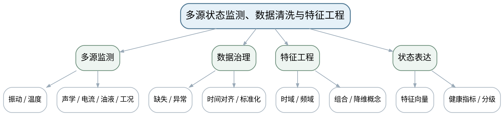 |
| 教学方法 | 讲授法、问答法、案例分析法、波形/频谱判读法、故障树推演法、Python演示法、方案评审法 |
| 教学用具 | 电脑、投影仪、多媒体课件、教材、教师提供多源状态数据、Python/pandas/scikit-learn演示。 |
| 教学设计 | 课前任务→互动导入（10 min）→传授新知（70 min）→过关检测（10 min）→课堂小结（5 min）→作业布置（3 min）→考勤（2 min） |
| 参考文献 | [1] 张键, 汤赫男.《机械故障诊断技术（第3版）》[M]. 北京：机械工业出版社，2024。 |

#### 教学目标

**知识目标：**
（1）理解振动、温度、声学、电流、油液与运行参数等多源状态数据的互补性。 （2）掌握数据清洗、标准化、时间对齐、特征工程与降维的基本概念。

**能力目标：**
（1）能够为一个故障诊断任务设计多源特征表，并说明每个特征的机理或统计意义。 （2）能够识别缺失、时钟不同步、量纲差异和工况混杂等数据风险。

**价值目标：**
（1）形成数据边界、来源和预处理参数可追溯意识。

#### 课程思政

（1）通过数据错位、缺失和选择性清洗造成误判案例强调真实记录与数据治理责任。 （2）涉及设备检查、维修或复机的讨论，均强调停机、锁定挂牌、能量隔离、说明书和授权边界；Python/数据分析必须保留数据来源、参数和不确定性。

#### 专创融合

把多源特征表做成可供规则诊断与机器学习共同使用的数据接口。

#### 教学重难点

**教学重点**：多源数据与特征工程。

**教学难点**：数据融合前必须解决时间、工况和量纲一致性，否则“更多数据”可能制造假相关。

#### 教学过程

| 教学步骤 | 主要教学内容 | 设计意图 |
|---|---|---|
| 课前任务 | 【教师】1. 发布教材范围、设备结构/信号材料和一个“先判断再分析”的问题； 2. 提醒Python数据演示只使用公开或教师提供数据，设备维护案例必须遵守停机、锁定挂牌、能量隔离和设备说明书； 【学生】1. 阅读材料并标出3个核心术语； 2. 写出一个预测结论及所需证据； 3. 带着疑问进入课堂。 | 通过课前预习与安全边界提醒建立先备认知，避免把设备维护和数据分析变成无依据试错。 |
| 互动导入（10 min） | 【教师】1. 复习与本课直接相关的上一课主线； 2. 展示振动与温度两路数据时间戳错位10分钟的趋势图，提问直接做相关分析会得到什么误导。 3. 追问“现象能证明什么、不能证明什么、还需补什么证据”。 【学生】先独立判断，再与同伴交换依据，明确本次课任务。 | 从故障现象和证据冲突切入，让学生先判断再学习机理，建立问题驱动的诊断思维。 |
| 传授新知（共70 min） | 一、多源监测 【教师】说明不同传感量对故障机理和时间尺度的覆盖差异，强调按任务选择而非堆传感器。 【学生】完成对应波形/频谱/结构/参数/维护判断，先写预期，再对照教师案例或演示修正。 【课堂强化】每个诊断结论至少写一条支持证据和一条边界/不确定项。  二、数据清洗 【教师】讲缺失、异常、标准化、时间对齐、工况标签，Python演示只用教师提供/公开数据。 【学生】完成对应波形/频谱/结构/参数/维护判断，先写预期，再对照教师案例或演示修正。 【课堂强化】每个诊断结论至少写一条支持证据和一条边界/不确定项。  三、特征工程 【教师】将RMS、峭度、频带能量、包络特征、温升、电流等组织为特征表，介绍降维只是数据表示工具。 【学生】完成对应波形/频谱/结构/参数/维护判断，先写预期，再对照教师案例或演示修正。 【课堂强化】每个诊断结论至少写一条支持证据和一条边界/不确定项。  【形成产物】多源状态数据字典＋特征工程表。 【学习证据】传感量、时间戳/工况、预处理、特征、物理/统计意义、数据质量标记。 【评价映射】平时成绩；目标1.5、2.5、3.5。 | 按“数据质量→特征→机理→工况→结论→维护/验证”展开，训练证据链而不是背故障口诀。 |
| 过关检测（10 min） | 【教师】布置课堂检测： 1. 多源监测为什么必须做时间对齐？ 2. 标准化解决什么问题，不解决什么问题？ 3. 特征工程为什么最好保留机理解释？ 【学生】独立作答、同伴互查并标出证据； 【教师】按“数据质量—特征—机理—维护边界”分类点评。 | 即时暴露概念、频率、数据质量和结论边界错误，要求用证据修正。 |
| 课堂小结（5 min） | 【教师】1. 本次课解决的关键问题：多源状态监测、数据清洗与特征工程； 2. 重点主线：多源数据与特征工程。； 3. 最值得带走的方法：先验证数据，再把特征与机理/工况关联，最后形成分级结论； 4. 易错点：数据融合前必须解决时间、工况和量纲一致性，否则“更多数据”可能制造假相关。 【学生】写下“一条诊断规则＋一条不能越过的证据边界”。 | 回到知识脉络图压缩方法，形成可迁移的诊断流程和风险意识。 |
| 作业布置（3 min） | 【教师】1. 为综合诊断任务设计不少于10个特征，并标注来源、预处理和解释。 【要求】不只写“是什么故障”，还要写测量条件、参数/结构依据、支持与反对证据、结论等级和下一步验证；数据与代码须说明来源。 【学生】按课程命名规范整理提交。 | 固化数据、图表、计算和维护证据，为阶段作业与期末综合方案积累可追溯素材。 |
| 考勤（2 min） | 【教师】利用学习通/课堂点名完成签到；不预填实际出勤事实。 【学生】按要求完成签到。 | 保留学校课堂管理环节，不预填实际出勤事实。 |

#### 教学反思

【课后填写，不预填事实】 1. 教学流程：记录本课100 min各环节实际用时和需要调整的位置； 2. 教学内容：重点记录“数据融合前必须解决时间、工况和量纲一致性，否则“更多数据”可能制造假相关。”的真实掌握证据与常见错误； 3. 学生参与：仅依据实际课堂记录填写波形/频谱判读、计算、讨论与证据表达情况； 4. 教学改进：依据真实课堂证据决定是否增加参数演示、故障对照、Python示例或维护决策练习。

### lesson-14

| 字段 | 内容 |
|---|---|
| 章节 | 第5单元 多源监测、智能故障诊断与状态评估 |
| 授课题目 | 分类、异常检测、聚类与模型验证边界 |
| 周次 | 第7周（第14次课） |
| 课时安排 | 2课时（100 min）；类型：理论2 |
| 知识脉络图 | 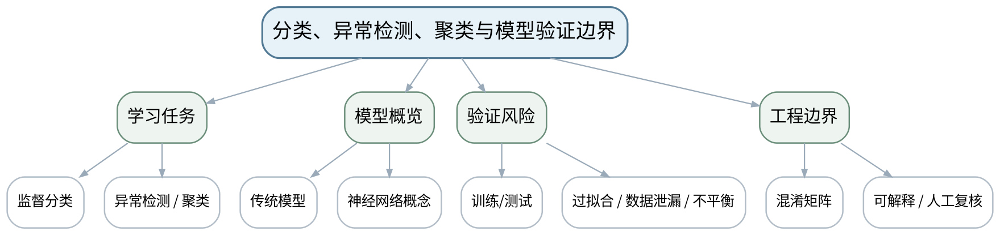 |
| 教学方法 | 讲授法、问答法、案例分析法、波形/频谱判读法、故障树推演法、Python演示法、方案评审法 |
| 教学用具 | 电脑、投影仪、多媒体课件、教材、教师提供数据与混淆矩阵、Python/scikit-learn演示。 |
| 教学设计 | 课前任务→互动导入（10 min）→传授新知（70 min）→过关检测（10 min）→课堂小结（5 min）→作业布置（3 min）→考勤（2 min） |
| 参考文献 | [1] 张键, 汤赫男.《机械故障诊断技术（第3版）》[M]. 北京：机械工业出版社，2024。 |

#### 教学目标

**知识目标：**
（1）理解监督分类、异常检测、聚类和神经网络在故障诊断中的基本作用。 （2）掌握训练集/测试集、过拟合、数据泄漏、类别不平衡、混淆矩阵和可解释性基本概念。

**能力目标：**
（1）能够从数据量、标签质量、故障稀有性和可解释性选择基本智能诊断思路。 （2）能够阅读混淆矩阵，区分误报和漏报对维护决策的不同风险。

**价值目标：**
（1）形成AI结果必须工程验证、不能替代安全责任主体的意识。

#### 课程思政

（1）通过AI误报/漏报案例强调模型只是证据来源之一，最终安全责任不能转移给算法。 （2）涉及设备检查、维修或复机的讨论，均强调停机、锁定挂牌、能量隔离、说明书和授权边界；Python/数据分析必须保留数据来源、参数和不确定性。

#### 专创融合

将模型验证清单作为智能诊断产品上线门禁，连接到可解释维护决策。

#### 教学重难点

**教学重点**：智能诊断任务选择与模型验证边界。

**教学难点**：随机划分不一定合理；同一设备/同一工况泄漏到训练与测试会导致虚高性能。

#### 教学过程

| 教学步骤 | 主要教学内容 | 设计意图 |
|---|---|---|
| 课前任务 | 【教师】1. 发布教材范围、设备结构/信号材料和一个“先判断再分析”的问题； 2. 提醒Python数据演示只使用公开或教师提供数据，设备维护案例必须遵守停机、锁定挂牌、能量隔离和设备说明书； 【学生】1. 阅读材料并标出3个核心术语； 2. 写出一个预测结论及所需证据； 3. 带着疑问进入课堂。 | 通过课前预习与安全边界提醒建立先备认知，避免把设备维护和数据分析变成无依据试错。 |
| 互动导入（10 min） | 【教师】1. 复习与本课直接相关的上一课主线； 2. 展示“99%准确率”的轴承模型，但训练集和测试集来自同一段信号切片，追问这个准确率是否可信。 3. 追问“现象能证明什么、不能证明什么、还需补什么证据”。 【学生】先独立判断，再与同伴交换依据，明确本次课任务。 | 从故障现象和证据冲突切入，让学生先判断再学习机理，建立问题驱动的诊断思维。 |
| 传授新知（共70 min） | 一、任务选择 【教师】比较有标签分类、无标签聚类、正常样本为主的异常检测等任务条件，强调模型不是先于问题选择。 【学生】完成对应波形/频谱/结构/参数/维护判断，先写预期，再对照教师案例或演示修正。 【课堂强化】每个诊断结论至少写一条支持证据和一条边界/不确定项。  二、验证风险 【教师】解释过拟合、数据泄漏、设备/工况域差异、类别不平衡，演示按设备/工况划分与随机切片的性能差异。 【学生】完成对应波形/频谱/结构/参数/维护判断，先写预期，再对照教师案例或演示修正。 【课堂强化】每个诊断结论至少写一条支持证据和一条边界/不确定项。  三、工程评价 【教师】阅读混淆矩阵，讨论漏报/误报成本；要求模型结论回到机理、原始信号和人工复核。 【学生】完成对应波形/频谱/结构/参数/维护判断，先写预期，再对照教师案例或演示修正。 【课堂强化】每个诊断结论至少写一条支持证据和一条边界/不确定项。  【形成产物】课程作业阶段5：智能诊断方案与验证边界评审。 【学习证据】任务定义、数据划分、特征/模型、混淆矩阵或评价指标、泄漏检查、人工复核规则。 【评价映射】课程作业阶段5（课程作业内部10%）；目标1.5、2.5、3.5。 | 按“数据质量→特征→机理→工况→结论→维护/验证”展开，训练证据链而不是背故障口诀。 |
| 过关检测（10 min） | 【教师】布置课堂检测： 1. 训练准确率高为什么不能证明工程有效？ 2. 设备级数据泄漏可能如何发生？ 3. 故障漏报和误报哪一个更严重，能否脱离场景回答？ 【学生】独立作答、同伴互查并标出证据； 【教师】按“数据质量—特征—机理—维护边界”分类点评。 | 即时暴露概念、频率、数据质量和结论边界错误，要求用证据修正。 |
| 课堂小结（5 min） | 【教师】1. 本次课解决的关键问题：分类、异常检测、聚类与模型验证边界； 2. 重点主线：智能诊断任务选择与模型验证边界。； 3. 最值得带走的方法：先验证数据，再把特征与机理/工况关联，最后形成分级结论； 4. 易错点：随机划分不一定合理；同一设备/同一工况泄漏到训练与测试会导致虚高性能。 【学生】写下“一条诊断规则＋一条不能越过的证据边界”。 | 回到知识脉络图压缩方法，形成可迁移的诊断流程和风险意识。 |
| 作业布置（3 min） | 【教师】1. 提交阶段作业5：基于教师数据设计分类或异常检测流程，重点写数据划分、泄漏防止和人工复核。 【要求】不只写“是什么故障”，还要写测量条件、参数/结构依据、支持与反对证据、结论等级和下一步验证；数据与代码须说明来源。 【学生】按课程命名规范整理提交。 | 固化数据、图表、计算和维护证据，为阶段作业与期末综合方案积累可追溯素材。 |
| 考勤（2 min） | 【教师】利用学习通/课堂点名完成签到；不预填实际出勤事实。 【学生】按要求完成签到。 | 保留学校课堂管理环节，不预填实际出勤事实。 |

#### 教学反思

【课后填写，不预填事实】 1. 教学流程：记录本课100 min各环节实际用时和需要调整的位置； 2. 教学内容：重点记录“随机划分不一定合理；同一设备/同一工况泄漏到训练与测试会导致虚高性能。”的真实掌握证据与常见错误； 3. 学生参与：仅依据实际课堂记录填写波形/频谱判读、计算、讨论与证据表达情况； 4. 教学改进：依据真实课堂证据决定是否增加参数演示、故障对照、Python示例或维护决策练习。

### lesson-15

| 字段 | 内容 |
|---|---|
| 章节 | 第6单元 趋势预测、维护决策与设备全寿命管理 |
| 授课题目 | 状态趋势、报警阈值、健康分级与剩余寿命概念 |
| 周次 | 第8周（第15次课） |
| 课时安排 | 2课时（100 min）；类型：理论2 |
| 知识脉络图 | 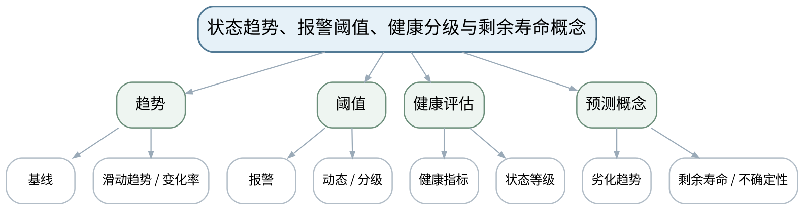 |
| 教学方法 | 讲授法、问答法、案例分析法、波形/频谱判读法、故障树推演法、Python演示法、方案评审法 |
| 教学用具 | 电脑、投影仪、多媒体课件、教材、状态趋势案例、健康分级与维护决策模板。 |
| 教学设计 | 课前任务→互动导入（10 min）→传授新知（70 min）→过关检测（10 min）→课堂小结（5 min）→作业布置（3 min）→考勤（2 min） |
| 参考文献 | [1] 张键, 汤赫男.《机械故障诊断技术（第3版）》[M]. 北京：机械工业出版社，2024。；[2] 汪永华, 贾芸.《机电设备故障诊断与维修（第3版）》[M]. 北京：机械工业出版社，2024。 |

#### 教学目标

**知识目标：**
（1）掌握状态趋势、报警阈值、健康指标与健康分级的基本方法。 （2）理解劣化趋势与剩余寿命预测的概念及不确定性。

**能力目标：**
（1）能够根据基线、趋势速度和故障证据设计多级报警逻辑。 （2）能够区分“趋势预警”和“精确寿命预测”，避免给出超出证据的寿命承诺。

**价值目标：**
（1）形成趋势优先、风险分级和持续复核意识。

#### 课程思政

（1）通过带病运行、过度报警和过度维修案例讨论安全、资源节约和维护经济性。 （2）涉及设备检查、维修或复机的讨论，均强调停机、锁定挂牌、能量隔离、说明书和授权边界；Python/数据分析必须保留数据来源、参数和不确定性。

#### 专创融合

将健康等级与报警规则设计为设备运维看板和MES维护工单的触发逻辑。

#### 教学重难点

**教学重点**：趋势、阈值和健康分级。

**教学难点**：固定阈值可能忽略设备个体与工况差异；剩余寿命预测必须说明模型与不确定性。

#### 教学过程

| 教学步骤 | 主要教学内容 | 设计意图 |
|---|---|---|
| 课前任务 | 【教师】1. 发布教材范围、设备结构/信号材料和一个“先判断再分析”的问题； 2. 提醒Python数据演示只使用公开或教师提供数据，设备维护案例必须遵守停机、锁定挂牌、能量隔离和设备说明书； 【学生】1. 阅读材料并标出3个核心术语； 2. 写出一个预测结论及所需证据； 3. 带着疑问进入课堂。 | 通过课前预习与安全边界提醒建立先备认知，避免把设备维护和数据分析变成无依据试错。 |
| 互动导入（10 min） | 【教师】1. 复习与本课直接相关的上一课主线； 2. 展示两台同型号设备：一台长期高但稳定，一台数值不高却快速上升，追问哪个更值得优先检查。 3. 追问“现象能证明什么、不能证明什么、还需补什么证据”。 【学生】先独立判断，再与同伴交换依据，明确本次课任务。 | 从故障现象和证据冲突切入，让学生先判断再学习机理，建立问题驱动的诊断思维。 |
| 传授新知（共70 min） | 一、基线与趋势 【教师】用历史基线、移动趋势、变化率解释绝对值与趋势共同判断状态。 【学生】完成对应波形/频谱/结构/参数/维护判断，先写预期，再对照教师案例或演示修正。 【课堂强化】每个诊断结论至少写一条支持证据和一条边界/不确定项。  二、阈值与分级 【教师】比较单阈值、多级报警和结合工况/基线的动态阈值思想，强调阈值来源要可解释。 【学生】完成对应波形/频谱/结构/参数/维护判断，先写预期，再对照教师案例或演示修正。 【课堂强化】每个诊断结论至少写一条支持证据和一条边界/不确定项。  三、RUL概念 【教师】介绍劣化趋势与剩余寿命概念，说明预测只在数据与模型适用条件内成立；学生为案例制定报警与复核规则。 【学生】完成对应波形/频谱/结构/参数/维护判断，先写预期，再对照教师案例或演示修正。 【课堂强化】每个诊断结论至少写一条支持证据和一条边界/不确定项。  【形成产物】设备健康趋势卡＋多级报警与复核规则。 【学习证据】趋势图、基线、阈值来源、状态等级、复核条件、不确定性。 【评价映射】平时成绩；目标1.6、2.6、3.6。 | 按“数据质量→特征→机理→工况→结论→维护/验证”展开，训练证据链而不是背故障口诀。 |
| 过关检测（10 min） | 【教师】布置课堂检测： 1. 绝对值未超限但趋势快速恶化是否需要关注？ 2. 阈值为何不应只来自单次样本？ 3. 剩余寿命预测为什么必须给出适用条件和不确定性？ 【学生】独立作答、同伴互查并标出证据； 【教师】按“数据质量—特征—机理—维护边界”分类点评。 | 即时暴露概念、频率、数据质量和结论边界错误，要求用证据修正。 |
| 课堂小结（5 min） | 【教师】1. 本次课解决的关键问题：状态趋势、报警阈值、健康分级与剩余寿命概念； 2. 重点主线：趋势、阈值和健康分级。； 3. 最值得带走的方法：先验证数据，再把特征与机理/工况关联，最后形成分级结论； 4. 易错点：固定阈值可能忽略设备个体与工况差异；剩余寿命预测必须说明模型与不确定性。 【学生】写下“一条诊断规则＋一条不能越过的证据边界”。 | 回到知识脉络图压缩方法，形成可迁移的诊断流程和风险意识。 |
| 作业布置（3 min） | 【教师】1. 为一台关键设备设计三级状态/报警规则，并写出每一级的复核和维护动作。 【要求】不只写“是什么故障”，还要写测量条件、参数/结构依据、支持与反对证据、结论等级和下一步验证；数据与代码须说明来源。 【学生】按课程命名规范整理提交。 | 固化数据、图表、计算和维护证据，为阶段作业与期末综合方案积累可追溯素材。 |
| 考勤（2 min） | 【教师】利用学习通/课堂点名完成签到；不预填实际出勤事实。 【学生】按要求完成签到。 | 保留学校课堂管理环节，不预填实际出勤事实。 |

#### 教学反思

【课后填写，不预填事实】 1. 教学流程：记录本课100 min各环节实际用时和需要调整的位置； 2. 教学内容：重点记录“固定阈值可能忽略设备个体与工况差异；剩余寿命预测必须说明模型与不确定性。”的真实掌握证据与常见错误； 3. 学生参与：仅依据实际课堂记录填写波形/频谱判读、计算、讨论与证据表达情况； 4. 教学改进：依据真实课堂证据决定是否增加参数演示、故障对照、Python示例或维护决策练习。

### lesson-16

| 字段 | 内容 |
|---|---|
| 章节 | 第6单元 趋势预测、维护决策与设备全寿命管理 |
| 授课题目 | 维护决策、复机验证与综合诊断维护方案 |
| 周次 | 第8周（第16次课） |
| 课时安排 | 2课时（100 min）；类型：理论2 |
| 知识脉络图 | 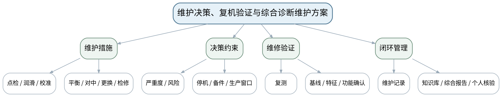 |
| 教学方法 | 讲授法、问答法、案例分析法、波形/频谱判读法、故障树推演法、Python演示法、方案评审法 |
| 教学用具 | 电脑、投影仪、多媒体课件、教材、综合案例数据、维护决策矩阵、复机验证清单。 |
| 教学设计 | 课前任务→互动导入（10 min）→传授新知（70 min）→过关检测（10 min）→课堂小结（5 min）→作业布置（3 min）→考勤（2 min） |
| 参考文献 | [1] 张键, 汤赫男.《机械故障诊断技术（第3版）》[M]. 北京：机械工业出版社，2024。；[2] 汪永华, 贾芸.《机电设备故障诊断与维修（第3版）》[M]. 北京：机械工业出版社，2024。；[4] 石秀敏.《数控机床故障诊断与维修（第2版）》[M]. 北京：机械工业出版社，2024。 |

#### 教学目标

**知识目标：**
（1）掌握维护优先级、常见维护措施、停机窗口、备件和维修后验证基本方法。 （2）理解设备全寿命管理和诊断—维护—复测闭环。

**能力目标：**
（1）能够根据故障证据、风险、趋势和生产约束形成维护措施与验证清单。 （2）能够独立解释综合方案中的监测点、特征、阈值、诊断依据、风险等级、维护措施和复机验证。

**价值目标：**
（1）形成安全生产、资源节约、持续学习和对本人诊断结论负责的职业素养。

#### 课程思政

（1）通过无验证复机、过度维修和隐瞒不确定性案例强调安全生产、诚信记录和全寿命责任。 （2）涉及设备检查、维修或复机的讨论，均强调停机、锁定挂牌、能量隔离、说明书和授权边界；Python/数据分析必须保留数据来源、参数和不确定性。

#### 专创融合

将课程综合方案组织为可用于设备健康管理、维护工单和知识库闭环的工程文档包。

#### 教学重难点

**教学重点**：维护决策与维修后验证闭环。

**教学难点**：维护动作不是诊断终点；没有复测和功能验证的“修好”不可作为闭环证据。

#### 教学过程

| 教学步骤 | 主要教学内容 | 设计意图 |
|---|---|---|
| 课前任务 | 【教师】1. 发布教材范围、设备结构/信号材料和一个“先判断再分析”的问题； 2. 提醒Python数据演示只使用公开或教师提供数据，设备维护案例必须遵守停机、锁定挂牌、能量隔离和设备说明书； 【学生】1. 阅读材料并标出3个核心术语； 2. 写出一个预测结论及所需证据； 3. 带着疑问进入课堂。 | 通过课前预习与安全边界提醒建立先备认知，避免把设备维护和数据分析变成无依据试错。 |
| 互动导入（10 min） | 【教师】1. 复习与本课直接相关的上一课主线； 2. 给出“更换轴承后设备能运行，但振动仍高于基线”的复机场景，提问是否可以关闭故障工单。 3. 追问“现象能证明什么、不能证明什么、还需补什么证据”。 【学生】先独立判断，再与同伴交换依据，明确本次课任务。 | 从故障现象和证据冲突切入，让学生先判断再学习机理，建立问题驱动的诊断思维。 |
| 传授新知（共70 min） | 一、维护决策 【教师】按严重度、风险、停机窗口、备件和生产影响比较点检、润滑、平衡、对中、更换与计划检修。 【学生】完成对应波形/频谱/结构/参数/维护判断，先写预期，再对照教师案例或演示修正。 【课堂强化】每个诊断结论至少写一条支持证据和一条边界/不确定项。  二、复机验证 【教师】建立维修前/后同工况复测、关键特征恢复、功能/安全确认和异常遗留项清单。 【学生】完成对应波形/频谱/结构/参数/维护判断，先写预期，再对照教师案例或演示修正。 【课堂强化】每个诊断结论至少写一条支持证据和一条边界/不确定项。  三、综合方案评审 【教师】按监测点→数据质量→特征→故障证据→风险→维护→复测→记录构成期末综合方案，并准备个人核验/答辩。 【学生】完成对应波形/频谱/结构/参数/维护判断，先写预期，再对照教师案例或演示修正。 【课堂强化】每个诊断结论至少写一条支持证据和一条边界/不确定项。  【形成产物】课程作业阶段6＋期末诊断与维护综合方案包。 【学习证据】设备信息、测点/采集、时频/包络特征、故障证据链、风险等级、维护决策、复机验证、资料来源和个人贡献。 【评价映射】课程作业阶段6（课程作业内部15%）＋期末考核（总评60%）；目标1.6、2.6、3.6及全部课程目标。 | 按“数据质量→特征→机理→工况→结论→维护/验证”展开，训练证据链而不是背故障口诀。 |
| 过关检测（10 min） | 【教师】布置课堂检测： 1. 维修完成后为什么必须在可比工况下复测？ 2. 维护优先级至少受哪些因素影响？ 3. 综合诊断方案为什么必须说明不确定性和个人核验？ 【学生】独立作答、同伴互查并标出证据； 【教师】按“数据质量—特征—机理—维护边界”分类点评。 | 即时暴露概念、频率、数据质量和结论边界错误，要求用证据修正。 |
| 课堂小结（5 min） | 【教师】1. 本次课解决的关键问题：维护决策、复机验证与综合诊断维护方案； 2. 重点主线：维护决策与维修后验证闭环。； 3. 最值得带走的方法：先验证数据，再把特征与机理/工况关联，最后形成分级结论； 4. 易错点：维护动作不是诊断终点；没有复测和功能验证的“修好”不可作为闭环证据。 【学生】写下“一条诊断规则＋一条不能越过的证据边界”。 | 回到知识脉络图压缩方法，形成可迁移的诊断流程和风险意识。 |
| 作业布置（3 min） | 【教师】1. 完成期末诊断与维护综合方案报告，并准备个人核验：故障机理、频率/特征、工况、诊断修正、维护决策、复机验证和资料依据。 【要求】不只写“是什么故障”，还要写测量条件、参数/结构依据、支持与反对证据、结论等级和下一步验证；数据与代码须说明来源。 【学生】按课程命名规范整理提交。 | 固化数据、图表、计算和维护证据，为阶段作业与期末综合方案积累可追溯素材。 |
| 考勤（2 min） | 【教师】利用学习通/课堂点名完成签到；不预填实际出勤事实。 【学生】按要求完成签到。 | 保留学校课堂管理环节，不预填实际出勤事实。 |

#### 教学反思

【课后填写，不预填事实】 1. 教学流程：记录本课100 min各环节实际用时和需要调整的位置； 2. 教学内容：重点记录“维护动作不是诊断终点；没有复测和功能验证的“修好”不可作为闭环证据。”的真实掌握证据与常见错误； 3. 学生参与：仅依据实际课堂记录填写波形/频谱判读、计算、讨论与证据表达情况； 4. 教学改进：依据真实课堂证据决定是否增加参数演示、故障对照、Python示例或维护决策练习。
