# 《物联网技术基础》教学设计（16次课）

> **Canonical source / 内容权威源**：本 Markdown 与 `images/`、`manifest.json` 共同构成教案语义主源。Word 仅由本源包编译，负责学校格式呈现。

## 课程基本信息
- **课程名称**：物联网技术基础
- **课程英文名称**：Fundamentals of Internet of Things Technology
- **课程代码**：25JD32414
- **课程类别**：专业类
- **课程性质**：选修课
- **授课学期**：第5学期
- **学分**：2
- **总学时**：32（理论32，无独立实验/上机学时）
- **适用专业**：智能制造工程
- **授课学院**：机械与动力工程学院
- **先修课程**：电工电子技术（A）、程序设计基础（C&C++）Ⅱ、工程建模与科学计算可视化基础（Python）、微机原理及接口技术
- **后续课程**：工业网络技术及应用、智能制造装备、智能生产计划管理（MES/ERP）、毕业设计（论文）
- **选用教材**：桂小林.《物联网技术导论（第3版）》[M]. 北京：清华大学出版社，2024. ISBN 9787302660507
- **课程评价**：最终成绩100%=平时成绩20%＋课程作业20%＋期末考核60%
- **期末考核**：考查课；期末考核为“智能制造物联网系统方案”综合考查，采用方案成果、汇报答辩与个人核验，不另设笔试或机考。
- **内容依据**：2025版目录现行课程教学大纲（大纲更新时间：2026年9月）

## 课程总体设计
课程以“体系结构—感知识别—连接组网—应用协议/边缘平台—工业集成—安全治理”为知识主线，共16次课×2课时=32理论学时。由于培养方案规定本课程32学时均为理论学时，不另设实验或上机章节；课堂中的Wireshark报文、MQTT客户端/代理、Node-RED或等价平台、Python设备模拟器等仅作为教师演示和短时分析工具。每次课仍要求形成可检查的架构图、技术选型矩阵、数据字典、主题/接口表、时序图或风险清单，使“理论课”具备可验证学习证据，但不虚构实践学时。

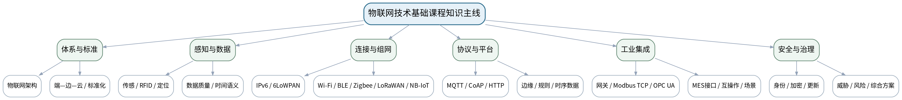

### 课次总览
| 次数 | 单元 | 授课题目 | 主要评价 |
|---:|---|---|---|
| 1 | 第一单元 物联网概念、体系结构与标准化 | 物联网概念、三层/四层体系与端—边—云架构 | 平时成绩＋课程作业（第一单元15%内部份额）＋期末考核 |
| 2 | 第一单元 物联网概念、体系结构与标准化 | 物联网、互联网、工业互联网与CPS：边界、标准与系统评价 | 平时成绩＋课程作业（第一单元15%内部份额）＋期末考核 |
| 3 | 第二单元 感知、识别与设备数据 | 传感器、执行器、采样与设备数据字段 | 平时成绩＋课程作业（第二单元20%内部份额）＋期末考核 |
| 4 | 第二单元 感知、识别与设备数据 | RFID/EPC、二维码、定位与无线传感器网络 | 平时成绩＋课程作业（第二单元20%内部份额）＋期末考核 |
| 5 | 第二单元 感知、识别与设备数据 | 时间戳、缺失/异常、数据质量与感知方案评审 | 平时成绩＋课程作业（第二单元20%内部份额）＋期末考核 |
| 6 | 第三单元 连接技术、网络与组网 | TCP/IP、IPv6、6LoWPAN、寻址、拓扑与网关 | 平时成绩＋课程作业（第三单元20%内部份额）＋期末考核 |
| 7 | 第三单元 连接技术、网络与组网 | Wi-Fi、BLE、Zigbee/Thread：短距连接与组网权衡 | 平时成绩＋课程作业（第三单元20%内部份额）＋期末考核 |
| 8 | 第三单元 连接技术、网络与组网 | LoRaWAN、NB-IoT/蜂窝物联与混合组网方案 | 平时成绩＋课程作业（第三单元20%内部份额）＋期末考核 |
| 9 | 第四单元 应用协议、边缘计算与物联网平台 | MQTT发布/订阅、主题树、QoS与离线重连 | 平时成绩＋课程作业（第四单元20%内部份额）＋期末考核 |
| 10 | 第四单元 应用协议、边缘计算与物联网平台 | CoAP、HTTP/REST、JSON与设备模型/资源接口 | 平时成绩＋课程作业（第四单元20%内部份额）＋期末考核 |
| 11 | 第四单元 应用协议、边缘计算与物联网平台 | 边缘网关、缓存/过滤/聚合、云平台与规则告警 | 平时成绩＋课程作业（第四单元20%内部份额）＋期末考核 |
| 12 | 第五单元 工业物联网与智能制造集成 | 工业网关、Modbus TCP、OPC UA与协议转换 | 平时成绩＋课程作业（第五单元15%内部份额）＋期末考核 |
| 13 | 第五单元 工业物联网与智能制造集成 | 设备状态、能耗、追溯、仓储与预测维护的端到端场景 | 平时成绩＋课程作业（第五单元15%内部份额）＋期末考核 |
| 14 | 第五单元 工业物联网与智能制造集成 | MES/平台接口、时间与语义一致性、互操作和故障隔离 | 平时成绩＋课程作业（第五单元15%内部份额）＋期末考核 |
| 15 | 第六单元 物联网安全、治理与综合方案 | 物联网资产、身份、访问、加密、固件与网络分区 | 平时成绩＋课程作业（第六单元10%内部份额）＋期末考核 |
| 16 | 第六单元 物联网安全、治理与综合方案 | 威胁建模、隐私/日志/运维与智能制造物联网综合方案评审 | 课程作业（第六单元10%内部份额）＋期末综合考核60% |

## 第1次课 物联网概念、三层/四层体系与端—边—云架构

### 课次信息
- **章节/单元**：第一单元 物联网概念、体系结构与标准化
- **周次**：按实际课表填写
- **课时安排**：2课时（100 min）
- **课型**：理论

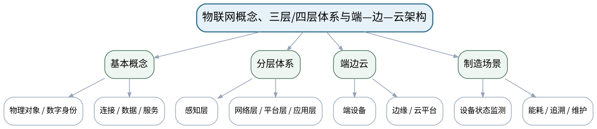

### 教学目标
**知识目标：**
1. 理解物联网的概念、发展与三层/四层体系结构。
2. 理解感知层、网络层、平台/处理层、应用层以及端—边—云协同的基本职责。

**能力目标：**
1. 能够从智能制造案例中识别物理对象、设备、网络、边缘、平台与应用角色。
2. 能够绘制基础物联网架构图与数据流。

**价值目标：**
1. 形成从物理对象到数字服务的系统工程观和标准化意识。

### 课程思政
结合我国物联网产业、工业数字化和标准建设，强调核心技术学习、标准意识和服务制造强国的责任感。

### 专创融合
把架构图作为物联网产品的最小系统蓝图，训练从业务需求到技术结构的转化能力。

### 教学重难点
**教学重点：**物联网概念与分层架构；端—边—云角色。

**教学难点：**避免把物联网简单理解为“传感器+互联网”，建立端到端系统边界。

### 教学方法与用具
**教学方法：**体系讲授、协议图解、案例分析、方案评审、数据/报文演示、分组讨论、短时设计练习

**教学用具：**电脑、投影仪、体系结构图、智能制造物联网案例。

### 教学设计
课前任务 → 互动导入（10 min）→ 传授新知与课堂训练（75 min）→ 过关检测（10 min）→ 课堂小结（3 min）→ 作业布置（1 min）→ 考勤（1 min）

### 课前任务
【教师】发布“物联网概念、三层/四层体系与端—边—云架构”对应大纲/教材范围、一个制造物联网案例或协议/数据片段，不提前给出完整方案。

1. 阅读对应大纲与教材内容；
2. 圈出3个关键术语并记录至少1个疑问；
3. 预读一张架构/协议/数据图，写出自己的第一判断和一个可能的故障/风险点。

【学生】完成准备并带着“判断—依据—疑问”进入课堂。

### 互动导入
【教师】展示“机床振动传感器→网关→平台→维护告警”的完整数据流，要求学生指出哪些环节只是采集、哪些环节真正形成服务。

【学生】先独立判断，再与同伴交换依据；教师收集典型分歧后进入本课。

### 传授新知与课堂训练
**一、核心概念与协议/架构图解（约30 min）—概念与体系**

【教师】从物理对象、数字身份、网络连接和服务讲物联网基本概念，对比三层、四层和端—边—云表达。

【学生】完成对应架构图、选型表、主题/接口设计、数据字典或风险分析，先给出判断依据，再用教师演示/资料进行复核。

**二、学生方案/接口/数据练习（约25 min）—制造数据流**

【教师】以设备状态监测、能耗和追溯案例拆解端、边、网、云、应用职责，明确每层输入输出。

【学生】完成对应架构图、选型表、主题/接口设计、数据字典或风险分析，先给出判断依据，再用教师演示/资料进行复核。

**三、对比、故障与方案复盘（约20 min）—架构练习**

【教师】学生为“车间设备状态监测”绘制最小架构图，并标注数据从传感器到告警的方向、接口与关键约束。

【学生】完成对应架构图、选型表、主题/接口设计、数据字典或风险分析，先给出判断依据，再用教师演示/资料进行复核。

**独立学习产物**：一张“设备状态监测”端—边—网—云架构图＋数据流说明。

**学习证据**：架构图、角色/接口表、数据流方向、同伴审查修改记录。

**评价映射**：平时成绩＋课程作业（第一单元15%内部份额）＋期末考核；目标1.1、2.1、3.1。

### 过关检测
【教师】组织当堂检测：

1. 物联网与普通互联网连接的对象范围有何不同？
2. 端、边、云各自适合承担什么职责？
3. 架构图中为什么要显式画出数据流方向？

【学生】独立作答/分析；【教师】按错误类型讲解，要求说明架构、协议、数据或安全依据。

### 课堂小结
【教师】回到本课知识脉络图，用“对象—数据—连接—接口—服务—边界”总结“物联网概念、三层/四层体系与端—边—云架构”，再次强调教学重点：物联网概念与分层架构；端—边—云角色。

【学生】写下“本课最重要的一条工程选择规则 + 一个最容易忽略的边界”。

### 作业布置
【教师】布置课后任务：选择一个智能制造场景，补全“对象—数据—网络—平台—应用”五栏表。

【学生】按课程模板整理图表、技术依据和版本/来源，形成可评审方案证据。

### 考勤
【教师】利用学校/课程实际使用的平台进行签到。

【学生】按课程要求完成签到。

### 课后教学反思
【课后填写，不预填事实】

1. 教学流程：记录100 min各环节实际用时及需要调整的位置；
2. 教学内容：重点记录“避免把物联网简单理解为“传感器+互联网”，建立端到端系统边界。”的真实掌握证据和常见误区；
3. 学生参与：仅依据实际课堂记录填写架构图、协议分析、选型讨论和方案互审情况，不补写推测；
4. 评价证据：检查本课产物、技术依据、引用/版本和风险说明是否完整；
5. 后续改进：依据真实课堂证据决定下一次课的补救或拓展。

### 本章节参考文献
[1] 桂小林.《物联网技术导论（第3版）》[M]. 清华大学出版社，2024。
[2] 韩毅刚, 肖纯贤.《物联网概论（第3版）》[M]. 机械工业出版社，2024。

## 第2次课 物联网、互联网、工业互联网与CPS：边界、标准与系统评价

### 课次信息
- **章节/单元**：第一单元 物联网概念、体系结构与标准化
- **周次**：按实际课表填写
- **课时安排**：2课时（100 min）
- **课型**：理论

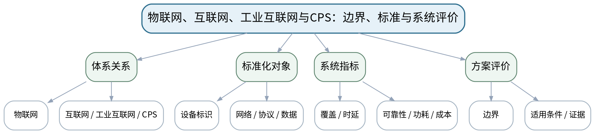

### 教学目标
**知识目标：**
1. 理解物联网、互联网、工业互联网和CPS之间的联系与区别。
2. 理解标准化对象、关键性能指标和系统边界。

**能力目标：**
1. 能够用统一维度比较不同体系并解释某制造案例为何属于物联网/工业互联网/CPS中的一种或多种。
2. 能够为物联网方案列出覆盖、时延、可靠性、功耗、成本等初步评价指标。

**价值目标：**
1. 形成不追逐技术名词、基于对象和系统边界进行理性判断的习惯。

### 课程思政
强调标准、接口和工程评价是跨组织协作基础，避免用品牌或热点替代事实和标准。

### 专创融合
将统一评价维度转化为技术选型评分卡，为后续连接协议和平台方案提供决策工具。

### 教学重难点
**教学重点：**相关体系边界；标准化与评价指标。

**教学难点：**同一系统可能同时具有多种体系属性，不能靠名词判断，需从对象、控制闭环与服务范围分析。

### 教学方法与用具
**教学方法：**体系讲授、协议图解、案例分析、方案评审、数据/报文演示、分组讨论、短时设计练习

**教学用具：**电脑、投影仪、体系对比图、标准/接口案例。

### 教学设计
课前任务 → 互动导入（10 min）→ 传授新知与课堂训练（75 min）→ 过关检测（10 min）→ 课堂小结（3 min）→ 作业布置（1 min）→ 考勤（1 min）

### 课前任务
【教师】发布“物联网、互联网、工业互联网与CPS：边界、标准与系统评价”对应大纲/教材范围、一个制造物联网案例或协议/数据片段，不提前给出完整方案。

1. 阅读对应大纲与教材内容；
2. 圈出3个关键术语并记录至少1个疑问；
3. 预读一张架构/协议/数据图，写出自己的第一判断和一个可能的故障/风险点。

【学生】完成准备并带着“判断—依据—疑问”进入课堂。

### 互动导入
【教师】给出“厂内机器人通过OPC UA上传状态，云端进行维护分析”的案例，要求学生判断它与物联网、工业互联网、CPS分别有哪些重叠与差异。

【学生】先独立判断，再与同伴交换依据；教师收集典型分歧后进入本课。

### 传授新知与课堂训练
**一、核心概念与协议/架构图解（约30 min）—体系边界**

【教师】比较互联网的人—信息连接、物联网的物—数据—服务、工业互联网的工业要素互联与CPS的计算—通信—物理闭环。

【学生】完成对应架构图、选型表、主题/接口设计、数据字典或风险分析，先给出判断依据，再用教师演示/资料进行复核。

**二、学生方案/接口/数据练习（约25 min）—标准与指标**

【教师】从标识、协议、数据和接口标准解释互操作；建立覆盖、速率、时延、可靠性、功耗、成本、维护性等指标。

【学生】完成对应架构图、选型表、主题/接口设计、数据字典或风险分析，先给出判断依据，再用教师演示/资料进行复核。

**三、对比、故障与方案复盘（约20 min）—案例评审**

【教师】学生用统一评价表分析一个制造物联网案例，说明系统边界、关键接口和最重要的三个指标。

【学生】完成对应架构图、选型表、主题/接口设计、数据字典或风险分析，先给出判断依据，再用教师演示/资料进行复核。

**独立学习产物**：“体系关系+评价指标”对照表＋制造案例边界说明。

**学习证据**：体系比较表、指标优先级、引用/证据、案例修订记录。

**评价映射**：平时成绩＋课程作业（第一单元15%内部份额）＋期末考核；目标1.1、2.1、3.1。

### 过关检测
【教师】组织当堂检测：

1. 工业互联网与物联网最大的关注差异是什么？
2. 为什么标准化对跨厂商设备集成重要？
3. 一个方案的“最好”为什么必须依赖场景指标？

【学生】独立作答/分析；【教师】按错误类型讲解，要求说明架构、协议、数据或安全依据。

### 课堂小结
【教师】回到本课知识脉络图，用“对象—数据—连接—接口—服务—边界”总结“物联网、互联网、工业互联网与CPS：边界、标准与系统评价”，再次强调教学重点：相关体系边界；标准化与评价指标。

【学生】写下“本课最重要的一条工程选择规则 + 一个最容易忽略的边界”。

### 作业布置
【教师】布置课后任务：为一个仓储物流联网场景选择5个评价指标并按优先级排序，说明理由。

【学生】按课程模板整理图表、技术依据和版本/来源，形成可评审方案证据。

### 考勤
【教师】利用学校/课程实际使用的平台进行签到。

【学生】按课程要求完成签到。

### 课后教学反思
【课后填写，不预填事实】

1. 教学流程：记录100 min各环节实际用时及需要调整的位置；
2. 教学内容：重点记录“同一系统可能同时具有多种体系属性，不能靠名词判断，需从对象、控制闭环与服务范围分析。”的真实掌握证据和常见误区；
3. 学生参与：仅依据实际课堂记录填写架构图、协议分析、选型讨论和方案互审情况，不补写推测；
4. 评价证据：检查本课产物、技术依据、引用/版本和风险说明是否完整；
5. 后续改进：依据真实课堂证据决定下一次课的补救或拓展。

### 本章节参考文献
[1] 桂小林.《物联网技术导论（第3版）》[M]. 清华大学出版社，2024。
[3] 吴功宜, 吴英.《物联网工程导论（第3版）》[M]. 机械工业出版社，2025。

## 第3次课 传感器、执行器、采样与设备数据字段

### 课次信息
- **章节/单元**：第二单元 感知、识别与设备数据
- **周次**：按实际课表填写
- **课时安排**：2课时（100 min）
- **课型**：理论

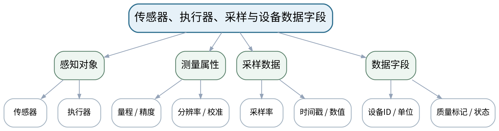

### 教学目标
**知识目标：**
1. 掌握传感器与执行器在物联网中的角色，理解采样、量程、精度、分辨率和校准。
2. 理解温度、振动、电流、位置等制造数据的基本字段和时间属性。

**能力目标：**
1. 能够根据被测对象选择基本感知方式并设计数据字段。
2. 能够识别单位、量程、采样率、校准状态对数据可信度的影响。

**价值目标：**
1. 形成“数据必须有来源、单位、时间和校准依据”的数据质量责任意识。

### 课程思政
通过数据失真和设备误判案例强调测量诚信、质量责任与校准证据。

### 专创融合
将数据字典作为设备模型的前身，训练面向平台接口设计可复用数据资产。

### 教学重难点
**教学重点：**感知链与数据字段；采样/校准质量。

**教学难点：**区分“设备输出了数字”和“数据适合用于工程判断”，正确设计时间戳、单位和质量字段。

### 教学方法与用具
**教学方法：**体系讲授、协议图解、案例分析、方案评审、数据/报文演示、分组讨论、短时设计练习

**教学用具：**电脑、投影仪、传感器数据样例、数据字段模板。

### 教学设计
课前任务 → 互动导入（10 min）→ 传授新知与课堂训练（75 min）→ 过关检测（10 min）→ 课堂小结（3 min）→ 作业布置（1 min）→ 考勤（1 min）

### 课前任务
【教师】发布“传感器、执行器、采样与设备数据字段”对应大纲/教材范围、一个制造物联网案例或协议/数据片段，不提前给出完整方案。

1. 阅读对应大纲与教材内容；
2. 圈出3个关键术语并记录至少1个疑问；
3. 预读一张架构/协议/数据图，写出自己的第一判断和一个可能的故障/风险点。

【学生】完成准备并带着“判断—依据—疑问”进入课堂。

### 互动导入
【教师】展示两条温度数据：`85`与`85 °C@10:32:05, calibrated=true`，让学生判断哪一条更能支撑工程决策。

【学生】先独立判断，再与同伴交换依据；教师收集典型分歧后进入本课。

### 传授新知与课堂训练
**一、核心概念与协议/架构图解（约30 min）—感知与执行**

【教师】用温度、振动、电流、位置案例区分传感器/执行器，说明从物理量到数据点的链路。

【学生】完成对应架构图、选型表、主题/接口设计、数据字典或风险分析，先给出判断依据，再用教师演示/资料进行复核。

**二、学生方案/接口/数据练习（约25 min）—采样与质量**

【教师】讲采样频率、量程、精度、分辨率和校准，说明这些参数决定数据适用性。

【学生】完成对应架构图、选型表、主题/接口设计、数据字典或风险分析，先给出判断依据，再用教师演示/资料进行复核。

**三、对比、故障与方案复盘（约20 min）—数据字典练习**

【教师】学生设计“电机温度/振动/电流”数据字典：设备ID、时间戳、值、单位、采样率、状态与质量标记。

【学生】完成对应架构图、选型表、主题/接口设计、数据字典或风险分析，先给出判断依据，再用教师演示/资料进行复核。

**独立学习产物**：一份制造设备数据字典＋基本感知链图。

**学习证据**：数据字段表、单位/采样/校准字段、感知方式选择理由、同伴审查记录。

**评价映射**：平时成绩＋课程作业（第二单元20%内部份额）＋期末考核；目标1.2、2.2、3.2。

### 过关检测
【教师】组织当堂检测：

1. 精度与分辨率有何区别？
2. 为什么时间戳是设备数据的核心字段？
3. 校准信息缺失会对后续分析造成什么风险？

【学生】独立作答/分析；【教师】按错误类型讲解，要求说明架构、协议、数据或安全依据。

### 课堂小结
【教师】回到本课知识脉络图，用“对象—数据—连接—接口—服务—边界”总结“传感器、执行器、采样与设备数据字段”，再次强调教学重点：感知链与数据字段；采样/校准质量。

【学生】写下“本课最重要的一条工程选择规则 + 一个最容易忽略的边界”。

### 作业布置
【教师】布置课后任务：为设备状态监测设计不少于8个数据字段，并解释每个字段的工程含义。

【学生】按课程模板整理图表、技术依据和版本/来源，形成可评审方案证据。

### 考勤
【教师】利用学校/课程实际使用的平台进行签到。

【学生】按课程要求完成签到。

### 课后教学反思
【课后填写，不预填事实】

1. 教学流程：记录100 min各环节实际用时及需要调整的位置；
2. 教学内容：重点记录“区分“设备输出了数字”和“数据适合用于工程判断”，正确设计时间戳、单位和质量字段。”的真实掌握证据和常见误区；
3. 学生参与：仅依据实际课堂记录填写架构图、协议分析、选型讨论和方案互审情况，不补写推测；
4. 评价证据：检查本课产物、技术依据、引用/版本和风险说明是否完整；
5. 后续改进：依据真实课堂证据决定下一次课的补救或拓展。

### 本章节参考文献
[1] 桂小林.《物联网技术导论（第3版）》[M]. 清华大学出版社，2024。

## 第4次课 RFID/EPC、二维码、定位与无线传感器网络

### 课次信息
- **章节/单元**：第二单元 感知、识别与设备数据
- **周次**：按实际课表填写
- **课时安排**：2课时（100 min）
- **课型**：理论

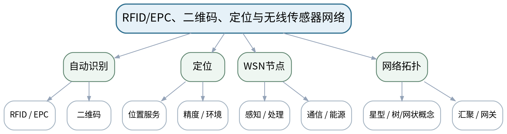

### 教学目标
**知识目标：**
1. 理解RFID/EPC、二维码、定位技术和无线传感器网络节点/拓扑的基本原理与适用场景。
2. 理解身份识别、位置与环境感知在物流和制造追溯中的作用。

**能力目标：**
1. 能够为仓储、在制品追踪和资产管理选择识别/定位方式。
2. 能够画出简单无线传感器网络节点与汇聚结构。

**价值目标：**
1. 形成标识唯一性、数据来源和部署条件必须可追溯的规范意识。

### 课程思政
强调标识、位置和设备数据必须真实可追溯，不能因自动识别方便而忽视误识别和隐私边界。

### 专创融合
将识别、定位和WSN组合为仓储/在制品追溯的最小物联网感知产品。

### 教学重难点
**教学重点：**RFID/EPC和二维码；定位；无线传感器网络结构。

**教学难点：**识别技术的选择不应只看“先进程度”，要考虑可视、距离、成本、环境和维护。

### 教学方法与用具
**教学方法：**体系讲授、协议图解、案例分析、方案评审、数据/报文演示、分组讨论、短时设计练习

**教学用具：**电脑、投影仪、RFID/二维码/WSN案例图、标签/读写器实物或图片。

### 教学设计
课前任务 → 互动导入（10 min）→ 传授新知与课堂训练（75 min）→ 过关检测（10 min）→ 课堂小结（3 min）→ 作业布置（1 min）→ 考勤（1 min）

### 课前任务
【教师】发布“RFID/EPC、二维码、定位与无线传感器网络”对应大纲/教材范围、一个制造物联网案例或协议/数据片段，不提前给出完整方案。

1. 阅读对应大纲与教材内容；
2. 圈出3个关键术语并记录至少1个疑问；
3. 预读一张架构/协议/数据图，写出自己的第一判断和一个可能的故障/风险点。

【学生】完成准备并带着“判断—依据—疑问”进入课堂。

### 互动导入
【教师】比较“叉车扫码”“RFID门禁自动读取”“室内位置追踪”三种任务，要求学生指出为什么不能用一种技术包打天下。

【学生】先独立判断，再与同伴交换依据；教师收集典型分歧后进入本课。

### 传授新知与课堂训练
**一、核心概念与协议/架构图解（约30 min）—识别技术**

【教师】比较RFID/EPC与二维码的读取方式、距离、批量能力、成本和环境约束。

【学生】完成对应架构图、选型表、主题/接口设计、数据字典或风险分析，先给出判断依据，再用教师演示/资料进行复核。

**二、学生方案/接口/数据练习（约25 min）—定位与WSN**

【教师】解释定位需求、无线传感节点组成和基本拓扑，强调能源和通信约束。

【学生】完成对应架构图、选型表、主题/接口设计、数据字典或风险分析，先给出判断依据，再用教师演示/资料进行复核。

**三、对比、故障与方案复盘（约20 min）—方案选择**

【教师】学生为仓储物料、工装资产、移动AGV分别选择识别/定位方式并写出至少3个指标依据。

【学生】完成对应架构图、选型表、主题/接口设计、数据字典或风险分析，先给出判断依据，再用教师演示/资料进行复核。

**独立学习产物**：三类制造对象的识别/定位选型表＋WSN结构图。

**学习证据**：选型矩阵、拓扑图、对象/标签/读写器或节点角色说明、限制条件。

**评价映射**：平时成绩＋课程作业（第二单元20%内部份额）＋期末考核；目标1.2、2.2、3.2。

### 过关检测
【教师】组织当堂检测：

1. RFID与二维码在非视距读取上有什么差异？
2. 无线传感器节点为什么要关注功耗？
3. 定位精度越高是否一定越适合制造现场？

【学生】独立作答/分析；【教师】按错误类型讲解，要求说明架构、协议、数据或安全依据。

### 课堂小结
【教师】回到本课知识脉络图，用“对象—数据—连接—接口—服务—边界”总结“RFID/EPC、二维码、定位与无线传感器网络”，再次强调教学重点：RFID/EPC和二维码；定位；无线传感器网络结构。

【学生】写下“本课最重要的一条工程选择规则 + 一个最容易忽略的边界”。

### 作业布置
【教师】布置课后任务：完善仓储追溯方案，补充异常情况：标签损坏、重复读取、位置漂移。

【学生】按课程模板整理图表、技术依据和版本/来源，形成可评审方案证据。

### 考勤
【教师】利用学校/课程实际使用的平台进行签到。

【学生】按课程要求完成签到。

### 课后教学反思
【课后填写，不预填事实】

1. 教学流程：记录100 min各环节实际用时及需要调整的位置；
2. 教学内容：重点记录“识别技术的选择不应只看“先进程度”，要考虑可视、距离、成本、环境和维护。”的真实掌握证据和常见误区；
3. 学生参与：仅依据实际课堂记录填写架构图、协议分析、选型讨论和方案互审情况，不补写推测；
4. 评价证据：检查本课产物、技术依据、引用/版本和风险说明是否完整；
5. 后续改进：依据真实课堂证据决定下一次课的补救或拓展。

### 本章节参考文献
[1] 桂小林.《物联网技术导论（第3版）》[M]. 清华大学出版社，2024。
[5] 许毅等.《无线传感器网络技术原理及应用（第3版）》[M]. 清华大学出版社，2026。

## 第5次课 时间戳、缺失/异常、数据质量与感知方案评审

### 课次信息
- **章节/单元**：第二单元 感知、识别与设备数据
- **周次**：按实际课表填写
- **课时安排**：2课时（100 min）
- **课型**：理论

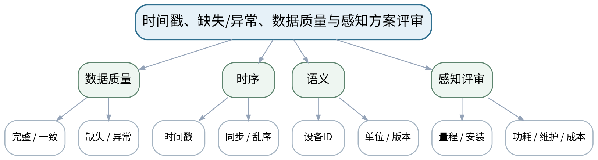

### 教学目标
**知识目标：**
1. 理解数据质量中的完整性、一致性、时序性和异常问题。
2. 理解时间戳、单位、设备标识、缺失和异常对物联网业务的影响。

**能力目标：**
1. 能够发现样例设备数据中的缺失、单位不一致、重复、时间乱序和异常值。
2. 能够从量程、安装、采样、功耗、维护和成本综合评价感知方案。

**价值目标：**
1. 形成尊重原始数据、说明误差来源、不为得到预期结论随意清洗数据的习惯。

### 课程思政
强调原始数据和校准证据是工程底线，数据清洗必须公开规则与修改记录。

### 专创融合
把数据质量检查作为物联网平台接入前的“数据契约验收层”。

### 教学重难点
**教学重点：**设备数据质量与时序；感知方案综合评审。

**教学难点：**异常数据处理必须有依据，不能把“看起来不正常”当成删除理由。

### 教学方法与用具
**教学方法：**体系讲授、协议图解、案例分析、方案评审、数据/报文演示、分组讨论、短时设计练习

**教学用具：**电脑、投影仪、CSV/JSON设备数据样例、数据质量检查表。

### 教学设计
课前任务 → 互动导入（10 min）→ 传授新知与课堂训练（75 min）→ 过关检测（10 min）→ 课堂小结（3 min）→ 作业布置（1 min）→ 考勤（1 min）

### 课前任务
【教师】发布“时间戳、缺失/异常、数据质量与感知方案评审”对应大纲/教材范围、一个制造物联网案例或协议/数据片段，不提前给出完整方案。

1. 阅读对应大纲与教材内容；
2. 圈出3个关键术语并记录至少1个疑问；
3. 预读一张架构/协议/数据图，写出自己的第一判断和一个可能的故障/风险点。

【学生】完成准备并带着“判断—依据—疑问”进入课堂。

### 互动导入
【教师】给一份含°C/F混用、重复时间戳、空值和突变值的设备数据，让学生先标记问题，不允许直接删除。

【学生】先独立判断，再与同伴交换依据；教师收集典型分歧后进入本课。

### 传授新知与课堂训练
**一、核心概念与协议/架构图解（约30 min）—质量问题分类**

【教师】从缺失、重复、单位、时间、设备身份和异常值分析数据质量，区分“数据错误”和“真实异常”。

【学生】完成对应架构图、选型表、主题/接口设计、数据字典或风险分析，先给出判断依据，再用教师演示/资料进行复核。

**二、学生方案/接口/数据练习（约25 min）—复核链**

【教师】讨论原始数据保留、校准/采样元数据、异常标记和人工复核，强调处理过程可追溯。

【学生】完成对应架构图、选型表、主题/接口设计、数据字典或风险分析，先给出判断依据，再用教师演示/资料进行复核。

**三、对比、故障与方案复盘（约20 min）—方案评审**

【教师】学生基于量程、精度、安装、功耗、维护、成本和数据质量评价上一课感知方案，并给出改进。

【学生】完成对应架构图、选型表、主题/接口设计、数据字典或风险分析，先给出判断依据，再用教师演示/资料进行复核。

**独立学习产物**：设备数据质量审查表＋感知方案评审结论。

**学习证据**：问题标注、不能直接修正的字段、复核方法、改进前后方案。

**评价映射**：平时成绩＋课程作业（第二单元20%内部份额）＋期末考核；目标1.2、2.2、3.2。

### 过关检测
【教师】组织当堂检测：

1. 异常值为什么不应一律删除？
2. 时间戳乱序会影响哪些业务？
3. 感知方案的维护成本为什么也是技术指标？

【学生】独立作答/分析；【教师】按错误类型讲解，要求说明架构、协议、数据或安全依据。

### 课堂小结
【教师】回到本课知识脉络图，用“对象—数据—连接—接口—服务—边界”总结“时间戳、缺失/异常、数据质量与感知方案评审”，再次强调教学重点：设备数据质量与时序；感知方案综合评审。

【学生】写下“本课最重要的一条工程选择规则 + 一个最容易忽略的边界”。

### 作业布置
【教师】布置课后任务：完成一份设备数据质量检查清单，并标出哪些问题需要回到传感/采集端解决。

【学生】按课程模板整理图表、技术依据和版本/来源，形成可评审方案证据。

### 考勤
【教师】利用学校/课程实际使用的平台进行签到。

【学生】按课程要求完成签到。

### 课后教学反思
【课后填写，不预填事实】

1. 教学流程：记录100 min各环节实际用时及需要调整的位置；
2. 教学内容：重点记录“异常数据处理必须有依据，不能把“看起来不正常”当成删除理由。”的真实掌握证据和常见误区；
3. 学生参与：仅依据实际课堂记录填写架构图、协议分析、选型讨论和方案互审情况，不补写推测；
4. 评价证据：检查本课产物、技术依据、引用/版本和风险说明是否完整；
5. 后续改进：依据真实课堂证据决定下一次课的补救或拓展。

### 本章节参考文献
[1] 桂小林.《物联网技术导论（第3版）》[M]. 清华大学出版社，2024。

## 第6次课 TCP/IP、IPv6、6LoWPAN、寻址、拓扑与网关

### 课次信息
- **章节/单元**：第三单元 连接技术、网络与组网
- **周次**：按实际课表填写
- **课时安排**：2课时（100 min）
- **课型**：理论

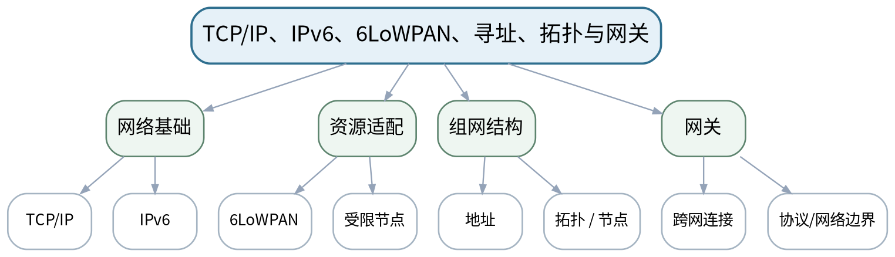

### 教学目标
**知识目标：**
1. 理解TCP/IP与IPv6在物联网中的基本角色，了解6LoWPAN概念。
2. 理解地址、拓扑、节点数量、网关和端到端通信路径。

**能力目标：**
1. 能够画出端设备经本地网络/网关到平台的网络路径。
2. 能够解释为什么资源受限节点需要考虑报文开销和网关。

**价值目标：**
1. 形成网络设计必须说明地址、拓扑与边界的接口意识。

### 课程思政
结合网络资源和可靠性讨论规范使用频谱/地址资源和对连接失效后果负责。

### 专创融合
把网络路径图转化为后续连接技术选型和故障隔离的基础资产。

### 教学重难点
**教学重点：**IPv6/6LoWPAN基本角色；寻址、拓扑与网关。

**教学难点：**不要把“IP可达”与“业务可用/实时可靠”混为一谈，理解网关存在的边界价值。

### 教学方法与用具
**教学方法：**体系讲授、协议图解、案例分析、方案评审、数据/报文演示、分组讨论、短时设计练习

**教学用具：**电脑、投影仪、TCP/IP/IPv6协议栈图、组网示意。

### 教学设计
课前任务 → 互动导入（10 min）→ 传授新知与课堂训练（75 min）→ 过关检测（10 min）→ 课堂小结（3 min）→ 作业布置（1 min）→ 考勤（1 min）

### 课前任务
【教师】发布“TCP/IP、IPv6、6LoWPAN、寻址、拓扑与网关”对应大纲/教材范围、一个制造物联网案例或协议/数据片段，不提前给出完整方案。

1. 阅读对应大纲与教材内容；
2. 圈出3个关键术语并记录至少1个疑问；
3. 预读一张架构/协议/数据图，写出自己的第一判断和一个可能的故障/风险点。

【学生】完成准备并带着“判断—依据—疑问”进入课堂。

### 互动导入
【教师】画出一个传感节点“没有IP、通过网关上云”和一个“直接IPv6联网”的架构，要求学生比较地址与网关责任。

【学生】先独立判断，再与同伴交换依据；教师收集典型分歧后进入本课。

### 传授新知与课堂训练
**一、核心概念与协议/架构图解（约30 min）—TCP/IP/IPv6**

【教师】从分层通信与端到端寻址说明IP的角色，强调课程不展开网络底层细节。

【学生】完成对应架构图、选型表、主题/接口设计、数据字典或风险分析，先给出判断依据，再用教师演示/资料进行复核。

**二、学生方案/接口/数据练习（约25 min）—6LoWPAN与受限设备**

【教师】说明资源受限节点和IPv6适配的思路，理解头部/能耗/链路约束。

【学生】完成对应架构图、选型表、主题/接口设计、数据字典或风险分析，先给出判断依据，再用教师演示/资料进行复核。

**三、对比、故障与方案复盘（约20 min）—网络图练习**

【教师】学生为车间传感节点绘制地址/拓扑/网关路径，标出局部链路和到平台的网络边界。

【学生】完成对应架构图、选型表、主题/接口设计、数据字典或风险分析，先给出判断依据，再用教师演示/资料进行复核。

**独立学习产物**：一张“端设备—本地网络—网关—平台”网络路径图。

**学习证据**：拓扑图、地址/节点角色、网关边界、故障点标注。

**评价映射**：平时成绩＋课程作业（第三单元20%内部份额）＋期末考核；目标1.3、2.3、3.3。

### 过关检测
【教师】组织当堂检测：

1. IPv6在物联网规模化寻址上有何意义？
2. 为什么资源受限节点需要协议适配？
3. 网关既可能是连接点，也可能是什么风险点？

【学生】独立作答/分析；【教师】按错误类型讲解，要求说明架构、协议、数据或安全依据。

### 课堂小结
【教师】回到本课知识脉络图，用“对象—数据—连接—接口—服务—边界”总结“TCP/IP、IPv6、6LoWPAN、寻址、拓扑与网关”，再次强调教学重点：IPv6/6LoWPAN基本角色；寻址、拓扑与网关。

【学生】写下“本课最重要的一条工程选择规则 + 一个最容易忽略的边界”。

### 作业布置
【教师】布置课后任务：为一个50节点温度网络设计拓扑草图，说明网关故障会影响哪些节点。

【学生】按课程模板整理图表、技术依据和版本/来源，形成可评审方案证据。

### 考勤
【教师】利用学校/课程实际使用的平台进行签到。

【学生】按课程要求完成签到。

### 课后教学反思
【课后填写，不预填事实】

1. 教学流程：记录100 min各环节实际用时及需要调整的位置；
2. 教学内容：重点记录“不要把“IP可达”与“业务可用/实时可靠”混为一谈，理解网关存在的边界价值。”的真实掌握证据和常见误区；
3. 学生参与：仅依据实际课堂记录填写架构图、协议分析、选型讨论和方案互审情况，不补写推测；
4. 评价证据：检查本课产物、技术依据、引用/版本和风险说明是否完整；
5. 后续改进：依据真实课堂证据决定下一次课的补救或拓展。

### 本章节参考文献
[1] 桂小林.《物联网技术导论（第3版）》[M]. 清华大学出版社，2024。
[5] 许毅等.《无线传感器网络技术原理及应用（第3版）》[M]. 清华大学出版社，2026。

## 第7次课 Wi-Fi、BLE、Zigbee/Thread：短距连接与组网权衡

### 课次信息
- **章节/单元**：第三单元 连接技术、网络与组网
- **周次**：按实际课表填写
- **课时安排**：2课时（100 min）
- **课型**：理论

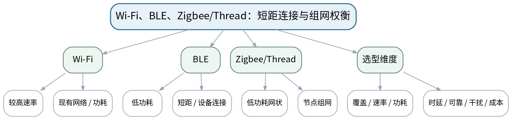

### 教学目标
**知识目标：**
1. 理解Wi-Fi、蓝牙低功耗、Zigbee/Thread的基本特点和典型拓扑。
2. 理解速率、功耗、时延、节点数量、覆盖和干扰等评价维度。

**能力目标：**
1. 能够依据制造场景用统一指标比较短距无线技术。
2. 能够说明选型中的主要取舍和现场干扰风险。

**价值目标：**
1. 形成不以单一速率/品牌替代综合工程权衡的理性选型意识。

### 课程思政
通过频谱资源和现场干扰案例培养遵守通信规范、节约资源和可靠性责任。

### 专创融合
将选型矩阵作为可复用工程决策模板，服务设备接入方案评审。

### 教学重难点
**教学重点：**Wi-Fi/BLE/Zigbee/Thread对比；短距无线选型矩阵。

**教学难点：**避免绝对化“谁更先进”，每种技术都必须放回距离、功耗和维护场景。

### 教学方法与用具
**教学方法：**体系讲授、协议图解、案例分析、方案评审、数据/报文演示、分组讨论、短时设计练习

**教学用具：**电脑、投影仪、短距无线技术比较表、制造现场案例。

### 教学设计
课前任务 → 互动导入（10 min）→ 传授新知与课堂训练（75 min）→ 过关检测（10 min）→ 课堂小结（3 min）→ 作业布置（1 min）→ 考勤（1 min）

### 课前任务
【教师】发布“Wi-Fi、BLE、Zigbee/Thread：短距连接与组网权衡”对应大纲/教材范围、一个制造物联网案例或协议/数据片段，不提前给出完整方案。

1. 阅读对应大纲与教材内容；
2. 圈出3个关键术语并记录至少1个疑问；
3. 预读一张架构/协议/数据图，写出自己的第一判断和一个可能的故障/风险点。

【学生】完成准备并带着“判断—依据—疑问”进入课堂。

### 互动导入
【教师】给“电池传感器、移动维护终端、固定摄像设备”三个对象，让学生先不看协议名，只列指标优先级。

【学生】先独立判断，再与同伴交换依据；教师收集典型分歧后进入本课。

### 传授新知与课堂训练
**一、核心概念与协议/架构图解（约30 min）—技术特性**

【教师】分别从覆盖、速率、功耗、拓扑和典型设备解释Wi-Fi、BLE、Zigbee/Thread。

【学生】完成对应架构图、选型表、主题/接口设计、数据字典或风险分析，先给出判断依据，再用教师演示/资料进行复核。

**二、学生方案/接口/数据练习（约25 min）—干扰与可靠性**

【教师】讨论现场金属结构、同频干扰、漫游和节点密度等边界，强调实际部署需验证。

【学生】完成对应架构图、选型表、主题/接口设计、数据字典或风险分析，先给出判断依据，再用教师演示/资料进行复核。

**三、对比、故障与方案复盘（约20 min）—选型矩阵**

【教师】学生给三个制造对象评分，必须说明取舍而不是只写“推荐某技术”。

【学生】完成对应架构图、选型表、主题/接口设计、数据字典或风险分析，先给出判断依据，再用教师演示/资料进行复核。

**独立学习产物**：短距无线连接技术选型矩阵＋场景推荐说明。

**学习证据**：统一指标表、评分依据、风险/限制、同伴评审意见。

**评价映射**：平时成绩＋课程作业（第三单元20%内部份额）＋期末考核；目标1.3、2.3、3.3。

### 过关检测
【教师】组织当堂检测：

1. 为什么BLE常用于低功耗设备？
2. 网状组网能解决哪些问题，又会增加什么复杂度？
3. Wi-Fi高带宽是否意味着所有设备都应使用Wi-Fi？

【学生】独立作答/分析；【教师】按错误类型讲解，要求说明架构、协议、数据或安全依据。

### 课堂小结
【教师】回到本课知识脉络图，用“对象—数据—连接—接口—服务—边界”总结“Wi-Fi、BLE、Zigbee/Thread：短距连接与组网权衡”，再次强调教学重点：Wi-Fi/BLE/Zigbee/Thread对比；短距无线选型矩阵。

【学生】写下“本课最重要的一条工程选择规则 + 一个最容易忽略的边界”。

### 作业布置
【教师】布置课后任务：为车间10类设备选择短距接入方式，至少列出一个“不推荐方案”及原因。

【学生】按课程模板整理图表、技术依据和版本/来源，形成可评审方案证据。

### 考勤
【教师】利用学校/课程实际使用的平台进行签到。

【学生】按课程要求完成签到。

### 课后教学反思
【课后填写，不预填事实】

1. 教学流程：记录100 min各环节实际用时及需要调整的位置；
2. 教学内容：重点记录“避免绝对化“谁更先进”，每种技术都必须放回距离、功耗和维护场景。”的真实掌握证据和常见误区；
3. 学生参与：仅依据实际课堂记录填写架构图、协议分析、选型讨论和方案互审情况，不补写推测；
4. 评价证据：检查本课产物、技术依据、引用/版本和风险说明是否完整；
5. 后续改进：依据真实课堂证据决定下一次课的补救或拓展。

### 本章节参考文献
[1] 桂小林.《物联网技术导论（第3版）》[M]. 清华大学出版社，2024。
[5] 许毅等.《无线传感器网络技术原理及应用（第3版）》[M]. 清华大学出版社，2026。

## 第8次课 LoRaWAN、NB-IoT/蜂窝物联与混合组网方案

### 课次信息
- **章节/单元**：第三单元 连接技术、网络与组网
- **周次**：按实际课表填写
- **课时安排**：2课时（100 min）
- **课型**：理论

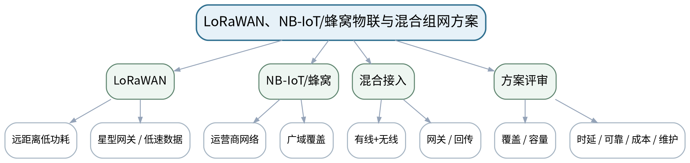

### 教学目标
**知识目标：**
1. 理解LoRaWAN、NB-IoT/蜂窝物联的长距离、低功耗、容量与运营网络等基本特征。
2. 理解有线/无线混合接入和链路中断、拥塞、覆盖边界。

**能力目标：**
1. 能够依据覆盖、数据量、功耗、时延、可靠性和成本比较远距连接。
2. 能够为园区/跨厂区场景设计混合接入和网关方案。

**价值目标：**
1. 形成考虑维护、运营成本和链路故障的全生命周期意识。

### 课程思政
把覆盖和频谱资源与维护成本纳入选型，避免“连接成功就结束”的短视设计。

### 专创融合
形成端到端连接方案，可作为后续工业网关和平台集成的网络层输入。

### 教学重难点
**教学重点：**LoRaWAN、NB-IoT/蜂窝物联；连接技术综合选型。

**教学难点：**远距低功耗并不等于低时延/高吞吐；必须分析业务数据量和实时性。

### 教学方法与用具
**教学方法：**体系讲授、协议图解、案例分析、方案评审、数据/报文演示、分组讨论、短时设计练习

**教学用具：**电脑、投影仪、LoRaWAN/NB-IoT组网示意、选型矩阵。

### 教学设计
课前任务 → 互动导入（10 min）→ 传授新知与课堂训练（75 min）→ 过关检测（10 min）→ 课堂小结（3 min）→ 作业布置（1 min）→ 考勤（1 min）

### 课前任务
【教师】发布“LoRaWAN、NB-IoT/蜂窝物联与混合组网方案”对应大纲/教材范围、一个制造物联网案例或协议/数据片段，不提前给出完整方案。

1. 阅读对应大纲与教材内容；
2. 圈出3个关键术语并记录至少1个疑问；
3. 预读一张架构/协议/数据图，写出自己的第一判断和一个可能的故障/风险点。

【学生】完成准备并带着“判断—依据—疑问”进入课堂。

### 互动导入
【教师】给“园区水表每15 min上报一次”和“高频振动波形连续上传”两个任务，要求学生判断同一远距技术是否都适合。

【学生】先独立判断，再与同伴交换依据；教师收集典型分歧后进入本课。

### 传授新知与课堂训练
**一、核心概念与协议/架构图解（约30 min）—远距连接**

【教师】说明LoRaWAN和NB-IoT/蜂窝物联的基本部署与适用场景，不绑定具体运营商/产品。

【学生】完成对应架构图、选型表、主题/接口设计、数据字典或风险分析，先给出判断依据，再用教师演示/资料进行复核。

**二、学生方案/接口/数据练习（约25 min）—混合组网**

【教师】分析厂内有线、短距无线、远距回传和网关组合，加入链路中断和网络拥塞场景。

【学生】完成对应架构图、选型表、主题/接口设计、数据字典或风险分析，先给出判断依据，再用教师演示/资料进行复核。

**三、对比、故障与方案复盘（约20 min）—综合评审**

【教师】学生为“跨厂房能源监测”设计混合组网，列覆盖、功耗、时延、成本、维护和故障路径。

【学生】完成对应架构图、选型表、主题/接口设计、数据字典或风险分析，先给出判断依据，再用教师演示/资料进行复核。

**独立学习产物**：跨厂房能源监测混合组网图＋技术选型矩阵。

**学习证据**：架构图、链路/网关角色、选型理由、故障/降级说明。

**评价映射**：平时成绩＋课程作业（第三单元20%内部份额）＋期末考核；目标1.3、2.3、3.3。

### 过关检测
【教师】组织当堂检测：

1. LoRaWAN适合大数据量持续视频吗？为什么？
2. NB-IoT/蜂窝物联的运营网络依赖带来哪些工程考虑？
3. 混合组网为何要设计故障降级？

【学生】独立作答/分析；【教师】按错误类型讲解，要求说明架构、协议、数据或安全依据。

### 课堂小结
【教师】回到本课知识脉络图，用“对象—数据—连接—接口—服务—边界”总结“LoRaWAN、NB-IoT/蜂窝物联与混合组网方案”，再次强调教学重点：LoRaWAN、NB-IoT/蜂窝物联；连接技术综合选型。

【学生】写下“本课最重要的一条工程选择规则 + 一个最容易忽略的边界”。

### 作业布置
【教师】布置课后任务：完成一个园区物联网连接方案，明确每一段链路的技术、数据量和故障影响。

【学生】按课程模板整理图表、技术依据和版本/来源，形成可评审方案证据。

### 考勤
【教师】利用学校/课程实际使用的平台进行签到。

【学生】按课程要求完成签到。

### 课后教学反思
【课后填写，不预填事实】

1. 教学流程：记录100 min各环节实际用时及需要调整的位置；
2. 教学内容：重点记录“远距低功耗并不等于低时延/高吞吐；必须分析业务数据量和实时性。”的真实掌握证据和常见误区；
3. 学生参与：仅依据实际课堂记录填写架构图、协议分析、选型讨论和方案互审情况，不补写推测；
4. 评价证据：检查本课产物、技术依据、引用/版本和风险说明是否完整；
5. 后续改进：依据真实课堂证据决定下一次课的补救或拓展。

### 本章节参考文献
[1] 桂小林.《物联网技术导论（第3版）》[M]. 清华大学出版社，2024。
[5] 许毅等.《无线传感器网络技术原理及应用（第3版）》[M]. 清华大学出版社，2026。

## 第9次课 MQTT发布/订阅、主题树、QoS与离线重连

### 课次信息
- **章节/单元**：第四单元 应用协议、边缘计算与物联网平台
- **周次**：按实际课表填写
- **课时安排**：2课时（100 min）
- **课型**：理论

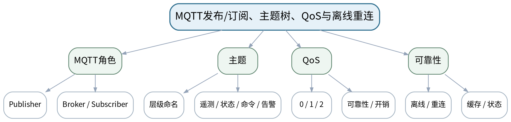

### 教学目标
**知识目标：**
1. 掌握MQTT发布/订阅、Broker、Topic和QoS的基本消息模型。
2. 理解缓存、遗嘱/状态、离线重连等可靠性问题的应用含义。

**能力目标：**
1. 能够为设备状态、遥测、告警和命令设计清晰的MQTT主题树。
2. 能够根据消息重要性选择QoS并说明代价。

**价值目标：**
1. 形成主题命名、单位、时间和消息责任必须标准化的接口规范意识。

### 课程思政
通过字段歧义和离线重连案例强调接口契约和自动消息责任。

### 专创融合
把主题树作为物联网设备API资产，为Node-RED/平台/边缘规则复用。

### 教学重难点
**教学重点：**MQTT发布订阅、主题设计与QoS。

**教学难点：**主题命名和消息方向必须清晰；QoS不是越高越好，要结合可靠性和开销。

### 教学方法与用具
**教学方法：**体系讲授、协议图解、案例分析、方案评审、数据/报文演示、分组讨论、短时设计练习

**教学用具：**电脑、投影仪、MQTT报文/主题示意、教师MQTT客户端/代理演示。

### 教学设计
课前任务 → 互动导入（10 min）→ 传授新知与课堂训练（75 min）→ 过关检测（10 min）→ 课堂小结（3 min）→ 作业布置（1 min）→ 考勤（1 min）

### 课前任务
【教师】发布“MQTT发布/订阅、主题树、QoS与离线重连”对应大纲/教材范围、一个制造物联网案例或协议/数据片段，不提前给出完整方案。

1. 阅读对应大纲与教材内容；
2. 圈出3个关键术语并记录至少1个疑问；
3. 预读一张架构/协议/数据图，写出自己的第一判断和一个可能的故障/风险点。

【学生】完成准备并带着“判断—依据—疑问”进入课堂。

### 互动导入
【教师】展示`factory/+/data`、`factory/device01/cmd`等主题，让学生判断哪些是设备上报、哪些是控制命令，并找出命名歧义。

【学生】先独立判断，再与同伴交换依据；教师收集典型分歧后进入本课。

### 传授新知与课堂训练
**一、核心概念与协议/架构图解（约30 min）—消息模型**

【教师】用Broker和发布/订阅时序图说明设备、平台、应用的解耦。

【学生】完成对应架构图、选型表、主题/接口设计、数据字典或风险分析，先给出判断依据，再用教师演示/资料进行复核。

**二、学生方案/接口/数据练习（约25 min）—主题与QoS**

【教师】设计设备遥测、状态、事件、告警、命令主题树，比较QoS0/1/2的可靠性与成本。

【学生】完成对应架构图、选型表、主题/接口设计、数据字典或风险分析，先给出判断依据，再用教师演示/资料进行复核。

**三、对比、故障与方案复盘（约20 min）—接口评审**

【教师】学生完成“机床状态监测”主题表：Topic、方向、payload字段、QoS、保留/重连策略和责任方。

【学生】完成对应架构图、选型表、主题/接口设计、数据字典或风险分析，先给出判断依据，再用教师演示/资料进行复核。

**独立学习产物**：MQTT主题树＋消息接口表。

**学习证据**：主题表、消息方向、JSON样例、QoS选择理由、异常/离线策略。

**评价映射**：平时成绩＋课程作业（第四单元20%内部份额）＋期末考核；目标1.4、2.4、3.4。

### 过关检测
【教师】组织当堂检测：

1. MQTT为什么适合发布/订阅场景？
2. QoS越高为什么不一定越好？
3. 命令主题与遥测主题为什么要分开？

【学生】独立作答/分析；【教师】按错误类型讲解，要求说明架构、协议、数据或安全依据。

### 课堂小结
【教师】回到本课知识脉络图，用“对象—数据—连接—接口—服务—边界”总结“MQTT发布/订阅、主题树、QoS与离线重连”，再次强调教学重点：MQTT发布订阅、主题设计与QoS。

【学生】写下“本课最重要的一条工程选择规则 + 一个最容易忽略的边界”。

### 作业布置
【教师】布置课后任务：设计一个不少于8条Topic的设备模型，包含遥测、状态、告警和命令。

【学生】按课程模板整理图表、技术依据和版本/来源，形成可评审方案证据。

### 考勤
【教师】利用学校/课程实际使用的平台进行签到。

【学生】按课程要求完成签到。

### 课后教学反思
【课后填写，不预填事实】

1. 教学流程：记录100 min各环节实际用时及需要调整的位置；
2. 教学内容：重点记录“主题命名和消息方向必须清晰；QoS不是越高越好，要结合可靠性和开销。”的真实掌握证据和常见误区；
3. 学生参与：仅依据实际课堂记录填写架构图、协议分析、选型讨论和方案互审情况，不补写推测；
4. 评价证据：检查本课产物、技术依据、引用/版本和风险说明是否完整；
5. 后续改进：依据真实课堂证据决定下一次课的补救或拓展。

### 本章节参考文献
[1] 桂小林.《物联网技术导论（第3版）》[M]. 清华大学出版社，2024。
[3] 吴功宜, 吴英.《物联网工程导论（第3版）》[M]. 机械工业出版社，2025。

## 第10次课 CoAP、HTTP/REST、JSON与设备模型/资源接口

### 课次信息
- **章节/单元**：第四单元 应用协议、边缘计算与物联网平台
- **周次**：按实际课表填写
- **课时安排**：2课时（100 min）
- **课型**：理论

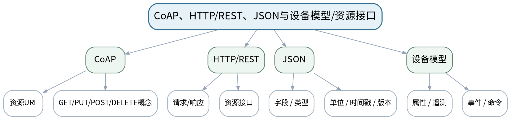

### 教学目标
**知识目标：**
1. 理解CoAP资源与请求响应、HTTP/REST接口以及JSON数据模型的基本特点。
2. 理解设备模型、数据点、事件、命令和资源路径。

**能力目标：**
1. 能够为同一设备分别设计MQTT主题、CoAP资源或HTTP接口，并比较差异。
2. 能够定义带单位、时间戳和版本的JSON消息。

**价值目标：**
1. 形成数据模型与接口语义先于具体平台实现的工程习惯。

### 课程思政
强调接口字段、权限和失败语义是自动化系统责任边界，不能只追求“调用成功”。

### 专创融合
将设备模型作为跨协议、跨平台可迁移的核心数字资产。

### 教学重难点
**教学重点：**CoAP/HTTP基本模型；JSON与设备模型。

**教学难点：**协议语法不同但共同依赖清晰资源/数据语义；不能把JSON字段名当作自然语言随意变化。

### 教学方法与用具
**教学方法：**体系讲授、协议图解、案例分析、方案评审、数据/报文演示、分组讨论、短时设计练习

**教学用具：**电脑、投影仪、CoAP/HTTP/MQTT时序图、JSON示例。

### 教学设计
课前任务 → 互动导入（10 min）→ 传授新知与课堂训练（75 min）→ 过关检测（10 min）→ 课堂小结（3 min）→ 作业布置（1 min）→ 考勤（1 min）

### 课前任务
【教师】发布“CoAP、HTTP/REST、JSON与设备模型/资源接口”对应大纲/教材范围、一个制造物联网案例或协议/数据片段，不提前给出完整方案。

1. 阅读对应大纲与教材内容；
2. 圈出3个关键术语并记录至少1个疑问；
3. 预读一张架构/协议/数据图，写出自己的第一判断和一个可能的故障/风险点。

【学生】完成准备并带着“判断—依据—疑问”进入课堂。

### 互动导入
【教师】同一“设备温度查询”分别写成MQTT Topic、CoAP资源和HTTP URL，要求学生比较消息方向、状态保持和接口风格。

【学生】先独立判断，再与同伴交换依据；教师收集典型分歧后进入本课。

### 传授新知与课堂训练
**一、核心概念与协议/架构图解（约30 min）—协议图解**

【教师】用请求/响应和资源模型讲CoAP/HTTP，比较MQTT发布订阅。

【学生】完成对应架构图、选型表、主题/接口设计、数据字典或风险分析，先给出判断依据，再用教师演示/资料进行复核。

**二、学生方案/接口/数据练习（约25 min）—数据模型**

【教师】建立device_id、timestamp、temperature、unit、quality等JSON字段，说明数据点、事件、命令。

【学生】完成对应架构图、选型表、主题/接口设计、数据字典或风险分析，先给出判断依据，再用教师演示/资料进行复核。

**三、对比、故障与方案复盘（约20 min）—接口设计**

【教师】学生为“设备参数查询+远程启停（仅接口设计）”画时序图，标出权限和失败返回，不执行真实控制。

【学生】完成对应架构图、选型表、主题/接口设计、数据字典或风险分析，先给出判断依据，再用教师演示/资料进行复核。

**独立学习产物**：CoAP/HTTP/MQTT接口对照表＋JSON设备模型＋时序图。

**学习证据**：接口路径/主题、消息Schema、单位/时间/版本字段、失败码/异常策略。

**评价映射**：平时成绩＋课程作业（第四单元20%内部份额）＋期末考核；目标1.4、2.4、3.4。

### 过关检测
【教师】组织当堂检测：

1. CoAP和HTTP共同采用什么基本交互思想？
2. 为什么设备JSON必须带单位与时间戳？
3. 远程控制接口为什么需要显式失败/权限设计？

【学生】独立作答/分析；【教师】按错误类型讲解，要求说明架构、协议、数据或安全依据。

### 课堂小结
【教师】回到本课知识脉络图，用“对象—数据—连接—接口—服务—边界”总结“CoAP、HTTP/REST、JSON与设备模型/资源接口”，再次强调教学重点：CoAP/HTTP基本模型；JSON与设备模型。

【学生】写下“本课最重要的一条工程选择规则 + 一个最容易忽略的边界”。

### 作业布置
【教师】布置课后任务：完善一个设备模型，至少含5个遥测/属性、2个事件和2个命令。

【学生】按课程模板整理图表、技术依据和版本/来源，形成可评审方案证据。

### 考勤
【教师】利用学校/课程实际使用的平台进行签到。

【学生】按课程要求完成签到。

### 课后教学反思
【课后填写，不预填事实】

1. 教学流程：记录100 min各环节实际用时及需要调整的位置；
2. 教学内容：重点记录“协议语法不同但共同依赖清晰资源/数据语义；不能把JSON字段名当作自然语言随意变化。”的真实掌握证据和常见误区；
3. 学生参与：仅依据实际课堂记录填写架构图、协议分析、选型讨论和方案互审情况，不补写推测；
4. 评价证据：检查本课产物、技术依据、引用/版本和风险说明是否完整；
5. 后续改进：依据真实课堂证据决定下一次课的补救或拓展。

### 本章节参考文献
[1] 桂小林.《物联网技术导论（第3版）》[M]. 清华大学出版社，2024。
[3] 吴功宜, 吴英.《物联网工程导论（第3版）》[M]. 机械工业出版社，2025。

## 第11次课 边缘网关、缓存/过滤/聚合、云平台与规则告警

### 课次信息
- **章节/单元**：第四单元 应用协议、边缘计算与物联网平台
- **周次**：按实际课表填写
- **课时安排**：2课时（100 min）
- **课型**：理论

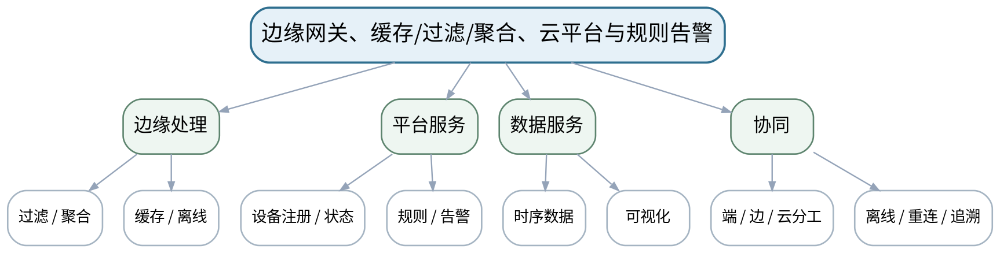

### 教学目标
**知识目标：**
1. 理解设备注册、状态/影子概念、规则引擎、边缘缓存/过滤/聚合、云平台、时序数据、可视化和告警。
2. 理解端—边—云处理分工和离线场景。

**能力目标：**
1. 能够把数据处理任务合理分配到设备、边缘和云端。
2. 能够设计简单规则、告警和离线缓存/重传流程。

**价值目标：**
1. 形成边缘/云自动规则必须可追溯、可降级、可人工确认的责任意识。

### 课程思政
通过错误告警和断网案例强调自动规则可追溯、数据不丢失和人工复核责任。

### 专创融合
把边缘规则和平台数据服务组织成可复用设备运营能力。

### 教学重难点
**教学重点：**端—边—云分工；平台规则与离线可靠性。

**教学难点：**不是所有数据都上传云端；边缘处理需要考虑资源、时延、离线和一致性。

### 教学方法与用具
**教学方法：**体系讲授、协议图解、案例分析、方案评审、数据/报文演示、分组讨论、短时设计练习

**教学用具：**电脑、投影仪、Node-RED或等价教师演示、平台流程图、时序数据样例。

### 教学设计
课前任务 → 互动导入（10 min）→ 传授新知与课堂训练（75 min）→ 过关检测（10 min）→ 课堂小结（3 min）→ 作业布置（1 min）→ 考勤（1 min）

### 课前任务
【教师】发布“边缘网关、缓存/过滤/聚合、云平台与规则告警”对应大纲/教材范围、一个制造物联网案例或协议/数据片段，不提前给出完整方案。

1. 阅读对应大纲与教材内容；
2. 圈出3个关键术语并记录至少1个疑问；
3. 预读一张架构/协议/数据图，写出自己的第一判断和一个可能的故障/风险点。

【学生】完成准备并带着“判断—依据—疑问”进入课堂。

### 互动导入
【教师】给“1 kHz振动原始数据、每分钟RMS、超限告警”三类数据，让学生决定哪些在端/边/云处理。

【学生】先独立判断，再与同伴交换依据；教师收集典型分歧后进入本课。

### 传授新知与课堂训练
**一、核心概念与协议/架构图解（约30 min）—边缘网关**

【教师】讲缓存、过滤、聚合、协议接入和离线重传，强调边缘并非“小云”。

【学生】完成对应架构图、选型表、主题/接口设计、数据字典或风险分析，先给出判断依据，再用教师演示/资料进行复核。

**二、学生方案/接口/数据练习（约25 min）—平台服务**

【教师】设备注册/状态、时序存储、规则、告警和可视化，说明自动规则的输入/输出。

【学生】完成对应架构图、选型表、主题/接口设计、数据字典或风险分析，先给出判断依据，再用教师演示/资料进行复核。

**三、对比、故障与方案复盘（约20 min）—处理分工**

【教师】学生为设备状态监测画端—边—云处理表，包含数据频率、保留周期、离线策略和告警证据。

【学生】完成对应架构图、选型表、主题/接口设计、数据字典或风险分析，先给出判断依据，再用教师演示/资料进行复核。

**独立学习产物**：端—边—云处理分工表＋规则/告警流程。

**学习证据**：数据频率/保留/位置表、规则条件、告警字段、离线/重传策略。

**评价映射**：平时成绩＋课程作业（第四单元20%内部份额）＋期末考核；目标1.4、2.4、3.4。

### 过关检测
【教师】组织当堂检测：

1. 哪些数据适合在边缘聚合后上传？
2. 离线缓存为什么要保留时间和顺序？
3. 自动告警为什么需要来源和规则版本？

【学生】独立作答/分析；【教师】按错误类型讲解，要求说明架构、协议、数据或安全依据。

### 课堂小结
【教师】回到本课知识脉络图，用“对象—数据—连接—接口—服务—边界”总结“边缘网关、缓存/过滤/聚合、云平台与规则告警”，再次强调教学重点：端—边—云分工；平台规则与离线可靠性。

【学生】写下“本课最重要的一条工程选择规则 + 一个最容易忽略的边界”。

### 作业布置
【教师】布置课后任务：为一个能耗监测场景设计边缘/云分工，列出3条规则和1种离线策略。

【学生】按课程模板整理图表、技术依据和版本/来源，形成可评审方案证据。

### 考勤
【教师】利用学校/课程实际使用的平台进行签到。

【学生】按课程要求完成签到。

### 课后教学反思
【课后填写，不预填事实】

1. 教学流程：记录100 min各环节实际用时及需要调整的位置；
2. 教学内容：重点记录“不是所有数据都上传云端；边缘处理需要考虑资源、时延、离线和一致性。”的真实掌握证据和常见误区；
3. 学生参与：仅依据实际课堂记录填写架构图、协议分析、选型讨论和方案互审情况，不补写推测；
4. 评价证据：检查本课产物、技术依据、引用/版本和风险说明是否完整；
5. 后续改进：依据真实课堂证据决定下一次课的补救或拓展。

### 本章节参考文献
[1] 桂小林.《物联网技术导论（第3版）》[M]. 清华大学出版社，2024。
[4] 任磊, 张霖, 赖李媛君.《工业互联网导论》[M]. 清华大学出版社，2024。

## 第12次课 工业网关、Modbus TCP、OPC UA与协议转换

### 课次信息
- **章节/单元**：第五单元 工业物联网与智能制造集成
- **周次**：按实际课表填写
- **课时安排**：2课时（100 min）
- **课型**：理论

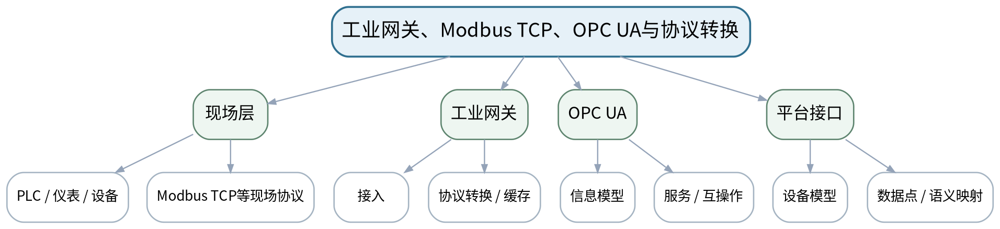

### 教学目标
**知识目标：**
1. 理解工业物联网架构、现场设备、工业网关、Modbus TCP、OPC UA和协议转换的基本作用。
2. 理解设备模型/信息语义与互操作的关系。

**能力目标：**
1. 能够画出现场设备经工业网关进入平台的数据链。
2. 能够说明“协议转换”与“语义统一”不是同一问题。

**价值目标：**
1. 形成工业互操作必须同时考虑通信、数据语义和责任边界的意识。

### 课程思政
通过数据孤岛和跨厂商集成案例强化标准互操作、跨专业协作和接口责任。

### 专创融合
把工业网关/OPC UA作为现场系统与上层平台之间的产品化集成层。

### 教学重难点
**教学重点：**工业网关、Modbus TCP、OPC UA与协议/语义转换。

**教学难点：**协议能转换不代表数据语义一致；设备点位、单位、时间和状态必须映射清楚。

### 教学方法与用具
**教学方法：**体系讲授、协议图解、案例分析、方案评审、数据/报文演示、分组讨论、短时设计练习

**教学用具：**电脑、投影仪、工业网关/OPC UA/Modbus TCP架构示意、点表样例。

### 教学设计
课前任务 → 互动导入（10 min）→ 传授新知与课堂训练（75 min）→ 过关检测（10 min）→ 课堂小结（3 min）→ 作业布置（1 min）→ 考勤（1 min）

### 课前任务
【教师】发布“工业网关、Modbus TCP、OPC UA与协议转换”对应大纲/教材范围、一个制造物联网案例或协议/数据片段，不提前给出完整方案。

1. 阅读对应大纲与教材内容；
2. 圈出3个关键术语并记录至少1个疑问；
3. 预读一张架构/协议/数据图，写出自己的第一判断和一个可能的故障/风险点。

【学生】完成准备并带着“判断—依据—疑问”进入课堂。

### 互动导入
【教师】给出两个厂商设备都提供“speed”字段，一个单位rpm、一个m/s，要求学生判断仅做协议转换会发生什么。

【学生】先独立判断，再与同伴交换依据；教师收集典型分歧后进入本课。

### 传授新知与课堂训练
**一、核心概念与协议/架构图解（约30 min）—工业接入链**

【教师】从PLC/仪表/控制器到工业网关和平台，说明网关承担接入、转换、缓存和隔离。

【学生】完成对应架构图、选型表、主题/接口设计、数据字典或风险分析，先给出判断依据，再用教师演示/资料进行复核。

**二、学生方案/接口/数据练习（约25 min）—Modbus TCP与OPC UA角色**

【教师】用概念级报文/信息模型说明现场寄存器与语义化信息模型的差异。

【学生】完成对应架构图、选型表、主题/接口设计、数据字典或风险分析，先给出判断依据，再用教师演示/资料进行复核。

**三、对比、故障与方案复盘（约20 min）—映射评审**

【教师】学生完成“现场点位→网关标签→OPC UA节点/平台字段”映射表，必须带单位、类型、时间和质量。

【学生】完成对应架构图、选型表、主题/接口设计、数据字典或风险分析，先给出判断依据，再用教师演示/资料进行复核。

**独立学习产物**：工业数据点映射表＋现场—网关—平台架构图。

**学习证据**：点位/字段/单位/类型/质量映射、协议角色、故障点说明。

**评价映射**：平时成绩＋课程作业（第五单元15%内部份额）＋期末考核；目标1.5、2.5、3.1、3.4。

### 过关检测
【教师】组织当堂检测：

1. 协议转换与语义转换有什么区别？
2. 工业网关为什么也是故障隔离点？
3. OPC UA信息模型能为互操作提供什么价值？

【学生】独立作答/分析；【教师】按错误类型讲解，要求说明架构、协议、数据或安全依据。

### 课堂小结
【教师】回到本课知识脉络图，用“对象—数据—连接—接口—服务—边界”总结“工业网关、Modbus TCP、OPC UA与协议转换”，再次强调教学重点：工业网关、Modbus TCP、OPC UA与协议/语义转换。

【学生】写下“本课最重要的一条工程选择规则 + 一个最容易忽略的边界”。

### 作业布置
【教师】布置课后任务：为一台机床设计10个数据点的“现场协议→平台字段”映射表。

【学生】按课程模板整理图表、技术依据和版本/来源，形成可评审方案证据。

### 考勤
【教师】利用学校/课程实际使用的平台进行签到。

【学生】按课程要求完成签到。

### 课后教学反思
【课后填写，不预填事实】

1. 教学流程：记录100 min各环节实际用时及需要调整的位置；
2. 教学内容：重点记录“协议能转换不代表数据语义一致；设备点位、单位、时间和状态必须映射清楚。”的真实掌握证据和常见误区；
3. 学生参与：仅依据实际课堂记录填写架构图、协议分析、选型讨论和方案互审情况，不补写推测；
4. 评价证据：检查本课产物、技术依据、引用/版本和风险说明是否完整；
5. 后续改进：依据真实课堂证据决定下一次课的补救或拓展。

### 本章节参考文献
[1] 桂小林.《物联网技术导论（第3版）》[M]. 清华大学出版社，2024。
[4] 任磊, 张霖, 赖李媛君.《工业互联网导论》[M]. 清华大学出版社，2024。

## 第13次课 设备状态、能耗、追溯、仓储与预测维护的端到端场景

### 课次信息
- **章节/单元**：第五单元 工业物联网与智能制造集成
- **周次**：按实际课表填写
- **课时安排**：2课时（100 min）
- **课型**：理论

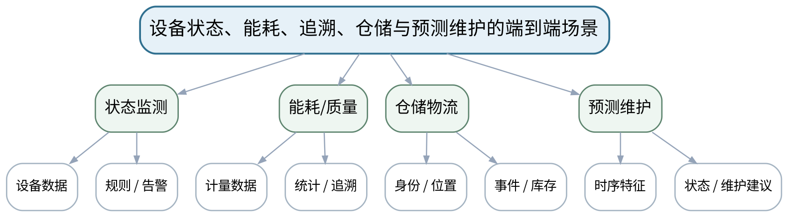

### 教学目标
**知识目标：**
1. 理解设备状态监测、能耗管理、质量追溯、仓储物流和预测维护的典型物联网数据链。
2. 理解时序数据、规则/告警、设备模型和数字孪生概念在场景中的作用。

**能力目标：**
1. 能够从业务目标反推对象、数据、网络、平台服务和业务输出。
2. 能够识别不同场景的关键数据和时延/可靠性要求。

**价值目标：**
1. 形成以业务价值和工程约束驱动技术方案，而不是堆叠技术名词的意识。

### 课程思政
强调技术方案必须服务真实制造价值、安全和可维护性，避免“为联网而联网”。

### 专创融合
把单场景方案逐步演化为期末“智能制造物联网系统方案”的项目骨架。

### 教学重难点
**教学重点：**典型智能制造物联网场景的端到端设计。

**教学难点：**同一平台技术在不同业务中指标优先级不同，必须从业务闭环而非技术清单出发。

### 教学方法与用具
**教学方法：**体系讲授、协议图解、案例分析、方案评审、数据/报文演示、分组讨论、短时设计练习

**教学用具：**电脑、投影仪、智能制造案例架构图、数据点/规则表。

### 教学设计
课前任务 → 互动导入（10 min）→ 传授新知与课堂训练（75 min）→ 过关检测（10 min）→ 课堂小结（3 min）→ 作业布置（1 min）→ 考勤（1 min）

### 课前任务
【教师】发布“设备状态、能耗、追溯、仓储与预测维护的端到端场景”对应大纲/教材范围、一个制造物联网案例或协议/数据片段，不提前给出完整方案。

1. 阅读对应大纲与教材内容；
2. 圈出3个关键术语并记录至少1个疑问；
3. 预读一张架构/协议/数据图，写出自己的第一判断和一个可能的故障/风险点。

【学生】完成准备并带着“判断—依据—疑问”进入课堂。

### 互动导入
【教师】给“设备OEE监测”和“安全停机联锁”两个需求，要求学生比较时延、可靠性和人工确认要求为何不同。

【学生】先独立判断，再与同伴交换依据；教师收集典型分歧后进入本课。

### 传授新知与课堂训练
**一、核心概念与协议/架构图解（约30 min）—场景数据链**

【教师】逐一拆解状态、能耗、追溯、仓储和预测维护的对象、数据、事件和服务。

【学生】完成对应架构图、选型表、主题/接口设计、数据字典或风险分析，先给出判断依据，再用教师演示/资料进行复核。

**二、学生方案/接口/数据练习（约25 min）—业务到技术映射**

【教师】从业务指标倒推采样、连接、规则、存储、可视化和接口，说明数字孪生只作为概念联系。

【学生】完成对应架构图、选型表、主题/接口设计、数据字典或风险分析，先给出判断依据，再用教师演示/资料进行复核。

**三、对比、故障与方案复盘（约20 min）—方案草图**

【教师】学生选择一场景绘制端到端架构，并标出关键数据点、规则、告警和上层业务接口。

【学生】完成对应架构图、选型表、主题/接口设计、数据字典或风险分析，先给出判断依据，再用教师演示/资料进行复核。

**独立学习产物**：一个智能制造场景的端到端物联网方案草图。

**学习证据**：业务目标、数据点、架构图、关键指标、规则/告警、限制说明。

**评价映射**：平时成绩＋课程作业（第五单元15%内部份额）＋期末考核；目标1.5、2.5、3.1、3.4。

### 过关检测
【教师】组织当堂检测：

1. 预测维护和普通状态告警的数据需求有何不同？
2. 质量追溯为什么特别重视身份和时间链？
3. 技术方案为什么必须从业务输出反推？

【学生】独立作答/分析；【教师】按错误类型讲解，要求说明架构、协议、数据或安全依据。

### 课堂小结
【教师】回到本课知识脉络图，用“对象—数据—连接—接口—服务—边界”总结“设备状态、能耗、追溯、仓储与预测维护的端到端场景”，再次强调教学重点：典型智能制造物联网场景的端到端设计。

【学生】写下“本课最重要的一条工程选择规则 + 一个最容易忽略的边界”。

### 作业布置
【教师】布置课后任务：选择一个场景扩展为期末综合方案候选题，列出核心对象、数据和业务闭环。

【学生】按课程模板整理图表、技术依据和版本/来源，形成可评审方案证据。

### 考勤
【教师】利用学校/课程实际使用的平台进行签到。

【学生】按课程要求完成签到。

### 课后教学反思
【课后填写，不预填事实】

1. 教学流程：记录100 min各环节实际用时及需要调整的位置；
2. 教学内容：重点记录“同一平台技术在不同业务中指标优先级不同，必须从业务闭环而非技术清单出发。”的真实掌握证据和常见误区；
3. 学生参与：仅依据实际课堂记录填写架构图、协议分析、选型讨论和方案互审情况，不补写推测；
4. 评价证据：检查本课产物、技术依据、引用/版本和风险说明是否完整；
5. 后续改进：依据真实课堂证据决定下一次课的补救或拓展。

### 本章节参考文献
[1] 桂小林.《物联网技术导论（第3版）》[M]. 清华大学出版社，2024。
[4] 任磊, 张霖, 赖李媛君.《工业互联网导论》[M]. 清华大学出版社，2024。

## 第14次课 MES/平台接口、时间与语义一致性、互操作和故障隔离

### 课次信息
- **章节/单元**：第五单元 工业物联网与智能制造集成
- **周次**：按实际课表填写
- **课时安排**：2课时（100 min）
- **课型**：理论

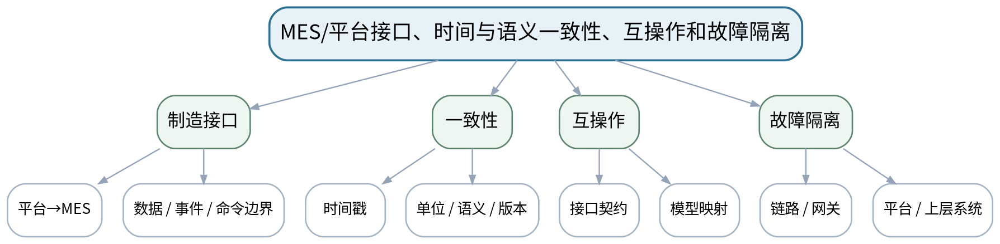

### 教学目标
**知识目标：**
1. 理解物联网平台与MES等制造系统接口、时钟/时间戳一致性、数据语义一致性和故障隔离。
2. 理解系统集成中的接口契约、版本和故障传播。

**能力目标：**
1. 能够为物联网平台—MES接口定义主要数据/事件和责任边界。
2. 能够沿数据链分析网关、网络、平台、接口或上层应用故障的影响。

**价值目标：**
1. 形成接口先行、版本文档、跨专业协作和系统可靠性意识。

### 课程思政
通过跨系统错误和停机案例强化接口契约、可靠性与跨专业沟通责任。

### 专创融合
把接口表和故障传播图作为可评审系统集成文档，提升方案工程完整性。

### 教学重难点
**教学重点：**MES/平台接口；时间和语义一致性；故障隔离。

**教学难点：**区分数据“传到了”与“含义一致”，并设计故障不跨层无限传播。

### 教学方法与用具
**教学方法：**体系讲授、协议图解、案例分析、方案评审、数据/报文演示、分组讨论、短时设计练习

**教学用具：**电脑、投影仪、MES/平台接口案例、时序图/故障树模板。

### 教学设计
课前任务 → 互动导入（10 min）→ 传授新知与课堂训练（75 min）→ 过关检测（10 min）→ 课堂小结（3 min）→ 作业布置（1 min）→ 考勤（1 min）

### 课前任务
【教师】发布“MES/平台接口、时间与语义一致性、互操作和故障隔离”对应大纲/教材范围、一个制造物联网案例或协议/数据片段，不提前给出完整方案。

1. 阅读对应大纲与教材内容；
2. 圈出3个关键术语并记录至少1个疑问；
3. 预读一张架构/协议/数据图，写出自己的第一判断和一个可能的故障/风险点。

【学生】完成准备并带着“判断—依据—疑问”进入课堂。

### 互动导入
【教师】给出“平台告警时间比MES晚8小时”的案例，要求学生判断是网络延迟还是时区/时间语义问题。

【学生】先独立判断，再与同伴交换依据；教师收集典型分歧后进入本课。

### 传授新知与课堂训练
**一、核心概念与协议/架构图解（约30 min）—接口契约**

【教师】从设备平台向MES输出设备状态、事件和统计，讨论接口方向、频率、版本和失败返回。

【学生】完成对应架构图、选型表、主题/接口设计、数据字典或风险分析，先给出判断依据，再用教师演示/资料进行复核。

**二、学生方案/接口/数据练习（约25 min）—时间/语义一致**

【教师】分析时区、时间戳、单位、枚举、设备ID和版本不一致导致的系统错误。

【学生】完成对应架构图、选型表、主题/接口设计、数据字典或风险分析，先给出判断依据，再用教师演示/资料进行复核。

**三、对比、故障与方案复盘（约20 min）—故障传播评审**

【教师】学生对一个端到端架构标注单点故障和隔离/缓存/降级策略，形成接口评审清单。

【学生】完成对应架构图、选型表、主题/接口设计、数据字典或风险分析，先给出判断依据，再用教师演示/资料进行复核。

**独立学习产物**：平台—MES接口表＋一致性检查表＋故障传播图。

**学习证据**：接口字段/方向/频率、时间/单位/版本规则、故障点和降级策略。

**评价映射**：平时成绩＋课程作业（第五单元15%内部份额）＋期末考核；目标1.5、2.5、3.1、3.4。

### 过关检测
【教师】组织当堂检测：

1. 时间戳一致为什么不只是“格式一样”？
2. 平台与MES接口为什么要定义版本？
3. 网关离线时怎样避免上层系统误判？

【学生】独立作答/分析；【教师】按错误类型讲解，要求说明架构、协议、数据或安全依据。

### 课堂小结
【教师】回到本课知识脉络图，用“对象—数据—连接—接口—服务—边界”总结“MES/平台接口、时间与语义一致性、互操作和故障隔离”，再次强调教学重点：MES/平台接口；时间和语义一致性；故障隔离。

【学生】写下“本课最重要的一条工程选择规则 + 一个最容易忽略的边界”。

### 作业布置
【教师】布置课后任务：对期末方案做一次接口/故障评审，补充至少5条接口契约和3个故障场景。

【学生】按课程模板整理图表、技术依据和版本/来源，形成可评审方案证据。

### 考勤
【教师】利用学校/课程实际使用的平台进行签到。

【学生】按课程要求完成签到。

### 课后教学反思
【课后填写，不预填事实】

1. 教学流程：记录100 min各环节实际用时及需要调整的位置；
2. 教学内容：重点记录“区分数据“传到了”与“含义一致”，并设计故障不跨层无限传播。”的真实掌握证据和常见误区；
3. 学生参与：仅依据实际课堂记录填写架构图、协议分析、选型讨论和方案互审情况，不补写推测；
4. 评价证据：检查本课产物、技术依据、引用/版本和风险说明是否完整；
5. 后续改进：依据真实课堂证据决定下一次课的补救或拓展。

### 本章节参考文献
[1] 桂小林.《物联网技术导论（第3版）》[M]. 清华大学出版社，2024。
[4] 任磊, 张霖, 赖李媛君.《工业互联网导论》[M]. 清华大学出版社，2024。

## 第15次课 物联网资产、身份、访问、加密、固件与网络分区

### 课次信息
- **章节/单元**：第六单元 物联网安全、治理与综合方案
- **周次**：按实际课表填写
- **课时安排**：2课时（100 min）
- **课型**：理论

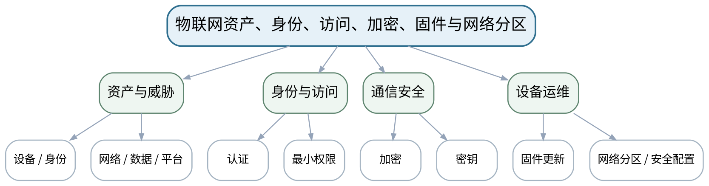

### 教学目标
**知识目标：**
1. 掌握物联网安全目标和分层风险，理解资产、身份认证、访问控制、通信加密、密钥、固件更新和网络分区。
2. 理解设备、网关、平台和数据面临的不同攻击面。

**能力目标：**
1. 能够列出一个制造物联网系统的关键资产和威胁，并提出最小权限/分区/更新等基础控制。
2. 能够说明安全控制的适用边界和剩余风险。

**价值目标：**
1. 树立设备、网络、数据与人员安全责任意识和最小权限原则。

### 课程思政
结合弱口令、伪造设备和越权案例培养守法合规、最小权限和风险披露意识。

### 专创融合
将安全矩阵与架构同步设计，避免“功能完成后再补安全”。

### 教学重难点
**教学重点：**物联网分层安全风险与基础控制。

**教学难点：**安全不能只在云平台添加密码；设备、网络、更新和运维都需要控制。

### 教学方法与用具
**教学方法：**体系讲授、协议图解、案例分析、方案评审、数据/报文演示、分组讨论、短时设计练习

**教学用具：**电脑、投影仪、物联网安全案例、威胁建模模板。

### 教学设计
课前任务 → 互动导入（10 min）→ 传授新知与课堂训练（75 min）→ 过关检测（10 min）→ 课堂小结（3 min）→ 作业布置（1 min）→ 考勤（1 min）

### 课前任务
【教师】发布“物联网资产、身份、访问、加密、固件与网络分区”对应大纲/教材范围、一个制造物联网案例或协议/数据片段，不提前给出完整方案。

1. 阅读对应大纲与教材内容；
2. 圈出3个关键术语并记录至少1个疑问；
3. 预读一张架构/协议/数据图，写出自己的第一判断和一个可能的故障/风险点。

【学生】完成准备并带着“判断—依据—疑问”进入课堂。

### 互动导入
【教师】给出“设备默认密码未修改、固件长期不更新、平台账号权限过大”的组合案例，要求学生按层找风险。

【学生】先独立判断，再与同伴交换依据；教师收集典型分歧后进入本课。

### 传授新知与课堂训练
**一、核心概念与协议/架构图解（约30 min）—资产与攻击面**

【教师】从设备身份、网络接口、数据、平台账号、固件和运维流程梳理资产和威胁。

【学生】完成对应架构图、选型表、主题/接口设计、数据字典或风险分析，先给出判断依据，再用教师演示/资料进行复核。

**二、学生方案/接口/数据练习（约25 min）—基础控制**

【教师】讲认证、访问控制、加密/密钥、更新、网络分区和日志的基本作用，不展开密码算法细节。

【学生】完成对应架构图、选型表、主题/接口设计、数据字典或风险分析，先给出判断依据，再用教师演示/资料进行复核。

**三、对比、故障与方案复盘（约20 min）—威胁—控制映射**

【教师】学生对期末方案建立资产—威胁—控制—剩余风险表，检查是否存在单点高权限。

【学生】完成对应架构图、选型表、主题/接口设计、数据字典或风险分析，先给出判断依据，再用教师演示/资料进行复核。

**独立学习产物**：物联网安全威胁—控制矩阵＋分区/权限草图。

**学习证据**：资产列表、威胁、控制、剩余风险、最小权限和分区说明。

**评价映射**：平时成绩＋课程作业（第六单元10%内部份额）＋期末考核；目标1.6、2.6、3.5、3.6。

### 过关检测
【教师】组织当堂检测：

1. 最小权限原则如何落到设备/网关/平台角色？
2. 为什么安全更新是设备全生命周期问题？
3. 网络分区能降低什么风险，不能替代什么控制？

【学生】独立作答/分析；【教师】按错误类型讲解，要求说明架构、协议、数据或安全依据。

### 课堂小结
【教师】回到本课知识脉络图，用“对象—数据—连接—接口—服务—边界”总结“物联网资产、身份、访问、加密、固件与网络分区”，再次强调教学重点：物联网分层安全风险与基础控制。

【学生】写下“本课最重要的一条工程选择规则 + 一个最容易忽略的边界”。

### 作业布置
【教师】布置课后任务：为期末方案补充不少于8项安全控制，并标出谁负责执行和验证。

【学生】按课程模板整理图表、技术依据和版本/来源，形成可评审方案证据。

### 考勤
【教师】利用学校/课程实际使用的平台进行签到。

【学生】按课程要求完成签到。

### 课后教学反思
【课后填写，不预填事实】

1. 教学流程：记录100 min各环节实际用时及需要调整的位置；
2. 教学内容：重点记录“安全不能只在云平台添加密码；设备、网络、更新和运维都需要控制。”的真实掌握证据和常见误区；
3. 学生参与：仅依据实际课堂记录填写架构图、协议分析、选型讨论和方案互审情况，不补写推测；
4. 评价证据：检查本课产物、技术依据、引用/版本和风险说明是否完整；
5. 后续改进：依据真实课堂证据决定下一次课的补救或拓展。

### 本章节参考文献
[1] 桂小林.《物联网技术导论（第3版）》[M]. 清华大学出版社，2024。
[3] 吴功宜, 吴英.《物联网工程导论（第3版）》[M]. 机械工业出版社，2025。

## 第16次课 威胁建模、隐私/日志/运维与智能制造物联网综合方案评审

### 课次信息
- **章节/单元**：第六单元 物联网安全、治理与综合方案
- **周次**：按实际课表填写
- **课时安排**：2课时（100 min）
- **课型**：理论

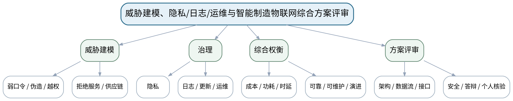

### 教学目标
**知识目标：**
1. 理解弱口令、伪造设备、越权、拒绝服务、供应链风险、数据隐私、日志与安全运维。
2. 理解综合物联网方案需联合评价成本、功耗、时延、可靠性、可维护性和技术演进。

**能力目标：**
1. 能够完成期末“智能制造物联网系统方案”的架构、感知、组网、协议、工业集成和安全设计。
2. 能够进行方案汇报答辩并解释个人负责内容、技术依据、局限和剩余风险。

**价值目标：**
1. 形成风险披露、独立验证、持续学习和对工具/智能助手结论承担核验责任的习惯。

### 课程思政
把安全、隐私、风险披露和个人责任纳入综合方案同等验收。

### 专创融合
以可评审工业物联网架构提案训练跨感知、网络、平台和制造系统的系统设计。

### 教学重难点
**教学重点：**安全治理与综合方案完整性；工程权衡与个人核验。

**教学难点：**不能用“功能能演示”替代方案可维护/可安全运行；必须解释技术选择证据和局限。

### 教学方法与用具
**教学方法：**体系讲授、协议图解、案例分析、方案评审、数据/报文演示、分组讨论、短时设计练习

**教学用具：**电脑、投影仪、综合方案模板、架构/时序/威胁建模工具。

### 教学设计
课前任务 → 互动导入（10 min）→ 传授新知与课堂训练（75 min）→ 过关检测（10 min）→ 课堂小结（3 min）→ 作业布置（1 min）→ 考勤（1 min）

### 课前任务
【教师】发布“威胁建模、隐私/日志/运维与智能制造物联网综合方案评审”对应大纲/教材范围、一个制造物联网案例或协议/数据片段，不提前给出完整方案。

1. 阅读对应大纲与教材内容；
2. 圈出3个关键术语并记录至少1个疑问；
3. 预读一张架构/协议/数据图，写出自己的第一判断和一个可能的故障/风险点。

【学生】完成准备并带着“判断—依据—疑问”进入课堂。

### 互动导入
【教师】对比“堆技术但无接口/风险说明”和“技术适度但证据、权限、故障策略完整”两个方案，按大纲评分标准评审。

【学生】先独立判断，再与同伴交换依据；教师收集典型分歧后进入本课。

### 传授新知与课堂训练
**一、核心概念与协议/架构图解（约30 min）—威胁与治理**

【教师】补充隐私、日志、运维、供应链和拒绝服务风险，明确剩余风险与人工处置。

【学生】完成对应架构图、选型表、主题/接口设计、数据字典或风险分析，先给出判断依据，再用教师演示/资料进行复核。

**二、学生方案/接口/数据练习（约25 min）—方案综合**

【教师】按架构、感知、连接、协议/平台、工业集成、安全六部分统一数据流和接口。

【学生】完成对应架构图、选型表、主题/接口设计、数据字典或风险分析，先给出判断依据，再用教师演示/资料进行复核。

**三、对比、故障与方案复盘（约20 min）—期末评审模拟**

【教师】按综合考查模板互评指标、证据、工程权衡、版本引用、个人贡献和局限。

【学生】完成对应架构图、选型表、主题/接口设计、数据字典或风险分析，先给出判断依据，再用教师演示/资料进行复核。

**独立学习产物**：期末方案骨架：架构图＋连接/协议/接口表＋安全清单＋答辩提纲。

**学习证据**：方案、数据流、接口、选型矩阵、威胁—控制、引用/版本和个人贡献说明。

**评价映射**：课程作业（第六单元10%内部份额）＋期末综合考核60%；目标1.1—1.6、2.1—2.6、3.1—3.6。

### 过关检测
【教师】组织当堂检测：

1. 期末方案为什么必须同时说明成本、可靠性和维护性？
2. 安全措施后为什么仍要写剩余风险？
3. 个人核验至少应能解释哪三类技术决策？

【学生】独立作答/分析；【教师】按错误类型讲解，要求说明架构、协议、数据或安全依据。

### 课堂小结
【教师】回到本课知识脉络图，用“对象—数据—连接—接口—服务—边界”总结“威胁建模、隐私/日志/运维与智能制造物联网综合方案评审”，再次强调教学重点：安全治理与综合方案完整性；工程权衡与个人核验。

【学生】写下“本课最重要的一条工程选择规则 + 一个最容易忽略的边界”。

### 作业布置
【教师】布置课后任务：完成期末综合方案与个人答辩准备，核对来源、版本、接口、安全和局限。

【学生】按课程模板整理图表、技术依据和版本/来源，形成可评审方案证据。

### 考勤
【教师】利用学校/课程实际使用的平台进行签到。

【学生】按课程要求完成签到。

### 课后教学反思
【课后填写，不预填事实】

1. 教学流程：记录100 min各环节实际用时及需要调整的位置；
2. 教学内容：重点记录“不能用“功能能演示”替代方案可维护/可安全运行；必须解释技术选择证据和局限。”的真实掌握证据和常见误区；
3. 学生参与：仅依据实际课堂记录填写架构图、协议分析、选型讨论和方案互审情况，不补写推测；
4. 评价证据：检查本课产物、技术依据、引用/版本和风险说明是否完整；
5. 后续改进：依据真实课堂证据决定下一次课的补救或拓展。

### 本章节参考文献
[1] 桂小林.《物联网技术导论（第3版）》[M]. 清华大学出版社，2024。
