# 特种加工技术教案（16次课）

> **Canonical Markdown / 内容权威源**：本文件与 `images/`、`manifest.json` 共同构成课程教案内容主源；Word 仅由此编译。

## 教案封面信息
- **学院**：机械与动力工程学院
- **专业（教研室）**：智能制造工程
- **课程名称**：特种加工技术
- **主讲教师**：（按实际填写）
- **职称**：（按实际填写）
- **授课学期**：第7学期
- **授课专业**：智能制造工程
- **编制日期**：（按实际填写）

## 课程基本信息
- **课程代码**：25JD32105
- **课程名称（中文）**：特种加工技术
- **课程名称（英文）**：Nontraditional Machining Technology
- **课程类别**：专业类；课程性质：选修；授课语言：中文
- **授课学期**：第7学期；学分：2
- **课程学时及分配**：总学时32；理论26；实验6；上机0；其他0
- **适用专业**：智能制造工程
- **教材**：白基成, 刘晋春, 郭永丰, 杨晓冬等. 特种加工（第7版）[M]. 北京：机械工业出版社，2022. ISBN 9787111679868
- **授课学院**：机械与动力工程学院
- **先修课程**：机械制造技术基础、数控技术、智能测试技术或同等基础
- **后续课程**：毕业实习、毕业设计（论文）
- **考核类型**：考查课
- **考核形式**：期末综合考查，不设置闭卷笔试或机考；期末考核内部为综合工艺设计报告80% + 个人答辩/核验20%。
- **考核方式**：平时成绩、课程作业（实验记录/样件/图像/原始数据/参数—质量分析为主要证据）、期末综合工艺设计报告与个人核验
- **总评成绩比例**：总评成绩 = 平时成绩×20% + 课程作业×20% + 期末考核×60%

### 课程简介

课程基本定位：本课程是智能制造工程专业第7学期专业选修课，面向难加工材料、复杂型面、微细结构和高质量表面，系统学习电火花、电化学、激光、超声、高能束、微细与复合加工，并建立综合工艺设计、质量评价、安全防护和环境控制能力。课程与《增材制造技术》为二选一，不重复增材制造成形原理和工艺体系。

核心学习结果：学生能够比较特种加工方法，分析材料去除机理和主要工艺参数，完成典型难加工零件的工艺选择、参数—质量分析和质量控制；能够实施或基于等效平台完成三类实验，保留原始数据、样件/图像并形成可复核结论；能够识别高压电、工作液、电解液、激光辐射、烟尘、噪声、废液和高压流体等安全环保风险。

学情分析：学生已学习机械制造技术基础、数控技术、智能测试技术或同等基础，具备机械加工、设备与质量测量的先备知识。本课程不以设备命令记忆为主，而以“材料去除机理—设备/参数—质量—安全环保—证据验证”建立跨方法工艺判断能力。

主要教学方法：采用“机理讲授—设备案例—参数/质量分析—实验验证—工艺方案设计”。实验使用现有设备或等效平台；无法直接开展的高能束、微细和复合加工采用样件、视频、可复现实验数据和工程案例分析，不虚构实验事实。

## 16次课教学设计

## 第01次课 特种加工分类、能量形式、材料去除机制与应用边界

- **章节/单元**：第一单元 特种加工概论与方法选择（2学时）
- **周次**：按实际课表填写
- **课时安排**：2课时（100 min）
- **课型**：理论

### 知识脉络图

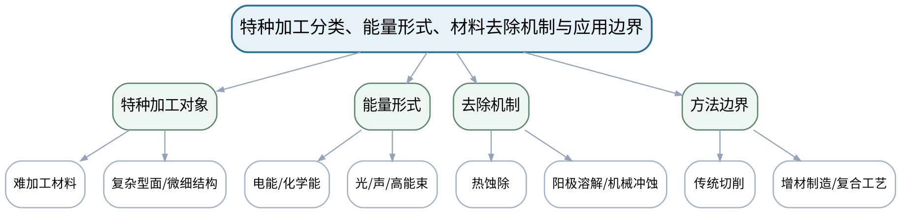

### 教学目标

**知识目标：**
- （1）理解特种加工的定义、主要分类和典型能量形式。
- （2）理解特种加工与传统切削、增材制造在材料去除/成形机制上的边界。
**能力目标：**
- （1）能够依据材料、几何复杂度、精度和表面质量要求初步筛选特种加工方法。
**价值目标：**
- （1）形成面向多指标权衡而非单一“先进性”进行工艺选择的工程习惯。

### 课程思政

结合先进制造和难加工材料应用，强调技术选择必须兼顾质量、安全、资源利用和环境责任。

### 专创融合 / 双创融合

把工艺方法选择表视为工艺决策的最小需求文档，训练面向零件价值和制造约束做技术选型。

### 教学重难点

教学重点：特种加工分类、能量形式和材料去除机制之间的关系。
教学难点：不同方法可以加工相似对象，但质量、效率、材料适应性和安全环境代价不同，不能只按“能不能加工”选择。

### 教学方法

问题引导法、机理讲授法、设备/样件案例分析、参数—质量数据推演、同伴互评与证据复盘

### 教学用具

电脑、投影仪、多媒体课件、教材、典型零件/样件图片、工艺比较表。

### 教学设计

课前任务 → 互动导入（15 min）→ 传授新知与课堂训练（70 min）→ 过关检测（10 min）→ 课堂小结（3 min）→ 作业布置（1 min）→ 考勤（1 min）

### 教学过程

#### 课前任务

【教师】发布“特种加工分类、能量形式、材料去除机制与应用边界”预习/准备要求和一个最小问题，不提前给出完整答案。
- 1. 阅读大纲对应内容与指定教材，圈出3个核心术语；
- 2. 预读一张工艺原理图、样件或参数表，写出第一判断。
- 3. 记录至少1个疑问或安全/环保风险点。
【学生】完成准备并带着问题进入课堂。

**设计意图：** 通过课前阅读、安全/环保准备和最小问题建立先备认知，让学生带着真实工艺问题进入课堂。

#### 互动导入与传授新知 / 课堂训练

【互动导入 15 min】
【教师】展示高硬度模具深腔、陶瓷小孔、薄壁热敏材料三个零件，要求学生先判断传统切削为什么困难，再提出可能的能量作用方式。
【学生】先独立预测/判断/观察，再交换依据，不先听完整结论。

【传授新知与课堂训练 70 min】
**一、核心机理与工艺结构讲解（约25 min）—对象与需求**

【教师】从材料硬度、导电性、脆性、热敏感性、复杂结构和微细特征建立特种加工应用需求。

【学生】按任务约束完成分析/实验，保存中间结果并说明判断依据；教师只提示定位方法、边界与验收条件，不代替学生完成核心产物。

**二、参数/案例分析与学生推演（约25 min）—方法与机理**

【教师】按热、电化学、机械/声、射流和高能束等能量作用方式梳理方法，强调“机理决定材料与质量边界”。

【学生】按任务约束完成分析/实验，保存中间结果并说明判断依据；教师只提示定位方法、边界与验收条件，不代替学生完成核心产物。

**三、独立产出、互审与证据复盘（约20 min）—方法选择练习**

【教师】学生完成三类零件的“需求—候选方法—优缺点—安全环保风险”比较表，并互审是否忽略材料导电性或热影响。

【学生】按任务约束完成分析/实验，保存中间结果并说明判断依据；教师只提示定位方法、边界与验收条件，不代替学生完成核心产物。

【课堂产物】三类零件特种加工方法初选表。

【学习证据】需求条件、候选工艺、选择依据和一条错误选择修正记录。

【评价关联】平时成绩；目标1.1、2.1、3.1。

**设计意图：** 采用“先看现象/需求 → 最小机理讲解 → 参数/案例或实验分析 → 证据固化”的闭环，使工艺结论能够追溯到材料、参数、质量与安全环保证据。

#### 过关检测

【教师】组织当堂检测：
- 1. 特种加工与传统切削最核心的区别是什么？
- 2. 材料导电性为什么会影响某些特种加工方法选择？
- 3. 工艺选择至少应同时考虑哪几类指标？
【学生】独立作答/数据判断；【教师】依据错误类型进行针对性讲解并要求说明判断依据。

**设计意图：** 用机理、参数、质量和边界问题即时检测关键知识，避免只记工艺名称。

#### 课堂小结

【教师】回到知识脉络图，用“机理—设备/参数—质量—应用—风险”总结“特种加工分类、能量形式、材料去除机制与应用边界”，再次强调：特种加工分类、能量形式和材料去除机制之间的关系。
【学生】写下本课最重要的一条工艺规则和一个最容易忽略的安全/质量边界。

**设计意图：** 压缩本课信息并把规则、边界与后续工艺比较或实验任务连接。

#### 作业布置

【教师】布置课后任务：选择一个难加工零件，列出材料、结构、精度、表面质量和安全环保要求，并给出两种候选方法。
【学生】按课程文件命名和证据规范整理提交。

**设计意图：** 固化课堂产物，形成可复查、可追溯的过程证据。

#### 考勤

【教师】利用学校/课程实际使用的平台进行签到。
【学生】按课程要求完成签到。

**设计意图：** 保留学校模板考勤环节，不在教案中预填出勤事实。

### 课后教学反思

【课后填写，不预填事实】
- 1. 教学流程：记录100 min各环节实际用时及需调整的位置；
- 2. 教学内容：重点记录“不同方法可以加工相似对象，但质量、效率、材料适应性和安全环境代价不同，不能只按“能不能加工”选择。”的真实掌握证据与常见错误；
- 3. 学生参与：仅依据实际课堂记录填写独立分析、实验、互审或方案讨论情况，不补写推测；
- 4. 评价证据：检查本课工艺分析/实验数据/样件图像/测试/方案记录是否完整，记录缺项及原因；
- 5. 后续改进：依据真实课堂证据确定下一轮调整。

### 本章节参考文献

[1] 白基成, 刘晋春, 郭永丰, 杨晓冬等. 特种加工（第7版）[M]. 北京：机械工业出版社，2022. ISBN 9787111679868
[2] 《特种加工技术》课程教学大纲，2026年9月。

## 第02次课 特种加工方法选择收束与电火花放电机理导入

- **章节/单元**：第一单元（1学时）+第二单元 电火花成形与线切割（1学时）
- **周次**：按实际课表填写
- **课时安排**：2课时（100 min）
- **课型**：理论

### 知识脉络图

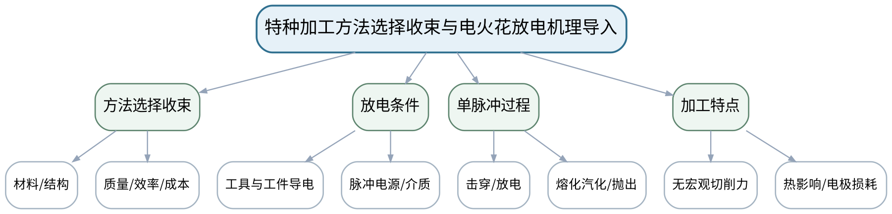

### 教学目标

**知识目标：**
- （1）巩固特种加工多指标选择框架。
- （2）理解电火花加工必须具备导电工件、工具电极、脉冲放电和工作介质等基本条件。
**能力目标：**
- （1）能够从零件需求判断电火花加工是否适用，并用单次脉冲作用解释材料蚀除。
**价值目标：**
- （1）形成高压电、工作液与放电间隙的安全边界意识。

### 课程思政

以高压电和工作液风险为切入点，要求任何机理分析同时回答“设备如何安全失效”。

### 专创融合 / 双创融合

将放电状态识别视为电火花设备过程监控和智能诊断的基础变量。

### 教学重难点

教学重点：电火花加工的必要条件与单脉冲蚀除机理。
教学难点：不能把“放电产生高温”简单等同于连续电弧；脉冲、间隙、介质去电离和排屑共同决定稳定加工。

### 教学方法

问题引导法、机理讲授法、设备/样件案例分析、参数—质量数据推演、同伴互评与证据复盘

### 教学用具

电脑、投影仪、放电间隙示意、脉冲波形示意、教材。

### 教学设计

课前任务 → 互动导入（15 min）→ 传授新知与课堂训练（70 min）→ 过关检测（10 min）→ 课堂小结（3 min）→ 作业布置（1 min）→ 考勤（1 min）

### 教学过程

#### 课前任务

【教师】发布“特种加工方法选择收束与电火花放电机理导入”预习/准备要求和一个最小问题，不提前给出完整答案。
- 1. 阅读大纲对应内容与指定教材，圈出3个核心术语；
- 2. 预读一张工艺原理图、样件或参数表，写出第一判断。
- 3. 记录至少1个疑问或安全/环保风险点。
【学生】完成准备并带着问题进入课堂。

**设计意图：** 通过课前阅读、安全/环保准备和最小问题建立先备认知，让学生带着真实工艺问题进入课堂。

#### 互动导入与传授新知 / 课堂训练

【互动导入 15 min】
【教师】把“持续短路”“稳定脉冲放电”“完全不开路”三种示波/状态示意并列，要求学生判断哪种才可能形成稳定加工。
【学生】先独立预测/判断/观察，再交换依据，不先听完整结论。

【传授新知与课堂训练 70 min】
**一、核心机理与工艺结构讲解（约25 min）—选择框架收束**

【教师】用一个硬质合金模具型腔完成上一单元的工艺决策闭环，明确电火花适用的导电性前提。

【学生】按任务约束完成分析/实验，保存中间结果并说明判断依据；教师只提示定位方法、边界与验收条件，不代替学生完成核心产物。

**二、参数/案例分析与学生推演（约25 min）—放电机理**

【教师】按电场建立—介质击穿—放电通道—局部熔化/汽化—抛出—去电离解释单脉冲过程。

【学生】按任务约束完成分析/实验，保存中间结果并说明判断依据；教师只提示定位方法、边界与验收条件，不代替学生完成核心产物。

**三、独立产出、互审与证据复盘（约20 min）—状态辨析**

【教师】学生根据三种间隙状态判断正常放电、开路和短路，并说明伺服间隙控制为什么必要。

【学生】按任务约束完成分析/实验，保存中间结果并说明判断依据；教师只提示定位方法、边界与验收条件，不代替学生完成核心产物。

【课堂产物】电火花适用条件清单 + 单脉冲过程图。

【学习证据】条件判断、脉冲过程图和三类间隙状态辨析。

【评价关联】平时成绩、课程作业；目标1.1、1.2、2.1、2.2、3.1、3.2。

**设计意图：** 采用“先看现象/需求 → 最小机理讲解 → 参数/案例或实验分析 → 证据固化”的闭环，使工艺结论能够追溯到材料、参数、质量与安全环保证据。

#### 过关检测

【教师】组织当堂检测：
- 1. 电火花加工对工件材料有什么基本要求？
- 2. 连续电弧为什么不是稳定电火花加工状态？
- 3. 工作介质在加工间隙中承担哪些作用？
【学生】独立作答/数据判断；【教师】依据错误类型进行针对性讲解并要求说明判断依据。

**设计意图：** 用机理、参数、质量和边界问题即时检测关键知识，避免只记工艺名称。

#### 课堂小结

【教师】回到知识脉络图，用“机理—设备/参数—质量—应用—风险”总结“特种加工方法选择收束与电火花放电机理导入”，再次强调：电火花加工的必要条件与单脉冲蚀除机理。
【学生】写下本课最重要的一条工艺规则和一个最容易忽略的安全/质量边界。

**设计意图：** 压缩本课信息并把规则、边界与后续工艺比较或实验任务连接。

#### 作业布置

【教师】布置课后任务：画出单脉冲放电蚀除的6步过程，并标出两处可能导致加工不稳定的条件。
【学生】按课程文件命名和证据规范整理提交。

**设计意图：** 固化课堂产物，形成可复查、可追溯的过程证据。

#### 考勤

【教师】利用学校/课程实际使用的平台进行签到。
【学生】按课程要求完成签到。

**设计意图：** 保留学校模板考勤环节，不在教案中预填出勤事实。

### 课后教学反思

【课后填写，不预填事实】
- 1. 教学流程：记录100 min各环节实际用时及需调整的位置；
- 2. 教学内容：重点记录“不能把“放电产生高温”简单等同于连续电弧；脉冲、间隙、介质去电离和排屑共同决定稳定加工。”的真实掌握证据与常见错误；
- 3. 学生参与：仅依据实际课堂记录填写独立分析、实验、互审或方案讨论情况，不补写推测；
- 4. 评价证据：检查本课工艺分析/实验数据/样件图像/测试/方案记录是否完整，记录缺项及原因；
- 5. 后续改进：依据真实课堂证据确定下一轮调整。

### 本章节参考文献

[1] 白基成, 刘晋春, 郭永丰, 杨晓冬等. 特种加工（第7版）[M]. 北京：机械工业出版社，2022. ISBN 9787111679868
[2] 《特种加工技术》课程教学大纲，2026年9月。

## 第03次课 电火花成形设备：脉冲电源、工作介质、工具电极、伺服与排屑

- **章节/单元**：第二单元 电火花成形与线切割（2学时）
- **周次**：按实际课表填写
- **课时安排**：2课时（100 min）
- **课型**：理论

### 知识脉络图

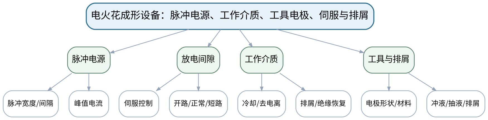

### 教学目标

**知识目标：**
- （1）掌握电火花成形加工系统的主要组成及其功能。
- （2）理解脉冲电源、工作介质、工具电极、伺服进给和排屑之间的系统关系。
**能力目标：**
- （1）能够从加工不稳定现象追溯到电源、间隙、介质、排屑或电极等可能原因。
**价值目标：**
- （1）形成设备状态、工艺参数与安全防护协同管理意识。

### 课程思政

强调高压电、工作液和设备运动风险的联动管理，故障处理先安全停机再分析。

### 专创融合 / 双创融合

将故障链和状态证据转化为设备维护、远程诊断和过程监控规则。

### 教学重难点

教学重点：电火花加工系统各子系统对稳定放电的共同作用。
教学难点：同一异常可能由多个子系统耦合造成，需要基于放电状态和加工证据而非经验单点调参。

### 教学方法

问题引导法、机理讲授法、设备/样件案例分析、参数—质量数据推演、同伴互评与证据复盘

### 教学用具

电脑、投影仪、电火花设备结构图、典型加工状态/波形资料。

### 教学设计

课前任务 → 互动导入（15 min）→ 传授新知与课堂训练（70 min）→ 过关检测（10 min）→ 课堂小结（3 min）→ 作业布置（1 min）→ 考勤（1 min）

### 教学过程

#### 课前任务

【教师】发布“电火花成形设备：脉冲电源、工作介质、工具电极、伺服与排屑”预习/准备要求和一个最小问题，不提前给出完整答案。
- 1. 阅读大纲对应内容与指定教材，圈出3个核心术语；
- 2. 预读一张工艺原理图、样件或参数表，写出第一判断。
- 3. 记录至少1个疑问或安全/环保风险点。
【学生】完成准备并带着问题进入课堂。

**设计意图：** 通过课前阅读、安全/环保准备和最小问题建立先备认知，让学生带着真实工艺问题进入课堂。

#### 互动导入与传授新知 / 课堂训练

【互动导入 15 min】
【教师】给出“加工速度下降、短路报警增加、表面发黑”案例，要求学生先画故障因果链而不是直接说“加大电流”。
【学生】先独立预测/判断/观察，再交换依据，不先听完整结论。

【传授新知与课堂训练 70 min】
**一、核心机理与工艺结构讲解（约25 min）—系统组成**

【教师】从脉冲电源、机床本体、工作液循环、工具电极和伺服控制建立系统框图。

【学生】按任务约束完成分析/实验，保存中间结果并说明判断依据；教师只提示定位方法、边界与验收条件，不代替学生完成核心产物。

**二、参数/案例分析与学生推演（约25 min）—间隙与排屑**

【教师】解释放电间隙维持、排屑与去电离，比较排屑不良和间隙过小的现象关联。

【学生】按任务约束完成分析/实验，保存中间结果并说明判断依据；教师只提示定位方法、边界与验收条件，不代替学生完成核心产物。

**三、独立产出、互审与证据复盘（约20 min）—故障链分析**

【教师】学生用“现象—证据—可能原因—验证办法”分析短路频繁、效率下降和电极损耗异常三个案例。

【学生】按任务约束完成分析/实验，保存中间结果并说明判断依据；教师只提示定位方法、边界与验收条件，不代替学生完成核心产物。

【课堂产物】电火花系统框图 + 故障链分析表。

【学习证据】系统图、故障因果链、验证顺序和安全检查项。

【评价关联】平时成绩、课程作业；目标1.2、2.2、3.2。

**设计意图：** 采用“先看现象/需求 → 最小机理讲解 → 参数/案例或实验分析 → 证据固化”的闭环，使工艺结论能够追溯到材料、参数、质量与安全环保证据。

#### 过关检测

【教师】组织当堂检测：
- 1. 伺服系统主要控制什么量？
- 2. 为什么排屑不良会破坏稳定放电？
- 3. 诊断加工异常为什么不能一次同时改多个参数？
【学生】独立作答/数据判断；【教师】依据错误类型进行针对性讲解并要求说明判断依据。

**设计意图：** 用机理、参数、质量和边界问题即时检测关键知识，避免只记工艺名称。

#### 课堂小结

【教师】回到知识脉络图，用“机理—设备/参数—质量—应用—风险”总结“电火花成形设备：脉冲电源、工作介质、工具电极、伺服与排屑”，再次强调：电火花加工系统各子系统对稳定放电的共同作用。
【学生】写下本课最重要的一条工艺规则和一个最容易忽略的安全/质量边界。

**设计意图：** 压缩本课信息并把规则、边界与后续工艺比较或实验任务连接。

#### 作业布置

【教师】布置课后任务：完成一个“短路频繁”故障树，至少给出4个原因和对应验证证据。
【学生】按课程文件命名和证据规范整理提交。

**设计意图：** 固化课堂产物，形成可复查、可追溯的过程证据。

#### 考勤

【教师】利用学校/课程实际使用的平台进行签到。
【学生】按课程要求完成签到。

**设计意图：** 保留学校模板考勤环节，不在教案中预填出勤事实。

### 课后教学反思

【课后填写，不预填事实】
- 1. 教学流程：记录100 min各环节实际用时及需调整的位置；
- 2. 教学内容：重点记录“同一异常可能由多个子系统耦合造成，需要基于放电状态和加工证据而非经验单点调参。”的真实掌握证据与常见错误；
- 3. 学生参与：仅依据实际课堂记录填写独立分析、实验、互审或方案讨论情况，不补写推测；
- 4. 评价证据：检查本课工艺分析/实验数据/样件图像/测试/方案记录是否完整，记录缺项及原因；
- 5. 后续改进：依据真实课堂证据确定下一轮调整。

### 本章节参考文献

[1] 白基成, 刘晋春, 郭永丰, 杨晓冬等. 特种加工（第7版）[M]. 北京：机械工业出版社，2022. ISBN 9787111679868

## 第04次课 电火花工艺规律：效率、工具损耗、精度与表面质量

- **章节/单元**：第二单元 电火花成形与线切割（2学时）
- **周次**：按实际课表填写
- **课时安排**：2课时（100 min）
- **课型**：理论

### 知识脉络图

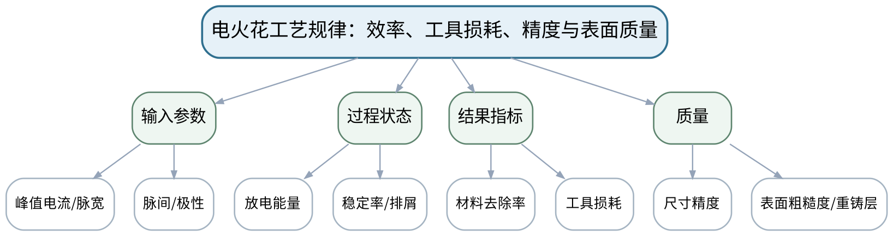

### 教学目标

**知识目标：**
- （1）理解脉冲能量、峰值电流、脉宽、脉间、极性和间隙条件对材料去除与表面质量的影响。
- （2）掌握材料去除率、工具损耗、加工精度和表面粗糙度之间的基本权衡。
**能力目标：**
- （1）能够读取参数—质量对比数据并形成“参数变化—机理—指标变化”的因果解释。
**价值目标：**
- （1）形成尊重实验数据、避免只追求单一效率指标的质量意识。

### 课程思政

通过“不选择性展示最好结果”强调实验数据诚信和工艺结论的适用边界。

### 专创融合 / 双创融合

把多指标工艺窗口视为后续智能参数推荐和工艺数据库的基本数据结构。

### 教学重难点

教学重点：参数、放电能量与效率/质量/工具损耗之间的权衡。
教学难点：参数影响存在耦合和材料依赖，不能把某个经验趋势外推到全部工件/电极组合。

### 教学方法

问题引导法、机理讲授法、设备/样件案例分析、参数—质量数据推演、同伴互评与证据复盘

### 教学用具

电脑、投影仪、参数—质量样例数据、表面形貌图片、教材。

### 教学设计

课前任务 → 互动导入（15 min）→ 传授新知与课堂训练（70 min）→ 过关检测（10 min）→ 课堂小结（3 min）→ 作业布置（1 min）→ 考勤（1 min）

### 教学过程

#### 课前任务

【教师】发布“电火花工艺规律：效率、工具损耗、精度与表面质量”预习/准备要求和一个最小问题，不提前给出完整答案。
- 1. 阅读大纲对应内容与指定教材，圈出3个核心术语；
- 2. 预读一张工艺原理图、样件或参数表，写出第一判断。
- 3. 记录至少1个疑问或安全/环保风险点。
【学生】完成准备并带着问题进入课堂。

**设计意图：** 通过课前阅读、安全/环保准备和最小问题建立先备认知，让学生带着真实工艺问题进入课堂。

#### 互动导入与传授新知 / 课堂训练

【互动导入 15 min】
【教师】展示两组加工结果：A速度高但表面粗糙、B速度低但表面好，要求学生根据“粗加工/精加工”任务分别选择并说明。
【学生】先独立预测/判断/观察，再交换依据，不先听完整结论。

【传授新知与课堂训练 70 min】
**一、核心机理与工艺结构讲解（约25 min）—参数与能量**

【教师】从单脉冲能量和放电频率解释峰值电流、脉宽、脉间对蚀除坑和效率的影响。

【学生】按任务约束完成分析/实验，保存中间结果并说明判断依据；教师只提示定位方法、边界与验收条件，不代替学生完成核心产物。

**二、参数/案例分析与学生推演（约25 min）—质量与损耗**

【教师】讨论电极损耗、尺寸精度、表面粗糙度、重铸层及热影响，建立多指标权衡。

【学生】按任务约束完成分析/实验，保存中间结果并说明判断依据；教师只提示定位方法、边界与验收条件，不代替学生完成核心产物。

**三、独立产出、互审与证据复盘（约20 min）—数据解释**

【教师】学生分析一份参数对比表，给出粗加工和精加工的不同参数策略，并标注结论证据。

【学生】按任务约束完成分析/实验，保存中间结果并说明判断依据；教师只提示定位方法、边界与验收条件，不代替学生完成核心产物。

【课堂产物】粗/精加工参数—质量决策表。

【学习证据】参数表、指标对比、因果解释和一条“不确定/需实验验证”项。

【评价关联】平时成绩、课程作业、期末考核；目标1.2、2.2、3.2、3.5。

**设计意图：** 采用“先看现象/需求 → 最小机理讲解 → 参数/案例或实验分析 → 证据固化”的闭环，使工艺结论能够追溯到材料、参数、质量与安全环保证据。

#### 过关检测

【教师】组织当堂检测：
- 1. 提高单脉冲能量通常会怎样影响蚀除坑？
- 2. 高材料去除率为什么可能牺牲表面质量？
- 3. 工艺规律为什么必须注明材料和加工条件？
【学生】独立作答/数据判断；【教师】依据错误类型进行针对性讲解并要求说明判断依据。

**设计意图：** 用机理、参数、质量和边界问题即时检测关键知识，避免只记工艺名称。

#### 课堂小结

【教师】回到知识脉络图，用“机理—设备/参数—质量—应用—风险”总结“电火花工艺规律：效率、工具损耗、精度与表面质量”，再次强调：参数、放电能量与效率/质量/工具损耗之间的权衡。
【学生】写下本课最重要的一条工艺规则和一个最容易忽略的安全/质量边界。

**设计意图：** 压缩本课信息并把规则、边界与后续工艺比较或实验任务连接。

#### 作业布置

【教师】布置课后任务：整理一张“粗加工—半精加工—精加工”参数目标表，不要求给具体设备数值，但必须说明每阶段的指标优先级。
【学生】按课程文件命名和证据规范整理提交。

**设计意图：** 固化课堂产物，形成可复查、可追溯的过程证据。

#### 考勤

【教师】利用学校/课程实际使用的平台进行签到。
【学生】按课程要求完成签到。

**设计意图：** 保留学校模板考勤环节，不在教案中预填出勤事实。

### 课后教学反思

【课后填写，不预填事实】
- 1. 教学流程：记录100 min各环节实际用时及需调整的位置；
- 2. 教学内容：重点记录“参数影响存在耦合和材料依赖，不能把某个经验趋势外推到全部工件/电极组合。”的真实掌握证据与常见错误；
- 3. 学生参与：仅依据实际课堂记录填写独立分析、实验、互审或方案讨论情况，不补写推测；
- 4. 评价证据：检查本课工艺分析/实验数据/样件图像/测试/方案记录是否完整，记录缺项及原因；
- 5. 后续改进：依据真实课堂证据确定下一轮调整。

### 本章节参考文献

[1] 白基成, 刘晋春, 郭永丰, 杨晓冬等. 特种加工（第7版）[M]. 北京：机械工业出版社，2022. ISBN 9787111679868

## 第05次课 电火花线切割设备、路径、参数与加工质量

- **章节/单元**：第二单元 电火花成形与线切割（2学时）
- **周次**：按实际课表填写
- **课时安排**：2课时（100 min）
- **课型**：理论

### 知识脉络图

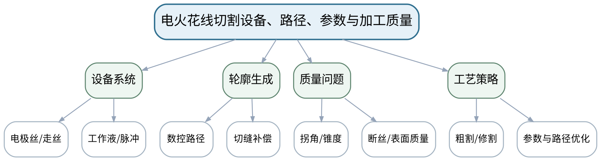

### 教学目标

**知识目标：**
- （1）掌握线切割的基本设备组成、走丝/电极丝、脉冲放电和轮廓加工特点。
- （2）理解切缝、锥度、拐角、断丝、表面质量及多次切割等工艺概念。
**能力目标：**
- （1）能够根据零件轮廓、材料厚度和质量要求分析线切割路径及主要质量风险。
**价值目标：**
- （1）形成工艺程序、材料、参数和加工证据可追溯意识。

### 课程思政

以断丝、工作液和高压电风险强调工艺调整必须遵守设备安全程序。

### 专创融合 / 双创融合

将轮廓质量与过程状态结合，讨论线切割工艺数据对模具数字化制造和质量追溯的价值。

### 教学重难点

教学重点：线切割轮廓生成与切缝/拐角质量。
教学难点：编程几何路径与实际切割轮廓之间存在电极丝半径、放电间隙、丝振动和工艺滞后等差异。

### 教学方法

问题引导法、机理讲授法、设备/样件案例分析、参数—质量数据推演、同伴互评与证据复盘

### 教学用具

电脑、投影仪、线切割设备/轮廓示意、典型样件图片、工艺卡模板。

### 教学设计

课前任务 → 互动导入（15 min）→ 传授新知与课堂训练（70 min）→ 过关检测（10 min）→ 课堂小结（3 min）→ 作业布置（1 min）→ 考勤（1 min）

### 教学过程

#### 课前任务

【教师】发布“电火花线切割设备、路径、参数与加工质量”预习/准备要求和一个最小问题，不提前给出完整答案。
- 1. 阅读大纲对应内容与指定教材，圈出3个核心术语；
- 2. 预读一张工艺原理图、样件或参数表，写出第一判断。
- 3. 记录至少1个疑问或安全/环保风险点。
【学生】完成准备并带着问题进入课堂。

**设计意图：** 通过课前阅读、安全/环保准备和最小问题建立先备认知，让学生带着真实工艺问题进入课堂。

#### 互动导入与传授新知 / 课堂训练

【互动导入 15 min】
【教师】给出一个带尖角的模具轮廓，提问为什么程序轨迹是尖角，实际加工仍可能出现角部误差。
【学生】先独立预测/判断/观察，再交换依据，不先听完整结论。

【传授新知与课堂训练 70 min】
**一、核心机理与工艺结构讲解（约25 min）—设备与路径**

【教师】建立工件—电极丝—放电间隙—数控轨迹关系，解释走丝与轮廓形成。

【学生】按任务约束完成分析/实验，保存中间结果并说明判断依据；教师只提示定位方法、边界与验收条件，不代替学生完成核心产物。

**二、参数/案例分析与学生推演（约25 min）—质量与故障**

【教师】分析切缝、拐角、锥度、断丝、厚件稳定性和表面质量，说明多次切割的目的。

【学生】按任务约束完成分析/实验，保存中间结果并说明判断依据；教师只提示定位方法、边界与验收条件，不代替学生完成核心产物。

**三、独立产出、互审与证据复盘（约20 min）—工艺评审**

【教师】学生为一件冲裁模零件绘制线切割工艺路线，指出起割点、穿丝/引入、关键角部和质量检查项。

【学生】按任务约束完成分析/实验，保存中间结果并说明判断依据；教师只提示定位方法、边界与验收条件，不代替学生完成核心产物。

【课堂产物】线切割轮廓工艺卡 + 质量风险清单。

【学习证据】路径草图、质量风险、检查项和一条故障处理顺序。

【评价关联】平时成绩、课程作业、期末考核；目标1.2、2.2、3.2。

**设计意图：** 采用“先看现象/需求 → 最小机理讲解 → 参数/案例或实验分析 → 证据固化”的闭环，使工艺结论能够追溯到材料、参数、质量与安全环保证据。

#### 过关检测

【教师】组织当堂检测：
- 1. 线切割为什么会形成切缝宽度？
- 2. 尖角误差可能来自哪些过程因素？
- 3. 多次切割主要改善哪些质量指标？
【学生】独立作答/数据判断；【教师】依据错误类型进行针对性讲解并要求说明判断依据。

**设计意图：** 用机理、参数、质量和边界问题即时检测关键知识，避免只记工艺名称。

#### 课堂小结

【教师】回到知识脉络图，用“机理—设备/参数—质量—应用—风险”总结“电火花线切割设备、路径、参数与加工质量”，再次强调：线切割轮廓生成与切缝/拐角质量。
【学生】写下本课最重要的一条工艺规则和一个最容易忽略的安全/质量边界。

**设计意图：** 压缩本课信息并把规则、边界与后续工艺比较或实验任务连接。

#### 作业布置

【教师】布置课后任务：针对厚板复杂轮廓列出4个质量风险，并为每项写出验证方法。
【学生】按课程文件命名和证据规范整理提交。

**设计意图：** 固化课堂产物，形成可复查、可追溯的过程证据。

#### 考勤

【教师】利用学校/课程实际使用的平台进行签到。
【学生】按课程要求完成签到。

**设计意图：** 保留学校模板考勤环节，不在教案中预填出勤事实。

### 课后教学反思

【课后填写，不预填事实】
- 1. 教学流程：记录100 min各环节实际用时及需调整的位置；
- 2. 教学内容：重点记录“编程几何路径与实际切割轮廓之间存在电极丝半径、放电间隙、丝振动和工艺滞后等差异。”的真实掌握证据与常见错误；
- 3. 学生参与：仅依据实际课堂记录填写独立分析、实验、互审或方案讨论情况，不补写推测；
- 4. 评价证据：检查本课工艺分析/实验数据/样件图像/测试/方案记录是否完整，记录缺项及原因；
- 5. 后续改进：依据真实课堂证据确定下一轮调整。

### 本章节参考文献

[1] 白基成, 刘晋春, 郭永丰, 杨晓冬等. 特种加工（第7版）[M]. 北京：机械工业出版社，2022. ISBN 9787111679868

## 第06次课 实验一：电火花/线切割参数变化与加工质量验证

- **章节/单元**：实验一 电火花/线切割参数与质量（2学时）
- **周次**：按实际课表填写
- **课时安排**：2课时（100 min）
- **课型**：实验

### 知识脉络图

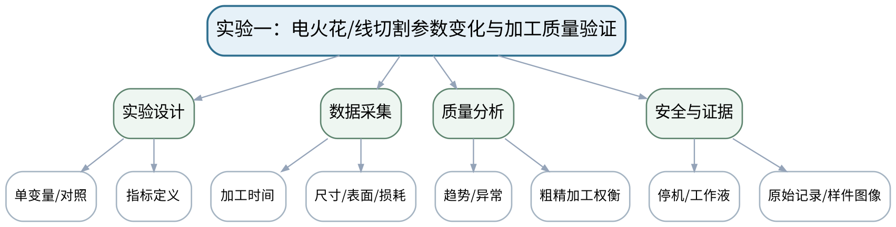

### 教学目标

**知识目标：**
- （1）理解典型工艺参数与加工时间、尺寸、表面状态或工具损耗之间的实验关系。
**能力目标：**
- （1）能够按实验方案改变一个主要变量、记录原始参数和质量结果，并形成参数—质量结论。
**价值目标：**
- （1）形成高压电、工作液、设备运动安全以及原始数据诚信意识。

### 课程思政

把设备安全、原始记录和如实报告异常统一为工程实验责任。

### 专创融合 / 双创融合

把实验数据整理为可进入工艺数据库的结构化记录，为后续参数推荐与质量分析提供基础。

### 教学重难点

教学重点：受控参数对比和原始数据记录。
教学难点：实验设备和材料条件会影响趋势，不能用一次结果替代可重复结论；异常数据应保留并解释。

### 教学方法

实验演示法、分组实验法、变量控制、原始数据记录、样件/图像比较、质量分析、安全检查与实验复盘

### 教学用具

电火花/线切割设备或等效实验平台、测量工具、样件/图像、记录表。

### 教学设计

课前任务 → 互动导入（15 min）→ 传授新知与课堂训练（70 min）→ 过关检测（10 min）→ 课堂小结（3 min）→ 作业布置（1 min）→ 考勤（1 min）

### 教学过程

#### 课前任务

【教师】发布“实验一：电火花/线切割参数变化与加工质量验证”预习/准备要求和一个最小问题，不提前给出完整答案。
- 1. 阅读大纲对应内容与指定教材，圈出3个核心术语；
- 2. 阅读实验安全与设备/样件/数据说明，准备原始记录表。
- 3. 记录至少1个疑问或安全/环保风险点。
【学生】完成准备并带着问题进入课堂。

**设计意图：** 通过课前阅读、安全/环保准备和最小问题建立先备认知，让学生带着真实工艺问题进入课堂。

#### 互动导入与传授新知 / 课堂训练

【互动导入 15 min】
【教师】教师展示一份只保留“最漂亮表面”的实验记录，要求学生指出为什么无法支持参数优选结论。
【学生】先独立预测/判断/观察，再交换依据，不先听完整结论。

【传授新知与课堂训练 70 min】
**一、安全检查与实验设计确认（约15 min）—安全与实验设计**

【教师】确认设备安全、工作液和实验边界；确定对照组、唯一主要变量和需要记录的质量指标。

【学生】按任务约束完成分析/实验，保存中间结果并说明判断依据；教师只提示定位方法、边界与验收条件，不代替学生完成核心产物。

**二、分组实验/样件与数据采集（约35 min）—分组实验/等效数据**

【教师】按设备条件完成电火花或线切割参数对比；若使用等效平台/既有数据，必须保留数据来源和条件。

【学生】按任务约束完成分析/实验，保存中间结果并说明判断依据；教师只提示定位方法、边界与验收条件，不代替学生完成核心产物。

**三、数据复核、质量分析与证据固化（约20 min）—数据复核**

【教师】整理加工时间、尺寸/表面或损耗，绘制简单对比图/表；同伴复核原始记录和结论是否一致。

【学生】按任务约束完成分析/实验，保存中间结果并说明判断依据；教师只提示定位方法、边界与验收条件，不代替学生完成核心产物。

【课堂产物】实验一记录表 + 参数—质量对比图/表 + 实验结论。

【学习证据】原始参数、样件/图像、测量/质量记录、异常数据、同伴复核记录。

【评价关联】课程作业；目标1.2、2.2、2.6、3.2、3.5。

**设计意图：** 采用“先看现象/需求 → 最小机理讲解 → 参数/案例或实验分析 → 证据固化”的闭环，使工艺结论能够追溯到材料、参数、质量与安全环保证据。

#### 过关检测

【教师】组织当堂检测：
- 1. 为什么一次只改变一个主要参数更利于解释？
- 2. 异常数据应如何处理？
- 3. 实验结论为什么必须注明材料、设备和参数范围？
【学生】独立作答/数据判断；【教师】依据错误类型进行针对性讲解并要求说明判断依据。

**设计意图：** 用机理、参数、质量和边界问题即时检测关键知识，避免只记工艺名称。

#### 课堂小结

【教师】回到知识脉络图，用“机理—设备/参数—质量—应用—风险”总结“实验一：电火花/线切割参数变化与加工质量验证”，再次强调：受控参数对比和原始数据记录。
【学生】写下本课最重要的一条工艺规则和一个最容易忽略的安全/质量边界。

**设计意图：** 压缩本课信息并把规则、边界与后续工艺比较或实验任务连接。

#### 作业布置

【教师】布置课后任务：完成实验一报告，保留原始数据并写出一条“本实验不能推出”的结论。
【学生】按课程文件命名和证据规范整理提交。

**设计意图：** 固化课堂产物，形成可复查、可追溯的过程证据。

#### 考勤

【教师】利用学校/课程实际使用的平台进行签到。
【学生】按课程要求完成签到。

**设计意图：** 保留学校模板考勤环节，不在教案中预填出勤事实。

### 课后教学反思

【课后填写，不预填事实】
- 1. 教学流程：记录100 min各环节实际用时及需调整的位置；
- 2. 教学内容：重点记录“实验设备和材料条件会影响趋势，不能用一次结果替代可重复结论；异常数据应保留并解释。”的真实掌握证据与常见错误；
- 3. 学生参与：仅依据实际课堂记录填写独立分析、实验、互审或方案讨论情况，不补写推测；
- 4. 评价证据：检查本课工艺分析/实验数据/样件图像/测试/方案记录是否完整，记录缺项及原因；
- 5. 后续改进：依据真实课堂证据确定下一轮调整。

### 本章节参考文献

[1] 白基成, 刘晋春, 郭永丰, 杨晓冬等. 特种加工（第7版）[M]. 北京：机械工业出版社，2022. ISBN 9787111679868
[2] 《特种加工技术》课程教学大纲，2026年9月。

## 第07次课 电化学加工机理、电解液与工具阴极

- **章节/单元**：第三单元 电化学加工与表面处理（2学时）
- **周次**：按实际课表填写
- **课时安排**：2课时（100 min）
- **课型**：理论

### 知识脉络图

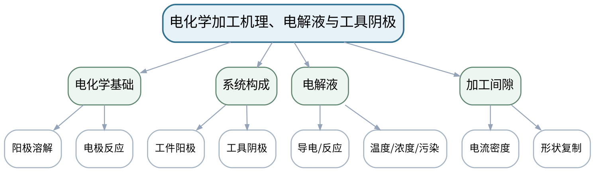

### 教学目标

**知识目标：**
- （1）掌握阳极溶解、电极反应和电化学加工的基本机理。
- （2）理解电解液、工具阴极、工件阳极和加工间隙的作用。
**能力目标：**
- （1）能够从材料、电解液和阴极形状分析加工可行性及主要风险。
**价值目标：**
- （1）形成电解液化学危害、腐蚀和废液管理意识。

### 课程思政

围绕电解液、腐蚀和废液强调生产安全、环境合规和资源责任。

### 专创融合 / 双创融合

把电解液状态和间隙条件视为过程监控变量，讨论绿色工艺与数字化管理。

### 教学重难点

教学重点：阳极溶解机理与工具阴极/间隙共同决定成形。
教学难点：电化学加工不是“无热影响就没有风险”，电解液化学危害、腐蚀和杂散加工同样需要控制。

### 教学方法

问题引导法、机理讲授法、设备/样件案例分析、参数—质量数据推演、同伴互评与证据复盘

### 教学用具

电脑、投影仪、电化学加工原理图、典型工具阴极/样件图、教材。

### 教学设计

课前任务 → 互动导入（15 min）→ 传授新知与课堂训练（70 min）→ 过关检测（10 min）→ 课堂小结（3 min）→ 作业布置（1 min）→ 考勤（1 min）

### 教学过程

#### 课前任务

【教师】发布“电化学加工机理、电解液与工具阴极”预习/准备要求和一个最小问题，不提前给出完整答案。
- 1. 阅读大纲对应内容与指定教材，圈出3个核心术语；
- 2. 预读一张工艺原理图、样件或参数表，写出第一判断。
- 3. 记录至少1个疑问或安全/环保风险点。
【学生】完成准备并带着问题进入课堂。

**设计意图：** 通过课前阅读、安全/环保准备和最小问题建立先备认知，让学生带着真实工艺问题进入课堂。

#### 互动导入与传授新知 / 课堂训练

【互动导入 15 min】
【教师】把“工件接正极”和“工件接负极”两种接线并列，要求学生根据阳极溶解判断哪种才符合电化学去除。
【学生】先独立预测/判断/观察，再交换依据，不先听完整结论。

【传授新知与课堂训练 70 min】
**一、核心机理与工艺结构讲解（约25 min）—阳极溶解**

【教师】从电极反应和电流通过电解液解释材料去除，明确工件/工具极性。

【学生】按任务约束完成分析/实验，保存中间结果并说明判断依据；教师只提示定位方法、边界与验收条件，不代替学生完成核心产物。

**二、参数/案例分析与学生推演（约25 min）—电解液与阴极**

【教师】说明电解液导电、传质、温升和污染，以及工具阴极形状如何影响加工区。

【学生】按任务约束完成分析/实验，保存中间结果并说明判断依据；教师只提示定位方法、边界与验收条件，不代替学生完成核心产物。

**三、独立产出、互审与证据复盘（约20 min）—风险辨析**

【教师】学生分析电解液选择、腐蚀、泄漏、通风和废液处理风险，形成工艺与环境并行检查表。

【学生】按任务约束完成分析/实验，保存中间结果并说明判断依据；教师只提示定位方法、边界与验收条件，不代替学生完成核心产物。

【课堂产物】电化学加工系统图 + 电解液/阴极风险检查表。

【学习证据】极性判断、系统图、风险项和控制原则。

【评价关联】平时成绩、课程作业；目标1.3、2.3、3.3。

**设计意图：** 采用“先看现象/需求 → 最小机理讲解 → 参数/案例或实验分析 → 证据固化”的闭环，使工艺结论能够追溯到材料、参数、质量与安全环保证据。

#### 过关检测

【教师】组织当堂检测：
- 1. 电化学加工中工件通常作为哪一极？
- 2. 工具阴极为什么不等于最终零件几何的简单复制？
- 3. 电解液管理为什么既是工艺问题也是环境问题？
【学生】独立作答/数据判断；【教师】依据错误类型进行针对性讲解并要求说明判断依据。

**设计意图：** 用机理、参数、质量和边界问题即时检测关键知识，避免只记工艺名称。

#### 课堂小结

【教师】回到知识脉络图，用“机理—设备/参数—质量—应用—风险”总结“电化学加工机理、电解液与工具阴极”，再次强调：阳极溶解机理与工具阴极/间隙共同决定成形。
【学生】写下本课最重要的一条工艺规则和一个最容易忽略的安全/质量边界。

**设计意图：** 压缩本课信息并把规则、边界与后续工艺比较或实验任务连接。

#### 作业布置

【教师】布置课后任务：画出电化学加工系统框图并标注材料流、电流和电解液流。
【学生】按课程文件命名和证据规范整理提交。

**设计意图：** 固化课堂产物，形成可复查、可追溯的过程证据。

#### 考勤

【教师】利用学校/课程实际使用的平台进行签到。
【学生】按课程要求完成签到。

**设计意图：** 保留学校模板考勤环节，不在教案中预填出勤事实。

### 课后教学反思

【课后填写，不预填事实】
- 1. 教学流程：记录100 min各环节实际用时及需调整的位置；
- 2. 教学内容：重点记录“电化学加工不是“无热影响就没有风险”，电解液化学危害、腐蚀和杂散加工同样需要控制。”的真实掌握证据与常见错误；
- 3. 学生参与：仅依据实际课堂记录填写独立分析、实验、互审或方案讨论情况，不补写推测；
- 4. 评价证据：检查本课工艺分析/实验数据/样件图像/测试/方案记录是否完整，记录缺项及原因；
- 5. 后续改进：依据真实课堂证据确定下一轮调整。

### 本章节参考文献

[1] 白基成, 刘晋春, 郭永丰, 杨晓冬等. 特种加工（第7版）[M]. 北京：机械工业出版社，2022. ISBN 9787111679868

## 第08次课 加工间隙、流场、电解磨削与电解抛光

- **章节/单元**：第三单元 电化学加工与表面处理（2学时）
- **周次**：按实际课表填写
- **课时安排**：2课时（100 min）
- **课型**：理论

### 知识脉络图

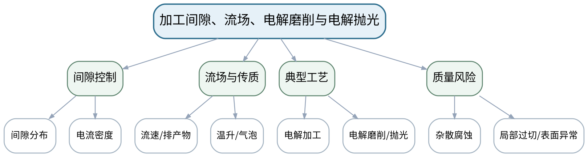

### 教学目标

**知识目标：**
- （1）理解加工间隙、流场、电流密度、传质和温升对电化学成形稳定性的影响。
- （2）掌握电解磨削、电解抛光等典型电化学复合/表面处理方式的基本特点。
**能力目标：**
- （1）能够分析间隙不均、流场不良、杂散腐蚀和表面质量异常的可能原因。
**价值目标：**
- （1）形成腐蚀环境、废液与过程稳定性协同治理意识。

### 课程思政

把环境治理与过程控制放在同一工艺系统中，避免把废液处理视为生产之外的附加事项。

### 专创融合 / 双创融合

讨论流场、电流和加工质量数据对智能监测及绿色制造优化的价值。

### 教学重难点

教学重点：间隙—流场—电流密度—成形质量的耦合。
教学难点：流场和电化学反应互相影响，不能仅靠电压/电流单参数解释局部过切与表面问题。

### 教学方法

问题引导法、机理讲授法、设备/样件案例分析、参数—质量数据推演、同伴互评与证据复盘

### 教学用具

电脑、投影仪、间隙/流场示意、典型表面形貌、工艺比较资料。

### 教学设计

课前任务 → 互动导入（15 min）→ 传授新知与课堂训练（70 min）→ 过关检测（10 min）→ 课堂小结（3 min）→ 作业布置（1 min）→ 考勤（1 min）

### 教学过程

#### 课前任务

【教师】发布“加工间隙、流场、电解磨削与电解抛光”预习/准备要求和一个最小问题，不提前给出完整答案。
- 1. 阅读大纲对应内容与指定教材，圈出3个核心术语；
- 2. 预读一张工艺原理图、样件或参数表，写出第一判断。
- 3. 记录至少1个疑问或安全/环保风险点。
【学生】完成准备并带着问题进入课堂。

**设计意图：** 通过课前阅读、安全/环保准备和最小问题建立先备认知，让学生带着真实工艺问题进入课堂。

#### 互动导入与传授新知 / 课堂训练

【互动导入 15 min】
【教师】给出同一工具阴极下局部过切集中在流场死区附近的案例，要求学生画出“气泡/产物—电导—电流密度—去除量”链。
【学生】先独立预测/判断/观察，再交换依据，不先听完整结论。

【传授新知与课堂训练 70 min】
**一、核心机理与工艺结构讲解（约25 min）—间隙与电流密度**

【教师】解释间隙变化如何影响局部电流密度和去除速度，建立成形反馈概念。

【学生】按任务约束完成分析/实验，保存中间结果并说明判断依据；教师只提示定位方法、边界与验收条件，不代替学生完成核心产物。

**二、参数/案例分析与学生推演（约25 min）—流场与加工稳定**

【教师】分析气泡、产物、温升和流速对间隙反应条件的影响。

【学生】按任务约束完成分析/实验，保存中间结果并说明判断依据；教师只提示定位方法、边界与验收条件，不代替学生完成核心产物。

**三、独立产出、互审与证据复盘（约20 min）—工艺比较**

【教师】比较电解加工、电解磨削、电解抛光在材料去除、表面质量和应用对象上的差异，学生完成问题诊断表。

【学生】按任务约束完成分析/实验，保存中间结果并说明判断依据；教师只提示定位方法、边界与验收条件，不代替学生完成核心产物。

【课堂产物】电化学质量故障因果链 + 三种工艺比较表。

【学习证据】间隙/流场因果图、工艺比较和一条杂散腐蚀防控原则。

【评价关联】平时成绩、课程作业、期末考核；目标1.3、2.3、3.3。

**设计意图：** 采用“先看现象/需求 → 最小机理讲解 → 参数/案例或实验分析 → 证据固化”的闭环，使工艺结论能够追溯到材料、参数、质量与安全环保证据。

#### 过关检测

【教师】组织当堂检测：
- 1. 加工间隙变小为什么会改变局部去除速度？
- 2. 流场死区可能引起哪些现象？
- 3. 电解磨削与单纯电解加工的材料去除机制有什么区别？
【学生】独立作答/数据判断；【教师】依据错误类型进行针对性讲解并要求说明判断依据。

**设计意图：** 用机理、参数、质量和边界问题即时检测关键知识，避免只记工艺名称。

#### 课堂小结

【教师】回到知识脉络图，用“机理—设备/参数—质量—应用—风险”总结“加工间隙、流场、电解磨削与电解抛光”，再次强调：间隙—流场—电流密度—成形质量的耦合。
【学生】写下本课最重要的一条工艺规则和一个最容易忽略的安全/质量边界。

**设计意图：** 压缩本课信息并把规则、边界与后续工艺比较或实验任务连接。

#### 作业布置

【教师】布置课后任务：选择一个电化学加工质量问题，按“现象—可能机理—证据—改进方向”写出分析。
【学生】按课程文件命名和证据规范整理提交。

**设计意图：** 固化课堂产物，形成可复查、可追溯的过程证据。

#### 考勤

【教师】利用学校/课程实际使用的平台进行签到。
【学生】按课程要求完成签到。

**设计意图：** 保留学校模板考勤环节，不在教案中预填出勤事实。

### 课后教学反思

【课后填写，不预填事实】
- 1. 教学流程：记录100 min各环节实际用时及需调整的位置；
- 2. 教学内容：重点记录“流场和电化学反应互相影响，不能仅靠电压/电流单参数解释局部过切与表面问题。”的真实掌握证据与常见错误；
- 3. 学生参与：仅依据实际课堂记录填写独立分析、实验、互审或方案讨论情况，不补写推测；
- 4. 评价证据：检查本课工艺分析/实验数据/样件图像/测试/方案记录是否完整，记录缺项及原因；
- 5. 后续改进：依据真实课堂证据确定下一轮调整。

### 本章节参考文献

[1] 白基成, 刘晋春, 郭永丰, 杨晓冬等. 特种加工（第7版）[M]. 北京：机械工业出版社，2022. ISBN 9787111679868

## 第09次课 电化学加工收束与激光加工机理、能量耦合导入

- **章节/单元**：第三单元（1学时）+第四单元 激光、超声与水射流加工（1学时）
- **周次**：按实际课表填写
- **课时安排**：2课时（100 min）
- **课型**：理论

### 知识脉络图

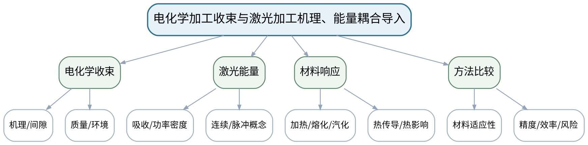

### 教学目标

**知识目标：**
- （1）总结电化学加工的机理、质量与环境边界。
- （2）理解激光材料加工中的能量吸收、加热、熔化/汽化与辅助气体等基本作用。
**能力目标：**
- （1）能够比较电化学加工和激光加工在材料适应性、热影响、效率与环保方面的差异。
**价值目标：**
- （1）形成跨方法比较和激光辐射防护意识。

### 课程思政

强调激光辐射不可凭经验判断安全，必须依赖防护等级、隔离和规范操作。

### 专创融合 / 双创融合

训练用统一指标比较不同特种加工方法，为工艺路线智能推荐奠定结构化数据基础。

### 教学重难点

教学重点：从电化学“化学能去除”过渡到激光“光热能量耦合”的方法比较。
教学难点：激光加工质量不仅由“功率大小”决定，还受光斑、速度、材料吸收和辅助条件等共同影响。

### 教学方法

问题引导法、机理讲授法、设备/样件案例分析、参数—质量数据推演、同伴互评与证据复盘

### 教学用具

电脑、投影仪、激光材料相互作用示意、材料案例、教材。

### 教学设计

课前任务 → 互动导入（15 min）→ 传授新知与课堂训练（70 min）→ 过关检测（10 min）→ 课堂小结（3 min）→ 作业布置（1 min）→ 考勤（1 min）

### 教学过程

#### 课前任务

【教师】发布“电化学加工收束与激光加工机理、能量耦合导入”预习/准备要求和一个最小问题，不提前给出完整答案。
- 1. 阅读大纲对应内容与指定教材，圈出3个核心术语；
- 2. 预读一张工艺原理图、样件或参数表，写出第一判断。
- 3. 记录至少1个疑问或安全/环保风险点。
【学生】完成准备并带着问题进入课堂。

**设计意图：** 通过课前阅读、安全/环保准备和最小问题建立先备认知，让学生带着真实工艺问题进入课堂。

#### 互动导入与传授新知 / 课堂训练

【互动导入 15 min】
【教师】把不锈钢薄板和透明/高反材料的激光响应示意并列，要求学生解释为什么相同激光参数不能简单复制到不同材料。
【学生】先独立预测/判断/观察，再交换依据，不先听完整结论。

【传授新知与课堂训练 70 min】
**一、核心机理与工艺结构讲解（约25 min）—电化学单元收束**

【教师】用一个叶片/复杂型面案例总结电化学适用条件、质量和环保边界。

【学生】按任务约束完成分析/实验，保存中间结果并说明判断依据；教师只提示定位方法、边界与验收条件，不代替学生完成核心产物。

**二、参数/案例分析与学生推演（约25 min）—激光机理导入**

【教师】解释激光束与材料的能量耦合、功率密度、作用时间和热传导，建立热影响概念。

【学生】按任务约束完成分析/实验，保存中间结果并说明判断依据；教师只提示定位方法、边界与验收条件，不代替学生完成核心产物。

**三、独立产出、互审与证据复盘（约20 min）—跨方法比较**

【教师】学生比较电火花、电化学和激光三类方法的能量形式、材料要求、典型质量风险和安全防护。

【学生】按任务约束完成分析/实验，保存中间结果并说明判断依据；教师只提示定位方法、边界与验收条件，不代替学生完成核心产物。

【课堂产物】三类方法能量—材料—质量—风险比较矩阵。

【学习证据】比较矩阵、材料适应性判断和一条激光防护原则。

【评价关联】平时成绩、课程作业；目标1.3、1.4、2.3、2.4、3.3、3.4。

**设计意图：** 采用“先看现象/需求 → 最小机理讲解 → 参数/案例或实验分析 → 证据固化”的闭环，使工艺结论能够追溯到材料、参数、质量与安全环保证据。

#### 过关检测

【教师】组织当堂检测：
- 1. 激光加工中材料吸收率为什么重要？
- 2. 热影响区来自什么物理过程？
- 3. 电化学和激光加工在材料导电性要求上有什么差别？
【学生】独立作答/数据判断；【教师】依据错误类型进行针对性讲解并要求说明判断依据。

**设计意图：** 用机理、参数、质量和边界问题即时检测关键知识，避免只记工艺名称。

#### 课堂小结

【教师】回到知识脉络图，用“机理—设备/参数—质量—应用—风险”总结“电化学加工收束与激光加工机理、能量耦合导入”，再次强调：从电化学“化学能去除”过渡到激光“光热能量耦合”的方法比较。
【学生】写下本课最重要的一条工艺规则和一个最容易忽略的安全/质量边界。

**设计意图：** 压缩本课信息并把规则、边界与后续工艺比较或实验任务连接。

#### 作业布置

【教师】布置课后任务：整理“电火花—电化学—激光”方法比较表，至少包含6个比较维度。
【学生】按课程文件命名和证据规范整理提交。

**设计意图：** 固化课堂产物，形成可复查、可追溯的过程证据。

#### 考勤

【教师】利用学校/课程实际使用的平台进行签到。
【学生】按课程要求完成签到。

**设计意图：** 保留学校模板考勤环节，不在教案中预填出勤事实。

### 课后教学反思

【课后填写，不预填事实】
- 1. 教学流程：记录100 min各环节实际用时及需调整的位置；
- 2. 教学内容：重点记录“激光加工质量不仅由“功率大小”决定，还受光斑、速度、材料吸收和辅助条件等共同影响。”的真实掌握证据与常见错误；
- 3. 学生参与：仅依据实际课堂记录填写独立分析、实验、互审或方案讨论情况，不补写推测；
- 4. 评价证据：检查本课工艺分析/实验数据/样件图像/测试/方案记录是否完整，记录缺项及原因；
- 5. 后续改进：依据真实课堂证据确定下一轮调整。

### 本章节参考文献

[1] 白基成, 刘晋春, 郭永丰, 杨晓冬等. 特种加工（第7版）[M]. 北京：机械工业出版社，2022. ISBN 9787111679868

## 第10次课 激光切割/打孔参数、热影响与加工质量

- **章节/单元**：第四单元 激光、超声与水射流加工（2学时）
- **周次**：按实际课表填写
- **课时安排**：2课时（100 min）
- **课型**：理论

### 知识脉络图

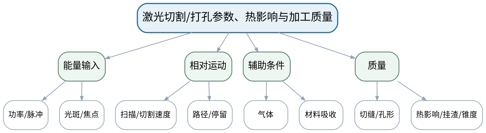

### 教学目标

**知识目标：**
- （1）掌握激光切割/打孔的主要过程参数及典型质量特征。
- （2）理解功率、速度、光斑/焦点、脉冲条件、辅助气体与热影响、切缝/孔形之间的关系。
**能力目标：**
- （1）能够读取激光参数—质量数据，分析热影响、挂渣、锥度或孔形异常的可能原因。
**价值目标：**
- （1）形成激光辐射、烟尘和气体使用的职业安全意识。

### 课程思政

结合辐射、烟尘和辅助气体风险，强调参数优化必须在防护系统有效的前提下进行。

### 专创融合 / 双创融合

把缺陷诊断表转化为激光加工质量监测与参数知识库的字段设计。

### 教学重难点

教学重点：激光参数与热影响/几何质量之间的耦合。
教学难点：不同缺陷可能表现相似，不能只根据外观直接归因；参数优化需要结合材料、厚度和工艺目标。

### 教学方法

问题引导法、机理讲授法、设备/样件案例分析、参数—质量数据推演、同伴互评与证据复盘

### 教学用具

电脑、投影仪、激光加工样件图像、参数—质量数据、教材。

### 教学设计

课前任务 → 互动导入（15 min）→ 传授新知与课堂训练（70 min）→ 过关检测（10 min）→ 课堂小结（3 min）→ 作业布置（1 min）→ 考勤（1 min）

### 教学过程

#### 课前任务

【教师】发布“激光切割/打孔参数、热影响与加工质量”预习/准备要求和一个最小问题，不提前给出完整答案。
- 1. 阅读大纲对应内容与指定教材，圈出3个核心术语；
- 2. 预读一张工艺原理图、样件或参数表，写出第一判断。
- 3. 记录至少1个疑问或安全/环保风险点。
【学生】完成准备并带着问题进入课堂。

**设计意图：** 通过课前阅读、安全/环保准备和最小问题建立先备认知，让学生带着真实工艺问题进入课堂。

#### 互动导入与传授新知 / 课堂训练

【互动导入 15 min】
【教师】展示三组切缝：未切透、切透但挂渣、切缝良好，要求学生先给出可能的能量输入/速度组合解释。
【学生】先独立预测/判断/观察，再交换依据，不先听完整结论。

【传授新知与课堂训练 70 min】
**一、核心机理与工艺结构讲解（约25 min）—参数链**

【教师】建立功率/脉冲—光斑—速度—能量密度/单位长度能量的定性关系。

【学生】按任务约束完成分析/实验，保存中间结果并说明判断依据；教师只提示定位方法、边界与验收条件，不代替学生完成核心产物。

**二、参数/案例分析与学生推演（约25 min）—质量特征**

【教师】分析切透、切缝宽度、热影响区、挂渣、孔锥度等指标及其相互制约。

【学生】按任务约束完成分析/实验，保存中间结果并说明判断依据；教师只提示定位方法、边界与验收条件，不代替学生完成核心产物。

**三、独立产出、互审与证据复盘（约20 min）—数据诊断**

【教师】学生根据参数与样件图像完成缺陷诊断表，必须写“证据不足时需要补什么测量”。

【学生】按任务约束完成分析/实验，保存中间结果并说明判断依据；教师只提示定位方法、边界与验收条件，不代替学生完成核心产物。

【课堂产物】激光缺陷诊断表 + 参数—质量因果图。

【学习证据】参数条件、样件图像/数据、诊断依据和待补证据。

【评价关联】平时成绩、课程作业、期末考核；目标1.4、2.4、3.4、3.5。

**设计意图：** 采用“先看现象/需求 → 最小机理讲解 → 参数/案例或实验分析 → 证据固化”的闭环，使工艺结论能够追溯到材料、参数、质量与安全环保证据。

#### 过关检测

【教师】组织当堂检测：
- 1. 激光功率提高为什么不一定改善切割质量？
- 2. 热影响区与作用时间有什么关系？
- 3. 诊断挂渣/未切透时需要哪些过程证据？
【学生】独立作答/数据判断；【教师】依据错误类型进行针对性讲解并要求说明判断依据。

**设计意图：** 用机理、参数、质量和边界问题即时检测关键知识，避免只记工艺名称。

#### 课堂小结

【教师】回到知识脉络图，用“机理—设备/参数—质量—应用—风险”总结“激光切割/打孔参数、热影响与加工质量”，再次强调：激光参数与热影响/几何质量之间的耦合。
【学生】写下本课最重要的一条工艺规则和一个最容易忽略的安全/质量边界。

**设计意图：** 压缩本课信息并把规则、边界与后续工艺比较或实验任务连接。

#### 作业布置

【教师】布置课后任务：选择一种激光质量缺陷，写出至少3个可能原因及相应验证方法。
【学生】按课程文件命名和证据规范整理提交。

**设计意图：** 固化课堂产物，形成可复查、可追溯的过程证据。

#### 考勤

【教师】利用学校/课程实际使用的平台进行签到。
【学生】按课程要求完成签到。

**设计意图：** 保留学校模板考勤环节，不在教案中预填出勤事实。

### 课后教学反思

【课后填写，不预填事实】
- 1. 教学流程：记录100 min各环节实际用时及需调整的位置；
- 2. 教学内容：重点记录“不同缺陷可能表现相似，不能只根据外观直接归因；参数优化需要结合材料、厚度和工艺目标。”的真实掌握证据与常见错误；
- 3. 学生参与：仅依据实际课堂记录填写独立分析、实验、互审或方案讨论情况，不补写推测；
- 4. 评价证据：检查本课工艺分析/实验数据/样件图像/测试/方案记录是否完整，记录缺项及原因；
- 5. 后续改进：依据真实课堂证据确定下一轮调整。

### 本章节参考文献

[1] 白基成, 刘晋春, 郭永丰, 杨晓冬等. 特种加工（第7版）[M]. 北京：机械工业出版社，2022. ISBN 9787111679868

## 第11次课 超声加工、磨料水射流与脆硬材料加工质量

- **章节/单元**：第四单元 激光、超声与水射流加工（2学时）
- **周次**：按实际课表填写
- **课时安排**：2课时（100 min）
- **课型**：理论

### 知识脉络图

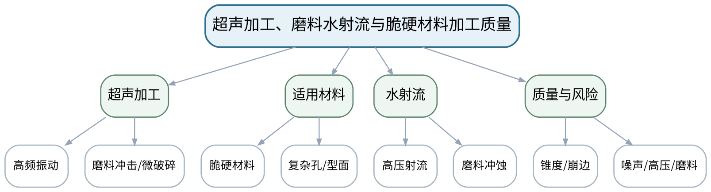

### 教学目标

**知识目标：**
- （1）掌握超声加工中工具振动、磨料冲击/微破碎等基本机理。
- （2）理解磨料水射流的高速射流与磨料冲蚀机理及切缝/锥度等质量特征。
**能力目标：**
- （1）能够根据材料脆性、热敏感性、厚度与质量要求比较超声和水射流方法。
**价值目标：**
- （1）形成噪声、高压流体、磨料飞散和设备隔离的职业防护意识。

### 课程思政

以高压流体、噪声和磨料防护强化职业健康与风险隔离意识。

### 专创融合 / 双创融合

从“低热影响加工”切入绿色制造和复合材料加工服务的工艺产品化。

### 教学重难点

教学重点：超声与磨料水射流的机械能去除机制及材料适用性。
教学难点：“低热影响”不等于无质量问题；崩边、锥度、表面纹理和喷嘴/工具状态仍需控制。

### 教学方法

问题引导法、机理讲授法、设备/样件案例分析、参数—质量数据推演、同伴互评与证据复盘

### 教学用具

电脑、投影仪、超声/水射流原理图、样件图像、质量数据。

### 教学设计

课前任务 → 互动导入（15 min）→ 传授新知与课堂训练（70 min）→ 过关检测（10 min）→ 课堂小结（3 min）→ 作业布置（1 min）→ 考勤（1 min）

### 教学过程

#### 课前任务

【教师】发布“超声加工、磨料水射流与脆硬材料加工质量”预习/准备要求和一个最小问题，不提前给出完整答案。
- 1. 阅读大纲对应内容与指定教材，圈出3个核心术语；
- 2. 预读一张工艺原理图、样件或参数表，写出第一判断。
- 3. 记录至少1个疑问或安全/环保风险点。
【学生】完成准备并带着问题进入课堂。

**设计意图：** 通过课前阅读、安全/环保准备和最小问题建立先备认知，让学生带着真实工艺问题进入课堂。

#### 互动导入与传授新知 / 课堂训练

【互动导入 15 min】
【教师】给出陶瓷小孔和复合材料板切割两个任务，要求学生判断超声/水射流哪一种更可能合适，并指出必须验证的质量指标。
【学生】先独立预测/判断/观察，再交换依据，不先听完整结论。

【传授新知与课堂训练 70 min】
**一、核心机理与工艺结构讲解（约25 min）—超声机理**

【教师】解释工具振动、磨料、工作液和脆性材料微破碎/冲击作用，联系工具磨损与形状复制。

【学生】按任务约束完成分析/实验，保存中间结果并说明判断依据；教师只提示定位方法、边界与验收条件，不代替学生完成核心产物。

**二、参数/案例分析与学生推演（约25 min）—水射流机理**

【教师】解释射流形成、磨料加速和切割过程，讨论锥度、表面条纹、喷嘴磨损等质量问题。

【学生】按任务约束完成分析/实验，保存中间结果并说明判断依据；教师只提示定位方法、边界与验收条件，不代替学生完成核心产物。

**三、独立产出、互审与证据复盘（约20 min）—方法选择**

【教师】学生针对陶瓷孔、复材轮廓、热敏薄壁件完成方法选择和风险对照，注明不能用宣传参数替代实验验证。

【学生】按任务约束完成分析/实验，保存中间结果并说明判断依据；教师只提示定位方法、边界与验收条件，不代替学生完成核心产物。

【课堂产物】超声/水射流方法比较表 + 两个零件工艺选择。

【学习证据】材料/质量要求、工艺选择、风险和验证指标。

【评价关联】平时成绩、课程作业、期末考核；目标1.4、2.4、3.4。

**设计意图：** 采用“先看现象/需求 → 最小机理讲解 → 参数/案例或实验分析 → 证据固化”的闭环，使工艺结论能够追溯到材料、参数、质量与安全环保证据。

#### 过关检测

【教师】组织当堂检测：
- 1. 超声加工为什么适合很多脆硬材料？
- 2. 水射流低热影响为什么仍会有锥度/表面纹理问题？
- 3. 高压水射流的主要安全边界是什么？
【学生】独立作答/数据判断；【教师】依据错误类型进行针对性讲解并要求说明判断依据。

**设计意图：** 用机理、参数、质量和边界问题即时检测关键知识，避免只记工艺名称。

#### 课堂小结

【教师】回到知识脉络图，用“机理—设备/参数—质量—应用—风险”总结“超声加工、磨料水射流与脆硬材料加工质量”，再次强调：超声与磨料水射流的机械能去除机制及材料适用性。
【学生】写下本课最重要的一条工艺规则和一个最容易忽略的安全/质量边界。

**设计意图：** 压缩本课信息并把规则、边界与后续工艺比较或实验任务连接。

#### 作业布置

【教师】布置课后任务：为一种脆硬材料零件写出“超声或水射流”的工艺选择依据与3个质量验收指标。
【学生】按课程文件命名和证据规范整理提交。

**设计意图：** 固化课堂产物，形成可复查、可追溯的过程证据。

#### 考勤

【教师】利用学校/课程实际使用的平台进行签到。
【学生】按课程要求完成签到。

**设计意图：** 保留学校模板考勤环节，不在教案中预填出勤事实。

### 课后教学反思

【课后填写，不预填事实】
- 1. 教学流程：记录100 min各环节实际用时及需调整的位置；
- 2. 教学内容：重点记录““低热影响”不等于无质量问题；崩边、锥度、表面纹理和喷嘴/工具状态仍需控制。”的真实掌握证据与常见错误；
- 3. 学生参与：仅依据实际课堂记录填写独立分析、实验、互审或方案讨论情况，不补写推测；
- 4. 评价证据：检查本课工艺分析/实验数据/样件图像/测试/方案记录是否完整，记录缺项及原因；
- 5. 后续改进：依据真实课堂证据确定下一轮调整。

### 本章节参考文献

[1] 白基成, 刘晋春, 郭永丰, 杨晓冬等. 特种加工（第7版）[M]. 北京：机械工业出版社，2022. ISBN 9787111679868

## 第12次课 实验二：激光/超声参数对缺陷与表面状态的影响

- **章节/单元**：实验二 激光/超声参数与缺陷观察（2学时）
- **周次**：按实际课表填写
- **课时安排**：2课时（100 min）
- **课型**：实验

### 知识脉络图

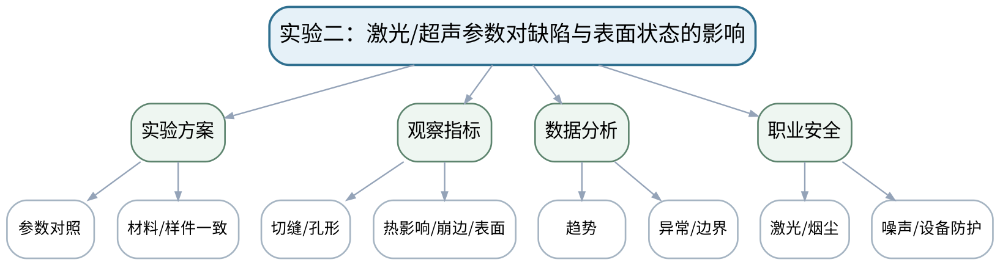

### 教学目标

**知识目标：**
- （1）理解激光或超声加工参数与切缝、孔形、热影响、崩边或表面状态之间的实验关系。
**能力目标：**
- （1）能够完成参数对比、样件/图像观察、质量记录和缺陷归因，并明确结论适用条件。
**价值目标：**
- （1）形成激光辐射/烟尘或超声噪声等职业防护与实验数据诚信意识。

### 课程思政

把职业防护、统一测量条件和如实记录异常作为实验质量的共同底线。

### 专创融合 / 双创融合

把标准化图像与参数表作为后续视觉质量检测和工艺数据分析的基础数据资产。

### 教学重难点

教学重点：实验变量控制、缺陷观察和证据归因。
教学难点：样件外观判断具有主观性，应结合尺寸、图像、表面或过程记录，不可只凭一张照片下结论。

### 教学方法

实验演示法、分组实验法、变量控制、原始数据记录、样件/图像比较、质量分析、安全检查与实验复盘

### 教学用具

激光/超声设备或等效平台、样件/图像、测量与记录工具、防护用品。

### 教学设计

课前任务 → 互动导入（15 min）→ 传授新知与课堂训练（70 min）→ 过关检测（10 min）→ 课堂小结（3 min）→ 作业布置（1 min）→ 考勤（1 min）

### 教学过程

#### 课前任务

【教师】发布“实验二：激光/超声参数对缺陷与表面状态的影响”预习/准备要求和一个最小问题，不提前给出完整答案。
- 1. 阅读大纲对应内容与指定教材，圈出3个核心术语；
- 2. 阅读实验安全与设备/样件/数据说明，准备原始记录表。
- 3. 记录至少1个疑问或安全/环保风险点。
【学生】完成准备并带着问题进入课堂。

**设计意图：** 通过课前阅读、安全/环保准备和最小问题建立先备认知，让学生带着真实工艺问题进入课堂。

#### 互动导入与传授新知 / 课堂训练

【互动导入 15 min】
【教师】教师给出两张不同曝光/放大倍率的样件照片，要求学生判断为什么不能直接比较“谁的热影响更大”。
【学生】先独立预测/判断/观察，再交换依据，不先听完整结论。

【传授新知与课堂训练 70 min】
**一、安全检查与实验设计确认（约15 min）—安全与测量一致性**

【教师】确认防护要求、样件编号、观察倍率/尺度和参数记录方式。

【学生】按任务约束完成分析/实验，保存中间结果并说明判断依据；教师只提示定位方法、边界与验收条件，不代替学生完成核心产物。

**二、分组实验/样件与数据采集（约35 min）—参数与样件观察**

【教师】按设备条件完成激光或超声参数对比；若采用既有数据，保持材料和观察条件一致并记录来源。

【学生】按任务约束完成分析/实验，保存中间结果并说明判断依据；教师只提示定位方法、边界与验收条件，不代替学生完成核心产物。

**三、数据复核、质量分析与证据固化（约20 min）—缺陷分析**

【教师】对切缝/孔形、热影响、崩边或表面状态分类，形成参数—缺陷表并保留异常样件。

【学生】按任务约束完成分析/实验，保存中间结果并说明判断依据；教师只提示定位方法、边界与验收条件，不代替学生完成核心产物。

【课堂产物】实验二参数—缺陷对照表 + 标准化样件/图像记录。

【学习证据】原始参数、样件编号/图像尺度、缺陷记录、异常样例和结论。

【评价关联】课程作业；目标1.4、2.4、2.6、3.4、3.5。

**设计意图：** 采用“先看现象/需求 → 最小机理讲解 → 参数/案例或实验分析 → 证据固化”的闭环，使工艺结论能够追溯到材料、参数、质量与安全环保证据。

#### 过关检测

【教师】组织当堂检测：
- 1. 比较样件图像时为什么要保持尺度/倍率一致？
- 2. 外观缺陷归因至少需要哪些辅助证据？
- 3. 实验异常样件应不应该删除？
【学生】独立作答/数据判断；【教师】依据错误类型进行针对性讲解并要求说明判断依据。

**设计意图：** 用机理、参数、质量和边界问题即时检测关键知识，避免只记工艺名称。

#### 课堂小结

【教师】回到知识脉络图，用“机理—设备/参数—质量—应用—风险”总结“实验二：激光/超声参数对缺陷与表面状态的影响”，再次强调：实验变量控制、缺陷观察和证据归因。
【学生】写下本课最重要的一条工艺规则和一个最容易忽略的安全/质量边界。

**设计意图：** 压缩本课信息并把规则、边界与后续工艺比较或实验任务连接。

#### 作业布置

【教师】布置课后任务：完成实验二报告，并写出一项“可能受观察条件影响”的指标。
【学生】按课程文件命名和证据规范整理提交。

**设计意图：** 固化课堂产物，形成可复查、可追溯的过程证据。

#### 考勤

【教师】利用学校/课程实际使用的平台进行签到。
【学生】按课程要求完成签到。

**设计意图：** 保留学校模板考勤环节，不在教案中预填出勤事实。

### 课后教学反思

【课后填写，不预填事实】
- 1. 教学流程：记录100 min各环节实际用时及需调整的位置；
- 2. 教学内容：重点记录“样件外观判断具有主观性，应结合尺寸、图像、表面或过程记录，不可只凭一张照片下结论。”的真实掌握证据与常见错误；
- 3. 学生参与：仅依据实际课堂记录填写独立分析、实验、互审或方案讨论情况，不补写推测；
- 4. 评价证据：检查本课工艺分析/实验数据/样件图像/测试/方案记录是否完整，记录缺项及原因；
- 5. 后续改进：依据真实课堂证据确定下一轮调整。

### 本章节参考文献

[1] 白基成, 刘晋春, 郭永丰, 杨晓冬等. 特种加工（第7版）[M]. 北京：机械工业出版社，2022. ISBN 9787111679868
[2] 《特种加工技术》课程教学大纲，2026年9月。

## 第13次课 电子束、离子束、等离子体与微细特种加工

- **章节/单元**：第五单元 高能束、微细与复合加工（2学时）
- **周次**：按实际课表填写
- **课时安排**：2课时（100 min）
- **课型**：理论

### 知识脉络图

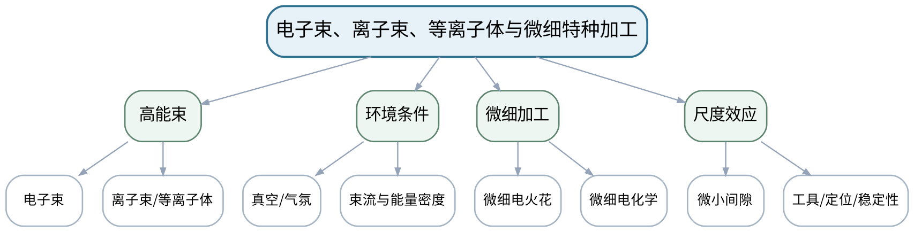

### 教学目标

**知识目标：**
- （1）了解电子束、离子束、等离子体加工的基本能量作用与设备环境特点。
- （2）理解微细电火花/微细电化学等微细加工对尺寸效应、间隙和过程稳定性的更高要求。
**能力目标：**
- （1）能够查阅资料并比较高能束与微细特种加工的材料、尺度、环境和质量边界。
**价值目标：**
- （1）形成尊重资料来源、避免以“微小/高能”标签替代工程论证的研究意识。

### 课程思政

强调技术调研需尊重资料来源、实验条件和适用边界，避免无证据夸大先进性。

### 专创融合 / 双创融合

训练标准化技术情报比较，为企业特种加工技术选型和研发决策服务。

### 教学重难点

教学重点：高能束方法的环境条件与微细加工的尺度效应。
教学难点：不同技术细节很多，本课重点是建立比较维度与适用边界，不凭二手宣传参数做绝对性能结论。

### 教学方法

问题引导法、机理讲授法、设备/样件案例分析、参数—质量数据推演、同伴互评与证据复盘

### 教学用具

电脑、投影仪、高能束/微细设备案例、教材、技术比较模板。

### 教学设计

课前任务 → 互动导入（15 min）→ 传授新知与课堂训练（70 min）→ 过关检测（10 min）→ 课堂小结（3 min）→ 作业布置（1 min）→ 考勤（1 min）

### 教学过程

#### 课前任务

【教师】发布“电子束、离子束、等离子体与微细特种加工”预习/准备要求和一个最小问题，不提前给出完整答案。
- 1. 阅读大纲对应内容与指定教材，圈出3个核心术语；
- 2. 预读一张工艺原理图、样件或参数表，写出第一判断。
- 3. 记录至少1个疑问或安全/环保风险点。
【学生】完成准备并带着问题进入课堂。

**设计意图：** 通过课前阅读、安全/环保准备和最小问题建立先备认知，让学生带着真实工艺问题进入课堂。

#### 互动导入与传授新知 / 课堂训练

【互动导入 15 min】
【教师】给出“电子束必须真空吗？”“等离子体和激光都属于高能束是否完全等价？”两个判断题，要求学生先说明定义和边界再作答。
【学生】先独立预测/判断/观察，再交换依据，不先听完整结论。

【传授新知与课堂训练 70 min】
**一、核心机理与工艺结构讲解（约25 min）—高能束概览**

【教师】按能量载体、环境、材料相互作用和典型应用比较电子束、离子束和等离子体。

【学生】按任务约束完成分析/实验，保存中间结果并说明判断依据；教师只提示定位方法、边界与验收条件，不代替学生完成核心产物。

**二、参数/案例分析与学生推演（约25 min）—微细加工**

【教师】说明尺度减小后工具、电极、间隙、定位、排屑/传质和测量难度的变化。

【学生】按任务约束完成分析/实验，保存中间结果并说明判断依据；教师只提示定位方法、边界与验收条件，不代替学生完成核心产物。

**三、独立产出、互审与证据复盘（约20 min）—资料比较**

【教师】学生依据统一模板比较两种技术：原理、设备条件、材料、尺度、质量、风险、证据来源。

【学生】按任务约束完成分析/实验，保存中间结果并说明判断依据；教师只提示定位方法、边界与验收条件，不代替学生完成核心产物。

【课堂产物】高能束/微细加工技术比较卡。

【学习证据】技术比较维度、来源记录、适用边界和一条资料可信度判断。

【评价关联】平时成绩、课程作业、期末考核；目标1.5、2.5、3.5。

**设计意图：** 采用“先看现象/需求 → 最小机理讲解 → 参数/案例或实验分析 → 证据固化”的闭环，使工艺结论能够追溯到材料、参数、质量与安全环保证据。

#### 过关检测

【教师】组织当堂检测：
- 1. 高能束方法比较为什么必须注明设备环境？
- 2. 微细加工的“尺度变小”会带来哪些过程控制问题？
- 3. 技术资料中的极限指标为什么不能直接当常规工艺能力？
【学生】独立作答/数据判断；【教师】依据错误类型进行针对性讲解并要求说明判断依据。

**设计意图：** 用机理、参数、质量和边界问题即时检测关键知识，避免只记工艺名称。

#### 课堂小结

【教师】回到知识脉络图，用“机理—设备/参数—质量—应用—风险”总结“电子束、离子束、等离子体与微细特种加工”，再次强调：高能束方法的环境条件与微细加工的尺度效应。
【学生】写下本课最重要的一条工艺规则和一个最容易忽略的安全/质量边界。

**设计意图：** 压缩本课信息并把规则、边界与后续工艺比较或实验任务连接。

#### 作业布置

【教师】布置课后任务：选取两种高能束/微细方法，按统一7维模板做对比，并注明资料来源。
【学生】按课程文件命名和证据规范整理提交。

**设计意图：** 固化课堂产物，形成可复查、可追溯的过程证据。

#### 考勤

【教师】利用学校/课程实际使用的平台进行签到。
【学生】按课程要求完成签到。

**设计意图：** 保留学校模板考勤环节，不在教案中预填出勤事实。

### 课后教学反思

【课后填写，不预填事实】
- 1. 教学流程：记录100 min各环节实际用时及需调整的位置；
- 2. 教学内容：重点记录“不同技术细节很多，本课重点是建立比较维度与适用边界，不凭二手宣传参数做绝对性能结论。”的真实掌握证据与常见错误；
- 3. 学生参与：仅依据实际课堂记录填写独立分析、实验、互审或方案讨论情况，不补写推测；
- 4. 评价证据：检查本课工艺分析/实验数据/样件图像/测试/方案记录是否完整，记录缺项及原因；
- 5. 后续改进：依据真实课堂证据确定下一轮调整。

### 本章节参考文献

[1] 白基成, 刘晋春, 郭永丰, 杨晓冬等. 特种加工（第7版）[M]. 北京：机械工业出版社，2022. ISBN 9787111679868

## 第14次课 复合加工原理、协同机制与综合工艺设计导入

- **章节/单元**：第五单元（1学时）+第六单元 工艺设计、质量与可持续制造（1学时）
- **周次**：按实际课表填写
- **课时安排**：2课时（100 min）
- **课型**：理论

### 知识脉络图

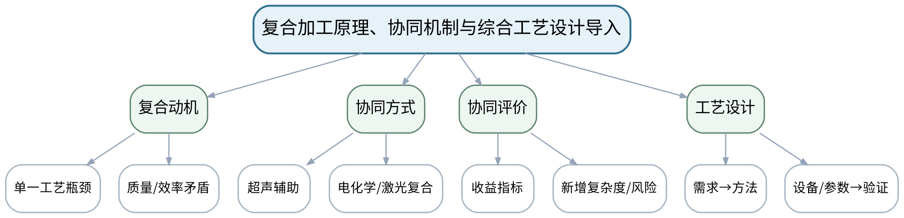

### 教学目标

**知识目标：**
- （1）理解超声辅助、电化学复合、激光复合等复合加工的基本思想。
- （2）掌握综合工艺设计中需求、候选工艺、设备/工装、参数、质量、安全环保和验证之间的基本链条。
**能力目标：**
- （1）能够判断复合加工是否真正解决单一工艺瓶颈，并建立综合工艺设计框架。
**价值目标：**
- （1）形成“复合不是简单叠加”、以验证证据证明协同收益的工程意识。

### 课程思政

通过“创新必须可验证”强化科学求证、资源效率和工程责任。

### 专创融合 / 双创融合

把复合加工技术评审和综合工艺设计转化为工艺创新项目的可行性论证框架。

### 教学重难点

教学重点：复合加工的协同收益与新增复杂度同时评价。
教学难点：复合工艺只有在明确改善目标且验证收益大于新增成本/风险时才有工程价值。

### 教学方法

问题引导法、机理讲授法、设备/样件案例分析、参数—质量数据推演、同伴互评与证据复盘

### 教学用具

电脑、投影仪、复合加工案例、综合工艺设计模板、教材。

### 教学设计

课前任务 → 互动导入（15 min）→ 传授新知与课堂训练（70 min）→ 过关检测（10 min）→ 课堂小结（3 min）→ 作业布置（1 min）→ 考勤（1 min）

### 教学过程

#### 课前任务

【教师】发布“复合加工原理、协同机制与综合工艺设计导入”预习/准备要求和一个最小问题，不提前给出完整答案。
- 1. 阅读大纲对应内容与指定教材，圈出3个核心术语；
- 2. 预读一张工艺原理图、样件或参数表，写出第一判断。
- 3. 记录至少1个疑问或安全/环保风险点。
【学生】完成准备并带着问题进入课堂。

**设计意图：** 通过课前阅读、安全/环保准备和最小问题建立先备认知，让学生带着真实工艺问题进入课堂。

#### 互动导入与传授新知 / 课堂训练

【互动导入 15 min】
【教师】给出“超声辅助电火花让排屑改善，但系统复杂度、工具和控制成本增加”的案例，要求学生决定什么证据足以证明值得采用。
【学生】先独立预测/判断/观察，再交换依据，不先听完整结论。

【传授新知与课堂训练 70 min】
**一、核心机理与工艺结构讲解（约25 min）—复合加工**

【教师】从“单一工艺瓶颈”出发说明辅助能场/多机理协同，不按技术名称堆叠。

【学生】按任务约束完成分析/实验，保存中间结果并说明判断依据；教师只提示定位方法、边界与验收条件，不代替学生完成核心产物。

**二、参数/案例分析与学生推演（约25 min）—收益与代价**

【教师】建立效率、质量、材料适应、设备复杂度、成本、安全和可维护性比较。

【学生】按任务约束完成分析/实验，保存中间结果并说明判断依据；教师只提示定位方法、边界与验收条件，不代替学生完成核心产物。

**三、独立产出、互审与证据复盘（约20 min）—综合设计导入**

【教师】学生为一个难加工零件建立工艺设计骨架：需求—候选方法—试验/数据—质量—安全环保—成本能耗—验收。

【学生】按任务约束完成分析/实验，保存中间结果并说明判断依据；教师只提示定位方法、边界与验收条件，不代替学生完成核心产物。

【课堂产物】复合工艺收益—代价表 + 综合工艺设计骨架。

【学习证据】瓶颈定义、协同指标、风险和设计框架。

【评价关联】平时成绩、课程作业、期末考核；目标1.5、1.6、2.5、2.6、3.5、3.6。

**设计意图：** 采用“先看现象/需求 → 最小机理讲解 → 参数/案例或实验分析 → 证据固化”的闭环，使工艺结论能够追溯到材料、参数、质量与安全环保证据。

#### 过关检测

【教师】组织当堂检测：
- 1. 什么情况下复合加工只是“复杂化”而不是改进？
- 2. 证明协同收益至少需要哪些对照证据？
- 3. 综合工艺设计为什么要在参数前先明确质量与安全指标？
【学生】独立作答/数据判断；【教师】依据错误类型进行针对性讲解并要求说明判断依据。

**设计意图：** 用机理、参数、质量和边界问题即时检测关键知识，避免只记工艺名称。

#### 课堂小结

【教师】回到知识脉络图，用“机理—设备/参数—质量—应用—风险”总结“复合加工原理、协同机制与综合工艺设计导入”，再次强调：复合加工的协同收益与新增复杂度同时评价。
【学生】写下本课最重要的一条工艺规则和一个最容易忽略的安全/质量边界。

**设计意图：** 压缩本课信息并把规则、边界与后续工艺比较或实验任务连接。

#### 作业布置

【教师】布置课后任务：选择一种复合加工，写出它要解决的单一工艺瓶颈、预期收益、至少2个新增风险和验证方案。
【学生】按课程文件命名和证据规范整理提交。

**设计意图：** 固化课堂产物，形成可复查、可追溯的过程证据。

#### 考勤

【教师】利用学校/课程实际使用的平台进行签到。
【学生】按课程要求完成签到。

**设计意图：** 保留学校模板考勤环节，不在教案中预填出勤事实。

### 课后教学反思

【课后填写，不预填事实】
- 1. 教学流程：记录100 min各环节实际用时及需调整的位置；
- 2. 教学内容：重点记录“复合工艺只有在明确改善目标且验证收益大于新增成本/风险时才有工程价值。”的真实掌握证据与常见错误；
- 3. 学生参与：仅依据实际课堂记录填写独立分析、实验、互审或方案讨论情况，不补写推测；
- 4. 评价证据：检查本课工艺分析/实验数据/样件图像/测试/方案记录是否完整，记录缺项及原因；
- 5. 后续改进：依据真实课堂证据确定下一轮调整。

### 本章节参考文献

[1] 白基成, 刘晋春, 郭永丰, 杨晓冬等. 特种加工（第7版）[M]. 北京：机械工业出版社，2022. ISBN 9787111679868

## 第15次课 综合工艺选择、表面完整性、成本能耗与安全环保

- **章节/单元**：第六单元 工艺设计、质量与可持续制造（2学时）
- **周次**：按实际课表填写
- **课时安排**：2课时（100 min）
- **课型**：理论

### 知识脉络图

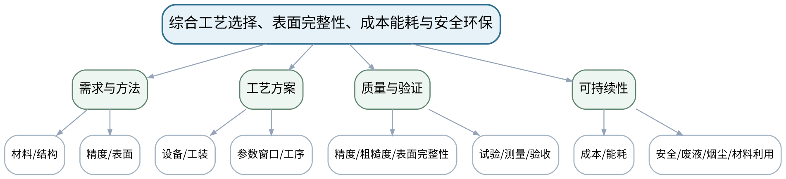

### 教学目标

**知识目标：**
- （1）掌握特种加工综合工艺设计的主要内容：方法、设备/工装、参数、质量、试验、安全环保与验收。
- （2）理解精度、粗糙度、表面完整性、效率、工具/耗材、能耗和环境影响的多指标关系。
**能力目标：**
- （1）能够针对典型难加工零件形成结构化工艺方案，并设计关键工艺试验和验收指标。
**价值目标：**
- （1）形成节能减排、材料高效利用、职业健康和持续改进意识。

### 课程思政

把安全环保、职业健康和节能减排设为工艺设计的组成部分，而不是报告末尾的附加说明。

### 专创融合 / 双创融合

训练把技术方案转化为可评审、可验证、可持续改进的制造工艺产品。

### 教学重难点

教学重点：从零件需求到工艺、质量、验证与可持续性的完整闭环。
教学难点：多指标冲突时必须明确优先级和验收证据，不能用“最先进工艺”替代技术经济分析。

### 教学方法

问题引导法、机理讲授法、设备/样件案例分析、参数—质量数据推演、同伴互评与证据复盘

### 教学用具

电脑、投影仪、综合零件案例、质量/成本/能耗数据、工艺方案模板。

### 教学设计

课前任务 → 互动导入（15 min）→ 传授新知与课堂训练（70 min）→ 过关检测（10 min）→ 课堂小结（3 min）→ 作业布置（1 min）→ 考勤（1 min）

### 教学过程

#### 课前任务

【教师】发布“综合工艺选择、表面完整性、成本能耗与安全环保”预习/准备要求和一个最小问题，不提前给出完整答案。
- 1. 阅读大纲对应内容与指定教材，圈出3个核心术语；
- 2. 预读一张工艺原理图、样件或参数表，写出第一判断。
- 3. 记录至少1个疑问或安全/环保风险点。
【学生】完成准备并带着问题进入课堂。

**设计意图：** 通过课前阅读、安全/环保准备和最小问题建立先备认知，让学生带着真实工艺问题进入课堂。

#### 互动导入与传授新知 / 课堂训练

【互动导入 15 min】
【教师】给出一个硬质合金异形深孔零件，分别从效率、精度、表面、成本和环保角度提出互相冲突的要求，要求学生先排序需求。
【学生】先独立预测/判断/观察，再交换依据，不先听完整结论。

【传授新知与课堂训练 70 min】
**一、核心机理与工艺结构讲解（约25 min）—需求与工艺链**

【教师】从材料、结构、精度、表面完整性和批量建立需求，筛选候选工艺并设计工序/设备/工装。

【学生】按任务约束完成分析/实验，保存中间结果并说明判断依据；教师只提示定位方法、边界与验收条件，不代替学生完成核心产物。

**二、参数/案例分析与学生推演（约25 min）—质量与试验**

【教师】明确关键参数窗口、试验矩阵、测量方法和质量验收；区别“参数设定”与“验证通过”。

【学生】按任务约束完成分析/实验，保存中间结果并说明判断依据；教师只提示定位方法、边界与验收条件，不代替学生完成核心产物。

**三、独立产出、互审与证据复盘（约20 min）—综合评审**

【教师】学生完成一页工艺方案，加入安全、废液/烟尘、能耗、成本和改进计划，同伴按评分表评审。

【学生】按任务约束完成分析/实验，保存中间结果并说明判断依据；教师只提示定位方法、边界与验收条件，不代替学生完成核心产物。

【课堂产物】特种加工综合工艺方案一页纸 + 验收清单。

【学习证据】需求表、方法选择、关键参数/试验、质量指标、安全环保与评审记录。

【评价关联】平时成绩、课程作业、期末考核；目标1.6、2.6、3.6、3.1。

**设计意图：** 采用“先看现象/需求 → 最小机理讲解 → 参数/案例或实验分析 → 证据固化”的闭环，使工艺结论能够追溯到材料、参数、质量与安全环保证据。

#### 过关检测

【教师】组织当堂检测：
- 1. 表面粗糙度与表面完整性是否完全相同？
- 2. 工艺参数设定后为什么仍需要工艺试验？
- 3. 可持续制造评价至少应包含哪些资源/环境因素？
【学生】独立作答/数据判断；【教师】依据错误类型进行针对性讲解并要求说明判断依据。

**设计意图：** 用机理、参数、质量和边界问题即时检测关键知识，避免只记工艺名称。

#### 课堂小结

【教师】回到知识脉络图，用“机理—设备/参数—质量—应用—风险”总结“综合工艺选择、表面完整性、成本能耗与安全环保”，再次强调：从零件需求到工艺、质量、验证与可持续性的完整闭环。
【学生】写下本课最重要的一条工艺规则和一个最容易忽略的安全/质量边界。

**设计意图：** 压缩本课信息并把规则、边界与后续工艺比较或实验任务连接。

#### 作业布置

【教师】布置课后任务：完成期末综合工艺设计报告骨架：场景/零件、需求、工艺路线、关键参数与试验、质量、安全环保、成本能耗、验证与改进。
【学生】按课程文件命名和证据规范整理提交。

**设计意图：** 固化课堂产物，形成可复查、可追溯的过程证据。

#### 考勤

【教师】利用学校/课程实际使用的平台进行签到。
【学生】按课程要求完成签到。

**设计意图：** 保留学校模板考勤环节，不在教案中预填出勤事实。

### 课后教学反思

【课后填写，不预填事实】
- 1. 教学流程：记录100 min各环节实际用时及需调整的位置；
- 2. 教学内容：重点记录“多指标冲突时必须明确优先级和验收证据，不能用“最先进工艺”替代技术经济分析。”的真实掌握证据与常见错误；
- 3. 学生参与：仅依据实际课堂记录填写独立分析、实验、互审或方案讨论情况，不补写推测；
- 4. 评价证据：检查本课工艺分析/实验数据/样件图像/测试/方案记录是否完整，记录缺项及原因；
- 5. 后续改进：依据真实课堂证据确定下一轮调整。

### 本章节参考文献

[1] 白基成, 刘晋春, 郭永丰, 杨晓冬等. 特种加工（第7版）[M]. 北京：机械工业出版社，2022. ISBN 9787111679868
[2] 《特种加工技术》课程教学大纲，2026年9月。

## 第16次课 实验三：典型难加工零件方法比较与综合工艺验证

- **章节/单元**：实验三 方法比较与综合工艺验证（2学时）
- **周次**：按实际课表填写
- **课时安排**：2课时（100 min）
- **课型**：实验

### 知识脉络图

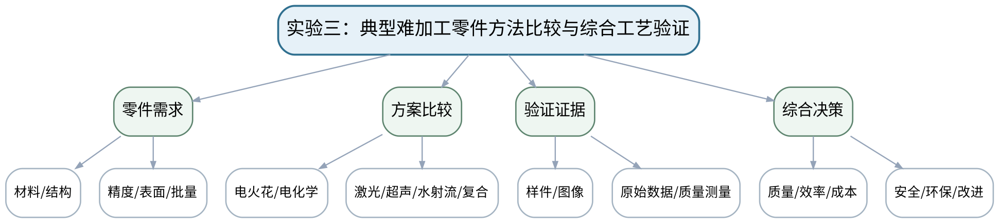

### 教学目标

**知识目标：**
- （1）理解工艺方案需要用样件、实验数据和质量指标验证。
**能力目标：**
- （1）能够针对典型难加工零件比较多种特种加工方案，使用实验/样件数据验证关键指标并提出改进。
**价值目标：**
- （1）形成尊重原始证据、多指标决策、安全环保与持续改进意识。

### 课程思政

通过统一指标、真实证据、风险边界和个人核验落实工程诚信与结果责任。

### 专创融合 / 双创融合

把课程形成的工艺比较、质量证据和方案评审流程作为制造企业工艺知识沉淀的雏形。

### 教学重难点

教学重点：多方法比较必须使用统一需求和统一指标，形成证据支撑的最终方案。
教学难点：不同样件/设备/数据条件不可直接横向比较；若证据条件不一致，必须标明不确定性和补充验证需求。

### 教学方法

实验演示法、分组实验法、变量控制、原始数据记录、样件/图像比较、质量分析、安全检查与实验复盘

### 教学用具

现有特种加工样件/设备或可复现实验数据、测量工具、图像资料、综合评价表。

### 教学设计

课前任务 → 互动导入（15 min）→ 传授新知与课堂训练（70 min）→ 过关检测（10 min）→ 课堂小结（3 min）→ 作业布置（1 min）→ 考勤（1 min）

### 教学过程

#### 课前任务

【教师】发布“实验三：典型难加工零件方法比较与综合工艺验证”预习/准备要求和一个最小问题，不提前给出完整答案。
- 1. 阅读大纲对应内容与指定教材，圈出3个核心术语；
- 2. 阅读实验安全与设备/样件/数据说明，准备原始记录表。
- 3. 记录至少1个疑问或安全/环保风险点。
【学生】完成准备并带着问题进入课堂。

**设计意图：** 通过课前阅读、安全/环保准备和最小问题建立先备认知，让学生带着真实工艺问题进入课堂。

#### 互动导入与传授新知 / 课堂训练

【互动导入 15 min】
【教师】教师给出两套来自不同材料厚度和不同设备的“加工时间+表面照片”，要求学生判断为什么不能直接说A工艺优于B工艺。
【学生】先独立预测/判断/观察，再交换依据，不先听完整结论。

【传授新知与课堂训练 70 min】
**一、安全检查与实验设计确认（约15 min）—任务与统一指标**

【教师】确认典型零件需求和比较口径：材料、结构、质量、效率、成本、安全环保；设计统一评价表。

【学生】按任务约束完成分析/实验，保存中间结果并说明判断依据；教师只提示定位方法、边界与验收条件，不代替学生完成核心产物。

**二、分组实验/样件与数据采集（约35 min）—样件/数据验证**

【教师】利用现有实验、样件或可复现实验数据比较至少两种方案，保留原始条件、测量/图像和异常。

【学生】按任务约束完成分析/实验，保存中间结果并说明判断依据；教师只提示定位方法、边界与验收条件，不代替学生完成核心产物。

**三、数据复核、质量分析与证据固化（约20 min）—工艺决策与核验**

【教师】形成推荐方案、适用边界和改进计划；每组成员能够独立解释关键参数—质量证据，作为期末综合考查准备。

【学生】按任务约束完成分析/实验，保存中间结果并说明判断依据；教师只提示定位方法、边界与验收条件，不代替学生完成核心产物。

【课堂产物】实验三综合工艺验证包：统一指标表、样件/数据、推荐方案、改进清单。

【学习证据】原始条件、样件/图像/数据、质量对比、方案选择依据、个人解释记录。

【评价关联】课程作业、期末考核准备；目标1.1、1.6、2.1、2.6、3.1、3.5、3.6。

**设计意图：** 采用“先看现象/需求 → 最小机理讲解 → 参数/案例或实验分析 → 证据固化”的闭环，使工艺结论能够追溯到材料、参数、质量与安全环保证据。

#### 过关检测

【教师】组织当堂检测：
- 1. 不同来源数据比较前必须统一哪些条件？
- 2. 推荐工艺方案需要哪些最小证据？
- 3. 证据不足时报告应该怎样表达？
【学生】独立作答/数据判断；【教师】依据错误类型进行针对性讲解并要求说明判断依据。

**设计意图：** 用机理、参数、质量和边界问题即时检测关键知识，避免只记工艺名称。

#### 课堂小结

【教师】回到知识脉络图，用“机理—设备/参数—质量—应用—风险”总结“实验三：典型难加工零件方法比较与综合工艺验证”，再次强调：多方法比较必须使用统一需求和统一指标，形成证据支撑的最终方案。
【学生】写下本课最重要的一条工艺规则和一个最容易忽略的安全/质量边界。

**设计意图：** 压缩本课信息并把规则、边界与后续工艺比较或实验任务连接。

#### 作业布置

【教师】布置课后任务：整理实验三与前两次实验材料，完成期末综合工艺设计报告初稿，并准备个人核验问题清单。
【学生】按课程文件命名和证据规范整理提交。

**设计意图：** 固化课堂产物，形成可复查、可追溯的过程证据。

#### 考勤

【教师】利用学校/课程实际使用的平台进行签到。
【学生】按课程要求完成签到。

**设计意图：** 保留学校模板考勤环节，不在教案中预填出勤事实。

### 课后教学反思

【课后填写，不预填事实】
- 1. 教学流程：记录100 min各环节实际用时及需调整的位置；
- 2. 教学内容：重点记录“不同样件/设备/数据条件不可直接横向比较；若证据条件不一致，必须标明不确定性和补充验证需求。”的真实掌握证据与常见错误；
- 3. 学生参与：仅依据实际课堂记录填写独立分析、实验、互审或方案讨论情况，不补写推测；
- 4. 评价证据：检查本课工艺分析/实验数据/样件图像/测试/方案记录是否完整，记录缺项及原因；
- 5. 后续改进：依据真实课堂证据确定下一轮调整。

### 本章节参考文献

[1] 白基成, 刘晋春, 郭永丰, 杨晓冬等. 特种加工（第7版）[M]. 北京：机械工业出版社，2022. ISBN 9787111679868
[2] 《特种加工技术》课程教学大纲，2026年9月。
