# 程序设计基础（C&C++）Ⅰ 教案（24次课）

> 配套 Word：`25JX31801-程序设计基础（C&C++）Ⅰ-教案.docx`。本 Markdown 由最终校版 Word 同步抽取并结构化整理；24 张知识脉络图使用相对路径引用 `images/` 中的课程专属图片。

## 教案封面信息
- **学 院**：计信学院
- **专业（教研室）**：（按教研室实际填写）
- **课 程 名 称**：程序设计基础（C&C++）Ⅰ
- **主 讲 教 师**：（按实际填写）
- **职 称**：（按实际填写）
- **授 课 学 期**：第3学期
- **授 课 专 业**：智能制造工程

## 课程基本信息
- **课程代码**：25JX31801
- **课程名称（中文）**：程序设计基础（C&C++）Ⅰ
- **课程名称（英文）**：Fundamentals of Programming (C & C++) I
- **课程类别**：学科基础类；课程性质：必修；授课语言：中文
- **授课学期**：第3学期；学分：3
- **课程学时及分配**：总学时 48；理论 0；实验 0；上机 48；其他 0
- **适用专业**：智能制造工程
- **教材**：戴波.《C与C++程序设计（第二版）》[M]. 北京：北京大学出版社，2025.（第1—6章）
- **授课学院**：计信学院
- **先修课程**：无
- **后续课程**：程序设计基础（C&C++）Ⅱ；数据结构（C）；微机原理及接口技术
- **考核类型**：考试课（√）；考查课（ ）
- **考核形式**：期末形式由课程组最终确认
- **考核方式**：作业、报告、随堂练习、上机实验、期末考试、上机过程表现
- **总评成绩比例**：总评成绩 = 平时成绩×40% + 期末考试×60%

### 课程简介

课程基本定位：本课程是智能制造工程专业的学科基础课，是程序设计能力培养的第一门课程，讲授 C 语言程序设计基础，为后续《程序设计基础（C&C++）Ⅱ》《数据结构（C）》《微机原理及接口技术》等课程奠定基础。

核心学习结果：学生能够理解程序设计基本概念与 C 语言语法，能够编写、调试和运行基本程序，完成简单数据采集与处理，形成规范编程、严谨调试的工程习惯。

学情分析：培养方案未设置本课程先修课程，按零基础起点组织，并预留分层任务适应可能存在的编程基础差异；48 学时全部采用上机教学。

主要教学方法：任务驱动、案例演示、上机实践、课堂练习与调试复盘相结合；单次课遵循“先操作/预测—最小讲解—独立产出—调试互审—证据固化”，以源代码、运行/测试记录和实验报告作为学习证据。

课程目标：G01 掌握基本语法、算法表示与程序结构；G02 完成基本程序编写、调试与运行；G03 规范使用开发环境并书写代码与简要文档；G04 养成规范编程、严谨调试与主动学习习惯。

参考资料：戴波《C与C++程序设计（第二版）》；华为 CodeArts IDE、鲲鹏 openEuler 环境说明；在线 OJ 编程练习平台。

## 24次课教学设计

## 第01次课 课程导入、开发环境与第一个 C 程序

- **章节/单元**：第1章（U01）
- **周次**：按实际课表填写
- **课时安排**：2课时（100 min）

### 知识脉络图

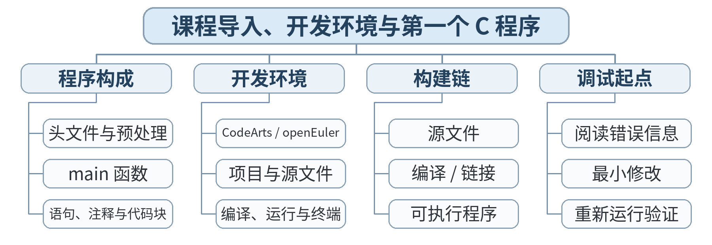

### 教学目标

**知识目标：**
- （1）理解课程定位、C 程序从源代码到可执行文件的基本链路。
- （2）认识 C 程序基本骨架：头文件、main 函数、语句与注释。
**能力目标：**
- （1）能够进入 CodeArts/openEuler 环境，新建、编译、运行 hello.c。
- （2）能够读取编译器输出并区分“编译成功/运行成功”。
**价值目标：**
- （1）建立“先运行、再理解、留证据”的工程学习习惯。

### 课程思政

- （1）结合华为 CodeArts IDE 与鲲鹏 openEuler 环境，说明软件工具链自主可控、规范使用和工程责任的关系，培养学生尊重标准、重视复现的职业意识。
- （2）通过真实编译错误、调试记录和可复现项目，引导学生如实记录问题与修复过程，形成实事求是、严谨求证的工程作风。

### 专创融合 / 双创融合

围绕“国产开发环境 + 可复现最小项目”设计小型工具链实践，引导学生思考代码模板、自动编译、版本记录等可复用能力在工程开发和技术服务中的价值。

### 教学重难点

教学重点：C 程序基本结构；编辑—编译—链接—运行流程。
教学难点：初学者对“源文件、编译器、程序运行”三者关系的区分。

### 教学方法

任务驱动法、演示法、上机实践法、问题引导法、同伴互评与调试复盘

### 教学用具

电脑、投影仪、多媒体课件、教材、华为 CodeArts IDE、鲲鹏 openEuler/终端、C 编译器、示例代码

### 教学设计

课前任务 → 互动导入（15 min）→ 传授新知与上机训练（70 min）→ 过关检测（10 min）→ 课堂小结（3 min）→ 作业布置（1 min）→ 考勤（1 min）

### 教学过程

#### 课前任务

【教师】课前发布本课主题“课程导入、开发环境与第一个 C 程序”及对应教材阅读范围，给出一个最小预习问题/代码片段，不提前给出完整答案。
- 1. 阅读教材对应内容，圈出 3 个核心术语；
- 2. 预读/预测课堂任务中可能出现的关键问题；
- 3. 检查开发环境，确保能够编译运行上一课最小程序。
【学生】完成阅读与环境检查，记录至少 1 个疑问，带着问题进入课堂。

**设计意图：** 通过课前阅读、环境检查和一个最小问题建立先备认知，避免把课堂时间消耗在环境故障上，并让学生带着真实疑问进入学习。

#### 互动导入与传授新知 / 上机训练

【互动导入 15 min】
【教师】教师直接给出一个故意缺少分号的 hello.c；学生先尝试编译并记录第一条错误信息。
【学生】先运行/预测/观察，记录结果和第一判断；不先听完整结论。
【传授新知与上机训练 70 min】
一、最小讲解与示范（约20 min）
【教师】教师现场修复错误，带领学生创建 hello.c，解释 #include、main、printf、return 0 的职责，并演示终端编译与 IDE 编译。
【学生】同步操作，在关键位置写注释或记录规则，随时验证教师示范。
二、学生独立产出（约35 min）
【学生】学生独立完成“个人信息卡”程序：输出课程名、姓名占位符、学号占位符和一句学习目标；要求至少使用 2 条 printf。
【教师】巡回指导，只提示问题定位方法、边界和验收条件，不直接代写完整答案。
三、调试、互审与证据固化（约15 min）
【教师/学生】同桌交换代码，检查扩展名、分号、英文引号、括号配对与编译日志；教师示范如何从第一条错误开始定位。
【学习证据】hello.c 源文件 + 一次成功运行截图/终端日志 + 1 句错误修复说明。
【评价关联】本课评价：A01；课堂证据用于检验本课知识与编程能力目标。

**设计意图：** 采用“先运行/预测 → 最小讲解与示范 → 独立编程 → 调试互审 → 证据固化”的上机闭环。把抽象语法/概念落到可运行程序，通过独立产出和测试证据检验真实学习，而不是只听懂讲解。

#### 过关检测

【教师】组织当堂检测：
- 1. C 源文件常用扩展名是什么？
- 2. main 函数在当前入门程序中的作用是什么？
- 3. 编译报错时为什么优先看第一条 error？
【学生】独立作答/运行验证；【教师】根据错误类型进行针对性讲解，并要求学生说明判断依据。

**设计意图：** 用概念题、边界题和运行验证即时检测关键知识，暴露易错点；要求说明依据，避免只记答案。

#### 课堂小结

【教师】回到本课知识脉络图，用“概念—关系—应用—边界”四个关键词总结“课程导入、开发环境与第一个 C 程序”。
重点再次强调：C 程序基本结构；编辑—编译—链接—运行流程。。
【学生】用 1 分钟口述/书写“本课最重要的一条规则 + 一个最容易出错的边界”。

**设计意图：** 回到知识脉络图压缩本课信息，帮助学生形成层级结构，并把“规则—边界—应用”连接到下一次课。

#### 作业布置

【教师】布置课后任务：整理开发环境截图；将 hello.c 改名为 lesson01_card.c 并再次成功编译运行；写 80 字“第一次编译失败是如何解决的”。
【学生】按课程文件命名规范整理代码、测试记录和必要说明，课后提交。

**设计意图：** 通过整理源代码、测试记录和说明，固化课堂成果，形成可复查、可复现的过程性学习证据。

#### 考勤

【教师】利用学校/课程实际使用的平台进行签到。
【学生】按课程要求完成签到。

**设计意图：** 保留学校模板中的考勤环节，用于教学秩序管理；不在教案中预填任何出勤事实。

### 课后教学反思

【课后填写，不预填事实】
- 1. 教学流程：记录 100 min 各环节实际用时及需要调整的位置；
- 2. 教学内容：重点记录“初学者对“源文件、编译器、程序运行”三者关系的区分。”的真实掌握证据与常见错误；
- 3. 学生参与：仅依据课堂实际记录填写独立完成、提问、互审等情况，不补写推测性结论；
- 4. 评价证据：检查本课源代码/测试/调试证据是否完整，记录缺项及原因；
- 5. 后续改进：依据真实课堂证据确定下一轮教学调整。

**说明：** 反思必须基于真实课堂证据。课前仅提供填写框架，避免把预测或模板化表述误写成已发生的学生表现。

### 本章节参考文献

[1] 戴波.《C与C++程序设计（第二版）》[M]. 北京：北京大学出版社，2025.
[2] 华为 CodeArts IDE、鲲鹏 openEuler 环境使用说明。

## 第02次课 C 程序结构、编译过程与基础调试

- **章节/单元**：第1章（U01）
- **周次**：按实际课表填写
- **课时安排**：2课时（100 min）

### 知识脉络图

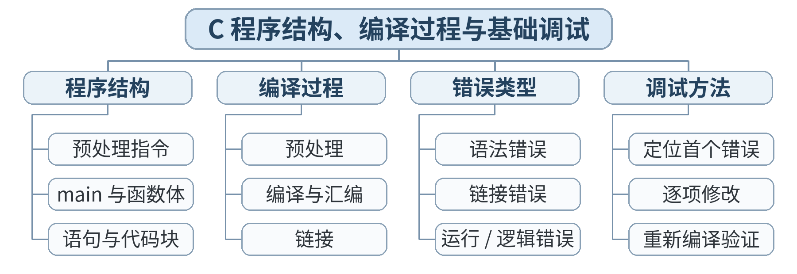

### 教学目标

**知识目标：**
- （1）理解预处理、编译、链接、运行的先后关系。
- （2）掌握标识符、关键字、注释与基本书写规范。
**能力目标：**
- （1）能根据常见编译错误定位缺失符号、拼写错误与括号错误。
- （2）能使用最基础的断点/单步功能观察程序执行顺序。
**价值目标：**
- （1）形成不掩盖错误、记录错误、复现错误的调试意识。

### 课程思政

- （1）结合华为 CodeArts IDE 与鲲鹏 openEuler 环境，说明软件工具链自主可控、规范使用和工程责任的关系，培养学生尊重标准、重视复现的职业意识。
- （2）通过真实编译错误、调试记录和可复现项目，引导学生如实记录问题与修复过程，形成实事求是、严谨求证的工程作风。

### 专创融合 / 双创融合

围绕“国产开发环境 + 可复现最小项目”设计小型工具链实践，引导学生思考代码模板、自动编译、版本记录等可复用能力在工程开发和技术服务中的价值。

### 教学重难点

教学重点：编译链路；语法错误与运行错误的基本区分；代码规范。
教学难点：从报错现象反推错误位置，而不是盲目修改。

### 教学方法

任务驱动法、演示法、上机实践法、问题引导法、同伴互评与调试复盘

### 教学用具

电脑、投影仪、多媒体课件、教材、华为 CodeArts IDE、鲲鹏 openEuler/终端、C 编译器、示例代码

### 教学设计

课前任务 → 互动导入（15 min）→ 传授新知与上机训练（70 min）→ 过关检测（10 min）→ 课堂小结（3 min）→ 作业布置（1 min）→ 考勤（1 min）

### 教学过程

#### 课前任务

【教师】课前发布本课主题“C 程序结构、编译过程与基础调试”及对应教材阅读范围，给出一个最小预习问题/代码片段，不提前给出完整答案。
- 1. 阅读教材对应内容，圈出 3 个核心术语；
- 2. 预读/预测课堂任务中可能出现的关键问题；
- 3. 检查开发环境，确保能够编译运行上一课最小程序。
【学生】完成阅读与环境检查，记录至少 1 个疑问，带着问题进入课堂。

**设计意图：** 通过课前阅读、环境检查和一个最小问题建立先备认知，避免把课堂时间消耗在环境故障上，并让学生带着真实疑问进入学习。

#### 互动导入与传授新知 / 上机训练

【互动导入 15 min】
【教师】学生运行 3 个“坏程序”：缺分号、括号不配对、函数名拼写错误；先不改，给错误分类。
【学生】先运行/预测/观察，记录结果和第一判断；不先听完整结论。
【传授新知与上机训练 70 min】
一、最小讲解与示范（约20 min）
【教师】教师用流程图讲解预处理→编译→链接→运行，并演示断点停在 printf 前后时变量/流程变化。
【学生】同步操作，在关键位置写注释或记录规则，随时验证教师示范。
二、学生独立产出（约35 min）
【学生】学生完成 debug_lab.c：修复 6 个预置错误，并为每个错误写一条“现象—原因—修复”注释。
【教师】巡回指导，只提示问题定位方法、边界和验收条件，不直接代写完整答案。
三、调试、互审与证据固化（约15 min）
【教师/学生】小组互审：随机抽取 1 个错误，要求另一位学生复现并说明修复依据。
【学习证据】debug_lab.c + 错误模式表（至少 4 条）+ 一次断点截图。
【评价关联】本课评价：A01；课堂证据用于检验本课知识与编程能力目标。

**设计意图：** 采用“先运行/预测 → 最小讲解与示范 → 独立编程 → 调试互审 → 证据固化”的上机闭环。把抽象语法/概念落到可运行程序，通过独立产出和测试证据检验真实学习，而不是只听懂讲解。

#### 过关检测

【教师】组织当堂检测：
- 1. “编译错误”和“运行结果不符合预期”是否是一回事？
- 2. 注释会直接参与程序执行吗？
- 3. 为什么一次只改一个高置信度错误更利于调试？
【学生】独立作答/运行验证；【教师】根据错误类型进行针对性讲解，并要求学生说明判断依据。

**设计意图：** 用概念题、边界题和运行验证即时检测关键知识，暴露易错点；要求说明依据，避免只记答案。

#### 课堂小结

【教师】回到本课知识脉络图，用“概念—关系—应用—边界”四个关键词总结“C 程序结构、编译过程与基础调试”。
重点再次强调：编译链路；语法错误与运行错误的基本区分；代码规范。。
【学生】用 1 分钟口述/书写“本课最重要的一条规则 + 一个最容易出错的边界”。

**设计意图：** 回到知识脉络图压缩本课信息，帮助学生形成层级结构，并把“规则—边界—应用”连接到下一次课。

#### 作业布置

【教师】布置课后任务：补充个人错误模式表；将课堂程序提交到按“学号/课次”命名的文件夹。
【学生】按课程文件命名规范整理代码、测试记录和必要说明，课后提交。

**设计意图：** 通过整理源代码、测试记录和说明，固化课堂成果，形成可复查、可复现的过程性学习证据。

#### 考勤

【教师】利用学校/课程实际使用的平台进行签到。
【学生】按课程要求完成签到。

**设计意图：** 保留学校模板中的考勤环节，用于教学秩序管理；不在教案中预填任何出勤事实。

### 课后教学反思

【课后填写，不预填事实】
- 1. 教学流程：记录 100 min 各环节实际用时及需要调整的位置；
- 2. 教学内容：重点记录“从报错现象反推错误位置，而不是盲目修改。”的真实掌握证据与常见错误；
- 3. 学生参与：仅依据课堂实际记录填写独立完成、提问、互审等情况，不补写推测性结论；
- 4. 评价证据：检查本课源代码/测试/调试证据是否完整，记录缺项及原因；
- 5. 后续改进：依据真实课堂证据确定下一轮教学调整。

**说明：** 反思必须基于真实课堂证据。课前仅提供填写框架，避免把预测或模板化表述误写成已发生的学生表现。

### 本章节参考文献

[1] 戴波.《C与C++程序设计（第二版）》[M]. 北京：北京大学出版社，2025.
[2] 华为 CodeArts IDE、鲲鹏 openEuler 环境使用说明。

## 第03次课 算法表示：从问题描述到可执行步骤

- **章节/单元**：第1章（U01）
- **周次**：按实际课表填写
- **课时安排**：2课时（100 min）

### 知识脉络图

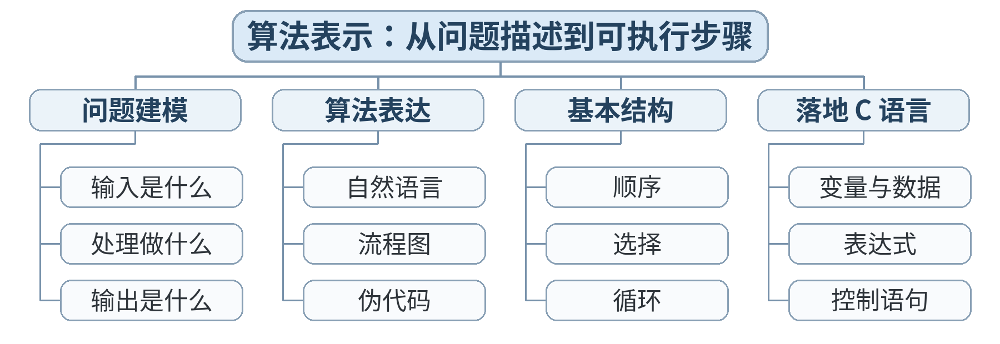

### 教学目标

**知识目标：**
- （1）理解算法的输入、处理、输出及有限性、确定性。
- （2）会用自然语言、伪代码或流程图描述简单算法。
**能力目标：**
- （1）能把一个工程小问题拆成顺序步骤，再翻译为 C 程序框架。
- （2）能检查算法是否遗漏输入、边界或输出。
**价值目标：**
- （1）培养先建模、后编码的严谨思维。

### 课程思政

- （1）结合华为 CodeArts IDE 与鲲鹏 openEuler 环境，说明软件工具链自主可控、规范使用和工程责任的关系，培养学生尊重标准、重视复现的职业意识。
- （2）通过真实编译错误、调试记录和可复现项目，引导学生如实记录问题与修复过程，形成实事求是、严谨求证的工程作风。

### 专创融合 / 双创融合

围绕“国产开发环境 + 可复现最小项目”设计小型工具链实践，引导学生思考代码模板、自动编译、版本记录等可复用能力在工程开发和技术服务中的价值。

### 教学重难点

教学重点：问题分解；算法表示；输入—处理—输出模型。
教学难点：从自然语言需求中提取明确、无歧义的可执行步骤。

### 教学方法

任务驱动法、演示法、上机实践法、问题引导法、同伴互评与调试复盘

### 教学用具

电脑、投影仪、多媒体课件、教材、华为 CodeArts IDE、鲲鹏 openEuler/终端、C 编译器、示例代码

### 教学设计

课前任务 → 互动导入（15 min）→ 传授新知与上机训练（70 min）→ 过关检测（10 min）→ 课堂小结（3 min）→ 作业布置（1 min）→ 考勤（1 min）

### 教学过程

#### 课前任务

【教师】课前发布本课主题“算法表示：从问题描述到可执行步骤”及对应教材阅读范围，给出一个最小预习问题/代码片段，不提前给出完整答案。
- 1. 阅读教材对应内容，圈出 3 个核心术语；
- 2. 预读/预测课堂任务中可能出现的关键问题；
- 3. 检查开发环境，确保能够编译运行上一课最小程序。
【学生】完成阅读与环境检查，记录至少 1 个疑问，带着问题进入课堂。

**设计意图：** 通过课前阅读、环境检查和一个最小问题建立先备认知，避免把课堂时间消耗在环境故障上，并让学生带着真实疑问进入学习。

#### 互动导入与传授新知 / 上机训练

【互动导入 15 min】
【教师】给出任务：“已知零件加工 3 道工序的时间，输出总时间”。学生先只写 5 行以内伪代码。
【学生】先运行/预测/观察，记录结果和第一判断；不先听完整结论。
【传授新知与上机训练 70 min】
一、最小讲解与示范（约20 min）
【教师】教师展示 IPO（Input-Process-Output）模板，演示把伪代码映射到 C 程序骨架；暂用常量代替用户输入。
【学生】同步操作，在关键位置写注释或记录规则，随时验证教师示范。
二、学生独立产出（约35 min）
【学生】学生独立设计“设备运行成本估算”算法：给定运行时长与单位能耗，先写伪代码，再写能运行的最小 C 程序。
【教师】巡回指导，只提示问题定位方法、边界和验收条件，不直接代写完整答案。
三、调试、互审与证据固化（约15 min）
【教师/学生】同伴检查伪代码是否可逐步执行；若存在“算一下”“处理一下”等模糊词必须改写。
【学习证据】algorithm.md/纸面算法 + lesson03_cost.c + 一条“需求→步骤”映射说明。
【评价关联】本课评价：A01；课堂证据用于检验本课知识与编程能力目标。

**设计意图：** 采用“先运行/预测 → 最小讲解与示范 → 独立编程 → 调试互审 → 证据固化”的上机闭环。把抽象语法/概念落到可运行程序，通过独立产出和测试证据检验真实学习，而不是只听懂讲解。

#### 过关检测

【教师】组织当堂检测：
- 1. 算法为什么必须是有限步骤？
- 2. IPO 中 P 代表什么？
- 3. “把数据处理一下”为什么不是合格的算法步骤？
【学生】独立作答/运行验证；【教师】根据错误类型进行针对性讲解，并要求学生说明判断依据。

**设计意图：** 用概念题、边界题和运行验证即时检测关键知识，暴露易错点；要求说明依据，避免只记答案。

#### 课堂小结

【教师】回到本课知识脉络图，用“概念—关系—应用—边界”四个关键词总结“算法表示：从问题描述到可执行步骤”。
重点再次强调：问题分解；算法表示；输入—处理—输出模型。。
【学生】用 1 分钟口述/书写“本课最重要的一条规则 + 一个最容易出错的边界”。

**设计意图：** 回到知识脉络图压缩本课信息，帮助学生形成层级结构，并把“规则—边界—应用”连接到下一次课。

#### 作业布置

【教师】布置课后任务：完成一个生活/制造场景算法，要求同时给出自然语言步骤与伪代码两种表达。
【学生】按课程文件命名规范整理代码、测试记录和必要说明，课后提交。

**设计意图：** 通过整理源代码、测试记录和说明，固化课堂成果，形成可复查、可复现的过程性学习证据。

#### 考勤

【教师】利用学校/课程实际使用的平台进行签到。
【学生】按课程要求完成签到。

**设计意图：** 保留学校模板中的考勤环节，用于教学秩序管理；不在教案中预填任何出勤事实。

### 课后教学反思

【课后填写，不预填事实】
- 1. 教学流程：记录 100 min 各环节实际用时及需要调整的位置；
- 2. 教学内容：重点记录“从自然语言需求中提取明确、无歧义的可执行步骤。”的真实掌握证据与常见错误；
- 3. 学生参与：仅依据课堂实际记录填写独立完成、提问、互审等情况，不补写推测性结论；
- 4. 评价证据：检查本课源代码/测试/调试证据是否完整，记录缺项及原因；
- 5. 后续改进：依据真实课堂证据确定下一轮教学调整。

**说明：** 反思必须基于真实课堂证据。课前仅提供填写框架，避免把预测或模板化表述误写成已发生的学生表现。

### 本章节参考文献

[1] 戴波.《C与C++程序设计（第二版）》[M]. 北京：北京大学出版社，2025.
[2] 华为 CodeArts IDE、鲲鹏 openEuler 环境使用说明。

## 第04次课 单元综合：可复现的 C 开发工作流

- **章节/单元**：第1章（U01）
- **周次**：按实际课表填写
- **课时安排**：2课时（100 min）

### 知识脉络图

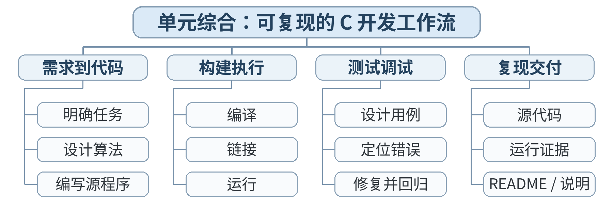

### 教学目标

**知识目标：**
- （1）巩固 C 程序基本结构、算法表示和开发流程。
- （2）理解文件命名、版本记录与简短开发说明的作用。
**能力目标：**
- （1）能从空目录开始创建、编译、运行并归档一个最小 C 项目。
- （2）能依据检查表完成自检与同伴复核。
**价值目标：**
- （1）建立规范交付、结果可复现的工程意识。

### 课程思政

- （1）结合华为 CodeArts IDE 与鲲鹏 openEuler 环境，说明软件工具链自主可控、规范使用和工程责任的关系，培养学生尊重标准、重视复现的职业意识。
- （2）实验/综合任务要求保留源代码、测试记录和结论，强调实验诚信、结果可复现和过程可追溯；不得以主观判断代替测试证据。

### 专创融合 / 双创融合

围绕“国产开发环境 + 可复现最小项目”设计小型工具链实践，引导学生思考代码模板、自动编译、版本记录等可复用能力在工程开发和技术服务中的价值。

### 教学重难点

教学重点：完整开发闭环；复现性；基本文件组织。
教学难点：把个人操作转化为别人可重复执行的说明。

### 教学方法

任务驱动法、实验/上机实践法、巡回指导法、测试驱动评价、同伴复核

### 教学用具

电脑、投影仪、多媒体课件、教材、华为 CodeArts IDE、鲲鹏 openEuler/终端、C 编译器、示例代码

### 教学设计

课前任务 → 互动导入（15 min）→ 传授新知与上机训练（70 min）→ 过关检测（10 min）→ 课堂小结（3 min）→ 作业布置（1 min）→ 考勤（1 min）

### 教学过程

#### 课前任务

【教师】课前发布本课主题“单元综合：可复现的 C 开发工作流”及对应教材阅读范围，给出一个最小预习问题/代码片段，不提前给出完整答案。
- 1. 阅读教材对应内容，圈出 3 个核心术语；
- 2. 预读/预测课堂任务中可能出现的关键问题；
- 3. 检查开发环境，确保能够编译运行上一课最小程序。
【学生】完成阅读与环境检查，记录至少 1 个疑问，带着问题进入课堂。

**设计意图：** 通过课前阅读、环境检查和一个最小问题建立先备认知，避免把课堂时间消耗在环境故障上，并让学生带着真实疑问进入学习。

#### 互动导入与传授新知 / 上机训练

【互动导入 15 min】
【教师】教师只给“输出设备编号和状态”需求，不给步骤；学生 8 分钟完成最小可运行版本。
【学生】先运行/预测/观察，记录结果和第一判断；不先听完整结论。
【传授新知与上机训练 70 min】
一、最小讲解与示范（约20 min）
【教师】教师展示标准目录：src/、README.md（或说明.txt）、run-log.txt；演示如何记录编译命令和运行结果。
【学生】同步操作，在关键位置写注释或记录规则，随时验证教师示范。
二、学生独立产出（约35 min）
【学生】学生完成 mini_project_01：设备状态卡。要求代码、运行日志、README 三件套，README 写明“如何编译/如何运行/预期输出”。
【教师】巡回指导，只提示问题定位方法、边界和验收条件，不直接代写完整答案。
三、调试、互审与证据固化（约15 min）
【教师/学生】两人互换文件夹，严格按 README 复现；复现失败必须记录失败点。
【学习证据】完整项目文件夹 + README + 复现记录；作为 U01 阶段证据。
【评价关联】本课评价：A01；课堂证据用于检验本课知识与编程能力目标。

**设计意图：** 采用“先运行/预测 → 最小讲解与示范 → 独立编程 → 调试互审 → 证据固化”的上机闭环。把抽象语法/概念落到可运行程序，通过独立产出和测试证据检验真实学习，而不是只听懂讲解。

#### 过关检测

【教师】组织当堂检测：
- 1. 别人拿到代码后不能运行，最先应检查什么？
- 2. README 至少应说明哪三件事？
- 3. 为什么“在我电脑上能运行”不等于可交付？
【学生】独立作答/运行验证；【教师】根据错误类型进行针对性讲解，并要求学生说明判断依据。

**设计意图：** 用概念题、边界题和运行验证即时检测关键知识，暴露易错点；要求说明依据，避免只记答案。

#### 课堂小结

【教师】回到本课知识脉络图，用“概念—关系—应用—边界”四个关键词总结“单元综合：可复现的 C 开发工作流”。
重点再次强调：完整开发闭环；复现性；基本文件组织。。
【学生】用 1 分钟口述/书写“本课最重要的一条规则 + 一个最容易出错的边界”。

**设计意图：** 回到知识脉络图压缩本课信息，帮助学生形成层级结构，并把“规则—边界—应用”连接到下一次课。

#### 作业布置

【教师】布置课后任务：根据同伴复现反馈修订 README；提交 U01 学习小结（错误模式、有效调试方法、下一单元计划）。
【学生】按课程文件命名规范整理代码、测试记录和必要说明，课后提交。

**设计意图：** 通过整理源代码、测试记录和说明，固化课堂成果，形成可复查、可复现的过程性学习证据。

#### 考勤

【教师】利用学校/课程实际使用的平台进行签到。
【学生】按课程要求完成签到。

**设计意图：** 保留学校模板中的考勤环节，用于教学秩序管理；不在教案中预填任何出勤事实。

### 课后教学反思

【课后填写，不预填事实】
- 1. 教学流程：记录 100 min 各环节实际用时及需要调整的位置；
- 2. 教学内容：重点记录“把个人操作转化为别人可重复执行的说明。”的真实掌握证据与常见错误；
- 3. 学生参与：仅依据课堂实际记录填写独立完成、提问、互审等情况，不补写推测性结论；
- 4. 评价证据：检查本课源代码/测试/调试证据是否完整，记录缺项及原因；
- 5. 后续改进：依据真实课堂证据确定下一轮教学调整。

**说明：** 反思必须基于真实课堂证据。课前仅提供填写框架，避免把预测或模板化表述误写成已发生的学生表现。

### 本章节参考文献

[1] 戴波.《C与C++程序设计（第二版）》[M]. 北京：北京大学出版社，2025.
[2] 华为 CodeArts IDE、鲲鹏 openEuler 环境使用说明。

## 第05次课 基本数据类型、常量与变量

- **章节/单元**：第2章（U02）
- **周次**：按实际课表填写
- **课时安排**：2课时（100 min）

### 知识脉络图

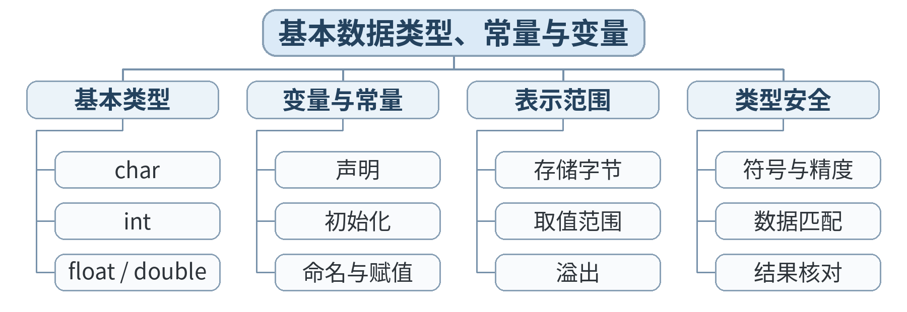

### 教学目标

**知识目标：**
- （1）掌握 int、char、float、double 等基本类型的用途。
- （2）理解变量声明、初始化、常量与标识符命名。
**能力目标：**
- （1）能根据数据含义选择基本类型并编写声明。
- （2）能通过 sizeof 观察不同类型在当前环境中的大小。
**价值目标：**
- （1）形成“先理解数据含义，再决定表示方式”的工程习惯。

### 课程思政

- （1）通过数据类型、精度、类型转换和输入输出案例，强调工程数据必须语义明确、单位清晰、表达准确，培养对数据质量负责的意识。
- （2）结合整数除法、格式匹配等易错点，说明微小表示错误也可能放大为工程判断偏差，强化严谨计算与质量意识。

### 专创融合 / 双创融合

以设备参数录入、生产率/合格率计算和格式化报告为场景，训练“工业数据 → 程序计算 → 结果表达”的微型应用原型，形成面向实际需求的产品化思维。

### 教学重难点

教学重点：基本类型；变量/常量；sizeof。
教学难点：类型选择与数值范围/精度之间的关系。

### 教学方法

任务驱动法、演示法、上机实践法、问题引导法、同伴互评与调试复盘

### 教学用具

电脑、投影仪、多媒体课件、教材、华为 CodeArts IDE、鲲鹏 openEuler/终端、C 编译器、示例代码

### 教学设计

课前任务 → 互动导入（15 min）→ 传授新知与上机训练（70 min）→ 过关检测（10 min）→ 课堂小结（3 min）→ 作业布置（1 min）→ 考勤（1 min）

### 教学过程

#### 课前任务

【教师】课前发布本课主题“基本数据类型、常量与变量”及对应教材阅读范围，给出一个最小预习问题/代码片段，不提前给出完整答案。
- 1. 阅读教材对应内容，圈出 3 个核心术语；
- 2. 预读/预测课堂任务中可能出现的关键问题；
- 3. 检查开发环境，确保能够编译运行上一课最小程序。
【学生】完成阅读与环境检查，记录至少 1 个疑问，带着问题进入课堂。

**设计意图：** 通过课前阅读、环境检查和一个最小问题建立先备认知，避免把课堂时间消耗在环境故障上，并让学生带着真实疑问进入学习。

#### 互动导入与传授新知 / 上机训练

【互动导入 15 min】
【教师】给出温度 36.5、工位号 12、状态字符 A 三个数据，学生快速选择类型并说明理由。
【学生】先运行/预测/观察，记录结果和第一判断；不先听完整结论。
【传授新知与上机训练 70 min】
一、最小讲解与示范（约20 min）
【教师】教师演示变量声明、初始化、const、sizeof；比较 int/float/double 输出。
【学生】同步操作，在关键位置写注释或记录规则，随时验证教师示范。
二、学生独立产出（约35 min）
【学生】学生完成 sensor_types.c：定义温度、转速、计数、状态等变量并打印类型大小与值。
【教师】巡回指导，只提示问题定位方法、边界和验收条件，不直接代写完整答案。
三、调试、互审与证据固化（约15 min）
【教师/学生】对比两种不合理类型选择（如用 int 存 36.5），观察输出差异并写原因。
【学习证据】sensor_types.c + 类型选择表（数据/类型/理由）+ sizeof 运行结果。
【评价关联】本课评价：A01；课堂证据用于检验本课知识与编程能力目标。

**设计意图：** 采用“先运行/预测 → 最小讲解与示范 → 独立编程 → 调试互审 → 证据固化”的上机闭环。把抽象语法/概念落到可运行程序，通过独立产出和测试证据检验真实学习，而不是只听懂讲解。

#### 过关检测

【教师】组织当堂检测：
- 1. 36.5 用 int 存会发生什么？
- 2. 变量为什么建议初始化？
- 3. sizeof 的结果是否应该脱离具体环境死记？
【学生】独立作答/运行验证；【教师】根据错误类型进行针对性讲解，并要求学生说明判断依据。

**设计意图：** 用概念题、边界题和运行验证即时检测关键知识，暴露易错点；要求说明依据，避免只记答案。

#### 课堂小结

【教师】回到本课知识脉络图，用“概念—关系—应用—边界”四个关键词总结“基本数据类型、常量与变量”。
重点再次强调：基本类型；变量/常量；sizeof。。
【学生】用 1 分钟口述/书写“本课最重要的一条规则 + 一个最容易出错的边界”。

**设计意图：** 回到知识脉络图压缩本课信息，帮助学生形成层级结构，并把“规则—边界—应用”连接到下一次课。

#### 作业布置

【教师】布置课后任务：设计 8 个智能制造数据字段，为每个字段选择 C 类型并说明理由。
【学生】按课程文件命名规范整理代码、测试记录和必要说明，课后提交。

**设计意图：** 通过整理源代码、测试记录和说明，固化课堂成果，形成可复查、可复现的过程性学习证据。

#### 考勤

【教师】利用学校/课程实际使用的平台进行签到。
【学生】按课程要求完成签到。

**设计意图：** 保留学校模板中的考勤环节，用于教学秩序管理；不在教案中预填任何出勤事实。

### 课后教学反思

【课后填写，不预填事实】
- 1. 教学流程：记录 100 min 各环节实际用时及需要调整的位置；
- 2. 教学内容：重点记录“类型选择与数值范围/精度之间的关系。”的真实掌握证据与常见错误；
- 3. 学生参与：仅依据课堂实际记录填写独立完成、提问、互审等情况，不补写推测性结论；
- 4. 评价证据：检查本课源代码/测试/调试证据是否完整，记录缺项及原因；
- 5. 后续改进：依据真实课堂证据确定下一轮教学调整。

**说明：** 反思必须基于真实课堂证据。课前仅提供填写框架，避免把预测或模板化表述误写成已发生的学生表现。

### 本章节参考文献

[1] 戴波.《C与C++程序设计（第二版）》[M]. 北京：北京大学出版社，2025.

## 第06次课 运算符、表达式与类型转换

- **章节/单元**：第2章（U02）
- **周次**：按实际课表填写
- **课时安排**：2课时（100 min）

### 知识脉络图

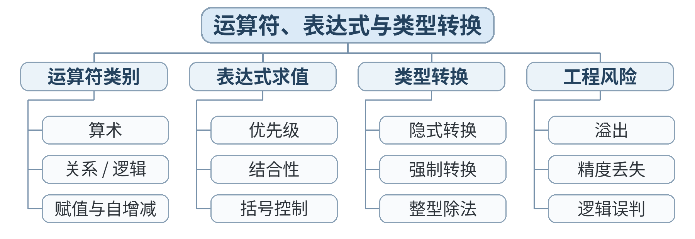

### 教学目标

**知识目标：**
- （1）掌握算术、关系、逻辑、赋值及自增自减运算符。
- （2）理解运算优先级、整数除法和显式/隐式类型转换。
**能力目标：**
- （1）能写出正确表达式完成工程量计算。
- （2）能通过拆分表达式和中间变量排查计算错误。
**价值目标：**
- （1）养成不依赖“复杂一行式”、优先可读性的编码习惯。

### 课程思政

- （1）通过数据类型、精度、类型转换和输入输出案例，强调工程数据必须语义明确、单位清晰、表达准确，培养对数据质量负责的意识。
- （2）结合整数除法、格式匹配等易错点，说明微小表示错误也可能放大为工程判断偏差，强化严谨计算与质量意识。

### 专创融合 / 双创融合

以设备参数录入、生产率/合格率计算和格式化报告为场景，训练“工业数据 → 程序计算 → 结果表达”的微型应用原型，形成面向实际需求的产品化思维。

### 教学重难点

教学重点：运算符；表达式求值；整数除法；类型转换。
教学难点：混合类型运算与优先级造成的隐蔽错误。

### 教学方法

任务驱动法、演示法、上机实践法、问题引导法、同伴互评与调试复盘

### 教学用具

电脑、投影仪、多媒体课件、教材、华为 CodeArts IDE、鲲鹏 openEuler/终端、C 编译器、示例代码

### 教学设计

课前任务 → 互动导入（15 min）→ 传授新知与上机训练（70 min）→ 过关检测（10 min）→ 课堂小结（3 min）→ 作业布置（1 min）→ 考勤（1 min）

### 教学过程

#### 课前任务

【教师】课前发布本课主题“运算符、表达式与类型转换”及对应教材阅读范围，给出一个最小预习问题/代码片段，不提前给出完整答案。
- 1. 阅读教材对应内容，圈出 3 个核心术语；
- 2. 预读/预测课堂任务中可能出现的关键问题；
- 3. 检查开发环境，确保能够编译运行上一课最小程序。
【学生】完成阅读与环境检查，记录至少 1 个疑问，带着问题进入课堂。

**设计意图：** 通过课前阅读、环境检查和一个最小问题建立先备认知，避免把课堂时间消耗在环境故障上，并让学生带着真实疑问进入学习。

#### 互动导入与传授新知 / 上机训练

【互动导入 15 min】
【教师】学生预测 5/2、5.0/2、(double)5/2 的输出，再运行验证。
【学生】先运行/预测/观察，记录结果和第一判断；不先听完整结论。
【传授新知与上机训练 70 min】
一、最小讲解与示范（约20 min）
【教师】教师讲解优先级、结合性和类型提升，演示利用中间变量拆解复杂公式。
【学生】同步操作，在关键位置写注释或记录规则，随时验证教师示范。
二、学生独立产出（约35 min）
【学生】学生编写 production_rate.c：根据合格件数、总件数、时间计算合格率与生产率。
【教师】巡回指导，只提示问题定位方法、边界和验收条件，不直接代写完整答案。
三、调试、互审与证据固化（约15 min）
【教师/学生】教师提供 3 组边界数据，学生检查整数除法、百分比和括号问题。
【学习证据】production_rate.c + 三组测试输出 + 一条类型转换说明。
【评价关联】本课评价：A01；课堂证据用于检验本课知识与编程能力目标。

**设计意图：** 采用“先运行/预测 → 最小讲解与示范 → 独立编程 → 调试互审 → 证据固化”的上机闭环。把抽象语法/概念落到可运行程序，通过独立产出和测试证据检验真实学习，而不是只听懂讲解。

#### 过关检测

【教师】组织当堂检测：
- 1. 5/2 为什么不是 2.5？
- 2. 什么时候建议显式强制类型转换？
- 3. 复杂表达式为什么适合拆成中间变量？
【学生】独立作答/运行验证；【教师】根据错误类型进行针对性讲解，并要求学生说明判断依据。

**设计意图：** 用概念题、边界题和运行验证即时检测关键知识，暴露易错点；要求说明依据，避免只记答案。

#### 课堂小结

【教师】回到本课知识脉络图，用“概念—关系—应用—边界”四个关键词总结“运算符、表达式与类型转换”。
重点再次强调：运算符；表达式求值；整数除法；类型转换。。
【学生】用 1 分钟口述/书写“本课最重要的一条规则 + 一个最容易出错的边界”。

**设计意图：** 回到知识脉络图压缩本课信息，帮助学生形成层级结构，并把“规则—边界—应用”连接到下一次课。

#### 作业布置

【教师】布置课后任务：重构课堂程序：不得出现超过 3 个运算符的单行复杂表达式；补充注释说明单位。
【学生】按课程文件命名规范整理代码、测试记录和必要说明，课后提交。

**设计意图：** 通过整理源代码、测试记录和说明，固化课堂成果，形成可复查、可复现的过程性学习证据。

#### 考勤

【教师】利用学校/课程实际使用的平台进行签到。
【学生】按课程要求完成签到。

**设计意图：** 保留学校模板中的考勤环节，用于教学秩序管理；不在教案中预填任何出勤事实。

### 课后教学反思

【课后填写，不预填事实】
- 1. 教学流程：记录 100 min 各环节实际用时及需要调整的位置；
- 2. 教学内容：重点记录“混合类型运算与优先级造成的隐蔽错误。”的真实掌握证据与常见错误；
- 3. 学生参与：仅依据课堂实际记录填写独立完成、提问、互审等情况，不补写推测性结论；
- 4. 评价证据：检查本课源代码/测试/调试证据是否完整，记录缺项及原因；
- 5. 后续改进：依据真实课堂证据确定下一轮教学调整。

**说明：** 反思必须基于真实课堂证据。课前仅提供填写框架，避免把预测或模板化表述误写成已发生的学生表现。

### 本章节参考文献

[1] 戴波.《C与C++程序设计（第二版）》[M]. 北京：北京大学出版社，2025.

## 第07次课 格式化输入输出：printf 与 scanf

- **章节/单元**：第2章（U02）
- **周次**：按实际课表填写
- **课时安排**：2课时（100 min）

### 知识脉络图

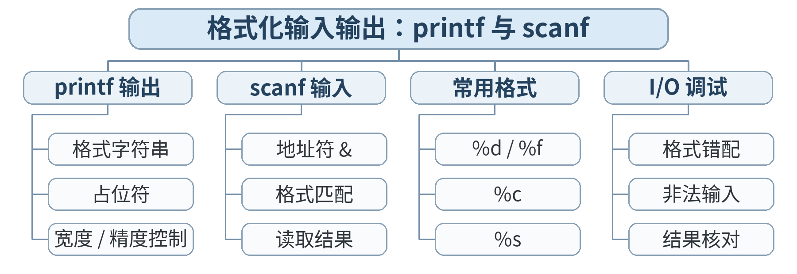

### 教学目标

**知识目标：**
- （1）掌握 printf/scanf 的基本格式控制。
- （2）理解格式说明符与变量类型匹配的重要性。
**能力目标：**
- （1）能实现命令行数据输入、格式化输出。
- （2）能发现并修复常见格式说明符、取地址符号错误。
**价值目标：**
- （1）形成对输入数据和输出格式负责的规范意识。

### 课程思政

- （1）通过数据类型、精度、类型转换和输入输出案例，强调工程数据必须语义明确、单位清晰、表达准确，培养对数据质量负责的意识。
- （2）结合整数除法、格式匹配等易错点，说明微小表示错误也可能放大为工程判断偏差，强化严谨计算与质量意识。

### 专创融合 / 双创融合

以设备参数录入、生产率/合格率计算和格式化报告为场景，训练“工业数据 → 程序计算 → 结果表达”的微型应用原型，形成面向实际需求的产品化思维。

### 教学重难点

教学重点：printf/scanf；格式说明符；&；输出精度。
教学难点：scanf 取地址与格式匹配。

### 教学方法

任务驱动法、演示法、上机实践法、问题引导法、同伴互评与调试复盘

### 教学用具

电脑、投影仪、多媒体课件、教材、华为 CodeArts IDE、鲲鹏 openEuler/终端、C 编译器、示例代码

### 教学设计

课前任务 → 互动导入（15 min）→ 传授新知与上机训练（70 min）→ 过关检测（10 min）→ 课堂小结（3 min）→ 作业布置（1 min）→ 考勤（1 min）

### 教学过程

#### 课前任务

【教师】课前发布本课主题“格式化输入输出：printf 与 scanf”及对应教材阅读范围，给出一个最小预习问题/代码片段，不提前给出完整答案。
- 1. 阅读教材对应内容，圈出 3 个核心术语；
- 2. 预读/预测课堂任务中可能出现的关键问题；
- 3. 检查开发环境，确保能够编译运行上一课最小程序。
【学生】完成阅读与环境检查，记录至少 1 个疑问，带着问题进入课堂。

**设计意图：** 通过课前阅读、环境检查和一个最小问题建立先备认知，避免把课堂时间消耗在环境故障上，并让学生带着真实疑问进入学习。

#### 互动导入与传授新知 / 上机训练

【互动导入 15 min】
【教师】给出一个 scanf 缺少 & 的程序，学生先编译/运行并观察现象。
【学生】先运行/预测/观察，记录结果和第一判断；不先听完整结论。
【传授新知与上机训练 70 min】
一、最小讲解与示范（约20 min）
【教师】教师演示 %d、%f、%lf、%c、宽度与小数位控制，解释 scanf 为什么需要变量地址。
【学生】同步操作，在关键位置写注释或记录规则，随时验证教师示范。
二、学生独立产出（约35 min）
【学生】学生完成 machine_input.c：输入设备编号、温度、转速，按固定表头输出两位小数报告。
【教师】巡回指导，只提示问题定位方法、边界和验收条件，不直接代写完整答案。
三、调试、互审与证据固化（约15 min）
【教师/学生】同伴用异常格式输入测试；检查提示语、输出单位和格式说明符。
【学习证据】machine_input.c + 两组运行记录（正常输入/边界输入）+ 格式检查表。
【评价关联】本课评价：A01；课堂证据用于检验本课知识与编程能力目标。

**设计意图：** 采用“先运行/预测 → 最小讲解与示范 → 独立编程 → 调试互审 → 证据固化”的上机闭环。把抽象语法/概念落到可运行程序，通过独立产出和测试证据检验真实学习，而不是只听懂讲解。

#### 过关检测

【教师】组织当堂检测：
- 1. scanf("%d", &n) 中 & 的作用是什么？
- 2. printf 输出 double 常用哪个格式？
- 3. 为什么输出结果要带单位？
【学生】独立作答/运行验证；【教师】根据错误类型进行针对性讲解，并要求学生说明判断依据。

**设计意图：** 用概念题、边界题和运行验证即时检测关键知识，暴露易错点；要求说明依据，避免只记答案。

#### 课堂小结

【教师】回到本课知识脉络图，用“概念—关系—应用—边界”四个关键词总结“格式化输入输出：printf 与 scanf”。
重点再次强调：printf/scanf；格式说明符；&；输出精度。。
【学生】用 1 分钟口述/书写“本课最重要的一条规则 + 一个最容易出错的边界”。

**设计意图：** 回到知识脉络图压缩本课信息，帮助学生形成层级结构，并把“规则—边界—应用”连接到下一次课。

#### 作业布置

【教师】布置课后任务：把程序扩展为 2 台设备数据输入并分别输出；整理常用格式说明符速查表。
【学生】按课程文件命名规范整理代码、测试记录和必要说明，课后提交。

**设计意图：** 通过整理源代码、测试记录和说明，固化课堂成果，形成可复查、可复现的过程性学习证据。

#### 考勤

【教师】利用学校/课程实际使用的平台进行签到。
【学生】按课程要求完成签到。

**设计意图：** 保留学校模板中的考勤环节，用于教学秩序管理；不在教案中预填任何出勤事实。

### 课后教学反思

【课后填写，不预填事实】
- 1. 教学流程：记录 100 min 各环节实际用时及需要调整的位置；
- 2. 教学内容：重点记录“scanf 取地址与格式匹配。”的真实掌握证据与常见错误；
- 3. 学生参与：仅依据课堂实际记录填写独立完成、提问、互审等情况，不补写推测性结论；
- 4. 评价证据：检查本课源代码/测试/调试证据是否完整，记录缺项及原因；
- 5. 后续改进：依据真实课堂证据确定下一轮教学调整。

**说明：** 反思必须基于真实课堂证据。课前仅提供填写框架，避免把预测或模板化表述误写成已发生的学生表现。

### 本章节参考文献

[1] 戴波.《C与C++程序设计（第二版）》[M]. 北京：北京大学出版社，2025.

## 第08次课 实验1：工程数据输入、计算与格式化输出

- **章节/单元**：第2章（U02）
- **周次**：按实际课表填写
- **课时安排**：2课时（100 min）

### 知识脉络图

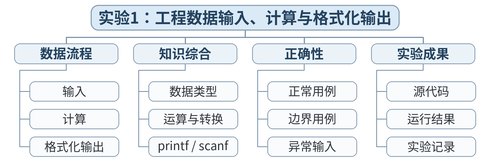

### 教学目标

**知识目标：**
- （1）综合运用数据类型、表达式、类型转换和格式化输入输出。
- （2）理解测试数据对验证程序正确性的作用。
**能力目标：**
- （1）能独立完成一个小型数据处理程序并提供测试证据。
- （2）能撰写简短实验说明，解释公式、输入和输出。
**价值目标：**
- （1）建立“程序正确性必须有测试证据”的质量意识。

### 课程思政

- （1）通过数据类型、精度、类型转换和输入输出案例，强调工程数据必须语义明确、单位清晰、表达准确，培养对数据质量负责的意识。
- （2）实验/综合任务要求保留源代码、测试记录和结论，强调实验诚信、结果可复现和过程可追溯；不得以主观判断代替测试证据。

### 专创融合 / 双创融合

以设备参数录入、生产率/合格率计算和格式化报告为场景，训练“工业数据 → 程序计算 → 结果表达”的微型应用原型，形成面向实际需求的产品化思维。

### 教学重难点

教学重点：综合数据处理；测试；实验报告。
教学难点：选择覆盖正常值与边界值的测试数据。

### 教学方法

任务驱动法、实验/上机实践法、巡回指导法、测试驱动评价、同伴复核

### 教学用具

电脑、投影仪、多媒体课件、教材、华为 CodeArts IDE、鲲鹏 openEuler/终端、C 编译器、示例代码、实验任务书、测试记录表

### 教学设计

课前任务 → 互动导入（15 min）→ 传授新知与上机训练（70 min）→ 过关检测（10 min）→ 课堂小结（3 min）→ 作业布置（1 min）→ 考勤（1 min）

### 教学过程

#### 课前任务

【教师】课前发布本课主题“实验1：工程数据输入、计算与格式化输出”及对应教材阅读范围，给出一个最小预习问题/代码片段，不提前给出完整答案。
- 1. 阅读教材对应内容，圈出 3 个核心术语；
- 2. 预读/预测课堂任务中可能出现的关键问题；
- 3. 检查开发环境，确保能够编译运行上一课最小程序。
【学生】完成阅读与环境检查，记录至少 1 个疑问，带着问题进入课堂。

**设计意图：** 通过课前阅读、环境检查和一个最小问题建立先备认知，避免把课堂时间消耗在环境故障上，并让学生带着真实疑问进入学习。

#### 互动导入与传授新知 / 上机训练

【互动导入 15 min】
【教师】教师发布实验需求与验收表，学生先写 5 分钟输入/输出样例，再开始编码。
【学生】先运行/预测/观察，记录结果和第一判断；不先听完整结论。
【传授新知与上机训练 70 min】
一、最小讲解与示范（约20 min）
【教师】教师只做关键点巡回辅导，不给完整答案；必要时提醒类型转换与格式符。
【学生】同步操作，在关键位置写注释或记录规则，随时验证教师示范。
二、学生独立产出（约35 min）
【学生】学生独立完成 engineering_calc.c，至少接收 3 个输入、完成 2 个计算、输出带单位结果。
【教师】巡回指导，只提示问题定位方法、边界和验收条件，不直接代写完整答案。
三、调试、互审与证据固化（约15 min）
【教师/学生】用至少 3 组测试数据验证：正常、边界、容易暴露整数除法的一组；记录实际结果。
【学习证据】实验源代码 + 实验报告（需求、公式、测试表、结论）+ 运行日志；计入 A02。
【评价关联】本课评价：A01+A02；课堂证据用于检验本课知识与编程能力目标。

**设计意图：** 采用“先运行/预测 → 最小讲解与示范 → 独立编程 → 调试互审 → 证据固化”的上机闭环。把抽象语法/概念落到可运行程序，通过独立产出和测试证据检验真实学习，而不是只听懂讲解。

#### 过关检测

【教师】组织当堂检测：
- 1. 测试用例为什么不能只用一组？
- 2. 如何设计一组能暴露整数除法问题的数据？
- 3. 实验报告中的“预期结果”和“实际结果”有什么区别？
【学生】独立作答/运行验证；【教师】根据错误类型进行针对性讲解，并要求学生说明判断依据。

**设计意图：** 用概念题、边界题和运行验证即时检测关键知识，暴露易错点；要求说明依据，避免只记答案。

#### 课堂小结

【教师】回到本课知识脉络图，用“概念—关系—应用—边界”四个关键词总结“实验1：工程数据输入、计算与格式化输出”。
重点再次强调：综合数据处理；测试；实验报告。。
【学生】用 1 分钟口述/书写“本课最重要的一条规则 + 一个最容易出错的边界”。

**设计意图：** 回到知识脉络图压缩本课信息，帮助学生形成层级结构，并把“规则—边界—应用”连接到下一次课。

#### 作业布置

【教师】布置课后任务：根据验收反馈修改程序；提交实验1完整包。
【学生】按课程文件命名规范整理代码、测试记录和必要说明，课后提交。

**设计意图：** 通过整理源代码、测试记录和说明，固化课堂成果，形成可复查、可复现的过程性学习证据。

#### 考勤

【教师】利用学校/课程实际使用的平台进行签到。
【学生】按课程要求完成签到。

**设计意图：** 保留学校模板中的考勤环节，用于教学秩序管理；不在教案中预填任何出勤事实。

### 课后教学反思

【课后填写，不预填事实】
- 1. 教学流程：记录 100 min 各环节实际用时及需要调整的位置；
- 2. 教学内容：重点记录“选择覆盖正常值与边界值的测试数据。”的真实掌握证据与常见错误；
- 3. 学生参与：仅依据课堂实际记录填写独立完成、提问、互审等情况，不补写推测性结论；
- 4. 评价证据：检查本课源代码/测试/调试证据是否完整，记录缺项及原因；
- 5. 后续改进：依据真实课堂证据确定下一轮教学调整。

**说明：** 反思必须基于真实课堂证据。课前仅提供填写框架，避免把预测或模板化表述误写成已发生的学生表现。

### 本章节参考文献

[1] 戴波.《C与C++程序设计（第二版）》[M]. 北京：北京大学出版社，2025.

## 第09次课 if 语句与条件表达式

- **章节/单元**：第3章（U03）
- **周次**：按实际课表填写
- **课时安排**：2课时（100 min）

### 知识脉络图

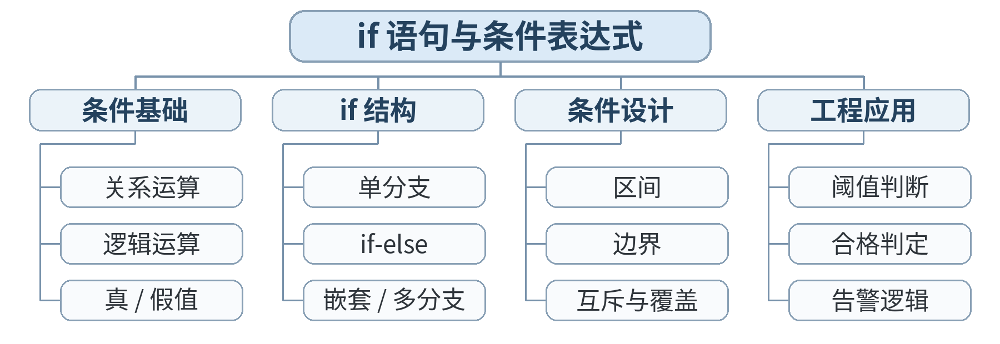

### 教学目标

**知识目标：**
- （1）掌握 if、if-else、多分支结构与关系/逻辑条件。
- （2）理解条件表达式真值与短路求值的基本现象。
**能力目标：**
- （1）能根据规则编写分类判断程序。
- （2）能为分支程序设计覆盖每条主要分支的测试。
**价值目标：**
- （1）培养规则清晰、条件边界明确的逻辑习惯。

### 课程思政

- （1）将条件、状态与循环控制联系到设备联锁、质量判定等规则系统，强调边界条件和异常路径对工程安全的重要性。
- （2）通过分支覆盖和路径测试，培养按规则办事、先验证后结论的程序设计习惯，形成责任意识与系统思维。

### 专创融合 / 双创融合

以质量门、设备模式和批次检测逻辑为原型，探索规则引擎、状态控制和自动判定在智能制造软件中的应用，培养从业务规则到程序逻辑的转化能力。

### 教学重难点

教学重点：if 结构；复合条件；边界。
教学难点：多条件边界重叠与遗漏。

### 教学方法

任务驱动法、演示法、上机实践法、问题引导法、同伴互评与调试复盘

### 教学用具

电脑、投影仪、多媒体课件、教材、华为 CodeArts IDE、鲲鹏 openEuler/终端、C 编译器、示例代码

### 教学设计

课前任务 → 互动导入（15 min）→ 传授新知与上机训练（70 min）→ 过关检测（10 min）→ 课堂小结（3 min）→ 作业布置（1 min）→ 考勤（1 min）

### 教学过程

#### 课前任务

【教师】课前发布本课主题“if 语句与条件表达式”及对应教材阅读范围，给出一个最小预习问题/代码片段，不提前给出完整答案。
- 1. 阅读教材对应内容，圈出 3 个核心术语；
- 2. 预读/预测课堂任务中可能出现的关键问题；
- 3. 检查开发环境，确保能够编译运行上一课最小程序。
【学生】完成阅读与环境检查，记录至少 1 个疑问，带着问题进入课堂。

**设计意图：** 通过课前阅读、环境检查和一个最小问题建立先备认知，避免把课堂时间消耗在环境故障上，并让学生带着真实疑问进入学习。

#### 互动导入与传授新知 / 上机训练

【互动导入 15 min】
【教师】给出温度阈值规则，学生先写条件表而不是直接写代码。
【学生】先运行/预测/观察，记录结果和第一判断；不先听完整结论。
【传授新知与上机训练 70 min】
一、最小讲解与示范（约20 min）
【教师】教师演示 if、else if、&&、||，讲解区间条件的写法与边界包含关系。
【学生】同步操作，在关键位置写注释或记录规则，随时验证教师示范。
二、学生独立产出（约35 min）
【学生】学生完成 quality_gate.c：根据测量值和上下限输出合格/偏低/偏高。
【教师】巡回指导，只提示问题定位方法、边界和验收条件，不直接代写完整答案。
三、调试、互审与证据固化（约15 min）
【教师/学生】学生用恰好等于上下限的测试值验证边界；同伴检查分支覆盖。
【学习证据】quality_gate.c + 分支测试表（至少 5 组）+ 边界说明。
【评价关联】本课评价：A01；课堂证据用于检验本课知识与编程能力目标。

**设计意图：** 采用“先运行/预测 → 最小讲解与示范 → 独立编程 → 调试互审 → 证据固化”的上机闭环。把抽象语法/概念落到可运行程序，通过独立产出和测试证据检验真实学习，而不是只听懂讲解。

#### 过关检测

【教师】组织当堂检测：
- 1. 区间 [a,b] 用 C 条件如何表示？
- 2. else if 链的顺序可能影响结果吗？
- 3. 什么叫分支覆盖？
【学生】独立作答/运行验证；【教师】根据错误类型进行针对性讲解，并要求学生说明判断依据。

**设计意图：** 用概念题、边界题和运行验证即时检测关键知识，暴露易错点；要求说明依据，避免只记答案。

#### 课堂小结

【教师】回到本课知识脉络图，用“概念—关系—应用—边界”四个关键词总结“if 语句与条件表达式”。
重点再次强调：if 结构；复合条件；边界。。
【学生】用 1 分钟口述/书写“本课最重要的一条规则 + 一个最容易出错的边界”。

**设计意图：** 回到知识脉络图压缩本课信息，帮助学生形成层级结构，并把“规则—边界—应用”连接到下一次课。

#### 作业布置

【教师】布置课后任务：扩展为“双条件质量判定”：尺寸和表面缺陷同时满足才合格。
【学生】按课程文件命名规范整理代码、测试记录和必要说明，课后提交。

**设计意图：** 通过整理源代码、测试记录和说明，固化课堂成果，形成可复查、可复现的过程性学习证据。

#### 考勤

【教师】利用学校/课程实际使用的平台进行签到。
【学生】按课程要求完成签到。

**设计意图：** 保留学校模板中的考勤环节，用于教学秩序管理；不在教案中预填任何出勤事实。

### 课后教学反思

【课后填写，不预填事实】
- 1. 教学流程：记录 100 min 各环节实际用时及需要调整的位置；
- 2. 教学内容：重点记录“多条件边界重叠与遗漏。”的真实掌握证据与常见错误；
- 3. 学生参与：仅依据课堂实际记录填写独立完成、提问、互审等情况，不补写推测性结论；
- 4. 评价证据：检查本课源代码/测试/调试证据是否完整，记录缺项及原因；
- 5. 后续改进：依据真实课堂证据确定下一轮教学调整。

**说明：** 反思必须基于真实课堂证据。课前仅提供填写框架，避免把预测或模板化表述误写成已发生的学生表现。

### 本章节参考文献

[1] 戴波.《C与C++程序设计（第二版）》[M]. 北京：北京大学出版社，2025.

## 第10次课 switch 与多分支状态处理

- **章节/单元**：第3章（U03）
- **周次**：按实际课表填写
- **课时安排**：2课时（100 min）

### 知识脉络图

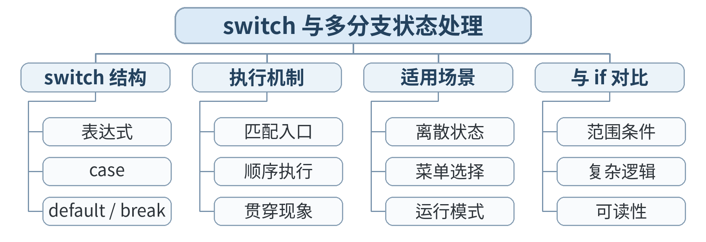

### 教学目标

**知识目标：**
- （1）掌握 switch、case、break、default 的语法与执行机制。
- （2）理解 switch 适合离散状态选择而非任意区间判断。
**能力目标：**
- （1）能用 switch 实现菜单/状态机式分支。
- （2）能识别因缺少 break 导致的贯穿执行。
**价值目标：**
- （1）形成根据问题结构选择控制语句的意识。

### 课程思政

- （1）将条件、状态与循环控制联系到设备联锁、质量判定等规则系统，强调边界条件和异常路径对工程安全的重要性。
- （2）通过分支覆盖和路径测试，培养按规则办事、先验证后结论的程序设计习惯，形成责任意识与系统思维。

### 专创融合 / 双创融合

以质量门、设备模式和批次检测逻辑为原型，探索规则引擎、状态控制和自动判定在智能制造软件中的应用，培养从业务规则到程序逻辑的转化能力。

### 教学重难点

教学重点：switch；case；break；default。
教学难点：贯穿执行；switch 与 if 的适用边界。

### 教学方法

任务驱动法、演示法、上机实践法、问题引导法、同伴互评与调试复盘

### 教学用具

电脑、投影仪、多媒体课件、教材、华为 CodeArts IDE、鲲鹏 openEuler/终端、C 编译器、示例代码

### 教学设计

课前任务 → 互动导入（15 min）→ 传授新知与上机训练（70 min）→ 过关检测（10 min）→ 课堂小结（3 min）→ 作业布置（1 min）→ 考勤（1 min）

### 教学过程

#### 课前任务

【教师】课前发布本课主题“switch 与多分支状态处理”及对应教材阅读范围，给出一个最小预习问题/代码片段，不提前给出完整答案。
- 1. 阅读教材对应内容，圈出 3 个核心术语；
- 2. 预读/预测课堂任务中可能出现的关键问题；
- 3. 检查开发环境，确保能够编译运行上一课最小程序。
【学生】完成阅读与环境检查，记录至少 1 个疑问，带着问题进入课堂。

**设计意图：** 通过课前阅读、环境检查和一个最小问题建立先备认知，避免把课堂时间消耗在环境故障上，并让学生带着真实疑问进入学习。

#### 互动导入与传授新知 / 上机训练

【互动导入 15 min】
【教师】运行一个故意漏写 break 的 switch 程序，学生根据输出推断执行路径。
【学生】先运行/预测/观察，记录结果和第一判断；不先听完整结论。
【传授新知与上机训练 70 min】
一、最小讲解与示范（约20 min）
【教师】教师讲解匹配机制、default 和 break，并对比 if-else 处理区间的场景。
【学生】同步操作，在关键位置写注释或记录规则，随时验证教师示范。
二、学生独立产出（约35 min）
【学生】学生编写 machine_mode.c：输入 0/1/2/3，输出停机/待机/运行/维护；其他值输出非法状态。
【教师】巡回指导，只提示问题定位方法、边界和验收条件，不直接代写完整答案。
三、调试、互审与证据固化（约15 min）
【教师/学生】小组互测全部合法状态+2个非法状态；检查是否存在意外贯穿。
【学习证据】machine_mode.c + 状态表 + 全状态运行记录。
【评价关联】本课评价：A01；课堂证据用于检验本课知识与编程能力目标。

**设计意图：** 采用“先运行/预测 → 最小讲解与示范 → 独立编程 → 调试互审 → 证据固化”的上机闭环。把抽象语法/概念落到可运行程序，通过独立产出和测试证据检验真实学习，而不是只听懂讲解。

#### 过关检测

【教师】组织当堂检测：
- 1. switch 更适合连续区间还是离散枚举？
- 2. 漏写 break 可能发生什么？
- 3. default 的工程意义是什么？
【学生】独立作答/运行验证；【教师】根据错误类型进行针对性讲解，并要求学生说明判断依据。

**设计意图：** 用概念题、边界题和运行验证即时检测关键知识，暴露易错点；要求说明依据，避免只记答案。

#### 课堂小结

【教师】回到本课知识脉络图，用“概念—关系—应用—边界”四个关键词总结“switch 与多分支状态处理”。
重点再次强调：switch；case；break；default。。
【学生】用 1 分钟口述/书写“本课最重要的一条规则 + 一个最容易出错的边界”。

**设计意图：** 回到知识脉络图压缩本课信息，帮助学生形成层级结构，并把“规则—边界—应用”连接到下一次课。

#### 作业布置

【教师】布置课后任务：把状态程序扩展为“模式+权限”双层判断，写出为什么外层使用 switch/if 的选择理由。
【学生】按课程文件命名规范整理代码、测试记录和必要说明，课后提交。

**设计意图：** 通过整理源代码、测试记录和说明，固化课堂成果，形成可复查、可复现的过程性学习证据。

#### 考勤

【教师】利用学校/课程实际使用的平台进行签到。
【学生】按课程要求完成签到。

**设计意图：** 保留学校模板中的考勤环节，用于教学秩序管理；不在教案中预填任何出勤事实。

### 课后教学反思

【课后填写，不预填事实】
- 1. 教学流程：记录 100 min 各环节实际用时及需要调整的位置；
- 2. 教学内容：重点记录“贯穿执行；switch 与 if 的适用边界。”的真实掌握证据与常见错误；
- 3. 学生参与：仅依据课堂实际记录填写独立完成、提问、互审等情况，不补写推测性结论；
- 4. 评价证据：检查本课源代码/测试/调试证据是否完整，记录缺项及原因；
- 5. 后续改进：依据真实课堂证据确定下一轮教学调整。

**说明：** 反思必须基于真实课堂证据。课前仅提供填写框架，避免把预测或模板化表述误写成已发生的学生表现。

### 本章节参考文献

[1] 戴波.《C与C++程序设计（第二版）》[M]. 北京：北京大学出版社，2025.

## 第11次课 循环：for、while 与 do-while

- **章节/单元**：第3章（U03）
- **周次**：按实际课表填写
- **课时安排**：2课时（100 min）

### 知识脉络图

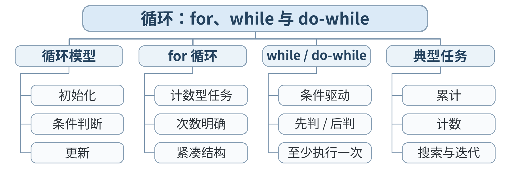

### 教学目标

**知识目标：**
- （1）掌握 for、while、do-while 的基本结构。
- （2）理解循环初始化、条件、更新与终止。
**能力目标：**
- （1）能选择合适循环完成重复计算和累计。
- （2）能识别常见死循环、少循环一次/多循环一次问题。
**价值目标：**
- （1）养成明确循环终止条件的安全意识。

### 课程思政

- （1）将条件、状态与循环控制联系到设备联锁、质量判定等规则系统，强调边界条件和异常路径对工程安全的重要性。
- （2）通过分支覆盖和路径测试，培养按规则办事、先验证后结论的程序设计习惯，形成责任意识与系统思维。

### 专创融合 / 双创融合

以质量门、设备模式和批次检测逻辑为原型，探索规则引擎、状态控制和自动判定在智能制造软件中的应用，培养从业务规则到程序逻辑的转化能力。

### 教学重难点

教学重点：循环三要素；累计；计数。
教学难点：循环边界与终止条件。

### 教学方法

任务驱动法、演示法、上机实践法、问题引导法、同伴互评与调试复盘

### 教学用具

电脑、投影仪、多媒体课件、教材、华为 CodeArts IDE、鲲鹏 openEuler/终端、C 编译器、示例代码

### 教学设计

课前任务 → 互动导入（15 min）→ 传授新知与上机训练（70 min）→ 过关检测（10 min）→ 课堂小结（3 min）→ 作业布置（1 min）→ 考勤（1 min）

### 教学过程

#### 课前任务

【教师】课前发布本课主题“循环：for、while 与 do-while”及对应教材阅读范围，给出一个最小预习问题/代码片段，不提前给出完整答案。
- 1. 阅读教材对应内容，圈出 3 个核心术语；
- 2. 预读/预测课堂任务中可能出现的关键问题；
- 3. 检查开发环境，确保能够编译运行上一课最小程序。
【学生】完成阅读与环境检查，记录至少 1 个疑问，带着问题进入课堂。

**设计意图：** 通过课前阅读、环境检查和一个最小问题建立先备认知，避免把课堂时间消耗在环境故障上，并让学生带着真实疑问进入学习。

#### 互动导入与传授新知 / 上机训练

【互动导入 15 min】
【教师】学生预测 for(i=0;i<5;i++) 的 i 取值序列并运行验证。
【学生】先运行/预测/观察，记录结果和第一判断；不先听完整结论。
【传授新知与上机训练 70 min】
一、最小讲解与示范（约20 min）
【教师】教师演示三种循环，讲解计数、求和、平均值模式；示范死循环诊断。
【学生】同步操作，在关键位置写注释或记录规则，随时验证教师示范。
二、学生独立产出（约35 min）
【学生】学生完成 batch_average.c：循环输入/生成 10 个数据，计算总和和平均值。
【教师】巡回指导，只提示问题定位方法、边界和验收条件，不直接代写完整答案。
三、调试、互审与证据固化（约15 min）
【教师/学生】教师提供 n=0、n=1 等思考题；学生检查循环次数和除零风险。
【学习证据】batch_average.c + 循环轨迹表（前3次）+ 结果验证。
【评价关联】本课评价：A01；课堂证据用于检验本课知识与编程能力目标。

**设计意图：** 采用“先运行/预测 → 最小讲解与示范 → 独立编程 → 调试互审 → 证据固化”的上机闭环。把抽象语法/概念落到可运行程序，通过独立产出和测试证据检验真实学习，而不是只听懂讲解。

#### 过关检测

【教师】组织当堂检测：
- 1. for 循环最常见的三个组成是什么？
- 2. do-while 至少执行几次？
- 3. 如何判断一个循环是否可能永不结束？
【学生】独立作答/运行验证；【教师】根据错误类型进行针对性讲解，并要求学生说明判断依据。

**设计意图：** 用概念题、边界题和运行验证即时检测关键知识，暴露易错点；要求说明依据，避免只记答案。

#### 课堂小结

【教师】回到本课知识脉络图，用“概念—关系—应用—边界”四个关键词总结“循环：for、while 与 do-while”。
重点再次强调：循环三要素；累计；计数。。
【学生】用 1 分钟口述/书写“本课最重要的一条规则 + 一个最容易出错的边界”。

**设计意图：** 回到知识脉络图压缩本课信息，帮助学生形成层级结构，并把“规则—边界—应用”连接到下一次课。

#### 作业布置

【教师】布置课后任务：用 while 改写课堂 for 程序，并比较可读性；完成一个累乘或计数任务。
【学生】按课程文件命名规范整理代码、测试记录和必要说明，课后提交。

**设计意图：** 通过整理源代码、测试记录和说明，固化课堂成果，形成可复查、可复现的过程性学习证据。

#### 考勤

【教师】利用学校/课程实际使用的平台进行签到。
【学生】按课程要求完成签到。

**设计意图：** 保留学校模板中的考勤环节，用于教学秩序管理；不在教案中预填任何出勤事实。

### 课后教学反思

【课后填写，不预填事实】
- 1. 教学流程：记录 100 min 各环节实际用时及需要调整的位置；
- 2. 教学内容：重点记录“循环边界与终止条件。”的真实掌握证据与常见错误；
- 3. 学生参与：仅依据课堂实际记录填写独立完成、提问、互审等情况，不补写推测性结论；
- 4. 评价证据：检查本课源代码/测试/调试证据是否完整，记录缺项及原因；
- 5. 后续改进：依据真实课堂证据确定下一轮教学调整。

**说明：** 反思必须基于真实课堂证据。课前仅提供填写框架，避免把预测或模板化表述误写成已发生的学生表现。

### 本章节参考文献

[1] 戴波.《C与C++程序设计（第二版）》[M]. 北京：北京大学出版社，2025.

## 第12次课 实验2：嵌套循环、break/continue 与流程控制综合

- **章节/单元**：第3章（U03）
- **周次**：按实际课表填写
- **课时安排**：2课时（100 min）

### 知识脉络图

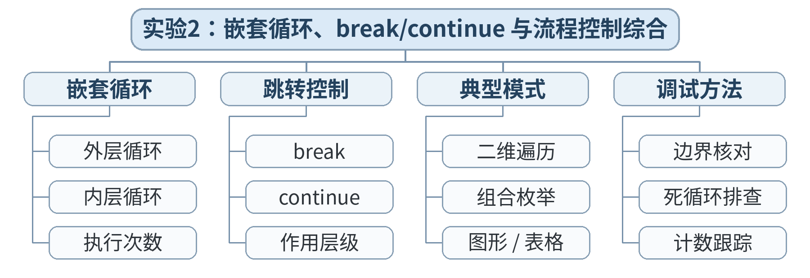

### 教学目标

**知识目标：**
- （1）理解嵌套循环、break、continue。
- （2）了解 goto 的语法和限制性使用背景。
- （3）综合选择结构与循环结构解决流程问题。
**能力目标：**
- （1）能编写包含多分支和循环的完整小程序。
- （2）能用测试表验证正常、跳过、提前终止等路径。
**价值目标：**
- （1）强化结构化程序设计和可维护性优先意识。

### 课程思政

- （1）将条件、状态与循环控制联系到设备联锁、质量判定等规则系统，强调边界条件和异常路径对工程安全的重要性。
- （2）实验/综合任务要求保留源代码、测试记录和结论，强调实验诚信、结果可复现和过程可追溯；不得以主观判断代替测试证据。

### 专创融合 / 双创融合

以质量门、设备模式和批次检测逻辑为原型，探索规则引擎、状态控制和自动判定在智能制造软件中的应用，培养从业务规则到程序逻辑的转化能力。

### 教学重难点

教学重点：嵌套/循环控制；路径测试。
教学难点：多层流程中 break/continue 的作用范围。

### 教学方法

任务驱动法、实验/上机实践法、巡回指导法、测试驱动评价、同伴复核

### 教学用具

电脑、投影仪、多媒体课件、教材、华为 CodeArts IDE、鲲鹏 openEuler/终端、C 编译器、示例代码、实验任务书、测试记录表

### 教学设计

课前任务 → 互动导入（15 min）→ 传授新知与上机训练（70 min）→ 过关检测（10 min）→ 课堂小结（3 min）→ 作业布置（1 min）→ 考勤（1 min）

### 教学过程

#### 课前任务

【教师】课前发布本课主题“实验2：嵌套循环、break/continue 与流程控制综合”及对应教材阅读范围，给出一个最小预习问题/代码片段，不提前给出完整答案。
- 1. 阅读教材对应内容，圈出 3 个核心术语；
- 2. 预读/预测课堂任务中可能出现的关键问题；
- 3. 检查开发环境，确保能够编译运行上一课最小程序。
【学生】完成阅读与环境检查，记录至少 1 个疑问，带着问题进入课堂。

**设计意图：** 通过课前阅读、环境检查和一个最小问题建立先备认知，避免把课堂时间消耗在环境故障上，并让学生带着真实疑问进入学习。

#### 互动导入与传授新知 / 上机训练

【互动导入 15 min】
【教师】学生阅读 20 行流程程序，在纸上标出 continue 和 break 各自影响哪一层。
【学生】先运行/预测/观察，记录结果和第一判断；不先听完整结论。
【传授新知与上机训练 70 min】
一、最小讲解与示范（约20 min）
【教师】教师演示嵌套循环和控制语句；用 goto 做“识别用途、不推荐常规使用”的反例。
【学生】同步操作，在关键位置写注释或记录规则，随时验证教师示范。
二、学生独立产出（约35 min）
【学生】学生完成 batch_inspection.c：处理若干批次数据，轻微异常 continue，严重异常 break，并输出统计。
【教师】巡回指导，只提示问题定位方法、边界和验收条件，不直接代写完整答案。
三、调试、互审与证据固化（约15 min）
【教师/学生】设计 4 组测试覆盖：全正常、含跳过、含提前终止、边界；记录路径。
【学习证据】实验2源代码 + 路径测试表 + 结构说明；计入 A02。
【评价关联】本课评价：A01+A02；课堂证据用于检验本课知识与编程能力目标。

**设计意图：** 采用“先运行/预测 → 最小讲解与示范 → 独立编程 → 调试互审 → 证据固化”的上机闭环。把抽象语法/概念落到可运行程序，通过独立产出和测试证据检验真实学习，而不是只听懂讲解。

#### 过关检测

【教师】组织当堂检测：
- 1. break 会结束哪一层循环？
- 2. continue 会跳过什么？
- 3. 为什么一般不把 goto 作为普通流程控制首选？
【学生】独立作答/运行验证；【教师】根据错误类型进行针对性讲解，并要求学生说明判断依据。

**设计意图：** 用概念题、边界题和运行验证即时检测关键知识，暴露易错点；要求说明依据，避免只记答案。

#### 课堂小结

【教师】回到本课知识脉络图，用“概念—关系—应用—边界”四个关键词总结“实验2：嵌套循环、break/continue 与流程控制综合”。
重点再次强调：嵌套/循环控制；路径测试。。
【学生】用 1 分钟口述/书写“本课最重要的一条规则 + 一个最容易出错的边界”。

**设计意图：** 回到知识脉络图压缩本课信息，帮助学生形成层级结构，并把“规则—边界—应用”连接到下一次课。

#### 作业布置

【教师】布置课后任务：提交实验2；用流程图重画自己的程序，并检查代码与流程图是否一致。
【学生】按课程文件命名规范整理代码、测试记录和必要说明，课后提交。

**设计意图：** 通过整理源代码、测试记录和说明，固化课堂成果，形成可复查、可复现的过程性学习证据。

#### 考勤

【教师】利用学校/课程实际使用的平台进行签到。
【学生】按课程要求完成签到。

**设计意图：** 保留学校模板中的考勤环节，用于教学秩序管理；不在教案中预填任何出勤事实。

### 课后教学反思

【课后填写，不预填事实】
- 1. 教学流程：记录 100 min 各环节实际用时及需要调整的位置；
- 2. 教学内容：重点记录“多层流程中 break/continue 的作用范围。”的真实掌握证据与常见错误；
- 3. 学生参与：仅依据课堂实际记录填写独立完成、提问、互审等情况，不补写推测性结论；
- 4. 评价证据：检查本课源代码/测试/调试证据是否完整，记录缺项及原因；
- 5. 后续改进：依据真实课堂证据确定下一轮教学调整。

**说明：** 反思必须基于真实课堂证据。课前仅提供填写框架，避免把预测或模板化表述误写成已发生的学生表现。

### 本章节参考文献

[1] 戴波.《C与C++程序设计（第二版）》[M]. 北京：北京大学出版社，2025.

## 第13次课 一维数组：批量同类数据

- **章节/单元**：第4章（U04）
- **周次**：按实际课表填写
- **课时安排**：2课时（100 min）

### 知识脉络图

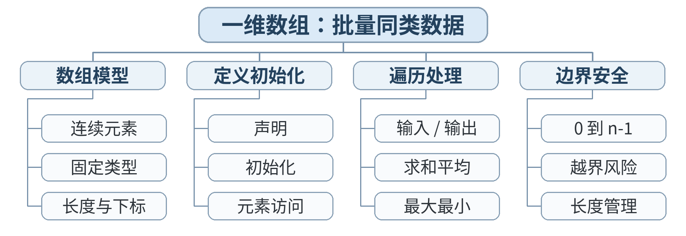

### 教学目标

**知识目标：**
- （1）掌握一维数组定义、初始化、下标访问和遍历。
- （2）理解下标从 0 开始及越界风险。
**能力目标：**
- （1）能用数组完成批量数据统计、查找和简单处理。
- （2）能设计循环避免数组越界。
**价值目标：**
- （1）建立边界意识与内存安全意识。

### 课程思政

- （1）通过数组、字符串和结构体组织工程数据，强调数据边界、记录完整性和可追溯性，培养规范管理数据的职业意识。
- （2）结合越界、字符串终止符和记录字段一致性等问题，强化资源边界、信息完整与质量控制意识。

### 专创融合 / 双创融合

围绕批量尺寸、工位矩阵、字符串和设备记录，构建轻量级数据处理原型，为后续数据结构、设备信息管理和生产数据分析建立应用意识。

### 教学重难点

教学重点：数组定义/访问/遍历；下标边界。
教学难点：数组长度与循环条件的一致性。

### 教学方法

任务驱动法、演示法、上机实践法、问题引导法、同伴互评与调试复盘

### 教学用具

电脑、投影仪、多媒体课件、教材、华为 CodeArts IDE、鲲鹏 openEuler/终端、C 编译器、示例代码

### 教学设计

课前任务 → 互动导入（15 min）→ 传授新知与上机训练（70 min）→ 过关检测（10 min）→ 课堂小结（3 min）→ 作业布置（1 min）→ 考勤（1 min）

### 教学过程

#### 课前任务

【教师】课前发布本课主题“一维数组：批量同类数据”及对应教材阅读范围，给出一个最小预习问题/代码片段，不提前给出完整答案。
- 1. 阅读教材对应内容，圈出 3 个核心术语；
- 2. 预读/预测课堂任务中可能出现的关键问题；
- 3. 检查开发环境，确保能够编译运行上一课最小程序。
【学生】完成阅读与环境检查，记录至少 1 个疑问，带着问题进入课堂。

**设计意图：** 通过课前阅读、环境检查和一个最小问题建立先备认知，避免把课堂时间消耗在环境故障上，并让学生带着真实疑问进入学习。

#### 互动导入与传授新知 / 上机训练

【互动导入 15 min】
【教师】教师展示 10 个独立变量与 int data[10] 两种写法，学生判断哪种更易扩展。
【学生】先运行/预测/观察，记录结果和第一判断；不先听完整结论。
【传授新知与上机训练 70 min】
一、最小讲解与示范（约20 min）
【教师】教师演示初始化、遍历、求和、最大值；强调 0..n-1。
【学生】同步操作，在关键位置写注释或记录规则，随时验证教师示范。
二、学生独立产出（约35 min）
【学生】学生完成 dimension_stats.c：对 10 个尺寸求平均、最大、最小、超差数量。
【教师】巡回指导，只提示问题定位方法、边界和验收条件，不直接代写完整答案。
三、调试、互审与证据固化（约15 min）
【教师/学生】故意把循环条件改成 i<=10，观察/讨论越界的不可预测性，不要求依赖崩溃现象。
【学习证据】dimension_stats.c + 数据表 + 边界自检清单。
【评价关联】本课评价：A01；课堂证据用于检验本课知识与编程能力目标。

**设计意图：** 采用“先运行/预测 → 最小讲解与示范 → 独立编程 → 调试互审 → 证据固化”的上机闭环。把抽象语法/概念落到可运行程序，通过独立产出和测试证据检验真实学习，而不是只听懂讲解。

#### 过关检测

【教师】组织当堂检测：
- 1. 长度为 10 的数组合法下标范围是什么？
- 2. 为什么越界不一定立刻报错？
- 3. 数组适合保存哪类数据？
【学生】独立作答/运行验证；【教师】根据错误类型进行针对性讲解，并要求学生说明判断依据。

**设计意图：** 用概念题、边界题和运行验证即时检测关键知识，暴露易错点；要求说明依据，避免只记答案。

#### 课堂小结

【教师】回到本课知识脉络图，用“概念—关系—应用—边界”四个关键词总结“一维数组：批量同类数据”。
重点再次强调：数组定义/访问/遍历；下标边界。。
【学生】用 1 分钟口述/书写“本课最重要的一条规则 + 一个最容易出错的边界”。

**设计意图：** 回到知识脉络图压缩本课信息，帮助学生形成层级结构，并把“规则—边界—应用”连接到下一次课。

#### 作业布置

【教师】布置课后任务：把程序扩展为由常量 N 控制数组长度；禁止在循环中硬编码 10。
【学生】按课程文件命名规范整理代码、测试记录和必要说明，课后提交。

**设计意图：** 通过整理源代码、测试记录和说明，固化课堂成果，形成可复查、可复现的过程性学习证据。

#### 考勤

【教师】利用学校/课程实际使用的平台进行签到。
【学生】按课程要求完成签到。

**设计意图：** 保留学校模板中的考勤环节，用于教学秩序管理；不在教案中预填任何出勤事实。

### 课后教学反思

【课后填写，不预填事实】
- 1. 教学流程：记录 100 min 各环节实际用时及需要调整的位置；
- 2. 教学内容：重点记录“数组长度与循环条件的一致性。”的真实掌握证据与常见错误；
- 3. 学生参与：仅依据课堂实际记录填写独立完成、提问、互审等情况，不补写推测性结论；
- 4. 评价证据：检查本课源代码/测试/调试证据是否完整，记录缺项及原因；
- 5. 后续改进：依据真实课堂证据确定下一轮教学调整。

**说明：** 反思必须基于真实课堂证据。课前仅提供填写框架，避免把预测或模板化表述误写成已发生的学生表现。

### 本章节参考文献

[1] 戴波.《C与C++程序设计（第二版）》[M]. 北京：北京大学出版社，2025.

## 第14次课 二维数组：矩阵化工位数据

- **章节/单元**：第4章（U04）
- **周次**：按实际课表填写
- **课时安排**：2课时（100 min）

### 知识脉络图

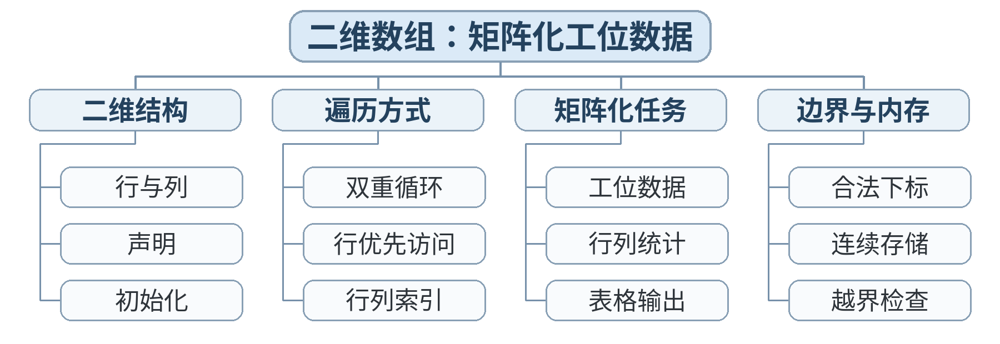

### 教学目标

**知识目标：**
- （1）掌握二维数组定义、初始化与双重循环遍历。
- （2）理解行、列和内存中连续存储的初步概念。
**能力目标：**
- （1）能表示“批次×工位”或“日期×设备”二维数据。
- （2）能按行/列计算统计结果。
**价值目标：**
- （1）培养结构化组织数据的意识。

### 课程思政

- （1）通过数组、字符串和结构体组织工程数据，强调数据边界、记录完整性和可追溯性，培养规范管理数据的职业意识。
- （2）结合越界、字符串终止符和记录字段一致性等问题，强化资源边界、信息完整与质量控制意识。

### 专创融合 / 双创融合

围绕批量尺寸、工位矩阵、字符串和设备记录，构建轻量级数据处理原型，为后续数据结构、设备信息管理和生产数据分析建立应用意识。

### 教学重难点

教学重点：二维数组；嵌套循环；行列统计。
教学难点：行列下标与双层循环的对应关系。

### 教学方法

任务驱动法、演示法、上机实践法、问题引导法、同伴互评与调试复盘

### 教学用具

电脑、投影仪、多媒体课件、教材、华为 CodeArts IDE、鲲鹏 openEuler/终端、C 编译器、示例代码

### 教学设计

课前任务 → 互动导入（15 min）→ 传授新知与上机训练（70 min）→ 过关检测（10 min）→ 课堂小结（3 min）→ 作业布置（1 min）→ 考勤（1 min）

### 教学过程

#### 课前任务

【教师】课前发布本课主题“二维数组：矩阵化工位数据”及对应教材阅读范围，给出一个最小预习问题/代码片段，不提前给出完整答案。
- 1. 阅读教材对应内容，圈出 3 个核心术语；
- 2. 预读/预测课堂任务中可能出现的关键问题；
- 3. 检查开发环境，确保能够编译运行上一课最小程序。
【学生】完成阅读与环境检查，记录至少 1 个疑问，带着问题进入课堂。

**设计意图：** 通过课前阅读、环境检查和一个最小问题建立先备认知，避免把课堂时间消耗在环境故障上，并让学生带着真实疑问进入学习。

#### 互动导入与传授新知 / 上机训练

【互动导入 15 min】
【教师】学生在纸上标出 a[2][3] 的行列位置，并写出遍历顺序。
【学生】先运行/预测/观察，记录结果和第一判断；不先听完整结论。
【传授新知与上机训练 70 min】
一、最小讲解与示范（约20 min）
【教师】教师演示二维数组初始化、输出矩阵、按行求和。
【学生】同步操作，在关键位置写注释或记录规则，随时验证教师示范。
二、学生独立产出（约35 min）
【学生】学生完成 production_matrix.c：3×4 产量矩阵，输出每台设备总产量和每时段总产量。
【教师】巡回指导，只提示问题定位方法、边界和验收条件，不直接代写完整答案。
三、调试、互审与证据固化（约15 min）
【教师/学生】同伴检查 i/j 含义命名、行列范围和累计变量是否放在正确位置初始化。
【学习证据】production_matrix.c + 矩阵输出 + 行/列统计结果。
【评价关联】本课评价：A01；课堂证据用于检验本课知识与编程能力目标。

**设计意图：** 采用“先运行/预测 → 最小讲解与示范 → 独立编程 → 调试互审 → 证据固化”的上机闭环。把抽象语法/概念落到可运行程序，通过独立产出和测试证据检验真实学习，而不是只听懂讲解。

#### 过关检测

【教师】组织当堂检测：
- 1. 二维数组 a[r][c] 中第一个下标通常表示什么？
- 2. 为什么每行求和时 sum 要在外层循环适当位置清零？
- 3. 双重循环总次数如何估算？
【学生】独立作答/运行验证；【教师】根据错误类型进行针对性讲解，并要求学生说明判断依据。

**设计意图：** 用概念题、边界题和运行验证即时检测关键知识，暴露易错点；要求说明依据，避免只记答案。

#### 课堂小结

【教师】回到本课知识脉络图，用“概念—关系—应用—边界”四个关键词总结“二维数组：矩阵化工位数据”。
重点再次强调：二维数组；嵌套循环；行列统计。。
【学生】用 1 分钟口述/书写“本课最重要的一条规则 + 一个最容易出错的边界”。

**设计意图：** 回到知识脉络图压缩本课信息，帮助学生形成层级结构，并把“规则—边界—应用”连接到下一次课。

#### 作业布置

【教师】布置课后任务：扩展一个“找出产量最低工位/时段”的功能。
【学生】按课程文件命名规范整理代码、测试记录和必要说明，课后提交。

**设计意图：** 通过整理源代码、测试记录和说明，固化课堂成果，形成可复查、可复现的过程性学习证据。

#### 考勤

【教师】利用学校/课程实际使用的平台进行签到。
【学生】按课程要求完成签到。

**设计意图：** 保留学校模板中的考勤环节，用于教学秩序管理；不在教案中预填任何出勤事实。

### 课后教学反思

【课后填写，不预填事实】
- 1. 教学流程：记录 100 min 各环节实际用时及需要调整的位置；
- 2. 教学内容：重点记录“行列下标与双层循环的对应关系。”的真实掌握证据与常见错误；
- 3. 学生参与：仅依据课堂实际记录填写独立完成、提问、互审等情况，不补写推测性结论；
- 4. 评价证据：检查本课源代码/测试/调试证据是否完整，记录缺项及原因；
- 5. 后续改进：依据真实课堂证据确定下一轮教学调整。

**说明：** 反思必须基于真实课堂证据。课前仅提供填写框架，避免把预测或模板化表述误写成已发生的学生表现。

### 本章节参考文献

[1] 戴波.《C与C++程序设计（第二版）》[M]. 北京：北京大学出版社，2025.

## 第15次课 字符数组与字符串基础

- **章节/单元**：第4章（U04）
- **周次**：按实际课表填写
- **课时安排**：2课时（100 min）

### 知识脉络图

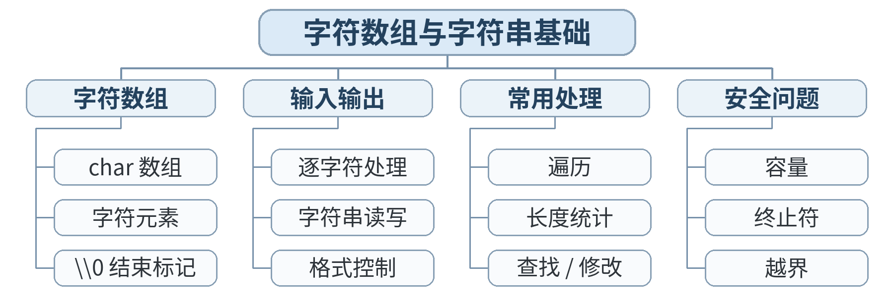

### 教学目标

**知识目标：**
- （1）理解字符数组、字符串结束符 \0 的基本概念。
- （2）掌握基础字符串输入输出与常见处理思路。
**能力目标：**
- （1）能保存设备编号、状态文本并完成简单字符遍历。
- （2）能区分单个字符与字符串字面量。
**价值目标：**
- （1）形成对文本边界和缓冲区长度敏感的安全习惯。

### 课程思政

- （1）通过数组、字符串和结构体组织工程数据，强调数据边界、记录完整性和可追溯性，培养规范管理数据的职业意识。
- （2）结合越界、字符串终止符和记录字段一致性等问题，强化资源边界、信息完整与质量控制意识。

### 专创融合 / 双创融合

围绕批量尺寸、工位矩阵、字符串和设备记录，构建轻量级数据处理原型，为后续数据结构、设备信息管理和生产数据分析建立应用意识。

### 教学重难点

教学重点：char 与字符串；\0；字符数组遍历。
教学难点：字符串结束与数组容量。

### 教学方法

任务驱动法、演示法、上机实践法、问题引导法、同伴互评与调试复盘

### 教学用具

电脑、投影仪、多媒体课件、教材、华为 CodeArts IDE、鲲鹏 openEuler/终端、C 编译器、示例代码

### 教学设计

课前任务 → 互动导入（15 min）→ 传授新知与上机训练（70 min）→ 过关检测（10 min）→ 课堂小结（3 min）→ 作业布置（1 min）→ 考勤（1 min）

### 教学过程

#### 课前任务

【教师】课前发布本课主题“字符数组与字符串基础”及对应教材阅读范围，给出一个最小预习问题/代码片段，不提前给出完整答案。
- 1. 阅读教材对应内容，圈出 3 个核心术语；
- 2. 预读/预测课堂任务中可能出现的关键问题；
- 3. 检查开发环境，确保能够编译运行上一课最小程序。
【学生】完成阅读与环境检查，记录至少 1 个疑问，带着问题进入课堂。

**设计意图：** 通过课前阅读、环境检查和一个最小问题建立先备认知，避免把课堂时间消耗在环境故障上，并让学生带着真实疑问进入学习。

#### 互动导入与传授新知 / 上机训练

【互动导入 15 min】
【教师】比较 char c='A' 与 char s[]="A" 的内存/含义差异。
【学生】先运行/预测/观察，记录结果和第一判断；不先听完整结论。
【传授新知与上机训练 70 min】
一、最小讲解与示范（约20 min）
【教师】教师演示字符数组初始化、printf("%s")、逐字符遍历；提醒输入长度风险。
【学生】同步操作，在关键位置写注释或记录规则，随时验证教师示范。
二、学生独立产出（约35 min）
【学生】学生完成 device_label.c：保存设备编号字符串，统计字符数（手写遍历），输出格式化标签。
【教师】巡回指导，只提示问题定位方法、边界和验收条件，不直接代写完整答案。
三、调试、互审与证据固化（约15 min）
【教师/学生】测试空串/较短/接近容量的字符串样例（使用安全输入方式或固定初始化），检查终止条件。
【学习证据】device_label.c + 字符遍历记录 + 容量说明。
【评价关联】本课评价：A01；课堂证据用于检验本课知识与编程能力目标。

**设计意图：** 采用“先运行/预测 → 最小讲解与示范 → 独立编程 → 调试互审 → 证据固化”的上机闭环。把抽象语法/概念落到可运行程序，通过独立产出和测试证据检验真实学习，而不是只听懂讲解。

#### 过关检测

【教师】组织当堂检测：
- 1. 字符串为什么需要 \0？
- 2. 字符 'A' 与字符串 "A" 是否相同？
- 3. 为什么字符数组容量必须考虑终止符？
【学生】独立作答/运行验证；【教师】根据错误类型进行针对性讲解，并要求学生说明判断依据。

**设计意图：** 用概念题、边界题和运行验证即时检测关键知识，暴露易错点；要求说明依据，避免只记答案。

#### 课堂小结

【教师】回到本课知识脉络图，用“概念—关系—应用—边界”四个关键词总结“字符数组与字符串基础”。
重点再次强调：char 与字符串；\0；字符数组遍历。。
【学生】用 1 分钟口述/书写“本课最重要的一条规则 + 一个最容易出错的边界”。

**设计意图：** 回到知识脉络图压缩本课信息，帮助学生形成层级结构，并把“规则—边界—应用”连接到下一次课。

#### 作业布置

【教师】布置课后任务：编写一个不调用 strlen 的字符串长度函数雏形（本课可直接写循环，函数化留到U06）。
【学生】按课程文件命名规范整理代码、测试记录和必要说明，课后提交。

**设计意图：** 通过整理源代码、测试记录和说明，固化课堂成果，形成可复查、可复现的过程性学习证据。

#### 考勤

【教师】利用学校/课程实际使用的平台进行签到。
【学生】按课程要求完成签到。

**设计意图：** 保留学校模板中的考勤环节，用于教学秩序管理；不在教案中预填任何出勤事实。

### 课后教学反思

【课后填写，不预填事实】
- 1. 教学流程：记录 100 min 各环节实际用时及需要调整的位置；
- 2. 教学内容：重点记录“字符串结束与数组容量。”的真实掌握证据与常见错误；
- 3. 学生参与：仅依据课堂实际记录填写独立完成、提问、互审等情况，不补写推测性结论；
- 4. 评价证据：检查本课源代码/测试/调试证据是否完整，记录缺项及原因；
- 5. 后续改进：依据真实课堂证据确定下一轮教学调整。

**说明：** 反思必须基于真实课堂证据。课前仅提供填写框架，避免把预测或模板化表述误写成已发生的学生表现。

### 本章节参考文献

[1] 戴波.《C与C++程序设计（第二版）》[M]. 北京：北京大学出版社，2025.

## 第16次课 实验3：结构体与结构数组——设备记录管理

- **章节/单元**：第4章（U04）
- **周次**：按实际课表填写
- **课时安排**：2课时（100 min）

### 知识脉络图

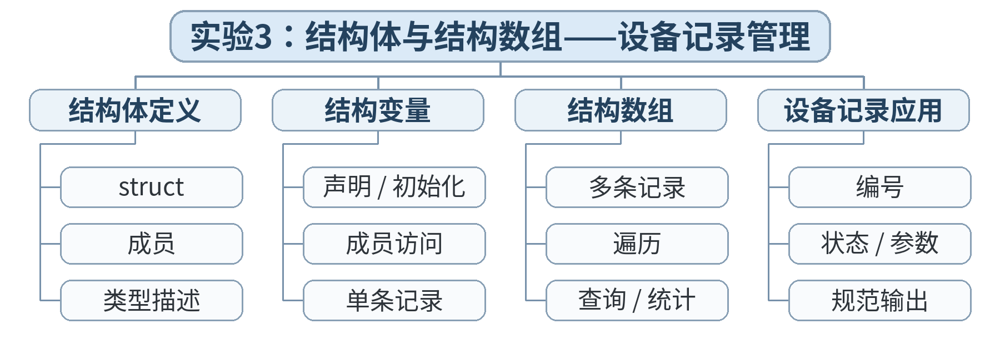

### 教学目标

**知识目标：**
- （1）掌握 struct 定义、成员访问和结构数组。
- （2）理解结构体适合组织异质但属于同一实体的数据。
**能力目标：**
- （1）能设计设备/零件记录结构并完成批量输出、筛选。
- （2）能把数组、分支、循环组合成小型记录处理程序。
**价值目标：**
- （1）培养面向工程对象组织数据、保持字段一致性的意识。

### 课程思政

- （1）通过数组、字符串和结构体组织工程数据，强调数据边界、记录完整性和可追溯性，培养规范管理数据的职业意识。
- （2）实验/综合任务要求保留源代码、测试记录和结论，强调实验诚信、结果可复现和过程可追溯；不得以主观判断代替测试证据。

### 专创融合 / 双创融合

围绕批量尺寸、工位矩阵、字符串和设备记录，构建轻量级数据处理原型，为后续数据结构、设备信息管理和生产数据分析建立应用意识。

### 教学重难点

教学重点：结构体；结构数组；综合数据处理。
教学难点：结构字段设计与结构数组遍历。

### 教学方法

任务驱动法、实验/上机实践法、巡回指导法、测试驱动评价、同伴复核

### 教学用具

电脑、投影仪、多媒体课件、教材、华为 CodeArts IDE、鲲鹏 openEuler/终端、C 编译器、示例代码、实验任务书、测试记录表

### 教学设计

课前任务 → 互动导入（15 min）→ 传授新知与上机训练（70 min）→ 过关检测（10 min）→ 课堂小结（3 min）→ 作业布置（1 min）→ 考勤（1 min）

### 教学过程

#### 课前任务

【教师】课前发布本课主题“实验3：结构体与结构数组——设备记录管理”及对应教材阅读范围，给出一个最小预习问题/代码片段，不提前给出完整答案。
- 1. 阅读教材对应内容，圈出 3 个核心术语；
- 2. 预读/预测课堂任务中可能出现的关键问题；
- 3. 检查开发环境，确保能够编译运行上一课最小程序。
【学生】完成阅读与环境检查，记录至少 1 个疑问，带着问题进入课堂。

**设计意图：** 通过课前阅读、环境检查和一个最小问题建立先备认知，避免把课堂时间消耗在环境故障上，并让学生带着真实疑问进入学习。

#### 互动导入与传授新知 / 上机训练

【互动导入 15 min】
【教师】给出 4 组散乱变量，学生判断哪些字段应该归并为一个设备记录。
【学生】先运行/预测/观察，记录结果和第一判断；不先听完整结论。
【传授新知与上机训练 70 min】
一、最小讲解与示范（约20 min）
【教师】教师演示 struct Machine、成员赋值、数组遍历和按条件筛选。
【学生】同步操作，在关键位置写注释或记录规则，随时验证教师示范。
二、学生独立产出（约35 min）
【学生】学生完成 machine_registry.c：保存至少 5 台设备记录，输出状态表并筛选温度超限设备。
【教师】巡回指导，只提示问题定位方法、边界和验收条件，不直接代写完整答案。
三、调试、互审与证据固化（约15 min）
【教师/学生】使用验收表检查字段、输出、筛选正确性；同伴随机修改一条数据验证结果变化。
【学习证据】实验3源代码 + 数据结构说明 + 测试记录 + 简短实验报告；计入 A02。
【评价关联】本课评价：A01+A02；课堂证据用于检验本课知识与编程能力目标。

**设计意图：** 采用“先运行/预测 → 最小讲解与示范 → 独立编程 → 调试互审 → 证据固化”的上机闭环。把抽象语法/概念落到可运行程序，通过独立产出和测试证据检验真实学习，而不是只听懂讲解。

#### 过关检测

【教师】组织当堂检测：
- 1. 什么时候应该用结构体而不是多个平行数组？
- 2. 结构数组访问成员的基本写法是什么？
- 3. 字段命名为什么应体现单位/含义？
【学生】独立作答/运行验证；【教师】根据错误类型进行针对性讲解，并要求学生说明判断依据。

**设计意图：** 用概念题、边界题和运行验证即时检测关键知识，暴露易错点；要求说明依据，避免只记答案。

#### 课堂小结

【教师】回到本课知识脉络图，用“概念—关系—应用—边界”四个关键词总结“实验3：结构体与结构数组——设备记录管理”。
重点再次强调：结构体；结构数组；综合数据处理。。
【学生】用 1 分钟口述/书写“本课最重要的一条规则 + 一个最容易出错的边界”。

**设计意图：** 回到知识脉络图压缩本课信息，帮助学生形成层级结构，并把“规则—边界—应用”连接到下一次课。

#### 作业布置

【教师】布置课后任务：提交实验3；写 150 字说明“结构体如何改善程序可读性与可维护性”。
【学生】按课程文件命名规范整理代码、测试记录和必要说明，课后提交。

**设计意图：** 通过整理源代码、测试记录和说明，固化课堂成果，形成可复查、可复现的过程性学习证据。

#### 考勤

【教师】利用学校/课程实际使用的平台进行签到。
【学生】按课程要求完成签到。

**设计意图：** 保留学校模板中的考勤环节，用于教学秩序管理；不在教案中预填任何出勤事实。

### 课后教学反思

【课后填写，不预填事实】
- 1. 教学流程：记录 100 min 各环节实际用时及需要调整的位置；
- 2. 教学内容：重点记录“结构字段设计与结构数组遍历。”的真实掌握证据与常见错误；
- 3. 学生参与：仅依据课堂实际记录填写独立完成、提问、互审等情况，不补写推测性结论；
- 4. 评价证据：检查本课源代码/测试/调试证据是否完整，记录缺项及原因；
- 5. 后续改进：依据真实课堂证据确定下一轮教学调整。

**说明：** 反思必须基于真实课堂证据。课前仅提供填写框架，避免把预测或模板化表述误写成已发生的学生表现。

### 本章节参考文献

[1] 戴波.《C与C++程序设计（第二版）》[M]. 北京：北京大学出版社，2025.

## 第17次课 指针基础：地址、解引用与内存观察

- **章节/单元**：第5章（U05）
- **周次**：按实际课表填写
- **课时安排**：2课时（100 min）

### 知识脉络图

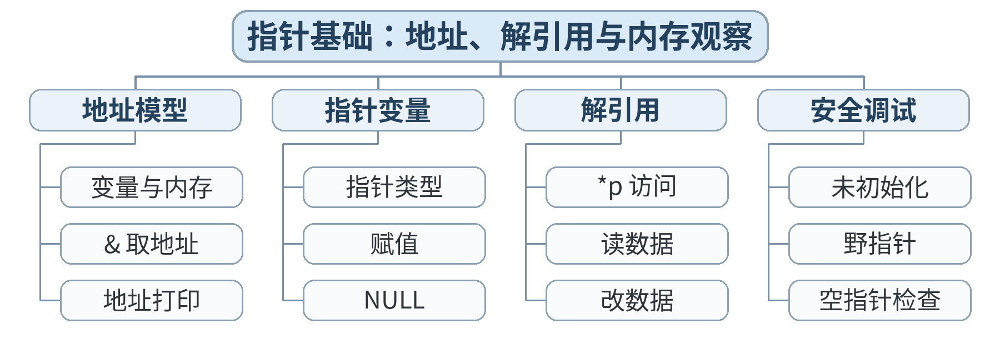

### 教学目标

**知识目标：**
- （1）理解变量地址、指针变量、& 与 * 的基本含义。
- （2）理解指针类型与被指向对象类型的关系。
**能力目标：**
- （1）能声明、赋值和解引用基本指针。
- （2）能使用调试器观察变量地址和值变化。
**价值目标：**
- （1）建立“指针操作必须知道它指向哪里”的内存安全意识。

### 课程思政

- （1）通过指针、地址和内存访问，说明底层程序错误可能引发数据破坏与系统失效，强化软件安全、边界意识和工程责任。
- （2）以可复现的内存调试过程训练学生不依赖猜测、用证据定位问题的习惯，培养严谨调试与风险意识。

### 专创融合 / 双创融合

结合指针与内存访问，讨论嵌入式设备、传感数据缓冲和高性能程序中的底层数据访问需求，在安全边界内培养面向系统软件的创新意识。

### 教学重难点

教学重点：地址；指针；解引用。
教学难点：* 在声明和表达式中的不同语境；未初始化指针风险。

### 教学方法

任务驱动法、演示法、上机实践法、问题引导法、同伴互评与调试复盘

### 教学用具

电脑、投影仪、多媒体课件、教材、华为 CodeArts IDE、鲲鹏 openEuler/终端、C 编译器、示例代码

### 教学设计

课前任务 → 互动导入（15 min）→ 传授新知与上机训练（70 min）→ 过关检测（10 min）→ 课堂小结（3 min）→ 作业布置（1 min）→ 考勤（1 min）

### 教学过程

#### 课前任务

【教师】课前发布本课主题“指针基础：地址、解引用与内存观察”及对应教材阅读范围，给出一个最小预习问题/代码片段，不提前给出完整答案。
- 1. 阅读教材对应内容，圈出 3 个核心术语；
- 2. 预读/预测课堂任务中可能出现的关键问题；
- 3. 检查开发环境，确保能够编译运行上一课最小程序。
【学生】完成阅读与环境检查，记录至少 1 个疑问，带着问题进入课堂。

**设计意图：** 通过课前阅读、环境检查和一个最小问题建立先备认知，避免把课堂时间消耗在环境故障上，并让学生带着真实疑问进入学习。

#### 互动导入与传授新知 / 上机训练

【互动导入 15 min】
【教师】学生先画 x、p、&x、*p 的关系图，再运行最小程序验证。
【学生】先运行/预测/观察，记录结果和第一判断；不先听完整结论。
【传授新知与上机训练 70 min】
一、最小讲解与示范（约20 min）
【教师】教师演示 int x=10; int *p=&x; 并在调试器中观察 x、p、*p；解释类型匹配。
【学生】同步操作，在关键位置写注释或记录规则，随时验证教师示范。
二、学生独立产出（约35 min）
【学生】学生完成 pointer_basics.c：通过指针修改变量值，并打印修改前后值与地址。
【教师】巡回指导，只提示问题定位方法、边界和验收条件，不直接代写完整答案。
三、调试、互审与证据固化（约15 min）
【教师/学生】教师给出未初始化指针反例，强调“识别风险，不执行危险写入”；学生列安全规则。
【学习证据】pointer_basics.c + 内存关系图 + 调试器截图 + 3条安全规则。
【评价关联】本课评价：A01；课堂证据用于检验本课知识与编程能力目标。

**设计意图：** 采用“先运行/预测 → 最小讲解与示范 → 独立编程 → 调试互审 → 证据固化”的上机闭环。把抽象语法/概念落到可运行程序，通过独立产出和测试证据检验真实学习，而不是只听懂讲解。

#### 过关检测

【教师】组织当堂检测：
- 1. &x 得到什么？
- 2. *p 在表达式中通常表示什么？
- 3. 为什么指针声明后不应在未知指向时解引用？
【学生】独立作答/运行验证；【教师】根据错误类型进行针对性讲解，并要求学生说明判断依据。

**设计意图：** 用概念题、边界题和运行验证即时检测关键知识，暴露易错点；要求说明依据，避免只记答案。

#### 课堂小结

【教师】回到本课知识脉络图，用“概念—关系—应用—边界”四个关键词总结“指针基础：地址、解引用与内存观察”。
重点再次强调：地址；指针；解引用。。
【学生】用 1 分钟口述/书写“本课最重要的一条规则 + 一个最容易出错的边界”。

**设计意图：** 回到知识脉络图压缩本课信息，帮助学生形成层级结构，并把“规则—边界—应用”连接到下一次课。

#### 作业布置

【教师】布置课后任务：绘制三个变量与两个指针的地址关系图，并写对应 C 声明。
【学生】按课程文件命名规范整理代码、测试记录和必要说明，课后提交。

**设计意图：** 通过整理源代码、测试记录和说明，固化课堂成果，形成可复查、可复现的过程性学习证据。

#### 考勤

【教师】利用学校/课程实际使用的平台进行签到。
【学生】按课程要求完成签到。

**设计意图：** 保留学校模板中的考勤环节，用于教学秩序管理；不在教案中预填任何出勤事实。

### 课后教学反思

【课后填写，不预填事实】
- 1. 教学流程：记录 100 min 各环节实际用时及需要调整的位置；
- 2. 教学内容：重点记录“* 在声明和表达式中的不同语境；未初始化指针风险。”的真实掌握证据与常见错误；
- 3. 学生参与：仅依据课堂实际记录填写独立完成、提问、互审等情况，不补写推测性结论；
- 4. 评价证据：检查本课源代码/测试/调试证据是否完整，记录缺项及原因；
- 5. 后续改进：依据真实课堂证据确定下一轮教学调整。

**说明：** 反思必须基于真实课堂证据。课前仅提供填写框架，避免把预测或模板化表述误写成已发生的学生表现。

### 本章节参考文献

[1] 戴波.《C与C++程序设计（第二版）》[M]. 北京：北京大学出版社，2025.

## 第18次课 指针与数组

- **章节/单元**：第5章（U05）
- **周次**：按实际课表填写
- **课时安排**：2课时（100 min）

### 知识脉络图

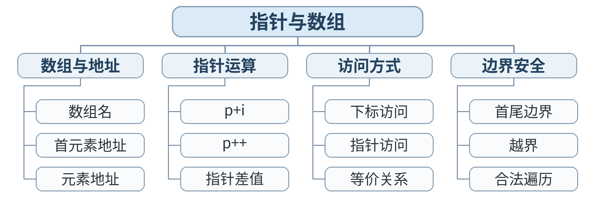

### 教学目标

**知识目标：**
- （1）理解数组名与首元素地址的关系（在适用表达式语境下）。
- （2）掌握通过指针遍历一维数组的基本方式。
**能力目标：**
- （1）能用下标和指针两种方式访问数组。
- （2）能比较两种写法的可读性并避免越界。
**价值目标：**
- （1）形成“性能/技巧不能凌驾于可读性和安全性”的工程判断。

### 课程思政

- （1）通过指针、地址和内存访问，说明底层程序错误可能引发数据破坏与系统失效，强化软件安全、边界意识和工程责任。
- （2）以可复现的内存调试过程训练学生不依赖猜测、用证据定位问题的习惯，培养严谨调试与风险意识。

### 专创融合 / 双创融合

结合指针与内存访问，讨论嵌入式设备、传感数据缓冲和高性能程序中的底层数据访问需求，在安全边界内培养面向系统软件的创新意识。

### 教学重难点

教学重点：数组名、指针算术、遍历。
教学难点：p+i 与 a[i] 的关系及边界。

### 教学方法

任务驱动法、演示法、上机实践法、问题引导法、同伴互评与调试复盘

### 教学用具

电脑、投影仪、多媒体课件、教材、华为 CodeArts IDE、鲲鹏 openEuler/终端、C 编译器、示例代码

### 教学设计

课前任务 → 互动导入（15 min）→ 传授新知与上机训练（70 min）→ 过关检测（10 min）→ 课堂小结（3 min）→ 作业布置（1 min）→ 考勤（1 min）

### 教学过程

#### 课前任务

【教师】课前发布本课主题“指针与数组”及对应教材阅读范围，给出一个最小预习问题/代码片段，不提前给出完整答案。
- 1. 阅读教材对应内容，圈出 3 个核心术语；
- 2. 预读/预测课堂任务中可能出现的关键问题；
- 3. 检查开发环境，确保能够编译运行上一课最小程序。
【学生】完成阅读与环境检查，记录至少 1 个疑问，带着问题进入课堂。

**设计意图：** 通过课前阅读、环境检查和一个最小问题建立先备认知，避免把课堂时间消耗在环境故障上，并让学生带着真实疑问进入学习。

#### 互动导入与传授新知 / 上机训练

【互动导入 15 min】
【教师】学生预测 a、&a[0]、p 的打印地址是否相同（数值层面），再运行验证。
【学生】先运行/预测/观察，记录结果和第一判断；不先听完整结论。
【传授新知与上机训练 70 min】
一、最小讲解与示范（约20 min）
【教师】教师演示 *(p+i) 与 a[i]，讲解指针步长由类型决定。
【学生】同步操作，在关键位置写注释或记录规则，随时验证教师示范。
二、学生独立产出（约35 min）
【学生】学生重写 dimension_stats.c 的遍历部分：使用指针遍历求和与最大值。
【教师】巡回指导，只提示问题定位方法、边界和验收条件，不直接代写完整答案。
三、调试、互审与证据固化（约15 min）
【教师/学生】同伴检查指针终止条件，要求写出“起点/终点/步长”三项。
【学习证据】array_pointer.c + 下标版/指针版关键片段对照 + 运行一致性证据。
【评价关联】本课评价：A01；课堂证据用于检验本课知识与编程能力目标。

**设计意图：** 采用“先运行/预测 → 最小讲解与示范 → 独立编程 → 调试互审 → 证据固化”的上机闭环。把抽象语法/概念落到可运行程序，通过独立产出和测试证据检验真实学习，而不是只听懂讲解。

#### 过关检测

【教师】组织当堂检测：
- 1. p+1 增加的是 1 字节吗？
- 2. *(p+i) 与 a[i] 在常见一维数组访问中是什么关系？
- 3. 指针遍历如何判断结束？
【学生】独立作答/运行验证；【教师】根据错误类型进行针对性讲解，并要求学生说明判断依据。

**设计意图：** 用概念题、边界题和运行验证即时检测关键知识，暴露易错点；要求说明依据，避免只记答案。

#### 课堂小结

【教师】回到本课知识脉络图，用“概念—关系—应用—边界”四个关键词总结“指针与数组”。
重点再次强调：数组名、指针算术、遍历。。
【学生】用 1 分钟口述/书写“本课最重要的一条规则 + 一个最容易出错的边界”。

**设计意图：** 回到知识脉络图压缩本课信息，帮助学生形成层级结构，并把“规则—边界—应用”连接到下一次课。

#### 作业布置

【教师】布置课后任务：将一个数组查找程序分别用下标和指针实现，比较代码清晰度。
【学生】按课程文件命名规范整理代码、测试记录和必要说明，课后提交。

**设计意图：** 通过整理源代码、测试记录和说明，固化课堂成果，形成可复查、可复现的过程性学习证据。

#### 考勤

【教师】利用学校/课程实际使用的平台进行签到。
【学生】按课程要求完成签到。

**设计意图：** 保留学校模板中的考勤环节，用于教学秩序管理；不在教案中预填任何出勤事实。

### 课后教学反思

【课后填写，不预填事实】
- 1. 教学流程：记录 100 min 各环节实际用时及需要调整的位置；
- 2. 教学内容：重点记录“p+i 与 a[i] 的关系及边界。”的真实掌握证据与常见错误；
- 3. 学生参与：仅依据课堂实际记录填写独立完成、提问、互审等情况，不补写推测性结论；
- 4. 评价证据：检查本课源代码/测试/调试证据是否完整，记录缺项及原因；
- 5. 后续改进：依据真实课堂证据确定下一轮教学调整。

**说明：** 反思必须基于真实课堂证据。课前仅提供填写框架，避免把预测或模板化表述误写成已发生的学生表现。

### 本章节参考文献

[1] 戴波.《C与C++程序设计（第二版）》[M]. 北京：北京大学出版社，2025.

## 第19次课 字符串指针与指针数组

- **章节/单元**：第5章（U05）
- **周次**：按实际课表填写
- **课时安排**：2课时（100 min）

### 知识脉络图

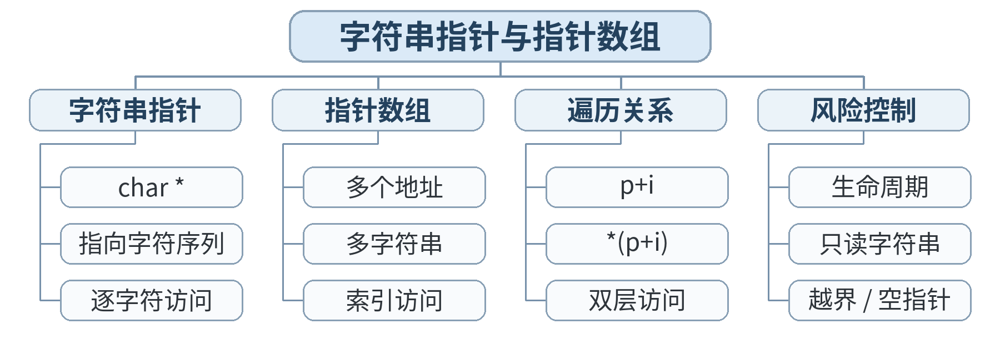

### 教学目标

**知识目标：**
- （1）理解 char* 指向字符串与字符数组两种常见表示方式。
- （2）理解指针数组的基本结构和用途。
**能力目标：**
- （1）能用指针遍历字符串。
- （2）能用指针数组组织多个字符串标签并输出。
**价值目标：**
- （1）培养区分“数据本体”和“指向数据的引用”的抽象能力。

### 课程思政

- （1）通过指针、地址和内存访问，说明底层程序错误可能引发数据破坏与系统失效，强化软件安全、边界意识和工程责任。
- （2）以可复现的内存调试过程训练学生不依赖猜测、用证据定位问题的习惯，培养严谨调试与风险意识。

### 专创融合 / 双创融合

结合指针与内存访问，讨论嵌入式设备、传感数据缓冲和高性能程序中的底层数据访问需求，在安全边界内培养面向系统软件的创新意识。

### 教学重难点

教学重点：字符串指针；指针数组。
教学难点：字符串字面量的修改风险；数组指针概念与指针数组概念不要混淆。

### 教学方法

任务驱动法、演示法、上机实践法、问题引导法、同伴互评与调试复盘

### 教学用具

电脑、投影仪、多媒体课件、教材、华为 CodeArts IDE、鲲鹏 openEuler/终端、C 编译器、示例代码

### 教学设计

课前任务 → 互动导入（15 min）→ 传授新知与上机训练（70 min）→ 过关检测（10 min）→ 课堂小结（3 min）→ 作业布置（1 min）→ 考勤（1 min）

### 教学过程

#### 课前任务

【教师】课前发布本课主题“字符串指针与指针数组”及对应教材阅读范围，给出一个最小预习问题/代码片段，不提前给出完整答案。
- 1. 阅读教材对应内容，圈出 3 个核心术语；
- 2. 预读/预测课堂任务中可能出现的关键问题；
- 3. 检查开发环境，确保能够编译运行上一课最小程序。
【学生】完成阅读与环境检查，记录至少 1 个疑问，带着问题进入课堂。

**设计意图：** 通过课前阅读、环境检查和一个最小问题建立先备认知，避免把课堂时间消耗在环境故障上，并让学生带着真实疑问进入学习。

#### 互动导入与传授新知 / 上机训练

【互动导入 15 min】
【教师】学生观察 char *labels[]={"STOP","RUN","MAINT"}; 的结构，并画出指向关系。
【学生】先运行/预测/观察，记录结果和第一判断；不先听完整结论。
【传授新知与上机训练 70 min】
一、最小讲解与示范（约20 min）
【教师】教师演示逐字符指针遍历、指针数组访问；明确字符串字面量应视为不可修改。
【学生】同步操作，在关键位置写注释或记录规则，随时验证教师示范。
二、学生独立产出（约35 min）
【学生】学生完成 status_labels.c：通过状态码选择指针数组中的文本标签并输出。
【教师】巡回指导，只提示问题定位方法、边界和验收条件，不直接代写完整答案。
三、调试、互审与证据固化（约15 min）
【教师/学生】设计非法状态测试；检查 default/边界处理和指针下标范围。
【学习证据】status_labels.c + 指针关系图 + 状态映射表。
【评价关联】本课评价：A01；课堂证据用于检验本课知识与编程能力目标。

**设计意图：** 采用“先运行/预测 → 最小讲解与示范 → 独立编程 → 调试互审 → 证据固化”的上机闭环。把抽象语法/概念落到可运行程序，通过独立产出和测试证据检验真实学习，而不是只听懂讲解。

#### 过关检测

【教师】组织当堂检测：
- 1. char *p="ABC" 与 char a[]="ABC" 在可修改性上应如何谨慎区分？
- 2. 什么叫指针数组？
- 3. 使用状态码做数组下标前为什么要检查范围？
【学生】独立作答/运行验证；【教师】根据错误类型进行针对性讲解，并要求学生说明判断依据。

**设计意图：** 用概念题、边界题和运行验证即时检测关键知识，暴露易错点；要求说明依据，避免只记答案。

#### 课堂小结

【教师】回到本课知识脉络图，用“概念—关系—应用—边界”四个关键词总结“字符串指针与指针数组”。
重点再次强调：字符串指针；指针数组。。
【学生】用 1 分钟口述/书写“本课最重要的一条规则 + 一个最容易出错的边界”。

**设计意图：** 回到知识脉络图压缩本课信息，帮助学生形成层级结构，并把“规则—边界—应用”连接到下一次课。

#### 作业布置

【教师】布置课后任务：增加 5 个状态文本，编写安全的状态码→文本映射。
【学生】按课程文件命名规范整理代码、测试记录和必要说明，课后提交。

**设计意图：** 通过整理源代码、测试记录和说明，固化课堂成果，形成可复查、可复现的过程性学习证据。

#### 考勤

【教师】利用学校/课程实际使用的平台进行签到。
【学生】按课程要求完成签到。

**设计意图：** 保留学校模板中的考勤环节，用于教学秩序管理；不在教案中预填任何出勤事实。

### 课后教学反思

【课后填写，不预填事实】
- 1. 教学流程：记录 100 min 各环节实际用时及需要调整的位置；
- 2. 教学内容：重点记录“字符串字面量的修改风险；数组指针概念与指针数组概念不要混淆。”的真实掌握证据与常见错误；
- 3. 学生参与：仅依据课堂实际记录填写独立完成、提问、互审等情况，不补写推测性结论；
- 4. 评价证据：检查本课源代码/测试/调试证据是否完整，记录缺项及原因；
- 5. 后续改进：依据真实课堂证据确定下一轮教学调整。

**说明：** 反思必须基于真实课堂证据。课前仅提供填写框架，避免把预测或模板化表述误写成已发生的学生表现。

### 本章节参考文献

[1] 戴波.《C与C++程序设计（第二版）》[M]. 北京：北京大学出版社，2025.

## 第20次课 实验4：指针综合与内存安全调试

- **章节/单元**：第5章（U05）
- **周次**：按实际课表填写
- **课时安排**：2课时（100 min）

### 知识脉络图

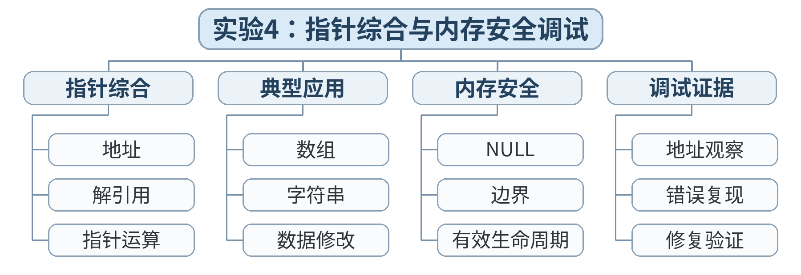

### 教学目标

**知识目标：**
- （1）综合运用地址、解引用、指针与数组、字符串指针。
- （2）理解空指针、越界、悬空/失效指向等风险的入门概念。
**能力目标：**
- （1）能用调试器和打印证据定位常见指针错误。
- （2）能制定并执行基础内存安全检查表。
**价值目标：**
- （1）把“能跑”提升为“知道为什么安全地跑”。

### 课程思政

- （1）通过指针、地址和内存访问，说明底层程序错误可能引发数据破坏与系统失效，强化软件安全、边界意识和工程责任。
- （2）实验/综合任务要求保留源代码、测试记录和结论，强调实验诚信、结果可复现和过程可追溯；不得以主观判断代替测试证据。

### 专创融合 / 双创融合

结合指针与内存访问，讨论嵌入式设备、传感数据缓冲和高性能程序中的底层数据访问需求，在安全边界内培养面向系统软件的创新意识。

### 教学重难点

教学重点：指针综合；内存安全；调试。
教学难点：定位指针错误的系统步骤。

### 教学方法

任务驱动法、实验/上机实践法、巡回指导法、测试驱动评价、同伴复核

### 教学用具

电脑、投影仪、多媒体课件、教材、华为 CodeArts IDE、鲲鹏 openEuler/终端、C 编译器、示例代码、实验任务书、测试记录表

### 教学设计

课前任务 → 互动导入（15 min）→ 传授新知与上机训练（70 min）→ 过关检测（10 min）→ 课堂小结（3 min）→ 作业布置（1 min）→ 考勤（1 min）

### 教学过程

#### 课前任务

【教师】课前发布本课主题“实验4：指针综合与内存安全调试”及对应教材阅读范围，给出一个最小预习问题/代码片段，不提前给出完整答案。
- 1. 阅读教材对应内容，圈出 3 个核心术语；
- 2. 预读/预测课堂任务中可能出现的关键问题；
- 3. 检查开发环境，确保能够编译运行上一课最小程序。
【学生】完成阅读与环境检查，记录至少 1 个疑问，带着问题进入课堂。

**设计意图：** 通过课前阅读、环境检查和一个最小问题建立先备认知，避免把课堂时间消耗在环境故障上，并让学生带着真实疑问进入学习。

#### 互动导入与传授新知 / 上机训练

【互动导入 15 min】
【教师】教师发放 4 个已知风险片段（越界、空指针、错误下标、未初始化指针），学生先静态识别，不直接运行危险写操作。
【学生】先运行/预测/观察，记录结果和第一判断；不先听完整结论。
【传授新知与上机训练 70 min】
一、最小讲解与示范（约20 min）
【教师】教师示范使用断点、监视窗口、地址打印和边界检查定位问题。
【学生】同步操作，在关键位置写注释或记录规则，随时验证教师示范。
二、学生独立产出（约35 min）
【学生】学生完成 safe_buffer.c：使用指针遍历数组并保证不越界；附安全检查表。
【教师】巡回指导，只提示问题定位方法、边界和验收条件，不直接代写完整答案。
三、调试、互审与证据固化（约15 min）
【教师/学生】回归测试：正常数组、最小长度、最大允许长度；记录每次结果。
【学习证据】实验4源代码 + 安全检查表 + 调试记录 + 回归测试表；计入 A02。
【评价关联】本课评价：A01+A02；课堂证据用于检验本课知识与编程能力目标。

**设计意图：** 采用“先运行/预测 → 最小讲解与示范 → 独立编程 → 调试互审 → 证据固化”的上机闭环。把抽象语法/概念落到可运行程序，通过独立产出和测试证据检验真实学习，而不是只听懂讲解。

#### 过关检测

【教师】组织当堂检测：
- 1. 遇到指针错误时第一步应确认什么？
- 2. 为什么“没有崩溃”不能证明没有越界？
- 3. 回归测试的目的是什么？
【学生】独立作答/运行验证；【教师】根据错误类型进行针对性讲解，并要求学生说明判断依据。

**设计意图：** 用概念题、边界题和运行验证即时检测关键知识，暴露易错点；要求说明依据，避免只记答案。

#### 课堂小结

【教师】回到本课知识脉络图，用“概念—关系—应用—边界”四个关键词总结“实验4：指针综合与内存安全调试”。
重点再次强调：指针综合；内存安全；调试。。
【学生】用 1 分钟口述/书写“本课最重要的一条规则 + 一个最容易出错的边界”。

**设计意图：** 回到知识脉络图压缩本课信息，帮助学生形成层级结构，并把“规则—边界—应用”连接到下一次课。

#### 作业布置

【教师】布置课后任务：提交实验4；整理个人“指针安全五条规则”。
【学生】按课程文件命名规范整理代码、测试记录和必要说明，课后提交。

**设计意图：** 通过整理源代码、测试记录和说明，固化课堂成果，形成可复查、可复现的过程性学习证据。

#### 考勤

【教师】利用学校/课程实际使用的平台进行签到。
【学生】按课程要求完成签到。

**设计意图：** 保留学校模板中的考勤环节，用于教学秩序管理；不在教案中预填任何出勤事实。

### 课后教学反思

【课后填写，不预填事实】
- 1. 教学流程：记录 100 min 各环节实际用时及需要调整的位置；
- 2. 教学内容：重点记录“定位指针错误的系统步骤。”的真实掌握证据与常见错误；
- 3. 学生参与：仅依据课堂实际记录填写独立完成、提问、互审等情况，不补写推测性结论；
- 4. 评价证据：检查本课源代码/测试/调试证据是否完整，记录缺项及原因；
- 5. 后续改进：依据真实课堂证据确定下一轮教学调整。

**说明：** 反思必须基于真实课堂证据。课前仅提供填写框架，避免把预测或模板化表述误写成已发生的学生表现。

### 本章节参考文献

[1] 戴波.《C与C++程序设计（第二版）》[M]. 北京：北京大学出版社，2025.

## 第21次课 函数定义、声明与调用

- **章节/单元**：第6章（U06）
- **周次**：按实际课表填写
- **课时安排**：2课时（100 min）

### 知识脉络图

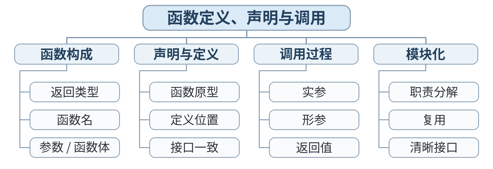

### 教学目标

**知识目标：**
- （1）掌握函数定义、声明、调用、返回值。
- （2）理解函数用于分解任务和复用逻辑。
**能力目标：**
- （1）能把长 main 拆成多个职责单一的函数。
- （2）能为函数设计清晰的参数与返回值。
**价值目标：**
- （1）形成模块化、单一职责和可复用的工程思维。

### 课程思政

- （1）通过函数分解、参数传递和模块复用，强调接口清晰、职责单一、协作规范在工程软件中的价值，培养模块化与团队协作意识。
- （2）结合递归边界和函数接口测试，强化“复杂问题分解、结果可验证、模块可复用”的工程思维。

### 专创融合 / 双创融合

通过函数库、模块化接口和综合工程数据处理程序，训练可复用组件设计与协作开发，为后续 C++、数据结构和智能制造软件原型开发奠定基础。

### 教学重难点

教学重点：函数定义/声明/调用；返回值。
教学难点：函数职责边界与接口设计。

### 教学方法

任务驱动法、演示法、上机实践法、问题引导法、同伴互评与调试复盘

### 教学用具

电脑、投影仪、多媒体课件、教材、华为 CodeArts IDE、鲲鹏 openEuler/终端、C 编译器、示例代码

### 教学设计

课前任务 → 互动导入（15 min）→ 传授新知与上机训练（70 min）→ 过关检测（10 min）→ 课堂小结（3 min）→ 作业布置（1 min）→ 考勤（1 min）

### 教学过程

#### 课前任务

【教师】课前发布本课主题“函数定义、声明与调用”及对应教材阅读范围，给出一个最小预习问题/代码片段，不提前给出完整答案。
- 1. 阅读教材对应内容，圈出 3 个核心术语；
- 2. 预读/预测课堂任务中可能出现的关键问题；
- 3. 检查开发环境，确保能够编译运行上一课最小程序。
【学生】完成阅读与环境检查，记录至少 1 个疑问，带着问题进入课堂。

**设计意图：** 通过课前阅读、环境检查和一个最小问题建立先备认知，避免把课堂时间消耗在环境故障上，并让学生带着真实疑问进入学习。

#### 互动导入与传授新知 / 上机训练

【互动导入 15 min】
【教师】学生阅读一个 40 行 main，标出可以独立成函数的三个职责。
【学生】先运行/预测/观察，记录结果和第一判断；不先听完整结论。
【传授新知与上机训练 70 min】
一、最小讲解与示范（约20 min）
【教师】教师演示 calcAverage、findMax 等函数，解释参数、返回值、声明顺序。
【学生】同步操作，在关键位置写注释或记录规则，随时验证教师示范。
二、学生独立产出（约35 min）
【学生】学生重构 batch_stats.c：至少拆成输入/计算/输出中的 2 个函数。
【教师】巡回指导，只提示问题定位方法、边界和验收条件，不直接代写完整答案。
三、调试、互审与证据固化（约15 min）
【教师/学生】同伴按“一个函数只做一类事”检查；教师演示单独测试 calc 函数。
【学习证据】batch_stats_functions.c + 重构前后结构对照 + 函数职责表。
【评价关联】本课评价：A01；课堂证据用于检验本课知识与编程能力目标。

**设计意图：** 采用“先运行/预测 → 最小讲解与示范 → 独立编程 → 调试互审 → 证据固化”的上机闭环。把抽象语法/概念落到可运行程序，通过独立产出和测试证据检验真实学习，而不是只听懂讲解。

#### 过关检测

【教师】组织当堂检测：
- 1. 函数为什么有助于复用？
- 2. void 和非 void 返回类型有什么差别？
- 3. 一个函数承担过多职责会带来什么问题？
【学生】独立作答/运行验证；【教师】根据错误类型进行针对性讲解，并要求学生说明判断依据。

**设计意图：** 用概念题、边界题和运行验证即时检测关键知识，暴露易错点；要求说明依据，避免只记答案。

#### 课堂小结

【教师】回到本课知识脉络图，用“概念—关系—应用—边界”四个关键词总结“函数定义、声明与调用”。
重点再次强调：函数定义/声明/调用；返回值。。
【学生】用 1 分钟口述/书写“本课最重要的一条规则 + 一个最容易出错的边界”。

**设计意图：** 回到知识脉络图压缩本课信息，帮助学生形成层级结构，并把“规则—边界—应用”连接到下一次课。

#### 作业布置

【教师】布置课后任务：把 U02 或 U04 的一个程序重构成至少 3 个函数。
【学生】按课程文件命名规范整理代码、测试记录和必要说明，课后提交。

**设计意图：** 通过整理源代码、测试记录和说明，固化课堂成果，形成可复查、可复现的过程性学习证据。

#### 考勤

【教师】利用学校/课程实际使用的平台进行签到。
【学生】按课程要求完成签到。

**设计意图：** 保留学校模板中的考勤环节，用于教学秩序管理；不在教案中预填任何出勤事实。

### 课后教学反思

【课后填写，不预填事实】
- 1. 教学流程：记录 100 min 各环节实际用时及需要调整的位置；
- 2. 教学内容：重点记录“函数职责边界与接口设计。”的真实掌握证据与常见错误；
- 3. 学生参与：仅依据课堂实际记录填写独立完成、提问、互审等情况，不补写推测性结论；
- 4. 评价证据：检查本课源代码/测试/调试证据是否完整，记录缺项及原因；
- 5. 后续改进：依据真实课堂证据确定下一轮教学调整。

**说明：** 反思必须基于真实课堂证据。课前仅提供填写框架，避免把预测或模板化表述误写成已发生的学生表现。

### 本章节参考文献

[1] 戴波.《C与C++程序设计（第二版）》[M]. 北京：北京大学出版社，2025.

## 第22次课 函数参数传递、作用域与数组/指针参数

- **章节/单元**：第6章（U06）
- **周次**：按实际课表填写
- **课时安排**：2课时（100 min）

### 知识脉络图

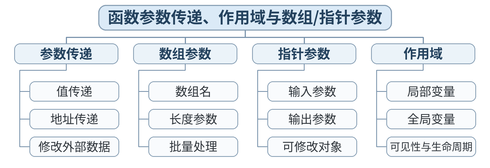

### 教学目标

**知识目标：**
- （1）理解 C 中参数按值传递的基本机制。
- （2）理解局部变量作用域。
- （3）掌握通过指针参数修改调用者数据。
**能力目标：**
- （1）能正确选择“返回值/普通参数/指针参数”。
- （2）能把数组作为参数传给处理函数并同时传入长度。
**价值目标：**
- （1）建立明确接口、副作用可控的函数设计意识。

### 课程思政

- （1）通过函数分解、参数传递和模块复用，强调接口清晰、职责单一、协作规范在工程软件中的价值，培养模块化与团队协作意识。
- （2）结合递归边界和函数接口测试，强化“复杂问题分解、结果可验证、模块可复用”的工程思维。

### 专创融合 / 双创融合

通过函数库、模块化接口和综合工程数据处理程序，训练可复用组件设计与协作开发，为后续 C++、数据结构和智能制造软件原型开发奠定基础。

### 教学重难点

教学重点：值传递；作用域；指针参数；数组参数。
教学难点：为什么普通 swap 不生效；数组参数必须配合长度。

### 教学方法

任务驱动法、演示法、上机实践法、问题引导法、同伴互评与调试复盘

### 教学用具

电脑、投影仪、多媒体课件、教材、华为 CodeArts IDE、鲲鹏 openEuler/终端、C 编译器、示例代码

### 教学设计

课前任务 → 互动导入（15 min）→ 传授新知与上机训练（70 min）→ 过关检测（10 min）→ 课堂小结（3 min）→ 作业布置（1 min）→ 考勤（1 min）

### 教学过程

#### 课前任务

【教师】课前发布本课主题“函数参数传递、作用域与数组/指针参数”及对应教材阅读范围，给出一个最小预习问题/代码片段，不提前给出完整答案。
- 1. 阅读教材对应内容，圈出 3 个核心术语；
- 2. 预读/预测课堂任务中可能出现的关键问题；
- 3. 检查开发环境，确保能够编译运行上一课最小程序。
【学生】完成阅读与环境检查，记录至少 1 个疑问，带着问题进入课堂。

**设计意图：** 通过课前阅读、环境检查和一个最小问题建立先备认知，避免把课堂时间消耗在环境故障上，并让学生带着真实疑问进入学习。

#### 互动导入与传授新知 / 上机训练

【互动导入 15 min】
【教师】学生先运行 swap_value.c，观察函数内部交换成功但 main 外部不变。
【学生】先运行/预测/观察，记录结果和第一判断；不先听完整结论。
【传授新知与上机训练 70 min】
一、最小讲解与示范（约20 min）
【教师】教师用内存示意图解释形参与实参副本，再演示 swap(&a,&b)；讲数组+长度接口。
【学生】同步操作，在关键位置写注释或记录规则，随时验证教师示范。
二、学生独立产出（约35 min）
【学生】学生完成 normalize.c：函数接收数组和长度，按要求处理/统计；不得依赖全局变量。
【教师】巡回指导，只提示问题定位方法、边界和验收条件，不直接代写完整答案。
三、调试、互审与证据固化（约15 min）
【教师/学生】同伴检查函数是否知道数组长度、是否越界、是否存在不必要全局变量。
【学习证据】normalize.c + swap 机制图 + 函数接口说明。
【评价关联】本课评价：A01；课堂证据用于检验本课知识与编程能力目标。

**设计意图：** 采用“先运行/预测 → 最小讲解与示范 → 独立编程 → 调试互审 → 证据固化”的上机闭环。把抽象语法/概念落到可运行程序，通过独立产出和测试证据检验真实学习，而不是只听懂讲解。

#### 过关检测

【教师】组织当堂检测：
- 1. C 的普通形参修改会直接改变实参吗？
- 2. 要让函数修改调用者变量，常见做法是什么？
- 3. 数组参数为什么通常还要传长度？
【学生】独立作答/运行验证；【教师】根据错误类型进行针对性讲解，并要求学生说明判断依据。

**设计意图：** 用概念题、边界题和运行验证即时检测关键知识，暴露易错点；要求说明依据，避免只记答案。

#### 课堂小结

【教师】回到本课知识脉络图，用“概念—关系—应用—边界”四个关键词总结“函数参数传递、作用域与数组/指针参数”。
重点再次强调：值传递；作用域；指针参数；数组参数。。
【学生】用 1 分钟口述/书写“本课最重要的一条规则 + 一个最容易出错的边界”。

**设计意图：** 回到知识脉络图压缩本课信息，帮助学生形成层级结构，并把“规则—边界—应用”连接到下一次课。

#### 作业布置

【教师】布置课后任务：设计一个 max_min 函数，同时返回最大值和最小值（可用指针输出参数）。
【学生】按课程文件命名规范整理代码、测试记录和必要说明，课后提交。

**设计意图：** 通过整理源代码、测试记录和说明，固化课堂成果，形成可复查、可复现的过程性学习证据。

#### 考勤

【教师】利用学校/课程实际使用的平台进行签到。
【学生】按课程要求完成签到。

**设计意图：** 保留学校模板中的考勤环节，用于教学秩序管理；不在教案中预填任何出勤事实。

### 课后教学反思

【课后填写，不预填事实】
- 1. 教学流程：记录 100 min 各环节实际用时及需要调整的位置；
- 2. 教学内容：重点记录“为什么普通 swap 不生效；数组参数必须配合长度。”的真实掌握证据与常见错误；
- 3. 学生参与：仅依据课堂实际记录填写独立完成、提问、互审等情况，不补写推测性结论；
- 4. 评价证据：检查本课源代码/测试/调试证据是否完整，记录缺项及原因；
- 5. 后续改进：依据真实课堂证据确定下一轮教学调整。

**说明：** 反思必须基于真实课堂证据。课前仅提供填写框架，避免把预测或模板化表述误写成已发生的学生表现。

### 本章节参考文献

[1] 戴波.《C与C++程序设计（第二版）》[M]. 北京：北京大学出版社，2025.

## 第23次课 返回指针与递归函数

- **章节/单元**：第6章（U06）
- **周次**：按实际课表填写
- **课时安排**：2课时（100 min）

### 知识脉络图

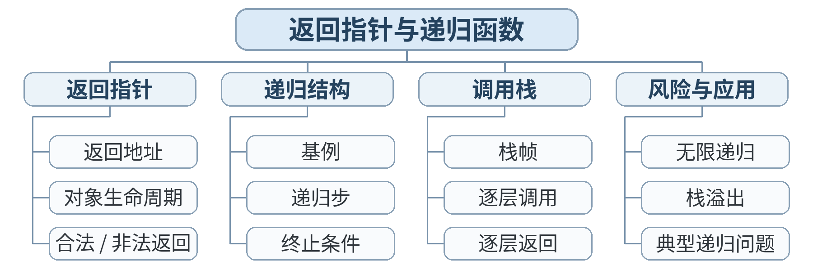

### 教学目标

**知识目标：**
- （1）理解函数返回指针的基本合法场景与返回局部变量地址的风险。
- （2）理解递归的基线条件和递归步骤。
**能力目标：**
- （1）能判断简单返回指针代码是否安全。
- （2）能跟踪递归调用栈并编写一个有明确终止条件的递归函数。
**价值目标：**
- （1）强化生命周期意识与“必须证明会终止”的程序安全思维。

### 课程思政

- （1）通过函数分解、参数传递和模块复用，强调接口清晰、职责单一、协作规范在工程软件中的价值，培养模块化与团队协作意识。
- （2）结合递归边界和函数接口测试，强化“复杂问题分解、结果可验证、模块可复用”的工程思维。

### 专创融合 / 双创融合

通过函数库、模块化接口和综合工程数据处理程序，训练可复用组件设计与协作开发，为后续 C++、数据结构和智能制造软件原型开发奠定基础。

### 教学重难点

教学重点：指针返回；生命周期；递归。
教学难点：返回局部变量地址；递归终止与调用展开。

### 教学方法

任务驱动法、演示法、上机实践法、问题引导法、同伴互评与调试复盘

### 教学用具

电脑、投影仪、多媒体课件、教材、华为 CodeArts IDE、鲲鹏 openEuler/终端、C 编译器、示例代码

### 教学设计

课前任务 → 互动导入（15 min）→ 传授新知与上机训练（70 min）→ 过关检测（10 min）→ 课堂小结（3 min）→ 作业布置（1 min）→ 考勤（1 min）

### 教学过程

#### 课前任务

【教师】课前发布本课主题“返回指针与递归函数”及对应教材阅读范围，给出一个最小预习问题/代码片段，不提前给出完整答案。
- 1. 阅读教材对应内容，圈出 3 个核心术语；
- 2. 预读/预测课堂任务中可能出现的关键问题；
- 3. 检查开发环境，确保能够编译运行上一课最小程序。
【学生】完成阅读与环境检查，记录至少 1 个疑问，带着问题进入课堂。

**设计意图：** 通过课前阅读、环境检查和一个最小问题建立先备认知，避免把课堂时间消耗在环境故障上，并让学生带着真实疑问进入学习。

#### 互动导入与传授新知 / 上机训练

【互动导入 15 min】
【教师】学生判断三个“返回指针”片段哪个安全，并写出理由；教师不让学生盲目运行未定义行为。
【学生】先运行/预测/观察，记录结果和第一判断；不先听完整结论。
【传授新知与上机训练 70 min】
一、最小讲解与示范（约20 min）
【教师】教师讲解静态存储期/调用者提供缓冲区的安全思路；用 factorial 或 sum(1..n) 演示递归栈。
【学生】同步操作，在关键位置写注释或记录规则，随时验证教师示范。
二、学生独立产出（约35 min）
【学生】学生完成 recursive_sum.c，并用表格记录 n=4 时每一层调用和返回值。
【教师】巡回指导，只提示问题定位方法、边界和验收条件，不直接代写完整答案。
三、调试、互审与证据固化（约15 min）
【教师/学生】比较循环版与递归版；检查 n<=0 等基线条件。
【学习证据】recursive_sum.c + 调用栈跟踪表 + 一条返回指针安全判断题说明。
【评价关联】本课评价：A01；课堂证据用于检验本课知识与编程能力目标。

**设计意图：** 采用“先运行/预测 → 最小讲解与示范 → 独立编程 → 调试互审 → 证据固化”的上机闭环。把抽象语法/概念落到可运行程序，通过独立产出和测试证据检验真实学习，而不是只听懂讲解。

#### 过关检测

【教师】组织当堂检测：
- 1. 为什么不能返回普通局部变量的地址给调用者长期使用？
- 2. 递归函数必须包含什么条件？
- 3. 递归与循环哪个一定更好？
【学生】独立作答/运行验证；【教师】根据错误类型进行针对性讲解，并要求学生说明判断依据。

**设计意图：** 用概念题、边界题和运行验证即时检测关键知识，暴露易错点；要求说明依据，避免只记答案。

#### 课堂小结

【教师】回到本课知识脉络图，用“概念—关系—应用—边界”四个关键词总结“返回指针与递归函数”。
重点再次强调：指针返回；生命周期；递归。。
【学生】用 1 分钟口述/书写“本课最重要的一条规则 + 一个最容易出错的边界”。

**设计意图：** 回到知识脉络图压缩本课信息，帮助学生形成层级结构，并把“规则—边界—应用”连接到下一次课。

#### 作业布置

【教师】布置课后任务：用递归实现一个简单整数阶乘/数字求和，并写出对应循环版进行比较。
【学生】按课程文件命名规范整理代码、测试记录和必要说明，课后提交。

**设计意图：** 通过整理源代码、测试记录和说明，固化课堂成果，形成可复查、可复现的过程性学习证据。

#### 考勤

【教师】利用学校/课程实际使用的平台进行签到。
【学生】按课程要求完成签到。

**设计意图：** 保留学校模板中的考勤环节，用于教学秩序管理；不在教案中预填任何出勤事实。

### 课后教学反思

【课后填写，不预填事实】
- 1. 教学流程：记录 100 min 各环节实际用时及需要调整的位置；
- 2. 教学内容：重点记录“返回局部变量地址；递归终止与调用展开。”的真实掌握证据与常见错误；
- 3. 学生参与：仅依据课堂实际记录填写独立完成、提问、互审等情况，不补写推测性结论；
- 4. 评价证据：检查本课源代码/测试/调试证据是否完整，记录缺项及原因；
- 5. 后续改进：依据真实课堂证据确定下一轮教学调整。

**说明：** 反思必须基于真实课堂证据。课前仅提供填写框架，避免把预测或模板化表述误写成已发生的学生表现。

### 本章节参考文献

[1] 戴波.《C与C++程序设计（第二版）》[M]. 北京：北京大学出版社，2025.

## 第24次课 实验5与课程综合：模块化工程数据处理程序

- **章节/单元**：第6章（U06）
- **周次**：按实际课表填写
- **课时安排**：2课时（100 min）

### 知识脉络图

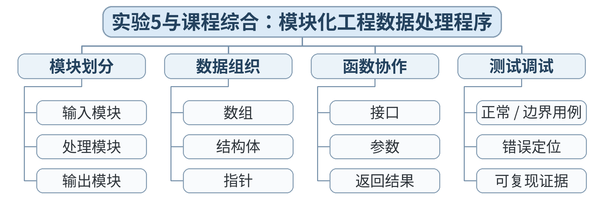

### 教学目标

**知识目标：**
- （1）综合复习数据类型、输入输出、控制结构、数组/结构、指针、函数。
- （2）理解从需求、设计、实现、测试到文档的最小开发流程。
**能力目标：**
- （1）能独立设计并实现一个 100–200 行以内的模块化 C 程序。
- （2）能提交可运行代码、测试证据与简短说明，并进行自评。
**价值目标：**
- （1）形成规范编程、严谨调试、主动复盘和持续改进的综合工程素养。

### 课程思政

- （1）通过函数分解、参数传递和模块复用，强调接口清晰、职责单一、协作规范在工程软件中的价值，培养模块化与团队协作意识。
- （2）实验/综合任务要求保留源代码、测试记录和结论，强调实验诚信、结果可复现和过程可追溯；不得以主观判断代替测试证据。

### 专创融合 / 双创融合

通过函数库、模块化接口和综合工程数据处理程序，训练可复用组件设计与协作开发，为后续 C++、数据结构和智能制造软件原型开发奠定基础。

### 教学重难点

教学重点：知识综合；模块化；测试与交付。
教学难点：合理拆分模块并提供覆盖关键路径的测试证据。

### 教学方法

任务驱动法、实验/上机实践法、巡回指导法、测试驱动评价、同伴复核

### 教学用具

电脑、投影仪、多媒体课件、教材、华为 CodeArts IDE、鲲鹏 openEuler/终端、C 编译器、示例代码、实验任务书、测试记录表

### 教学设计

课前任务 → 互动导入（15 min）→ 传授新知与上机训练（70 min）→ 过关检测（10 min）→ 课堂小结（3 min）→ 作业布置（1 min）→ 考勤（1 min）

### 教学过程

#### 课前任务

【教师】课前发布本课主题“实验5与课程综合：模块化工程数据处理程序”及对应教材阅读范围，给出一个最小预习问题/代码片段，不提前给出完整答案。
- 1. 阅读教材对应内容，圈出 3 个核心术语；
- 2. 预读/预测课堂任务中可能出现的关键问题；
- 3. 检查开发环境，确保能够编译运行上一课最小程序。
【学生】完成阅读与环境检查，记录至少 1 个疑问，带着问题进入课堂。

**设计意图：** 通过课前阅读、环境检查和一个最小问题建立先备认知，避免把课堂时间消耗在环境故障上，并让学生带着真实疑问进入学习。

#### 互动导入与传授新知 / 上机训练

【互动导入 15 min】
【教师】教师发布终期实验验收标准；学生先提交 10 分钟“需求—数据结构—函数列表—测试计划”草图。
【学生】先运行/预测/观察，记录结果和第一判断；不先听完整结论。
【传授新知与上机训练 70 min】
一、最小讲解与示范（约20 min）
【教师】教师按检查点巡回：数据结构、函数接口、边界、输出、代码规范；不直接给成品代码。
【学生】同步操作，在关键位置写注释或记录规则，随时验证教师示范。
二、学生独立产出（约35 min）
【学生】学生完成 final_c_project：至少包含 1 个结构体、1 个数组、2 个自定义函数、1 个分支、1 个循环，并合理使用指针。
【教师】巡回指导，只提示问题定位方法、边界和验收条件，不直接代写完整答案。
三、调试、互审与证据固化（约15 min）
【教师/学生】学生执行自测+同伴复现，依据 A02 评分维度检查功能正确性、代码规范与文档。
【学习证据】最终项目源代码 + README/实验报告 + 至少 5 组测试记录 + 自评表；计入 A02，并作为期末复习综合证据。
【评价关联】本课评价：A01+A02；课堂证据用于检验本课知识与编程能力目标。

**设计意图：** 采用“先运行/预测 → 最小讲解与示范 → 独立编程 → 调试互审 → 证据固化”的上机闭环。把抽象语法/概念落到可运行程序，通过独立产出和测试证据检验真实学习，而不是只听懂讲解。

#### 过关检测

【教师】组织当堂检测：
- 1. 项目中的哪一部分最适合拆成函数？
- 2. 如何证明程序覆盖了关键分支？
- 3. 如果同伴按 README 不能复现，交付是否合格？
【学生】独立作答/运行验证；【教师】根据错误类型进行针对性讲解，并要求学生说明判断依据。

**设计意图：** 用概念题、边界题和运行验证即时检测关键知识，暴露易错点；要求说明依据，避免只记答案。

#### 课堂小结

【教师】回到本课知识脉络图，用“概念—关系—应用—边界”四个关键词总结“实验5与课程综合：模块化工程数据处理程序”。
重点再次强调：知识综合；模块化；测试与交付。。
【学生】用 1 分钟口述/书写“本课最重要的一条规则 + 一个最容易出错的边界”。

**设计意图：** 回到知识脉络图压缩本课信息，帮助学生形成层级结构，并把“规则—边界—应用”连接到下一次课。

#### 作业布置

【教师】布置课后任务：提交最终实验包；整理个人课程复盘：最常见3类错误、最有效2种调试方法、后续进入 C++ Ⅱ前需要补强的1项能力。
【学生】按课程文件命名规范整理代码、测试记录和必要说明，课后提交。

**设计意图：** 通过整理源代码、测试记录和说明，固化课堂成果，形成可复查、可复现的过程性学习证据。

#### 考勤

【教师】利用学校/课程实际使用的平台进行签到。
【学生】按课程要求完成签到。

**设计意图：** 保留学校模板中的考勤环节，用于教学秩序管理；不在教案中预填任何出勤事实。

### 课后教学反思

【课后填写，不预填事实】
- 1. 教学流程：记录 100 min 各环节实际用时及需要调整的位置；
- 2. 教学内容：重点记录“合理拆分模块并提供覆盖关键路径的测试证据。”的真实掌握证据与常见错误；
- 3. 学生参与：仅依据课堂实际记录填写独立完成、提问、互审等情况，不补写推测性结论；
- 4. 评价证据：检查本课源代码/测试/调试证据是否完整，记录缺项及原因；
- 5. 后续改进：依据真实课堂证据确定下一轮教学调整。

**说明：** 反思必须基于真实课堂证据。课前仅提供填写框架，避免把预测或模板化表述误写成已发生的学生表现。

### 本章节参考文献

[1] 戴波.《C与C++程序设计（第二版）》[M]. 北京：北京大学出版社，2025.
