# 程序设计基础（C&C++）Ⅱ 教案（24次课）

> 配套 Word：`25JX31802-程序设计基础（C&C++）Ⅱ-教案.docx`。本 Markdown 与 Word 同步生成；知识脉络图使用相对路径引用 `images/` 中的课程专属图片。

## 教案封面信息
- **学 院**：计算机与信息技术学院
- **专业（教研室）**：（按教研室实际填写）
- **课 程 名 称**：程序设计基础（C&C++）Ⅱ
- **主 讲 教 师**：（按实际填写）
- **职 称**：（按实际填写）
- **授 课 学 期**：第4学期
- **授 课 专 业**：智能制造工程

## 课程基本信息
- **课程名称（中文）**：程序设计基础（C&C++）Ⅱ
- **课程名称（英文）**：Fundamentals of Programming (C & C++) II
- **课程类别**：学科基础类；**课程性质**：必修；**授课语言**：中文
- **授课学期**：第4学期；**学分**：3
- **课程学时及分配**：总学时 48；理论 0；上机 48；其他 0
- **适用专业**：智能制造工程
- **教材**：戴波.《C与C++程序设计（第二版）》[M]. 北京：北京大学出版社，2025. ISBN 9787301362648。
- **授课学院**：计算机与信息技术学院
- **先修课程**：程序设计基础（C&C++）Ⅰ
- **后续课程**：数据结构（C）、微机原理及接口技术、人工智能技术与应用
- **考核类型**：考试课（√）；考查课（ ）
- **考核形式**：闭卷（ ）；开卷（ ）；笔试（ ）；机试（√，以机考为主）；口试（ ）；其它（ ）
- **考核方式**：作业（√）；随堂练习（√）；线上考试（ ）；线下考试（ ）；其它（平时表现、课程作业、期末机考）
- **总评成绩比例**：总评成绩 = 平时表现×20% + 课程作业×20% + 期末考试×60%

### 课程简介
**课程基本定位：** 本课程是《程序设计基础（C&C++）Ⅰ》的进阶课程，以 C++ 语言和面向对象程序设计为主要载体，在学生已经具备 C 语言结构化程序设计、数组、指针和函数基础的前提下，重点学习类与对象、构造与析构、继承与派生、多态、运算符重载、虚函数、模板、命名空间和异常处理等机制。

**核心学习结果：** 学生能够根据问题对象及其关系设计类、对象和类层次结构，利用封装、继承和多态提高程序可维护性与可扩展性；能够使用模板、命名空间和异常处理组织较为规范、健壮的 C++ 程序，并完成编写、调试、测试和改进。

**主要教学方法：** 采用“概念建模—代码实现—上机验证—重构比较—综合设计”，组织 C/C++ 实现对比、对象生命周期跟踪、类层次重构、多态运行轨迹和异常场景测试。

**参考资料：** [1] 戴波.《C与C++程序设计（第二版）》[M]. 北京：北京大学出版社，2025；[2] 教材配套上机/OJ练习；[3] VS Code 环境下 C++ 编译、运行与调试资料；[4] 任课教师提供的类设计与调试案例。

## 24次课教学设计

## 第01次课 课程衔接、面向对象思想与 C++ 输入输出

- **章节/单元**：绪论与 C++ 编程基础
- **周次**：按实际课表填写
- **课时安排**：2课时（100 min）

### 知识脉络图

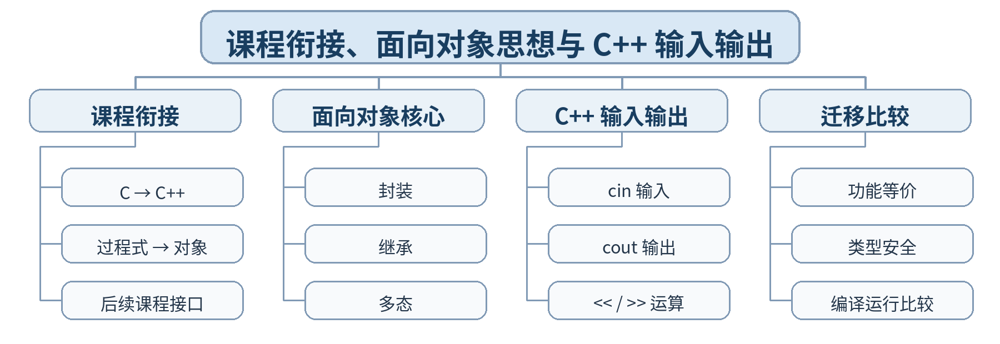

### 教学目标

**知识目标：**
- （1）理解《C&C++Ⅰ》与本课程的递进关系以及从过程式程序向面向对象程序设计的能力转换。
- （2）掌握 C++ 基本输入输出方式和面向对象三个核心概念的基本含义。
**能力目标：**
- （1）能将一个基础 C 输入输出程序迁移到 C++ 环境并保持功能等价。
- （2）能用对象、属性、行为三个视角初步描述一个智能制造设备问题。
**价值目标：**
- （1）形成主动迁移既有知识、持续学习新语言机制的意识。
- （2）形成从“步骤堆叠”转向“对象与职责”分析问题的初步建模意识。

### 课程思政

- （1）结合 C 到 C++ 的语言演进，说明软件技术持续迭代需要终身学习和理性吸收新方法；强调迁移必须保持功能可验证，培养尊重事实和兼容既有系统的工程责任意识。
- （2）本课要求学生保留真实源代码、运行/调试记录和测试结论，以可复现证据支撑程序行为判断，落实规范、诚信和质量责任。

### 专创融合 / / 双创融合

围绕“既有过程式代码向面向对象软件迁移”的真实工程场景，引导学生思考老代码重构、工具替换和软件迭代中的技术服务价值。

### 教学重难点

教学重点：C/C++ 课程衔接；面向对象三个核心概念；cin/cout 基本用法。
教学难点：从“按步骤写程序”转换为“围绕对象及职责建模”的思维变化。

### 教学方法

任务驱动法、概念建模法、演示法、上机实践法、代码对比法、断点/日志调试法、同伴互审

### 教学用具

电脑、投影仪、多媒体课件、教材、Visual Studio Code（VS Code）、C++ 编译器、终端/调试器、示例代码

### 教学设计

课前任务 → 互动导入（15 min）→ 传授新知与上机训练（70 min）→ 过关检测（10 min）→ 课堂小结（3 min）→ 作业布置（1 min）→ 考勤（1 min）

### 教学过程

#### 课前任务

【教师】课前发布本课主题“课程衔接、面向对象思想与 C++ 输入输出”及教材对应内容，给出一个最小代码/设计问题，不提前给出完整答案。
- 1. 阅读教材对应内容，圈出 3—5 个核心术语；
- 2. 预读课堂代码或类图，写下至少 1 个预测和 1 个疑问；
- 3. 检查 VS Code 与 C++ 编译环境，确保能够编译运行上一课最小程序。
【学生】完成阅读、环境检查和预测记录，带着问题进入课堂。

**设计意图：** 通过课前阅读、环境检查和一个最小问题建立先备认知，避免把课堂时间消耗在环境故障上，并让学生带着真实疑问进入学习。

#### 互动导入 / （15 min） / / 传授新知与上机训练 / （70 min）

【互动导入 15 min】
【教师】给出一个使用 scanf/printf 的设备温度输入输出程序和一个等价 C++ 版本，要求学生先运行并标出“语法变化”和“思路未变”的部分。
【学生】先运行/预测/观察，记录第一判断和证据，不先接受教师结论。
【传授新知与上机训练 70 min】
- 一、最小讲解与示范（约20 min）
【教师】C 与 C++ 在语言演进、程序组织和开发目标上的递进关系。
【教师】封装、继承、多态三个核心概念的直观含义及其后续学习位置。
【教师】cin/cout 的基本语法、输入输出链与简单格式化。
- 二、学生独立产出（约35 min）
【学生】将一个“设备编号 + 温度 + 状态”C 程序迁移为 C++ 版本，并补充一个对象职责草图（设备有哪些属性与行为）。
【教师】巡回检查设计边界、编译错误、对象状态与接口使用，只提供分层提示，不替学生完成程序。
- 三、调试、互审与证据固化（约15 min）
【学生】对正常值、边界温度和输入错误三组数据运行程序；同伴检查是否保持功能等价并说明一处 C/C++ 差异。
【形成证据】本课至少保存：源代码 + 编译/运行结果 + 测试/调试记录；对应 目标 1.1，2.1，3.1。
【评价映射】课堂参与、随堂练习与代码规范纳入平时表现（20%）；本单元代码成果为 课程作业1（课程作业权重中的15%） 的过程证据。

**设计意图：** 采用“先运行/预测 → 最小讲解与示范 → 独立编程 → 调试互审 → 证据固化”的上机闭环。把抽象语法/概念落到可运行程序，通过独立产出和测试证据检验真实学习，而不是只听懂讲解。

#### 过关检测 / （10 min）

【教师】组织当堂检测：
- 1. cin 与 cout 分别承担什么作用？
- 2. 面向对象三个核心概念是什么？
- 3. “把 C 代码改成 cout/cin”是否已经等于面向对象设计？为什么？
【学生】独立作答或运行验证；【教师】根据错误类型讲解，并要求学生说明判断依据。

**设计意图：** 用概念题、边界题和运行验证即时检测关键知识，暴露易错点；要求说明依据，避免只记答案。

#### 课堂小结 / （3 min）

【教师】回到本课知识脉络图，用“概念—关系—应用—边界”总结“课程衔接、面向对象思想与 C++ 输入输出”。
重点再次强调：C/C++ 课程衔接；面向对象三个核心概念；cin/cout 基本用法。
【学生】用 1 分钟写出“本课最重要的一条设计规则 + 一个最容易出错的边界”。

**设计意图：** 回到知识脉络图压缩本课信息，帮助学生形成层级结构，并把“规则—边界—应用”连接到下一次课。

#### 作业布置 / （1 min）

【教师】布置课后任务：整理 C/C++ 功能等价对比表，并把课堂迁移程序改成一个“设备状态卡片”小程序。
【学生】按课程文件命名规范整理源代码、测试记录和必要说明，课后提交。

**设计意图：** 通过整理源代码、测试记录和说明，固化课堂成果，形成可复查、可复现的过程性学习证据。

#### 考勤 / （1 min）

【教师】利用学校/课程实际使用的平台进行签到。
【学生】按课程要求完成签到。

**设计意图：** 保留学校模板中的考勤环节，用于教学秩序管理；不在教案中预填任何出勤事实。

#### 课后 / 教学反思

【课后填写，不预填事实】
- 1. 教学流程：记录 100 min 各环节实际用时及需要调整的位置；
- 2. 教学内容：重点记录“从“按步骤写程序”转换为“围绕对象及职责建模”的思维变化。”的真实掌握证据、常见错误和补救措施；
- 3. 学生参与：仅依据课堂实际记录填写独立完成、提问、互审、调试等情况，不补写推测性结论；
- 4. 评价证据：检查本课源代码、测试/调试记录是否完整，记录缺项及下一次课的反馈安排；
- 5. 思政/专创融合：仅记录课堂实际发生的有效案例和学生反馈。

**设计意图：** 反思必须基于真实课堂证据。课前仅提供填写框架，避免把预测或模板化表述误写成已发生的学生表现。

#### 本章节 / 参考文献

[1] 戴波.《C与C++程序设计（第二版）》[M]. 北京：北京大学出版社，2025.
[2] 课程配套 C/C++ 对比程序、类设计案例、调试案例及 VS Code C++ 编译调试资料。

---

## 第02次课 内联函数、函数重载与默认参数

- **章节/单元**：绪论与 C++ 编程基础
- **周次**：按实际课表填写
- **课时安排**：2课时（100 min）

### 知识脉络图

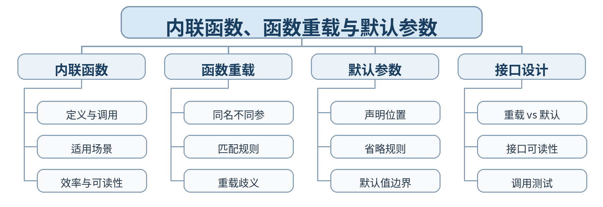

### 教学目标

**知识目标：**
- （1）掌握内联函数、函数重载和默认参数的基本语法与作用。
- （2）理解重载匹配、默认参数省略和接口设计之间的关系。
**能力目标：**
- （1）能用重载和默认参数减少重复函数并保持接口清晰。
- （2）能通过编译错误和运行结果识别重载歧义或默认参数设计不当。
**价值目标：**
- （1）形成重视接口清晰、避免重复代码的工程习惯。
- （2）理解“便利性不能牺牲可读性和确定性”的程序设计原则。

### 课程思政

- （1）通过接口设计强调标准统一、职责清晰和兼容使用者的重要性，引导学生在追求便利的同时对调用行为负责，形成严谨的软件接口意识。
- （2）本课要求学生保留真实源代码、运行/调试记录和测试结论，以可复现证据支撑程序行为判断，落实规范、诚信和质量责任。

### 专创融合 / / 双创融合

通过小型接口库设计，训练学生把重复计算封装成稳定接口，为后续软件组件、算法库和设备 SDK 设计建立基础。

### 教学重难点

教学重点：内联函数；函数重载；默认参数的语法和调用规则。
教学难点：重载匹配与默认参数组合可能产生的歧义及接口边界。

### 教学方法

任务驱动法、概念建模法、演示法、上机实践法、代码对比法、断点/日志调试法、同伴互审

### 教学用具

电脑、投影仪、多媒体课件、教材、Visual Studio Code（VS Code）、C++ 编译器、终端/调试器、示例代码

### 教学设计

课前任务 → 互动导入（15 min）→ 传授新知与上机训练（70 min）→ 过关检测（10 min）→ 课堂小结（3 min）→ 作业布置（1 min）→ 考勤（1 min）

### 教学过程

#### 课前任务

【教师】课前发布本课主题“内联函数、函数重载与默认参数”及教材对应内容，给出一个最小代码/设计问题，不提前给出完整答案。
- 1. 阅读教材对应内容，圈出 3—5 个核心术语；
- 2. 预读课堂代码或类图，写下至少 1 个预测和 1 个疑问；
- 3. 检查 VS Code 与 C++ 编译环境，确保能够编译运行上一课最小程序。
【学生】完成阅读、环境检查和预测记录，带着问题进入课堂。

**设计意图：** 通过课前阅读、环境检查和一个最小问题建立先备认知，避免把课堂时间消耗在环境故障上，并让学生带着真实疑问进入学习。

#### 互动导入 / （15 min） / / 传授新知与上机训练 / （70 min）

【互动导入 15 min】
【教师】给出三个名称不同但逻辑相同的求最大值函数，以及一组因默认参数与重载组合造成歧义的代码，学生先预测编译结果。
【学生】先运行/预测/观察，记录第一判断和证据，不先接受教师结论。
【传授新知与上机训练 70 min】
- 一、最小讲解与示范（约20 min）
【教师】内联函数的语义、适用边界及其与普通函数的关系。
【教师】函数重载的参数列表区分、调用匹配与常见歧义。
【教师】默认参数的声明规则、从右向左省略与接口设计注意事项。
- 二、学生独立产出（约35 min）
【学生】设计一组“传感器阈值计算”函数：用重载支持 int/double 两类数据，用默认参数提供缺省报警系数，并实现至少 3 种调用。
【教师】巡回检查设计边界、编译错误、对象状态与接口使用，只提供分层提示，不替学生完成程序。
- 三、调试、互审与证据固化（约15 min）
【学生】建立调用表，覆盖完整参数、缺省参数、不同类型和一个故意产生歧义的版本；解释编译器选择结果。
【形成证据】本课至少保存：源代码 + 编译/运行结果 + 测试/调试记录；对应 目标 1.1，2.1，3.1。
【评价映射】课堂参与、随堂练习与代码规范纳入平时表现（20%）；本单元代码成果为 课程作业1（课程作业权重中的15%） 的过程证据。

**设计意图：** 采用“先运行/预测 → 最小讲解与示范 → 独立编程 → 调试互审 → 证据固化”的上机闭环。把抽象语法/概念落到可运行程序，通过独立产出和测试证据检验真实学习，而不是只听懂讲解。

#### 过关检测 / （10 min）

【教师】组织当堂检测：
- 1. 函数返回类型不同能否单独构成重载？
- 2. 默认参数为什么通常从参数列表右端开始省略？
- 3. 何时更适合重载，何时更适合默认参数？
【学生】独立作答或运行验证；【教师】根据错误类型讲解，并要求学生说明判断依据。

**设计意图：** 用概念题、边界题和运行验证即时检测关键知识，暴露易错点；要求说明依据，避免只记答案。

#### 课堂小结 / （3 min）

【教师】回到本课知识脉络图，用“概念—关系—应用—边界”总结“内联函数、函数重载与默认参数”。
重点再次强调：内联函数；函数重载；默认参数的语法和调用规则。
【学生】用 1 分钟写出“本课最重要的一条设计规则 + 一个最容易出错的边界”。

**设计意图：** 回到知识脉络图压缩本课信息，帮助学生形成层级结构，并把“规则—边界—应用”连接到下一次课。

#### 作业布置 / （1 min）

【教师】布置课后任务：完成一个“多类型单位换算器”，至少包含 2 组重载和 1 个带默认参数的接口，并附调用测试表。
【学生】按课程文件命名规范整理源代码、测试记录和必要说明，课后提交。

**设计意图：** 通过整理源代码、测试记录和说明，固化课堂成果，形成可复查、可复现的过程性学习证据。

#### 考勤 / （1 min）

【教师】利用学校/课程实际使用的平台进行签到。
【学生】按课程要求完成签到。

**设计意图：** 保留学校模板中的考勤环节，用于教学秩序管理；不在教案中预填任何出勤事实。

#### 课后 / 教学反思

【课后填写，不预填事实】
- 1. 教学流程：记录 100 min 各环节实际用时及需要调整的位置；
- 2. 教学内容：重点记录“重载匹配与默认参数组合可能产生的歧义及接口边界。”的真实掌握证据、常见错误和补救措施；
- 3. 学生参与：仅依据课堂实际记录填写独立完成、提问、互审、调试等情况，不补写推测性结论；
- 4. 评价证据：检查本课源代码、测试/调试记录是否完整，记录缺项及下一次课的反馈安排；
- 5. 思政/专创融合：仅记录课堂实际发生的有效案例和学生反馈。

**设计意图：** 反思必须基于真实课堂证据。课前仅提供填写框架，避免把预测或模板化表述误写成已发生的学生表现。

#### 本章节 / 参考文献

[1] 戴波.《C与C++程序设计（第二版）》[M]. 北京：北京大学出版社，2025.
[2] 课程配套 C/C++ 对比程序、类设计案例、调试案例及 VS Code C++ 编译调试资料。

---

## 第03次课 动态内存分配、释放与资源责任

- **章节/单元**：绪论与 C++ 编程基础
- **周次**：按实际课表填写
- **课时安排**：2课时（100 min）

### 知识脉络图

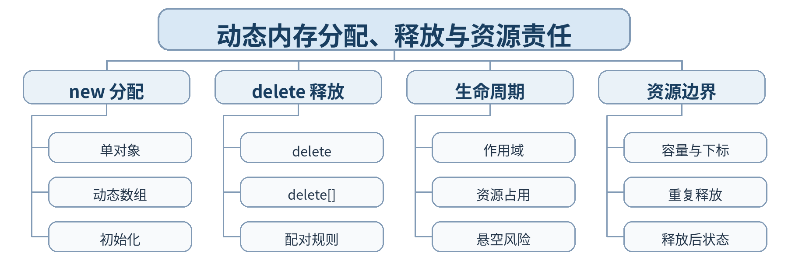

### 教学目标

**知识目标：**
- （1）掌握 new/delete、new[]/delete[] 的基本语法和配对规则。
- （2）理解动态对象/数组的生命周期、资源占用与常见错误。
**能力目标：**
- （1）能根据运行时数据规模动态申请数组并正确释放。
- （2）能通过地址、边界和重复释放测试定位典型资源管理错误。
**价值目标：**
- （1）形成“谁申请、谁负责释放”的资源责任意识。
- （2）养成对内存边界、生命周期和异常路径进行主动检查的质量习惯。

### 课程思政

- （1）通过资源申请与释放责任说明工程软件中的“有始有终、责任到人”，强调资源泄漏和越界可能造成系统失稳，培养质量责任意识。
- （2）本课要求学生保留真实源代码、运行/调试记录和测试结论，以可复现证据支撑程序行为判断，落实规范、诚信和质量责任。

### 专创融合 / / 双创融合

把动态数组应用于不定长传感器数据、设备日志缓存等工程场景，引导学生理解资源管理对嵌入式和工业软件的重要性。

### 教学重难点

教学重点：new/delete；动态数组；申请与释放配对。
教学难点：动态资源生命周期与悬空指针、越界、重复释放等错误的识别。

### 教学方法

任务驱动法、概念建模法、演示法、上机实践法、代码对比法、断点/日志调试法、同伴互审

### 教学用具

电脑、投影仪、多媒体课件、教材、Visual Studio Code（VS Code）、C++ 编译器、终端/调试器、示例代码

### 教学设计

课前任务 → 互动导入（15 min）→ 传授新知与上机训练（70 min）→ 过关检测（10 min）→ 课堂小结（3 min）→ 作业布置（1 min）→ 考勤（1 min）

### 教学过程

#### 课前任务

【教师】课前发布本课主题“动态内存分配、释放与资源责任”及教材对应内容，给出一个最小代码/设计问题，不提前给出完整答案。
- 1. 阅读教材对应内容，圈出 3—5 个核心术语；
- 2. 预读课堂代码或类图，写下至少 1 个预测和 1 个疑问；
- 3. 检查 VS Code 与 C++ 编译环境，确保能够编译运行上一课最小程序。
【学生】完成阅读、环境检查和预测记录，带着问题进入课堂。

**设计意图：** 通过课前阅读、环境检查和一个最小问题建立先备认知，避免把课堂时间消耗在环境故障上，并让学生带着真实疑问进入学习。

#### 互动导入 / （15 min） / / 传授新知与上机训练 / （70 min）

【互动导入 15 min】
【教师】运行一个动态采样数组程序：版本 A 忘记释放，版本 B 使用 delete 代替 delete[]；学生先找风险，再运行观察。
【学生】先运行/预测/观察，记录第一判断和证据，不先接受教师结论。
【传授新知与上机训练 70 min】
- 一、最小讲解与示范（约20 min）
【教师】运行时决定容量的需求与动态内存分配机制。
【教师】单对象与数组的申请/释放语法及严格配对关系。
【教师】越界、未释放、重复释放、释放后继续访问等典型问题。
- 二、学生独立产出（约35 min）
【学生】编写“传感器采样缓存”：运行时输入样本数，动态申请 double 数组，读入数据，计算均值/最大值并释放资源。
【教师】巡回检查设计边界、编译错误、对象状态与接口使用，只提供分层提示，不替学生完成程序。
- 三、调试、互审与证据固化（约15 min）
【学生】测试样本数 1、常规规模和边界规模；检查数组下标、释放语句和释放后的指针使用逻辑。
【形成证据】本课至少保存：源代码 + 编译/运行结果 + 测试/调试记录；对应 目标 1.1，2.1，3.1。
【评价映射】课堂参与、随堂练习与代码规范纳入平时表现（20%）；本单元代码成果为 课程作业1（课程作业权重中的15%） 的过程证据。

**设计意图：** 采用“先运行/预测 → 最小讲解与示范 → 独立编程 → 调试互审 → 证据固化”的上机闭环。把抽象语法/概念落到可运行程序，通过独立产出和测试证据检验真实学习，而不是只听懂讲解。

#### 过关检测 / （10 min）

【教师】组织当堂检测：
- 1. new[] 申请的数组为什么必须用 delete[] 释放？
- 2. 动态内存与局部数组的生命周期有何不同？
- 3. 释放后继续访问指针可能产生什么问题？
【学生】独立作答或运行验证；【教师】根据错误类型讲解，并要求学生说明判断依据。

**设计意图：** 用概念题、边界题和运行验证即时检测关键知识，暴露易错点；要求说明依据，避免只记答案。

#### 课堂小结 / （3 min）

【教师】回到本课知识脉络图，用“概念—关系—应用—边界”总结“动态内存分配、释放与资源责任”。
重点再次强调：new/delete；动态数组；申请与释放配对。
【学生】用 1 分钟写出“本课最重要的一条设计规则 + 一个最容易出错的边界”。

**设计意图：** 回到知识脉络图压缩本课信息，帮助学生形成层级结构，并把“规则—边界—应用”连接到下一次课。

#### 作业布置 / （1 min）

【教师】布置课后任务：为采样缓存增加最小值与超限计数，并提交“资源申请—使用—释放”三段式说明。
【学生】按课程文件命名规范整理源代码、测试记录和必要说明，课后提交。

**设计意图：** 通过整理源代码、测试记录和说明，固化课堂成果，形成可复查、可复现的过程性学习证据。

#### 考勤 / （1 min）

【教师】利用学校/课程实际使用的平台进行签到。
【学生】按课程要求完成签到。

**设计意图：** 保留学校模板中的考勤环节，用于教学秩序管理；不在教案中预填任何出勤事实。

#### 课后 / 教学反思

【课后填写，不预填事实】
- 1. 教学流程：记录 100 min 各环节实际用时及需要调整的位置；
- 2. 教学内容：重点记录“动态资源生命周期与悬空指针、越界、重复释放等错误的识别。”的真实掌握证据、常见错误和补救措施；
- 3. 学生参与：仅依据课堂实际记录填写独立完成、提问、互审、调试等情况，不补写推测性结论；
- 4. 评价证据：检查本课源代码、测试/调试记录是否完整，记录缺项及下一次课的反馈安排；
- 5. 思政/专创融合：仅记录课堂实际发生的有效案例和学生反馈。

**设计意图：** 反思必须基于真实课堂证据。课前仅提供填写框架，避免把预测或模板化表述误写成已发生的学生表现。

#### 本章节 / 参考文献

[1] 戴波.《C与C++程序设计（第二版）》[M]. 北京：北京大学出版社，2025.
[2] 课程配套 C/C++ 对比程序、类设计案例、调试案例及 VS Code C++ 编译调试资料。

---

## 第04次课 基本文件操作与 C/C++ 基础迁移综合

- **章节/单元**：绪论与 C++ 编程基础
- **周次**：按实际课表填写
- **课时安排**：2课时（100 min）

### 知识脉络图

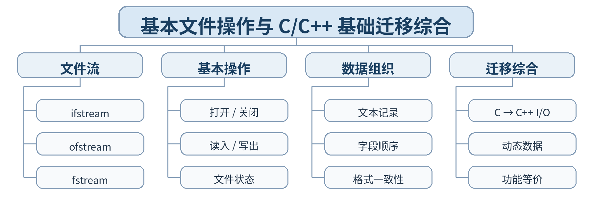

### 教学目标

**知识目标：**
- （1）掌握 C++ 基本文件流的打开、读写、关闭和状态判断。
- （2）综合理解 C++ I/O、重载/默认参数、动态内存与文件操作的协同使用。
**能力目标：**
- （1）能完成一个从文件读取设备数据、动态处理并输出结果文件的程序。
- （2）能对 C/C++ 两种实现进行功能等价测试和差异说明。
**价值目标：**
- （1）形成“数据可保存、结果可复查”的工程记录意识。
- （2）养成以运行证据证明迁移正确性的严谨习惯。

### 课程思政

- （1）强调工程数据记录必须真实、格式明确、可追溯；通过失败文件和边界数据测试，培养对异常输入负责、以证据支撑结论的职业习惯。
- （2）本课要求学生保留真实源代码、运行/调试记录和测试结论，以可复现证据支撑程序行为判断，落实规范、诚信和质量责任。

### 专创融合 / / 双创融合

把文件处理与设备运行数据结合，训练学生形成小型数据工具原型，为后续设备日志分析、自动报表和软件重构打基础。

### 教学重难点

教学重点：文件流基本操作；文件状态判断；C/C++ 基础机制综合使用。
教学难点：文件读写失败、格式不一致与动态数据规模共同出现时的错误定位。

### 教学方法

任务驱动法、综合上机实践法、巡回指导法、测试驱动评价、代码讲评与同伴复核

### 教学用具

电脑、投影仪、多媒体课件、教材、Visual Studio Code（VS Code）、C++ 编译器、终端/调试器、示例代码、课程作业任务书、测试记录表

### 教学设计

课前任务 → 互动导入（15 min）→ 传授新知与上机训练（70 min）→ 过关检测（10 min）→ 课堂小结（3 min）→ 作业布置（1 min）→ 考勤（1 min）

### 教学过程

#### 课前任务

【教师】课前发布本课主题“基本文件操作与 C/C++ 基础迁移综合”及教材对应内容，给出一个最小代码/设计问题，不提前给出完整答案。
- 1. 阅读教材对应内容，圈出 3—5 个核心术语；
- 2. 预读课堂代码或类图，写下至少 1 个预测和 1 个疑问；
- 3. 检查 VS Code 与 C++ 编译环境，确保能够编译运行上一课最小程序。
【学生】完成阅读、环境检查和预测记录，带着问题进入课堂。

**设计意图：** 通过课前阅读、环境检查和一个最小问题建立先备认知，避免把课堂时间消耗在环境故障上，并让学生带着真实疑问进入学习。

#### 互动导入 / （15 min） / / 传授新知与上机训练 / （70 min）

【互动导入 15 min】
【教师】给出一个“文件不存在”和一个“字段缺失”的设备日志，学生运行读取程序并判断失败发生在打开、解析还是计算阶段。
【学生】先运行/预测/观察，记录第一判断和证据，不先接受教师结论。
【传授新知与上机训练 70 min】
- 一、最小讲解与示范（约20 min）
【教师】ifstream/ofstream/fstream 的用途及打开、读写、关闭流程。
【教师】文件状态判断、文本字段顺序和基本容错意识。
【教师】把 C 输入输出程序迁移为 C++ 文件流 + 动态数据处理程序。
- 二、学生独立产出（约35 min）
【学生】完成课程作业1：读取设备运行记录文件，动态保存数据，计算统计量并写出报告文件；保留一个 C 版本或伪代码用于对比。
【教师】巡回检查设计边界、编译错误、对象状态与接口使用，只提供分层提示，不替学生完成程序。
- 三、调试、互审与证据固化（约15 min）
【学生】覆盖正常文件、空文件、字段不足和边界数据；形成“输入—预期—实际—结论”测试表。
【形成证据】本课至少保存：源代码 + 编译/运行结果 + 测试/调试记录；对应 目标 1.1，2.1，3.1。
【评价映射】日常证据纳入平时表现（20%）；课程作业1（课程作业权重中的15%）。

**设计意图：** 采用“先运行/预测 → 最小讲解与示范 → 独立编程 → 调试互审 → 证据固化”的上机闭环。把抽象语法/概念落到可运行程序，通过独立产出和测试证据检验真实学习，而不是只听懂讲解。

#### 过关检测 / （10 min）

【教师】组织当堂检测：
- 1. 文件打开失败后程序是否应继续读取？
- 2. ifstream 与 ofstream 的主要差别是什么？
- 3. 如何证明迁移后的 C++ 程序与原程序功能等价？
【学生】独立作答或运行验证；【教师】根据错误类型讲解，并要求学生说明判断依据。

**设计意图：** 用概念题、边界题和运行验证即时检测关键知识，暴露易错点；要求说明依据，避免只记答案。

#### 课堂小结 / （3 min）

【教师】回到本课知识脉络图，用“概念—关系—应用—边界”总结“基本文件操作与 C/C++ 基础迁移综合”。
重点再次强调：文件流基本操作；文件状态判断；C/C++ 基础机制综合使用。
【学生】用 1 分钟写出“本课最重要的一条设计规则 + 一个最容易出错的边界”。

**设计意图：** 回到知识脉络图压缩本课信息，帮助学生形成层级结构，并把“规则—边界—应用”连接到下一次课。

#### 作业布置 / （1 min）

【教师】布置课后任务：提交课程作业1：源代码、输入样例、输出文件、测试表和 150 字 C/C++ 迁移说明。
【学生】按课程文件命名规范整理源代码、测试记录和必要说明，课后提交。

**设计意图：** 通过整理源代码、测试记录和说明，固化课堂成果，形成可复查、可复现的过程性学习证据。

#### 考勤 / （1 min）

【教师】利用学校/课程实际使用的平台进行签到。
【学生】按课程要求完成签到。

**设计意图：** 保留学校模板中的考勤环节，用于教学秩序管理；不在教案中预填任何出勤事实。

#### 课后 / 教学反思

【课后填写，不预填事实】
- 1. 教学流程：记录 100 min 各环节实际用时及需要调整的位置；
- 2. 教学内容：重点记录“文件读写失败、格式不一致与动态数据规模共同出现时的错误定位。”的真实掌握证据、常见错误和补救措施；
- 3. 学生参与：仅依据课堂实际记录填写独立完成、提问、互审、调试等情况，不补写推测性结论；
- 4. 评价证据：检查本课源代码、测试/调试记录是否完整，记录缺项及下一次课的反馈安排；
- 5. 思政/专创融合：仅记录课堂实际发生的有效案例和学生反馈。

**设计意图：** 反思必须基于真实课堂证据。课前仅提供填写框架，避免把预测或模板化表述误写成已发生的学生表现。

#### 本章节 / 参考文献

[1] 戴波.《C与C++程序设计（第二版）》[M]. 北京：北京大学出版社，2025.
[2] 课程配套 C/C++ 对比程序、类设计案例、调试案例及 VS Code C++ 编译调试资料。

---

## 第05次课 类的定义、对象与访问控制

- **章节/单元**：第一单元 类与对象及封装
- **周次**：按实际课表填写
- **课时安排**：2课时（100 min）

### 知识脉络图

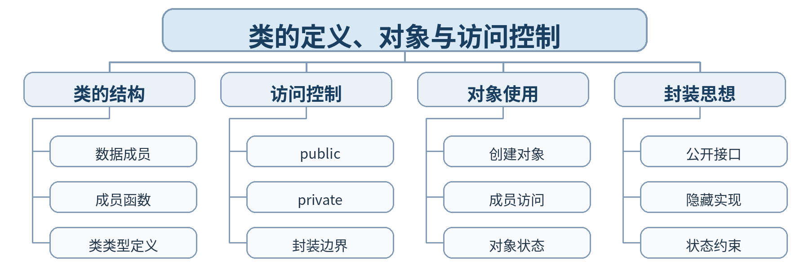

### 教学目标

**知识目标：**
- （1）掌握类类型定义、数据成员、成员函数和 public/private 访问控制。
- （2）理解对象、类与封装之间的关系。
**能力目标：**
- （1）能从设备问题中识别对象、属性和行为并定义类。
- （2）能通过访问控制保护内部状态，只暴露必要接口。
**价值目标：**
- （1）形成“明确边界、各负其责”的模块设计意识。
- （2）理解隐藏实现不是封闭信息，而是降低错误传播和维护成本。

### 课程思政

- （1）通过封装和访问控制说明工程系统需要明确职责边界和权限边界，培养尊重接口、避免越权修改和对内部状态负责的质量意识。
- （2）本课要求学生保留真实源代码、运行/调试记录和测试结论，以可复现证据支撑程序行为判断，落实规范、诚信和质量责任。

### 专创融合 / / 双创融合

围绕设备类、传感器类等智能制造对象建模，训练把工程实体转化为软件对象的能力，为数字孪生和设备管理原型奠定基础。

### 教学重难点

教学重点：类定义；对象创建与使用；public/private；封装。
教学难点：从需求描述中合理划分“内部状态”和“对外接口”。

### 教学方法

任务驱动法、概念建模法、演示法、上机实践法、代码对比法、断点/日志调试法、同伴互审

### 教学用具

电脑、投影仪、多媒体课件、教材、Visual Studio Code（VS Code）、C++ 编译器、终端/调试器、示例代码

### 教学设计

课前任务 → 互动导入（15 min）→ 传授新知与上机训练（70 min）→ 过关检测（10 min）→ 课堂小结（3 min）→ 作业布置（1 min）→ 考勤（1 min）

### 教学过程

#### 课前任务

【教师】课前发布本课主题“类的定义、对象与访问控制”及教材对应内容，给出一个最小代码/设计问题，不提前给出完整答案。
- 1. 阅读教材对应内容，圈出 3—5 个核心术语；
- 2. 预读课堂代码或类图，写下至少 1 个预测和 1 个疑问；
- 3. 检查 VS Code 与 C++ 编译环境，确保能够编译运行上一课最小程序。
【学生】完成阅读、环境检查和预测记录，带着问题进入课堂。

**设计意图：** 通过课前阅读、环境检查和一个最小问题建立先备认知，避免把课堂时间消耗在环境故障上，并让学生带着真实疑问进入学习。

#### 互动导入 / （15 min） / / 传授新知与上机训练 / （70 min）

【互动导入 15 min】
【教师】比较两个设备管理程序：一个使用全局结构体和自由函数，一个使用 Device 类。学生先判断哪种方式更能限制非法状态修改。
【学生】先运行/预测/观察，记录第一判断和证据，不先接受教师结论。
【传授新知与上机训练 70 min】
- 一、最小讲解与示范（约20 min）
【教师】类是用户自定义类型；数据成员与成员函数共同描述状态和行为。
【教师】public/private 控制外部访问，形成封装边界。
【教师】对象创建、成员访问和成员函数调用的基本语法。
- 二、学生独立产出（约35 min）
【学生】设计 Device 类：私有成员 id、temperature、running；公开 set/get 与 start/stop/status 接口，并编写主程序验证。
【教师】巡回检查设计边界、编译错误、对象状态与接口使用，只提供分层提示，不替学生完成程序。
- 三、调试、互审与证据固化（约15 min）
【学生】尝试从类外直接修改 private 成员并观察编译错误；测试 start/stop 前后状态一致性。
【形成证据】本课至少保存：源代码 + 编译/运行结果 + 测试/调试记录；对应 目标 1.2，2.2，3.2。
【评价映射】课堂参与、随堂练习与代码规范纳入平时表现（20%）；本单元代码成果为 课程作业2（课程作业权重中的30%） 的过程证据。

**设计意图：** 采用“先运行/预测 → 最小讲解与示范 → 独立编程 → 调试互审 → 证据固化”的上机闭环。把抽象语法/概念落到可运行程序，通过独立产出和测试证据检验真实学习，而不是只听懂讲解。

#### 过关检测 / （10 min）

【教师】组织当堂检测：
- 1. 类和对象的关系是什么？
- 2. private 的主要价值是什么？
- 3. 把所有成员都设为 public 会失去什么？
【学生】独立作答或运行验证；【教师】根据错误类型讲解，并要求学生说明判断依据。

**设计意图：** 用概念题、边界题和运行验证即时检测关键知识，暴露易错点；要求说明依据，避免只记答案。

#### 课堂小结 / （3 min）

【教师】回到本课知识脉络图，用“概念—关系—应用—边界”总结“类的定义、对象与访问控制”。
重点再次强调：类定义；对象创建与使用；public/private；封装。
【学生】用 1 分钟写出“本课最重要的一条设计规则 + 一个最容易出错的边界”。

**设计意图：** 回到知识脉络图压缩本课信息，帮助学生形成层级结构，并把“规则—边界—应用”连接到下一次课。

#### 作业布置 / （1 min）

【教师】布置课后任务：把 Device 类扩展为“智能传感器”类，增加量程和读数接口，并画出简单类职责表。
【学生】按课程文件命名规范整理源代码、测试记录和必要说明，课后提交。

**设计意图：** 通过整理源代码、测试记录和说明，固化课堂成果，形成可复查、可复现的过程性学习证据。

#### 考勤 / （1 min）

【教师】利用学校/课程实际使用的平台进行签到。
【学生】按课程要求完成签到。

**设计意图：** 保留学校模板中的考勤环节，用于教学秩序管理；不在教案中预填任何出勤事实。

#### 课后 / 教学反思

【课后填写，不预填事实】
- 1. 教学流程：记录 100 min 各环节实际用时及需要调整的位置；
- 2. 教学内容：重点记录“从需求描述中合理划分“内部状态”和“对外接口”。”的真实掌握证据、常见错误和补救措施；
- 3. 学生参与：仅依据课堂实际记录填写独立完成、提问、互审、调试等情况，不补写推测性结论；
- 4. 评价证据：检查本课源代码、测试/调试记录是否完整，记录缺项及下一次课的反馈安排；
- 5. 思政/专创融合：仅记录课堂实际发生的有效案例和学生反馈。

**设计意图：** 反思必须基于真实课堂证据。课前仅提供填写框架，避免把预测或模板化表述误写成已发生的学生表现。

#### 本章节 / 参考文献

[1] 戴波.《C与C++程序设计（第二版）》[M]. 北京：北京大学出版社，2025.
[2] 课程配套 C/C++ 对比程序、类设计案例、调试案例及 VS Code C++ 编译调试资料。

---

## 第06次课 构造函数、析构函数与对象生命周期

- **章节/单元**：第一单元 类与对象及封装
- **周次**：按实际课表填写
- **课时安排**：2课时（100 min）

### 知识脉络图

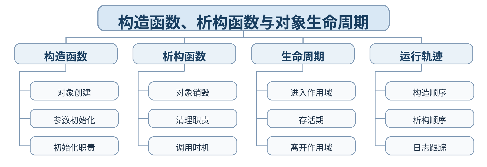

### 教学目标

**知识目标：**
- （1）掌握构造函数和析构函数的语法、特点与调用时机。
- （2）理解对象从创建、使用到销毁的完整生命周期。
**能力目标：**
- （1）能为类设计合理构造函数，使对象创建后立即处于有效状态。
- （2）能通过日志跟踪构造/析构调用顺序并解释对象生命周期。
**价值目标：**
- （1）形成“对象一创建就应有效、对象销毁应完成责任清理”的质量意识。
- （2）养成关注资源责任和生命周期边界的工程习惯。

### 课程思政

- （1）把对象生命周期与工程责任周期相联系，强调创建即承担责任、结束即完成清理，培养全过程质量意识和规范交接意识。
- （2）本课要求学生保留真实源代码、运行/调试记录和测试结论，以可复现证据支撑程序行为判断，落实规范、诚信和质量责任。

### 专创融合 / / 双创融合

通过生命周期追踪理解设备对象、通信连接和资源句柄的创建/释放逻辑，建立面向实际软件资源管理的设计能力。

### 教学重难点

教学重点：构造函数；析构函数；对象生命周期。
教学难点：自动调用时机及作用域、局部对象与动态对象生命周期差异。

### 教学方法

任务驱动法、概念建模法、演示法、上机实践法、代码对比法、断点/日志调试法、同伴互审

### 教学用具

电脑、投影仪、多媒体课件、教材、Visual Studio Code（VS Code）、C++ 编译器、终端/调试器、示例代码

### 教学设计

课前任务 → 互动导入（15 min）→ 传授新知与上机训练（70 min）→ 过关检测（10 min）→ 课堂小结（3 min）→ 作业布置（1 min）→ 考勤（1 min）

### 教学过程

#### 课前任务

【教师】课前发布本课主题“构造函数、析构函数与对象生命周期”及教材对应内容，给出一个最小代码/设计问题，不提前给出完整答案。
- 1. 阅读教材对应内容，圈出 3—5 个核心术语；
- 2. 预读课堂代码或类图，写下至少 1 个预测和 1 个疑问；
- 3. 检查 VS Code 与 C++ 编译环境，确保能够编译运行上一课最小程序。
【学生】完成阅读、环境检查和预测记录，带着问题进入课堂。

**设计意图：** 通过课前阅读、环境检查和一个最小问题建立先备认知，避免把课堂时间消耗在环境故障上，并让学生带着真实疑问进入学习。

#### 互动导入 / （15 min） / / 传授新知与上机训练 / （70 min）

【互动导入 15 min】
【教师】运行一个包含三个局部对象和一个动态对象的程序，学生先预测构造、析构输出顺序，再对照实际运行。
【学生】先运行/预测/观察，记录第一判断和证据，不先接受教师结论。
【传授新知与上机训练 70 min】
- 一、最小讲解与示范（约20 min）
【教师】构造函数名称、无返回值、自动调用与参数初始化。
【教师】析构函数唯一性、无参数及对象销毁时自动调用。
【教师】作用域对局部对象生命周期的影响；动态对象需要显式释放。
- 二、学生独立产出（约35 min）
【学生】实现 Sensor 类，在构造/析构中打印对象编号和生命周期事件；分别创建局部对象、代码块对象和动态对象。
【教师】巡回检查设计边界、编译错误、对象状态与接口使用，只提供分层提示，不替学生完成程序。
- 三、调试、互审与证据固化（约15 min）
【学生】记录实际构造/析构序列，与预测表比较；删除一次 delete 后重新观察析构是否发生。
【形成证据】本课至少保存：源代码 + 编译/运行结果 + 测试/调试记录；对应 目标 1.2，2.2，3.2。
【评价映射】课堂参与、随堂练习与代码规范纳入平时表现（20%）；本单元代码成果为 课程作业2（课程作业权重中的30%） 的过程证据。

**设计意图：** 采用“先运行/预测 → 最小讲解与示范 → 独立编程 → 调试互审 → 证据固化”的上机闭环。把抽象语法/概念落到可运行程序，通过独立产出和测试证据检验真实学习，而不是只听懂讲解。

#### 过关检测 / （10 min）

【教师】组织当堂检测：
- 1. 构造函数是否需要手动调用？
- 2. 一个类可以有多个析构函数吗？
- 3. 局部对象何时自动析构？
【学生】独立作答或运行验证；【教师】根据错误类型讲解，并要求学生说明判断依据。

**设计意图：** 用概念题、边界题和运行验证即时检测关键知识，暴露易错点；要求说明依据，避免只记答案。

#### 课堂小结 / （3 min）

【教师】回到本课知识脉络图，用“概念—关系—应用—边界”总结“构造函数、析构函数与对象生命周期”。
重点再次强调：构造函数；析构函数；对象生命周期。
【学生】用 1 分钟写出“本课最重要的一条设计规则 + 一个最容易出错的边界”。

**设计意图：** 回到知识脉络图压缩本课信息，帮助学生形成层级结构，并把“规则—边界—应用”连接到下一次课。

#### 作业布置 / （1 min）

【教师】布置课后任务：增加带参数构造函数，确保量程和初始值合法；提交一张对象生命周期时序表。
【学生】按课程文件命名规范整理源代码、测试记录和必要说明，课后提交。

**设计意图：** 通过整理源代码、测试记录和说明，固化课堂成果，形成可复查、可复现的过程性学习证据。

#### 考勤 / （1 min）

【教师】利用学校/课程实际使用的平台进行签到。
【学生】按课程要求完成签到。

**设计意图：** 保留学校模板中的考勤环节，用于教学秩序管理；不在教案中预填任何出勤事实。

#### 课后 / 教学反思

【课后填写，不预填事实】
- 1. 教学流程：记录 100 min 各环节实际用时及需要调整的位置；
- 2. 教学内容：重点记录“自动调用时机及作用域、局部对象与动态对象生命周期差异。”的真实掌握证据、常见错误和补救措施；
- 3. 学生参与：仅依据课堂实际记录填写独立完成、提问、互审、调试等情况，不补写推测性结论；
- 4. 评价证据：检查本课源代码、测试/调试记录是否完整，记录缺项及下一次课的反馈安排；
- 5. 思政/专创融合：仅记录课堂实际发生的有效案例和学生反馈。

**设计意图：** 反思必须基于真实课堂证据。课前仅提供填写框架，避免把预测或模板化表述误写成已发生的学生表现。

#### 本章节 / 参考文献

[1] 戴波.《C与C++程序设计（第二版）》[M]. 北京：北京大学出版社，2025.
[2] 课程配套 C/C++ 对比程序、类设计案例、调试案例及 VS Code C++ 编译调试资料。

---

## 第07次课 重载构造与复制构造

- **章节/单元**：第一单元 类与对象及封装
- **周次**：按实际课表填写
- **课时安排**：2课时（100 min）

### 知识脉络图

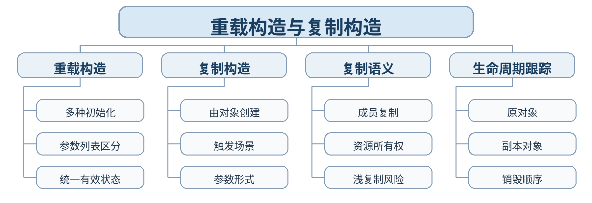

### 教学目标

**知识目标：**
- （1）掌握构造函数重载与复制构造函数的基本形式和触发场景。
- （2）理解默认成员复制与资源型成员可能引发的浅复制问题。
**能力目标：**
- （1）能设计多种合法初始化方式并识别复制构造调用。
- （2）能通过地址/日志跟踪原对象与副本对象的状态和资源关系。
**价值目标：**
- （1）形成对“复制对象意味着复制什么责任”的资源所有权意识。
- （2）养成不依赖表面结果、主动检查对象内部关系的调试习惯。

### 课程思政

- （1）强调复制数据不能模糊责任归属，通过资源地址和运行证据培养严谨核验意识，避免“看起来能运行”掩盖潜在质量问题。
- （2）本课要求学生保留真实源代码、运行/调试记录和测试结论，以可复现证据支撑程序行为判断，落实规范、诚信和质量责任。

### 专创融合 / / 双创融合

以数据缓冲对象为例理解可复制软件组件的资源语义，为后续容器、数据结构和设备数据对象设计打基础。

### 教学重难点

教学重点：重载构造；复制构造；复制触发场景。
教学难点：具有动态资源的对象复制时，成员复制与资源独立性的区别。

### 教学方法

任务驱动法、概念建模法、演示法、上机实践法、代码对比法、断点/日志调试法、同伴互审

### 教学用具

电脑、投影仪、多媒体课件、教材、Visual Studio Code（VS Code）、C++ 编译器、终端/调试器、示例代码

### 教学设计

课前任务 → 互动导入（15 min）→ 传授新知与上机训练（70 min）→ 过关检测（10 min）→ 课堂小结（3 min）→ 作业布置（1 min）→ 考勤（1 min）

### 教学过程

#### 课前任务

【教师】课前发布本课主题“重载构造与复制构造”及教材对应内容，给出一个最小代码/设计问题，不提前给出完整答案。
- 1. 阅读教材对应内容，圈出 3—5 个核心术语；
- 2. 预读课堂代码或类图，写下至少 1 个预测和 1 个疑问；
- 3. 检查 VS Code 与 C++ 编译环境，确保能够编译运行上一课最小程序。
【学生】完成阅读、环境检查和预测记录，带着问题进入课堂。

**设计意图：** 通过课前阅读、环境检查和一个最小问题建立先备认知，避免把课堂时间消耗在环境故障上，并让学生带着真实疑问进入学习。

#### 互动导入 / （15 min） / / 传授新知与上机训练 / （70 min）

【互动导入 15 min】
【教师】给出一个 Buffer 类，复制后两个对象指向同一动态数组；学生先预测修改副本是否影响原对象，再运行验证。
【学生】先运行/预测/观察，记录第一判断和证据，不先接受教师结论。
【传授新知与上机训练 70 min】
- 一、最小讲解与示范（约20 min）
【教师】重载构造函数为对象提供多种合法创建方式。
【教师】复制构造的典型触发：用同类对象初始化新对象、按值传递等。
【教师】默认成员复制与资源成员之间的风险，理解为什么需要自定义复制构造。
- 二、学生独立产出（约35 min）
【学生】实现 SampleBuffer 类：动态保存若干采样值，提供普通构造和复制构造；复制后修改副本不影响原对象。
【教师】巡回检查设计边界、编译错误、对象状态与接口使用，只提供分层提示，不替学生完成程序。
- 三、调试、互审与证据固化（约15 min）
【学生】记录原对象/副本数组地址和数据；测试复制前后独立性以及销毁顺序。
【形成证据】本课至少保存：源代码 + 编译/运行结果 + 测试/调试记录；对应 目标 1.2，2.2，3.2。
【评价映射】课堂参与、随堂练习与代码规范纳入平时表现（20%）；本单元代码成果为 课程作业2（课程作业权重中的30%） 的过程证据。

**设计意图：** 采用“先运行/预测 → 最小讲解与示范 → 独立编程 → 调试互审 → 证据固化”的上机闭环。把抽象语法/概念落到可运行程序，通过独立产出和测试证据检验真实学习，而不是只听懂讲解。

#### 过关检测 / （10 min）

【教师】组织当堂检测：
- 1. 赋值与复制构造是否完全相同？
- 2. 什么情况下会调用复制构造？
- 3. 动态资源对象为什么容易出现浅复制问题？
【学生】独立作答或运行验证；【教师】根据错误类型讲解，并要求学生说明判断依据。

**设计意图：** 用概念题、边界题和运行验证即时检测关键知识，暴露易错点；要求说明依据，避免只记答案。

#### 课堂小结 / （3 min）

【教师】回到本课知识脉络图，用“概念—关系—应用—边界”总结“重载构造与复制构造”。
重点再次强调：重载构造；复制构造；复制触发场景。
【学生】用 1 分钟写出“本课最重要的一条设计规则 + 一个最容易出错的边界”。

**设计意图：** 回到知识脉络图压缩本课信息，帮助学生形成层级结构，并把“规则—边界—应用”连接到下一次课。

#### 作业布置 / （1 min）

【教师】布置课后任务：完成 SampleBuffer 的复制构造并撰写“原对象—副本—资源地址”对比说明。
【学生】按课程文件命名规范整理源代码、测试记录和必要说明，课后提交。

**设计意图：** 通过整理源代码、测试记录和说明，固化课堂成果，形成可复查、可复现的过程性学习证据。

#### 考勤 / （1 min）

【教师】利用学校/课程实际使用的平台进行签到。
【学生】按课程要求完成签到。

**设计意图：** 保留学校模板中的考勤环节，用于教学秩序管理；不在教案中预填任何出勤事实。

#### 课后 / 教学反思

【课后填写，不预填事实】
- 1. 教学流程：记录 100 min 各环节实际用时及需要调整的位置；
- 2. 教学内容：重点记录“具有动态资源的对象复制时，成员复制与资源独立性的区别。”的真实掌握证据、常见错误和补救措施；
- 3. 学生参与：仅依据课堂实际记录填写独立完成、提问、互审、调试等情况，不补写推测性结论；
- 4. 评价证据：检查本课源代码、测试/调试记录是否完整，记录缺项及下一次课的反馈安排；
- 5. 思政/专创融合：仅记录课堂实际发生的有效案例和学生反馈。

**设计意图：** 反思必须基于真实课堂证据。课前仅提供填写框架，避免把预测或模板化表述误写成已发生的学生表现。

#### 本章节 / 参考文献

[1] 戴波.《C与C++程序设计（第二版）》[M]. 北京：北京大学出版社，2025.
[2] 课程配套 C/C++ 对比程序、类设计案例、调试案例及 VS Code C++ 编译调试资料。

---

## 第08次课 对象数组、对象指针与类类型传参

- **章节/单元**：第一单元 类与对象及封装
- **周次**：按实际课表填写
- **课时安排**：2课时（100 min）

### 知识脉络图

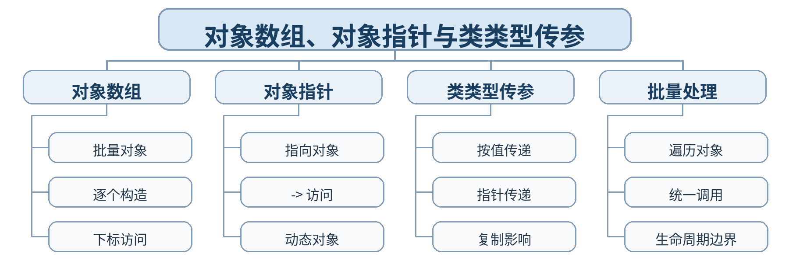

### 教学目标

**知识目标：**
- （1）掌握对象数组、对象指针和 -> 成员访问。
- （2）理解类类型作为函数参数时对象复制和生命周期的影响。
**能力目标：**
- （1）能用对象数组或对象指针批量管理多个设备对象。
- （2）能根据是否需要复制、修改或共享对象选择合适参数形式。
**价值目标：**
- （1）形成关注参数传递成本和对象责任边界的工程意识。
- （2）养成批量处理时检查下标和指针有效性的习惯。

### 课程思政

- （1）通过批量对象管理强调规范编号、边界检查和数据一致性，培养规模化处理时仍保持严谨细致的工程作风。
- （2）本课要求学生保留真实源代码、运行/调试记录和测试结论，以可复现证据支撑程序行为判断，落实规范、诚信和质量责任。

### 专创融合 / / 双创融合

把对象数组/指针用于设备清单与批量状态分析，贴近制造现场多设备管理软件的数据组织方式。

### 教学重难点

教学重点：对象数组；对象指针；类类型作为参数。
教学难点：按值传递引发的对象复制及指针/对象生命周期之间的关系。

### 教学方法

任务驱动法、概念建模法、演示法、上机实践法、代码对比法、断点/日志调试法、同伴互审

### 教学用具

电脑、投影仪、多媒体课件、教材、Visual Studio Code（VS Code）、C++ 编译器、终端/调试器、示例代码

### 教学设计

课前任务 → 互动导入（15 min）→ 传授新知与上机训练（70 min）→ 过关检测（10 min）→ 课堂小结（3 min）→ 作业布置（1 min）→ 考勤（1 min）

### 教学过程

#### 课前任务

【教师】课前发布本课主题“对象数组、对象指针与类类型传参”及教材对应内容，给出一个最小代码/设计问题，不提前给出完整答案。
- 1. 阅读教材对应内容，圈出 3—5 个核心术语；
- 2. 预读课堂代码或类图，写下至少 1 个预测和 1 个疑问；
- 3. 检查 VS Code 与 C++ 编译环境，确保能够编译运行上一课最小程序。
【学生】完成阅读、环境检查和预测记录，带着问题进入课堂。

**设计意图：** 通过课前阅读、环境检查和一个最小问题建立先备认知，避免把课堂时间消耗在环境故障上，并让学生带着真实疑问进入学习。

#### 互动导入 / （15 min） / / 传授新知与上机训练 / （70 min）

【互动导入 15 min】
【教师】给出“函数接收 Device 对象”与“函数接收 Device*”两个版本，学生预测构造/复制日志差异。
【学生】先运行/预测/观察，记录第一判断和证据，不先接受教师结论。
【传授新知与上机训练 70 min】
- 一、最小讲解与示范（约20 min）
【教师】对象数组中每个元素都是完整对象并发生构造。
【教师】对象指针的定义、指向和 -> 访问；动态对象与 delete。
【教师】类类型按值传递可能调用复制构造，参数形式影响性能和语义。
- 二、学生独立产出（约35 min）
【学生】建立 5 个 Device 对象的数组，按温度排序/筛选并统计运行设备；再用对象指针实现同一查询。
【教师】巡回检查设计边界、编译错误、对象状态与接口使用，只提供分层提示，不替学生完成程序。
- 三、调试、互审与证据固化（约15 min）
【学生】覆盖数组首尾、空指针防护和按值传参的复制日志；比较两种实现。
【形成证据】本课至少保存：源代码 + 编译/运行结果 + 测试/调试记录；对应 目标 1.2，2.2，3.2。
【评价映射】课堂参与、随堂练习与代码规范纳入平时表现（20%）；本单元代码成果为 课程作业2（课程作业权重中的30%） 的过程证据。

**设计意图：** 采用“先运行/预测 → 最小讲解与示范 → 独立编程 → 调试互审 → 证据固化”的上机闭环。把抽象语法/概念落到可运行程序，通过独立产出和测试证据检验真实学习，而不是只听懂讲解。

#### 过关检测 / （10 min）

【教师】组织当堂检测：
- 1. 对象数组元素何时构造？
- 2. p->x 与 (*p).x 是否等价？
- 3. 按值传递类对象为什么可能触发复制构造？
【学生】独立作答或运行验证；【教师】根据错误类型讲解，并要求学生说明判断依据。

**设计意图：** 用概念题、边界题和运行验证即时检测关键知识，暴露易错点；要求说明依据，避免只记答案。

#### 课堂小结 / （3 min）

【教师】回到本课知识脉络图，用“概念—关系—应用—边界”总结“对象数组、对象指针与类类型传参”。
重点再次强调：对象数组；对象指针；类类型作为参数。
【学生】用 1 分钟写出“本课最重要的一条设计规则 + 一个最容易出错的边界”。

**设计意图：** 回到知识脉络图压缩本课信息，帮助学生形成层级结构，并把“规则—边界—应用”连接到下一次课。

#### 作业布置 / （1 min）

【教师】布置课后任务：用对象数组实现“生产单元设备清单”，增加一个接收类对象参数的查询函数并记录复制行为。
【学生】按课程文件命名规范整理源代码、测试记录和必要说明，课后提交。

**设计意图：** 通过整理源代码、测试记录和说明，固化课堂成果，形成可复查、可复现的过程性学习证据。

#### 考勤 / （1 min）

【教师】利用学校/课程实际使用的平台进行签到。
【学生】按课程要求完成签到。

**设计意图：** 保留学校模板中的考勤环节，用于教学秩序管理；不在教案中预填任何出勤事实。

#### 课后 / 教学反思

【课后填写，不预填事实】
- 1. 教学流程：记录 100 min 各环节实际用时及需要调整的位置；
- 2. 教学内容：重点记录“按值传递引发的对象复制及指针/对象生命周期之间的关系。”的真实掌握证据、常见错误和补救措施；
- 3. 学生参与：仅依据课堂实际记录填写独立完成、提问、互审、调试等情况，不补写推测性结论；
- 4. 评价证据：检查本课源代码、测试/调试记录是否完整，记录缺项及下一次课的反馈安排；
- 5. 思政/专创融合：仅记录课堂实际发生的有效案例和学生反馈。

**设计意图：** 反思必须基于真实课堂证据。课前仅提供填写框架，避免把预测或模板化表述误写成已发生的学生表现。

#### 本章节 / 参考文献

[1] 戴波.《C与C++程序设计（第二版）》[M]. 北京：北京大学出版社，2025.
[2] 课程配套 C/C++ 对比程序、类设计案例、调试案例及 VS Code C++ 编译调试资料。

---

## 第09次课 this 指针、静态成员与友元

- **章节/单元**：第一单元 类与对象及封装
- **周次**：按实际课表填写
- **课时安排**：2课时（100 min）

### 知识脉络图

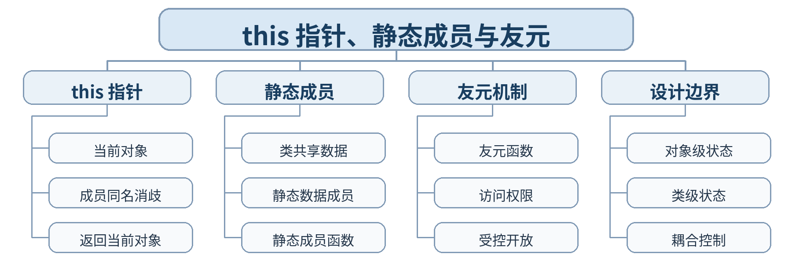

### 教学目标

**知识目标：**
- （1）掌握 this 指针、静态数据成员/成员函数和友元的基本用法。
- （2）理解对象级状态、类级共享状态和受控访问之间的区别。
**能力目标：**
- （1）能用 static 统计对象数量或共享配置。
- （2）能在确有必要时使用友元，并解释其对封装边界的影响。
**价值目标：**
- （1）形成“最小权限、受控开放”的接口意识。
- （2）理解共享状态会扩大影响范围，需要更严格的责任管理。

### 课程思政

- （1）用静态共享状态和友元讨论权限边界，强调共享资源与特权访问必须可解释、可约束，培养最小权限和责任追踪意识。
- （2）本课要求学生保留真实源代码、运行/调试记录和测试结论，以可复现证据支撑程序行为判断，落实规范、诚信和质量责任。

### 专创融合 / / 双创融合

通过类级统计、统一阈值与诊断接口，连接到设备管理平台的全局配置与对象实例管理场景。

### 教学重难点

教学重点：this 指针；静态成员；友元。
教学难点：何时属于对象自身、何时属于整个类，以及友元对封装边界的影响。

### 教学方法

任务驱动法、概念建模法、演示法、上机实践法、代码对比法、断点/日志调试法、同伴互审

### 教学用具

电脑、投影仪、多媒体课件、教材、Visual Studio Code（VS Code）、C++ 编译器、终端/调试器、示例代码

### 教学设计

课前任务 → 互动导入（15 min）→ 传授新知与上机训练（70 min）→ 过关检测（10 min）→ 课堂小结（3 min）→ 作业布置（1 min）→ 考勤（1 min）

### 教学过程

#### 课前任务

【教师】课前发布本课主题“this 指针、静态成员与友元”及教材对应内容，给出一个最小代码/设计问题，不提前给出完整答案。
- 1. 阅读教材对应内容，圈出 3—5 个核心术语；
- 2. 预读课堂代码或类图，写下至少 1 个预测和 1 个疑问；
- 3. 检查 VS Code 与 C++ 编译环境，确保能够编译运行上一课最小程序。
【学生】完成阅读、环境检查和预测记录，带着问题进入课堂。

**设计意图：** 通过课前阅读、环境检查和一个最小问题建立先备认知，避免把课堂时间消耗在环境故障上，并让学生带着真实疑问进入学习。

#### 互动导入 / （15 min） / / 传授新知与上机训练 / （70 min）

【互动导入 15 min】
【教师】给出两个对象并让成员函数返回 *this，同时用 static 统计实例数量；再尝试用普通外部函数访问 private 成员。
【学生】先运行/预测/观察，记录第一判断和证据，不先接受教师结论。
【传授新知与上机训练 70 min】
- 一、最小讲解与示范（约20 min）
【教师】this 指针指向当前调用对象，用于成员同名消歧和返回当前对象。
【教师】静态成员属于类级共享状态，静态成员函数不依赖具体对象。
【教师】友元允许受控访问 private 成员，但会增加耦合，需谨慎使用。
- 二、学生独立产出（约35 min）
【学生】实现 Device 类：this 用于链式设置；static 统计对象数量；友元函数生成只读诊断摘要。
【教师】巡回检查设计边界、编译错误、对象状态与接口使用，只提供分层提示，不替学生完成程序。
- 三、调试、互审与证据固化（约15 min）
【学生】创建/销毁多个对象观察 static 计数；验证友元可访问私有成员而普通函数不可访问。
【形成证据】本课至少保存：源代码 + 编译/运行结果 + 测试/调试记录；对应 目标 1.2，2.2，3.2。
【评价映射】课堂参与、随堂练习与代码规范纳入平时表现（20%）；本单元代码成果为 课程作业2（课程作业权重中的30%） 的过程证据。

**设计意图：** 采用“先运行/预测 → 最小讲解与示范 → 独立编程 → 调试互审 → 证据固化”的上机闭环。把抽象语法/概念落到可运行程序，通过独立产出和测试证据检验真实学习，而不是只听懂讲解。

#### 过关检测 / （10 min）

【教师】组织当堂检测：
- 1. static 数据成员属于某个具体对象吗？
- 2. 静态成员函数能否直接使用非静态成员？
- 3. 友元为什么既有便利又可能削弱封装？
【学生】独立作答或运行验证；【教师】根据错误类型讲解，并要求学生说明判断依据。

**设计意图：** 用概念题、边界题和运行验证即时检测关键知识，暴露易错点；要求说明依据，避免只记答案。

#### 课堂小结 / （3 min）

【教师】回到本课知识脉络图，用“概念—关系—应用—边界”总结“this 指针、静态成员与友元”。
重点再次强调：this 指针；静态成员；友元。
【学生】用 1 分钟写出“本课最重要的一条设计规则 + 一个最容易出错的边界”。

**设计意图：** 回到知识脉络图压缩本课信息，帮助学生形成层级结构，并把“规则—边界—应用”连接到下一次课。

#### 作业布置 / （1 min）

【教师】布置课后任务：为 Device 增加类级报警阈值和对象级当前值，写一段说明区分两类状态。
【学生】按课程文件命名规范整理源代码、测试记录和必要说明，课后提交。

**设计意图：** 通过整理源代码、测试记录和说明，固化课堂成果，形成可复查、可复现的过程性学习证据。

#### 考勤 / （1 min）

【教师】利用学校/课程实际使用的平台进行签到。
【学生】按课程要求完成签到。

**设计意图：** 保留学校模板中的考勤环节，用于教学秩序管理；不在教案中预填任何出勤事实。

#### 课后 / 教学反思

【课后填写，不预填事实】
- 1. 教学流程：记录 100 min 各环节实际用时及需要调整的位置；
- 2. 教学内容：重点记录“何时属于对象自身、何时属于整个类，以及友元对封装边界的影响。”的真实掌握证据、常见错误和补救措施；
- 3. 学生参与：仅依据课堂实际记录填写独立完成、提问、互审、调试等情况，不补写推测性结论；
- 4. 评价证据：检查本课源代码、测试/调试记录是否完整，记录缺项及下一次课的反馈安排；
- 5. 思政/专创融合：仅记录课堂实际发生的有效案例和学生反馈。

**设计意图：** 反思必须基于真实课堂证据。课前仅提供填写框架，避免把预测或模板化表述误写成已发生的学生表现。

#### 本章节 / 参考文献

[1] 戴波.《C与C++程序设计（第二版）》[M]. 北京：北京大学出版社，2025.
[2] 课程配套 C/C++ 对比程序、类设计案例、调试案例及 VS Code C++ 编译调试资料。

---

## 第10次课 类的组合、初始化释放顺序与常对象

- **章节/单元**：第一单元 类与对象及封装
- **周次**：按实际课表填写
- **课时安排**：2课时（100 min）

### 知识脉络图

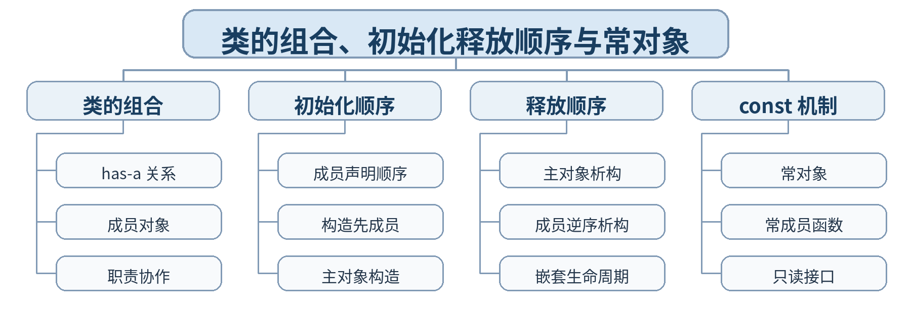

### 教学目标

**知识目标：**
- （1）掌握类的组合、成员对象构造/析构顺序、常对象与常成员函数。
- （2）理解组合关系和嵌套对象生命周期。
**能力目标：**
- （1）能用组合表达“设备包含传感器/控制器”的 has-a 关系。
- （2）能为只读操作提供 const 接口并通过编译检查保持状态不变。
**价值目标：**
- （1）形成根据真实对象关系选择组合的建模意识。
- （2）养成区分读操作与写操作、保护对象状态的接口规范习惯。

### 课程思政

- （1）通过组合与 const 机制说明系统协作要职责清晰、只读接口要真正只读，培养遵循契约、保护状态和减少副作用的工程素养。
- （2）本课要求学生保留真实源代码、运行/调试记录和测试结论，以可复现证据支撑程序行为判断，落实规范、诚信和质量责任。

### 专创融合 / / 双创融合

以生产单元组合传感器与控制器的方式训练对象协作建模，为智能制造软件中的组件化设计奠定基础。

### 教学重难点

教学重点：类的组合；初始化与释放顺序；常对象与常成员。
教学难点：成员对象的真实构造顺序与初始化列表书写顺序之间的区别。

### 教学方法

任务驱动法、概念建模法、演示法、上机实践法、代码对比法、断点/日志调试法、同伴互审

### 教学用具

电脑、投影仪、多媒体课件、教材、Visual Studio Code（VS Code）、C++ 编译器、终端/调试器、示例代码

### 教学设计

课前任务 → 互动导入（15 min）→ 传授新知与上机训练（70 min）→ 过关检测（10 min）→ 课堂小结（3 min）→ 作业布置（1 min）→ 考勤（1 min）

### 教学过程

#### 课前任务

【教师】课前发布本课主题“类的组合、初始化释放顺序与常对象”及教材对应内容，给出一个最小代码/设计问题，不提前给出完整答案。
- 1. 阅读教材对应内容，圈出 3—5 个核心术语；
- 2. 预读课堂代码或类图，写下至少 1 个预测和 1 个疑问；
- 3. 检查 VS Code 与 C++ 编译环境，确保能够编译运行上一课最小程序。
【学生】完成阅读、环境检查和预测记录，带着问题进入课堂。

**设计意图：** 通过课前阅读、环境检查和一个最小问题建立先备认知，避免把课堂时间消耗在环境故障上，并让学生带着真实疑问进入学习。

#### 互动导入 / （15 min） / / 传授新知与上机训练 / （70 min）

【互动导入 15 min】
【教师】给出 Machine 包含 Sensor 和 Controller 的组合类，故意调换初始化列表顺序，学生先预测实际构造输出。
【学生】先运行/预测/观察，记录第一判断和证据，不先接受教师结论。
【传授新知与上机训练 70 min】
- 一、最小讲解与示范（约20 min）
【教师】组合用于表达 has-a 关系，成员对象承担独立职责。
【教师】成员对象按声明顺序构造、逆序析构。
【教师】常对象只能调用保证不修改状态的常成员函数。
- 二、学生独立产出（约35 min）
【学生】设计 ProductionCell 类，组合 Sensor 与 Controller；打印构造/析构轨迹；为 status()、read() 设计 const 成员函数。
【教师】巡回检查设计边界、编译错误、对象状态与接口使用，只提供分层提示，不替学生完成程序。
- 三、调试、互审与证据固化（约15 min）
【学生】改变初始化列表顺序观察实际顺序；用 const 对象调用读/写接口，记录编译通过与失败情况。
【形成证据】本课至少保存：源代码 + 编译/运行结果 + 测试/调试记录；对应 目标 1.2，2.2，3.2。
【评价映射】课堂参与、随堂练习与代码规范纳入平时表现（20%）；本单元代码成果为 课程作业2（课程作业权重中的30%） 的过程证据。

**设计意图：** 采用“先运行/预测 → 最小讲解与示范 → 独立编程 → 调试互审 → 证据固化”的上机闭环。把抽象语法/概念落到可运行程序，通过独立产出和测试证据检验真实学习，而不是只听懂讲解。

#### 过关检测 / （10 min）

【教师】组织当堂检测：
- 1. 组合适合表达什么关系？
- 2. 成员对象按初始化列表顺序还是声明顺序构造？
- 3. 为什么 const 对象需要 const 成员函数？
【学生】独立作答或运行验证；【教师】根据错误类型讲解，并要求学生说明判断依据。

**设计意图：** 用概念题、边界题和运行验证即时检测关键知识，暴露易错点；要求说明依据，避免只记答案。

#### 课堂小结 / （3 min）

【教师】回到本课知识脉络图，用“概念—关系—应用—边界”总结“类的组合、初始化释放顺序与常对象”。
重点再次强调：类的组合；初始化与释放顺序；常对象与常成员。
【学生】用 1 分钟写出“本课最重要的一条设计规则 + 一个最容易出错的边界”。

**设计意图：** 回到知识脉络图压缩本课信息，帮助学生形成层级结构，并把“规则—边界—应用”连接到下一次课。

#### 作业布置 / （1 min）

【教师】布置课后任务：完善 ProductionCell，增加只读摘要接口和一个被禁止的修改操作示例，说明编译器如何保护状态。
【学生】按课程文件命名规范整理源代码、测试记录和必要说明，课后提交。

**设计意图：** 通过整理源代码、测试记录和说明，固化课堂成果，形成可复查、可复现的过程性学习证据。

#### 考勤 / （1 min）

【教师】利用学校/课程实际使用的平台进行签到。
【学生】按课程要求完成签到。

**设计意图：** 保留学校模板中的考勤环节，用于教学秩序管理；不在教案中预填任何出勤事实。

#### 课后 / 教学反思

【课后填写，不预填事实】
- 1. 教学流程：记录 100 min 各环节实际用时及需要调整的位置；
- 2. 教学内容：重点记录“成员对象的真实构造顺序与初始化列表书写顺序之间的区别。”的真实掌握证据、常见错误和补救措施；
- 3. 学生参与：仅依据课堂实际记录填写独立完成、提问、互审、调试等情况，不补写推测性结论；
- 4. 评价证据：检查本课源代码、测试/调试记录是否完整，记录缺项及下一次课的反馈安排；
- 5. 思政/专创融合：仅记录课堂实际发生的有效案例和学生反馈。

**设计意图：** 反思必须基于真实课堂证据。课前仅提供填写框架，避免把预测或模板化表述误写成已发生的学生表现。

#### 本章节 / 参考文献

[1] 戴波.《C与C++程序设计（第二版）》[M]. 北京：北京大学出版社，2025.
[2] 课程配套 C/C++ 对比程序、类设计案例、调试案例及 VS Code C++ 编译调试资料。

---

## 第11次课 类与对象综合设计：封装、生命周期与组合

- **章节/单元**：第一单元 类与对象及封装
- **周次**：按实际课表填写
- **课时安排**：2课时（100 min）

### 知识脉络图

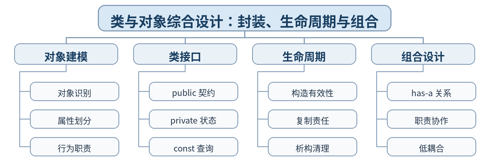

### 教学目标

**知识目标：**
- （1）系统梳理类、对象、访问控制、构造析构、复制、static、友元、组合和 const 等机制。
- （2）理解封装设计的核心是职责、状态和生命周期的一致性。
**能力目标：**
- （1）能从需求独立完成 2—3 个类的职责划分和组合设计。
- （2）能通过状态测试、复制测试和生命周期日志验证类设计。
**价值目标：**
- （1）形成以对象职责和接口契约组织程序的工程设计意识。
- （2）养成重构重复代码、保护状态和保留测试证据的习惯。

### 课程思政

- （1）强调软件设计不是堆叠语法，而是对职责和状态负责；通过类契约和测试记录培养规范、诚信和可维护的软件工程意识。
- （2）本课要求学生保留真实源代码、运行/调试记录和测试结论，以可复现证据支撑程序行为判断，落实规范、诚信和质量责任。

### 专创融合 / / 双创融合

通过完整小系统把对象建模转化为可运行软件原型，训练从需求到类设计的产品化思维。

### 教学重难点

教学重点：类职责划分；封装；生命周期；组合；状态一致性。
教学难点：在多个 C++ 机制中选择必要机制，避免为“炫技”增加不必要复杂度。

### 教学方法

任务驱动法、综合上机实践法、巡回指导法、测试驱动评价、代码讲评与同伴复核

### 教学用具

电脑、投影仪、多媒体课件、教材、Visual Studio Code（VS Code）、C++ 编译器、终端/调试器、示例代码、课程作业任务书、测试记录表

### 教学设计

课前任务 → 互动导入（15 min）→ 传授新知与上机训练（70 min）→ 过关检测（10 min）→ 课堂小结（3 min）→ 作业布置（1 min）→ 考勤（1 min）

### 教学过程

#### 课前任务

【教师】课前发布本课主题“类与对象综合设计：封装、生命周期与组合”及教材对应内容，给出一个最小代码/设计问题，不提前给出完整答案。
- 1. 阅读教材对应内容，圈出 3—5 个核心术语；
- 2. 预读课堂代码或类图，写下至少 1 个预测和 1 个疑问；
- 3. 检查 VS Code 与 C++ 编译环境，确保能够编译运行上一课最小程序。
【学生】完成阅读、环境检查和预测记录，带着问题进入课堂。

**设计意图：** 通过课前阅读、环境检查和一个最小问题建立先备认知，避免把课堂时间消耗在环境故障上，并让学生带着真实疑问进入学习。

#### 互动导入 / （15 min） / / 传授新知与上机训练 / （70 min）

【互动导入 15 min】
【教师】发布一个“设备巡检记录系统”需求，学生先用 10 分钟完成对象—属性—行为—关系草图，再与教师示例对比。
【学生】先运行/预测/观察，记录第一判断和证据，不先接受教师结论。
【传授新知与上机训练 70 min】
- 一、最小讲解与示范（约20 min）
【教师】从需求抽取对象、职责和类之间关系。
【教师】接口最小化、内部状态保护、构造后有效与 const 查询。
【教师】组合、static、复制等机制在真实需求中的选择依据。
- 二、学生独立产出（约35 min）
【学生】完成课程作业2：实现设备巡检记录系统（至少 2 个类，含组合或静态成员之一），支持新增记录、状态查询和汇总。
【教师】巡回检查设计边界、编译错误、对象状态与接口使用，只提供分层提示，不替学生完成程序。
- 三、调试、互审与证据固化（约15 min）
【学生】覆盖合法创建、非法状态、对象复制、组合构造顺序和只读查询；同伴按接口文档调用并给出反馈。
【形成证据】本课至少保存：源代码 + 编译/运行结果 + 测试/调试记录；对应 目标 1.2，2.2，3.2。
【评价映射】日常证据纳入平时表现（20%）；课程作业2（课程作业权重中的30%）。

**设计意图：** 采用“先运行/预测 → 最小讲解与示范 → 独立编程 → 调试互审 → 证据固化”的上机闭环。把抽象语法/概念落到可运行程序，通过独立产出和测试证据检验真实学习，而不是只听懂讲解。

#### 过关检测 / （10 min）

【教师】组织当堂检测：
- 1. 如何判断某个数据应成为 private 成员？
- 2. 组合和全局变量相比有什么优势？
- 3. 一个类的构造函数应保证哪些基本条件？
【学生】独立作答或运行验证；【教师】根据错误类型讲解，并要求学生说明判断依据。

**设计意图：** 用概念题、边界题和运行验证即时检测关键知识，暴露易错点；要求说明依据，避免只记答案。

#### 课堂小结 / （3 min）

【教师】回到本课知识脉络图，用“概念—关系—应用—边界”总结“类与对象综合设计：封装、生命周期与组合”。
重点再次强调：类职责划分；封装；生命周期；组合；状态一致性。
【学生】用 1 分钟写出“本课最重要的一条设计规则 + 一个最容易出错的边界”。

**设计意图：** 回到知识脉络图压缩本课信息，帮助学生形成层级结构，并把“规则—边界—应用”连接到下一次课。

#### 作业布置 / （1 min）

【教师】布置课后任务：提交课程作业2：类关系草图、源代码、测试表、运行结果和 200 字设计说明。
【学生】按课程文件命名规范整理源代码、测试记录和必要说明，课后提交。

**设计意图：** 通过整理源代码、测试记录和说明，固化课堂成果，形成可复查、可复现的过程性学习证据。

#### 考勤 / （1 min）

【教师】利用学校/课程实际使用的平台进行签到。
【学生】按课程要求完成签到。

**设计意图：** 保留学校模板中的考勤环节，用于教学秩序管理；不在教案中预填任何出勤事实。

#### 课后 / 教学反思

【课后填写，不预填事实】
- 1. 教学流程：记录 100 min 各环节实际用时及需要调整的位置；
- 2. 教学内容：重点记录“在多个 C++ 机制中选择必要机制，避免为“炫技”增加不必要复杂度。”的真实掌握证据、常见错误和补救措施；
- 3. 学生参与：仅依据课堂实际记录填写独立完成、提问、互审、调试等情况，不补写推测性结论；
- 4. 评价证据：检查本课源代码、测试/调试记录是否完整，记录缺项及下一次课的反馈安排；
- 5. 思政/专创融合：仅记录课堂实际发生的有效案例和学生反馈。

**设计意图：** 反思必须基于真实课堂证据。课前仅提供填写框架，避免把预测或模板化表述误写成已发生的学生表现。

#### 本章节 / 参考文献

[1] 戴波.《C与C++程序设计（第二版）》[M]. 北京：北京大学出版社，2025.
[2] 课程配套 C/C++ 对比程序、类设计案例、调试案例及 VS Code C++ 编译调试资料。

---

## 第12次课 派生类概念、公有继承与访问规则

- **章节/单元**：第二单元 继承、派生与类层次结构
- **周次**：按实际课表填写
- **课时安排**：2课时（100 min）

### 知识脉络图

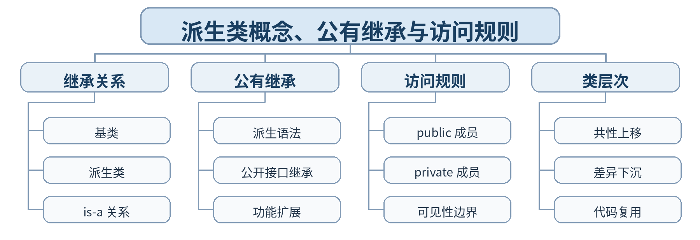

### 教学目标

**知识目标：**
- （1）掌握派生类、公有继承的基本语法与访问规则。
- （2）理解 is-a 关系、类层次和代码复用的基本思想。
**能力目标：**
- （1）能从多个相似类中提取公共属性/行为形成基类。
- （2）能正确判断派生类和外部代码对基类成员的访问权限。
**价值目标：**
- （1）形成“先识别真实关系，再谈代码复用”的建模意识。
- （2）避免为减少几行代码而建立错误继承关系。

### 课程思政

- （1）通过“合理复用而非机械复制”强调劳动成果复用、规则约束和系统化设计，培养尊重已有接口并基于本质关系建模的工程意识。
- （2）本课要求学生保留真实源代码、运行/调试记录和测试结论，以可复现证据支撑程序行为判断，落实规范、诚信和质量责任。

### 专创融合 / / 双创融合

将设备族的公共特征抽象为基类，贴近工业软件中设备驱动、协议对象和组件类型体系的复用需求。

### 教学重难点

教学重点：基类/派生类；公有继承；访问规则。
教学难点：继承表达的是类型关系，而不仅是代码复制；private 成员的继承与直接访问区别。

### 教学方法

任务驱动法、概念建模法、演示法、上机实践法、代码对比法、断点/日志调试法、同伴互审

### 教学用具

电脑、投影仪、多媒体课件、教材、Visual Studio Code（VS Code）、C++ 编译器、终端/调试器、示例代码

### 教学设计

课前任务 → 互动导入（15 min）→ 传授新知与上机训练（70 min）→ 过关检测（10 min）→ 课堂小结（3 min）→ 作业布置（1 min）→ 考勤（1 min）

### 教学过程

#### 课前任务

【教师】课前发布本课主题“派生类概念、公有继承与访问规则”及教材对应内容，给出一个最小代码/设计问题，不提前给出完整答案。
- 1. 阅读教材对应内容，圈出 3—5 个核心术语；
- 2. 预读课堂代码或类图，写下至少 1 个预测和 1 个疑问；
- 3. 检查 VS Code 与 C++ 编译环境，确保能够编译运行上一课最小程序。
【学生】完成阅读、环境检查和预测记录，带着问题进入课堂。

**设计意图：** 通过课前阅读、环境检查和一个最小问题建立先备认知，避免把课堂时间消耗在环境故障上，并让学生带着真实疑问进入学习。

#### 互动导入 / （15 min） / / 传授新知与上机训练 / （70 min）

【互动导入 15 min】
【教师】展示 SensorDevice 与 ActuatorDevice 两个包含大量重复字段的类，学生先找共性并尝试抽取 Device 基类。
【学生】先运行/预测/观察，记录第一判断和证据，不先接受教师结论。
【传授新知与上机训练 70 min】
- 一、最小讲解与示范（约20 min）
【教师】is-a 关系和基类/派生类层次。
【教师】public 继承保持基类 public 接口对外可用。
【教师】private 成员属于基类内部，派生类不能直接越过访问边界。
- 二、学生独立产出（约35 min）
【学生】建立 Device 基类，派生 SensorDevice 与 ActuatorDevice，复用编号和状态接口，各自增加专属行为。
【教师】巡回检查设计边界、编译错误、对象状态与接口使用，只提供分层提示，不替学生完成程序。
- 三、调试、互审与证据固化（约15 min）
【学生】编写访问矩阵：基类成员在派生类内部、派生对象外部分别是否可访问；运行验证。
【形成证据】本课至少保存：源代码 + 编译/运行结果 + 测试/调试记录；对应 目标 1.3，2.3，3.3。
【评价映射】课堂参与、随堂练习与代码规范纳入平时表现（20%）；本单元代码成果为 课程作业3（课程作业权重中的20%） 的过程证据。

**设计意图：** 采用“先运行/预测 → 最小讲解与示范 → 独立编程 → 调试互审 → 证据固化”的上机闭环。把抽象语法/概念落到可运行程序，通过独立产出和测试证据检验真实学习，而不是只听懂讲解。

#### 过关检测 / （10 min）

【教师】组织当堂检测：
- 1. 继承最适合表达 is-a 还是 has-a？
- 2. public 继承后基类 public 成员在派生类中的访问级别是什么？
- 3. 派生类能否直接访问基类 private 成员？
【学生】独立作答或运行验证；【教师】根据错误类型讲解，并要求学生说明判断依据。

**设计意图：** 用概念题、边界题和运行验证即时检测关键知识，暴露易错点；要求说明依据，避免只记答案。

#### 课堂小结 / （3 min）

【教师】回到本课知识脉络图，用“概念—关系—应用—边界”总结“派生类概念、公有继承与访问规则”。
重点再次强调：基类/派生类；公有继承；访问规则。
【学生】用 1 分钟写出“本课最重要的一条设计规则 + 一个最容易出错的边界”。

**设计意图：** 回到知识脉络图压缩本课信息，帮助学生形成层级结构，并把“规则—边界—应用”连接到下一次课。

#### 作业布置 / （1 min）

【教师】布置课后任务：重构一个存在重复代码的两类设备程序，提取基类并写出继承理由。
【学生】按课程文件命名规范整理源代码、测试记录和必要说明，课后提交。

**设计意图：** 通过整理源代码、测试记录和说明，固化课堂成果，形成可复查、可复现的过程性学习证据。

#### 考勤 / （1 min）

【教师】利用学校/课程实际使用的平台进行签到。
【学生】按课程要求完成签到。

**设计意图：** 保留学校模板中的考勤环节，用于教学秩序管理；不在教案中预填任何出勤事实。

#### 课后 / 教学反思

【课后填写，不预填事实】
- 1. 教学流程：记录 100 min 各环节实际用时及需要调整的位置；
- 2. 教学内容：重点记录“继承表达的是类型关系，而不仅是代码复制；private 成员的继承与直接访问区别。”的真实掌握证据、常见错误和补救措施；
- 3. 学生参与：仅依据课堂实际记录填写独立完成、提问、互审、调试等情况，不补写推测性结论；
- 4. 评价证据：检查本课源代码、测试/调试记录是否完整，记录缺项及下一次课的反馈安排；
- 5. 思政/专创融合：仅记录课堂实际发生的有效案例和学生反馈。

**设计意图：** 反思必须基于真实课堂证据。课前仅提供填写框架，避免把预测或模板化表述误写成已发生的学生表现。

#### 本章节 / 参考文献

[1] 戴波.《C与C++程序设计（第二版）》[M]. 北京：北京大学出版社，2025.
[2] 课程配套 C/C++ 对比程序、类设计案例、调试案例及 VS Code C++ 编译调试资料。

---

## 第13次课 派生类构造析构、protected 与同名成员

- **章节/单元**：第二单元 继承、派生与类层次结构
- **周次**：按实际课表填写
- **课时安排**：2课时（100 min）

### 知识脉络图

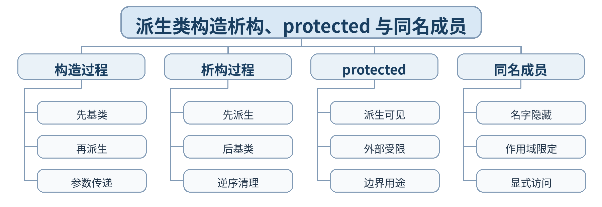

### 教学目标

**知识目标：**
- （1）掌握派生类构造/析构顺序、protected 成员和同名成员访问。
- （2）理解基类子对象在派生对象生命周期中的位置。
**能力目标：**
- （1）能正确设计派生类构造函数向基类传递初始化参数。
- （2）能用作用域限定解决同名成员访问并解释构造析构轨迹。
**价值目标：**
- （1）形成遵循初始化责任链和显式消除歧义的程序设计习惯。
- （2）理解继承层次越深越需要明确边界和可追踪行为。

### 课程思政

- （1）以构造析构顺序说明系统工作需要遵循依赖关系和先后责任，培养按规则执行、显式记录和避免隐含冲突的工程作风。
- （2）本课要求学生保留真实源代码、运行/调试记录和测试结论，以可复现证据支撑程序行为判断，落实规范、诚信和质量责任。

### 专创融合 / / 双创融合

通过构造责任链理解多层设备组件初始化，为驱动加载、插件初始化等分层软件结构建立基础认识。

### 教学重难点

教学重点：派生类构造/析构顺序；protected；同名成员。
教学难点：基类构造参数传递与同名成员隐藏的运行/编译行为。

### 教学方法

任务驱动法、概念建模法、演示法、上机实践法、代码对比法、断点/日志调试法、同伴互审

### 教学用具

电脑、投影仪、多媒体课件、教材、Visual Studio Code（VS Code）、C++ 编译器、终端/调试器、示例代码

### 教学设计

课前任务 → 互动导入（15 min）→ 传授新知与上机训练（70 min）→ 过关检测（10 min）→ 课堂小结（3 min）→ 作业布置（1 min）→ 考勤（1 min）

### 教学过程

#### 课前任务

【教师】课前发布本课主题“派生类构造析构、protected 与同名成员”及教材对应内容，给出一个最小代码/设计问题，不提前给出完整答案。
- 1. 阅读教材对应内容，圈出 3—5 个核心术语；
- 2. 预读课堂代码或类图，写下至少 1 个预测和 1 个疑问；
- 3. 检查 VS Code 与 C++ 编译环境，确保能够编译运行上一课最小程序。
【学生】完成阅读、环境检查和预测记录，带着问题进入课堂。

**设计意图：** 通过课前阅读、环境检查和一个最小问题建立先备认知，避免把课堂时间消耗在环境故障上，并让学生带着真实疑问进入学习。

#### 互动导入 / （15 min） / / 传授新知与上机训练 / （70 min）

【互动导入 15 min】
【教师】运行 Base/Derived 输出构造析构日志，同时在两层类中定义同名 show()，学生预测调用结果。
【学生】先运行/预测/观察，记录第一判断和证据，不先接受教师结论。
【传授新知与上机训练 70 min】
- 一、最小讲解与示范（约20 min）
【教师】派生对象先构造基类部分，再构造派生部分；析构逆序。
【教师】protected 为继承层次内部提供受控访问，外部仍不可直接访问。
【教师】同名成员会产生隐藏，可用作用域限定显式访问基类版本。
- 二、学生独立产出（约35 min）
【学生】为 Device/SensorDevice 增加带参构造、析构日志和同名 status()；在派生类中显式调用基类接口。
【教师】巡回检查设计边界、编译错误、对象状态与接口使用，只提供分层提示，不替学生完成程序。
- 三、调试、互审与证据固化（约15 min）
【学生】记录完整构造/析构序列；分别调用派生 status() 与 Device::status()；尝试外部访问 protected。
【形成证据】本课至少保存：源代码 + 编译/运行结果 + 测试/调试记录；对应 目标 1.3，2.3，3.3。
【评价映射】课堂参与、随堂练习与代码规范纳入平时表现（20%）；本单元代码成果为 课程作业3（课程作业权重中的20%） 的过程证据。

**设计意图：** 采用“先运行/预测 → 最小讲解与示范 → 独立编程 → 调试互审 → 证据固化”的上机闭环。把抽象语法/概念落到可运行程序，通过独立产出和测试证据检验真实学习，而不是只听懂讲解。

#### 过关检测 / （10 min）

【教师】组织当堂检测：
- 1. 派生对象构造时谁先构造？
- 2. protected 与 public 的主要区别是什么？
- 3. 如何显式访问被隐藏的基类同名成员？
【学生】独立作答或运行验证；【教师】根据错误类型讲解，并要求学生说明判断依据。

**设计意图：** 用概念题、边界题和运行验证即时检测关键知识，暴露易错点；要求说明依据，避免只记答案。

#### 课堂小结 / （3 min）

【教师】回到本课知识脉络图，用“概念—关系—应用—边界”总结“派生类构造析构、protected 与同名成员”。
重点再次强调：派生类构造/析构顺序；protected；同名成员。
【学生】用 1 分钟写出“本课最重要的一条设计规则 + 一个最容易出错的边界”。

**设计意图：** 回到知识脉络图压缩本课信息，帮助学生形成层级结构，并把“规则—边界—应用”连接到下一次课。

#### 作业布置 / （1 min）

【教师】布置课后任务：编写三层简单继承链，输出构造/析构顺序并说明每层初始化责任。
【学生】按课程文件命名规范整理源代码、测试记录和必要说明，课后提交。

**设计意图：** 通过整理源代码、测试记录和说明，固化课堂成果，形成可复查、可复现的过程性学习证据。

#### 考勤 / （1 min）

【教师】利用学校/课程实际使用的平台进行签到。
【学生】按课程要求完成签到。

**设计意图：** 保留学校模板中的考勤环节，用于教学秩序管理；不在教案中预填任何出勤事实。

#### 课后 / 教学反思

【课后填写，不预填事实】
- 1. 教学流程：记录 100 min 各环节实际用时及需要调整的位置；
- 2. 教学内容：重点记录“基类构造参数传递与同名成员隐藏的运行/编译行为。”的真实掌握证据、常见错误和补救措施；
- 3. 学生参与：仅依据课堂实际记录填写独立完成、提问、互审、调试等情况，不补写推测性结论；
- 4. 评价证据：检查本课源代码、测试/调试记录是否完整，记录缺项及下一次课的反馈安排；
- 5. 思政/专创融合：仅记录课堂实际发生的有效案例和学生反馈。

**设计意图：** 反思必须基于真实课堂证据。课前仅提供填写框架，避免把预测或模板化表述误写成已发生的学生表现。

#### 本章节 / 参考文献

[1] 戴波.《C与C++程序设计（第二版）》[M]. 北京：北京大学出版社，2025.
[2] 课程配套 C/C++ 对比程序、类设计案例、调试案例及 VS Code C++ 编译调试资料。

---

## 第14次课 公有/保护/私有继承与继承组合选择

- **章节/单元**：第二单元 继承、派生与类层次结构
- **周次**：按实际课表填写
- **课时安排**：2课时（100 min）

### 知识脉络图

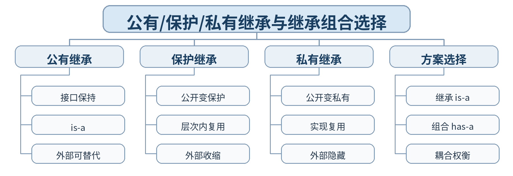

### 教学目标

**知识目标：**
- （1）掌握 public/protected/private 三种继承方式对成员访问级别的影响。
- （2）理解继承与组合两种复用方案的适用关系。
**能力目标：**
- （1）能根据需求建立三种继承方式的访问矩阵。
- （2）能对一个复用需求在继承与组合之间做基本选择并说明理由。
**价值目标：**
- （1）形成“不为复用而滥用继承”的设计意识。
- （2）养成从关系本质、接口暴露和耦合度综合权衡方案的习惯。

### 课程思政

- （1）通过多方案比较培养尊重客观关系、避免形式主义的设计态度；强调复用不能牺牲边界和可维护性。
- （2）本课要求学生保留真实源代码、运行/调试记录和测试结论，以可复现证据支撑程序行为判断，落实规范、诚信和质量责任。

### 专创融合 / / 双创融合

通过继承/组合权衡训练软件架构选择能力，贴近设备组件、通信模块、数据服务等真实软件组合场景。

### 教学重难点

教学重点：三种继承方式；访问级别变化；继承与组合选择。
教学难点：private/protected 继承不是 private/protected 成员；选择依据容易混淆。

### 教学方法

任务驱动法、概念建模法、演示法、上机实践法、代码对比法、断点/日志调试法、同伴互审

### 教学用具

电脑、投影仪、多媒体课件、教材、Visual Studio Code（VS Code）、C++ 编译器、终端/调试器、示例代码

### 教学设计

课前任务 → 互动导入（15 min）→ 传授新知与上机训练（70 min）→ 过关检测（10 min）→ 课堂小结（3 min）→ 作业布置（1 min）→ 考勤（1 min）

### 教学过程

#### 课前任务

【教师】课前发布本课主题“公有/保护/私有继承与继承组合选择”及教材对应内容，给出一个最小代码/设计问题，不提前给出完整答案。
- 1. 阅读教材对应内容，圈出 3—5 个核心术语；
- 2. 预读课堂代码或类图，写下至少 1 个预测和 1 个疑问；
- 3. 检查 VS Code 与 C++ 编译环境，确保能够编译运行上一课最小程序。
【学生】完成阅读、环境检查和预测记录，带着问题进入课堂。

**设计意图：** 通过课前阅读、环境检查和一个最小问题建立先备认知，避免把课堂时间消耗在环境故障上，并让学生带着真实疑问进入学习。

#### 互动导入 / （15 min） / / 传授新知与上机训练 / （70 min）

【互动导入 15 min】
【教师】给出“Logger 被 Machine 使用”的需求，分别用 private 继承和组合实现，学生先判断哪一个更符合 has-a/uses-a 语义。
【学生】先运行/预测/观察，记录第一判断和证据，不先接受教师结论。
【传授新知与上机训练 70 min】
- 一、最小讲解与示范（约20 min）
【教师】三种继承方式改变基类 public/protected 成员在派生类中的可见级别。
【教师】继承用于类型关系，组合用于对象包含/协作关系。
【教师】设计时兼顾语义、接口暴露、耦合和后续扩展。
- 二、学生独立产出（约35 min）
【学生】编写一个基类并分别用三种方式派生，完成访问矩阵；再将“设备包含通信模块”分别用继承/组合实现并比较。
【教师】巡回检查设计边界、编译错误、对象状态与接口使用，只提供分层提示，不替学生完成程序。
- 三、调试、互审与证据固化（约15 min）
【学生】在派生类内部和外部尝试访问 public/protected 成员，记录编译结果；同伴评审继承/组合理由。
【形成证据】本课至少保存：源代码 + 编译/运行结果 + 测试/调试记录；对应 目标 1.3，2.3，3.3。
【评价映射】课堂参与、随堂练习与代码规范纳入平时表现（20%）；本单元代码成果为 课程作业3（课程作业权重中的20%） 的过程证据。

**设计意图：** 采用“先运行/预测 → 最小讲解与示范 → 独立编程 → 调试互审 → 证据固化”的上机闭环。把抽象语法/概念落到可运行程序，通过独立产出和测试证据检验真实学习，而不是只听懂讲解。

#### 过关检测 / （10 min）

【教师】组织当堂检测：
- 1. private 继承后基类 public 成员在派生类中变成什么访问级别？
- 2. has-a 关系通常优先考虑继承还是组合？
- 3. 三种继承方式主要影响什么？
【学生】独立作答或运行验证；【教师】根据错误类型讲解，并要求学生说明判断依据。

**设计意图：** 用概念题、边界题和运行验证即时检测关键知识，暴露易错点；要求说明依据，避免只记答案。

#### 课堂小结 / （3 min）

【教师】回到本课知识脉络图，用“概念—关系—应用—边界”总结“公有/保护/私有继承与继承组合选择”。
重点再次强调：三种继承方式；访问级别变化；继承与组合选择。
【学生】用 1 分钟写出“本课最重要的一条设计规则 + 一个最容易出错的边界”。

**设计意图：** 回到知识脉络图压缩本课信息，帮助学生形成层级结构，并把“规则—边界—应用”连接到下一次课。

#### 作业布置 / （1 min）

【教师】布置课后任务：完成“继承 vs 组合”一页设计比较，给出一个正确继承和一个更适合组合的工程例子。
【学生】按课程文件命名规范整理源代码、测试记录和必要说明，课后提交。

**设计意图：** 通过整理源代码、测试记录和说明，固化课堂成果，形成可复查、可复现的过程性学习证据。

#### 考勤 / （1 min）

【教师】利用学校/课程实际使用的平台进行签到。
【学生】按课程要求完成签到。

**设计意图：** 保留学校模板中的考勤环节，用于教学秩序管理；不在教案中预填任何出勤事实。

#### 课后 / 教学反思

【课后填写，不预填事实】
- 1. 教学流程：记录 100 min 各环节实际用时及需要调整的位置；
- 2. 教学内容：重点记录“private/protected 继承不是 private/protected 成员；选择依据容易混淆。”的真实掌握证据、常见错误和补救措施；
- 3. 学生参与：仅依据课堂实际记录填写独立完成、提问、互审、调试等情况，不补写推测性结论；
- 4. 评价证据：检查本课源代码、测试/调试记录是否完整，记录缺项及下一次课的反馈安排；
- 5. 思政/专创融合：仅记录课堂实际发生的有效案例和学生反馈。

**设计意图：** 反思必须基于真实课堂证据。课前仅提供填写框架，避免把预测或模板化表述误写成已发生的学生表现。

#### 本章节 / 参考文献

[1] 戴波.《C与C++程序设计（第二版）》[M]. 北京：北京大学出版社，2025.
[2] 课程配套 C/C++ 对比程序、类设计案例、调试案例及 VS Code C++ 编译调试资料。

---

## 第15次课 多继承与二义性

- **章节/单元**：第二单元 继承、派生与类层次结构
- **周次**：按实际课表填写
- **课时安排**：2课时（100 min）

### 知识脉络图

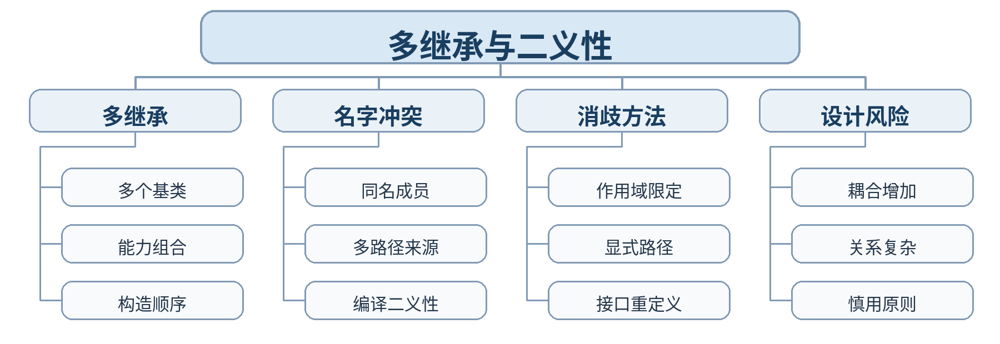

### 教学目标

**知识目标：**
- （1）掌握多继承基本语法、构造顺序和二义性产生原因。
- （2）掌握作用域限定等典型二义性处理方法。
**能力目标：**
- （1）能实现具有两个基类能力的派生类并解释其构造顺序。
- （2）能定位同名成员二义性并采用明确方式解决。
**价值目标：**
- （1）形成“复杂机制使用前先评估收益与风险”的工程意识。
- （2）养成遇到二义性时显式消歧、避免含糊行为的习惯。

### 课程思政

- （1）通过多继承二义性说明复杂协作必须明确责任和命名边界，培养遇到冲突不模糊处理、主动澄清设计意图的工程作风。
- （2）本课要求学生保留真实源代码、运行/调试记录和测试结论，以可复现证据支撑程序行为判断，落实规范、诚信和质量责任。

### 专创融合 / / 双创融合

把多个能力接口组合到智能设备对象中，理解复杂设备软件中的多能力复用，同时训练控制复杂度的意识。

### 教学重难点

教学重点：多继承语法；构造顺序；同名成员二义性与消歧。
教学难点：多路径引入同名成员时，编译器无法自动判断设计意图。

### 教学方法

任务驱动法、概念建模法、演示法、上机实践法、代码对比法、断点/日志调试法、同伴互审

### 教学用具

电脑、投影仪、多媒体课件、教材、Visual Studio Code（VS Code）、C++ 编译器、终端/调试器、示例代码

### 教学设计

课前任务 → 互动导入（15 min）→ 传授新知与上机训练（70 min）→ 过关检测（10 min）→ 课堂小结（3 min）→ 作业布置（1 min）→ 考勤（1 min）

### 教学过程

#### 课前任务

【教师】课前发布本课主题“多继承与二义性”及教材对应内容，给出一个最小代码/设计问题，不提前给出完整答案。
- 1. 阅读教材对应内容，圈出 3—5 个核心术语；
- 2. 预读课堂代码或类图，写下至少 1 个预测和 1 个疑问；
- 3. 检查 VS Code 与 C++ 编译环境，确保能够编译运行上一课最小程序。
【学生】完成阅读、环境检查和预测记录，带着问题进入课堂。

**设计意图：** 通过课前阅读、环境检查和一个最小问题建立先备认知，避免把课堂时间消耗在环境故障上，并让学生带着真实疑问进入学习。

#### 互动导入 / （15 min） / / 传授新知与上机训练 / （70 min）

【互动导入 15 min】
【教师】设计 Measurable 与 Networked 两个基类，都含 status()；SmartSensor 多继承后调用 status()，学生先预测是否能编译。
【学生】先运行/预测/观察，记录第一判断和证据，不先接受教师结论。
【传授新知与上机训练 70 min】
- 一、最小讲解与示范（约20 min）
【教师】多继承把多个基类能力组合到一个派生类。
【教师】多个基类提供同名成员时可能产生编译二义性。
【教师】作用域限定或在派生类中重新定义统一接口可显式表达意图。
- 二、学生独立产出（约35 min）
【学生】实现 SmartSensor : public Measurable, public Networked，制造并解决 status() 二义性，同时输出构造顺序。
【教师】巡回检查设计边界、编译错误、对象状态与接口使用，只提供分层提示，不替学生完成程序。
- 三、调试、互审与证据固化（约15 min）
【学生】分别使用 Measurable::status、Networked::status 和派生类统一 status；记录编译/运行结果。
【形成证据】本课至少保存：源代码 + 编译/运行结果 + 测试/调试记录；对应 目标 1.3，2.3，3.3。
【评价映射】课堂参与、随堂练习与代码规范纳入平时表现（20%）；本单元代码成果为 课程作业3（课程作业权重中的20%） 的过程证据。

**设计意图：** 采用“先运行/预测 → 最小讲解与示范 → 独立编程 → 调试互审 → 证据固化”的上机闭环。把抽象语法/概念落到可运行程序，通过独立产出和测试证据检验真实学习，而不是只听懂讲解。

#### 过关检测 / （10 min）

【教师】组织当堂检测：
- 1. 多继承构造时多个基类按什么顺序构造？
- 2. 同名成员为什么会产生二义性？
- 3. 作用域限定如何表达明确访问路径？
【学生】独立作答或运行验证；【教师】根据错误类型讲解，并要求学生说明判断依据。

**设计意图：** 用概念题、边界题和运行验证即时检测关键知识，暴露易错点；要求说明依据，避免只记答案。

#### 课堂小结 / （3 min）

【教师】回到本课知识脉络图，用“概念—关系—应用—边界”总结“多继承与二义性”。
重点再次强调：多继承语法；构造顺序；同名成员二义性与消歧。
【学生】用 1 分钟写出“本课最重要的一条设计规则 + 一个最容易出错的边界”。

**设计意图：** 回到知识脉络图压缩本课信息，帮助学生形成层级结构，并把“规则—边界—应用”连接到下一次课。

#### 作业布置 / （1 min）

【教师】布置课后任务：为多继承案例补充一个统一 status() 接口，并说明这种设计是否值得使用。
【学生】按课程文件命名规范整理源代码、测试记录和必要说明，课后提交。

**设计意图：** 通过整理源代码、测试记录和说明，固化课堂成果，形成可复查、可复现的过程性学习证据。

#### 考勤 / （1 min）

【教师】利用学校/课程实际使用的平台进行签到。
【学生】按课程要求完成签到。

**设计意图：** 保留学校模板中的考勤环节，用于教学秩序管理；不在教案中预填任何出勤事实。

#### 课后 / 教学反思

【课后填写，不预填事实】
- 1. 教学流程：记录 100 min 各环节实际用时及需要调整的位置；
- 2. 教学内容：重点记录“多路径引入同名成员时，编译器无法自动判断设计意图。”的真实掌握证据、常见错误和补救措施；
- 3. 学生参与：仅依据课堂实际记录填写独立完成、提问、互审、调试等情况，不补写推测性结论；
- 4. 评价证据：检查本课源代码、测试/调试记录是否完整，记录缺项及下一次课的反馈安排；
- 5. 思政/专创融合：仅记录课堂实际发生的有效案例和学生反馈。

**设计意图：** 反思必须基于真实课堂证据。课前仅提供填写框架，避免把预测或模板化表述误写成已发生的学生表现。

#### 本章节 / 参考文献

[1] 戴波.《C与C++程序设计（第二版）》[M]. 北京：北京大学出版社，2025.
[2] 课程配套 C/C++ 对比程序、类设计案例、调试案例及 VS Code C++ 编译调试资料。

---

## 第16次课 虚基类、菱形继承与类层次综合重构

- **章节/单元**：第二单元 继承、派生与类层次结构
- **周次**：按实际课表填写
- **课时安排**：2课时（100 min）

### 知识脉络图

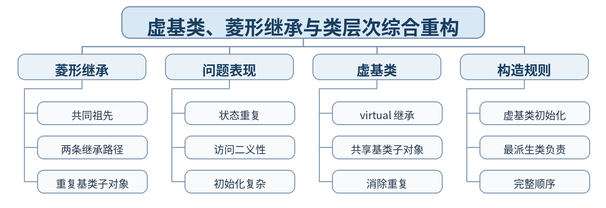

### 教学目标

**知识目标：**
- （1）掌握菱形继承中的重复基类与二义性问题。
- （2）理解虚基类机制及最派生类负责虚基类初始化的规则。
**能力目标：**
- （1）能用虚继承重构典型菱形结构，验证公共基类只保留一份。
- （2）能绘制类层次图并解释完整构造顺序。
**价值目标：**
- （1）形成通过结构重构降低重复状态和冲突风险的设计意识。
- （2）理解类层次设计应兼顾复用、唯一性和维护成本。

### 课程思政

- （1）以菱形继承重构说明重复信息会放大管理风险，强调统一来源、结构清晰和持续重构，培养系统治理与质量改进意识。
- （2）本课要求学生保留真实源代码、运行/调试记录和测试结论，以可复现证据支撑程序行为判断，落实规范、诚信和质量责任。

### 专创融合 / / 双创融合

通过复杂设备类层次重构训练遗留软件结构治理能力，理解“减少重复状态、保持单一来源”对工程系统的重要性。

### 教学重难点

教学重点：菱形继承；虚基类；共享基类子对象；构造规则。
教学难点：虚基类由最派生类初始化，以及普通多继承与虚继承对象结构差异。

### 教学方法

任务驱动法、综合上机实践法、巡回指导法、测试驱动评价、代码讲评与同伴复核

### 教学用具

电脑、投影仪、多媒体课件、教材、Visual Studio Code（VS Code）、C++ 编译器、终端/调试器、示例代码、课程作业任务书、测试记录表

### 教学设计

课前任务 → 互动导入（15 min）→ 传授新知与上机训练（70 min）→ 过关检测（10 min）→ 课堂小结（3 min）→ 作业布置（1 min）→ 考勤（1 min）

### 教学过程

#### 课前任务

【教师】课前发布本课主题“虚基类、菱形继承与类层次综合重构”及教材对应内容，给出一个最小代码/设计问题，不提前给出完整答案。
- 1. 阅读教材对应内容，圈出 3—5 个核心术语；
- 2. 预读课堂代码或类图，写下至少 1 个预测和 1 个疑问；
- 3. 检查 VS Code 与 C++ 编译环境，确保能够编译运行上一课最小程序。
【学生】完成阅读、环境检查和预测记录，带着问题进入课堂。

**设计意图：** 通过课前阅读、环境检查和一个最小问题建立先备认知，避免把课堂时间消耗在环境故障上，并让学生带着真实疑问进入学习。

#### 互动导入 / （15 min） / / 传授新知与上机训练 / （70 min）

【互动导入 15 min】
【教师】运行一个 Diamond 结构，打印共同基类对象地址；再改为 virtual 继承，学生比较地址数量和访问结果。
【学生】先运行/预测/观察，记录第一判断和证据，不先接受教师结论。
【传授新知与上机训练 70 min】
- 一、最小讲解与示范（约20 min）
【教师】菱形继承会通过两条路径带来重复共同基类子对象。
【教师】虚继承使共同虚基类在最派生对象中共享一份。
【教师】虚基类初始化由最派生类负责，构造顺序需整体理解。
- 二、学生独立产出（约35 min）
【学生】完成课程作业3：把重复 Device 基类的 SmartDevice 菱形结构改造成虚基类方案，并保留构造日志、类图和状态访问结果。
【教师】巡回检查设计边界、编译错误、对象状态与接口使用，只提供分层提示，不替学生完成程序。
- 三、调试、互审与证据固化（约15 min）
【学生】比较重构前后共同基类地址数量、状态一致性和构造顺序；同伴检查类图与代码是否一致。
【形成证据】本课至少保存：源代码 + 编译/运行结果 + 测试/调试记录；对应 目标 1.3，2.3，3.3。
【评价映射】日常证据纳入平时表现（20%）；课程作业3（课程作业权重中的20%）。

**设计意图：** 采用“先运行/预测 → 最小讲解与示范 → 独立编程 → 调试互审 → 证据固化”的上机闭环。把抽象语法/概念落到可运行程序，通过独立产出和测试证据检验真实学习，而不是只听懂讲解。

#### 过关检测 / （10 min）

【教师】组织当堂检测：
- 1. 菱形继承的核心问题是什么？
- 2. virtual 继承解决的是函数多态还是基类子对象重复？
- 3. 虚基类通常由谁负责初始化？
【学生】独立作答或运行验证；【教师】根据错误类型讲解，并要求学生说明判断依据。

**设计意图：** 用概念题、边界题和运行验证即时检测关键知识，暴露易错点；要求说明依据，避免只记答案。

#### 课堂小结 / （3 min）

【教师】回到本课知识脉络图，用“概念—关系—应用—边界”总结“虚基类、菱形继承与类层次综合重构”。
重点再次强调：菱形继承；虚基类；共享基类子对象；构造规则。
【学生】用 1 分钟写出“本课最重要的一条设计规则 + 一个最容易出错的边界”。

**设计意图：** 回到知识脉络图压缩本课信息，帮助学生形成层级结构，并把“规则—边界—应用”连接到下一次课。

#### 作业布置 / （1 min）

【教师】布置课后任务：提交课程作业3：类层次图、重构前后代码、构造日志、二义性/状态对比说明。
【学生】按课程文件命名规范整理源代码、测试记录和必要说明，课后提交。

**设计意图：** 通过整理源代码、测试记录和说明，固化课堂成果，形成可复查、可复现的过程性学习证据。

#### 考勤 / （1 min）

【教师】利用学校/课程实际使用的平台进行签到。
【学生】按课程要求完成签到。

**设计意图：** 保留学校模板中的考勤环节，用于教学秩序管理；不在教案中预填任何出勤事实。

#### 课后 / 教学反思

【课后填写，不预填事实】
- 1. 教学流程：记录 100 min 各环节实际用时及需要调整的位置；
- 2. 教学内容：重点记录“虚基类由最派生类初始化，以及普通多继承与虚继承对象结构差异。”的真实掌握证据、常见错误和补救措施；
- 3. 学生参与：仅依据课堂实际记录填写独立完成、提问、互审、调试等情况，不补写推测性结论；
- 4. 评价证据：检查本课源代码、测试/调试记录是否完整，记录缺项及下一次课的反馈安排；
- 5. 思政/专创融合：仅记录课堂实际发生的有效案例和学生反馈。

**设计意图：** 反思必须基于真实课堂证据。课前仅提供填写框架，避免把预测或模板化表述误写成已发生的学生表现。

#### 本章节 / 参考文献

[1] 戴波.《C与C++程序设计（第二版）》[M]. 北京：北京大学出版社，2025.
[2] 课程配套 C/C++ 对比程序、类设计案例、调试案例及 VS Code C++ 编译调试资料。

---

## 第17次课 多态概念与赋值兼容规则

- **章节/单元**：第三单元 多态、运算符重载与动态绑定
- **周次**：按实际课表填写
- **课时安排**：2课时（100 min）

### 知识脉络图

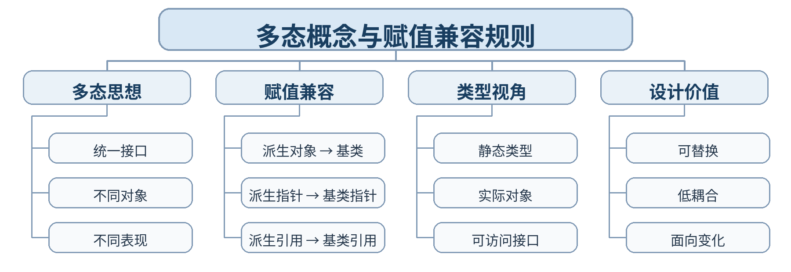

### 教学目标

**知识目标：**
- （1）理解多态的基本思想与赋值兼容规则。
- （2）掌握派生对象、派生指针/引用向基类视角转换的基本关系。
**能力目标：**
- （1）能通过基类对象/指针/引用接收派生对象并分析可访问成员。
- （2）能区分“变量的静态类型”和“实际对象类型”。
**价值目标：**
- （1）形成面向统一接口和可替换对象进行设计的意识。
- （2）养成在判断程序行为时区分编译期视角与实际对象的习惯。

### 课程思政

- （1）通过兼容与可替换强调协同系统应遵守共同接口，同时必须基于实际运行证据判断行为，培养契约意识和实证精神。
- （2）本课要求学生保留真实源代码、运行/调试记录和测试结论，以可复现证据支撑程序行为判断，落实规范、诚信和质量责任。

### 专创融合 / / 双创融合

统一设备接口是插件式软件和设备协议适配的重要基础，本课为后续动态多态和可扩展组件设计搭桥。

### 教学重难点

教学重点：多态思想；赋值兼容；基类指针/引用。
教学难点：兼容转换发生后可见接口与实际对象之间的区别，为动态绑定建立认知基础。

### 教学方法

任务驱动法、概念建模法、演示法、上机实践法、代码对比法、断点/日志调试法、同伴互审

### 教学用具

电脑、投影仪、多媒体课件、教材、Visual Studio Code（VS Code）、C++ 编译器、终端/调试器、示例代码

### 教学设计

课前任务 → 互动导入（15 min）→ 传授新知与上机训练（70 min）→ 过关检测（10 min）→ 课堂小结（3 min）→ 作业布置（1 min）→ 考勤（1 min）

### 教学过程

#### 课前任务

【教师】课前发布本课主题“多态概念与赋值兼容规则”及教材对应内容，给出一个最小代码/设计问题，不提前给出完整答案。
- 1. 阅读教材对应内容，圈出 3—5 个核心术语；
- 2. 预读课堂代码或类图，写下至少 1 个预测和 1 个疑问；
- 3. 检查 VS Code 与 C++ 编译环境，确保能够编译运行上一课最小程序。
【学生】完成阅读、环境检查和预测记录，带着问题进入课堂。

**设计意图：** 通过课前阅读、环境检查和一个最小问题建立先备认知，避免把课堂时间消耗在环境故障上，并让学生带着真实疑问进入学习。

#### 互动导入 / （15 min） / / 传授新知与上机训练 / （70 min）

【互动导入 15 min】
【教师】用 Device* 指向 SensorDevice 对象，在没有虚函数的前提下调用同名函数，学生先预测调用哪个版本。
【学生】先运行/预测/观察，记录第一判断和证据，不先接受教师结论。
【传授新知与上机训练 70 min】
- 一、最小讲解与示范（约20 min）
【教师】多态的目标是同一接口面对不同对象产生不同表现。
【教师】赋值兼容允许派生对象在一定条件下按基类视角使用。
【教师】静态类型决定编译期可见接口，实际对象决定后续动态绑定的可能性。
- 二、学生独立产出（约35 min）
【学生】建立 Device、SensorDevice、ActuatorDevice，分别用基类对象、指针和引用接收派生对象，记录可访问成员和调用结果。
【教师】巡回检查设计边界、编译错误、对象状态与接口使用，只提供分层提示，不替学生完成程序。
- 三、调试、互审与证据固化（约15 min）
【学生】形成“表达式—静态类型—实际对象—调用结果”四列表，并对至少 4 种兼容写法运行验证。
【形成证据】本课至少保存：源代码 + 编译/运行结果 + 测试/调试记录；对应 目标 1.4，2.4，3.4。
【评价映射】课堂参与、随堂练习与代码规范纳入平时表现（20%）；本单元代码成果为 课程作业4（课程作业权重中的25%） 的过程证据。

**设计意图：** 采用“先运行/预测 → 最小讲解与示范 → 独立编程 → 调试互审 → 证据固化”的上机闭环。把抽象语法/概念落到可运行程序，通过独立产出和测试证据检验真实学习，而不是只听懂讲解。

#### 过关检测 / （10 min）

【教师】组织当堂检测：
- 1. 派生类对象能否赋给基类对象？
- 2. 基类指针能否指向派生对象？
- 3. 没有 virtual 时，同名函数调用一定是动态绑定吗？
【学生】独立作答或运行验证；【教师】根据错误类型讲解，并要求学生说明判断依据。

**设计意图：** 用概念题、边界题和运行验证即时检测关键知识，暴露易错点；要求说明依据，避免只记答案。

#### 课堂小结 / （3 min）

【教师】回到本课知识脉络图，用“概念—关系—应用—边界”总结“多态概念与赋值兼容规则”。
重点再次强调：多态思想；赋值兼容；基类指针/引用。
【学生】用 1 分钟写出“本课最重要的一条设计规则 + 一个最容易出错的边界”。

**设计意图：** 回到知识脉络图压缩本课信息，帮助学生形成层级结构，并把“规则—边界—应用”连接到下一次课。

#### 作业布置 / （1 min）

【教师】布置课后任务：完善赋值兼容运行表，并用 120 字说明“兼容转换”和“运行时多态”不是同一个概念。
【学生】按课程文件命名规范整理源代码、测试记录和必要说明，课后提交。

**设计意图：** 通过整理源代码、测试记录和说明，固化课堂成果，形成可复查、可复现的过程性学习证据。

#### 考勤 / （1 min）

【教师】利用学校/课程实际使用的平台进行签到。
【学生】按课程要求完成签到。

**设计意图：** 保留学校模板中的考勤环节，用于教学秩序管理；不在教案中预填任何出勤事实。

#### 课后 / 教学反思

【课后填写，不预填事实】
- 1. 教学流程：记录 100 min 各环节实际用时及需要调整的位置；
- 2. 教学内容：重点记录“兼容转换发生后可见接口与实际对象之间的区别，为动态绑定建立认知基础。”的真实掌握证据、常见错误和补救措施；
- 3. 学生参与：仅依据课堂实际记录填写独立完成、提问、互审、调试等情况，不补写推测性结论；
- 4. 评价证据：检查本课源代码、测试/调试记录是否完整，记录缺项及下一次课的反馈安排；
- 5. 思政/专创融合：仅记录课堂实际发生的有效案例和学生反馈。

**设计意图：** 反思必须基于真实课堂证据。课前仅提供填写框架，避免把预测或模板化表述误写成已发生的学生表现。

#### 本章节 / 参考文献

[1] 戴波.《C与C++程序设计（第二版）》[M]. 北京：北京大学出版社，2025.
[2] 课程配套 C/C++ 对比程序、类设计案例、调试案例及 VS Code C++ 编译调试资料。

---

## 第18次课 运算符重载与自定义类型表达

- **章节/单元**：第三单元 多态、运算符重载与动态绑定
- **周次**：按实际课表填写
- **课时安排**：2课时（100 min）

### 知识脉络图

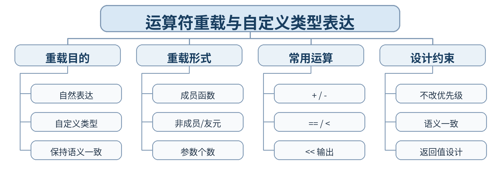

### 教学目标

**知识目标：**
- （1）掌握运算符重载的基本语法和成员/非成员形式。
- （2）理解重载不能改变运算符优先级、结合性和操作数个数等基本约束。
**能力目标：**
- （1）能为一个自定义类型合理重载算术、比较或输出运算符。
- （2）能通过测试验证重载后的语义与普通使用习惯一致。
**价值目标：**
- （1）形成“语法便利必须服务于明确语义”的接口设计意识。
- （2）避免为了形式新颖滥用运算符重载。

### 课程思政

- （1）通过“能做不等于该做”讨论技术选择的边界，培养克制、规范和对使用者负责的接口设计态度。
- （2）本课要求学生保留真实源代码、运行/调试记录和测试结论，以可复现证据支撑程序行为判断，落实规范、诚信和质量责任。

### 专创融合 / / 双创融合

把工程向量、测量值等对象封装成自然表达式，训练面向领域的 API 设计能力。

### 教学重难点

教学重点：运算符重载语法；成员/非成员形式；语义一致性。
教学难点：如何在可读性、封装边界和操作数对称性之间选择重载形式。

### 教学方法

任务驱动法、概念建模法、演示法、上机实践法、代码对比法、断点/日志调试法、同伴互审

### 教学用具

电脑、投影仪、多媒体课件、教材、Visual Studio Code（VS Code）、C++ 编译器、终端/调试器、示例代码

### 教学设计

课前任务 → 互动导入（15 min）→ 传授新知与上机训练（70 min）→ 过关检测（10 min）→ 课堂小结（3 min）→ 作业布置（1 min）→ 考勤（1 min）

### 教学过程

#### 课前任务

【教师】课前发布本课主题“运算符重载与自定义类型表达”及教材对应内容，给出一个最小代码/设计问题，不提前给出完整答案。
- 1. 阅读教材对应内容，圈出 3—5 个核心术语；
- 2. 预读课堂代码或类图，写下至少 1 个预测和 1 个疑问；
- 3. 检查 VS Code 与 C++ 编译环境，确保能够编译运行上一课最小程序。
【学生】完成阅读、环境检查和预测记录，带着问题进入课堂。

**设计意图：** 通过课前阅读、环境检查和一个最小问题建立先备认知，避免把课堂时间消耗在环境故障上，并让学生带着真实疑问进入学习。

#### 互动导入 / （15 min） / / 传授新知与上机训练 / （70 min）

【互动导入 15 min】
【教师】给出 Vector2D 类型，比较 add(v1,v2) 与 v1+v2 两种表达；再给一个语义混乱的 + 重载让学生判断问题。
【学生】先运行/预测/观察，记录第一判断和证据，不先接受教师结论。
【传授新知与上机训练 70 min】
- 一、最小讲解与示范（约20 min）
【教师】运算符重载让自定义类型以接近内置类型的方式参与表达式。
【教师】成员与非成员/友元重载的参数关系和访问能力不同。
【教师】重载应保持直觉语义，不改变语言固定规则。
- 二、学生独立产出（约35 min）
【学生】实现 Vector2D 或 Measurement 类型，重载 +、== 和输出运算符 <<，并保持结果语义自然。
【教师】巡回检查设计边界、编译错误、对象状态与接口使用，只提供分层提示，不替学生完成程序。
- 三、调试、互审与证据固化（约15 min）
【学生】测试零向量、正负值、相等/不等和链式输出；同伴评审是否存在“语法能运行但语义别扭”的重载。
【形成证据】本课至少保存：源代码 + 编译/运行结果 + 测试/调试记录；对应 目标 1.4，2.4，3.4。
【评价映射】课堂参与、随堂练习与代码规范纳入平时表现（20%）；本单元代码成果为 课程作业4（课程作业权重中的25%） 的过程证据。

**设计意图：** 采用“先运行/预测 → 最小讲解与示范 → 独立编程 → 调试互审 → 证据固化”的上机闭环。把抽象语法/概念落到可运行程序，通过独立产出和测试证据检验真实学习，而不是只听懂讲解。

#### 过关检测 / （10 min）

【教师】组织当堂检测：
- 1. 重载 + 能否改变 + 的优先级？
- 2. 成员函数形式重载二元运算符时显式参数有几个？
- 3. 为什么重载应保持运算符原有直觉？
【学生】独立作答或运行验证；【教师】根据错误类型讲解，并要求学生说明判断依据。

**设计意图：** 用概念题、边界题和运行验证即时检测关键知识，暴露易错点；要求说明依据，避免只记答案。

#### 课堂小结 / （3 min）

【教师】回到本课知识脉络图，用“概念—关系—应用—边界”总结“运算符重载与自定义类型表达”。
重点再次强调：运算符重载语法；成员/非成员形式；语义一致性。
【学生】用 1 分钟写出“本课最重要的一条设计规则 + 一个最容易出错的边界”。

**设计意图：** 回到知识脉络图压缩本课信息，帮助学生形成层级结构，并把“规则—边界—应用”连接到下一次课。

#### 作业布置 / （1 min）

【教师】布置课后任务：为课堂类型再增加一个合理重载，并写出“不应该重载”的一个反例及理由。
【学生】按课程文件命名规范整理源代码、测试记录和必要说明，课后提交。

**设计意图：** 通过整理源代码、测试记录和说明，固化课堂成果，形成可复查、可复现的过程性学习证据。

#### 考勤 / （1 min）

【教师】利用学校/课程实际使用的平台进行签到。
【学生】按课程要求完成签到。

**设计意图：** 保留学校模板中的考勤环节，用于教学秩序管理；不在教案中预填任何出勤事实。

#### 课后 / 教学反思

【课后填写，不预填事实】
- 1. 教学流程：记录 100 min 各环节实际用时及需要调整的位置；
- 2. 教学内容：重点记录“如何在可读性、封装边界和操作数对称性之间选择重载形式。”的真实掌握证据、常见错误和补救措施；
- 3. 学生参与：仅依据课堂实际记录填写独立完成、提问、互审、调试等情况，不补写推测性结论；
- 4. 评价证据：检查本课源代码、测试/调试记录是否完整，记录缺项及下一次课的反馈安排；
- 5. 思政/专创融合：仅记录课堂实际发生的有效案例和学生反馈。

**设计意图：** 反思必须基于真实课堂证据。课前仅提供填写框架，避免把预测或模板化表述误写成已发生的学生表现。

#### 本章节 / 参考文献

[1] 戴波.《C与C++程序设计（第二版）》[M]. 北京：北京大学出版社，2025.
[2] 课程配套 C/C++ 对比程序、类设计案例、调试案例及 VS Code C++ 编译调试资料。

---

## 第19次课 虚函数、覆盖与动态绑定

- **章节/单元**：第三单元 多态、运算符重载与动态绑定
- **周次**：按实际课表填写
- **课时安排**：2课时（100 min）

### 知识脉络图

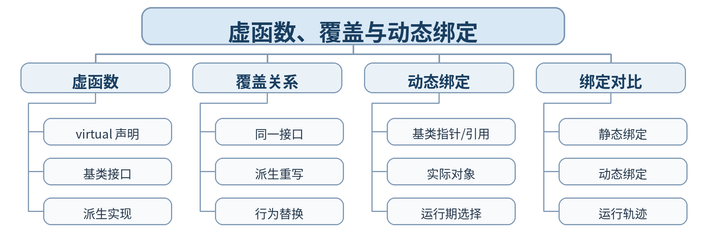

### 教学目标

**知识目标：**
- （1）掌握虚函数和派生类覆盖的基本机制。
- （2）理解使用基类指针/引用调用虚函数时发生动态绑定。
**能力目标：**
- （1）能设计基类虚函数并在多个派生类中提供不同实现。
- （2）能通过断点、日志或运行结果解释静态绑定与动态绑定差异。
**价值目标：**
- （1）形成面向实际运行行为验证程序判断的习惯。
- （2）理解统一接口与可替换实现对可扩展软件的重要性。

### 课程思政

- （1）通过运行轨迹验证动态绑定，强调结论必须由可复现证据支撑；统一接口下允许不同实现也体现规范协同与求同存异。
- （2）本课要求学生保留真实源代码、运行/调试记录和测试结论，以可复现证据支撑程序行为判断，落实规范、诚信和质量责任。

### 专创融合 / / 双创融合

动态绑定是插件式架构、设备驱动统一接口的重要机制，训练面向扩展而非面向分支判断的设计能力。

### 教学重难点

教学重点：虚函数；覆盖；基类指针/引用；动态绑定。
教学难点：动态绑定成立的条件以及“同名函数”与“虚函数覆盖”的区别。

### 教学方法

任务驱动法、概念建模法、演示法、上机实践法、代码对比法、断点/日志调试法、同伴互审

### 教学用具

电脑、投影仪、多媒体课件、教材、Visual Studio Code（VS Code）、C++ 编译器、终端/调试器、示例代码

### 教学设计

课前任务 → 互动导入（15 min）→ 传授新知与上机训练（70 min）→ 过关检测（10 min）→ 课堂小结（3 min）→ 作业布置（1 min）→ 考勤（1 min）

### 教学过程

#### 课前任务

【教师】课前发布本课主题“虚函数、覆盖与动态绑定”及教材对应内容，给出一个最小代码/设计问题，不提前给出完整答案。
- 1. 阅读教材对应内容，圈出 3—5 个核心术语；
- 2. 预读课堂代码或类图，写下至少 1 个预测和 1 个疑问；
- 3. 检查 VS Code 与 C++ 编译环境，确保能够编译运行上一课最小程序。
【学生】完成阅读、环境检查和预测记录，带着问题进入课堂。

**设计意图：** 通过课前阅读、环境检查和一个最小问题建立先备认知，避免把课堂时间消耗在环境故障上，并让学生带着真实疑问进入学习。

#### 互动导入 / （15 min） / / 传授新知与上机训练 / （70 min）

【互动导入 15 min】
【教师】同一组 Device/SensorDevice 先使用普通函数再改为 virtual，学生预测并运行比较两次调用轨迹。
【学生】先运行/预测/观察，记录第一判断和证据，不先接受教师结论。
【传授新知与上机训练 70 min】
- 一、最小讲解与示范（约20 min）
【教师】基类用 virtual 声明可动态分派的接口。
【教师】派生类提供与基类接口一致的实现，形成覆盖。
【教师】通过基类指针/引用调用虚函数时，根据实际对象在运行期选择实现。
- 二、学生独立产出（约35 min）
【学生】实现 Device::describe() 虚函数，SensorDevice/ActuatorDevice 分别输出专属信息；用基类指针数组统一调用。
【教师】巡回检查设计边界、编译错误、对象状态与接口使用，只提供分层提示，不替学生完成程序。
- 三、调试、互审与证据固化（约15 min）
【学生】同一对象分别通过派生对象、基类指针和基类引用调用；记录调用函数地址/日志或输出结果。
【形成证据】本课至少保存：源代码 + 编译/运行结果 + 测试/调试记录；对应 目标 1.4，2.4，3.4。
【评价映射】课堂参与、随堂练习与代码规范纳入平时表现（20%）；本单元代码成果为 课程作业4（课程作业权重中的25%） 的过程证据。

**设计意图：** 采用“先运行/预测 → 最小讲解与示范 → 独立编程 → 调试互审 → 证据固化”的上机闭环。把抽象语法/概念落到可运行程序，通过独立产出和测试证据检验真实学习，而不是只听懂讲解。

#### 过关检测 / （10 min）

【教师】组织当堂检测：
- 1. virtual 通常写在基类还是派生类？
- 2. 动态绑定最关键的调用条件是什么？
- 3. 普通同名函数通过基类指针调用时会发生什么？
【学生】独立作答或运行验证；【教师】根据错误类型讲解，并要求学生说明判断依据。

**设计意图：** 用概念题、边界题和运行验证即时检测关键知识，暴露易错点；要求说明依据，避免只记答案。

#### 课堂小结 / （3 min）

【教师】回到本课知识脉络图，用“概念—关系—应用—边界”总结“虚函数、覆盖与动态绑定”。
重点再次强调：虚函数；覆盖；基类指针/引用；动态绑定。
【学生】用 1 分钟写出“本课最重要的一条设计规则 + 一个最容易出错的边界”。

**设计意图：** 回到知识脉络图压缩本课信息，帮助学生形成层级结构，并把“规则—边界—应用”连接到下一次课。

#### 作业布置 / （1 min）

【教师】布置课后任务：为设备层次增加第三种派生设备，保证主循环不修改即可输出其专属行为。
【学生】按课程文件命名规范整理源代码、测试记录和必要说明，课后提交。

**设计意图：** 通过整理源代码、测试记录和说明，固化课堂成果，形成可复查、可复现的过程性学习证据。

#### 考勤 / （1 min）

【教师】利用学校/课程实际使用的平台进行签到。
【学生】按课程要求完成签到。

**设计意图：** 保留学校模板中的考勤环节，用于教学秩序管理；不在教案中预填任何出勤事实。

#### 课后 / 教学反思

【课后填写，不预填事实】
- 1. 教学流程：记录 100 min 各环节实际用时及需要调整的位置；
- 2. 教学内容：重点记录“动态绑定成立的条件以及“同名函数”与“虚函数覆盖”的区别。”的真实掌握证据、常见错误和补救措施；
- 3. 学生参与：仅依据课堂实际记录填写独立完成、提问、互审、调试等情况，不补写推测性结论；
- 4. 评价证据：检查本课源代码、测试/调试记录是否完整，记录缺项及下一次课的反馈安排；
- 5. 思政/专创融合：仅记录课堂实际发生的有效案例和学生反馈。

**设计意图：** 反思必须基于真实课堂证据。课前仅提供填写框架，避免把预测或模板化表述误写成已发生的学生表现。

#### 本章节 / 参考文献

[1] 戴波.《C与C++程序设计（第二版）》[M]. 北京：北京大学出版社，2025.
[2] 课程配套 C/C++ 对比程序、类设计案例、调试案例及 VS Code C++ 编译调试资料。

---

## 第20次课 基类指针/引用与统一接口设计

- **章节/单元**：第三单元 多态、运算符重载与动态绑定
- **周次**：按实际课表填写
- **课时安排**：2课时（100 min）

### 知识脉络图

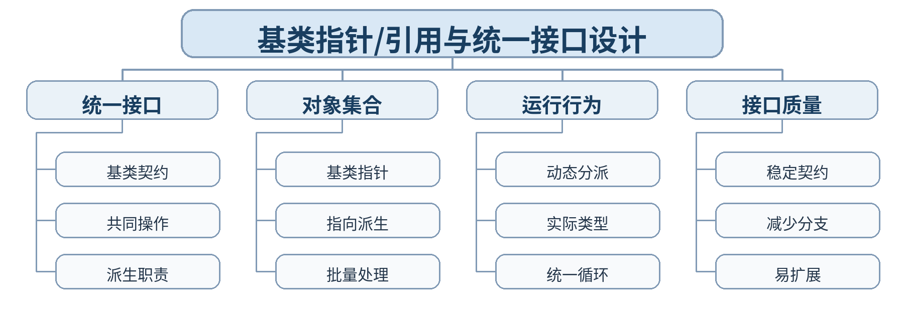

### 教学目标

**知识目标：**
- （1）理解通过基类指针/引用组织不同派生对象的统一接口模式。
- （2）掌握在对象集合中利用虚函数进行批量动态分派。
**能力目标：**
- （1）能建立异构对象集合并通过统一接口完成诊断或输出。
- （2）能比较“if/switch 判断类型”与虚函数统一接口两种设计。
**价值目标：**
- （1）形成面向变化设计稳定接口、减少类型判断耦合的工程意识。
- （2）养成从扩展成本评价设计质量的习惯。

### 课程思政

- （1）通过稳定接口与不同实现的协同，培养遵守共同规范、尊重差异实现和减少无谓耦合的系统协作意识。
- （2）本课要求学生保留真实源代码、运行/调试记录和测试结论，以可复现证据支撑程序行为判断，落实规范、诚信和质量责任。

### 专创融合 / / 双创融合

直接对接工业软件设备驱动、组件框架和插件架构的统一接口思想，提升可扩展原型设计能力。

### 教学重难点

教学重点：基类指针/引用；统一接口；异构对象集合；动态分派。
教学难点：如何设计既足够统一又不强迫所有派生类承担无关职责的基类接口。

### 教学方法

任务驱动法、概念建模法、演示法、上机实践法、代码对比法、断点/日志调试法、同伴互审

### 教学用具

电脑、投影仪、多媒体课件、教材、Visual Studio Code（VS Code）、C++ 编译器、终端/调试器、示例代码

### 教学设计

课前任务 → 互动导入（15 min）→ 传授新知与上机训练（70 min）→ 过关检测（10 min）→ 课堂小结（3 min）→ 作业布置（1 min）→ 考勤（1 min）

### 教学过程

#### 课前任务

【教师】课前发布本课主题“基类指针/引用与统一接口设计”及教材对应内容，给出一个最小代码/设计问题，不提前给出完整答案。
- 1. 阅读教材对应内容，圈出 3—5 个核心术语；
- 2. 预读课堂代码或类图，写下至少 1 个预测和 1 个疑问；
- 3. 检查 VS Code 与 C++ 编译环境，确保能够编译运行上一课最小程序。
【学生】完成阅读、环境检查和预测记录，带着问题进入课堂。

**设计意图：** 通过课前阅读、环境检查和一个最小问题建立先备认知，避免把课堂时间消耗在环境故障上，并让学生带着真实疑问进入学习。

#### 互动导入 / （15 min） / / 传授新知与上机训练 / （70 min）

【互动导入 15 min】
【教师】给出一个通过 type 字段 + switch 调用不同诊断函数的程序，要求学生新增第三类设备并统计修改点，再用虚函数版本对比。
【学生】先运行/预测/观察，记录第一判断和证据，不先接受教师结论。
【传授新知与上机训练 70 min】
- 一、最小讲解与示范（约20 min）
【教师】基类接口定义共同契约，派生类负责具体行为。
【教师】基类指针集合可以统一容纳不同派生对象。
【教师】虚函数让主流程不依赖具体派生类型，从而降低扩展修改。
- 二、学生独立产出（约35 min）
【学生】设计 MachineComponent 基类及 Motor/Sensor/Valve 派生类，实现虚函数 diagnose()；用基类指针数组批量诊断。
【教师】巡回检查设计边界、编译错误、对象状态与接口使用，只提供分层提示，不替学生完成程序。
- 三、调试、互审与证据固化（约15 min）
【学生】新增一种派生类时检查主循环是否需要修改；测试三类对象都能通过统一接口正确分派。
【形成证据】本课至少保存：源代码 + 编译/运行结果 + 测试/调试记录；对应 目标 1.4，2.4，3.4。
【评价映射】课堂参与、随堂练习与代码规范纳入平时表现（20%）；本单元代码成果为 课程作业4（课程作业权重中的25%） 的过程证据。

**设计意图：** 采用“先运行/预测 → 最小讲解与示范 → 独立编程 → 调试互审 → 证据固化”的上机闭环。把抽象语法/概念落到可运行程序，通过独立产出和测试证据检验真实学习，而不是只听懂讲解。

#### 过关检测 / （10 min）

【教师】组织当堂检测：
- 1. 统一接口最重要的价值是什么？
- 2. 为什么频繁 type+switch 可能增加耦合？
- 3. 基类接口是否应该包含所有派生类可能用到的函数？
【学生】独立作答或运行验证；【教师】根据错误类型讲解，并要求学生说明判断依据。

**设计意图：** 用概念题、边界题和运行验证即时检测关键知识，暴露易错点；要求说明依据，避免只记答案。

#### 课堂小结 / （3 min）

【教师】回到本课知识脉络图，用“概念—关系—应用—边界”总结“基类指针/引用与统一接口设计”。
重点再次强调：基类指针/引用；统一接口；异构对象集合；动态分派。
【学生】用 1 分钟写出“本课最重要的一条设计规则 + 一个最容易出错的边界”。

**设计意图：** 回到知识脉络图压缩本课信息，帮助学生形成层级结构，并把“规则—边界—应用”连接到下一次课。

#### 作业布置 / （1 min）

【教师】布置课后任务：把一个 type+switch 程序重构为虚函数统一接口，并提交修改前后依赖关系说明。
【学生】按课程文件命名规范整理源代码、测试记录和必要说明，课后提交。

**设计意图：** 通过整理源代码、测试记录和说明，固化课堂成果，形成可复查、可复现的过程性学习证据。

#### 考勤 / （1 min）

【教师】利用学校/课程实际使用的平台进行签到。
【学生】按课程要求完成签到。

**设计意图：** 保留学校模板中的考勤环节，用于教学秩序管理；不在教案中预填任何出勤事实。

#### 课后 / 教学反思

【课后填写，不预填事实】
- 1. 教学流程：记录 100 min 各环节实际用时及需要调整的位置；
- 2. 教学内容：重点记录“如何设计既足够统一又不强迫所有派生类承担无关职责的基类接口。”的真实掌握证据、常见错误和补救措施；
- 3. 学生参与：仅依据课堂实际记录填写独立完成、提问、互审、调试等情况，不补写推测性结论；
- 4. 评价证据：检查本课源代码、测试/调试记录是否完整，记录缺项及下一次课的反馈安排；
- 5. 思政/专创融合：仅记录课堂实际发生的有效案例和学生反馈。

**设计意图：** 反思必须基于真实课堂证据。课前仅提供填写框架，避免把预测或模板化表述误写成已发生的学生表现。

#### 本章节 / 参考文献

[1] 戴波.《C与C++程序设计（第二版）》[M]. 北京：北京大学出版社，2025.
[2] 课程配套 C/C++ 对比程序、类设计案例、调试案例及 VS Code C++ 编译调试资料。

---

## 第21次课 多态综合设计：运算符、虚函数与扩展性

- **章节/单元**：第三单元 多态、运算符重载与动态绑定
- **周次**：按实际课表填写
- **课时安排**：2课时（100 min）

### 知识脉络图

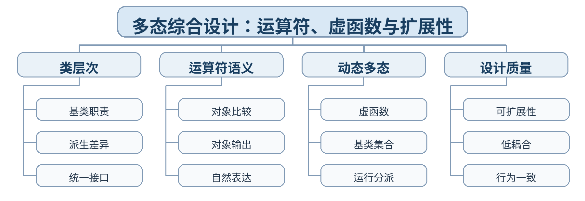

### 教学目标

**知识目标：**
- （1）综合掌握赋值兼容、运算符重载、虚函数和动态绑定。
- （2）理解统一接口、自然表达和运行时多态如何协同支持可扩展设计。
**能力目标：**
- （1）能独立完成一个包含类层次、运算符重载和动态多态的小型程序。
- （2）能通过新增派生类与测试证明设计具有基本扩展性。
**价值目标：**
- （1）形成面向变化设计接口、用证据评价扩展成本的工程习惯。
- （2）理解可维护性来自合理结构而非代码数量。

### 课程思政

- （1）强调程序行为必须可解释、可测试，设计改进应以实际扩展成本和运行结果为依据，培养实事求是和持续改进意识。
- （2）本课要求学生保留真实源代码、运行/调试记录和测试结论，以可复现证据支撑程序行为判断，落实规范、诚信和质量责任。

### 专创融合 / / 双创融合

把多态和领域对象表达用于报警、诊断、设备族等软件原型，训练面向扩展的工程架构思维。

### 教学重难点

教学重点：类层次；运算符重载；虚函数；动态绑定；扩展性。
教学难点：综合设计中保持接口语义一致、避免层次过度复杂，并提供实际运行证据。

### 教学方法

任务驱动法、综合上机实践法、巡回指导法、测试驱动评价、代码讲评与同伴复核

### 教学用具

电脑、投影仪、多媒体课件、教材、Visual Studio Code（VS Code）、C++ 编译器、终端/调试器、示例代码、课程作业任务书、测试记录表

### 教学设计

课前任务 → 互动导入（15 min）→ 传授新知与上机训练（70 min）→ 过关检测（10 min）→ 课堂小结（3 min）→ 作业布置（1 min）→ 考勤（1 min）

### 教学过程

#### 课前任务

【教师】课前发布本课主题“多态综合设计：运算符、虚函数与扩展性”及教材对应内容，给出一个最小代码/设计问题，不提前给出完整答案。
- 1. 阅读教材对应内容，圈出 3—5 个核心术语；
- 2. 预读课堂代码或类图，写下至少 1 个预测和 1 个疑问；
- 3. 检查 VS Code 与 C++ 编译环境，确保能够编译运行上一课最小程序。
【学生】完成阅读、环境检查和预测记录，带着问题进入课堂。

**设计意图：** 通过课前阅读、环境检查和一个最小问题建立先备认知，避免把课堂时间消耗在环境故障上，并让学生带着真实疑问进入学习。

#### 互动导入 / （15 min） / / 传授新知与上机训练 / （70 min）

【互动导入 15 min】
【教师】发布“设备报警对象统一排序/输出/诊断”需求，学生先画类图和接口草图，说明哪些行为用运算符、哪些用虚函数。
【学生】先运行/预测/观察，记录第一判断和证据，不先接受教师结论。
【传授新知与上机训练 70 min】
- 一、最小讲解与示范（约20 min）
【教师】用基类定义共同契约，用派生类表达行为差异。
【教师】为测量值/报警对象重载比较或输出运算符，保持自然语义。
【教师】用基类指针集合与虚函数统一执行多种设备诊断。
- 二、学生独立产出（约35 min）
【学生】完成课程作业4：设备报警与诊断系统，至少 1 个基类 + 2 个派生类，含 1 个运算符重载和 1 个虚函数接口。
【教师】巡回检查设计边界、编译错误、对象状态与接口使用，只提供分层提示，不替学生完成程序。
- 三、调试、互审与证据固化（约15 min）
【学生】新增第三种设备验证主流程扩展；测试比较/输出运算符边界；记录静态/动态绑定调用结果。
【形成证据】本课至少保存：源代码 + 编译/运行结果 + 测试/调试记录；对应 目标 1.4，2.4，3.4。
【评价映射】日常证据纳入平时表现（20%）；课程作业4（课程作业权重中的25%）。

**设计意图：** 采用“先运行/预测 → 最小讲解与示范 → 独立编程 → 调试互审 → 证据固化”的上机闭环。把抽象语法/概念落到可运行程序，通过独立产出和测试证据检验真实学习，而不是只听懂讲解。

#### 过关检测 / （10 min）

【教师】组织当堂检测：
- 1. 运算符重载和虚函数分别解决什么问题？
- 2. 如何用新增派生类检验程序扩展性？
- 3. 为什么基类接口不应依赖具体派生类型？
【学生】独立作答或运行验证；【教师】根据错误类型讲解，并要求学生说明判断依据。

**设计意图：** 用概念题、边界题和运行验证即时检测关键知识，暴露易错点；要求说明依据，避免只记答案。

#### 课堂小结 / （3 min）

【教师】回到本课知识脉络图，用“概念—关系—应用—边界”总结“多态综合设计：运算符、虚函数与扩展性”。
重点再次强调：类层次；运算符重载；虚函数；动态绑定；扩展性。
【学生】用 1 分钟写出“本课最重要的一条设计规则 + 一个最容易出错的边界”。

**设计意图：** 回到知识脉络图压缩本课信息，帮助学生形成层级结构，并把“规则—边界—应用”连接到下一次课。

#### 作业布置 / （1 min）

【教师】布置课后任务：提交课程作业4：类图、源代码、测试表、扩展性验证和 200 字设计说明。
【学生】按课程文件命名规范整理源代码、测试记录和必要说明，课后提交。

**设计意图：** 通过整理源代码、测试记录和说明，固化课堂成果，形成可复查、可复现的过程性学习证据。

#### 考勤 / （1 min）

【教师】利用学校/课程实际使用的平台进行签到。
【学生】按课程要求完成签到。

**设计意图：** 保留学校模板中的考勤环节，用于教学秩序管理；不在教案中预填任何出勤事实。

#### 课后 / 教学反思

【课后填写，不预填事实】
- 1. 教学流程：记录 100 min 各环节实际用时及需要调整的位置；
- 2. 教学内容：重点记录“综合设计中保持接口语义一致、避免层次过度复杂，并提供实际运行证据。”的真实掌握证据、常见错误和补救措施；
- 3. 学生参与：仅依据课堂实际记录填写独立完成、提问、互审、调试等情况，不补写推测性结论；
- 4. 评价证据：检查本课源代码、测试/调试记录是否完整，记录缺项及下一次课的反馈安排；
- 5. 思政/专创融合：仅记录课堂实际发生的有效案例和学生反馈。

**设计意图：** 反思必须基于真实课堂证据。课前仅提供填写框架，避免把预测或模板化表述误写成已发生的学生表现。

#### 本章节 / 参考文献

[1] 戴波.《C与C++程序设计（第二版）》[M]. 北京：北京大学出版社，2025.
[2] 课程配套 C/C++ 对比程序、类设计案例、调试案例及 VS Code C++ 编译调试资料。

---

## 第22次课 函数模板与类模板

- **章节/单元**：第四单元 模板、命名空间与异常处理
- **周次**：按实际课表填写
- **课时安排**：2课时（100 min）

### 知识脉络图

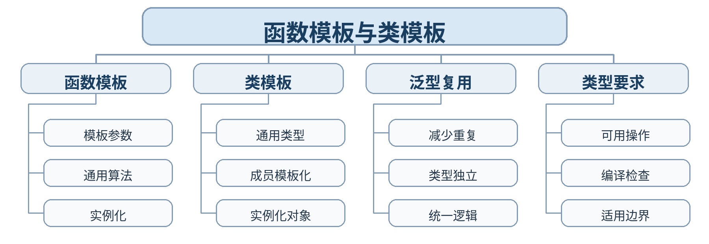

### 教学目标

**知识目标：**
- （1）掌握函数模板和类模板的基本语法、模板参数与实例化。
- （2）理解泛型程序设计以类型参数化方式复用算法和数据结构。
**能力目标：**
- （1）能把多个类型版本的重复函数重构为函数模板。
- （2）能编写简单类模板并用不同类型实例化和测试。
**价值目标：**
- （1）形成抽象共性、减少重复和追求通用性的工程意识。
- （2）理解通用设计必须明确对类型能力的基本要求。

### 课程思政

- （1）通过消除重复代码强调提炼共性、共享成果和持续优化，同时要求清晰说明模板适用边界，培养严谨抽象意识。
- （2）本课要求学生保留真实源代码、运行/调试记录和测试结论，以可复现证据支撑程序行为判断，落实规范、诚信和质量责任。

### 专创融合 / / 双创融合

泛型思想直接连接数据结构、算法库和工业数据容器设计，训练可复用组件和平台化开发能力。

### 教学重难点

教学重点：函数模板；类模板；模板参数；实例化。
教学难点：模板代码不是“对任何类型都自动正确”，类型必须满足模板中使用的操作要求。

### 教学方法

任务驱动法、概念建模法、演示法、上机实践法、代码对比法、断点/日志调试法、同伴互审

### 教学用具

电脑、投影仪、多媒体课件、教材、Visual Studio Code（VS Code）、C++ 编译器、终端/调试器、示例代码

### 教学设计

课前任务 → 互动导入（15 min）→ 传授新知与上机训练（70 min）→ 过关检测（10 min）→ 课堂小结（3 min）→ 作业布置（1 min）→ 考勤（1 min）

### 教学过程

#### 课前任务

【教师】课前发布本课主题“函数模板与类模板”及教材对应内容，给出一个最小代码/设计问题，不提前给出完整答案。
- 1. 阅读教材对应内容，圈出 3—5 个核心术语；
- 2. 预读课堂代码或类图，写下至少 1 个预测和 1 个疑问；
- 3. 检查 VS Code 与 C++ 编译环境，确保能够编译运行上一课最小程序。
【学生】完成阅读、环境检查和预测记录，带着问题进入课堂。

**设计意图：** 通过课前阅读、环境检查和一个最小问题建立先备认知，避免把课堂时间消耗在环境故障上，并让学生带着真实疑问进入学习。

#### 互动导入 / （15 min） / / 传授新知与上机训练 / （70 min）

【互动导入 15 min】
【教师】展示 int/double/string 三个几乎相同的 maxValue 函数，学生先统计重复行，再用模板版本对比。
【学生】先运行/预测/观察，记录第一判断和证据，不先接受教师结论。
【传授新知与上机训练 70 min】
- 一、最小讲解与示范（约20 min）
【教师】函数模板把类型差异抽象为模板参数。
【教师】类模板定义可对多种类型复用的类结构。
【教师】模板实例化在具体类型使用时生成对应代码，类型不满足操作要求会产生编译错误。
- 二、学生独立产出（约35 min）
【学生】把最大值、排序片段或统计函数重构为模板；实现简单 DataBuffer<T> 类模板，支持 add/get/size。
【教师】巡回检查设计边界、编译错误、对象状态与接口使用，只提供分层提示，不替学生完成程序。
- 三、调试、互审与证据固化（约15 min）
【学生】分别用 int、double、string 等类型实例化；再用一个不支持所需操作的类型观察编译错误并解释。
【形成证据】本课至少保存：源代码 + 编译/运行结果 + 测试/调试记录；对应 目标 1.5，2.5，3.5。
【评价映射】课堂参与、随堂练习与代码规范纳入平时表现（20%）；本单元代码成果为 课程作业5（课程作业权重中的10%） 的过程证据。

**设计意图：** 采用“先运行/预测 → 最小讲解与示范 → 独立编程 → 调试互审 → 证据固化”的上机闭环。把抽象语法/概念落到可运行程序，通过独立产出和测试证据检验真实学习，而不是只听懂讲解。

#### 过关检测 / （10 min）

【教师】组织当堂检测：
- 1. 模板参数解决的核心问题是什么？
- 2. 函数模板何时发生实例化？
- 3. 为什么模板不是“任何类型都能用”？
【学生】独立作答或运行验证；【教师】根据错误类型讲解，并要求学生说明判断依据。

**设计意图：** 用概念题、边界题和运行验证即时检测关键知识，暴露易错点；要求说明依据，避免只记答案。

#### 课堂小结 / （3 min）

【教师】回到本课知识脉络图，用“概念—关系—应用—边界”总结“函数模板与类模板”。
重点再次强调：函数模板；类模板；模板参数；实例化。
【学生】用 1 分钟写出“本课最重要的一条设计规则 + 一个最容易出错的边界”。

**设计意图：** 回到知识脉络图压缩本课信息，帮助学生形成层级结构，并把“规则—边界—应用”连接到下一次课。

#### 作业布置 / （1 min）

【教师】布置课后任务：完成一个通用统计函数模板和一个 DataBuffer<T> 类模板，至少用 3 种类型测试。
【学生】按课程文件命名规范整理源代码、测试记录和必要说明，课后提交。

**设计意图：** 通过整理源代码、测试记录和说明，固化课堂成果，形成可复查、可复现的过程性学习证据。

#### 考勤 / （1 min）

【教师】利用学校/课程实际使用的平台进行签到。
【学生】按课程要求完成签到。

**设计意图：** 保留学校模板中的考勤环节，用于教学秩序管理；不在教案中预填任何出勤事实。

#### 课后 / 教学反思

【课后填写，不预填事实】
- 1. 教学流程：记录 100 min 各环节实际用时及需要调整的位置；
- 2. 教学内容：重点记录“模板代码不是“对任何类型都自动正确”，类型必须满足模板中使用的操作要求。”的真实掌握证据、常见错误和补救措施；
- 3. 学生参与：仅依据课堂实际记录填写独立完成、提问、互审、调试等情况，不补写推测性结论；
- 4. 评价证据：检查本课源代码、测试/调试记录是否完整，记录缺项及下一次课的反馈安排；
- 5. 思政/专创融合：仅记录课堂实际发生的有效案例和学生反馈。

**设计意图：** 反思必须基于真实课堂证据。课前仅提供填写框架，避免把预测或模板化表述误写成已发生的学生表现。

#### 本章节 / 参考文献

[1] 戴波.《C与C++程序设计（第二版）》[M]. 北京：北京大学出版社，2025.
[2] 课程配套 C/C++ 对比程序、类设计案例、调试案例及 VS Code C++ 编译调试资料。

---

## 第23次课 命名空间与异常处理基本流程

- **章节/单元**：第四单元 模板、命名空间与异常处理
- **周次**：按实际课表填写
- **课时安排**：2课时（100 min）

### 知识脉络图

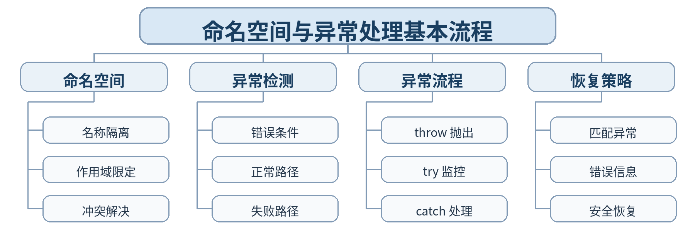

### 教学目标

**知识目标：**
- （1）掌握命名空间的定义、使用和名称冲突解决方法。
- （2）掌握异常抛出、捕获和处理的基本流程。
**能力目标：**
- （1）能用命名空间组织两个含同名符号的代码模块。
- （2）能为非法输入、越界或文件失败设计基本 throw/try/catch 流程。
**价值目标：**
- （1）形成主动考虑失败路径和风险预案的程序健壮性意识。
- （2）理解异常处理不是掩盖错误，而是让错误被明确传播和负责处理。

### 课程思政

- （1）通过命名冲突与异常路径说明复杂协作需要明确边界、预判风险和承担处理责任，培养规范协作与风险意识。
- （2）本课要求学生保留真实源代码、运行/调试记录和测试结论，以可复现证据支撑程序行为判断，落实规范、诚信和质量责任。

### 专创融合 / / 双创融合

命名空间和异常处理是多人协作、大型代码库和工业软件健壮性的基础机制，训练从小程序向工程软件过渡的组织能力。

### 教学重难点

教学重点：命名空间；名称冲突；throw/try/catch；异常恢复。
教学难点：异常检测位置、异常处理位置与恢复责任之间的边界划分。

### 教学方法

任务驱动法、概念建模法、演示法、上机实践法、代码对比法、断点/日志调试法、同伴互审

### 教学用具

电脑、投影仪、多媒体课件、教材、Visual Studio Code（VS Code）、C++ 编译器、终端/调试器、示例代码

### 教学设计

课前任务 → 互动导入（15 min）→ 传授新知与上机训练（70 min）→ 过关检测（10 min）→ 课堂小结（3 min）→ 作业布置（1 min）→ 考勤（1 min）

### 教学过程

#### 课前任务

【教师】课前发布本课主题“命名空间与异常处理基本流程”及教材对应内容，给出一个最小代码/设计问题，不提前给出完整答案。
- 1. 阅读教材对应内容，圈出 3—5 个核心术语；
- 2. 预读课堂代码或类图，写下至少 1 个预测和 1 个疑问；
- 3. 检查 VS Code 与 C++ 编译环境，确保能够编译运行上一课最小程序。
【学生】完成阅读、环境检查和预测记录，带着问题进入课堂。

**设计意图：** 通过课前阅读、环境检查和一个最小问题建立先备认知，避免把课堂时间消耗在环境故障上，并让学生带着真实疑问进入学习。

#### 互动导入 / （15 min） / / 传授新知与上机训练 / （70 min）

【互动导入 15 min】
【教师】给出 lab::Device 与 factory::Device 两个同名类型，以及一个遇到非法索引直接崩溃的程序，学生先判断两个问题分别应由什么机制解决。
【学生】先运行/预测/观察，记录第一判断和证据，不先接受教师结论。
【传授新知与上机训练 70 min】
- 一、最小讲解与示范（约20 min）
【教师】命名空间通过作用域隔离名称，避免大型程序命名冲突。
【教师】异常处理把正常逻辑和失败路径分离：检测、抛出、捕获、恢复。
【教师】catch 需要匹配异常类型，并在处理后决定恢复、提示或终止当前操作。
- 二、学生独立产出（约35 min）
【学生】建立 lab 和 factory 两个命名空间，分别定义同名 Sensor；为 DataBuffer 访问越界和文件打开失败加入异常处理。
【教师】巡回检查设计边界、编译错误、对象状态与接口使用，只提供分层提示，不替学生完成程序。
- 三、调试、互审与证据固化（约15 min）
【学生】覆盖正常调用、名称显式限定、越界、非法参数和文件不存在等场景，形成异常流程表。
【形成证据】本课至少保存：源代码 + 编译/运行结果 + 测试/调试记录；对应 目标 1.5，2.5，3.5。
【评价映射】课堂参与、随堂练习与代码规范纳入平时表现（20%）；本单元代码成果为 课程作业5（课程作业权重中的10%） 的过程证据。

**设计意图：** 采用“先运行/预测 → 最小讲解与示范 → 独立编程 → 调试互审 → 证据固化”的上机闭环。把抽象语法/概念落到可运行程序，通过独立产出和测试证据检验真实学习，而不是只听懂讲解。

#### 过关检测 / （10 min）

【教师】组织当堂检测：
- 1. 命名空间解决的主要问题是什么？
- 2. throw、try、catch 分别承担什么责任？
- 3. 异常处理是否意味着程序可以忽略错误原因？
【学生】独立作答或运行验证；【教师】根据错误类型讲解，并要求学生说明判断依据。

**设计意图：** 用概念题、边界题和运行验证即时检测关键知识，暴露易错点；要求说明依据，避免只记答案。

#### 课堂小结 / （3 min）

【教师】回到本课知识脉络图，用“概念—关系—应用—边界”总结“命名空间与异常处理基本流程”。
重点再次强调：命名空间；名称冲突；throw/try/catch；异常恢复。
【学生】用 1 分钟写出“本课最重要的一条设计规则 + 一个最容易出错的边界”。

**设计意图：** 回到知识脉络图压缩本课信息，帮助学生形成层级结构，并把“规则—边界—应用”连接到下一次课。

#### 作业布置 / （1 min）

【教师】布置课后任务：为一个课堂程序补充 2 类异常场景，并写出“检测点—抛出点—处理点—恢复策略”表。
【学生】按课程文件命名规范整理源代码、测试记录和必要说明，课后提交。

**设计意图：** 通过整理源代码、测试记录和说明，固化课堂成果，形成可复查、可复现的过程性学习证据。

#### 考勤 / （1 min）

【教师】利用学校/课程实际使用的平台进行签到。
【学生】按课程要求完成签到。

**设计意图：** 保留学校模板中的考勤环节，用于教学秩序管理；不在教案中预填任何出勤事实。

#### 课后 / 教学反思

【课后填写，不预填事实】
- 1. 教学流程：记录 100 min 各环节实际用时及需要调整的位置；
- 2. 教学内容：重点记录“异常检测位置、异常处理位置与恢复责任之间的边界划分。”的真实掌握证据、常见错误和补救措施；
- 3. 学生参与：仅依据课堂实际记录填写独立完成、提问、互审、调试等情况，不补写推测性结论；
- 4. 评价证据：检查本课源代码、测试/调试记录是否完整，记录缺项及下一次课的反馈安排；
- 5. 思政/专创融合：仅记录课堂实际发生的有效案例和学生反馈。

**设计意图：** 反思必须基于真实课堂证据。课前仅提供填写框架，避免把预测或模板化表述误写成已发生的学生表现。

#### 本章节 / 参考文献

[1] 戴波.《C与C++程序设计（第二版）》[M]. 北京：北京大学出版社，2025.
[2] 课程配套 C/C++ 对比程序、类设计案例、调试案例及 VS Code C++ 编译调试资料。

---

## 第24次课 综合重构：模板、命名空间、异常与面向对象设计

- **章节/单元**：第四单元 模板、命名空间与异常处理
- **周次**：按实际课表填写
- **课时安排**：2课时（100 min）

### 知识脉络图

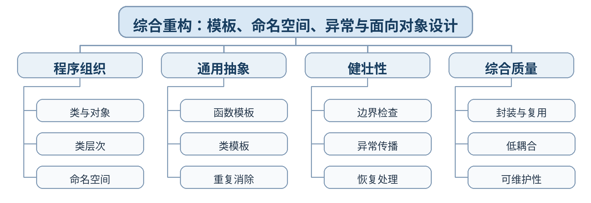

### 教学目标

**知识目标：**
- （1）综合理解类、继承、多态、模板、命名空间和异常处理的协同作用。
- （2）理解面向对象程序从设计、实现、测试到重构的最小工程流程。
**能力目标：**
- （1）能独立完成一个包含对象建模、复用、模板和异常处理的综合 C++ 程序。
- （2）能用测试和重构记录分析可读性、复用性、耦合度和健壮性。
**价值目标：**
- （1）形成重视边界条件、异常场景、程序健壮性和持续重构的质量意识。
- （2）养成查阅资料、基于证据改进设计并对最终行为负责的工程习惯。

### 课程思政

- （1）综合任务要求正常路径和失败路径都可验证，强调工程交付中的诚信、可复现、风险预案和持续改进，形成对软件质量全过程负责的职业素养。
- （2）本课要求学生保留真实源代码、运行/调试记录和测试结论，以可复现证据支撑程序行为判断，落实规范、诚信和质量责任。

### 专创融合 / / 双创融合

以完整软件原型贯通对象建模、可复用组件和异常处理，为数据结构、嵌入式软件与人工智能应用课程中的工程项目打基础。

### 教学重难点

教学重点：类与对象综合；模板复用；命名空间组织；异常处理；重构。
教学难点：在有限规模项目中合理组合多种机制，避免过度设计，同时证明正常和失败路径都可控。

### 教学方法

任务驱动法、综合上机实践法、巡回指导法、测试驱动评价、代码讲评与同伴复核

### 教学用具

电脑、投影仪、多媒体课件、教材、Visual Studio Code（VS Code）、C++ 编译器、终端/调试器、示例代码、课程作业任务书、测试记录表

### 教学设计

课前任务 → 互动导入（15 min）→ 传授新知与上机训练（70 min）→ 过关检测（10 min）→ 课堂小结（3 min）→ 作业布置（1 min）→ 考勤（1 min）

### 教学过程

#### 课前任务

【教师】课前发布本课主题“综合重构：模板、命名空间、异常与面向对象设计”及教材对应内容，给出一个最小代码/设计问题，不提前给出完整答案。
- 1. 阅读教材对应内容，圈出 3—5 个核心术语；
- 2. 预读课堂代码或类图，写下至少 1 个预测和 1 个疑问；
- 3. 检查 VS Code 与 C++ 编译环境，确保能够编译运行上一课最小程序。
【学生】完成阅读、环境检查和预测记录，带着问题进入课堂。

**设计意图：** 通过课前阅读、环境检查和一个最小问题建立先备认知，避免把课堂时间消耗在环境故障上，并让学生带着真实疑问进入学习。

#### 互动导入 / （15 min） / / 传授新知与上机训练 / （70 min）

【互动导入 15 min】
【教师】发布综合任务验收标准：对象模型、类层次/组合、模板复用、命名空间、异常路径和测试。学生先提交 10 分钟设计草图。
【学生】先运行/预测/观察，记录第一判断和证据，不先接受教师结论。
【传授新知与上机训练 70 min】
- 一、最小讲解与示范（约20 min）
【教师】以类和对象组织领域状态与行为，继承/多态仅在存在真实类型关系时使用。
【教师】用模板消除类型重复，用命名空间组织模块。
【教师】为非法状态、越界、文件失败等设计异常检测、传播和恢复。
- 二、学生独立产出（约35 min）
【学生】完成课程作业5：智能车间资产管理小程序。至少含 2 个类、1 处继承/组合关系、1 个模板、1 个命名空间、2 类异常场景。
【教师】巡回检查设计边界、编译错误、对象状态与接口使用，只提供分层提示，不替学生完成程序。
- 三、调试、互审与证据固化（约15 min）
【学生】执行正常流程、边界输入、异常文件/非法索引、增加新对象类型等测试；同伴按 README 独立复现。
【形成证据】本课至少保存：源代码 + 编译/运行结果 + 测试/调试记录；对应 目标 1.5，2.5，3.5。
【评价映射】日常证据纳入平时表现（20%）；课程作业5（课程作业权重中的10%）。

**设计意图：** 采用“先运行/预测 → 最小讲解与示范 → 独立编程 → 调试互审 → 证据固化”的上机闭环。把抽象语法/概念落到可运行程序，通过独立产出和测试证据检验真实学习，而不是只听懂讲解。

#### 过关检测 / （10 min）

【教师】组织当堂检测：
- 1. 模板、继承和组合分别解决哪类复用问题？
- 2. 异常处理应覆盖哪些失败路径？
- 3. 如何用一次重构证明程序的可维护性得到提升？
【学生】独立作答或运行验证；【教师】根据错误类型讲解，并要求学生说明判断依据。

**设计意图：** 用概念题、边界题和运行验证即时检测关键知识，暴露易错点；要求说明依据，避免只记答案。

#### 课堂小结 / （3 min）

【教师】回到本课知识脉络图，用“概念—关系—应用—边界”总结“综合重构：模板、命名空间、异常与面向对象设计”。
重点再次强调：类与对象综合；模板复用；命名空间组织；异常处理；重构。
【学生】用 1 分钟写出“本课最重要的一条设计规则 + 一个最容易出错的边界”。

**设计意图：** 回到知识脉络图压缩本课信息，帮助学生形成层级结构，并把“规则—边界—应用”连接到下一次课。

#### 作业布置 / （1 min）

【教师】布置课后任务：提交课程作业5最终包：类图/结构草图、源代码、测试表、异常说明、README 和课程复盘。
【学生】按课程文件命名规范整理源代码、测试记录和必要说明，课后提交。

**设计意图：** 通过整理源代码、测试记录和说明，固化课堂成果，形成可复查、可复现的过程性学习证据。

#### 考勤 / （1 min）

【教师】利用学校/课程实际使用的平台进行签到。
【学生】按课程要求完成签到。

**设计意图：** 保留学校模板中的考勤环节，用于教学秩序管理；不在教案中预填任何出勤事实。

#### 课后 / 教学反思

【课后填写，不预填事实】
- 1. 教学流程：记录 100 min 各环节实际用时及需要调整的位置；
- 2. 教学内容：重点记录“在有限规模项目中合理组合多种机制，避免过度设计，同时证明正常和失败路径都可控。”的真实掌握证据、常见错误和补救措施；
- 3. 学生参与：仅依据课堂实际记录填写独立完成、提问、互审、调试等情况，不补写推测性结论；
- 4. 评价证据：检查本课源代码、测试/调试记录是否完整，记录缺项及下一次课的反馈安排；
- 5. 思政/专创融合：仅记录课堂实际发生的有效案例和学生反馈。

**设计意图：** 反思必须基于真实课堂证据。课前仅提供填写框架，避免把预测或模板化表述误写成已发生的学生表现。

#### 本章节 / 参考文献

[1] 戴波.《C与C++程序设计（第二版）》[M]. 北京：北京大学出版社，2025.
[2] 课程配套 C/C++ 对比程序、类设计案例、调试案例及 VS Code C++ 编译调试资料。

---
