# 计算机网络（B）教案（24次课）

> **Canonical Markdown / 内容权威源**：本文件与 `images/`、`manifest.json` 共同构成课程教案内容主源；Word 仅由此编译。

## 教案封面信息
- **学院**：计算机与信息技术学院
- **专业（教研室）**：智能制造工程
- **课程名称**：计算机网络（B）
- **主讲教师**：（按实际填写）
- **职称**：（按实际填写）
- **授课学期**：第6学期
- **授课专业**：智能制造工程

## 课程基本信息
- **课程代码**：25JX21801
- **课程名称（中文）**：计算机网络（B）
- **课程名称（英文）**：Computer Networks (B)
- **课程类别**：专业类；课程性质：选修；授课语言：中文
- **授课学期**：第6学期；学分：3
- **课程学时及分配**：总学时48；理论48；实验0；上机0；项目式0
- **适用专业**：智能制造工程
- **教材**：胡亮, 徐高潮, 张宗升, 霍严梅, 车喜龙. 计算机网络[M]. 北京：高等教育出版社，2024. ISBN 9787040612875
- **授课学院**：计算机与信息技术学院
- **先修课程**：数据结构（C）、程序设计基础（C&C++）Ⅱ、工程建模与科学计算可视化基础（Python）
- **后续课程**：先进装备系统设计与开发（ROS）、智能生产计划管理（MES/ERP）、毕业设计（论文）
- **考核类型**：考查课
- **考核形式**：期末综合考查：网络设计与故障分析综合报告 + 个人核验答辩；不安排期末笔试或机考
- **考核方式**：平时学习与课堂分析、课程作业（协议与报文分析）、期末综合考查
- **总评成绩比例**：总评成绩 = 平时学习与课堂分析×20% + 课程作业（协议与报文分析）×20% + 期末综合考查×60%

### 课程简介

课程基本定位：本课程是智能制造工程专业的专业选修课，建立“网络体系结构—局域网与数据链路—IP网络—运输层—应用层—网络管理与安全”的知识主线，侧重通用计算机网络原理与网络系统分析。工业网络专用协议不作为本课程主线。

核心学习结果：学生能够解释分层、封装、分组交换、时延、吞吐量和可靠传输等概念，识读典型协议数据流，完成IPv4子网划分、路由分析、TCP/UDP与应用服务故障分析，并形成含拓扑、地址、路由、服务、安全边界和验证方法的中小型网络设计方案。

学情分析：学生已完成程序设计、数据结构和Python基础课程，具备一定软件与算法基础。本课程48学时全部为理论教学，Wireshark、网络仿真、Socket和路由配置仅作为课堂演示、课内分析或课后材料，不另计实践学时。

主要教学方法：采用原理讲授、协议报文解析、分层通信过程推演、教师提供抓包数据演示、网络拓扑与地址规划练习、故障案例研讨和方案评审。坚持“先理解协议行为，再使用工具验证”，所有网络探测、抓包和配置限定在授权环境、教师提供数据或隔离仿真环境。

## 24次课教学设计

## 第01次课 课程导入、网络组成与互联网结构

- **章节/单元**：第1单元 计算机网络概论、体系结构与性能
- **周次**：按实际课表填写
- **课时安排**：2课时（100 min）

### 知识脉络图

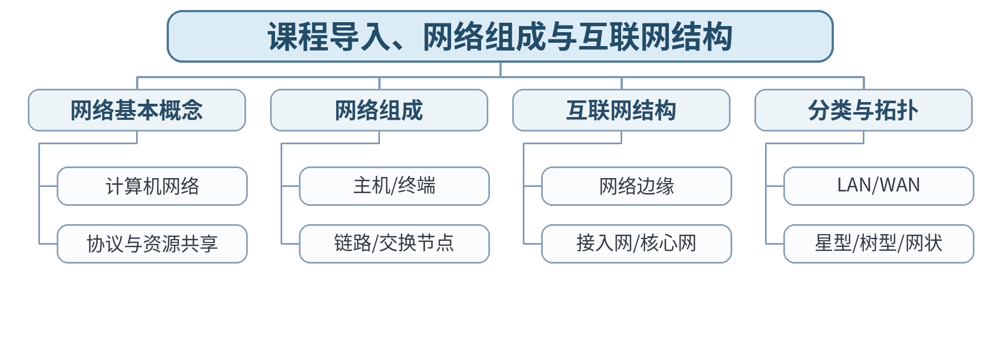

### 教学目标

**知识目标：**
- （1）理解计算机网络、互联网、网络边缘、接入网和核心网的基本概念。
- （2）认识常见网络分类和拓扑。
**能力目标：**
- （1）能够从智能制造通信场景识别端系统、链路和网络节点。
- （2）能够用结构图说明基本通信关系。
**价值目标：**
- （1）形成以标准术语描述网络系统、先画结构再分析问题的工程习惯。

### 课程思政

结合我国网络基础设施和工业互联网发展，强调网络是关键基础设施，工程人员应遵守标准、保障可靠连接。

### 专创融合 / 双创融合

把网络组成图作为后续ROS/MES系统通信架构的基础设计文档，培养跨设备、软件与服务的系统视角。

### 教学重难点

教学重点：计算机网络组成、互联网边缘/接入/核心结构。
教学难点：从真实智能制造通信场景抽象网络组成，不把“互联网”简单等同于某一种物理拓扑。

### 教学方法

讲授法、问题引导法、协议推演法、案例分析法、教师演示法、分组讨论法、方案评审与证据复盘

### 教学用具

电脑、投影仪、多媒体课件、教材、网络协议结构图、教师提供的抓包/报文字段资料、地址/路由练习表

### 教学设计

课前任务 → 互动导入（15 min）→ 传授新知与课堂训练（70 min）→ 过关检测（10 min）→ 课堂小结（3 min）→ 作业布置（1 min）→ 考勤（1 min）

### 教学过程

#### 课前任务

【教师】发布“课程导入、网络组成与互联网结构”预习材料和一个最小判断问题；要求只使用教材、课程资料或教师提供数据。
【学生】阅读对应内容，记录3个核心术语和至少1个疑问；准备课堂分析表。

**设计意图：** 通过阅读和最小问题建立先备认知，让学生带着可验证问题进入课堂。

#### 互动导入与传授新知 / 课堂训练

【互动导入 15 min】
【教师】给出“机器人—边缘服务器—MES—云平台”通信图，让学生先圈出终端、链路、网络设备和服务，并判断哪些属于网络边缘。
【学生】先独立判断/计算，再交换依据。

【传授新知与课堂训练 70 min】
【教师】从资源共享和通信角度定义计算机网络，区分互联网、局域网和通信系统。
【学生】完成对应分析/推演并记录判断依据。
【教师】解析网络边缘、接入网、核心网以及路由器/交换机的基本职责。
【学生】完成对应分析/推演并记录判断依据。
【教师】结合智能装备、ROS和MES场景，完成一张“端系统—接入—核心—服务”的通信结构图。
【学生】完成对应分析/推演并记录判断依据。

【课堂产物】智能制造场景网络组成图及术语标注。
【学习证据】课堂分析图 + 关键术语解释 + 1条修正记录。
【评价关联】平时学习与课堂分析；目标1.1、2.1、3.1。

**设计意图：** 采用“先判断/计算 → 最小讲解 → 协议/数据流推演 → 独立分析产出 → 证据复核”的理论课闭环，把抽象网络原理落实到可检查的图表、计算和故障证据。

### 过关检测

【教师】组织当堂检测：
- 1. 计算机网络最核心的功能是什么？
- 2. 网络边缘与核心网分别包含哪些典型对象？
- 3. 交换机与路由器为什么不能简单视为同一种设备？
【学生】独立作答；【教师】要求说明判断依据。

### 课堂小结

【教师】回到知识脉络图，用“概念—关系—协议行为—工程边界”总结“课程导入、网络组成与互联网结构”。
【学生】写下本课最重要的一条规则和一个最容易误判的边界。

### 作业布置

【教师】布置课后任务：选择一个熟悉的智能装备系统，画出至少6个节点的通信结构图，标明端系统、网络设备和服务。
【学生】按课程文件命名要求整理分析图、计算/协议表和必要说明。

### 考勤

【教师】利用学校/课程实际使用的平台进行签到。
【学生】按课程要求完成签到。

### 课后教学反思

【课后填写，不预填事实】
- 1. 教学流程：记录100 min各环节实际用时及需调整位置；
- 2. 教学内容：重点记录“从真实智能制造通信场景抽象网络组成，不把“互联网”简单等同于某一种物理拓扑。”的真实掌握证据与常见错误；
- 3. 学生参与：仅依据实际课堂记录填写独立分析、讨论、互审情况，不补写推测；
- 4. 评价证据：检查本课分析表/流程图/计算单/方案证据是否完整，记录缺项；
- 5. 后续改进：依据真实课堂证据确定下一轮调整。

### 本章节参考文献

[1] 胡亮, 徐高潮, 张宗升, 霍严梅, 车喜龙. 计算机网络[M]. 北京：高等教育出版社，2024. ISBN 9787040612875
[2] 袁华, 王昊翔, 黄敏. 深入理解计算机网络[M]. 北京：清华大学出版社，2024. ISBN 9787302662709
[3] 冯博琴, 陈妍. 计算机网络（第4版）[M]. 北京：高等教育出版社，2023. ISBN 9787040599909

## 第02次课 分组交换、时延、吞吐量与丢包

- **章节/单元**：第1单元 计算机网络概论、体系结构与性能
- **周次**：按实际课表填写
- **课时安排**：2课时（100 min）

### 知识脉络图

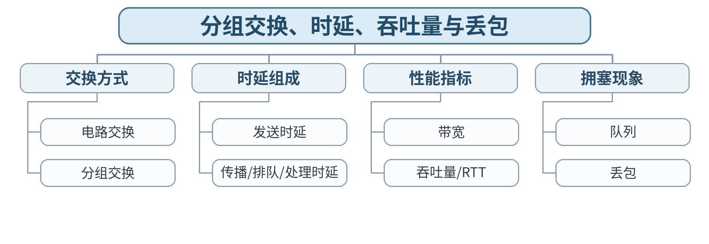

### 教学目标

**知识目标：**
- （1）掌握分组交换、电路交换和主要网络性能指标。
- （2）理解发送、传播、排队和处理时延。
**能力目标：**
- （1）能够估算基本端到端时延和瓶颈吞吐量。
- （2）能够用可测指标解释网络性能现象。
**价值目标：**
- （1）形成使用单位、公式和可测指标说明性能结论的严谨习惯。

### 课程思政

通过共享链路拥塞讨论资源公平使用、容量规划和对他人通信质量负责的工程意识。

### 专创融合 / 双创融合

把时延、吞吐量、丢包转化为网络服务SLA的基本指标，为机器人控制、边缘计算和MES通信需求分析做准备。

### 教学重难点

教学重点：分组交换；时延组成；吞吐量和丢包。
教学难点：区分发送时延与传播时延，并用瓶颈链路解释端到端吞吐量。

### 教学方法

讲授法、问题引导法、协议推演法、案例分析法、教师演示法、分组讨论法、方案评审与证据复盘

### 教学用具

电脑、投影仪、多媒体课件、教材、网络协议结构图、教师提供的抓包/报文字段资料、地址/路由练习表

### 教学设计

课前任务 → 互动导入（15 min）→ 传授新知与课堂训练（70 min）→ 过关检测（10 min）→ 课堂小结（3 min）→ 作业布置（1 min）→ 考勤（1 min）

### 教学过程

#### 课前任务

【教师】发布“分组交换、时延、吞吐量与丢包”预习材料和一个最小判断问题；要求只使用教材、课程资料或教师提供数据。
【学生】阅读对应内容，记录3个核心术语和至少1个疑问；准备课堂分析表。

**设计意图：** 通过阅读和最小问题建立先备认知，让学生带着可验证问题进入课堂。

#### 互动导入与传授新知 / 课堂训练

【互动导入 15 min】
【教师】同样发送1 MB文件，分别改变链路带宽和链路长度，要求学生判断哪一种会改变发送时延、哪一种会改变传播时延。
【学生】先独立判断/计算，再交换依据。

【传授新知与课堂训练 70 min】
【教师】比较电路交换和分组交换的资源使用方式与适用场景。
【学生】完成对应分析/推演并记录判断依据。
【教师】推导发送、传播、处理、排队时延的含义，结合RTT和丢包解释拥塞。
【学生】完成对应分析/推演并记录判断依据。
【教师】学生完成2道时延计算和1张“瓶颈链路—吞吐量”判断表，并说明单位。
【学生】完成对应分析/推演并记录判断依据。

【课堂产物】时延/吞吐量计算单及瓶颈链路判断表。
【学习证据】计算过程 + 单位检查 + 错误修正说明。
【评价关联】平时学习与课堂分析；课程作业过程证据；目标1.1、2.1、3.1。

**设计意图：** 采用“先判断/计算 → 最小讲解 → 协议/数据流推演 → 独立分析产出 → 证据复核”的理论课闭环，把抽象网络原理落实到可检查的图表、计算和故障证据。

### 过关检测

【教师】组织当堂检测：
- 1. 发送时延由哪些量决定？
- 2. 传播时延与链路带宽是否直接相关？
- 3. 端到端多段链路的吞吐量通常由什么决定？
【学生】独立作答；【教师】要求说明判断依据。

### 课堂小结

【教师】回到知识脉络图，用“概念—关系—协议行为—工程边界”总结“分组交换、时延、吞吐量与丢包”。
【学生】写下本课最重要的一条规则和一个最容易误判的边界。

### 作业布置

【教师】布置课后任务：完成3道时延与吞吐量计算题，并解释一次“带宽高但访问仍慢”的可能原因。
【学生】按课程文件命名要求整理分析图、计算/协议表和必要说明。

### 考勤

【教师】利用学校/课程实际使用的平台进行签到。
【学生】按课程要求完成签到。

### 课后教学反思

【课后填写，不预填事实】
- 1. 教学流程：记录100 min各环节实际用时及需调整位置；
- 2. 教学内容：重点记录“区分发送时延与传播时延，并用瓶颈链路解释端到端吞吐量。”的真实掌握证据与常见错误；
- 3. 学生参与：仅依据实际课堂记录填写独立分析、讨论、互审情况，不补写推测；
- 4. 评价证据：检查本课分析表/流程图/计算单/方案证据是否完整，记录缺项；
- 5. 后续改进：依据真实课堂证据确定下一轮调整。

### 本章节参考文献

[1] 胡亮, 徐高潮, 张宗升, 霍严梅, 车喜龙. 计算机网络[M]. 北京：高等教育出版社，2024. ISBN 9787040612875
[2] 袁华, 王昊翔, 黄敏. 深入理解计算机网络[M]. 北京：清华大学出版社，2024. ISBN 9787302662709
[3] 冯博琴, 陈妍. 计算机网络（第4版）[M]. 北京：高等教育出版社，2023. ISBN 9787040599909

## 第03次课 协议、分层体系结构与封装/解封装

- **章节/单元**：第1单元 计算机网络概论、体系结构与性能
- **周次**：按实际课表填写
- **课时安排**：2课时（100 min）

### 知识脉络图

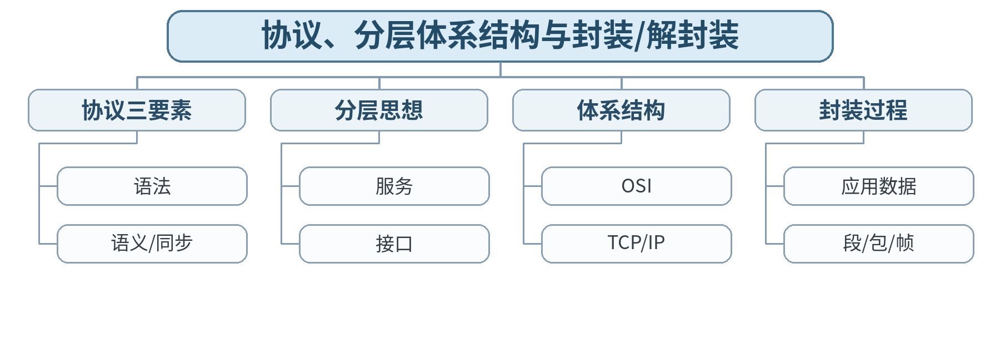

### 教学目标

**知识目标：**
- （1）掌握协议、服务、接口和分层体系结构。
- （2）理解封装与解封装过程。
**能力目标：**
- （1）能够沿协议栈解释端到端数据流。
- （2）能够区分各层PDU和职责。
**价值目标：**
- （1）形成接口契约、层次化分析和遵循标准的工程意识。

### 课程思政

通过开放标准和分层协作说明大型工程系统需要共同规则与接口契约。

### 专创融合 / 双创融合

将分层思想迁移到软件架构和ROS接口设计，理解“稳定接口降低系统耦合”的价值。

### 教学重难点

教学重点：协议、服务、接口；OSI/TCP-IP；封装与解封装。
教学难点：沿端到端通信路径区分“同层协议关系”和“相邻层服务关系”。

### 教学方法

讲授法、问题引导法、协议推演法、案例分析法、教师演示法、分组讨论法、方案评审与证据复盘

### 教学用具

电脑、投影仪、多媒体课件、教材、网络协议结构图、教师提供的抓包/报文字段资料、地址/路由练习表

### 教学设计

课前任务 → 互动导入（15 min）→ 传授新知与课堂训练（70 min）→ 过关检测（10 min）→ 课堂小结（3 min）→ 作业布置（1 min）→ 考勤（1 min）

### 教学过程

#### 课前任务

【教师】发布“协议、分层体系结构与封装/解封装”预习材料和一个最小判断问题；要求只使用教材、课程资料或教师提供数据。
【学生】阅读对应内容，记录3个核心术语和至少1个疑问；准备课堂分析表。

**设计意图：** 通过阅读和最小问题建立先备认知，让学生带着可验证问题进入课堂。

#### 互动导入与传授新知 / 课堂训练

【互动导入 15 min】
【教师】给出“浏览器访问网站”的数据流，让学生判断HTTP、TCP、IP、以太网分别在哪一层，并把“报文、段、包、帧”排序。
【学生】先独立判断/计算，再交换依据。

【传授新知与课堂训练 70 min】
【教师】解释协议的语法、语义和同步，以及服务/接口与协议的区别。
【学生】完成对应分析/推演并记录判断依据。
【教师】比较OSI参考模型和TCP/IP体系，强调分层是降低复杂度的工程方法。
【学生】完成对应分析/推演并记录判断依据。
【教师】学生完成端到端封装图：应用数据→TCP段→IP包→以太网帧→接收端逆向解封装。
【学生】完成对应分析/推演并记录判断依据。

【课堂产物】端到端分层通信与封装/解封装图。
【学习证据】分层图 + PDU名称 + 同层/相邻层关系说明。
【评价关联】平时学习与课堂分析；课程作业过程证据；目标1.1、2.1、3.1。

**设计意图：** 采用“先判断/计算 → 最小讲解 → 协议/数据流推演 → 独立分析产出 → 证据复核”的理论课闭环，把抽象网络原理落实到可检查的图表、计算和故障证据。

### 过关检测

【教师】组织当堂检测：
- 1. 协议和服务有什么区别？
- 2. TCP/IP体系中IP位于哪一层？
- 3. 数据在发送端为什么要逐层增加首部？
【学生】独立作答；【教师】要求说明判断依据。

### 课堂小结

【教师】回到知识脉络图，用“概念—关系—协议行为—工程边界”总结“协议、分层体系结构与封装/解封装”。
【学生】写下本课最重要的一条规则和一个最容易误判的边界。

### 作业布置

【教师】布置课后任务：画出“MES客户端访问服务器”的分层通信图，标明每层至少一个协议和对应PDU。
【学生】按课程文件命名要求整理分析图、计算/协议表和必要说明。

### 考勤

【教师】利用学校/课程实际使用的平台进行签到。
【学生】按课程要求完成签到。

### 课后教学反思

【课后填写，不预填事实】
- 1. 教学流程：记录100 min各环节实际用时及需调整位置；
- 2. 教学内容：重点记录“沿端到端通信路径区分“同层协议关系”和“相邻层服务关系”。”的真实掌握证据与常见错误；
- 3. 学生参与：仅依据实际课堂记录填写独立分析、讨论、互审情况，不补写推测；
- 4. 评价证据：检查本课分析表/流程图/计算单/方案证据是否完整，记录缺项；
- 5. 后续改进：依据真实课堂证据确定下一轮调整。

### 本章节参考文献

[1] 胡亮, 徐高潮, 张宗升, 霍严梅, 车喜龙. 计算机网络[M]. 北京：高等教育出版社，2024. ISBN 9787040612875
[2] 袁华, 王昊翔, 黄敏. 深入理解计算机网络[M]. 北京：清华大学出版社，2024. ISBN 9787302662709
[3] 冯博琴, 陈妍. 计算机网络（第4版）[M]. 北京：高等教育出版社，2023. ISBN 9787040599909

## 第04次课 数据通信基础、信号、带宽与传输介质

- **章节/单元**：第2单元 物理层、数据链路层、以太网与无线局域网
- **周次**：按实际课表填写
- **课时安排**：2课时（100 min）

### 知识脉络图

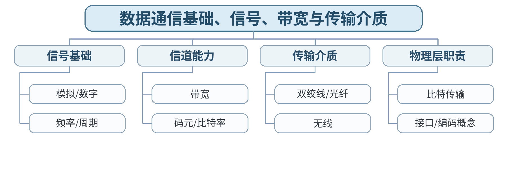

### 教学目标

**知识目标：**
- （1）理解数据通信基础、信号和常见传输介质。
**能力目标：**
- （1）能够根据工程约束选择合适介质并解释理由。
**价值目标：**
- （1）形成面向环境、可靠性和维护成本综合选型的意识。

### 课程思政

通过电磁干扰、布线质量和通信失效案例强调基础设施质量和施工规范直接影响系统安全。

### 专创融合 / 双创融合

从智能产线布线和无线覆盖需求出发，训练网络基础设施选型能力。

### 教学重难点

教学重点：信号、带宽、传输介质和物理层职责。
教学难点：理解物理带宽、数据率和实际吞吐量不是同一个概念。

### 教学方法

讲授法、问题引导法、协议推演法、案例分析法、教师演示法、分组讨论法、方案评审与证据复盘

### 教学用具

电脑、投影仪、多媒体课件、教材、网络协议结构图、教师提供的抓包/报文字段资料、地址/路由练习表

### 教学设计

课前任务 → 互动导入（15 min）→ 传授新知与课堂训练（70 min）→ 过关检测（10 min）→ 课堂小结（3 min）→ 作业布置（1 min）→ 考勤（1 min）

### 教学过程

#### 课前任务

【教师】发布“数据通信基础、信号、带宽与传输介质”预习材料和一个最小判断问题；要求只使用教材、课程资料或教师提供数据。
【学生】阅读对应内容，记录3个核心术语和至少1个疑问；准备课堂分析表。

**设计意图：** 通过阅读和最小问题建立先备认知，让学生带着可验证问题进入课堂。

#### 互动导入与传授新知 / 课堂训练

【互动导入 15 min】
【教师】对比“千兆以太网端口”和“1 GHz无线频段”中的“带宽”含义，要求学生判断两个术语是否完全相同。
【学生】先独立判断/计算，再交换依据。

【传授新知与课堂训练 70 min】
【教师】回顾周期、频率、模拟/数字信号和数字通信基本概念。
【学生】完成对应分析/推演并记录判断依据。
【教师】比较双绞线、光纤和无线介质在距离、抗干扰、容量、成本方面的差异。
【学生】完成对应分析/推演并记录判断依据。
【教师】学生根据三种智能制造场景选择介质并写出至少3条工程约束。
【学生】完成对应分析/推演并记录判断依据。

【课堂产物】传输介质选型表：场景、距离、干扰、带宽、安全、成本。
【学习证据】选型表 + 依据说明 + 一条反例修正。
【评价关联】平时学习与课堂分析；目标1.2、2.2、3.2。

**设计意图：** 采用“先判断/计算 → 最小讲解 → 协议/数据流推演 → 独立分析产出 → 证据复核”的理论课闭环，把抽象网络原理落实到可检查的图表、计算和故障证据。

### 过关检测

【教师】组织当堂检测：
- 1. 物理层传输的基本单位是什么？
- 2. 光纤相较双绞线有哪些典型优势？
- 3. 为什么端口标称速率不等于应用吞吐量？
【学生】独立作答；【教师】要求说明判断依据。

### 课堂小结

【教师】回到知识脉络图，用“概念—关系—协议行为—工程边界”总结“数据通信基础、信号、带宽与传输介质”。
【学生】写下本课最重要的一条规则和一个最容易误判的边界。

### 作业布置

【教师】布置课后任务：为“产线相机—边缘服务器”和“移动机器人—AP”分别选择介质并说明理由。
【学生】按课程文件命名要求整理分析图、计算/协议表和必要说明。

### 考勤

【教师】利用学校/课程实际使用的平台进行签到。
【学生】按课程要求完成签到。

### 课后教学反思

【课后填写，不预填事实】
- 1. 教学流程：记录100 min各环节实际用时及需调整位置；
- 2. 教学内容：重点记录“理解物理带宽、数据率和实际吞吐量不是同一个概念。”的真实掌握证据与常见错误；
- 3. 学生参与：仅依据实际课堂记录填写独立分析、讨论、互审情况，不补写推测；
- 4. 评价证据：检查本课分析表/流程图/计算单/方案证据是否完整，记录缺项；
- 5. 后续改进：依据真实课堂证据确定下一轮调整。

### 本章节参考文献

[1] 胡亮, 徐高潮, 张宗升, 霍严梅, 车喜龙. 计算机网络[M]. 北京：高等教育出版社，2024. ISBN 9787040612875
[2] 袁华, 王昊翔, 黄敏. 深入理解计算机网络[M]. 北京：清华大学出版社，2024. ISBN 9787302662709
[3] 冯博琴, 陈妍. 计算机网络（第4版）[M]. 北京：高等教育出版社，2023. ISBN 9787040599909

## 第05次课 数据链路层：成帧、差错检测、MAC与ARP

- **章节/单元**：第2单元 物理层、数据链路层、以太网与无线局域网
- **周次**：按实际课表填写
- **课时安排**：2课时（100 min）

### 知识脉络图

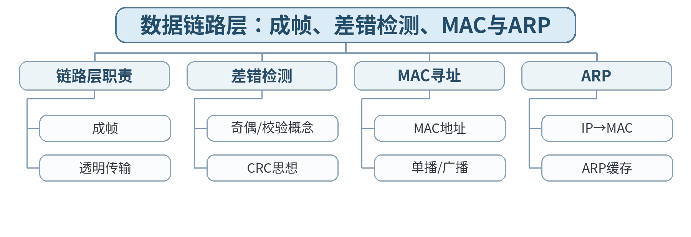

### 教学目标

**知识目标：**
- （1）掌握成帧、差错检测、MAC与ARP基本机制。
**能力目标：**
- （1）能够依据MAC/ARP信息分析局域网通信。
**价值目标：**
- （1）形成不越权抓包、用证据定位链路问题的习惯。

### 课程思政

通过MAC欺骗和ARP异常案例强调授权环境、网络边界和规范诊断。

### 专创融合 / 双创融合

将ARP/MAC分析作为设备接入和边缘节点故障定位的第一层工具。

### 教学重难点

教学重点：成帧、差错检测、MAC地址与ARP。
教学难点：区分IP地址与MAC地址的作用，并解释ARP仅用于本地链路邻居解析。

### 教学方法

讲授法、问题引导法、协议推演法、案例分析法、教师演示法、分组讨论法、方案评审与证据复盘

### 教学用具

电脑、投影仪、多媒体课件、教材、网络协议结构图、教师提供的抓包/报文字段资料、地址/路由练习表

### 教学设计

课前任务 → 互动导入（15 min）→ 传授新知与课堂训练（70 min）→ 过关检测（10 min）→ 课堂小结（3 min）→ 作业布置（1 min）→ 考勤（1 min）

### 教学过程

#### 课前任务

【教师】发布“数据链路层：成帧、差错检测、MAC与ARP”预习材料和一个最小判断问题；要求只使用教材、课程资料或教师提供数据。
【学生】阅读对应内容，记录3个核心术语和至少1个疑问；准备课堂分析表。

**设计意图：** 通过阅读和最小问题建立先备认知，让学生带着可验证问题进入课堂。

#### 互动导入与传授新知 / 课堂训练

【互动导入 15 min】
【教师】给出“已知目标IP但不知道目标MAC”的局域网通信场景，学生先画主机需要广播什么、谁应该回答。
【学生】先独立判断/计算，再交换依据。

【传授新知与课堂训练 70 min】
【教师】说明数据链路层如何把网络层数据组织为帧并进行差错检测。
【学生】完成对应分析/推演并记录判断依据。
【教师】解释MAC地址与IP地址分别解决“链路交付”和“网络寻址”的不同问题。
【学生】完成对应分析/推演并记录判断依据。
【教师】用教师提供ARP请求/响应字段或抓包截图，学生完成源/目的MAC、源/目的IP和缓存变化表。
【学生】完成对应分析/推演并记录判断依据。

【课堂产物】ARP请求/响应分析表及帧字段标注图。
【学习证据】教师提供抓包截图/字段表 + 学生标注 + 缓存变化说明。
【评价关联】平时学习与课堂分析；课程作业过程证据；目标1.2、2.2、3.2。

**设计意图：** 采用“先判断/计算 → 最小讲解 → 协议/数据流推演 → 独立分析产出 → 证据复核”的理论课闭环，把抽象网络原理落实到可检查的图表、计算和故障证据。

### 过关检测

【教师】组织当堂检测：
- 1. ARP请求为什么通常使用广播？
- 2. 路由器外的远端主机MAC是否直接由本机ARP获得？
- 3. CRC检测到差错是否等于自动纠错？
【学生】独立作答；【教师】要求说明判断依据。

### 课堂小结

【教师】回到知识脉络图，用“概念—关系—协议行为—工程边界”总结“数据链路层：成帧、差错检测、MAC与ARP”。
【学生】写下本课最重要的一条规则和一个最容易误判的边界。

### 作业布置

【教师】布置课后任务：根据给定ARP表和主机地址，推演同网段通信前的ARP过程。
【学生】按课程文件命名要求整理分析图、计算/协议表和必要说明。

### 考勤

【教师】利用学校/课程实际使用的平台进行签到。
【学生】按课程要求完成签到。

### 课后教学反思

【课后填写，不预填事实】
- 1. 教学流程：记录100 min各环节实际用时及需调整位置；
- 2. 教学内容：重点记录“区分IP地址与MAC地址的作用，并解释ARP仅用于本地链路邻居解析。”的真实掌握证据与常见错误；
- 3. 学生参与：仅依据实际课堂记录填写独立分析、讨论、互审情况，不补写推测；
- 4. 评价证据：检查本课分析表/流程图/计算单/方案证据是否完整，记录缺项；
- 5. 后续改进：依据真实课堂证据确定下一轮调整。

### 本章节参考文献

[1] 胡亮, 徐高潮, 张宗升, 霍严梅, 车喜龙. 计算机网络[M]. 北京：高等教育出版社，2024. ISBN 9787040612875
[2] 袁华, 王昊翔, 黄敏. 深入理解计算机网络[M]. 北京：清华大学出版社，2024. ISBN 9787302662709
[3] 冯博琴, 陈妍. 计算机网络（第4版）[M]. 北京：高等教育出版社，2023. ISBN 9787040599909

## 第06次课 以太网帧、交换机学习转发、广播域与VLAN

- **章节/单元**：第2单元 物理层、数据链路层、以太网与无线局域网
- **周次**：按实际课表填写
- **课时安排**：2课时（100 min）

### 知识脉络图

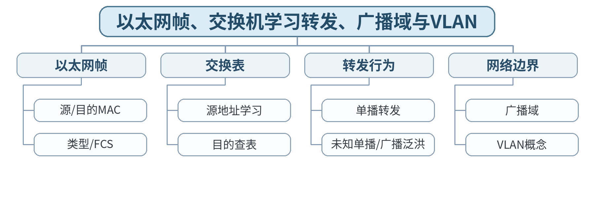

### 教学目标

**知识目标：**
- （1）掌握以太网帧、交换机学习与转发机制。
- （2）理解广播域和VLAN概念。
**能力目标：**
- （1）能够根据MAC表推演帧传递并分析常见局域网问题。
**价值目标：**
- （1）形成规范配置和变更可追溯意识。

### 课程思政

通过二层环路和广播风暴后果强化规范配置、边界意识和变更责任。

### 专创融合 / 双创融合

把VLAN与设备类型/生产单元逻辑分区联系，训练中小型网络分区设计。

### 教学重难点

教学重点：以太网帧与交换机学习/转发；广播域与VLAN。
教学难点：根据交换表状态动态推演帧转发，而不是死记“交换机转发端口”。

### 教学方法

讲授法、问题引导法、协议推演法、案例分析法、教师演示法、分组讨论法、方案评审与证据复盘

### 教学用具

电脑、投影仪、多媒体课件、教材、网络协议结构图、教师提供的抓包/报文字段资料、地址/路由练习表

### 教学设计

课前任务 → 互动导入（15 min）→ 传授新知与课堂训练（70 min）→ 过关检测（10 min）→ 课堂小结（3 min）→ 作业布置（1 min）→ 考勤（1 min）

### 教学过程

#### 课前任务

【教师】发布“以太网帧、交换机学习转发、广播域与VLAN”预习材料和一个最小判断问题；要求只使用教材、课程资料或教师提供数据。
【学生】阅读对应内容，记录3个核心术语和至少1个疑问；准备课堂分析表。

**设计意图：** 通过阅读和最小问题建立先备认知，让学生带着可验证问题进入课堂。

#### 互动导入与传授新知 / 课堂训练

【互动导入 15 min】
【教师】给出一台4口交换机空MAC表和A→B、B→A、C→A三次通信，让学生逐步填写MAC表并预测每一步转发端口。
【学生】先独立判断/计算，再交换依据。

【传授新知与课堂训练 70 min】
【教师】解析以太网帧主要字段及交换机源地址学习机制。
【学生】完成对应分析/推演并记录判断依据。
【教师】通过已知单播、未知单播和广播三类情况推演转发。
【学生】完成对应分析/推演并记录判断依据。
【教师】引入广播域和VLAN概念，学生完成“端口—VLAN—广播可达范围”示意表。
【学生】完成对应分析/推演并记录判断依据。

【课堂产物】交换机MAC表演化与帧转发推演表。
【学习证据】三轮转发记录 + MAC表 + VLAN广播范围图。
【评价关联】平时学习与课堂分析；课程作业重点证据；目标1.2、2.2、3.2。

**设计意图：** 采用“先判断/计算 → 最小讲解 → 协议/数据流推演 → 独立分析产出 → 证据复核”的理论课闭环，把抽象网络原理落实到可检查的图表、计算和故障证据。

### 过关检测

【教师】组织当堂检测：
- 1. 交换机学习的是源MAC还是目的MAC？
- 2. 未知单播帧如何处理？
- 3. VLAN为什么可以划分广播域？
【学生】独立作答；【教师】要求说明判断依据。

### 课堂小结

【教师】回到知识脉络图，用“概念—关系—协议行为—工程边界”总结“以太网帧、交换机学习转发、广播域与VLAN”。
【学生】写下本课最重要的一条规则和一个最容易误判的边界。

### 作业布置

【教师】布置课后任务：完成一个双VLAN网络的广播可达性分析，不要求厂商命令。
【学生】按课程文件命名要求整理分析图、计算/协议表和必要说明。

### 考勤

【教师】利用学校/课程实际使用的平台进行签到。
【学生】按课程要求完成签到。

### 课后教学反思

【课后填写，不预填事实】
- 1. 教学流程：记录100 min各环节实际用时及需调整位置；
- 2. 教学内容：重点记录“根据交换表状态动态推演帧转发，而不是死记“交换机转发端口”。”的真实掌握证据与常见错误；
- 3. 学生参与：仅依据实际课堂记录填写独立分析、讨论、互审情况，不补写推测；
- 4. 评价证据：检查本课分析表/流程图/计算单/方案证据是否完整，记录缺项；
- 5. 后续改进：依据真实课堂证据确定下一轮调整。

### 本章节参考文献

[1] 胡亮, 徐高潮, 张宗升, 霍严梅, 车喜龙. 计算机网络[M]. 北京：高等教育出版社，2024. ISBN 9787040612875
[2] 袁华, 王昊翔, 黄敏. 深入理解计算机网络[M]. 北京：清华大学出版社，2024. ISBN 9787302662709
[3] 冯博琴, 陈妍. 计算机网络（第4版）[M]. 北京：高等教育出版社，2023. ISBN 9787040599909

## 第07次课 802.11无线局域网与局域网综合故障分析

- **章节/单元**：第2单元 物理层、数据链路层、以太网与无线局域网
- **周次**：按实际课表填写
- **课时安排**：2课时（100 min）

### 知识脉络图

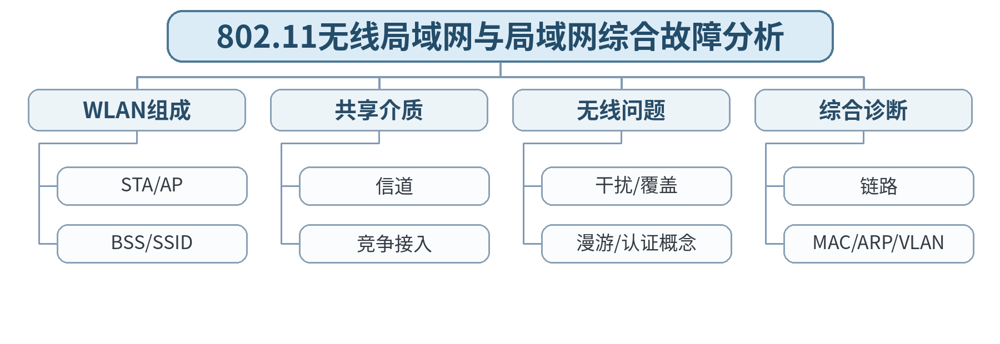

### 教学目标

**知识目标：**
- （1）理解802.11无线局域网基本组成和共享介质特性。
**能力目标：**
- （1）能够综合MAC、ARP、VLAN与无线信息分析局域网故障。
**价值目标：**
- （1）形成授权诊断和分层排错的工程规范。

### 课程思政

强调无线接入安全、最小权限和禁止未经授权扫描/抓包。

### 专创融合 / 双创融合

面向移动机器人和AGV无线接入，训练覆盖、漫游、VLAN和故障定位的系统思维。

### 教学重难点

教学重点：802.11基本组成、共享介质特性与局域网分层诊断。
教学难点：将“信号问题、接入问题、地址问题、交换问题”分层，不用一个“网络不好”概括全部故障。

### 教学方法

讲授法、问题引导法、协议推演法、案例分析法、教师演示法、分组讨论法、方案评审与证据复盘

### 教学用具

电脑、投影仪、多媒体课件、教材、网络协议结构图、教师提供的抓包/报文字段资料、地址/路由练习表

### 教学设计

课前任务 → 互动导入（15 min）→ 传授新知与课堂训练（70 min）→ 过关检测（10 min）→ 课堂小结（3 min）→ 作业布置（1 min）→ 考勤（1 min）

### 教学过程

#### 课前任务

【教师】发布“802.11无线局域网与局域网综合故障分析”预习材料和一个最小判断问题；要求只使用教材、课程资料或教师提供数据。
【学生】阅读对应内容，记录3个核心术语和至少1个疑问；准备课堂分析表。

**设计意图：** 通过阅读和最小问题建立先备认知，让学生带着可验证问题进入课堂。

#### 互动导入与传授新知 / 课堂训练

【互动导入 15 min】
【教师】给出“移动机器人可以连上Wi-Fi但访问不了边缘服务器”的故障描述，学生先列出至少四层不同原因。
【学生】先独立判断/计算，再交换依据。

【传授新知与课堂训练 70 min】
【教师】介绍STA、AP、SSID/BSS、信道共享和无线覆盖/干扰的基本概念。
【学生】完成对应分析/推演并记录判断依据。
【教师】比较有线以太网与无线局域网在介质共享、稳定性和移动性上的差异。
【学生】完成对应分析/推演并记录判断依据。
【教师】用故障树整合本单元：物理信号→关联→VLAN→MAC/ARP→上层，学生完成分层排障顺序。
【学生】完成对应分析/推演并记录判断依据。

【课堂产物】WLAN与以太网局域网综合故障树。
【学习证据】故障树 + 每层一个可观察证据 + 修复优先级。
【评价关联】平时学习与课堂分析；课程作业重点证据；目标1.2、2.2、3.2。

**设计意图：** 采用“先判断/计算 → 最小讲解 → 协议/数据流推演 → 独立分析产出 → 证据复核”的理论课闭环，把抽象网络原理落实到可检查的图表、计算和故障证据。

### 过关检测

【教师】组织当堂检测：
- 1. AP与无线终端分别承担什么角色？
- 2. 为什么信号强不等于应用一定可达？
- 3. 局域网排障为什么应先确认链路和地址边界？
【学生】独立作答；【教师】要求说明判断依据。

### 课堂小结

【教师】回到知识脉络图，用“概念—关系—协议行为—工程边界”总结“802.11无线局域网与局域网综合故障分析”。
【学生】写下本课最重要的一条规则和一个最容易误判的边界。

### 作业布置

【教师】布置课后任务：完善“机器人无法访问边缘服务器”故障树，至少包含8个检查点。
【学生】按课程文件命名要求整理分析图、计算/协议表和必要说明。

### 考勤

【教师】利用学校/课程实际使用的平台进行签到。
【学生】按课程要求完成签到。

### 课后教学反思

【课后填写，不预填事实】
- 1. 教学流程：记录100 min各环节实际用时及需调整位置；
- 2. 教学内容：重点记录“将“信号问题、接入问题、地址问题、交换问题”分层，不用一个“网络不好”概括全部故障。”的真实掌握证据与常见错误；
- 3. 学生参与：仅依据实际课堂记录填写独立分析、讨论、互审情况，不补写推测；
- 4. 评价证据：检查本课分析表/流程图/计算单/方案证据是否完整，记录缺项；
- 5. 后续改进：依据真实课堂证据确定下一轮调整。

### 本章节参考文献

[1] 胡亮, 徐高潮, 张宗升, 霍严梅, 车喜龙. 计算机网络[M]. 北京：高等教育出版社，2024. ISBN 9787040612875
[2] 袁华, 王昊翔, 黄敏. 深入理解计算机网络[M]. 北京：清华大学出版社，2024. ISBN 9787302662709
[3] 冯博琴, 陈妍. 计算机网络（第4版）[M]. 北京：高等教育出版社，2023. ISBN 9787040599909

## 第08次课 IPv4数据报、地址结构、CIDR与前缀

- **章节/单元**：第3单元 网络层、IPv4/IPv6、路由与网络互联
- **周次**：按实际课表填写
- **课时安排**：2课时（100 min）

### 知识脉络图

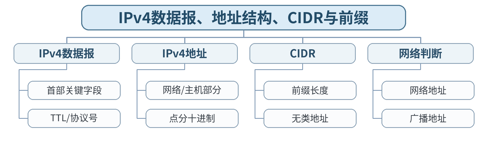

### 教学目标

**知识目标：**
- （1）掌握IPv4数据报主要字段和CIDR地址表示。
**能力目标：**
- （1）能够判断网络地址、广播地址和主机范围。
**价值目标：**
- （1）形成地址规划精确、计算可复核的习惯。

### 课程思政

结合IPv4地址资源有限性，培养规范规划公共/私有地址资源的意识。

### 专创融合 / 双创融合

将CIDR作为后续产线分区、设备子网和路由聚合的基础能力。

### 教学重难点

教学重点：IPv4数据报、CIDR前缀和网络地址判断。
教学难点：把“地址数、可用主机数、网络/广播地址”与CIDR前缀统一理解。

### 教学方法

讲授法、问题引导法、协议推演法、案例分析法、教师演示法、分组讨论法、方案评审与证据复盘

### 教学用具

电脑、投影仪、多媒体课件、教材、网络协议结构图、教师提供的抓包/报文字段资料、地址/路由练习表

### 教学设计

课前任务 → 互动导入（15 min）→ 传授新知与课堂训练（70 min）→ 过关检测（10 min）→ 课堂小结（3 min）→ 作业布置（1 min）→ 考勤（1 min）

### 教学过程

#### 课前任务

【教师】发布“IPv4数据报、地址结构、CIDR与前缀”预习材料和一个最小判断问题；要求只使用教材、课程资料或教师提供数据。
【学生】阅读对应内容，记录3个核心术语和至少1个疑问；准备课堂分析表。

**设计意图：** 通过阅读和最小问题建立先备认知，让学生带着可验证问题进入课堂。

#### 互动导入与传授新知 / 课堂训练

【互动导入 15 min】
【教师】给出192.168.10.130/26，要求学生不查表先判断网络地址、广播地址和可用主机范围。
【学生】先独立判断/计算，再交换依据。

【传授新知与课堂训练 70 min】
【教师】解析IPv4首部中版本、总长度、TTL、协议、源/目的地址等字段。
【学生】完成对应分析/推演并记录判断依据。
【教师】从二进制位解释CIDR前缀、网络部分和主机部分。
【学生】完成对应分析/推演并记录判断依据。
【教师】学生完成4个地址的网络/广播/主机范围判断，并互相检查边界。
【学生】完成对应分析/推演并记录判断依据。

【课堂产物】CIDR地址边界计算表。
【学习证据】二进制/十进制计算过程 + 边界检查。
【评价关联】平时学习与课堂分析；课程作业重点证据；目标1.3、2.3、3.3。

**设计意图：** 采用“先判断/计算 → 最小讲解 → 协议/数据流推演 → 独立分析产出 → 证据复核”的理论课闭环，把抽象网络原理落实到可检查的图表、计算和故障证据。

### 过关检测

【教师】组织当堂检测：
- 1. /26对应多少个地址？
- 2. TTL的主要作用是什么？
- 3. 同一IP地址在不同前缀长度下网络边界是否可能不同？
【学生】独立作答；【教师】要求说明判断依据。

### 课堂小结

【教师】回到知识脉络图，用“概念—关系—协议行为—工程边界”总结“IPv4数据报、地址结构、CIDR与前缀”。
【学生】写下本课最重要的一条规则和一个最容易误判的边界。

### 作业布置

【教师】布置课后任务：完成5个CIDR边界计算题，并写出1条“前缀写错导致网络故障”的说明。
【学生】按课程文件命名要求整理分析图、计算/协议表和必要说明。

### 考勤

【教师】利用学校/课程实际使用的平台进行签到。
【学生】按课程要求完成签到。

### 课后教学反思

【课后填写，不预填事实】
- 1. 教学流程：记录100 min各环节实际用时及需调整位置；
- 2. 教学内容：重点记录“把“地址数、可用主机数、网络/广播地址”与CIDR前缀统一理解。”的真实掌握证据与常见错误；
- 3. 学生参与：仅依据实际课堂记录填写独立分析、讨论、互审情况，不补写推测；
- 4. 评价证据：检查本课分析表/流程图/计算单/方案证据是否完整，记录缺项；
- 5. 后续改进：依据真实课堂证据确定下一轮调整。

### 本章节参考文献

[1] 胡亮, 徐高潮, 张宗升, 霍严梅, 车喜龙. 计算机网络[M]. 北京：高等教育出版社，2024. ISBN 9787040612875
[2] 袁华, 王昊翔, 黄敏. 深入理解计算机网络[M]. 北京：清华大学出版社，2024. ISBN 9787302662709
[3] 冯博琴, 陈妍. 计算机网络（第4版）[M]. 北京：高等教育出版社，2023. ISBN 9787040599909

## 第09次课 IPv4子网划分与地址规划

- **章节/单元**：第3单元 网络层、IPv4/IPv6、路由与网络互联
- **周次**：按实际课表填写
- **课时安排**：2课时（100 min）

### 知识脉络图

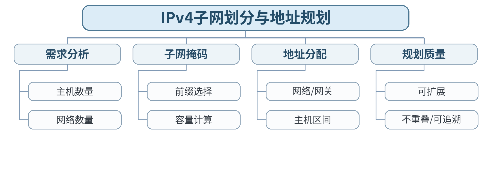

### 教学目标

**知识目标：**
- （1）掌握IPv4子网划分和地址规划方法。
**能力目标：**
- （1）能够根据规模需求完成子网方案并验证容量。
**价值目标：**
- （1）形成可扩展、可追溯的地址管理意识。

### 课程思政

通过地址资源规划培养长期演进、配置可追溯和公共资源规范使用意识。

### 专创融合 / 双创融合

将地址规划表作为中小型智能制造网络方案的核心交付件。

### 教学重难点

教学重点：子网划分、地址规划和容量校验。
教学难点：从业务需求选择前缀并验证不重叠、容量和扩展余量。

### 教学方法

讲授法、问题引导法、协议推演法、案例分析法、教师演示法、分组讨论法、方案评审与证据复盘

### 教学用具

电脑、投影仪、多媒体课件、教材、网络协议结构图、教师提供的抓包/报文字段资料、地址/路由练习表

### 教学设计

课前任务 → 互动导入（15 min）→ 传授新知与课堂训练（70 min）→ 过关检测（10 min）→ 课堂小结（3 min）→ 作业布置（1 min）→ 考勤（1 min）

### 教学过程

#### 课前任务

【教师】发布“IPv4子网划分与地址规划”预习材料和一个最小判断问题；要求只使用教材、课程资料或教师提供数据。
【学生】阅读对应内容，记录3个核心术语和至少1个疑问；准备课堂分析表。

**设计意图：** 通过阅读和最小问题建立先备认知，让学生带着可验证问题进入课堂。

#### 互动导入与传授新知 / 课堂训练

【互动导入 15 min】
【教师】给出“3条产线分别需要50、20、10个地址”的192.168.100.0/24地址块，让学生比较等长子网和按需规划。
【学生】先独立判断/计算，再交换依据。

【传授新知与课堂训练 70 min】
【教师】从主机规模和网络数量确定前缀，说明容量与浪费的权衡。
【学生】完成对应分析/推演并记录判断依据。
【教师】示范地址规划表：用途、网段、前缀、网关、主机范围、保留空间。
【学生】完成对应分析/推演并记录判断依据。
【教师】学生独立完成三产线地址规划，交换检查重叠和容量。
【学生】完成对应分析/推演并记录判断依据。

【课堂产物】智能制造车间IPv4地址规划表。
【学习证据】地址表 + 容量计算 + 冲突检查记录。
【评价关联】平时学习与课堂分析；课程作业重点证据；目标1.3、2.3、3.3。

**设计意图：** 采用“先判断/计算 → 最小讲解 → 协议/数据流推演 → 独立分析产出 → 证据复核”的理论课闭环，把抽象网络原理落实到可检查的图表、计算和故障证据。

### 过关检测

【教师】组织当堂检测：
- 1. 一个需要50个主机地址的子网最小可选什么前缀？
- 2. 两个子网为什么不能重叠？
- 3. 地址规划为什么要保留用途和责任信息？
【学生】独立作答；【教师】要求说明判断依据。

### 课堂小结

【教师】回到知识脉络图，用“概念—关系—协议行为—工程边界”总结“IPv4子网划分与地址规划”。
【学生】写下本课最重要的一条规则和一个最容易误判的边界。

### 作业布置

【教师】布置课后任务：完成一个包含办公、机器人、相机、服务器四区的地址规划方案。
【学生】按课程文件命名要求整理分析图、计算/协议表和必要说明。

### 考勤

【教师】利用学校/课程实际使用的平台进行签到。
【学生】按课程要求完成签到。

### 课后教学反思

【课后填写，不预填事实】
- 1. 教学流程：记录100 min各环节实际用时及需调整位置；
- 2. 教学内容：重点记录“从业务需求选择前缀并验证不重叠、容量和扩展余量。”的真实掌握证据与常见错误；
- 3. 学生参与：仅依据实际课堂记录填写独立分析、讨论、互审情况，不补写推测；
- 4. 评价证据：检查本课分析表/流程图/计算单/方案证据是否完整，记录缺项；
- 5. 后续改进：依据真实课堂证据确定下一轮调整。

### 本章节参考文献

[1] 胡亮, 徐高潮, 张宗升, 霍严梅, 车喜龙. 计算机网络[M]. 北京：高等教育出版社，2024. ISBN 9787040612875
[2] 袁华, 王昊翔, 黄敏. 深入理解计算机网络[M]. 北京：清华大学出版社，2024. ISBN 9787302662709
[3] 冯博琴, 陈妍. 计算机网络（第4版）[M]. 北京：高等教育出版社，2023. ISBN 9787040599909

## 第10次课 ARP/ICMP、NAT、MTU与分片

- **章节/单元**：第3单元 网络层、IPv4/IPv6、路由与网络互联
- **周次**：按实际课表填写
- **课时安排**：2课时（100 min）

### 知识脉络图

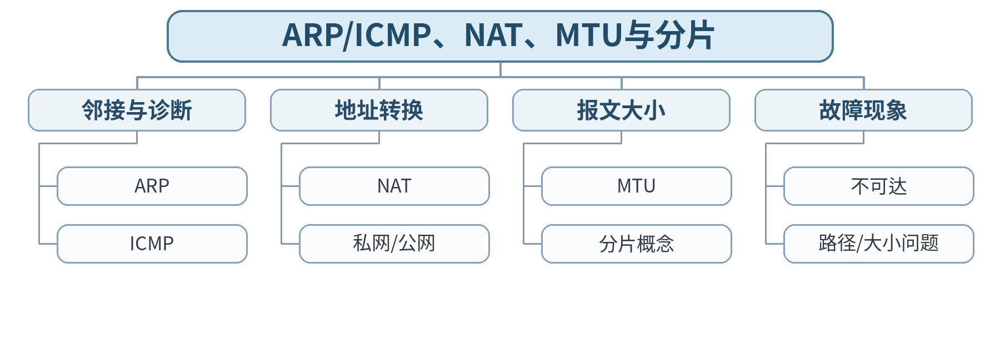

### 教学目标

**知识目标：**
- （1）理解ARP/ICMP关系、NAT、MTU和分片基本概念。
**能力目标：**
- （1）能够根据网络现象选择合适诊断证据。
**价值目标：**
- （1）形成授权诊断、逐层求证的习惯。

### 课程思政

强调诊断工具必须在授权网络使用，不因“能运行工具”就越过网络边界。

### 专创融合 / 双创融合

将ICMP/NAT/MTU故障分析迁移到边缘网关和跨网段设备通信场景。

### 教学重难点

教学重点：ICMP、NAT、MTU/分片及其故障现象。
教学难点：理解ARP、ICMP和NAT处在不同问题层面，不能把“ping不通”简单归因于ICMP。

### 教学方法

讲授法、问题引导法、协议推演法、案例分析法、教师演示法、分组讨论法、方案评审与证据复盘

### 教学用具

电脑、投影仪、多媒体课件、教材、网络协议结构图、教师提供的抓包/报文字段资料、地址/路由练习表

### 教学设计

课前任务 → 互动导入（15 min）→ 传授新知与课堂训练（70 min）→ 过关检测（10 min）→ 课堂小结（3 min）→ 作业布置（1 min）→ 考勤（1 min）

### 教学过程

#### 课前任务

【教师】发布“ARP/ICMP、NAT、MTU与分片”预习材料和一个最小判断问题；要求只使用教材、课程资料或教师提供数据。
【学生】阅读对应内容，记录3个核心术语和至少1个疑问；准备课堂分析表。

**设计意图：** 通过阅读和最小问题建立先备认知，让学生带着可验证问题进入课堂。

#### 互动导入与传授新知 / 课堂训练

【互动导入 15 min】
【教师】给出“同网段能访问、跨网段不能访问”“能ping小包、传大数据异常”两类现象，要求学生判断检查方向。
【学生】先独立判断/计算，再交换依据。

【传授新知与课堂训练 70 min】
【教师】梳理ARP与IP交付关系，介绍ICMP差错/诊断信息和Ping/Traceroute基本原理。
【学生】完成对应分析/推演并记录判断依据。
【教师】解释私网地址、NAT映射、端口复用概念。
【学生】完成对应分析/推演并记录判断依据。
【教师】介绍MTU与IPv4分片概念，学生完成一张“现象—可能层次—证据”故障表。
【学生】完成对应分析/推演并记录判断依据。

【课堂产物】ARP/ICMP/NAT/MTU综合故障判断表。
【学习证据】故障现象分类 + 证据字段 + 分层判断理由。
【评价关联】平时学习与课堂分析；课程作业重点证据；目标1.3、2.3、3.3。

**设计意图：** 采用“先判断/计算 → 最小讲解 → 协议/数据流推演 → 独立分析产出 → 证据复核”的理论课闭环，把抽象网络原理落实到可检查的图表、计算和故障证据。

### 过关检测

【教师】组织当堂检测：
- 1. Ping使用哪类协议支持？
- 2. NAT的主要目的是什么？
- 3. MTU过小可能引发什么网络现象？
【学生】独立作答；【教师】要求说明判断依据。

### 课堂小结

【教师】回到知识脉络图，用“概念—关系—协议行为—工程边界”总结“ARP/ICMP、NAT、MTU与分片”。
【学生】写下本课最重要的一条规则和一个最容易误判的边界。

### 作业布置

【教师】布置课后任务：分析3个网络层现象，分别给出第一检查证据和下一步。
【学生】按课程文件命名要求整理分析图、计算/协议表和必要说明。

### 考勤

【教师】利用学校/课程实际使用的平台进行签到。
【学生】按课程要求完成签到。

### 课后教学反思

【课后填写，不预填事实】
- 1. 教学流程：记录100 min各环节实际用时及需调整位置；
- 2. 教学内容：重点记录“理解ARP、ICMP和NAT处在不同问题层面，不能把“ping不通”简单归因于ICMP。”的真实掌握证据与常见错误；
- 3. 学生参与：仅依据实际课堂记录填写独立分析、讨论、互审情况，不补写推测；
- 4. 评价证据：检查本课分析表/流程图/计算单/方案证据是否完整，记录缺项；
- 5. 后续改进：依据真实课堂证据确定下一轮调整。

### 本章节参考文献

[1] 胡亮, 徐高潮, 张宗升, 霍严梅, 车喜龙. 计算机网络[M]. 北京：高等教育出版社，2024. ISBN 9787040612875
[2] 袁华, 王昊翔, 黄敏. 深入理解计算机网络[M]. 北京：清华大学出版社，2024. ISBN 9787302662709
[3] 冯博琴, 陈妍. 计算机网络（第4版）[M]. 北京：高等教育出版社，2023. ISBN 9787040599909

## 第11次课 路由表、最长前缀匹配与路由选择

- **章节/单元**：第3单元 网络层、IPv4/IPv6、路由与网络互联
- **周次**：按实际课表填写
- **课时安排**：2课时（100 min）

### 知识脉络图

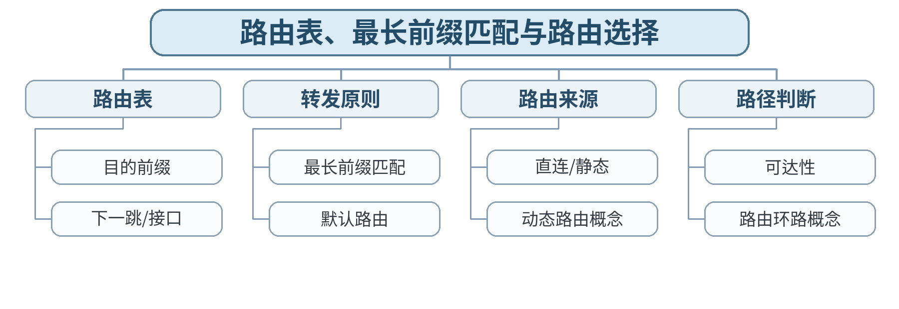

### 教学目标

**知识目标：**
- （1）掌握路由表和最长前缀匹配。
**能力目标：**
- （1）能够依据路由表分析IP转发与可达性。
**价值目标：**
- （1）形成配置变更可审查、错误可回滚的系统意识。

### 课程思政

通过路由错误导致大范围中断案例强调配置审核、变更记录和回滚责任。

### 专创融合 / 双创融合

训练网络方案中路由可达性和故障影响分析能力。

### 教学重难点

教学重点：路由表和最长前缀匹配。
教学难点：同时存在多条匹配路由时，正确应用最长前缀匹配并推演下一跳。

### 教学方法

讲授法、问题引导法、协议推演法、案例分析法、教师演示法、分组讨论法、方案评审与证据复盘

### 教学用具

电脑、投影仪、多媒体课件、教材、网络协议结构图、教师提供的抓包/报文字段资料、地址/路由练习表

### 教学设计

课前任务 → 互动导入（15 min）→ 传授新知与课堂训练（70 min）→ 过关检测（10 min）→ 课堂小结（3 min）→ 作业布置（1 min）→ 考勤（1 min）

### 教学过程

#### 课前任务

【教师】发布“路由表、最长前缀匹配与路由选择”预习材料和一个最小判断问题；要求只使用教材、课程资料或教师提供数据。
【学生】阅读对应内容，记录3个核心术语和至少1个疑问；准备课堂分析表。

**设计意图：** 通过阅读和最小问题建立先备认知，让学生带着可验证问题进入课堂。

#### 互动导入与传授新知 / 课堂训练

【互动导入 15 min】
【教师】给出含/0、/16、/24、/25的路由表和4个目的地址，要求学生只按规则选路，不凭“看起来更近”。
【学生】先独立判断/计算，再交换依据。

【传授新知与课堂训练 70 min】
【教师】解释路由表中目的前缀、下一跳、接口等基本字段。
【学生】完成对应分析/推演并记录判断依据。
【教师】用二进制前缀说明最长前缀匹配和默认路由。
【学生】完成对应分析/推演并记录判断依据。
【教师】学生完成4个目的地址的逐项匹配过程，并检查是否存在不可达/错误下一跳。
【学生】完成对应分析/推演并记录判断依据。

【课堂产物】路由表查找与最长前缀匹配推演表。
【学习证据】逐条匹配过程 + 最终下一跳 + 错误路由修正。
【评价关联】平时学习与课堂分析；课程作业重点证据；目标1.3、2.3、3.3。

**设计意图：** 采用“先判断/计算 → 最小讲解 → 协议/数据流推演 → 独立分析产出 → 证据复核”的理论课闭环，把抽象网络原理落实到可检查的图表、计算和故障证据。

### 过关检测

【教师】组织当堂检测：
- 1. 什么是默认路由？
- 2. 为什么选择最长前缀而不是最短前缀？
- 3. 直连路由与静态路由有什么区别？
【学生】独立作答；【教师】要求说明判断依据。

### 课堂小结

【教师】回到知识脉络图，用“概念—关系—协议行为—工程边界”总结“路由表、最长前缀匹配与路由选择”。
【学生】写下本课最重要的一条规则和一个最容易误判的边界。

### 作业布置

【教师】布置课后任务：完成一张包含两个子网和一个默认出口的路由表推演题。
【学生】按课程文件命名要求整理分析图、计算/协议表和必要说明。

### 考勤

【教师】利用学校/课程实际使用的平台进行签到。
【学生】按课程要求完成签到。

### 课后教学反思

【课后填写，不预填事实】
- 1. 教学流程：记录100 min各环节实际用时及需调整位置；
- 2. 教学内容：重点记录“同时存在多条匹配路由时，正确应用最长前缀匹配并推演下一跳。”的真实掌握证据与常见错误；
- 3. 学生参与：仅依据实际课堂记录填写独立分析、讨论、互审情况，不补写推测；
- 4. 评价证据：检查本课分析表/流程图/计算单/方案证据是否完整，记录缺项；
- 5. 后续改进：依据真实课堂证据确定下一轮调整。

### 本章节参考文献

[1] 胡亮, 徐高潮, 张宗升, 霍严梅, 车喜龙. 计算机网络[M]. 北京：高等教育出版社，2024. ISBN 9787040612875
[2] 袁华, 王昊翔, 黄敏. 深入理解计算机网络[M]. 北京：清华大学出版社，2024. ISBN 9787302662709
[3] 冯博琴, 陈妍. 计算机网络（第4版）[M]. 北京：高等教育出版社，2023. ISBN 9787040599909

## 第12次课 RIP/OSPF/BGP概念、IPv6与网络层综合

- **章节/单元**：第3单元 网络层、IPv4/IPv6、路由与网络互联
- **周次**：按实际课表填写
- **课时安排**：2课时（100 min）

### 知识脉络图

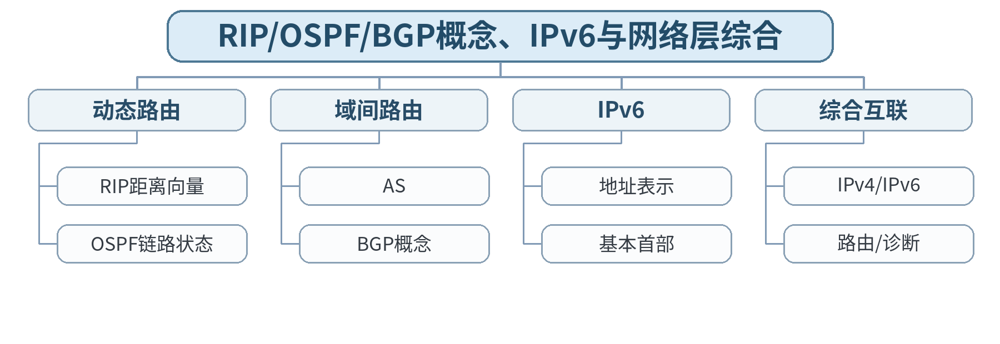

### 教学目标

**知识目标：**
- （1）理解RIP/OSPF/BGP概念和IPv6基本机制。
**能力目标：**
- （1）能够识读IPv6并综合分析网络层故障。
**价值目标：**
- （1）形成持续学习、长期演进和系统兼容意识。

### 课程思政

结合IPv6演进说明工程技术需要兼顾存量兼容与长期发展。

### 专创融合 / 双创融合

将IPv6和动态路由作为面向未来边缘/物联网网络方案的基础认知。

### 教学重难点

教学重点：动态路由协议分工、IPv6地址/首部及网络层综合。
教学难点：理解RIP/OSPF/BGP的适用层次而非记厂商配置；正确压缩IPv6地址。

### 教学方法

讲授法、问题引导法、协议推演法、案例分析法、教师演示法、分组讨论法、方案评审与证据复盘

### 教学用具

电脑、投影仪、多媒体课件、教材、网络协议结构图、教师提供的抓包/报文字段资料、地址/路由练习表

### 教学设计

课前任务 → 互动导入（15 min）→ 传授新知与课堂训练（70 min）→ 过关检测（10 min）→ 课堂小结（3 min）→ 作业布置（1 min）→ 考勤（1 min）

### 教学过程

#### 课前任务

【教师】发布“RIP/OSPF/BGP概念、IPv6与网络层综合”预习材料和一个最小判断问题；要求只使用教材、课程资料或教师提供数据。
【学生】阅读对应内容，记录3个核心术语和至少1个疑问；准备课堂分析表。

**设计意图：** 通过阅读和最小问题建立先备认知，让学生带着可验证问题进入课堂。

#### 互动导入与传授新知 / 课堂训练

【互动导入 15 min】
【教师】给出“园区内部选路”和“不同运营网络之间选路”两种问题，学生判断OSPF/BGP为何不是同一层次的协议。
【学生】先独立判断/计算，再交换依据。

【传授新知与课堂训练 70 min】
【教师】概念性比较RIP、OSPF、BGP的作用范围和基本思路，不展开设备命令。
【学生】完成对应分析/推演并记录判断依据。
【教师】讲解IPv6地址表示、压缩规则、首部简化和IPv4向IPv6演进。
【学生】完成对应分析/推演并记录判断依据。
【教师】学生完成2个IPv6压缩/还原和一张网络层综合故障链：地址→网关→路由→ICMP/NAT→服务。
【学生】完成对应分析/推演并记录判断依据。

【课堂产物】动态路由协议对比表 + IPv6地址练习 + 网络层综合故障链。
【学习证据】对比表、IPv6练习和分层故障路径。
【评价关联】平时学习与课堂分析；课程作业重点证据；目标1.3、2.3、3.3。

**设计意图：** 采用“先判断/计算 → 最小讲解 → 协议/数据流推演 → 独立分析产出 → 证据复核”的理论课闭环，把抽象网络原理落实到可检查的图表、计算和故障证据。

### 过关检测

【教师】组织当堂检测：
- 1. OSPF与BGP的主要使用范围有什么不同？
- 2. IPv6地址中::最多出现几次？
- 3. 网络层排障至少应检查哪三类信息？
【学生】独立作答；【教师】要求说明判断依据。

### 课堂小结

【教师】回到知识脉络图，用“概念—关系—协议行为—工程边界”总结“RIP/OSPF/BGP概念、IPv6与网络层综合”。
【学生】写下本课最重要的一条规则和一个最容易误判的边界。

### 作业布置

【教师】布置课后任务：整理网络层课程作业部分：地址规划、路由分析、ICMP/NAT或IPv6案例。
【学生】按课程文件命名要求整理分析图、计算/协议表和必要说明。

### 考勤

【教师】利用学校/课程实际使用的平台进行签到。
【学生】按课程要求完成签到。

### 课后教学反思

【课后填写，不预填事实】
- 1. 教学流程：记录100 min各环节实际用时及需调整位置；
- 2. 教学内容：重点记录“理解RIP/OSPF/BGP的适用层次而非记厂商配置；正确压缩IPv6地址。”的真实掌握证据与常见错误；
- 3. 学生参与：仅依据实际课堂记录填写独立分析、讨论、互审情况，不补写推测；
- 4. 评价证据：检查本课分析表/流程图/计算单/方案证据是否完整，记录缺项；
- 5. 后续改进：依据真实课堂证据确定下一轮调整。

### 本章节参考文献

[1] 胡亮, 徐高潮, 张宗升, 霍严梅, 车喜龙. 计算机网络[M]. 北京：高等教育出版社，2024. ISBN 9787040612875
[2] 袁华, 王昊翔, 黄敏. 深入理解计算机网络[M]. 北京：清华大学出版社，2024. ISBN 9787302662709
[3] 冯博琴, 陈妍. 计算机网络（第4版）[M]. 北京：高等教育出版社，2023. ISBN 9787040599909

## 第13次课 端口、复用/分用、UDP与Socket概念

- **章节/单元**：第4单元 运输层、UDP/TCP与端到端可靠传输
- **周次**：按实际课表填写
- **课时安排**：2课时（100 min）

### 知识脉络图

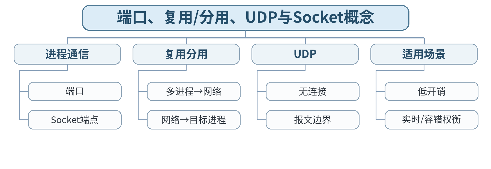

### 教学目标

**知识目标：**
- （1）掌握端口、复用/分用和UDP基本机制。
**能力目标：**
- （1）能够根据应用需求初步选择UDP/TCP。
**价值目标：**
- （1）形成端口服务最小暴露和需求驱动选型意识。

### 课程思政

通过共享网络资源和端口服务暴露讨论最小暴露、合法使用网络服务。

### 专创融合 / 双创融合

为MES、机器人遥测和实时数据流选择运输层协议，训练需求驱动的协议选型。

### 教学重难点

教学重点：端口、UDP和进程间端到端通信。
教学难点：区分IP地址定位主机与端口定位进程，并理解UDP“无连接”不等于“无用途/不可靠系统”。

### 教学方法

讲授法、问题引导法、协议推演法、案例分析法、教师演示法、分组讨论法、方案评审与证据复盘

### 教学用具

电脑、投影仪、多媒体课件、教材、网络协议结构图、教师提供的抓包/报文字段资料、地址/路由练习表

### 教学设计

课前任务 → 互动导入（15 min）→ 传授新知与课堂训练（70 min）→ 过关检测（10 min）→ 课堂小结（3 min）→ 作业布置（1 min）→ 考勤（1 min）

### 教学过程

#### 课前任务

【教师】发布“端口、复用/分用、UDP与Socket概念”预习材料和一个最小判断问题；要求只使用教材、课程资料或教师提供数据。
【学生】阅读对应内容，记录3个核心术语和至少1个疑问；准备课堂分析表。

**设计意图：** 通过阅读和最小问题建立先备认知，让学生带着可验证问题进入课堂。

#### 互动导入与传授新知 / 课堂训练

【互动导入 15 min】
【教师】给出同一服务器同时运行Web、DNS、MQTT三项服务，提问“只有IP地址够不够找到正确程序？”
【学生】先独立判断/计算，再交换依据。

【传授新知与课堂训练 70 min】
【教师】说明运输层复用/分用以及端口号和Socket端点概念。
【学生】完成对应分析/推演并记录判断依据。
【教师】解析UDP报文基本字段、无连接和保留报文边界的特性。
【学生】完成对应分析/推演并记录判断依据。
【教师】学生对DNS查询、视频流、设备遥测三个场景选择UDP/TCP并写出依据。
【学生】完成对应分析/推演并记录判断依据。

【课堂产物】运输层端口映射图 + UDP/TCP初步选型表。
【学习证据】端口图、协议选型理由和反例修正。
【评价关联】平时学习与课堂分析；课程作业过程证据；目标1.4、2.4、3.4。

**设计意图：** 采用“先判断/计算 → 最小讲解 → 协议/数据流推演 → 独立分析产出 → 证据复核”的理论课闭环，把抽象网络原理落实到可检查的图表、计算和故障证据。

### 过关检测

【教师】组织当堂检测：
- 1. 端口号主要用于标识什么？
- 2. UDP为什么称为无连接？
- 3. 使用UDP是否意味着应用一定不能实现可靠机制？
【学生】独立作答；【教师】要求说明判断依据。

### 课堂小结

【教师】回到知识脉络图，用“概念—关系—协议行为—工程边界”总结“端口、复用/分用、UDP与Socket概念”。
【学生】写下本课最重要的一条规则和一个最容易误判的边界。

### 作业布置

【教师】布置课后任务：列出5个常见应用协议及其典型运输层协议/端口。
【学生】按课程文件命名要求整理分析图、计算/协议表和必要说明。

### 考勤

【教师】利用学校/课程实际使用的平台进行签到。
【学生】按课程要求完成签到。

### 课后教学反思

【课后填写，不预填事实】
- 1. 教学流程：记录100 min各环节实际用时及需调整位置；
- 2. 教学内容：重点记录“区分IP地址定位主机与端口定位进程，并理解UDP“无连接”不等于“无用途/不可靠系统”。”的真实掌握证据与常见错误；
- 3. 学生参与：仅依据实际课堂记录填写独立分析、讨论、互审情况，不补写推测；
- 4. 评价证据：检查本课分析表/流程图/计算单/方案证据是否完整，记录缺项；
- 5. 后续改进：依据真实课堂证据确定下一轮调整。

### 本章节参考文献

[1] 胡亮, 徐高潮, 张宗升, 霍严梅, 车喜龙. 计算机网络[M]. 北京：高等教育出版社，2024. ISBN 9787040612875
[2] 袁华, 王昊翔, 黄敏. 深入理解计算机网络[M]. 北京：清华大学出版社，2024. ISBN 9787302662709
[3] 冯博琴, 陈妍. 计算机网络（第4版）[M]. 北京：高等教育出版社，2023. ISBN 9787040599909

## 第14次课 TCP报文段、序号确认、三次握手与连接释放

- **章节/单元**：第4单元 运输层、UDP/TCP与端到端可靠传输
- **周次**：按实际课表填写
- **课时安排**：2课时（100 min）

### 知识脉络图

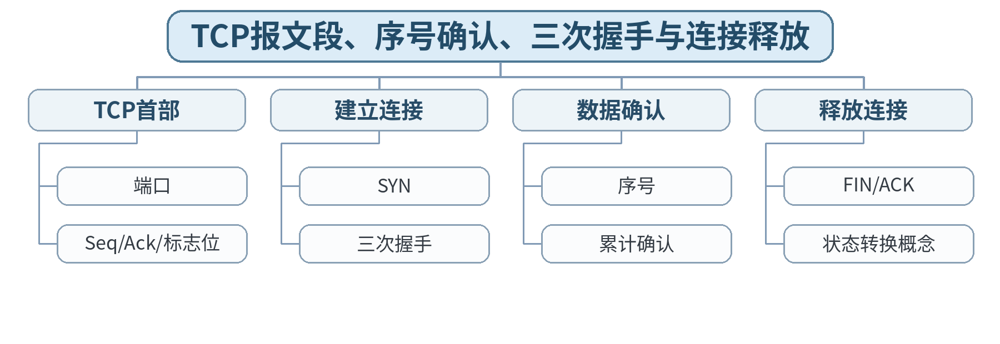

### 教学目标

**知识目标：**
- （1）掌握TCP首部、序号确认、连接建立与释放。
**能力目标：**
- （1）能够依据报文字段分析TCP连接状态。
**价值目标：**
- （1）形成基于抓包/日志证据解释系统状态的习惯。

### 课程思政

通过连接状态和异常重试强调通信系统行为必须用报文证据解释。

### 专创融合 / 双创融合

将TCP连接状态分析用于工业服务端口、API和边缘服务器故障定位。

### 教学重难点

教学重点：TCP序号确认、三次握手与连接释放。
教学难点：按字节序号理解Seq/Ack，并正确推演握手/释放而非只背报文个数。

### 教学方法

讲授法、问题引导法、协议推演法、案例分析法、教师演示法、分组讨论法、方案评审与证据复盘

### 教学用具

电脑、投影仪、多媒体课件、教材、网络协议结构图、教师提供的抓包/报文字段资料、地址/路由练习表

### 教学设计

课前任务 → 互动导入（15 min）→ 传授新知与课堂训练（70 min）→ 过关检测（10 min）→ 课堂小结（3 min）→ 作业布置（1 min）→ 考勤（1 min）

### 教学过程

#### 课前任务

【教师】发布“TCP报文段、序号确认、三次握手与连接释放”预习材料和一个最小判断问题；要求只使用教材、课程资料或教师提供数据。
【学生】阅读对应内容，记录3个核心术语和至少1个疑问；准备课堂分析表。

**设计意图：** 通过阅读和最小问题建立先备认知，让学生带着可验证问题进入课堂。

#### 互动导入与传授新知 / 课堂训练

【互动导入 15 min】
【教师】给出一组乱序的SYN、SYN-ACK、ACK报文，让学生按Seq/Ack关系排序并说明每一步确认了什么。
【学生】先独立判断/计算，再交换依据。

【传授新知与课堂训练 70 min】
【教师】解析TCP首部中的序号、确认号和主要标志位。
【学生】完成对应分析/推演并记录判断依据。
【教师】用状态/报文序列解释三次握手为何建立双向通信状态。
【学生】完成对应分析/推演并记录判断依据。
【教师】学生完成教师提供握手与释放抓包/字段表，填Seq、Ack、Flags和方向。
【学生】完成对应分析/推演并记录判断依据。

【课堂产物】TCP握手与释放报文序列表。
【学习证据】字段表 + 流程图 + 1条异常握手现象说明。
【评价关联】平时学习与课堂分析；课程作业重点证据；目标1.4、2.4、3.4。

**设计意图：** 采用“先判断/计算 → 最小讲解 → 协议/数据流推演 → 独立分析产出 → 证据复核”的理论课闭环，把抽象网络原理落实到可检查的图表、计算和故障证据。

### 过关检测

【教师】组织当堂检测：
- 1. 三次握手第二个报文通常包含哪些标志位？
- 2. ACK号表示确认到哪个位置？
- 3. TCP连接为什么要维护状态？
【学生】独立作答；【教师】要求说明判断依据。

### 课堂小结

【教师】回到知识脉络图，用“概念—关系—协议行为—工程边界”总结“TCP报文段、序号确认、三次握手与连接释放”。
【学生】写下本课最重要的一条规则和一个最容易误判的边界。

### 作业布置

【教师】布置课后任务：根据给定初始序号完成一次TCP握手与两段数据确认计算。
【学生】按课程文件命名要求整理分析图、计算/协议表和必要说明。

### 考勤

【教师】利用学校/课程实际使用的平台进行签到。
【学生】按课程要求完成签到。

### 课后教学反思

【课后填写，不预填事实】
- 1. 教学流程：记录100 min各环节实际用时及需调整位置；
- 2. 教学内容：重点记录“按字节序号理解Seq/Ack，并正确推演握手/释放而非只背报文个数。”的真实掌握证据与常见错误；
- 3. 学生参与：仅依据实际课堂记录填写独立分析、讨论、互审情况，不补写推测；
- 4. 评价证据：检查本课分析表/流程图/计算单/方案证据是否完整，记录缺项；
- 5. 后续改进：依据真实课堂证据确定下一轮调整。

### 本章节参考文献

[1] 胡亮, 徐高潮, 张宗升, 霍严梅, 车喜龙. 计算机网络[M]. 北京：高等教育出版社，2024. ISBN 9787040612875
[2] 袁华, 王昊翔, 黄敏. 深入理解计算机网络[M]. 北京：清华大学出版社，2024. ISBN 9787302662709
[3] 冯博琴, 陈妍. 计算机网络（第4版）[M]. 北京：高等教育出版社，2023. ISBN 9787040599909

## 第15次课 可靠传输、滑动窗口、超时重传与流量控制

- **章节/单元**：第4单元 运输层、UDP/TCP与端到端可靠传输
- **周次**：按实际课表填写
- **课时安排**：2课时（100 min）

### 知识脉络图

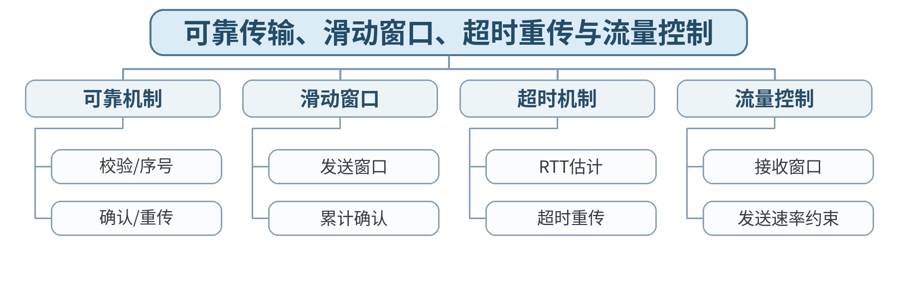

### 教学目标

**知识目标：**
- （1）掌握TCP可靠传输、滑动窗口、超时重传和流量控制。
**能力目标：**
- （1）能够推演报文序号、确认与窗口变化。
**价值目标：**
- （1）形成从端到端可靠性和资源能力评价通信行为的意识。

### 课程思政

通过流量控制讨论系统设计中尊重接收能力、避免资源压垮的责任意识。

### 专创融合 / 双创融合

把流控和超时参数理解为边缘设备、云服务之间性能调优的基础。

### 教学重难点

教学重点：可靠传输、滑动窗口、超时和流量控制。
教学难点：区分流量控制与拥塞控制；理解窗口、RTT和重传共同影响性能。

### 教学方法

讲授法、问题引导法、协议推演法、案例分析法、教师演示法、分组讨论法、方案评审与证据复盘

### 教学用具

电脑、投影仪、多媒体课件、教材、网络协议结构图、教师提供的抓包/报文字段资料、地址/路由练习表

### 教学设计

课前任务 → 互动导入（15 min）→ 传授新知与课堂训练（70 min）→ 过关检测（10 min）→ 课堂小结（3 min）→ 作业布置（1 min）→ 考勤（1 min）

### 教学过程

#### 课前任务

【教师】发布“可靠传输、滑动窗口、超时重传与流量控制”预习材料和一个最小判断问题；要求只使用教材、课程资料或教师提供数据。
【学生】阅读对应内容，记录3个核心术语和至少1个疑问；准备课堂分析表。

**设计意图：** 通过阅读和最小问题建立先备认知，让学生带着可验证问题进入课堂。

#### 互动导入与传授新知 / 课堂训练

【互动导入 15 min】
【教师】展示“网络不拥塞但接收端处理很慢”的场景，学生判断应由流量控制还是拥塞控制解决。
【学生】先独立判断/计算，再交换依据。

【传授新知与课堂训练 70 min】
【教师】回顾可靠传输所需的序号、确认、超时和重传机制。
【学生】完成对应分析/推演并记录判断依据。
【教师】通过滑动窗口示意图解释连续发送与累计确认。
【学生】完成对应分析/推演并记录判断依据。
【教师】学生完成一组丢包/超时/重复ACK情景的发送窗口变化推演。
【学生】完成对应分析/推演并记录判断依据。

【课堂产物】TCP可靠传输与窗口变化推演表。
【学习证据】报文序列 + 窗口变化 + 重传原因说明。
【评价关联】平时学习与课堂分析；课程作业重点证据；目标1.4、2.4、3.4。

**设计意图：** 采用“先判断/计算 → 最小讲解 → 协议/数据流推演 → 独立分析产出 → 证据复核”的理论课闭环，把抽象网络原理落实到可检查的图表、计算和故障证据。

### 过关检测

【教师】组织当堂检测：
- 1. 流量控制主要保护谁？
- 2. 超时时间为什么不能固定得过小？
- 3. 累计确认的含义是什么？
【学生】独立作答；【教师】要求说明判断依据。

### 课堂小结

【教师】回到知识脉络图，用“概念—关系—协议行为—工程边界”总结“可靠传输、滑动窗口、超时重传与流量控制”。
【学生】写下本课最重要的一条规则和一个最容易误判的边界。

### 作业布置

【教师】布置课后任务：完成一个含丢包和接收窗口变化的可靠传输推演题。
【学生】按课程文件命名要求整理分析图、计算/协议表和必要说明。

### 考勤

【教师】利用学校/课程实际使用的平台进行签到。
【学生】按课程要求完成签到。

### 课后教学反思

【课后填写，不预填事实】
- 1. 教学流程：记录100 min各环节实际用时及需调整位置；
- 2. 教学内容：重点记录“区分流量控制与拥塞控制；理解窗口、RTT和重传共同影响性能。”的真实掌握证据与常见错误；
- 3. 学生参与：仅依据实际课堂记录填写独立分析、讨论、互审情况，不补写推测；
- 4. 评价证据：检查本课分析表/流程图/计算单/方案证据是否完整，记录缺项；
- 5. 后续改进：依据真实课堂证据确定下一轮调整。

### 本章节参考文献

[1] 胡亮, 徐高潮, 张宗升, 霍严梅, 车喜龙. 计算机网络[M]. 北京：高等教育出版社，2024. ISBN 9787040612875
[2] 袁华, 王昊翔, 黄敏. 深入理解计算机网络[M]. 北京：清华大学出版社，2024. ISBN 9787302662709
[3] 冯博琴, 陈妍. 计算机网络（第4版）[M]. 北京：高等教育出版社，2023. ISBN 9787040599909

## 第16次课 拥塞控制、RTT与TCP/QUIC性能故障分析

- **章节/单元**：第4单元 运输层、UDP/TCP与端到端可靠传输
- **周次**：按实际课表填写
- **课时安排**：2课时（100 min）

### 知识脉络图

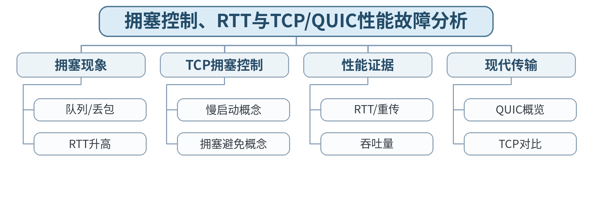

### 教学目标

**知识目标：**
- （1）理解TCP拥塞控制和QUIC基本概念。
**能力目标：**
- （1）能够依据RTT、窗口、重传等证据分析端到端性能问题。
**价值目标：**
- （1）形成兼顾性能、公平性与稳定性的工程意识。

### 课程思政

通过拥塞控制讨论共享资源公平、网络稳定和性能优化中的公共责任。

### 专创融合 / 双创融合

将现代传输协议视为智能制造云边协同和实时服务的技术选项，强调基于需求与证据选型。

### 教学重难点

教学重点：拥塞控制基本思想；利用RTT/重传/吞吐量分析端到端性能。
教学难点：区分接收端流控问题与网络路径拥塞，并避免把QUIC介绍为“永远更快”。

### 教学方法

讲授法、问题引导法、协议推演法、案例分析法、教师演示法、分组讨论法、方案评审与证据复盘

### 教学用具

电脑、投影仪、多媒体课件、教材、网络协议结构图、教师提供的抓包/报文字段资料、地址/路由练习表

### 教学设计

课前任务 → 互动导入（15 min）→ 传授新知与课堂训练（70 min）→ 过关检测（10 min）→ 课堂小结（3 min）→ 作业布置（1 min）→ 考勤（1 min）

### 教学过程

#### 课前任务

【教师】发布“拥塞控制、RTT与TCP/QUIC性能故障分析”预习材料和一个最小判断问题；要求只使用教材、课程资料或教师提供数据。
【学生】阅读对应内容，记录3个核心术语和至少1个疑问；准备课堂分析表。

**设计意图：** 通过阅读和最小问题建立先备认知，让学生带着可验证问题进入课堂。

#### 互动导入与传授新知 / 课堂训练

【互动导入 15 min】
【教师】给出两个抓包统计摘要：一个接收窗口持续变小，一个RTT和重传同时升高，学生判断哪一个更像接收端瓶颈、哪一个更像网络拥塞。
【学生】先独立判断/计算，再交换依据。

【传授新知与课堂训练 70 min】
【教师】解释拥塞产生、慢启动/拥塞避免的基本思想，不展开具体实现版本细节。
【学生】完成对应分析/推演并记录判断依据。
【教师】用RTT、重传、窗口、吞吐量等证据构建性能诊断框架。
【学生】完成对应分析/推演并记录判断依据。
【教师】概览QUIC基于UDP实现现代传输能力；学生完成TCP/UDP/QUIC适用场景比较。
【学生】完成对应分析/推演并记录判断依据。

【课堂产物】运输层性能诊断表 + TCP/UDP/QUIC对比表。
【学习证据】指标表、故障判断依据、协议选型说明。
【评价关联】平时学习与课堂分析；课程作业重点证据；目标1.4、2.4、3.4。

**设计意图：** 采用“先判断/计算 → 最小讲解 → 协议/数据流推演 → 独立分析产出 → 证据复核”的理论课闭环，把抽象网络原理落实到可检查的图表、计算和故障证据。

### 过关检测

【教师】组织当堂检测：
- 1. 拥塞控制主要保护谁？
- 2. RTT持续上升可能说明什么？
- 3. QUIC为什么不能简单等同于“UDP不可靠”？
【学生】独立作答；【教师】要求说明判断依据。

### 课堂小结

【教师】回到知识脉络图，用“概念—关系—协议行为—工程边界”总结“拥塞控制、RTT与TCP/QUIC性能故障分析”。
【学生】写下本课最重要的一条规则和一个最容易误判的边界。

### 作业布置

【教师】布置课后任务：完成课程作业中的TCP/UDP与可靠传输分析部分。
【学生】按课程文件命名要求整理分析图、计算/协议表和必要说明。

### 考勤

【教师】利用学校/课程实际使用的平台进行签到。
【学生】按课程要求完成签到。

### 课后教学反思

【课后填写，不预填事实】
- 1. 教学流程：记录100 min各环节实际用时及需调整位置；
- 2. 教学内容：重点记录“区分接收端流控问题与网络路径拥塞，并避免把QUIC介绍为“永远更快”。”的真实掌握证据与常见错误；
- 3. 学生参与：仅依据实际课堂记录填写独立分析、讨论、互审情况，不补写推测；
- 4. 评价证据：检查本课分析表/流程图/计算单/方案证据是否完整，记录缺项；
- 5. 后续改进：依据真实课堂证据确定下一轮调整。

### 本章节参考文献

[1] 胡亮, 徐高潮, 张宗升, 霍严梅, 车喜龙. 计算机网络[M]. 北京：高等教育出版社，2024. ISBN 9787040612875
[2] 袁华, 王昊翔, 黄敏. 深入理解计算机网络[M]. 北京：清华大学出版社，2024. ISBN 9787302662709
[3] 冯博琴, 陈妍. 计算机网络（第4版）[M]. 北京：高等教育出版社，2023. ISBN 9787040599909

## 第17次课 客户端/服务器、P2P、DNS与DHCP

- **章节/单元**：第5单元 应用层协议与网络服务
- **周次**：按实际课表填写
- **课时安排**：2课时（100 min）

### 知识脉络图

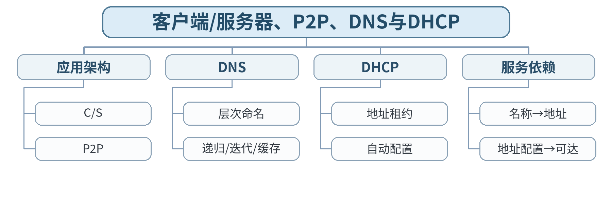

### 教学目标

**知识目标：**
- （1）掌握C/S、P2P、DNS和DHCP基本机制。
**能力目标：**
- （1）能够从域名和地址配置分析服务访问故障。
**价值目标：**
- （1）形成服务依赖和可用性意识。

### 课程思政

围绕域名、地址和网络服务强调基础服务的可用性与运维责任。

### 专创融合 / 双创融合

把DNS/DHCP作为MES、边缘服务、机器人系统接入时的基础依赖服务。

### 教学重难点

教学重点：DNS查询链与DHCP自动配置；应用服务依赖。
教学难点：区分“DNS解析失败”和“IP网络不可达”，并正确理解递归/迭代查询。

### 教学方法

讲授法、问题引导法、协议推演法、案例分析法、教师演示法、分组讨论法、方案评审与证据复盘

### 教学用具

电脑、投影仪、多媒体课件、教材、网络协议结构图、教师提供的抓包/报文字段资料、地址/路由练习表

### 教学设计

课前任务 → 互动导入（15 min）→ 传授新知与课堂训练（70 min）→ 过关检测（10 min）→ 课堂小结（3 min）→ 作业布置（1 min）→ 考勤（1 min）

### 教学过程

#### 课前任务

【教师】发布“客户端/服务器、P2P、DNS与DHCP”预习材料和一个最小判断问题；要求只使用教材、课程资料或教师提供数据。
【学生】阅读对应内容，记录3个核心术语和至少1个疑问；准备课堂分析表。

**设计意图：** 通过阅读和最小问题建立先备认知，让学生带着可验证问题进入课堂。

#### 互动导入与传授新知 / 课堂训练

【互动导入 15 min】
【教师】给出“能ping服务器IP但访问域名失败”的现象，学生判断先查DNS还是TCP/HTTP。
【学生】先独立判断/计算，再交换依据。

【传授新知与课堂训练 70 min】
【教师】介绍客户端/服务器与P2P基本架构。
【学生】完成对应分析/推演并记录判断依据。
【教师】讲解DNS层次、递归/迭代查询、缓存与常见记录概念。
【学生】完成对应分析/推演并记录判断依据。
【教师】讲解DHCP地址配置流程概念；学生完成“开机获得地址→解析域名→访问服务”的依赖链。
【学生】完成对应分析/推演并记录判断依据。

【课堂产物】DNS/DHCP服务依赖与故障链图。
【学习证据】服务链图 + 2个故障现象的分层定位。
【评价关联】平时学习与课堂分析；课程作业重点证据；目标1.5、2.5、3.5。

**设计意图：** 采用“先判断/计算 → 最小讲解 → 协议/数据流推演 → 独立分析产出 → 证据复核”的理论课闭环，把抽象网络原理落实到可检查的图表、计算和故障证据。

### 过关检测

【教师】组织当堂检测：
- 1. DNS解决什么问题？
- 2. 递归查询与迭代查询有什么区别？
- 3. DHCP异常可能导致什么网络现象？
【学生】独立作答；【教师】要求说明判断依据。

### 课堂小结

【教师】回到知识脉络图，用“概念—关系—协议行为—工程边界”总结“客户端/服务器、P2P、DNS与DHCP”。
【学生】写下本课最重要的一条规则和一个最容易误判的边界。

### 作业布置

【教师】布置课后任务：分析“域名失败、IP可达”和“未获得合法地址”两个案例。
【学生】按课程文件命名要求整理分析图、计算/协议表和必要说明。

### 考勤

【教师】利用学校/课程实际使用的平台进行签到。
【学生】按课程要求完成签到。

### 课后教学反思

【课后填写，不预填事实】
- 1. 教学流程：记录100 min各环节实际用时及需调整位置；
- 2. 教学内容：重点记录“区分“DNS解析失败”和“IP网络不可达”，并正确理解递归/迭代查询。”的真实掌握证据与常见错误；
- 3. 学生参与：仅依据实际课堂记录填写独立分析、讨论、互审情况，不补写推测；
- 4. 评价证据：检查本课分析表/流程图/计算单/方案证据是否完整，记录缺项；
- 5. 后续改进：依据真实课堂证据确定下一轮调整。

### 本章节参考文献

[1] 胡亮, 徐高潮, 张宗升, 霍严梅, 车喜龙. 计算机网络[M]. 北京：高等教育出版社，2024. ISBN 9787040612875
[2] 袁华, 王昊翔, 黄敏. 深入理解计算机网络[M]. 北京：清华大学出版社，2024. ISBN 9787302662709
[3] 冯博琴, 陈妍. 计算机网络（第4版）[M]. 北京：高等教育出版社，2023. ISBN 9787040599909

## 第18次课 HTTP/HTTPS、状态码、连接复用与Web缓存

- **章节/单元**：第5单元 应用层协议与网络服务
- **周次**：按实际课表填写
- **课时安排**：2课时（100 min）

### 知识脉络图

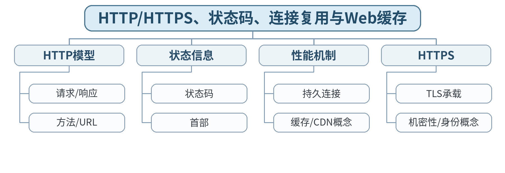

### 教学目标

**知识目标：**
- （1）掌握HTTP/HTTPS请求响应与常见状态码。
**能力目标：**
- （1）能够依据报文和状态码分析Web服务访问问题。
**价值目标：**
- （1）形成隐私保护、接口规范和合法访问意识。

### 课程思政

结合隐私泄露和证书错误案例强调个人信息保护、合法服务访问与安全验证。

### 专创融合 / 双创融合

将HTTP/HTTPS和REST API作为MES/边缘平台服务接口的网络基础。

### 教学重难点

教学重点：HTTP请求响应、状态码、HTTPS与缓存。
教学难点：区分HTTP应用语义与TLS安全机制，能从状态码/请求响应定位服务问题。

### 教学方法

讲授法、问题引导法、协议推演法、案例分析法、教师演示法、分组讨论法、方案评审与证据复盘

### 教学用具

电脑、投影仪、多媒体课件、教材、网络协议结构图、教师提供的抓包/报文字段资料、地址/路由练习表

### 教学设计

课前任务 → 互动导入（15 min）→ 传授新知与课堂训练（70 min）→ 过关检测（10 min）→ 课堂小结（3 min）→ 作业布置（1 min）→ 考勤（1 min）

### 教学过程

#### 课前任务

【教师】发布“HTTP/HTTPS、状态码、连接复用与Web缓存”预习材料和一个最小判断问题；要求只使用教材、课程资料或教师提供数据。
【学生】阅读对应内容，记录3个核心术语和至少1个疑问；准备课堂分析表。

**设计意图：** 通过阅读和最小问题建立先备认知，让学生带着可验证问题进入课堂。

#### 互动导入与传授新知 / 课堂训练

【互动导入 15 min】
【教师】给出200、301、404、500四个状态码和同一个“页面打不开”描述，学生判断这些现象分别指向客户端、资源还是服务端问题。
【学生】先独立判断/计算，再交换依据。

【传授新知与课堂训练 70 min】
【教师】解析HTTP请求行、响应状态、常见首部和连接复用概念。
【学生】完成对应分析/推演并记录判断依据。
【教师】说明HTTPS是在HTTP与TLS等安全机制配合下实现安全通信，不把“有HTTPS”理解成应用绝对安全。
【学生】完成对应分析/推演并记录判断依据。
【教师】学生使用教师提供HTTP报文/抓包截图完成“请求—响应—状态码—缓存”分析表。
【学生】完成对应分析/推演并记录判断依据。

【课堂产物】HTTP/HTTPS请求响应分析表。
【学习证据】教师提供报文 + 状态码解释 + 一条故障结论。
【评价关联】平时学习与课堂分析；课程作业重点证据；目标1.5、2.5、3.5。

**设计意图：** 采用“先判断/计算 → 最小讲解 → 协议/数据流推演 → 独立分析产出 → 证据复核”的理论课闭环，把抽象网络原理落实到可检查的图表、计算和故障证据。

### 过关检测

【教师】组织当堂检测：
- 1. 404与500通常分别表示什么？
- 2. HTTPS主要解决哪些通信安全问题？
- 3. Web缓存为什么能改善访问性能？
【学生】独立作答；【教师】要求说明判断依据。

### 课堂小结

【教师】回到知识脉络图，用“概念—关系—协议行为—工程边界”总结“HTTP/HTTPS、状态码、连接复用与Web缓存”。
【学生】写下本课最重要的一条规则和一个最容易误判的边界。

### 作业布置

【教师】布置课后任务：完成一组HTTP请求/响应分析，标出方法、主机、状态码和缓存相关字段。
【学生】按课程文件命名要求整理分析图、计算/协议表和必要说明。

### 考勤

【教师】利用学校/课程实际使用的平台进行签到。
【学生】按课程要求完成签到。

### 课后教学反思

【课后填写，不预填事实】
- 1. 教学流程：记录100 min各环节实际用时及需调整位置；
- 2. 教学内容：重点记录“区分HTTP应用语义与TLS安全机制，能从状态码/请求响应定位服务问题。”的真实掌握证据与常见错误；
- 3. 学生参与：仅依据实际课堂记录填写独立分析、讨论、互审情况，不补写推测；
- 4. 评价证据：检查本课分析表/流程图/计算单/方案证据是否完整，记录缺项；
- 5. 后续改进：依据真实课堂证据确定下一轮调整。

### 本章节参考文献

[1] 胡亮, 徐高潮, 张宗升, 霍严梅, 车喜龙. 计算机网络[M]. 北京：高等教育出版社，2024. ISBN 9787040612875
[2] 袁华, 王昊翔, 黄敏. 深入理解计算机网络[M]. 北京：清华大学出版社，2024. ISBN 9787302662709
[3] 冯博琴, 陈妍. 计算机网络（第4版）[M]. 北京：高等教育出版社，2023. ISBN 9787040599909

## 第19次课 电子邮件、FTP/SFTP与Socket应用模型

- **章节/单元**：第5单元 应用层协议与网络服务
- **周次**：按实际课表填写
- **课时安排**：2课时（100 min）

### 知识脉络图

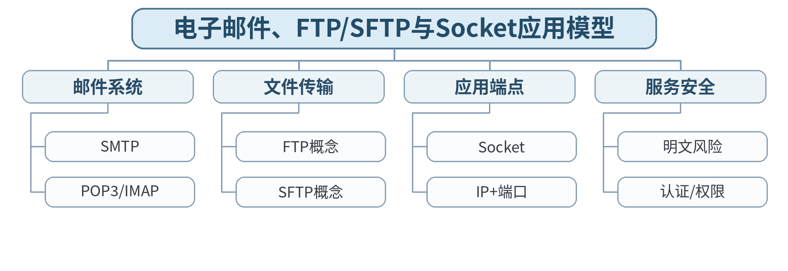

### 教学目标

**知识目标：**
- （1）理解邮件、文件传输和Socket应用模型。
**能力目标：**
- （1）能够解释应用服务、运输层端点与安全机制的关系。
**价值目标：**
- （1）形成账号权限、敏感数据和协议安全意识。

### 课程思政

通过明文传输与账号权限讨论敏感数据保护和最小权限。

### 专创融合 / 双创融合

训练将协议、端口、认证和服务部署统一到应用系统接口清单中。

### 教学重难点

教学重点：邮件协议分工、文件传输和Socket应用模型。
教学难点：理解协议名称相似不代表安全机制相同；区分应用协议与底层Socket接口。

### 教学方法

讲授法、问题引导法、协议推演法、案例分析法、教师演示法、分组讨论法、方案评审与证据复盘

### 教学用具

电脑、投影仪、多媒体课件、教材、网络协议结构图、教师提供的抓包/报文字段资料、地址/路由练习表

### 教学设计

课前任务 → 互动导入（15 min）→ 传授新知与课堂训练（70 min）→ 过关检测（10 min）→ 课堂小结（3 min）→ 作业布置（1 min）→ 考勤（1 min）

### 教学过程

#### 课前任务

【教师】发布“电子邮件、FTP/SFTP与Socket应用模型”预习材料和一个最小判断问题；要求只使用教材、课程资料或教师提供数据。
【学生】阅读对应内容，记录3个核心术语和至少1个疑问；准备课堂分析表。

**设计意图：** 通过阅读和最小问题建立先备认知，让学生带着可验证问题进入课堂。

#### 互动导入与传授新知 / 课堂训练

【互动导入 15 min】
【教师】给出“SMTP负责发信、IMAP负责收取/同步”的服务链，让学生解释为什么一个完整邮件系统需要多个协议。
【学生】先独立判断/计算，再交换依据。

【传授新知与课堂训练 70 min】
【教师】说明SMTP、POP3、IMAP在邮件发送/接收中的分工。
【学生】完成对应分析/推演并记录判断依据。
【教师】比较FTP与SFTP的基本安全差异，不展开具体攻击操作。
【学生】完成对应分析/推演并记录判断依据。
【教师】回到Socket应用模型：应用协议最终通过运输层端点通信；学生画一张客户端/服务端端口关系图。
【学生】完成对应分析/推演并记录判断依据。

【课堂产物】邮件/文件服务协议分工表 + Socket端点图。
【学习证据】协议对比表、端点图、安全边界说明。
【评价关联】平时学习与课堂分析；课程作业过程证据；目标1.5、2.5、3.5。

**设计意图：** 采用“先判断/计算 → 最小讲解 → 协议/数据流推演 → 独立分析产出 → 证据复核”的理论课闭环，把抽象网络原理落实到可检查的图表、计算和故障证据。

### 过关检测

【教师】组织当堂检测：
- 1. SMTP主要负责发送还是接收？
- 2. SFTP与FTP最核心的安全差异是什么？
- 3. Socket端点通常由哪两个关键地址信息组成？
【学生】独立作答；【教师】要求说明判断依据。

### 课堂小结

【教师】回到知识脉络图，用“概念—关系—协议行为—工程边界”总结“电子邮件、FTP/SFTP与Socket应用模型”。
【学生】写下本课最重要的一条规则和一个最容易误判的边界。

### 作业布置

【教师】布置课后任务：整理一个“协议—运输层—端口—安全注意事项”表，至少6项。
【学生】按课程文件命名要求整理分析图、计算/协议表和必要说明。

### 考勤

【教师】利用学校/课程实际使用的平台进行签到。
【学生】按课程要求完成签到。

### 课后教学反思

【课后填写，不预填事实】
- 1. 教学流程：记录100 min各环节实际用时及需调整位置；
- 2. 教学内容：重点记录“理解协议名称相似不代表安全机制相同；区分应用协议与底层Socket接口。”的真实掌握证据与常见错误；
- 3. 学生参与：仅依据实际课堂记录填写独立分析、讨论、互审情况，不补写推测；
- 4. 评价证据：检查本课分析表/流程图/计算单/方案证据是否完整，记录缺项；
- 5. 后续改进：依据真实课堂证据确定下一轮调整。

### 本章节参考文献

[1] 胡亮, 徐高潮, 张宗升, 霍严梅, 车喜龙. 计算机网络[M]. 北京：高等教育出版社，2024. ISBN 9787040612875
[2] 袁华, 王昊翔, 黄敏. 深入理解计算机网络[M]. 北京：清华大学出版社，2024. ISBN 9787302662709
[3] 冯博琴, 陈妍. 计算机网络（第4版）[M]. 北京：高等教育出版社，2023. ISBN 9787040599909

## 第20次课 REST/API、WebSocket、MQTT、CDN与应用层综合故障链

- **章节/单元**：第5单元 应用层协议与网络服务
- **周次**：按实际课表填写
- **课时安排**：2课时（100 min）

### 知识脉络图

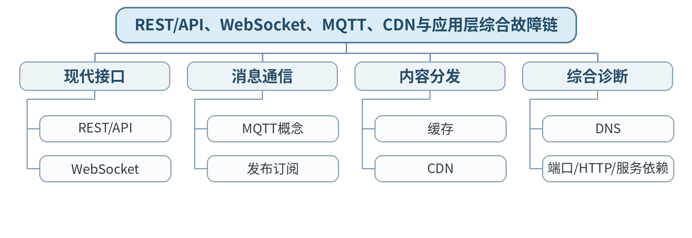

### 教学目标

**知识目标：**
- （1）理解REST/API、WebSocket、MQTT和CDN基本概念。
**能力目标：**
- （1）能够从完整服务依赖链分析应用访问故障。
**价值目标：**
- （1）形成接口规范、隐私保护和服务可用性意识。

### 课程思政

强调现代网络服务使用中的隐私、接口权限和数据合规。

### 专创融合 / 双创融合

把REST、WebSocket、MQTT联系到MES、机器人状态推送和IoT边缘应用。

### 教学重难点

教学重点：现代应用通信概念及从DNS到应用服务的故障链。
教学难点：根据通信模式选择接口/协议，并从依赖链定位“服务不可用”。

### 教学方法

讲授法、问题引导法、协议推演法、案例分析法、教师演示法、分组讨论法、方案评审与证据复盘

### 教学用具

电脑、投影仪、多媒体课件、教材、网络协议结构图、教师提供的抓包/报文字段资料、地址/路由练习表

### 教学设计

课前任务 → 互动导入（15 min）→ 传授新知与课堂训练（70 min）→ 过关检测（10 min）→ 课堂小结（3 min）→ 作业布置（1 min）→ 考勤（1 min）

### 教学过程

#### 课前任务

【教师】发布“REST/API、WebSocket、MQTT、CDN与应用层综合故障链”预习材料和一个最小判断问题；要求只使用教材、课程资料或教师提供数据。
【学生】阅读对应内容，记录3个核心术语和至少1个疑问；准备课堂分析表。

**设计意图：** 通过阅读和最小问题建立先备认知，让学生带着可验证问题进入课堂。

#### 互动导入与传授新知 / 课堂训练

【互动导入 15 min】
【教师】比较“周期性设备数据上报”“浏览器请求业务数据”“双向实时状态推送”三类需求，让学生选HTTP API、MQTT或WebSocket。
【学生】先独立判断/计算，再交换依据。

【传授新知与课堂训练 70 min】
【教师】概览REST/API、WebSocket、MQTT的通信模式和典型适用场景。
【学生】完成对应分析/推演并记录判断依据。
【教师】解释CDN/内容分发和缓存的基本价值。
【学生】完成对应分析/推演并记录判断依据。
【教师】学生构建应用层故障链：DHCP/IP→DNS→TCP/UDP端口→TLS→HTTP/应用服务，并为每层给出一个证据。
【学生】完成对应分析/推演并记录判断依据。

【课堂产物】应用协议选型表 + 服务访问故障链。
【学习证据】选型依据、分层证据和故障定位顺序。
【评价关联】平时学习与课堂分析；课程作业重点证据；目标1.5、2.5、3.5。

**设计意图：** 采用“先判断/计算 → 最小讲解 → 协议/数据流推演 → 独立分析产出 → 证据复核”的理论课闭环，把抽象网络原理落实到可检查的图表、计算和故障证据。

### 过关检测

【教师】组织当堂检测：
- 1. MQTT通常采用什么通信模式？
- 2. WebSocket适合什么类型交互？
- 3. 应用访问失败为什么要同时检查DNS、端口和应用状态？
【学生】独立作答；【教师】要求说明判断依据。

### 课堂小结

【教师】回到知识脉络图，用“概念—关系—协议行为—工程边界”总结“REST/API、WebSocket、MQTT、CDN与应用层综合故障链”。
【学生】写下本课最重要的一条规则和一个最容易误判的边界。

### 作业布置

【教师】布置课后任务：完成课程作业中的DNS/HTTP/DHCP或现代服务链分析部分。
【学生】按课程文件命名要求整理分析图、计算/协议表和必要说明。

### 考勤

【教师】利用学校/课程实际使用的平台进行签到。
【学生】按课程要求完成签到。

### 课后教学反思

【课后填写，不预填事实】
- 1. 教学流程：记录100 min各环节实际用时及需调整位置；
- 2. 教学内容：重点记录“根据通信模式选择接口/协议，并从依赖链定位“服务不可用”。”的真实掌握证据与常见错误；
- 3. 学生参与：仅依据实际课堂记录填写独立分析、讨论、互审情况，不补写推测；
- 4. 评价证据：检查本课分析表/流程图/计算单/方案证据是否完整，记录缺项；
- 5. 后续改进：依据真实课堂证据确定下一轮调整。

### 本章节参考文献

[1] 胡亮, 徐高潮, 张宗升, 霍严梅, 车喜龙. 计算机网络[M]. 北京：高等教育出版社，2024. ISBN 9787040612875
[2] 袁华, 王昊翔, 黄敏. 深入理解计算机网络[M]. 北京：清华大学出版社，2024. ISBN 9787302662709
[3] 冯博琴, 陈妍. 计算机网络（第4版）[M]. 北京：高等教育出版社，2023. ISBN 9787040599909

## 第21次课 网络管理与分层诊断：Ping、Traceroute、表项与抓包证据

- **章节/单元**：第6单元 网络管理、安全、新型网络与智能制造应用
- **周次**：按实际课表填写
- **课时安排**：2课时（100 min）

### 知识脉络图

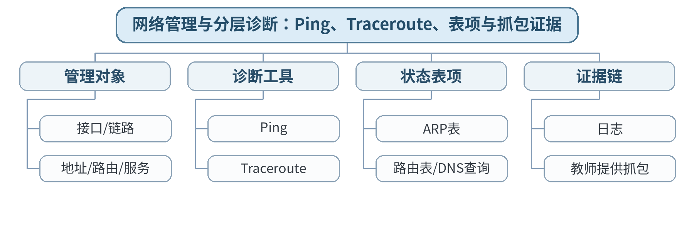

### 教学目标

**知识目标：**
- （1）理解常见网络管理/诊断工具的作用。
**能力目标：**
- （1）能够按分层顺序定位常见网络故障并说明证据边界。
**价值目标：**
- （1）形成合法授权、证据诊断和不确定项说明意识。

### 课程思政

明确所有网络探测、抓包和配置只能在授权环境、教师提供数据或隔离仿真中进行。

### 专创融合 / 双创融合

将诊断证据矩阵转化为企业网络运维检查单。

### 教学重难点

教学重点：分层诊断工具及其证据边界。
教学难点：理解工具输出只能说明特定层面的现象，不能用一次Ping替代完整故障结论。

### 教学方法

讲授法、问题引导法、协议推演法、案例分析法、教师演示法、分组讨论法、方案评审与证据复盘

### 教学用具

电脑、投影仪、多媒体课件、教材、网络协议结构图、教师提供的抓包/报文字段资料、地址/路由练习表

### 教学设计

课前任务 → 互动导入（15 min）→ 传授新知与课堂训练（70 min）→ 过关检测（10 min）→ 课堂小结（3 min）→ 作业布置（1 min）→ 考勤（1 min）

### 教学过程

#### 课前任务

【教师】发布“网络管理与分层诊断：Ping、Traceroute、表项与抓包证据”预习材料和一个最小判断问题；要求只使用教材、课程资料或教师提供数据。
【学生】阅读对应内容，记录3个核心术语和至少1个疑问；准备课堂分析表。

**设计意图：** 通过阅读和最小问题建立先备认知，让学生带着可验证问题进入课堂。

#### 互动导入与传授新知 / 课堂训练

【互动导入 15 min】
【教师】给出“Ping通但网页打不开”“同网段不通”“Traceroute中间节点不回应但终点可达”三个现象，要求学生判断能说明什么、不能说明什么。
【学生】先独立判断/计算，再交换依据。

【传授新知与课堂训练 70 min】
【教师】建立分层故障诊断顺序：物理/链路→地址→路由→运输→域名/应用。
【学生】完成对应分析/推演并记录判断依据。
【教师】说明Ping、Traceroute、ARP表、路由表、DNS查询和教师提供抓包的观察对象。
【学生】完成对应分析/推演并记录判断依据。
【教师】学生完成三案例“工具输出—可证明—不可证明—下一步证据”表。
【学生】完成对应分析/推演并记录判断依据。

【课堂产物】网络诊断证据矩阵与分层故障树。
【学习证据】证据矩阵 + 故障树 + 不确定项标注。
【评价关联】平时学习与课堂分析；期末综合考查过程准备；目标1.6、2.6、3.6。

**设计意图：** 采用“先判断/计算 → 最小讲解 → 协议/数据流推演 → 独立分析产出 → 证据复核”的理论课闭环，把抽象网络原理落实到可检查的图表、计算和故障证据。

### 过关检测

【教师】组织当堂检测：
- 1. Ping通能否证明HTTP服务正常？
- 2. Traceroute主要观察什么？
- 3. 为什么抓包必须限定在授权环境？
【学生】独立作答；【教师】要求说明判断依据。

### 课堂小结

【教师】回到知识脉络图，用“概念—关系—协议行为—工程边界”总结“网络管理与分层诊断：Ping、Traceroute、表项与抓包证据”。
【学生】写下本课最重要的一条规则和一个最容易误判的边界。

### 作业布置

【教师】布置课后任务：对一个“设备能上网但访问MES失败”案例给出5步分层诊断计划。
【学生】按课程文件命名要求整理分析图、计算/协议表和必要说明。

### 考勤

【教师】利用学校/课程实际使用的平台进行签到。
【学生】按课程要求完成签到。

### 课后教学反思

【课后填写，不预填事实】
- 1. 教学流程：记录100 min各环节实际用时及需调整位置；
- 2. 教学内容：重点记录“理解工具输出只能说明特定层面的现象，不能用一次Ping替代完整故障结论。”的真实掌握证据与常见错误；
- 3. 学生参与：仅依据实际课堂记录填写独立分析、讨论、互审情况，不补写推测；
- 4. 评价证据：检查本课分析表/流程图/计算单/方案证据是否完整，记录缺项；
- 5. 后续改进：依据真实课堂证据确定下一轮调整。

### 本章节参考文献

[1] 胡亮, 徐高潮, 张宗升, 霍严梅, 车喜龙. 计算机网络[M]. 北京：高等教育出版社，2024. ISBN 9787040612875
[2] 袁华, 王昊翔, 黄敏. 深入理解计算机网络[M]. 北京：清华大学出版社，2024. ISBN 9787302662709
[3] 冯博琴, 陈妍. 计算机网络（第4版）[M]. 北京：高等教育出版社，2023. ISBN 9787040599909

## 第22次课 网络安全目标、TLS、防火墙、VPN与访问控制

- **章节/单元**：第6单元 网络管理、安全、新型网络与智能制造应用
- **周次**：按实际课表填写
- **课时安排**：2课时（100 min）

### 知识脉络图

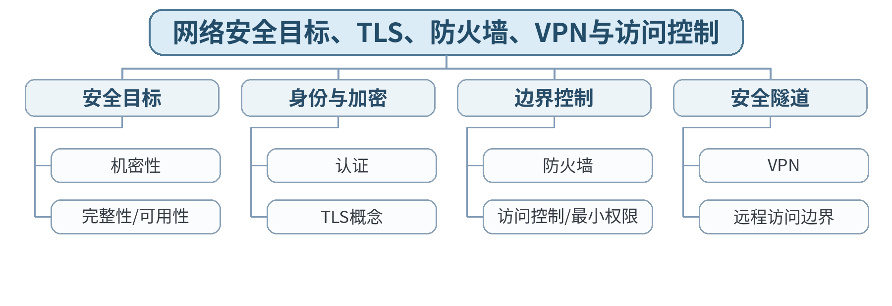

### 教学目标

**知识目标：**
- （1）理解网络安全目标和常见防护机制。
**能力目标：**
- （1）能够为简单网络场景设计访问控制和安全边界。
**价值目标：**
- （1）形成最小权限、合法授权和可恢复意识。

### 课程思政

结合网络空间法治和关键系统安全强调未经授权访问不可接受，安全是工程交付的一部分。

### 专创融合 / 双创融合

把安全控制纳入设备远程运维和边缘服务设计，而不是功能完成后再补。

### 教学重难点

教学重点：网络安全目标、认证/加密、TLS、防火墙、VPN和最小权限。
教学难点：区分加密、认证、访问控制等不同机制，避免认为“上了防火墙就安全”。

### 教学方法

讲授法、问题引导法、协议推演法、案例分析法、教师演示法、分组讨论法、方案评审与证据复盘

### 教学用具

电脑、投影仪、多媒体课件、教材、网络协议结构图、教师提供的抓包/报文字段资料、地址/路由练习表

### 教学设计

课前任务 → 互动导入（15 min）→ 传授新知与课堂训练（70 min）→ 过关检测（10 min）→ 课堂小结（3 min）→ 作业布置（1 min）→ 考勤（1 min）

### 教学过程

#### 课前任务

【教师】发布“网络安全目标、TLS、防火墙、VPN与访问控制”预习材料和一个最小判断问题；要求只使用教材、课程资料或教师提供数据。
【学生】阅读对应内容，记录3个核心术语和至少1个疑问；准备课堂分析表。

**设计意图：** 通过阅读和最小问题建立先备认知，让学生带着可验证问题进入课堂。

#### 互动导入与传授新知 / 课堂训练

【互动导入 15 min】
【教师】给出“通信被窃听、身份被冒充、服务被阻断、普通用户访问管理员接口”四类风险，让学生分别匹配安全目标/控制。
【学生】先独立判断/计算，再交换依据。

【传授新知与课堂训练 70 min】
【教师】解释机密性、完整性、可用性、认证等基本安全目标。
【学生】完成对应分析/推演并记录判断依据。
【教师】概念性介绍TLS、防火墙、VPN和访问控制，强调多层防护。
【学生】完成对应分析/推演并记录判断依据。
【教师】学生完成“威胁—资产—安全目标—控制措施—残余风险”表，不涉及攻击实施。
【学生】完成对应分析/推演并记录判断依据。

【课堂产物】智能制造网络威胁—控制映射表。
【学习证据】风险表 + 最小权限规则 + 残余风险说明。
【评价关联】平时学习与课堂分析；期末综合考查准备；目标1.6、2.6、3.6。

**设计意图：** 采用“先判断/计算 → 最小讲解 → 协议/数据流推演 → 独立分析产出 → 证据复核”的理论课闭环，把抽象网络原理落实到可检查的图表、计算和故障证据。

### 过关检测

【教师】组织当堂检测：
- 1. TLS主要保护什么？
- 2. 防火墙与身份认证解决的是同一问题吗？
- 3. 最小权限原则为什么重要？
【学生】独立作答；【教师】要求说明判断依据。

### 课堂小结

【教师】回到知识脉络图，用“概念—关系—协议行为—工程边界”总结“网络安全目标、TLS、防火墙、VPN与访问控制”。
【学生】写下本课最重要的一条规则和一个最容易误判的边界。

### 作业布置

【教师】布置课后任务：为一个远程维护场景设计最小权限、VPN/认证和日志要求。
【学生】按课程文件命名要求整理分析图、计算/协议表和必要说明。

### 考勤

【教师】利用学校/课程实际使用的平台进行签到。
【学生】按课程要求完成签到。

### 课后教学反思

【课后填写，不预填事实】
- 1. 教学流程：记录100 min各环节实际用时及需调整位置；
- 2. 教学内容：重点记录“区分加密、认证、访问控制等不同机制，避免认为“上了防火墙就安全”。”的真实掌握证据与常见错误；
- 3. 学生参与：仅依据实际课堂记录填写独立分析、讨论、互审情况，不补写推测；
- 4. 评价证据：检查本课分析表/流程图/计算单/方案证据是否完整，记录缺项；
- 5. 后续改进：依据真实课堂证据确定下一轮调整。

### 本章节参考文献

[1] 胡亮, 徐高潮, 张宗升, 霍严梅, 车喜龙. 计算机网络[M]. 北京：高等教育出版社，2024. ISBN 9787040612875
[2] 袁华, 王昊翔, 黄敏. 深入理解计算机网络[M]. 北京：清华大学出版社，2024. ISBN 9787302662709
[3] 冯博琴, 陈妍. 计算机网络（第4版）[M]. 北京：高等教育出版社，2023. ISBN 9787040599909

## 第23次课 SDN、网络虚拟化、云/边缘、IoT与智能制造网络

- **章节/单元**：第6单元 网络管理、安全、新型网络与智能制造应用
- **周次**：按实际课表填写
- **课时安排**：2课时（100 min）

### 知识脉络图

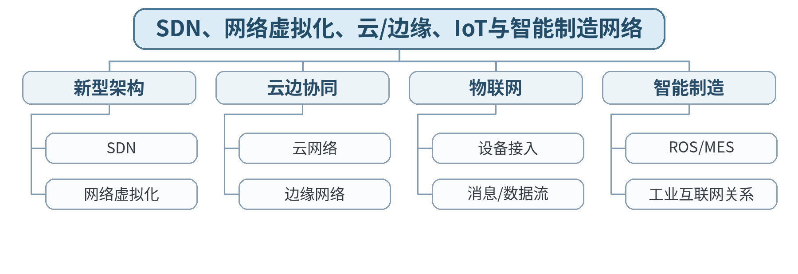

### 教学目标

**知识目标：**
- （1）理解SDN、网络虚拟化、云/边缘和IoT基本概念。
**能力目标：**
- （1）能够把通用网络原理迁移到智能制造系统分析。
**价值目标：**
- （1）形成持续学习、跨专业沟通和边界意识。

### 课程思政

通过自主创新、开源技术和关键基础设施案例培养持续学习与跨专业协作意识。

### 专创融合 / 双创融合

把通用网络原理迁移到ROS、MES、边缘和IoT系统，形成后续装备系统开发的网络基础。

### 教学重难点

教学重点：SDN、云边缘、IoT概念及通用网络原理在智能制造中的迁移。
教学难点：明确本课程讲通用网络原理，不把工业网络专用协议或厂商平台当作主线。

### 教学方法

讲授法、问题引导法、协议推演法、案例分析法、教师演示法、分组讨论法、方案评审与证据复盘

### 教学用具

电脑、投影仪、多媒体课件、教材、网络协议结构图、教师提供的抓包/报文字段资料、地址/路由练习表

### 教学设计

课前任务 → 互动导入（15 min）→ 传授新知与课堂训练（70 min）→ 过关检测（10 min）→ 课堂小结（3 min）→ 作业布置（1 min）→ 考勤（1 min）

### 教学过程

#### 课前任务

【教师】发布“SDN、网络虚拟化、云/边缘、IoT与智能制造网络”预习材料和一个最小判断问题；要求只使用教材、课程资料或教师提供数据。
【学生】阅读对应内容，记录3个核心术语和至少1个疑问；准备课堂分析表。

**设计意图：** 通过阅读和最小问题建立先备认知，让学生带着可验证问题进入课堂。

#### 互动导入与传授新知 / 课堂训练

【互动导入 15 min】
【教师】给出ROS机器人、边缘服务器、MES、云分析四层架构，让学生标出哪些通信仍然需要IP、TCP/UDP、DNS/HTTP等通用网络基础。
【学生】先独立判断/计算，再交换依据。

【传授新知与课堂训练 70 min】
【教师】概览SDN控制/数据平面分离思想和网络虚拟化。
【学生】完成对应分析/推演并记录判断依据。
【教师】说明云网络、边缘网络和IoT中的设备接入、服务发现、消息传递仍建立在通用网络机制上。
【学生】完成对应分析/推演并记录判断依据。
【教师】学生完成“ROS/MES/边缘/云—网络层次—关键协议—性能/安全需求”映射表。
【学生】完成对应分析/推演并记录判断依据。

【课堂产物】智能制造网络技术映射表。
【学习证据】系统图 + 协议映射 + 两项性能/安全约束。
【评价关联】平时学习与课堂分析；期末综合考查准备；目标1.6、2.6、3.6。

**设计意图：** 采用“先判断/计算 → 最小讲解 → 协议/数据流推演 → 独立分析产出 → 证据复核”的理论课闭环，把抽象网络原理落实到可检查的图表、计算和故障证据。

### 过关检测

【教师】组织当堂检测：
- 1. SDN的核心思想是什么？
- 2. 边缘计算为什么仍然需要完整网络设计？
- 3. 本课程与《工业网络技术及应用》的内容边界是什么？
【学生】独立作答；【教师】要求说明判断依据。

### 课堂小结

【教师】回到知识脉络图，用“概念—关系—协议行为—工程边界”总结“SDN、网络虚拟化、云/边缘、IoT与智能制造网络”。
【学生】写下本课最重要的一条规则和一个最容易误判的边界。

### 作业布置

【教师】布置课后任务：选择ROS或MES场景，写出一页通用网络基础需求说明。
【学生】按课程文件命名要求整理分析图、计算/协议表和必要说明。

### 考勤

【教师】利用学校/课程实际使用的平台进行签到。
【学生】按课程要求完成签到。

### 课后教学反思

【课后填写，不预填事实】
- 1. 教学流程：记录100 min各环节实际用时及需调整位置；
- 2. 教学内容：重点记录“明确本课程讲通用网络原理，不把工业网络专用协议或厂商平台当作主线。”的真实掌握证据与常见错误；
- 3. 学生参与：仅依据实际课堂记录填写独立分析、讨论、互审情况，不补写推测；
- 4. 评价证据：检查本课分析表/流程图/计算单/方案证据是否完整，记录缺项；
- 5. 后续改进：依据真实课堂证据确定下一轮调整。

### 本章节参考文献

[1] 胡亮, 徐高潮, 张宗升, 霍严梅, 车喜龙. 计算机网络[M]. 北京：高等教育出版社，2024. ISBN 9787040612875
[2] 袁华, 王昊翔, 黄敏. 深入理解计算机网络[M]. 北京：清华大学出版社，2024. ISBN 9787302662709
[3] 冯博琴, 陈妍. 计算机网络（第4版）[M]. 北京：高等教育出版社，2023. ISBN 9787040599909

## 第24次课 中小型网络设计、分层故障分析与课程综合验收

- **章节/单元**：第6单元 网络管理、安全、新型网络与智能制造应用
- **周次**：按实际课表填写
- **课时安排**：2课时（100 min）

### 知识脉络图

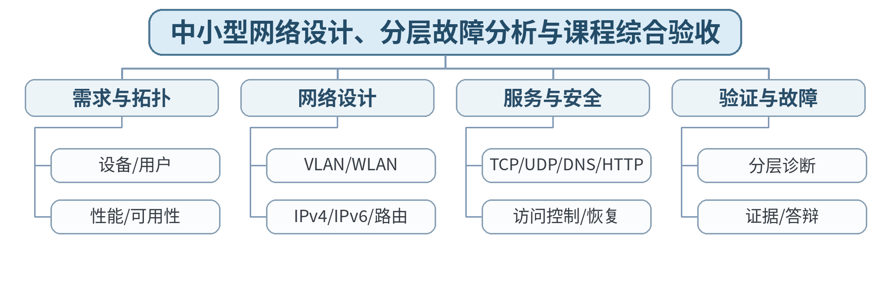

### 教学目标

**知识目标：**
- （1）综合理解网络体系结构、链路/IP/运输/应用、安全和新型网络。
**能力目标：**
- （1）能够形成中小型网络设计、验证和分层故障分析方案。
**价值目标：**
- （1）形成合法授权、最小权限、可恢复、持续学习和跨专业沟通意识。

### 课程思政

以负责任网络工程交付为课程收束：方案必须可验证、风险可说明、工具使用合法、个人贡献可核验。

### 专创融合 / 双创融合

将课程知识整合为可评审的智能制造中小型网络方案，训练从技术分析到工程交付。

### 教学重难点

教学重点：拓扑、地址、路由、服务、安全与验证形成完整网络方案。
教学难点：在有限信息下形成可实施方案，同时清楚标注假设、边界和验证方法。

### 教学方法

讲授法、问题引导法、协议推演法、案例分析法、教师演示法、分组讨论法、方案评审与证据复盘

### 教学用具

电脑、投影仪、多媒体课件、教材、网络协议结构图、教师提供的抓包/报文字段资料、地址/路由练习表

### 教学设计

课前任务 → 互动导入（15 min）→ 传授新知与课堂训练（70 min）→ 过关检测（10 min）→ 课堂小结（3 min）→ 作业布置（1 min）→ 考勤（1 min）

### 教学过程

#### 课前任务

【教师】发布“中小型网络设计、分层故障分析与课程综合验收”预习材料和一个最小判断问题；要求只使用教材、课程资料或教师提供数据。
【学生】阅读对应内容，记录3个核心术语和至少1个疑问；准备课堂分析表。

**设计意图：** 通过阅读和最小问题建立先备认知，让学生带着可验证问题进入课堂。

#### 互动导入与传授新知 / 课堂训练

【互动导入 15 min】
【教师】发布一个“智能制造车间网络”综合案例：办公终端、机器人、工业相机、边缘服务器、MES和远程维护，要求学生先列需求而不是直接画拓扑。
【学生】先独立判断/计算，再交换依据。

【传授新知与课堂训练 70 min】
【教师】从设备/用户、通信关系、规模、带宽、时延、可用性和安全要求形成需求清单。
【学生】完成对应分析/推演并记录判断依据。
【教师】组织局域网/VLAN/WLAN、IP地址/网关/路由、TCP/UDP与DNS/HTTP服务、安全边界和监测恢复设计。
【学生】完成对应分析/推演并记录判断依据。
【教师】学生用给定故障（错误网关/路由、DNS异常、端口关闭等）修改方案并说明验证步骤，模拟期末个人核验答辩。
【学生】完成对应分析/推演并记录判断依据。

【课堂产物】期末综合考查方案草图：需求、拓扑、地址/路由、服务、安全、验证和故障处理。
【学习证据】综合方案草图 + 地址/路由表 + 故障修改记录 + 口头解释提纲。
【评价关联】期末综合考查；目标1.1—1.6、2.1—2.6、3.1—3.6。

**设计意图：** 采用“先判断/计算 → 最小讲解 → 协议/数据流推演 → 独立分析产出 → 证据复核”的理论课闭环，把抽象网络原理落实到可检查的图表、计算和故障证据。

### 过关检测

【教师】组织当堂检测：
- 1. 完整网络方案至少需要哪些类型的交付物？
- 2. 为什么故障分析要从需求和分层证据出发？
- 3. 期末综合考查为什么需要个人核验答辩？
【学生】独立作答；【教师】要求说明判断依据。

### 课堂小结

【教师】回到知识脉络图，用“概念—关系—协议行为—工程边界”总结“中小型网络设计、分层故障分析与课程综合验收”。
【学生】写下本课最重要的一条规则和一个最容易误判的边界。

### 作业布置

【教师】布置课后任务：完成期末综合考查正式任务准备：整理网络设计与故障分析综合报告框架及个人核验要点。
【学生】按课程文件命名要求整理分析图、计算/协议表和必要说明。

### 考勤

【教师】利用学校/课程实际使用的平台进行签到。
【学生】按课程要求完成签到。

### 课后教学反思

【课后填写，不预填事实】
- 1. 教学流程：记录100 min各环节实际用时及需调整位置；
- 2. 教学内容：重点记录“在有限信息下形成可实施方案，同时清楚标注假设、边界和验证方法。”的真实掌握证据与常见错误；
- 3. 学生参与：仅依据实际课堂记录填写独立分析、讨论、互审情况，不补写推测；
- 4. 评价证据：检查本课分析表/流程图/计算单/方案证据是否完整，记录缺项；
- 5. 后续改进：依据真实课堂证据确定下一轮调整。

### 本章节参考文献

[1] 胡亮, 徐高潮, 张宗升, 霍严梅, 车喜龙. 计算机网络[M]. 北京：高等教育出版社，2024. ISBN 9787040612875
[2] 袁华, 王昊翔, 黄敏. 深入理解计算机网络[M]. 北京：清华大学出版社，2024. ISBN 9787302662709
[3] 冯博琴, 陈妍. 计算机网络（第4版）[M]. 北京：高等教育出版社，2023. ISBN 9787040599909
